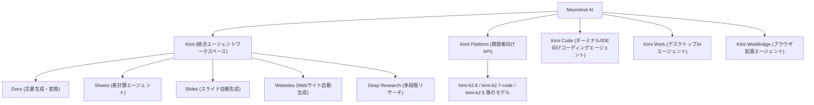
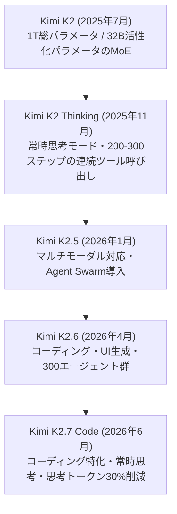
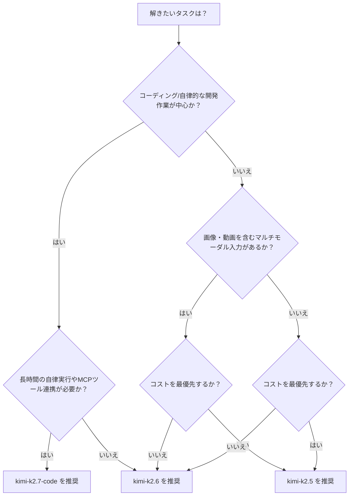
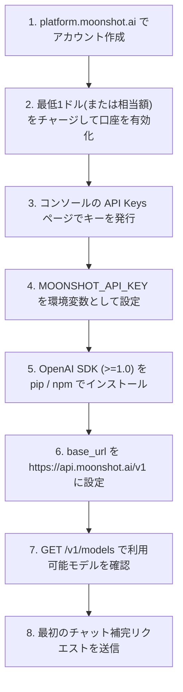
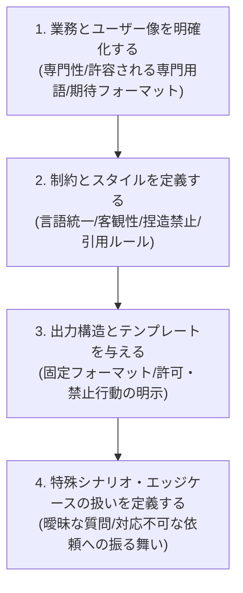
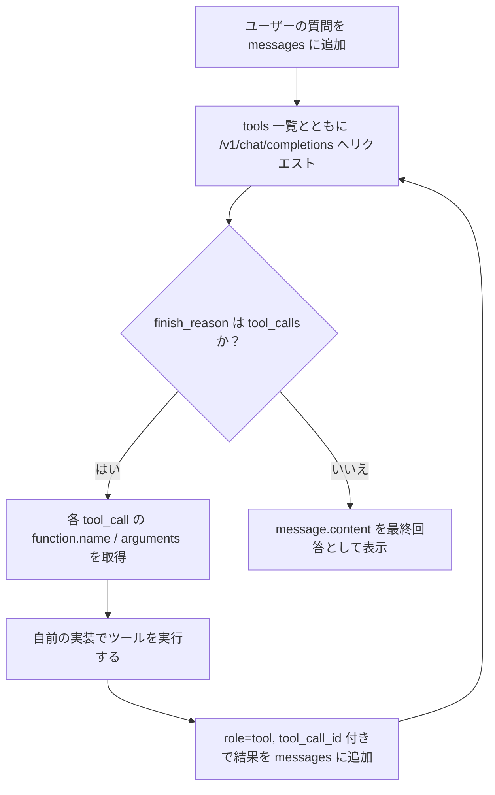
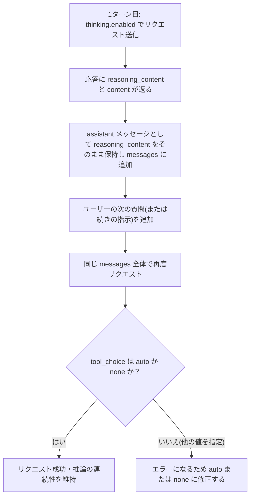
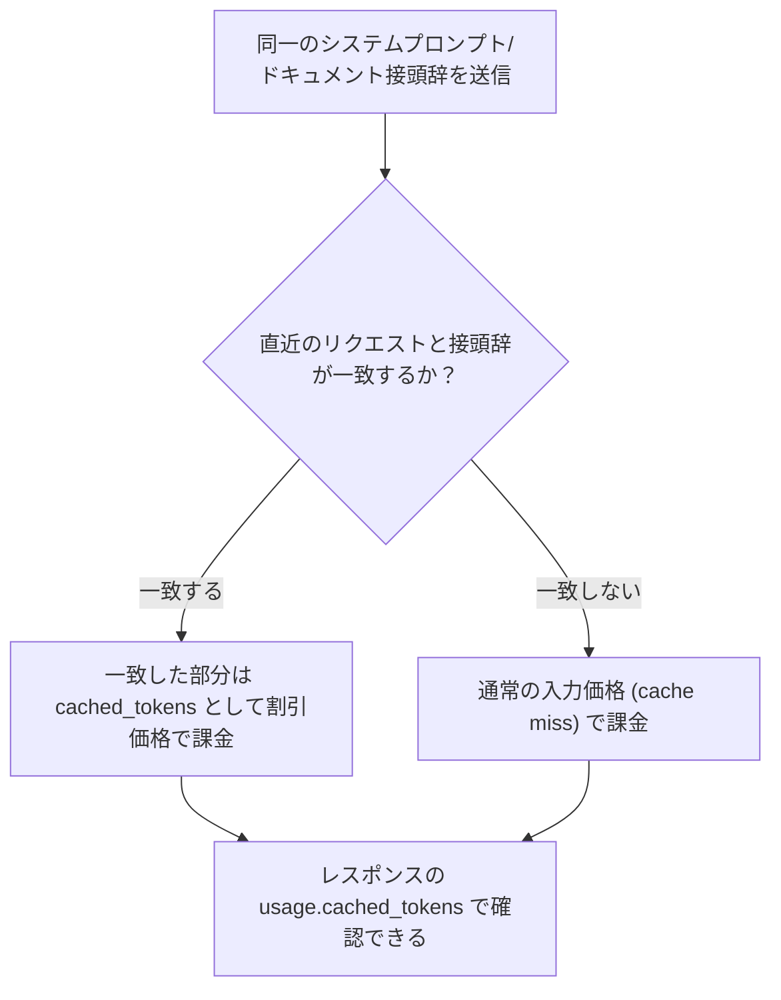
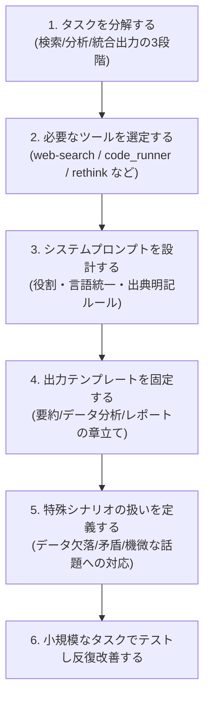

# Kimi(Moonshot AI)LLM 徹底ガイド ― 初学者のためのベストプラクティス

> 本ガイドは 2026年7月16日 時点で参照可能な公式ドキュメント・一次情報をもとに作成しています。Kimiは非常に速いペースでモデルとAPI仕様を更新しているため、本番導入前には必ず [Kimi API Platform公式ドキュメント](https://platform.moonshot.ai/docs/overview) で最新情報を確認してください。

## 目次

1. [はじめに：KimiとMoonshot AIとは](#1-はじめにkimiとmoonshot-aiとは)
2. [Kimiのエコシステム全体像](#2-kimiのエコシステム全体像)
3. [Kimiモデルファミリーを理解する](#3-kimiモデルファミリーを理解する)
4. [開発を始める：ステップバイステップ・セットアップ](#4-開発を始めるステップバイステップセットアップ)
5. [基本パラメータのベストプラクティス](#5-基本パラメータのベストプラクティス)
6. [システムプロンプト設計のベストプラクティス](#6-システムプロンプト設計のベストプラクティス)
7. [Tool Calling(関数呼び出し)のベストプラクティス](#7-tool-calling関数呼び出しのベストプラクティス)
8. [Thinkingモード(推論モデル)を使う際の注意点](#8-thinkingモード推論モデルを使う際の注意点)
9. [Partial Mode(プリフィル)の活用](#9-partial-modeプリフィルの活用)
10. [コンテキストキャッシュとコスト最適化](#10-コンテキストキャッシュとコスト最適化)
11. [マルチモーダル入力(画像・動画)](#11-マルチモーダル入力画像動画)
12. [料金体系を理解する](#12-料金体系を理解する)
13. [レート制限と信頼性](#13-レート制限と信頼性)
14. [実践例：業界リサーチAIエージェントの構築フロー](#14-実践例業界リサーチaiエージェントの構築フロー)
15. [セキュリティと運用のベストプラクティス](#15-セキュリティと運用のベストプラクティス)
16. [よくあるエラーと対処法](#16-よくあるエラーと対処法)
17. [ベストプラクティス・チェックリスト(まとめ)](#17-ベストプラクティスチェックリストまとめ)
18. [参考文献(参照URL一覧)](#18-参考文献参照url一覧)

---

## 1. はじめに：KimiとMoonshot AIとは

**Kimi** は中国のAI企業 **Moonshot AI(月之暗面)** が開発する大規模言語モデル(LLM)シリーズ、およびそれを使った製品群の総称です。2023年10月に一般公開されたチャットボット「Kimi」は、当時としては業界最大級となる12.8万トークンのコンテキスト長をサポートしたことで注目を集めました。その後、モデルは急速に進化し、2025年7月には1兆パラメータのMoE(Mixture-of-Experts)モデル **Kimi K2** をオープンウェイトで公開し、コーディングとエージェント(自律実行)性能で高い評価を得ています。

(出典: [Kimi (chatbot) - Wikipedia](https://en.wikipedia.org/wiki/Kimi_(chatbot)))

初学者がまず押さえておくべきポイントは次の3点です。

- **Kimiは「製品」と「モデル」の2つの顔を持つ**：一般ユーザー向けのチャットアプリ(kimi.com)と、開発者向けのAPIプラットフォーム(platform.moonshot.ai / platform.kimi.ai)は別物です。
- **KimiのAPIはOpenAI互換**です。既存のOpenAI SDKの `base_url` を書き換えるだけで移行できます。
- **オープンウェイト戦略**：Kimi K2系列のモデル重みはHugging Faceで公開されており、Modified MIT Licenseのもとで自己ホスティングも可能です。

(出典: [Quickstart - Kimi API Platform](https://platform.kimi.ai/docs/overview), [GitHub - MoonshotAI/Kimi-K2](https://github.com/moonshotai/kimi-k2))

---

## 2. Kimiのエコシステム全体像

Kimiというブランドの下には、消費者向けアプリからAPIプラットフォーム、開発者ツールまで複数の製品が存在します。まず全体像を図で把握しましょう。



- **Kimi(kimi.com)**：チャット・エージェント・文書生成・表計算・スライド作成などを一つにまとめた統合ワークスペースです。
- **Kimi Platform**：本ガイドの中心となる開発者向けAPIで、`platform.moonshot.ai` と `platform.kimi.ai` の2つのドメインから同じドキュメントにアクセスできます。
- **Kimi Work**：ローカルファイルへのアクセス、ブラウザ自動操作(WebBridge)、Cronベースのスケジュール実行など「24時間稼働するデスクトップの部下」のような製品です。
- **Kimi Docs**：Word/PDFの生成・変換・レビューに特化したドキュメントエージェントで、LaTeX数式や学術引用形式、10,000語超の長文書生成にも対応します。

(出典: [Kimi Work: Next-Gen Desktop AI Agent](https://www.kimi.com/products/kimi-work), [AI Document Agent | Kimi Docs](https://www.kimi.com/features/docs))

> **初学者向けポイント**：「Kimiでチャットができるから、APIも同じ挙動になるはず」と思い込まないことが大切です。Web版のKimiは裏側で複数のツールやエージェントを自動的に組み合わせていますが、API単体を呼び出す場合は、ツール定義・システムプロンプト・エージェントループなどを自分で設計する必要があります。

---

## 3. Kimiモデルファミリーを理解する

### 3.1 モデルの進化タイムライン



(出典: [Kimi (chatbot) - Wikipedia](https://en.wikipedia.org/wiki/Kimi_(chatbot)), [GitHub - MoonshotAI/Kimi-K2.5](https://github.com/MoonshotAI/Kimi-K2.5), [Kimi K2.7 Code: The Complete Guide](https://codersera.com/blog/kimi-k2-7-complete-guide-2026/))

### 3.2 主要モデル比較表

| モデルID | 位置づけ | パラメータ規模 | コンテキスト長 | 思考モード | 主な用途 |
|---|---|---|---|---|---|
| `kimi-k2` (legacy) | 汎用チャット・エージェント(非思考) | 1T総 / 32B活性化 | 128K〜256K | オプション | 汎用対話・コーディング(現在はEOL間近) |
| `kimi-k2-thinking` (legacy) | 推論特化 | 1T総 / 32B活性化・INT4量子化 | 256K | 常時ON | 長時間・多段階の自律リサーチ |
| `kimi-k2.5` | マルチモーダル汎用 | 1T総 / 32B活性化 | 256K(262,144) | 選択可 | コスト重視の汎用・視覚理解・Agent Swarm |
| `kimi-k2.6` | フラッグシップ汎用 | 1T総 / 32B活性化・384エキスパート | 256K(262,144) | 選択可 | 長時間コーディング・UI生成・マルチエージェント |
| `kimi-k2.7-code` | コーディング特化最新版 | 1T総 / 32B活性化・384エキスパート | 256K(262,144) | 常時ON | 長時間の自律的ソフトウェア開発・MCPツール利用 |
| `kimi-k2.7-code-highspeed` | 上記の高速版 | 同上(同一重み) | 256K | 常時ON | レイテンシ最優先のコーディングエージェント |

(出典: [Best Kimi Models in 2026 — Moonshot AI's Ultra-Long Context Play](https://www.remoteopenclaw.com/blog/best-kimi-models-2026), [Kimi K2.7 Code (Moonshot AI) - Cloudflare Workers AI docs](https://developers.cloudflare.com/workers-ai/models/kimi-k2.7-code/), [Kimi K2.6 & Kimi Code Review - Medium](https://medium.com/@tentenco/kimi-k2-6-kimi-code-review-saving-88-coding-costs-b7e8c5eaf5f1))

> **注意**：`kimi-k2-0711-preview`、`kimi-k2-0905-preview`、`kimi-k2-turbo-preview`、`kimi-k2-thinking`、`kimi-k2-thinking-turbo` などの旧世代モデルは、2026年5月25日にEOL(提供終了)が予告されており、本ガイド執筆時点(2026年7月)ではすでに移行期限を過ぎています。新規開発では `kimi-k2.5` / `kimi-k2.6` / `kimi-k2.7-code` の利用を前提にしてください。

(出典: [Kimi API Pricing Calculator & Cost Guide](https://costgoat.com/pricing/kimi-api))

### 3.3 アーキテクチャの基礎知識(MoE)

Kimi K2系列はすべて **Mixture-of-Experts(MoE)** アーキテクチャを採用しています。初学者向けに簡単に言うと、「1兆パラメータぶんの知識を持つ巨大な専門家集団の中から、1回の推論ごとに約320億パラメータ相当の専門家だけを選んで働かせる」仕組みです。これにより、モデル全体の能力(1Tパラメータ相当)を保ちながら、実際の計算コストは32B級モデルに近い水準に抑えられています。

- 総パラメータ：約1兆(1T)、活性化パラメータ：約320億(32B)
- 384エキスパート(K2.6/K2.7 Codeでは8ルーティング+1共有エキスパート構成)
- Multi-head Latent Attention(MLA)によるKVキャッシュ圧縮
- MuonClipオプティマイザによる大規模学習時の安定化(15.5兆トークンで事前学習)
- ネイティブINT4量子化(K2 Thinking以降)により、推論速度とGPUメモリ効率が向上

(出典: [GitHub - MoonshotAI/Kimi-K2](https://github.com/moonshotai/kimi-k2), [moonshotai/Kimi-K2-Thinking - Hugging Face](https://huggingface.co/moonshotai/Kimi-K2-Thinking), [Kimi K2.6 & Kimi Code Review - Medium](https://medium.com/@tentenco/kimi-k2-6-kimi-code-review-saving-88-coding-costs-b7e8c5eaf5f1))

### 3.4 モデル選定フローチャート

初学者が最初に迷うのが「どのモデルを使えばいいか」です。以下のフローを目安にしてください。



(出典: [Kimi API Pricing Calculator & Cost Guide](https://costgoat.com/pricing/kimi-api), [Kimi K2.7 Code: The Complete Guide](https://codersera.com/blog/kimi-k2-7-complete-guide-2026/))

---

## 4. 開発を始める：ステップバイステップ・セットアップ



(出典: [Quickstart - Kimi API Platform](https://platform.kimi.ai/docs/overview), [Kimi K2: A Guide With 6 Practical Examples | DataCamp](https://www.datacamp.com/tutorial/kimi-k2))

### 4.1 Python環境のセットアップ

```bash
pip3 install --upgrade 'openai>=1.0'
python3 -c 'import openai; print("version =", openai.__version__)'

export MOONSHOT_BASE_URL="https://api.moonshot.ai/v1"
export MOONSHOT_API_KEY="sk-xxxxxxxxxxxxxxxxxxxxxxxx"
```

(出典: [Use Kimi K2.6 Model to Setup Agent - Kimi API Platform](https://platform.kimi.ai/docs/guide/use-kimi-k2-to-setup-agent))

### 4.2 最初の呼び出し(Python / OpenAI SDK互換)

```python
import os
from openai import OpenAI

client = OpenAI(
    api_key=os.environ["MOONSHOT_API_KEY"],
    base_url="https://api.moonshot.ai/v1",
)

completion = client.chat.completions.create(
    model="kimi-k2.6",
    messages=[
        {
            "role": "system",
            "content": (
                "You are Kimi, an AI assistant provided by Moonshot AI. "
                "You are especially good at conversations in Chinese and English. "
                "You provide users with safe, helpful, and accurate answers."
            ),
        },
        {"role": "user", "content": "自己紹介を簡潔にしてください。"},
    ],
    max_tokens=256,
)

print(completion.choices[0].message.content)
```

(出典: [Quickstart - Kimi API Platform](https://platform.kimi.ai/docs/overview), [moonshotai/Kimi-K2-Instruct - Hugging Face](https://huggingface.co/moonshotai/Kimi-K2-Instruct))

> **重要**：国際向けエンドポイントは `api.moonshot.ai/v1`、中国本土向けは `api.moonshot.cn/v1` です。ドキュメントも `platform.moonshot.ai` と `platform.kimi.ai` の2ドメインで公開されているため、リンク切れに見えても慌てず両方を確認してください。

(出典: [Kimi API: Kimi K2 API vs Kimi K2.5 API](https://kimik2ai.com/api/))

---

## 5. 基本パラメータのベストプラクティス

### 5.1 推奨temperature早見表

| モデル | 推奨temperature | 備考 |
|---|---|---|
| `kimi-k2` (Instruct, legacy) | 0.6 | 特別な指示がなければこの値がデフォルトの良い出発点 |
| `kimi-k2-thinking` (legacy) | 1.0 | 思考連鎖の多様性を確保するため高め |
| `kimi-k2.5` | 用途に応じて調整可 | Instant/Thinkingモードで挙動が変わるため要検証 |
| `kimi-k2.6` / `kimi-k2.7-code` | Thinking有効時: 1.0 / 無効時: 0.6 | Thinkingは無効化可能。モードごとにtemperatureは固定（変更不可）される |
| Anthropic互換API経由 | `real_temperature = request_temperature * 0.6` | 既存Anthropicアプリとの互換性のための独自マッピング |

(出典: [GitHub - MoonshotAI/Kimi-K2](https://github.com/moonshotai/kimi-k2), [moonshotai/Kimi-K2-Thinking - Hugging Face](https://huggingface.co/moonshotai/Kimi-K2-Thinking), [Kimi K2.7 Code API: Pricing, Playground & Docs](https://empiriolabs.ai/models/kimi-k2-7-code))

### 5.2 max_tokens / max_completion_tokens

- `max_completion_tokens`(または`max_tokens`)は「返答として期待する長さ」であり、入力+出力の合計長ではありません。入力と出力の合計がモデルのコンテキスト長を超えると `invalid_request_error` が返されます。
- 応答が途中で切れた場合、`finish_reason` は `"length"` になります。この場合は [9. Partial Mode](#9-partial-modeプリフィルの活用) を使って続きを生成させます。
- ベンチマークなど再現性が重要な用途では、公式ガイドが用途別の目安値を示しています。推論系ベンチマークは128k、コーディング系は256k、複数ホップの検索を伴うエージェントタスクは256k+コンテキスト管理、それ以外は16k〜64k程度が目安です。

(出典: [Create Chat Completion - Kimi API Platform](https://platform.kimi.ai/docs/api/chat), [Best Practices for Benchmarking - Moonshot AI Open Platform](https://platform.moonshot.ai/docs/guide/benchmark-best-practice))

### 5.3 stream=True を基本にする

長い出力は生成に数分かかることがあり、アイドル状態のTCP接続はファイアウォールやロードバランサ、NATゲートウェイによって切断される場合があります。ストリーミングを有効にすると接続が生かされ続け、信頼性が大きく向上します。`stream=false` の場合、`api.moonshot.ai` 側のタイムアウトは2時間に設定されていますが、経由するISP側で早めに切断されることもある点に注意してください。

(出典: [Best Practices for Benchmarking - Moonshot AI Open Platform](https://platform.moonshot.ai/docs/guide/benchmark-best-practice))

---

## 6. システムプロンプト設計のベストプラクティス

システムプロンプトは、モデルが応答を生成する前に受け取る「初期指示」であり、出力の形式・内容・スタイルを決定づける最も重要な準備工程です。公式ドキュメントの核心的な考え方は「モデルはあなたの心を読めない」という一文に集約されます。指示が曖昧であるほどモデルは推測に頼らざるを得ず、期待した出力から外れやすくなります。

(出典: [Best Practices for Prompts - Kimi API Platform](https://platform.kimi.ai/docs/guide/prompt-best-practice))

### 6.1 デフォルトのシステムプロンプト

特別な指示が不要な場合、公式が推奨する安全性重視のシステムプロンプトは次の通りです。

```text
You are Kimi, an artificial intelligence assistant provided by Moonshot AI.
You are more proficient in Chinese and English conversations. You provide
users with safe, helpful, and accurate answers. At the same time, you will
refuse to answer any questions involving terrorism, racism, or explicit
violence. Moonshot AI is a proper noun and should not be translated into
other languages.
```

より簡潔な `"You are Kimi, an AI assistant created by Moonshot AI."` でも多くの場面で十分に機能しますが、API経由で本番運用する場合は安全性の観点から公式の長い版が推奨されています。

(出典: [Best Practices for Prompts - Kimi API Platform](https://platform.kimi.ai/docs/guide/prompt-best-practice), [moonshotai/Kimi-K2-Instruct · Correct system prompt? - Hugging Face](https://huggingface.co/moonshotai/Kimi-K2-Instruct/discussions/28))

### 6.2 明確さの原則(4つのチェック)

1. **役割を与える**：`messages` の `system` フィールドで、モデルに期待する役割・専門性を明示する。
2. **区切り文字を使う**：三重引用符・XMLタグ・見出しなどで、処理内容が異なるテキスト部分を分離する。
3. **少数の具体例(few-shot)を示す**：あらゆる場合分けを網羅するより、一般的な指針の例を示す方が効率的。
4. **出力の長さ・形式を指定する**：単語数指定は精度が低いため、段落数・箇条書き数での指定を優先する。

```json
{
  "messages": [
    {
      "role": "system",
      "content": "あなたは2つの同じジャンルの記事を受け取ります。<article>タグで区切られています。まず各記事の論点を要約し、次にどちらがより説得力があるかを理由とともに述べてください。"
    },
    {
      "role": "user",
      "content": "<article>ここに記事1</article><article>ここに記事2</article>"
    }
  ]
}
```

(出典: [Best Practices for Prompts - Kimi API Platform](https://platform.kimi.ai/docs/guide/prompt-best-practice))

### 6.3 実務レベルのシステムプロンプト設計プロセス

Moonshot公式の「業界リサーチAIエージェント」構築ガイドでは、システムプロンプトの作成手順を次の4段階に整理しています。



このガイドで公開されている実例では、「言語統一(質問と同じ言語で回答する)」「グラフの配色を優先順位付きで固定する」「データ出典を必ず明記し、確定情報と推定情報を区別する」「複数ソースでのクロスチェックを義務付ける」といった具体的なルールを、そのままコピーして使えるテンプレートとして提供しています。

(出典: [Use Kimi K2.6 Model to Setup Agent - Kimi API Platform](https://platform.kimi.ai/docs/guide/use-kimi-k2-to-setup-agent))

### 6.4 ツール利用時はシステムプロンプトで指図しすぎない

`tools` パラメータで公式ツール(後述)を渡した場合、Kimiは自律的に「使うべきか・いつ使うか」を判断します。システムプロンプト側でツールの使い方を細かく指定すると、かえってこの自律的な意思決定を妨げる可能性があるため、**ツールの使用方法そのものはシステムプロンプトに書かない**というのが公式の推奨です。

(出典: [Use Kimi K2.6 Model to Setup Agent - Kimi API Platform](https://platform.kimi.ai/docs/guide/use-kimi-k2-to-setup-agent))

---

## 7. Tool Calling(関数呼び出し)のベストプラクティス

Kimi K2系列は強力なツール呼び出し能力を持っています。会話(「話す」能力)に加えて、ツール呼び出しによって検索・データベース照会・コード実行などの「行動する」能力を獲得します。

(出典: [Use Kimi K2.6 Model to Setup Agent - Kimi API Platform](https://platform.kimi.ai/docs/guide/use-kimi-k2-to-setup-agent))

### 7.1 基本のツール呼び出しループ



```python
import json

tools = [{
    "type": "function",
    "function": {
        "name": "get_weather",
        "description": "Call this when the user asks about the weather.",
        "parameters": {
            "type": "object",
            "required": ["city"],
            "properties": {
                "city": {"type": "string", "description": "Name of the city"}
            },
        },
    },
}]

def get_weather(city: str) -> dict:
    return {"weather": "Sunny"}

tool_map = {"get_weather": get_weather}

messages = [
    {"role": "system", "content": "You are Kimi, an AI assistant created by Moonshot AI."},
    {"role": "user", "content": "北京の今日の天気を教えて。ツールを使って確認して。"},
]

finish_reason = None
while finish_reason is None or finish_reason == "tool_calls":
    completion = client.chat.completions.create(
        model="kimi-k2.6",
        messages=messages,
        tools=tools,
        tool_choice="auto",
    )
    choice = completion.choices[0]
    finish_reason = choice.finish_reason
    if finish_reason == "tool_calls":
        messages.append(choice.message)
        for call in choice.message.tool_calls:
            result = tool_map[call.function.name](**json.loads(call.function.arguments))
            messages.append({
                "role": "tool",
                "tool_call_id": call.id,
                "content": json.dumps(result),
            })

# 最終的な回答を表示
print(choice.message.content)
```

(出典: [GitHub - MoonshotAI/Kimi-K2](https://github.com/moonshotai/kimi-k2), [moonshotai/Kimi-K2-Instruct - Hugging Face](https://huggingface.co/moonshotai/Kimi-K2-Instruct))

### 7.2 公式ツール一覧

Kimi K2.6以降では、以下の公式ツールがプラットフォーム側で提供されており、`tools` に登録するだけで自由に組み合わせられます。

| ツール名 | 説明 |
|---|---|
| `web-search` | リアルタイム情報・インターネット検索(呼び出し課金あり) |
| `rethink` | インテリジェント推論ツール |
| `random-choice` | ランダム選択ツール |
| `memory` | 会話履歴・ユーザー嗜好の永続的な記憶ストレージ |
| `excel` | Excel/CSVファイル解析ツール |
| `code_runner` | Pythonコード実行ツール |
| `quickjs` | 安全なJavaScript実行エンジン |
| `date` | 日付・時刻処理ツール |
| `fetch` | URLコンテンツ抽出・Markdown整形ツール |
| `convert` | 長さ・質量・体積・温度・通貨などの単位変換ツール |
| `base64` | base64エンコード/デコードツール |

(出典: [Use Kimi K2.6 Model to Setup Agent - Kimi API Platform](https://platform.kimi.ai/docs/guide/use-kimi-k2-to-setup-agent))

### 7.3 ベストプラクティスまとめ(実運用)

- ツールは**単機能・小さく**設計する(検索・取得・更新など役割を分離)。
- ツールの出力フォーマットは**一貫したJSON**にする。
- ツール実行には**タイムアウトとリトライ**を必ず設定する。
- すべてのツール呼び出しを**ログに記録**し、デバッグと監査に備える。
- モデルが「習慣的に」ツールを呼びすぎないよう、プランナー的な指示を加えて必要なときだけ呼び出させる。
- `tool_choice` は基本的に `"auto"` を使い、純粋なテキスト生成のみが目的の場合に限り `"none"` を使う。

(出典: [Kimi API (Moonshot AI) - Complete Developer Guide](https://agentsapis.com/kimi-api/))

---

## 8. Thinkingモード(推論モデル)を使う際の注意点

`kimi-k2.7-code` や `kimi-k2.6`(思考有効時)のような「思考モデル」では、応答の中に最終回答(`content`)とは別に、モデルの推論過程を保持する **`reasoning_content`** フィールドが返されます。この節のルールを守らないと、マルチターンやツール呼び出しを伴う長時間タスクでエラーになったり、精度が大きく低下したりします。



### 8.1 reasoning_contentの取り扱いと保存ルール

複数ターンのツール呼び出し（Tool Calling）を行う場合、中間のアシスタントメッセージやツール応答を履歴に含めることは必須ですが、会話の次のターンに過去の `reasoning_content` を履歴に含めて送信（保存）するかどうかは、設定によって異なります。

過去の `reasoning_content` を履歴に含めて送信することが必須となるのは、APIリクエストの `extra_body` 内で `thinking.keep` が `"all"`（または `"last"`）に設定されている場合のみです。デフォルトの `"none"` など、それ以外の設定では過去の `reasoning_content` を送信する必要はありません。なお、履歴に含めて送信した `reasoning_content` はトークン課金（入力トークン）の対象になります。

```python
stream = client.chat.completions.create(
    model="kimi-k2.7-code",
    messages=[
        {"role": "system", "content": "You are Kimi."},
        {"role": "user", "content": "First question..."},
        {
            "role": "assistant",
            "reasoning_content": "<前回のAPI応答で返された reasoning_content>",
            "content": "<前回のAPI応答で返された最終回答>",
        },
        {"role": "user", "content": "続きの分析をお願いします。"},
    ],
    extra_body={"thinking": {"type": "enabled", "keep": "all"}},
)
```

(出典: [Set Parameters for Thinking Mode - Kimi API Platform](https://platform.kimi.ai/docs/guide/use-kimi-k2-thinking-model), [Best Practices for Benchmarking - Moonshot AI Open Platform](https://platform.moonshot.ai/docs/guide/benchmark-best-practice))

### 8.2 tool_choiceの制約

`thinking` パラメータが `{"type": "enabled"}` の場合、`tool_choice` は `"auto"` または `"none"`(デフォルトは`"auto"`)しか指定できません。それ以外の値を指定すると、推論内容と強制されたツール選択が競合するためエラーになります。

(出典: [Best Practices for Benchmarking - Moonshot AI Open Platform](https://platform.moonshot.ai/docs/guide/benchmark-best-practice))

### 8.3 その他の実務ポイント

- OpenAI SDKの型定義には `reasoning_content` 属性が直接提供されていないため、`hasattr(obj, "reasoning_content")` で存在確認してから `getattr` で値を取得する必要があります。
- ストリーミング時は必ず `reasoning_content` が `content` より先に出力されるため、`content` が出力され始めた時点を「推論終了」の合図として使えます。
- `kimi-k2.5` の組み込み `$web_search` ツールは、思考モードと一時的に非互換なため、必要であれば思考モードを無効化してから使用してください。
- `kimi-k2.7-code` は常時思考モードが強制されており、`temperature` などのサンプリングパラメータは指定しても無視されます。

(出典: [Set Parameters for Thinking Mode - Kimi API Platform](https://platform.kimi.ai/docs/guide/use-kimi-k2-thinking-model), [Best Practices for Benchmarking - Moonshot AI Open Platform](https://platform.moonshot.ai/docs/guide/benchmark-best-practice), [Kimi K2.7 Code API: Pricing, Playground & Docs](https://empiriolabs.ai/models/kimi-k2-7-code))

---

## 9. Partial Mode(プリフィル)の活用

Partial Mode(プリフィル)は、応答の一部をあらかじめ与えて、モデルにその続きを生成させる機能です。出力フォーマットの固定、ロールプレイの一貫性維持、切り詰められた出力の継続などに使えます。

有効化するには、`messages` の末尾に `role: "assistant"` のメッセージを追加し、`"partial": true` を設定します。

```python
completion = client.chat.completions.create(
    model="kimi-k2.6",
    messages=[
        {"role": "user", "content": "クイックソートをPythonで実装して。"},
        {"role": "assistant", "content": "```python\n", "partial": True},
    ],
)
```

この例では、モデルは説明文から書き始めるのではなく、` ```python\n ` の続きからコードを生成します。応答には先頭に与えたプレフィックス自体は含まれないため、呼び出し側で手動で連結する必要があります。

### 9.1 主な利用シーン

- JSONなど特定フォーマットで開始させる(例：`{` から始める)
- ロールプレイでキャラクター名の一貫性を保つ(`name` フィールドと組み合わせる)
- `finish_reason == "length"` で応答が切れた際に、同じプレフィックスを使って続きを生成する

```python
completion = client.chat.completions.create(
    model="kimi-k2.5",
    messages=[
        {"role": "system", "content": "製品説明から名称・サイズ・価格・色を抽出し、1つのJSONオブジェクトで出力してください。"},
        {"role": "user", "content": "スマートホームMiniは..."},
        {"role": "assistant", "content": "{", "partial": True},
    ],
)
print("{" + completion.choices[0].message.content)
```

> **注意**：Partial Modeと `response_format=json_object` は併用しないでください。予期しない応答になる可能性があります。また、思考モデルで途中から継続する場合は、前回の `reasoning_content` も一緒に渡す必要があります。

(出典: [Partial Mode - Kimi API Platform](https://platform.kimi.ai/docs/api/partial), [Use Partial Mode with Kimi API](https://platform.moonshot.ai/docs/guide/use-partial-mode-feature-of-kimi-api))

---

## 10. コンテキストキャッシュとコスト最適化

Kimiの **自動コンテキストキャッシュ** は、直近のリクエストと共通する接頭辞(システムプロンプトや参照ドキュメントなど)を検出し、その部分を通常より大幅に安い「キャッシュヒット料金」で課金する仕組みです。特別な設定は不要で、同じ内容を繰り返し送るだけで自動的に適用されます。



- キャッシュヒット時の入力コストは、モデルによって通常価格の80〜85%程度の割引になります(詳細は次章の料金表を参照)。
- `prompt_cache_key` フィールドを使うと、セッションIDやタスクIDを指定してキャッシュヒット率を最適化できます。特にコーディングエージェントやマルチターンのエージェント処理で有効です。
- コンテキストキャッシュは「Kimiがユーザーを記憶する仕組み」ではなく、**あくまで似た/繰り返しのプロンプトに対するAPI最適化**である点を混同しないようにしましょう。

### 10.1 長いコンテキストを使いこなすコツ

- 巨大なドキュメントをそのまま毎回送るのではなく、関連する章・セクションだけを抽出して渡す(RAG的アプローチ)。
- 出力に必要なトークン数(引用・要約・結論など)をあらかじめ見積もり、`max_completion_tokens` に余裕を持たせる。
- 会話が長くなったら、古いターンを要約してから渡す。すべての生の会話履歴を毎回送り続けない。
- 「とりあえず全部詰め込む(コンテキストの詰め込みすぎ)」は、無関係な情報がノイズとなり回答品質を下げるため避ける。

(出典: [How Kimi AI Manages Context Windows](https://kimi-ai.chat/guide/manages-context-windows/), [Kimi API Pricing Calculator & Cost Guide](https://costgoat.com/pricing/kimi-api))

---

## 11. マルチモーダル入力(画像・動画)

`kimi-k2.5` 以降は、テキストに加えて画像・動画をネイティブに理解できるマルチモーダルモデルです。`kimi-k2.7-code` も画像・動画入力に対応しています。スクリーンショットの解析、UIモックからのコード生成、グラフや化学構造式の読み取りなど幅広い用途に使えます。

```python
messages = [
    {
        "role": "user",
        "content": [
            {"type": "text", "text": "この画面キャプチャで何が起きているか説明して"},
            {"type": "image_url", "image_url": {"url": "https://example.com/screenshot.png"}},
        ],
    }
]
```

- 画像・動画トークンも、テキストと同じ1Mトークンあたりの料金体系でカウントされます。
- 大きな画像を本番投入する前に、トークン見積もりAPIでコストを事前に把握しておくと安心です。
- 「この画像について説明して」のような曖昧な指示ではなく、「何を・どのフォーマットで知りたいか」を具体的に書くと精度が上がります。

(出典: [Kimi API Overview: Scale With 256K Context Language Models](https://kimi-app.com/api/), [Kimi API (Moonshot AI) - Complete Developer Guide](https://agentsapis.com/kimi-api/))

---

## 12. 料金体系を理解する

料金は変更されやすいため、契約・予算設計の前に必ず [Kimi API Platformの料金ページ](https://platform.kimi.ai/docs/pricing/chat) で最新の値を確認してください。以下は2026年7月時点で複数の一次情報が一致して報告している目安です(単位：USD / 100万トークン)。

| モデル | 入力(キャッシュミス) | 入力(キャッシュヒット) | 出力 | コンテキスト長 |
|---|---|---|---|---|
| `kimi-k2.5` | $0.60 | $0.10 | $3.00 | 256K |
| `kimi-k2.6` | $0.95 | $0.16 | $4.00 | 256K |
| `kimi-k2.7-code` | $0.95 | $0.19 | $4.00 | 256K |
| `kimi-k2.7-code-highspeed` | $1.90 | $0.38 | $8.00 | 256K |
| 旧世代K2ファミリー(EOL) | $0.60 | $0.15 | $2.50 | 128K〜256K |

(出典: [Kimi API Pricing Calculator & Cost Guide](https://costgoat.com/pricing/kimi-api), [Kimi K2.7 Code Pricing: $0.95/$4 per Million Tokens | TokenCost](https://tokencost.app/blog/kimi-k2-7-code-pricing), [Kimi API Pricing: Full Breakdown of Costs](https://developer.puter.com/tutorials/kimi-api-pricing/))

### 12.1 その他の課金要素

| 項目 | 目安 | 備考 |
|---|---|---|
| Batch API | リアルタイム料金の約60%(≒40%割引) | 即時応答が不要な非同期処理向け |
| `$web_search` 組み込みツール | 1呼び出しあたり数ミリドル程度(要最新確認) | 呼び出しごとの固定費+検索結果分のトークン課金 |
| Kimiメンバーシップ(コンシューマー向け) | 月額プランは別課金体系 | API利用とは完全に別の請求(混同しないこと) |

(出典: [Kimi K2 API Pricing 2026: K2.7, Batch and WebSearch Costs - CometAPI](https://www.cometapi.com/kimi-k2-api-pricing/), [Kimi AI Pricing 2026: Plans, Membership Cost & API Token Rates](https://kimik2ai.com/pricing/))

### 12.2 コスト削減の実務チェックリスト

- モデルは「最新=最適」ではなく、タスクに応じて `k2.5`(コスト重視)/`k2.6`(汎用)/`k2.7-code`(コーディング特化)を使い分ける。
- システムプロンプトや検索結果など、繰り返し送る接頭辞を一定に保ちキャッシュヒット率を高める。
- 出力コストは入力の約4倍になることが多いため、`max_completion_tokens` を適切に絞り、不要な思考トークンを発生させない設計にする。
- 即時性が不要なバッチ処理はBatch APIに回す。
- `$web_search` は本当に最新情報が必要なときだけ有効化する(結果は次ターンの入力トークンとしても課金される)。

(出典: [Kimi API Pricing: Full Breakdown of Costs](https://developer.puter.com/tutorials/kimi-api-pricing/))

---

## 13. レート制限と信頼性

Kimi APIのレート制限は、固定のプラン(Free/Pro/Enterpriseなど)ではなく、**アカウントへの累計チャージ額に応じたティア制**で決まります。以下は複数の非公式ガイドが報告している目安値です(必ず自分のコンソールの制限ページで確認してください)。

| ティア(累計チャージ額の目安) | 同時実行数 | RPM(1分あたりリクエスト数) |
|---|---|---|
| Tier 0(¥0) | 1 | 3 |
| Tier 1(約$10) | 50 | 200 |
| 上位ティア(約$100) | 200 | 5,000 |
| 最上位ティア(約$3,000) | 1,000 | 10,000 |

(出典: [Kimi API Pricing Calculator & Cost Guide](https://costgoat.com/pricing/kimi-api), [Kimi K2.5 API: Complete Developer Guide](https://kimi-k25.com/blog/kimi-k2-5-api))

### 13.1 信頼性を高める実装のコツ

- `stream=True` を基本にし、長時間リクエストの接続断を防ぐ。
- 429(レート制限超過)エラーに対して、指数バックオフ付きのリトライを実装する。
- サードパーティ経由でKimiモデルを利用する場合は、公式が提供する **Kimi Vendor Verifier(KVV)** を参考に、精度の高いホスティング先を選定する。
- モデルIDをハードコードせず、`GET /v1/models` で利用可能なモデル一覧を都度(またはキャッシュして定期的に)取得する運用にする。

(出典: [Best Practices for Benchmarking - Moonshot AI Open Platform](https://platform.moonshot.ai/docs/guide/benchmark-best-practice), [Kimi API (Moonshot AI) - Complete Developer Guide](https://agentsapis.com/kimi-api/))

---

## 14. 実践例：業界リサーチAIエージェントの構築フロー

ここでは公式ガイドで紹介されている「業界情報を検索・分析・レポート化するエージェント」の構築手順を、初学者向けに整理します。



このワークフローの要点は次の通りです。

1. **タスク分解**：検索(企業情報・最新データ・ニュース収集)→分析(大量情報のフィルタリング・分類)→統合出力(csv/png/pdf生成、グラフ作成)という3段階に分ける。
2. **ツール選定**：`web-search`(検索)・`code_runner`(グラフ描画やPDF生成)・`rethink`(情報の統合・分析)のように役割ごとにツールを割り当てる。
3. **システムプロンプト設計**：言語統一、配色などのビジュアル規約、データ出典の明記義務、確定情報/推定情報の区別、複数ソースでのクロスチェックといった具体的なルールをテンプレート化する。
4. **特殊シナリオ対応**：「データが見つからない場合は検索範囲を明記した上でその旨を述べる」「情報源が矛盾する場合は両論を併記し理由を推測する」「機微な話題では主観を避け客観的なデータに徹する」など、あらかじめ振る舞いを定義しておく。

(出典: [Use Kimi K2.6 Model to Setup Agent - Kimi API Platform](https://platform.kimi.ai/docs/guide/use-kimi-k2-to-setup-agent))

---

## 15. セキュリティと運用のベストプラクティス

- **APIキーはサーバーサイドの秘密情報として扱う**：クライアントサイドのコード、公開リポジトリ、ログに絶対に含めない。環境変数で管理する。
- **ブラウザから直接APIを呼び出さない**：APIキーの露出を避けるため、必ずバックエンド経由で呼び出す。
- **入力内容・出力結果はKimiモデルの学習に使われない**とAPIセキュリティガイドラインで説明されていますが、機密情報・個人情報・医療/金融データなどを送る前には、必ず [Kimi Open Platformのプライバシー・セキュリティ・契約条件](https://platform.moonshot.ai/) を確認してください。
- **モデルIDと機能はconfigに外出しする**：新モデルのリリースや旧モデルのEOLに柔軟に対応できるようにする。

(出典: [Kimi AI API: Complete Guide to the Kimi API Platform](https://kimi-ai.chat/docs/api/))

---

## 16. よくあるエラーと対処法

| 症状 | 主な原因 | 対処法 |
|---|---|---|
| `invalid_request_error` | 入力+`max_completion_tokens`がコンテキスト長を超過 | 入力を要約・分割するか、`max_completion_tokens`を調整する |
| `finish_reason: "length"` | 出力が`max_tokens`に達し途中で切れた | Partial Modeで同じプレフィックスから継続生成する |
| ツール呼び出し時にエラー | 思考モードで`tool_choice`に`auto`/`none`以外を指定した | `tool_choice`を`"auto"`または`"none"`に修正する |
| マルチターンのツール呼び出しでエラー | 直前ターンの`reasoning_content`を保持せずに送信した | 直前のassistantメッセージの`reasoning_content`をそのまま含めて送信する |
| 非ストリーミングで接続が途切れる | 長時間のアイドル接続がネットワーク経路で切断された | `stream=True`に切り替える |
| `code_runner`などのループ処理が終わらない | 1ターンあたりの`max_tokens`が小さすぎる | `response.json`を保存し`finish_reason`を確認、必要なら`max_tokens`を引き上げる |

(出典: [Use Kimi K2.6 Model to Setup Agent - Kimi API Platform](https://platform.kimi.ai/docs/guide/use-kimi-k2-to-setup-agent), [Best Practices for Benchmarking - Moonshot AI Open Platform](https://platform.moonshot.ai/docs/guide/benchmark-best-practice))

---

## 17. ベストプラクティス・チェックリスト(まとめ)

| # | チェック項目 |
|---|---|
| 1 | タスクの性質(コーディング/汎用/マルチモーダル/コスト重視)に応じてモデルを選定したか |
| 2 | 旧世代K2ファミリー(EOL)を使い続けていないか確認したか |
| 3 | システムプロンプトで役割・制約・出力テンプレート・エッジケースを具体的に定義したか |
| 4 | ツール利用時に使い方をシステムプロンプトで指図しすぎていないか |
| 5 | 思考モデル利用時に`reasoning_content`を毎ターン保持しているか |
| 6 | 思考モデル利用時に`tool_choice`を`auto`/`none`に限定しているか |
| 7 | 長い出力には`stream=True`を使っているか |
| 8 | 繰り返し送る接頭辞を固定してキャッシュヒット率を上げているか |
| 9 | `max_completion_tokens`を用途に応じて適切に設定しているか |
| 10 | APIキーをサーバーサイドで安全に管理しているか |
| 11 | 429エラーに対するリトライ・バックオフを実装しているか |
| 12 | 本番投入前に公式ドキュメントで最新のモデルID・料金・レート制限を確認したか |

---

## 18. 参考文献(参照URL一覧)

### Kimi製品・エコシステム
- Kimi Work: Next-Gen Desktop AI Agent for Knowledge Workers — https://www.kimi.com/products/kimi-work
- AI Document Agent for Automating Knowledge Work | Kimi Docs — https://www.kimi.com/features/docs
- Kimi (chatbot) - Wikipedia — https://en.wikipedia.org/wiki/Kimi_(chatbot)

### モデル・アーキテクチャ
- GitHub - MoonshotAI/Kimi-K2 — https://github.com/moonshotai/kimi-k2
- moonshotai/Kimi-K2-Instruct - Hugging Face — https://huggingface.co/moonshotai/Kimi-K2-Instruct
- moonshotai/Kimi-K2-Thinking - Hugging Face — https://huggingface.co/moonshotai/Kimi-K2-Thinking
- GitHub - MoonshotAI/Kimi-K2.5 — https://github.com/MoonshotAI/Kimi-K2.5
- Moonshot AI · GitHub(組織ページ) — https://github.com/moonshotai
- moonshotai/Kimi-K2-Instruct · Correct system prompt? (Hugging Face Discussion) — https://huggingface.co/moonshotai/Kimi-K2-Instruct/discussions/28

### 公式APIドキュメント(Kimi API Platform / Moonshot AI Open Platform)
- Quickstart - Kimi API Platform — https://platform.kimi.ai/docs/overview
- API Overview - Kimi API Platform — https://platform.kimi.ai/docs/api/overview
- Create Chat Completion - Kimi API Platform — https://platform.kimi.ai/docs/api/chat
- Best Practices for Prompts - Kimi API Platform — https://platform.kimi.ai/docs/guide/prompt-best-practice
- Use Kimi K2.6 Model to Setup Agent - Kimi API Platform — https://platform.kimi.ai/docs/guide/use-kimi-k2-to-setup-agent
- Set Parameters for Thinking Mode - Kimi API Platform — https://platform.kimi.ai/docs/guide/use-kimi-k2-thinking-model
- Best Practices for Benchmarking - Moonshot AI Open Platform — https://platform.moonshot.ai/docs/guide/benchmark-best-practice
- Partial Mode - Kimi API Platform — https://platform.kimi.ai/docs/api/partial
- Use Partial Mode with Kimi API - Moonshot AI Open Platform — https://platform.moonshot.ai/docs/guide/use-partial-mode-feature-of-kimi-api
- Coding Model Kimi K2.7 Code Pricing - Kimi API Platform — https://platform.kimi.ai/docs/pricing/chat-k27-code
- Model Inference Pricing Explanation - Kimi API Platform — https://platform.kimi.ai/docs/pricing/chat
- Kimi API Platform(トップページ) — https://platform.moonshot.ai/
- API pricing - Kimi Help Center — https://www.kimi.com/help/kimi-api/api-pricing

### モデル解説・比較(第三者メディア)
- Kimi K2: A Guide With 6 Practical Examples | DataCamp — https://www.datacamp.com/tutorial/kimi-k2
- Kimi K2 Thinking: Open-Source LLM Guide, Benchmarks, and Tools | DataCamp — https://www.datacamp.com/tutorial/kimi-k2-thinking-guide
- Best Kimi Models in 2026 — Moonshot AI's Ultra-Long Context Play | Remote OpenClaw — https://www.remoteopenclaw.com/blog/best-kimi-models-2026
- Kimi K2.7 Code: The Complete Guide — Benchmarks, Pricing & How to Use (2026) — https://codersera.com/blog/kimi-k2-7-complete-guide-2026/
- Moonshot AI's Kimi K2.7-Code Targets Token Efficiency in Agentic Coding - DevOps.com — https://devops.com/moonshot-ais-kimi-k2-7-code-targets-token-efficiency-in-agentic-coding/
- Kimi K2.6 & Kimi Code Review: Saving 88% Coding Costs? | Medium — https://medium.com/@tentenco/kimi-k2-6-kimi-code-review-saving-88-coding-costs-b7e8c5eaf5f1
- Kimi K2 Thinking API Guide for Multi-Step Agents (2026) — https://evolink.ai/blog/kimi-k2-thinking-api-multi-step-agents
- How to Use Kimi K2 Thinking API — a practical guide - CometAPI — https://www.cometapi.com/how-to-use-kimi-k2-thinking-api-a-practical-guide/

### プラットフォーム・SDK連携
- Kimi K2 quickstart - Together AI docs — https://docs.together.ai/docs/kimi-k2-quickstart
- Using Moonshot AI (Kimi) with Kilo Code — https://kilo.ai/docs/ai-providers/moonshot
- kimi-k2.7-code (Moonshot AI) · Cloudflare Workers AI docs — https://developers.cloudflare.com/workers-ai/models/kimi-k2.7-code/
- kimi-k2-preview | AI/ML API Documentation — https://docs.aimlapi.com/api-references/text-models-llm/moonshot/kimi-k2-preview
- Kimi K2.5 - API Pricing & Benchmarks | OpenRouter — https://openrouter.ai/moonshotai/kimi-k2.5
- Kimi K2.6 - API Pricing & Benchmarks | OpenRouter — https://openrouter.ai/moonshotai/kimi-k2.6
- Kimi K2.7 Code - API Pricing & Benchmarks | OpenRouter — https://openrouter.ai/moonshotai/kimi-k2.7-code
- Kimi K2.7 Code API: Pricing, Playground & Docs | EmpirioLabs AI — https://empiriolabs.ai/models/kimi-k2-7-code
- Moonshot AI: API Pricing, Performance & Model Catalog | LLM Stats — https://llm-stats.com/providers/moonshot
- AWS Marketplace: Kimi API Platform — https://aws.amazon.com/marketplace/pp/prodview-rfjb2elzc5jp4

### 料金・コスト最適化
- Kimi API Pricing Calculator & Cost Guide (Jul 2026) — https://costgoat.com/pricing/kimi-api
- Kimi K2.7 Code Pricing: $0.95/$4 per Million Tokens | TokenCost — https://tokencost.app/blog/kimi-k2-7-code-pricing
- Kimi K2 API Pricing 2026: K2.7, Batch and WebSearch Costs - CometAPI — https://www.cometapi.com/kimi-k2-api-pricing/
- Kimi API Pricing: Full Breakdown of Costs (Jun 2026) — https://developer.puter.com/tutorials/kimi-api-pricing/
- Kimi AI Pricing 2026: Plans, Membership Cost & API Token Rates — https://kimik2ai.com/pricing/
- Kimi Code Pricing July 2026: K2.7 Code, API Costs and… | NxCode — https://www.nxcode.io/resources/news/kimi-code-2026-plans-pricing-developer-guide
- Kimi K2.6 Pricing Guide 2026: Compare Costs & Deployment Strategies | DeepInfra — https://deepinfra.com/blog/kimi-k2-6-pricing-guide-deployment-tradeoffs

### 総合ガイド・開発者向けリファレンス
- Kimi API: Kimi K2 API vs Kimi K2.5 API — https://kimik2ai.com/api/
- Kimi API (Moonshot AI) - Complete Developer Guide — https://agentsapis.com/kimi-api/
- Kimi AI API: Complete Guide to the Kimi API Platform — https://kimi-ai.chat/docs/api/
- How Kimi AI Manages Context Windows: Memory, Tokens, and Long-Context Workflows - Kimi — https://kimi-ai.chat/guide/manages-context-windows/
- Kimi API Overview: Scale With 256K Context Language Models — https://kimi-app.com/api/
- Kimi K2.5 API: Complete Developer Guide with Code Examples — https://kimi-k25.com/blog/kimi-k2-5-api
- Kimi AI: Complete Guide to Features, Pricing & How It Works | NxCode — https://www.nxcode.io/resources/news/kimi-ai-complete-guide-features-pricing-2026

---

> **免責事項**：本ガイドに記載したモデルID・料金・レート制限・仕様は、複数の一次情報・二次情報を横断的に確認した2026年7月16日時点のスナップショットです。Moonshot AIはモデルと料金体系を頻繁に更新しているため、契約・請求・アーキテクチャ設計に関わる意思決定を行う前には、必ず [platform.moonshot.ai](https://platform.moonshot.ai/) および [platform.kimi.ai](https://platform.kimi.ai/) の公式ドキュメント・料金ページで最新情報を確認してください。
