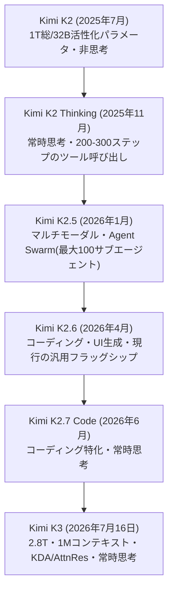
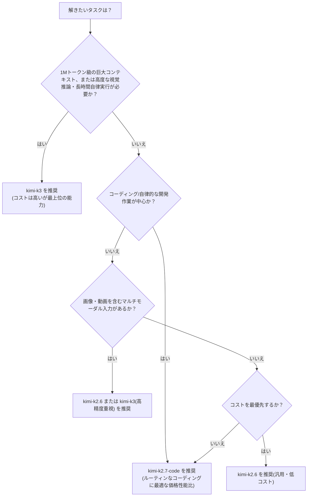
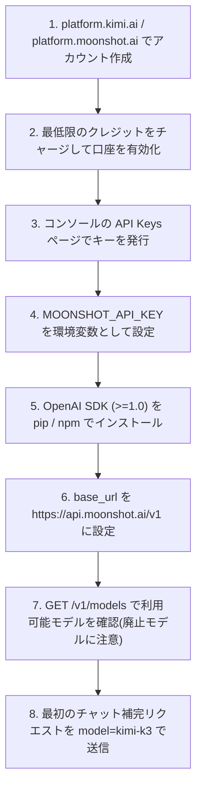
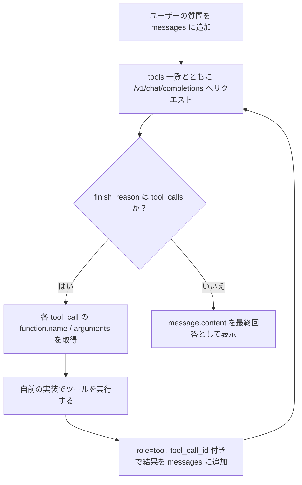
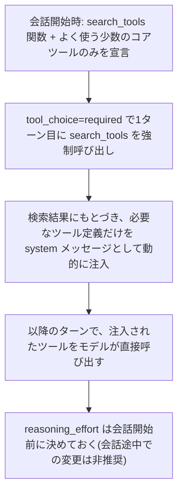
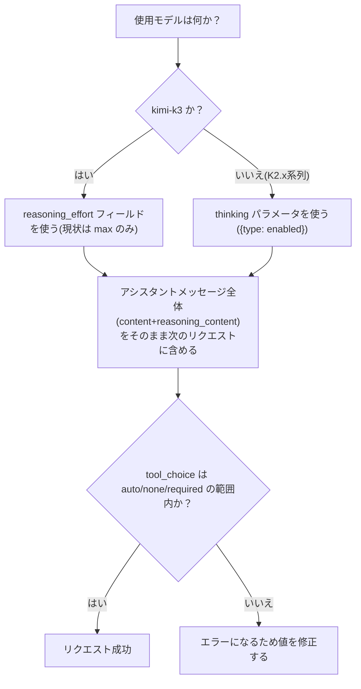
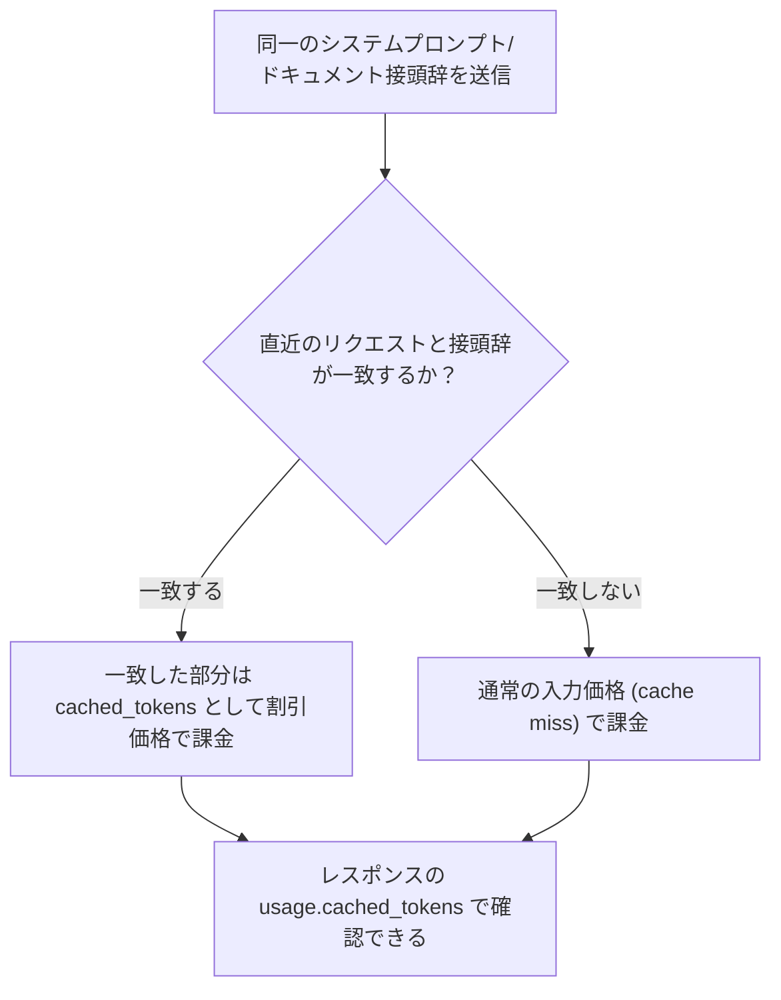
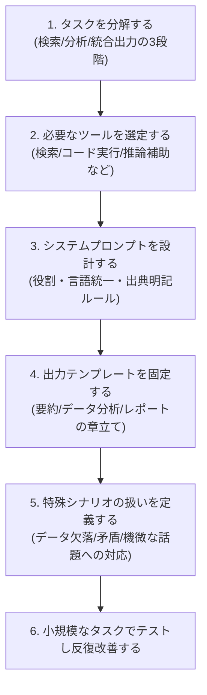

# Kimi(Moonshot AI)LLM 徹底ガイド 2026年7月版 ― 初学者のためのベストプラクティス

> 本ガイドは **2026年7月18日** 時点でウェブ検索により確認できた最新情報(公式ドキュメント・一次情報に加え、Simon WillisonやHacker News、Zvi Mowshowitzなど著名な国際的開発者・コメンテーターの投稿)にもとづいて作成しています。**2026年7月16日にフラッグシップモデル「Kimi K3」が発表されたばかり**であり、情報が非常に速く更新されています。本番導入前には必ず [Kimi API Platform公式ドキュメント](https://platform.kimi.ai/docs/overview) で最新情報を確認してください。

## 目次

1. [はじめに:KimiとMoonshot AIとは](#1-はじめにkimiとmoonshot-aiとは)
2. [【最新】Kimi K3の登場とモデルファミリーの現状](#2-最新kimi-k3の登場とモデルファミリーの現状)
3. [Kimiのエコシステム全体像](#3-kimiのエコシステム全体像)
4. [開発を始める:ステップバイステップ・セットアップ](#4-開発を始めるステップバイステップセットアップ)
5. [基本パラメータのベストプラクティス](#5-基本パラメータのベストプラクティス)
6. [システムプロンプト設計のベストプラクティス](#6-システムプロンプト設計のベストプラクティス)
7. [Tool Calling(関数呼び出し)のベストプラクティス](#7-tool-calling関数呼び出しのベストプラクティス)
8. [Thinking / reasoning_effort を使う際の注意点](#8-thinking--reasoning_effort-を使う際の注意点)
9. [Partial Mode(プリフィル)の活用](#9-partial-modeプリフィルの活用)
10. [コンテキストキャッシュとコスト最適化](#10-コンテキストキャッシュとコスト最適化)
11. [マルチモーダル入力(画像・動画)](#11-マルチモーダル入力画像動画)
12. [料金体系を理解する](#12-料金体系を理解する)
13. [レート制限と信頼性](#13-レート制限と信頼性)
14. [実践例:業界リサーチAIエージェントの構築フロー](#14-実践例業界リサーチaiエージェントの構築フロー)
15. [セキュリティ・プライバシーのベストプラクティス](#15-セキュリティプライバシーのベストプラクティス)
16. [よくあるエラーと対処法](#16-よくあるエラーと対処法)
17. [【補足】著名な国際的開発者・コミュニティの知見](#17-補足著名な国際的開発者コミュニティの知見)
18. [ベストプラクティス・チェックリスト(まとめ)](#18-ベストプラクティスチェックリストまとめ)
19. [参考文献(参照URL一覧)](#19-参考文献参照url一覧)

---

## 1. はじめに:KimiとMoonshot AIとは

**Kimi** は中国のAI企業 **Moonshot AI(月之暗面)** が開発する大規模言語モデル(LLM)シリーズ、およびそれを使った製品群の総称です。2023年10月に一般公開されたチャットボット「Kimi」は、当時としては業界最大級となる12.8万トークンのコンテキスト長をサポートしたことで注目を集めました。その後モデルは急速に進化し、2025年7月には1兆パラメータのMoE(Mixture-of-Experts)モデル **Kimi K2** をオープンウェイトで公開し、コーディングとエージェント(自律実行)性能で高い評価を得ました。そして**2026年7月16日、さらに大規模な後継モデル「Kimi K3」が発表**され、本ガイド執筆時点で最新のフラッグシップとなっています。

(出典: [Kimi (chatbot) - Wikipedia](https://en.wikipedia.org/wiki/Kimi_(chatbot)))

初学者がまず押さえておくべきポイントは次の3点です。

- **Kimiは「製品」と「モデル」の2つの顔を持つ**:一般ユーザー向けのチャットアプリ(kimi.com)と、開発者向けのAPIプラットフォーム(platform.moonshot.ai / platform.kimi.ai)は別物です。
- **KimiのAPIはOpenAI互換**です。既存のOpenAI SDKの `base_url` を書き換えるだけで移行できます。
- **オープンウェイト戦略**:Kimi K2系列のモデル重みはHugging Faceで公開されており、Modified MIT Licenseのもとで自己ホスティングも可能です。最新のK3も同様にオープンウェイトで提供される予定です(下記2章参照)。

(出典: [Quickstart - Kimi API Platform](https://platform.kimi.ai/docs/overview), [GitHub - MoonshotAI/Kimi-K2](https://github.com/moonshotai/kimi-k2))

---

## 2. 【最新】Kimi K3の登場とモデルファミリーの現状

### 2.1 Kimi K3とは何か(2026年7月16日発表)

Moonshot AIは2026年7月16日、これまでで最も強力なモデル **Kimi K3** を発表しました。世界の主要メディア(VentureBeat、Fortune、Reutersなど)やSimon Willison氏、Hacker Newsのコミュニティが即日反応した、非常に大きなニュースです。

- **2.8兆パラメータ**のMoE(Mixture-of-Experts)モデルで、公開時点で世界最大のオープンウェイトモデルとされています。
- 新しいアテンション機構 **Kimi Delta Attention(KDA)** と **Attention Residuals(AttnRes)** を採用。
- **Stable LatentMoE** フレームワークにより、896個のエキスパートのうち16個だけを活性化する、非常にスパースな設計(K2よりスパース性を高めた結果)。
- **1,048,576トークン(約100万トークン)のコンテキスト長**をネイティブサポート。
- **常時思考(always-on thinking)**:K2系列のような「思考あり/なし」の切り替えではなく、常に推論しながら応答します。
- ネイティブなマルチモーダル(画像・動画理解)対応。
- モデルの重み自体は2026年7月27日までに公開予定(本ガイド執筆時点ではAPI/Webからのみ利用可能)。

(出典: [China's Moonshot AI releases Kimi K3, the largest open-source model ever | VentureBeat](https://venturebeat.com/technology/chinas-moonshot-ai-releases-kimi-k3-the-largest-open-source-model-ever-rivaling-top-u-s-systems), [Kimi K3 - Kimi API Platform](https://platform.kimi.ai/docs/guide/kimi-k3-quickstart), [Kimi K3, and what we can still learn from the pelican benchmark - Simon Willison](https://simonwillison.net/2026/Jul/16/kimi-k3/))

### 2.2 ベンチマークと評価(Artificial Analysis等の第三者評価)

Moonshot自身の発表に加え、独立系ベンチマーク機関Artificial Analysisの報告や、Simon Willison氏によるハンズオン検証も参照すると、K3の立ち位置は次のように整理できます。

- Artificial Analysisの長期知識労働評価(private long-horizon knowledge work evaluation)でElo 1547を記録し、Kimi K2.6から+732ポイントの大幅向上。Claude Fable 5に次ぐ第2位。
- Arena.aiの「Frontend Code」アリーナでは首位(Claude Fable 5を上回る)。
- GDPval-AA v2ベンチマークでは1668点で、Claude Fable 5 Max・GPT-5.6 Sol Maxに次ぐ位置、Claude Opus 4.8 Max(1600点)を上回る。
- タスクあたりのコストは$0.94で、GPT-5.6 Sol($1.04)と近く、Claude Opus 4.8($1.80)の約半分。
- 一方で、K2.6と比較して出力トークン数(思考トークン込み)は21%減少しており、「同程度の性能をより少ないトークンで達成」という改善も見られます。

(出典: [Kimi K3, and what we can still learn from the pelican benchmark - Simon Willison](https://simonwillison.net/2026/Jul/16/kimi-k3/), [Moonshot AI Releases Kimi K3 | MLQ News](https://mlq.ai/news/moonshot-ai-releases-kimi-k3-a-28-trillion-parameter-open-weight-model-rivaling-top-us-systems/), [Artificial Analysis](https://artificialanalysis.ai/))

> **注意**:上記のベンチマーク数値の多くはMoonshot自身の発表またはArtificial Analysisなど特定機関の私的評価にもとづくものです。7月17日時点では、SWE-Bench・Terminal-Bench・HLEなど従来からの独立系公開ベンチマークでの検証結果はまだ出揃っていません。実運用への採用判断は、自分のタスクでの実地検証を必ず行ってください。

(出典: [How to Use Kimi K3: Complete Guide - Tosea.ai](https://tosea.ai/blog/kimi-k3-complete-guide), [Kimi K3 Review: Benchmarks, Pricing, and K2 Comparison](https://www.buildfastwithai.com/blogs/kimi-k3-review))

### 2.3 モデルファミリー全体の現状(2026年7月18日時点)



| モデルID | ステータス(2026年7月18日時点) | パラメータ規模 | コンテキスト長 | 備考 |
|---|---|---|---|---|
| `kimi-k2` 系列(0711/0905/turbo/thinking) | **廃止済み(2026年5月25日)** | 1T総/32B活性化 | 128K〜256K | 保守・サポート終了。移行必須 |
| `kimi-latest` | **廃止済み(2026年1月28日)** | ― | ― | 保守・サポート終了 |
| `kimi-k2.5` / `moonshot-v1`系列 | **新規ユーザー利用不可、2026年8月31日に完全終了予定** | 1T総/32B活性化 | 256K | 既存ユーザーも早期の移行を推奨 |
| `kimi-k2.6` | 提供中(汎用フラッグシップ) | 1T総/32B活性化・384エキスパート | 256K | テキスト中心の汎用タスクに最適 |
| `kimi-k2.7-code` | 提供中(コーディング特化) | 1T総/32B活性化・384エキスパート | 256K | ルーティンなコーディングタスクの既定選択肢として引き続き合理的 |
| `kimi-k3` | **提供中(最新フラッグシップ)** | 2.8T総・896エキスパート中16活性化 | 1,048,576(1M) | 長時間コーディング・大規模コンテキスト・視覚推論が必要な高度タスク向け |

(出典: [Model List - Kimi API Platform](https://platform.kimi.ai/docs/models), [Kimi K3 API Guide - Verdent Guides](https://www.verdent.ai/guides/agents/kimi-k3-api-guide))

> **重要な移行上の注意**:公式のモデル一覧ページでは「`kimi-k2` 系列は2026年5月25日付で正式に廃止・保守終了、`kimi-latest` は2026年1月28日付で廃止・保守終了、`kimi-k2.5` と `moonshot-v1` 系列は新規ユーザーには提供されず2026年8月31日に完全終了予定」と明記されています。現在これらのモデルIDを使っている場合は、`kimi-k2.6` / `kimi-k2.7-code` / `kimi-k3` のいずれかへ**早急に移行**してください。

(出典: [Model List - Kimi API Platform](https://platform.kimi.ai/docs/models))

### 2.4 モデル選定フローチャート(2026年7月版・更新)



(出典: [Kimi K3 API Guide - Verdent Guides](https://www.verdent.ai/guides/agents/kimi-k3-api-guide), [Kimi K3, and what we can still learn from the pelican benchmark - Simon Willison](https://simonwillison.net/2026/Jul/16/kimi-k3/))

### 2.5 アーキテクチャの基礎知識(MoEとK3の新技術)

Kimiシリーズはすべて **Mixture-of-Experts(MoE)** アーキテクチャを採用しています。初学者向けに簡単に言うと、「膨大な知識を持つ専門家集団の中から、1回の推論ごとにごく一部の専門家だけを選んで働かせる」仕組みです。K2は1兆パラメータ中320億パラメータ相当を活性化していましたが、K3ではさらにスパース性が高まり、896エキスパート中16個(HackerNewsのコミュニティ試算では概算50億〜数十億パラメータ規模)しか活性化しないよう設計されています。

- K2: 総パラメータ1T、活性化パラメータ約32B、384エキスパート、MuonClipオプティマイザ、15.5兆トークンで事前学習
- K3: 総パラメータ2.8T、896エキスパート中16個活性化(Stable LatentMoEフレームワーク)、Kimi Delta Attention(KDA)+Attention Residuals(AttnRes)という新しいアテンション設計により、K2比で約2.5倍のスケーリング効率を実現(Moonshot公式発表)

(出典: [Kimi K3 - Kimi API Platform](https://platform.kimi.ai/docs/guide/kimi-k3-quickstart), [Kimi K3 is now live | Hacker News](https://news.ycombinator.com/item?id=48935342))

---

## 3. Kimiのエコシステム全体像

Kimiというブランドの下には、消費者向けアプリからAPIプラットフォーム、開発者ツールまで複数の製品が存在します。まず全体像を図で把握しましょう。


- **Kimi(kimi.com)**:チャット・エージェント・文書生成・表計算・スライド作成などを一つにまとめた統合ワークスペースです。
- **Kimi Platform**:本ガイドの中心となる開発者向けAPIで、`platform.moonshot.ai` と `platform.kimi.ai` の2つのドメインから同じドキュメントにアクセスできます。
- **Kimi Code**:ターミナル/CLIから使えるコーディングエージェントで、Kimi K3にも既に対応しています。
- **Kimi Work**:ローカルファイルへのアクセス、ブラウザ自動操作(WebBridge)、Cronベースのスケジュール実行など「24時間稼働するデスクトップの部下」のような製品です。

(出典: [Kimi Work: Next-Gen Desktop AI Agent for Knowledge Workers](https://www.kimi.com/products/kimi-work), [AI Document Agent | Kimi Docs](https://www.kimi.com/features/docs), [Kimi Code with Kimi K3](https://www.kimi.com/code))

> **注意**:「Kimiでチャットができるから、APIも同じ挙動になるはず」と思い込まないことが大切です。Web版のKimiは裏側で複数のツールやエージェントを自動的に組み合わせていますが、API単体を呼び出す場合は、ツール定義・システムプロンプト・エージェントループなどを自分で設計する必要があります。また、**コンシューマー版(kimi.com)とAPIプラットフォームではデータの取り扱いポリシーが異なる**点に注意してください(詳細は15章)。

---

## 4. 開発を始める:ステップバイステップ・セットアップ



(出典: [Kimi K3 - Kimi API Platform](https://platform.kimi.ai/docs/guide/kimi-k3-quickstart))

### 4.1 Python環境のセットアップ

```bash
python3 -m pip install --upgrade 'openai>=1.0'

export MOONSHOT_API_KEY="sk-xxxxxxxxxxxxxxxxxxxxxxxx"
```

### 4.2 最初の呼び出し(Python / OpenAI SDK互換、K3対応版)

```python
import os
from openai import OpenAI

client = OpenAI(
    api_key=os.environ["MOONSHOT_API_KEY"],
    base_url="https://api.moonshot.ai/v1",
)

completion = client.chat.completions.create(
    model="kimi-k3",
    messages=[{"role": "user", "content": "Introduce Kimi K3 in one sentence."}],
)

print(completion.choices[0].message.content)
```

(出典: [Kimi K3 - Kimi API Platform](https://platform.kimi.ai/docs/guide/kimi-k3-quickstart))

> **重要**:国際向けエンドポイントは `api.moonshot.ai/v1`、中国本土向けは `api.moonshot.cn/v1` です。ドキュメントも `platform.moonshot.ai` と `platform.kimi.ai` の2ドメインで公開されているため、リンク切れに見えても慌てず両方を確認してください。

---

## 5. 基本パラメータのベストプラクティス

### 5.1 K3は多くのサンプリングパラメータが「固定」されている点に注意

これは今回の更新で最も重要な変更点の一つです。公式クイックスタートによると、Kimi K3では以下のパラメータが**固定値**であり、リクエストに含めても無視される(むしろ省略が推奨される)仕様になっています。

| パラメータ | K3での固定値 | 備考 |
|---|---|---|
| `temperature` | 1.0 | 指定しても無視される。リクエストから省略することが推奨 |
| `top_p` | 0.95 | 同上 |
| `n` | 1 | 同上 |
| `presence_penalty` | 0 | 同上 |
| `frequency_penalty` | 0 | 同上 |
| `reasoning_effort` | `"max"`のみサポート(デフォルト) | 将来的に軽量な効果レベルが追加予定と公式に予告あり |

(出典: [Kimi K3 - Kimi API Platform](https://platform.kimi.ai/docs/guide/kimi-k3-quickstart))

これに対し、旧世代のK2系列では以下のような値が推奨されていました(参考として残します)。

| モデル | 推奨temperature | 備考 |
|---|---|---|
| `kimi-k2` (Instruct, legacy・廃止済み) | 0.6 | 特別な指示がなければこの値がデフォルトの良い出発点だった |
| `kimi-k2-thinking` (legacy・廃止済み) | 1.0 | 思考連鎖の多様性を確保するため高めだった |
| `kimi-k2.6` / `kimi-k2.7-code` | 固定(変更不可) | 常時思考モードのためtemperature等のサンプリング設定は無視される |

(出典: [GitHub - MoonshotAI/Kimi-K2](https://github.com/moonshotai/kimi-k2), [Kimi K2.7 Code API: Pricing, Playground & Docs](https://empiriolabs.ai/models/kimi-k2-7-code))

### 5.2 max_completion_tokens の既定値と上限(K3)

- K3では `max_completion_tokens` の**デフォルトが131,072トークン**で、**最大1,048,576トークンまで**設定可能です。これはK2系列より大幅に緩和された値です。
- 応答が途中で切れた場合、`finish_reason` は `"length"` になります。この場合は [9. Partial Mode](#9-partial-modeプリフィルの活用) を使って続きを生成させます。
- K3は「flat pay-as-you-go」料金体系で、コンテキスト長による階層課金は行われません(詳細は12章)。

(出典: [Kimi K3 - Kimi API Platform](https://platform.kimi.ai/docs/guide/kimi-k3-quickstart))

### 5.3 stream=True を基本にする

長い出力は生成に数分かかることがあり、アイドル状態のTCP接続はファイアウォールやロードバランサ、NATゲートウェイによって切断される場合があります。ストリーミングを有効にすると接続が生かされ続け、信頼性が大きく向上します。K3のストリーミング応答では `reasoning_content` と最終回答 `content` が別々のデルタとして返されます。

```python
stream = client.chat.completions.create(
    model="kimi-k3",
    messages=[{"role": "user", "content": "Explain why the sky is blue."}],
    stream=True,
)

for chunk in stream:
    delta = chunk.choices[0].delta
    reasoning = getattr(delta, "reasoning_content", None)
    if reasoning:
        print(reasoning, end="", flush=True)
    if delta.content:
        print(delta.content, end="", flush=True)
```

(出典: [Kimi K3 - Kimi API Platform](https://platform.kimi.ai/docs/guide/kimi-k3-quickstart))

---

## 6. システムプロンプト設計のベストプラクティス

システムプロンプトは、モデルが応答を生成する前に受け取る「初期指示」であり、出力の形式・内容・スタイルを決定づける最も重要な準備工程です。公式ドキュメントの核心的な考え方は「モデルはあなたの心を読めない」という一文に集約されます。

(出典: [Best Practices for Prompts - Kimi API Platform](https://platform.kimi.ai/docs/guide/prompt-best-practice))

### 6.1 デフォルトのシステムプロンプト(K2系列向け・引き続き有効な指針)

特別な指示が不要な場合、公式が推奨してきた安全性重視のシステムプロンプトは次の通りです。

```text
You are Kimi, an artificial intelligence assistant provided by Moonshot AI.
You are more proficient in Chinese and English conversations. You provide
users with safe, helpful, and accurate answers. At the same time, you will
refuse to answer any questions involving terrorism, racism, or explicit
violence. Moonshot AI is a proper noun and should not be translated into
other languages.
```

(出典: [Best Practices for Prompts - Kimi API Platform](https://platform.kimi.ai/docs/guide/prompt-best-practice))

### 6.2 【著名開発者の発見】K3には隠しシステムプロンプトが存在する可能性

Simon Willison氏がK3に対して行った簡単なトークン数検証によると、`"Generate an SVG of a pelican riding a bicycle"` という一見短いプロンプトが**95トークン**とカウントされ、OpenAI/Anthropicの他モデルの同一プロンプト(10〜30トークン程度)より明らかに多いことが分かりました。さらに`"hi"`という1単語のプロンプトだけで**86トークン**とカウントされたことから、モデル側に**約85トークンの隠しシステムプロンプトが存在する可能性**が指摘されています。Hacker Newsでの検証では、モデルはこの隠しプロンプトの内容を尋ねても開示を拒否したと報告されています。

> **実務上の示唆**:自分で明示的なシステムプロンプトを設定していなくても、見えないところでトークンが消費されている可能性があります。コスト試算や「なぜこんなに入力トークンが多いのか」という疑問が生じた場合は、この点を念頭に置いてください。

(出典: [Kimi K3, and what we can still learn from the pelican benchmark - Simon Willison](https://simonwillison.net/2026/Jul/16/kimi-k3/), [Kimi K3 is now live | Hacker News](https://news.ycombinator.com/item?id=48935342))

### 6.3 明確さの原則(4つのチェック)

1. **役割を与える**:`messages` の `system` フィールドで、モデルに期待する役割・専門性を明示する。
2. **区切り文字を使う**:三重引用符・XMLタグ・見出しなどで、処理内容が異なるテキスト部分を分離する。
3. **少数の具体例(few-shot)を示す**:あらゆる場合分けを網羅するより、一般的な指針の例を示す方が効率的。
4. **出力の長さ・形式を指定する**:単語数指定は精度が低いため、段落数・箇条書き数での指定を優先する。

(出典: [Best Practices for Prompts - Kimi API Platform](https://platform.kimi.ai/docs/guide/prompt-best-practice))

### 6.4 ツール利用時はシステムプロンプトで指図しすぎない

`tools` パラメータで公式ツールを渡した場合、Kimiは自律的に「使うべきか・いつ使うか」を判断します。システムプロンプト側でツールの使い方を細かく指定すると、かえってこの自律的な意思決定を妨げる可能性があるため、**ツールの使用方法そのものはシステムプロンプトに書かない**というのが公式の推奨です。

(出典: [Use Kimi K2.6 Model to Setup Agent - Kimi API Platform](https://platform.kimi.ai/docs/guide/use-kimi-k2-to-setup-agent))

---

## 7. Tool Calling(関数呼び出し)のベストプラクティス

### 7.1 基本のツール呼び出しループ(全モデル共通)



```python
import json

tools = [{
    "type": "function",
    "function": {
        "name": "get_weather",
        "description": "Get the weather for a city",
        "parameters": {
            "type": "object",
            "properties": {"city": {"type": "string"}},
            "required": ["city"],
        },
    },
}]

messages = [{"role": "user", "content": "What is the weather in San Francisco today?"}]

first = client.chat.completions.create(
    model="kimi-k3",
    messages=messages,
    tools=tools,
    tool_choice="required",  # K3では最初のターンでツール呼び出しを強制できる
)
assistant_message = first.choices[0].message
messages.append(assistant_message)

for tool_call in assistant_message.tool_calls or []:
    arguments = json.loads(tool_call.function.arguments)
    result = json.dumps({"city": arguments["city"], "weather": "sunny", "temperature_c": 24})
    messages.append({"role": "tool", "tool_call_id": tool_call.id, "content": result})

final = client.chat.completions.create(model="kimi-k3", messages=messages, tools=tools)
print(final.choices[0].message.content)
```

(出典: [Kimi K3 - Kimi API Platform](https://platform.kimi.ai/docs/guide/kimi-k3-quickstart))

> **K3の新機能**:`tool_choice="required"` を使うと、最初のターンで必ず何らかのツールを呼び出させることができます(K2系列にはなかった値)。また、マルチターンやツール呼び出しでは**アシスタントメッセージ全体をそのまま次のリクエストに含める**必要があり、`content` だけを保持するのは不可です。

### 7.2 【K3新機能】動的ツールロード(Dynamic Tool Loading)と事前検索パターン

K3の公式「Tool Calling Best Practices」ガイドでは、大量のツールを毎ターン全部渡すのではなく、次のような**段階的ロードパターン**が推奨されています。これは特にツール数が多いエージェントでコンテキストとコストを節約する上で重要です。



```python
dynamic_messages = [
    {"role": "user", "content": "Calculate 23 times 47."},
    {
        "role": "system",
        "tools": [{
            "type": "function",
            "function": {
                "name": "calculate",
                "description": "Evaluate an arithmetic expression",
                "parameters": {
                    "type": "object",
                    "properties": {"expression": {"type": "string"}},
                    "required": ["expression"],
                },
            },
        }],
    },
]
completion = client.chat.completions.create(model="kimi-k3", messages=dynamic_messages)
print(completion.choices[0].message.tool_calls)
```

**重要な運用ルール**:

- 動的に宣言したツール定義はサーバー側に保持されません。次のリクエストでも使いたい場合は、クライアント側で同じ宣言を保持して送り続ける必要があります。
- `messages` の**末尾**にツール宣言を追加する分にはプレフィックスキャッシュに影響しませんが、**途中にある**ツール宣言を変更・削除すると、それ以降のキャッシュヒットに影響します。
- `reasoning_effort` は会話開始前に決めておくべきパラメータで、現在は `"max"` のみサポートされています(将来、軽量レベルが追加され、簡単なQ&Aなどのコスト・レイテンシを削減できる予定です)。

(出典: [Kimi K3 API Tool Calling Best Practices - Kimi API Platform](https://platform.kimi.ai/docs/guide/kimi-k3-tool-calling-best-practice))

### 7.3 公式ツールは「Formula」フレームワーク経由に統合(K3)

K3では公式ツールが **Formula** という仕組みを通じて提供されるようになりました。

1. Formulaの `/tools` エンドポイントからツール定義を取得する。
2. その定義を Chat Completions の `tools` フィールドに追加する。
3. モデルが `tool_calls` を返したら、各関数名と引数を Formula の `/fibers` エンドポイントに送信する。
4. 完全なアシスタントメッセージと Fiber の出力を、対応する tool メッセージとして追加する。
5. モデルが最終回答を返すまで Chat Completions を呼び出し続ける。

> **注意**:公式ドキュメントには「Web検索は現在更新中であり、近い将来の本番ワークフローでの使用は推奨されない」と明記されています。K3でリアルタイム検索が必要な場合は、この制約を踏まえて自前の検索ツールを実装するか、慎重に検証してから利用してください。

(出典: [Kimi K3 - Kimi API Platform](https://platform.kimi.ai/docs/guide/kimi-k3-quickstart))

### 7.4 ベストプラクティスまとめ(実運用)

- ツールは**単機能・小さく**設計する(検索・取得・更新など役割を分離)。
- ツールの出力フォーマットは**一貫したJSON**にする。
- ツール実行には**タイムアウトとリトライ**を必ず設定する。
- すべてのツール呼び出しについて、監査に必要な最小限のメタデータのみをログに記録し、生のツール引数や実行結果は保存しない（機密フィールドのマスク、保持期間の定義、アクセス制御の実施を徹底する）。
- ツール数が多いエージェントは、7.2の動的ロードパターンでコンテキストとキャッシュ効率を両立させる。

(出典: [Kimi API (Moonshot AI) - Complete Developer Guide](https://agentsapis.com/kimi-api/))

---

## 8. Thinking / reasoning_effort を使う際の注意点

K2系列とK3では、思考(推論)の制御方法が異なります。この違いを理解しておかないと、リクエストがエラーになったり、意図しないコストが発生したりします。



### 8.1 reasoning_contentを必ず保持する

思考が常時有効なモデル(K2.6思考時・K2.7 Code・K3すべて)では、過去のassistantメッセージを**完全な形のまま**次のリクエストのメッセージ履歴に含めなければなりません。K3の公式ドキュメントは「マルチターンの会話やツール呼び出しでは、APIが返した完全なアシスタントメッセージを次のリクエストに追加すること。`content` だけを保持しないこと」と明記しています。省略すると、後続ターンで文脈を見失ったり、不完全な回答を生成したりする原因になります。なお `reasoning_content` もトークン課金(入出力)の対象になります。

(出典: [Kimi K3 - Kimi API Platform](https://platform.kimi.ai/docs/guide/kimi-k3-quickstart))

### 8.2 K3の reasoning_effort は「max」固定で、コストに直結する

K3は現時点で `reasoning_effort="max"` しかサポートしておらず、軽いタスクでも重い推論を行います。Simon Willison氏の検証では、単純なSVG生成タスクで16,658個の出力トークンのうち13,241個が思考トークンで、コストは25セントに達しました。Hacker Newsのコミュニティも「推論効率(reasoning efficiency)はモデルの実質的なコストに直結する」「GPT系モデルは推論効率が高く、Kimi K3が同じタスクにより多くの思考トークンを使うなら、見かけの単価が安くてもコスト効率で負ける可能性がある」と指摘しています。

> **実務上の示唆**:簡単なQ&Aやテンプレート的なタスクにK3を使うと、不必要に高コストになる可能性があります。軽量なタスクには `kimi-k2.6` や `kimi-k2.7-code` を使い分けることを検討してください。将来、K3にも軽量な `reasoning_effort` レベルが追加される予定です。

(出典: [Kimi K3, and what we can still learn from the pelican benchmark - Simon Willison](https://simonwillison.net/2026/Jul/16/kimi-k3/), [Kimi K3 is now live | Hacker News](https://news.ycombinator.com/item?id=48935342))

### 8.3 tool_choiceの制約

思考モードが有効な場合、`tool_choice` に指定できる値には制約があります。K2.x系列では `"auto"` または `"none"` のみが許容され、それ以外を指定すると推論内容と強制されたツール選択が競合してエラーになります。K3では `"required"` も新たに使えるようになりましたが(7.1参照)、いずれのモデルでも公式ドキュメントに明記された許容値の範囲で使うことが重要です。

(出典: [Best Practices for Benchmarking - Moonshot AI Open Platform](https://platform.moonshot.ai/docs/guide/benchmark-best-practice), [Kimi K3 - Kimi API Platform](https://platform.kimi.ai/docs/guide/kimi-k3-quickstart))

---

## 9. Partial Mode(プリフィル)の活用

Partial Mode(プリフィル)は、応答の一部をあらかじめ与えて、モデルにその続きを生成させる機能です。出力フォーマットの固定、ロールプレイの一貫性維持、切り詰められた出力の継続などに使えます。K3でも同様に利用できます。

```python
prefix = "Conclusion: "
completion = client.chat.completions.create(
    model="kimi-k3",
    messages=[
        {"role": "user", "content": "In one sentence, explain why API compatibility matters."},
        {"role": "assistant", "content": prefix, "partial": True},
    ],
)
print(prefix + (completion.choices[0].message.content or ""))
```

応答には先頭に与えたプレフィックス自体は含まれないため、呼び出し側で手動で連結する必要があります。

> **注意**:Partial Modeと `response_format=json_object`(またはK3の `json_schema`)は併用しないでください。予期しない応答になる可能性があります。また、思考モデルで途中から継続する場合は、前回の `reasoning_content` も一緒に渡す必要があります。

(出典: [Kimi K3 - Kimi API Platform](https://platform.kimi.ai/docs/guide/kimi-k3-quickstart), [Partial Mode - Kimi API Platform](https://platform.kimi.ai/docs/api/partial))

---

## 10. コンテキストキャッシュとコスト最適化

Kimiの**自動コンテキストキャッシュ**は、直近のリクエストと共通する接頭辞(システムプロンプトや参照ドキュメントなど)を検出し、その部分を通常より大幅に安い「キャッシュヒット料金」で課金する仕組みです。K3の公式ドキュメントでも「通常のモデルリクエストに対してコンテキストキャッシュは自動的に行われ、キャッシュIDやTTL、追加パラメータは不要。長い接頭辞を変更せずに保つことで、後続リクエストが自動的にキャッシュヒットを試みる」と説明されています。



- K3のキャッシュヒット料金は $0.30/M トークンで、通常の入力価格($3.00/M)から**90%引き**という大幅な割引になります。
- 巨大なドキュメントをそのまま毎回送るのではなく、関連する章・セクションだけを抽出して渡す(RAG的アプローチ)ことも依然として有効です。
- コンテキストキャッシュは「Kimiがユーザーを記憶する仕組み」ではなく、**あくまで似た/繰り返しのプロンプトに対するAPI最適化**である点を混同しないようにしましょう。

(出典: [Kimi K3 - Kimi API Platform](https://platform.kimi.ai/docs/guide/kimi-k3-quickstart), [Kimi K3 pricing: API cost, app tiers and comparison - eesel AI](https://www.eesel.ai/blog/kimi-k3-pricing))

---

## 11. マルチモーダル入力(画像・動画)

K3を含む最新モデルはテキストに加えて画像・動画をネイティブに理解できます。ただし、**K3では公式に重要な制約が明記**されています。

> **K3の制約**:ビジョン入力は**パブリックな画像URLをサポートしません**。base64データ、または `ms://<file-id>` 形式のいずれかを使い、`content` は文字列ではなく**オブジェクトの配列**にする必要があります。

```python
import base64
from pathlib import Path

image_data = base64.b64encode(Path("image.png").read_bytes()).decode()
completion = client.chat.completions.create(
    model="kimi-k3",
    messages=[
        {
            "role": "user",
            "content": [
                {"type": "image_url", "image_url": {"url": f"data:image/png;base64,{image_data}"}},
                {"type": "text", "text": "Describe this image."},
            ],
        }
    ],
)
print(completion.choices[0].message.content)
```

動画についても、`client.files.create(file=..., purpose="video")` でアップロードし、`ms://<file-id>` 形式で参照する専用のフローが用意されています(処理後は `client.files.delete()` で削除することが推奨されます)。

Simon Willison氏の実地検証では、K3にpelicanのSVG画像(自ら生成したもの)を渡してalt textを生成させたところ、**「白いペリカンが赤いスカーフを巻き、赤い自転車に乗っている」といった非常に精度の高い説明文が得られた**と報告されており、視覚理解の質自体は高く評価されています。

(出典: [Kimi K3 - Kimi API Platform](https://platform.kimi.ai/docs/guide/kimi-k3-quickstart), [Kimi K3, and what we can still learn from the pelican benchmark - Simon Willison](https://simonwillison.net/2026/Jul/16/kimi-k3/))

---

## 12. 料金体系を理解する

料金は変更されやすいため、契約・予算設計の前に必ず公式の料金ページ([Kimi K3](https://platform.kimi.ai/docs/pricing/chat-k3) / [Kimi K2.6](https://platform.kimi.ai/docs/pricing/chat-k26))で最新の値を確認してください。以下は2026年7月17〜18日時点で複数の一次情報・独立系情報が一致して報告している値です(単位:USD / 100万トークン)。

| モデル | 入力(キャッシュミス) | 入力(キャッシュヒット) | 出力 | コンテキスト長 |
|---|---|---|---|---|
| `kimi-k3` | **$3.00** | **$0.30** | **$15.00** | 1,048,576(1M) |
| `kimi-k2.6` | $0.95 | $0.16 | $4.00 | 256K |
| `kimi-k2.7-code` | $0.95 | $0.19 | $4.00 | 256K |
| 廃止済みK2ファミリー | $0.60 | $0.15 | $2.50 | 128K〜256K |

(出典: [Kimi K3, and what we can still learn from the pelican benchmark - Simon Willison](https://simonwillison.net/2026/Jul/16/kimi-k3/), [Kimi K3 API Guide - Verdent Guides](https://www.verdent.ai/guides/agents/kimi-k3-api-guide), [Kimi K3 pricing - eesel AI](https://www.eesel.ai/blog/kimi-k3-pricing))

### 12.1 K3の価格をどう捉えるか(コミュニティの評価)

Simon Willison氏は「この価格設定はAnthropicのClaude Sonnetシリーズと同水準であり、これまでの中国製AIラボがリリースした中で最も高価なモデルになった」と指摘しています。Hacker Newsのコミュニティも「1:1でSonnetシリーズの価格と一致しており、GLM 5.2(3分の1以下の価格)と直接競合する製品ではなさそうだ」「トークナイザーの違いも比較時には考慮すべき」といった冷静な分析を寄せています。

- K3はAnthropicのClaude Opus 4.8($5/$25)やGPT-5.6 Sol($5/$30)より安いものの、DeepSeekやGLMなど「格安」路線の中国モデルとは競合する価格帯ではありません。
- 出力コストは入力の5倍(キャッシュミス時)であり、常時maxの思考モードと合わさって、**タスクによっては想定より高コストになりやすい**点に注意が必要です。

(出典: [Kimi K3, and what we can still learn from the pelican benchmark - Simon Willison](https://simonwillison.net/2026/Jul/16/kimi-k3/), [Kimi K3 is now live | Hacker News](https://news.ycombinator.com/item?id=48935342))

### 12.2 その他の課金要素

| 項目 | 目安 | 備考 |
|---|---|---|
| Batch API | リアルタイム料金の約60%(≒40%割引) | 即時応答が不要な非同期処理向け |
| `$web_search` 公式ツール | 1呼び出しあたり約$0.005（公式料金確認日: 2026年7月19日） | K3では「近い将来の本番利用は非推奨」と公式が明記 |
| Kimiメンバーシップ(コンシューマー向け) | 無料プランのほか月額$19〜$199の複数プラン | API利用とは完全に別の請求(混同しないこと) |

(出典: [Kimi K3 Pricing: API Cost and Whether It's Worth It](https://aireiter.com/blog/kimi-k3-pricing), [Kimi Pricing 2026: Plans, API Costs & Free Tier](https://felloai.com/kimi-pricing/))

### 12.3 コスト削減の実務チェックリスト

- モデルは「最新=最適」ではなく、タスクに応じて `k2.6`(汎用・低コスト)/`k2.7-code`(ルーティンなコーディング)/`k3`(1Mコンテキスト・高度推論が必要な場合のみ)を使い分ける。
- システムプロンプトや検索結果など、繰り返し送る接頭辞を一定に保ちキャッシュヒット率を高める(K3は90%引きと割引率が特に大きい)。
- K3は常時 `reasoning_effort=max` であることを踏まえ、軽量なタスクには投げない。
- 即時性が不要なバッチ処理はBatch APIに回す。
- 廃止予定モデル(`kimi-k2.5`、`moonshot-v1`系列、`kimi-k2`系列、`kimi-latest`)を使い続けていないか定期的に確認する。

(出典: [Model List - Kimi API Platform](https://platform.kimi.ai/docs/models))

---

## 13. レート制限と信頼性

Kimi APIのレート制限は、固定のプラン(Free/Pro/Enterpriseなど)ではなく、**アカウントへの累計チャージ額に応じたティア制**で決まります。必ず自分のコンソールの制限ページで最新の値を確認してください。

### 13.1 信頼性を高める実装のコツ

- `stream=True` を基本にし、長時間リクエストの接続断を防ぐ。
- 429(レート制限超過)エラーに対して、指数バックオフ付きのリトライを実装する。
- モデルIDをハードコードせず、`GET /v1/models` で利用可能なモデル一覧を都度(またはキャッシュして定期的に)取得し、廃止予定モデルを使っていないか確認する運用にする。
- サードパーティ経由(OpenRouterなど)でKimiモデルを利用する場合、Simon Willison氏のように「Moonshotに直接APIキーを作らずにOpenRouter経由で試す」という選択肢もあります。ただしレート制限やキャッシュ挙動はプロバイダごとに異なる点に注意してください。

(出典: [Kimi K3, and what we can still learn from the pelican benchmark - Simon Willison](https://simonwillison.net/2026/Jul/16/kimi-k3/))

---

## 14. 実践例:業界リサーチAIエージェントの構築フロー

公式ガイドで紹介されている「業界情報を検索・分析・レポート化するエージェント」の構築手順を、初学者向けに整理します。



このワークフローの要点は次の通りです。

1. **タスク分解**:検索(企業情報・最新データ・ニュース収集)→分析(大量情報のフィルタリング・分類)→統合出力(csv/png/pdf生成、グラフ作成)という3段階に分ける。
2. **ツール選定**:役割ごとにツールを割り当て、ツール数が多い場合は7.2の動的ロードパターンを検討する。
3. **システムプロンプト設計**:言語統一、配色などのビジュアル規約、データ出典の明記義務、確定情報/推定情報の区別、複数ソースでのクロスチェックといった具体的なルールをテンプレート化する。
4. **特殊シナリオ対応**:「データが見つからない場合は検索範囲を明記した上でその旨を述べる」「情報源が矛盾する場合は両論を併記し理由を推測する」など、あらかじめ振る舞いを定義しておく。

(出典: [Use Kimi K2.6 Model to Setup Agent - Kimi API Platform](https://platform.kimi.ai/docs/guide/use-kimi-k2-to-setup-agent))

---

## 15. セキュリティ・プライバシーのベストプラクティス

- **APIキーはサーバーサイドの秘密情報として扱う**:クライアントサイドのコード、公開リポジトリ、ログに絶対に含めない。環境変数で管理する。
- **ブラウザから直接APIを呼び出さない**:APIキーの露出を避けるため、必ずバックエンド経由で呼び出す。
- **モデルIDと機能はconfigに外出しする**:新モデルのリリースや旧モデルのEOLに柔軟に対応できるようにする。

### 15.1 【著名開発者の指摘】コンシューマー版(kimi.com)とAPIのプライバシーポリシーの違い

著名なAI動向コメンテーターZvi Mowshowitz氏(thezvi.substack.com)が自身のKimi K2.5レビューの中で言及し、詳細な検証記事(JP Caparas氏、Medium/generativeai.pub)にリンクしている内容によると、**Moonshot AIのプライバシーポリシー(2025年7月更新版)では、ユーザーが入力したプロンプトや生成物を含む「ユーザーコンテンツ」がデフォルトでモデルの学習に利用され、明確なオプトアウト手段が乏しい**と報告されています。また、シンガポール法人と北京本社の間での管轄関係も不明瞭であると指摘されています。

> **実務上の推奨**:
> - 顧客案件・機密情報・NDA対象の内容・個人情報などは、**コンシューマー版のkimi.com上で直接扱わない**。
> - 本番・業務利用では、必ずAPIプラットフォーム(利用規約でデータの扱いが別途定義されている)を経由するか、OpenRouterなどのサードパーティ推論プロバイダ、あるいは自己ホスティングを検討する。
> - 契約・法務上の判断が必要な場合は、必ず最新の[Moonshot AIのプライバシーポリシー・利用規約](https://platform.moonshot.ai/)を自分で確認する(本ガイドは法的助言ではありません)。

(出典: [Kimi K2.5 is brilliant, but think twice about using Kimi.com - Medium](https://generativeai.pub/kimi-k2-5-is-brilliant-but-think-twice-about-using-kimi-com-157cbb26f9a3), [Kimi K2.5 - Zvi Mowshowitz / thezvi.substack.com](https://thezvi.substack.com/p/kimi-k25))

### 15.2 【著名開発者の指摘】オープンウェイトモデルの安全性(レッドチーミング)について

Zvi Mowshowitz氏がまとめたコミュニティの反応(K2 Thinkingに関する記事)では、複数のテスターが「比較的軽い工夫だけで安全策を回避できた」と報告しており、また開発者コミュニティ(DEV Community、Promptfooを使った記事)でも、Kimiモデルに対する体系的なレッドチーミング(ジェイルブレイクやプロンプトインジェクションの検証)が行われています。これはKimiに限らずオープンウェイトモデル全般に言えることですが、実務上は以下を推奨します。

- エンドユーザー向けに公開するプロダクトでは、**モデル自身の安全策だけに依存せず、独自の入出力モデレーション層を追加する**。
- 本番投入前に、Promptfooのようなレッドチーミングツールで自社のユースケースに即した安全性検証を行う。
- 特に自己ホスティングする場合、モデル自体の安全策が緩められている、または存在しない構成になっていないか確認する。

(出典: [Kimi K2 Thinking - Zvi Mowshowitz / thezvi.substack.com](https://thezvi.substack.com/p/kimi-k2-thinking), [The Untold Misadventures of Red Teaming Kimi K2 with Promptfoo - DEV Community](https://dev.to/ayush7614/the-untold-misadventures-of-red-teaming-kimi-k2-with-promptfoo-3hig))

---

## 16. よくあるエラーと対処法

| 症状 | 主な原因 | 対処法 |
|---|---|---|
| `invalid_request_error` | 入力+`max_completion_tokens`がコンテキスト長を超過 | 入力を要約・分割するか、`max_completion_tokens`を調整する(K3は最大1,048,576) |
| `finish_reason: "length"` | 出力が`max_tokens`に達し途中で切れた | Partial Modeで同じプレフィックスから継続生成する |
| K3で `temperature` 等を指定してもエラーにはならないが効果がない | K3ではこれらのパラメータが固定値で無視される仕様 | リクエストから省略する(公式推奨) |
| K3で古い `thinking` パラメータを送るとエラー・無視される | K3は `thinking` ではなく `reasoning_effort` を使う仕様に変更された | `reasoning_effort="max"` を使う(K2.xの`thinking`とは別物) |
| ツール呼び出し時にエラー | 思考モードで許容されない`tool_choice`値を指定した | K2.xは`auto`/`none`、K3は`auto`/`none`/`required`の範囲で指定する |
| マルチターンのツール呼び出しでエラー | 直前ターンの完全なアシスタントメッセージ(reasoning_content含む)を保持せずに送信した | 直前のassistantメッセージをそのまま含めて送信する |
| 非ストリーミングで接続が途切れる | 長時間のアイドル接続がネットワーク経路で切断された | `stream=True`に切り替える |
| 動的ツールロードでキャッシュヒット率が下がった | messages途中のツール宣言を変更・削除した | 末尾への追加に留めるか、キャッシュ効率とのトレードオフを許容する |
| 廃止済み/廃止予定モデルIDでエラーまたは警告 | `kimi-k2`系列・`kimi-latest`・`kimi-k2.5`・`moonshot-v1`系列を使用している | `kimi-k2.6`/`kimi-k2.7-code`/`kimi-k3`へ移行する |

(出典: [Kimi K3 - Kimi API Platform](https://platform.kimi.ai/docs/guide/kimi-k3-quickstart), [Kimi K3 API Tool Calling Best Practices](https://platform.kimi.ai/docs/guide/kimi-k3-tool-calling-best-practice), [Model List - Kimi API Platform](https://platform.kimi.ai/docs/models))

---

## 17. 【補足】著名な国際的開発者・コミュニティの知見

ユーザーからのご要望にもとづき、公式ドキュメントだけでは分からない実践的な知見を、著名な国際的開発者・コメンテーターの投稿から補足します。

### 17.1 Simon Willison氏(Django共同開発者、著名AIブロガー)

Simon Willison氏は、新しいLLMがリリースされるたびに「ペリカンが自転車に乗っているSVGを生成させる」という独自の簡易ベンチマークを実施していることで著名です。K3に関する氏の投稿から得られる実務的な知見:

- 実際にモデルを動かして試すことの重要性:ベンチマーク表だけでなく、簡単なプロンプトを一つ実行するだけでも「思考トークンの消費量」「隠れた挙動」など多くの実務情報が得られる。
- K3は現状**思考の強度(reasoning effort)が"max"の1段階しかなく**、簡単なタスクでも高コストになりがちである。
- OpenRouterや`llm`コマンド(氏が開発するCLIツール)経由でモデルを試すと、Moonshot APIキーを個別に取得せずに素早く評価できる。
- ペリカンテスト自体の限界(ベンチマークとしての相関が薄れてきている)も率直に述べており、**単一の指標を過信しない姿勢**が参考になる。

(出典: [Kimi K3, and what we can still learn from the pelican benchmark](https://simonwillison.net/2026/Jul/16/kimi-k3/), [moonshotai/Kimi-K2-Instruct (via) - Simon Willison](https://simonwillison.net/2025/Jul/11/kimi-k2/))

### 17.2 Hacker Newsコミュニティの技術的指摘

Kimi K3発表直後のHacker Newsスレッドでは、多数の実務経験豊富な開発者から次のような指摘がありました。

- 価格を単純比較する前に、**モデルごとのトークナイザーの違い**(同じテキストでもエンコード後のトークン数が異なる)を考慮すべき。
- **推論効率(reasoning efficiency)**こそが実質的なコストを左右する。「見かけの単価が安くても、思考トークンを大量に使うモデルは総コストで高くつく」可能性がある。
- MoEのスパース化(896エキスパート中16個活性化)から活性化パラメータ数を試算する実践的な計算方法も共有されており、公式が総パラメータ数しか公表しない場合でも、コミュニティが独自に実質的な計算コストを推測する文化がある。

(出典: [Kimi K3 is now live | Hacker News](https://news.ycombinator.com/item?id=48935342))

### 17.3 Zvi Mowshowitz氏(著名AI動向アナリスト、thezvi.substack.com)

AI業界の動向を毎週まとめる著名なニュースレター執筆者であるZvi Mowshowitz氏は、Kimiシリーズの主要リリースのたびにコミュニティの反応を集約したレビューを公開しています。氏の記事からの実務的示唆:

- コーディング以外の実務(氏の例では「情報密度の高いコンテキストを要する会話アプリ」)では、コーディングベンチマークが高くても実際の使用感が伴わない場合がある、という複数ユーザーの声を紹介。
- 安全性(ジェイルブレイクへの耐性)について、複数のテスターから「比較的軽微な工夫で安全策を回避できた」という報告があったことも率直に記録している。
- Kimi K2.5のAgent Swarm機能について、Cline(著名なAIコーディングエージェントツール)の開発者Saoud Rizwan氏が「Opus 4.5を8分の1のコストで上回るベンチマークを達成しており、最も重要なのは並列サブエージェントの学習方法(PARL: Parallel Agent Reinforcement Learning)だ」と技術的に評価したコメントも引用している。

(出典: [Kimi K2 Thinking - thezvi.substack.com](https://thezvi.substack.com/p/kimi-k2-thinking), [Kimi K2.5 - thezvi.substack.com](https://thezvi.substack.com/p/kimi-k25))

### 17.4 プライバシー・データ取り扱いに関する独立検証

AIライターJP Caparas氏によるMediumの詳細記事では、Moonshot AIの公式プライバシーポリシーの原文を引用しながら、コンシューマー向けサービス(kimi.com)のデータ取り扱いを検証しています。氏は「モデルの能力自体は本物で優秀。ただしデータの取り扱い方針は別問題」とし、カジュアルな検証・学習用途と、業務・機密情報を扱う用途とを明確に使い分けるべきだと提言しています(詳細は15.1参照)。

(出典: [Kimi K2.5 is brilliant, but think twice about using Kimi.com - Medium](https://generativeai.pub/kimi-k2-5-is-brilliant-but-think-twice-about-using-kimi-com-157cbb26f9a3))

### 17.5 ローカル実行・自己ホスティングに関する知見

Appleの機械学習研究者Awni Hannun氏(mlx-lm開発者)は、Kimi K2(4bit量子化版)が2台のMac Studio(512GB M3 Ultra、合計約2万ドル相当)でmlx-lmとmx.distributedを使って実用的な速度で動作することを実証し、Simon Willison氏もこれを引用して「個人が動かせる範囲でこれに最も近い選択肢」と評しています。K3は2.8兆パラメータとさらに大規模なため、自己ホスティングにはより大きなハードウェア投資が必要になる点に留意してください(またK3の重み自体は2026年7月27日まで未公開です)。

(出典: [Simon Willison on X (Awni Hannun引用)](https://x.com/simonw/status/1946961766405263702))

---

## 18. ベストプラクティス・チェックリスト(まとめ)

| # | チェック項目 |
|---|---|
| 1 | タスクの性質(巨大コンテキスト・高度推論/ルーティンコーディング/汎用・低コスト)に応じてK3/K2.7 Code/K2.6を使い分けたか |
| 2 | 廃止済み・廃止予定モデル(`kimi-k2`系列、`kimi-latest`、`kimi-k2.5`、`moonshot-v1`系列)を使い続けていないか確認したか |
| 3 | K3利用時、`temperature`等の固定パラメータをリクエストから省略しているか |
| 4 | K3では`thinking`ではなく`reasoning_effort`を使っているか |
| 5 | マルチターン・ツール呼び出しで、アシスタントメッセージ全体(reasoning_content込み)を保持しているか |
| 6 | ツール数が多いエージェントで、動的ツールロード+search_toolsパターンを検討したか |
| 7 | K3のビジョン入力でパブリックURLではなくbase64/ms://形式を使っているか |
| 8 | 繰り返し送る接頭辞を固定してキャッシュヒット率を上げているか(K3は90%引き) |
| 9 | 軽量なタスクにK3(常時maxの思考モード)を使ってコストを浪費していないか |
| 10 | コンシューマー版(kimi.com)と業務用途(API)のデータ取り扱いポリシーの違いを理解し、機密情報の扱いを分けているか |
| 11 | 本番投入前に独自の入出力モデレーション層・レッドチーミングを検討したか |
| 12 | APIキーをサーバーサイドで安全に管理しているか |
| 13 | 429エラーに対するリトライ・バックオフを実装しているか |
| 14 | 本番投入前に公式ドキュメントで最新のモデルID・料金・レート制限を確認したか |

---

## 19. 参考文献(参照URL一覧)

### Kimi製品・エコシステム
- Kimi Work: Next-Gen Desktop AI Agent for Knowledge Workers — https://www.kimi.com/products/kimi-work
- AI Document Agent for Automating Knowledge Work | Kimi Docs — https://www.kimi.com/features/docs
- Kimi Code with Kimi K3: Next-Gen AI Code Agent & CLI — https://www.kimi.com/code
- Kimi (chatbot) - Wikipedia — https://en.wikipedia.org/wiki/Kimi_(chatbot)

### Kimi K3 公式情報
- Kimi K3 - Kimi API Platform(クイックスタート) — https://platform.kimi.ai/docs/guide/kimi-k3-quickstart
- Kimi K3 API Tool Calling Best Practices - Kimi API Platform — https://platform.kimi.ai/docs/guide/kimi-k3-tool-calling-best-practice
- Model List - Kimi API Platform(廃止・移行情報) — https://platform.kimi.ai/docs/models
- Kimi K3 Pricing - Kimi API Platform — https://platform.kimi.ai/docs/pricing/chat-k3

### 著名開発者・独立系分析(Simon Willison, Hacker News, Zvi Mowshowitzほか)
- Kimi K3, and what we can still learn from the pelican benchmark - Simon Willison's Weblog — https://simonwillison.net/2026/Jul/16/kimi-k3/
- moonshotai/Kimi-K2-Instruct (via) - Simon Willison's Weblog — https://simonwillison.net/2025/Jul/11/kimi-k2/
- Kimi K3 is now live | Hacker News — https://news.ycombinator.com/item?id=48935342
- Kimi K2 Thinking - Zvi Mowshowitz / Don't Worry About the Vase(thezvi.substack.com) — https://thezvi.substack.com/p/kimi-k2-thinking
- Kimi K2.5 - Zvi Mowshowitz / Don't Worry About the Vase(thezvi.substack.com) — https://thezvi.substack.com/p/kimi-k25
- Kimi K2.5 is brilliant, but think twice about using Kimi.com - JP Caparas / Medium — https://generativeai.pub/kimi-k2-5-is-brilliant-but-think-twice-about-using-kimi-com-157cbb26f9a3
- The Untold Misadventures of Red Teaming Kimi K2 with Promptfoo - DEV Community — https://dev.to/ayush7614/the-untold-misadventures-of-red-teaming-kimi-k2-with-promptfoo-3hig
- Simon Willison on X(Awni Hannun氏のMac Studio実行報告への言及) — https://x.com/simonw/status/1946961766405263702

### Kimi K3 ニュース・第三者報道
- China's Moonshot AI releases Kimi K3, the largest open-source model ever | VentureBeat — https://venturebeat.com/technology/chinas-moonshot-ai-releases-kimi-k3-the-largest-open-source-model-ever-rivaling-top-u-s-systems
- Moonshot AI Releases Kimi K3, a 2.8-Trillion-Parameter Open-Weight Model | MLQ News — https://mlq.ai/news/moonshot-ai-releases-kimi-k3-a-28-trillion-parameter-open-weight-model-rivaling-top-us-systems/
- Moonshot's Kimi K3 pushes Chinese AI into Fable-level territory | Fortune — https://fortune.com/2026/07/16/moonshots-kimi-k3-pushes-chinese-ai-into-fable-level-territory/
- Chinese AI Startup Moonshot AI Launches Kimi K3 Model | TradingKey — https://www.tradingkey.com/analysis/stocks/hk-stocks/262037443-moonshot-ai-kimi-k3-openai-anthropic-tradingkey
- What Is Kimi K3? The Chinese AI Model That Has Wall Street Talking | Yahoo Finance — https://finance.yahoo.com/technology/ai/articles/kimi-k3-chinese-ai-model-122743635.html

### Kimi K3 解説・料金ガイド(第三者メディア)
- How to Use Kimi K3: Complete Guide to Moonshot AI's 2.8T-Parameter Flagship Model | Tosea.ai — https://tosea.ai/blog/kimi-k3-complete-guide
- What Is Kimi K3? Moonshot's 2.8T, 1M-Context Flagship | kie.ai — https://kie.ai/blog/what-is-kimi-k3
- Kimi K3: Moonshot AI's 2.8T Open-Weight Model — Release, Specs & Pricing | CodeSera — https://codersera.com/blog/kimi-k3-complete-guide-2026/
- Kimi K3 Review: Benchmarks, Pricing, and K2 Comparison | BuildFastWithAI — https://www.buildfastwithai.com/blogs/kimi-k3-review
- Kimi K3: Pricing, Specs, and Benchmarks | Capital & Compute — https://capitalandcompute.net/blog/kimi-k3-explained/
- Kimi K3 API Guide (2026): Pricing, Context, and Examples | Verdent Guides — https://www.verdent.ai/guides/agents/kimi-k3-api-guide
- Kimi K3 pricing: API cost, app tiers and comparison | eesel AI — https://www.eesel.ai/blog/kimi-k3-pricing
- Kimi K3 Pricing: API Cost and Whether It's Worth It | AI Reiter — https://aireiter.com/blog/kimi-k3-pricing
- Kimi Pricing 2026: Plans, API Costs & Free Tier | FelloAI — https://felloai.com/kimi-pricing/
- Kimi K3 API Pricing: 1M Context Cost Impact | AI Pricing Guru — https://www.aipricing.guru/news/kimi-k3-api-pricing-1m-context-cost-impact-july-2026/
- How Much Does Kimi K3 Cost? | The Pricer — https://www.thepricer.org/how-much-does-kimi-k3-cost/
- Kimi K3 Pricing 2026: Free to $199/mo Plans & $3/$15 API Rates | ComparEdge — https://comparedge.com/tools/kimi/pricing
- Kimi K3: The Agentic AI Coding Model Reshaping Developer Workflows | AI Adoption Agency — https://aiadoptionagency.com/kimi-k3/

### K2系列(従来モデル)関連情報
- GitHub - MoonshotAI/Kimi-K2 — https://github.com/moonshotai/kimi-k2
- moonshotai/Kimi-K2-Instruct - Hugging Face — https://huggingface.co/moonshotai/Kimi-K2-Instruct
- moonshotai/Kimi-K2-Thinking - Hugging Face — https://huggingface.co/moonshotai/Kimi-K2-Thinking
- Best Practices for Prompts - Kimi API Platform — https://platform.kimi.ai/docs/guide/prompt-best-practice
- Use Kimi K2.6 Model to Setup Agent - Kimi API Platform — https://platform.kimi.ai/docs/guide/use-kimi-k2-to-setup-agent
- Best Practices for Benchmarking - Moonshot AI Open Platform — https://platform.moonshot.ai/docs/guide/benchmark-best-practice
- Partial Mode - Kimi API Platform — https://platform.kimi.ai/docs/api/partial
- Kimi K2.7 Code API: Pricing, Playground & Docs | EmpirioLabs AI — https://empiriolabs.ai/models/kimi-k2-7-code
- Kimi K2.6 & Kimi Code Review: Saving 88% Coding Costs? | Medium — https://medium.com/@tentenco/kimi-k2-6-kimi-code-review-saving-88-coding-costs-b7e8c5eaf5f1
- Kimi by Moonshot in 2026: K2.6, K2.7-Code and Agents for Managers — https://mysummit.school/blog/en/kimi-k25-moonshot-review-2026/
- Kimi API (Moonshot AI) - Complete Developer Guide — https://agentsapis.com/kimi-api/

---

> **免責事項**:本ガイドに記載したモデルID・料金・レート制限・仕様・ベンチマーク数値は、公式情報および複数の独立系情報を横断的に確認した2026年7月18日時点のスナップショットです。Kimi K3は発表から間もないモデルであり、Moonshot AI自身のモデルラインナップと料金体系は今後も頻繁に更新される見込みです。契約・請求・アーキテクチャ設計に関わる意思決定を行う前には、必ず [platform.moonshot.ai](https://platform.moonshot.ai/) および [platform.kimi.ai](https://platform.kimi.ai/) の公式ドキュメント・料金ページで最新情報を確認してください。また、著名開発者・コミュニティの投稿として引用した内容は、あくまで個人の見解・検証結果であり、Moonshot AIの公式見解ではありません。
