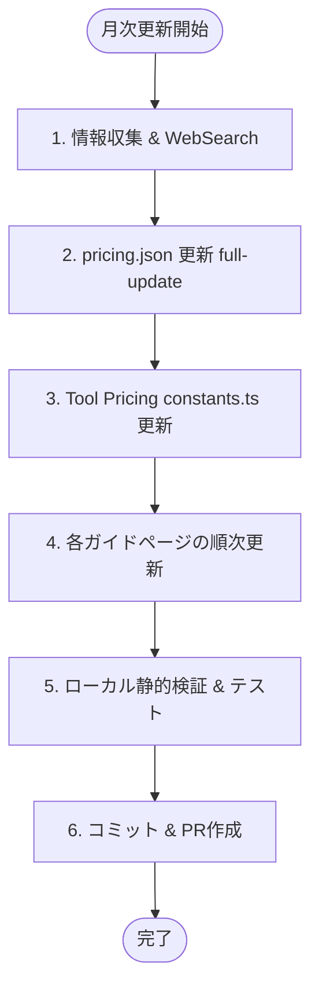

# 月次更新・メンテナンススキル

(最終更新日: 2026-06-04)

## Goal

プロジェクトに存在する30個の画面（AIモデルコスト計算機、各種AIエージェントガイド、スラッシュコマンド完全ガイド、Code Review ツール料金比較ページなど）の価格データ、API仕様、バージョン番号、一次情報源リンクを毎月最新に保ち、不整合を防ぐ。

---

## 実行ワークフロー

月次更新作業は、以下の 6 ステップで計画的かつ安全に進める必要があります。



### 1. 情報収集 & WebSearch

更新を開始する前に、主要な AI プロバイダーの最新リリース情報を確認します。
- **Anthropic**: https://docs.anthropic.com/changelog または `Claude Code` の最新バージョン情報。
- **Google Cloud / AI**: https://developers.googleblog.com/ または `Antigravity` / `Gemini CLI` の最新移行スケジュールやコマンド体系。
- **OpenAI**: https://platform.openai.com/docs/changelog
- **GitHub**: https://github.blog/changelog/
- **各コードレビューツール**: CodeRabbit, SonarQube などの公式料金・機能発表。

### 2. pricing.json の更新

AIモデル価格と為替レートを一括更新します。
- `.agent/skills/full-update/` に基づきスクレイパーを実行して `pricing.json` を更新します。

  ```bash
  # スクレイパー実行によるデータ更新
  cd scraper && uv run python -m scraper.main --output ../pricing.json
  # フロントエンド側へのデータコピーと同期
  bash update.sh --no-scrape
  ```

- 変更後の Pydantic モデルと TypeScript 型定義の整合性を確認するため、`sync-types` スキルを活用します。
  - `web-next/lib/pricing.ts` の `_AssertParity` がエラーなしでビルドできることを確認します。

### 3. Tool Pricing (料金比較) の更新

`/code-review/tool-pricing` の料金情報（`app/code-review/tool-pricing/constants.ts`）を更新します。
- WebSearch で得た最新の価格情報に基づき、USD額を更新します。
- 更新したツールの `priceCheckedAt` と、全体の `PRICE_CHECKED_AT` を当月の「YYYY-MM」に書き換えます。

### 4. 各ガイドページの順次更新

`docs/MONTHLY_UPDATE_PROMPTS.md` に定義されている各画面（1〜30）の「事前確認」および「更新プロンプト」に従い、外科的（最小差分）に `page.tsx` もしくは関連ファイルを更新します。
- **絶対ルール**:
  - ファイル全体の書き直しは禁止。該当する metadata、バージョンタグ、SOURCES リンク、説明テキストのみをピンポイントで修正する。
  - Mermaid ダイアグラム定義は、シンタックスエラーを招きやすいため原則として変更しない。

### 5. ローカル静的検証 & テスト

更新が完了したら、全画面でエラーがないか検証を行います。
- 静的検証コマンド：

  ```bash
  cd web-next && bun run typecheck
  cd web-next && bun run build
  cd web-next && bun run lint
  ```

- テストの実行：

  ```bash
  cd web-next && bun run test
  # または修正した画面の個別テストを実行
  cd web-next && bun run test app/claude/agent/page.test.tsx
  ```

- 目視による確認：
  `bun run dev` を起動し、`http://localhost:3000/` や各修正パスにアクセスして、スタイル崩れや外部リンク切れがないかブラウザで確認します。

### 6. コミット & PR作成

検証が正常に通ったら、Git コミットを行います。
- コミット時の注意：
  - PII (ローカルの絶対パス、ユーザー名など) が混入していないことを `git diff --cached` 等で確認してください。
  - コミットメッセージ例: `docs(guide): monthly update YYYY-MM`

---

## 完了判定ゲート (Gate Conditions)

- [ ] `bun run build` が成功していること。
- [ ] `bun run typecheck` にパスしていること。
- [ ] `bun run test` の 693 件以上のテストがすべて Green になっていること。
- [ ] `bun run lint` に新規エラーがないこと。
- [ ] `docs/MONTHLY_UPDATE_PROMPTS.md` 内の画面一覧テーブルの「更新日」が最新のもの（当月日付）に更新されていること。
- [ ] 最終更新日（タイムスタンプ）が適切に更新されていること。
