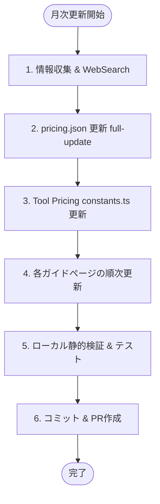

# 月次更新・メンテナンススキル

(最終更新日: 2026-07-13)

## Goal

プロジェクトに存在する35個の画面（AIモデルコスト計算機、各種AIエージェントガイド、スラッシュコマンド完全ガイド、Code Review ツール料金比較ページなど）の価格データ、API仕様、バージョン番号、一次情報源リンクを毎月最新に保ち、不整合を防ぐ。

> **必読**: 画面別の具体プロンプト・検証チェックリスト・**「頻出レビュー指摘 & 事前チェック」**は
> `docs/MONTHLY_UPDATE_PROMPTS.md` に集約。本スキルは全体ワークフローのガイド。

---

## 実行ワークフロー

月次更新作業は、以下の 6 ステップで計画的かつ安全に進める必要があります。


```mermaid
graph TD
  Start([月次更新開始]) --> Step1[1. 情報収集 & WebSearch]
  Step1 --> Step2[2. pricing.json 更新 full-update]
  Step2 --> Step3[3. Tool Pricing constants.ts 更新]
  Step3 --> Step4[4. 各ガイドページの順次更新]
  Step4 --> Step5[5. ローカル静的検証 & テスト]
  Step5 --> Step6[6. コミット & PR作成]
  Step6 --> End([完了])
```

### 1. 情報収集 & WebSearch

更新を開始する前に、主要な AI プロバイダーの最新リリース情報を確認します。
- **Anthropic**: https://docs.anthropic.com/changelog または `Claude Code` の最新バージョン情報。
- **Google Cloud / AI**: https://developers.googleblog.com/ または `Antigravity` / `Gemini CLI` の最新移行スケジュールやコマンド体系。
- **OpenAI**: https://platform.openai.com/docs/changelog
- **GitHub**: https://github.blog/changelog/
- **各コードレビューツール**: CodeRabbit, SonarQube などの公式料金・機能発表。

### 2. pricing.json の更新

AIモデル価格と為替レートを一括更新します。
- `.agent/skills/full-update/` に基づきスクレイパーを実行して `pricing.json` を更新します。

  ```bash
  # スクレイパー実行によるデータ更新
  cd scraper && uv run python -m scraper.main --output ../pricing.json
  # フロントエンド側へのデータコピーと同期
  bash update.sh --no-scrape
  ```

- 変更後の Pydantic モデルと TypeScript 型定義の整合性を確認するため、`sync-types` スキルを活用します。
  - `web-next/lib/pricing.ts` の `_AssertParity` がエラーなしでビルドできることを確認します。

### 3. Tool Pricing (料金比較) の更新

`/code-review/tool-pricing` の料金情報（`app/code-review/tool-pricing/constants.ts`）を更新します。
- WebSearch で得た最新の価格情報に基づき、USD額を更新します。
- 更新したツールの `priceCheckedAt` と、全体の `PRICE_CHECKED_AT` を当月の「YYYY-MM」に書き換えます。

### 4. 各ガイドページの順次更新

`docs/MONTHLY_UPDATE_PROMPTS.md` に定義されている各画面（1〜35）の「事前確認」および「更新プロンプト」に従い、外科的（最小差分）に `page.tsx` もしくは関連ファイルを更新します。
- **絶対ルール**:
  - ファイル全体の書き直しは禁止。該当する metadata、バージョンタグ、SOURCES リンク、説明テキストのみをピンポイントで修正する。
  - Mermaid ダイアグラム定義は、シンタックスエラーを招きやすいため原則として変更しない。

- **頻出レビュー指摘（過去サイクルで別途修正コミットが必要になった取りこぼし。着手前に必ず対処）**:
  1. **日付/バージョンの更新漏れ**: 日付は `metadata` 以外にも「ヒーローバッジ・TOC タイトル・SOURCES ラベル・フッター」に散在する。着手前に対象ページで grep して全箇所を洗い出す:

     ```bash
     cd web-next
     grep -nE '(20[0-9]{2}年[0-9]{1,2}月|(Jan|Feb|Mar|Apr|May|Jun|Jul|Aug|Sep|Oct|Nov|Dec)[a-z]* 20[0-9]{2}|Last updated|最終更新|更新版|時点|情報基準日)' app/<path>/page.tsx
     ```

     英語月名（`May`→`June`）と和文（`2026年5月`→`2026年6月`）の両方を揃える。
  2. **JSX の半角スペース消失**: テキストと `<strong>` / `<Ext>` が改行で隣接すると空白が消える。直前/直後に `{" "}` を明示挿入する。
  3. **契約テストの完全一致**: `page.test.tsx` は `toBe`（完全一致）と `toContain/toMatch` が混在。metadata description 等を変えたら同一コミットでテストも同期。編集前に `grep -nE 'toBe\(|toContain|toMatch' app/<path>/page.test.tsx`。
  4. **コミット前の最終スイープ**: 前月表記（例: `2026年5月` / `May 2026`）が残っていないか grep して空になるまで潰す。

### 4.5. ページレジストリの `lastReviewed` 書き戻し（必須・F-2'）

**1 ページの内容確認が終わるたびに**、`web-next/lib/page-registry.ts` の該当エントリの
`lastReviewed` を**確認を行った当日の日付（YYYY-MM-DD）**へ更新する。

```bash
cd web-next
grep -n -A3 'slug: "/claude/agent"' lib/page-registry.ts   # 該当エントリを特定
# lastReviewed: "2026-06-30" → lastReviewed: "2026-07-13" に書き換える
```

- この値がサイト上部の鮮度バッジ（`PageFreshness`）と `/whats-new`、`sitemap.xml` の `lastmod` に
  そのまま出る。**月次確認の完了 = registry 更新 = 鮮度表示の更新** が 1 コミットで閉じる設計
  （plans/006 §4）
- 内容に変更がなくても「確認した」事実として `lastReviewed` は更新する。
  `addedAt`（公開日）は**絶対に変更しない**
- 確認しなかったページの `lastReviewed` は触らない（古いまま表示されるのが正しい振る舞い）

### 5. ローカル静的検証 & テスト

更新が完了したら、全画面でエラーがないか検証を行います。
- 静的検証コマンド：

  ```bash
  cd web-next && bun run typecheck
  cd web-next && bun run build
  cd web-next && bun run lint
  ```

- テストの実行：

  ```bash
  cd web-next && bun run test
  # または修正した画面の個別テストを実行
  cd web-next && bun run test app/claude/agent/page.test.tsx
  ```

- 目視による確認：
  `bun run dev` を起動し、`http://localhost:3000/` や各修正パスにアクセスして、スタイル崩れや外部リンク切れがないかブラウザで確認します。

### 6. コミット & PR作成

検証が正常に通ったら、Git コミットを行います。
- コミット時の注意：
  - PII (ローカルの絶対パス、ユーザー名など) が混入していないことを `git diff --cached` 等で確認してください。
  - コミットメッセージ例: `docs(guide): monthly update YYYY-MM`

---

## 完了判定ゲート (Gate Conditions)

- [ ] `bun run build` が成功していること。
- [ ] `bun run typecheck` にパスしていること。
- [ ] `bun run test` の 743 件以上のテストがすべて Green になっていること。
- [ ] `bun run lint` に新規エラーがないこと。
- [ ] `docs/MONTHLY_UPDATE_PROMPTS.md` 内の画面一覧テーブルの「更新日」が最新のもの（当月日付）に更新されていること。
- [ ] 最終更新日（タイムスタンプ）が適切に更新されていること。
- [ ] 更新した各ページで前月の日付表記（`grep -rnE '前月の年月表記' app/<path>/`）が残っていないこと。
