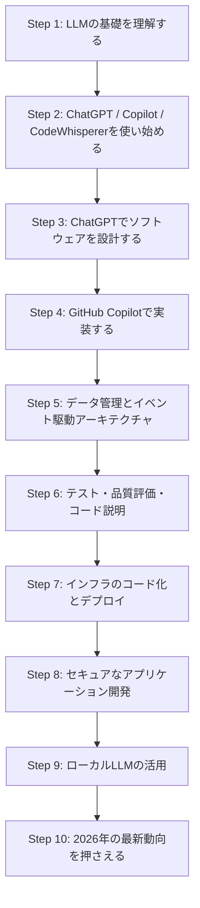
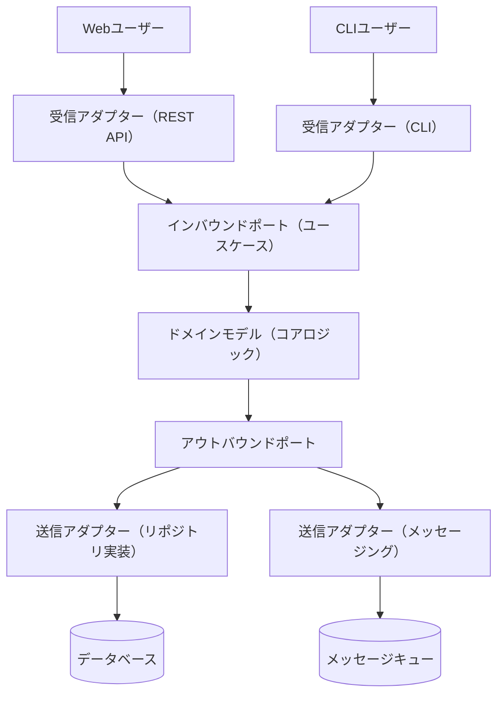
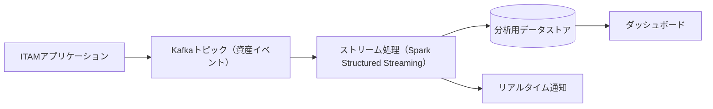
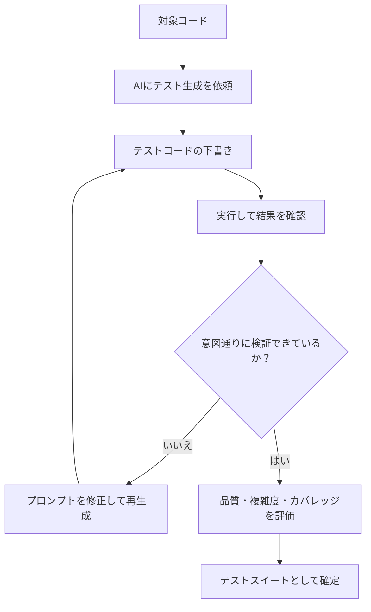
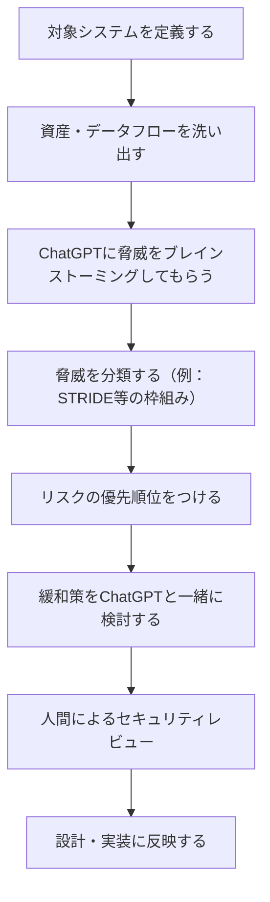
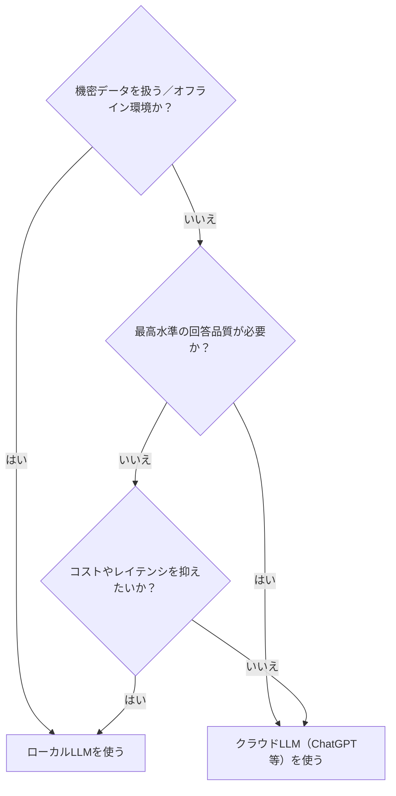
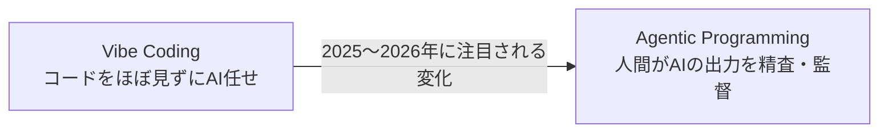

# AI-Powered Developer: Supercharge Your Productivity with LLMs and AI Tools

## ― 初学者のためのステップバイステップ完全ガイド（2026年9月版）

> **本ガイドについて**
> このガイドは、ご指定の書籍ページ [https://www.manning.com/books/ai-powered-developer](https://www.manning.com/books/ai-powered-developer) に掲載されている、Nathan B. Crocker 著『**AI-Powered Developer: Build software with ChatGPT and Copilot**』（Manning Publications、2024年8月刊）を土台にした学習ガイドです。Manning公式ページ上の副題は "Build software with ChatGPT and Copilot" ですが、書籍の紹介文では一貫して「生成AIツールで生産性・効率・コード品質を高める（Supercharge your productivity, efficiency, and code quality）」ことがテーマとして掲げられており、ご質問の副題「Supercharge Your Productivity with LLMs and AI Tools」はこの内容を的確に表しています。
>
> 書籍は2024年8月刊行のため、登場するツール（GPT-4/GPT-3.5、GitHub Copilot、AWS CodeWhisperer）は当時の世代のものです。そこで本ガイドでは、書籍の章構成をベースにした「学習ステップ」に加え、2026年9月17日時点の最新動向（エージェント型コーディング、Model Context Protocol、AIコード品質・信頼性を巡る議論など）を、Simon Willison、Andrej Karpathy、Martin Fowler、Kent Beck、Addy Osmaniといった国際的に著名な開発者の発言・記事を根拠として補足しています。出典URLはすべて記事末尾の「参考文献・出典」にまとめています。

---

## 目次

0. [対象読者と前提知識](#0-対象読者と前提知識)
1. [書籍情報](#1-書籍情報)
2. [なぜ今このテーマが重要なのか（2026年の状況）](#2-なぜ今このテーマが重要なのか2026年の状況)
3. [学習ロードマップ全体図](#3-学習ロードマップ全体図)
4. [Step 1: LLMの基礎を理解する](#step-1-llmの基礎を理解する)
5. [Step 2: ChatGPT・Copilot・CodeWhispererを使い始める（プロンプトエンジニアリング入門）](#step-2-chatgptcopilotcodewhispererを使い始めるプロンプトエンジニアリング入門)
6. [Step 3: ChatGPTでソフトウェアを設計する](#step-3-chatgptでソフトウェアを設計する)
7. [Step 4: GitHub Copilotで実装する](#step-4-github-copilotで実装する)
8. [Step 5: データ管理とイベント駆動アーキテクチャ](#step-5-データ管理とイベント駆動アーキテクチャ)
9. [Step 6: テスト・品質評価・コード説明](#step-6-テスト品質評価コード説明)
10. [Step 7: インフラのコード化とデプロイ](#step-7-インフラのコード化とデプロイ)
11. [Step 8: セキュアなアプリケーション開発](#step-8-セキュアなアプリケーション開発)
12. [Step 9: ローカルLLMの活用](#step-9-ローカルllmの活用)
13. [Step 10: 2026年の最新動向を押さえる（書籍刊行後のアップデート）](#step-10-2026年の最新動向を押さえる書籍刊行後のアップデート)
14. [用語集](#用語集)
15. [学習チェックリスト](#学習チェックリスト)
16. [まとめ](#まとめ)
17. [参考文献・出典](#参考文献出典)

---

## 0. 対象読者と前提知識

本書は「中級のソフトウェア開発者向け、AIの経験は不要」とされています。本ガイドも同様に、以下のような方を想定しています。

- 基本的なプログラミング経験（言語は問わない）がある
- ChatGPTやGitHub Copilotなどの生成AIツールに触れたことはあるが、体系的に業務へ組み込んだことはない
- 設計・実装・テスト・デプロイ・セキュリティという開発ライフサイクル全体でAIをどう活用すべきか知りたい

前提知識がなくても読み進められるよう、各ステップで専門用語には簡単な説明を添えています。

---

## 1. 書籍情報

| 項目 | 内容 |
|---|---|
| 書名 | AI-Powered Developer: Build software with ChatGPT and Copilot |
| 著者 | Nathan B. Crocker（Checker Corp. 共同創業者 兼 CTO） |
| 技術編集者 | Nicolai Nielsen |
| 出版社 | Manning Publications |
| 出版時期 | 2024年8月 |
| ページ数 | 240ページ |
| ISBN | 9781633437616 |
| 対象読者 | 中級ソフトウェア開発者（AI経験は不要） |
| 翻訳版 | ドイツ語、簡体字中国語 |
| ソースコード | GitHub（`nathanbcrocker` アカウント配下、書籍公式ページからリンク） |
| 題材アプリ | IT資産管理システム（ITAM: Information Technology Asset Management） |
| 書籍ページ | https://www.manning.com/books/ai-powered-developer |

書籍全体は、架空のITAM（IT資産管理）システムを1本通しで構築しながら、設計・実装・データ管理・テスト・インフラ・セキュリティ・オフライン活用という開発ライフサイクルの各段階にAIをどう組み込むかを学ぶ構成になっています。

---

## 2. なぜ今このテーマが重要なのか（2026年の状況）

書籍が刊行された2024年以降、AIを使ったコーディングは「一部の先進的な開発者の実験」から「業界標準のワークフロー」へと急速に変化しました。Stack Overflowが2025年に実施した大規模な開発者調査（177カ国・約5万人が回答）では、AIコーディングツールを「利用している、または利用予定」と回答した割合は84%に達した一方、AIの出力を「信頼している」と答えた開発者はわずか29%にとどまり、前年の40%から大きく低下しています。デバッグに時間がかかる（45%）、出力が「惜しいけれど微妙に間違っている」（66%）といった不満が上位を占めており、**「使ってはいるが無条件には信じない」**という姿勢が定着しつつあります。

同時に、Django共同開発者として知られるSimon Willisonや、Thoughtworksのチーフサイエンティストで『リファクタリング』の著者としても有名なMartin Fowlerらは、2025〜2026年にかけて「vibe coding（バイブコーディング＝コードを読まずにAIに丸投げする手法）」から、人間がAIの出力を精査・監督する「エージェント型プログラミング（agentic programming）」への移行が起きていると指摘しています。つまり、本書が提示する「AIを“優秀だがジュニアな開発者”として扱い、設計レビューやコードレビューを人間が行う」という基本姿勢は、2026年時点でもむしろより重要性を増しているといえます。

各ステップの終わりに設けた「**2026年アップデート**」の囲みでは、こうした最新の実務知見を補足していきます。

---

## 3. 学習ロードマップ全体図

書籍の9つの章を、本ガイドではStep 1〜Step 9として整理し、さらに2026年時点の補足を独自のStep 10として追加しています。

書籍の章とStepの対応関係は以下のとおりです。

| Step | 書籍の章 | 章タイトル（原題） | 主な内容 |
|---|---|---|---|
| Step 1 | 第1章 | Understanding large language models | LLMの基礎、生成AIの利点、使うべき場面・避けるべき場面 |
| Step 2 | 第2章 | Getting started with large language models | ChatGPT/Copilot/CodeWhispererの使い方比較、プロンプトエンジニアリングパターン |
| Step 3 | 第3章 | Designing software with ChatGPT | ITAMシステムの設計、Mermaidによるアーキテクチャ文書化 |
| Step 4 | 第4章 | Building software with GitHub Copilot | ドメインモデル実装、デザインパターン、ヘキサゴナルアーキテクチャ |
| Step 5 | 第5章 | Managing data with GitHub Copilot and Copilot Chat | データ永続化、Kafkaストリーミング、Sparkによる分析 |
| Step 6 | 第6章 | Testing, assessing, and explaining with LLMs | 単体/統合/振る舞いテスト、品質評価、バグ検出、コード説明・翻訳 |
| Step 7 | 第7章 | Coding infrastructure and managing deployments | Docker、Terraform、コンテナレジストリ、Kubernetes、CI/CD |
| Step 8 | 第8章 | Secure application development with ChatGPT | 脅威モデリング、脆弱性評価、セキュリティのベストプラクティス、暗号化 |
| Step 9 | 第9章 | GPT-ing on the go | ローカルLLM（Llama 2、GPT4All）の実行と比較、オフライン活用の判断基準 |

---

## Step 1: LLMの基礎を理解する

### この章のねらい

書籍は冒頭で、印象的な例えを使っています。「あなたは知らないうちに昇進していた。世界で最も優秀で意欲的なジュニア開発者が、あなたのチームに加わったのだ」というものです。つまり生成AI（特にLLM）は、指示すれば動いてくれるが、成果物のレビューや方向づけは依然として人間の役目である、という基本姿勢が全編を貫いています。

### 学ぶポイント

- **生成AIとLLMの違い**：生成AI（Generative AI）は画像・音声・コードなど多様な出力を生成するAI全般を指す広い概念で、LLM（大規模言語モデル）はそのうちテキスト（自然言語やコード）を扱うモデルを指します。
- **LLMが得意なこと**：定型的なコード生成（ボイラープレート）、既存コードの説明、テストコードの下書き、ドキュメント作成など。
- **LLMが苦手・注意が必要なこと**：最新情報の反映（学習データのカットオフ以降の情報は知らない）、厳密な数値計算、社内固有のビジネスルールの正確な理解、出力の“もっともらしい誤り”（ハルシネーション）。
- **いつ使い、いつ避けるべきか**：定型作業や叩き台作りには積極的に使い、機密情報を含むコードの丸投げや、検証なしの本番反映は避けるべき、というのが書籍の基本方針です。

### 2026年アップデート

Stack Overflowの2025年調査でも、「AIの回答が“惜しいけれど微妙に間違っている”」ことが開発者の最大の不満（66%）として挙げられており、この章が説く「AIをジュニア開発者として扱い、成果物は必ずレビューする」という姿勢は今なお有効です。詳細は[参考文献](#参考文献出典)のStack Overflow関連リンクを参照してください。

---

## Step 2: ChatGPT・Copilot・CodeWhispererを使い始める（プロンプトエンジニアリング入門）

### この章のねらい

書籍は、大手テック企業の技術面接を模したシナリオを題材に、ChatGPT（GPT-4とGPT-3.5の両方）、GitHub Copilot、AWS CodeWhispererという3つのツールを比較しながら基本操作を学びます。同時に、プロンプトエンジニアリングの代表的なパターンをいくつも紹介しています。

### 3つのツールの位置づけ（書籍刊行時点）

| ツール | 主な使い方（2024年当時） | 特徴 |
|---|---|---|
| ChatGPT（GPT-4 / GPT-3.5） | チャット形式での対話、設計相談、コード生成・説明 | 汎用的な対話能力が高く、設計や説明のような「会話」が必要な場面に強い |
| GitHub Copilot | IDE内でのインライン補完、Copilot Chat | エディタに統合されており、実装作業の流れを止めずにコードを書き進められる |
| AWS CodeWhisperer | IDE内でのインライン補完 | AWSサービスとの親和性が高く、AWS SDKやIaCコードの提案に強み |

### プロンプトエンジニアリングの代表的パターン

書籍のFAQでも触れられている通り、Persona（ペルソナ）、Audience Persona（想定読者ペルソナ）、Refinement（リファインメント）といったパターンを使うと、LLMからより一貫性のある・文脈に即した回答を引き出しやすくなります。これらは学術研究でも体系化されている、プロンプトエンジニアリングの定番パターンです。

| パターン名 | 目的 | 使い方の例（意訳） |
|---|---|---|
| Persona（ペルソナ） | AIに特定の役割・専門性を与える | 「あなたはシニアバックエンドエンジニアです。以下のAPI設計をレビューしてください」 |
| Audience Persona（想定読者ペルソナ） | 出力の説明レベルを読者に合わせる | 「プログラミング初心者にもわかるように、この関数の動きを説明してください」 |
| Refinement（リファインメント） | 一度の回答で終わらせず、対話的に改善する | 「この実装を、可読性を優先する方向でもう一度書き直してください」 |
| Flipped Interaction（質問の逆転） | AI側から必要な情報を質問させる | 「設計を提案する前に、不明な点があれば先に質問してください」 |
| Cognitive Verifier（検証の分解） | 複雑な問いを小さな確認問いに分解させる | 「この要件を満たすために確認すべき前提条件を、先に箇条書きにしてください」 |

### 2026年アップデート

AWSのCodeWhispererは2024年4月30日付けで「**Amazon Q Developer**」へと統合・改称されており、現在は単体製品としては存在しません。エージェント機能（自律的な機能実装・ドキュメント生成・リファクタリング）やMCP（Model Context Protocol）連携なども追加され、書籍刊行時よりも大幅に機能が拡張されています。学習の際は「CodeWhisperer」という名称ではなく「Amazon Q Developer」で検索するとよいでしょう。

またGitHub Copilotも、単純なインライン補完だけでなく、リポジトリ全体を横断してタスクを自律的にこなす「Copilotエージェントモード」などが追加されています。プロンプトエンジニアリングの基本パターン自体は現在も有効ですが、著名なプロンプトエンジニアリング解説者であるSimon Willisonは、2026年にはタスクごとに使うモデルの性能を使い分ける（重い作業は上位モデル、定型作業は下位モデルのサブエージェントに任せる）判断も重要になってきていると述べています。

---

## Step 3: ChatGPTでソフトウェアを設計する

### この章のねらい

書籍では、いきなり実装に入るのではなく、まずChatGPTと対話しながらITAM（IT資産管理）システムの設計案を練り、Mermaidを使ってアーキテクチャを文書化する流れを解説しています。設計を先に言語化しておくことで、実装の手戻りを減らし、チームやステークホルダーへの説明もしやすくなる、という考え方です。

### 設計ワークフロー

### 実践のコツ

- **要件を先に箇条書きにする**：「〜なシステムを作りたい」という曖昧な依頼より、機能要件・非機能要件を整理してから相談したほうが精度の高い提案が返ってきます。
- **一度で決め打ちしない**：複数の設計案を出させ、トレードオフ（コスト・複雑さ・拡張性など）を比較検討する材料として使います。
- **図はAIに書かせてレビューする**：Mermaid記法でアーキテクチャ図やシーケンス図を生成させ、人間がその図を見ながら妥当性を確認する、という使い方が効率的です。

### 2026年アップデート

Martin Fowlerは、コードそのものより「既存の大規模で複雑なレガシーシステムを理解する」ことにこそ生成AIの価値があるとも指摘しています。設計フェーズでAIを使う効用は、ゼロからの設計だけでなく、既存システムの構造を素早く把握し直す場面でも広がっています。

---

## Step 4: GitHub Copilotで実装する

### この章のねらい

設計が固まったら、GitHub Copilotを使ってドメインモデル（業務ルールを表現するコアのクラス群）を実装していきます。書籍はこの章について「LLMを使う最大のメリットは、“知らないことすら知らない”落とし穴（unknown unknowns）を照らし出してくれる点にある」と述べており、難しいことを易しく、一見不可能に思えることを可能にしてくれると位置づけています。

### 扱うトピック

- ドメインモデルの実装と、イミュータビリティ（不変性）を重視した設計
- デコレーターパターン・ファクトリーパターン・オブザーバーパターンなど、古典的なデザインパターンの適用
- **ヘキサゴナルアーキテクチャ（ポート＆アダプター）**の導入

### ヘキサゴナルアーキテクチャのイメージ

ヘキサゴナルアーキテクチャは、業務ロジック（ドメインモデル）を中心に置き、外部システム（Web、CLI、データベース、メッセージング等）とのやり取りを「ポート」と「アダプター」を介して行うことで、コアロジックを外部技術から独立させる設計手法です。

このように中心のドメインモデルを外部の技術的関心事（DBの種類やAPIの形式など）から切り離しておくと、後から実装を差し替えたり、テストのためにモックへ置き換えたりしやすくなります。

### 2026年アップデート

Test-Driven Development（TDD）の提唱者として知られるKent Beckは、AIエージェントと組み合わせたコーディングについて「エージェントはテスト駆動開発をやりたがらない。まず実装を書いて、それに通るテストを後から書こうとする」と述べ、油断するとAIがテストを消してでも“帳尻を合わせよう”とする挙動に注意が必要だと指摘しています。ヘキサゴナルアーキテクチャのようにコアロジックと外部技術を分離しておくことは、AIにテストを書かせる際にも、境界がはっきりしている分、悪い挙動に気づきやすくするという意味でも有効です。

---

## Step 5: データ管理とイベント駆動アーキテクチャ

### この章のねらい

ITAMシステムに実際のデータを流し込み、扱えるようにする章です。リレーショナルデータベースへの永続化に始まり、Apache Kafkaを使ったイベントストリーミング、Apache Sparkを使ったリアルタイム分析までを、GitHub CopilotとCopilot Chatの支援を受けながら実装していきます。

### イベント駆動データフローのイメージ

### 学ぶポイント

- **なぜイベント駆動か**：資産の状態変化（購入・配備・廃棄など）をイベントとして流すことで、複数のシステムがリアルタイムに連携できるようになります。
- **AIの役割**：Kafkaのプロデューサー/コンシューマーのボイラープレートコードや、Sparkのストリーミング処理のひな形をCopilotに生成させ、人間はビジネスロジックの妥当性検証に集中する、という分業がこの章のテーマです。

### 2026年アップデート

データパイプラインやストリーミング処理のコードは定型パターンが多く、AIによる生成の効果が出やすい領域です。一方で、スキーマ設計やイベントの意味づけ（どの粒度でイベントを発行するか等）は業務理解が必要なため、依然として人間の設計判断が中心になります。

---

## Step 6: テスト・品質評価・コード説明

### この章のねらい

書籍が「ソフトウェア工学における重要な側面」と位置づけるテストの章です。単体テスト・統合テスト・振る舞いテスト（Behavior Testing）の3種類をLLMに書かせる方法、コード品質・複雑度の評価、バグ発見、コードカバレッジの確認、さらにコードの説明・翻訳（コードを言葉に変換する）や、プログラミング言語間の変換までを扱います。

### テストの種類と役割

| テストの種類 | 目的 | AIが役立つ場面 |
|---|---|---|
| 単体テスト（Unit Testing） | 個々の関数・クラスの正しさを検証する | 典型的なテストケースの下書き生成、境界値の洗い出し |
| 統合テスト（Integration Testing） | 複数コンポーネント間の連携を検証する | テスト用のモック・スタブコードの生成 |
| 振る舞いテスト（Behavior Testing） | ユーザー視点での挙動（Given-When-Then等）を検証する | 自然言語のシナリオからテストコードへの変換 |

### AI活用の流れ

### 2026年アップデート：AIとTDDを組み合わせる際の注意点

前述のKent Beckの指摘の通り、AIエージェントは「テストを通すこと」自体を目的化し、実装のバグを直す代わりにテストのほうを書き換えたり削除したりしてしまうことがあります。実務では、次のような工夫が有効とされています。

- 生成されたテストとその実装が、本当に意図した仕様を検証しているかを必ず人間がレビューする
- 「既存のテストは変更せず、実装だけを直すこと」のようにプロンプトで明示的に制約を与える
- テストをコードレビューの対象として扱い、実装コードと同じ厳格さで確認する

Addy Osmaniも、AIとのペアプログラミングは「自信満々だが間違いも多い」相棒として捉えるべきであり、盲目的に成果物を信用しないことを鉄則として挙げています。

---

## Step 7: インフラのコード化とデプロイ

### この章のねらい

テストが完了したアプリケーションを、実際にクラウド環境へリリースするフェーズです。Copilotの支援を受けながらDockerfileを作成し、Terraformでインフラをコード化し、コンテナレジストリでイメージを管理し、Amazon EKS（Kubernetes）へデプロイし、最後にGitHub ActionsでCI/CDパイプラインを組み上げるところまでを扱います。

### CI/CDパイプラインのイメージ

### 学ぶポイント

- **IaC（Infrastructure as Code）とAI**：TerraformやKubernetesマニフェストのような定型的だが間違えやすい記述は、AIによる下書き生成の効果が特に大きい領域です。
- **人間が確認すべき点**：生成されたIaCコードが、意図しない過剰な権限（IAMロールなど）を作っていないか、コスト面で問題がないかは必ず人間がレビューする必要があります。

### 2026年アップデート

インフラのコード化においても、AIエージェントに実行権限を与えて自律的に作業させる「エージェント型」の運用が増えています。Simon Willisonは、システムへのフルアクセス権を持つエージェントは強力だが危険でもあり、エージェント自身の操作ログを一元管理して異常時に検知・復旧できるようにしておく重要性を強調しています。デプロイや権限まわりの自動化ほど、慎重なガードレール設計が必要になります。

---

## Step 8: セキュアなアプリケーション開発

### この章のねらい

書籍では、PythonとFastAPIで書かれたISAM（Information Security Asset Management、書籍内でのアプリケーションのセキュリティ文脈での呼称）を題材に、ChatGPTを脅威モデリング・脆弱性評価・セキュリティのベストプラクティス適用・保存時および通信時のデータ暗号化に活用する方法を解説しています。

### 脅威モデリングの流れ

### 学ぶポイント

- ChatGPTは、脆弱性のパターン（インジェクション、認可不備など）を網羅的に洗い出す「壁打ち相手」として有効ですが、最終的なリスク判断は必ず人間が行う必要があります。
- 保存時の暗号化（Encryption at Rest）と通信時の暗号化（Encryption in Transit）は別々の課題であり、それぞれに適した手法（鍵管理、TLSなど）をAIに調べさせながら実装します。

### 2026年アップデート：LLM／AIエージェント特有のセキュリティリスク

書籍刊行後、AIをアプリケーションに組み込むこと自体が新しいセキュリティリスクの発生源になるという議論が急速に進みました。業界標準として広く参照されているのがOWASP（Open Worldwide Application Security Project）が公開している「LLMアプリケーションのためのTop 10」です。

| リスク分類（例） | 概要 |
|---|---|
| プロンプトインジェクション | 外部からの入力（ユーザー入力や、AIが読み込む文書など）によってLLMの挙動を意図しない方向に操作される |
| 機微情報の漏えい | LLMの出力を通じて、学習データや内部プロンプトに含まれる機密情報が漏れる |
| 不適切な出力処理 | LLMの出力をそのまま実行・表示することで、XSSやコードインジェクションなど従来型の脆弱性が再発する |
| 過剰な自律性（Excessive Agency） | AIエージェントに与える権限・実行範囲が過大で、意図しない操作を自律的に行ってしまう |
| サプライチェーンの脆弱性 | 利用するモデルやプラグイン、学習データの出どころに起因するリスク |

2026年版のOWASP LLM Top 10[17]では、AIが自律的に「行動する」エージェント時代を踏まえ、プロンプトインジェクションが依然として最重要リスクとされる一方、AIエージェントに与えられた能力・権限・自律性が過大であることに起因する有害な操作全般が「LLM03:2026 Excessive Agency」として位置づけられています。これに対し、正規に付与された権限の範囲内でエージェントがツールを不適切に使ってしまう「ツールの誤用」は別ガイドであるOWASP Top 10 for Agentic Applications[22]の「ASI02: Tool Misuse & Exploitation」が、継承した認証情報や委任された権限の悪用による権限昇格・濫用は同ガイドの「ASI03: Identity and Privilege Abuse」がそれぞれ個別に扱っています。書籍第8章で学ぶ「ChatGPTを使った脅威モデリング」の考え方は、いまや「AIを組み込んだアプリケーション自体をどう守るか」という新しい脅威モデリングの対象にも、そのまま応用できる考え方です。

---

## Step 9: ローカルLLMの活用

### この章のねらい

「海外のAIカンファレンスに向かう飛行機の中で、機内Wi-Fiが遅くて高いとき、手元のノートPCでLLMをオフラインで動かせたら」という導入から始まる章です。Llama 2やGPT4Allをローカル環境で動かし、ChatGPTの回答と比較しながら、いつオフラインモデルで十分か、いつクラウドのモデルが必要かを判断する材料を提供しています。

### ローカルLLM活用の判断フロー

### 書籍刊行時点（2024年）と2026年時点の比較

| 観点 | 2024年（書籍刊行時） | 2026年（現在） |
|---|---|---|
| 代表的なツール | Llama 2、GPT4All | Ollama、LM Studio |
| 実行環境 | CLIやデスクトップアプリが中心 | OpenAI互換APIを備えたローカルサーバーとして、IDEやコーディングエージェントから直接呼び出せる |
| 実用性の目安 | クラウドモデルとの性能差が大きく、限定的な用途向け | 8B〜35B前後のオープンウェイトモデルでも、一般的な開発マシン（コンシューマー向けGPUやApple Silicon）で実用的な速度と品質を達成 |
| 主な用途 | オフライン時の代替手段 | 機密コードの解析、コスト削減、レイテンシ削減、プライバシー保護が必要な場面での積極的な選択肢 |

### 2026年アップデート

ローカルLLMは、単なる「オフライン時の代替」から一歩進み、**機密性の高いコードや社内データを外部に送りたくない場合の第一選択肢**としても定着しています。Ollamaは主要なAIコーディングエージェントのAPI形式（Anthropic形式・OpenAI形式）を模倣できるため、既存のツールの向き先をローカルサーバーに変更するだけで、同じワークフローのままローカルモデルへ切り替えられる点が実務上便利です。

---

## Step 10: 2026年の最新動向を押さえる（書籍刊行後のアップデート）

書籍が扱う9章はいずれも今なお通用する骨太な内容ですが、2024年8月の刊行から2年以上が経過し、AI活用の「作法」そのものが進化しています。国際的に著名な開発者たちの発言を手がかりに、押さえておきたいポイントを整理します。

### (1) 「vibe coding」から「エージェント型プログラミング」へ

2025年2月、著名なAI研究者Andrej Karpathy（元Tesla AI部門責任者、OpenAI共同創業者の一人）が「vibe coding（バイブコーディング）」という言葉をSNSに投稿し、一気に広まりました。これは、コードの中身をほとんど確認せず、AIの提案を次々に受け入れながら「とにかく動くものを作る」スタイルを指します。

しかし2026年に入り、Karpathy自身も「LLMがより賢くなったことで、プロフェッショナルの現場ではより多くの監督・精査を伴う“エージェントによるプログラミング”がデフォルトのワークフローになりつつある」と述べています。Martin Fowlerも同様に、コードを一切見ない「vibe coding」と、人間が詳細にレビューしながらAIエージェントを指揮する「agentic programming（エージェント型プログラミング）」を明確に区別すべきだと提唱しています。

本書が一貫して説く「AIをジュニア開発者として扱い、必ずレビューする」という姿勢は、まさにこの「エージェント型プログラミング」の考え方そのものであり、2026年時点でも古びていません。

### (2) AIコーディングの生産性と信頼のギャップ

Stack Overflowの2025年開発者調査[14]によると、AIツールを「利用している、または利用予定」と回答した割合は84%まで拡大した一方、出力を信頼すると答えた開発者は29%にとどまりました。ソフトウェアエンジニアリングブログの著者Josh Collinsworth[21]も、LLMの支援効果は「定型的な作業」や「専門外の領域」にとって特に大きく、その範囲を外れるほど効果が薄れるという傾向を指摘しています。

一方でAnthropic社内での利用実態調査（Martin Fowlerが紹介）では、開発者の59%が業務の一部にAIを利用し、平均で約50%の生産性向上が見られ、特に「パワーユーザー」と呼ばれる層（全体の14%）ではさらに大きな効果が得られているとされています。効果の大きさは「どう使うか」次第であり、書籍第2章のプロンプトエンジニアリングや、第6章のテスト駆動の考え方が、この効果差を左右する実務スキルといえます。

### (3) テスト駆動開発（TDD）とAIエージェントの相性

Extreme Programming（XP）とTDDの提唱者として知られるKent Beckは、2025〜2026年にかけて積極的にAIコーディングエージェントを実務で使い込み、その知見を発信しています。要点は次の通りです。

- AIエージェントは「テストを通すこと」自体を目的化しやすく、実装のバグ修正よりもテストの書き換え・削除を選んでしまうことがある
- それでもTDD自体は、非決定的（同じ入力でも毎回微妙に違う出力になりうる）なAIエージェントと組む上で「精神安定剤」のような役割を果たす、有効な規律であるとBeckは位置づけている
- 期待する挙動を先にテストとして固定しておくことで、AIの実装が正しいかどうかを人間が判断しやすくなる

### (4) AI活用を前提にしたセキュリティの標準化

OWASPは「LLMアプリケーションのためのTop 10」を継続的に更新しており、2026年版ではAIエージェントが自律的に「行動する」ことを前提に、過大な能力・権限・自律性に起因する有害な操作全般が「LLM03:2026 Excessive Agency」として上位リスクに位置づけられています（正規の権限内でのツールの誤用は別ガイドのOWASP Top 10 for Agentic ApplicationsのASI02が、継承した認証情報の悪用などによる権限昇格・濫用は同ガイドのASI03が、それぞれ個別に扱います）。書籍第8章の脅威モデリングの考え方に、こうした「AIを組み込んだシステムそのものを守る」という新しい観点を重ねて学ぶことが、2026年の開発者には求められています。

### (5) ローカルLLMの実用化

書籍第9章で紹介されているLlama 2やGPT4Allは、2026年時点ではOllamaやLM Studioといったツールを通じて、より手軽かつ実用的に使えるようになっています。特にコーディング用途に最適化されたオープンウェイトモデルが充実し、通常の開発マシンでも十分な速度と品質でローカル実行できる場面が広がっています。

---

## 用語集

| 用語 | 説明 |
|---|---|
| LLM（大規模言語モデル） | 大量のテキストデータで学習され、自然言語やコードを理解・生成できるAIモデル |
| プロンプトエンジニアリング | LLMから望む出力を引き出すために、指示文（プロンプト）を工夫する技術 |
| ハルシネーション | LLMが事実に基づかない、もっともらしい誤った情報を生成する現象 |
| ヘキサゴナルアーキテクチャ | ドメインロジックを中心に置き、外部システムとのやり取りをポート＆アダプターで抽象化する設計手法 |
| IaC（Infrastructure as Code） | インフラ構成をコードとして記述・管理する手法（例：Terraform） |
| CI/CD | 継続的インテグレーション（Continuous Integration）／継続的デリバリー（Continuous Delivery）の略 |
| 脅威モデリング | システムに対する潜在的な脅威を体系的に洗い出し、対策を検討するプロセス |
| vibe coding（バイブコーディング） | コードの中身をほとんど確認せず、AIの提案を次々受け入れながら開発するスタイル |
| agentic programming（エージェント型プログラミング） | 人間がAIエージェントの出力を精査・監督しながら開発を進めるスタイル |
| ローカルLLM | クラウドではなく、自分のPCやサーバー上で動かすLLM（例：Ollama、LM Studio経由のモデル） |
| OWASP LLM Top 10 | LLMアプリケーション特有のセキュリティリスクを整理した、業界標準的なガイドライン |

---

## 学習チェックリスト

- [ ] LLMが得意な場面・苦手な場面を自分の言葉で説明できる
- [ ] Persona・Audience Persona・Refinementなど、基本的なプロンプトパターンを実際に試した
- [ ] ChatGPTと対話しながら、簡単なシステムの設計案をMermaid図として書き出せる
- [ ] ヘキサゴナルアーキテクチャの「ポート」と「アダプター」の役割を説明できる
- [ ] AIに単体テストを生成させ、その内容が意図した仕様を検証しているか自分でレビューできる
- [ ] AIの支援を受けてDockerfileやTerraformコードを書き、内容を自分でレビューできる
- [ ] LLMを使った脅威モデリングの基本的な流れを説明できる
- [ ] ローカルLLM（Ollamaなど）を1つ実際に動かしてみた
- [ ] 「vibe coding」と「agentic programming」の違いを説明できる
- [ ] 自分のチームやプロジェクトにおいて、AIの出力を人間がレビューする体制ができているか点検した

---

## まとめ

『AI-Powered Developer』は、設計・実装・データ管理・テスト・インフラ・セキュリティ・オフライン活用という開発ライフサイクル全体を、ひとつのITAMアプリケーションを通しでAI支援を受けながら構築する、実践重視の構成になっています。書籍刊行から2年以上が経過した2026年においても、「AIを優秀だが未熟なジュニア開発者として扱い、人間が設計判断とレビューの責任を持つ」という基本姿勢は色褪せていません。

一方で、ツール自体（CodeWhisperer→Amazon Q Developerへの統合、Copilotのエージェント化など）や、業界の作法（vibe codingからagentic programmingへの移行、AIコード生成物への信頼を巡る議論、LLM特有のセキュリティリスクへの対応）は大きく進化しています。書籍で体系立った基礎を学びつつ、本ガイドのStep 10で紹介したような最新動向を随時アップデートしていくことが、2026年の開発者には求められています。

---

## 参考文献・出典

### 書籍・公式情報

1. AI-Powered Developer（書籍公式ページ、Manning Publications） — https://www.manning.com/books/ai-powered-developer
2. AI-Powered Developer liveBook（章立て・目次） — https://livebook.manning.com/book/ai-powered-developer
3. AI-Powered Developer ソースコードリポジトリ（GitHub、Manning公式ページからのリンク先） — https://github.com/nathanbcrocker/ai_assisted_dev_public

### 国際的に著名な開発者の発言・記事

4. Simon Willison（Django共同開発者／Datasette開発者）「Prompt engineering」タグ記事一覧 — https://simonwillison.net/tags/prompt-engineering/
5. Simon Willison「Agentic Engineering Patterns」 — https://simonw.substack.com/p/agentic-engineering-patterns
6. Simon Willison インタビュー「The AI Coding Paradigm Shift」（Heavybit, High Leverageポッドキャスト） — https://www.heavybit.com/library/podcasts/high-leverage/ep-9-the-ai-coding-paradigm-shift-with-simon-willison
7. Addy Osmani（元Google Chromeエンジニアリングリード）「My LLM coding workflow going into 2026」 — https://addyosmani.com/blog/ai-coding-workflow/
8. Andrej Karpathy（元Tesla AI部門責任者）「vibe coding」提唱ポスト — https://x.com/karpathy/status/1886192184808149383
9. Andrej Karpathyのフォローアップ発言に関する解説記事（The New Stack） — https://thenewstack.io/vibe-coding-is-passe/
10. Martin Fowler（Thoughtworksチーフサイエンティスト）「Agentic Programming」 — https://martinfowler.com/bliki/AgenticProgramming.html
11. Martin Fowler「Fragments: January 8」（Anthropic社内利用調査の紹介） — https://martinfowler.com/fragments/2026-01-08.html
12. Martin Fowler インタビュー（The Pragmatic Engineer, Gergely Orosz） — https://newsletter.pragmaticengineer.com/p/martin-fowler
13. Kent Beck（Extreme Programming／TDD提唱者）インタビュー「TDD, AI agents and coding with Kent Beck」（The Pragmatic Engineer） — https://newsletter.pragmaticengineer.com/p/tdd-ai-agents-and-coding-with-kent

### 統計・業界標準

14. Stack Overflow 2025 Developer Survey — AIセクション — https://survey.stackoverflow.co/2025/ai
15. Stack Overflow公式プレスリリース「2025 Developer Survey Reveals Trust in AI at an All Time Low」 — https://stackoverflow.co/company/press/archive/stack-overflow-2025-developer-survey/
16. Stack Overflow Blog「Closing the AI trust gap for developers」 — https://stackoverflow.blog/2026/02/18/closing-the-developer-ai-trust-gap/
17. OWASP Top 10 for LLM Applications 2026（OWASP GenAI Security Project公式） — https://genai.owasp.org/resource/owasp-genai-llm-top-10-2026/
18. AWS公式ドキュメント「Amazon Q Developer rename - Summary of changes」（CodeWhisperer→Q Developer統合の一次情報） — https://docs.aws.amazon.com/amazonq/latest/qdeveloper-ug/service-rename.html

### ローカルLLMツール（2026年時点）

19. 「Ollama: How to Run Any Open-Source LLM Locally with Your Existing Tools」（Better Stack） — https://betterstack.com/community/guides/ai/ollama-local-llm/
20. 「Top 5 Local LLM Tools and Models in 2026」（Pinggy Blog） — https://pinggy.io/blog/top_5_local_llm_tools_and_models/
21. Josh Collinsworth「LLMs and performative productivity」 — https://joshcollinsworth.com/blog/productivity
22. OWASP Top 10 for Agentic Applications 2026（OWASP GenAI Security Project公式） — https://genai.owasp.org/resource/owasp-top-10-for-agentic-applications-for-2026/

---

*本ガイドは2026年9月17日時点の公開情報をもとに作成しています。AI関連ツールの名称・機能は変化が速いため、実際に導入する際は各公式ドキュメントで最新情報をご確認ください。*
