# Google Agent Development Kit（ADK）実践ガイド
## 中級者・上級者向け ステップバイステップ ベストプラクティス

> 対象読者: Python/Javaなどでエージェント開発の基礎を理解しており、これから本番運用レベルのマルチエージェントシステムを設計・実装したいエンジニア
> 最終更新の元情報: 2026年7月時点でのADK公式ドキュメント（adk.dev / Google Cloud Documentation）に基づく

---

## 更新情報（重要）

ADKは非常に速いペースで進化しているフレームワークです。本ガイドの執筆時点で押さえておくべき最新の変化は次のとおりです。

- ADKの公式ドキュメントサイトは `google.github.io/adk-docs` から **`adk.dev`** に統合されました。
- Vertex AI Agent Engineは、Google Cloudの新しい **Gemini Enterprise Agent Platform** の一部である **Agent Runtime** に統合されています。本ガイドでは新名称の「Agent Runtime」で統一します。
- ADK 2.0以降では、固定的なワークフロー（Sequential / Parallel / Loop）に加えて、単一のエージェントが動的にコーディネーター役を担う **Collaborative workflows** が追加されています。
- Context Caching（コンテキストキャッシュ）とContext Compaction（コンテキスト圧縮）が正式な`App`レベルの設定として提供され、長時間セッションのコスト・レイテンシ最適化が標準機能になりました。
- ADKはPythonだけでなく、Java・Go・Kotlin・TypeScriptでも同等のAPIが提供されるマルチ言語フレームワークになっています。

---

## 目次

1. [ADKとは何か - 全体像](#1-adkとは何か---全体像)
2. [アーキテクチャの全体像](#2-アーキテクチャの全体像)
3. [ステップ1: 開発環境のセットアップ](#3-ステップ1-開発環境のセットアップ)
4. [ステップ2: エージェント設計の基本](#4-ステップ2-エージェント設計の基本)
5. [ステップ3: マルチエージェントシステム設計](#5-ステップ3-マルチエージェントシステム設計)
6. [ステップ4: ツール設計のベストプラクティス](#6-ステップ4-ツール設計のベストプラクティス)
7. [ステップ5: セッション・状態・メモリ管理](#7-ステップ5-セッション状態メモリ管理)
8. [ステップ6: コンテキストエンジニアリング](#8-ステップ6-コンテキストエンジニアリング)
9. [ステップ7: コールバックとプラグインによる制御](#9-ステップ7-コールバックとプラグインによる制御)
10. [ステップ8: エージェントの評価（Evaluation）](#10-ステップ8-エージェントの評価evaluation)
11. [ステップ9: 可観測性（Observability）](#11-ステップ9-可観測性observability)
12. [ステップ10: A2Aプロトコルによるエージェント間連携](#12-ステップ10-a2aプロトコルによるエージェント間連携)
13. [ステップ11: デプロイ戦略](#13-ステップ11-デプロイ戦略)
14. [本番運用チェックリスト](#14-本番運用チェックリスト)
15. [参考文献](#15-参考文献)

---

## 1. ADKとは何か - 全体像

Agent Development Kit（ADK）は、Googleが開発しているオープンソースのコードファーストなエージェント開発フレームワークです。単純な単一ツール利用のアシスタントから、複数の専門エージェントが協調して動く企業レベルのワークフローまで、同じプログラミングモデルの上で段階的に複雑さを積み上げていけるように設計されています。

ADKの中核にある価値提案は次の3点に集約されます。

- **コードファースト**: エージェントの振る舞い、ツール、オーケストレーションロジックをすべてコードとして定義でき、バージョン管理・テスト・レビューといった通常のソフトウェア工学のプラクティスをそのまま適用できます。
- **モデル非依存かつGemini最適化**: LiteLLM経由で様々なモデルプロバイダーを利用できる一方、Geminiモデルとネイティブに統合されており、Context Caching・Thinkingなどの機能を最大限活用できます。
- **マルチエージェントをネイティブサポート**: 単一のエージェントを組み立てるAPIと、複数のエージェントを階層化・連携させるAPIが同じ抽象化（`BaseAgent`）の上に統一されています。

本ガイドは、単体エージェントの作り方ではなく、**中級者から上級者が本番運用を見据えて意思決定すべきポイント**（マルチエージェント設計、状態管理、コンテキスト最適化、ガードレール、評価、可観測性、デプロイ）を中心に解説します。

---

## 2. アーキテクチャの全体像

ADKアプリケーションは、次の主要コンポーネントの組み合わせとして構成されます。`Runner`が中心となり、`Session Service`・`Memory Service`・`Artifact Service`・エージェント本体・モデル・ツールをつなぎ合わせます。

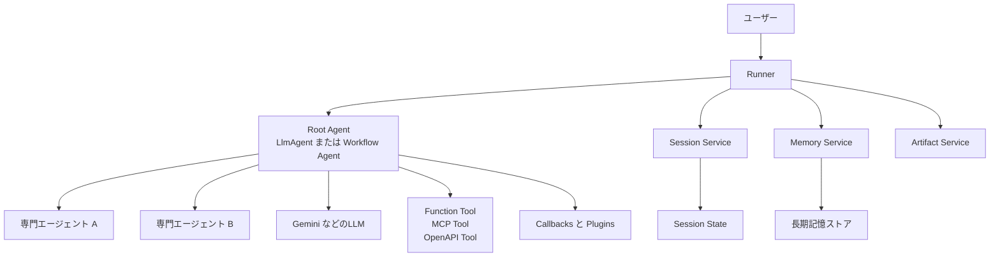

各要素の役割を整理すると次のとおりです。

| コンポーネント | 役割 | 主な実装選択肢 |
|---|---|---|
| Runner | 1回の呼び出しのライフサイクル全体を統括し、Event をSession Serviceに永続化する | `Runner`（同期/非同期実行） |
| Session Service | 会話単位のイベント履歴と`state`を管理する | InMemory / Database / Agent Runtime管理型 |
| Memory Service | セッションをまたいだ長期知識を検索可能な形で保持する | InMemory / RAGベース（Vertex AI RAG, Memory Bank） |
| Agent | 推論・ツール呼び出し・委譲を行う中心的な単位 | `LlmAgent` / `SequentialAgent` / `ParallelAgent` / `LoopAgent` / カスタム`BaseAgent` |
| Tools | エージェントが外部世界とやり取りする手段 | Function Tool / MCP Tool / OpenAPI Tool / AgentTool |
| Callbacks / Plugins | 実行ライフサイクルへのフック | エージェント単位のCallback / Runner単位のPlugin |

*出典: ADK公式ドキュメント「About」および「Sessions」*
`https://adk.dev/get-started/about/` / `https://adk.dev/sessions/`

---

## 3. ステップ1: 開発環境のセットアップ

### 3.1 インストール

Pythonの場合の基本セットアップは次のとおりです。

```bash
python3 -m venv .venv
source .venv/bin/activate
pip install google-adk python-dotenv
export GOOGLE_API_KEY="your_api_key_here"
```

Java / Go / Kotlin / TypeScriptでも同等のSDKが提供されており、`LlmAgent`や`SessionService`などの主要概念は言語間で一貫した設計になっています。チーム内で複数言語を使い分ける場合でも、アーキテクチャ設計の議論は共通言語で行えます。

### 3.2 プロジェクト構成のベストプラクティス

推奨されるディレクトリ構成は次のとおりです。エージェントをPythonパッケージとして扱うことで、`adk web`や`adk run`などのCLIツールから自動検出させることができます。

```
parent_folder/
├── requirements.txt
└── my_agent/
    ├── __init__.py       # root_agentをエクスポート
    ├── agent.py          # Agent / App定義
    ├── tools.py          # Function Tool定義
    ├── callbacks.py       # Callback定義
    └── .env
```

### 3.3 開発ループのベストプラクティス

- ローカル開発では`adk web`を使い、インタラクティブなWeb UIでエージェントを試しながらセッションとトレースを確認する。
- ロジックが固まったら`.test.json`形式のゴールデンケースを作成し、`adk eval`で自動回帰テスト化する（詳細はステップ8）。
- Pluginを使う場合は、Web UIではPluginが適用されない点に注意し、`adk run`または`adk api_server`で最終確認を行う。

*出典: ADK公式ドキュメント「Deploying Your Agent」およびコミュニティ記事*
`https://google.github.io/adk-docs/deploy/`

---

## 4. ステップ2: エージェント設計の基本

`LlmAgent`はADKの最も基本的な構成単位で、モデル・指示（instruction）・ツール・サブエージェントを組み合わせて定義します。

```python
from google.adk.agents import Agent

root_agent = Agent(
    name="weather_agent",
    model="gemini-flash-latest",
    description="指定された都市の天気情報を返すエージェント",
    instruction="""
    ユーザーが指定した都市の天気を get_weather ツールで取得し、
    簡潔な日本語で回答してください。
    """,
    tools=[get_weather],
)
```

### 設計時のベストプラクティス

- **`description`は正直かつ具体的に書く**: マルチエージェント構成では、コーディネーターがこの`description`だけを頼りに委譲先を選ぶため、曖昧な説明は誤ルーティングの原因になります。
- **`instruction`と`static_instruction`を使い分ける**: セッションを通じて変化しない指示は`static_instruction`に分離すると、Context Cachingのキャッシュヒット率が向上します。
- **ツールは単一責任にする**: 1つのツールに複数の意味を持たせず、モデルが引数だけで意図を判断できる粒度に保つ。
- **エージェント名は一意かつ説明的にする**: トレースやログでの識別性が大きく向上します。

---

## 5. ステップ3: マルチエージェントシステム設計

単一エージェントが対応できる範囲を超えたら、複数の専門エージェントに責務を分割します。ここがADKの最大の強みであり、設計判断が本番品質を左右する部分です。

### 5.1 エージェント階層とワークフローエージェント

ADKは3種類のワークフローエージェントを標準提供しています。

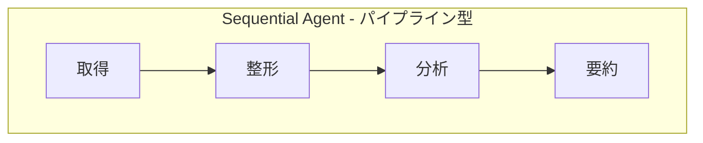

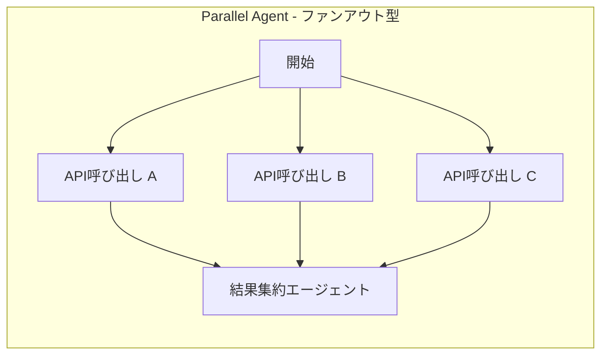

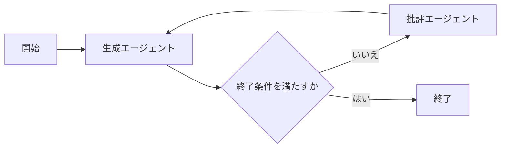

| ワークフローエージェント | 用途 | 例 |
|---|---|---|
| SequentialAgent | 前段の出力を次段の入力とする多段パイプライン | データ取得 to クレンジング to 分析 to レポート生成 |
| ParallelAgent | 独立したタスクを同時実行しレイテンシを削減する | 複数APIへの同時問い合わせ、複数視点でのレビュー |
| LoopAgent | 終了条件を満たすまでサブエージェントを繰り返す | Generator と Critic による反復的な品質改善 |

*出典: ADK公式ドキュメント「Workflow Agents」「Workflow Patterns」*
`https://adk.dev/workflows/patterns/` / `https://adk.dev/workflows/`

ADK 2.0では、これらの固定構造に加えて、単一のLLMエージェントが実行時に動的にサブエージェントを選ぶ**Collaborative workflows**（コーディネーターパターンの発展形）も利用できます。

### 5.2 代表的なマルチエージェント設計パターン

| パターン名 | 概要 | 適したユースケース |
|---|---|---|
| Coordinator / Dispatcher | 中央のLLMエージェントが意図を解釈し、専門サブエージェントにリクエストを振り分ける | カスタマーサポートの一次受付、意図分類 |
| Sequential Pipeline | 決まった順序で処理を渡す組み立てライン型 | ETL、レポート生成、多段変換処理 |
| Parallel Fan-out and Gather | 独立したサブタスクを並列実行し最後に集約する | 複数ソースからの情報収集、コードレビューの多角評価 |
| Hierarchical Task Decomposition | 大きなタスクを段階的にサブタスクへ分解し、階層的に処理する | 複雑なプロジェクト計画、リサーチタスク |
| Generator and Critic（Review and Critique） | 生成担当と評価担当を分離し、LoopAgentで反復精緻化する | 文章作成、コード生成の品質改善 |
| Human-in-the-loop | 重要な意思決定の前に人間の承認を挟む | 金融取引、医療関連の提案、破壊的な操作 |

*出典: Google Developers Blog「Developer's guide to multi-agent patterns in ADK」*
`https://developers.googleblog.com/developers-guide-to-multi-agent-patterns-in-adk/`

### 5.3 エージェント間の通信メカニズム

サブエージェント間でどうやって情報をやり取りするかは、設計の質を大きく左右します。ADKには主に3つの通信手段があります。

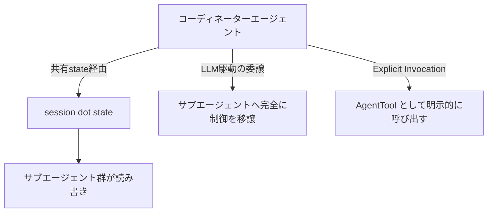

| 通信手段 | 特徴 | 注意点 |
|---|---|---|
| Shared session state | サブエージェント間で共通の`state`を読み書きする「共有ホワイトボード」方式 | キーの命名規則を統一し、責務の重複を避ける |
| LLM-Driven Delegation（AgentTransfer） | コーディネーターが会話の制御そのものをサブエージェントへ渡す | 一度移譲すると親エージェントは会話から外れるため、複数ステップにまたがるタスクでは文脈が失われやすい |
| Explicit Invocation（AgentTool） | サブエージェントをツールとしてラップし、親エージェントが結果を受け取ってから次の判断をする | 親が「プロジェクトマネージャー」として全体を把握し続けられる |

**ベストプラクティス**: 単純な意図振り分けだけならAgentTransferで十分ですが、複数の専門エージェントの結果を組み合わせて最終回答を作る必要がある場合は、AgentToolパターン（サブエージェントをツール化する）の方が文脈の一貫性を保ちやすいことが実務で確認されています。

*出典: Google Cloud Blog「Build multi-agentic systems using Google ADK」*
`https://cloud.google.com/blog/products/ai-machine-learning/build-multi-agentic-systems-using-google-adk`

### 5.4 設計チェックリスト

- サブエージェントの`description`は、コーディネーターが誤りなくルーティングできるレベルまで具体的に書く。
- 状態を共有する場合は、キーに`app:` `user:` `temp:`などの適切なプレフィックスを付け、スコープを明示する。
- 単純な線形処理はまずSequentialAgentで実装し、本当に並列化が必要な箇所だけParallelAgentへ切り出す（過度な複雑化を避ける）。
- 反復精緻化が必要な箇所にのみLoopAgentを使い、最大イテレーション数を必ず設定する。

---

## 6. ステップ4: ツール設計のベストプラクティス

### 6.1 Function Tools

最も基本的なツール形式で、Pythonの関数をそのままツールとして公開します。

```python
def get_weather(city: str) -> dict:
    """指定した都市の現在の天気情報を取得する。

    Args:
        city: 天気を調べたい都市名。

    Returns:
        status と天気情報を含む辞書。
    """
    ...
    return {"status": "success", "report": "晴れ、25度"}
```

**ベストプラクティス**

- 型ヒントとdocstringを必ず明記する。モデルはこれらを読んでツールの使い方を推論するため、曖昧な記述は誤った引数生成につながる。
- 戻り値は構造化された辞書（`status`キーを含める等）にし、エラー時とのフォーマットを統一する。
- 副作用のある操作（送金、削除など）は、`before_tool_callback`によるガードレールとセットで設計する。

*出典: ADK公式ドキュメント「Function tools」*
`https://adk.dev/tools-custom/function-tools/`

### 6.2 MCP Tools（Model Context Protocol）

MCPは「エージェントとツール」を接続するためのオープンプロトコルです。ADKはMCPクライアントを内蔵しており、既存のMCPサーバー（ファイルシステム、データベース、SaaSなど）をそのままツールとして取り込めます。

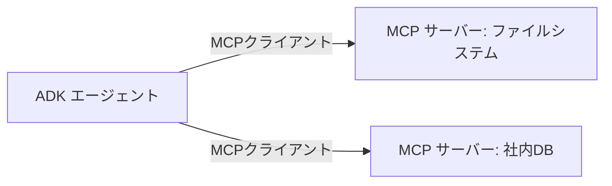

**ベストプラクティス**

- サードパーティのMCPサーバーを組み込む際は、ツールの権限範囲を最小化し、破壊的な操作を行うツールにはコールバックによる追加検証を挟む。
- MCPサーバー側のスキーマ変更に追従できるよう、ツール一覧はハードコードせず起動時に動的取得する構成を検討する。

*出典: ADK公式ドキュメント「MCP tools」*
`https://adk.dev/tools-custom/mcp-tools/`

### 6.3 OpenAPI Tools

既存のREST APIがOpenAPI仕様（Swagger）を持っている場合、ADKはその仕様からツール群を自動生成できます。手作業でラッパー関数を書く必要がなく、大規模な社内APIをまとめてエージェントに公開する際に有効です。

### 6.4 Agent as a Tool（AgentTool）

前述のとおり、サブエージェントをツールとしてラップすることで、親エージェントが結果を受け取り最終判断を下せるようになります。マイクロサービス的にエージェントを部品化する上で重要なパターンです。

### 6.5 In-Tool Guardrails（ツール内ガードレール）

ツールは「モデルが設定する引数（args）」と「開発者が決定論的に設定するTool Context」という2種類の入力を受け取ります。この性質を利用し、ツール自身に安全策を組み込む設計が推奨されます。

```python
def query_database(sql_query: str, tool_context) -> dict:
    allowed_tables = tool_context.state.get("policy:allowed_tables", [])
    if not is_query_within_allowed_tables(sql_query, allowed_tables):
        return {"status": "error", "message": "許可されていないテーブルへのアクセスです"}
    ...
```

こうすることで、モデルの出力が想定外であっても、ツール自体が決定論的なポリシーを強制できます。

*出典: ADK公式ドキュメント「Safety and Security for AI Agents」*
`https://adk.dev/safety/`

---

## 7. ステップ5: セッション・状態・メモリ管理

### 7.1 Session / State / Memory の関係

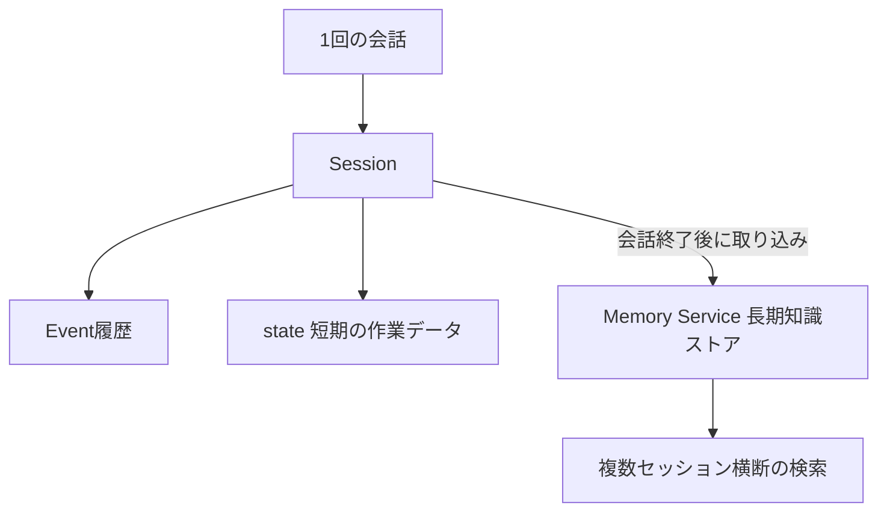

- **Session**: 1つの会話スレッドを表し、イベント履歴と`state`を持つ。
- **State**: 会話の間だけ有効な「作業用のスクラッチパッド」。
- **Memory**: セッションをまたいで保持される長期的な知識ストア。多くの場合RAG（埋め込みベースの検索）で実装される。

*出典: ADK公式ドキュメント「Conversational Context: Session, State, and Memory」*
`https://adk.dev/sessions/`

### 7.2 State のプレフィックス設計

| プレフィックス | スコープ | 用途の例 |
|---|---|---|
| なし | 現在のセッションのみ | 現在の会話でのみ使う一時的なフラグ |
| `user:` | 同一ユーザーの全セッション | ユーザーの言語設定、好み |
| `app:` | アプリケーション全体 | 全ユーザー共通の設定値 |
| `temp:` | 現在のターンのみ、永続化されない | 中間計算結果 |

**ベストプラクティス**

- `state`の更新は、`output_key`・`EventActions.state_delta`・`CallbackContext`または`ToolContext`の`state`プロパティ経由に限定し、`SessionService`から直接取得したセッションオブジェクトの`state`を書き換えない。これにより変更履歴の追跡性と永続化の一貫性が保証されます。
- 値は文字列・数値・真偽値・単純なリストや辞書など、シリアライズ可能な基本型に限定し、複雑なオブジェクトのインスタンスを直接保存しない。
- キーは最小限にし、深いネスト構造を避ける。

*出典: ADK公式ドキュメント「State」*
`https://adk.dev/sessions/state/`

### 7.3 SessionService の実装比較

| 実装 | 永続性 | 適した用途 |
|---|---|---|
| InMemorySessionService | なし（再起動で消失） | ローカル開発・プロトタイピング |
| DatabaseSessionService | あり（PostgreSQL/MySQL/SQLite等） | 自前インフラでの永続化、既存DB資産の活用 |
| Agent Runtime管理型（旧Vertex AI Session Service） | あり | Google Cloud上でのスケーラブルな本番運用 |

**ベストプラクティス**: 開発初期はInMemoryで素早くイテレーションし、本番投入前に必ずターゲットのデータベース（DatabaseSessionServiceの場合は本番と同じRDBMS）で負荷テストを行う。SQLiteとPostgreSQLではJSON列の扱いなど微妙な挙動差があるため注意。

*出典: ADK公式ドキュメントおよびコミュニティ記事「Google ADK Session and State Management」*
`https://adk.dev/sessions/session/`

### 7.4 Memory Service（長期記憶）

RAGベースのMemory Serviceを使うと、過去の会話から抽出した情報を埋め込みベクトルとして保存し、類似度検索で関連情報を呼び出せます。

```python
from google.adk.memory import VertexAiMemoryBankService

memory_service = VertexAiMemoryBankService(
    project="PROJECT_ID",
    location="LOCATION",
    agent_engine_id="AGENT_ENGINE_ID",
)
```

**ベストプラクティス**: すべての情報を長期記憶に入れず、「次回以降の会話でも価値がある情報」（好み、過去の実績、繰り返し発生する課題など）に絞って書き込む設計にする。

*出典: Google Cloud Blog「Remember this: Agent state and memory with ADK」*
`https://cloud.google.com/blog/topics/developers-practitioners/remember-this-agent-state-and-memory-with-adk`

---

## 8. ステップ6: コンテキストエンジニアリング

長時間のセッションでは、会話履歴をそのまま毎回モデルへ送信するとレイテンシとコストが増大します。ADKはこれを解決する2つの機能を`App`レベルで提供しています。

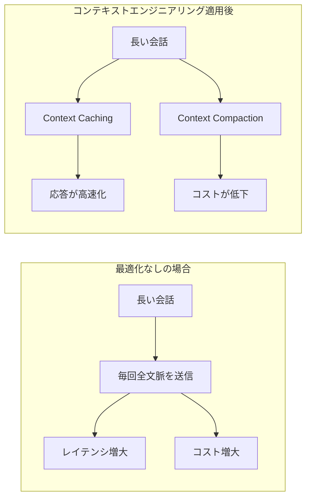

### 8.1 Context Caching

静的な指示や大きなRAGコンテキストなど、繰り返し送信される内容をキャッシュし、モデルへの再送信コストを削減します。

```python
from google.adk.agents import Agent
from google.adk.apps.app import App
from google.adk.agents.context_cache_config import ContextCacheConfig

root_agent = Agent(name="my_agent", model="gemini-flash-latest", ...)

app = App(
    name="my-caching-agent-app",
    root_agent=root_agent,
    context_cache_config=ContextCacheConfig(
        min_tokens=2048,      # キャッシュ発動の最小トークン数
        ttl_seconds=600,      # キャッシュの有効期限
        cache_intervals=5,    # 再利用可能な最大回数
    ),
)
```

**ベストプラクティス**: 変化しないシステム指示は`static_instruction`として分離し、キャッシュ対象のプレフィックスを安定させることで、キャッシュヒット率を最大化する。

*出典: ADK公式ドキュメント「Context caching」*
`https://adk.dev/context/caching/`

### 8.2 Context Compaction（コンテキスト圧縮）

古い会話イベントを要約し、直近のやり取りだけを生の形式で保持するスライディングウィンドウ方式です。イベント数ベースとトークン数ベースの2種類の設定があります。

```python
from google.adk.apps.app import App, EventsCompactionConfig
from google.adk.agents import Agent

root_agent = Agent(name="my_root_agent", ...)

compaction_config = EventsCompactionConfig(
    token_threshold=4000,     # このトークン数を超えたら圧縮を発動
    event_retention_size=5,   # 直近何件のイベントを生のまま残すか
)

app = App(
    name="my_compacting_agent_app",
    root_agent=root_agent,
    events_compaction_config=compaction_config,
)
```

**ベストプラクティス**

- Compactionは非ブロッキングで、ターン終了後にバックグラウンドで実行される。マルチエージェント構成でも、Sessionを共有するサブエージェント群全体に対して機能する。
- 直近の会話の代名詞解決（「それ」「あれ」など）に支障が出ないよう、`event_retention_size`は文脈が破綻しない程度の余裕を持たせる。
- 2026年時点でContext Cachingは主にGeminiモデルでのみサポートされている点に留意する（LiteLLM経由の他社モデルは未対応）。

*出典: ADK公式ドキュメント「Context compression」およびGitHub Discussions*
`https://adk.dev/context/compaction/`

---

## 9. ステップ7: コールバックとプラグインによる制御

### 9.1 コールバックの種類

| コールバック | 発火タイミング | 主な用途 |
|---|---|---|
| before_agent_callback / after_agent_callback | エージェントのメインロジックの前後 | アクセス制御、簡易リクエストの即時応答 |
| before_model_callback / after_model_callback | LLM呼び出しの前後 | 入力ガードレール、プロンプト検閲、キャッシュ利用、出力のPIIフィルタリング |
| before_tool_callback / after_tool_callback | ツール実行の前後 | 引数検証、レート制限、結果の後処理、ロギング |

`before_*`系のコールバックが値を返すと、通常の処理（LLM呼び出しやツール実行）はスキップされ、その返り値がそのまま結果として扱われます。`None`を返した場合は通常どおり処理が継続します。

*出典: ADK公式ドキュメント「Types of callbacks」「Callback patterns」*
`https://adk.dev/callbacks/types-of-callbacks/`

### 9.2 代表的なコールバック設計パターン

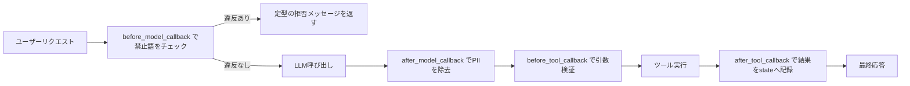

| パターン | 実装コールバック | 目的 |
|---|---|---|
| ガードレールとポリシー適用 | before_model_callback / before_tool_callback | 禁止トピックや不正な引数をLLM呼び出し前に遮断する |
| 動的な状態管理 | 各種callbackから`context.state`を読み書き | ユーザーの契約プランに応じて挨拶や振る舞いを変える |
| ロギングと可観測性 | after_tool_callback / after_model_callback | ツールの引数と結果を構造化ログとして記録する |
| キャッシング | before_model_callback / before_tool_callback | 過去と同じ入力ならキャッシュ結果を返しLLM呼び出しを省略する |

*出典: ADK公式ドキュメント「Callback design patterns and best practices」*
`https://google.github.io/adk-docs/callbacks/design-patterns-and-best-practices/`

### 9.3 Callback と Plugin の使い分け

| 観点 | Callback | Plugin |
|---|---|---|
| 適用範囲 | 特定の1つのエージェント/ツールに紐づくローカルな設定 | Runner（App）に一度登録すると、配下の全エージェント・全ツール・全LLM呼び出しに適用されるグローバルな設定 |
| 向いている用途 | 特定エージェント固有の振る舞い調整 | 全社共通のロギング、セキュリティポリシー、監視指標の収集など横断的関心事 |
| 実行順序 | Plugin側のコールバックの後に実行される | Agent/Model/Toolレベルのコールバックより先に実行され、値を返すと後続をスキップする |
| ADK Web UIでの動作 | 利用可能 | 利用不可（`adk run`や`adk api_server`経由で確認する必要がある） |

**ベストプラクティス**: 「同じロギングロジックを3つのエージェントにコピーしている」と感じたら、それはPluginへ昇格すべきサインです。逆に、1つの実験的エージェントだけに必要な特殊な挙動はCallbackのままにしておく方が見通しが良くなります。

*出典: ADK公式ドキュメント「Plugins」およびGoogle Cloudコミュニティ記事「Master ADK Callbacks: DOs and DON'Ts」*
`https://adk.dev/plugins/` / `https://medium.com/google-cloud/master-adk-callbacks-dos-and-donts-adedd2386983`

### 9.4 セキュリティとガードレールのベストプラクティス

- **多層防御**: In-Tool Guardrails（決定論的な制約）、Callbackによるモデル呼び出し前後の検証、Gemini自体の組み込み安全機能（コンテンツフィルタ）を組み合わせる。
- **安価なモデルによる追加チェック**: 高速で安価なモデル（例: Gemini Flash Lite）をコールバック内で呼び出し、入出力の安全性を追加でスクリーニングする構成が有効です。
- **サンドボックス化**: モデルが生成したコードを実行する場合は、必ず隔離された実行環境で行う。
- **出力のエスケープ**: エージェントの出力をブラウザで表示する場合、HTMLやJavaScriptとして解釈されないよう適切にエスケープする。間接的なプロンプトインジェクションによるデータ漏えいを防ぐために重要です。
- **内部プロンプトの非開示**: 説明可能性のためにエージェントの意思決定根拠を示すことは有用ですが、システムプロンプトや内部指示そのものをエンドユーザーに露出するのは避ける。

*出典: ADK公式ドキュメント「Safety and Security for AI Agents」*
`https://adk.dev/safety/`

---

## 10. ステップ8: エージェントの評価（Evaluation）

LLMエージェントは非決定論的であるため、従来の「完全一致」によるテストだけでは不十分です。ADKは**Trajectory（実行経路）**と**Response（最終応答）**の両方を評価する仕組みを提供します。

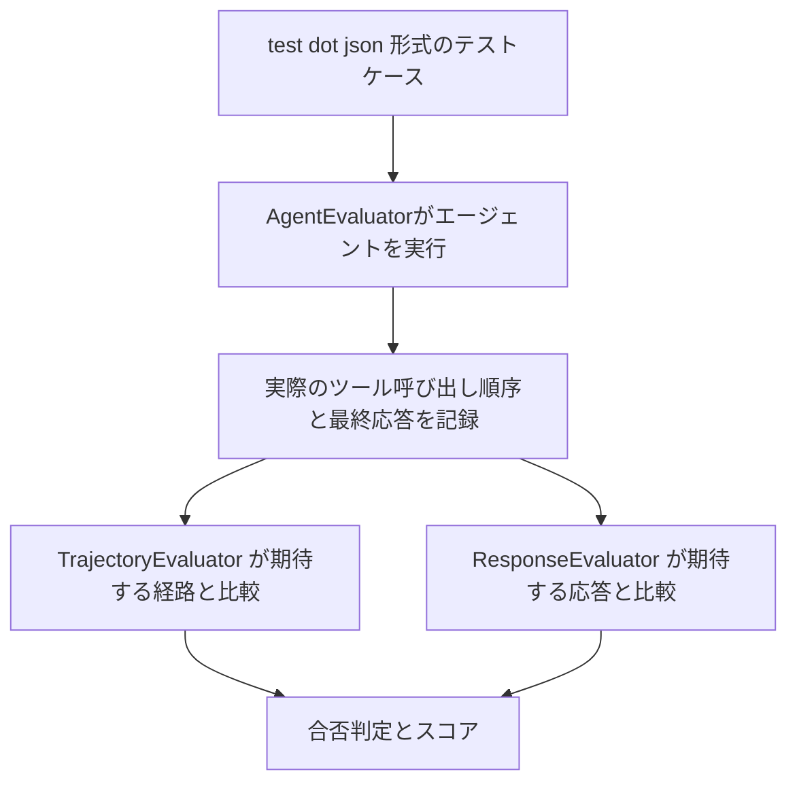

| 評価軸 | 何を検証するか | 使いどころ |
|---|---|---|
| Trajectory Evaluation | 正しい順序で正しいツールを呼び出しているか（ビジネスロジック・回帰テスト） | 「残高照会の前に必ず認証する」といった業務ルールの遵守確認 |
| Response Evaluation | 最終応答の言語的な品質と正確性 | 丁寧さ、正確性、期待する参照回答との類似度 |

### 10.1 評価ケースの作り方

1. `adk web`でエージェントと対話し、期待どおりに動く「ゴールデンパス」を作る。
2. Web UIのEvalタブから現在のセッションを新しい評価ケースとして保存する。
3. 生成された`.test.json`を編集し、期待する中間ツール呼び出し（`mock_tool_output`を含む）と期待する最終応答を明確化する。
4. `adk eval`コマンド、またはCIパイプライン内で`AgentEvaluator.evaluate()`を呼び出し自動化する。

```python
import pytest
from google.adk.evaluation.agent_evaluator import AgentEvaluator

@pytest.mark.asyncio
async def test_customer_service_agent_evaluation():
    await AgentEvaluator.evaluate(
        agent_module="customer_service_agent",
        agent_name="root_agent",
        eval_dataset_file_path_or_dir="tests/data",
    )
```

**ベストプラクティス**

- Trajectoryの一致判定は`EXACT`（完全一致）と`IN_ORDER`（順序だけ保証し他のツール呼び出しの混在を許容）を使い分ける。規制業務や再現性が重要な処理には`EXACT`、柔軟性を残したい探索的なタスクには`IN_ORDER`が適しています。
- 新しいCallbackやガードレールを追加した際は、必ず`adk eval`をエッジケースのプロンプトに対して実行し、意図せぬ回帰がないか確認する。
- CI/CDにはPytest統合を利用し、JUnit XML形式のレポートを既存のダッシュボードに接続する。

*出典: ADK公式ドキュメント「Why evaluate agents」「Criteria」およびGoogle Codelabs「Evaluating Agents with ADK」*
`https://adk.dev/evaluate/` / `https://codelabs.developers.google.com/adk-eval/instructions`

---

## 11. ステップ9: 可観測性（Observability）

### 11.1 ロギング

ADKは各言語の標準ロギングライブラリ（Pythonなら`logging`）上に構築されており、アプリケーション側で自由にフォーマットやハンドラを設定できます。Google Cloudの構造化ログ形式（トレース相関を含む）に合わせたカスタムフォーマッタを使うと、Cloud Loggingとの統合が容易になります。

### 11.2 トレーシング（OpenTelemetry）

ADK 1.17以降は、OpenTelemetryのGenAI向けセマンティックコンベンションに準拠した組み込みトレース計装を持っています。

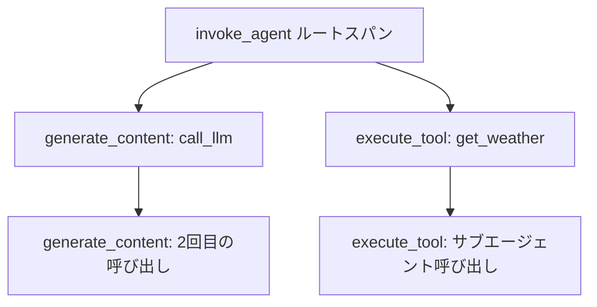

- `adk web`や`adk api_server`実行時に`--otel_to_cloud`フラグを付けるだけでCloud Traceへ送信できる。
- 標準OTel環境変数（`OTEL_EXPORTER_OTLP_TRACES_ENDPOINT`など）を設定すれば、Jaeger、Grafana Tempo、Datadogなど任意のOTel互換バックエンドに送信可能。
- コンテキスト伝播が自動化されており、ツールから呼び出した外部マイクロサービスのスパンも同じトレースに連結される。

*出典: ADK公式ドキュメント「Traces」およびGoogle Cloud Documentation「Instrument ADK applications with OpenTelemetry」*
`https://adk.dev/observability/traces/` / `https://docs.cloud.google.com/stackdriver/docs/instrumentation/ai-agent-adk`

### 11.3 サードパーティ観測ツールとの統合

| ツール | 統合方法の概要 |
|---|---|
| Google Cloud Trace | `--otel_to_cloud`フラグまたは環境変数で送信、Trace Explorerでウォーターフォール表示 |
| Langfuse | `openinference-instrumentation-google-adk`によるOTel計装をLangfuseへ送信 |
| MLflow | MLflow 3.6以降のOTLP取り込み機能を利用しADKのスパンを送信 |
| Arize AX | エージェントの意思決定経路・ツール利用効率・調整品質を評価する専用プラットフォーム |
| SigNoz | トレース・ログ・メトリクスを統合ダッシュボードで可視化 |

**ベストプラクティス**: 単一クラウドで完結する場合はCloud Traceで十分ですが、マルチクラウド構成やベンダーニュートラルな分析基盤が必要な場合は、Cloud Run上にOTel Collectorを立て、複数のバックエンド（Cloud Trace + Langfuse + Braintrustなど）へ同時にファンアウトする構成が有効です。

*出典: Kablamo Engineering Blog「Tracing AI Agents on Google Cloud with OpenTelemetry and Agent Engine」*
`https://engineering.kablamo.com.au/posts/gcp-otel-adk-agent`

---

## 12. ステップ10: A2Aプロトコルによるエージェント間連携

同一プロセス内のサブエージェントだけでなく、別サービス・別フレームワーク・別会社が実装したエージェントと連携したい場合、**Agent2Agent（A2A）プロトコル**を使います。

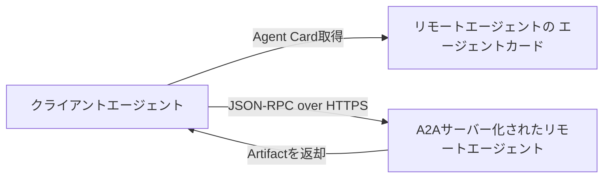

### 12.1 MCPとA2Aの違い

| プロトコル | 接続対象 | ひとことで言うと |
|---|---|---|
| MCP（Model Context Protocol） | エージェントとツール・データソース | 「エージェントとツールをつなぐ」プロトコル |
| A2A（Agent2Agent Protocol） | エージェントとエージェント | 「エージェント同士をつなぐ」プロトコル |

1つのシステムの中で、あるエージェントがA2Aで別のエージェントにタスクを依頼し、そのエージェントがさらにMCPでデータベースに接続する、という組み合わせも一般的です。

### 12.2 ADKにおけるA2Aの実装ステップ

1. 既存のADKエージェントを`A2AServer`として公開する（HTTPサーバーとして待受けさせる）。
2. `/.well-known/agent.json`のようなパスでAgent Card（能力・接続情報を記述したJSON）を公開する。
3. 別のエージェント側で`RemoteA2aAgent`を使い、Agent Cardを解決してリモートエージェントをサブエージェントのように扱う。
4. ADKのWeb UIで、ローカルエージェントとリモートエージェントの両方が協調して動作することを確認する。

**ベストプラクティス**

- ローカルのサブエージェント（インメモリ、低レイテンシ）と、A2A経由のリモートエージェント（ネットワーク越し、疎結合）は使い分ける。頻繁にやり取りが発生する処理はローカルサブエージェントに、組織間・フレームワーク間をまたぐ連携が必要な処理はA2Aに寄せる。
- リモートエージェントが会話コンテキストを保持していない前提で設計し、繰り返し確認を求めてくる場合はクライアント側で必要な文脈を明示的に渡す。

*出典: ADK公式ドキュメント「Introduction to A2A」およびGoogle Codelabs「Connect to Remote Agents with ADK and the Agent2Agent SDK」*
`https://google.github.io/adk-docs/a2a/intro/` / `https://www.skills.google/focuses/132170?parent=catalog`

---

## 13. ステップ11: デプロイ戦略

ADKエージェントは複数の実行環境にデプロイできます。要件に応じて適切な選択を行うことが本番運用の成否を分けます。

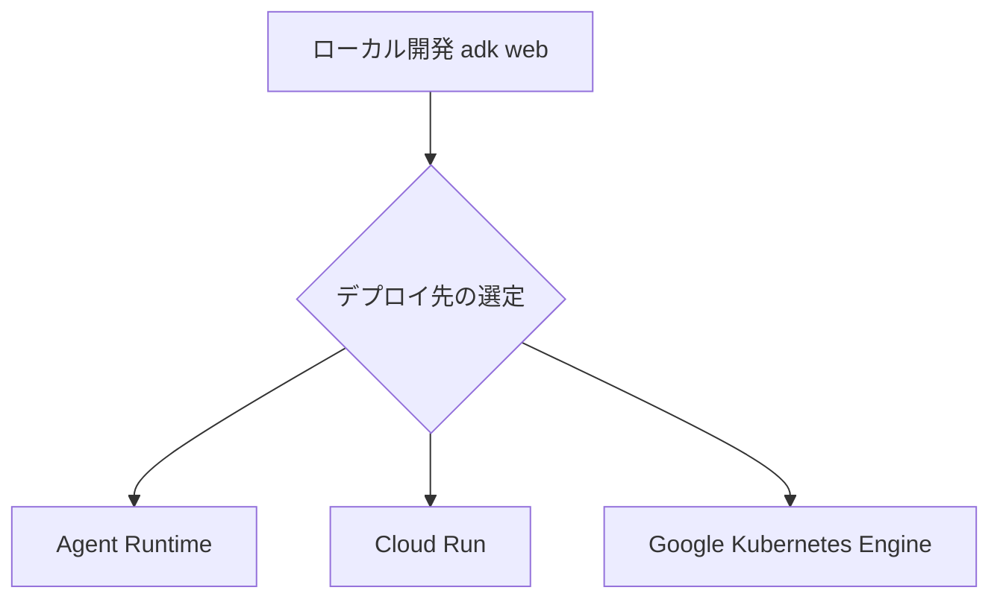

| デプロイ先 | 特徴 | 適したケース |
|---|---|---|
| Agent Runtime | Google Cloud Agent Platformが提供するエージェント専用のフルマネージド自動スケーリング環境 | 運用負荷を最小化したいエンタープライズ本番運用 |
| Cloud Run | サーバーレスのコンテナ実行基盤。`adk deploy cloud_run`コマンドでコンテナビルドからデプロイまで一括実行可能 | 柔軟なネットワーク設定、独自UI、複雑なA2A構成、スケールゼロによるコスト最適化 |
| GKE | Kubernetesベースのコンテナオーケストレーション | 既存のKubernetes運用基盤に統合したい場合、高度なカスタムインフラ要件 |

### 13.1 Cloud Runへのデプロイ例

```bash
adk deploy cloud_run \
  --project=YOUR_PROJECT_ID \
  --region=YOUR_REGION \
  --service_name=weather-agent \
  --with_ui \
  ./my_agent
```

デプロイ時に「認証なしの呼び出しを許可するか」を問われますが、公開APIとして提供する場合を除き、認証を必須にする設定を選ぶことが推奨されます。

### 13.2 Agent Runtimeへのデプロイ

標準デプロイパス（Cloud ConsoleとADK CLIによる段階的な手順）と、Agents CLIによる加速デプロイパス（CI/CDパイプラインとTerraformによるInfrastructure as Codeまで自動生成）の2種類が提供されています。組織のセキュリティ・コンプライアンス基準に照らして、自動生成された設定を必ずレビューすることがベストプラクティスとされています。

### 13.3 デプロイ前チェックリスト

- Session StateとMemoryの永続化バックエンドを、開発用のInMemoryから本番用（Database/Agent Runtime管理型）に切り替えたか。
- OpenTelemetryのトレースをCloud Traceまたは選択した観測基盤にエクスポートする設定を行ったか。
- Pluginによるグローバルなガードレール・ロギングが有効化されているか（ADK Web UIではなくCLI/API Server経由で最終確認したか）。
- `adk eval`による回帰テストがCI/CDパイプラインに組み込まれているか。
- IAMロール（Cloud Run Source Developer、Vertex AI User、Service Account Userなど）が必要最小限の範囲で付与されているか。

*出典: ADK公式ドキュメント「Deploying Your Agent」「Cloud Run」「Deploy to Agent Runtime」およびGoogle Cloud Documentation*
`https://google.github.io/adk-docs/deploy/` / `https://google.github.io/adk-docs/deploy/cloud-run/` / `https://adk.dev/deploy/agent-runtime/`

---

## 14. 本番運用チェックリスト

最後に、本ガイドで扱ったベストプラクティスを横断的なチェックリストとしてまとめます。

| カテゴリ | チェック項目 |
|---|---|
| エージェント設計 | サブエージェントの`description`は誤ルーティングが起きないレベルまで具体的か |
| マルチエージェント | 通信手段（Shared State / AgentTransfer / AgentTool）を意図的に選択したか |
| ツール | すべての破壊的操作にIn-Tool Guardrailsまたはコールバックによる検証があるか |
| 状態管理 | `state`の更新をCallbackContext / ToolContext経由に統一しているか |
| コンテキスト | 長時間セッションに対しCaching / Compactionの設定を検討したか |
| セキュリティ | before_model_callbackによる入力ガードレールとafter_model_callbackによる出力フィルタリングを実装したか |
| 評価 | TrajectoryとResponseの両方をカバーする`.test.json`ケースが存在し、CIで自動実行されているか |
| 可観測性 | OpenTelemetryトレースが本番の観測基盤に届いているか |
| 連携 | 組織外・フレームワーク外の連携が必要な箇所でA2Aプロトコルを検討したか |
| デプロイ | 環境変数・IAM・セッション永続化先が本番向けに切り替わっているか |

---

## 15. 参考文献

本ガイドの作成にあたり、以下の一次情報・公式ドキュメント・技術記事を参照しました（2026年7月時点でのアクセス）。

### 公式ドキュメント（adk.dev / Google Cloud）

- ADK公式トップページ: `https://adk.dev/`
- Google Cloud Documentation「Agent Development Kit | Gemini Enterprise Agent Platform」: `https://docs.cloud.google.com/gemini-enterprise-agent-platform/build/adk?hl=en`
- About ADK: `https://adk.dev/get-started/about/`
- Workflow Agents: `https://adk.dev/agents/workflow-agents/`
- Workflow Patterns: `https://adk.dev/workflows/patterns/`
- Workflows overview: `https://adk.dev/workflows/`
- Function Tools: `https://adk.dev/tools-custom/function-tools/`
- MCP Tools: `https://adk.dev/tools-custom/mcp-tools/`
- Sessions overview: `https://adk.dev/sessions/`
- Session: `https://adk.dev/sessions/session/`
- State: `https://adk.dev/sessions/state/`
- Callback design patterns and best practices: `https://google.github.io/adk-docs/callbacks/design-patterns-and-best-practices/`
- Types of callbacks: `https://adk.dev/callbacks/types-of-callbacks/`
- Callbacks overview: `https://google.github.io/adk-docs/callbacks/`
- Safety and Security for AI Agents: `https://adk.dev/safety/`
- Plugins: `https://adk.dev/plugins/`
- App workflow management class: `https://adk.dev/apps/`
- Context caching: `https://adk.dev/context/caching/`
- Context compression: `https://adk.dev/context/compaction/`
- Why evaluate agents: `https://adk.dev/evaluate/`
- Criteria: `https://google.github.io/adk-docs/evaluate/criteria/`
- Traces: `https://adk.dev/observability/traces/`
- Google Cloud Trace observability for ADK: `https://adk.dev/integrations/cloud-trace/`
- Instrument ADK applications with OpenTelemetry: `https://docs.cloud.google.com/stackdriver/docs/instrumentation/ai-agent-adk`
- MLflow observability for ADK: `https://adk.dev/integrations/mlflow-tracing/`
- Introduction to A2A: `https://google.github.io/adk-docs/a2a/intro/`
- Quickstart: Consuming a remote agent via A2A: `https://adk.dev/a2a/quickstart-consuming/`
- Deploying Your Agent: `https://google.github.io/adk-docs/deploy/`
- Cloud Run（デプロイ）: `https://google.github.io/adk-docs/deploy/cloud-run/`
- Deploy to Agent Runtime: `https://adk.dev/deploy/agent-runtime/`
- Deploy to Agent Runtime with Agents CLI: `https://adk.dev/deploy/agent-runtime/agents-cli/`
- Build and deploy an AI agent to Cloud Run（Google Cloud Documentation）: `https://docs.cloud.google.com/run/docs/ai/build-and-deploy-ai-agents/deploy-adk-agent`
- Quickstart: Build and deploy an AI agent to Cloud Run: `https://docs.cloud.google.com/run/docs/quickstarts/build-and-deploy/deploy-python-adk-service`

### Google公式ブログ・Codelabs

- Google Developers Blog「Agent Development Kit: Making it easy to build multi-agent applications」: `https://developers.googleblog.com/en/agent-development-kit-easy-to-build-multi-agent-applications/`
- Google Developers Blog「Developer's guide to multi-agent patterns in ADK」: `https://developers.googleblog.com/developers-guide-to-multi-agent-patterns-in-adk/`
- Google Developers Blog「Architecting efficient context-aware multi-agent framework for production」: `https://developers.googleblog.com/architecting-efficient-context-aware-multi-agent-framework-for-production/`
- Google Cloud Blog「Remember this: Agent state and memory with ADK」: `https://cloud.google.com/blog/topics/developers-practitioners/remember-this-agent-state-and-memory-with-adk`
- Google Cloud Blog「Building Collaborative AI: A Developer's Guide to Multi-Agent Systems with ADK」: `https://cloud.google.com/blog/topics/developers-practitioners/building-collaborative-ai-a-developers-guide-to-multi-agent-systems-with-adk`
- Google Cloud Blog「Build multi-agentic systems using Google ADK」: `https://cloud.google.com/blog/products/ai-machine-learning/build-multi-agentic-systems-using-google-adk`
- Google Codelabs「Deploy, Manage, and Observe ADK Agent on Cloud Run」: `https://codelabs.developers.google.com/deploy-manage-observe-adk-cloud-run`
- Google Codelabs「Evaluating Agents with ADK」: `https://codelabs.developers.google.com/adk-eval/instructions`
- Google Codelabs「Getting Started with Agent2Agent (A2A) Protocol」: `https://codelabs.developers.google.com/intro-a2a-purchasing-concierge`
- Google Skills「Connect to Remote Agents with ADK and the Agent2Agent (A2A) SDK」: `https://www.skills.google/focuses/132170?parent=catalog`

### コミュニティ記事・技術ブログ

- Medium（Google Cloud Community）「Google ADK Session and State Management」: `https://medium.com/google-cloud/google-adk-session-and-state-management-understanding-sessions-and-state-a5e05b62f1f1`
- DEV Community「Adding Sessions and Memory to Your AI Agent with ADK」: `https://dev.to/marianocodes/adding-sessions-and-memory-to-your-ai-agent-with-agent-development-kit-adk-31ap`
- Arjun Prabhulal「Google ADK - Session, State and Memory」: `https://arjunprabhulal.com/adk-sessions-state/`
- Arjun Prabhulal「Google ADK - Context Management」: `https://arjunprabhulal.com/adk-context-management/`
- Medium「Master ADK Callbacks: DOs and DON'Ts」: `https://medium.com/google-cloud/master-adk-callbacks-dos-and-donts-adedd2386983`
- leoy.blog「Master ADK Callbacks: DOs and DON'Ts」: `https://leoy.blog/posts/master-adk-callbacks/`
- Medium「Callbacks vs Plugins in ADK」: `https://medium.com/google-cloud/callbacks-vs-plugins-in-adk-knowing-where-responsibility-belongs-c277517473ee`
- Medium「Agent Development Kit (ADK) Made Easy — Part 2」: `https://medium.com/google-cloud/agent-development-kit-adk-made-easy-part-2-0c3b8ef32399`
- Medium「Context Engineering in Google ADK」: `https://medium.com/@juanc.olamendy/context-engineering-in-google-adk-the-ultimate-guide-to-building-scalable-ai-agents-f8d7683f9c60`
- The New Stack「A Step-by-Step Guide To Deploying ADK Agents on Cloud Run」: `https://thenewstack.io/a-step-by-step-guide-to-deploying-adk-agents-on-cloud-run/`
- Medium「Evaluating Agents with ADK, Part 1」: `https://medium.com/google-cloud/evaluating-agents-with-adk-part-1-the-development-loop-with-the-adk-web-ui-7822b592498a`
- Medium「Agent Evaluation with Google ADK: A Practical Guide」: `https://medium.com/@dcheng_93016/agent-evaluation-with-google-adk-a-practical-guide-for-agent-builders-a3c1622f550c`
- DeepWiki「Evaluation and Testing | google/adk-docs」: `https://deepwiki.com/google/adk-docs/8.4-evaluation`
- DeepWiki「Plugin System | google/adk-python」: `https://deepwiki.com/google/adk-python/4.3-plugin-system`
- Medium「Agentic Observability: ADK's Built-in Power」: `https://minherz.medium.com/agentic-observability-adks-built-in-power-4c1e5b2c85a1`
- Medium（Google Cloud Community）「AI Agent Observability with ADK on Google Cloud」: `https://medium.com/google-cloud/ai-agent-observability-based-on-agent-development-kit-adk-approach-565c82cb8c80`
- SigNoz Docs「Google ADK Observability and Monitoring with OpenTelemetry」: `https://signoz.io/docs/google-adk-observability/`
- Langfuse「Observability for Google Agent Development Kit with Langfuse」: `https://langfuse.com/integrations/frameworks/google-adk`
- Arize「Tracing, Evaluation, and Observability for Google ADK」: `https://arize.com/blog/tracing-evaluation-and-observability-for-google-adk-how-to/`
- Kablamo Engineering「Tracing AI Agents on Google Cloud with OpenTelemetry and Agent Engine」: `https://engineering.kablamo.com.au/posts/gcp-otel-adk-agent`
- Medium「Implementing A2A Agents with ADK: Complete Development Guide」: `https://medium.com/@vampirenalan/implementing-a2a-agents-with-adk-complete-development-guide-6cf3440f4264`
- Medium「A2A Agent Patterns with the Agent Development Kit (ADK)」: `https://medium.com/google-cloud/a2a-agent-patterns-with-the-agent-development-kit-adk-aee3d61c52cf`
- Medium「Mastering Workflow Strategies in Google ADK」: `https://medium.com/@saminchandeepa/mastering-workflow-strategies-in-google-agent-development-kit-adk-building-effective-multi-agent-59dbfcfa325f`
- Medium「Building Multi-Agent Systems with Google's ADK」: `https://medium.com/@guolisen_38580/building-multi-agent-systems-with-googles-agent-development-kit-adk-3919378be812`
- Medium「Mastering ADK Workflows: Sequential, Parallel, Loop and Custom Agents」: `https://medium.com/@shins777/adk-workflow-the-core-logic-of-ai-agent-8ce4be5c1c40`
- Medium「Building Persistent Sessions with Google ADK」: `https://medium.com/@juanc.olamendy/building-persistent-sessions-with-google-adk-a-comprehensive-guide-c3bab191269d`

> 注: ADKは開発速度が非常に速いフレームワークです。実装の詳細（クラス名・パラメータ名・CLIコマンドなど）は変更される可能性があるため、実装時は必ず `https://adk.dev/` の最新ドキュメントで一次情報を確認してください。
