# Adversarial Robustness for Machine Learning 初学者ガイド

### ~ なぜAIは"だまされる"のか、そしてどう守るのか ~

本ガイドは、Pin-Yu Chen氏(IBM Thomas J. Watson Research Center, Principal Research Scientist)とCho-Jui Hsieh氏(UCLA Computer Science, Associate Professor)による書籍
**『Adversarial Robustness for Machine Learning』**(Elsevier, 2022年8月25日刊, ISBN 978-0-12-824020-5)を出発点に、Adversarial Robustness(敵対的頑健性)という分野を初学者にもわかるようステップバイステップで解説するものです。

書籍出版から現在(2026年9月)までの間に、この分野は大規模言語モデル(LLM)の登場によって「画像分類の一分野」から「AIセキュリティ全般の基盤」へと大きく広がりました。本ガイドでは書籍の内容に加え、GCG攻撃・MITRE ATLAS・NIST AI 100-2e2025など、2026年9月時点の最新動向もあわせて解説します。

> 📚 原書情報: [Elsevier Shop - Adversarial Robustness for Machine Learning](https://shop.elsevier.com/books/adversarial-robustness-for-machine-learning/chen/978-0-12-824020-5)

---

## 目次

- [この記事の対象読者](#この記事の対象読者)
- [書籍情報](#書籍情報)
- [書籍の全26章構成](#書籍の全26章構成)
- [Step 0 前提知識のおさらい](#step-0-前提知識のおさらい)
- [Step 1 Adversarial Example の発見と直感](#step-1-adversarial-example-の発見と直感)
- [Step 2 脅威モデル Threat Model を理解する](#step-2-脅威モデル-threat-model-を理解する)
- [Step 3 代表的なWhite-box攻撃 FGSM PGD C&W](#step-3-代表的なwhite-box攻撃-fgsm-pgd-cw)
- [Step 4 Black-box攻撃と転移性](#step-4-black-box攻撃と転移性)
- [Step 5 物理世界での攻撃](#step-5-物理世界での攻撃)
- [Step 6 防御1 Adversarial Training](#step-6-防御1-adversarial-training)
- [Step 7 防御2 証明可能な頑健性 Certified Robustness](#step-7-防御2-証明可能な頑健性-certified-robustness)
- [Step 8 壊れた防御と正しい評価方法](#step-8-壊れた防御と正しい評価方法)
- [Step 9 画像分類を超えて](#step-9-画像分類を超えて)
- [Step 10 LLM時代のAdversarial Robustness](#step-10-llm時代のadversarial-robustness)
- [Step 11 実践 ツールとライブラリ](#step-11-実践-ツールとライブラリ)
- [Step 12 学習ロードマップ](#step-12-学習ロードマップ)
- [まとめ](#まとめ)
- [理解度チェックリスト](#理解度チェックリスト)
- [参考文献 情報源](#参考文献-情報源)

---

## この記事の対象読者

- 機械学習やディープラーニングの基礎(分類器、損失関数、勾配降下法)は知っているが、Adversarial Robustnessは初めて学ぶ人
- 「AIは画像を少し加工しただけで誤認識する」という話を聞いたことがあるが、仕組みを体系的に理解したい人
- LLM時代のjailbreakやprompt injectionが、古典的なAdversarial Exampleの研究とどうつながっているかを知りたい人

---

## 書籍情報

| 項目 | 内容 |
|---|---|
| 書名 | Adversarial Robustness for Machine Learning |
| 著者 | Pin-Yu Chen(IBM Thomas J. Watson Research Center) / Cho-Jui Hsieh(UCLA Computer Science) |
| 出版社 | Elsevier(Academic Press) |
| 版 | 第1版 |
| 発行日 | 2022年8月25日 |
| ISBN | 978-0-12-824020-5(電子版 978-0-12-824257-5) |
| 章数 | 全26章 |
| 想定読者 | 大学院生向け教科書、研究者向けの網羅的レビュー、企業のR&Dエンジニア |

Pin-Yu Chen氏はIBMのオープンソースライブラリ **Adversarial Robustness Toolbox (ART)** および **AI Explainability 360** の開発に貢献しており、NeurIPS・AAAI・CVPR・ICASSPなど国際会議でAdversarial Machine Learningのチュートリアルを多数実施してきた、この分野を代表する研究者の一人です。Cho-Jui Hsieh氏はKDD・ICDM・ICPPでのBest Paper賞を持ち、大規模かつ頑健なモデルの学習アルゴリズム研究で知られています。

## 書籍の全26章構成

| 章 | タイトル(原題) | 内容カテゴリ |
|---|---|---|
| 1 | White-box attack | 攻撃 |
| 2 | Soft-label Black-box Attack | 攻撃 |
| 3 | Decision-based attack | 攻撃 |
| 4 | Attack Transferability | 攻撃 |
| 5 | Attacks in the physical world | 攻撃 |
| 6 | Convex relaxation Framework | 検証 Verification |
| 7 | Layer-wise relaxation (primal algorithms) | 検証 Verification |
| 8 | Dual approach | 検証 Verification |
| 9 | Probabilistic verification | 検証 Verification |
| 10 | Adversarial training | 防御 Defense |
| 11 | Certified defense | 防御 Defense |
| 12 | Randomization | 防御 Defense |
| 13 | Detection methods | 防御 Defense |
| 14 | Robustness of other machine learning models beyond neural networks | 画像分類を超えて |
| 15 | NLP models | 画像分類を超えて |
| 16 | Graph neural network | 画像分類を超えて |
| 17 | Recommender systems | 画像分類を超えて |
| 18 | Reinforcement Learning | 画像分類を超えて |
| 19 | Speech models | 画像分類を超えて |
| 20 | Multi-modal models | 画像分類を超えて |
| 21 | Backdoor attack and defense | その他の脅威と応用 |
| 22 | Data poisoning attack and defense | その他の脅威と応用 |
| 23 | Transfer learning | その他の脅威と応用 |
| 24 | Explainability and interpretability | その他の脅威と応用 |
| 25 | Representation learning | その他の脅威と応用 |
| 26 | Privacy and watermarking | その他の脅威と応用 |

本ガイドのStep 3〜9はこの1〜22章の内容を初学者向けに要約したものです(23〜26章は本ガイドの対象外です)。Step 10のみ、書籍刊行後にLLMを中心として発展した領域を補足しています。

---

## Step 0 前提知識のおさらい

Adversarial Robustnessを理解するには、以下の基礎知識があるとスムーズです。

- **分類器(classifier)**: 画像やテキストなどの入力を受け取り、あらかじめ決められたクラス(ラベル)のどれかを出力するモデル
- **損失関数(loss function)**: モデルの予測がどれだけ正解からずれているかを数値化する関数
- **勾配(gradient)**: 損失関数を各パラメータ、あるいは各入力次元で微分した値。「どの方向にどれだけ動かせば損失が増減するか」を表す
- **Lp ノルム**: 摂動(元の入力に加える微小な変化)の大きさを測る指標。L∞ノルムは各ピクセルの変化量の最大値、L2ノルムはユークリッド距離に相当

これらを踏まえたうえで、次のStep 1からAdversarial Exampleそのものの話に入ります。

---

## Step 1 Adversarial Example の発見と直感

### 1-1 発見の経緯

2013年、Christian Szegedy氏(当時Google)らは論文「Intriguing properties of neural networks」で、当時最先端だった画像分類ニューラルネットワークに対し、人間の目にはほとんど変化がわからない微小な摂動を加えるだけで、モデルの予測を意図的に誤らせることができると報告しました。この、意図的に作られた「ほぼ元の入力と見分けがつかないのに誤分類を引き起こす入力」を **Adversarial Example(敵対的サンプル)** と呼びます。

### 1-2 直感的なイメージ

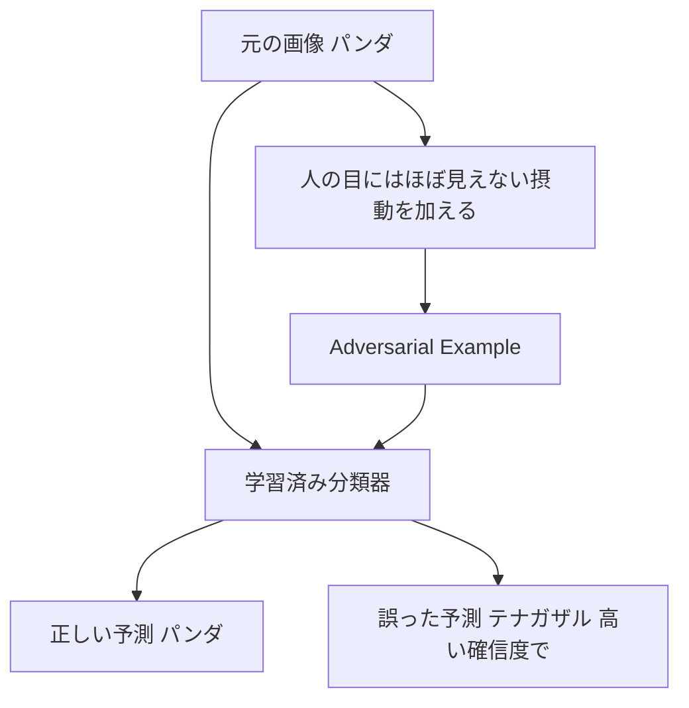

ポイントは、単にノイズを加えて「モデルが混乱する」のではなく、**損失を最大化する方向に精密に計算された摂動**であるという点です。ランダムなノイズでは通常モデルは頑健ですが、この精密な摂動には非常に弱いことが分かっています。

### 1-3 なぜ起きるのか

2014年、Ian Goodfellow氏(当時Google, 後にOpenAI/Apple)らは論文「Explaining and Harnessing Adversarial Examples」で、この脆弱性の主要な原因を **ニューラルネットワークの線形性(linear nature)** に求める説明を提示しました。高次元空間では、入力の各次元にごくわずかな変化を同じ符号方向に積み重ねるだけで、線形結合の出力を大きく動かせてしまう、という考え方です。この論文は同時に、後述するFGSMという最初期の代表的攻撃手法も提案しています。

---

## Step 2 脅威モデル Threat Model を理解する

Adversarial Robustnessを議論するうえで欠かせないのが「どのような前提のもとで攻撃者を考えるか」という **脅威モデル(threat model)** です。米国国立標準技術研究所(NIST)は2024年に報告書 *NIST AI 100-2*(Adversarial Machine Learning: A Taxonomy and Terminology of Attacks and Mitigations)を公開し、2025年3月には生成AI(GenAI)の脅威も統合した改訂版(NIST AI 100-2e2025)を発行しました。この報告書は分野の用語を標準化する目的で書かれており、以下はその枠組みに沿った整理です。

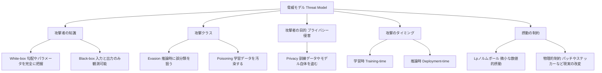

| 観点 | 選択肢 | 説明 |
|---|---|---|
| 攻撃者の知識 | White-box | モデルの構造・パラメータ・勾配まで全て把握している最も強い前提 |
| 攻撃者の知識 | Black-box | 入力を送って出力(ラベルやスコア)を見ることしかできない |
| 攻撃クラス | Evasion(回避) | 学習済みモデルに対し推論時に誤分類を狙う、最も研究が進んだ領域 |
| 攻撃クラス | Poisoning(汚染) | 学習データ自体を汚染し、モデルの挙動を歪める |
| 攻撃者の目的(プライバシー侵害) | Privacy(プライバシー) | 学習データやモデルパラメータ自体を盗み出す |
| 攻撃のタイミング | 学習時(Training-time) | Poisoningなど、モデルの学習プロセス自体を狙う |
| 攻撃のタイミング | 推論時(Deployment-time) | Evasionなど、学習済みモデルへの入力を操作する |
| 摂動の種類 | デジタル摂動 | L∞やL2などのノルムで制約された微小な数値変化 |
| 摂動の種類 | 物理摂動 | ステッカーや印刷物など、現実世界に存在できる改変 |

書籍の1〜5章(攻撃)は主にEvasion×White-box/Black-boxの組み合わせを、21〜22章はPoisoningとBackdoorを、26章はPrivacyを扱っています。

---

## Step 3 代表的なWhite-box攻撃 FGSM PGD C&W

書籍の第1章(White-box attack)に対応する内容です。White-box攻撃はモデルの勾配を直接利用できるため、攻撃の仕組みそのものを学ぶのに最適です。

### 3-1 FGSM Fast Gradient Sign Method

Goodfellow氏らが2014年に提案した最初期の代表的手法です。損失関数の勾配の**符号(sign)**だけを使い、たった1ステップでAdversarial Exampleを生成します。

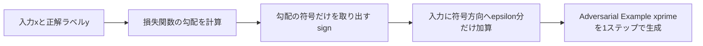

計算が非常に軽い一方、1ステップしか動かないため摂動としては粗く、後述するPGDのような反復攻撃に比べると弱いことが知られています。

### 3-2 PGD Projected Gradient Descent

2017年、Aleksander Madry氏(MIT)らは論文「Towards Deep Learning Models Resistant to Adversarial Attacks」で、Adversarial Robustnessを**頑健最適化(robust optimization)**の枠組みとして定式化し、FGSMを何度も繰り返し適用しながら、各ステップでノルムボールの中に射影(projection)し直す **PGD** を提案しました。

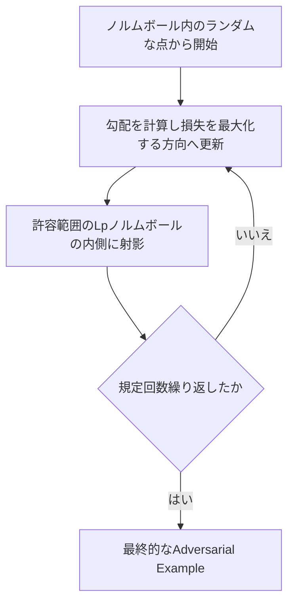

Madry氏らはPGDを「あらゆる一次(勾配ベース)攻撃の中でほぼ最強かつ普遍的な攻撃」と位置づけ、これをベースにした **PGD Adversarial Training** が、以後の防御研究の事実上の標準ベースラインになりました。

### 3-3 Carlini and Wagner攻撃 C&W

2017年、Nicholas Carlini氏とDavid Wagner氏(UC Berkeley)は論文「Towards Evaluating the Robustness of Neural Networks」で、当時提案されていた**Defensive Distillation**という防御手法が、実は攻撃者側を過小評価していただけであることを示し、これを打ち破る最適化ベースの攻撃(C&W攻撃)を提案しました。攻撃の成功率を95%から0.5%まで下げたと主張していた防御を、ほぼ完全に無効化した点が大きなインパクトを持ちました。

### 3-4 攻撃手法の比較

| 手法 | 発表年/著者 | 必要な情報 | 生成方法 | 特徴 |
|---|---|---|---|---|
| FGSM | 2014 Goodfellow et al. | White-box(勾配) | 1ステップ | 高速だが摂動が粗く弱い |
| PGD | 2017 Madry et al. | White-box(勾配) | 複数回反復+射影 | 事実上最強の一次攻撃、Adversarial Trainingの標準 |
| C&W | 2017 Carlini and Wagner | White-box(勾配) | 最適化ベース | 最小摂動を追求し多くの防御を打ち破った |

---

## Step 4 Black-box攻撃と転移性

書籍の第2〜4章(Soft-label Black-box Attack、Decision-based attack、Attack Transferability)に対応します。実際の攻撃者は常にモデルの内部にアクセスできるとは限りません。

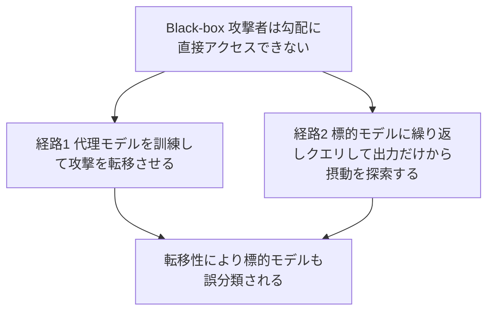

- **転移性(Transferability)を利用する攻撃**: 攻撃者自身が用意した代理モデル(substitute model)でAdversarial Exampleを作り、標的モデルにそのまま入力する。異なるアーキテクチャ・異なる学習データで訓練されたモデル同士でも、同じAdversarial Exampleが誤分類を引き起こすことが多いという興味深い性質を利用します。
- **クエリベースの攻撃**: 標的モデルに何度も入力を送り、出力(確信度スコアやラベルのみ)の変化を手がかりに摂動を探索する。出力がクラスラベルのみの場合を **Decision-based attack** と呼びます。

これらは、モデルを完全に公開しなくても(APIとして提供するだけでも)攻撃を受けうることを意味しており、実運用上非常に重要な視点です。

---

## Step 5 物理世界での攻撃

書籍第5章(Attacks in the physical world)に対応します。デジタル空間の数値的な摂動を、現実の物体に落とし込めるかという問題です。

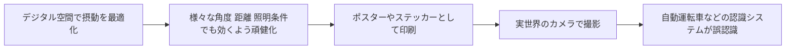

2016年、Alexey Kurakin氏らはGoogleにて「Adversarial examples in the physical world」で、印刷したAdversarial Exampleをスマートフォンのカメラ越しに撮影しても誤分類が起きることを示しました。2018年にはKevin Eykholt氏らがCVPRで発表した「Robust Physical-World Attacks on Deep Learning Visual Classification」で、ストップ標識に貼った落書き風のステッカーが、様々な角度・距離・照明条件下でも自動運転向け認識モデルを高い確率で「制限速度45標識」などに誤認識させられることを実証し、自動運転の安全性に対する具体的な懸念を広く知らしめました。

---

## Step 6 防御1 Adversarial Training

書籍第10章に対応します。最も広く使われている経験的な防御手法です。

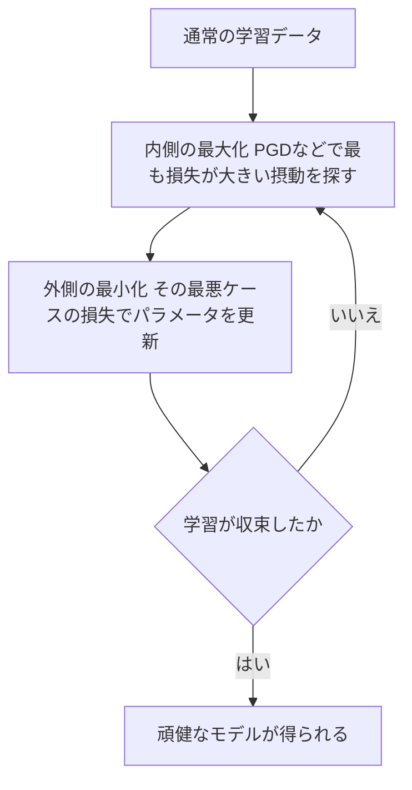

Madry氏らの定式化では、Adversarial Trainingは以下のようなミニマックス(min-max)最適化として書けます。

```
min_θ  E[ max_{δ∈Δ(x)}  L( f_θ(x+δ), y ) ]
```

- 内側の `max` は、現在のモデルパラメータθのもとで最も損失を大きくする摂動δ(=最も強いAdversarial Example)を探す問題
- 外側の `min` は、その「最悪ケースの損失」を最小化するようにモデルパラメータθを更新する問題

この内側の最大化をPGDで近似するのがPGD Adversarial Trainingであり、以後の防御研究における事実上のデファクトスタンダードになりました。ただし、学習に使った攻撃(例えばPGD)に対しては頑健になっても、未知のより強い攻撃に対して頑健である保証はない、という限界も指摘されています。

---

## Step 7 防御2 証明可能な頑健性 Certified Robustness

書籍第6〜9章(Convex relaxation、Layer-wise relaxation、Dual approach、Probabilistic verification)、第11章(Certified defense)、および第12章(Randomization)に対応します。Adversarial Trainingが「経験的に頑健」であるのに対し、Certified Robustness(証明可能な頑健性)は、**各手法が前提とする証明条件(緩和の妥当性やサンプリング設定など)が満たされている場合に限り**、「この範囲の摂動なら予測が変わらない」ことを数学的に保証することを目指します。

書籍前半の6〜9章は、ニューラルネットワークの各層を凸緩和(convex relaxation)や区間演算で上下に挟み込み、出力の変動範囲を数学的に証明するアプローチ(いわゆる形式的検証 Formal Verification に近い手法群)を扱っています。

より実務で広く使われているのが **Randomized Smoothing(ランダム化平滑化)** です。2019年、Jeremy Cohen氏・Elan Rosenfeld氏・J. Zico Kolter氏(いずれもCMU)は論文「Certified Adversarial Robustness via Randomized Smoothing」で、ガウスノイズ下でうまく分類できる任意のベースモデルを、L2ノルムに対して証明可能な頑健性を持つ新しい分類器に変換する手法を提案しました。具体的には、ガウスノイズを加えた入力を多数サンプリングして各クラスの出力確率をモンテカルロ推定し、信頼度水準 1−α のもとでその下限・上限を統計的に見積もった上で証明可能な半径を計算します。この半径は、サンプル数や信頼度水準といった前提条件が満たされている場合にのみ「証明済み」とみなせます。

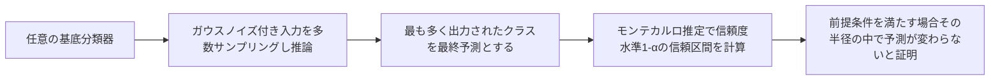

この手法は当時、ImageNet級の大規模データセットに対して実用的な証明可能防御を実現した数少ない方法として大きな注目を集め、IBMのAdversarial Robustness Toolboxにも標準実装として取り込まれています。

---

## Step 8 壊れた防御と正しい評価方法

書籍第13章(Detection methods)とも関連する、この分野の研究倫理・方法論における最重要トピックです。

### 8-1 Obfuscated Gradients という落とし穴

2018年、Anish Athalye氏・Nicholas Carlini氏・David Wagner氏は論文「Obfuscated Gradients Give a False Sense of Security」で、ICLR 2018で発表された9つの防御手法のうち7つが、実際には頑健なのではなく**勾配マスキング(gradient masking)**によって勾配ベース攻撃を偶然すり抜けていただけであることを示しました。「勾配が壊れている(obfuscated)ために攻撃が効かないように見える」現象で、Shattered Gradients(勾配が不連続・数値的に不安定)、Stochastic Gradients(確率的な処理により勾配が安定しない)、Exploding/Vanishing Gradients(勾配が発散/消失する)の3種類に分類されています。

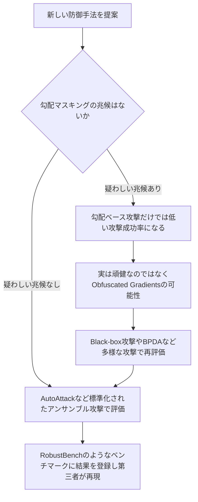

Nicholas Carlini氏(現Anthropic、以前はGoogle DeepMind)は自身のブログ(nicholas.carlini.com/writing)でも継続的にこの問題を取り上げており、2024年の記事「(yet another) Broken Adversarial Example Defense at IEEE S&P 2024」では、IEEE S&P 2024で発表された防御手法をわずか1行のコード修正で打ち破ったと報告し、分野全体の評価手法に対する問題提起を続けています。

### 8-2 標準化された評価 AutoAttack と RobustBench

こうした「見かけ上の頑健性」を防ぐため、2020年にFrancesco Croce氏とMatthias Hein氏(University of Tübingen)は、複数の攻撃を組み合わせたアンサンブル攻撃 **AutoAttack** と、それを使って公平にモデルを比較する標準ベンチマーク **RobustBench**(robustbench.github.io)を提案しました。RobustBenchは120以上のモデルの評価結果を公開リーダーボードとして管理し、80以上の頑健なモデルをすぐ使えるModel Zooとして提供しています。新しい防御手法を発表する際は、まずこのような標準化された攻撃で自己評価し、可能であれば第三者による再現評価を受けることが、現在の分野のベストプラクティスとされています。

---

## Step 9 画像分類を超えて

書籍第14〜22章に対応する内容を、初学者向けに要点だけ整理します。

| 分野 | 書籍の章 | 要点 |
|---|---|---|
| 画像分類以外のモデル | 14章 | 決定木やSVMなどニューラルネットワーク以外のモデルにも頑健性の議論は存在する |
| NLPモデル | 15章 | テキストは離散的なため、単語の言い換えや文字挿入など画像とは異なる摂動の作り方が必要 |
| グラフニューラルネットワーク | 16章 | エッジやノード特徴量への摂動がグラフ構造全体の予測に影響する |
| 推薦システム | 17章 | 悪意ある評価データの注入によりランキングを操作される可能性 |
| 強化学習 | 18章 | 観測や環境への摂動によりエージェントの行動を誤らせる |
| 音声モデル | 19章 | 人間には聞こえない音声への埋め込みで音声認識を誤動作させる |
| マルチモーダルモデル | 20章 | 画像とテキストなど複数モダリティを跨いだ攻撃 |

特に21〜22章の **Backdoor攻撃** と **Data Poisoning攻撃** は、評価時ではなく学習時にモデルを狙う点で、これまでのEvasion攻撃と根本的に性質が異なります。2017年、Tianyu Gu氏・Brendan Dolan-Gavitt氏・Siddharth Garg氏は論文「BadNets: Identifying Vulnerabilities in the Machine Learning Model Supply Chain」で、学習データにごく小さな「トリガー」パターン(例えばストップ標識の隅に貼った小さなステッカー)を混入させることで、クリーンな入力に対しては通常通り高精度に動作しながら、トリガーが付いた入力にだけ攻撃者が意図した誤分類を起こす「BadNet」を作れることを示しました。クラウドで訓練を外部委託したり、事前学習済みモデルを再利用したりする現代的なMLパイプラインでは、この種のサプライチェーンリスクへの注意が特に重要になっています。イタリアCagliari大学のBattista Biggio氏とFabio Roli氏による2018年のサーベイ論文「Wild Patterns: Ten Years After the Rise of Adversarial Machine Learning」も、Adversarial Machine Learningの前史(2000年代のスパムフィルタ回避攻撃研究など)を含めた分野全体の歴史を俯瞰する重要な文献としてよく引用されます。

---

## Step 10 LLM時代のAdversarial Robustness

書籍の刊行は2022年8月ですが、その後の大規模言語モデル(LLM)の急速な普及に伴い、Adversarial Robustnessの研究対象は画像分類から大きく広がりました。ここでは2026年9月時点の状況を補足します。

### 10-1 GCG Universal and Transferable Adversarial Attacks

2023年、Andy Zou氏・Zifan Wang氏・Nicholas Carlini氏・Milad Nasr氏・J. Zico Kolter氏・Matt Fredrikson氏(Carnegie Mellon University /当時のGray Swan AI周辺の研究者ら)は論文「Universal and Transferable Adversarial Attacks on Aligned Language Models」で、**GCG (Greedy Coordinate Gradient)** と呼ばれる手法を提案しました。これは勾配情報を使って、有害な出力を引き出す「suffix(接尾辞)」をトークン単位で貪欲に最適化する攻撃です。興味深いことに、このsuffixはオープンソースモデル(Vicuna等)で最適化しても、直接アクセスできないブラックボックスの商用モデルにまである程度転移することが報告されており、これはStep 4で説明した「転移性」がLLMの世界でも成立することを示す重要な発見でした。

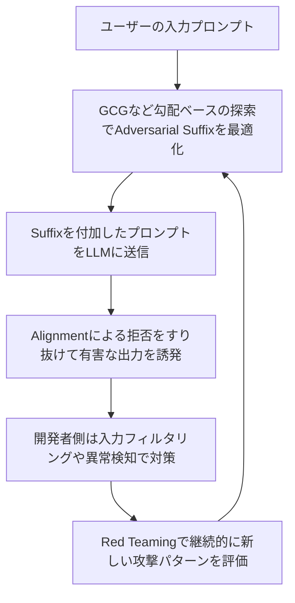

### 10-2 分野を横断する標準フレームワーク

2026年9月時点で、AI/LLMへの攻撃を体系的に整理する主要なフレームワークとして以下が挙げられます。

| フレームワーク | 発行元 | 概要 |
|---|---|---|
| NIST AI 100-2e2025 | 米国国立標準技術研究所(NIST) | Predictive AI (PredAI) を対象とするEvasion・Poisoning・Privacyの3分類に、Generative AI (GenAI) 固有のMisuse分類を加えた4分類でAdversarial ML用語を標準化 |
| MITRE ATLAS | MITRE Corporation | ATT&CKと同じマトリクス形式で、AIシステムに対する実際の攻撃事例と戦術・技術をカタログ化。2026年2月更新でエージェント特有の攻撃技術も追加<sup>[18]</sup> |
| OWASP Top 10 for LLM Applications 2026 | OWASP GenAI Security Project | Prompt Injectionをはじめ、LLMアプリケーション特有のリスクを優先順位付けした実務者向けガイド。2026年8月に最新版を公開 |

NIST AI 100-2e2025は、Apostol Vassilev氏(NIST)、Alina Oprea氏(Northeastern University)らに加え、英国AI Security Institute・米国AI Safety Institute・Ciscoの研究者も著者に名を連ねており、複数機関の共同執筆・協力によって策定された文書の一例です。MITRE ATLASはMicrosoftとの協業から始まり、MITREは2023年11月のプレスリリースで、政府・学術・産業界の「well over 100(100を大きく超える)」組織が参加するコミュニティ主導のナレッジベースであると説明しています。

### 10-3 何がどこまで同じで何が違うのか

- **同じ点**: 「モデルの出力を意図的に誤らせる精密な入力を作る」という基本構造や、White-box/Black-box、転移性といった概念はそのままLLMにも当てはまります。実際GCGは勾配情報を手がかりにした貪欲座標探索(gradient-guided greedy coordinate search)を離散トークン空間に応用したものと位置づけられます。
- **異なる点**: LLMでは入力・出力ともに自然言語という離散的・意味を持つ空間であるため、「Lpノルムで微小」という古典的な制約がそのまま使えません。代わりに、prompt injection(外部データ経由での指示の乗っ取り)やjailbreak(安全対策の迂回)といった、LLM特有の脅威カテゴリが中心的な関心事になっています。

---

## Step 11 実践 ツールとライブラリ

概念を学んだら、実際に手を動かして攻撃や防御を試すことが理解を深める近道です。

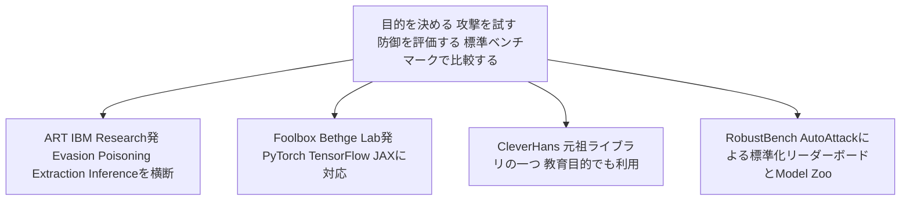

| ツール | 開発元 | 主な特徴 |
|---|---|---|
| Adversarial Robustness Toolbox (ART) | IBM Research(現Linux Foundation AI and Data配下のグラデュエートプロジェクト) | Evasion・Poisoning・Extraction・Inferenceの4種類の脅威を横断する総合ライブラリ。多数の攻撃・防御手法を継続的に実装し、TensorFlow/PyTorch/scikit-learn等の主要フレームワークに対応(具体的な実装数は公式リポジトリの attacks/defences ドキュメントを参照) |
| Foolbox | Bethge Lab(University of Tübingen) Jonas Rauber氏ら | PyTorch・TensorFlow・JAXすべてに対応した、モデル頑健性のベンチマークに特化したライブラリ |
| CleverHans | 元Google Brain発、現在はCleverHans Labが継続開発 | 分野初期から使われている老舗ライブラリ。攻撃の再現実装のリファレンスとして広く参照される |
| RobustBench | Francesco Croce氏・Matthias Hein氏ら(Tübingen大学 / EPFL / Princeton大学など) | AutoAttackを用いた標準ベンチマーク。80以上の頑健なモデルを含むModel Zooをpipから直接利用可能 |

書籍の著者であるPin-Yu Chen氏自身がART開発陣の一員であることもあり、この書籍とARTは内容的にも親和性が高く、書籍を読みながらARTのサンプルコードで手を動かすという学び方がおすすめです。

---

## Step 12 学習ロードマップ

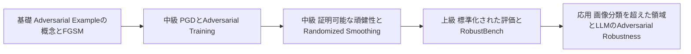

1. **基礎**: Szegedy et al.(2014)とGoodfellow et al.(2014)を読み、FGSMを実際にコードで実装してみる
2. **中級**: Madry et al.(2017)のPGDとAdversarial Trainingを理解し、ARTやFoolboxで手を動かす
3. **中級〜上級**: Cohen et al.(2019)のRandomized Smoothingで「証明可能」とはどういうことかを体験する
4. **上級**: Athalye et al.(2018)を読み、自分や他人の防御手法を批判的に評価する視点を養う。RobustBenchのリーダーボードを眺め、現在のSOTAを把握する
5. **応用**: 書籍第14〜26章で画像分類以外の領域を概観したのち、Zou et al.(2023)のGCGやMITRE ATLAS、OWASP Top 10 for LLM and GenAIでLLM時代の脅威モデルを学ぶ

---

## まとめ

- Adversarial Exampleは2013〜2014年にSzegedy氏・Goodfellow氏らによって発見され、ニューラルネットワークの本質的な脆弱性として広く認識されるようになった
- 攻撃はWhite-box(FGSM, PGD, C&W)からBlack-box、物理世界まで多様化しており、脅威モデル(攻撃者の知識・目的・摂動の制約)を正確に定義することが議論の出発点になる
- 防御はAdversarial Training(経験的)とCertified Robustness(数学的に証明可能)の大きく2系統があり、それぞれにトレードオフがある
- 「頑健に見えるだけ」のObfuscated Gradientsという落とし穴があり、AutoAttack/RobustBenchのような標準化された評価が分野の信頼性を支えている
- Backdoor攻撃やData Poisoningのように、学習時を狙う脅威はサプライチェーン全体のリスクとして重要性を増している
- 2022年の書籍刊行以降、LLMの台頭によりGCGのような新しい攻撃手法や、NIST・MITRE・OWASPといった国際的な標準フレームワークが整備され、分野はAIセキュリティ全体へと拡大している

---

## 理解度チェックリスト

- [ ] Adversarial Exampleとランダムノイズの違いを、自分の言葉で説明できる
- [ ] White-box攻撃とBlack-box攻撃の違いと、それぞれの代表的な手法を挙げられる
- [ ] FGSMとPGDの関係(1ステップ vs 反復)を説明できる
- [ ] Adversarial Trainingのミニマックス定式化の意味(内側の最大化と外側の最小化)を理解している
- [ ] 「証明可能な頑健性」が「経験的な頑健性」とどう違うかを説明できる
- [ ] Obfuscated Gradientsがなぜ危険な落とし穴なのかを説明できる
- [ ] AutoAttackやRobustBenchが果たす役割を理解している
- [ ] Backdoor攻撃がEvasion攻撃とどう違うかを説明できる
- [ ] GCGのような勾配ガイド付き貪欲座標探索(gradient-guided greedy coordinate search)が、古典的なPGDの考え方とどうつながっているかを説明できる
- [ ] NIST AI 100-2、MITRE ATLAS、OWASP Top 10 for LLM and GenAIがそれぞれ何のためのフレームワークかを説明できる

---

## 参考文献 情報源

### 原書籍

1. Pin-Yu Chen, Cho-Jui Hsieh, *Adversarial Robustness for Machine Learning*, Elsevier, 2022 — [https://shop.elsevier.com/books/adversarial-robustness-for-machine-learning/chen/978-0-12-824020-5](https://shop.elsevier.com/books/adversarial-robustness-for-machine-learning/chen/978-0-12-824020-5)
2. ScienceDirect(書籍本文の閲覧ページ) — [https://www.sciencedirect.com/science/book/9780128240205](https://www.sciencedirect.com/science/book/9780128240205)

### 基礎理論 発見と攻撃手法

3. Szegedy et al., "Intriguing properties of neural networks" (2013/2014) — [https://arxiv.org/abs/1312.6199](https://arxiv.org/abs/1312.6199)
4. Goodfellow, Shlens, Szegedy, "Explaining and Harnessing Adversarial Examples" (2014) — [https://arxiv.org/abs/1412.6572](https://arxiv.org/abs/1412.6572)
5. Madry, Makelov, Schmidt, Tsipras, Vladu, "Towards Deep Learning Models Resistant to Adversarial Attacks" (2017) — [https://arxiv.org/abs/1706.06083](https://arxiv.org/abs/1706.06083)
6. Carlini, Wagner, "Towards Evaluating the Robustness of Neural Networks" (2017) — [https://arxiv.org/abs/1608.04644](https://arxiv.org/abs/1608.04644)
7. Kurakin, Goodfellow, Bengio, "Adversarial examples in the physical world" (2016) — [https://arxiv.org/abs/1607.02533](https://arxiv.org/abs/1607.02533)
8. Eykholt et al., "Robust Physical-World Attacks on Deep Learning Visual Classification", CVPR 2018 — [https://openaccess.thecvf.com/content_cvpr_2018/papers/Eykholt_Robust_Physical-World_Attacks_CVPR_2018_paper.pdf](https://openaccess.thecvf.com/content_cvpr_2018/papers/Eykholt_Robust_Physical-World_Attacks_CVPR_2018_paper.pdf)

### 防御と評価

9. Cohen, Rosenfeld, Kolter, "Certified Adversarial Robustness via Randomized Smoothing" (2019) — [https://arxiv.org/abs/1902.02918](https://arxiv.org/abs/1902.02918)
10. Athalye, Carlini, Wagner, "Obfuscated Gradients Give a False Sense of Security" (2018) — [https://arxiv.org/abs/1802.00420](https://arxiv.org/abs/1802.00420)
11. Croce, Andriushchenko, Sehwag, Debenedetti, Flammarion, Chiang, Mittal, Hein, "RobustBench: a standardized adversarial robustness benchmark" (2020) — [https://arxiv.org/abs/2010.09670](https://arxiv.org/abs/2010.09670) / リーダーボード [https://robustbench.github.io/](https://robustbench.github.io/)
12. Nicholas Carlini氏 個人ブログ(継続的な防御手法への批判的検証や研究者向け考察を公開) — [https://nicholas.carlini.com/writing](https://nicholas.carlini.com/writing)
13. Nicholas Carlini氏 論文一覧 — [https://nicholas.carlini.com/papers](https://nicholas.carlini.com/papers)

### Backdoor Poisoning 歴史的サーベイ

14. Gu, Dolan-Gavitt, Garg, "BadNets: Identifying Vulnerabilities in the Machine Learning Model Supply Chain", 2017 — [https://arxiv.org/abs/1708.06733](https://arxiv.org/abs/1708.06733)
15. Biggio, Roli, "Wild Patterns: Ten Years After the Rise of Adversarial Machine Learning", Pattern Recognition, 2018 — [https://arxiv.org/abs/1712.03141](https://arxiv.org/abs/1712.03141)

### LLM 時代の脅威フレームワーク 2026年9月時点

16. Zou, Wang, Carlini, Nasr, Kolter, Fredrikson, "Universal and Transferable Adversarial Attacks on Aligned Language Models" (2023) — [https://arxiv.org/abs/2307.15043](https://arxiv.org/abs/2307.15043)
17. NIST AI 100-2e2025, "Adversarial Machine Learning: A Taxonomy and Terminology of Attacks and Mitigations" — [https://nvlpubs.nist.gov/nistpubs/ai/nist.ai.100-2e2025.pdf](https://nvlpubs.nist.gov/nistpubs/ai/nist.ai.100-2e2025.pdf)
18. MITRE ATLAS(Adversarial Threat Landscape for Artificial-Intelligence Systems) — [https://atlas.mitre.org/](https://atlas.mitre.org/) / パートナー組織数の出典: MITRE, "MITRE and Microsoft Collaborate to Address Generative AI Security Risks" (2023年11月) — [https://www.mitre.org/news-insights/news-release/mitre-and-microsoft-collaborate-address-generative-ai-security-risks](https://www.mitre.org/news-insights/news-release/mitre-and-microsoft-collaborate-address-generative-ai-security-risks) / エージェント特有技術追加(2026年2月)の出典: MITRE Center for Threat-Informed Defense, "MITRE ATLAS OpenClaw Investigation Discovers New and Likeliest Techniques" (2026年2月9日) — [https://ctid.mitre.org/blog/2026/02/09/mitre-atlas-openclaw-investigation/](https://ctid.mitre.org/blog/2026/02/09/mitre-atlas-openclaw-investigation/)
19. OWASP GenAI Security Project, "OWASP GenAI LLM Top 10 2026" — [https://genai.owasp.org/initiatives/top-10-for-llm-and-genai/](https://genai.owasp.org/initiatives/top-10-for-llm-and-genai/)

### ツール ライブラリ

20. Adversarial Robustness Toolbox (ART), IBM Research / Linux Foundation AI and Data — [https://github.com/Trusted-AI/adversarial-robustness-toolbox](https://github.com/Trusted-AI/adversarial-robustness-toolbox)
21. Foolbox, Bethge Lab — [https://github.com/bethgelab/foolbox](https://github.com/bethgelab/foolbox)
22. CleverHans — [https://github.com/cleverhans-lab/cleverhans](https://github.com/cleverhans-lab/cleverhans)

---

*本ガイドは2026年9月14日時点のウェブ検索結果と一次情報源に基づいて作成されています。研究は日々更新されるため、最新の攻撃手法やベンチマーク結果については各リンク先の一次情報を直接ご確認ください。*
