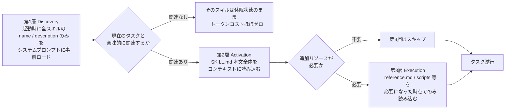
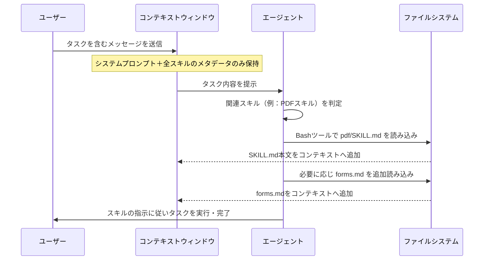
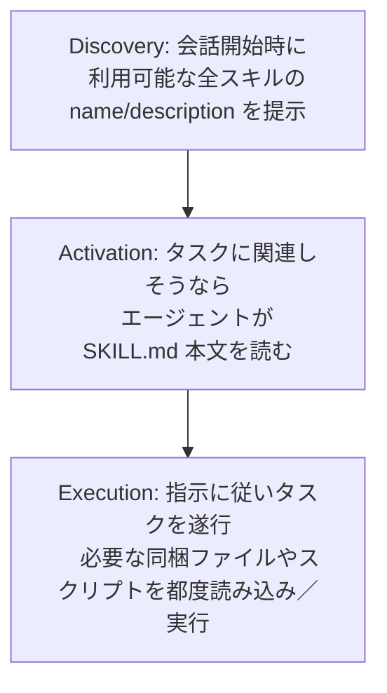
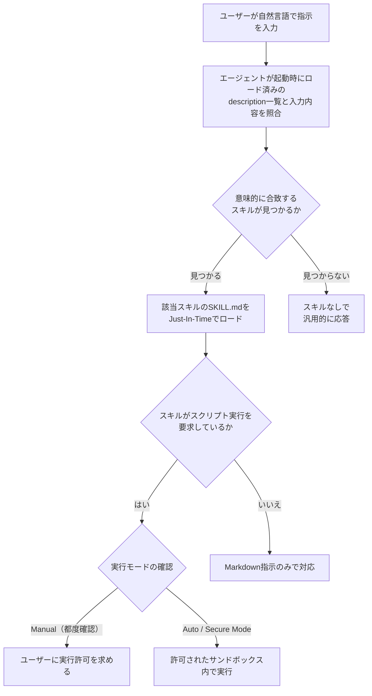
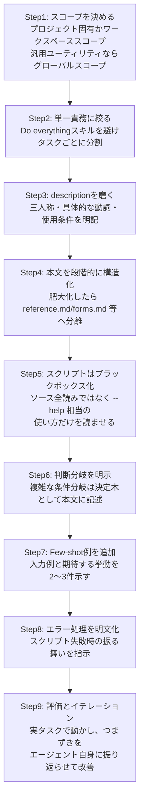

# Agent Skills 実践ガイド
## Antigravity IDE における SKILL.md の設計思想・アーキテクチャ・実装パターン・運用

> 対象読者：中級〜上級のAIエンジニア／プラットフォームエンジニア
> 情報基準日：2026年7月27日（Web検索により最新情報を反映）

---

## 0. はじめに

「Agent Skills」は、AIエージェントに手続き的知識（procedural knowledge）や組織固有のコンテキストを、**フォルダとMarkdownファイル**という極めてシンプルな形式で与えるための設計パターンです。2025年10月にAnthropicがClaude向けに発表し、同年12月には `agentskills.io` として企業横断のオープン標準に格上げされました。Google の Antigravity（IDE／CLI／SDKからなるエージェントファースト開発環境）はこの標準をネイティブでサポートしており、Claude Code・OpenAI Codex・Gemini CLI・Cursor・GitHub Copilotなどと**同一フォーマットのSKILL.md**を読み込むことができます。

本ガイドは、単なる機能紹介ではなく、なぜこの設計になっているのか（設計思想）、内部でどう動くのか（アーキテクチャ）、どう書けば品質が上がるのか（実装パターン）、チームでどう回すのか（運用）を、一次情報にもとづいて段階的に解説します。

---

## 1. Agent Skills の起源と位置づけ

| 時期 | 出来事 |
|---|---|
| 2025年10月16日 | Anthropicが「Agent Skills」をClaude向けに発表。エンジニアリングブログ「Equipping agents for the real world with Agent Skills」を公開 |
| 2025年10月16日 | Simon Willison氏（Datasette作者、AI開発ツール評論で著名）が即日検証し「Claude Skills are awesome, maybe a bigger deal than MCP」と評価 |
| 2025年12月18日 | Agent Skills形式が `agentskills.io` としてオープン標準化。Anthropic以外のツールへの移植性を確保 |
| 2026年1月〜 | Google AntigravityがSKILL.mdをネイティブサポートすると発表・文書化 |
| 2026年2月 | Bosch ResearchとCarnegie Mellon大学の研究（arXiv:2602.08004）が公開スキル数の急増（約20日間で2,179件→40,000件超）を報告 |
| 2026年〜現在 | Cursor、GitHub Copilot、VS Code、Gemini CLI、Goose、OpenCodeなど40以上のクライアントが同一フォーマットを採用 |

ポイントは、Agent Skillsが「新しいプロトコル」ではなく「Markdownファイル＋フォルダ規約」という最小限の仕様である点です。Willison氏はMCP（Model Context Protocol）と対比し、MCPがホスト・クライアント・サーバー・トランスポートを含む本格的なプロトコル仕様であるのに対し、SkillsはCLIツールの `--help` をエージェントに読ませる発想の延長線上にあり、サーバー実装が不要で導入コストが極めて低いと指摘しています。

---

## 2. 設計思想：Progressive Disclosure（段階的開示）

Agent Skillsの中核にある設計原則が **Progressive Disclosure（段階的開示）** です。Anthropicのエンジニアリングブログでは、これを「よく整理されたマニュアル」に例えています。目次だけをまず読み、必要な章だけを開き、さらに詳細が必要なら巻末の付録を参照する——これと同じ階層構造をコンテキストウィンドウの中で再現します。

### 2.1 三段階のロード



この設計により、1スキルあたりの起動時コストは数十トークン程度に抑えられ、数十個のスキルを同時にインストールしても実用上のオーバーヘッドがほぼ発生しません。実際にAnthropic公式リポジトリの17スキルを分析した第三者調査では、本文サイズは最小で約275トークン（internal-comms相当）から最大で約8,000トークン（skill-creator相当）まで幅があり、中央値はおよそ2,000トークンと報告されています。

### 2.2 コンテキストウィンドウ内での実際の流れ

Anthropicが公開したPDFスキルの例をもとにすると、実行時の流れは次のようになります。



重要なのは、スキルに同梱されたPythonスクリプトなどの**コード自体はコンテキストに読み込まれず、実行結果のみが返る**という点です。これにより、ソートのような決定的処理をトークン生成で行う非効率を避けつつ、再現性のある挙動を保証できます。

### 2.3 なぜシステムプロンプトやMCPではダメなのか

| 比較軸 | システムプロンプトへの直書き | MCPサーバー | Agent Skills（SKILL.md） |
|---|---|---|---|
| 常時ロード | 常に全文がロードされる（Instruction Fatigue の原因） | ツール定義は常時ロード | メタデータのみ常時ロード、本文は必要時のみ |
| 導入コスト | 低いが肥大化しやすい | サーバー実装・ホスティングが必要 | Markdownファイル1枚から開始可能 |
| 起動時トークンコスト | 会話が長くなるほど圧迫 | ツール数に比例して増大 | 1スキルあたり数十トークン程度 |
| 移植性 | ツール依存 | プロトコル準拠が必要 | フォルダごとコピーで他ツールへ移植可能 |
| コード実行 | 不可 | サーバー側で実装次第 | スクリプトを同梱し決定的に実行可能 |

この比較からもわかる通り、Agent Skillsは「常時稼働する外部連携」を担うMCPを置き換えるものではなく、**手続き的知識・スタイルガイド・反復可能なワークフローを、低コストでエージェントに教え込む層**として補完的に機能します。

---

## 3. アーキテクチャ：SKILL.md の解剖

### 3.1 最小構成

スキルはフォルダとして表現され、必須ファイルは `SKILL.md` 一つだけです。

- スキルフォルダ（例：`my-skill/`）
    - `SKILL.md` — 必須。YAMLフロントマター＋Markdown本文
    - `scripts/` — 任意。エージェントが呼び出す実行可能スクリプト
    - `examples/` または `references/` — 任意。参照用ドキュメント
    - `resources/` または `assets/` — 任意。テンプレートや設定ファイル

### 3.2 YAMLフロントマターの仕様

| フィールド | 必須 | 説明 |
|---|---|---|
| `name` | 任意 | スキルの一意な識別子（小文字・ハイフン区切り）。省略時はフォルダ名がそのまま使われる |
| `description` | **必須** | スキルが何をし、いつ使うべきかを説明する文。エージェントがトリガー判定に使う唯一の材料 |

フロントマター以外の本文はMarkdownで自由に記述できますが、後述する「段階的開示」の効果を最大化するには、本文自体もさらに階層化（詳細を別ファイルへ逃がす）できる設計にしておくことが推奨されます。

### 3.3 スキルの発見・起動・実行の3フェーズ



ユーザーは明示的にスキル名を呼び出す必要はなく、エージェントが文脈から自律的に判断します（＝セマンティックトリガリング）。ただし、確実に使わせたい場合はスキル名をプロンプト中で直接指定することも可能です。

---

## 4. Antigravity IDE における実装仕様

### 4.1 スキルの配置場所（スコープ）

Antigravity（IDE／CLI共通の2.0系プラットフォーム）は、公式ドキュメント上で次の2種類のスコープをサポートすると明記しています。

| スコープ | パス | 用途 |
|---|---|---|
| ワークスペーススコープ | `<workspace-root>/.agents/skills/<skill-folder>/` | チームのデプロイ手順やテスト規約など、プロジェクト固有のワークフロー。Gitでバージョン管理し、クローンした全開発者に自動配布される |
| グローバルスコープ | ユーザーのホームディレクトリ配下（後述の通り製品面により差異あり） | 個人のユーティリティや、全プロジェクト共通で使いたい汎用スキル |

> **注意（実運用上のハマりどころ）**：Antigravityは現在 `.agents/skills`（複数形）をデフォルトとしつつ、後方互換のため旧形式の `.agent/skills`（単数形）も引き続きサポートしています。さらに、グローバルスコープのパスは製品ドキュメントのページによって表記が割れており（例：`~/.gemini/config/skills/` と `~/.gemini/antigravity/skills/`）、GoogleのDeveloper ExpertであるMete Atamel氏が実機検証したブログ記事では、Antigravity本体・Antigravity CLI・Antigravity IDEの3つのサーフェスでそれぞれ**異なるグローバルパスを参照している**ことが報告されています。本番運用では、`Which skills are installed?`（IDE／Antigravity本体）や `/skills`（CLI）をエージェントに尋ねて実際の認識状況を確認することが推奨されます。

### 4.2 セマンティックトリガリングの仕組み



description フィールドは三人称・具体的な動詞（「生成する」「検証する」「実行する」など）で書くことが公式に推奨されています。これは、エージェントがこの一文だけを手がかりにトリガー判定を行うためで、曖昧な説明文はスキルの不発火・誤発火に直結します。

### 4.3 実行モードとセキュリティ境界

Antigravityはスクリプト実行の安全性を担保するため、権限モデルとして「常に確認を求める」設定と「信頼済みスキルは自動実行」設定を切り替えられるほか、ネットワークアクセス禁止・ワークスペース外への書き込み禁止・全コマンドのサンドボックス化を行う最も厳格な設定（Secure Mode）を提供しています。ただしこの境界がどこまで堅牢かは4.4節で扱う実際のインシデントも参考にしてください。

---

## 5. 実装パターン：ステップバイステップのベストプラクティス

以下は、Anthropic公式のガイダンスとAntigravity公式ドキュメント、および実務者による検証記事を統合した実装フローです。



### Step 1：スコープを見極める
チームのデプロイ手順やそのプロジェクト固有のビルドパイプラインは**ワークスペーススコープ**（Gitで共有）、個人のコミットメッセージ規約やJSON整形のような汎用ユーティリティは**グローバルスコープ**に置きます。

### Step 2：単一責務の原則（Keep it Atomic）
「DevOpsスキル」のような何でも屋を作るのではなく、「ステージングデプロイ」「ログ解析」「ヘルスチェック」のように**タスクごとに個別のスキルへ分割**します。これはトリガー精度の向上と保守性の両方に効きます。

### Step 3：description（トリガー文）を磨く
公式ドキュメントが示す良い例は次のようなものです。

```
description: Generates unit tests for Python code using pytest conventions.
```

三人称で書き、「いつ使うか」まで含めることで、意味的トリガリングの精度が上がります。曖昧な一言（例：「テストを手伝う」）は誤発火や不発火の原因になります。

### Step 4：本文を段階的に構造化する
`SKILL.md` が長大になってきたら、使用頻度の低い詳細や互いに排他的なシナリオ（例：フォーム入力だけで使う手順）を `forms.md` のような別ファイルに逃がし、`SKILL.md` からリンクします。これにより第3層の読み込みが本当に必要な場合にのみ発生し、トークン効率を維持できます。

### Step 5：スクリプトはブラックボックスとして扱わせる
スキルにスクリプトを同梱する場合、エージェントにソースコード全文を読ませるのではなく、まず `--help` 相当の使い方だけを確認させるよう本文で誘導します。これによりコンテキストの圧迫を避けつつ、決定的な処理はコードに委譲できます。

### Step 6：決定木（Decision Tree）を組み込む
複雑な条件分岐を伴うスキルには、「Pythonファイルの場合はPEP 8整形スキルを適用、それ以外はスキップ」のような判断基準を本文に明記します。これはAntigravity公式ドキュメントの「複雑なスキルには決定木を含める」という推奨とも一致します。

### Step 7：Few-shot例を添える
ユーザーの入力例とエージェントの期待挙動のペアを2〜3件示すことで、成功率が有意に向上すると報告されています。

### Step 8：エラーハンドリングを明示する
「テストスクリプトが非ゼロの終了コードを返した場合はログを解析し修正案を提示する」のように、失敗時の振る舞いまで本文に書き込みます。

### Step 9：評価から始め、エージェントと一緒に磨き込む
Anthropicのガイダンスでは、まず代表的なタスクでエージェントを動かし、つまずいた箇所を観察してからスキルを段階的に作ることが推奨されています。さらに、エージェント自身に「うまくいったやり方」や「よくある間違い」を振り返らせ、その学びを `SKILL.md` に反映させるという反復サイクルが有効だとされています。Antigravityの実務者ブログでも、AIが生成したスキルが最初はうまく機能しなくても、修正手順をコーディングエージェント自身に発見させて `SKILL.md` を更新させることで、スキルが「生きたドキュメント」として継続的に改善されていく運用が紹介されています。

---

## 6. 運用（Operations）

### 6.1 バージョン管理とチーム共有

スキルは単なるフォルダなのでGitでそのままバージョン管理でき、リポジトリのルートに置けばチーム全員に自動配布されます。より広く配布したい場合は、Claude Codeのプラグイン／マーケットプレイス機構（`.claude-plugin/marketplace.json` を含む公開GitHubリポジトリ）のような仕組みや、コミュニティ主導のスキル集（例：GitHub上の `awesome-claude-skills`、`antigravity-awesome-skills` など）を利用する運用も広がっています。ある集計では、エコシステム全体で1,400件超のスキルが主要な互換クライアント（Antigravity、Claude Code、Codex、Gemini CLI、Cursor、Copilot、OpenCode、Windsurfなど）を横断して共有可能な状態にあると報告されています。

### 6.2 クロスプラットフォーム運用時の注意

同一の `SKILL.md` は理論上どのAgent Skills互換クライアントでも動きますが、実務者の検証では次の点に注意が必要だとされています。

- 各クライアントで**スキルの探索パスが異なる**（例：Claude Codeは `~/.claude/skills/` や `.claude/skills/`、Codex CLIは `.agents/skills/`、Gemini CLIは `.gemini/skills/`）。フォーマットは共通でも配置場所はツール依存です。
- **ツール固有の実行フック**（例：特定のCLIに依存したBashコマンド）を本文に埋め込むと、他ツールへ移植した際にそのまま動かないことがあります。移植性を重視するなら「中立的なSKILL.md」——最小限のフロントマターと、特定ツールに依存しない指示文——として書くことが推奨されます。
- ツール推奨のツール数上限（目安として同時稼働ツールは20未満、精度は10を超えたあたりから劣化しやすいという報告あり）を踏まえ、スキル自体の数よりも、**同時にアクティブ化されうるツール／スクリプトの複雑さ**を管理する視点も必要です。

### 6.3 セキュリティ運用（最重要）

Anthropic公式のガイダンスは明確です。「信頼できる提供元のスキルのみをインストールすること。信頼度の低いソースからスキルを導入する場合は、使用前に必ず内容を精査すること」。特に、同梱されたコードの依存関係や画像・スクリプトなどのリソース、そして**エージェントを外部の未信頼なネットワーク先へ接続させようとする指示やコード**には注意を払うべきだとされています。悪意あるスキルは、実行環境に脆弱性を持ち込んだり、エージェントにデータを不正に持ち出させたり意図しない操作を取らせたりする可能性があるためです。

この懸念は理論上の話にとどまりません。2026年前半には、Antigravity自体に関わる実際のセキュリティインシデントが複数報告されています。

| 時期 | 報告元 | 概要 |
|---|---|---|
| 2026年1〜2月（発見・修正) | Pillar Security（研究者 Dan Lisichkin氏） | Antigravityのネイティブツール `find_by_name` のパターン引数がサニタイズされておらず、`fd` コマンドへフラグを注入することでリモートコード実行が可能だった。最も厳格な「Secure Mode」はシェルコマンド層でのみ制御を行っており、ネイティブツール呼び出しはその境界の外側で実行されるため、Secure Mode有効時でも回避が成立していた。Googleへ報告後、脆弱性報奨金制度を通じて修正・報奨が行われた |
| 2026年（報告） | PromptArmor | オンライン上の一見無害な文書に埋め込まれた間接的プロンプトインジェクションが、Antigravityのエージェントにセキュリティ設定を回避させ、認証情報やソースコードを持ち出させる攻撃チェーンを実証 |

これらの事例が示す教訓は、**「サンドボックスや権限設定があるから安全」という前提を置かないこと**です。ネイティブツール呼び出しはシェルコマンド向けの制御をすり抜けうる、外部ドキュメント経由の間接的プロンプトインジェクションはユーザーが直接入力していない指示としてエージェントに届く、という2点は、スキル自体の監査だけでなく、エージェントが呼び出すツール層全体の運用ポリシーとして押さえておく必要があります。

**運用チェックリスト**

- スキルは信頼できる提供元（社内リポジトリ、監査済みの公開リポジトリ）からのみ導入する
- 未監査のスキルを追加する前に、`SKILL.md` 本文・同梱スクリプト・参照リソースを人手でレビューする
- 外部ネットワークへの接続を指示するスキルやスクリプトは特に注意深く確認する
- 破壊的操作を伴うワークフローでは「都度確認（Manual）」モードを既定とし、自動実行は十分に検証されたスキルに限定する
- Secure Mode などの制限設定は「効いていることが前提」ではなく、ネイティブツール層も含めて定期的に検証する
- 間接的プロンプトインジェクション（外部文書・Web検索結果・PRコメントなど、ユーザーが直接書いていない入力）を想定した脅威モデルを持つ

### 6.4 評価駆動での継続的改善

スキルは一度書いて終わりではなく、「生きたドキュメント」として運用します。実タスクでの挙動を観察し、エージェントが期待外れの経路をたどった箇所や、特定のコンテキストへの過度な依存が見られた箇所を洗い出し、`SKILL.md` に反映していきます。Anthropicはこのプロセスを、事前にすべてを想定して書き切るのではなく、**エージェントが実際に何を必要としているかを発見していく反復プロセス**として位置づけています。

---

## 7. 実装例：SKILL.md サンプル

Antigravity公式ドキュメントに掲載されているコードレビュー用スキルの例です（フロントマター＋本文の最小構成）。

```yaml
---
name: code-review
description: Reviews code changes for bugs, style issues, and best practices. Use when reviewing PRs or checking code quality.
---
```

```markdown
# Code Review Skill

When reviewing code, follow these steps:

## Review checklist

1. Correctness: Does the code do what it's supposed to?
2. Edge cases: Are error conditions handled?
3. Style: Does it follow project conventions?
4. Performance: Are there obvious inefficiencies?

## How to provide feedback

- Be specific about what needs to change
- Explain why, not just what
- Suggest alternatives when possible
```

この最小構成に対して、本ガイドで解説したベストプラクティスを適用すると、次のような拡張が考えられます。

- 大規模PR向けに「差分が500行を超える場合は先にファイル単位のサマリーを作る」という決定木を追加する
- `scripts/lint_check.sh` のような静的解析スクリプトを同梱し、「まず `./scripts/lint_check.sh --help` を確認してから実行する」よう指示する
- 「Pythonファイルの場合はPEP 8整形の観点を追加、TypeScriptファイルの場合はESLint設定を参照する」といった言語別の分岐を明記する
- スクリプトが失敗した場合の振る舞い（ログを解析し修正案を提示する、など）を明文化する

---

## 8. まとめ

- Agent Skills（SKILL.md）は、**Progressive Disclosure**という段階的開示の設計原則を核に、常時ロードされるシステムプロンプトの肥大化問題と、MCPのような重量級プロトコルを必要とする課題の両方を、フォルダとMarkdownファイルという最小限の形式で解決するパターンである
- Antigravity IDEはこの仕様をネイティブサポートし、ワークスペーススコープとグローバルスコープという2階層の配置場所、セマンティックトリガリングによる自動発火、実行モードによる安全性制御を提供する
- ただし配置パスや実行境界の実装詳細は製品面（IDE／CLI／本体）によって差異があり、また実際にネイティブツール層の脆弱性を突いたインシデントも報告されているため、「仕様通りに動く」ことを前提とせず、都度の検証と監査を運用に組み込む必要がある
- 実装品質を左右する最大の変数は description の書き方であり、次いで本文の段階的構造化、スクリプトのブラックボックス化、決定木・Few-shot例・エラーハンドリングの明文化である
- スキルは一度作って終わりではなく、実タスクでの挙動観察とエージェント自身による振り返りを通じて継続的に磨き込む「生きたドキュメント」として運用する

---

## 参考文献・情報源（URL）

本記事は以下の一次情報・著名な開発者/セキュリティ研究者による解説記事に基づいて作成しました（すべて2026年7月27日時点でアクセス確認）。

1. Anthropic Engineering Blog, "Equipping agents for the real world with Agent Skills"（Barry Zhang, Keith Lazuka, Mahesh Murag 著, 2025年10月16日公開）
   https://www.anthropic.com/engineering/equipping-agents-for-the-real-world-with-agent-skills
2. Agent Skills オープン標準サイト（agentskills.io）
   https://agentskills.io/home
3. Google Antigravity 公式ドキュメント（Antigravity 2.0 / Customizations / Skills）
   https://antigravity.google/docs/skills
4. Google Antigravity 公式ドキュメント（Antigravity IDE / Customizations / Skills）
   https://antigravity.google/docs/ide/skills
5. Simon Willison's Weblog, "Claude Skills are awesome, maybe a bigger deal than MCP"（2025年10月16日）
   https://simonwillison.net/2025/Oct/16/claude-skills/
6. Mete Atamel, "Where does Antigravity look for Agent Skills?"
   https://atamel.dev/posts/2026/07-01_where_agy_agent_skills/
7. Google Codelabs, "Authoring Google Antigravity Skills"
   https://codelabs.developers.google.com/getting-started-with-antigravity-skills
8. Giovanni Galloro, "Creating an ADK Agent Skill in Antigravity"（Google Cloud Community / Medium）
   https://medium.com/google-cloud/creating-an-adk-agent-skill-in-antigravity-0031f5f82ccb
9. Dazbo (Darren Lester), "Confused About Where to Put Your Agent Skills? (Updated for Antigravity.)"（Google Cloud Community / Medium）
   https://medium.com/google-cloud/confused-about-where-to-put-your-agent-skills-ea778f3c64f3
10. RuleSell, "Google Antigravity Rules and Agent Skills: The Setup Guide"
    https://www.rulesell.com/topic/antigravity-rules
11. VERTU, "What are Google Antigravity Skills? Build 24/7 AI Agents"
    https://vertu.com/lifestyle/mastering-google-antigravity-skills-the-ultimate-guide-to-extending-agentic-ai-in-2026
12. DEV Community, "My First Experience Creating Antigravity Skills"
    https://dev.to/googleai/my-first-experience-creating-antigravity-skills-524b
13. Pillar Security, "Prompt Injection leads to RCE and Sandbox Escape in Antigravity"
    https://www.pillar.security/blog/prompt-injection-leads-to-rce-and-sandbox-escape-in-antigravity
14. The Hacker News, "Google Patches Antigravity IDE Flaw Enabling Prompt Injection Code Execution"（2026年4月21日）
    https://thehackernews.com/2026/04/google-patches-antigravity-ide-flaw.html
15. Dark Reading, "Google Fixes Critical RCE Flaw in AI-Based 'Antigravity' Tool"（2026年4月22日）
    https://www.darkreading.com/vulnerabilities-threats/google-fixes-critical-rce-flaw-ai-based-antigravity-tool
16. CSO Online, "Prompt injection turned Google's Antigravity file search into RCE"
    https://www.csoonline.com/article/4161382/prompt-injection-turned-googles-antigravity-file-search-into-rce.html
17. BDTechTalks, "Antigravity prompt injection vulnerability highlights security threats of AI-powered coding tools"
    https://bdtechtalks.substack.com/p/antigravity-prompt-injection-vulnerability
18. SwirlAI Newsletter, "Agent Skills: Progressive Disclosure as a System Design Pattern"
    https://www.newsletter.swirlai.com/p/agent-skills-progressive-disclosure
19. Firecrawl Blog, "Agent Skills Explained: How SKILL.md Files Work and Why They're Everywhere"
    https://www.firecrawl.dev/blog/agent-skills
20. Ry Walker Research, "Anthropic Skills (anthropics/skills)"
    https://rywalker.com/research/anthropic-skills
21. GitHub, travisvn/awesome-claude-skills
    https://github.com/travisvn/awesome-claude-skills
22. GitHub, anthropics/skills（公式Agent Skillsリポジトリ）
    https://github.com/anthropics/skills

> 注記：Antigravityは2026年7月現在も活発に開発が続く製品であり、スキルの配置パスや実行モードの仕様は将来のバージョンで変更される可能性があります。実装前には必ず上記の公式ドキュメント（3・4）の最新版をご確認ください。
