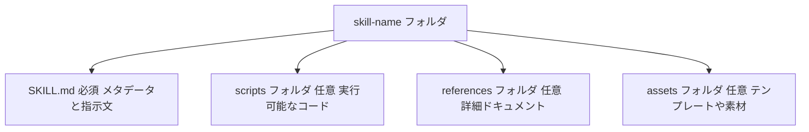
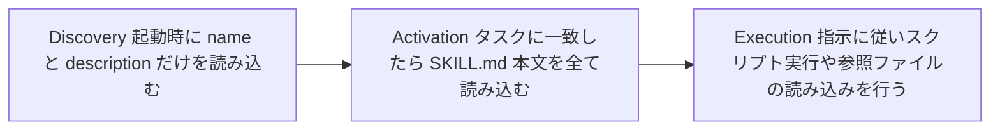
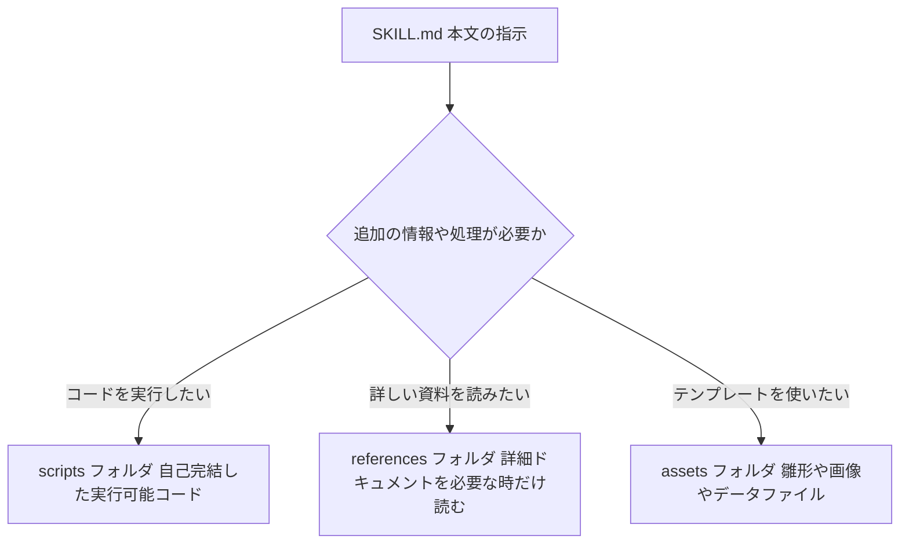
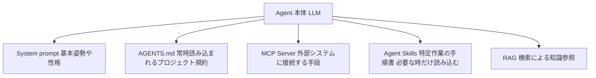
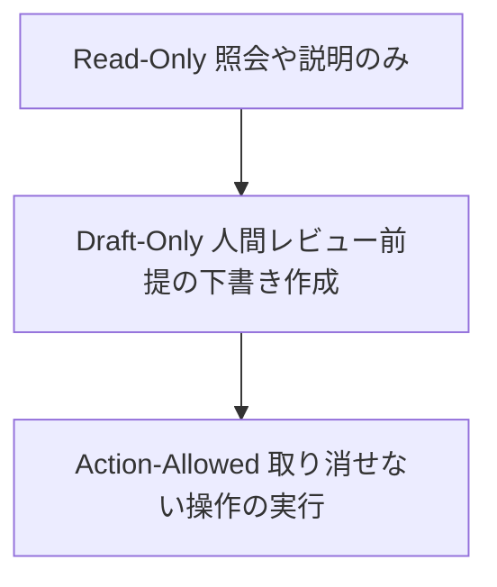

# Agent Skills 完全ガイド ― 初学者のためのステップバイステップ解説

> このガイドは [Kaggle Agent Skills Whitepaper](https://www.kaggle.com/whitepaper-agent-skills)（Google/Kaggle、2026年5月公開、著者: Tanvi Singhal, Gabriela Hernandez Larios, Debanshu Das, Lavi Nigam, Smitha Kolam）、オープン仕様サイト [agentskills.io](https://agentskills.io/home)、および Anthropic 公式ドキュメントを主な情報源として、初学者向けにステップバイステップでまとめたものです。各章末に出典URLを明記しています。

---

## 目次

1. [Agent Skillsとは何か](#1-agent-skillsとは何か)
2. [なぜAgent Skillsが必要なのか（4つの課題）](#2-なぜagent-skillsが必要なのか4つの課題)
3. [仕組み：Progressive Disclosure（段階的開示）](#3-仕組みprogressive-disclosure段階的開示)
4. [SKILL.mdファイルの構造](#4-skillmdファイルの構造)
5. [フォルダ構成：scripts references assets](#5-フォルダ構成scripts-references-assets)
6. [ステップバイステップ：最初のSkillを作る](#6-ステップバイステップ最初のskillを作る)
7. [どこで使えるか（対応プラットフォーム）](#7-どこで使えるか対応プラットフォーム)
8. [良いdescriptionの書き方](#8-良いdescriptionの書き方)
9. [Skills vs MCP vs AGENTS.md](#9-skills-vs-mcp-vs-agentsmd)
10. [セキュリティに関する注意点](#10-セキュリティに関する注意点)
11. [評価とベストプラクティス](#11-評価とベストプラクティス)
12. [実践ハンズオン：commitメッセージ生成Skillを作る](#12-実践ハンズオンcommitメッセージ生成skillを作る)
13. [トラブルシューティング](#13-トラブルシューティング)
14. [まとめ：5つの黄金律と次のステップ](#14-まとめ5つの黄金律と次のステップ)
15. [参考文献一覧](#15-参考文献一覧)

---

## 1. Agent Skillsとは何か

💡 この章では、Agent Skillsという仕組みが何なのかを一言で説明します。この章を理解しておくと、後の章の説明がすべて頭に入りやすくなります。

Agent Skills（エージェントスキル）とは、AIエージェント（＝自律的にタスクをこなすAIプログラム）に新しい能力や専門知識を与えるための、軽量でオープンな共通フォーマット（＝どのAIツールでも読み込める標準規格）です。

一言でまとめると、**Skillとは「SKILL.mdというファイルを1つ持つフォルダ」**のことです。このファイルには、最低限「名前（name）」と「説明（description）」というメタデータ（＝データについてのデータ、ここでは「このSkillが何をするか」を表す情報）と、AIエージェントへの指示文（＝手順書の本文）が書かれています。加えて、スクリプト（実行可能なコード）や参考資料、テンプレートなどのファイルを一緒に束ねる（バンドルする）こともできます。

以下の図は、Skillフォルダの基本構成を表しています。上から下へ読み進めてください。



各ノードの意味：
- 「skill-name フォルダ」：Skill全体を表すディレクトリ。フォルダ名がSkillの識別名（name）と一致している必要があります。
- 「SKILL.md」：唯一の必須ファイル。YAMLフロントマター（＝ファイル冒頭の`---`で囲まれたメタデータ領域）とMarkdown本文で構成されます。
- 「scripts / references / assets」：いずれも任意（オプション）。エージェントは必要になったときだけこれらを読み込みます。

Agent Skillsという発想は、もともとAnthropicが Claude Code（Anthropicのコーディング支援エージェント）向けに開発したものでした。その後2025年12月18日に、Anthropicはこの仕様を **オープンスタンダード（誰でも自由に採用できる公開規格）** として公開し、agentskills.io で仕様書と参考実装を公開しました。現在ではClaude以外にも、OpenAI Codex、Gemini CLI、GitHub Copilot、Cursorなど、26以上のプラットフォームがこの標準を採用しています。

📖 このセクションで登場した用語
- AIエージェント：人間の指示を受けて、自律的に計画を立てタスクを実行するAIプログラムのこと
- メタデータ：データそのものではなく「データの性質」を説明する付随情報のこと（例：ファイルの作成日時、著者名など）
- オープンスタンダード：特定の企業に縛られず、誰でも自由に実装・利用できる公開された技術規格のこと

**出典**
- [Agent Skills Overview - agentskills.io](https://agentskills.io/home)
- [Kaggle Agent Skills Whitepaper](https://www.kaggle.com/whitepaper-agent-skills)
- [GitHub - agentskills/agentskills](https://github.com/agentskills/agentskills)
- [SKILL.md: The Open Standard for AI Agent Skills - agensi.io](https://www.agensi.io/learn/agent-skills-open-standard)

---

## 2. なぜAgent Skillsが必要なのか（4つの課題）

💡 この章では、Agent Skillsが解決しようとしている4つの技術的な課題を説明します。ここを理解すると、単なる「便利機能」ではなく「必然的に生まれた設計」であることが分かります。

Kaggle Agent Skills Whitepaperでは、Agent Skillsが広く使われるようになった背景として、次の4つの課題（フリクション・ポイント）を挙げています。

| 課題 | 内容 | Skillsによる解決策 |
|---|---|---|
| ① コンテキストの劣化（Context rot） | すべての指示を1つの巨大なシステムプロンプトに詰め込むと、入力が長くなるほどLLM（大規模言語モデル）の応答精度が下がっていく現象 | 指示は「必要になったときだけ」読み込む |
| ② 手続き記憶（Procedural memory）の欠如 | LLMは事実（何が起きたか、何を知っているか）は扱えても「どうやってやるか」という手順知識が弱い | Skillsは「経験者から渡される作業マニュアル」として手続き記憶を補う |
| ③ マルチエージェントの複雑化 | タスクごとに専用のサブエージェントを大量に用意すると、運用・保守コストが膨らむ | 1つの汎用エージェント＋必要に応じて呼び出すSkillライブラリに置き換える |
| ④ 移植性の低さ | ツールごとに独自のカスタマイズ方式（例：`.cursorrules`など）があり、乗り換えると資産が引き継げない | ファイルシステムさえあればどこでも動く共通フォーマット |

①のコンテキストの劣化については、入力が長くなるとモデルの精度が落ちるという現象が、"Lost in the Middle"（Liu et al., 2024）や"Context Rot"（Chroma, 2025）といった研究で報告されています。Skillsは指示を必要な時だけ読み込むことで、この問題を回避します。

②の手続き記憶について、LLMが扱う「記憶」は次の3種類に分類して考えると理解しやすくなります。

| 記憶の種類 | 人間にたとえると |
|---|---|
| エピソード記憶（Episodic） | 「今日の会話で何が起きたか」を覚えていること |
| 意味記憶（Semantic） | モデルの重みやRAG（検索拡張生成）に蓄積された事実知識 |
| 手続き記憶（Procedural） | 「どうやってこのタスクを実行するか」という手順の知識 |

Agent Skillsは、この3つ目の「手続き記憶」をエージェントに与えるための最初の実用的な仕組みだと位置づけられています。新人社員に渡す業務マニュアルのように、「何を知っているか」ではなく「どうやるか」を教えてくれる点が特徴です。

📖 このセクションで登場した用語
- LLM：Large Language Modelの略。大量のテキストで学習された、文章を生成するAIモデルのこと
- RAG：Retrieval-Augmented Generationの略。外部の文書を検索して、その内容をもとに回答を生成する仕組みのこと
- サブエージェント：特定の役割に特化させた、AIエージェントの分身のようなもの

**出典**
- [Kaggle Agent Skills Whitepaper: Complete Guide 2026 - explainx.ai](https://explainx.ai/blog/kaggle-agent-skills-whitepaper-guide-2026)（Kaggle Agent Skills Whitepaperの内容を要約・解説した二次情報源）
- [Equipping agents for the real world with Agent Skills - Anthropic Engineering](https://www.anthropic.com/engineering/equipping-agents-for-the-real-world-with-agent-skills)

---

## 3. 仕組み：Progressive Disclosure（段階的開示）

💡 この章では、Agent SkillsがなぜコンテキストウィンドウとやらAI応答速度を圧迫しないのかという、中核の仕組みを説明します。

Agent Skillsの心臓部にあたる設計思想が **Progressive Disclosure（段階的開示）** です。これは、エージェントが情報を「必要になったタイミングで、必要な分だけ」読み込んでいく仕組みのことです。

この図は、Skillが読み込まれていく3つの段階の流れを表しています。左から右へ読み進めてください。



各ノードの意味：
- 「Discovery（発見）」：エージェントがセッションを開始した時点で、利用可能な全Skillの`name`と`description`だけをシステムプロンプトに読み込みます。本文はまだ読み込みません。
- 「Activation（起動）」：ユーザーの依頼内容がいずれかのSkillの`description`と一致すると判断されたとき、そのSkillの`SKILL.md`本文全体をコンテキストウィンドウ（＝AIが一度に処理できる情報の範囲）に読み込みます。
- 「Execution（実行）」：エージェントは読み込んだ指示に従って、必要ならバンドルされたスクリプトを実行したり、参照ファイルを追加で読み込んだりします。

この3段階には、それぞれ読み込まれるタイミングとトークンコスト（＝AIが処理する文章量のコスト）の目安があります。

| レベル | 読み込まれるタイミング | トークンコストの目安 | 内容 |
|---|---|---|---|
| レベル1：メタデータ | 常時（起動時） | 1Skillあたり約100トークン | YAMLフロントマターの`name`と`description` |
| レベル2：指示 | Skillが起動された時 | 5000トークン未満が推奨 | SKILL.md本文の指示とガイダンス |
| レベル3以上：リソース | 必要な時だけ | 実質無制限 | `scripts/` `references/` `assets/`内のファイル |

この仕組みのおかげで、50個のSkillをすべて1つの巨大なプロンプトとして詰め込んだ場合には約15,000トークンかかるところを、段階的開示を使うと「常時読み込むメタデータ約4,000トークン＋実際に起動した1つの本文約2,000トークン」程度、合計6,000トークン前後に抑えられるという試算が紹介されています（残り49個の本文はディスク上に置かれたまま消費されません）。

📖 このセクションで登場した用語
- コンテキストウィンドウ：AIモデルが一度の応答生成で参照できる情報量の上限のこと。人間で言えば「今、頭の中で同時に意識できる情報量」に近いイメージです
- トークン：AIがテキストを処理する際の最小単位のこと。日本語ではおおよそ1〜2文字が1トークンに相当することが多いとされています

**出典**
- [Specification - agentskills.io](https://agentskills.io/specification.md)
- [Agent Skills - Claude Platform Docs](https://platform.claude.com/docs/en/agents-and-tools/agent-skills/overview)
- [Kaggle Agent Skills Whitepaper: Complete Guide 2026 - explainx.ai](https://explainx.ai/blog/kaggle-agent-skills-whitepaper-guide-2026)

---

## 4. SKILL.mdファイルの構造

💡 この章では、Skillの心臓部である`SKILL.md`ファイルの中身を、フィールドごとに詳しく見ていきます。

`SKILL.md`ファイルは、必ず「YAMLフロントマター」と「Markdown本文」の2つのパートで構成されます。

```markdown
---
name: skill-name
description: このSkillが何をするか、いつ使うべきかを説明する文章
---

ここから下がMarkdown本文（エージェントへの指示）
```

### 4-1. フロントマターのフィールド一覧

`agentskills.io`のオープン仕様では、以下のフィールドが定義されています。

| フィールド | 必須 | 制約 |
|---|---|---|
| `name` | 必須 | 最大64文字。半角小文字英数字とハイフンのみ使用可能。先頭・末尾にハイフン不可、連続ハイフン不可 |
| `description` | 必須 | 最大1024文字。空文字は不可。何をするか、いつ使うべきかの両方を説明する |
| `license` | 任意 | ライセンス名、またはバンドルされたライセンスファイルへの参照 |
| `compatibility` | 任意 | 最大500文字。動作環境の要件（対象製品、必要パッケージ、ネットワークアクセスなど）を示す |
| `metadata` | 任意 | 任意のキーと値のペアからなるマップ |
| `allowed-tools` | 任意（実験的機能） | 事前承認するツールをスペース区切りで指定する |

なお、Claude Code / Claude API / claude.aiなど Anthropic 製品では、`name`に「anthropic」「claude」といった予約語を含められない、XMLタグを含められないといった追加の制約があります。

### 4-2. `name`フィールドの具体例

| 良い例 | 理由 |
|---|---|
| `pdf-processing` | 小文字・ハイフンのみで、内容が一目で分かる |
| `data-analysis` | シンプルで衝突しにくい |

| 悪い例 | 理由 |
|---|---|
| `PDF-Processing` | 大文字は使用不可 |
| `-pdf` | 先頭にハイフンは使用不可 |
| `pdf--processing` | 連続ハイフンは使用不可 |

### 4-3. `description`フィールドの具体例

`description`はSkillが選ばれるかどうかを左右する、最も重要なフィールドです。詳しい書き方は[第8章](#8-良いdescriptionの書き方)で扱いますが、ここでは基本の良い例・悪い例を紹介します。

| 種類 | 例 |
|---|---|
| 良い例 | PDFファイルからテキストと表を抽出し、フォームへの入力やファイル結合を行います。PDF文書を扱うとき、またはユーザーがPDF・フォーム・文書抽出について言及したときに使用してください。 |
| 悪い例 | PDFを手伝います。 |

良い例は「何をするか」と「いつ使うか」の両方が明記されているのに対し、悪い例はどちらも曖昧で、エージェントがこのSkillを選ぶべきタイミングを判断できません。

### 4-4. 本文（Body）について

フロントマターより下のMarkdown本文には、厳密な書式の決まりはありません。ただし、推奨されるセクション構成があります。

- ステップバイステップの手順
- 入力と出力の具体例
- よくあるエッジケース（例外的な状況）への対処

なお、本文が長くなりすぎる場合は、`references/`フォルダに詳細を切り出し、`SKILL.md`本体は概要とナビゲーションだけに留めることが推奨されています。目安として、`SKILL.md`は500行未満に収めるとよいとされています。

📖 このセクションで登場した用語
- YAMLフロントマター：ファイルの先頭に`---`で囲んで書く、構造化されたメタデータ領域のこと。YAML（YAML Ain't Markup Language）という、人間にも読みやすいデータ形式で書かれます
- エッジケース：通常想定される範囲から外れた、特殊で例外的な入力や状況のこと

**出典**
- [Specification - agentskills.io](https://agentskills.io/specification.md)
- [Agent Skills - Claude Platform Docs](https://platform.claude.com/docs/en/agents-and-tools/agent-skills/overview)
- [How Do You Build Your First Agent Skill? - Agentman Blog](https://agentman.ai/blog/build-your-first-agent-skill-skillmd-anatomy)

---

## 5. フォルダ構成：scripts references assets

💡 この章では、SKILL.md以外にバンドルできる3種類のフォルダについて説明します。

Skillフォルダには、`SKILL.md`に加えて次の3つの任意ディレクトリを含めることができます。それぞれ役割が異なり、エージェントが参照するタイミングも異なります。

この図は、それぞれのフォルダがいつ・どのように使われるかを表しています。上から下へ読み進めてください。



各ノードの意味：
- 「SKILL.md 本文の指示」：エージェントがまず読む中心的な指示文です。
- 「追加の情報や処理が必要か」：指示を読んだエージェントが、次に何をすべきか判断する分岐点です。
- 「scripts」：Python・Bash・JavaScriptなどで書かれた、自己完結した実行可能コードを置く場所です。エージェントはコードの中身をコンテキストに読み込まず、実行結果だけを受け取ります。そのため非常にトークン効率が良いという特徴があります。
- 「references」：`REFERENCE.md`や`FORMS.md`など、詳細な技術資料やドメイン固有の文書を置く場所です。個々のファイルを小さく焦点を絞って作ることで、必要な時にだけ読み込まれ、コンテキストの消費を抑えられます。
- 「assets」：ドキュメントテンプレート、画像、ルックアップテーブルなどの静的リソースを置く場所です。

ファイルを相互参照する際は、SKILL.mdからの相対パスを使います。

```markdown
詳細は [reference.md](references/REFERENCE.md) を参照してください。

抽出スクリプトを実行します：
scripts/extract.py
```

参照の深さは、SKILL.mdから1階層以内に留めることが推奨されています。深くネストした参照チェーンは避けましょう。

📖 このセクションで登場した用語
- 自己完結したコード：外部への依存を最小限にし、それ単体で動作するように書かれたコードのこと
- 相対パス：現在のファイルの位置を基準にした、他のファイルへの道順の書き方のこと

**出典**
- [Specification - agentskills.io](https://agentskills.io/specification.md)
- [Extend Claude with skills - Claude Code Docs](https://code.claude.com/docs/en/skills)

---

## 6. ステップバイステップ：最初のSkillを作る

💡 この章では、実際に手を動かしながら最初のSkillを作成する手順を、agentskills.io公式チュートリアルに沿って説明します。

ここでは、サイコロを振る機能をエージェントに与える`roll-dice`という最小構成のSkillを作ります。VS Code + GitHub Copilotを例にしていますが、Agent Skillsはオープン仕様なので、同じファイルはClaude CodeやOpenAI Codexでもそのまま動作します。

### ステップ1：フォルダを作成する

VS Codeの場合、デフォルトでは`.agents/skills/`フォルダの中からSkillを探します。プロジェクト直下に次のフォルダを作成します。

```bash
mkdir -p .agents/skills/roll-dice
```

### ステップ2：SKILL.mdを書く

`.agents/skills/roll-dice/SKILL.md`を次の内容で作成します。

```markdown
---
name: roll-dice
description: 乱数生成器を使ってサイコロを振ります。d6やd20などのダイスを振る、サイコロを転がす、ランダムなダイス結果を生成すると頼まれたときに使用してください。
---

ダイスを振るには、1から指定された面数までのランダムな数を生成する、以下のコマンドを使用します。

\`\`\`bash
echo $((RANDOM % <sides> + 1))
\`\`\`

\`<sides>\`をサイコロの面数（例：標準的なサイコロなら6、d20なら20）に置き換えてください。
```

なぜこのように書くのかというと、`description`にユーザーが実際に使いそうな言葉（「d6」「d20」「サイコロを振る」など）を具体的に含めることで、エージェントが的確なタイミングでこのSkillを選べるようになるためです。本文には、実際に実行すべきコマンドを明記しています。

### ステップ3：動作確認する

1. VS Codeでプロジェクトを開く
2. Copilot Chatパネルを開く
3. チャット下部のモードドロップダウンから「Agentモード」を選択する
4. `/skills`と入力し、`roll-dice`が一覧に表示されることを確認する
5. 「d20を振って」のように依頼する

正しく動作すると、エージェントは`roll-dice`Skillを起動し、ターミナルコマンドの実行許可を求めたうえで、1〜20のランダムな数値を返します。

### この体験を、第3章の3段階に当てはめると

- Discovery：セッション開始時に、エージェントは`roll-dice`という名前と説明文だけを読み込んでいました
- Activation：「d20を振って」という依頼が`description`と一致したため、SKILL.md本文全体をコンテキストに読み込みました
- Execution：本文の指示に従い、面数を20に置き換えたコマンドを実行しました

📖 このセクションで登場した用語
- 乱数生成器：予測できないランダムな数値を作り出す仕組みのこと

**出典**
- [Quickstart - agentskills.io](https://agentskills.io/skill-creation/quickstart)
- [agentskills/agentskills quickstart.mdx - GitHub](https://github.com/agentskills/agentskills/blob/main/docs/skill-creation/quickstart.mdx)

---

## 7. どこで使えるか（対応プラットフォーム）

💡 この章では、Agent Skillsが実際にどのAIツールで使えるのかを一覧で確認します。

Agent Skillsはオープン仕様のため、非常に多くのAIエージェント製品が対応しています。代表的なものを紹介します（2026年時点、詳細な最新一覧は[Client Showcase](https://agentskills.io/clients)を参照してください）。

| プラットフォーム | 概要 | ドキュメントURL |
|---|---|---|
| Claude Code | Anthropicのターミナル/IDE向けコーディングエージェント。カスタムSkillのみ対応 | [code.claude.com/docs/en/skills](https://code.claude.com/docs/en/skills) |
| claude.ai | Anthropicのチャット製品。事前構築済みSkillとカスタムSkillの両方に対応 | [support.claude.com Skillsとは？](https://support.claude.com/en/articles/12512176-what-are-skills) |
| Claude API / Claude Platform | プログラムからSkillを利用するためのAPI | [platform.claude.com/docs Skills overview](https://platform.claude.com/docs/en/agents-and-tools/agent-skills/overview) |
| VS Code + GitHub Copilot | エディタ上でSkillを利用 | [code.visualstudio.com docs](https://code.visualstudio.com/docs/copilot/customization/agent-skills) |
| Cursor | AIエディタ/コーディングエージェント | [cursor.com/docs](https://cursor.com/docs/context/skills) |
| OpenAI Codex | OpenAIのコーディングエージェント | [developers.openai.com/codex/skills](https://developers.openai.com/codex/skills/) |
| Gemini CLI | Googleのオープンソースターミナルエージェント | [geminicli.com/docs](https://geminicli.com/docs/cli/skills/) |
| GitHub Copilot（エージェント機能） | GitHub製のコーディング支援AI | [docs.github.com](https://docs.github.com/en/copilot/concepts/agents/about-agent-skills) |
| Goose | オープンソースの拡張可能なAIエージェント | [block.github.io/goose docs](https://block.github.io/goose/docs/guides/context-engineering/using-skills/) |
| OpenHands | クラウドコーディングエージェントのオープンプラットフォーム | [docs.openhands.dev](https://docs.openhands.dev/overview/skills) |

異なるツール間でも基本の`SKILL.md`フォーマット（フロントマターとMarkdown本文の標準部分）はそのまま動作しますが、各ツールが独自拡張を追加している場合があります。例えばClaude Codeはコンテキストの分岐実行（`context: fork`）、Codexは`openai.yaml`メタデータといった機能を追加しています。共通言語ではあっても、細かな挙動はツールごとに異なると考えておくとよいでしょう。

📖 このセクションで登場した用語
- 独自拡張：オープン仕様の共通部分に加えて、各社・各プロダクトが独自に追加した機能のこと

**出典**
- [Agent Skills Overview / Client Showcase - agentskills.io](https://agentskills.io/home)
- [SKILL.md: The Open Standard for AI Agent Skills - agensi.io](https://www.agensi.io/learn/agent-skills-open-standard)

---

## 8. 良いdescriptionの書き方

💡 この章では、Skillが正しいタイミングで発火するかどうかを左右する、`description`フィールドの書き方のコツを説明します。

第3章で説明した通り、エージェントは起動時に全Skillの`name`と`description`だけを読み込み、それをもとに「今回のタスクにどのSkillを使うか」を判断します。つまり、**本文がどれだけ優れていても、descriptionが的確でなければそのSkillは一生呼び出されません。**

### 8-1. 三人称で書く

`description`はシステムプロンプトに直接挿入されるため、一人称（「私は〜します」）ではなく三人称（「〜を処理します」）で統一して書く必要があります。視点が一貫していないと、エージェントの発見ロジックに悪影響が出ることがあります。

| 評価 | 例 |
|---|---|
| 良い | Excelファイルを処理し、レポートを生成します。 |
| 避けるべき | 私がExcelファイルを処理してレポートを作ります。 |

### 8-2. 具体的なトリガーワードを含める

`description`には「何をするか」だけでなく「いつ使うべきか」を明記し、ユーザーが実際に使いそうなキーワードを含めます。

| 評価 | 例 |
|---|---|
| 良い | Angular 20以降のプロジェクトで、シグナルベースのinput/outputとOnPushな変更検知、inject関数を使ったスタンドアロンコンポーネントを生成します。コンポーネント・ページ・機能を新規作成するときに使用してください。 |
| 避けるべき | Angular関連を手伝います。 |

### 8-3. トリガー・トライアド（3要素）で考える

`description`を書くときは、次の3つの要素を意識すると精度が上がるとされています。

| 要素 | 内容 |
|---|---|
| 能力 | 動詞＋目的語。このSkillが何を生み出すか（例：「SEO最適化されたブログ記事を生成する」） |
| トリガー | ユーザーがどんな言葉を使ったときに反応すべきか |
| 除外条件 | このSkillを使うべきでない場面（「〜のためには使用しないでください」） |

除外条件を明記しておくと、似たタスクを持つ他のSkillとの混同を防げます。

### 8-4. XMLタグや山括弧を避ける

フロントマターには`<`や`>`のような山括弧を含めないようにします。これらの文字がシステムプロンプトに意図しない指示として紛れ込む（プロンプトインジェクションの原因になる）リスクがあるためです。

📖 このセクションで登場した用語
- システムプロンプト：会話の最初にAIへ与えられる、基本的な役割や振る舞いを定義する指示文のこと
- プロンプトインジェクション：外部から与えられたテキストに紛れ込ませた命令によって、AIの本来の指示を意図せず上書きしてしまう攻撃手法のこと

**出典**
- [Skill authoring best practices - Claude Platform Docs](https://platform.claude.com/docs/en/agents-and-tools/agent-skills/best-practices)
- [Specification - agentskills.io](https://agentskills.io/specification.md)
- [How Do You Build Your First Agent Skill? - Agentman Blog](https://agentman.ai/blog/build-your-first-agent-skill-skillmd-anatomy)
- [Agent Skills in Claude – A Practical Guide for Angular Developers](https://angular.love/agent-skills-in-claude-a-practical-guide-for-angular-developers)

---

## 9. Skills vs MCP vs AGENTS.md

💡 この章では、混同されやすい3つの概念「Agent Skills」「MCP」「AGENTS.md」の役割の違いを整理します。

これら3つは競合する技術ではなく、それぞれ異なる役割を持ち、組み合わせて使うものです。次の図は、エージェント本体を中心に、それぞれの要素がどう位置づけられるかを表しています。



各ノードの意味：
- 「System prompt」：エージェントの土台となる基本的な振る舞いの指示です。
- 「AGENTS.md」：プロジェクトルートに置かれ、常に読み込まれる規約ファイルです。技術スタックや命名規則など、プロジェクト全体に関わる情報を書きます。
- 「MCP Server」：Model Context Protocol（MCP）を通じて外部のツールやデータに接続する手段です。エージェントにとっての「手」や「道具」に相当します。
- 「Agent Skills」：特定のタスクをどう進めるかという手順や勘所をまとめた、必要な時にだけ読み込まれる手順書です。
- 「RAG」：大量の外部知識を検索して参照する仕組みです。

3者の違いを整理すると、次の表のようになります。

| 比較項目 | MCP | Agent Skills | AGENTS.md |
|---|---|---|---|
| 主な役割 | 外部システムやデータへの接続を提供する | ツールをどう使うか、作業手順を教える | プロジェクト全体に常時適用される規約を提供する |
| 読み込まれるタイミング | 接続時・呼び出し時 | 関連するタスクが来たときだけ | 常時 |
| たとえるなら | 手や道具 | 経験者から渡される作業マニュアル | 新人向けの社内README |

つまり、MCPが「何ができるか（手段）」を提供するのに対し、Agent Skillsは「その手段をどう使うべきか（やり方）」を教える役割を担っています。両者は競合せず、組み合わせて使うことで真価を発揮します。

📖 このセクションで登場した用語
- MCP：Model Context Protocolの略。AIエージェントが外部のツールやデータソースに接続するための標準プロトコルのこと
- AGENTS.md：プロジェクトルートに置く、AIエージェント向けの常時読み込み型の規約ファイルのこと

**出典**
- [Kaggle Agent Skills Whitepaper: Complete Guide 2026 - explainx.ai](https://explainx.ai/blog/kaggle-agent-skills-whitepaper-guide-2026)（whitepaper付録Aの概念をもとに構成）
- [Agent Skills Overview - agentskills.io](https://agentskills.io/home)

---

## 10. セキュリティに関する注意点

💡 この章では、Skillを使う・作る際に必ず知っておくべきセキュリティ上の注意点を説明します。

Skillは、エージェントに指示文とコードを通じて新しい能力を与えるため、非常に強力である一方、**悪意あるSkillはエージェントに、本来の目的とは異なる形でツールを呼び出させたりコードを実行させたりできてしまう**という危険性を持っています。Anthropic公式ドキュメントでは、これを「ソフトウェアをインストールするのと同じ感覚で扱うべき」と位置づけています。

信頼できる情報源として推奨されているのは、次のいずれかです。

- 自分自身で作成したSkill
- Anthropicなど、信頼できる提供元から入手したSkill

信頼できない、あるいは出所不明のSkillをどうしても使う必要がある場合は、次の点を必ず確認してください。

| 確認項目 | 内容 |
|---|---|
| 徹底した監査 | SKILL.md本体・スクリプト・画像・その他すべてのバンドルファイルを確認する。想定外のネットワーク通信やファイルアクセスがないか調べる |
| 外部ソースへの注意 | 外部URLからデータを取得するSkillは特にリスクが高い。取得したコンテンツに悪意ある指示が紛れ込んでいる可能性がある |
| ツールの誤用 | 悪意あるSkillは、ファイル操作やbashコマンド、コード実行などのツールを有害な形で呼び出す可能性がある |
| データの露出 | 機微なデータにアクセスできるSkillが、外部にその情報を漏らすように設計されている可能性がある |

特に、本番環境や機微なデータ・重要な操作へのアクセス権を持つシステムにSkillを組み込む場合は、細心の注意を払う必要があります。

📖 このセクションで登場した用語
- 監査：システムやコードの内容を第三者の視点で細かく点検し、問題がないか確認する作業のこと
- 本番環境：実際のユーザーが利用する、稼働中のシステム環境のこと

**出典**
- [Agent Skills - Claude Platform Docs（セキュリティに関する考慮事項）](https://platform.claude.com/docs/en/agents-and-tools/agent-skills/overview)

---

## 11. 評価とベストプラクティス

💡 この章では、「Skillは作って終わりではない」という考え方と、その評価方法について説明します。

Kaggle Agent Skills Whitepaperで紹介されているSkillsBenchという評価データセットでは、Skillを使うことでかえって成果が悪化したタスクが全体の19%も存在したと報告されています。つまり、**説明文が曖昧だったり、本文が肥大化していたり、単体テストしかしていないSkillは、無いよりも有害になり得る**ということです。

### 11-1. 4つの失敗モード

| モード | 症状 |
|---|---|
| トリガーの誤り | 呼び出されるべきでないSkillが発火する、または発火すべきSkillが発火しない |
| 実行の誤り | Skillは発火するが、出力の内容やツール呼び出しが誤っている |
| トークン予算超過 | 本文が長すぎて、他のSkillと同時に読み込まれたときにコンテキストが圧迫される |
| リグレッション | 新しいSkillの追加が、既存Skillの発火判定を壊してしまう |

### 11-2. 評価は単体ではなく「同時読み込み」で行う

本番環境では、多くの場合5〜15個のSkillが同時に読み込まれた状態でエージェントが動作します。単体では合格したSkillでも、他のSkillと同時に読み込まれると失敗することがあるため、**Skillを孤立させた状態でのみ評価してはいけない**という点が強調されています。

### 11-3. Read／Draft／Actの3段階ゲート

不可逆な操作（元に戻せない操作）を許可する前に、段階を踏んで信頼性を積み上げていく考え方です。次の図は、その進め方を表しています。



各ノードの意味：
- 「Read-Only」：情報を照会したり説明したりするだけの、安全な段階です。
- 「Draft-Only」：下書きを作成しますが、必ず人間がレビューしてから採用するという前提の段階です。
- 「Action-Allowed」：取り消せない操作（送金、削除、デプロイなど）を実行できる、最も慎重さが求められる段階です。

| 段階 | 進める条件の目安 |
|---|---|
| Read-Only | 発火精度（トリガー精度）がおおむね90%程度に達していること |
| Draft-Only | 20件以上のテストケース（ゴールデンデータセット）で確認済みであること |
| Action-Allowed | 敵対的テスト（意図的に誤動作を誘発する入力での検証）と、複数回連続で成功することの確認、さらに人間による最終承認が済んでいること |

### 11-4. Claude Codeでの実践的な評価方法

Claude Codeには`skill-creator`という公式プラグインがあり、次の手順でSkillの評価サイクルを自動化できます。

```text
/plugin install skill-creator@claude-plugins-official
```

インストール後、`/reload-plugins`でプラグインを反映させ、「summarize-changesスキルをskill-creatorで評価して」のように依頼すると、テストケースの作成、Skillあり／なしの比較（ベンチマーク）、旧バージョンとの比較（A/Bテスト）、descriptionのチューニング提案などを自動的に行ってくれます。

📖 このセクションで登場した用語
- ゴールデンデータセット：正解が分かっている、検証用の入力と期待される出力のペアを集めたデータのこと
- 敵対的テスト：システムを意図的に誤動作させようとする、厳しい条件での検証テストのこと

**出典**
- [Kaggle Agent Skills Whitepaper: Complete Guide 2026 - explainx.ai](https://explainx.ai/blog/kaggle-agent-skills-whitepaper-guide-2026)
- [Extend Claude with skills（評価と反復のセクション）- Claude Code Docs](https://code.claude.com/docs/en/skills)
- [Evaluating skill output quality - agentskills.io](https://agentskills.io/skill-creation/evaluating-skills)

---

## 12. 実践ハンズオン：commitメッセージ生成Skillを作る

💡 この章では、これまで学んだ知識を総動員して、実務で使える完成度のSkillを最初から最後まで作ります。

作るのは、Gitのuncommitted changes（コミットされていない変更）を要約し、リスクを指摘してくれる`summarize-changes`というSkillです。Claude Codeを例にしますが、考え方はどのツールでも同じです。

### ステップ1：なぜこのSkillが役立つのかを整理する

「変更内容を要約して」という依頼のたびに、毎回同じ手順（`git diff`を見る、要約する、リスクを指摘する）を口頭で説明するのは非効率です。この繰り返しをSkillとして固定化することで、以後は自動的に一貫した手順で処理されるようになります。

### ステップ2：フォルダを作成する

個人用（すべてのプロジェクトで使える）Skillとして作成します。

```bash
mkdir -p ~/.claude/skills/summarize-changes
```

### ステップ3：SKILL.mdを書く

`~/.claude/skills/summarize-changes/SKILL.md`を次のように作成します。

```markdown
---
description: コミットされていない変更を要約し、リスクを指摘します。ユーザーが何を変更したか尋ねたとき、コミットメッセージを求めたとき、差分をレビューしたいときに使用してください。
---

## 現在の変更内容

!\`git diff HEAD\`

## 指示

上記の変更内容を2〜3個の箇条書きで要約してください。そのあと、エラーハンドリングの欠如、ハードコードされた値、更新が必要なテストなど、気づいたリスクを一覧にしてください。差分が空の場合は、コミットされていない変更はないと伝えてください。
```

なぜ`!`\`git diff HEAD\`\`という書き方をするのかというと、これは「動的コンテキスト注入」と呼ばれる仕組みで、Claude Codeがこのシェルコマンドを事前に実行し、その出力結果をプレースホルダーの位置にそのまま埋め込んでからエージェントに渡すためです。つまりエージェントは、推測ではなく実際の差分データをもとに要約を作ることができます。

### ステップ4：動作確認する

1. Gitで管理されているプロジェクトを開き、適当なファイルを少し編集する
2. `claude`コマンドでClaude Codeを起動する
3. 「何を変更した？」と尋ねる、または直接`/summarize-changes`と入力する

正しく動作すると、編集内容の短い要約と、気づいたリスクの一覧が返ってきます。

### ステップ5：本文だけでなく発火精度も確認する

Skillが「発火したかどうか」を確認するだけでは不十分です。次の2点を分けて確認する必要があります。

- 発火すべきプロンプトで、実際にClaudeがこのSkillを見つけて起動したか
- 起動したときの出力内容が、期待したものと一致しているか

確認するには、Skillを有効にした状態と無効にした状態それぞれで、いくつかの現実的なプロンプトを新しいセッションで試し、結果を比較します。新しいセッションで試すのが重要な理由は、Skillを作成している最中の会話の文脈が残っていると、指示文自体の不備が隠れてしまうためです。

### ステップ6：発展的な使い方

このSkillをさらに強化するなら、次のような改善が考えられます。

- `disable-model-invocation: true`を追加し、`/summarize-changes`と明示的に入力したときだけ動くようにする（誤って自動発火してほしくない場合）
- `context: fork`を追加し、独立したサブエージェント上で実行させる
- `allowed-tools: Bash(git *)`を追加し、gitコマンドの実行を毎回許可し直さずに済むようにする

📖 このセクションで登場した用語
- 動的コンテキスト注入：Skillの本文をエージェントに渡す前に、あらかじめシェルコマンドなどを実行し、その結果を本文に埋め込む仕組みのこと
- サブエージェント：本体の会話とは別の、独立したコンテキストで動作するエージェントのインスタンスのこと

**出典**
- [Extend Claude with skills（Getting startedセクション）- Claude Code Docs](https://code.claude.com/docs/en/skills)

---

## 13. トラブルシューティング

💡 この章では、Skillを作ったのに思ったように動かないときの、よくある症状と対処法をまとめます。

| 症状 | 主な原因 | 対処法 |
|---|---|---|
| Skillが発火しない | `description`にユーザーが実際に使いそうなキーワードが含まれていない | `description`をより具体的にし、依頼文と一致しやすいトリガーワードを追加する |
| Skillが利用可能かどうか分からない | 一覧に表示されているか未確認 | 「利用可能なSkillは？」のように尋ねて確認する、あるいは直接`/skill-name`で起動できるか試す |
| Skillが発火しすぎる | `description`が広すぎる、または曖昧すぎる | `description`をより具体的にする。手動起動だけにしたい場合は`disable-model-invocation: true`を設定する |
| YAMLの記述が壊れていてメタデータが空になる | フロントマターの書式エラー（インデントミスなど） | デバッグオプションを付けて起動し、パースエラーの内容を確認する |
| Skillの内容が途中から効かなくなる | 会話が長くなり、要約（compaction）によって内容が省略された | 該当するSkillを再度呼び出し、内容をコンテキストに復元する |
| descriptionが途中で切られてしまう | 登録しているSkillの数が多く、文字数の予算を超過している | 重要度の低いSkillは名前のみの表示に切り替える、または文字数予算の設定を引き上げる |

📖 このセクションで登場した用語
- パースエラー：プログラムがテキストの構造を解析する際に、書式の誤りによって発生するエラーのこと
- compaction（要約による圧縮）：会話が長くなった際に、古いやり取りを要約して短くまとめる処理のこと

**出典**
- [Extend Claude with skills（Troubleshootingセクション）- Claude Code Docs](https://code.claude.com/docs/en/skills)

---

## 14. まとめ：5つの黄金律と次のステップ

💡 この章では、ここまでの内容を凝縮した5つの実践ルールと、次に読むべきドキュメントを紹介します。

Kaggle Agent Skills Whitepaperのチートシートでは、Skillを設計・運用するうえでの原則として、次の5つが挙げられています。

| 番号 | ルール |
|---|---|
| 1 | 1つのSkillには1つの役割だけを持たせる。「〜と〜」のように「and」が必要になったら、分割のサインだと考える |
| 2 | descriptionはSkillの入り口である。本文以上に時間をかけて磨き上げる |
| 3 | Skillは依存関係（ソフトウェアのライブラリのようなもの）として扱う。バージョン管理し、レビューし、テストする |
| 4 | Skillは、それぞれの領域に詳しいチームが所有する。AIに詳しい特定の部署だけがボトルネックにならないようにする |
| 5 | 実行環境（ランタイム）は入れ替え可能である。移植性こそがAgent Skillsの本質的な価値である |

初日から一気に50個のSkillを作ろうとするのではなく、まずは1つの繰り返し作業を選んで小さく始め、実際の使用を通じて育てていくというアプローチが推奨されています。

### 次に読むと役立つ公式ドキュメント

- Agent Skillsの仕様全体を知りたい → [Specification - agentskills.io](https://agentskills.io/specification)
- 手を動かして最初の1つを作りたい → [Quickstart - agentskills.io](https://agentskills.io/skill-creation/quickstart)
- Claude Codeでの詳しい使い方を知りたい → [Extend Claude with skills - Claude Code Docs](https://code.claude.com/docs/en/skills)
- Claude APIでの使い方を知りたい → [Skills in the API - Claude Platform Docs](https://platform.claude.com/docs/en/build-with-claude/skills-guide)
- claude.aiでの使い方を知りたい → [Using Skills in Claude - Claude Help Center](https://support.claude.com/en/articles/12512180-using-skills-in-claude)
- 執筆のベストプラクティスを深掘りしたい → [Skill authoring best practices - Claude Platform Docs](https://platform.claude.com/docs/en/agents-and-tools/agent-skills/best-practices)

📖 このセクションで登場した用語
- 依存関係：あるソフトウェアが正しく動作するために必要とする、他の部品やライブラリのこと

**出典**
- [Kaggle Agent Skills Whitepaper: Complete Guide 2026 - explainx.ai](https://explainx.ai/blog/kaggle-agent-skills-whitepaper-guide-2026)

---

## 15. 参考文献一覧

このガイド全体で参照した情報源を、種類ごとに整理しています。

### 一次情報源（Kaggle Whitepaper / オープン仕様）

- [Kaggle Agent Skills Whitepaper](https://www.kaggle.com/whitepaper-agent-skills)
- [Agent Skills Overview - agentskills.io](https://agentskills.io/home)
- [Specification - agentskills.io](https://agentskills.io/specification)
- [Quickstart - agentskills.io](https://agentskills.io/skill-creation/quickstart)
- [Evaluating skill output quality - agentskills.io](https://agentskills.io/skill-creation/evaluating-skills)
- [GitHub - agentskills/agentskills](https://github.com/agentskills/agentskills)

### Anthropic公式ドキュメント

- [Agent Skills - Claude Platform Docs](https://platform.claude.com/docs/en/agents-and-tools/agent-skills/overview)
- [Skill authoring best practices - Claude Platform Docs](https://platform.claude.com/docs/en/agents-and-tools/agent-skills/best-practices)
- [Extend Claude with skills - Claude Code Docs](https://code.claude.com/docs/en/skills)
- [Agent Skills in the SDK - Claude API Docs](https://platform.claude.com/docs/en/agent-sdk/skills)
- [What are Skills? - Claude Help Center](https://support.claude.com/en/articles/12512176-what-are-skills)
- [Using Skills in Claude - Claude Help Center](https://support.claude.com/en/articles/12512180-using-skills-in-claude)
- [Equipping agents for the real world with Agent Skills - Anthropic Engineering](https://www.anthropic.com/engineering/equipping-agents-for-the-real-world-with-agent-skills)

### 解説記事・二次情報源

- [Kaggle Agent Skills Whitepaper: Complete Guide 2026 - explainx.ai](https://explainx.ai/blog/kaggle-agent-skills-whitepaper-guide-2026)
- [SKILL.md: The Open Standard for AI Agent Skills - agensi.io](https://www.agensi.io/learn/agent-skills-open-standard)
- [How Do You Build Your First Agent Skill? - Agentman Blog](https://agentman.ai/blog/build-your-first-agent-skill-skillmd-anatomy)
- [Agent Skills: The Open Standard for AI Capabilities - inference.sh](https://inference.sh/blog/skills/agent-skills-overview)
- [The SKILL.md Pattern - Bibek Poudel (Medium)](https://bibek-poudel.medium.com/the-skill-md-pattern-how-to-write-ai-agent-skills-that-actually-work-72a3169dd7ee)
- [Deep Dive SKILL.md Part 1/2 - A B Vijay Kumar (Medium)](https://abvijaykumar.medium.com/deep-dive-skill-md-part-1-2-09fc9a536996)
- [Agent Skills in Claude – A Practical Guide for Angular Developers - Angular.love](https://angular.love/agent-skills-in-claude-a-practical-guide-for-angular-developers)
- [9 Tips for Building Claude Agent Skills - Tahir (Medium)](https://medium.com/@tahirbalarabe2/9-tips-for-building-claude-agent-skills-3bca85c47a26)
- [A Beginner's Guide to Agent Skills on AgentSkills.io - Awesome Skills Blog](https://www.awesomeskills.dev/en/blog/a-beginners-guide-to-agent-skills-on-agentskills-io)

---

*本ガイドは2026年7月時点で確認できた公開情報をもとに作成しています。Agent Skillsのエコシステムは急速に進化しているため、最新の詳細仕様や対応プラットフォーム一覧は必ず [agentskills.io](https://agentskills.io/home) と各社公式ドキュメントで確認してください。*