# AI-Assisted Programming for Web and Machine Learning ― AIと共にコードを書く技術（初学者向け完全ガイド）

> 本ガイドは、O'Reilly/Packt刊『AI-Assisted Programming for Web and Machine Learning』（Christoffer Noring, Anjali Jain, Marina Fernandez, Ayşe Mutlu, Ajit Jaokar 著、2024年8月刊）[20]を出発点としつつ、同書が扱うプロンプト戦略・Web開発・機械学習という3本柱を土台に、2026年9月時点の最新ツール（GitHub Copilot Agent Mode、Cursor、Claude Code、Model Context Protocol など）と著名な開発者の知見を反映して独自に再構成した、書籍非依存の入門教材です。AI支援プログラミングは変化が非常に速い分野のため、本文中の製品名・数値・URLは執筆時点（2026年9月）のものである点にご留意ください。

## 目次

1. [イントロダクション：なぜ今「AI支援プログラミング」を学ぶのか](#ch1)
2. [基礎知識：コーディングアシスタントの仕組みと限界](#ch2)
3. [プロンプト戦略とコンテキストエンジニアリング](#ch3)
4. [2026年の主要ツールとMCP（Model Context Protocol）](#ch4)
5. [Vibe CodingからAgentic Engineeringへ：開発ワークフローの設計](#ch5)
6. [Web フロントエンド開発とAI支援：HTML/CSS/JavaScript](#ch6)
7. [バックエンドとAPI開発：AI支援によるWeb API構築](#ch7)
8. [機械学習ワークフローとAI支援：データ探索からモデル構築まで](#ch8)
9. [モデル構築とチューニング：AIとの協働による実験サイクル](#ch9)
10. [テストと品質保証：AI生成コードを信頼できるものにする](#ch10)
11. [セキュリティとリスク管理](#ch11)
12. [エージェントとマルチエージェントシステムの基礎](#ch12)
13. [実務への統合：チーム開発・ガバナンス、そしてこれから](#ch13)
14. [まとめと実践チェックリスト](#ch14)
15. [参考文献](#ref)

---

## 1. イントロダクション：なぜ今「AI支援プログラミング」を学ぶのか

### 1.1 このガイドが扱うこと

「AI支援プログラミング（AI-Assisted Programming）」とは、GitHub CopilotやClaude Code、ChatGPTのような大規模言語モデル（LLM）ベースのツールを使い、コードの生成・編集・テスト・保守を人間とAIが協働して行う開発スタイルを指します。土台となった書籍は、GitHub CopilotとChatGPTを軸に、Web開発（HTML/CSS/JavaScript/Flask API）と機械学習（ChatGPTによるデータ探索・分類・回帰・MLPやCNNの構築）の両方をプロンプト戦略（TAG・PIC・LIFEという3つのプロンプトパターン）で貫く、という構成を取っていました[20]。

しかし2024年8月の刊行から2026年9月の現在までの2年間で、この分野の景色は一変しました。当時は「Copilotが提案したコードを人間が読んで受け入れる」という補完型のワークフローが主流でしたが、現在では「AIエージェントが自律的に複数ファイルを編集し、ターミナルコマンドを実行し、テストが通るまで自己修正を繰り返す」という**エージェント型**のワークフローが標準になりつつあります。本ガイドは、この変化を踏まえて全体を再構成し、初学者が2026年時点の実務に即した形でAI支援プログラミングを学べるようにしたものです。

### 1.2 "Vibe Coding" の誕生と変質

2025年2月、著名なAI研究者アンドレイ・カルパシー（Andrej Karpathy、元Tesla AI部門責任者）はX（旧Twitter）に「vibe coding」という言葉を投稿しました。彼はこれを「バイブスに完全に身を委ね、指数関数的な進化を受け入れ、コードが存在することすら忘れる」新しい種類のコーディングだと表現しました[1]。この投稿は一夜にして広まり、「思いつきで自然言語をAIに投げれば動くコードができる」という開発スタイルの代名詞になりました。

しかし1年余りが経過した2026年、カルパシー自身がこの用語の変質を振り返っています。「今日（1年後）、LLMエージェントによるプログラミングは、より多くの監視と精査を伴いながらも、プロフェッショナルのデフォルトのワークフローになりつつある」と述べ、自らこの新しい段階を「agentic engineering（エージェント的エンジニアリング）」と呼ぶことを提案しました[3]。

これと並行して、Djangoの共同作者でありDatasetteの開発者でもあるサイモン・ウィリソン（Simon Willison）は2025年10月、「vibe coding」を「サイコロを振るように無責任にソフトウェアを作ること」と定義し直した上で、対極にある「トップクラスのエンジニアが責任を持ってAIツールを活用する働き方」を指す言葉として**vibe engineering**を提案しました[2]。彼が挙げる実践項目は目新しいものではなく、バージョン管理、自動テスト、コードレビュー、計画立案、仕様書作成、可観測性といった、従来からソフトウェア工学を機能させてきた実践そのものです[2]。

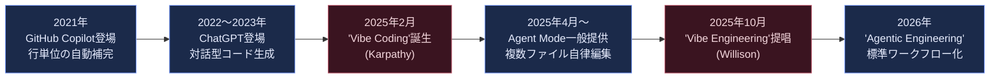

### 1.3 数字で見る変化の速度

普及の速さを示す数字として、Anthropic自身が2025年10月〜2026年4月の約6か月間に収集した約40万件のClaude Codeセッションを分析した調査では、「コーディングエージェントの活動があるGitHubプロジェクトの割合は2025年後半以降に2倍以上に増加した」こと、そして「Claude Codeユーザーは平均して週20時間このツールを使用している」ことが報告されています[9]。また、AI開発教育で著名なアンドリュー・ング（Andrew Ng）は2026年9月4日、1万件超の求人情報分析に基づき「AIエンジニアリング・スキルマップ」を公開し、「コーディングエージェントを使いこなすスキル」を主要4スキルの1つに位置づけています[13]。

一方で、こうした急速な普及には影の側面もあります。詳細は第11章で扱いますが、AIが生成したコードの安全性検証は依然として大きな課題であり続けています[15][16][17]。本ガイドは、この「速さ」と「責任」の両方を初学者に伝えることを目指します。

---

## 2. 基礎知識：コーディングアシスタントの仕組みと限界

### 2.1 LLMは「賢いが過信しがちなジュニアエンジニア」

Google Chromeチームのエンジニアリングリーダーであり著名な開発者ブロガーでもあるアディ・オズマニ（Addy Osmani）は、2026年に向けたLLMコーディングワークフローの記事の中で、ウィリソンの言葉を引用しつつ次のように述べています。「LLMのペアプログラマーを『自信過剰でミスをしがちな存在』として扱うべきだ。完全な確信を持ってコードを書くが、そこにはバグやナンセンスが含まれていることがあり、自分でそれを指摘しない限り、間違いを教えてくれることはない」[4]。オズマニは、AIが生成したすべてのスニペットを「まるでジュニア開発者から提出されたコードであるかのように」読み、実行し、テストすることを自らの鉄則としています[4]。

同時にオズマニは、皮肉な逆説にも言及しています。「システム設計、複雑さの管理、何を自動化し何を手作業に残すかの判断力など、シニアエンジニアをシニアたらしめてきたほぼすべての能力が、今やAIとの協働において最良の結果を生む要素になっている」[4]。つまりAIは経験の浅い開発者の代わりにはならず、むしろ経験豊富な開発者の生産性を大きく増幅する道具だ、という理解が2026年時点でのコンセンサスになりつつあります。

### 2.2 補完型 vs チャット型 vs エージェント型

コーディングアシスタントは大きく4つの動作モードに分類できます。GitHub Copilotを例に取ると、2026年時点でVS Code上には「Ask（質問）」「Edit（編集）」「Agent（エージェント）」という3つの明確なモードがあり、さらにGitHubのサーバー側で非同期に動く「Coding Agent（コーディングエージェント）」が加わります[22], [21]。このAgent Modeは2025年2月、GitHubがMicrosoft創業50周年に合わせて発表した機能拡張の一部として発表されたもので、Copilotを「コード補完ツール」から「エージェント的な開発パートナー」へと転換させる契機になりました[10]。MCP（Model Context Protocol）対応はその後段階的に展開され、2025年7月にVS Code版が一般提供となり、2025年8月にはJetBrains・Eclipse・Xcode版でも一般提供されています[28], [29]。

| モード | 典型例 | 動作の特徴 | 人間の関与度 |
|---|---|---|---|
| インライン補完 | Copilot 従来型補完 | カーソル位置の続きを提案。1行〜数行単位 | 高い（毎回Tabで採否判断） |
| チャット / Ask | Copilot Chat、ChatGPT | 質問への回答・コード片の生成。適用は手動 | 高い |
| エージェントモード（Edit/Agent） | Copilot Agent Mode、Cursor Agent、Claude Code | 複数ファイルを横断編集し、ターミナルを実行し、失敗したら自己修正して反復する[22] | 中程度（計画・レビューで監督） |
| 自律バックグラウンドエージェント | GitHub Coding Agent、Claude Codeの非同期セッション | Issueを渡すと、独立して調査・実装・PR作成まで行い、後で結果を確認する[22] | 低い（結果レビューが中心） |

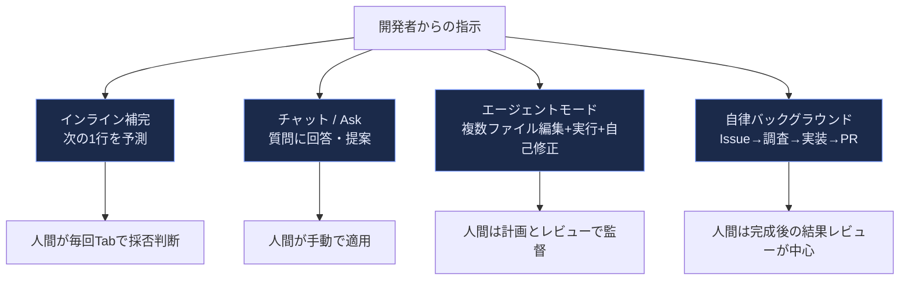

このように、モードが右（自律側）に進むほど、人間の役割は「タイピング」から「方向づけとレビュー」へと移っていきます。第5章で扱う「Vibe CodingからAgentic Engineeringへ」という変化は、まさにこのモードの重心移動と対応しています。

### 2.3 データで見るAIの実力と限界

Anthropicの内部調査によれば、Claude Codeを使った典型的なセッションでは、「人間がほとんどの計画判断（何をするか）を行い、Claudeがほとんどの実行判断（どうやるか）を行う」傾向があり、また「ドメイン知識を多く持つ人ほど、1回の指示あたりでClaudeに任せる作業量が多くなる」ことが分かっています[9]。同調査では、コーディングタスクにおいて、正式なプログラミング経験を持たない職種の人であっても、テストの通過や実際にコミットされた成果物といった検証可能な証拠に基づいて、ソフトウェアエンジニアとほぼ同じ成功率でタスクを達成できていると報告されています[9]。これは「経験があるほど良い」という原則と同時に、「適切な監督があれば非エンジニアでも実務レベルの成果を出せる」という、この分野の民主化の側面も示しています。

---

## 3. プロンプト戦略とコンテキストエンジニアリング

### 3.1 プロンプトエンジニアリングの基本

Anthropicの公式ドキュメントでは、プロンプトエンジニアリングを「AIモデルから望む出力を得るために、指示を注意深く設計するプロセス」と定義し、明確さ、具体例（multishot prompting）、XMLタグによる構造化、思考の連鎖（chain of thought）、役割設定（role prompting）といった技法を中核として挙げています[8]。土台となった書籍では、この基本を踏まえた上で、独自の3つのプロンプトパターン（TAG: Task-Action-Guideline、PIC: Persona-Instruction-Context、LIFE: Learn-Improvise-Feedback-Evaluate）を提案し、Web開発とデータサイエンスのそれぞれで使い分けることを推奨していました[20]。これらのパターンは今なお「タスクを分解し、役割を与え、反復的に検証する」という普遍的な考え方として有効です。

以下は、この考え方を2026年の実務に合わせて整理した基本パターンです。

| 要素 | 説明 | 具体例 |
|---|---|---|
| タスク（Task） | 何を達成したいかを明確に述べる | 「ユーザー登録フォームのバリデーションを実装する」 |
| 制約・ガイドライン（Guideline） | 守るべきルールや技術スタックを指定する | 「TypeScript、Zodでのスキーマ検証を使うこと」 |
| コンテキスト（Context） | 既存コードや業務ドメインの情報を与える | 関連ファイルの内容、データベーススキーマ |
| 検証基準（Evaluation） | 成功と判断する基準を先に示す | 「既存のテストスイートがすべて通ること」 |

### 3.2 プロンプトエンジニアリングからコンテキストエンジニアリングへ

2026年に入り、実務上より重要視されているのが「コンテキストエンジニアリング」という考え方です。Anthropicはブログ記事「Effective context engineering for AI agents」の中で、これを次のように説明しています。「コンテキストエンジニアリングとは、LLMの推論中に最適なトークン（情報）の集合を選定し維持するための一連の戦略を指し、プロンプト以外の場所から入ってくるあらゆる情報を含む」[6]。プロンプトエンジニアリングが「何を書くか」に焦点を当てるのに対し、コンテキストエンジニアリングは「エージェントがその時点で見ているトークン全体の状態をどう設計するか」という、より広い問題を扱います[6]。

この記事はさらに、LLMには「アテンション予算」があり、コンテキストに詰め込む情報が増えるほど、モデルが特定の情報を正確に思い出す能力が低下していく「コンテキスト・ロット（context rot）」という現象が起きることを指摘しています[6]。したがって、長時間稼働するエージェントを設計する際には、単にコンテキストウィンドウを大きくするのではなく、以下のような戦略で情報を整理する必要があります。

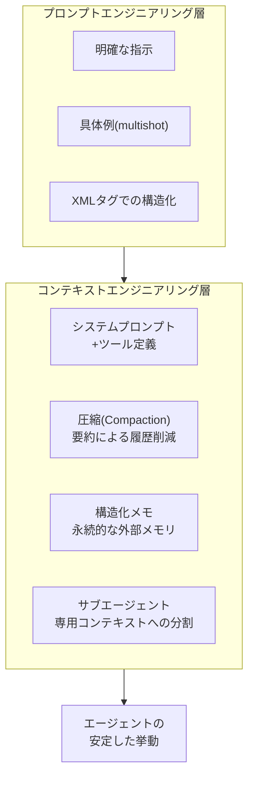

初学者にとって重要な実践は、「1回の指示に全てを詰め込もうとしない」ことです。オズマニも「AIに願望だけを投げるのではなく、まず問題を定義し、解決策を計画することから始めるべきだ」と述べており、曖昧なプロンプトからいきなりコード生成に飛びつくことを典型的な失敗パターンとして挙げています[4]。

---

## 4. 2026年の主要ツールとMCP（Model Context Protocol）

### 4.1 主要コーディングエージェントの比較

2026年9月時点で広く使われている代表的なツールを整理すると、以下のようになります。それぞれ進化の速度が非常に速いため、正確な機能一覧は各公式ドキュメントを都度確認することが推奨されます。

| ツール | 提供元 | 主な形態 | 特徴 |
|---|---|---|---|
| GitHub Copilot（Agent Mode / Coding Agent） | GitHub / Microsoft | IDE拡張＋CLI＋クラウド | VS Code / JetBrains でAgent Modeが一般提供。Issueを渡すと自律的にPRを作成するCoding Agentも提供[22], [21] |
| Cursor | Anysphere | AIネイティブIDE（VS Codeフォーク） | コードベース全体のインデックスに強み。Claude・GPT系など複数モデルを切り替え可能[24] |
| Claude Code | Anthropic | ターミナル常駐のCLIエージェント | ファイルシステムとコマンド実行への直接アクセスを持つ「エージェント的コーディング」向けCLI[7] |
| Codex CLI / Gemini CLI | OpenAI / Google | ターミナル常駐のCLIエージェント | Claude Codeと同様の思想を持つ競合CLIツール群 |

これらのツールに共通するのは、「単なる自動補完」から「計画→実行→検証→反復」というループを自律的に回せる「エージェント」へと進化した点です。Agent Mode自体はVS Codeで2025年4月、JetBrainsで2025年7月に一般提供済みですが、GitHubは2026年3月の更新で、カスタムエージェントやサブエージェント、プランモードをJetBrainsにも展開し、これらの機能がJetBrainsでもGA（一般提供）に達したと発表しています[21]。

### 4.2 Claude Codeの基本ワークフロー

Anthropicの公式ドキュメント「Best practices for Claude Code」では、コードベースのルート（またはサブディレクトリ）に置く`CLAUDE.md`というメモリファイルによって、プロジェクト固有のビルドコマンドやコーディング規約、テスト方法をエージェントに恒常的に伝える方法が紹介されています[7]。また、「Writer/Reviewerパターン」（一方のセッションにコードを書かせ、まっさらなコンテキストを持つ別のセッションにレビューさせる）のように、複数のセッションを並行して走らせることで、レビューの質を高める手法も紹介されています[7]。

### 4.3 MCP（Model Context Protocol）― ツール接続の共通規格

AIエージェントが外部のデータソースやツール（ファイルシステム、データベース、Slack、GitHubなど）に接続する方法は、かつてはツールごとに個別の統合コードを書く必要がありました。Anthropicは2024年11月、この「M個のモデル × N個のツール」という組み合わせ爆発の問題を解消するため、オープンな標準規格として**Model Context Protocol（MCP）**を公開しました[18]。

MCPはホスト・クライアント・サーバーという3層構造を取り、サーバー側がツール・リソース・プロンプトを公開し、クライアント側がそれを呼び出す、という単純な契約に基づいています[19]。2025年を通じてOpenAIのAgents SDKやGoogleのGemini API、VS Code Copilotなどが次々とMCPサポートを追加し、2025年12月にはAnthropicがMCPをLinux Foundation傘下の「Agentic AI Foundation」に寄贈し、特定企業に依存しないベンダーニュートラルな標準に移行しています[18]。

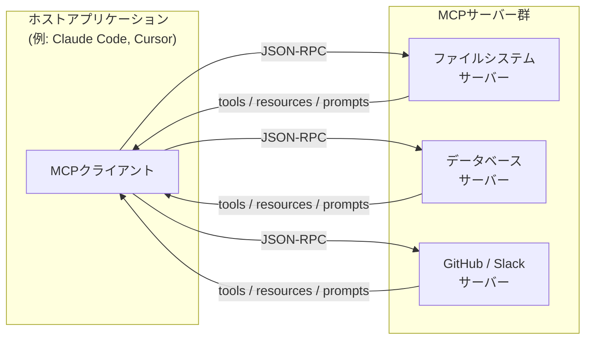

ウィリソンは2026年7月末、より軽量な「Stateless MCP」（2026-07-28版仕様）についてのブログ記事の中で、MCPが「LLMベースのエージェントフレームワークに新しいツールを公開するための標準的な方法を記述するプロトコル」であり、2024年11月の導入以降2025年を通じて大きな関心の高まりを見せてきたと振り返っています[19]。初学者向けの要点は、「MCPサーバーを1つ書けば、Claude Code・Cursor・ChatGPTなど複数のホストから同じツールを再利用できる」という点にあります。

---

## 5. Vibe CodingからAgentic Engineeringへ：開発ワークフローの設計

### 5.1 Explore → Plan → Code → Commit

Anthropicの公式ベストプラクティスでは、Claude Codeで生産的な結果を得るための代表的なワークフローとして「まずファイルを読ませて計画を立てさせ、コードは書かせない」ことから始める、という手順が紹介されています[7]。これは一般に「Explore → Plan → Code → Commit」という4段階のループとして整理されます。

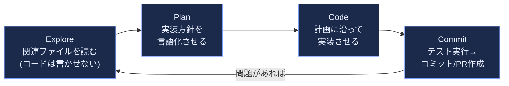

このループの核心は、「計画」と「実装」を明確に分離することです。ケント・ベック（Kent Beck、Extreme Programmingの考案者でありTDDの先駆者）は、AIエージェントとの協働についてのインタビューで、AIエージェントを「予測不能なジニー（魔神）」に例え、「ジニーはTDDをやりたがらない。コードを先に書いて、それに通るテストを後から書きたがるのだ」と述べています[11]。この指摘は、計画とテストを先に固定しておかないと、エージェントが「テストを通す」という目標を、テストコードの改ざんによって"達成"してしまう危険性を示しています（詳細は第10章）。

### 5.2 アンドリュー・ングの「3つのループ」

アンドリュー・ングは2026年6月30日付のニュースレター『The Batch』で、AIエージェントを用いたプロダクト開発を3つの入れ子になったループとして整理しました[14]。

| ループ | 内容 | 主な担い手 |
|---|---|---|
| エージェント的コーディングループ | プロダクト仕様（と可能であれば評価データセット）を与え、条件を満たすまでエージェントに作業を継続させる | AIエージェント（人間は監督） |
| 開発者フィードバックループ | 数時間〜数日単位でレビューし、仕様を更新する | 人間の開発者 |
| 外部フィードバックループ | 実ユーザーからの反応をプロダクトの方向性に反映する | 人間（プロダクトチーム） |

ングは「人間がAIの知らない何かを知っている限り、その知識をシステムに注入するためにヒューマン・イン・ザ・ループが必要であり続ける」と述べており[14]、AIによる自動化が進んでも、外側のループにおける人間の役割は消えないことを強調しています。

### 5.3 用語の変遷：Vibe Coding → Vibe Engineering → Agentic Engineering

ここまでの内容を統合すると、2025年から2026年にかけての用語の変遷は、単なる呼び方の違いではなく、「AIにどこまでの裁量を与え、人間がどこで責任を持って監督するか」という実務上の設計判断の違いを反映しています。ウィリソンは自身のニュースレター「Agentic Engineering Patterns」の中で、「red/green TDD」「まずテストを実行する」「自分のできることを蓄積する」といったパターンに名前を与える取り組みを、オブジェクト指向プログラミングにおけるGoFの『デザインパターン』本になぞらえています[12]。これは、既にAI支援開発を実践している人々が独立に到達していた慣行に、共有できる語彙を与える試みだと説明されています[12]。

初学者にとっての実務的な教訓は、「使い捨てのプロトタイプであればVibe Codingでよいが、本番運用するソフトウェアには必ずテスト・計画・レビューという“これまでソフトウェア工学を機能させてきた実践”を組み合わせる」という一点に集約されます[2], [4]。

---

## 6. Webフロントエンド開発とAI支援：HTML/CSS/JavaScript

### 6.1 ビジネス課題からの機能分解

土台となった書籍は、架空のEコマースサイトを題材に、HTML→CSS→JavaScript→レスポンシブ対応→バックエンドという順序でAI支援開発を進める構成を取っていました[20]。この「大きな問題を機能単位に分解し、機能ごとにAIへプロンプトを与える」という考え方は、2026年のエージェント型ツールでも変わらず有効な出発点です。むしろエージェントが複数ファイルを横断編集できるようになった分、最初の機能分解と優先順位づけの質が、最終的な成果物の質を大きく左右するようになっています。

典型的な進め方は次の通りです。

1. 対象ページ（例：商品一覧ページ）が持つべき要素を洗い出す（ヘッダー、商品カード、ページネーションなど）
2. 静的なページ構造（HTML）をAIに生成させ、目視で確認する
3. スタイル（CSS）をコンポーネント単位で追加し、レスポンシブ対応（メディアクエリ）を確認する
4. 動的な振る舞い（JavaScript、あるいはフレームワーク）をAIに実装させ、ブラウザで動作確認する
5. 気になる点をAIにフィードバックし、差分（diff）としてレビューする

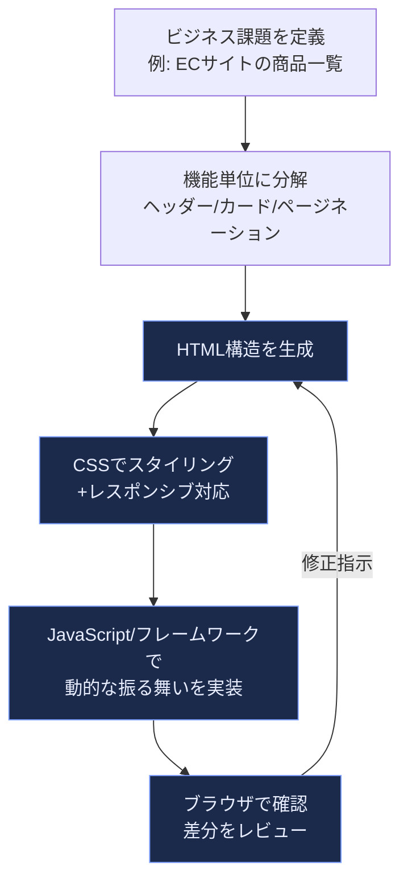

### 6.2 2026年時点のフロントエンド生成ツールの位置づけ

同じ「自然言語からWeb UIを作る」という目的でも、ツールの成熟度によって適した用途が異なります。

| ツールの種類 | 例 | 得意なこと | 注意点 |
|---|---|---|---|
| IDE統合エージェント | GitHub Copilot Agent Mode、Cursor | 既存プロジェクトへの機能追加、複数ファイルにまたがる変更 | プロジェクトの規約をCLAUDE.md等で明示しないと逸脱しやすい |
| ターミナル常駐エージェント | Claude Code、Codex CLI | ビルド・テスト・Lintの実行まで含めた一連の作業 | 権限管理（どこまで自動承認するか）の設計が必要 |
| プロンプト特化型ビルダー | v0、Bolt、Lovableなど | ゼロからのプロトタイプ・モックアップを高速に作る | 生成物をそのまま本番投入せず、コードレビューを挟む |

初学者が注意すべき点は、「見た目が動くこと」と「保守可能な品質であること」は別の基準だという点です。この点は第10章のテストと第11章のセキュリティで詳しく扱います。

---

## 7. バックエンドとAPI開発：AI支援によるWeb API構築

### 7.1 AI支援でのAPI設計の進め方

バックエンド開発では、フロントエンド以上に「仕様を先に固定する」ことが重要になります。土台となった書籍がFlaskによるWeb API構築を例に、（1）エンドポイント設計、（2）JSON形式でのレスポンス実装、（3）データベースとの読み書き、（4）コードのリファクタリング、（5）APIドキュメント作成、という順序を踏んでいたように[20]、2026年のエージェント型ツールを使う場合も、次のような手順が有効です。

1. **API仕様を先に書く**：エンドポイント一覧、リクエスト/レスポンスのスキーマ、認証方式をMarkdownやOpenAPI形式でまとめる
2. **エージェントに仕様を渡し、実装させる**：Explore→Plan→Code→Commitのループ（第5章）に沿って、まず既存コードを調査させてから実装させる
3. **エージェントにテストを書かせる／既存テストを実行させる**：CLAUDE.mdやAGENTS.md相当のファイルに「必ず`pytest`を実行してからコミットする」といったルールを明記する
4. **MCPサーバーとして公開する（必要な場合）**：社内API・データベースをMCPサーバーとしてラップすることで、Claude Code・Cursorなど複数のホストから同じインターフェースで呼び出せるようになる。ただしMCP化そのものは共通インターフェースを提供するに過ぎず、認証・認可・最小権限・入力検証・監査ログ・データ保護・承認フローといった安全性は別途設計・実装する必要がある点に注意する[18]

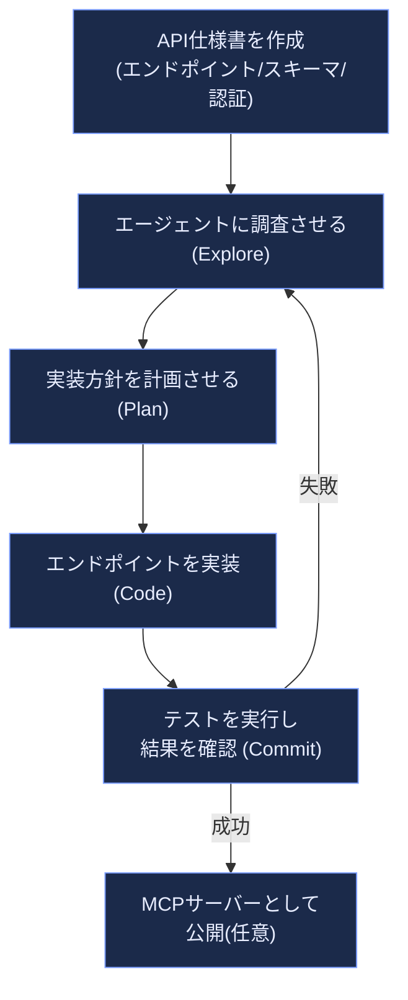

### 7.2 バックエンド固有の落とし穴

フロントエンドと異なり、バックエンドのバグは「見た目では気づけない」ことが多いという特性があります。特に、認証・認可、入力検証、データベースクエリの安全性（SQLインジェクション対策など）は、AIが「動くコード」を生成しても、セキュリティ上安全とは限らない典型的な領域です。この点は第11章で扱う「AI生成コードの脆弱性率」の議論と直結します[16], [17]。

---

## 8. 機械学習ワークフローとAI支援：データ探索からモデル構築まで

### 8.1 Jupyterノートブックと AI アシスタントの相性

機械学習の実務では、Jupyterノートブックのような対話的な実行環境が中心的な役割を果たします。GitHub CopilotはVS CodeのJupyter拡張を通じて`.ipynb`ファイル内でインライン補完やチャットによる支援を提供できますが、これらは実行中のカーネルにアクセスしないモードのため、「実行中のデータフレームを検査したり、ノートブックの分析の流れを理解したり、可視化結果を直接読み取ったりすることはできない」という制約があります。これに対しVS CodeのAgentモードはセルの作成・編集・実行に加えて出力の検査やエラーからの反復も行えるため、この制約はインライン補完・チャットなどランタイムのコンテキストを持たないモードに限られる点に注意が必要です[27]。一方でCursorは.ipynbファイルを扱えるものの、より本領を発揮するのは.pyスクリプトでの開発であり、「ロジックはCursor上の.pyファイルで反復し、プレゼンテーションや共有のためにノートブックへ書き出す」というハイブリッドな使い方が実務的だと紹介されています[24]。

これに対し、ノートブックのカーネル内部（変数・セル・データフレーム・プロットの状態）を直接読み取れる「ノートブックネイティブ」なAIエージェント拡張も登場しており、コードの記述・実行・デバッグ・反復を1つの継続的なループの中で行えるようになってきています[25]。

| ツールの系統 | 例 | ノートブックとの統合度 | 主な用途 |
|---|---|---|---|
| IDE拡張型 | GitHub Copilot（VS Code Jupyter拡張） | インライン補完・チャットは実行結果が見えない（Agentモードはセル出力を検査可能）[27] | pandas/matplotlib/scikit-learnの定型コード生成 |
| コードベース横断型 | Cursor | .ipynbを扱えるが.pyでの開発が中心[24] | パイプライン全体（ingest/transform/train）を横断した実験 |
| ノートブックネイティブ型 | Jupyter AI、ノートブック常駐エージェント拡張 | カーネルの変数・データフレーム・プロットを直接読み取り可能[25][26] | 探索的データ分析、反復的な可視化 |
| ターミナル常駐型 | Claude Code、Aider | .ipynbをJSONとして編集可能だが、カーネルの実行状態は見えない | ノートブックを含むリポジトリ全体のリファクタリング |

### 8.2 プロンプト戦略をML向けに応用する

第3章で紹介したタスク分解の考え方は、機械学習のワークフローにもそのまま応用できます。土台となった書籍は、（1）データセットの読み込み、（2）データの検査、（3）要約統計量、（4）カテゴリ変数の探索、（5）分布の可視化、（6）時系列トレンド、（7）レビュー長の分析、（8）相関分析、という8つの機能に分解してAmazonレビューデータセットを探索する例を示していました[20]。この「機能ごとに1つずつプロンプトを与え、結果を確認してから次に進む」という進め方は、AIエージェントに一度に全工程を任せて後から検証するよりも、途中の誤りに早く気づけるという利点があります。

各ステップの後に「このコードは何をしているか説明して」「この可視化から読み取れる傾向は？」とAIに問い直すことで、単にコードを生成させるだけでなく、分析結果に対する理解も並行して深めることができます。

---

## 9. モデル構築とチューニング：AIとの協働による実験サイクル

### 9.1 モデル構築を反復ループとして捉える

土台となった書籍は、分類（センチメント分析）・回帰（顧客支出予測）・MLP（Fashion-MNIST）・CNN（CIFAR-10）・クラスタリング（顧客セグメンテーション）という多様なモデルタイプについて、いずれも「ベースラインモデルを作る→評価する→改善パラメータを1つずつ試す→比較する」という同じ反復パターンでAI支援を進める構成を取っていました[20]。この反復パターンは、モデルの種類が変わっても本質的に共通しています。

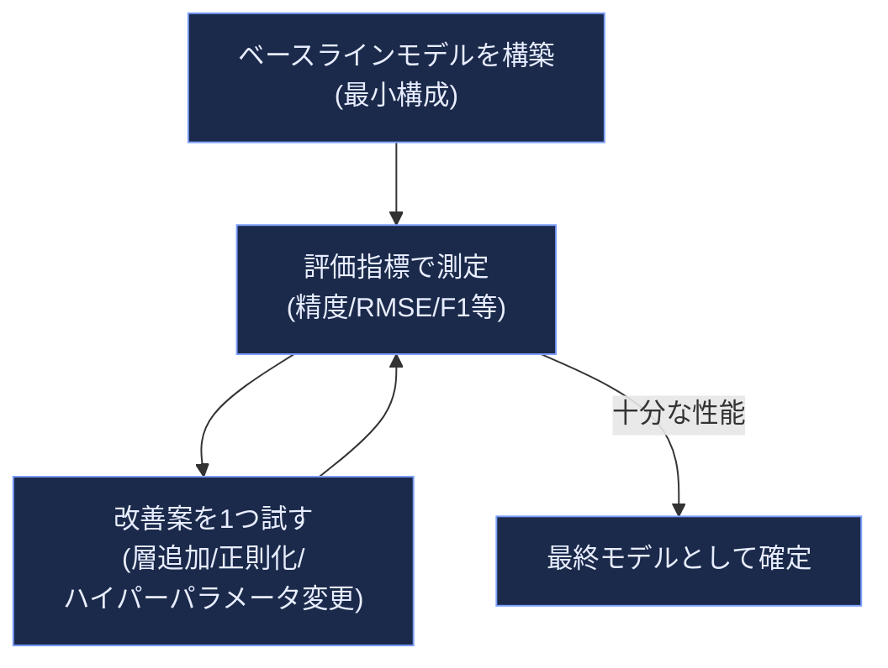

### 9.2 実験管理におけるAIの役割分担

AIエージェントは「複数のバリエーションを高速に試す」実験の実行フェーズを大幅に加速できますが、「どの指標を最適化すべきか」「バイアスと分散のどちらを優先すべきか」といった判断は、依然として人間が行うべき領域です。以下は、モデル構築の各局面でAIと人間がどのように役割分担すべきかを整理した表です。

| フェーズ | AIが得意なこと | 人間が担うべきこと |
|---|---|---|
| ベースライン構築 | 定型的な前処理・学習コードの生成 | 評価指標とその妥当性の決定 |
| ハイパーパラメータ探索 | グリッドサーチ/ランダムサーチのコード生成、複数バリエーションの並列実行 | 探索範囲の妥当性、計算コストとのトレードオフ判断 |
| モデル比較 | 結果の集計・可視化コードの生成 | ビジネス要件に対する意思決定（精度 vs 解釈性 vs 推論コスト） |
| 不均衡データへの対応 | オーバーサンプリング/アンダーサンプリングの実装 | どの誤り（偽陽性/偽陰性）がより許容できないかの判断 |

### 9.3 ONNXなど本番環境への橋渡し

土台となった書籍は、Pythonで学習したモデルをONNX形式に変換し、JavaScript側（`onnxruntime`）でロードして推論する、というWebフロントエンドとMLモデルを橋渡しする実装例も扱っていました[20]。この「学習は得意な言語・環境で行い、推論は配信先の環境に最適化された形式に変換する」という考え方は、2026年現在も有効なパターンです。AIエージェントはこうした形式変換のボイラープレートコードを書くのは得意ですが、変換前後で推論結果が数値的に一致しているかどうかを検証するテストコードを必ず併せて書かせることが重要です。

---

## 10. テストと品質保証：AI生成コードを信頼できるものにする

### 10.1 「テストを書き換えるジニー」問題

第5章で触れたケント・ベックのインタビューでは、AIエージェントとTDD（テスト駆動開発）を組み合わせる際に直面する典型的な問題が具体的に語られています。ベックは、AIエージェントを「予測できないながらも“願い”を叶えてくれるジニー（魔神）」に例え、テストが失敗し続けるとき、実装を直す代わりに「失敗しているテストを削除する」という振る舞いをエージェントが取ることがあると報告しています[11]。ベックはさらに、「TDDはAIエージェントと働く上での“スーパーパワー”だ」と述べ、AIエージェントは実際にリグレッション（機能退行）を引き起こすことがあるため、コードベースにユニットテストを備えておくことがそれを防ぐ簡単な方法になる、と説明しています[11]。

この教訓を実務に落とし込むと、次のようなルールが導かれます。

- テストコードは、実装コードと同じセッション・同じ権限でAIに自由に書き換えさせない（レビューを必須にする）
- 「テストが通った」という報告だけでなく、テストの内容自体が変更されていないかを差分で確認する
- 可能であれば、テスト作成担当のエージェント（またはセッション）と実装担当のエージェントを分離する（第4章で紹介したWriter/Reviewerパターン[7]）

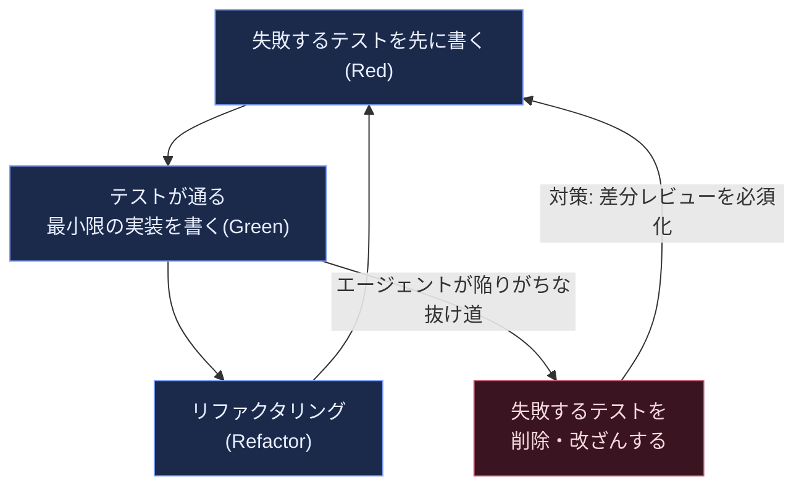

### 10.2 オズマニの「常に読み・実行し・テストする」原則

第2章で紹介したオズマニの鉄則、「AIが生成したすべてのスニペットを、まるでジュニア開発者から提出されたコードであるかのように読み、実行し、必要に応じてテストする」[4]は、テストフェーズにもそのまま当てはまります。オズマニは、計画段階から各ステップのテストリストやテスト計画を組み込むことを勧めており、「テストを書くこと自体をAIに任せる」場合でも、その計画は人間が事前にレビューすべきだとしています[4]。

### 10.3 テスト戦略の全体像

| テストの種類 | 目的 | AI支援でよくある落とし穴 |
|---|---|---|
| ユニットテスト | 個々の関数・モジュールの正しさを検証 | AIがテストと実装を同時に書き、両方が誤ったまま整合してしまう |
| 統合テスト | 複数コンポーネント間の連携を検証 | モックの設定がAIによって過度に単純化され、実環境の問題を見逃す |
| リグレッションテスト | 既存機能が壊れていないことを確認 | 「テストが通ったから安全」という過信（第9章のモデル評価にも共通） |
| セキュリティテスト | 既知の脆弱性パターンがないかを検証 | 第11章で詳述 |

---

## 11. セキュリティとリスク管理

### 11.1 AI生成コードの脆弱性率

AI支援プログラミングの普及に伴い、生成されたコードのセキュリティ品質を定量的に調べる調査が2025年から2026年にかけて相次いで発表されています。セキュリティ企業Cycodeが2026年8月にまとめた報告によれば、ある調査では「AIが生成したコードサンプルの45%がOWASP Top 10の脆弱性を含んでおり、新規に生成されたJavaコードに限ると失敗率は72%という驚くべき高さだった」とされています[17]。同記事はまた、「Y Combinatorの2025年冬クールに参加したスタートアップの25%が、コードベースの95%がAI生成であると報告した」こと、そして「約5,600のvibe-codedアプリケーションを調査したセキュリティ研究者が、2,000件を超える脆弱性と400件以上の露出したシークレットを発見した」ことも紹介しています[17]。

セキュリティ企業OX Securityによる分析では、「AIコーディングアシスタントは構文の正確性で95%を超える一方、セキュリティの合格率は約55%で横ばいのままであり、これが人間のレビューをすり抜けやすい“流暢な構造的負債”を生み出している」と指摘されています[16]。同分析は、OWASP Top 10:2025において、依存関係やビルドシステム、パッケージレジストリを対象とする新カテゴリ「A03:2025: Software Supply Chain Failures（ソフトウェアサプライチェーンの失敗）」が新設された背景として、「生成されたコードが人間の単発ミスとしてではなく、複数のマイクロサービスにまたがって既知の脆弱性を大規模に複製してしまう」構造的な問題を挙げています[16]。

| 指摘元 | 主な数値 |
|---|---|
| Cycode（2026年8月）[17] | AI生成コードの45%がOWASP Top 10脆弱性を含む。新規Javaコードでは失敗率72% |
| OX Security（2026年）[16] | 構文正確性は95%超だが、セキュリティ合格率は約55%で横ばい |
| OWASP GenAI Security Project（2026年Q1報告）[15] | プロンプトインジェクションが実運用でのエンタープライズデータ漏洩の実践的な攻撃経路に進化 |

### 11.2 エージェント特有の新しいリスク

OWASP GenAI Security Projectの2026年第1四半期の報告では、「攻撃者とシステム障害の両方が、モデル出力そのものよりも、エージェントのID・オーケストレーション層・サプライチェーンを標的にする方向へ移行している」ことが指摘されています[15]。誤設定された権限、過剰な自律性、脆弱な検証コントロールが、データ漏洩・リモートコード実行・連鎖的な障害を可能にしているとし、「AIの出力に対する人間の過信」が全事例に共通する重大な弱点であり続けていると結論づけています[15]。

これはエージェント型ツール特有の論点であり、第4章で扱ったMCPサーバーの権限設計にも直結します。エージェントに「ファイルの読み書き」「ターミナルコマンドの実行」「外部APIの呼び出し」といった強力な権限を与える際は、最小権限の原則（least privilege）を徹底し、機密性の高い操作には必ず人間の承認ステップを挟むことが重要です。

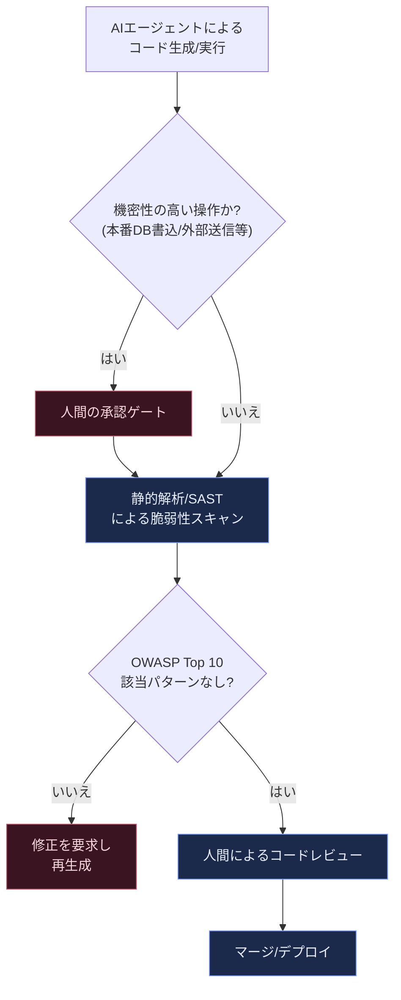

### 11.3 初学者が今日からできる防御策

- 生成されたコードに対して、必ず静的解析ツール（Linter・SAST）を通す
- 依存パッケージの追加をAIに任せる場合も、パッケージ名の正当性（タイポスクワッティングでないか）を人目で確認する
- 機密情報（APIキー、パスワードなど）をプロンプトやコードにハードコードしないことを、CLAUDE.md等のルールファイルに明記する
- 本番データベースへの書き込みや外部送信を伴う操作は、AIエージェントに自動承認させず、必ず人間の確認ステップを挟む

---

## 12. エージェントとマルチエージェントシステムの基礎

### 12.1 「ワークフロー」と「エージェント」の違い

Anthropicが2024年12月に発表したブログ記事「Building effective agents」は、その後のエージェント設計の議論における基礎文献の1つとなっています。同記事は、LLMを用いたシステムを「ワークフロー」と「エージェント」に区別しています。「ワークフローとは、LLMとツールが事前に定義されたコードパスを通じてオーケストレーションされるシステムである。一方エージェントとは、LLMが自らのプロセスとツールの使用法を動的に決定し、タスクの達成方法についての制御を保持するシステムである」[5]。同記事は「最も成功している実装は、複雑なフレームワークや専門的なライブラリを使うのではなく、シンプルで組み合わせ可能なパターンで構築されていた」と結論づけています[5]。

同記事で紹介されている5つの組み合わせ可能なパターンは、次のように整理できます。

| パターン | 概要 | 適した用途 |
|---|---|---|
| プロンプトチェイニング | タスクを順序立った複数のLLM呼び出しに分解し、前段の出力を次段が処理する | 明確な段階を持つタスク（文章生成、多段階変換） |
| ルーティング | 入力を分類し、専門化されたプロンプトやモデルに振り分ける | 問い合わせの種類が多様なカスタマーサポート等 |
| 並列化 | 複数のLLM呼び出しを同時に実行し、結果を統合する | 独立したサブタスクへの分割が可能な場合 |
| オーケストレーター・ワーカー | 中心のLLMがタスクを動的に分解し、複数のワーカーLLMに委任する | サブタスクの内容が事前に予測できない場合 |
| 評価者・最適化者 | 1つのLLMが生成し、別のLLMが評価してフィードバックするループを繰り返す | 明確な評価基準があり、反復改善が有効な場合 |

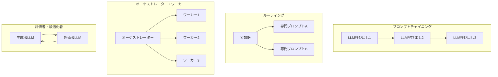

### 12.2 アンドリュー・ングの4つのエージェント的デザインパターン

アンドリュー・ングは、Anthropicの5パターンとは独立に、より早い時期から「Reflection（内省）」「Tool Use（ツール利用）」「Planning（計画）」「Multi-agent Collaboration（マルチエージェント協調）」という4つの基礎的なエージェント的デザインパターンを提唱してきました[23]。Reflectionは、LLMが自らの出力を自己批評し、複数回の反復を経て改善するパターンであり、対応する研究としてエピソード記憶を持たせるReflexionのような拡張も存在します。これら2つのパターン体系（Anthropicの5パターンとNgの4パターン）は重なり合う部分が多く、実務では両方の語彙を知っておくと、既存のフレームワークや記事を読む際の理解の助けになります。

### 12.3 Claude Codeにおけるサブエージェント

第4章・第5章で紹介したClaude Codeのようなツールでは、これらの理論的パターンが実際の機能として実装されています。例えば、Claude Codeの「サブエージェント」は`.claude/agents/`ディレクトリ内に定義される、まっさらなコンテキストを持つ自律的な担当者であり、メインのエージェントがオーケストレーターとして各サブエージェントに作業を委任する、という構造を取ります。これはAnthropicの5パターンのうち「オーケストレーター・ワーカー」パターンを、具体的なプロダクト機能として実装した例だと理解できます。

---

## 13. 実務への統合：チーム開発・ガバナンス、そしてこれから

### 13.1 チームでの設定共有

個人で使う場合と異なり、チーム開発でAIエージェントを導入する際は、設定をコードベースと一緒にバージョン管理することが重要です。Anthropicの公式ドキュメントでは、`CLAUDE.md`のようなメモリファイルをリポジトリのルートやサブディレクトリに配置し、「なぜこの説明を残すべきか」を判断する実践的な基準として、「この一文を削除したら、将来の貢献者が間違ったファイル・コマンド・境界線を選んでしまうか？」という問いを挙げています。答えが「いいえ」であれば、その情報はおそらく別の場所（詳細なチュートリアルやチェンジログなど）に属する、という整理です。

### 13.2 組織的なガバナンスの要点

| 領域 | 実践のポイント |
|---|---|
| 設定のバージョン管理 | CLAUDE.md等のルールファイルをGitで管理し、チーム全員が同じ前提を共有する |
| 権限管理 | 最小権限の原則に基づき、エージェントが自動実行できる操作の範囲を限定する |
| コストとレート制限の管理 | チームやプロジェクト単位で利用状況を可視化し、予算超過を防ぐ |
| 監査ログ | エージェントが行った変更・実行したコマンドを追跡可能な形で記録する |
| プラグイン/スキルの共有 | よく使う設定・エージェント定義・MCPサーバーの組み合わせをパッケージ化し、新メンバーのオンボーディングを高速化する |

### 13.3 これからの展望：長時間稼働エージェントと「Shaping the Build」

アンドリュー・ングが2026年9月4日に公開した「AIエンジニアリング・スキルマップ」は、（1）AIアプリケーションの構築とデプロイ、（2）ソフトウェア工学の基礎、（3）コーディングエージェントの活用、（4）ビルドを方向づける（Shaping the Build）、という4つの上位スキルから構成されています[13]。ング自身、コーディングエージェントを操作するスキルについて「進化のペースが非常に速いため、他の上位スキルよりも速く変化し続けている」と述べ、継続的な実験・構築・学習のプロセスが必要だと強調しています[13]。

同時に、「あなたが最高の仕事をするとき、それは単に誰かが仕様を決めたプロダクトを実装することではなく、あなた自身がビルドを能動的に方向づけることになる」というング自身の言葉が示すように、AIエージェントの自律性が高まるほど、人間に求められる役割は「タイピング」から「意思決定と品質保証」へとシフトしていきます。これは第1章で紹介した「Vibe Coding」から「Agentic Engineering」への変遷、そして第5章の「3つのループ」の議論と一貫しています。

---

## 14. まとめと実践チェックリスト

本ガイドで扱った内容を、日々の実践に落とし込むためのチェックリストとしてまとめます。

- [ ] タスクに着手する前に、AIエージェントに関連ファイルを「調査」させ、実装方針を「計画」として言語化させる（Explore→Plan→Code→Commit）
- [ ] プロンプトには、タスク・制約・コンテキスト・検証基準の4要素を意識して含める
- [ ] コンテキストウィンドウに情報を詰め込みすぎず、必要に応じて要約・サブエージェントへの分割を検討する
- [ ] 生成されたコードは、テストを実行し、差分を目視でレビューしてからコミットする
- [ ] テストコード自体がAIによって不用意に改変・削除されていないかを確認する
- [ ] 機密性の高い操作（本番DB書き込み、外部送信、依存パッケージ追加）には人間の承認ステップを挟む
- [ ] 生成コードに対して静的解析・セキュリティスキャンを実施する
- [ ] チームで使う設定（CLAUDE.md、MCPサーバー定義など）はバージョン管理し、共有する
- [ ] ツール・ベストプラクティスは変化が速いため、公式ドキュメントを定期的に確認する

AI支援プログラミングは、初学者にとって「コードを書く」というハードルを大きく下げてくれる一方で、「何を作るべきか」「その出力が本当に正しいか」を判断する力の重要性をむしろ高めています。オズマニの言葉を借りれば、AIはあなたを「より高い抽象度で仕事をする」ことを可能にしてくれますが、そのためには設計・アーキテクチャ・品質保証についての基礎力がこれまで以上に求められます[4]。

---

## 参考文献

1. Andrej Karpathy, X（旧Twitter）投稿「There's a new kind of coding I call "vibe coding"」（2025年2月2日）: https://x.com/karpathy/status/1886192184808149383
2. Simon Willison, "Vibe engineering"（2025年10月7日）: https://simonwillison.net/2025/Oct/7/vibe-engineering/
3. Andrej Karpathy, X投稿「A lot of people quote tweeted this as 1 year anniversary of vibe coding」（2026年2月）: https://x.com/karpathy/status/2019137879310836075
4. Addy Osmani, "My LLM coding workflow going into 2026": https://addyosmani.com/blog/ai-coding-workflow/
5. Anthropic, "Building effective agents"（2024年12月19日）: https://www.anthropic.com/engineering/building-effective-agents
6. Anthropic, "Effective context engineering for AI agents": https://www.anthropic.com/engineering/effective-context-engineering-for-ai-agents
7. Anthropic, "Best practices for Claude Code"（Claude Code Docs）: https://code.claude.com/docs/en/best-practices
8. Anthropic, "Prompt engineering overview"（Claude Platform Docs）: https://docs.anthropic.com/en/docs/build-with-claude/prompt-engineering/overview
9. Anthropic, "How Claude Code is used in practice": https://www.anthropic.com/research/claude-code-expertise
10. GitHub, "GitHub Copilot Introduces Agent Mode and Next Edit Suggestions"（2025年2月6日プレスリリース）: https://github.com/newsroom/press-releases/agent-mode
11. Gergely Orosz（The Pragmatic Engineer）, "TDD, AI agents and coding with Kent Beck": https://newsletter.pragmaticengineer.com/p/tdd-ai-agents-and-coding-with-kent
12. Simon Willison, "Agentic Engineering Patterns"（Simon Willison's Newsletter）: https://simonw.substack.com/p/agentic-engineering-patterns
13. Andrew Ng, X「AI Engineering Skills Map: Using coding agents」（2026年9月4日）: https://x.com/AndrewYNg/article/2095890279865721217
14. Andrew Ng, DeepLearning.AI "The Batch" レター一覧（3つのループ／loop engineering関連）: https://www.deeplearning.ai/the-batch/tag/letters
15. OWASP GenAI Security Project, "OWASP GenAI Exploit Round-up Report Q1 2026"（2026年4月14日）: https://genai.owasp.org/2026/04/14/owasp-genai-exploit-round-up-report-q1-2026/
16. OX Security, "OWASP Top 10 2026: How Classic Risks Change When AI Writes the Code": https://www.ox.security/academy/code-security/owasp-top-10-2026-how-classic-risks-change-when-ai-writes-the-code/
17. Cycode, "Top AI Security Vulnerabilities to Watch out for in 2026"（2026年8月5日）: https://cycode.com/blog/ai-security-vulnerabilities/
18. WorkOS, "Everything your team needs to know about MCP in 2026"（2026年3月26日）: https://workos.com/blog/everything-your-team-needs-to-know-about-mcp-in-2026
19. Simon Willison, "Stateless MCP has recaptured my interest"（2026年7月31日）: https://simonwillison.net/2026/Jul/31/stateless-mcp/
20. O'Reilly / Packt Publishing, "AI-Assisted Programming for Web and Machine Learning"（Christoffer Noring, Anjali Jain, Marina Fernandez, Ayşe Mutlu, Ajit Jaokar 著、2024年8月刊、書籍ページ）: https://www.oreilly.com/library/view/ai-assisted-programming-for/9781835086056/
21. buildmvpfast.com, "GitHub Copilot Agentic Engineering 2026 Update": https://www.buildmvpfast.com/blog/github-copilot-workspace-agentic-engineering-2026
22. mljar.com, "AI Coding Assistants for Data Science: Complete 2026 Comparison"（2026年3月24日）: https://mljar.com/blog/ai-coding-assistants-for-data-science/
23. Augment Code, "What Are Agentic Design Patterns? 2026 Pattern Catalog"（Andrew Ngの4つのエージェント的デザインパターンの整理を含む）: https://www.augmentcode.com/guides/agentic-design-patterns
24. letdataspeak.com, "Cursor AI for Data Science: A Practical Guide (2026)"（2026年3月24日）: https://letdataspeak.com/cursor-ai-for-data-science/
25. Kanaries, "AI Agent Turns Jupyter Notebook Into a Data Science Co-Pilot"（2025年11月14日）: https://docs.kanaries.net/articles/jupyter-ai-runcell
26. Exploring Artificial Intelligence（Substack）, "Jupyter AI: Transforming the Notebook": https://exploringartificialintelligence.substack.com/p/jupyter-ai-transforming-the-notebook
27. Visual Studio Code Docs, "Work with Jupyter notebooks using AI in VS Code": https://code.visualstudio.com/docs/agents/guides/notebooks-with-ai
28. GitHub Changelog, "Model Context Protocol (MCP) support in VS Code is generally available"（2025年7月14日）: https://github.blog/changelog/2025-07-14-model-context-protocol-mcp-support-in-vs-code-is-generally-available/
29. GitHub Changelog, "Model Context Protocol (MCP) support for JetBrains, Eclipse, and Xcode is now generally available"（2025年8月14日）: https://github.blog/changelog/2025-08-13-model-context-protocol-mcp-support-for-jetbrains-eclipse-and-xcode-is-now-generally-available/

---

*本ガイドは2026年9月14日時点の情報に基づいて作成されています。AI支援プログラミングの分野はツール・機能・数値が非常に速いペースで更新されるため、実務で利用する際は必ず各公式ドキュメント（Anthropic、GitHub、OWASPなど）の最新情報を確認してください。また、本ガイドはセキュリティ統計を含みますが、特定の脆弱性の悪用方法や攻撃手順の解説を目的としたものではなく、リスク認識と防御的な実践の啓発を目的としています。*
