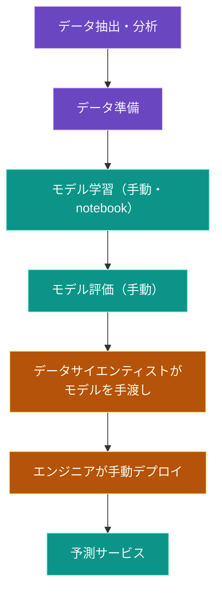
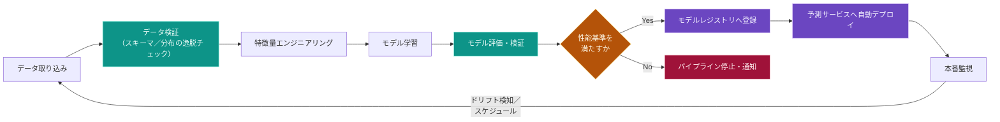
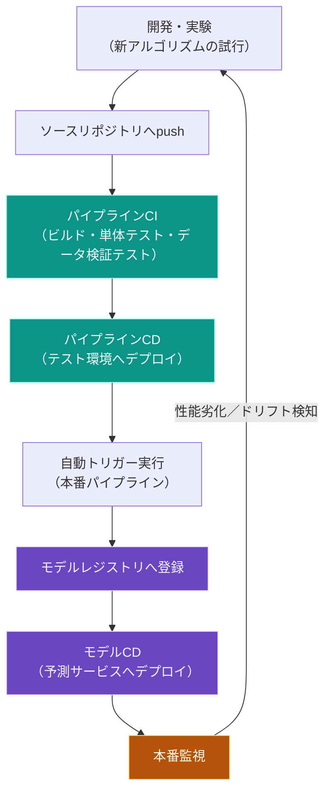
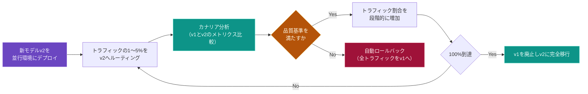
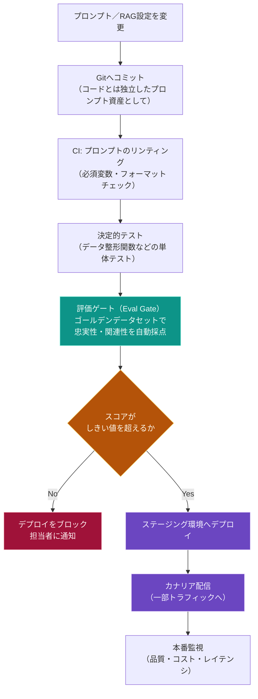
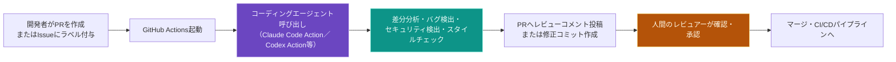

# AI CI/CD 自動化 完全ガイド ― 初学者のためのステップバイステップ実践入門

> 対象読者: ソフトウェアエンジニア／QAエンジニアで、機械学習（ML）・生成AI（LLM）を組み込んだシステムのCI/CD自動化をこれから学ぶ人
> 前提知識: 従来型ソフトウェアのCI/CD（GitHub Actions、GitLab CIなど）の基本を理解していること

---

## 目次

1. [はじめに：なぜ「AI CI/CD」という言葉が必要なのか](#1-はじめになぜai-cicdという言葉が必要なのか)
2. [従来のCI/CDとAI CI/CDは何が違うのか](#2-従来のcicdとai-cicdは何が違うのか)
3. [全体像をつかむ：MLOps成熟度モデル](#3-全体像をつかむmlops成熟度モデル)
4. [ステップバイステップ ベストプラクティス](#4-ステップバイステップ-ベストプラクティス)
   - [Step 1: データとモデルのバージョン管理](#step-1-データとモデルのバージョン管理)
   - [Step 2: 実験管理とモデルレジストリ](#step-2-実験管理とモデルレジストリ)
   - [Step 3: CI（継続的インテグレーション）でコード・データ・モデルを検証する](#step-3-ci継続的インテグレーションでコードデータモデルを検証する)
   - [Step 4: CD（継続的デリバリー）でパイプラインとモデルを配信する](#step-4-cd継続的デリバリーでパイプラインとモデルを配信する)
   - [Step 5: CT（継続的トレーニング）で自動再学習する](#step-5-ct継続的トレーニングで自動再学習する)
   - [Step 6: デプロイ戦略を選ぶ（カナリア／ブルーグリーン／シャドウ）](#step-6-デプロイ戦略を選ぶカナリアブルーグリーンシャドウ)
   - [Step 7: 本番監視とドリフト検知](#step-7-本番監視とドリフト検知)
   - [Step 8: LLMOps特有の考慮点（プロンプトはコードである）](#step-8-llmops特有の考慮点プロンプトはコードである)
   - [Step 9: AIエージェントでCI/CDそのものを自動化する](#step-9-aiエージェントでcicdそのものを自動化する)
   - [Step 10: セキュリティとガバナンスをパイプラインに組み込む](#step-10-セキュリティとガバナンスをパイプラインに組み込む)
5. [主要ツールマップ](#5-主要ツールマップ)
6. [よくある落とし穴（アンチパターン）チェックリスト](#6-よくある落とし穴アンチパターンチェックリスト)
7. [まとめ：導入ロードマップ](#7-まとめ導入ロードマップ)
8. [参考文献・出典URL一覧](#8-参考文献出典url一覧)

---

## 1. はじめに：なぜ「AI CI/CD」という言葉が必要なのか

「AI CI/CD」とは、大きく分けて3つの領域を指す言葉として使われている。

- **MLOps CI/CD**: 機械学習モデルの学習・評価・デプロイを自動化する仕組み（CI/CD/CTの3点セット）
- **LLMOps CI/CD**: プロンプト・RAG構成・評価データセットなど、生成AIアプリケーション特有の成果物をバージョン管理・評価・デプロイする仕組み
- **AIエージェントによるCI/CD自動化**: Claude CodeやGitHub Copilot、Codexのようなコーディングエージェントを、コードレビューやテスト生成、CI最適化そのものの自動化に使う取り組み（2026年に入り「Continuous AI」とも呼ばれ始めている）

このガイドでは、この3つすべてをステップバイステップで扱う。全体を貫く原則はシンプルで、「モデルもプロンプトもデータも、コードと同じように バージョン管理・自動テスト・自動デプロイ・自動監視の対象にする」ということに尽きる。

---

## 2. 従来のCI/CDとAI CI/CDは何が違うのか

Google Cloudの公式アーキテクチャドキュメントは、MLシステムが従来のソフトウェアシステムと異なる理由を、チームスキル・開発プロセス・テスト・デプロイ・本番運用の5つの観点で整理している。ML開発は本質的に実験的であり、どの特徴量やアルゴリズムが最良かを試行錯誤する必要がある一方、モデルの性能はコードの品質だけでなく学習データの分布にも左右されるため、コードのCIだけでは不十分になる。

| 観点 | 従来のソフトウェアCI/CD | ML CI/CD（MLOps） | LLM CI/CD（LLMOps） |
|---|---|---|---|
| デプロイ対象 | コード・バイナリ | コード＋データ＋モデルの3点セット | コード＋プロンプト＋評価しきい値＋モデル選択 |
| CIでテストする内容 | 単体テスト・結合テスト | 上記に加えてデータスキーマ検証、学習収束テスト、モデル品質評価 | 上記に加えてプロンプトのリンティング、ゴールデンデータセットに対する評価（Eval） |
| 出力の再現性 | 決定的（同じ入力なら同じ出力） | 非決定的になりうる（データやシードで変動） | 非決定的（同じプロンプトでも出力が変わりうる） |
| リリース頻度 | コード変更のたびに高頻度 | データドリフトや性能劣化に応じて可変（週次〜日次が多い） | プロンプト変更は非常に高頻度（1日に何度も） |
| 追加される自動化 | なし | CT（継続的トレーニング）が新たに必要 | 評価ゲート（Eval Gate）とプロンプトの環境昇格（dev→staging→prod）が必要 |

出典: MLOpsとDevOpsの違いについては[Google Cloud Architecture Center](https://docs.cloud.google.com/architecture/mlops-continuous-delivery-and-automation-pipelines-in-machine-learning)、ML CI/CDの3層テストピラミッドについては[MLflow公式ブログ](https://mlflow.org/articles/mlops-pipeline-automation-best-practices-in-2026/)、LLMOpsとMLOpsの違いについては[MyEngineeringPath](https://myengineeringpath.dev/genai-engineer/llmops/)を参照。

---

## 3. 全体像をつかむ：MLOps成熟度モデル

Google Cloudは、MLOpsの自動化レベルを3段階（レベル0〜2）に分類している。これは非常に有名なフレームワークで、多くの実務ガイドが引用している。自分のチームが今どのレベルにいるかを把握することが、最初の一歩になる。

### レベル0：手動プロセス

データサイエンティストがノートブック上で試行錯誤し、できあがったモデルをエンジニアに手渡して本番化する。CIもCDも存在せず、モデルの更新頻度は年に数回程度にとどまる。

課題: モデルは本番投入後に劣化する。データの分布は時間とともに変化し（データドリフト）、入力と出力の関係自体が変わることもある（コンセプトドリフト）ため、手動運用では性能劣化に気づくのが遅れる。

### レベル1：MLパイプラインの自動化（CT）

パイプライン全体をオーケストレーションし、新しいデータが来るたびに自動で再学習（Continuous Training）する段階。データ検証・モデル検証のステップが自動化され、特徴量ストア（Feature Store）やメタデータ管理が導入される。

パイプラインの実行トリガーには、オンデマンド実行・スケジュール実行（日次／週次）・新規データ到着時・性能劣化検知時・分布の有意な変化（コンセプトドリフト）検知時などがある。

### レベル2：CI/CDパイプラインの自動化（完全自動化）

パイプラインの実装コード自体も、ソースリポジトリへのコミットをトリガーにビルド・テスト・デプロイされる段階。ソース管理、テスト・ビルドサービス、デプロイサービス、モデルレジストリ、特徴量ストア、MLメタデータストア、パイプラインオーケストレーターがすべて連携する。

このレベル2の状態こそが、一般に「AI CI/CD」と呼ばれる完成形である。以降のステップでは、レベル0からレベル2へ向かうために必要な個別のプラクティスを、順を追って解説する。

出典: [Google Cloud Architecture Center「MLOps: Continuous delivery and automation pipelines in machine learning」](https://docs.cloud.google.com/architecture/mlops-continuous-delivery-and-automation-pipelines-in-machine-learning)。同ドキュメントのMLOps成熟度3段階モデルは業界で広く参照されている一次情報であり、[Glasier社のガイド](https://www.glasierinc.com/blog/machine-learning-operations-mlops-guide)や[Flexiana社の解説](https://medium.com/@flexianadevgroup/mlops-maturity-model-2026-4-stages-to-resilient-risk-free-machine-learning-468c097dc25c)でも同様の3段階（あるいは4段階）モデルが紹介されている。

---

## 4. ステップバイステップ ベストプラクティス

### Step 1: データとモデルのバージョン管理

もっとも見落とされがちで、かつもっとも重要な土台がこれである。コードはGitで管理していても、学習データやモデルの重みファイルは「dataset_v2_final.csv」のようなファイル名でごまかされているチームが非常に多い。これでは、ある本番モデルがどのデータで学習されたのか、後から正確に追跡することができなくなる。

ベストプラクティス:

- **データはコードと同じ扱いにする**: DVC（Data Version Control）は、Gitの仕組みをそのまま使いながら、大容量のデータセットやモデルファイルをクラウドストレージ側に置き、Git側にはポインタとなる小さなメタファイル（`.dvc`ファイルや`dvc.yaml`）だけをコミットする方式を取る。これにより、`git checkout`だけで過去のどの時点のデータ・モデル・パイプラインの組み合わせも再現できる。
- **content hash（内容ハッシュ）でデータセットにタグ付けする**: ファイル名ではなく中身のハッシュ値で識別することで、同じ名前で中身が違う、という事故を防ぐ。
- **Dockerイメージのバージョンを固定する**: 学習環境のライブラリバージョンが変わると、同じコード・同じデータでも結果が変わりうるため、環境そのものもバージョン管理の対象にする。
- **学習・検証・テストの分割比率を固定する**: 例えば80/10/10の分割比率とシード値を固定し、再現可能なデータ分割を行う。

DVC以外の選択肢としては、Git LFS、lakeFS、Pachyderm、Nessie、Doltなどがあり、画像・動画などの大規模データレイクにはlakeFSの方がスケールしやすいとされる。なお2025年11月、lakeFSがDVCを買収したことが公表されている。

出典: [DVC公式サイト](https://dvc.org/)、[DVC公式ユーザーガイド](https://doc.dvc.org/user-guide)、[lakeFSによるデータバージョニングツール比較](https://lakefs.io/data-version-control/dvc-tools/)、[Data Version ControlのWikipedia項目](https://en.wikipedia.org/wiki/Data_Version_Control_(software))、[Label Your Dataによるデータバージョニングのベストプラクティスまとめ](https://labelyourdata.com/articles/machine-learning/data-versioning)、[MLflow公式ブログ](https://mlflow.org/articles/mlops-pipeline-automation-best-practices-in-2026/)。

### Step 2: 実験管理とモデルレジストリ

データが再現可能になったら、次は「どの実験がどのハイパーパラメータでどんな結果を出したか」を自動記録する仕組みを導入する。

- **実験トラッキングツール**（MLflow、Weights & Biases など）は、各学習実行（run）ごとにパラメータ・メトリクス・成果物を自動で記録する。手動でスプレッドシートに記入する運用から脱却することが第一歩になる。
- **モデルレジストリ**は「モデル版のGit」に相当する中央リポジトリで、モデル成果物のバージョン管理と昇格（development → staging → production）ワークフローを担う。モデルレジストリがあることで、今どのバージョンが本番稼働中かを正確に把握でき、問題発生時に即座に前バージョンへロールバックできる。承認ワークフローを強制することもでき、規制業界における監査証跡の確保にもつながる。

| 機能 | 実験トラッキング | モデルレジストリ |
|---|---|---|
| 主な目的 | 試行錯誤の記録・比較 | 本番投入バージョンの管理 |
| 記録対象 | ハイパーパラメータ、メトリクス、成果物 | 承認状態、デプロイ履歴、学習データへの参照 |
| 典型ツール | MLflow Tracking, Weights & Biases | MLflow Model Registry, Vertex AI Model Registry, SageMaker Model Registry, Hugging Face Hub |

出典: [MLflowブログのモデルレジストリ解説](https://mlflow.org/articles/mlops-pipeline-automation-best-practices-in-2026/)、[Prepzeeによる主要MLOpsツール比較](https://prepzee.com/blog/top-15-mlops-tools-to-learn/)、[Online Inference誌によるMLOpsツールまとめ](https://medium.com/online-inference/top-mlops-tools-in-2026-858fd479acac)。

### Step 3: CI（継続的インテグレーション）でコード・データ・モデルを検証する

ML CI/CDでは、CIは「コードのテスト」だけでなく「データとモデルの検証」も担う点が従来のCI/CDと決定的に異なる。テストは以下の多層ピラミッドで考えるとよい。

| レイヤー | テスト内容 | 主なツール例 |
|---|---|---|
| コードレベル | 特徴量エンジニアリング関数の単体テスト、モデルクラスの各メソッドの単体テスト | pytest など通常の単体テストフレームワーク |
| データレベル | スキーマの逸脱（想定外の欠損・型不一致）検知、データ分布の逸脱検知 | Great Expectations, Evidently AI |
| モデルレベル | 学習が収束するか（少数サンプルで損失が下がるか）、NaN値が出ないか、評価指標が基準値を超えるか | 各フレームワークの評価API、MLflow Evaluate |
| 統合レベル | パイプライン各コンポーネントの成果物整合性、コンポーネント間の結合テスト | パイプラインオーケストレーターのend-to-endテスト |
| セキュリティレベル | 依存パッケージの脆弱性スキャン、モデル成果物自体のスキャン、Infrastructure as Codeのスキャン | Checkov（IaCスキャン）, ModelScan（モデル成果物スキャン）, Fairlearn（バイアステスト） |

CIで確認すべき具体的な項目としては、モデル学習が収束すること、ゼロ除算などでNaN値が発生しないこと、各パイプラインコンポーネントが期待通りの成果物を生成することなどが挙げられる。

出典: [Google Cloud Architecture Center](https://docs.cloud.google.com/architecture/mlops-continuous-delivery-and-automation-pipelines-in-machine-learning)、[Kernshellによる2026年MLOpsベストプラクティス（セキュリティを含むCI/CDステージの例）](https://www.kernshell.com/best-practices-for-scalable-machine-learning-deployment/)、[MLflowブログの多層テストピラミッドの解説](https://mlflow.org/articles/mlops-pipeline-automation-best-practices-in-2026/)。

### Step 4: CD（継続的デリバリー）でパイプラインとモデルを配信する

ML CI/CDにおけるCDは、単一のソフトウェアパッケージをデプロイするのではなく、「別のサービス（モデル予測サービス）を自動的にデプロイするシステム（学習パイプライン）」をデプロイする点が特徴である。CDで確認すべき項目には次のようなものがある。

- モデルが対象インフラと互換性を持つか（必要なパッケージ・メモリ・アクセラレータが揃っているか）を事前検証する
- 予測サービスAPIを実際に呼び出し、期待通りのレスポンスが返るかをテストする
- 秒間クエリ数（QPS）やレイテンシなど、負荷テストによる性能検証を行う
- 開発ブランチへのpushで自動的にテスト環境へデプロイし、mainブランチへのマージ（レビュー承認後）でステージング環境へ半自動デプロイし、ステージングでの実績を確認してから本番へ手動承認デプロイする、という段階的な昇格フローを組む

出典: [Google Cloud Architecture Center](https://docs.cloud.google.com/architecture/mlops-continuous-delivery-and-automation-pipelines-in-machine-learning)。

### Step 5: CT（継続的トレーニング）で自動再学習する

CT（Continuous Training）はML CI/CDにのみ存在する、従来のソフトウェアCI/CDにはない新しい概念である。CI/CD/CTの3点セットが揃うことで、本番データが変化し続ける中でもモデルが自律的に改善し続けるループが完成する。

再学習をトリガーする条件の代表例:

- **スケジュールベース**: 週次・日次など、定期的な再学習サイクル
- **データドリフトベース**: PSI（Population Stability Index）などの指標が閾値を超えたら、通常サイクル外の再学習評価を発火する
- **性能劣化ベース**: 本番での予測精度が一定基準（例：accuracy 0.85）を下回ったら再学習する
- **新規データ到着ベース**: バッチでラベル付きデータが到着した時点で再学習する

再学習後のモデルは、必ず「新モデルが現行の本番モデルより優れているか」を比較検証してから昇格させるゲートを設ける。データ全体だけでなく、顧客セグメントごとなど、データの部分集合でも性能が一貫しているかを確認することが望ましい。

出典: [Google Cloud Architecture Center](https://docs.cloud.google.com/architecture/mlops-continuous-delivery-and-automation-pipelines-in-machine-learning)、[MLflowブログにおけるCT運用例（週次再学習と品質しきい値ゲート）](https://mlflow.org/articles/mlops-pipeline-automation-best-practices-in-2026/)、[Azilenによる継続的再学習のプラクティス](https://www.azilen.com/blog/mlops-best-practices/)。

### Step 6: デプロイ戦略を選ぶ（カナリア／ブルーグリーン／シャドウ）

新しいモデルをいきなり全トラフィックへ投入するのはリスクが高い。ソフトウェアのデプロイと同様、モデルにも段階的なロールアウト戦略が必要になる。

| 戦略 | 仕組み | 向いているケース | 必要なインフラ |
|---|---|---|---|
| ローリングデプロイ | 既存インスタンスを順次新バージョンに置き換える | 定常的な小規模更新、コストを抑えたい場合 | 既存キャパシティの再利用のみで済み最も安価 |
| ブルーグリーンデプロイ | 新旧2つの環境を用意し、検証後に一気にトラフィックを切り替える | ダウンタイムを許容できない場合、即座のロールバックが必要な場合 | 二重のインフラが必要（コスト高） |
| カナリアデプロイ | 新バージョンへ少数（1〜5%）のトラフィックのみ流し、問題なければ徐々に拡大する | モデルアーキテクチャの変更を伴わない、段階的にリスクを検証したい場合 | トラフィック分割ができるサービスメッシュ（Istio, Linkerd等）やArgo Rolloutsなど |
| シャドウデプロイ | 新バージョンにも本番トラフィックを複製して流すが、結果はユーザーに返さず比較のみ行う | ユーザー体験に一切影響を与えずに新モデルの挙動を検証したい場合 | トラフィックミラーリングの仕組み |
| A/Bテスト | 複数バージョンに実際にトラフィックを分けて配信し、ビジネス指標で比較する | UX・レコメンドなど、統計的な効果検証をしたい場合 | 実験基盤・統計的有意性の検証基盤 |

なお、特徴量ストアのスキーマ変更や入力前処理そのものを変える大規模なアーキテクチャ変更の場合は、同一APIコントラクト上でのトラフィック分割であるカナリアではなく、完全な切り替えを伴うブルーグリーンデプロイが適している。GPUを大量に使うLLMのような高コストなモデルでは、2バージョンを並行稼働させるカナリア自体のコストが課題になる点にも注意したい。

出典: [devops-daily.comによるデプロイ戦略比較](https://devops-daily.com/posts/deployment-strategies-guide)、[Intuzによるモデルデプロイパターンの解説](https://www.intuz.com/blog/strategies-for-deploying-ml-models)、[123ofaiによるMLモデル向けカナリアデプロイの完全ガイド](https://123ofai.com/qnalab/system-design/blocks/canary-deploy)、[CircleCIによるデプロイ戦略トレードオフ解説](https://circleci.com/blog/deployment-strategies-types-trade-offs-and-how-to-choose/)、[Harnessによるブルーグリーン/カナリア解説](https://www.harness.io/blog/blue-green-canary-deployment-strategies)。

### Step 7: 本番監視とドリフト検知

モデルは、コードにバグがなくても劣化する。これは従来ソフトウェアにはない、MLシステム特有の重大なリスクである。データの分布そのものが変化する「データドリフト」と、入力と出力の関係性が変化する「コンセプトドリフト」の2種類を区別して理解しておく必要がある。

- **データドリフト**: 本番環境に入ってくるデータが、学習時のデータと統計的に大きく異なってしまう状態
- **コンセプトドリフト**: 入力データと正解ラベルの関係性そのものが時間とともに変化してしまう状態（例：市場環境の変化により、以前は有効だった与信スコアリングの基準が通用しなくなる）

監視すべき指標としては、モデルの予測精度そのものに加え、レイテンシ、エラー率、そして特徴量ごとの分布の変化などがある。オープンソースのEvidently AIのようなツールを使えば、リファレンスデータと本番データを比較したドリフトレポートを自動生成できる。監視基盤としては、Prometheusでメトリクスを収集し、Grafanaで可視化するという組み合わせも定番になっている。

監視結果は、単なるダッシュボード表示で終わらせず、必ずStep 5のCTパイプラインへのトリガーとして接続することが重要である。監視して終わり、では意味がなく、監視結果が自動的に再学習や人間へのアラートにつながる設計にして初めて「継続的」という言葉に見合う仕組みになる。

出典: [GitNexaによるMLOps実装ガイド（Evidently AIを用いたドリフト検知のコード例）](https://www.gitnexa.com/blogs/mlops-implementation-best-practices)、[Azilenによるデータドリフト・コンセプトドリフトの定義](https://www.azilen.com/blog/mlops-best-practices/)、[Prepzeeによる監視ツール（Prometheus, Grafana, Weights & Biases）の紹介](https://prepzee.com/blog/top-15-mlops-tools-to-learn/)。

### Step 8: LLMOps特有の考慮点（プロンプトはコードである）

生成AI・LLMを組み込んだアプリケーションでは、デプロイ対象がモデルのバイナリではなく「プロンプト・検索設定（RAGの取得元）・モデルプロバイダー設定・評価しきい値」に置き換わる。システムプロンプトのたった一言の変更が、モデルの再学習以上に出力品質を左右することもある。プロンプトをアプリケーションコードにハードコードしたまま金曜午後にこっそり変更し、評価も走らせずに月曜の朝に大量のクレームで気づく、というのが典型的な失敗パターンとして紹介されている。

LLMOpsのCI/CDパイプラインが従来のML CI/CDに追加する要素:

- **プロンプトのバージョン管理**: プロンプトをGitでバージョン管理される独立した資産として扱い、開発（dev）→ステージング（staging）→本番（production）という環境ごとに、どのプロンプトバージョンが割り当てられているかを管理する
- **プロンプトのリンティング**: 必須変数の欠落やフォーマット崩れがないかを機械的にチェックする
- **評価ゲート（Eval Gate）**: 忠実性（faithfulness）や関連性（answer relevancy）といった指標を、ゴールデンデータセット（正解付きテストケース集）に対して自動計算し、スコアが既定の閾値を下回った場合はデプロイをブロックする。これがLLMOpsにおける「品質ゲート」であり、従来のCIにおける単体テストに相当する役割を果たす
- **段階的ロールアウト**: プロンプトのA/Bテストやカナリア配信により、新しいプロンプト・モデル設定を一部トラフィックにのみ適用してから拡大する

Google Cloud上でこのパイプラインを組む場合、Cloud BuildがCI/CDのオーケストレーションを担い、Vertex AI Pipelines（Kubeflowベース）が複雑なワークフローを、Vertex AI Evaluation Serviceが忠実性・関連性などの自動評価指標の計算を担う、という役割分担が一つの実例として紹介されている。RAGシステムでは、アプリケーションコード・プロンプトテンプレート・検索対象データという3種類の更新をそれぞれ独立して扱えるパイプライン設計が求められる点も重要である。

出典: [MyEngineeringPathによるLLMOps解説（プロンプトA/Bテスト、評価ゲートの概念）](https://myengineeringpath.dev/genai-engineer/llmops/)、[Jubin Soni氏によるGoogle Cloud上でのLLMOps CI/CDパイプライン構築記事](https://jubinsoni.medium.com/engineering-llmops-building-robust-ci-cd-pipelines-for-llm-applications-on-google-cloud-136b1fdbcbb5)（[DEV Community版](https://dev.to/jubinsoni/engineering-llmops-building-robust-cicd-pipelines-for-llm-applications-on-google-cloud-22hc)）、[LangWatchによるプロンプト管理とCI/CD統合の解説](https://langwatch.ai/blog/what-is-prompt-management-and-how-to-version-control-deploy-prompts-in-productions)、[Agentaによるプロンプト専用デプロイパイプラインの構築ガイド](https://agenta.ai/blog/cicd-for-llm-prompts)、[apxmlによるLLMOpsとCI/CD統合の技術解説](https://apxml.com/courses/mlops-for-large-models-llmops/chapter-6-advanced-llmops-systems-workflows/integrating-llmops-cicd)、[ExamCertAIによる2026年のLLMOpsスキルマップ](https://www.examcert.app/blog/llmops-skills-certifications-2026/)、[MachineLearningMasteryによるLLMOpsロードマップ](https://machinelearningmastery.com/the-roadmap-for-mastering-llmops-in-2026/)。

### Step 9: AIエージェントでCI/CDそのものを自動化する

ここまでは「AIシステムをCI/CDでどう扱うか」という話だったが、2026年に入り、逆に「AIエージェントを使ってCI/CDのプロセス自体を自動化する」という潮流が急速に実用化している。GitHubはこれを「Continuous AI」と呼び、CI/CDの実践と同様に、自動化とコラボレーションを強化するAIをソフトウェア開発ライフサイクル（SDLC）へ統合する取り組みと位置づけている。

代表的な実装パターン:

- **PRメンション型のコードレビュー自動化**: GitHub ActionsのワークフローからClaude Code（`anthropics/claude-code-action`）やOpenAI Codex（`openai/codex-action`）、Gemini系のアクションを呼び出し、プルリクエストに`@claude`のようなメンションを付けるだけで、差分分析・バグ検出・セキュリティ検出・スタイルチェック・フォローアップコミットの作成までを自動実行させる
- **Issueベースの自律的PR生成**: Issueにラベルを付けるだけでコーディングエージェントが自律的にPRを作成する運用
- **GitHub Agentic Workflows**: GitHub Next、Microsoft Research、Azure Core Upstreamの協働で開発された技術プレビュー機能で、トリアージやドキュメント作成、コード品質向上など、より主観的で反復的な作業を、GitHub Actionsの信頼性・制御性を保ったまま自動化する。公式ブログは、これを「従来のCI/CD用YAMLワークフローの代替」ではなく、CI/CDと併用してこそ最も効果を発揮するものと明確に位置づけている

導入時の注意点:

- **権限は最小限に絞る**: エージェントはコードを読み、コマンド実行やファイル出力を行う可能性があるため、`contents: read`、`pull-requests: write`のように、通常のCIジョブ以上に権限境界を明確にする
- **実行環境（ランナー）を選ぶ**: 一部のツールはWindows環境で追加のセーフティ設定が必要になる場合があり、まずはLinuxランナーから始めるのが扱いやすい
- **モデルバージョンを固定するかどうかを検討する**: アップデートによってプロンプトへの反応が変わることがあるため、本番運用では固定し、セキュリティパッチのみ計画的に適用するフローを別途設ける
- **会話型ではなく自走型の設計にする**: 細かく対話しながら進める使い方ではなく、適切な入力・指示を与えてエージェントに自走させることで真価を発揮する。そのためにはタスクごとに特化したプロンプトや実行環境をチームで共有できる仕組みが必要になる

出典: [renue社によるAI DevOps完全ガイド（Claude Code×GitHub Actionsの実運用知見）](https://renue.co.jp/posts/ai-devops-claude-code-github-actions-ci-cd-ai-review-2026)、[GitHub公式ブログ「GitHub Agentic Workflowsを発表」](https://github.blog/jp/2026-02-16-automate-repository-tasks-with-github-agentic-workflows/)、[Uravation社によるCodex GitHub Action完全ガイド](https://uravation.com/media/codex-github-action-complete-guide-2026/)、[AIzen社によるCodexのGitHub Actions統合手順](https://aizen-ai.co.jp/codex-github-actions/)、[Google Codelabs「生成AIを使用したコードレビューの自動化」](https://codelabs.developers.google.com/genai-for-dev-github-code-review)、[Fintanによる GitLab環境でのAI駆動開発の実践知見](https://fintan.jp/page/19508/)、[potproject氏によるClaude Codeベースの自律型GitHub Actions実装記](https://blog.potproject.net/2025/04/14/github-pr-automate-ai-agents/)。

### Step 10: セキュリティとガバナンスをパイプラインに組み込む

AI CI/CDパイプラインは、従来のCI/CDが抱えるセキュリティリスクに加えて、AI・LLM特有のリスクにも対応する必要がある。両者は別物として管理するのではなく、同じパイプライン内で一貫して統制することが望ましい。

**CI/CDパイプライン自体のセキュリティ**

OWASPはCI/CD特有のセキュリティリスクを整理したチートシートを公開しており、実運用ではまず可視性（ログの一元化）を確保し、次に最小権限化とシークレット管理を徹底し、その後パイプラインの改ざん防止やハードニングへ進み、最後にサプライチェーン対策（依存関係の固定、成果物の署名検証）に着手する、という優先順位づけが推奨されている。CodecovやSolarWindsの事例が示すように、過度な権限を持つサービスアカウントが侵害されると被害が広範囲に及ぶため、CI/CD専用のワークフローファイル（`.github/workflows/`など）の変更には`CODEOWNERS`によるレビュー必須化や署名付きコミットの検証を組み込むことが有効である。

**LLM・AIエージェント特有のセキュリティ**

OWASPは「LLMアプリケーションのためのTop 10」として、プロンプトインジェクション、機微情報の開示、データ・モデルのポイズニング、不適切な出力処理、過剰なエージェンシー（Excessive Agency）、システムプロンプトの漏洩、ベクトル・埋め込みの脆弱性、過剰消費（Unbounded Consumption）などをカタログ化している。これらのリスクは、実行時（ランタイム）の問題であることが多く、アプリケーションコード側だけでは解決できないため、認可チェックや最小権限、出力バリデーションといった制御は、LLM自身に委ねず、決定論的で監査可能な外部システム側で強制することが基本原則とされる。

パイプラインへの組み込み方の例:

| OWASP LLMリスク | CI/CDへの組み込み方 |
|---|---|
| プロンプトインジェクション（LLM01） | インジェクション対策の検証を、本番投入前にCI内の自動テストとして実行する（本番で発見するのではなく） |
| 過剰なエージェンシー | エージェントが呼び出せるAPI・ツールのスコープを、パイプライン側で検証し、想定より広い権限を持とうとした変更は自動的に拒否する |
| 機微情報の開示 | モデル応答からの機密データ漏洩を検知する自動テスト（カナリートークンの埋め込みとログ監視など）をCIに組み込む |
| モデル・データのポイズニング | サードパーティモデル・データセットをソフトウェア依存関係と同様に扱い、SBOM（Software Bill of Materials）や来歴（provenance）検証を行う |

自動化されたレッドチーム演習（既知のジェイルブレイクパターンや間接的インジェクションへの耐性テスト）をCI/CDに組み込み、モデルアップデートのたびに安全特性が変化していないかを回帰テストすることも、2025年以降のベストプラクティスとして推奨されている。

出典: [OWASP公式「CI/CD Security Cheat Sheet」](https://cheatsheetseries.owasp.org/cheatsheets/CI_CD_Security_Cheat_Sheet.html)、[Secure Pipelinesによる「OWASP Top 10 CI/CD Risks」実例解説](https://secure-pipelines.com/ci-cd-security/owasp-top-10-ci-cd-risks-explained-real-world-examples/)、[Cycodeによる2025年版OWASP Top 10とLLMリスクの統合解説](https://cycode.com/blog/the-2025-owasp-top-10-addressing-software-supply-chain-and-llm-risks-with-cycode/)、[Gravitee社によるOWASP LLM Top 10実践ガイド](https://www.gravitee.io/blog/owasp-top-10-for-llm-applications-2025-a-practical-guide)、[Security Boulevardによる2025年版OWASP LLM Top 10解説](https://securityboulevard.com/2026/03/the-owasp-top-10-for-llm-applications-2025-explained-simply/)、[Alejandro Aucestovar氏によるOWASP LLM Top 10のCI/CDへの落とし込み方](https://medium.com/@aucestovara/from-owasp-top-10-for-llms-to-ci-cd-securing-ai-systems-at-build-time-1dce225cb9c0)、[SOCFortressによるOWASP LLM Top 10の実攻撃シナリオ検証（CI/CDへの回帰テスト組み込みの提案を含む）](https://socfortress.medium.com/owasp-top-10-for-llm-applications-2025-testing-local-models-against-real-attack-scenarios-part-5e453e4015cb)、[Siembaによる OWASP LLM Top 10セキュリティテストガイド](https://www.siemba.io/owasp-top-10-llm-security-testing)。

---

## 5. 主要ツールマップ

| カテゴリ | 代表的なツール | 主な用途 |
|---|---|---|
| データ・モデルバージョン管理 | DVC, Git LFS, lakeFS, Pachyderm | データセット・モデルのGit的バージョン管理 |
| 実験管理・モデルレジストリ | MLflow, Weights & Biases | 実験のトラッキング、モデルの承認・昇格ワークフロー |
| パイプラインオーケストレーション | Kubeflow, Vertex AI Pipelines, SageMaker Pipelines, Prefect, ZenML, Airflow | 学習・評価・デプロイの一連の流れを自動実行 |
| CI/CD基盤 | GitHub Actions, GitLab CI, Jenkins, Cloud Build, CircleCI | ビルド・テスト・デプロイの自動化そのもの |
| データ検証・品質管理 | Great Expectations, Evidently AI | データスキーマ検証、ドリフトレポート生成 |
| モデル・IaCセキュリティスキャン | ModelScan, Checkov, Fairlearn | モデル成果物の安全性チェック、Infrastructure as Codeのスキャン、バイアス検証 |
| 監視・可観測性 | Prometheus, Grafana, Evidently AI | 本番稼働メトリクスの収集・可視化・ドリフト検知 |
| コンテナ・実行基盤 | Docker, Kubernetes | 学習・推論環境の一貫性確保とスケーリング |
| LLMOps・プロンプト管理 | LangWatch, Agenta, Vertex AI Evaluation Service | プロンプトのバージョン管理、評価ゲート、A/Bテスト |
| AIエージェントによるCI/CD自動化 | Claude Code Action, OpenAI Codex Action, GitHub Agentic Workflows, GitHub Copilot | PRレビュー・Issue対応・テスト生成・ドキュメント同期の自動化 |

出典: [Prepzeeによる2026年版主要MLOpsツール15選](https://prepzee.com/blog/top-15-mlops-tools-to-learn/)、[Online Inference誌による2026年版MLOpsツールまとめ](https://medium.com/online-inference/top-mlops-tools-in-2026-858fd479acac)、[Kernshellによるスケーラブルなツールスタック例](https://www.kernshell.com/best-practices-for-scalable-machine-learning-deployment/)、[GitNexaによるツール選定ガイド](https://www.gitnexa.com/blogs/mlops-implementation-best-practices)。

---

## 6. よくある落とし穴（アンチパターン）チェックリスト

- [ ] データセットをファイル名だけで管理し、どのモデルがどのデータで学習されたか追跡できない
- [ ] モデル評価をオフラインの精度指標のみで行い、ビジネスKPIを評価基準に含めていない
- [ ] データサイエンティストとエンジニアが分業しすぎて、モデルの手渡しの過程で「学習時と提供時のスキュー（training-serving skew）」が発生している
- [ ] モデルを本番投入したきり、性能劣化を検知する監視の仕組みがない
- [ ] 再学習を完全手動で行っており、データが変化しても気づいた時にはすでに性能が劣化している
- [ ] 新モデルをいきなり100%のトラフィックに投入し、問題発生時に即座にロールバックできる体制がない
- [ ] プロンプトをアプリケーションコードにハードコードしており、変更のたびにアプリ全体の再デプロイが必要になっている
- [ ] プロンプトやモデル設定を変更しても、評価（Eval）を自動実行せずに本番反映してしまっている
- [ ] AIエージェントにCIワークフローの実行権限を過剰に付与し、最小権限の原則を守っていない
- [ ] 規制業界向けのシステムで、独立したチームによるモデル検証や、承認の文書化された escalation パスを用意していない

出典: [MLflowブログにおけるMLOps成熟度の考え方（トラストできる仕組みの重要性）](https://mlflow.org/articles/mlops-pipeline-automation-best-practices-in-2026/)、[N-iXによる実運用でよく見落とされるMLOpsプラクティスの指摘](https://www.n-ix.com/mlops-best-practices/)、[Google Cloud Architecture Centerにおけるtraining-serving skewの解説](https://docs.cloud.google.com/architecture/mlops-continuous-delivery-and-automation-pipelines-in-machine-learning)。

---

## 7. まとめ：導入ロードマップ

すべてを一度に導入する必要はない。以下のような段階的な進め方が現実的である。

1. **土台づくり（Step 1〜2）**: まずデータ・モデルのバージョン管理と実験トラッキングを整備する。ここが崩れていると、この先の自動化はすべて「再現できない自動化」になってしまう。
2. **テストとデリバリーの自動化（Step 3〜4）**: コード・データ・モデルを対象にした多層テストをCIに組み込み、テスト環境への自動デプロイパイプラインを構築する。
3. **継続的トレーニングと段階的ロールアウト（Step 5〜6）**: スケジュールまたはドリフトベースの再学習トリガーを設定し、カナリアなど安全なロールアウト戦略を組み込む。
4. **監視のループを閉じる（Step 7）**: 監視結果が自動的に再学習やアラートへつながるようにし、CI/CD/CTのループを完成させる。
5. **生成AI固有の layer を足す（Step 8）**: プロンプトをコードと同格の資産として扱い、評価ゲートを設ける。
6. **AIエージェントで開発プロセス自体を加速する（Step 9）**: コードレビューやドキュメント同期など、反復的なタスクからAIエージェントの導入を始める。
7. **セキュリティを後付けにしない（Step 10）**: 最初のパイプライン設計の段階から、最小権限・監査ログ・評価の回帰テストを組み込んでおく。

この順番で少しずつ成熟度を上げていくことで、無理なく「AI CI/CD」の実践に到達できる。

---

## 8. 参考文献・出典URL一覧

**MLOps全般・成熟度モデル**
- Google Cloud Architecture Center「MLOps: Continuous delivery and automation pipelines in machine learning」 https://docs.cloud.google.com/architecture/mlops-continuous-delivery-and-automation-pipelines-in-machine-learning
- MLflow公式ブログ「MLOps Pipeline Automation Best Practices in 2026」 https://mlflow.org/articles/mlops-pipeline-automation-best-practices-in-2026/
- Kernshell「MLOps in 2026: Best Practices for Scalable ML Deployment」 https://www.kernshell.com/best-practices-for-scalable-machine-learning-deployment/
- Azilen「8 MLOps Best Practices You Should Implement in 2026」 https://www.azilen.com/blog/mlops-best-practices/
- Glasier「Ultimate Guide to MLOps Process and Best Practices, 2026」 https://www.glasierinc.com/blog/machine-learning-operations-mlops-guide
- N-iX「MLOps best practices: A hands-on experience guide」 https://www.n-ix.com/mlops-best-practices/
- Flexiana「MLOps Maturity Model 2026: 4 Stages to Resilient, Risk-Free Machine Learning」 https://medium.com/@flexianadevgroup/mlops-maturity-model-2026-4-stages-to-resilient-risk-free-machine-learning-468c097dc25c
- Prepzee「Top 15 MLOps Tools to Learn in 2026」 https://prepzee.com/blog/top-15-mlops-tools-to-learn/
- Online Inference「Top MLOps tools in 2026」 https://medium.com/online-inference/top-mlops-tools-in-2026-858fd479acac
- GitNexa「MLOps Implementation Guide for 2026」 https://www.gitnexa.com/blogs/mlops-implementation-best-practices

**データ・モデルバージョン管理**
- DVC公式サイト https://dvc.org/
- DVC公式ユーザーガイド https://doc.dvc.org/user-guide
- lakeFS「Best Data Version Control Tools in 2026」 https://lakefs.io/data-version-control/dvc-tools/
- Wikipedia「Data Version Control (software)」 https://en.wikipedia.org/wiki/Data_Version_Control_(software)
- Label Your Data「Data Versioning: ML Best Practices Checklist 2026」 https://labelyourdata.com/articles/machine-learning/data-versioning
- DataCamp「The Complete Guide to Data Version Control With DVC」 https://www.datacamp.com/tutorial/data-version-control-dvc

**LLMOps・プロンプトCI/CD**
- MyEngineeringPath「LLMOps — CI/CD, Eval Gates & LLM Deployment (2026)」 https://myengineeringpath.dev/genai-engineer/llmops/
- Jubin Soni「Engineering LLMOps: Building Robust CI/CD Pipelines for LLM Applications on Google Cloud」 https://jubinsoni.medium.com/engineering-llmops-building-robust-ci-cd-pipelines-for-llm-applications-on-google-cloud-136b1fdbcbb5 （[DEV Community版](https://dev.to/jubinsoni/engineering-llmops-building-robust-cicd-pipelines-for-llm-applications-on-google-cloud-22hc)）
- ExamCertAI「LLMOps Skills & Certifications 2026」 https://www.examcert.app/blog/llmops-skills-certifications-2026/
- MachineLearningMastery「The Roadmap for Mastering LLMOps in 2026」 https://machinelearningmastery.com/the-roadmap-for-mastering-llmops-in-2026/
- LangWatch「Prompt Management: Version & Deploy Prompts in Production」 https://langwatch.ai/blog/what-is-prompt-management-and-how-to-version-control-deploy-prompts-in-productions
- apxml「Integrating LLMOps with CI/CD Systems」 https://apxml.com/courses/mlops-for-large-models-llmops/chapter-6-advanced-llmops-systems-workflows/integrating-llmops-cicd
- Agenta「CI/CD for LLM Prompts: How to Build a Prompt Deployment Pipeline」 https://agenta.ai/blog/cicd-for-llm-prompts

**AIエージェントによるCI/CD自動化**
- renue「AI DevOps完全ガイド2026｜Claude Code×GitHub Actions×CI/CD自動化」 https://renue.co.jp/posts/ai-devops-claude-code-github-actions-ci-cd-ai-review-2026
- GitHubブログ「GitHub Agentic Workflowsを発表」 https://github.blog/jp/2026-02-16-automate-repository-tasks-with-github-agentic-workflows/
- Uravation「Codex GitHub Action 完全ガイド」 https://uravation.com/media/codex-github-action-complete-guide-2026/
- AIzen「CodexをGitHub Actionsで使う方法」 https://aizen-ai.co.jp/codex-github-actions/
- Google Codelabs「生成AIを使用したコードレビューの自動化」 https://codelabs.developers.google.com/genai-for-dev-github-code-review
- Fintan「GitLab環境でGitリポジトリをハブとしたAI駆動開発」 https://fintan.jp/page/19508/
- potproject「GitHub上で依頼してPR作成する自律型AIエージェントを作った」 https://blog.potproject.net/2025/04/14/github-pr-automate-ai-agents/
- note.com（mnuma）「GitHub公式actions/ai-inferenceアクションでコード自動レビュー」 https://note.com/mnuma/n/ne5dbb93a340e

**デプロイ戦略**
- devops-daily.com「Deployment Strategies: Blue-Green, Canary, and Rolling Deployments Explained」 https://devops-daily.com/posts/deployment-strategies-guide
- Intuz「8 Most Reliable Strategies for Secure ML Model Deployment」 https://www.intuz.com/blog/strategies-for-deploying-ml-models
- 123ofai「Canary Deployment for ML Models — Complete Guide (2026)」 https://123ofai.com/qnalab/system-design/blocks/canary-deploy
- CloudBees「Deployment strategies」 https://docs.cloudbees.com/docs/cloudbees-cd/latest/plan/deployment-strategies
- CircleCI「Deployment strategies: Types, trade-offs, and how to choose」 https://circleci.com/blog/deployment-strategies-types-trade-offs-and-how-to-choose/
- Harness「Blue-Green and Canary Deployments Explained」 https://www.harness.io/blog/blue-green-canary-deployment-strategies
- arXiv「A Multivocal Review of MLOps Practices, Challenges and Open Issues」 https://arxiv.org/pdf/2406.09737

**セキュリティ・ガバナンス**
- OWASP「CI/CD Security Cheat Sheet」 https://cheatsheetseries.owasp.org/cheatsheets/CI_CD_Security_Cheat_Sheet.html
- Secure Pipelines「OWASP Top 10 CI/CD Risks Explained with Real-World Examples」 https://secure-pipelines.com/ci-cd-security/owasp-top-10-ci-cd-risks-explained-real-world-examples/
- Cycode「OWASP Top 10 2025: Addressing Software Supply Chain and LLM Risks」 https://cycode.com/blog/the-2025-owasp-top-10-addressing-software-supply-chain-and-llm-risks-with-cycode/
- Gravitee「OWASP Top 10 for LLM Applications (2025): A Practical Guide」 https://www.gravitee.io/blog/owasp-top-10-for-llm-applications-2025-a-practical-guide
- Security Boulevard「The OWASP Top 10 for LLM Applications (2025): Explained Simply」 https://securityboulevard.com/2026/03/the-owasp-top-10-for-llm-applications-2025-explained-simply/
- Alejandro Aucestovar「From OWASP Top 10 for LLMs to CI/CD: Securing AI Systems at Build Time」 https://medium.com/@aucestovara/from-owasp-top-10-for-llms-to-ci-cd-securing-ai-systems-at-build-time-1dce225cb9c0
- SOCFortress「OWASP Top 10 for LLM Applications 2025: Testing Local Models Against Real Attack Scenarios — Part III」 https://socfortress.medium.com/owasp-top-10-for-llm-applications-2025-testing-local-models-against-real-attack-scenarios-part-5e453e4015cb
- Siemba「OWASP Top 10 for LLMs (2026) Security Testing & Mitigation Guide」 https://www.siemba.io/owasp-top-10-llm-security-testing

---

*本ガイドは2026年7月時点で参照可能な情報をもとに作成している。CI/CDツールやAIエージェントの機能は変化が速い領域のため、実際の導入にあたっては各ツールの公式ドキュメントで最新の仕様を確認することを推奨する。*
