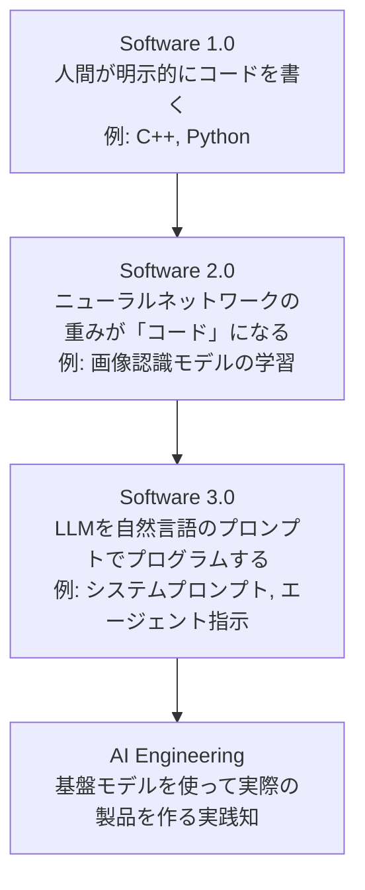
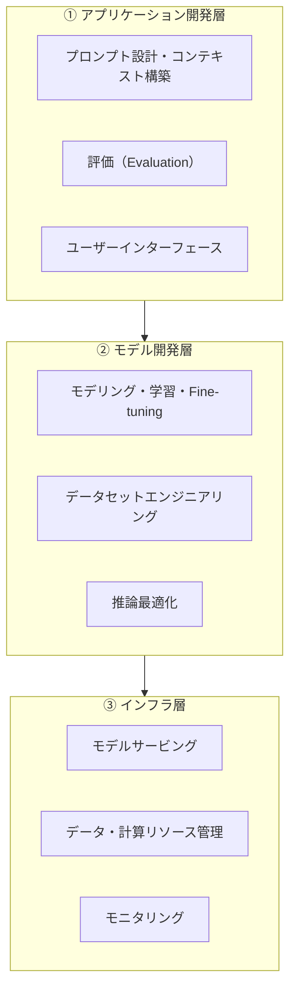
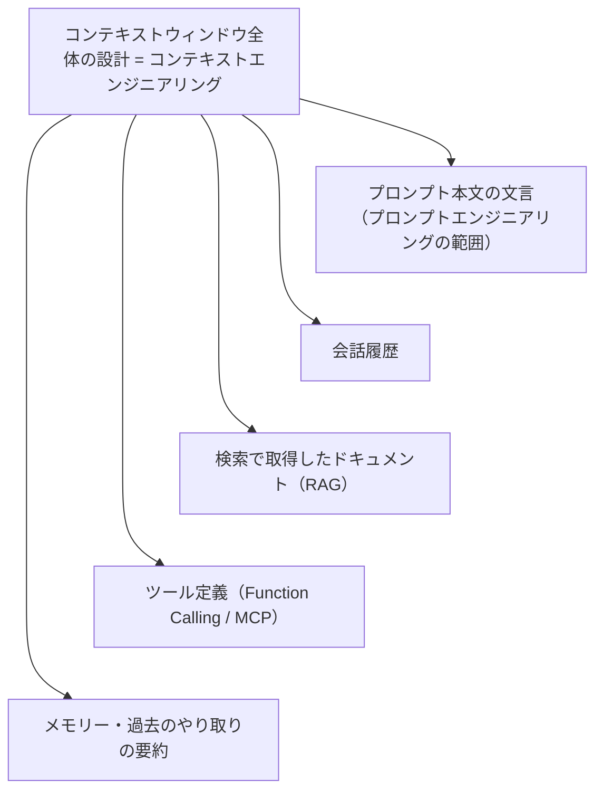
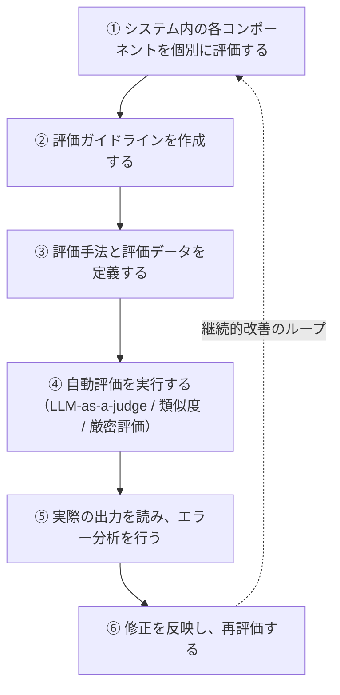
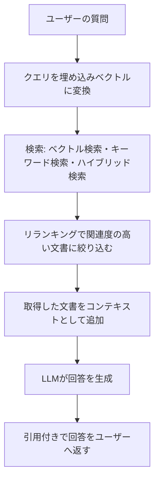
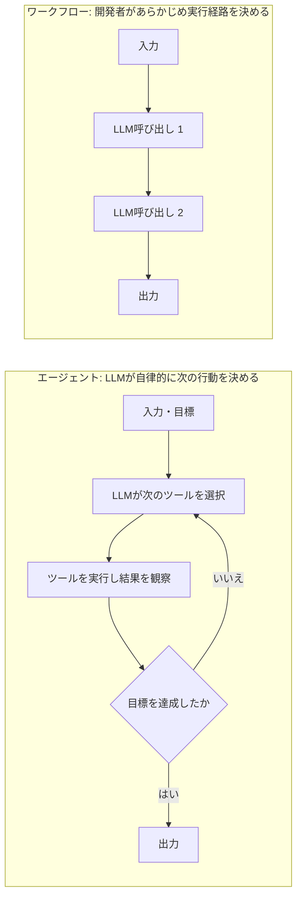
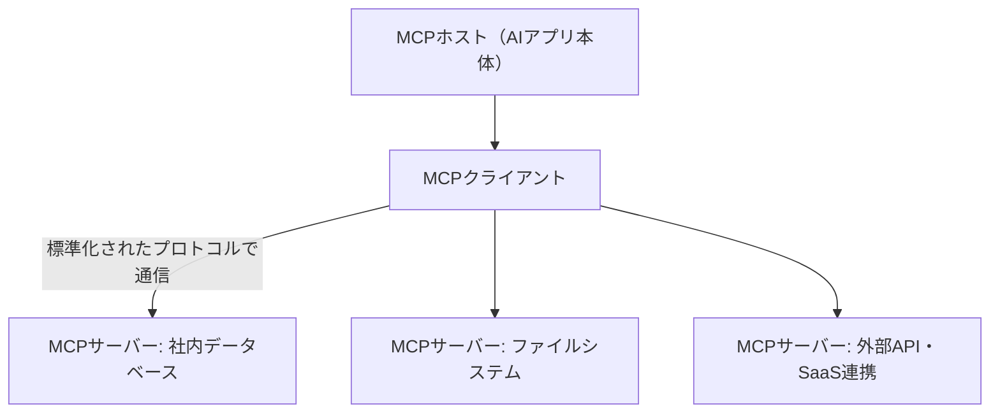
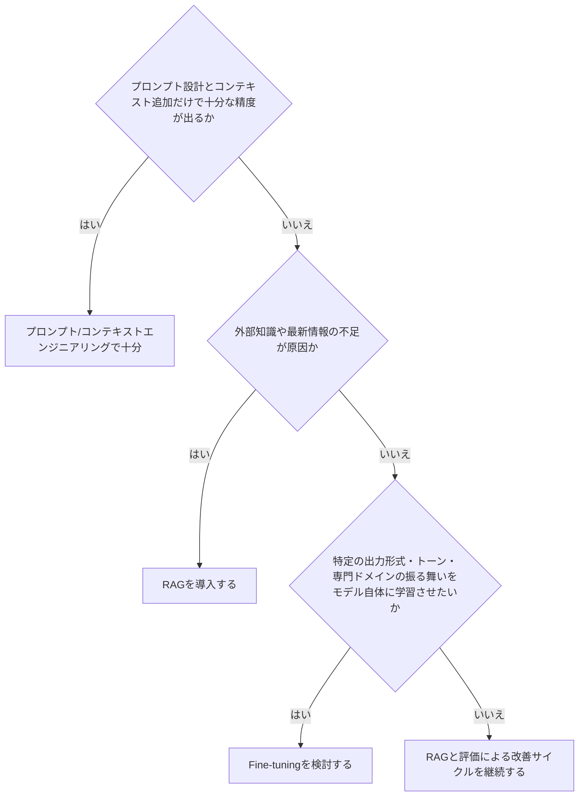
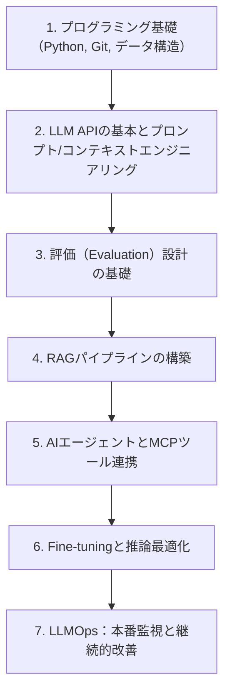

# AI Engineering 入門ガイド — 基盤モデル時代のソフトウェア開発を学ぶ

> 本ガイドは2026年9月9日時点のウェブ検索結果と、Chip Huyen著『AI Engineering』（O'Reilly, 2024年12月刊）の章構成を土台に、Andrej Karpathy、Shawn "swyx" Wang、Simon Willison、Hamel Husainなど、国際的に著名な開発者・エンジニアの発信内容を参照しながら、初学者向けにステップバイステップで再構成したものです。AI分野は変化が非常に速いため、実際に手を動かす際は巻末の「[参考文献・出典](#17-参考文献出典)」セクションに集約したURLから最新情報を確認してください。

## 目次

1. [はじめに — AI Engineeringとは何か](#1-はじめに--ai-engineeringとは何か)
2. [なぜ今、AI Engineeringなのか（歴史的背景）](#2-なぜ今ai-engineeringなのか歴史的背景)
3. [AI EngineeringとMLエンジニアリングの違い](#3-ai-engineeringとmlエンジニアリングの違い)
4. [AIエンジニアリングスタック：3つの層](#4-aiエンジニアリングスタック3つの層)
5. [Step 1 — Foundation Modelsの基礎を理解する](#5-step-1--foundation-modelsの基礎を理解する)
6. [Step 2 — プロンプトエンジニアリングからコンテキストエンジニアリングへ](#6-step-2--プロンプトエンジニアリングからコンテキストエンジニアリングへ)
7. [Step 3 — 評価（Evaluation）を設計する](#7-step-3--評価evaluationを設計する)
8. [Step 4 — RAG（検索拡張生成）で外部知識を活用する](#8-step-4--rag検索拡張生成で外部知識を活用する)
9. [Step 5 — AIエージェントを構築する](#9-step-5--aiエージェントを構築する)
10. [Step 6 — Model Context Protocol（MCP）でツールを繋ぐ](#10-step-6--model-context-protocolmcpでツールを繋ぐ)
11. [Step 7 — Fine-tuningが必要になる場面](#11-step-7--fine-tuningが必要になる場面)
12. [Step 8 — 推論最適化とコスト・レイテンシ管理](#12-step-8--推論最適化とコストレイテンシ管理)
13. [Step 9 — LLMOps：本番運用のオブザーバビリティ](#13-step-9--llmops本番運用のオブザーバビリティ)
14. [セキュリティと安全性](#14-セキュリティと安全性)
15. [AIエンジニアになるためのロードマップ](#15-aiエンジニアになるためのロードマップ)
16. [まとめ](#16-まとめ)
17. [参考文献・出典](#17-参考文献出典)

---

## 1. はじめに — AI Engineeringとは何か

AI Engineering（AIエンジニアリング）とは、ゼロからモデルを学習させるのではなく、**すでに公開されている基盤モデル（Foundation Model）を使ってアプリケーションを構築するプロセス**を指します。これはChip Huyenの著書『AI Engineering』での定義を土台とした説明で、GPT・Claude・Geminiのようなモデルを「材料」として捉え、それをどう組み合わせ、評価し、製品として届けるかに焦点を当てる新しい職種・スキルセットです。

以前は高度な機械学習の知識がなければAIを使った製品を作ることはできませんでした。しかし基盤モデルがAPIやオープンウェイトの形で誰でも使えるようになったことで、Web開発者やプロダクトエンジニアも「モデルを訓練する人」ではなく「モデルを使いこなして製品を作る人」としてAI開発に参加できるようになりました。これが数年で急速に確立された理由です。

この職種は2023年前後に体系化され始めました。開発者コミュニティ「Latent Space」および「AI Engineer」カンファレンスの創設者であるShawn "swyx" Wangは、2023年のエッセイ「The Rise of the AI Engineer」の中で、AIを使う技術者・AI製品を作る技術者・AIそのものがエンジニアリング作業を行うケースという3つの新しい役割を整理し、これが「AI Engineer」という職業名が広まる出発点になりました。

---

## 2. なぜ今、AI Engineeringなのか（歴史的背景）

OpenAIの創業メンバーであり元Tesla AI責任者でもあるAndrej Karpathyは、2025年6月にAIスタートアップスクール（サンフランシスコ）で行った講演「Software Is Changing (Again)」の中で、ソフトウェアの歴史を3つの世代に分けて説明しました。

- **Software 1.0**：人間が明示的にC++やPythonなどのコードを書く、従来型のプログラミング
- **Software 2.0**：ニューラルネットワークの重み（パラメータ）そのものが「コード」になり、データセットと最適化によって開発する形態
- **Software 3.0**：LLM（大規模言語モデル）を英語などの自然言語でプログラムする、新しい形態

Karpathyは、LLMを「新しい種類のコンピュータ」であり、プロンプトが新しい種類のプログラムであると位置づけ、現在はこのLLMという新しいコンピュータの計算コストがまだ高く中央集権的にクラウドで動いている点で、コンピュータ黎明期の1960年代に似た状況にあると述べています。AI Engineeringは、まさにこの「Software 3.0」を実務として動かすための工学的な実践知です。

さらに2025年半ば以降は、単発のプロンプトではなく「コンテキストウィンドウに何を入れるか」を体系的に設計する「コンテキストエンジニアリング（Context Engineering）」という考え方をKarpathyが用い、業界で急速に定着しました（詳細はStep 2で解説します）。

---

## 3. AI EngineeringとMLエンジニアリングの違い

Chip Huyenは著書の中で、AI EngineeringをMLエンジニアリング・フルスタックエンジニアリングと比較し、次のような違いを整理しています。

| 観点 | 従来のMLエンジニアリング | AI Engineering |
|---|---|---|
| 出発点 | 自社データを集め、モデルをゼロから設計・学習する | 既存の基盤モデルから始め、プロンプトやRAGで製品要件に適応させる |
| 主な作業 | モデルアーキテクチャ設計、学習パイプライン構築 | プロンプト設計、評価設計、コンテキスト構築、インターフェース開発 |
| 必要スキル | 統計・数理最適化・モデル理論の比重が高い | ソフトウェアエンジニアリング・プロダクト感覚の比重が高い |
| 開発サイクル | データ収集からモデル学習まで長期化しやすい | まずプロトタイプを作り、ユーザーの反応を見ながら段階的に高度化する |
| 評価の重み | 精度などの定量指標が中心 | オープンエンドな出力の評価（LLM-as-a-judgeなど）が中心で比重が非常に大きい |

Huyenは、参入障壁が下がったからこそ「誰でも始められるが、しっかりした評価と反復設計ができるチームだけが本番品質のAI製品を作れる」という点を強調しています。この視点は、Web開発者がAI Engineeringに参入しやすい理由であり、同時に評価（Evaluation）が本ガイドの中で繰り返し重視される理由でもあります。

---

## 4. AIエンジニアリングスタック：3つの層

Huyenは、AIアプリケーションのスタックを3つの層に整理しています。開発は基本的に上の層（アプリケーション開発層）から始め、必要に応じて下の層に降りていくという設計指針が示されています。

| 層 | 何をする層か | 代表的な技術要素 |
|---|---|---|
| ① アプリケーション開発層 | 既存モデルに良いプロンプトと必要なコンテキストを与え、厳密な評価を行い、良いUIを提供する | プロンプト/コンテキストエンジニアリング、RAG、エージェント、評価パイプライン |
| ② モデル開発層 | モデルそのものを開発・適応させるための層。データセントリックな作業が中心 | Fine-tuning、モデルマージ、データセット構築、推論最適化 |
| ③ インフラ層 | 実際にモデルを動かし続けるための基盤 | サービング、ゲートウェイ、計算資源管理、監視 |

多くのAIエンジニアは①のアプリケーション開発層でキャリアをスタートし、必要が生じたときだけ②③に踏み込みます。「まずプロンプトと評価で解決できないか」を常に最初に検討する、という考え方は本ガイド全体に共通する重要な指針です。

---

## 5. Step 1 — Foundation Modelsの基礎を理解する

基盤モデル（Foundation Model）は、大量のテキスト・画像・コードなどで事前学習された汎用モデルです。AIエンジニアが理解すべき基礎知識は次の通りです。

- **学習データ**：多言語対応やドメイン特化型モデルの性質は学習データによって大きく左右されます。
- **モデリングとポストトレーニング**：教師ありファインチューニング（SFT）や選好チューニング（RLHFなど）を経て、指示に従いやすい・安全な応答をするモデルへと調整されます。
- **サンプリング**：LLMは決定論的ではなく、確率分布から次のトークンをサンプリングして応答を生成する確率的なシステムです。temperatureなどのサンプリングパラメータで挙動が変わります。
- **構造化出力**：JSON Schemaなどを指定し、後続処理がしやすい形式で出力させる技術は、実務のAIエンジニアリングで非常に重要です。

Karpathyは、現在のLLMには「ジャギー・インテリジェンス（Jagged Intelligence）」と呼ばれる特徴があると指摘しています。これは、非常に高度な数学の問題を解ける一方で、単純な比較（例：9.11と9.9のどちらが大きいか）を間違えることがあるなど、能力にムラがある現象を指す表現です。この特性を理解した上で、モデルの得意・不得意を前提にシステムを設計することがAIエンジニアリングの出発点になります。

---

## 6. Step 2 — プロンプトエンジニアリングからコンテキストエンジニアリングへ

初学者が最初に触れる技術がプロンプトエンジニアリングです。明確で具体的な指示を書く、十分なコンテキストを与える、複雑なタスクをより単純なサブタスクに分解する、モデルに考える時間を与える（Chain-of-Thoughtなど）、といった基本テクニックはHuyenの著書でも整理されています。

一方で2025年半ば、Karpathyは「プロンプトエンジニアリング」よりも「コンテキストエンジニアリング（Context Engineering）」という言葉を好むと発信し、大きな反響を呼びました。彼の説明では、日常会話でのプロンプトは短いタスク説明を指すことが多いのに対し、実務レベルのLLMアプリケーションでは、次のステップのために「コンテキストウィンドウに適切な情報だけを詰め込む、繊細な技術と科学」が必要になるとされています。ShopifyのCEOであるTobi Lütkeも同様に、タスクをLLMが解決可能な形にするためにすべての文脈を提供する技術だと表現しており、この用語は業界に急速に定着しました。

つまりプロンプトエンジニアリングはコンテキストエンジニアリングの一部です。単発の質問応答であればプロンプト文言の工夫だけで十分ですが、複数ターンにわたるエージェントや、検索結果・ツール出力・会話履歴を組み合わせるアプリケーションでは、「何をコンテキストウィンドウに入れて、何を入れないか」を設計する視点が不可欠になります。

---

## 7. Step 3 — 評価（Evaluation）を設計する

Huyenは、AIの利用が広がるほど致命的な失敗の機会も増えるため、評価がAIエンジニアリングの中でも特に重要になると述べています。評価には複数のアプローチがあります。

| 評価手法 | 概要 | 向いている場面 |
|---|---|---|
| 厳密評価（Exact Evaluation） | 機能的正しさや参照データとの類似度を機械的に測定 | コード生成、構造化出力など正解が明確なタスク |
| 埋め込みベースの類似度評価 | 出力と参照回答の意味的な近さをベクトル距離で測定 | 要約や言い換えなど表現の自由度が高いタスク |
| AI as a Judge（LLM-as-a-judge） | 別のLLMに出力を採点・比較させる | オープンエンドな生成、大規模な自動評価が必要な場面 |
| 比較評価（Comparative Evaluation） | 複数モデル・複数プロンプトの出力を相対的にランキングする | モデル選定、プロンプトのA/Bテスト |

LLM-as-a-judgeは人手評価に比べて大幅に低コスト・高速に評価をスケールできる一方、既知のバイアスがあります。これらを体系的に測定した代表的な一次研究がZheng et al., "Judging LLM-as-a-Judge with MT-Bench and Chatbot Arena"（NeurIPS 2023 Datasets and Benchmarks, arXiv:2306.05685）で、同論文は ①提示順序を入れ替えると判定が変わる**位置バイアス（position bias）**、②長い出力を過大評価する**冗長性バイアス（verbosity bias）**、③判定側と同系統のモデルの出力を優遇する**自己贔屓バイアス（self-enhancement bias）**を、実験によって定量的に報告しています。

ただし、これらのバイアスの大きさは**タスクの種類・判定に使うモデル・プロンプトの書き方によって変動する**ため、論文の数値をそのまま自社システムに当てはめることはできません。自動評価だけに依存せず、人間によるスポットチェックと組み合わせ、自社データで判定器そのものを検証することが推奨されます。

AI評価の専門家であるHamel Husainは、多くのチームが評価に取り組む際、いきなり汎用的な自動指標やダッシュボードを整えようとして失敗すると指摘しています。彼は、実際のプロダクトのアウトプットを人間が丁寧に読み込む「エラー分析」から始め、そこで見つかった具体的な失敗パターンをもとに評価基準を作るべきだと主張しています。この考え方は「まずデータを見る」というデータサイエンスの基本に立ち返るものとして、AI評価コミュニティで広く支持されています。

---

## 8. Step 4 — RAG（検索拡張生成）で外部知識を活用する

RAG（Retrieval-Augmented Generation）は、モデルの学習データにない私的な情報や最新情報をもとに回答させるための最も基本的で広く使われている手法です。単純なベクトル検索だけの「素朴なRAG（Naive RAG）」は本番環境で検索精度が不足しやすく、誤った文書に基づく回答が相当な割合で発生すると各所で報告されています（ベンダーやコミュニティの解説記事では「4割前後」といった数字も挙げられますが、評価条件や対象コーパスが明示されない報告例が多く、一次ベンチマークとして扱うべきではありません）。重要なのは数値そのものではなく、**自社のコーパスと実際の質問セットで検索の Recall / Precision を測り、そこを起点に改善する**という進め方です。

2026年時点でよく整理されているRAGの発展形は以下の通りです。

| 種類 | 特徴 | 適した場面 |
|---|---|---|
| Naive RAG | ベクトル検索のみで上位k件を取得して渡す | プロトタイプ・単一文書内で答えが完結する質問 |
| Advanced RAG | ハイブリッド検索（密ベクトル＋BM25）＋リランカー＋クエリ変換 | 2〜3件の文書を横断する質問 |
| GraphRAG | 知識グラフを用い、エンティティ間の関係性をたどって検索する | 関係性を問う質問（人物間のつながり等） |
| Agentic RAG | エージェントが検索の要否・検索対象・粒度を自律的に判断する | 複数ステップの推論が必要な複雑な質問 |
| Adaptive RAG | クエリの複雑さに応じて上記のパイプラインを動的に切り替える | 質問の種類が多岐にわたる汎用アシスタント |

チャンク分割については、300〜500トークン程度・10〜15%程度のオーバーラップを持たせる再帰的チャンキングが「まず試す初期値の例」として広く紹介されています（多くのユースケースをこれでカバーできるという解説もありますが、公開された統一ベンチマークに基づく数字ではありません）。実務では、この初期値のまま固定せず、代表的な質問と正解文書のペアを50〜100件用意して Recall@k などを実測し、結果に応じてチャンクサイズ・オーバーラップ・分割単位（見出し単位／文単位）を調整してください。またチャンクには元文書名・見出し・親チャンクIDなどのメタデータを必ず付与し、引用や階層的な検索を可能にすることが推奨されています。

なお、Gemini 2.5やGPT-4.1のように100万トークン級の長いコンテキストウィンドウを持つモデルが普及したことで、「知識ベース全体をそのままコンテキストに入れる（フルコンテキスト方式）」という選択肢が現実的になりました。フルコンテキスト方式とRAGのどちらを採るかは、**知識ベースの総トークン数・コスト・プロンプトキャッシュの利用可否・モデルのコンテキスト長・検索品質**を見て決めるべきで、どちらかが常に既定というわけではありません。どの程度の規模までフルコンテキスト方式が現実的かは、対象モデルの入力トークン上限、1リクエストあたりに確保したい出力トークン予算、許容できるコストとレイテンシによって変わるため、固定的な閾値はありません。知識ベース全体が対象モデルの入力上限に無理なく収まり更新頻度も低いのであれば、検索パイプラインを持たないフルコンテキスト方式のほうが構成が単純で、検索漏れが原理的に起きないという利点があります。ただし検索漏れが起きないことは回答精度を保証しません。長いコンテキストでは中間に埋もれた情報の再現率が落ちる現象（lost in the middle）が知られており、文脈が長くなるほど品質が下がることもあります。したがって方式の選択は思い込みではなく、自社の代表的な質問セットを用いて実測したうえで決めてください。その際、検索の指標は両方式で意味が異なる点に注意が必要です。RAGでは検索器が正解文書を上位k件に含められたかを Recall@k で測定しますが、フルコンテキスト方式には検索段階そのものが存在しないため、代わりに「正解情報がそもそも入力コンテキストに含まれていたか」という入力被覆率を測定します。そのうえで、両方式の回答品質・コスト・レイテンシを横並びで比較してください。知識ベースが入力上限を大きく超える、リクエストごとに長大なコンテキストを送るコスト・レイテンシが見合わない、といった条件ではRAGが有利になります。

---

## 9. Step 5 — AIエージェントを構築する

「エージェント」という言葉は文脈によって定義が揺れやすい用語ですが、Anthropicはブログ記事「Building Effective Agents」の中で、開発者があらかじめ経路を決める**ワークフロー**と、LLM自身が次に取るべき行動を動的に決定する**エージェント**を明確に区別しています。

Anthropicは、LLMアプリケーションを構築する際にはまず最もシンプルな解決策を探すべきであり、複雑さは本当に必要な場合にのみ追加すべきだと明言しています。エージェント的な仕組みは柔軟性と引き換えにレイテンシとコストが増加するため、その代表的な構成要素として次のようなワークフローパターンが紹介されています。

| パターン名 | 概要 |
|---|---|
| プロンプトチェイニング | タスクを複数の逐次的なLLM呼び出しに分割し、各段階でプログラム的なチェックを挟む |
| ルーティング | 入力内容を分類し、専用のプロンプトやモデルに振り分ける |
| 並列化 | 複数のLLM呼び出しを同時に実行し、結果を集約する（投票や分業） |
| オーケストレーター・ワーカー | 中心となるLLMがタスクを動的に分解し、複数のワーカーLLMに割り振る |
| 評価者・最適化者（Evaluator-Optimizer） | 一方のLLMが生成し、もう一方が評価とフィードバックを行うループを繰り返す |
| 自律エージェント | 環境からのフィードバックをもとに、LLMがツール利用のループを自律的に回す |

Anthropicは、フレームワークを使う場合でも、内部で何が起きているかを正確に理解しておくべきだと強調しています。抽象化レイヤーの裏側の挙動を誤解していることが、実務でのトラブルの一般的な原因になるためです。

---

## 10. Step 6 — Model Context Protocol（MCP）でツールを繋ぐ

エージェントが実際に価値を発揮するには、外部のデータやツールに接続できる必要があります。この接続を標準化するためにAnthropicが2024年11月に公開したオープン規格が**Model Context Protocol（MCP）**です。

MCPが登場する以前は、AIをそれぞれの外部サービスに接続するために毎回個別の統合コードを書く必要がありました。MCPは、クライアント（AIアプリ側）とサーバー（ツール側）の間の双方向のやり取り——ツールの一覧取得と呼び出し、リソースやプロンプトの提供、サーバーからクライアントへのサンプリング要求や通知——を単一のプロトコルとして定義しています。ツール側がMCPサーバーとして機能を公開しておけば、MCPに対応したクライアントは、認証・権限付与・トランスポート設定といった接続条件を満たしたうえで、その機能を共通の方法で利用できます。サービスごとに個別の統合コードを書き直す必要がなくなる点が評価されています。

2026年時点でMCPは急速に業界標準化が進んでいます。普及規模については、2025年12月9日のMCP公式（Anthropic）による発表が、月間SDKダウンロード数9,700万超・**アクティブなMCPサーバー**1万超という数字を示しています（いずれも同発表時点の値であり、測定方法は公表元の定義に依存します）。同じく2025年12月9日にAnthropicがMCPをLinux Foundation傘下の新団体「Agentic AI Foundation（AAIF）」に寄贈し、Block・OpenAIが共同創設メンバーとして、AWS・Google・Microsoft・Cloudflareなどがプラチナメンバーとして参加したことで、単一企業の技術から業界横断のオープンスタンダードへと移行しました。ChatGPT・Cursor・Gemini・Microsoft Copilot・VS Codeなど主要なAI開発ツールがMCPをサポートしています。

一方で、急速な普及によってセキュリティの検証が追いついていない領域もあり、2025〜2026年にかけて**個々のMCPサーバー実装（特定のプロダクト・特定バージョン）における脆弱性**が複数報告されています。これらはMCPというプロトコル仕様そのものの欠陥ではなく、あくまで実装側の問題として報告されたものです。導入するMCPサーバーを選定する際は、対象実装ごとにCVE/GHSAなどのアドバイザリと修正版の有無を個別に確認してください。エンタープライズ導入では、まず読み取り専用の連携（レポート閲覧・ナレッジ検索など）から始め、書き込みを伴う操作（CRMの更新や送信など）には人間の承認ステップを挟むという段階的な導入が推奨されています。

---

## 11. Step 7 — Fine-tuningが必要になる場面

Fine-tuning（追加学習）はAIエンジニアリングの中でもコストと専門性の要求が高い手法であり、Huyenの著書でも「まず本当に必要かどうかを見極める」ことが強調されています。次の判断フローは、Huyenのアプリケーション開発層優先の考え方と、Anthropicの「複雑さは必要な場合にのみ追加する」という指針を統合したものです。

Fine-tuningを検討する際は、LoRAなどのパラメータ効率的ファインチューニング（PEFT）技術を使うことでメモリと計算コストを抑えられます。また、RAGとFine-tuningは競合する手法ではなく、「知識の注入」はRAGで、「振る舞い・形式の調整」はFine-tuningで、と役割分担して併用されるケースも一般的です。

---

## 12. Step 8 — 推論最適化とコスト・レイテンシ管理

モデルを選んで動かし始めると、次に直面するのがコストとレイテンシの最適化です。代表的な指標と手法は次の通りです。

- **推論パフォーマンス指標**：初回トークンまでの時間（TTFT）、トークン生成速度、スループットなどをモニタリングします。
- **量子化（Quantization）**：モデルの重みを低精度で表現し、メモリ使用量と推論速度を改善します。モデルの層ごとに異なる量子化戦略を組み合わせ、ベンチマーク品質を保ちながらスループットを改善できたという報告例もあります（改善幅はモデル・ハードウェア・バッチ設定に依存するため、自環境でのベンチマークが必須です）。
- **モデルルーティング**：簡単なタスクは軽量・低コストなモデルに、難しいタスクは高性能モデルに振り分けるゲートウェイを導入し、コストと品質のバランスを取ります。
- **キャッシュ**：頻出する質問や共通のプロンプトプレフィックスをキャッシュし、レイテンシとコストを削減します。

なお、ここで挙げたルーティングやキャッシュを「段階的な拡張ステップ」としてまとめた整理をAnthropicに帰属させている解説を見かけますが、Anthropicの一次資料である「Building Effective Agents」が実際に扱っているのは、検索・ツール・メモリを付加した**拡張LLM（augmented LLM）**を基本構成要素とし、そこからプロンプトチェイニング・ルーティング・並列化・オーケストレーター-ワーカー・評価者-最適化者といったワークフローパターン、さらに自律的なエージェントへと段階的に複雑さを上げていく、という設計指針までです（モデルゲートウェイや推論キャッシュの導入手順は同記事の対象外です）。上記のルーティング・キャッシュ・量子化は業界一般の推論最適化手法として捉え、根底にある「まずシンプルに始め、必要な場合にのみ複雑さを足す」という原則のみをAnthropicの主張として引用してください。

---

## 13. Step 9 — LLMOps：本番運用のオブザーバビリティ

LLMを使ったアプリケーションは、従来のソフトウェアと違い「エラーコードを返さずに、もっともらしく誤った回答をする」という特有の失敗モードを持ちます。そのため専用の観測（オブザーバビリティ）基盤が必要になります。2026年時点で広く比較・利用されている主なツールは次の通りです。

| ツール | 特徴 |
|---|---|
| LangSmith | LangChain/LangGraphとの統合が深く、トレース可視化とアノテーションキューが強力。LangChain中心のチームに向く |
| Langfuse | コアがMITライセンスのオープンソースで、セルフホストすればトレースを自社インフラ内で管理しやすい（テレメトリ・保持期間・バックアップは運用者側の管理責任。データ保持ポリシー等の一部機能はEnterprise Editionが必要）。トレーシングとプロンプトのバージョン管理を両立 |
| Arize Phoenix | RAGのデバッグや大規模なML計測に強く、エンタープライズのML運用と親和性が高い |
| Helicone / Portkey | プロキシ型でコスト・ルーティングの可視化を素早く導入できる |
| Datadog LLM Observability | 既存のDatadog導入企業向けに、インフラ監視とLLM監視を一体運用できる |

一般的な推奨構成としては、リクエストごとにLLM呼び出し・検索ステップ・ツール呼び出し・エージェントの意思決定分岐までを追跡する分散トレーシングを導入し、レイテンシやコストといった定量指標に加えて、忠実性（Faithfulness）や有害性などの品質指標をLLM-as-a-judgeや人間のフィードバックで継続的に測定する、という2層構成が挙げられています。これは従来のAPM（アプリケーションパフォーマンス監視）だけでは「意味的に間違っている」出力を検知できないためです。

ただしトレースと監査ログは、プロンプト・検索結果・ツール引数といった「本来ログに残すべきでないデータ」がそのまま蓄積されやすい場所でもあるため、機密データの取り扱い方針を設計時点で決めておく必要があります。

- **記録内容のマスキング／許可リスト化**: ユーザー入力・取得文書・ツール引数に含まれるPII（氏名、メールアドレス、電話番号、住所など）や秘密情報は、記録前にマスキングするか、記録してよいフィールドだけを列挙する許可リスト方式にする。全文をそのまま保存する既定設定を無批判に使わない
- **認証情報を記録しない**: `Authorization` ヘッダー、`Cookie`、APIキー、アクセストークンはトレース・監査ログのいずれにも記録しない。SDKやプロキシ型ツールが既定でヘッダー全体を送信する場合は、除外設定を明示的に入れる
- **アクセス制御**: トレース閲覧権限はロールベースで最小権限に絞り、誰がいつ閲覧したかを別途監査可能にする。本番のトレースを開発環境や外部SaaSへ無制限に複製しない
- **保持期間と削除手段**: トレース・監査ログごとに保持期間を定め、期限到来時に自動削除されるようにする。あわせて、削除請求（GDPRの消去権など）に応じて特定ユーザーのレコードを検索・削除できる手段をあらかじめ用意しておく

---

## 14. セキュリティと安全性

Django共同開発者であり、"prompt injection"という用語を広めたことで知られるSimon Willison（同語はhimbodhisattvaによる先行使用も指摘されています）は、AIエージェントが持つ本質的なリスクを「**Lethal Trifecta（致死の三要素）**」という概念で説明しています。これは、(1) 私的なデータへのアクセスを持つこと、(2) 信頼できないコンテンツにさらされること（プロンプトインジェクションの入口）、(3) 外部へ通信できる能力を持つこと（データを持ち出せる経路）、という3条件が同時に揃ったときに、攻撃者が機密データを外部へ流出させられるという枠組みです。自律性や影響のある操作の可否はリスクを増幅させますが、この三要素の定義には含まれません。Willisonは、LLMは指示に従うようにできているがゆえに「本質的に騙されやすい」性質を持ち、これは修正すべきバグではなくLLMという技術の特性そのものだと述べ、エージェントを実行する際にはサンドボックス化などで行動範囲を制限することを推奨しています。

AIエンジニアリングにおける実務的なセキュリティ対策は以下の通りです。

- **防御的プロンプト設計**：システムプロンプトの漏えい対策や、ユーザー入力とシステム指示を明確に分離する。
- **ガードレール**：出力内容のフィルタリング、危険なツール呼び出しの検知、機密操作前の人間による承認ステップの導入。
- **最小権限の原則**：エージェントやMCPサーバーに与えるツールの権限を必要最小限に絞る。
- **監査ログ**：誰が・いつ・どのツールを・どういう入力で呼び出したかを追跡できるようにする。

---

## 15. AIエンジニアになるためのロードマップ

2026年時点で複数の教育系メディアが紹介しているAIエンジニア育成ロードマップを統合すると、おおむね次のような順序が共通して推奨されています。

いくつかのロードマップ記事では、この過程をおおむね8〜12ヶ月程度で踏破できる目安として紹介していますが、実際の期間は既存のプログラミング経験や学習に割ける時間によって大きく変わります。共通して強調されている点は次の3つです。

- 最新のモデルやフレームワークを追いかける前に、Python・Git・ソフトウェア工学の基礎を固めること。
- 学習の早い段階から「評価」を意識し、成功の定義を先に決めてから開発を始めること。
- 学位や資格よりも、実際にデプロイされ動いているプロジェクトのポートフォリオが評価されやすいこと。

---

## 16. まとめ

AI Engineeringは、基盤モデルという強力な「素材」を、プロンプト・コンテキスト・評価・RAG・エージェント・MCP・Fine-tuning・推論最適化・LLMOpsという一連の工学的なレイヤーを通じて、実際に信頼できる製品へと組み上げていく実践的な分野です。Chip Huyenが示す「まずアプリケーション開発層で解決できないかを考え、必要な場合にのみモデル開発層・インフラ層に踏み込む」という指針と、Anthropicが示す「複雑さは必要な場合にのみ追加する」という指針は共通しており、これはこの分野全体を貫く基本姿勢だと言えます。

同時に、Karpathyが指摘する「ジャギー・インテリジェンス」やWillisonが指摘する「Lethal Trifecta」が示すように、LLMは強力である一方で予測しづらく騙されやすい性質を持つ技術でもあります。だからこそ、評価とセキュリティ設計を後回しにせず、最初から開発プロセスに組み込むことが、AIエンジニアとして製品を安全に届けるための鍵になります。

---

## 17. 参考文献・出典

本ガイドの作成にあたり、2026年9月9日時点で参照した主な情報源は以下の通りです。

**基盤となる書籍**
- Chip Huyen, "AI Engineering"（O'Reilly, 2024年12月）— https://www.oreilly.com/library/view/ai-engineering/9781098166298/
- Gergely Orosz & Chip Huyen, "The AI Engineering Stack"（The Pragmatic Engineer）— https://newsletter.pragmaticengineer.com/p/the-ai-engineering-stack

**ソフトウェアの世代交代とコンテキストエンジニアリング（Andrej Karpathy）**
- "Andrej Karpathy on Software 3.0: Software in the Age of AI"（Latent Space）— https://www.latent.space/p/s3
- "Talk: Andrej Karpathy: Software Is Changing (Again)"（ikyle.me）— https://ikyle.me/blog/2025/andrej-karpathy-software-is-changing-again
- Andrej Karpathy, X（旧Twitter）投稿「コンテキストエンジニアリング」について — https://x.com/karpathy/status/1937902205765607626
- "Context Engineering Vs Prompt Engineering: The Real Difference"（NextAgile）— https://nextagile.ai/blogs/gen-ai/context-engineering-vs-prompt-engineering/

**AI Engineerという職種の起源（swyx / Latent Space）**
- swyxプロフィール（AI Engineerカンファレンス）— https://ai.engineer/speakers/swyx
- Latent Space About ページ — https://www.latent.space/about

**エージェントとワークフロー（Anthropic）**
- Anthropic, "Building Effective Agents" — https://www.anthropic.com/engineering/building-effective-agents

**評価（LLM-as-a-judge・Hamel Husain）**
- Lianmin Zheng et al., "Judging LLM-as-a-Judge with MT-Bench and Chatbot Arena"（NeurIPS 2023 Datasets and Benchmarks Track）— https://arxiv.org/abs/2306.05685 ※位置バイアス・冗長性バイアス・自己贔屓バイアスの一次出典
- Hamel Husain, "AI Evals: Everything You Need to Know" — https://hamel.dev/blog/posts/evals-faq/
- Hamel Husain & Shreya Shankar, "Evals Skills for Coding Agents" — https://hamel.dev/blog/posts/evals-skills/
- "LLM as a Judge: A 2026 Guide to Automated Model Assessment"（Label Your Data）— https://labelyourdata.com/articles/llm-as-a-judge

**セキュリティ（Simon Willison）**
- "Simon Willison on Agentic Engineering: TDD, Prompt Injection, and the Lethal Trifecta"（Agent Wars）— https://agent-wars.com/news/2026-03-14-simon-willison-agentic-engineering-tdd-prompt-injection
- Simon Willisonのブログ紹介（tomrochette.com）— https://tomrochette.com/agents/simon-willison/

**Model Context Protocol（MCP）**
- MCP公式サイト（仕様・SDK・サーバー一覧）— https://modelcontextprotocol.io/
- Anthropic ニュースルーム（2025年12月9日のAgentic AI Foundation寄贈発表およびエコシステム統計の一次出典）— https://www.anthropic.com/news
- "The MCP Ecosystem in 2026"（ChatForest）— https://chatforest.com/guides/mcp-ecosystem-2026-state-of-the-standard/
- "MCP in 2026: The Universal Connector for AI Agents"（Raulji Technologies）— https://www.rauljitechnologies.com/blog/mcp-model-context-protocol-2026/
- "MCP Adoption Statistics 2026"（Digital Applied）— https://www.digitalapplied.com/blog/mcp-adoption-statistics-2026-model-context-protocol

**RAG**
- "RAG Architecture Guide 2026"（jobsbyculture.com）— https://jobsbyculture.com/blog/rag-architecture-guide-2026
- "RAG Production Guide 2026"（Lushbinary）— https://lushbinary.com/blog/rag-retrieval-augmented-generation-production-guide/
- "RAG Techniques Compared: A Practical Guide to Retrieval Augmented Generation in 2026"（Starmorph）— https://blog.starmorph.com/blog/rag-techniques-compared-best-practices-guide

**LLMOps・オブザーバビリティ**
- "Top LLM Observability Tools in 2026: A Pro Guide"（MLflow）— https://mlflow.org/articles/top-llm-observability-tools-in-2026-a-pro-guide/
- "Best LLM Observability Tools of 2026"（Firecrawl）— https://www.firecrawl.dev/blog/best-llm-observability-tools

**キャリアロードマップ**
- "How to Become an AI Engineer in 2026 (A Complete Roadmap)"（Dataquest）— https://www.dataquest.io/blog/ai-engineer-roadmap/
- "AI Engineer Roadmap 2026: From LLM APIs to Production"（dataskew.io）— https://dataskew.io/roadmaps/ai-engineering/
- "How to Become an AI Engineer in 2026: A Self-Study Roadmap"（KDnuggets）— https://www.kdnuggets.com/how-to-become-an-ai-engineer-in-2026-a-self-study-roadmap

> ⚠️ AI分野の情報は非常に速く更新されます。特にツールの比較表やロードマップの期間感、MCPのエコシステム統計などは執筆時点（2026年9月9日）のスナップショットです。実践に移す前に、必ず一次情報（各社公式ドキュメントやブログ）を直接確認してください。
