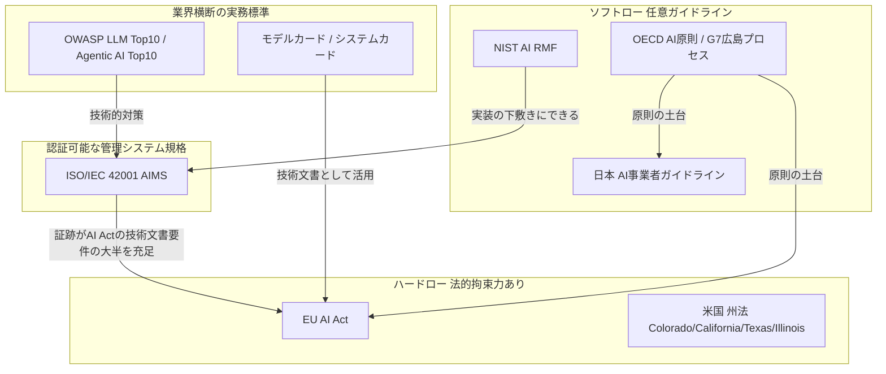
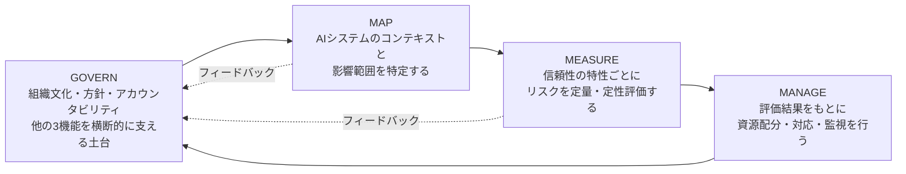
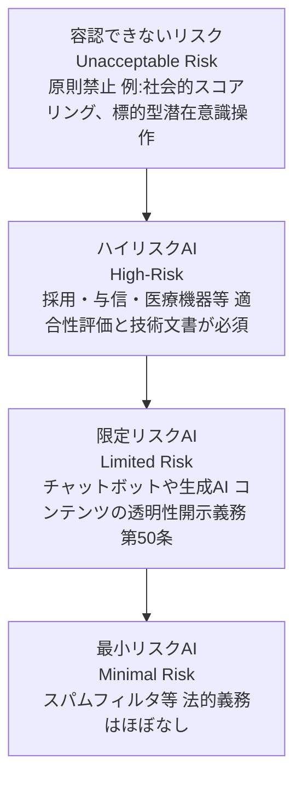
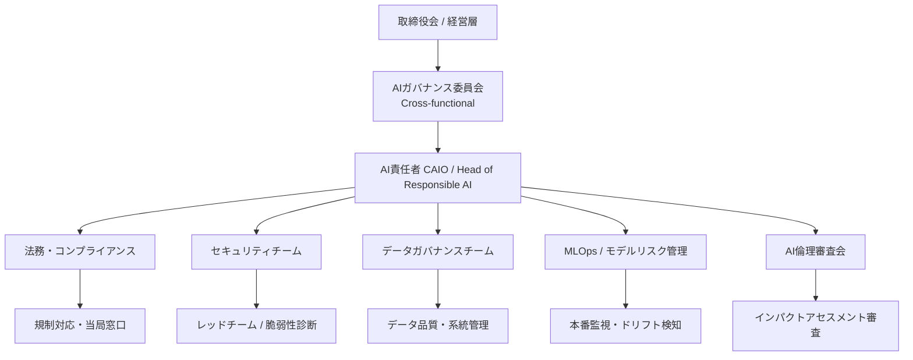
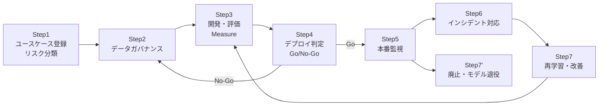
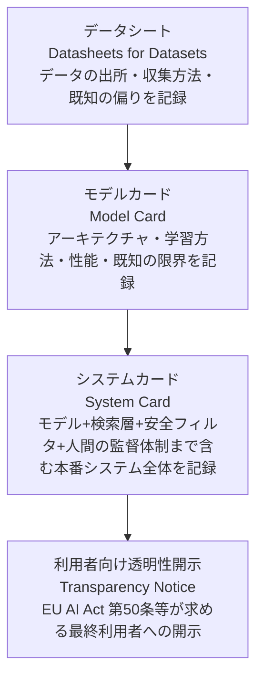
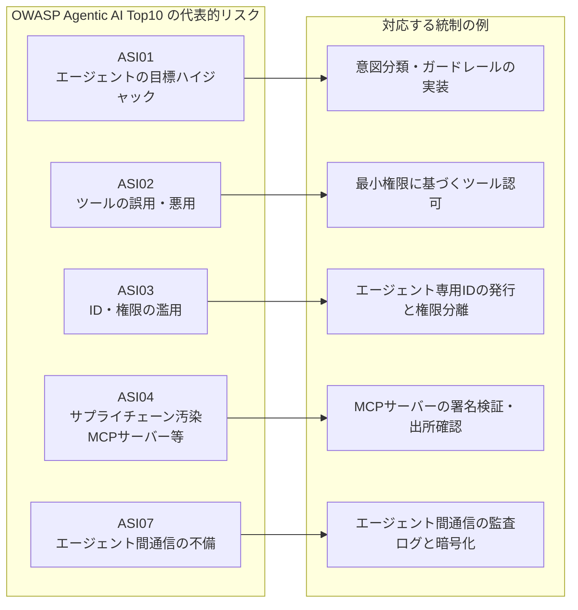
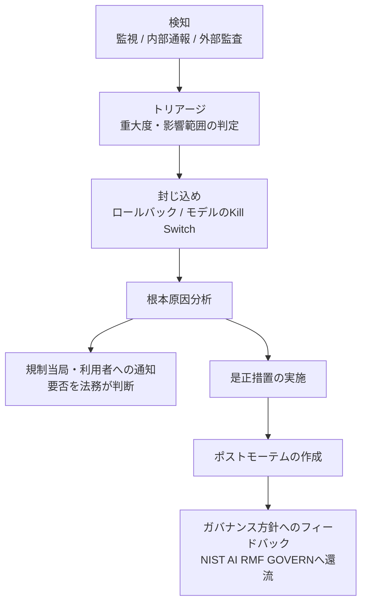
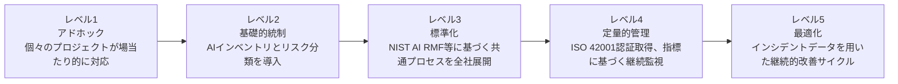

# AIガバナンス実践ガイド ― 中級〜上級エンジニアのためのベストプラクティス

> 最終更新の基準日: 2026年7月14日
> 対象読者: AI/MLシステムの設計・開発・運用に携わるエンジニア、QAエンジニア、プロダクトマネージャー、コンプライアンス担当者
> 免責事項: 本ガイドは技術的・実務的な整理を目的とした情報提供であり、法的助言ではありません。各国・各地域の規制は頻繁に改定されるため、実際の適用にあたっては最新の一次情報および弁護士・専門家の確認を必ず行ってください。

---

## 目次

1. [AIガバナンスとは何か](#1-aiガバナンスとは何か)
2. [AIガバナンスの全体地図](#2-aiガバナンスの全体地図)
3. [グローバル規制・フレームワークの詳解](#3-グローバル規制フレームワークの詳解)
4. [フレームワーク比較と実務上のマッピング](#4-フレームワーク比較と実務上のマッピング)
5. [組織体制とアカウンタビリティ](#5-組織体制とアカウンタビリティ)
6. [AIライフサイクル全体のガバナンス実装](#6-aiライフサイクル全体のガバナンス実装ステップバイステップ)
7. [ドキュメンテーション実務](#7-ドキュメンテーション実務)
8. [生成AI・エージェント型AI特有のガバナンス](#8-生成aiエージェント型ai特有のガバナンス)
9. [サードパーティ・ベンダーAIリスク管理](#9-サードパーティベンダーaiリスク管理)
10. [監査とアシュアランス](#10-監査とアシュアランス)
11. [成熟度モデルとロードマップ](#11-成熟度モデルとロードマップ)
12. [実践チェックリスト](#12-実践チェックリスト)
13. [参考文献・参照URL一覧](#13-参考文献参照url一覧)

---

## 1. AIガバナンスとは何か

AIガバナンスとは、組織がAIシステムを企画・開発・調達・運用・廃止する全ライフサイクルにわたって、リスクを許容可能な水準に抑えつつ、価値創出とイノベーションを両立させるための「方針・体制・プロセス・統制」の総体を指します。従来のITガバナンスやデータガバナンスと重なる部分は多いものの、AI特有の以下の性質が、独自のガバナンス設計を必要とする理由になっています。

- **確率的な振る舞い**: 同じ入力でも文脈や乱数シードによって出力が変わりうる。
- **学習データ由来のバイアス**: モデルの品質は学習データの質と代表性に強く依存する。
- **説明可能性の限界**: 深層学習モデルの意思決定根拠は完全には人間が追跡できないことが多い。
- **継続的なドリフト**: デプロイ後も入力分布や社会環境の変化によって性能が劣化しうる。
- **自律性の高まり**: エージェント型AIはツールを呼び出し、複数ステップの行動を自律的に実行する。

これらの性質により、AIガバナンスは「一度作って終わり」の静的な統制ではなく、GOVERN → MAP → MEASURE → MANAGE のように継続的に回すループとして設計する必要があります。

---

## 2. AIガバナンスの全体地図

まず、代表的な規制・標準・ソフトローがどのように関係し合っているかを俯瞰します。

ポイントは、**ハードロー（EU AI Act、米国州法）は「何を満たさなければならないか」を定め、ソフトロー（NIST AI RMF、日本のガイドライン、OECD原則）は「どう実装するか」の実務的な指針を与え、ISO/IEC 42001は第三者認証によって「実装している証拠」を外部に示す手段になる**という役割分担です。多くの企業は、NIST AI RMFやOWASPの実務ガイドを土台に社内統制を作り、その証跡をISO 42001の管理システムに載せ、EU AI Actなど個別法規の要求事項にマッピングする、という三層構造で運用しています。

---

## 3. グローバル規制・フレームワークの詳解

### 3.1 NIST AI RMF(米国国立標準技術研究所 AIリスクマネジメントフレームワーク)

NIST AI RMF 1.0は2023年1月26日に公開された、AIリスクを識別・評価・管理するための自主的な(voluntary)フレームワークです。240以上の組織が参加した公開プロセスを経て策定され、法的な強制力はありませんが、米国では事実上のデファクトスタンダードとして訴訟や調達要件で参照される場面が増えています。

コアは4つの機能から構成されます。

- **GOVERN**: リスク許容度の設定、役割分担、AIガバナンス委員会の設立など、他の3機能が機能するための組織的な土台。
- **MAP**: AIシステムの目的、利用者、想定される影響を文書化し、デプロイの可否を判断する初期材料を揃える。
- **MEASURE**: 妥当性・安全性・セキュリティ耐性・説明可能性・プライバシー・公平性という信頼性特性ごとにテストと評価を行う。
- **MANAGE**: 残存リスクの文書化、インシデント対応計画、モデル退役手続きなど、継続的な改善サイクルを回す。

2024年には生成AI特有のリスクに対応する**NIST AI 600-1(Generative AI Profile)**が追加され、12のリスクカテゴリと200以上のアクションがGOVERN/MAP/MEASURE/MANAGEにマッピングされました。また2026年4月7日には、重要インフラ事業者向けの**AI RMFプロファイル(Critical Infrastructure)**のコンセプトノートが公開されており、AI RMF自体も改訂作業が進行中です。NIST AI RMFは認証制度ではないため、自己評価とCurrent/Target Profileの文書化によって実装状況を示すのが一般的です。

参照URL:
- https://www.nist.gov/itl/ai-risk-management-framework
- https://airc.nist.gov/airmf-resources/airmf/
- https://airc.nist.gov/airmf-resources/airmf/5-sec-core/
- https://airc.nist.gov/airmf-resources/playbook/

### 3.2 ISO/IEC 42001:2023(AIマネジメントシステム, AIMS)

ISO/IEC 42001は2023年12月に発行された、世界初のAIマネジメントシステム(AIMS)に関する国際規格です。ISO 9001(品質)やISO 27001(情報セキュリティ)と同じくPlan-Do-Check-Actサイクルに基づくType-A規格であり、第三者認証機関(BSI、A-LIGN、Schellman、DNV、Bureau Veritasなど)による認証取得が可能です。AWS(2024年11月に主要クラウドで初認証取得)、Microsoft、Anthropicなど大手プロバイダーがすでに認証を取得しています。

認証範囲には約38〜39項目のAnnex A統制が含まれ、AIシステムのライフサイクル全体にわたるリスク評価、影響評価、データガバナンス、第三者関係の管理などをカバーします。関連規格として、AI固有のリスクマネジメントを詳述する**ISO/IEC 23894**、用語を定義する**ISO/IEC 22989**、インパクトアセスメントを扱う**ISO/IEC 42005**があり、いずれも単独では認証不可ですが実装を補強します。

認証取得の一般的な所要期間は4〜9か月、費用は2万〜6万米ドル程度とされ、すでにISO 27001を保有している組織はより短期間で移行できます。ISO 42001はEU AI Actを直接的に代替するものではありませんが、実装内容がハイリスクAIシステムの技術文書要件の相当部分(業界推定でおよそ7割程度)をカバーするため、規制対応の近道として位置づけられています。

参照URL:
- https://www.iso.org/standard/42001
- https://learn.microsoft.com/en-us/compliance/regulatory/offering-iso-42001
- https://www.bsigroup.com/en-US/products-and-services/standards/iso-42001-ai-management-system/
- https://www.konfirmity.com/blog/iso-42001
- https://www.examcert.app/blog/iso-42001-ai-management-certification-2026/

### 3.3 EU AI Act(欧州連合AI規則)

EU AI Actは2024年8月1日に発効した、世界初の包括的なAI規制です。リスクベースアプローチを採用し、AIシステムを4段階のリスクレベルに分類します。

2026年の実装スケジュールは、2025年5月に欧州委員会が提案した**Digital Omnibus on AI**の交渉を経て大きく変わりました。2026年5月7日に暫定政治合意、6月16日に欧州議会承認、6月29日に理事会最終承認という手続きを経て、以下のように義務化時期が調整されています。

| 項目 | 当初のスケジュール | Digital Omnibus後 |
|---|---|---|
| GPAI(汎用AIモデル)提供者の義務 | 2025年8月2日 | 変更なし(既に適用中) |
| Annex III ハイリスクAI(採用・与信等) | 2026年8月2日 | 2027年12月2日に延期 |
| Annex I ハイリスクAI(医療機器・機械等に組込み) | 2027年8月2日 | 2028年8月2日に延期 |
| 加盟国のAI規制サンドボックス設置義務 | 2026年8月2日 | 2027年8月2日に延期 |
| 非同意性的合成画像・CSAM生成の禁止(第5条改正) | ― | 2026年12月2日に発効(経過措置あり) |
| チャットボット等の透明性開示義務(第50条) | 2026年8月2日 | 変更なし |

注意すべきは、**2026年8月2日という日付自体は無意味になったわけではない**という点です。GPAIモデル提供者の罰則発動、チャットボットの開示義務、既存の禁止事項に対する市場監視当局の完全な調査権限は、いずれもこの日から有効になります。延期されたのはあくまでハイリスクAIシステムの適合性評価・技術文書に関する義務です。

参照URL:
- https://ai-act-service-desk.ec.europa.eu/en/ai-act/timeline/timeline-implementation-eu-ai-act
- https://artificialintelligenceact.eu/implementation-timeline/
- https://www.gibsondunn.com/eu-ai-act-omnibus-agreement-postponed-high-risk-deadlines-and-other-key-changes/
- https://knowledge.dlapiper.com/dlapiperknowledge/globalemploymentlatestdevelopments/2026/The-Digital-AI-Omnibus-Proposed-deferral-of-high-risk-AI-obligations-under-the-AI-Act
- https://axis-intelligence.com/eu-ai-act-news/

### 3.4 日本のAIガバナンス(AI事業者ガイドライン・AI法)

日本は、EUのようなハードロー中心の規制ではなく、「アジャイル・ガバナンス」と呼ばれるソフトロー中心のアプローチを採用しています。中核となるのが総務省・経済産業省が策定する**AI事業者ガイドライン**です。

- **第1.0版(2024年4月19日)**: AI開発者・提供者・利用者という3主体に整理した基本指針を策定。
- **第1.01版(2024年11月)**、**第1.1版(2025年3月28日)**を経て、
- **第1.2版(2026年3月31日)**: AIエージェントおよびフィジカルAI(物理世界に影響するAI)に関する定義・便益・リスクと対策例を追加。リスク評価手法とユースケースを拡充し、リスクベースアプローチをより具体化。中小事業者向けに「活用の手引き」やルールベースのチャットボットも新設。

このガイドラインには法的拘束力はありませんが、違反的な運用が行政指導や企業名公表の対象になり得る点、また不法行為責任の判断における参考資料として位置づけられている点には注意が必要です。

法制面では、**人工知能関連技術の研究開発及び活用の推進に関する法律(通称AI推進法/AI法、令和7年法律第53号)**が2025年5月28日に成立、6月4日公布、同年9月に全面施行されました。この法律は「基本法+理念法」であり、内閣にAI戦略本部を設置しAI基本計画を策定することを定めていますが、企業に対する直接的な義務は第7条の「活用事業者の努力義務」に限定されており、罰則規定や禁止規定は設けられていません。EU AI Actの「リスクベース規制+制裁金(最大3,500万ユーロ)」とは対照的に、日本は「ソフトロー+自主的なガバナンス」というイノベーション重視の設計を維持しています。

なお、政府調達の文脈では2025年5月27日にデジタル庁が公表した生成AIの調達・利活用ガイドラインが、事実上ベンダーへのガバナンス要件として機能しています。また2026年3月27日には、総務省サイバーセキュリティタスクフォースの検討を踏まえた「AIのセキュリティ確保のための技術的対策に係るガイドライン」が公表され、LLMおよびLLMを構成要素に含むAIシステムへの技術的脅威対策がAI事業者ガイドライン第1.2版にも反映されています。

日本は国際的な議論にも積極的に関与しており、G7広島AIプロセスの「国際指針」「行動規範」策定を主導し、2026年3月時点で日本企業9社を含む25組織が広島プロセスの報告枠組みに基づく自己申告を提出しています。

参照URL:
- https://www.meti.go.jp/shingikai/mono_info_service/ai_shakai_jisso/20260331_report.html
- https://www.meti.go.jp/shingikai/mono_info_service/ai_shakai_jisso/pdf/20260331_1.pdf
- https://www.pwc.com/jp/ja/knowledge/column/ai-governance/ai-guideline-03.html
- https://www.businesslawyers.jp/articles/1475
- https://uravation.com/media/japan-ai-promotion-act-guide/
- https://gvalaw.jp/blog/i20260303/
- https://www.soumu.go.jp/hiroshimaaiprocess/

### 3.5 米国:連邦と州のせめぎ合い

米国には包括的な連邦AI法が存在せず、大統領令と州法が実質的な規制の中心を担っています。トランプ政権は2025年1月20日、バイデン政権のEO 14110(安全・安心・信頼できるAIの開発と利用に関する大統領令)を撤回しました。その後2025年12月11日、新たな大統領令**「Ensuring a National Policy Framework for Artificial Intelligence」(EO 14365)**に署名し、州法の「パッチワーク」を連邦レベルで一元化する方針を打ち出しています。この大統領令は以下を含みます。

- 商務省に対し、2026年3月11日までに「過度に負担の大きい」州AI法を洗い出す評価報告書の提出を義務付け。
- 司法省内に**AI Litigation Task Force**を設置(2026年1月10日発足)し、州法を違憲・違法として提訴する権限を付与。
- 420億ドル規模のBEAD(ブロードバンド普及)予算を、州が「過度な」AI規制を撤廃するかどうかに連動させる方針。
- 児童保護、AIインフラ(データセンター等)、政府調達に関する州の権限は適用除外。

一方で州レベルの規制は加速しており、2026年に入り以下が施行・改定されています。

| 州 | 法律 | 発効時期 | 概要 |
|---|---|---|---|
| カリフォルニア | SB 53(Transparency in Frontier AI Act) | 2026年 | フロンティアモデル開発者への透明性・安全性報告義務 |
| カリフォルニア | AB 2013 | 2026年1月 | 生成AIの学習データ透明性義務 |
| カリフォルニア | CCPA自動意思決定規則 | 2026年1月(一部)/2027年1月(完全) | リスクアセスメントおよび消費者オプトアウト |
| テキサス | TRAIGA(HB 149) | 2026年1月1日 | 民間部門義務は大幅に縮小、行動操作・差別・児童性的搾取コンテンツを禁止 |
| イリノイ | HB 3773(人権法改正) | 2026年1月1日 | 雇用領域でのAIによる差別的取り扱いを人権侵害と規定 |
| コロラド | SB 24-205(旧AI法)は失効しSB 26-189(自動意思決定技術法)に置き換え | 2027年1月1日 | NIST/ISO準拠による免責規定は新法に引き継がれず |

コロラドの事例は特に象徴的です。2024年に成立したSB 24-205は、NIST AI RMFまたはISO 42001への準拠を示せば一定の免責(affirmative defense)を得られる仕組みでしたが、2026年5月14日に廃止・置換され、この免責規定は新法SB 26-189には引き継がれませんでした。フレームワーク準拠が法的な「安全港」として機能するかどうかは州ごとに変動するため、継続的なウォッチが必要です。

参照URL:
- https://www.kslaw.com/news-and-insights/new-state-ai-laws-are-effective-on-january-1-2026-but-a-new-executive-order-signals-disruption
- https://verifywise.ai/blog/state-of-ai-governance-regulations-united-states-2026
- https://www.bakerbotts.com/thought-leadership/publications/2026/january/us-ai-law-update
- https://www.ropesgray.com/en/insights/alerts/2026/03/examining-the-landscape-and-limitations-of-the-federal-push-to-override-state-ai-regulation
- https://www.softwareimprovementgroup.com/blog/us-ai-legislation-overview/

### 3.6 OECD AI原則とG7広島AIプロセス

OECDは2019年にAI原則を採択し、「人間中心のAI」という基本理念を国際的に広めた先駆けです。日本の「人間中心のAI社会原則」(2019年3月)もこの流れの中に位置づけられます。2023年のG7広島サミットを契機とした**広島AIプロセス**は、高度なAIシステムの開発者向けの国際指針と行動規範を取りまとめ、2024年12月にG7で合意された報告枠組みのもと、企業が自主的に遵守状況を開示する仕組みを整えています。2020年に設立されたGPAI(Global Partnership on AI)は2024年7月にOECDと統合パートナーシップ体制へ移行し、生成AIに関する国際協調プロジェクトを支えています。

参照URL:
- https://www.meti.go.jp/shingikai/mono_info_service/ai_shakai_jisso/pdf/20260331_1.pdf
- https://www.soumu.go.jp/hiroshimaaiprocess/

---

## 4. フレームワーク比較と実務上のマッピング

| 観点 | NIST AI RMF | ISO/IEC 42001 | EU AI Act | 日本 AI事業者ガイドライン |
|---|---|---|---|---|
| 性質 | 任意のフレームワーク | 認証可能な国際規格 | 法的拘束力のある規則 | 任意のソフトロー |
| 適用範囲 | 米国中心だが国際的に参照 | グローバル | EU域内で活動する事業者 | 日本国内 |
| 罰則 | なし | なし(認証失効のみ) | 最大3,500万ユーロ or 全世界売上7% | 原則なし(行政指導の可能性) |
| 構造 | GOVERN/MAP/MEASURE/MANAGE | PDCAサイクル+Annex A統制 | リスク階層別の法的義務 | 開発者/提供者/利用者別の指針 |
| 第三者認証 | 不可(自己申告) | 可能 | 適合性評価(ハイリスクのみ) | 不可 |
| 生成AI/エージェント特有規定 | AI 600-1(Generative AI Profile) | 実装依存 | 第50条の透明性義務 | 第1.2版でAIエージェント・フィジカルAIを追加 |

実務上は、**NIST AI RMFで社内の共通言語とプロセスを設計し、ISO/IEC 42001のAnnex A統制にマッピングして認証取得の証跡とし、EU AI Actや米国州法など具体的な法規制の要求事項に対してはギャップ分析で個別に上乗せする**という三段構えが標準的なパターンです。日本企業の場合はここに、AI事業者ガイドライン第1.2版のリスクベースアプローチとの整合を加える形になります。

---

## 5. 組織体制とアカウンタビリティ

AIガバナンスは「誰が」「何に対して」責任を持つかを明確にしない限り、文書だけが増えて実効性を持ちません。典型的な組織構造は以下の通りです。

RACI(Responsible・Accountable・Consulted・Informed)で主要な活動を整理すると、以下のようになります。

| 活動 | 開発チーム | AIガバナンス委員会 | 法務・コンプライアンス | セキュリティ | 事業責任者 |
|---|---|---|---|---|---|
| ユースケースのリスク分類 | R | A | C | C | R |
| データガバナンス方針の策定 | C | A | C | I | I |
| モデル評価・バイアステスト | R | A | I | C | I |
| デプロイ可否判定(Go/No-Go) | C | A | C | C | R |
| インシデント対応 | R | A | C | R | I |
| 規制当局への報告 | I | C | A | I | I |
| 第三者ベンダー審査 | C | A | R | R | I |

小規模組織では専任のAIガバナンス委員会を設けるリソースがない場合もありますが、その場合でも「最終的にデプロイの可否を承認する人」と「インシデント発生時に第一報を受ける窓口」の2点だけは明文化しておくことを強く推奨します。

---

## 6. AIライフサイクル全体のガバナンス実装(ステップバイステップ)

### Step 1: ユースケース登録とリスク分類

すべてのAI活用を、社内のAIインベントリ(台帳)に登録することから始めます。登録時に最低限記録すべき項目は、目的、利用者、使用データの機微性、意思決定への関与度(人間が最終判断するか、AIが自動で意思決定するか)です。この情報をもとに、EU AI Actのリスク階層や日本のガイドラインのリスクベースアプローチに準拠した分類(禁止/ハイリスク/限定リスク/最小リスク相当)を行い、その後の統制の厳格さを決定します。採用選考・与信審査・医療診断支援など人に重大な影響を与える用途は、原則としてハイリスク相当として扱うのが安全側の判断です。

### Step 2: データガバナンス

学習データおよび推論時に参照するデータについて、出所、ライセンス、個人情報の有無、バイアスの可能性を文書化します。データシート(Datasheets for Datasets)の作成、アクセス制御、系統管理(lineage tracking)は、後段のモデルカード作成やEU AI Act Annex IVの技術文書要件に直結します。

### Step 3: 開発・評価(Measure)

NIST AI RMFのMEASURE機能に相当する段階です。妥当性・頑健性・セキュリティ耐性(プロンプトインジェクション耐性を含む)・説明可能性・プライバシー・公平性のそれぞれについて、定量的な評価指標としきい値をあらかじめ定義し、テスト結果を記録します。生成AI・エージェント型AIの場合は、後述のOWASP Top 10の観点からのレッドチーミングもこの段階に組み込みます。

### Step 4: デプロイ判定(Go/No-Go)

評価結果をもとに、AIガバナンス委員会またはリスクの大きさに応じた承認者がデプロイの可否を判断します。ハイリスク相当のユースケースでは、人間によるレビューを必須のゲートとして設計し、判定の根拠を記録として残します。

### Step 5: 本番監視

デプロイ後は、入力分布のドリフト、出力品質の劣化、想定外の利用パターンを継続的に監視します。特に生成AIでは、ハルシネーション率や有害出力率のサンプリング監査を定期的に行うことが推奨されます。

### Step 6: インシデント対応

後述の第10章で詳述しますが、検知から根本原因分析、規制当局への通知、是正措置までの一連のプロセスをあらかじめ定義しておく必要があります。

### Step 7: 再学習・改善、または廃止・モデル退役

問題が発見された場合は、データやモデルへのフィードバックを通じて再学習サイクルに戻します。一方、リスクが許容水準を超える、あるいはビジネス価値が失われたモデルについては、明確な退役手続き(アクセス遮断、ログ保存、利用者への周知)を実施します。NIST AI RMFのMANAGE機能はこの退役プロセスまでを含みます。

---

## 7. ドキュメンテーション実務

「文書化されていないガバナンスは、監査人にとって存在しないのと同じ」という考え方が、2026年時点でのAIガバナンス実務の共通認識になっています。代表的な文書体系は以下の3層構造です。

### 7.1 モデルカード

2018年にGoogleの研究チームが提案したフォーマットで、モデルのアーキテクチャ、学習データの概要、意図された用途と非推奨用途、性能指標、既知のバイアスや限界を標準化して記録します。EU AI Act Annex IV(ハイリスクAIシステムの技術文書要件、第11条)は13項目の技術文書を求めており、モデルカードの内容の多くがこれに対応します。ISO/IEC 42001の箇条7.5(文書化された情報)や箇条6.1・8.1・8.4の要求事項を満たす証跡としても活用されます。

### 7.2 システムカード

モデルカードが学習済みモデル単体を対象とするのに対し、システムカードはRAGの検索層、安全フィルタ、人間による監督の仕組み、利用ポリシーまでを含めた「実際に利用者が触れるシステム全体」を対象とします。AnthropicのClaudeやOpenAIのGPTシリーズが公開しているシステムカードは、この形式の代表例として業界標準になりつつあります。

### 7.3 データシート

学習・評価に使用したデータセットの出所、収集方法、同意の有無、既知の代表性の偏りを記録する文書です。個人情報保護法やGDPRのデータ主体対応、EU AI Actのデータガバナンス要件(第10条)の双方に関わるため、モデルカードより前段階で整備しておくべき文書です。

文書化の深さは、リスクレベルに応じて可変にするのが実務的です。低リスクの社内自動化ツールに、ハイリスクAIと同じ量の文書を求める必要はありません。ただし、リスク分類そのものにも文書化された根拠が必要になる点には注意してください。

参照URL:
- https://aibuzz.blog/ai-system-cards-explained/
- https://aibuzz.blog/ai-model-cards-explained/
- https://techjacksolutions.com/ai/model-card/ai-model-cards-for-beginners/
- https://aisecurityandsafety.org/en/guides/ai-model-registries/

---

## 8. 生成AI・エージェント型AI特有のガバナンス

自律的にツールを呼び出し、複数ステップの行動を実行するエージェント型AIは、従来のLLM単体のリスク(プロンプトインジェクションやハルシネーションなど)に加えて、システムレベルの新しいリスクを生みます。2025年12月9日にOWASP GenAI Security Projectが公開した**OWASP Top 10 for Agentic Applications 2026**(識別子ASI01〜ASI10)は、100名超のセキュリティ専門家による査読を経た、この分野で初の体系的なリスク分類です。

OWASP Agentic AI Top 10は、既存のOWASP Top 10 for LLM Applicationsを置き換えるものではなく、これを拡張する位置づけです。プロンプトインジェクション(LLM01)や過剰な自律性(LLM06)といったモデルレベルのリスクが、複数ステップの自律実行や他エージェントとの連携によって増幅される、という関係にあります。ガバナンスの実務としては、以下の点を統制として組み込むことが推奨されます。

- エージェントに付与するツール・APIの権限を、タスクごとに最小権限で動的に発行する。
- MCP(Model Context Protocol)サーバーなど外部ツール接続点について、出所の検証と定期的な脆弱性診断を行う。
- エージェントの行動ログ(何を、なぜ、誰の代理として実行したか)を監査可能な形で保存する。
- 人間の承認が必要な「重要な行動」(送金、データ削除、外部送信など)を明示的に定義し、自動実行の対象から除外する。

また、日本のAI事業者ガイドライン第1.2版がAIエージェントとフィジカルAIを新たに対象としたこと、NISTのGenerative AI Profile(AI 600-1)がプロンプトインジェクションを情報セキュリティリスクの一部として扱っていることも、この分野のガバナンスがソフトロー・ハードロー双方で急速に整備されつつあることを示しています。

参照URL:
- https://genai.owasp.org/resource/owasp-top-10-for-agentic-applications-for-2026/
- https://neuraltrust.ai/blog/owasp-agentic-ai-top-10
- https://www.microsoft.com/en-us/security/blog/2026/03/30/addressing-the-owasp-top-10-risks-in-agentic-ai-with-microsoft-copilot-studio/
- https://genai.owasp.org/initiatives/agentic-security-initiative/

---

## 9. サードパーティ・ベンダーAIリスク管理

自社開発モデルだけでなく、外部プロバイダーのAPIやSaaSに組み込まれたAI機能についても、同水準のガバナンスが必要です。実務上のポイントは以下の通りです。

- **調達前の審査**: ベンダーにモデルカード・システムカードの提示を求め、ISO/IEC 42001やSOC 2などの第三者認証の有無を確認する。
- **契約条項**: データの二次利用禁止、インシデント発生時の通知義務、監査権の確保を契約に明記する。
- **継続的モニタリング**: ベンダー側のモデル更新(サイレントなバージョンアップを含む)が自社の評価結果に影響しないか、定期的に再テストする。
- **シャドーAIの発見**: 従業員が個人契約で利用する生成AIツール(いわゆるシャドーAI)を可視化し、インベントリに組み込む。

2026年5月に公表されたオンタリオ州監査院によるAI利用監査は、まさにこの領域のガバナンスギャップ(未承認AIへのアクセス、顔認識システムのバイアステスト未実施、ベンダー評価の不備)を10項目にわたって指摘しており、NIST AI RMFやISO 42001の統制項目とほぼ一致する内容でした。公共・民間を問わず、ベンダーAIのガバナンスは今後さらに監査対象として重視される領域です。

参照URL:
- https://verifywise.ai/blog/state-of-ai-governance-regulations-united-states-2026

---

## 10. 監査とアシュアランス

監査・アシュアランスの実務は大きく3層に分かれます。

1. **内部監査**: AIガバナンス委員会または内部監査部門が、AIインベントリに登録された全システムを対象に、定期的にリスク分類の妥当性と統制の実効性を確認する。
2. **第三者認証**: ISO/IEC 42001のStage1/Stage2審査を通じて、外部の認定審査機関による客観的な検証を受ける。認証は3年間有効で、年次のサーベイランス監査が発生する。
3. **レッドチーミング**: 生成AI・エージェント型AIについては、GarakやPyRITのようなツールを用いた敵対的テスト(プロンプトインジェクション、脱獄、データ抽出攻撃のシミュレーション)を、デプロイ前および定期的に実施する。

インシデント対応については、検知後のトリアージから規制当局への通知判断までを、あらかじめ定義したプレイブックとして持っておくことが重要です。特にEU AI Actのハイリスクシステムには市場投入後監視(post-market monitoring)の計画提出義務があり、日本のAI事業者ガイドラインも情報共有とインシデント報告の重要性を明記しています。通知の要否や宛先(監督当局、データ保護当局、利用者)は法域ごとに異なるため、法務・コンプライアンス部門との事前のすり合わせが不可欠です。

---

## 11. 成熟度モデルとロードマップ

| レベル | 特徴 | 典型的な次の一歩 |
|---|---|---|
| 1. アドホック | AI利用状況を組織として把握できていない | まずAIインベントリを作成し、利用実態を可視化する |
| 2. 基礎的統制 | 一部のプロジェクトでリスク分類とレビューを実施 | NIST AI RMFのGOVERN機能を参考に委員会・役割を設置 |
| 3. 標準化 | 全社共通のプロセス・テンプレートが存在 | モデルカード・システムカードの作成を標準プロセス化 |
| 4. 定量的管理 | 指標に基づく監視と第三者認証の取得 | ISO/IEC 42001の認証取得、EU AI Act等への個別マッピング |
| 5. 最適化 | インシデントとメトリクスに基づく継続的改善 | レッドチーミングと監査結果を定期的にGOVERNへ還流 |

多くの組織はレベル2からレベル3への移行に最も時間を要します。理由は、技術的な統制よりも「誰が承認するか」「何を基準にNo-Goと判断するか」という組織的合意形成に時間がかかるためです。技術チームだけでなく、法務・事業部門を巻き込んだ合意形成を早期に始めることが、結果的に導入を早めます。

---

## 12. 実践チェックリスト

- [ ] 全社のAI利用状況を棚卸しし、AIインベントリ(台帳)を作成したか
- [ ] 各AIユースケースについて、リスクレベル(禁止/ハイリスク/限定リスク/最小リスク相当)を分類し、根拠を文書化したか
- [ ] AIガバナンス委員会、またはそれに準ずる最終承認者・インシデント窓口を明文化したか
- [ ] データシート・モデルカード・システムカードの作成を標準プロセスに組み込んだか
- [ ] NIST AI RMFのGOVERN/MAP/MEASURE/MANAGEに対応する社内プロセスが存在するか
- [ ] ISO/IEC 42001の認証取得、または同等の内部統制整備を検討したか
- [ ] 自社が活動する法域(EU、米国各州、日本など)の該当規制と適用時期を最新の一次情報で確認したか
- [ ] エージェント型AI・生成AIについて、OWASP Agentic AI Top 10の観点でレッドチーミングを実施したか
- [ ] 第三者・ベンダーAIのリスク管理(調達審査・契約条項・継続監視)を整備したか
- [ ] インシデント対応プレイブック(検知〜通知〜是正〜ポストモーテム)を整備し、訓練を実施したか
- [ ] モデルの再学習・廃止(退役)手続きを明文化したか
- [ ] 上記すべてを、年1回以上のサイクルで見直しているか

---

## 13. 参考文献・参照URL一覧

### NIST AI RMF
- NIST公式サイト: https://www.nist.gov/itl/ai-risk-management-framework
- AI RMF Core(AIRC): https://airc.nist.gov/airmf-resources/airmf/
- AI RMF Core詳細(Govern/Map/Measure/Manage): https://airc.nist.gov/airmf-resources/airmf/5-sec-core/
- AI RMF Playbook: https://airc.nist.gov/airmf-resources/playbook/
- NIST AI RMF解説(Orca Security): https://orca.security/resources/blog/nist-ai-risk-management-framework-ai-rmf/
- NIST AI RMF実装ガイド(NeuralTrust): https://neuraltrust.ai/blog/nist-ai-rmf-implementation-guide
- NIST AI RMF実装ガイド(GLACIS): https://www.glacis.io/guide-nist-ai-rmf
- NIST AI RMF解説(BlueRadius): https://blueradius.io/nist-ai-rmf-implementation-guide

### ISO/IEC 42001
- ISO公式: https://www.iso.org/standard/42001
- Microsoft Learn(ISO 42001対応): https://learn.microsoft.com/en-us/compliance/regulatory/offering-iso-42001
- BSI Group: https://www.bsigroup.com/en-US/products-and-services/standards/iso-42001-ai-management-system/
- Konfirmity解説: https://www.konfirmity.com/blog/iso-42001
- ExamCert解説: https://www.examcert.app/blog/iso-42001-ai-management-certification-2026/
- A-LIGN事例(Synthesia): https://www.a-lign.com/articles/understanding-iso-42001
- Lorikeet Security詳解: https://lorikeetsecurity.com/blog/iso-42001-ai-management-system-2026

### EU AI Act
- 実装タイムライン(公式サービスデスク): https://ai-act-service-desk.ec.europa.eu/en/ai-act/timeline/timeline-implementation-eu-ai-act
- 実装タイムライン(artificialintelligenceact.eu): https://artificialintelligenceact.eu/implementation-timeline/
- Digital Omnibus解説(Gibson Dunn): https://www.gibsondunn.com/eu-ai-act-omnibus-agreement-postponed-high-risk-deadlines-and-other-key-changes/
- Digital Omnibus解説(DLA Piper): https://knowledge.dlapiper.com/dlapiperknowledge/globalemploymentlatestdevelopments/2026/The-Digital-AI-Omnibus-Proposed-deferral-of-high-risk-AI-obligations-under-the-AI-Act
- 2026年最新動向まとめ: https://axis-intelligence.com/eu-ai-act-news/

### 日本のAIガバナンス
- AI事業者ガイドライン第1.2版とりまとめ(経産省): https://www.meti.go.jp/shingikai/mono_info_service/ai_shakai_jisso/20260331_report.html
- AI事業者ガイドライン第1.2版本文PDF: https://www.meti.go.jp/shingikai/mono_info_service/ai_shakai_jisso/pdf/20260331_1.pdf
- 改定ポイント解説(PwC Japan): https://www.pwc.com/jp/ja/knowledge/column/ai-governance/ai-guideline-03.html
- 日本版AI法の概要(Business Lawyers): https://www.businesslawyers.jp/articles/1475
- AI推進法解説(Uravation): https://uravation.com/media/japan-ai-promotion-act-guide/
- 改定要点解説(GVA法律事務所): https://gvalaw.jp/blog/i20260303/
- 総務省 広島AIプロセス: https://www.soumu.go.jp/hiroshimaaiprocess/

### 米国の規制動向
- 州法とEO解説(King & Spalding): https://www.kslaw.com/news-and-insights/new-state-ai-laws-are-effective-on-january-1-2026-but-a-new-executive-order-signals-disruption
- 2026年州法まとめ(VerifyWise): https://verifywise.ai/blog/state-of-ai-governance-regulations-united-states-2026
- 2026年法改正まとめ(Baker Botts): https://www.bakerbotts.com/thought-leadership/publications/2026/january/us-ai-law-update
- 連邦優先権に関する分析(Ropes & Gray): https://www.ropesgray.com/en/insights/alerts/2026/03/examining-the-landscape-and-limitations-of-the-federal-push-to-override-state-ai-regulation
- 2026年概観(Software Improvement Group): https://www.softwareimprovementgroup.com/blog/us-ai-legislation-overview/

### ドキュメンテーション実務(モデルカード・システムカード)
- AIシステムカード解説2026: https://aibuzz.blog/ai-system-cards-explained/
- AIモデルカード解説2026: https://aibuzz.blog/ai-model-cards-explained/
- モデルカード入門2026(TechJack Solutions): https://techjacksolutions.com/ai/model-card/ai-model-cards-for-beginners/
- モデルレジストリとガバナンス: https://aisecurityandsafety.org/en/guides/ai-model-registries/

### 生成AI・エージェント型AIのガバナンス
- OWASP Top 10 for Agentic Applications 2026(公式): https://genai.owasp.org/resource/owasp-top-10-for-agentic-applications-for-2026/
- Agentic Security Initiative(OWASP GenAI Security Project): https://genai.owasp.org/initiatives/agentic-security-initiative/
- OWASP Agentic AI Top10解説(NeuralTrust): https://neuraltrust.ai/blog/owasp-agentic-ai-top-10
- Microsoft Copilot Studioでの対応例: https://www.microsoft.com/en-us/security/blog/2026/03/30/addressing-the-owasp-top-10-risks-in-agentic-ai-with-microsoft-copilot-studio/

---

*本ガイドの規制動向に関する記述は2026年7月14日時点の検索結果に基づいています。EU AI Act(Digital Omnibus)、米国州法、日本のAI事業者ガイドラインはいずれも改定が続いているため、実務適用の際は必ず一次情報を再確認してください。*