# AI-Native Foundations Certification 完全学習ガイド

**発行元:** Scaled Agile, Inc.（*Certified AI-Native Foundations Professional*）
**公式試験ガイド:** https://scaledagile.com/certification/ai-native-foundations/

> 本ガイドは上記の公式試験ガイドページの出題範囲（Exam Guidelines）を基に、初学者が体系的に学習できるよう各項目を詳細に解説したものです。主要な主張には、可能な範囲で参考リンク（公式ドキュメント・学術論文・標準規格、一部は解説記事）を付記しています（すべての項目に一次情報源が付いているわけではありません）。図解はすべて Mermaid、比較・整理はすべて Markdown 表で記述し、ASCIIアートは使用していません。

---

## 0. 試験の概要

| 項目 | 内容 |
|---|---|
| レベル | Foundational（AI初学者向け、前提知識・コーディング経験は不要） |
| 出題形式 | 選択式（Multiple Choice） 45問 |
| 制限時間 | 90分 |
| 合格ライン | 80% |
| 認定名 | Certified AI-Native Foundations Professional（毎年更新） |
| 資格維持 | 年間 最低12 CEU（Continuing Education Unit）の取得が必要 |
| 出題ドメイン数 | 4ドメイン |

出典: [AI-Native Foundations Certification（公式ページ）](https://scaledagile.com/certification/ai-native-foundations/)

### 出題ドメインと配点比率

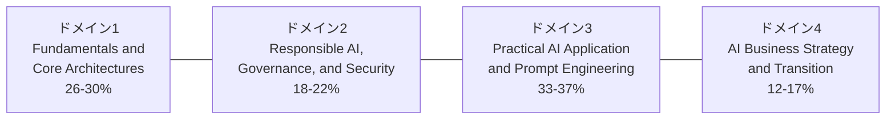

| ドメイン | 出題比率 | 学習の重点 |
|---|---|---|
| 1. Fundamentals and Core Architectures | 26–30% | AI/ML/LLM/RAG/Agentの基礎用語と仕組みの理解 |
| 2. Responsible AI, Governance, and Security | 18–22% | 責任あるAI、倫理、セキュリティ、データプライバシー |
| 3. Practical AI Application and Prompt Engineering | 33–37% | 最も配点が高い。プロンプト設計とワークフロー再設計の実践力 |
| 4. AI Business Strategy and Transition | 12–17% | AIをビジネス言語に翻訳し、戦略・ベンダー選定に活かす力 |

**学習の優先順位:** 配点が最も高いドメイン3（プロンプトエンジニアリングと実践）から着手し、次に配点が最も高いドメイン1（基礎用語）を固め、ドメイン2・4で仕上げるのが効率的です。

---

## 目次

1. [ドメイン1: Fundamentals and Core Architectures](#domain1)
2. [ドメイン2: Responsible AI, Governance, and Security](#domain2)
3. [ドメイン3: Practical AI Application and Prompt Engineering](#domain3)
4. [ドメイン4: AI Business Strategy and Transition](#domain4)
5. [試験対策のポイント](#tips)
6. [参考文献・出典一覧](#references)

---

## 1. ドメイン1: Fundamentals and Core Architectures（26〜30%）

### 1.1 Agentic AIの理解

**Agentic AI（エージェント型AI）**とは、**目標（ゴール）を与えられると、状況を認識し、計画を立て、複数のステップにわたって行動し、結果を観察しながら軌道修正していくAI**を指します。

「Agenticかどうか」は製品名や特定のループ実装の有無で決まるものではなく、次の**能力軸**でどこまでを満たすかで捉えるのが実務的です。各軸は0/1ではなく程度の問題であり、人が各ステップを承認する半自動のものから、完全自律のものまで連続的に分布します。

| 能力軸 | 見るべき点 |
|---|---|
| ツール／API利用 | テキスト生成にとどまらず、外部のツールやAPIを呼び出せるか |
| 状態の保持 | 単発のやり取りを超えて、タスクの途中状態や記憶を保持できるか |
| 複数ステップ実行 | 1回の応答で完結せず、複数手順を連鎖させて進められるか |
| 自律性 | 次の行動を自分で選択できるか、人の承認をどこまで要するか |
| 外部への副作用 | 送信・書き込み・決済など、外界を変更する操作を伴うか |

これらを高い水準で満たすシステムは、典型的には以下のようなループを回します（ループはAgenticな振る舞いの代表的な実装形態であり、唯一の条件ではありません）。

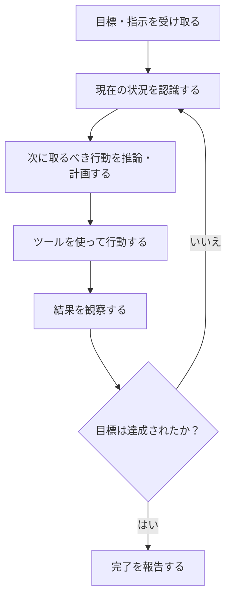

**ベストプラクティス**
- Agenticなアプローチが適するのは「複数ステップ」「外部ツールとの連携」「試行錯誤が必要」なタスクであり、単純な一問一答には過剰設計になりがちなので使い分けること
- 自律性を与える範囲（スコープ）を最初は狭く設定し、実績を見ながら段階的に広げること

---

### 1.2 頻出AI用語の定義（AI Jargon）

初学者がまず押さえるべき基礎用語を一覧化します。

| 用語 | 定義 |
|---|---|
| AI（人工知能） | 人間の知的なタスク（学習・推論・判断）をコンピュータ上で模倣する技術分野全体の総称 |
| ML（機械学習） | 明示的なルールを人間が書く代わりに、データからパターンを学習してタスクを実行するAIの一分野 |
| Deep Learning（深層学習） | 多層のニューラルネットワークを用いるMLの手法。画像認識やLLMの基盤技術 |
| NLP（自然言語処理） | 人間の言語をコンピュータが理解・生成・処理するための技術分野 |
| GenAI（生成AI） | 既存データのパターンを学習し、テキスト・画像・音声・動画・コードなど「新しいコンテンツ」を生成するAI |
| LLM（大規模言語モデル） | 膨大なテキストデータで学習され、次に来る単語（トークン）を予測することで文章の生成・理解を行うモデル |
| Foundation Model（基盤モデル） | 特定タスク専用ではなく、幅広い下流タスクに汎用的に適用できるよう大規模に事前学習されたモデル |
| Prompt（プロンプト） | LLMに与える入力指示文。回答の質はプロンプトの質に大きく依存する |
| Token（トークン） | LLMがテキストを処理する最小単位（単語の一部や記号）。課金や処理速度の基準になる |
| Context Window（コンテキストウィンドウ） | LLMが一度に処理できるトークン数の上限。会話履歴や参照資料はこの範囲に収める必要がある |
| Fine-tuning（ファインチューニング） | 事前学習済みモデルを、特定タスクや自社データに合わせて追加学習させること |
| Hallucination（ハルシネーション） | LLMがもっともらしいが事実と異なる内容を生成してしまう現象 |
| Embedding（埋め込み） | テキストや画像などを意味的な近さを表す数値ベクトルに変換したもの |
| Vector Database（ベクトルデータベース） | 埋め込みベクトルを保存し、類似度検索を高速に行うためのデータベース |
| Multimodal（マルチモーダル） | テキストだけでなく画像・音声・動画など複数の種類のデータを扱えるAI |
| Inference（推論） | 学習済みモデルに新しい入力を与えて出力を得るプロセス（＝実際に使う段階） |
| RAG | 後述（1.4節） |
| AI Agent（AIエージェント） | 後述（1.6節・1.9節） |

**ベストプラクティス**
- 社内でAIを議論する際は、これらの用語を関係者間で「共通言語」として統一しておくこと（EDGE™フレームワークが重視する「AIリテラシーの共有」にも直結、ドメイン4参照）
- 用語の混同（特に「AI」「ML」「GenAI」「LLM」を同義語のように使うこと）を避け、範囲の広さの違い（AI ⊃ ML ⊃ Deep Learning、AI ⊃ GenAI ⊃ LLM）を意識すること

---

### 1.3 AIの5段階（5 Levels of AI）

試験ガイドは、自動化の成熟度を次の5段階で整理しています。

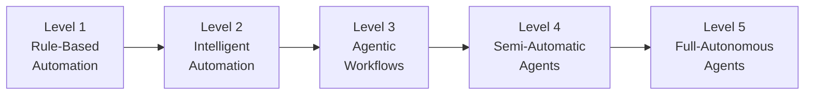

| レベル | 名称 | 特徴 | 人間の関与 | 代表例 |
|---|---|---|---|---|
| 1 | Rule-Based Automation（ルールベース自動化） | 固定的なif-thenルール、RPA（Robotic Process Automation）。学習能力なし | 例外処理はすべて人間が対応 | 定型メールの自動振り分け、単純なデータ入力ボット |
| 2 | Intelligent Automation（インテリジェント自動化） | ルールにML（分類・OCRなど）を組み合わせ、非定型データもある程度処理可能 | 人間はモデルの精度を監督・チューニング | 請求書のインテリジェント文書処理（IDP） |
| 3 | Agentic Workflows（エージェント型ワークフロー） | LLMが人間の設計したワークフロー内で複数ステップを推論・実行し、ツールを使う | 重要な判断は人間が承認 | 「問い合わせ内容を分類し、下書き回答を作成する」AIアシスタント |
| 4 | Semi-Automatic Agents（半自律エージェント） | エージェント自身が動的に計画を立て直し、複数ツールを組み合わせて例外にも対応 | 重要な意思決定・実行前チェックポイントで人間が承認 | 複数システムを横断して調査・手配まで行うAIアシスタント |
| 5 | Full-Autonomous Agents（完全自律エージェント） | 人間の介入なしに目標設定・計画・実行・自己修正を長期間継続 | 事後監査・例外時のみ | 現時点では限定的な領域を除き実運用はまだ発展途上 |

> **出典についての補足:** この5段階の名称そのものは Scaled Agile 独自の整理ですが、考え方は業界で広く使われている「AIエージェントの自律性レベル」という一般的なフレームワークと一致します（例: Pascal Bornet氏による5段階モデル、英国デジタル規制協力フォーラム(DRCF)による5段階自律性スペクトラムなど）。試験対策としては「レベルが上がるほど人間の関与が減り、自律性とリスクの両方が増す」という関係性を理解することが重要です。
> 参考: [The 5 Levels of AI Agents Explained（Pascal Bornet）](https://medium.com/@knoonAi/the-5-levels-of-ai-agents-explained-agentic-artificial-intelligence-by-pascal-bornet-787c39fec1ea)

**ベストプラクティス**
- 自社のユースケースが「今どのレベルにあるか」「次のレベルに進むために何のガードレールが必要か」を明示すること
- レベルを一足飛びに上げず、Level 3（Agentic Workflows）で十分な監査ログとロールバック手段を確立してからLevel 4に進むこと

---

### 1.4 RAG（Retrieval-Augmented Generation：検索拡張生成）

**RAGとは何か:** LLM単体は学習時点の知識しか持たず、社内文書のような非公開情報や最新情報には対応できません。RAGは、**質問に関連する情報を外部の知識ベース（文書・データベース）から検索し、その内容をプロンプトに含めた上でLLMに回答を生成させる**アーキテクチャです。ハルシネーションの低減・最新情報への対応・根拠（出典）の提示は、RAGを導入しさえすれば自動的に保証されるものではありません。これらは、検索品質（関連文書を実際に上位で取得できること）、生成の接地（プロンプトに含めた文書の内容だけに基づいて回答させること）、取得元と提示する出典の対応付けが、いずれも適切に実装されている場合に支援される効果です。検索が外れれば誤った根拠に基づくハルシネーションはむしろ助長され、知識ベース自体が古ければ最新情報にも対応できません。

RAGは2020年にMeta AI（旧Facebook AI Research）のPatrick Lewisらの論文で提唱された概念です。
出典: [Retrieval-Augmented Generation for Knowledge-Intensive NLP Tasks（arXiv:2005.11401）](https://arxiv.org/abs/2005.11401)

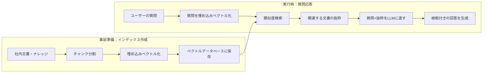

**ベストプラクティス**
- **チャンク分割設計:** 文書を細かくしすぎると文脈が失われ、大きくしすぎると無関係な情報が混ざる。意味的なまとまり（見出し単位など）でチャンクを切ること
- **検索精度の評価:** 検索結果の再現率（Recall）・適合率（Precision）を定期的に計測し、埋め込みモデルやチャンク戦略を見直すこと
- **リランキング（Re-ranking）:** 一次検索の上位候補をさらに精査するモデルを挟むと精度が向上する
- **出典の明示:** 生成した回答に、参照した文書名・箇所を添える。ただし出典表示自体は正しさを保証しないため、提示された出典が実際に取得したチャンクと対応しているか（モデルが出典を捏造していないか）を、生成結果ではなく検索結果側の記録と突き合わせて検証できる仕組みにすること
- **「わからない場合は分からないと答える」指示:** 検索結果に答えが含まれない場合、無理に回答を捏造させず「情報が見つからない」と回答させるようプロンプトで明示すること。プロンプト指示だけでは遵守は保証されないため、検索スコアの閾値による棄却など仕組み側の対策と併用する（ドメイン3.2でも詳述）

---

### 1.5 Composite AI（複合AI）

**Composite AIとは:** 単一のAI手法だけに頼るのではなく、**機械学習・ルールベースシステム・LLM・最適化アルゴリズム・ナレッジグラフなど複数のAI技術を組み合わせて**、より正確で堅牢なソリューションを構築するアプローチです。Gartnerが提唱した概念で、「1つのモデルではビジネス課題の一部しか解決できない」という前提に立ちます。

出典: [Composite AI（Gartner Glossary）](https://www.gartner.com/en/information-technology/glossary/composite-ai)

| 組み合わせる技術 | 得意な役割 |
|---|---|
| ルールベースシステム | 厳格なコンプライアンス要件やドメインルールの適用 |
| 従来型ML（分類・回帰） | 数値データからのパターン予測（例: 与信スコアリング） |
| LLM / GenAI | 非構造化テキストの理解・要約・生成、自然言語インターフェース |
| ナレッジグラフ | エンティティ間の関係性の表現と推論 |
| 最適化アルゴリズム | 在庫配分やスケジューリングなど制約付き最適化問題 |

**ベストプラクティス**
- 「どのAI手法を使うべきか」ではなく「このサブ問題に最も適した手法は何か」を問い、複数手法を疎結合に組み合わせる設計にすること
- 手法を増やすほど運用・監視すべきモデルが増えるため、ガバナンス負荷とのトレードオフを事前に見積もること

---

### 1.6 AIエージェントの仕組みと能力

AIエージェントは、LLMを「頭脳」として、以下の要素を組み合わせて構成されます。

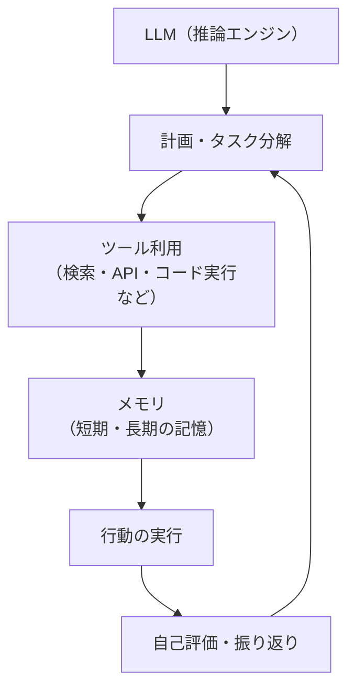

| 構成要素 | 役割 |
|---|---|
| 推論エンジン（LLM） | 状況を理解し、次の行動を決定する |
| ツール利用 | Web検索、社内API呼び出し、コード実行、他システムとの連携 |
| メモリ | 直近の会話（短期記憶）や過去の作業履歴・学習内容（長期記憶）の保持 |
| 計画（プランニング） | 大きなゴールを実行可能な小さなステップに分解する |
| 振り返り（Reflection） | 実行結果を評価し、失敗した場合は計画を修正する |

**ベストプラクティス**
- **最小権限の原則:** エージェントに与えるツール権限は必要最小限にとどめる（例: 読み取り専用API、送金は不可など）
- **人間の承認ポイント（Human-in-the-loop）を設計する:** 不可逆な行動（送金、データ削除、外部への送信）の前には必ず人間の承認を挟む
- **可観測性（Observability）:** エージェントの挙動を事後検証できるよう監査ログを必ず記録する。記録するのは**判断理由の要約**、適用したポリシーとモデルのバージョン、呼び出したツールとその引数、実行結果といった**構造化メタデータ**に限定する。思考の生ログ（Chain of Thought）、個人情報（PII）、認証情報などの秘密情報は保存しない（これらは監査に不要である一方、漏洩時の影響が大きいため）。あわせて、監査ログへの**アクセス制御**（閲覧できる役割の限定）と**保持期間**を定義し、期間経過後は自動削除する
- **バウンダリの明示:** エージェントに「やってよいこと・やってはいけないこと」を明文化したシステムプロンプト／ポリシーを与える

---

### 1.7 生成AIの使い方（LLMとGenAIの理解）

- **LLM（大規模言語モデル）**は、膨大なテキストで学習され、「次に来る可能性が最も高いトークン（単語の断片）」を予測することで文章を生成する統計的なモデルです。
- **Generative AI（生成AI）**は、LLMを含む、テキスト・画像・音声・動画・コードなど「新しいコンテンツ」を生成できるAI全般を指す、より広い概念です。

**ベストプラクティス**
- LLMは「理解」しているのではなく「パターンを予測」していることを理解し、重要な意思決定の唯一の根拠にしないこと
- 生成された内容は必ず人間がレビューする工程（特に法務・財務・医療など高リスク領域）を設けること

---

### 1.8 カスタムGPTs・コパイロットの概念

| 種類 | 定義 | 典型的な使い方 |
|---|---|---|
| カスタムGPT | 汎用LLMに、独自の指示（システムプロンプト）・知識ファイル・ツールを追加設定した、特定用途向けのチャットアシスタント | 社内FAQボット、特定業務のアシスタント |
| コパイロット（Copilot） | 特定のソフトウェア製品やワークフローに組み込まれ、作業の文脈を理解した上で提案・自動補完を行うAIアシスタント | コーディング支援、資料作成支援、メール下書き支援 |

いずれも製品カテゴリの呼び名であり、それ自体がAgenticかどうかを決めるわけではありません。1.1節の能力軸（ツール／API利用・状態の保持・複数ステップ実行・自律性・外部への副作用）で評価すると、人の操作を起点に提案・補完を返す使い方が中心のものは自律性と副作用が低く、ツール実行やタスク状態の保持まで担う構成にすればAgenticな側へ寄ります。製品名ではなく、実際に有効化されている能力で判断してください。

**ベストプラクティス**
- 独自知識を与える際は、機密情報や個人情報を含めてよいかを事前にデータガバナンス方針で確認する（ドメイン2.4参照）
- カスタムGPT／コパイロットに過剰な権限（外部送信・決済など）を持たせないこと

---

### 1.9 LLMとAIエージェントの違い

LLMは「モデル単体」、AIエージェントは「モデルを含むシステム構成」であり、両者は同じ能力軸上の両端として比較すると理解しやすくなります。

| 能力軸 | LLM単体 | AIエージェント（能力を有効化した構成） |
|---|---|---|
| ツール／API利用 | テキストの入出力のみ | ツール・API・他システムを呼び出して操作する |
| 状態の保持 | 主に単一のやり取り内の文脈のみ | メモリを持ち、タスク状態を跨いで保持できる |
| 複数ステップ実行 | 1回の入力に対し1回の出力 | 目標達成まで複数ステップを連鎖させる |
| 自律性 | 次のトークンを予測するのみ | 計画・行動選択・結果評価を行う（人の承認を挟む構成から完全自律まで幅がある） |
| 外部への副作用 | 原則なし（出力のみ） | 送信・書き込み・購買など外界を変更しうる |
| 適した用途 | 要約・翻訳・文章生成・質問応答など単発タスク | 複数手順にまたがる調査・実行・自動化タスク |

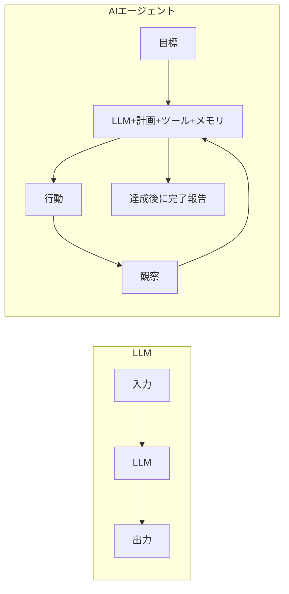

**ベストプラクティス**
- 「AIエージェント」という言葉が使われていても、実際に有効化されている能力（ツール利用・状態保持・複数ステップ実行・自律性・副作用の範囲）は製品ごとに大きく異なるため、名称ではなく能力軸で実態を確認すること
- タスクが単発で完結するなら、複雑なエージェントではなくシンプルなLLM呼び出しを選ぶ方がコスト・リスクともに低い

---

## 2. ドメイン2: Responsible AI, Governance, and Security（18〜22%）

### 2.1 責任あるAI（Responsible AI）の原則

責任あるAIの国際的な拠り所となっているのが、**OECD AI原則**（2019年策定、2024年5月改訂）です。47の国・地域が支持しており、EU AI ActやNIST AI RMFなどを検討・比較する際の国際的な参照点の一つとなっています（ただしOECD AI原則はこれらの直接の成立根拠ではなく、各枠組みはそれぞれ独自の法的根拠と策定プロセスを持ちます）。

出典: [OECD AI Principles（2024年改訂版・公式）](https://oecd.ai/en/ai-principles)

| OECD AI原則（価値ベースの5原則） | 内容 |
|---|---|
| 包摂的な成長・持続可能な発展・幸福 | AIは人々の幸福（well-being）と持続可能性に資するべき |
| 人間中心の価値観と公平性 | 人権・民主的価値観・プライバシーを尊重すること |
| 透明性・説明可能性 | AIが意思決定に使われる場合、その根拠を説明できること |
| 頑健性・セキュリティ・安全性 | 予期しない状況でも安全に動作し、セキュリティが確保されていること |
| アカウンタビリティ（説明責任） | 開発者・提供者・利用者が結果に対して責任を持つこと |

もう一つの実務的な柱が、米国NIST（国立標準技術研究所）が2023年1月に発行した**NIST AI RMF（AI Risk Management Framework）1.0**です。組織がAIのリスクを管理するための4つの機能（Govern／Map／Measure／Manage）を提示しています。

出典: [NIST AI RMF 1.0（NIST.AI.100-1、公式）](https://www.nist.gov/publications/artificial-intelligence-risk-management-framework-ai-rmf-10) / [AI RMF Core機能の詳細（AIRC）](https://airc.nist.gov/airmf-resources/airmf/5-sec-core/)

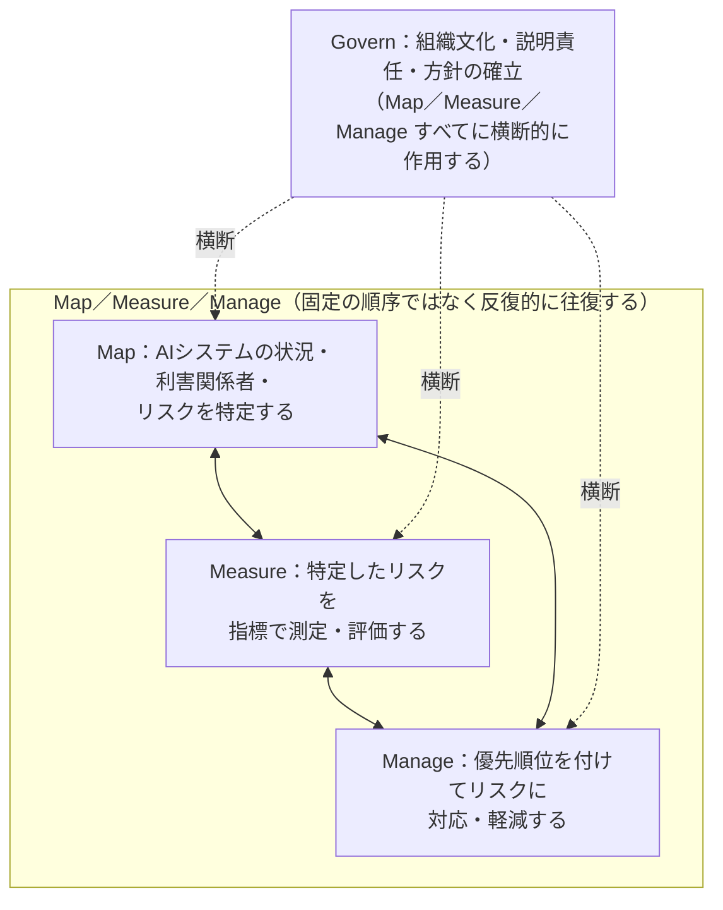

**ベストプラクティス**
- Govern機能を「一度作って終わり」にせず、AI活用が広がるたびに方針・体制をアップデートすること
- モデルカードやデータシートなど、AIシステムの前提条件・既知の限界を文書化し、利用者に開示すること
- 公平性を検証する際は、単一の指標だけでなく複数のバイアス指標（例: グループ間の誤検出率の差）を確認すること
- 人間による監督（Human oversight）のポイントを、リスクの高さに応じて設計すること（ドメイン3.6も参照）

---

### 2.2 AI倫理的意思決定フレームワーク

AI活用において「技術的に可能か」だけでなく「倫理的に適切か」を判断するための実践的な手法です。

| 手法 | 概要 |
|---|---|
| ステークホルダー影響評価 | そのAI活用によって影響を受ける全ての関係者（顧客・従業員・社会）を洗い出し、便益とリスクを整理する |
| プレモータム（事前検死） | 「このAIプロジェクトが1年後に大失敗していたとしたら、その原因は何か」を事前に想像し、リスクを洗い出す |
| レッドチーミング | 意図的に誤用・悪用を試みる専門チームを設け、想定外の挙動を事前に発見する |
| 説明責任のマッピング | 「誤った判断が下された場合、誰が・どのように責任を負うか」を事前に明確化する |

**ベストプラクティス**
- 倫理判断を一人（担当者）に委ねず、多様な視点を持つレビュー体制（法務・現場・エンドユーザー代表など）を作ること
- 「グレーゾーン」の判断は、事前に定めた原則（2.1節のOECD原則など）に立ち戻って議論すること

---

### 2.3 AIセキュリティのDos/Don'ts

生成AI・LLMアプリケーション特有のセキュリティリスクを体系化した業界標準が **OWASP Top 10 for LLM Applications** です。現行版は **2026年版**（OWASP GenAI Security Project、2026年8月公開）で、実インシデントのデータを順位付けに組み込んだ点が大きな変更です。

2026年版の主な変更点:

- プロンプトインジェクションと機密情報の漏えいは引き続き1位・2位。
- **過剰な自律性（Excessive Agency）が3位へ上昇**（2025年版では6位）。エージェント利用の拡大を反映しています。
- **システムプロンプトの漏えい → Hidden Context Exposure へ改称**。システムプロンプトだけでなく、アプリが保持する周辺コンテキスト全体を対象に広がりました。
- **不適切な出力処理が10位へ下降**（2025年版では5位）。
- 順位の75%は実務者投票、25%は実インシデントの分析に基づいて決定されています。

出典: [OWASP GenAI LLM Top 10 2026（公式）](https://genai.owasp.org/resource/owasp-genai-llm-top-10-2026/) / [OWASP Top 10 for LLM and GenAI（プロジェクト公式）](https://genai.owasp.org/initiative/owasp-top-10-for-llm-and-genai/)

下表は **2025年版** の10項目です。公式試験ガイドはOWASP Top 10の特定のバージョンを指定していないため、どのバージョンが出題範囲に対応するかを推定することはできません。下表はあくまで版の変遷を追うための履歴的・補足的な参考資料として掲載しています。学習・実務のいずれにおいても、最新版である上記の2026年版を参照してください。

出典（2025年版）: [OWASP Top 10 for LLM Applications 2025（公式）](https://genai.owasp.org/resource/owasp-top-10-for-llm-applications-2025/)

| ID | リスク | 概要 |
|---|---|---|
| LLM01:2025 | プロンプトインジェクション | 悪意ある入力でLLMの挙動・出力を意図しない形に操作する |
| LLM02:2025 | 機密情報の漏えい | 学習データや会話履歴に含まれる機密情報が意図せず出力される |
| LLM03:2025 | サプライチェーンの脆弱性 | 利用するモデル・ライブラリ・データセットに潜む脆弱性 |
| LLM04:2025 | データ・モデルの汚染 | 学習データや外部知識源を汚染し、モデルの挙動を歪める |
| LLM05:2025 | 不適切な出力処理 | LLMの出力を検証せずに後続システムに渡し、インジェクション等を招く |
| LLM06:2025 | 過剰な自律性（Excessive Agency） | エージェントに与える権限・機能・自律性が必要以上に大きい |
| LLM07:2025 | システムプロンプトの漏えい | 内部指示や認証情報を含むシステムプロンプトが外部に流出する |
| LLM08:2025 | ベクトル・埋め込みの弱点 | RAGで使う埋め込み・ベクトルDBの生成・保存・検索過程の欠陥 |
| LLM09:2025 | 誤情報（Misinformation） | もっともらしい誤情報を生成し、利用者が過信してしまう |
| LLM10:2025 | 無制限なリソース消費 | リクエスト量を制限せず、サービス停止やコスト増大を招く |

**Dos（推奨事項）**
- LLMの出力は「信頼できない外部入力」として扱い、後続処理の前に必ず検証・サニタイズすること（特にLLM05:2025 不適切な出力処理への対策）
- プロンプトインジェクション対策として、ユーザー入力と指示（システムプロンプト）を明確に分離し、権限の低いコンテキストとして扱うこと。ただし**プロンプト上の分離は単独のセキュリティ境界にはならない**——区切り文字やロール指定だけでは、モデルが外部由来の指示に従ってしまうことを防げない。実際の境界は、LLMの外側にある信頼できるコードで担保すること
- 具体的には、①ツール呼び出しや外部アクセスの認可をLLMの判断ではなく信頼できるコード側で行う（呼び出し元ユーザーの権限で毎回チェックする）、②LLMの出力をスキーマ・許可値リストで検証してから後続処理へ渡す、③各ツール・各認証情報に最小権限のみを与える、の3点を必須の防御として組み合わせること
- エージェントに与える機能・権限は最小限にし、重要な操作には承認ステップを設けること（LLM06:2025 過剰な自律性への対策）
- RAGで参照する外部ドキュメントの改ざん検知・アクセス制御を行うこと（LLM08:2025 ベクトル・埋め込みの弱点への対策）
- レート制限・利用上限を設定し、コストとリソースの暴走を防ぐこと（LLM10:2025 無制限なリソース消費への対策）

**Don'ts（避けるべき事項）**
- システムプロンプトに認証情報やAPIキーを直接書き込まないこと
- LLMの回答を無検証のまま金融・法務・医療などの意思決定に使わないこと
- 検証していない外部データ（Webページ・添付ファイルなど）をそのままLLMに読み込ませ、指示として実行させないこと（間接的プロンプトインジェクションのリスク）

---

### 2.4 データプライバシーとセキュリティの理解

生成AI利用において特に重要な規制が、EUの**GDPR（一般データ保護規則）**と米国カリフォルニア州の**CCPA/CPRA（カリフォルニア州消費者プライバシー法）**です。

出典: [GDPR正式条文（EUR-Lex, Regulation (EU) 2016/679）](https://eur-lex.europa.eu/eli/reg/2016/679/oj) / [CCPA公式ページ（California Attorney General）](https://oag.ca.gov/privacy/ccpa) / [California Privacy Protection Agency（CPPA）](https://cppa.ca.gov/)

| 観点 | GDPR（EU） | CCPA/CPRA（カリフォルニア州） |
|---|---|---|
| 適用対象 | EU域内の拠点の活動に関連する処理、またはEU域外の組織によるEU域内の個人への商品・サービス提供・行動監視に関連する処理（Article 3） | **カリフォルニア州で事業を行い**、カリフォルニア州の消費者の個人情報を**収集**し、その**処理の目的と手段を単独または共同で決定する営利事業者**（business）であり、かつ次のいずれか1つ以上を満たす場合（CPPA公表基準）: ① 前暦年の年間総収益が2,662.5万ドル以上（2025年1月1日発効のインフレ調整後の額。以後も定期的に改定される）、② カリフォルニア州住民または世帯10万人分以上の個人情報を購入・販売・共有している、③ 年間収益の50%以上をカリフォルニア州住民の個人情報の販売・共有から得ている |
| 主な権利 | アクセス権、削除権（忘れられる権利）、データポータビリティ権 | 知る権利、削除権、訂正権（不正確な情報の訂正請求）、オプトアウト権（販売・共有の停止）、機微な個人情報の利用・開示を限定された目的に制限する権利、権利行使を理由とした差別を受けない権利 |
| データ最小化原則 | 目的達成に必要な範囲でのみデータを収集・利用すること | 収集目的に照らして合理的に必要な範囲に限定すること |
| AI活用時の留意点 | 個人データをLLMの学習・プロンプトに使う場合、法的根拠と目的の明確化が必要 | 個人情報を第三者のAIサービスに送信する行為が「販売」「開示」「共有」のいずれに当たるかは、送信先の役割（サービスプロバイダか否か）・利用目的・契約条件によって異なる。法定の「共有」はクロスコンテキスト行動広告を目的とする場合に限られるため、一律に「共有」と扱わず個別に判定する |

**匿名化・仮名化技術**

| 技術 | 概要 |
|---|---|
| マスキング（Masking） | 氏名・電話番号などをダミー値や記号に置き換える |
| 仮名化（Pseudonymization） | 識別子を別のIDに置き換え、対応表を厳格に分離管理する |
| 匿名化（Anonymization） | 統計的にも個人を再識別できないレベルまでデータを加工する（差分プライバシーなど） |
| データマスキング後の再識別リスク評価 | 複数の匿名化データを組み合わせることで再識別可能になっていないか検証する |

**ベストプラクティス**
- 社外のLLM APIにプロンプトとして個人情報・機密情報を送信する前に、PIIの検出・マスキング処理を挟むこと
- 第三者AIベンダーとはデータ処理契約（DPA: Data Processing Agreement）を締結し、データの学習利用可否・保存期間・データ所在地（レジデンシー）を明確化すること（ドメイン4.6のベンダー選定にも直結）
- 社内でAIに入力してよい情報のレベル（公開情報／社外秘／機密）を分類し、ガイドラインとして周知すること
- ログ・監査証跡を保持し、データ主体からの削除請求・開示請求に対応できる体制を整えること

---

## 3. ドメイン3: Practical AI Application and Prompt Engineering（33〜37%）

このドメインは出題比率が最も高く、実践的なプロンプト作成能力とワークフロー設計能力が問われます。

### 3.1 画像・動画生成のための効果的なプロンプト

| 要素 | 説明 | 記述例（要素の考え方） |
|---|---|---|
| 被写体（Subject） | 何を描くかを具体的に | 「若い日本人の女性エンジニア」など具体性を持たせる |
| スタイル（Style） | 画風・トーン | 写実的／水彩画風／フラットデザインなど |
| 構図（Composition） | カメラアングルや配置 | クローズアップ／俯瞰／三分割法など |
| ライティング | 光の当たり方 | 逆光、柔らかい自然光など |
| ネガティブプロンプト | 生成してほしくない要素を明示 | 手の変形、テキストの乱れなどを除外指定 |
| 反復修正 | 一発で完成させず段階的に調整 | 構図→色調→ディテールの順で調整する |

**ベストプラクティス**
- 著作権保護されたキャラクターや実在の人物の外見を模倣させるプロンプトは避けること
- ディープフェイクに悪用され得る「実在人物の写実的な合成」は組織のポリシーで明確に禁止すること
- 動画生成では、シーンごとの一貫性（キャラクターの外見、色調）を保つため、参照画像や詳細な設定文を使い回すこと

---

### 3.2 RAGベースのプロンプト作成

RAG構成では、検索で取得した文書の抜粋をプロンプトに含め、**LLMに「与えられた文脈内でのみ回答する」よう明示的に指示する**ことが重要です。

**プロンプト設計の基本構造（概念）**

1. 役割・目的の指定（例:「あなたは社内規定に基づいて回答する社内アシスタントです」）
2. 検索で取得した文脈（コンテキスト）を明示的な区切りで挿入する
3. 「文脈に基づいてのみ回答する」「文脈にない場合はその旨を伝える」というグラウンディング指示
4. 出典（どの文書のどの箇所を参照したか）を明記させる指示
5. ユーザーの質問

**ベストプラクティス**
- 文脈と指示の境界を明確な区切り（見出しやタグ）で分離し、モデルが情報源と指示を混同しないようにすること
- 「わからない場合は推測せず、わからないと答える」ことを明示的に指示し、ハルシネーションを抑制すること
- 検索結果が複数ある場合、優先順位（最新の文書を優先する等）をプロンプトに明記すること
- 回答生成後、引用元の文書箇所と実際の回答内容が一致しているかを検証する仕組み（自動チェックまたは人によるレビュー）を設けること

---

### 3.3 AI-Native成功要因の自分の役割への適用（マイクロプラン作成）

Scaled Agileは、AI-Nativeな組織・個人になるための実践指針として**「7つのAI-Native成功要因（7 AI-Native Success Factors）」**を提示しています。

出典: [What Does It Mean to Be AI-Native?（Scaled Agile AI-Native Connect）](https://ai-native-connect.scaledagile.com/public/blogs/what-does-it-mean-to-be-ai-native)

| # | 成功要因 | 内容 |
|---|---|---|
| 1 | Anchor AI to Business Value（ビジネス価値に紐づける） | すべてのAI施策を売上・コスト・リスク・顧客満足度など測定可能な成果に結び付ける |
| 2 | Upskill Relentlessly（絶え間なくスキルを高める） | データサイエンティストだけでなく全員がAIリテラシーを高め続ける |
| 3 | Start Smart, Include AI Early（早期からAIを組み込む） | プロジェクトの後付けでなく、企画段階からAI活用を設計に組み込む |
| 4 | Move Fast, Learn Fast（速く動き、速く学ぶ） | 小さく試し、結果から素早く学び、繰り返し改善する |
| 5 | Provide Context for AI（AIに文脈を与える） | 明確な目標と十分な背景情報をAIに与え、成果の質を高める |
| 6 | Embed AI into the Everyday（日常業務に組み込む） | 特別なツールとしてではなく、日々のワークフローにAIを溶け込ませる |
| 7 | Innovate Boldly, Govern Wisely（大胆に革新し、賢く統治する） | スピードと同時に、プライバシー・安全性・リスク管理のガードレールを維持する |

**マイクロプランの作り方（30-60-90日プラン）**

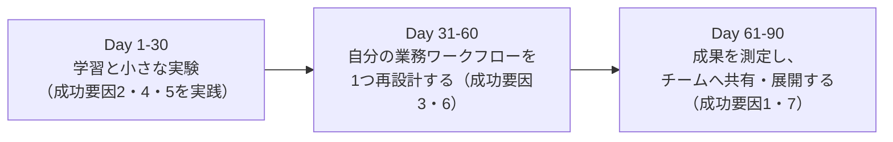

**ベストプラクティス**
- マイクロプランには必ず「測定可能な成果指標（例: 作業時間を◯%削減）」を設定すること
- 最初の30日は「大きな変革」ではなく「小さく確実な成功体験」を狙うこと

---

### 3.4 AI機会をビジネス課題に紐づけて要約する

AI活用のアイデアを提案する際は、技術の説明から入るのではなく、**「課題→機会→期待価値」の順**で簡潔に伝えることが重要です。

**構成のテンプレート（概念）**

| 要素 | 内容 |
|---|---|
| 現状の課題 | 今、何にどれだけの時間・コスト・リスクがかかっているか |
| AI活用の機会 | その課題にどのAIアプローチ（例: RAG、要約、分類）が適用できるか |
| 期待される価値 | 定量的な効果見込み（時間削減、精度向上、コスト削減など） |
| 必要なリソース・依頼事項 | 承認、データアクセス、ツール導入などの依頼内容 |

**ベストプラクティス**
- 技術用語（LLM、RAG等）を前面に出さず、相手（経営層・現場）に応じた言葉に翻訳すること（ドメイン4.4とも関連）
- 「AIを使うこと」自体を目的化せず、あくまで課題解決の手段として位置づけること

---

### 3.5 テキスト生成のための効果的なプロンプト作成

Anthropic社の公式ドキュメントをはじめ、業界で広く共有されているプロンプトエンジニアリングの主要テクニックを整理します。

出典: [Anthropic - Prompt engineering overview（公式ドキュメント）](https://docs.anthropic.com/en/docs/build-with-claude/prompt-engineering/overview)

| テクニック | 概要 |
|---|---|
| 明確かつ直接的な指示 | 曖昧な表現を避け、期待する出力（形式・長さ・トーン）を具体的に書く |
| 役割（ロール）の付与 | 「あなたは◯◯の専門家です」と役割を与え、応答の質と一貫性を高める |
| Few-shotプロンプティング | 期待する出力の具体例を数個示すことで、形式や粒度をモデルに伝える |
| 思考の連鎖（Chain of Thought） | 複雑な問題では段階的な検討を促し、結論の根拠と検証手順だけを簡潔に出力させる（内部の思考過程そのものの開示は求めず、機密コンテキストは要約にも含めない） |
| 出力形式の指定 | JSON形式や見出し構成など、後続処理がしやすい形式を明示する |
| プロンプトの分割（チェイニング） | 1つの巨大なプロンプトに詰め込まず、生成→レビュー→改善のように工程を分ける |
| 区切り記号・タグの活用 | 長い文書や複数の指示を扱う際、明確な区切り（見出しやタグ）で構造化する |
| 反復的な改善 | 一度で完璧な出力を狙わず、結果を見ながらプロンプトを継続的に磨き込む |

**ベストプラクティス**
- 成功基準（何をもって「良い回答」とするか）を先に定義し、プロンプトが基準を満たすかテストケースで検証すること
- 同じ指示でも出力がぶれる場合は、出力形式や評価基準をより具体的に明記すること
- 機密情報を含むプロンプトを外部LLMに送る前に、ドメイン2.4のデータ取り扱いルールを確認すること

---

### 3.6 人間の判断とAIを組み合わせたワークフローの設計

AIに完全に任せるのでも、すべて人手で行うのでもなく、**リスクの大きさに応じてAIと人間の役割分担を設計する**ことが求められます。

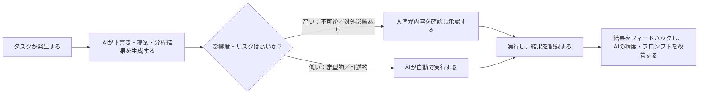

**ベストプラクティス**
- タスクを「AIに完全に任せてよい」「AIが提案し人間が承認する」「人間が主導しAIは補助のみ」の3段階に分類してから設計する
- 承認プロセスがボトルネックにならないよう、リスクが低いと分かっている定型判断は自動化の対象に含めること
- AIの提案と人間の最終判断が食い違ったケースを記録し、プロンプトやルールの改善に活かすこと

---

### 3.7 AIを使ってプロジェクトの隠れたリスクを発見する質問生成

AIは「答えを出す」だけでなく、**「良い問いを立てる」ためにも活用**できます。プロジェクトのキックオフやレビュー時に、AIに「このプロジェクト計画を読んで、見落とされがちなリスクを洗い出す質問を10個挙げて」といった依頼をすることで、担当者だけでは気づきにくい視点を補うことができます。

**質問生成の観点例**
- 依存関係（他チーム・外部ベンダーへの依存）に関する質問
- 前提条件（「もし◯◯が想定通りでなかったら」という仮定の検証）
- ステークホルダー間の認識のズレを確認する質問
- スケジュールの楽観バイアスを疑う質問

**ベストプラクティス**
- AIが生成した質問リストをそのまま使うのではなく、チームで取捨選択し、実際のディスカッションのたたき台として使うこと
- プロジェクトの背景情報（目的、制約、過去の類似プロジェクトの失敗例など）を十分にAIへ与えることで、質問の質を高めること（ドメイン3.5の「明確な指示」の応用）

---

### 3.8 難しいフィードバックを建設的な質問に変えるAI活用

批判的・感情的になりがちなフィードバックを、AIを使って**「相手の学びや対話を引き出す質問」に言い換える**手法です。

**変換の考え方**
- 断定的な指摘（「これは間違っている」）を、探究的な問い（「この判断に至った背景を教えてもらえますか」）に変換する
- 相手を評価する言葉ではなく、状況や行動に焦点を当てた言葉を選ぶ
- AIに「このフィードバックを、相手が防御的にならず対話につながる質問形式に書き換えて」と依頼する

**ベストプラクティス**
- AIが生成した言い換えをそのまま使わず、自分の言葉やその場の関係性に合わせて調整すること
- フィードバックの「事実」の部分を曖昧にしないよう注意すること（優しい言い回しにする過程で、伝えるべき本質がぼやけないようにする）

---

## 4. ドメイン4: AI Business Strategy and Transition（12〜17%）

### 4.1 EDGE™ の4つの力とAI-Nativeケースをビジネス言語で説明する

Scaled Agileが提唱する**EDGE™フレームワーク**は、AIが仕事のあり方を変える4つの力を整理したものです。

出典: [What Does It Mean to Be AI-Native?（Scaled Agile AI-Native Connect）](https://ai-native-connect.scaledagile.com/public/blogs/what-does-it-mean-to-be-ai-native)

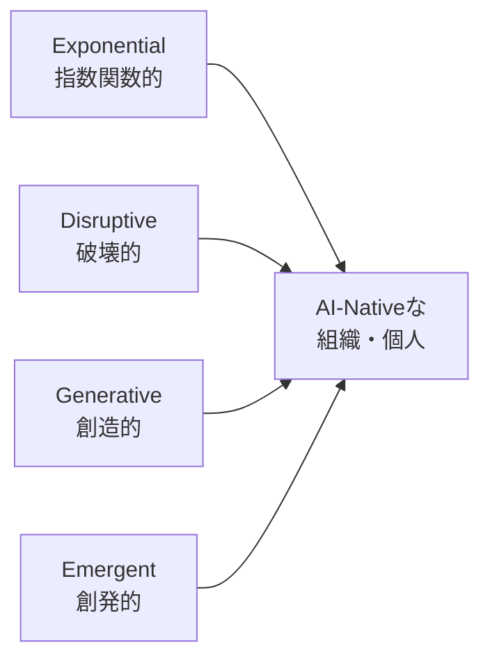

| EDGEの次元 | 説明 | ビジネスへの示唆 | 例 |
|---|---|---|---|
| Exponential（指数関数的） | AIによって成果が直線的でなく、複利的に拡大していく | 製品サイクルの加速、大規模な自動化 | AIを活用したサプライチェーン最適化 |
| Disruptive（破壊的） | AIが市場・顧客体験・ビジネスモデル自体を変える | 新たな収益源の創出、既存プレイヤーの立場逆転 | AIによるレコメンデーションでの顧客体験変革 |
| Generative（創造的） | 生成AIが新しいコンテンツ・アイデア・解決策を生み出す | 創造性の強化、複雑な作業の自動化 | 生成AIを使った高速プロトタイピング |
| Emergent（創発的） | 想定外の新しい能力や状況変化に適応する必要が生じる | 俊敏性の獲得、継続的な学習体制 | リアルタイムAI分析によるリスクモデルの継続更新 |

**ベストプラクティス**
- 経営層への説明では、技術用語ではなくEDGEの4象限を使って「なぜ今AIに投資すべきか」を語ること
- 「AIを使っている」ことと「AI-Nativeである（EDGEの力を活かして価値創出の在り方そのものを変えている）」ことの違いを区別すること

---

### 4.2 AIユースケースの分類：Stable / Evolving / Frontier

AI活用の投資判断やガバナンスの厳格さを決める際、ユースケースを成熟度・不確実性に応じて分類する考え方です。

| 分類 | 特徴 | リスク・ガバナンスの度合い | 典型的な取り組み方 |
|---|---|---|---|
| Stable（安定） | 実績のある枯れた技術・パターンを使う。予測可能性が高い | ガバナンスは標準的な運用ルールで十分 | 既存プロセスへのチャットボット導入、定型文書の要約 |
| Evolving（発展途上） | 技術・ベストプラクティスが急速に変化している最中 | パイロット運用、頻繁な見直しが必要 | 社内向けRAGシステムの本格展開、エージェント型ワークフローの導入 |
| Frontier（最先端） | 業界的にも事例が少なく、不確実性・リスクが高い | 厳格なガードレール、限定的な試験運用、専門チームによる監督 | 完全自律型マルチエージェントシステム、規制未整備の新領域への応用 |

> **出典についての補足:** この3分類名は認定団体独自の整理ですが、考え方としては技術投資のリスク許容度に応じてポートフォリオを分ける一般的な経営理論（例:「コア・隣接・変革」を分けるイノベーション投資フレームワークや、Gartnerハイプ・サイクルにおける成熟度の考え方）と共通しています。

**ベストプラクティス**
- ポートフォリオ全体で、Stable領域には効率化投資を、Frontier領域には小規模な探索的投資を、というように配分のバランスを取ること
- 分類は固定ではなく、技術の成熟に伴ってFrontier→Evolving→Stableへと定期的に見直すこと

---

### 4.3 コアAIソリューションパターンの見分け方

チームが「どのAIアプローチを選ぶべきか」を判断しやすくするため、ビジネス課題を代表的なソリューションパターンに対応付けます。

| ビジネス課題のタイプ | 適したコアAIソリューションパターン | 例 |
|---|---|---|
| 大量データからの分類・予測 | 従来型ML（教師あり学習） | 解約予測、与信スコアリング |
| 非構造化文書からの情報抽出・要約 | LLM＋プロンプトエンジニアリング | 契約書の要点抽出 |
| 社内独自知識に基づく質問応答 | RAG | 社内規定・製品仕様に関する問い合わせ対応 |
| 複数ステップにまたがる調査・実行業務 | AIエージェント | 複数システムを跨いだ調査・手配業務 |
| 新規コンテンツ・デザインの生成 | 生成AI（画像・テキスト・音声） | マーケティング素材の量産 |
| 複数手法の組み合わせが必要な複雑課題 | Composite AI（1.5節参照） | 需要予測＋在庫最適化＋異常検知の統合 |

**ベストプラクティス**
- 「流行っているから」ではなく「課題の性質に合っているか」でパターンを選ぶこと
- 1つの課題に対して複数パターンを比較検討し、精度・コスト・説明可能性・実装難易度をトレードオフとして評価すること

---

### 4.4 AI概念とトレードオフをビジネス言語に翻訳する

技術的な特徴は、意思決定者にとって意味のある言葉に変換して伝える必要があります。

| 技術的な特徴 | ビジネス言語への翻訳例 |
|---|---|
| ハルシネーションのリスク | 「一定確率で誤った回答をする可能性があるため、人によるレビュー工程のコストが発生する」 |
| モデルの学習・推論コスト | 「初期投資（学習・統合コスト）と継続的な運用コスト（API利用料等）のバランス」 |
| ブラックボックス性（説明可能性の低さ） | 「規制対象業務では、判断根拠を説明できないことが監査上のリスクになる」 |
| レイテンシ（応答速度） | 「顧客対応の即時性が求められる場面では、体感速度が満足度に直結する」 |

**ベストプラクティス**
- ROI（投資対効果）、ペイバック期間、リスク軽減額など、経営層が使う指標に落とし込んで説明すること
- トレードオフを「隠す」のではなく、意思決定者が納得の上でリスクを引き受けられるよう透明に提示すること

---

### 4.5 ビジネスニーズを現実的なAIソリューションに変換する

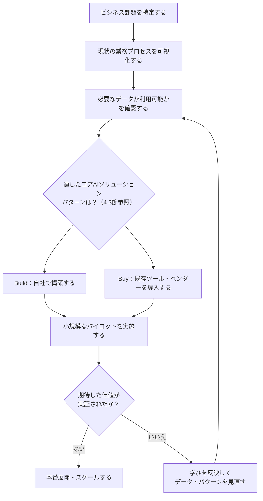

**ベストプラクティス**
- パイロット段階で成功基準（定量指標）を先に決めておき、拡大判断を主観に頼らないこと
- データが不十分・不整備な状態でいきなり大規模投資をせず、まず小さく検証すること
- Build（自社構築）とBuy（既存ツール導入）は二択ではなく、コア差別化領域はBuild、汎用領域はBuyという組み合わせも検討すること

---

### 4.6 AIベンダーの選定と管理

外部のAI製品・サービスを導入する際の評価基準です。

| 評価軸 | 確認すべきポイント |
|---|---|
| データセキュリティ・プライバシー | 入力データの学習利用有無、データ保存場所（レジデンシー）、第三者保証の取得状況（例: SOC 2）。なお **SOC 2 は「認証」ではなく、独立した公認会計士事務所が発行する保証報告書（attestation report）** であり、報告書そのものを受領して内容を読む必要がある。確認すべきは、ある時点の統制デザインのみを対象とする **Type 1** か、一定期間の運用有効性まで対象とする **Type 2** か、そしてその **監査対象期間（examination period）が現在も有効といえる範囲か** の3点 |
| 契約上の柔軟性 | ロックイン（乗り換えコスト）の程度、解約条項、データのエクスポート可否 |
| 透明性・説明可能性 | モデルの提供元、既知の限界、更新履歴の開示状況 |
| コンプライアンス適合 | GDPR・CCPA等の規制、業界固有の規制（金融・医療等）への適合状況 |
| サポート体制・SLA | 障害時の対応時間、可用性保証、日本語サポートの有無 |
| 総所有コスト（TCO） | ライセンス費用だけでなく、統合・運用・トレーニングにかかる総コスト |

**ベストプラクティス**
- 契約前に必ず小規模なPoC（概念実証）を実施し、実際の自社データ・業務での有効性を検証すること
- 「退場戦略（Exit Strategy）」を契約前に確認する。データを他サービスへ移行できるか、乗り換えコストはどの程度かを把握しておくこと
- 1社に依存しすぎない（マルチベンダー戦略）ことで、価格交渉力とリスク分散を確保すること
- ベンダーが提示するベンチマーク数値を鵜呑みにせず、自社のユースケースに近い条件で独自に検証すること

---

## 5. 試験対策のポイント

- **配点の高いドメイン3・1を優先的に学習する:** 合計で試験の約6割を占めるため、プロンプトエンジニアリングの各テクニックと基礎用語（RAG・Agent・LLMの違いなど）は確実に押さえること
- **Scaled Agile独自の用語（EDGE™、7 AI-Native Success Factors）は固有名詞として暗記する:** これらは一般的なAI用語ではなく、公式教材でしか出てこない用語のため、意味と構成要素（4つの力・7つの要因）を正確に覚えること
- **「LLMとAIエージェントの違い」「Stable/Evolving/Frontier」「5段階のAI」など、比較・分類問題が出やすい:** 表形式で整理して覚えると得点しやすい
- **責任あるAI・セキュリティは「原則名」と「中身」をセットで覚える:** OECD AI原則、NIST AI RMFのGovern/Map/Measure/Manage、OWASP Top 10 for LLM Applicationsの代表的な**リスク名**を混同しないようにする。ただしリスク番号（LLM01〜LLM10）は版によって割り当てが変わるため、番号ではなくリスク名で覚えること。本ガイドの一覧表は**2025年版**、現行版は**2026年版**であり、番号で暗記すると版をまたいだ時点で対応が崩れる
- **公式の練習問題（Practice Test）を必ず活用する:** 認定プロセスには出題傾向を把握できる模擬試験とコーチングレポートが含まれている

---

## 6. 参考文献・出典一覧

| # | 出典 | URL |
|---|---|---|
| 1 | AI-Native Foundations Certification（公式試験ガイド） | https://scaledagile.com/certification/ai-native-foundations/ |
| 2 | What Does It Mean to Be AI-Native?（EDGE™フレームワーク・7 AI-Native Success Factors） | https://ai-native-connect.scaledagile.com/public/blogs/what-does-it-mean-to-be-ai-native |
| 3 | Retrieval-Augmented Generation for Knowledge-Intensive NLP Tasks（RAG原論文, Lewis et al. 2020） | https://arxiv.org/abs/2005.11401 |
| 4 | Composite AI（Gartner用語集） | https://www.gartner.com/en/information-technology/glossary/composite-ai |
| 5 | NIST AI Risk Management Framework 1.0（公式） | https://www.nist.gov/publications/artificial-intelligence-risk-management-framework-ai-rmf-10 |
| 6 | NIST AI RMF Core機能の詳細（AIRC） | https://airc.nist.gov/airmf-resources/airmf/5-sec-core/ |
| 7 | OECD AI Principles（2024年改訂版、公式） | https://oecd.ai/en/ai-principles |
| 8 | EU AI Act（Regulation (EU) 2024/1689、公式条文） | https://eur-lex.europa.eu/eli/reg/2024/1689/oj/eng |
| 9 | GDPR（Regulation (EU) 2016/679、公式条文） | https://eur-lex.europa.eu/eli/reg/2016/679/oj |
| 10 | California Consumer Privacy Act（CCPA、公式） | https://oag.ca.gov/privacy/ccpa |
| 11 | California Privacy Protection Agency（CPPA） | https://cppa.ca.gov/ |
| 12 | OWASP GenAI LLM Top 10 2026（現行版・公式） | https://genai.owasp.org/resource/owasp-genai-llm-top-10-2026/ |
| 12-b | OWASP Top 10 for LLM Applications 2025（旧版・履歴的参考資料・公式） | https://genai.owasp.org/resource/owasp-top-10-for-llm-applications-2025/ |
| 13 | Anthropic - Prompt engineering overview（公式ドキュメント） | https://docs.anthropic.com/en/docs/build-with-claude/prompt-engineering/overview |
| 14 | The 5 Levels of AI Agents Explained（Pascal Bornet、5段階自律性モデルの一般的な参考） | https://medium.com/@knoonAi/the-5-levels-of-ai-agents-explained-agentic-artificial-intelligence-by-pascal-bornet-787c39fec1ea |
