# AIセキュリティ ベストプラクティス完全ガイド（中級〜上級者向け）

> 対象読者: LLM/生成AIアプリケーション、RAG基盤、AIエージェント、MCP（Model Context Protocol）連携システムを設計・実装・運用するAIエンジニア、セキュリティエンジニア、アーキテクト
> 最終更新基準日: 2026年7月8日（本ガイド内の年月表記はすべてこの時点の最新公開情報に基づく）

---

## 目次

1. [なぜ今、AIセキュリティなのか](#1-なぜ今aiセキュリティなのか)
2. [AI脅威ランドスケープの全体像](#2-ai脅威ランドスケープの全体像)
3. [主要セキュリティフレームワークの理解](#3-主要セキュリティフレームワークの理解)
4. [ステップ1: プロンプトインジェクション対策](#4-ステップ1-プロンプトインジェクション対策)
5. [ステップ2: 機密情報漏洩・システムプロンプト漏洩対策](#5-ステップ2-機密情報漏洩システムプロンプト漏洩対策)
6. [ステップ3: データ/モデルポイズニング対策](#6-ステップ3-データモデルポイズニング対策)
7. [ステップ4: モデル抽出・窃取対策](#7-ステップ4-モデル抽出窃取対策)
8. [ステップ5: RAG・ベクトルDBセキュリティ](#8-ステップ5-ragベクトルdbセキュリティ)
9. [ステップ6: エージェント型AI・MCPセキュリティ](#9-ステップ6-エージェント型aimcpセキュリティ)
10. [ステップ7: 出力検証・ガードレール設計](#10-ステップ7-出力検証ガードレール設計)
11. [ステップ8: AIレッドチーミング・敵対的テスト](#11-ステップ8-aiレッドチーミング敵対的テスト)
12. [ステップ9: 監視・可観測性・インシデントレスポンス](#12-ステップ9-監視可観測性インシデントレスポンス)
13. [ステップ10: サプライチェーン・AIBOM・モデル署名](#13-ステップ10-サプライチェーンaibomモデル署名)
14. [ガバナンス・法規制コンプライアンス](#14-ガバナンス法規制コンプライアンス)
15. [実際のインシデント事例から学ぶ](#15-実際のインシデント事例から学ぶ)
16. [AIセキュリティ成熟度モデルと実践チェックリスト](#16-aiセキュリティ成熟度モデルと実践チェックリスト)
17. [参考文献・引用URL一覧](#17-参考文献引用url一覧)

---

## 1. なぜ今、AIセキュリティなのか

生成AI・LLMアプリケーションは、2024年後半から2026年にかけて「文章を生成するだけの存在」から「ツールを呼び出し、記憶を持ち、自律的に行動するエージェント」へと急速に進化しました。この変化に伴い、セキュリティ上の前提そのものが変わっています。

従来のアプリケーションセキュリティは「決定論的なコードパス」を前提としていましたが、LLMは非決定論的かつ自然言語駆動であるため、攻撃面もSAST/DASTのような従来型ツールでは捉えきれません。攻撃はコードレベルではなく、プロンプトや会話レベルで発生します。さらに2025〜2026年にかけては、AIエージェントが実運用のワークフローに組み込まれ、平均的な企業ではマシンID対ヒューマンIDの比率が82対1に達しているとの報告もあり、エージェントは「テキストを生成するだけ」の存在から「現実世界のアクションを実行する」存在へと変わりました [5]。

この結果、以下のような新しいリスクカテゴリが実務上の最優先事項になっています。

- プロンプトインジェクション（直接・間接）
- 機密情報の漏洩（システムプロンプト、PII、学習データ）
- データ/モデルポイズニング、サプライチェーン攻撃
- モデル抽出・窃取
- RAG・ベクトルDBを経由した攻撃
- エージェントの目標乗っ取り、ツール誤用、権限昇格
- MCP（Model Context Protocol）のようなツール連携プロトコル特有の脆弱性

本ガイドは、これらすべてを中級〜上級者向けに、最新（2026年7月時点）の一次情報に基づいて整理し、実践的な多層防御の設計指針を提供します。

---

## 2. AI脅威ランドスケープの全体像

AIシステムは、データ層・モデル層・アプリケーション層・エージェント/ツール層・インフラ層という5つの層それぞれに固有の攻撃面を持ちます。まず全体像を俯瞰します。

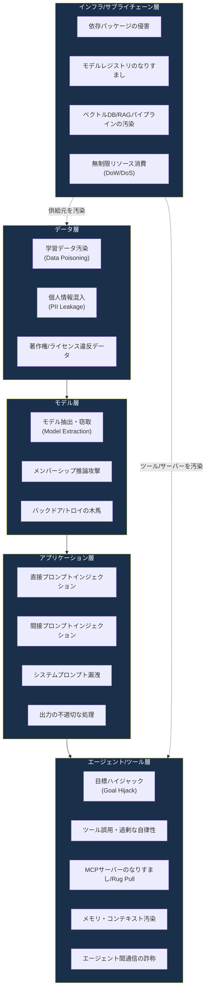

この全体像を踏まえたうえで、業界標準のフレームワークがそれぞれの層をどうカバーしているかを次章で整理します。

## 3. 主要セキュリティフレームワークの理解

AIセキュリティには「唯一の標準」は存在せず、複数のフレームワークを組み合わせて使うのが実務上の標準的アプローチです。それぞれの役割分担を理解することが最初のステップです。

| フレームワーク | 発行元 | 性質 | 主なカバー範囲 | 最新状況（2026年7月時点） |
|---|---|---|---|---|
| OWASP Top 10 for LLM Applications | OWASP GenAI Security Project | 優先度付きリスクリスト（チェックリスト型） | プロンプトインジェクション、機密情報漏洩、サプライチェーン、データ/モデルポイズニング等10項目 | 2025年版が最新。LLM01〜LLM10として体系化 [1](#ref-1)[3](#ref-3) |
| OWASP Top 10 for Agentic Applications | OWASP GenAI Security Project | エージェント特化の優先度付きリスクリスト | 目標ハイジャック、ツール誤用、ID/権限乱用、サプライチェーン侵害等 | 2026年版がBlack Hat Europe 2025で発表され、ASI01〜ASI10として整理 [10](#ref-10)[11](#ref-11) |
| MITRE ATLAS | MITRE Corporation | 攻撃者の戦術・手法のナレッジベース（ATT&CK類似） | 偵察からモデル窃取、侵害後の影響まで攻撃チェーン全体 | 2026年2月時点でv5.4.0、16戦術・84手法・56サブ手法・32緩和策・42実事例に拡大 [40](#ref-40)[41](#ref-41) |
| NIST AI RMF + Generative AI Profile | 米国NIST | 任意適用のリスクマネジメントフレームワーク | Govern/Map/Measure/Manageの4機能、生成AI特有の12リスク領域 | 2026年2月にNIST CAISIがAI Agent Standards Initiativeを発表、将来的な成果物の策定に向け活動中 [30](#ref-30)[32](#ref-32) |
| ISO/IEC 42001 | ISO/IEC | 認証可能なマネジメントシステム規格（PDCA型） | AI管理システム全体のガバナンス、リスク管理、説明責任 | 世界初の認証可能なAI管理システム規格。Microsoft、Synthesia等が認証取得済み [102](#ref-102)[106](#ref-106) |
| EU AI Act | 欧州連合 | 法的拘束力のある規制 | リスクベースのAI規制、GPAIモデル義務、高リスクAIシステム義務 | 2026年8月2日に大部分が適用開始。高リスク義務は2027年12月/2028年8月へ延期見込み（Omnibus合意） [58](#ref-58)[60](#ref-60) |

これらの関係性を図で整理すると、次のようになります。

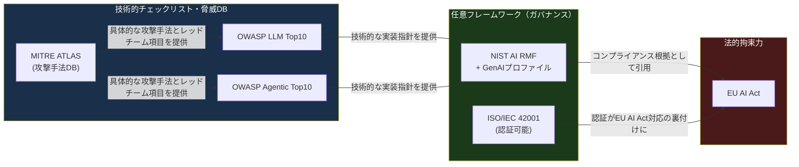

実務上の使い分けの目安:

- **ガバナンス・経営層への説明責任**が目的なら → NIST AI RMF / ISO 42001
- **開発チームの技術的実装チェックリスト**が目的なら → OWASP Top 10 (LLM / Agentic)
- **レッドチーム演習・脅威モデリングの語彙**が目的なら → MITRE ATLAS
- **法的コンプライアンス**が目的なら → EU AI Act（および各国のAI関連法）

## 4. ステップ1: プロンプトインジェクション対策

OWASP Top 10 for LLM Applications 2025において、プロンプトインジェクションは依然として第1位（LLM01:2025）の重大リスクです [1][3]。攻撃者がLLMへの入力を操作し、意図した振る舞いを上書きすることで、機密情報の窃取・意思決定の改ざん・不正なツール実行を引き起こします。

### 4.1 直接インジェクションと間接インジェクションの違い

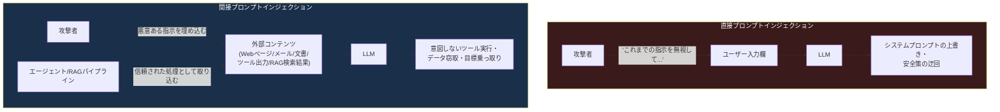

間接インジェクションが特に危険な理由は、コンテンツの出どころ（provenance）をユーザーが検証できない点にあります。エージェントが読み込む文書・メール・ツール出力は「データ」であるはずなのに、LLMの内部ではそれが「指示」として解釈されてしまう構造的な問題です。

### 4.2 防御技術の比較

OpenAI・Anthropic・Google DeepMindはいずれも2025年の公表資料で「現在のLLMアーキテクチャの範囲内ではプロンプトインジェクションを完全に解決することはできない」と認めています。モデルレベルで表現される防御策は原理的にすべて上書きされうるためです [28]。したがって実務上は「多層防御でブラスト半径を縮小する」ことが目標になります。

| 防御技術 | 概要 | 効果（研究報告値） | コスト/トレードオフ |
|---|---|---|---|
| Spotlighting（区切り・データマーキング・エンコーディング） | 信頼できない外部コンテンツを特殊なマーカーで囲み、モデルに「これは指示ではなくデータ」と明示する | 攻撃成功率を50%超から2%未満に低減（GPT系モデルでの実験） [32][53] | 実装コストは低いが、適応的攻撃には依然脆弱 |
| StruQ（構造化クエリ） | ベースモデルを再学習し、プロンプト部分とデータ部分を分離したチャネルとして扱わせる | プロンプトインジェクション成功率を大幅に低減 | モデルの再学習が必要でコスト高 |
| SecAlign（選好最適化） | 学習時にプロンプトインジェクションへの耐性を最適化する | 各種インジェクションの成功率を10%未満に低減（訓練時に見ていない高度な攻撃に対しても） [54] | モデル提供側でのみ実施可能 |
| Self-Reminder | システムプロンプトにユーザークエリを包み込み、責任ある応答を促す | ジェイルブレイク成功率を67.21%から19.34%へ低減 [54] | 軽量だが万能ではない |
| LLMベース前処理フィルタ（PromptArmor等） | 専用LLMで入力を検査し、インジェクション内容を検出・除去する | AgentDojoベンチマークで誤検知/見逃し率1%未満 [50] | 追加のLLM呼び出しにより200〜600msのレイテンシ増 |
| 出力スキーマ検証 | ツール呼び出しやレスポンスをJSON Schema等で厳格に検証する | 明らかな逸脱を機械的に検出 | 低コストで常時導入すべき基礎対策 |
| 行動監視・多モデル投票 | 複数モデルでの合議、または実行後の振る舞い一貫性チェック（MELON等） | 高リスクなアクションに限定して有効 | コスト・レイテンシ増（30〜50%程度） |

実務でのプライオリティは、TokenMixの2026年ベンチマークが示す実装順序が参考になります: ①構造化プロンプトフォーマット（無償・常時導入）→ ②出力スキーマ検証（低コスト）→ ③レート制限 → ④LLMフィルタ → ⑤行動監視 → ⑥高リスクアクション限定の多モデル投票、という段階的な積み上げです [50]。

### 4.3 実装チェックリスト

- [ ] すべての外部コンテンツ（RAG検索結果、Web取得結果、ツール出力、添付ファイル）を「信頼できない入力」として扱う
- [ ] システムプロンプトとユーザー/外部データを明確に分離する区切り文字・タグを導入する（例: `<user_input>`、`<untrusted_content>`）
- [ ] 高リスクなアクション（送金、削除、デプロイ、権限変更等）には人間による再確認（Step-up確認）を要求する
- [ ] 単一の防御技術に依存せず、入力検証・出力検証・行動監視を組み合わせた多層防御を構築する
- [ ] プロンプトインジェクションは「防御しきれない前提」でインシデント対応計画を用意する

## 5. ステップ2: 機密情報漏洩・システムプロンプト漏洩対策

OWASP Top 10 2025では「Sensitive Information Disclosure」がLLM02、「System Prompt Leakage」がLLM07として独立したカテゴリになっています [8]。

### 5.1 何が漏洩しうるか

- システムプロンプトそのもの（内部ロジック、機密ビジネスルール、APIキーの参照方法などが含まれる場合がある）
- 学習データに含まれるPII（個人識別情報）や機密文書の記憶（memorization）
- RAGパイプラインを通じて取得された、本来アクセス権のない他テナントのデータ
- ツール呼び出しの引数・レスポンスに含まれる認証情報

### 5.2 対策

| 対策領域 | 具体策 |
|---|---|
| システムプロンプト設計 | 機密情報（APIキー、内部ロジックの詳細、他ユーザーの情報）をシステムプロンプトに含めない。含めざるを得ない場合は別レイヤー（ツール呼び出し経由）で注入し、モデルのコンテキストウィンドウに直接置かない |
| 出力フィルタリング | 正規表現・分類器・DLP（データ損失防止）ツールを組み合わせ、APIキーやPIIパターンを含む応答をブロックする |
| アクセス制御 | RAG検索やツール呼び出しは、呼び出し元ユーザーの権限スコープでのみ実行する（後述のConfused Deputy対策と直結） |
| 監査ログ | すべての入出力をログ化し、異常な質問パターン（システムプロンプトを聞き出そうとする探索的クエリ等）を検知する |
| ネットワーク境界での保護 | AI Gatewayやプロキシ層でトラフィックを可視化し、ビット単位でのデータ漏洩検知を行う [7] |

## 6. ステップ3: データ/モデルポイズニング対策

データポイズニングは学習データを汚染して推論時の振る舞いを操作する攻撃であり、推論時に入力を細工する回避攻撃（evasion attack）とは区別されます [76]。攻撃者は「特定の入力に対してのみ攻撃者が望む出力を返し、それ以外では正常に動作する」よう仕込むため、標準的な評価だけでは検出が困難です。

### 6.1 データポイズニングとモデルポイズニングの違い

- **データポイズニング**: 学習データそのものに悪意あるサンプルを注入する
- **モデルポイズニング**: 学習済みモデルのパラメータやファインチューニング過程を操作する（例: 手書き文字認識モデルで「3」を「8」と誤認識させ、小切手の金額を改ざんする実例が知られています） [77]

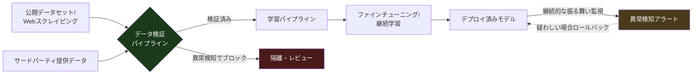

### 6.2 実践的な防御策（OWASP推奨に基づく8つの戦術）

1. **データ来歴の検証**: 学習パイプラインを通過するすべてのデータを厳格に検証する。デジタル署名やハッシュ検証で改ざんを検知する
2. **アクセス制御**: 学習データセット・パイプラインへのアクセスにRBAC、多要素認証、最小権限原則を適用する [77]
3. **データバージョン管理**: 変更履歴を追跡し、いつ・誰が・何を追加したかを監査可能にする
4. **サンドボックス化**: 外部データソースの取り込みは隔離環境で行い、影響範囲を限定する
5. **異常検知**: 特定の入力グループに対する性能劣化や予測パターンの偏りを継続的にモニタリングする
6. **分布シフト検知**: モデル振る舞いの分布シフトに対する自動アラートを設定する
7. **敵対的トレーニング**: 既知の攻撃パターンを意図的に学習に含め、頑健性を高める
8. **EU AI Actへのコンプライアンス**: 高リスクAIシステム提供者はデータガバナンス（品質管理・バイアス検出）の実施が義務付けられており、ポイズニング対策はコンプライアンス上の要求でもあります [76]

参考として、NIST AI 100-2（Adversarial Machine Learning: A Taxonomy and Terminology of Attacks and Mitigations）は、ポイズニング攻撃に関する標準化された語彙と脅威分類を提供しており、リスクアセスメントの共通言語として活用できます [76]。

## 7. ステップ4: モデル抽出・窃取対策

モデル抽出（Model Extraction / Model Stealing）は、公開されている推論API（予測API）に大量のクエリを投げ、その入出力ペアから代理モデル（サロゲートモデル）を再構築する攻撃です。2016年のTramèrらによる「Stealing Machine Learning Models via Prediction APIs」以降、研究が蓄積されています [78][80]。

### 7.1 関連する攻撃のファミリー

| 攻撃 | 概要 |
|---|---|
| モデル抽出攻撃 | 予測APIへの大量クエリから、機能的に類似したモデルを再構築する |
| メンバーシップ推論攻撃 | ある特定のデータが学習データに含まれていたかどうかを推測する |
| モデル反転攻撃 | モデルの出力から学習データ（機密情報を含む可能性がある）を復元する |
| データフリー抽出 | 実データを用いず、合成データのみでモデルを抽出する高度な手法 |

### 7.2 防御策

- **レート制限とクエリ監視**: 単一アカウント/IPからの異常に高頻度・高ボリュームなクエリを検知し、レート制限やCAPTCHA、一時停止で対応する
- **出力の丸め・ノイズ付加**: 確信度スコアなど詳細すぎる出力情報を制限し、丸め処理やノイズを加えることでモデル内部構造の推測を難しくする
- **透かし（Watermarking）**: モデルの出力に検出可能な透かしを埋め込み、不正な複製モデルの証拠とする
- **クエリパターン分析**: 決定境界を探るような系統的なクエリパターン（クラス境界の走査等）を検知する異常検知システムを導入する
- **APIキー・利用規約による法的保護**: 技術的対策に加え、利用規約・レート制限・APIキー単位の追跡で法的責任の所在を明確にする
- **知的財産としてのモデル管理**: モデル自体をAIBOM（後述）で資産管理し、不正な複製や再配布を検知する仕組みを整える

## 8. ステップ5: RAG・ベクトルDBセキュリティ

RAG（Retrieval-Augmented Generation）は、LLMの知識をリアルタイムの外部データで補強する強力な仕組みですが、OWASP Top 10 2025では新たに「LLM08:2025 Vector and Embedding Weaknesses」というカテゴリが追加されたことが示す通り、独自の攻撃面を持ちます [97][99]。

### 8.1 RAGパイプラインの構造と攻撃面

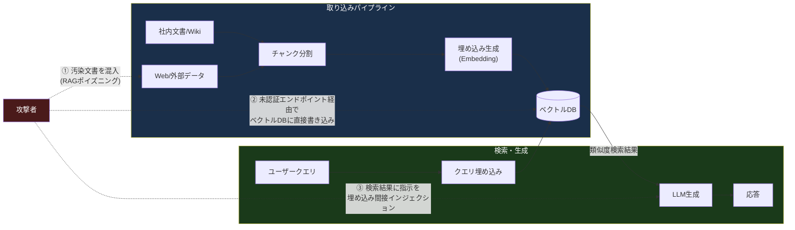

### 8.2 主要な攻撃パターン

- **RAGポイズニング（PoisonedRAG / CorruptRAG）**: わずか数件、場合によっては単一の汚染文書をベクトルDBに混入させるだけで、特定の高価値クエリに対する回答を97%の確率でハイジャックできるという研究結果が報告されています。単純な複数文書注入型（PoisonedRAG）に加え、2026年1月に発表されたCorruptRAGは単一文書での攻撃を実現し、ボリュームベースの異常検知を回避しやすくなっています [97][98]
- **埋め込み反転攻撃（Embedding Inversion）**: 高次元ベクトルから元のテキスト（機密情報を含む可能性がある）を復元する攻撃
- **クロステナント意味的漏洩**: マルチテナントのベクトルDBにおいて、あるテナントのクエリの埋め込みが別テナントの機密文書の埋め込みと意味的に近接しているために、意図せず情報が漏洩するケース [98]
- **未認証エンドポインの露出**: 2026年2月に発生したAnythingLLMのインシデントでは、未認証のエンドポイントがPinecone APIキーを露出させ、企業の埋め込みデータへの読み書き削除フルアクセスを許してしまいました（詳細は15章の事例を参照） [94]

### 8.3 対策

| 領域 | 具体策 |
|---|---|
| 取り込みパイプラインの保護 | 外部ソースからの取り込みには「検疫（quarantine）→レビュー→承認」のワークフローを設ける。隠れたUnicode文字や指示的なフレーズなど既知のポイズニングパターンをスキャンする [96] |
| 書き込み権限の分離 | 取り込み用ロールと検索用ロールを分離し、コレクション/名前空間単位で最小権限を適用する [95] |
| アクセス制御 | RBAC/ABACとネットワーク分離を組み合わせたマルチテナントアクセス制御を実装する |
| 暗号化 | 保存時・転送時の埋め込み暗号化。高リスク用途では準同型暗号による暗号化ベクトル上での類似度検索も検討する [98] |
| 監視 | 特定チャンクへの検索急増、低信頼度マッチの連続、最近更新されたドキュメントからの逸脱パターンなど、異常な検索パターンを監視する [96] |
| コンプライアンス基盤 | クエリレベルのアクセスログ、RBACのエビデンス、暗号鍵管理文書、名前空間エスケープテストを整備する。これらの欠如がSOC 2 Type II監査やHIPAA評価の失敗要因になっています [94] |

## 9. ステップ6: エージェント型AI・MCPセキュリティ

AIエージェントとMCP（Model Context Protocol）は、2026年時点で最も急速にリスクが拡大している領域です。エージェントは「計画し、ツールを呼び出し、記憶を保持し、他のエージェントと通信し、実世界のクレデンシャルで行動する」存在であるため、単なるチャットボットのセキュリティモデルでは対応できません [16]。

### 9.1 OWASP Top 10 for Agentic Applications 2026 (ASI01〜ASI10)

2026年版OWASP Top 10 for Agentic Applicationsは、Black Hat Europe 2025でのOWASP Agentic Security Summitと合わせて発表され、100以上の業界専門家によるレビューを経て策定されました [10]。

| ID | リスク名 | 概要 | 主な緩和策 |
|---|---|---|---|
| ASI01 | Agent Goal Hijack（目標ハイジャック） | ツール出力・検索結果・メール等に埋め込まれた悪意ある指示によって、エージェントの目的そのものが書き換えられる | すべてのエージェント消費コンテンツを信頼できないものとして扱う。指示とデータを構造的に分離し、目標スコープを固定する [16] |
| ASI02 | Tool Misuse & Exploitation（ツール誤用・悪用） | 過剰な権限を持つツールが、悪意なくとも誤用される | ツールごとに最小権限のスコープを設計し、実行前に文脈依存の承認を要求する |
| ASI03 | Agent Identity & Privilege Abuse（ID・権限乱用） | セッション・ユーザー・委任ワークフローをまたいで権限が誤って継承・保持される（例: マネージャーがタスクを委任した後も管理者権限が残存） | エージェントに専用の管理されたIDと制限付きスコープを持たせ、ユーザーセッションを「借用」させない [17][56] |
| ASI04 | Agentic Supply Chain Compromise（サプライチェーン侵害） | プロンプト・プラグイン・ツール・エージェントカード・モデルを動的にロードする際、侵害/なりすましコンポーネントが混入する | 署名検証、レジストリのスキャン、バージョン固定、変更のレビュー |
| ASI05 | Unexpected Code Execution（意図しないコード実行） | コード生成/実行を行うエージェントが悪意ある指示で任意コードを実行させられる | サンドボックス実行環境、実行前の静的解析、ネットワークアウトバウンド制限 |
| ASI06 | Memory & Context Poisoning（メモリ・コンテキスト汚染） | 将来のセッションで読み取られるメモリに悪意ある内容が書き込まれ、書き込みと読み取りの時間差により検出が困難な遅延攻撃となる | メモリに書き込む前に構造的分離（spotlighting等）を適用する。メモリの出所を追跡する [48] |
| ASI07 | Insecure Inter-Agent Communication（安全でないエージェント間通信） | 複数エージェントが連携する際の通信チャネルが検証されず、なりすましや改ざんが可能になる | エージェント間通信の相互認証、メッセージ署名、ゼロトラスト設計 |
| ASI08 | Cascading Agent Failures（連鎖的障害） | 1つのエージェントの誤動作が、依存する他のエージェント/ワークフローに連鎖的に波及する | サーキットブレーカーパターン、障害の分離、段階的縮退設計 |
| ASI09 | Human-Agent Trust Exploitation（人間-エージェント間信頼の悪用） | 説得力のあるエージェントの出力が人間の承認を「ゴム印」化させ、自動化バイアスを助長する | 高リスクアクションへのステップアップ認証、信頼度スコアの明示、AIが書いていない平易な要約の提示 [17] |
| ASI10 | Rogue Agents（暴走エージェント） | エージェントの意思決定プロセスが乗っ取られ、悪意ある主体として振る舞う | 厳格な運用上の制約とガードレール、振る舞いの異常に対する継続的監視 |

> 補足: 「Least Agency（最小自律性）の原則」という考え方が2026年版で強調されています。自律性は既定値ではなく「勝ち取るべき機能」であり、エージェントに白紙委任を与えることは、単一の悪意あるプロンプトで操作可能な内部脅威を生み出すことに等しい、という指摘です [17]。

### 9.2 MCP（Model Context Protocol）特有の攻撃面

MCPは2024年11月にAnthropicが発表したオープン標準で、AIホスト（Claude Desktop、Cursor、VS Code Copilot等）とツール/データソースを標準化されたJSON-RPCベースの仕組みで接続します [11][21]。2025年11月の仕様（2025-11-25）ではリモートMCPサーバーの認証方式としてOAuth 2.1が正式に組み込まれ、プロトコルのセキュリティ成熟度が一段階進みましたが [22]、2026年1〜2月には30件以上のCVEがMCPサーバー・クライアント・インフラコンポーネントに対して報告されています。中でもmcp-remoteプロキシパッケージに関わるCVE-2025-6514はCVSS 9.6という高スコアを記録しました [22]。

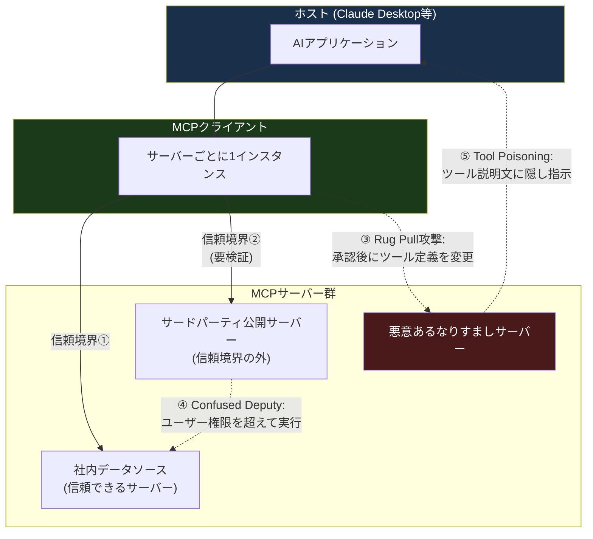

主要な攻撃パターンと対策を整理します。

| 攻撃パターン | 概要 | 対策 |
|---|---|---|
| Tool Poisoning（ツール説明文の毒化） | ユーザーが検査できないツール説明文の部分に悪意ある指示を埋め込み、AIの意思決定に影響を与える。OWASP Agentic Top10のASI01（目標ハイジャック）に構造的に類似する | ツール説明文を既知の正常なベースラインと照合検証する。セッション間での変化を検知する（Invariant Labsのmcp-scan等のOSSツールが利用可能） [22] |
| Rug Pull攻撃（Bait-and-Switch） | 一度承認されたMCPツール登録が継続的に再検証されないことを悪用し、承認後にツール定義を差し替える | ツール定義のハッシュ検証、定期的な再承認フロー、変更検知アラート [22] |
| Confused Deputy Problem | MCPサーバーがユーザーより広い権限で動作できる場合、ユーザーが本来許可されていない操作を実行してしまう | サーバーは「ユーザーに代わって明示的な同意のもと、最小権限スコープで」動作させる。包括的なサービスIDでの実行を避ける [26] |
| Token Passthrough | クライアントトークンを適切な検証なしに下流APIへそのまま渡してしまい、信頼境界とオーディエンス制御が破られる | トークンのオーディエンス検証を必須化し、パススルーを許可しない [26] |
| サプライチェーン型侵害 | typosquattingされたツール名、リモートで差し替えられたプロンプトテンプレート、署名されていないエージェントカードによる隠し動作の注入 | パッケージレジストリのアカウント検証、依存関係のスキャンとバージョン固定、公開前レビュー [17][26] |
| リポジトリ設定ファイル経由のRCE | 信頼できないプロジェクトをクローンして開くだけで、リポジトリレベルの設定ファイルが実行層の一部として機能し、ユーザーの同意ダイアログの前にリモートコード実行やAPIキー流出が起きる（Claude CodeにおけるCVE-2025-59536, CVE-2026-21852として報告） | 未検証リポジトリを開く前のサンドボックス化、設定ファイルの自動実行を無効化するデフォルト設定 [18] |

### 9.3 「Lethal Trifecta（致死の三要素）」という考え方

Simon WillisonとPalo Alto Networksが2026年に提唱した概念で、以下の3条件が同時に満たされるとエージェントスキル/ツールは特に危険になるとされています [18]。

1. **プライベートデータへのアクセス**（SSHキー、APIクレデンシャル、ウォレットファイル、ブラウザデータ等）
2. **信頼できないコンテンツへの露出**（スキル指示、メモリファイル、メール等）
3. **外部通信能力**（ネットワークegress、webhook呼び出し、curl等）

多くの本番エージェントデプロイはこの3条件をすべて満たしているのが実情であり、いずれか1つを断ち切る設計（例: 外部通信が必要なツールにはプライベートデータへのアクセスを与えない）がリスク低減の鍵になります。

### 9.4 MCP実装チェックリスト

- [ ] すべてのツール入力を「LLMから来たものであり、ユーザーから直接来たものではない」信頼できない入力として扱う [20]
- [ ] JSON Schemaで`additionalProperties: false`を含む厳格なスキーマ検証を行う [20]
- [ ] ツール登録は一度きりでなく、定期的な再検証・変更検知の仕組みを持たせる（Rug Pull対策）
- [ ] MCPサーバーはユーザーの同意のもと最小権限スコープで動作させ、包括的なサービスIDを使わない（Confused Deputy対策）
- [ ] リモートMCPサーバーとの通信にはOAuth 2.1ベースの認証を利用する
- [ ] ローカルMCPサーバーはサンドボックス化して実行する [24]
- [ ] サプライチェーン全体（依存パッケージ、スキル、エージェントカード）に署名検証とスキャンを適用する

## 10. ステップ7: 出力検証・ガードレール設計

入力側の防御だけでなく、LLMの出力を実行・表示する前に検証する「出力側のガードレール」が同様に重要です。OWASP LLM05:2025「Improper Output Handling」は、出力の検証・サニタイズ・エスケープが不十分なために、下流システムでのコード実行やXSS等につながるリスクを指摘しています [1]。

### 10.1 多層防御としてのガードレール設計

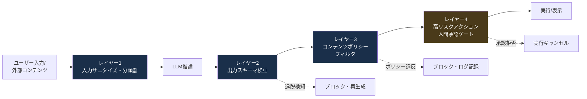

### 10.2 具体的な実装ポイント

- **構造化出力の強制**: 自由形式のテキストではなく、JSON Schema等で構造化された出力を要求し、機械的に検証する
- **コード実行前のサンドボックス**: 生成されたコードは、実行前に必ず隔離されたサンドボックス環境を経由させる
- **エスケープ処理の徹底**: 出力をHTML/SQL/シェルコマンド等に埋め込む場合は、必ず適切なエスケープ・パラメータ化を行う（従来のインジェクション対策と同様の考え方）
- **確信度・出典表示**: RAGベースの回答には出典を明示し、ユーザーが検証可能にする
- **ハルシネーション対策**: 重要な事実確認が必要な出力については、複数ソースでのクロスチェックや、モデル自身による自己検証ステップを組み込む
- **ポリシー違反コンテンツの検知**: 差別的表現、機密情報、規制対象コンテンツ等を検知する分類器をパイプラインに組み込む

## 11. ステップ8: AIレッドチーミング・敵対的テスト

AIレッドチーミングは、LLMやAIエージェントに対して敵対的手法で組織的にテストを行い、攻撃者より先に脆弱性を発見する実践です。従来のペネトレーションテストとは根本的に異なり、攻撃面が確率的であり、脆弱性はモデルの振る舞いに起因し、パッチは離散的なコード修正ではありません [71]。

### 11.1 セーフティ・レッドチーミングとセキュリティ・レッドチーミング

Microsoft AI Red Teamは2つの重複する目的を区別しています [71]。

- **セーフティ・レッドチーミング**: 有害コンテンツ生成やポリシー違反のテスト
- **セキュリティ・レッドチーミング**: データ漏洩・システム侵害・不正なツール使用のテスト

### 11.2 レッドチーミングのライフサイクル

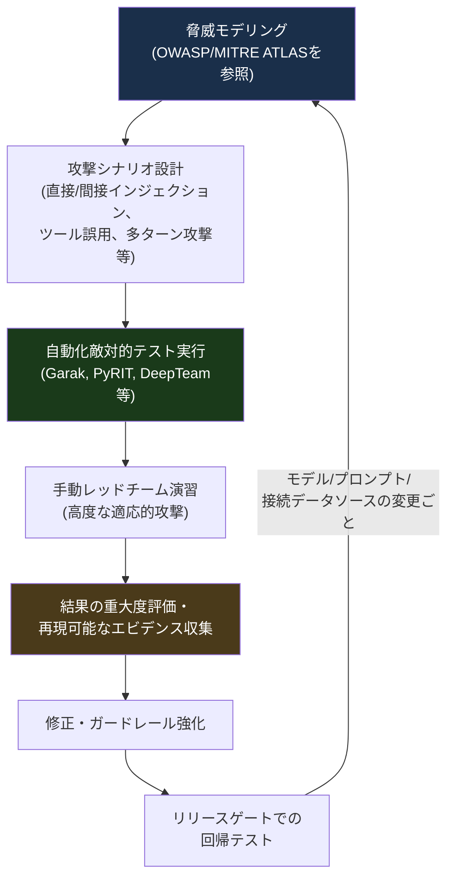

一度きりのテストでは不十分です。モデルの更新、ファインチューニング、システムプロンプトの変更、接続データソースの変更のいずれもが新たな脆弱性を生む、または既存の修正を後退させる可能性があるため、継続的な回帰テストが必要です [71]。

### 11.3 主要なツール・フレームワーク

| ツール/フレームワーク | 種別 | 特徴 |
|---|---|---|
| OWASP Top 10 for LLMs / Agentic Applications | カバレッジフレームワーク | テスト対象リスクの優先順位付けに使用 |
| MITRE ATLAS | 脅威分類・戦術データベース | レッドチームのシナリオ設計の語彙として活用 |
| Garak | OSSツール | LLM脆弱性の自動スキャン |
| PyRIT (Microsoft) | OSSフレームワーク | 敵対的プロンプトの自動生成・評価 |
| DeepTeam | OSSフレームワーク | OWASP Top10フレームワークに基づく自動レッドチーム実行 [8] |
| Confident AI / General Analysis 等 | 商用プラットフォーム | エージェント・RAG・MCP・マルチステップツール利用を含むシステムレベルの敵対的テスト、CI/CDリリースゲート統合 [68][69] |

### 11.4 コミュニティリソース

- **Humane Intelligence**: 公開レッドチーム演習の実施とコミュニティでの知見共有
- **AI Vulnerability Database（AI Risk and Vulnerability Alliance）**: コミュニティ主導の脆弱性登録データベース
- **DEF CON GRT / AISI**: レッドチーミング競技会を通じたスキル習得と知見の蓄積 [72]

## 12. ステップ9: 監視・可観測性・インシデントレスポンス

NISTは2026年3月のAI監視に関する報告書で、エージェント型システムの監視は「機能性・運用性・セキュリティ・コンプライアンス・人的要因」の5次元にまたがる必要があり、従来ソフトウェアの稼働率監視だけでは不十分だと明言しています [20]。

### 12.1 監視すべき5つの次元

| 次元 | 監視内容の例 |
|---|---|
| 機能性 | タスク成功率、ハルシネーション率、出力品質の劣化 |
| 運用性 | レイテンシ、コスト（トークン消費）、リソース使用量の異常（Denial of Wallet対策） |
| セキュリティ | 異常なツール呼び出しパターン、権限外アクセス試行、既知の攻撃シグネチャとの一致 |
| コンプライアンス | データ処理の記録、監査証跡、規制で要求されるロギング（EU AI Act Article 12等） |
| 人的要因 | 人間の承認プロセスの遵守状況、自動化バイアスの兆候（過剰な「承認」クリック） |

### 12.2 インシデントレスポンスフロー

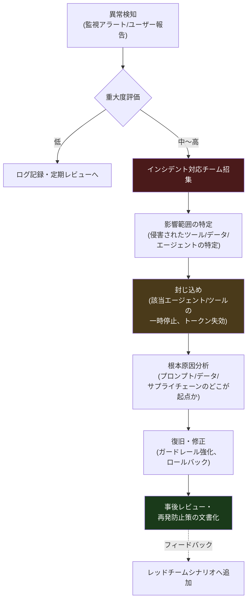

### 12.3 実装のポイント

- **完全な監査ログ**: すべてのプロンプト、ツール呼び出し、レスポンス、承認/拒否の記録を改ざん耐性のある形で保存する
- **リプレイ可能なエビデンス**: レッドチーム/インシデント調査の双方で「再現可能なトレース」を残すことが、監査での説得力を左右します [68]
- **異常検知の自動化**: 単なるルールベースだけでなく、ベースラインからの逸脱を検知する統計的/機械学習的手法を組み合わせる
- **ロールバック可能性**: モデル・プロンプト・ツール構成のバージョン管理を行い、迅速なロールバックを可能にする
- **開示・通知プロセス**: NIST AI RMF Generative AI Profileが重視する4つの柱の1つが「インシデント開示」であり、組織内外への適切な通知プロセスをあらかじめ設計しておく必要があります [32]

## 13. ステップ10: サプライチェーン・AIBOM・モデル署名

2026年、ソフトウェアサプライチェーンセキュリティは「静的SBOM（Software Bill of Materials）」の時代から「AIエージェントをサプライチェーンの主要なアクターとして扱うガバナンスの時代」へ移行しつつあります [86]。

### 13.1 AIBOM（AI Bill of Materials）とは

AIBOMは、モデルの来歴・ライセンス・学習データ・意図された用途を記録した検証可能な記録です [91]。従来のSBOMがカバーしていた「ソースコードと依存関係」に加え、以下の要素をカバーします。

- モデルの重み（weights）とその来歴
- 学習データセットとそのライセンス
- ハイパーパラメータと推論時の依存関係
- ファインチューニングの履歴
- RAGソースとエージェントツールの依存関係

### 13.2 標準化の動向

| 標準/取り組み | 発行元 | 状況 |
|---|---|---|
| CycloneDX 1.7 | OWASP CycloneDX | 2025年10月にAI/ML-BOMカバレッジを拡張。モデル来歴・学習データ・ハイパーパラメータ・推論依存関係の表現に2026年時点で事実上の標準として使われている [84] |
| OWASP AIBOMプロジェクト | OWASP | 2025年11月にv0.1マイルストーンに到達。SPDX 3.0と並行してAIシステム特有の要件を拡張中 [84] |
| Sigstore + cosignによるモデル署名 | CoSAI / OSS | 「モデル署名はエンタープライズセキュリティに不可欠な、欠けていたプリミティブ」として2025年7月に位置付けられ、2026年のベンダーRFPでは事実上の標準要件になっている [84] |
| CISA他「AI in OTの安全な統合のための原則」 | CISA, NSA, FBI, 豪ACSC等 | 2025年12月3日に共同署名。重要インフラにおけるAI統合の安全原則を規定 [84] |

### 13.3 実践的な導入ステップ

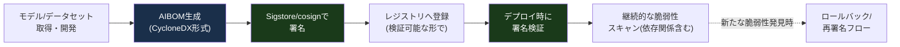

### 13.4 セーフシリアライゼーションの重要性

モデルファイルの配布形式にも注意が必要です。Pickle形式でのモデルロードは任意コード実行のリスクを内包するため、Hugging Faceは公式にPickleスキャンのドキュメントを提供しており、Safetensors形式（安全なシリアライゼーション）への移行が推奨されています [90]。

## 14. ガバナンス・法規制コンプライアンス

技術的対策だけでなく、組織的なガバナンス体制の構築が不可欠です。ここでは実務上重要な3つの柱（EU AI Act、NIST AI RMF、ISO/IEC 42001）を整理します。

### 14.1 EU AI Actの適用タイムライン（2026年7月時点の最新状況）

EU AI Actは2024年8月1日に発効し、段階的に適用されています。2025年11月19日に欧州委員会が提案した「Digital Omnibus on AI」により、高リスクAIシステムの義務化時期が延期される見込みで、2026年5月7日に政治合意、6月16日に欧州議会が正式承認、6月29日に理事会が最終承認しました [64][66]。

| 適用日 | 内容 |
|---|---|
| 2025年2月2日 | 禁止されるAI慣行、AIリテラシー義務が適用開始 |
| 2025年8月2日 | ガバナンス規則、汎用AI（GPAI）モデル提供者の義務が適用開始 |
| **2026年8月2日** | 大部分の規則が適用開始。透明性義務（第50条、チャットボット等のAI利用開示）もこの日から適用 [58][59] |
| 2026年12月2日 | AI生成コンテンツのラベリング（透かし等）義務の猶予期限。CSAM・非合意的性的画像生成の新たな禁止事項もこの日から [61][64] |
| **2027年12月2日** | 単体の高リスクAIシステム（Annex III: 採用、信用スコアリング、法執行、教育、国境管理等）の義務化（Omnibusにより延期後の日程） [60][64] |
| **2028年8月2日** | 規制対象製品に組み込まれた高リスクAI（Annex I: 医療機器、機械等）の義務化（同上） [60][64] |

> 注意: 2026年8月2日は「現行の拘束力ある期日」として扱うべきです。Omnibusによる延期は政治合意・議会承認を経ていますが、正式にEU官報で公布されるまでは、企業は元のスケジュール（2026年8月2日）に沿った準備を継続すべきとする法律専門家の見解が一般的です [63][66]。

### 14.2 NIST AI RMFとGenerative AI Profile

NIST AI RMF（AI 100-1）は2023年1月に公開された任意フレームワークで、Govern/Map/Measure/Manageの4機能から構成されます。2024年7月26日には生成AI特有のリスクに対応する「Generative AI Profile（NIST AI 600-1）」が追加公開され、以下12のリスク領域を定義しています [19][30][36]。

- CBRN情報（化学・生物・放射性・核兵器に関する有害情報へのアクセス）
- ハルシネーション（confabulation）
- ヘイトスピーチ・偏見的表現
- データプライバシー
- 情報インテグリティ（誤情報）
- 知的財産権侵害
- 環境影響
- 有害なバイアス
- 危険・違法・倫理に反する行為の助長
- 過度な依存（Overreliance）
- セキュリティ（従来型・新規のサイバー攻撃対象領域の拡大）
- CSAM/NCII生成リスク

2026年2月には、NIST CAISI（Center for AI Standards and Innovation）が「AI Agent Standards Initiative」を発表し、ID・認可、セキュリティ・リスク管理、監視・ロギングをカバーするエージェント向けガイドラインを2026年第4四半期に予定しています [20][33]。

### 14.3 ISO/IEC 42001によるマネジメントシステム認証

ISO/IEC 42001:2023は、世界初の「認証可能な」AIマネジメントシステム規格です [103][108]。他のフレームワーク（NIST AI RMF等）が任意のガイダンスであるのに対し、ISO/IEC 42001はPDCA（Plan-Do-Check-Act）サイクルに基づく認証プロセスを備えており、独立した認証機関による第三者監査を受けられます。

- Microsoftは自社AIシステムについて定期的な第三者監査を受け、Service Trust Portalで証明書・監査報告書を公開しています [102]
- SynthesiaはA-LIGNとのパートナーシップでISO/IEC 42001認証を取得し、EU AI Actへの準拠を先取りする形でコンプライアンス姿勢を示しました [111]
- 実務上は「NIST AI RMFで内部のリスク管理プロセスを構築し、ISO/IEC 42001で第三者認証による対外的な信頼性を担保する」という組み合わせが典型的です

### 14.4 ガバナンス構築の優先順位（実務ガイド）

1. **AIシステムのインベントリ作成**: 組織内で使用されているすべてのAIシステム（サードパーティ・生成AIツールを含む）を棚卸しし、目的・データ・影響を受ける集団・市場を文書化する [63]
2. **リスク分類**: 各システムをEU AI Actのリスク階層（禁止/高リスク/限定リスク/最小リスク）にマッピングする
3. **ガバナンス体制の確立**: Map/Measure/Manageを反復可能にするため、まず「Govern」（方針・責任・監督ロール）を整備する。これを飛ばすと多くのAI RMFプログラムがパイロット後に停滞します [37]
4. **段階的な適用範囲拡大**: 最初は1つの中リスクシステムに絞って実践し、成功パターンを横展開する

## 15. 実際のインシデント事例から学ぶ

理論だけでなく、2025年後半〜2026年前半に実際に発生した事例を把握しておくことは、レッドチームのシナリオ設計にも直結します。

| 時期 | 事例 | 概要 | 教訓 |
|---|---|---|---|
| 2026年2月 | AnythingLLMインシデント | 未認証のエンドポイントがPineconeのAPIキーを露出させ、企業の埋め込みデータへの読み書き削除フルアクセスが可能になった [94] | ベクトルDBへのアクセスも「通常のAPIエンドポイント」と同じ厳格さで認証・認可を設計する必要がある |
| 2026年1〜2月 | MCPエコシステムへの大量CVE報告 | 30件以上のCVEがMCPサーバー・クライアント・インフラに報告され、mcp-remoteプロキシのCVE-2025-6514はCVSS 9.6を記録 [22] | 急速に普及したプロトコルは、普及速度にセキュリティガバナンスが追いつかない典型例。サプライチェーン全体のスキャンが必須 |
| 2026年第1四半期 | ClawHub（OpenClawスキルレジストリ）の組織的汚染 | 主要なAIエージェントスキルレジストリが体系的に汚染された最初の事例。ピーク時、最もダウンロードされたスキル上位7件中5件がマルウェアと確認された [9] | 自動スキャンとVirusTotal連携などの防御が事後的に導入されたが、エコシステム全体としては依然無防備な領域が広い |
| 継続的観測 | Claude Codeのリポジトリ設定ファイル関連の脆弱性（CVE-2025-59536, CVE-2026-21852） | 信頼できないプロジェクトをクローンして開くだけで、ユーザーの同意ダイアログが表示される前にリモートコード実行やAPIキー流出が発生しうることが実証された [9] | 「開くだけ」の操作が実行層になり得るという前提でのサンドボックス設計が必要 |
| 2026年1月 | Microsoft Copilot「Reprompt」（CVE-2026-24307） | 単一クリックによるデータ流出（Single-Click Data Exfiltration）の脆弱性がVaronis Threat Labsにより開示され、2026年1月のセキュリティ更新でパッチが適用された [51] | エンタープライズAIアシスタントにおいても、間接プロンプトインジェクション経由の1クリック攻撃が現実的な脅威であることが示された |
| 2026年2月 | 「AIメモリの営利目的汚染」に関するMicrosoft Security Blogの報告 | AIの推薦・記憶機構を汚染し、利益を得ようとする手法の台頭が報告された [51] | 長期記憶を持つエージェントは、メモリそのものが新たな攻撃対象領域になる |
| 継続的観測 | SesameOp AIエージェントバックドア（MITRE ATLAS AML.CS0042として記録） | AIエージェントにバックドアが仕込まれた実例としてMITRE ATLASのケーススタディに追加された [23] | エージェントの振る舞いの継続的な異常監視が、バックドアの早期発見に直結する |

これらの事例に共通するのは、「攻撃はモデルそのものの脆弱性というより、モデルを取り巻くエコシステム（サプライチェーン、認証・認可、ツール連携）の隙間を突いている」という点です。したがって、AIセキュリティは「モデルを守ること」だけでなく「AIを取り巻くシステム全体を守ること」として捉える必要があります [4]。

## 16. AIセキュリティ成熟度モデルと実践チェックリスト

### 16.1 成熟度モデル

組織のAIセキュリティ体制を4段階で自己評価するためのモデルです。

| レベル | 名称 | 特徴 |
|---|---|---|
| Level 1 | 場当たり的（Ad Hoc） | AIシステムのインベントリが存在しない。プロンプトインジェクション対策やアクセス制御が個別チーム任せで一貫性がない |
| Level 2 | 基礎的（Foundational） | OWASP Top 10を参照した基本的な入出力検証がある。MCPサーバー等のツール連携には最小権限の意識はあるが、継続的な監視・レッドチームは未実施 |
| Level 3 | 体系的（Managed） | NIST AI RMFまたはISO/IEC 42001に基づくガバナンス体制がある。AIBOM・モデル署名を導入し、定期的なレッドチーム演習とインシデント対応計画がある |
| Level 4 | 最適化（Optimized） | 継続的な自動化レッドチーム、リリースゲートへの統合、エージェント間・MCPサーバー間の相互認証、法規制（EU AI Act等）への体系的対応、成熟したインシデント事後レビューのフィードバックループが機能している |

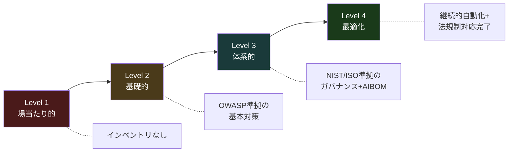

### 16.2 実践チェックリスト（本ガイド全体のまとめ）

**フレームワーク・ガバナンス**
- [ ] OWASP Top 10 for LLM Applications / Agentic Applicationsを開発チームの共通言語として導入した
- [ ] NIST AI RMF（またはISO/IEC 42001）に基づくガバナンス体制を整備した
- [ ] MITRE ATLASを参照した脅威モデリングを実施した
- [ ] 該当する法規制（EU AI Act等）の適用範囲とタイムラインを把握し、コンプライアンス計画を持っている

**入力・出力防御**
- [ ] すべての外部コンテンツを信頼できない入力として扱い、構造的分離（spotlighting等)を導入した
- [ ] 出力をJSON Schema等で検証し、高リスクアクションには人間の承認ゲートを設けた
- [ ] システムプロンプトに機密情報を含めない設計にした

**データ・モデル**
- [ ] 学習データパイプラインにアクセス制御・来歴検証・異常検知を導入した
- [ ] モデル抽出攻撃対策としてレート制限・出力ノイズ・クエリパターン分析を実施している
- [ ] AIBOM（CycloneDX形式等）とモデル署名（Sigstore/cosign等）を導入した

**RAG・エージェント・MCP**
- [ ] ベクトルDBへのアクセスを認証・認可し、取り込み/検索ロールを分離した
- [ ] エージェントに専用の管理されたIDと最小権限スコープを与え、ユーザーセッションを借用させない設計にした
- [ ] MCPサーバーのツール定義を継続的に再検証し、Rug Pull攻撃を検知する仕組みを持っている
- [ ] Lethal Trifecta（機密データアクセス・信頼できないコンテンツ・外部通信）の3条件が同時に満たされるツール設計を避けている

**継続的な運用**
- [ ] 定期的な自動化レッドチーム演習をCI/CDのリリースゲートに統合している
- [ ] 機能性・運用性・セキュリティ・コンプライアンス・人的要因の5次元での監視を実施している
- [ ] インシデント対応計画とロールバック手順を文書化し、訓練済みである

## 17. 参考文献・引用URL一覧

本文中の `[番号]` は以下のリストに対応しています。番号は検索・収集時の通し番号をそのまま維持しているため欠番がありますが、そのぶん本文で直接引用していない関連情報源も同じ体系で参照できるようにしてあります。すべて2026年7月8日時点でアクセス可能な情報に基づきます。

### OWASP Top 10 for LLM Applications（1〜9）

1. LLMRisks Archive - OWASP Gen AI Security Project — https://genai.owasp.org/llm-top-10/
2. OWASP Top 10 for Large Language Model Applications | OWASP Foundation — https://owasp.org/www-project-top-10-for-large-language-model-applications/
3. OWASP Top 10 LLM, Updated 2025: Examples & Mitigation Strategies (Oligo Security) — https://www.oligo.security/academy/owasp-top-10-llm-updated-2025-examples-and-mitigation-strategies
4. Home - OWASP Gen AI Security Project — https://genai.owasp.org/
5. OWASP Top 10 for LLM Applications 2025 — https://genai.owasp.org/resource/owasp-top-10-for-llm-applications-2025/
6. OWASP Top 10 for LLM - 2025 (Security Compass / Kontra) — https://application.security/free/llm
7. What are the OWASP Top 10 risks for LLMs? (Cloudflare) — https://www.cloudflare.com/learning/ai/owasp-top-10-risks-for-llms/
8. OWASP Top 10 for LLMs 2025 | DeepTeam — https://www.trydeepteam.com/docs/frameworks-owasp-top-10-for-llms
9. OWASP Top 10 for LLMs in 2025: Security Test Cases (InfoSec Write-ups) — https://infosecwriteups.com/owasp-top-10-for-llms-in-2025-security-test-cases-you-must-know-ef2cb6d1bbda

### OWASP Top 10 for Agentic Applications 2026（10〜19）

10. OWASP Top 10 for Agentic Applications for 2026 - OWASP Gen AI Security Project — https://genai.owasp.org/resource/owasp-top-10-for-agentic-applications-for-2026/
11. OWASP Top 10 for Agentic Applications 2026 Is Here (Palo Alto Networks Blog) — https://www.paloaltonetworks.com/blog/cloud-security/owasp-agentic-ai-security/
12. OWASP Top 10 for Agents 2026 | DeepTeam — https://www.trydeepteam.com/docs/frameworks-owasp-top-10-for-agentic-applications
13. Lessons from OWASP Top 10 for Agentic Applications (Auth0) — https://auth0.com/blog/owasp-top-10-agentic-applications-lessons/
14. OWASP Top 10 for Agentic Applications for 2026 (Practical DevSecOps) — https://www.practical-devsecops.com/owasp-top-10-agentic-applications/
15. Addressing the OWASP Top 10 Risks in Agentic AI with Microsoft Copilot Studio (Microsoft Security Blog) — https://www.microsoft.com/en-us/security/blog/2026/03/30/addressing-the-owasp-top-10-risks-in-agentic-ai-with-microsoft-copilot-studio/
16. OWASP Top 10 for Agentic Applications – Where Cloud, Security and AI Converge — https://arnav.au/2026/07/02/owasp-top-10-for-agentic-applications/
17. OWASP Top 10 for Agentic Applications 2026: A Security Guide (blog.nishanc.com) — https://blog.nishanc.com/2026/02/owasp-top-10-for-agentic-applications.html
18. OWASP Agentic Skills Top 10 | OWASP Foundation — https://owasp.org/www-project-agentic-skills-top-10/
19. OWASP Top 10 for Agentic Applications 2026: A Practical Security Guide (Gravitee) — https://www.gravitee.io/blog/owasp-top-10-for-agentic-applications-2026-a-practical-review-and-how-gravitee-supports-secure-agentic-architecture

### MCP（Model Context Protocol）セキュリティ（20〜29）

20. MCP Cheat Sheet (2026) - Model Context Protocol Quick Reference (Webfuse) — https://www.webfuse.com/mcp-cheat-sheet
21. Introducing the Model Context Protocol (Anthropic) — https://www.anthropic.com/news/model-context-protocol
22. Agentic MCP Security Best Practices Guide (Cloud Security Alliance) — https://labs.cloudsecurityalliance.org/agentic/agentic-mcp-security-best-practices-v1/
23. Security Best Practices - Model Context Protocol（公式ドキュメント） — https://modelcontextprotocol.io/docs/tutorials/security/security_best_practices
24. Anthropic MCP Explained 2026 (AI for Anything) — https://www.aiforanything.io/blog/anthropic-mcp-model-context-protocol-explained-2026
25. Model Context Protocol Security (CoSAI ws4-secure-design-agentic-systems) — https://github.com/cosai-oasis/ws4-secure-design-agentic-systems/blob/main/model-context-protocol-security.md
26. Model Context Protocol: Security Risks & Mitigations (SOC Prime) — https://socprime.com/blog/mcp-security-risks-and-mitigations/
27. Anthropic updates MCP security best practices (LinkedIn告知投稿) — https://www.linkedin.com/posts/satveerkhurpa_mcp-anthropic-security-activity-7342308920234823681-acD-
28. Introduction to Model Context Protocol (Anthropic Academy / Skilljar) — https://anthropic.skilljar.com/introduction-to-model-context-protocol
29. Breaking the Protocol: Security Analysis of the Model Context Protocol Specification (arXiv) — https://arxiv.org/html/2601.17549v1

### NIST AI Risk Management Framework（30〜39）

30. Artificial Intelligence Risk Management Framework: Generative Artificial Intelligence Profile | NIST — https://www.nist.gov/publications/artificial-intelligence-risk-management-framework-generative-artificial-intelligence-profile
31. AI Risk Management Framework | NIST — https://www.nist.gov/itl/ai-risk-management-framework
32. NIST Launches AI Agent Standards Initiative (NIST News) — https://www.nist.gov/news-events/news/2026/02/nist-launches-ai-agent-standards-initiative
33. NIST AI Risk Management Framework: Agentic Profile (Cloud Security Alliance) — https://labs.cloudsecurityalliance.org/agentic/agentic-nist-ai-rmf-profile-v1/
34. NIST AI RMF (ModelOp) — https://www.modelop.com/ai-governance/ai-regulations-standards/nist-ai-rmf
35. NIST Artificial Intelligence Risk Management Framework: Generative Artificial Intelligence Profile (Digital Government Hub) — https://digitalgovernmenthub.org/examples/nist-artificial-intelligence-risk-management-framework-generative-artificial-intelligence-profile/
36. NIST AI RMF & the Generative AI Profile Explained (CASRAI) — https://casrai.org/news/nist-ai-rmf-generative-ai-profile-ai-600-1-explained/
37. Implement NIST AI Risk Management Framework (Modulos AI) — https://www.modulos.ai/nist-ai-rmf/
38. NIST AI RMF 2025–2026 Updates (IS Partners) — https://www.ispartnersllc.com/blog/nist-ai-rmf-2025-2026-updates-what-you-need-to-know-about-the-latest-framework-changes/
39. Concept Note: AI RMF Profile on Trustworthy AI in Critical Infrastructure | NIST — https://www.nist.gov/programs-projects/concept-note-ai-rmf-profile-trustworthy-ai-critical-infrastructure

### MITRE ATLAS（40〜47）

40. MITRE ATLAS AI Security and Agentic Threats 2026 Update (Zenity) — https://zenity.io/blog/current-events/mitre-atlas-ai-security
41. MITRE ATLAS: AI security framework with 16 tactics and 84 techniques (Vectra AI) — https://www.vectra.ai/topics/mitre-atlas
42. Security Considerations for Multi-agent Systems (arXiv) — https://arxiv.org/pdf/2603.09002
43. MITRE ATLAS Framework 2026 - Guide to Securing AI Systems (Practical DevSecOps) — https://www.practical-devsecops.com/mitre-atlas-framework-guide-securing-ai-systems/
44. What is MITRE ATLAS? (CrowdStrike) — https://www.crowdstrike.com/en-us/cybersecurity-101/artificial-intelligence/mitre-atlas/
45. MITRE ATLAS Framework: AI Attack Techniques (AML.T) Mapped to Red-Team Operations (Repello AI) — https://repello.ai/blog/mitre-atlas-framework
46. MITRE's Sensible Regulatory Framework for AI Security (Palo Alto Networks) — https://www.paloaltonetworks.com/cyberpedia/mitre-sensible-regulatory-framework-atlas-matrix
47. BioVeil MATRIX (arXiv) — https://arxiv.org/pdf/2605.00927

### プロンプトインジェクション対策（48〜57）

48. Indirect Prompt Injection: Attacks, Defenses, and the 2026 State of the Art (Zylos Research) — https://zylos.ai/research/2026-04-12-indirect-prompt-injection-defenses-agents-untrusted-content/
49. StruQ: Defending Against Prompt Injection with Structured Queries (Semantic Scholar) — https://www.semanticscholar.org/paper/StruQ:-Defending-Against-Prompt-Injection-with-Chen-Piet/f5e7e22036c3fe7d6660eee90642f716c3b303f5
50. Prompt Injection Defense 2026: 8 Tested Techniques Ranked (TokenMix Blog) — https://tokenmix.ai/blog/prompt-injection-defense-techniques-2026
51. Prompt Injection Attacks: Examples, Techniques, and Defence (Cyber Desserts) — https://blog.cyberdesserts.com/prompt-injection-attacks/
52. Reasoning Hijacking: The Fragility of Reasoning Alignment in LLMs (arXiv) — https://arxiv.org/pdf/2601.10294
53. Defending Against Indirect Prompt Injection Attacks With Spotlighting (Hines et al., CEUR Workshop Proceedings) — https://ceur-ws.org/Vol-3920/paper03.pdf
54. GitHub - tldrsec/prompt-injection-defenses — https://github.com/tldrsec/prompt-injection-defenses
55. Prompt Injection Attacks on Agentic Coding Assistants (arXiv) — https://arxiv.org/html/2601.17548v1
56. An Empirical Study on the Security Vulnerabilities of GPTs (arXiv) — https://arxiv.org/pdf/2512.00136
57. AEGIS: Automated Co-Evolutionary Framework for Guarding Prompt Injections Schema (arXiv) — https://arxiv.org/pdf/2509.00088

### EU AI Act（58〜67）

58. AI Act | Shaping Europe's digital future (European Commission) — https://digital-strategy.ec.europa.eu/en/policies/regulatory-framework-ai
59. Timeline for the Implementation of the EU AI Act (AI Act Service Desk) — https://ai-act-service-desk.ec.europa.eu/en/ai-act/timeline/timeline-implementation-eu-ai-act
60. EU AI Act Omnibus Agreement — Postponed High-Risk Deadlines and Other Key Changes (Gibson Dunn) — https://www.gibsondunn.com/eu-ai-act-omnibus-agreement-postponed-high-risk-deadlines-and-other-key-changes/
61. AI Act Update: EU Resolves to Change Rules and Extend Deadlines (Latham & Watkins) — https://www.lw.com/en/insights/ai-act-update-eu-resolves-to-change-rules-and-extend-deadlines
62. Implementation Timeline | EU Artificial Intelligence Act — https://artificialintelligenceact.eu/implementation-timeline/
63. EU AI Act High-Risk Deadline: Enterprise Readiness Gap (Cloud Security Alliance) — https://labs.cloudsecurityalliance.org/research/csa-research-note-eu-ai-act-high-risk-compliance-deadline-20/
64. EU agrees to delay key AI Act compliance deadlines (Travers Smith) — https://www.traverssmith.com/knowledge/knowledge-container/eu-agrees-to-delay-key-ai-act-compliance-deadlines/
65. EU AI Act 2026: Penalties, Risk Tiers & New Deadlines — https://decodethefuture.org/en/eu-ai-act-explained/
66. The Digital AI Omnibus: Proposed deferral of high risk AI obligations under the AI Act (DLA Piper GENIE) — https://knowledge.dlapiper.com/dlapiperknowledge/globalemploymentlatestdevelopments/2026/The-Digital-AI-Omnibus-Proposed-deferral-of-high-risk-AI-obligations-under-the-AI-Act
67. EU AI Act 2026 Updates: Compliance Requirements and Business Risks (Legal Nodes) — https://www.legalnodes.com/article/eu-ai-act-2026-updates-compliance-requirements-and-business-risks

### AIレッドチーミング（68〜75）

68. Best AI Red Teaming Tools in 2026: Adversarial Testing Comparison (General Analysis) — https://generalanalysis.com/guides/best-ai-red-teaming-tools
69. 5 Best AI Red Teaming Tools to Find AI Security Vulnerabilities in 2026 (Confident AI) — https://www.confident-ai.com/knowledge-base/compare/best-ai-red-teaming-tools-2026
70. Top 19 AI Red Teaming Tools (2026): Secure Your ML Models (MarkTechPost) — https://www.marktechpost.com/2026/04/17/top-ai-red-teaming-tools/
71. AI Red Teaming: The Complete Guide for Security Teams (2026) (Repello AI) — https://repello.ai/blog/the-essential-guide-to-ai-red-teaming-in-2024
72. AI Red Teaming in 2026: The Complete Guide (Mindgard) — https://mindgard.ai/blog/what-is-ai-red-teaming
73. GitHub - requie/AI-Red-Teaming-Guide — https://github.com/requie/AI-Red-Teaming-Guide
74. AI Security Solutions Landscape For AI and Agentic Red Teaming Q2 2026 (OWASP) — https://genai.owasp.org/resource/ai-security-solutions-landscape-for-ai-and-agentic-red-teaming-q2-2026/
75. Top 6 AI Red Teaming and Adversarial Testing Tools for 2026 (Straiker) — https://www.straiker.ai/blog/top-6-ai-red-teaming-and-adversarial-testing-tools

### データ/モデルポイズニング・モデル抽出（76〜83）

76. Data Poisoning in AI: The Complete Guide to Training Data Attacks & Defenses (2026) (AI Safety Directory) — https://aisecurityandsafety.org/en/guides/data-poisoning/
77. AI Model Poisoning in 2026: How It Works and the First Line Defense Your Business Needs (LastPass Blog) — https://blog.lastpass.com/posts/model-poisoning
78. SAME: Sample Reconstruction against Model Extraction Attacks (arXiv) — https://arxiv.org/pdf/2312.10578
79. Securing AI: From Model Poisoning to Production Defense (Medium) — https://medium.com/@nayangoel/securing-ai-from-model-poisoning-to-production-defense-6bc4553ac7e0
80. I Stolenly Swear That I Am Up to (No) Good: Design and Evaluation of Model Stealing Attacks (arXiv) — https://arxiv.org/pdf/2508.21654
81. Exploring the Limits of Model-Targeted Indiscriminate Data Poisoning Attacks (arXiv) — https://arxiv.org/pdf/2303.03592
82. The poisoning attack and defense method for data-driven algorithm in power system (Springer) — https://link.springer.com/article/10.1007/s13042-026-03181-7
83. De-Pois: An Attack-Agnostic Defense against Data Poisoning Attacks (arXiv) — https://arxiv.org/pdf/2105.03592

### AIサプライチェーン・AIBOM・モデル署名（84〜93）

84. AI Supply Chain Security Guide 2026 (GLACIS) — https://www.glacis.io/guide-ai-supply-chain-security
85. Top AI Security Tools 2026: The Vendor-Neutral Comparison (cmdev Blog) — https://creativeminds.dev/blog/top-ai-security-tools-2026-vendor-neutral/
86. The 2026 Guide to Software Supply Chain Security (Cloudsmith) — https://cloudsmith.com/blog/the-2026-guide-to-software-supply-chain-security-from-static-sboms-to-agentic-governance
87. What is an AIBOM? (Checkmarx) — https://checkmarx.com/learn/ai-cybersecurity/what-is-an-aibom/
88. What Is An AIBOM? How To Generate Accuracy & Challenges (Apiiro) — https://apiiro.com/glossary/aibom/
89. AgentRiskBOM: A Risk-Scoping Security Bill of Materials for Agentic AI Systems (arXiv) — https://arxiv.org/pdf/2606.21877
90. Supply Chain Attacks in AI (AI Security InfoTér / Qyntar) — https://qyntar.com/ai-security/threats/ai-supply-chain-attacks/
91. Towards Imputation of Pre-Trained Language Model Metadata using Semantic Fingerprinting (arXiv) — https://arxiv.org/pdf/2606.21787
92. S3C2 Summit 2024-09: Industry Secure Software Supply Chain Summit (arXiv) — https://arxiv.org/pdf/2505.10538
93. AI Bill of Materials (AIBOM): Transparency for AI Supply Chains (Manifest Cyber) — https://www.manifestcyber.com/aibom

### RAG・ベクトルDBセキュリティ（94〜101）

94. Vector Database Security: RAG Compliance & Monitoring Guide (BeyondScale) — https://beyondscale.tech/blog/vector-database-security-rag-compliance-monitoring
95. Securing and Governing Vector Databases in 2026 (Blockchain Council) — https://www.blockchain-council.org/ai/securing-and-governing-vector-databases-privacy-prompt-injection-multi-tenant-access-control/
96. RAG Poisoning: 7 Critical Defenses to Stop Secret Leaks in AI Systems (2026 Guide) (CodeSecAI) — https://codesecai.com/rag-poisoning-prevention-guide/
97. PoisonedRAG: 5 Documents Can Hijack Your RAG System 97% of the Time (themenonlab) — https://themenonlab.blog/blog/poisonedrag-rag-knowledge-corruption-attack
98. RAG Security: How Attackers Poison Your Knowledge Base (BeyondScale) — https://beyondscale.tech/blog/rag-security-data-poisoning-guide
99. Door 08 - Vector and Embedding Weaknesses (Advent of AI Security) — https://advent-of-ai-security.com/doors/08
100. RAG Security: Risks and Mitigation Strategies [2026] (Lasso Security) — https://www.lasso.security/blog/rag-security
101. RAG security: the forgotten attack surface (Christian Schneider) — https://christian-schneider.net/blog/rag-security-forgotten-attack-surface/

### ISO/IEC 42001（102〜111）

102. ISO/IEC 42001:2023 Artificial Intelligence Management System Standards (Microsoft Learn) — https://learn.microsoft.com/en-us/compliance/regulatory/offering-iso-42001
103. ISO/IEC 42001:2023 - AI management systems (ISO) — https://www.iso.org/standard/42001
104. ISO/IEC 42001 Artificial Intelligence Management System — Training Courses (PECB) — https://pecb.com/en/education-and-certification-for-individuals/iso-iec-42001
105. ISO 42001 - AI Management System (BSI) — https://www.bsigroup.com/en-US/products-and-services/standards/iso-42001-ai-management-system/
106. ISO/IEC 42001 Deep Dive: The AI Management System Standard, Decoded (2026) (Lorikeet Security) — https://lorikeetsecurity.com/blog/iso-42001-ai-management-system-2026
107. ISO/IEC 42001 Certification: AI Management System (DNV) — https://www.dnv.com/services/iso-iec-42001-artificial-intelligence-ai--250876/
108. ISO - ISO 42001 explained — https://www.iso.org/home/insights-news/resources/iso-42001-explained-what-it-is.html
109. ISO/IEC 42001: AI Management System for Governance (KPMG) — https://kpmg.com/ch/en/insights/artificial-intelligence/iso-iec-42001.html
110. EN ISO/IEC 42001:2026 - AI Management System Standards Guide (iTeh Standards) — https://standards.iteh.ai/catalog/standards/cen/adc675e8-4669-4965-b4c1-c8f724832217/en-iso-iec-42001-2026
111. Understanding ISO 42001: The World's First AI Management System Standard (A-LIGN) — https://www.a-lign.com/articles/understanding-iso-42001

---

> **免責事項**: 本ガイドは2026年7月8日時点で公開されていた情報をもとに作成しています。AIセキュリティの分野は極めて変化が速いため、実装前に各フレームワーク・法規制の公式サイト（特に OWASP: genai.owasp.org、NIST: nist.gov、ISO: iso.org、EU AI Act公式ポータル、MITRE ATLAS: atlas.mitre.org）で最新情報を確認することを強く推奨します。本ガイドは一般的なベストプラクティスの解説であり、個別組織の法令遵守を保証するものではありません。法的な適用可否については専門家にご相談ください。