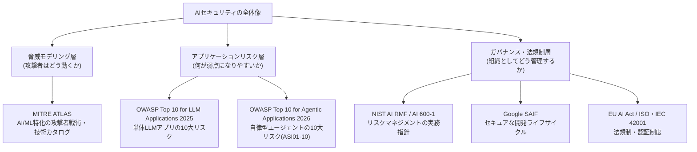
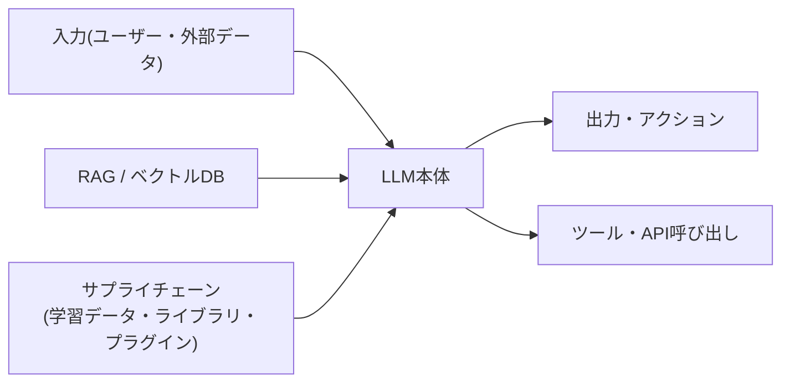
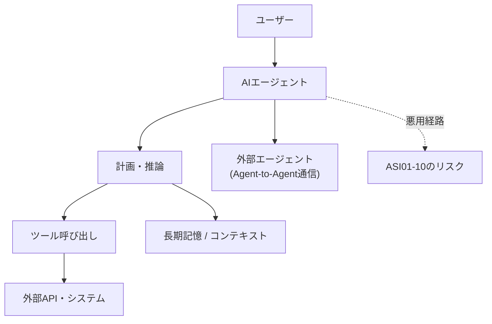
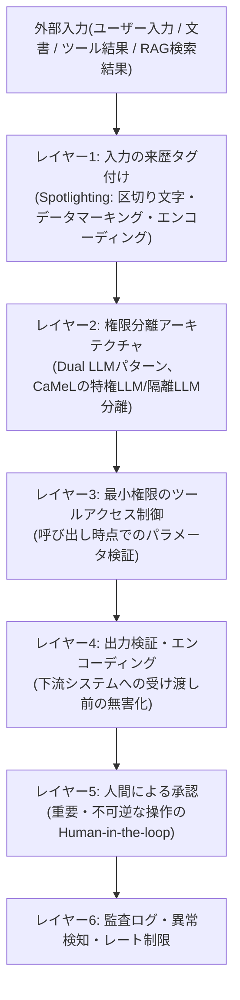
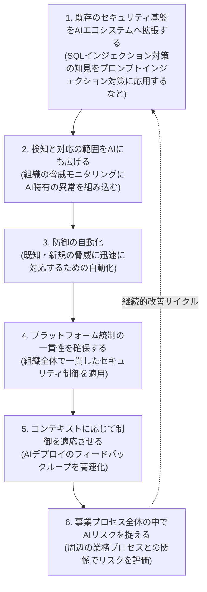
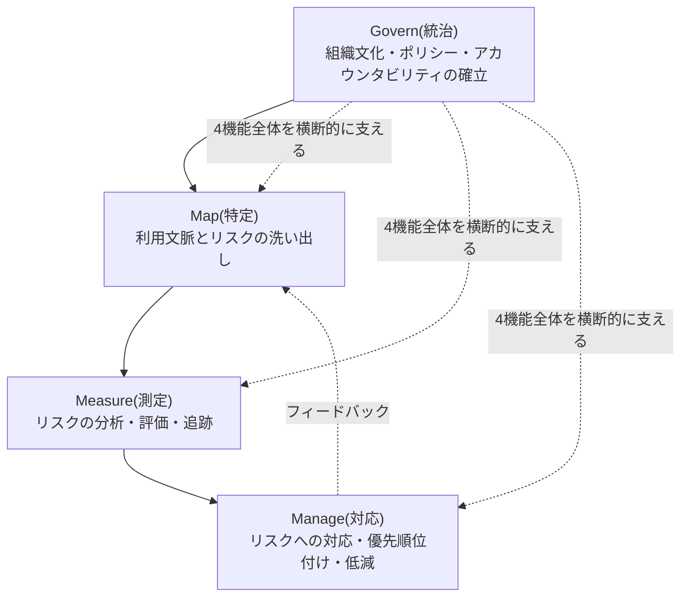
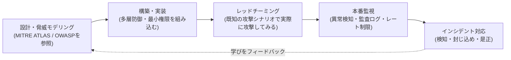

# AIセキュリティ ベストプラクティスガイド
## 初学者のためのステップバイステップ解説

> 本ガイドは、生成AI(Generative AI)・LLMアプリケーション・AIエージェント(Agentic AI)を対象に、業界標準フレームワークに基づいたセキュリティのベストプラクティスを、初学者にもわかりやすいステップ形式で解説するものです。各セクションの末尾には、内容の根拠となる最新の参照URLを掲載しています。

---

## この記事で学べること

1. AIセキュリティが従来のアプリケーションセキュリティ(AppSec)とどう違うのか
2. 業界で使われている主要フレームワーク(OWASP・MITRE ATLAS・NIST・Google SAIF・EU AI Act)の全体像
3. LLMアプリケーションの10大リスクとその対策(OWASP Top 10 for LLM Applications 2025)
4. AIエージェント特有の10大リスクとその対策(OWASP Top 10 for Agentic Applications 2026)
5. プロンプトインジェクション対策の実装レベルの深掘り
6. セキュアな開発ライフサイクルの作り方(Google SAIF)
7. リスクマネジメント体制の構築方法(NIST AI RMF)
8. 法規制対応の勘所(EU AI Act、ISO/IEC 42001)
9. レッドチーミングと継続的な監視の始め方
10. 今日から使える実践チェックリスト

---

## ステップ0:なぜAIセキュリティは「別物」なのか

従来のWebアプリケーションセキュリティは、SQLインジェクションやXSS(クロスサイトスクリプティング)のように、コードと入力データが明確に分離されていることを前提にしていました。ところがLLM(大規模言語モデル)は、**指示(instruction)とデータ(data)を同じ自然言語のチャネルで処理する**という根本的な特性を持っています。この結果、次のような新しい攻撃対象領域(attack surface)が生まれます。

| 従来のAppSec | AIセキュリティ |
|---|---|
| コードとデータが分離されている | 指示とデータが同じ入力チャネルに混在する |
| 静的なロジックを検証すればよい | 確率的(stochastic)にふるまうモデルを検証する必要がある |
| 攻撃対象はネットワーク・OS・DB | 攻撃対象は学習データ・モデル本体・推論プロセス・エージェントのツール群にも広がる |
| 一度パッチを当てれば直る | プロンプトインジェクションのように「完全な解決策が存在しない」リスクがある |

さらに2026年時点では、LLMが単に文章を生成するだけでなく、ツールを呼び出し、他のエージェントと通信し、実際の業務システムを操作する「エージェント型AI(Agentic AI)」が急速に普及しており、セキュリティの検討範囲はさらに拡大しています。

---

## ステップ1:全体像 ― どのフレームワークをいつ使うか

AIセキュリティには複数の標準フレームワークが存在し、それぞれ役割が異なります。まずは全体のマップを把握しましょう。

| フレームワーク | 主な用途 | 対象読者 |
|---|---|---|
| MITRE ATLAS | 攻撃者視点での脅威モデリング、レッドチーム演習の設計 | セキュリティエンジニア、脅威インテリジェンス担当 |
| OWASP Top 10 for LLM Applications (2025) | LLMアプリの代表的な脆弱性チェックリスト | 開発者、アプリケーションセキュリティ担当 |
| OWASP Top 10 for Agentic Applications (2026) | 自律型AIエージェントに特化したリスクチェックリスト | エージェント開発者、アーキテクト |
| NIST AI RMF / AI 600-1 | 組織全体のAIリスクガバナンス体制の構築 | コンプライアンス、リスク管理部門 |
| Google SAIF | AI開発ライフサイクル全体のセキュリティ統制 | プラットフォームエンジニア、クラウドアーキテクト |
| EU AI Act / ISO・IEC 42001 | 法的義務・認証取得の要件整理 | 法務、経営層、AIガバナンス責任者 |

**参考URL**
- OWASP GenAI Security Project: https://genai.owasp.org/
- MITRE ATLAS 公式サイト: https://atlas.mitre.org/
- NIST AI Risk Management Framework: https://www.nist.gov/itl/ai-risk-management-framework
- Google Secure AI Framework (SAIF): https://saif.google/

---

## ステップ2:脅威モデリングの基礎 ― MITRE ATLASを理解する

**MITRE ATLAS(Adversarial Threat Landscape for Artificial-Intelligence Systems)** は、2021年にMITREが公開した、AI/MLシステムを狙う攻撃者の戦術(Tactics)と技術(Techniques)を体系化したナレッジベースです。サイバーセキュリティで広く使われる MITRE ATT&CK と同じ「マトリクス形式」を採用しており、攻撃者の目的(列)と具体的な手口(行)を俯瞰できます。

2025年11月時点でATLASは16の戦術・84の技術・56のサブ技術・32の緩和策・42件の実際のケーススタディを収録するまでに拡大しており、2026年2月の更新ではさらにエージェント特有の技術(悪意あるAIエージェントツールの公開など)が追加されました。ATLASは月次リリースサイクルに移行しており、AI攻撃の実態を継続的に反映しています。

### ATLASの基本戦術(ATT&CKから継承・拡張された代表的な13の戦術)

| フェーズ | 戦術 | 内容 |
|---|---|---|
| 準備 | Reconnaissance(偵察) | 対象モデルのAPI仕様・論文・公開ドキュメントなどから情報収集 |
| 準備 | Resource Development(リソース開発) | 攻撃用インフラや悪意あるモデル・データセットの準備 |
| 侵入 | Initial Access(初期アクセス) | 学習パイプラインやAPIへの最初の足がかりを得る |
| AI固有 | ML Model Access(MLモデルアクセス) | 推論APIや直接のモデルアーティファクトへのアクセスを獲得 |
| 実行 | Execution(実行) | モデルや関連システム上で悪意あるコードを実行 |
| 定着 | Persistence(永続化) | バックドアモデルなどでアクセスを維持 |
| 権限昇格 | Privilege Escalation(権限昇格) | より高い権限を奪取 |
| 回避 | Defense Evasion(防御回避) | 検知機構をすり抜ける |
| 探索 | Discovery(探索) | 内部構成やデータソースを調査 |
| 収集 | Collection(収集) | 攻撃対象となるデータを集める |
| AI固有 | ML Attack Staging(ML攻撃準備) | 学習データの汚染やバックドア埋め込みなど攻撃の下準備 |
| 窃取 | Exfiltration(持ち出し) | モデルやデータを外部へ持ち出す |
| 目的達成 | Impact(影響) | サービス停止・誤動作・信頼失墜などの最終的な被害 |

代表的なAI特有の攻撃技術には、**Adversarial Examples(敵対的サンプル)**・**Model Inversion(モデル逆転攻撃)**・**Data Poisoning(データ汚染)**・**Model Stealing(モデル窃取)**・**Prompt Injection(プロンプトインジェクション)** などがあり、いずれも従来のATT&CKには存在しない、AI/ML特有の攻撃対象領域を扱います。

### 実践のはじめ方

1. ATLAS Navigator(atlas.mitre.org)で自社システムに関連する戦術・技術を洗い出す
2. 各技術について「検知できているか」「緩和策があるか」をスコアリングし、独自のカバレッジレイヤーを作成する
3. 実際のケーススタディ(EchoLeak、iProovのディープフェイク事例など)を参考に、攻撃の連鎖(kill chain)をイメージした演習を設計する

**参考URL**
- MITRE ATLAS 公式サイト: https://atlas.mitre.org/
- MITRE ATLASの成長に関するCTIDブログ(2026年5月): https://ctid.mitre.org/blog/2026/05/06/secure-ai-v2-release/
- MITRE ATLASの戦術リスト解説: https://versa-networks.com/blog/mitre-attck-vs-atlas-ai-threat-frameworks/
- MITRE ATLAS統計データ(16戦術・84技術): https://www.vectra.ai/topics/mitre-atlas
- MITRE ATT&CKとATLASの違い(CrowdStrike): https://www.crowdstrike.com/en-us/cybersecurity-101/artificial-intelligence/mitre-atlas/

---

## ステップ3:LLMアプリケーションの10大リスクを理解する(OWASP Top 10 for LLM Applications 2025)

**OWASP Top 10 for LLM Applications** は2023年に始まり、2025年版で大幅に改訂されました。プロンプトインジェクションが2版連続で1位を維持する一方、機微情報の開示は6位から2位へ急上昇するなど、実際のインシデントを反映した並び替えが行われています。

| コード | リスク名 | 概要 | 主な緩和策 |
|---|---|---|---|
| LLM01:2025 | プロンプトインジェクション | 直接・間接の入力によってモデルの指示を上書きし、意図しない挙動を引き起こす | 指示とデータのチャネル分離、外部コンテンツの隔離、出力前の人による承認 |
| LLM02:2025 | 機微情報の開示 | 学習データの記憶や設定情報の露出により、個人情報・秘密情報が漏洩する | 出力フィルタリング、データの最小化、保持ポリシーの明確化 |
| LLM03:2025 | サプライチェーン | 基盤モデル・データセット・ライブラリ・プラグインなど第三者コンポーネントの脆弱性 | コンポーネントの来歴検証、SBOM(部品表)管理、信頼できる供給元の選定 |
| LLM04:2025 | データ・モデルポイズニング | 学習データやファインチューニングデータへの汚染によるバックドア埋め込み | データ来歴の検証、バージョン管理、異常検知 |
| LLM05:2025 | 不適切な出力処理 | LLM出力を無検証で下流システム(SQL・シェル・HTMLレンダラー)に渡すことによる各種インジェクション | 出力のコンテキストに応じたエンコーディング、パラメータ化クエリの使用 |
| LLM06:2025 | 過剰なエージェンシー(自律性) | 必要以上の機能・権限・自律性をエージェントに与えることによる誤動作や悪用 | 最小権限の原則、重要操作への人の承認、機能スコープの制限 |
| LLM07:2025 | システムプロンプトの漏洩 | システムプロンプトに含めた秘密情報や内部ロジックが露出する | 秘密情報をシステムプロンプトに含めない、別レイヤーでのアクセス制御 |
| LLM08:2025 | ベクトル・埋め込みの脆弱性 | ベクトルDBへの汚染注入やテナント間のアクセス制御不備 | ベクトルストアのアクセス制御、埋め込みモデルの検証 |
| LLM09:2025 | 誤情報(旧:過度の依存) | もっともらしい誤った情報(ハルシネーション)を生成・流布する | 出力の裏取り(grounding)、引用元の明示、利用者教育 |
| LLM10:2025 | 制御不能な消費 | リソースを浪費させるDoSやコスト急増(Denial of Wallet)を引き起こす | レート制限、タイムアウト設定、使用量の監視とアラート |

### 深掘り:なぜプロンプトインジェクションは「解決できない」と言われるのか

LLMは指示とデータを同じ自然言語のチャネルで処理するため、モデルは「これは正規の指示なのか、それとも処理すべきデータなのか」を原理的に区別できません。攻撃者は、文書やメール、Webページの中に隠した指示によって(間接的プロンプトインジェクション)、モデルに意図しない行動を取らせることができます。OWASPも「生成AIの性質上、確実な防止策が存在するかは不明」と明記しており、完全な解決ではなく**多層防御(defense in depth)によるリスク低減**が現実的なアプローチとされています(詳細はステップ5で扱います)。

**参考URL**
- OWASP Top 10 for LLM Applications 2025(公式): https://genai.owasp.org/llm-top-10/
- OWASP Top 10 for LLM Applications 2025 PDF: https://owasp.org/www-project-top-10-for-large-language-model-applications/assets/PDF/OWASP-Top-10-for-LLMs-v2025.pdf
- OWASPプロジェクトページ: https://owasp.org/www-project-top-10-for-large-language-model-applications/
- OWASP Top 10 for LLM 2025 解説記事(Aembit): https://aembit.io/blog/owasp-top-10-llm-risks-explained/
- OWASP Top 10 for LLM 2025 実務ガイド(Gravitee): https://www.gravitee.io/blog/owasp-top-10-for-llm-applications-2025-a-practical-guide

---

## ステップ4:AIエージェントの10大リスクを理解する(OWASP Top 10 for Agentic Applications 2026)

チャットボットが「質問に答える」だけの存在だったのに対し、**AIエージェントは「実際に行動する」**存在です。ツールを呼び出し、他のエージェントと通信し、記憶を保持し、実世界のワークフローを操作します。この自律性の高まりに対応するため、OWASP GenAI Security Projectは2025年12月、Black Hat Europe 2025に合わせて**OWASP Top 10 for Agentic Applications 2026**を公開しました。100名以上の業界専門家によるレビューを経た、agentic AI固有のリスクを扱う初の業界標準リストです。

このリストはOWASP Top 10 for LLM Applicationsを置き換えるものではなく、**ほとんどのエージェントシステムはLLMアプリケーションでもあるため、両方のリストを併用する**ことが推奨されています。

### ASI01からASI10までの全体像

| コード | リスク名 | 概要 | 主な緩和策 |
|---|---|---|---|
| ASI01:2026 | エージェントの目標ハイジャック(Agent Goal Hijack) | 直接・間接の指示操作によって、エージェントの意思決定プロセスそのものを乗っ取られる | 厳格な行動制約とガードレール、異常な逸脱の継続的な監視 |
| ASI02:2026 | ツールの誤用・悪用(Tool Misuse & Exploitation) | 認可された範囲外のパラメータ・順序でツールを呼び出させる | ツール呼び出し時点でのパラメータ検証、呼び出し元ごとのスコープ制御 |
| ASI03:2026 | アイデンティティ・権限の悪用(Identity & Privilege Abuse) | エージェントの権限が過剰・共有されており、昇格や横断的な悪用が発生する | エージェント固有の管理されたアイデンティティ、権限の最小化 |
| ASI04:2026 | エージェント型サプライチェーンの脆弱性(Agentic Supply Chain Vulnerabilities) | 実行時に動的読み込みされるツール・プロンプト・MCPサーバー・エージェントカードの汚染 | ツールマニフェストの署名検証、信頼できるレジストリの利用 |
| ASI05:2026 | 予期しないコード実行(Unexpected Code Execution) | コード生成・実行系エージェントが悪意ある命令を実行させられる | サンドボックス化、実行権限の分離、危険な操作の承認フロー |
| ASI06:2026 | メモリ・コンテキストの汚染(Memory & Context Poisoning) | 長期記憶や検索結果への汚染により、以降のセッションの挙動が歪められる | メモリ書き込み前のバリデーション、外部由来コンテンツの明示的タグ付け |
| ASI07:2026 | 安全でないエージェント間通信(Insecure Inter-Agent Communication) | エージェント間メッセージのなりすまし・再送・非認証によるクラスタ全体の誤誘導 | エージェント間の相互認証、メッセージの署名・検証 |
| ASI08:2026 | 連鎖的な障害(Cascading Agent Failures) | 1つのエージェントの誤動作・侵害がシステム全体に波及する | サーキットブレーカー、短命な認証情報、レート制限 |
| ASI09:2026 | 人間とエージェント間の信頼の悪用(Human-Agent Trust Exploitation) | 流暢で説得力のあるエージェントの発言を人間が過信し、危険な操作を承認してしまう | 同意取得はチャットUIではなく別の検証済みチャネルで行う |
| ASI10:2026 | 暴走エージェント(Rogue Agents) | エージェントが意図と乖離した目的で行動を継続する | 常時の行動監査、キルスイッチ、権限の即時失効機構 |

### 実践への落とし込み ― 「Identity」と「Containment」の2本柱

すべてのリスクを一度に解決する必要はありません。多くの実務家は、次の2つの軸に沿って優先順位をつけています。

1. **アイデンティティ管理**:ASI03・ASI05・ASI10 に関連。エージェントごとに固有の管理されたアイデンティティを与え、認証情報の共有を避ける。
2. **自律性の封じ込め(Containment)**:ASI01・ASI02・ASI07・ASI08 に関連。「Least Agency(必要最小限の自律性)」の原則に基づき、高リスクな操作には必ず人間の承認を挟む。

推奨される導入順序は次の通りです。

| 順序 | アクション | 対応するリスク |
|---|---|---|
| 1 | エージェントとその認証情報の棚卸し | ASI03 |
| 2 | 自律性とツールスコープの制限(Least Agency / Least Privilege) | ASI01, ASI02, ASI05 |
| 3 | 入力と記憶の堅牢化(信頼できる指示と外部コンテンツの分離) | ASI06、ASI01の一部 |
| 4 | エージェント間通信の相互認証 | ASI07 |
| 5 | 障害の影響範囲(blast radius)を限定する仕組みの整備 | ASI08 |

**参考URL**
- OWASP Top 10 for Agentic Applications 2026(公式リソース): https://genai.owasp.org/resource/owasp-top-10-for-agentic-applications-for-2026/
- OWASP Top 10 for Agentic Applications 2026 公式PDF: https://genai.owasp.org/download/52117
- OWASP GenAI Security Project発表記事: https://genai.owasp.org/2025/12/09/owasp-top-10-for-agentic-applications-the-benchmark-for-agentic-security-in-the-age-of-autonomous-ai/
- ASI01-10の実務的な優先順位付け解説: https://arnav.au/2026/07/02/owasp-top-10-for-agentic-applications/
- Auth0による解説記事(Least Agencyの概念): https://auth0.com/blog/owasp-top-10-agentic-applications-lessons/
- Modulosガバナンスガイド: https://docs.modulos.ai/frameworks/owasp-top-10-agentic/index

---

## ステップ5:プロンプトインジェクション対策を深掘りする

プロンプトインジェクションは2025年版・2026年版いずれのOWASPリストでも中心的なリスクとして扱われています。OpenAI・Anthropic・Google DeepMindの各社も「現在のLLMアーキテクチャの範囲内では完全に解決できない」と2025年の論文で認めています。したがって現実的な目標は「攻撃を完全に防ぐこと」ではなく、**多層防御によって被害範囲(blast radius)を許容できる水準まで下げること**です。

### 代表的な対策手法の比較

| 手法 | 種類 | 概要 |
|---|---|---|
| Spotlighting | 前処理(訓練不要) | 区切り文字・データマーキング・エンコーディングにより、外部コンテンツの出所をモデルに明示する。軽量で導入しやすいが確率的な効果にとどまる |
| Instruction Hierarchy(命令階層) | モデル訓練 | システム・開発者・ユーザーなど、指示の発信元ごとに優先順位を学習させる |
| StruQ / SecAlign | モデル訓練 | プロンプトとデータのチャネルを構造的に分離し、選好最適化により攻撃成功率を大幅に低減(研究では2%程度まで低下との報告) |
| CaMeL(Google DeepMind) | アーキテクチャ的防御 | 「特権LLM」と「隔離LLM」を分離。隔離LLMはツール呼び出し権限を持たず、データの来歴(provenance)をプログラム全体で追跡する |
| Progent | 実行時制御 | プログラム可能な権限制御により、攻撃成功率を約41%から2%程度まで低減したとする報告あり |
| 出力側の検知(MELON等) | 実行時監視 | エージェントの挙動が本来のタスクから逸脱していないかを再実行・比較して検知する |

### 実務上の重要な原則

1. **外部コンテンツは常に「信頼できないデータ」として扱う**:文書・Webページ・ツールの実行結果・メールなど、モデルが読み込むあらゆる外部情報は、たとえエージェント自身が生成したものでなくても、指示ではなくデータとして扱う。
2. **単一の防御手法に依存しない**:検知ベースの手法とアーキテクチャ的な防御(権限分離)を組み合わせる。
3. **不可逆な操作には必ず人の承認を挟む**:メール送信、レコード削除、決済処理などの高リスク操作は自動承認しない。
4. **出口(egress)を制限する**:仮にインジェクションが成功しても、機密データを外部に送信できる経路自体を塞ぐ。

**参考URL**
- 間接的プロンプトインジェクション:攻撃と防御の2026年最新動向: https://zylos.ai/research/2026-04-12-indirect-prompt-injection-defenses-agents-untrusted-content/
- エージェント型コーディングアシスタントへのプロンプトインジェクション調査(arXiv): https://arxiv.org/html/2601.17548v1
- Spotlighting等の防御手法の学術的整理(arXiv): https://arxiv.org/pdf/2512.00136
- OWASP Foundationによるプロンプトインジェクション防御の推奨事項(2025年版Top 10に収録): https://owasp.org/www-project-top-10-for-large-language-model-applications/assets/PDF/OWASP-Top-10-for-LLMs-v2025.pdf

---

## ステップ6:セキュアな開発ライフサイクルを作る(Google SAIF)

**Google Secure AI Framework(SAIF)** は、AIシステム全体のライフサイクルにセキュリティを組み込むための概念的フレームワークです。従来のソフトウェア開発で培われた「レビュー・テスト・サプライチェーン管理」のベストプラクティスを、AI特有のリスク(モデル窃取・学習データポイズニング・プロンプトインジェクション・機密情報の抽出)に適用する形で設計されています。

### 実務チェックリスト(SAIFに基づく代表的な統制例)

| 領域 | 具体的な統制 |
|---|---|
| データ | 学習用ストレージからの公開アクセスを排除し、DLP(データ損失防止)で機微情報をサニタイズする |
| モデル | モデルへの不正コピー・読み取りを防ぐアクセス制御と、不正な挙動を監視する検知機構を備える |
| アプリケーション | プロンプトの入力・出力の両方を検査するミドルウェア層(AIゲートウェイ)を設ける |
| エージェント | サービスアカウントには読み取り専用など必要最小限のIAMロールのみを付与し、Editor/Ownerのような広範な権限は与えない |
| 監視 | リアルタイムでの異常検知とアラート、定期的な監査を組み合わせる |

SAIFの推進母体としてGoogleは、Anthropic・Cisco・IBM・Intel・NVIDIA・PayPalなどを創設メンバーとする**Coalition for Secure AI(CoSAI)**を組成し、業界横断でのAIセキュリティ標準化を進めています。

**参考URL**
- Google Secure AI Framework 公式サイト: https://saif.google/
- SAIF発表ブログ(Google公式): https://blog.google/innovation-and-ai/technology/safety-security/introducing-googles-secure-ai-framework/
- Google Safety Centre によるSAIF解説: https://safety.google/intl/en_in/safety/saif/
- Google CloudにおけるSAIFの実装ガイド: https://cloud.google.com/use-cases/secure-ai-framework

---

## ステップ7:リスクマネジメント体制を構築する(NIST AI RMF)

**NIST AI Risk Management Framework(AI RMF 1.0)** は2023年1月に米国NISTが公開した、業種横断で利用可能な自主的(voluntary)フレームワークです。4つの中核機能(Govern・Map・Measure・Manage)から構成され、AIのライフサイクル全体でリスクを管理するための土台を提供します。

### NIST AI 600-1(生成AIプロファイル)の12のリスクカテゴリ

2024年7月、NISTはAI RMFの生成AI特化版として**NIST AI 600-1(Generative AI Profile)**を公開しました。12のリスクカテゴリと200以上の推奨アクションを定義しています。

| # | リスクカテゴリ | 概要 |
|---|---|---|
| 1 | CBRN情報・能力 | 化学・生物・放射性物質・核兵器に関する情報アクセスの障壁を下げてしまうリスク |
| 2 | 作話(Confabulation) | もっともらしい誤情報を自信満々に生成するリスク(いわゆるハルシネーション) |
| 3 | 危険・暴力的・憎悪的コンテンツ | 有害なコンテンツの生成 |
| 4 | データプライバシー | 個人情報の記憶・漏洩・不適切な利用 |
| 5 | 環境への影響 | 学習・推論にかかる計算資源とエネルギー消費 |
| 6 | 有害なバイアスと均質化 | 特定の属性への偏見や、多様性の喪失 |
| 7 | 人間とAIの構成 | 人間がAIの出力にどう向き合うか、過信や誤解のリスク |
| 8 | 情報の完全性(Information Integrity) | 偽情報・偽装コンテンツの拡散 |
| 9 | 情報セキュリティ | プロンプトインジェクションやデータ漏洩などの技術的セキュリティリスク |
| 10 | 知的財産 | 著作権のある学習データの記憶・再生成に関するリスク |
| 11 | わいせつ・侮辱的コンテンツ | 不適切なコンテンツ生成のリスク(NCII・CSAM関連を含む) |
| 12 | バリューチェーン・コンポーネントの完全性 | サードパーティモデル・データセット・ライブラリの信頼性 |

NISTはこのフレームワークを「エージェント型AI」の文脈にも拡張する準備を進めており、2026年2月にはNIST CAISI(AI標準化イニシアチブ)がエージェント標準化に関する取り組みを発表し、937件のパブリックコメントを受け付けています。

### 実務への落とし込み

| 機能 | 具体的なアクション例 |
|---|---|
| Govern | AI利用ポリシーの策定、アカウンタビリティの明確化、インシデントのエスカレーションパスの設定 |
| Map | 社内のAIユースケース・利害関係者・データソースを文書化し、生成AI特有のリスク(誤情報・バイアス・知財)をマッピングする |
| Measure | ハルシネーション・バイアス・プライバシー漏洩・環境影響のテストを、内部評価とレッドチーミングの両方で実施する |
| Manage | コンテンツの来歴管理、インシデント開示の手順整備、サードパーティ依存に対するフォールバック計画の策定 |

**参考URL**
- NIST AI Risk Management Framework 公式: https://www.nist.gov/itl/ai-risk-management-framework
- NIST AI 600-1(Generative AI Profile)公式ページ: https://www.nist.gov/publications/artificial-intelligence-risk-management-framework-generative-artificial-intelligence
- NIST AI 600-1 本文PDF: https://nvlpubs.nist.gov/nistpubs/ai/NIST.AI.600-1.pdf
- NIST AI RMFのエージェント拡張に関する提案(Cloud Security Alliance): https://labs.cloudsecurityalliance.org/agentic/agentic-nist-ai-rmf-profile-v1/
- NIST AI 600-1の12カテゴリ解説: https://docs.modulos.ai/frameworks/nist-ai-rmf/generative-ai-profile

---

## ステップ8:法規制・認証への対応(EU AI Act と ISO/IEC 42001)

### EU AI Act:2026年の最新スケジュール

EU AI Actは2024年8月に発効した、世界初の包括的なAI規制です。2025年11月、欧州委員会は実装の遅れを踏まえて**Digital Omnibus on AI**という簡素化パッケージを提案し、2026年5月7日に欧州議会と理事会が暫定合意に至りました。2026年7月8日時点での最新の状況は以下の通りです(※Omnibusの正式な発効・公示は2026年8月2日より前に見込まれています)。

| 時期 | 内容 |
|---|---|
| 2025年2月2日〜(発効済み) | 禁止されるAI慣行(サブリミナル操作、ソーシャルスコアリング、公共空間でのリアルタイム遠隔生体認証等)の適用開始 |
| 2026年8月2日 | 高リスクAIシステム(Annex III)の義務化が本来予定されていた日。Omnibus未成立の場合はこの日から原文通り適用 |
| 2026年8月2日 | Article 50の透明性義務(AI生成コンテンツである旨の開示等)は原則予定通り適用開始 |
| 2026年12月2日 | 生成AI出力の電子透かし・機械可読な表示義務(Article 50(2))。Omnibusにより4か月延期された新しい期限 |
| 2026年12月2日 | 新設予定の禁止事項:非同意の性的合成コンテンツ(いわゆる「ヌーディファイア」)およびCSAMを生成・改変するAIシステムの禁止 |
| 2027年8月2日 | Omnibus未成立の場合の、Annex III高リスクAIシステムの本来の義務化期限 |
| 2027年12月2日 | Omnibus成立を前提とした、Annex III(単体高リスクAIシステム:採用・与信審査・教育・法執行など)の新しい義務化期限(16か月延期) |
| 2027年8月2日 | 国内AI規制サンドボックス設置義務の新しい期限(1年延期) |
| 2028年8月2日 | Annex I(医療機器・機械類等、既存の製品規制に組み込まれた高リスクAIシステム)の新しい義務化期限 |

**重要な注意点**:Omnibusはあくまで「まだ正式採択されていない暫定合意」であり、2026年8月2日までに正式採択・官報公示がなされない場合は、原文どおりのスケジュール(2026年8月2日/2027年8月2日)が有効になります。実務上は、どちらの結果になっても対応できるよう、AIシステムの棚卸しと分類作業は前倒しで進めることが推奨されています。

### ISO/IEC 42001:世界初のAIマネジメントシステム認証

**ISO/IEC 42001:2023** は2023年12月に発行された、世界初のAIマネジメントシステム(AIMS)に関する認証可能な国際規格です。ISO 27001(情報セキュリティ)やISO 9001(品質管理)と同様に、第三者機関による正式な認証取得が可能です。PDCA(Plan-Do-Check-Act)サイクルに基づき、データガバナンス・モデルの透明性・バイアス低減・人による監督といったAI特有の統制を含みます。

注意点として、ISO/IEC 42001の認証取得は組織のAIマネジメント体制を証明するものであり、**それ自体がEU AI Actなど個別法規制への準拠を自動的に意味するわけではありません**。個々のAIシステムがEU AI Actの要求事項を満たしているかどうかは、別途の適合性評価が必要です。

**参考URL**
- EU AI Actオムニバス合意の解説(Gibson Dunn): https://www.gibsondunn.com/eu-ai-act-omnibus-agreement-postponed-high-risk-deadlines-and-other-key-changes/
- EU理事会 プレスリリース(2026年5月7日): https://www.consilium.europa.eu/en/press/press-releases/2026/05/07/artificial-intelligence-council-and-parliament-agree-to-simplify-and-streamline-rules/
- White & Case による解説: https://www.whitecase.com/insight-alert/eu-agrees-digital-omnibus-deal-simplify-ai-rules
- EU AI Actの現状まとめ(Travers Smith): https://www.traverssmith.com/knowledge/knowledge-container/the-eu-ai-act-the-current-state-of-play/
- ISO/IEC 42001 公式ページ: https://www.iso.org/standard/42001
- ISO/IEC 42001 概要(ISO公式): https://www.iso.org/artificial-intelligence/ai-management-systems

---

## ステップ9:レッドチーミングと継続的な監視を始める

フレームワークを理解しただけでは、実際のリスクは低減できません。最後のステップは、**継続的な検証サイクル**を業務プロセスに組み込むことです。

### レッドチーミングの実践ポイント

1. **フレームワークベースのテスト**:OWASP LLM Top 10 / Agentic Top 10 / MITRE ATLASのカテゴリごとに、実際に攻撃を試みるテストケースを用意する。
2. **適応的攻撃を想定する**:静的な防御は、攻撃者が防御手法を知った上で調整してくる「適応的攻撃(adaptive attack)」に対して脆弱になりがちである点に注意する。研究では、最新の防御手法に対しても適応的攻撃の成功率が85%を超えるケースが報告されている。
3. **継続的な実施**:AIモデルやエージェントの構成は頻繁に更新されるため、一度きりの評価ではなく、リリースごとの継続的なテストを組み込む。
4. **人間の監督との組み合わせ**:自動化されたレッドチーミングツールと、人間による定性的なレビューの両方を組み合わせる。

### 監視すべき代表的なシグナル

| シグナル | 検知したい事象 |
|---|---|
| 異常なプロンプトパターン | プロンプトインジェクションの試行 |
| ツール呼び出しの急増・逸脱 | エージェントの目標ハイジャックやツールの誤用 |
| トークン消費量の急増 | リソース枯渇攻撃(Denial of Wallet) |
| 出力内の機密情報パターン | 機微情報の開示 |
| エージェント間メッセージの整合性エラー | なりすまし・改ざんされた通信 |

**参考URL**
- 適応的攻撃に対する防御成功率に関する研究(arXiv): https://arxiv.org/html/2601.17548v1
- AIレッドチーミングの手法論に関する系統的レビュー(arXiv): https://arxiv.org/pdf/2602.21267
- MITRE ATLASのレッドチーム活用ガイド: https://www.getastra.com/blog/security-audit/mitre-atlas/

---

## ステップ10:今日から使える実践チェックリスト

組織の成熟度に応じて、以下のチェックリストを段階的に導入することを推奨します。

| フェーズ | 期間の目安 | やるべきこと |
|---|---|---|
| フェーズ1:可視化 | 最初の2〜4週間 | 社内のAIシステム・エージェントとその権限を棚卸しする(スタンドアロン/組み込み/内製/外部調達を問わず) |
| フェーズ2:基本防御 | 1〜2か月目 | OWASP LLM Top 10に沿って、入出力の検証・最小権限・レート制限を実装する |
| フェーズ3:エージェント対応 | 2〜3か月目 | エージェントを扱う場合はOWASP Agentic Top 10(ASI01-10)に基づき、アイデンティティ管理と自律性の封じ込めを行う |
| フェーズ4:ガバナンス整備 | 3〜6か月目 | NIST AI RMFのGovern/Map/Measure/Manageサイクルを回す体制を作り、Google SAIFのライフサイクル統制と組み合わせる |
| フェーズ5:法規制対応 | 継続的 | EU AI Actの適用対象を確認し、必要に応じてISO/IEC 42001の認証取得を検討する |
| フェーズ6:継続的検証 | 継続的 | MITRE ATLASを参照したレッドチーミングと本番監視を定期的に実施する |

### 最終チェックリスト(抜粋)

- [ ] 外部から入力されるすべてのコンテンツ(文書・Webページ・ツール結果)を「信頼できないデータ」として扱っているか
- [ ] LLM・エージェントの出力を、下流システムに渡す前に検証・エンコーディングしているか
- [ ] エージェントに与えている権限は、タスク遂行に必要な最小限にとどまっているか
- [ ] 不可逆・高リスクな操作には、必ず人間による承認ステップが入っているか
- [ ] 学習データ・プラグイン・MCPサーバーなどサプライチェーンの来歴を検証しているか
- [ ] プロンプトパターン・ツール呼び出し・トークン消費量を継続的に監視しているか
- [ ] 組織としてのAIガバナンス方針(Govern)が明文化されているか
- [ ] 適用対象となる法規制(EU AI Actなど)のスケジュールを把握しているか

---

## まとめ

AIセキュリティは、単一のツールや一度きりの対策では完結しません。本ガイドで紹介したように、**「脅威モデリング(MITRE ATLAS)」「アプリケーションリスクの理解(OWASP)」「開発ライフサイクルへの組み込み(Google SAIF)」「組織的なガバナンス(NIST AI RMF)」「法規制対応(EU AI Act / ISO 42001)」「継続的な検証(レッドチーミング)」**という複数のレイヤーを組み合わせることで、初めて実効性のある防御体制が構築できます。

特にプロンプトインジェクションのように「完全な解決策が存在しない」リスクについては、多層防御によって被害の範囲を限定するという考え方が現実的です。また、AIエージェントの普及に伴い、従来のアプリケーションセキュリティの知見だけではカバーしきれない新しいリスク(ASI01-10)が急速に増えている点にも注意が必要です。

このガイドで紹介したフレームワークはいずれも継続的にアップデートされているため、定期的に公式サイトを確認し、最新の情報を追い続けることを強くお勧めします。

---

## 参考URL一覧(全体)

### 業界フレームワーク・標準
- OWASP GenAI Security Project: https://genai.owasp.org/
- OWASP Top 10 for LLM Applications 2025: https://genai.owasp.org/llm-top-10/
- OWASP Top 10 for LLM Applications 2025 PDF: https://owasp.org/www-project-top-10-for-large-language-model-applications/assets/PDF/OWASP-Top-10-for-LLMs-v2025.pdf
- OWASP Top 10 for Agentic Applications 2026: https://genai.owasp.org/resource/owasp-top-10-for-agentic-applications-for-2026/
- OWASP Top 10 for Agentic Applications 2026 公式PDF: https://genai.owasp.org/download/52117
- MITRE ATLAS 公式サイト: https://atlas.mitre.org/
- MITRE ATLAS成長に関するCTIDブログ: https://ctid.mitre.org/blog/2026/05/06/secure-ai-v2-release/
- NIST AI Risk Management Framework: https://www.nist.gov/itl/ai-risk-management-framework
- NIST AI 600-1(生成AIプロファイル): https://www.nist.gov/publications/artificial-intelligence-risk-management-framework-generative-artificial-intelligence
- NIST AI 600-1 本文PDF: https://nvlpubs.nist.gov/nistpubs/ai/NIST.AI.600-1.pdf
- Google Secure AI Framework(SAIF): https://saif.google/
- SAIF発表ブログ(Google公式): https://blog.google/innovation-and-ai/technology/safety-security/introducing-googles-secure-ai-framework/
- ISO/IEC 42001 公式ページ: https://www.iso.org/standard/42001

### 法規制
- EU理事会 プレスリリース(2026年5月7日、Digital Omnibus合意): https://www.consilium.europa.eu/en/press/press-releases/2026/05/07/artificial-intelligence-council-and-parliament-agree-to-simplify-and-streamline-rules/
- EU AI Actオムニバス解説(Gibson Dunn): https://www.gibsondunn.com/eu-ai-act-omnibus-agreement-postponed-high-risk-deadlines-and-other-key-changes/
- EU AI Actオムニバス解説(White & Case): https://www.whitecase.com/insight-alert/eu-agrees-digital-omnibus-deal-simplify-ai-rules
- EU AI Actの現状まとめ(Travers Smith): https://www.traverssmith.com/knowledge/knowledge-container/the-eu-ai-act-the-current-state-of-play/

### 技術的な深掘り(プロンプトインジェクション・エージェントセキュリティ)
- 間接的プロンプトインジェクションの2026年最新動向: https://zylos.ai/research/2026-04-12-indirect-prompt-injection-defenses-agents-untrusted-content/
- エージェント型コーディングアシスタントへの攻撃調査(arXiv): https://arxiv.org/html/2601.17548v1
- OWASP Agentic Top 10の実務的優先順位付け: https://arnav.au/2026/07/02/owasp-top-10-for-agentic-applications/
- Auth0によるLeast Agency解説: https://auth0.com/blog/owasp-top-10-agentic-applications-lessons/
- AIレッドチーミング手法の系統的レビュー(arXiv): https://arxiv.org/pdf/2602.21267

---

*本ガイドは2026年7月時点で入手可能な最新の公開情報に基づいて作成されています。特にEU AI Actのスケジュールおよび各フレームワークのバージョンは今後も更新される可能性が高いため、実務での適用にあたっては必ず一次情報源(上記URL)で最新状況をご確認ください。*