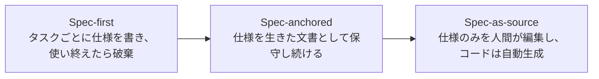
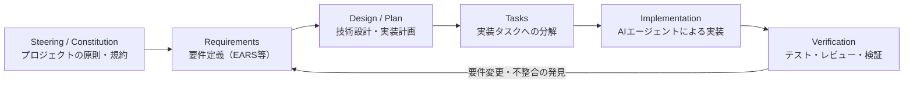
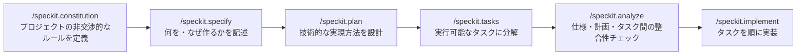
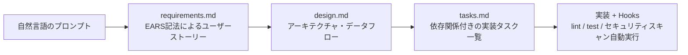
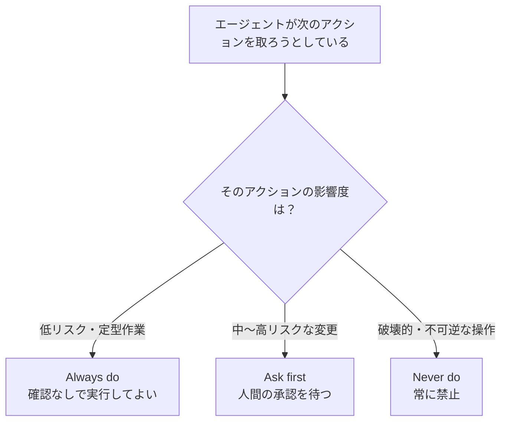
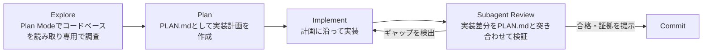

# AI仕様駆動開発（Spec-Driven Development）実践ガイド
### 初学者のためのステップバイステップ・ベストプラクティス

> 本ガイドは2026年7月25日時点で公開されている情報（GitHub、AWS、Anthropic等の一次情報、およびAddy Osmani、Birgitta Böckeler（Thoughtworks/Martin Fowler）、Sean Grove（OpenAI）ら国際的に著名な開発者・専門家の発信内容）に基づいて作成しています。各章末に根拠となる出典URLを記載し、巻末に参考文献一覧をまとめています。SDDは現在進行形で急速に変化している分野のため、最新情報は各リンク先で随時ご確認ください。

---

## 目次

1. なぜ今、仕様駆動開発なのか
2. 仕様駆動開発（SDD）とは何か
3. 成熟度モデル：Spec-first / Spec-anchored / Spec-as-source
4. 主要ツールエコシステム（2026年7月時点）
5. 要件記述の基盤技術：EARS記法
6. ステップバイステップ・ワークフロー実践
7. 良い仕様（スペック）の書き方 — 初学者向け5原則
8. Claude Codeにおける実践
9. ベストプラクティス・チェックリスト
10. 批判的視点と限界
11. 2026年7月時点の最新動向
12. まとめ
13. 参考文献・出典一覧

---

## 1. なぜ今、仕様駆動開発なのか

2025年以降、AIコーディングエージェントは急速に普及しましたが、同時に「動くコードは出てくるが、意図した通りには動かない」という問題が顕在化しました。Stack Overflowの2025年開発者調査では、84%の開発者がAIツールを利用済み、あるいは利用予定と回答した一方、その出力精度を信頼していると答えたのはわずか33%にとどまり、AIツールへの肯定的な感情は2023〜2024年の70%超から2025年には60%まで低下したと報告されています[1]。

この背景には、Andrej Karpathyが2025年2月に提唱した「vibe coding（バイブコーディング）」——AIに自然文で指示し、出てきたコードをそのまま受け入れる開発スタイル——の限界があります。プロトタイピングには有効な一方、保守が必要な本番システムには不向きであることが繰り返し指摘されています[2][3]。

さらに、AI生成コードの品質に関する実証研究も蓄積されています。

| 調査 | 内容 |
|---|---|
| Yan et al. (2025) | AI生成コードの脆弱性混入率はベンチマークによって9.8%〜42.1%[4] |
| Fu et al., ACM TOSEM (2025) | 3つのAIコード生成ツールで43種類のCWE（脆弱性分類）を確認[4] |
| 2026年2月の大規模実証研究（arXiv） | 本番リポジトリに残存するAI由来の不具合が11万件超に達したと報告[4] |

こうした課題への対応として、「コードではなく仕様（スペック）を最初に書き、それを実行可能な契約（contract）としてAIエージェントに与える」という仕様駆動開発（Spec-Driven Development, SDD）が2025〜2026年にかけて主流の実践として定着しました[2][5]。

---

## 2. 仕様駆動開発（SDD）とは何か

SDDとは、バージョン管理された詳細な仕様書を「唯一の真実源（single source of truth）」とし、人間もしくはAIエージェントがまずその仕様を書き、そこから設計・タスク分解を経て初めてコードを生成するという開発手法です。要件が変わった場合はコードを直接編集するのではなく仕様を編集し、関連コードを再生成します[5]。

### 2.1 思想的な起点：Sean Grove「The New Code」

この考え方が広く知られるきっかけとなったのが、OpenAIでアライメント研究に携わっていたSean Groveが2025年のAI Engineer World's Fair（サンフランシスコ）で行った講演「The New Code」です[1][6]。Groveは、開発者がAIにプロンプトを与えてコードだけを残しプロンプト自体を捨てる従来のやり方を、「ソースコードを捨ててバイナリだけをバージョン管理する」ことに例え、コードはプログラマーの価値のごく一部に過ぎず、より大きな価値は意図を構造化して伝達することにあると論じました[6]。

Groveが例に挙げたのがOpenAI自身の「Model Spec」——各項目に一意のIDと具体例（テストとして機能する）を持つ、バージョン管理されたMarkdown文書として公開されているモデルの振る舞い仕様です[1][6]。

### 2.2 パラダイムシフト：「コードが真実」から「意図が真実」へ

GitHubは公式ブログで、この転換を「コードが真実の源である」という前提から「意図（仕様）が真実の源である」という前提への移行だと説明しています。AIによって仕様が実行可能（executable）になったことで、ドキュメントの重要性が増したのではなく、仕様そのものが「何が作られるか」を直接決定するようになった、というのがその要点です[2]。

**出典（第2章）**：[1][2][6]

---

## 3. 成熟度モデル：Spec-first / Spec-anchored / Spec-as-source

SDDという言葉は急速に広まった一方、実践のレベルはツールによって大きく異なります。Thoughtworksの Birgitta Böckeler は、Martin FowlerのWebサイトに掲載した分析記事の中で、SDDを3段階の成熟度として整理しました[7][8]。これは2026年のarXiv論文「From Code to Contract」でもほぼ同じ枠組みが踏襲されており、業界で広く参照されるモデルとなっています[9]。



| 段階 | 概要 | 適したシーン |
|---|---|---|
| Spec-first | 良く練られた仕様を最初に書き、1回のタスクのAI支援開発に使う。仕様はその後破棄・放置されがち | 単発の機能追加、小規模な変更 |
| Spec-anchored | 仕様を機能の進化とともに保守し続け、「生きたドキュメント」として扱う | チーム開発、継続的なプロダクト開発 |
| Spec-as-source | 仕様が唯一の編集対象となり、人間はコードを直接編集しない（コードは自動生成専用） | 高い一貫性が求められる大規模システム（まだ発展途上） |

Böckeler は、この3段階を混同しないことが重要だと述べています。GitHub Spec KitやKiroの多くの実践は「Spec-first」〜「Spec-anchored」の間にあり、「Spec-as-source」を徹底しているのはTesslのような一部のツールに限られます[7]。

**出典（第3章）**：[7][8][9]

---

## 4. 主要ツールエコシステム（2026年7月時点）

2025年後半から2026年にかけて、主要なAIコーディングツールの多くが独自のSDD実装を発表しました[5][10]。

| ツール | 提供元 | 中核ワークフロー | 特徴 |
|---|---|---|---|
| **GitHub Spec Kit** | GitHub | constitution → specify → plan → tasks → analyze → implement | MITライセンスのOSS。30以上のAIコーディングエージェント（Claude Code、Copilot、Gemini CLI等）に対応[11][12] |
| **AWS Kiro** | Amazon | Requirements（EARS記法）→ Design → Tasks → Execution | VS Codeベースの専用IDE。保存時に自動でlint/test/セキュリティスキャンを走らせる「Hooks」機能を搭載[13][14] |
| **Claude Code** | Anthropic | CLAUDE.md（憲法）→ Plan Mode → PLAN.md → Tasks → Subagentレビュー | SDDの要素をネイティブ機能として内包。CLAUDE.mdは「advisory（助言的）」、hooksは「deterministic（決定的）」という設計思想[15][16] |
| **Tessl** | Tessl | Spec-as-source徹底 | 1対1のspec-to-codeマッピングを目指す最も急進的な実装。生成コードには `// GENERATED FROM SPEC` 等の編集禁止マーカーを付与（2026年時点でベータ）[7] |
| **Google Conductor / Antigravity** | Google | 永続的でバージョン管理されたMarkdownによるコンテキスト共有 | 元はGemini CLI拡張機能。2026年7月にプラグイン形式へ進化しAntigravityに対応[17] |
| **OpenSpec / BMAD-METHOD** | OSSコミュニティ | 軽量なSDDフレームワーク | ツールによって採用の伸びに大きな差があり、半年で800%超成長したものもあれば緩やかな成長にとどまるものもある[18] |

> **選び方の目安**：ポータビリティ（特定エージェントに縛られない）を重視するならGitHub Spec Kit、IDE統合の完成度を重視するならAWS Kiro、ターミナル中心の開発でCLAUDE.mdによる規約統合を重視するならClaude Codeが出発点として挙げられています[10][15]。

**出典（第4章）**：[5][7][10][11][12][13][14][15][16][17][18]

---

## 5. 要件記述の基盤技術：EARS記法

多くのSDDツール（特にAWS Kiro）が要件定義部分に採用しているのが「EARS（Easy Approach to Requirements Syntax）」という記法です[13][14]。

### 5.1 歴史

EARSは2009年、Rolls-Royce社のAlistair Mavinらが、航空機エンジン制御システムの耐空性規則を分析する中で開発し、同年のIEEE International Requirements Engineering Conference（RE'09）で発表されました[19][20]。自然言語で書かれた要件が抱えがちな「曖昧さ・冗長さ・矛盾・実装依存の記述」といった問題を、少数のキーワードと一貫した節の順序によって軽減することを目的としています[19][20]。Airbus、Bosch、Dyson、Honeywell、Intel、NASA、Siemens等、航空宇宙・自動車業界を中心に長年採用されてきた実績があり、2025年以降はAWS KiroをはじめとするAI仕様駆動開発ツールに組み込まれる形で新たな注目を集めています[20]。

### 5.2 基本構文

EARSの基本形は以下の通りです[19]。

```
While <事前条件（任意）>, When <トリガー（任意）>, the <システム名> shall <システムの応答>
```

| 要件タイプ | パターン例 |
|---|---|
| Ubiquitous（恒常的） | The system shall encrypt all stored passwords. |
| Event-driven（イベント駆動） | When the user submits the login form, the system shall validate the credentials within 2 seconds. |
| Unwanted behavior（望ましくない挙動） | If the authentication fails 5 times, then the system shall lock the account for 15 minutes. |
| State-driven（状態駆動） | While the account is locked, the system shall reject all login attempts. |
| Optional feature（オプション機能） | Where two-factor authentication is enabled, the system shall require a one-time code after password verification. |

初学者は、まず「Event-driven」と「Unwanted behavior」の2パターンだけでも意識して仕様を書くと、曖昧な要件がかなり減ります。

**出典（第5章）**：[13][14][19][20]

---

## 6. ステップバイステップ・ワークフロー実践

### 6.1 ツールに共通する一般モデル

ツールごとに呼び方は異なりますが、根底にある流れはほぼ共通しています。



各フェーズの間には必ず人間によるレビュー（承認ゲート）を挟むことが推奨されています。AWS Kiroのドキュメントでも「要件承認後に設計へ、設計承認後にタスクへ」と各段階の間に確認ステップを置く設計になっています[13][21]。

### 6.2 GitHub Spec Kitの具体的なコマンドフロー



`constitution`ファイルは `.specify/memory/constitution.md` に保存され、プロジェクト固有の非交渉的なルール（禁止事項・必須事項）を定義します。この構造は9つの条項（nine-article structure）で構成され、プロジェクトごとに内容をカスタマイズできる形になっています[22][23]。

### 6.3 AWS Kiroの3ドキュメント構成



Kiroでは各タスク完了後に自動でテストを実行し、要件を満たしているかを検証する仕組みが組み込まれています。また「Run all Tasks」機能を使うと、依存関係のないタスクを並行して実行する「Wave」単位の実行が可能です[21]。

**出典（第6章）**：[13][21][22][23]

---

## 7. 良い仕様（スペック）の書き方 — 初学者向け5原則

Google Chromeのエンジニアリングリーダーとして知られるAddy Osmaniは、O'Reilly Radarに寄稿した記事の中で、GitHub上の2,500件以上のエージェント設定ファイル分析結果を踏まえた「良い仕様を書くための5原則」を提示しています[24][25][26]。

### 原則1：目標志向で書く（Keep it goal-oriented）

仕様の冒頭は「何を（What）」「なぜ（Why）」に集中し、実装の「どうやって（How）」は後回しにします。ユーザーストーリーと同じ要領で「誰が」「何を必要としているか」「成功とは何か」を明確にします[25]。

### 原則2：構造化されたドキュメントとして書く

思いつきのメモの寄せ集めではなく、PRD（Product Requirements Document）やSRS（Software Requirements Specification）のように、明確なセクションを持つ文書として仕様を扱います[25]。

### 原則3：多く書きすぎない（instruction curseへの注意）

Stanford発の研究では、プロンプトに指示を詰め込むほどモデルが各指示に従う精度が低下する現象（いわゆる「curse of instructions」）が確認されています。10個の詳細ルールを並べると、モデルは最初の数個には従っても後半を見落としがちになります。したがって「長い仕様」ではなく「賢く整理された仕様」を目指すべきだとOsmaniは指摘しています[26]。

### 原則4：3段階の境界線（Always / Ask first / Never）を設ける

単純な「やってはいけないことリスト」よりも、3段階の境界システムの方がエージェントに明確な行動指針を与えられます[25][26]。



| 区分 | 例 |
|---|---|
| Always do | コミット前に必ずテストを実行する／命名規約に従う |
| Ask first | データベーススキーマの変更前に確認する／新しい依存関係の追加前に確認する |
| Never do | シークレットやAPIキーをコミットしない／`node_modules`や`vendor`配下を編集しない |

### 原則5：自己検証を組み込む（self-verification / LLM-as-a-Judge）

実装後に「仕様の各項目を満たしているか確認し、満たしていない項目を列挙せよ」とエージェント自身に確認させる自己監査のステップを仕様に組み込むと、抜け漏れの検出率が上がります。コードスタイルや可読性のような自動テストで測りにくい観点については、別のエージェント（あるいは別プロンプト）に出力をレビューさせる「LLM-as-a-Judge」パターンも有効とされています[25][26]。

Osmaniはこれらの原則の裏付けとして、開発者のSimon Willisonが「コーディングエージェントから良い結果を引き出す感覚は、人間のジュニアエンジニアをマネジメントする感覚に近い」と述べていることも紹介しています[26]。

**出典（第7章）**：[24][25][26]

---

## 8. Claude Codeにおける実践

Anthropic自身が公開している「Claude Code: Best practices for agentic coding」では、CLAUDE.mdを活用したコンテキスト管理や、実装前に計画を立てる重要性が解説されています[15]。

### 8.1 CLAUDE.md ＝ プロジェクトの「憲法」

CLAUDE.mdはプロジェクトルートに置かれ、セッション開始時に自動的にコンテキストへ読み込まれるMarkdownファイルです。コーディング規約・アーキテクチャ上の決定事項・優先ライブラリ・レビューチェックリストなどを記述します[15][27]。ただし、CLAUDE.mdの指示は「advisory（助言的）」であり、確率的に従われるものである点に注意が必要です。長すぎるCLAUDE.mdはかえって指示追従の精度を下げるため、「この行を削除するとClaudeがミスをするか？」を基準に定期的に刈り込むことが推奨されています[16]。

### 8.2 Plan ModeとSubagentレビューのループ



Anthropicの実践では、実装が完了したという「主張」をそのまま信じるのではなく、テスト出力・実行コマンドとその結果・スクリーンショットなど「証拠（evidence）」を提示させることが推奨されています。証拠を確認する方が、検証をゼロからやり直すより速いためです[16]。

### 8.3 Hooksによる決定的な強制

CLAUDE.mdの指示が確率的（advisory）であるのに対し、Hooksはスクリプトを自動実行する決定的（deterministic）な仕組みであり、アクションを確実に強制できます。CLAUDE.mdによる注意喚起だけでは不十分になった場合、恒久的な対策としてHooksやSkillsへ制御を移すことが推奨されています[16]。

Anthropicの社内チームの報告によれば、詳細な指示なしでClaude Codeが小〜中規模のPRを一発で正しく仕上げる成功率はおよそ3分の1程度にとどまるとされています。1つのタスクに20の意思決定判断が含まれ、各判断の的中率を80%と仮定すると、20個すべてを事前ガイドなしで正しく判断できる確率は0.8の20乗、つまり約1%にまで下がる計算になります。レビュー済みの仕様を用意することは、Claudeが下すべきでない判断そのものを事前に排除する効果があるといえます[28]。

**出典（第8章）**：[15][16][27][28]

---

## 9. ベストプラクティス・チェックリスト

| # | チェック項目 | 補足 |
|---|---|---|
| 1 | プロジェクトの「憲法（Constitution）」を最初に定義したか | 非交渉的なルール・技術スタック・禁止事項を明文化[22] |
| 2 | 仕様は「What/Why」から始め、「How」は後段に回したか | 実装詳細を早期に混ぜるとAIの視野が狭まる[25] |
| 3 | 受け入れ基準をEARS記法などの構造化された形式で書いたか | 曖昧さ・矛盾を減らせる[13][19] |
| 4 | Always / Ask first / Never の3段階境界を設定したか | 単純な禁止リストより行動指針が明確[25] |
| 5 | 仕様は詰め込みすぎず、モジュール単位に分割したか | curse of instructionsを回避[26] |
| 6 | 各フェーズ（要件→設計→タスク→実装）の間に人間の承認ゲートを設けたか | Kiro・Spec Kitとも共通の設計原則[13][22] |
| 7 | 実装後、仕様との差分を自己検証させる仕組みを入れたか | LLM-as-a-Judgeパターンの活用[25][26] |
| 8 | 「証拠（テスト結果・実行ログ）」の提示を求めているか | 主張ではなく証拠でレビューする[16] |
| 9 | 重要な強制事項はCLAUDE.md（advisory）ではなくHooks（deterministic）に移したか | 恒久対策として有効[16] |
| 10 | プロジェクトの規模・目的に見合ったSDDの成熟度（Spec-first/anchored/as-source）を選んだか | オーバーヘッドと得られる制御のバランス[7] |

---

## 10. 批判的視点と限界

SDDは万能薬ではありません。Böckeler は、GitHub Spec Kit、AWS Kiro、Tesslの3ツールを実際に評価した記事の中で、以下のような課題を指摘しています[7]。

- **レビュー負荷の増大**：特にSpec Kitは、1つの仕様に対して大量の反復的なMarkdownファイルを生成するため、レビューが過大になり、場合によっては通常のコードレビューの方が現実的になることがある。
- **「制御している」という錯覚**：複雑な指示に対してAIエージェントが一部を無視したり、逆に過剰に適用したりする挙動が観察されており、仕様を書けば完全に制御できるという前提には注意が必要。
- **小規模タスクへの不適合**：軽微なバグ修正のような小さな作業には、SDDの手続きがオーバーヘッドになりやすい。
- **モデル駆動開発（MDD）との歴史的な類似**：「Spec-as-source」という野心は、過去に十分な成果を上げられなかったモデル駆動開発の理想と重なる部分があり、LLMの非決定性がMDDの硬直性の問題をむしろ悪化させる可能性がある。
- **用語の希薄化**：「Spec」という言葉が単なる「詳細なプロンプト」の同義語として使われるケースが増えており、手法が確立する前に意味が拡散しつつある。

これらを踏まえると、SDDは「常に必要な儀式」ではなく、**プロジェクトの複雑さ・チーム規模・保守期間に応じて適用レベルを選ぶための道具**として捉えるのが実践的です。ソロでの探索的なプロトタイピングであれば軽量なvibe codingのままで構わず、本番運用・複数チーム・規制対応が絡む場面でSpec-anchored以上の厳密さを導入する、という使い分けが妥当とされています[7][29]。

**出典（第10章）**：[7][29]

---

## 11. 2026年7月時点の最新動向

- **Google Conductorのプラグイン化**：2026年7月16日付のGoogle Developers Blogによれば、Gemini CLI拡張として始まったConductorが「Conductor Plugin」として進化し、Skills・Rules・MCPサーバー・Hooksを1つのパッケージにまとめられるようになりました。あわせて新しいエージェント基盤「Antigravity」への対応も発表されています[17]。
- **AWS Kiroの立ち位置強化**：Amazon Q DeveloperがKiroへ統合される形でのサポート終了（新規ユーザー向けは2027年4月30日終了予定）が示されており、AWSは開発者向けAI投資をKiroに集約する方針を明確にしています[14]。
- **教育面での定着**：DeepLearning.AIが2025年後半に、Sandeep Dinesh氏を講師とする専門コース「Spec-Driven Development with Coding Agents」を開講しており、実験的な手法から主流の実践へと移行したことを示す一つの指標とされています[30]。
- **業界での評価の広がり**：Thoughtworks・Martin Fowler・GitHub・Amazonなど複数の独立した情報源が2025〜2026年にかけてSDDを推奨する立場を示しており、ThoughtworksのTechnology Radarでも採用を検討すべき技術として取り上げられています[30]。
- **OSSフレームワーク間の採用格差**：OpenSpecやBMAD-METHODなど軽量なOSS実装の間でも、採用の伸び方には大きな差が生じており、半年間で800%を超える成長を見せたものもあれば、緩やかな成長にとどまるものもあると報告されています[18]。

**出典（第11章）**：[14][17][18][30]

---

## 12. まとめ

仕様駆動開発（SDD）は、「AIエージェントがコードを書く時代において、人間が生み出す最も価値の高い成果物は仕様そのものである」という認識のもとに生まれた実践です。GitHub Spec Kit・AWS Kiro・Claude Codeなど主要ツールはそれぞれ異なるワークフローを持ちますが、根底にある「Constitution／Steering → Requirements → Design/Plan → Tasks → Implementation → Verification」という流れは共通しています。

初学者がまず身につけるべきは、次の3点に集約されます。

1. 仕様は「What/Why」から書き始め、EARS記法のような構造化された形式で受け入れ基準を明示すること
2. 仕様を詰め込みすぎず、Always/Ask first/Neverの3段階で境界を設けること
3. 実装は必ず人間のレビュー（承認ゲート）を挟み、「証拠」に基づいて検証すること

一方で、SDDはレビュー負荷の増大や小規模タスクへの不適合といった限界も指摘されています。プロジェクトの規模・重要度に応じて、Spec-first・Spec-anchored・Spec-as-sourceのどの成熟度で実践するかを選ぶことが、実務での成功の鍵となります。

---

## 13. 参考文献・出典一覧

1. Augment Code, *6 Best Spec-Driven Development Tools for AI Coding in 2026* — https://www.augmentcode.com/tools/best-spec-driven-development-tools
2. GitHub Blog, *Spec-driven development with AI: Get started with a new open source toolkit* — https://github.blog/ai-and-ml/generative-ai/spec-driven-development-with-ai-get-started-with-a-new-open-source-toolkit/
3. DEV Community, *Spec-Driven Development in 2026: What It Is, the Tooling, and How Teams Actually Use It* — https://dev.to/krlz/spec-driven-development-in-2026-what-it-is-the-tooling-and-how-teams-actually-use-it-2fk2
4. Augment Code, *What Is Spec-Driven Development? A Complete Guide* — https://www.augmentcode.com/guides/what-is-spec-driven-development
5. BCMS, *Spec-Driven Development (SDD): The Definitive 2026 Guide* — https://thebcms.com/blog/spec-driven-development
6. Sean Grove, *The New Code*（AI Engineer World's Fair, 2025）文字起こし — https://lawwu.github.io/transcripts/8rABwKRsec4.html （動画: https://www.youtube.com/watch?v=8rABwKRsec4 ）
7. Birgitta Böckeler, *Understanding Spec-Driven-Development: Kiro, spec-kit, and Tessl*, martinfowler.com — https://martinfowler.com/articles/exploring-gen-ai/sdd-3-tools.html
8. Birgitta Böckeler, Publications — https://birgitta.info/
9. TrueFoundry, *Spec-Driven Development for AI Agents: Governing Specs* — https://www.truefoundry.com/blog/spec-driven-development-ai-agents
10. codemyspec, *Spec-Driven Development in 2026: Guide + Tool Comparison* — https://codemyspec.com/blog/spec-driven-development
11. GitHub, *spec-kit* リポジトリ — https://github.com/github/spec-kit
12. MarkTechPost, *Meet GitHub Spec-Kit: An Open Source Toolkit for Spec-Driven Development with AI Coding Agents* — https://www.marktechpost.com/2026/05/08/meet-github-spec-kit-an-open-source-toolkit-for-spec-driven-development-with-ai-coding-agents/
13. Carlos Biagolini, *What Is Spec-Driven Development and How to Implement It with Kiro*, AWS in Plain English — https://aws.plainenglish.io/what-is-spec-driven-development-and-how-to-implement-it-with-kiro-b5846bd55869
14. Developers Digest, *AWS Kiro Developer Guide: The Spec-Driven IDE That Replaced Amazon Q* — https://www.developersdigest.tech/blog/aws-kiro-developer-guide-2026
15. Anthropic Engineering, *Claude Code: Best practices for agentic coding* — https://www.anthropic.com/engineering/claude-code-best-practices
16. Augment Code, *Claude Code for Spec-Driven Development: Capabilities and Limits* — https://www.augmentcode.com/guides/claude-code-spec-driven-development
17. Google Developers Blog, *Evolving Spec-Driven Development: Conductor Now Supports Antigravity*（2026年7月16日）— https://developers.googleblog.com/evolving-spec-driven-development-conductor-now-supports-antigravity/
18. YouTube, *Spec-Driven Development in 2026: What Actually Changed* — https://www.youtube.com/watch?v=b6cbxSaa4U4
19. Alistair Mavin, *EARS: Easy Approach to Requirements Syntax*（公式ガイド）— https://alistairmavin.com/ears/
20. Wikipedia, *Easy Approach to Requirements Syntax* — https://en.wikipedia.org/wiki/Easy_Approach_to_Requirements_Syntax
21. Kiro Docs, *Specs* — https://kiro.dev/docs/specs/
22. GitHub, *spec-kit/spec-driven.md* — https://github.com/github/spec-kit/blob/main/spec-driven.md
23. Spec Kit Documentation（公式サイト）— https://github.github.com/spec-kit/
24. Umesh Malik, *The $300K Bug That Was Never the AI's Fault — Inside Addy Osmani's Spec Framework* — https://umesh-malik.com/blog/spec-driven-development-ai-agents-addy-osmani
25. Addy Osmani, *How to write a good spec for AI agents* — https://addyosmani.com/blog/good-spec/
26. Roger Wong, *How to Write a Good Spec for AI Agents*（Addy OsmaniのO'Reilly Radar寄稿の解説）— https://rogerwong.me/2026/02/how-to-write-a-good-spec-for-ai-agents （原文: https://www.oreilly.com/radar/how-to-write-a-good-spec-for-ai-agents/ ）
27. DataCamp, *Spec-Driven Development with Claude Code: A Guided Tutorial* — https://www.datacamp.com/tutorial/spec-driven-development-with-claude-code
28. Build This Now, *Spec-Driven Development with Claude Code* — https://www.buildthisnow.com/blog/guide/mechanics/spec-driven-development
29. Wikipedia, *Spec-driven development* — https://en.wikipedia.org/wiki/Spec-driven_development
30. AlphaSignal, *Spec-Driven Development is the New Default for AI Coding* — https://alphasignalai.substack.com/p/spec-driven-development-is-the-new

---

*本ガイドはMarkdown形式で作成されており、フローチャートはすべてMermaid記法、比較表はすべてMarkdownテーブルで記述しています（ASCIIアートは使用していません）。*
