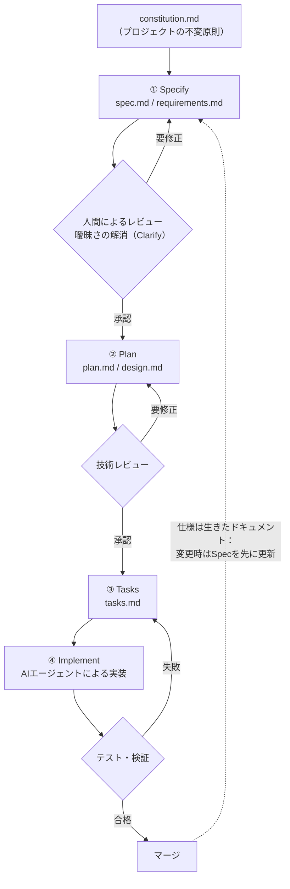
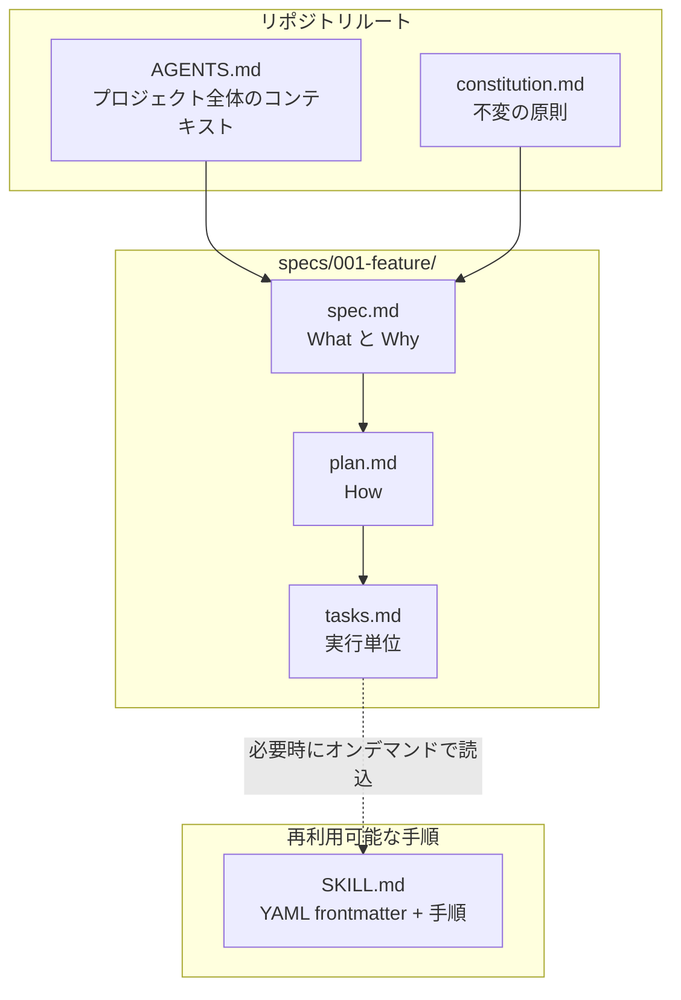
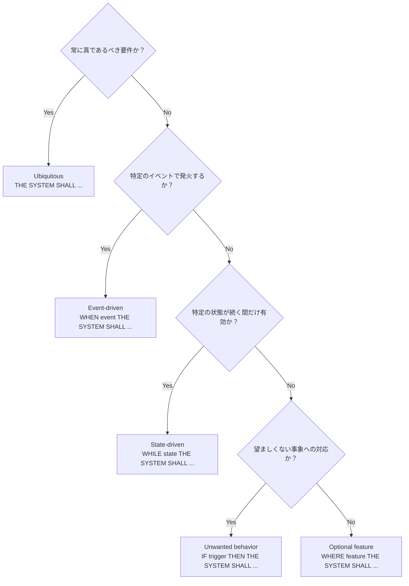
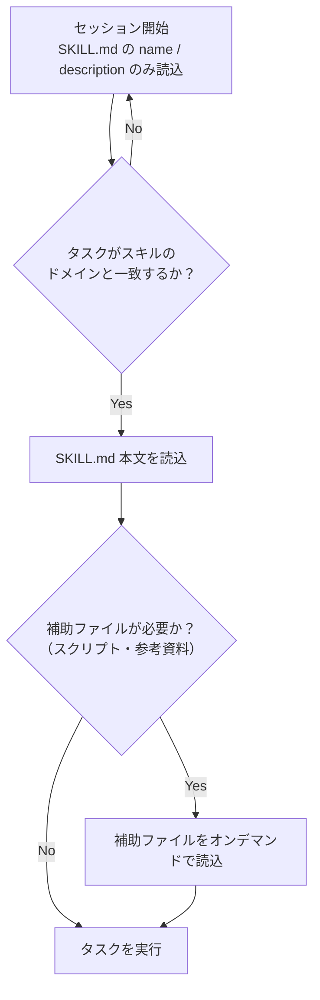

# AI仕様駆動開発（Spec-Driven Development）における実践的Markdown作成ガイド

> 対象読者: AIコーディングエージェント（Claude Code / GitHub Copilot / Cursor / Codex CLI / Kiro など）を業務で使い、仕様駆動開発（SDD）のドキュメント運用を体系化したい中級〜上級エンジニア
> 最終更新: 2026年7月28日時点の公開情報に基づく（出典は末尾「参考文献」参照）

## 目次

1. [仕様駆動開発（SDD）とは何か、なぜMarkdownなのか](#1-仕様駆動開発sddとは何かなぜmarkdownなのか)
2. [成熟度モデル：Spec-first / Spec-anchored / Spec-as-source](#2-成熟度モデルspec-first--spec-anchored--spec-as-source)
3. [全体ワークフロー：Specify → Plan → Tasks → Implement](#3-全体ワークフローspecify--plan--tasks--implement)
4. [ファイル構成の全体像](#4-ファイル構成の全体像)
5. [Step-by-Step: spec.md / requirements.md の書き方](#5-step-by-step-specmd--requirementsmd-の書き方)
6. [Step-by-Step: plan.md / design.md の書き方](#6-step-by-step-planmd--designmd-の書き方)
7. [Step-by-Step: tasks.md の書き方](#7-step-by-step-tasksmd-の書き方)
8. [AGENTS.md / CLAUDE.md：プロジェクト全体のコンテキストファイル](#8-agentsmd--claudemdプロジェクト全体のコンテキストファイル)
9. [SKILL.md：段階的開示（Progressive Disclosure）](#9-skillmd段階的開示progressive-disclosure)
10. [Markdown記法そのもののベストプラクティス](#10-markdown記法そのもののベストプラクティス)
11. [生きたドキュメントとしての運用](#11-生きたドキュメントとしての運用)
12. [よくある落とし穴と対策](#12-よくある落とし穴と対策)
13. [導入前チェックリスト](#13-導入前チェックリスト)
14. [まとめ](#14-まとめ)
15. [参考文献](#15-参考文献)

---

## 1. 仕様駆動開発（SDD）とは何か、なぜMarkdownなのか

### 1.1 Vibe Codingの限界

Andrej Karpathy氏が2025年初頭に提唱した「Vibe Coding」という言葉は、コーディングエージェントに緩いプロンプトを投げて生成物をそのまま受け入れるスタイルを指し、2025年のCollins English Dictionary「今年の言葉」にも選出されるほど広まりました[16]。プロトタイピングや個人開発では有効ですが、数百行を超える規模になると、エージェントが「言語化されていない意図」を推測で埋めるようになり、その推測の積み重ねがコードベース全体のドリフト（意図からのズレ）を生みます[15][20]。

Simon Willison氏（Datasette作者）は、LLMが書いたコードであっても開発者がレビュー・テスト・理解を尽くしていれば、それはもはやVibe Codingではなく「LLMをタイピングアシスタントとして使っている」状態だと整理しています[23]。この「所有できるかどうか」の境界線こそが、SDD導入の判断基準になります。

### 1.2 SDDの定義

仕様駆動開発（Spec-Driven Development）とは、コードではなく**バージョン管理された仕様書そのもの**を正とし、そこから実装計画・タスク・コードを導出する開発手法です[14]。2025年に、GitHub Spec Kit（2025年9月公開）やAWS Kiro（2025年7月公開）といったツールがAIエージェント向けに具体化し、2026年には主要なAIコーディングツールのほぼすべて（GitHub Spec Kit, AWS Kiro, Claude Code, Cursor, OpenSpec, BMAD-METHOD, Tessl, Google Antigravityなど）が何らかのSDDワークフローを実装するに至りました[16]。

SDDが解決しようとしている問題は明快です。AIエージェントは明示された契約（仕様）に対する実装は非常に得意ですが、暗黙の意図を推測することは苦手です[16]。曖昧なプロンプトは曖昧なコードを生みますが、構造化された仕様は、意図に近いコードを生みます。

### 1.3 なぜMarkdownなのか

SDDの実務ツールがほぼ例外なくMarkdownを採用しているのには理由があります。

- **人間にもAIにも読める**: プレーンテキストであるため、人間のレビュアーとAIエージェントの双方が同じファイルをそのまま解釈できる[4]。
- **バージョン管理と親和性が高い**: Gitでdiffが取れるため、「仕様がいつ・どう変わったか」を追跡できる[9]。
- **ツール非依存（ポータブル）**: 特定ベンダーのフォーマットに縛られず、Claude Code・Codex・Cursor・Gemini CLIなど複数のエージェント間で使い回せる[7]。
- **構造と自由度のバランス**: 見出し・表・コードブロックといった軽量な構造化要素を持ちながら、厳密なスキーマを強制しない[26][7]。

---

## 2. 成熟度モデル：Spec-first / Spec-anchored / Spec-as-source

Thoughtworks社のMartin Fowler氏らのチームは、SDDの実践パターンを3段階の厳密度スペクトラムとして整理しています[13]。自分たちのチームがどの段階を目指すのかを最初に決めておくことが、後述する「過剰形式化（Waterfall化）」を防ぐ第一歩になります。

| 段階 | 考え方 | 仕様が担う役割 | コードの位置づけ | 向いているケース |
|---|---|---|---|---|
| **Spec-first（仕様先行）** | 仕様を書いてからプロンプトする | AIへの高品質なコンテキスト | 依然として正（メンテナンス対象） | ほとんどの現場のデフォルト。実務での主流[16] |
| **Spec-anchored（仕様係留）** | 仕様は実装後も「生きた契約」として残り続ける | 継続的なガバナンス文書 | 正だが、仕様との乖離をCIで機械的に検知 | チーム開発・長期保守プロジェクト |
| **Spec-as-source（仕様が源泉）** | 仕様こそが唯一のソースで、コードは使い捨て可能な生成物 | 実行可能な仕様そのもの | 生成物（規約変更時は再生成） | OpenAPIからのスタブ生成、Simulinkモデルからの組込みコード生成など、narrow domainで既に標準化された領域[15] |

多くの現場が実際に運用しているのは**Spec-anchored**寄りのアプローチであり、「仕様がAIの仕事を楽にし、人間レビュアーの仕事も楽にする」という位置づけです[15]。

---

## 3. 全体ワークフロー：Specify → Plan → Tasks → Implement

GitHub Spec Kitに代表される主要ツール群は、ほぼ共通して「Specify → Plan → Tasks → Implement」という4フェーズループを採用しています[15][16]。各フェーズの間に**人間によるレビューゲート**を置くことが、品質を保つ最大のポイントです。



GitHub Spec Kitでは、この4フェーズに加えて `/speckit.constitution`（プロジェクトの非交渉原則を定義）、`/speckit.clarify`（曖昧点の質問）、`/speckit.analyze`（spec/plan/tasks間の矛盾チェック）、`/speckit.checklist`（仕様の抜け漏れを検査する「英語のユニットテスト」）といった補助コマンドがスラッシュコマンドとして用意されています[3]。AWS Kiroも同様に、要件定義→設計→実装計画の3フェーズを踏み、各フェーズ間に承認ゲートを設けます[5][6]。

---

## 4. ファイル構成の全体像

SDDのMarkdown群は役割ごとに階層化して配置するのが定石です。プロジェクト全体に効くファイルと、機能単位でスコープされるファイルを混在させないことが重要です。



主要なツール・標準がそれぞれどのファイル名を使っているかを整理すると以下の通りです。名前は違えど、役割（What/Why・How・実行単位・全体コンテキスト）はほぼ共通しています。

| ツール / 標準 | 主なファイル | 提供元・管理団体 | 位置づけ |
|---|---|---|---|
| GitHub Spec Kit | `constitution.md`, `spec.md`, `plan.md`, `tasks.md` | GitHub（Microsoft傘下） | OSSツールキット（MITライセンス）[1] |
| AWS Kiro | `requirements.md`, `design.md`, `tasks.md` | AWS | 統合IDEに組み込み。EARS記法をネイティブ採用[5] |
| Claude Code | `CLAUDE.md` | Anthropic | セッションを跨いで読み込まれる指示書[20] |
| AGENTS.md（オープン標準） | `AGENTS.md` | Agentic AI Foundation（Linux Foundation傘下）。OpenAI・Google（Jules）・Cursor・Factory等が策定を主導 | ベンダー中立、必須フィールドなしのプレーンMarkdown[32] |
| Cursor | `.cursor/rules/*.mdc` | Cursor（Anysphere） | YAML frontmatter付きMarkdown。パスごとに適用範囲を制御[22] |
| Agent Skills | `SKILL.md` | Anthropicが提唱、オープン標準化 | Claude Code・Codex・Cursorなど30以上のツールが対応[18][29] |

**モノレポでの配置ルール**: AGENTS.mdやCLAUDE.mdはモノレポの各パッケージ配下にも配置でき、エージェントは「編集対象ファイルに最も近いファイル」を優先して読み込みます（例: OpenAIのCodexリポジトリでは88個のAGENTS.mdが階層的に配置されている）[27]。Claude Codeは独自にCLAUDE.mdを読みますが、`@AGENTS.md` のインポート記法を使えばAGENTS.mdを取り込めるため、複数ツールを併用するチームは「AGENTS.mdを単一の正とし、CLAUDE.mdは1行のインポート文だけにする」運用が推奨されています[26]。

---

## 5. Step-by-Step: spec.md / requirements.md の書き方

### Step 1: メタデータと目的を明記する

冒頭に「何のための機能か」「誰のためか」「スコープ外は何か」を短く書きます。実装方法（How）はここに書きません。GitHub Spec Kitの実運用では、LLMが張り切りすぎて要素サイズや配色などの実装詳細をspecに混入させてしまう傾向が報告されており、気づいた時点で技術要件をplanドキュメント側へ移動するよう指示することが推奨されています[3]。

### Step 2: ユーザーストーリーを優先度付きで書く

`P1`/`P2`/`P3` のように優先度ラベルを振り、各ストーリーを独立してテスト可能なMVPスライスとして記述するテンプレートが広く使われています[19]。

```markdown
### US-1（P1）: パスワードレス・ログイン
ユーザーとして、パスワードを覚えずにメールリンクだけでログインしたい。
これにより、パスワード忘れによる離脱を防げるため。
```

### Step 3: 受け入れ基準をEARS記法で書く

自然文の受け入れ基準（"ユーザーはログインできる" 等）は曖昧で、人間にもAIにも解釈のブレを生みます。この問題に対する業界標準の解が **EARS（Easy Approach to Requirements Syntax）** です。2009年にRolls-RoyceのAlistair Mavin氏らが航空機エンジン制御の要件定義用に考案した記法で、Kiroをはじめとする主要SDDツールがAIエージェント向けの受け入れ基準記法として採用しています[16][24]。EARSはベンダー中立の記法であり、Kiroは採用者であって考案者ではありません[24]。

EARSは5つのパターンで構成されます。どのパターンを使うべきかは、以下のように機械的に判定できます。



| パターン | 用途 | 構文テンプレート | 例 |
|---|---|---|---|
| Ubiquitous（恒常要件） | 常に真である基本要件 | `THE SYSTEM SHALL <応答>` | THE SYSTEM SHALL 全APIレスポンスをJSON形式で返す |
| Event-driven（イベント駆動） | 特定のイベント発生時 | `WHEN <トリガー> THE SYSTEM SHALL <応答>` | WHEN ユーザーが有効なメールアドレスを送信 THE SYSTEM SHALL 15分間有効なワンタイムリンクを送付する[21] |
| State-driven（状態駆動） | 特定の状態が続く間 | `WHILE <状態> THE SYSTEM SHALL <応答>` | WHILE メンテナンスモード中 THE SYSTEM SHALL 書き込みAPIを503で拒否する |
| Unwanted behavior（望まない挙動への対応） | 異常系・エラー処理 | `IF <トリガー> THEN THE SYSTEM SHALL <応答>` | IF ログインリンクが2回目以降使用された THEN THE SYSTEM SHALL HTTP 410で拒否する[21] |
| Optional feature（オプション機能） | 特定機能が有効な場合のみ | `WHERE <機能> THE SYSTEM SHALL <応答>` | WHERE 多要素認証が有効化されている THE SYSTEM SHALL 追加のワンタイムコード入力を要求する |

EARSで書かれた受け入れ基準は、ほぼ1対1でテストケースに変換できるという実務上の利点があります[21]。一方で、EARSは「表現の型」を統一するだけであり、それ自体が実行可能なテストになるわけではない点には注意が必要です[24]。

### Step 4: 曖昧さを可視化するマーカーを使う

GitHub Spec Kitの実運用では、spec.md中に `[NEEDS CLARIFICATION]` のようなマーカーを埋め込み、これが残っている間はタスクを「完了」とマークしない、という運用が確認されています[19]。曖昧な要件を無理に確定させず、可視化したまま人間の判断を仰ぐ設計です。

### Step 5: 実装詳細を書かない（Whatに徹する）

spec.mdは「何を」「なぜ」に徹し、「どう作るか」はplan.mdに譲ります。良い仕様書の条件を扱ったAddy Osmani氏（Googleの著名なエンジニア）の記事でも、仕様はAIエージェントが自己修正しつつ安全な境界内に留まるための"契約"であるべきだと述べられています[10]。

---

## 6. Step-by-Step: plan.md / design.md の書き方

1. **技術スタックとアーキテクチャ方針を明記する**: 使用するフレームワーク、データストア、外部API連携などをspecの要件にひもづけて記述します。
2. **アーキテクチャ図・シーケンス図はMermaidで描く**: Kiroのdesign.mdも、技術アーキテクチャとシーケンス図をこの段階で文書化する運用になっています[5]。ASCIIアートは避け、Mermaidのフローチャート／シーケンス図で表現します。
3. **意思決定の根拠を残す（ADR的に）**: なぜこの技術を選んだかを一言添えるだけで、後からの手戻りやレビュー時間を大きく減らせます。ただし、Scott Logic社の検証では、planフェーズで自動生成された406行の「research doc」が、既存ページと同じライブラリを使う理由付けなど、冗長で価値の薄い内容になっていた例も報告されています[17]。**生成させたら鵜呑みにせず、価値のある意思決定記録だけを残す**姿勢が重要です。
4. **エラーハンドリング・テスト戦略を明記する**: Kiroのdesign.mdはエラーハンドリングとテスト戦略を含むのが標準ですが、これが過剰だと実装フェーズでのレビュー往復が増えるという声もあり、必要な粒度は都度調整します[32]。

---

## 7. Step-by-Step: tasks.md の書き方

1. **アトミックなタスクに分解する**: 各タスクは独立してレビュー・差し戻し可能な単位にします。
2. **要件へのトレーサビリティを持たせる**: 各タスクがどのユーザーストーリー／受け入れ基準に対応するかを明示し、実装が要件から逸脱していないかを追跡できるようにします[33]。
3. **依存関係を明示し、並列実行可能なタスクをグルーピングする**: Kiroはtasks.mdから依存関係グラフを構築し、依存のないタスクを「Wave 1」としてまとめて並列に扱う仕組みを持ちます[5]。
4. **実装フェーズで内容を変更しない**: タスクはLLMが何を作るかの直接的な反映であるため、この段階で不正確な内容が混入していないかの確認が特に重要だと、Spec Kitの実運用知見として指摘されています[3]。

```markdown
## Task 12: マジックリンク送信APIの実装
- 対応要件: US-1 / EARS-EV-1
- 依存: Task 03（メール送信基盤）
- 完了条件: `POST /auth/magic-link` が15分間有効なトークンを発行し、単体テストが通ること
```

---

## 8. AGENTS.md / CLAUDE.md：プロジェクト全体のコンテキストファイル

AGENTS.mdは「エージェント向けのREADME」と位置づけられる、プレーンMarkdownのオープン標準です[7]。特徴は以下の通りです。

- **必須フィールドなし**: YAML frontmatterも不要で、見出しの付け方や粒度は完全に自由です[28]。
- **対応ツールの広さ**: 2026年前半時点でOpenAI Codex、Cursor、GitHub Copilot coding agent、Gemini CLI、Windsurf、Aider、Zed、Devin、Amazon Qなど30以上のツールがネイティブまたはインポート経由で読み込みます[25][26]。
- **ガバナンス**: 元々OpenAI・Amp・Google（Jules）・Cursor・Factoryなどの協業から生まれ、現在はLinux Foundation傘下のAgentic AI Foundationがスチュワードシップを担っています[7]。
- **コンフリクト解決**: 「編集対象ファイルに最も近いAGENTS.md」が優先され、さらにユーザーのチャット上の明示的な指示はすべてに優先します[7]。

典型的に含める内容は、ビルドコマンド・テストコマンド・コーディング規約・触ってはいけない領域（境界）など、人間向けREADMEには書かないがエージェントには必要な運用情報です[26]。

```markdown
# AGENTS.md

## セットアップ
- 依存関係インストール: `pnpm install`
- 開発サーバー起動: `pnpm dev`

## テスト
- 変更前に必ず実行: `pnpm test -- --changed`
- E2Eは `pnpm test:e2e`（CI専用、ローカルでは実行しない）

## 規約
- 状態管理はZustandのみ使用し、Reduxを追加しない
- APIクライアントは `src/lib/api/` 以下に集約する

## 境界
- `packages/billing/` 配下は決済監査対象。変更時は必ず人間レビューを要求すること
```

Claude CodeはAGENTS.mdではなく独自の `CLAUDE.md` を読み込みますが、二重管理を避けるため「CLAUDE.mdの中身は `@AGENTS.md` の1行インポートのみにし、実体はAGENTS.mdに一本化する」という移行パターンが定着しています[25]。

---

## 9. SKILL.md：段階的開示（Progressive Disclosure）

AGENTS.mdが「プロジェクトが何であるか」を伝えるのに対し、SKILL.mdは「特定のタスクをどうこなすか」という再利用可能な手順をエージェントに渡す仕組みです[27]。Anthropicが提唱し、Claude Code・Codex・Cursorなど多くのツールに広がったオープン標準です[18]。

SKILL.mdの最大の設計思想は**段階的開示（Progressive Disclosure）**です。コンテキストウィンドウは有限であり、すべてのスキルの全文を常時ロードするとノイズが増えるため、必要になった瞬間にだけ詳細を読み込む設計になっています[8]。



構造は「YAML frontmatter（`name` と `description` の2つが必須）＋Markdown本文の指示＋任意の補助ファイル（スクリプト・テンプレート）」というシンプルな形です[27][18]。

```markdown
---
name: deploy
description: アプリケーションを本番またはステージング環境へデプロイする
---

# Deploy

## 手順
1. テストスイートを実行: `bun run test`
2. 本番ビルド: `bun run build`
3. デプロイコマンドを実行し、ヘルスチェックを確認する
```

---

## 10. Markdown記法そのもののベストプラクティス

Anthropicの公式エンジニアリングブログ「Effective context engineering for AI agents」は、プロンプトやコンテキストを`<background_information>`のようなXMLタグ、または**Markdownの見出し**で明確にセクション分けすることを推奨しています。具体的な整形方法自体は今後変わっていく可能性があるが、明確なセクション区切りという原則自体は重要だと位置づけられています[8]。この原則はspec.md等のSDDドキュメントにもそのまま当てはまります。

### 10.1 見出し階層とセクション分け

- 見出し（`#`〜`####`）でセクションを明確に分離し、AIが「今どのセクションを読んでいるか」を見出しテキストだけで判断できるようにする。
- 1見出しに1目的。複数の関心事を1つの見出し配下に詰め込まない。
- アンカーリンク付きの目次（本ガイド冒頭のような）を長いドキュメントには必ず用意し、人間のレビュー時のナビゲーションコストを下げる。

### 10.2 表 vs 箇条書きの使い分け

- **表が向くケース**: 複数の項目を同じ軸（列）で比較する場合（本ガイドのツール比較表、EARSパターン表など）。AIエージェントにとっても構造化データとして解釈しやすい。
- **箇条書きが向くケース**: 単純な列挙、手順のステップ、条件の羅列。

### 10.3 Mermaidダイアグラムのルール

ASCIIアートによる図解は保守性が低く、フォントやレンダリング環境によって崩れるため、フローチャートは必ずMermaidのコードブロックで記述します。実務での注意点は以下の通りです。

- `mindmap` と `quadrantChart` は環境によって表示が崩れやすいため避け、`flowchart` + `subgraph` で代替する。
- サブグラフのタイトルには特殊文字を避けるか、クォートで囲んでパースエラーを防ぐ。
- ノード数が多い横方向のフローチャートはビューポート幅を超えやすいため、`TB`（縦方向）レイアウトを優先する。
- ノード間に実際のエッジがない兄弟要素は横に並んで幅が広がりがちなので、意味のある接続だけを描き、レイアウトを縦に収める。

### 10.4 コードブロックとfrontmatter

- コマンド例・設定例は必ずフェンス付きコードブロック（\`\`\`）で囲み、言語識別子（`bash`, `json`, `markdown`など）を付与する。
- SKILL.mdやCursorの`.mdc`ファイルのように、メタデータが必要な場合はYAML frontmatterを使う。本文の指示と機械可読なメタデータを分離できる[27]。

---

## 11. 生きたドキュメントとしての運用

仕様は「書いたら終わり」ではありません。SDDが従来のウォーターフォール型ドキュメントと決定的に違うのは、**要求が変わったらまず仕様を更新し、そこからコードを再生成・修正する**という運用ループを回す点です[16]。

- バグ修正・機能追加のリクエストが来たら、実装コードより先にspec.mdを更新する。
- 仕様変更のコストが「重い」と感じ始めたら、それは過剰形式化（Waterfall化）のサインとして扱い、プロセスを軽量化する[31]。
- 大きな機能追加のたびに1つの巨大な仕様に機能を積み増すのではなく、機能ごとに仕様を分割する。

---

## 12. よくある落とし穴と対策

| 落とし穴 | 症状 | 対策 |
|---|---|---|
| **Spec Bloat（仕様の肥大化）** | 30分で実装できるはずの機能に対して800行超のMarkdownが生成される[30] | テンプレートを最小構成にトリムし、「必要十分」をチーム内で明文化する |
| **ウォーターフォール化** | Spec→Plan→Tasksの往復が硬直化する。Scott Logic社の実機検証では、Spec Kitのフルパイプラインが通常の反復プロンプトよりも約10倍遅く、レビューだけで3.5時間を要した例も報告されている[17] | 変更コストが高いと感じたら過剰形式化のサイン。小規模な変更は軽量な仕様更新に留める |
| **Semantic Diffusion（用語の希薄化）** | 「仕様駆動開発」という言葉がツールごとに異なる哲学を指すため、比較が噛み合わなくなる[24] | ツール名やラベルではなく、実際のワークフロー（何がSource of Truthか）で比較する |
| **実装詳細の混入** | 機能仕様（spec.md）に色・サイズ・ライブラリ選定などの技術詳細が紛れ込む[3] | 気づいた時点でLLMに指示し、該当箇所をplan.md側へ移動する |
| **Spec Drift（仕様と実装の乖離）** | コードだけが変更され、仕様が古いまま放置される | 「要求変更時は必ず仕様を先に更新する」運用をチームルール化し、CIで乖離を検知する仕組みを検討する[16] |
| **偽の網羅感** | 仕様を読み流し、エッジケースが書かれていると錯覚したまま実装を進めてしまう | 仕様は「読まれる前提」で簡潔に保ち、レビュー担当を明確に決める[30] |

---

## 13. 導入前チェックリスト

- [ ] `constitution.md`（またはAGENTS.md冒頭）にプロジェクトの非交渉原則が明文化されている
- [ ] spec.md / requirements.mdが「What」「Why」に徹し、実装詳細（How）を含んでいない
- [ ] 受け入れ基準がEARS記法（またはGiven-When-Then）で書かれ、曖昧な自然文のままになっていない
- [ ] 曖昧な要件には `[NEEDS CLARIFICATION]` 等のマーカーが付き、放置されていない
- [ ] plan.md / design.mdのアーキテクチャ図・シーケンス図がMermaidで記述され、ASCIIアートを含まない
- [ ] tasks.mdの各タスクが要件へのトレーサビリティを持ち、独立してレビュー可能な粒度になっている
- [ ] AGENTS.md（またはCLAUDE.md）にビルド／テストコマンドと「触ってはいけない領域」が明記されている
- [ ] 繰り返し使う手順はSKILL.mdとして切り出し、YAML frontmatterの`description`だけで用途が判断できる
- [ ] 長いドキュメントにはアンカーリンク付き目次があり、見出し階層が1見出し1目的になっている
- [ ] 比較・列挙情報は表で、手順・条件は箇条書きで整理されている
- [ ] 仕様変更時は「まず仕様を更新してからコードを再生成・修正する」運用ルールがチームに共有されている
- [ ] 生成された仕様・計画ドキュメントの分量が肥大化していないか、レビュー時に確認している

---

## 14. まとめ

AI仕様駆動開発におけるMarkdown運用の本質は、**「AIエージェントが迷わず実装でき、人間が短時間でレビューできる」構造をどれだけ作れるか**に尽きます。EARS記法による受け入れ基準の明確化、What/Howの分離、段階的開示によるコンテキスト管理、そして「仕様は生きたドキュメントである」という運用ルールの4つが、ツールを問わず共通する骨格です。同時に、Spec Kitの実運用レビューが示すように、仕様が肥大化しウォーターフォール的な硬直運用に陥るリスクも実際に報告されています[17]。仕様の「厳密さ」と「軽さ」のバランスは、プロジェクトの規模とチームの成熟度に応じて都度調整していく前提で運用してください。

---

## 15. 参考文献

本ガイドの記述は、2026年7月28日時点で参照可能な以下の一次情報・著名な開発者/組織の発信に基づいています。

1. GitHub, "spec-kit" 公式リポジトリ — https://github.com/github/spec-kit
2. GitHub, Spec Kit 公式ドキュメントサイト — https://github.github.com/spec-kit/
3. Den Delimarsky（GitHub Principal PM）, "What's The Deal With GitHub Spec Kit" — https://den.dev/blog/github-spec-kit/
4. Microsoft for Developers, "Diving Into Spec-Driven Development With GitHub Spec Kit" — https://developer.microsoft.com/blog/spec-driven-development-spec-kit/
5. AWS Kiro 公式ドキュメント, "Specs" — https://kiro.dev/docs/specs/
6. AWS Kiro 公式ドキュメント, "Feature Specs" — https://kiro.dev/docs/specs/feature-specs/
7. AGENTS.md 公式サイト（Agentic AI Foundation / Linux Foundation） — https://agents.md/
8. Anthropic Engineering, "Effective context engineering for AI agents" — https://www.anthropic.com/engineering/effective-context-engineering-for-ai-agents
9. Anthropic Engineering, "Effective harnesses for long-running agents" — https://www.anthropic.com/engineering/effective-harnesses-for-long-running-agents
10. Addy Osmani（Google, Chrome Engineering）, "How to write a good spec for AI agents" — https://addyosmani.com/blog/good-spec/
11. Simon Willison（Datasette作者）, "Agentic Engineering Patterns" — https://simonw.substack.com/p/agentic-engineering-patterns
12. Simon Willison, ai-assisted-programming タグ一覧 — https://simonwillison.net/tags/ai-assisted-programming/
13. Martin Fowler / Thoughtworks, "Exploring Generative AI" — https://martinfowler.com/articles/exploring-gen-ai.html
14. Wikipedia, "Spec-driven development" — https://en.wikipedia.org/wiki/Spec-driven_development
15. Java Code Geeks, "Spec-Driven Development with AI: Write the Spec First, Then Prompt the Implementation" — https://www.javacodegeeks.com/2026/05/spec-driven-development-with-ai-write-the-spec-first-then-prompt-the-implementation.html
16. BCMS, "Spec-Driven Development (SDD): The Definitive 2026 Guide" — https://thebcms.com/blog/spec-driven-development
17. Scott Logic（Colin Eberhardt, CTO）, "Putting Spec Kit Through Its Paces: Radical Idea or Reinvented Waterfall?" — https://blog.scottlogic.com/2025/11/26/putting-spec-kit-through-its-paces-radical-idea-or-reinvented-waterfall.html
18. Agentailor, "Top AI Agent Standards to Know in 2026" — https://blog.agentailor.com/posts/top-ai-agent-standards-2026
19. SSOJet, "9 PRD and Spec Templates Built for AI Coding Agents" — https://ssojet.com/blog/prd-spec-templates-ai-agents
20. Joshua McDonald, "EARS, Fifteen Years On: The Requirements Format Built for the Agent Era" — https://joshmcdonald.medium.com/ears-fifteen-years-on-the-requirements-format-built-for-the-agent-era-0f78f8ff35a0
21. DEV Community (krlz), "Spec-Driven Development in 2026: What It Is, the Tooling, and How Teams Actually Use It" — https://dev.to/krlz/spec-driven-development-in-2026-what-it-is-the-tooling-and-how-teams-actually-use-it-2fk2
22. Augment Code, "6 Best Spec-Driven Development Tools for AI Coding in 2026" — https://www.augmentcode.com/tools/best-spec-driven-development-tools
23. SoftwareSeni, "Spec-Driven Development Is Replacing Vibe Coding as the Professional Standard for AI Teams"（Simon Willison氏の見解を含む） — https://www.softwareseni.com/spec-driven-development-is-replacing-vibe-coding-as-the-professional-standard-for-ai-teams/
24. CodeMySpec, "Spec-Driven Development in 2026: Guide + Tool Comparison"（EARS記法の歴史・Rolls-Royce起源の詳細） — https://codemyspec.com/blog/spec-driven-development
25. CodersEra, "AGENTS.md Complete Guide 2026" — https://codersera.com/blog/agents-md-complete-guide-2026/
26. BuildBetter, "AGENTS.md Complete Guide for Engineering Teams in 2026" — https://blog.buildbetter.ai/agents-md-complete-guide-for-engineering-teams-in-2026/
27. MorphLLM, "AGENTS.md Spec (2026): Recommended Sections and Comparison With CLAUDE.md / .cursorrules" — https://www.morphllm.com/agents-md-guide
28. DeepWiki, "AGENTS.md Format Documentation"（openai/agents.md） — https://deepwiki.com/openai/agents.md/5-agents.md-format-documentation
29. Agensi, "What Is the Agent Skills Open Standard?" — https://www.agensi.io/learn/agent-skills-open-standard
30. bitbytebit（Substack）, "Spec-Driven Development: From Vibe Coding to Structured Development" — https://bitbytebit.substack.com/p/spec-driven-development-from-vibe
31. The Main Thread, "Spec-Driven Development Needs an Exit Strategy" — https://www.the-main-thread.com/p/spec-driven-development-exit-strategy
32. AWS Builder Center, "Getting Started With Spec-Driven Development Using Kiro" — https://builder.aws.com/content/36nn9PbSZuKJiWWoO2UWmFaaCHs/getting-started-with-spec-driven-development-using-kiro
33. Kanai Dutta（Medium）, "Experience With Kiro's Spec Driven Development Methodology" — https://medium.com/@kanaiduttaiem/experience-with-kiros-spec-driven-development-methodology-1e57af895fd7

> 免責事項: 上記は2026年7月28日時点のWeb検索結果に基づく要約であり、各ツールの仕様・対応状況は今後変更される可能性があります。導入前には各公式ドキュメントの最新版を必ず確認してください。
