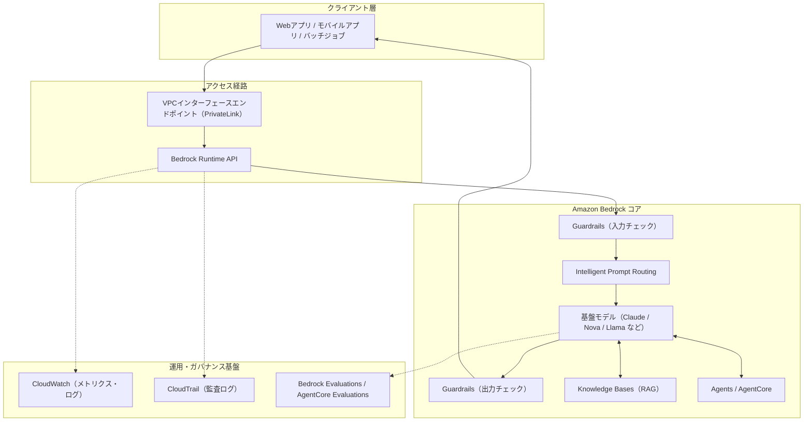
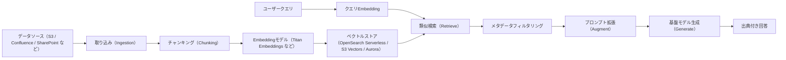
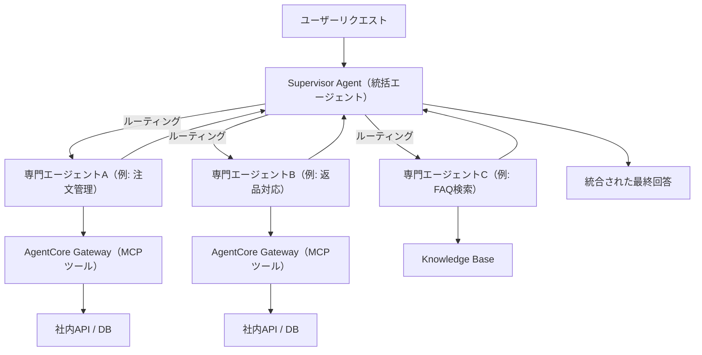
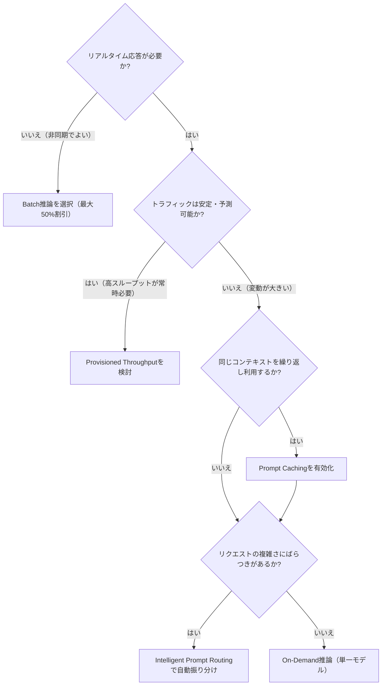
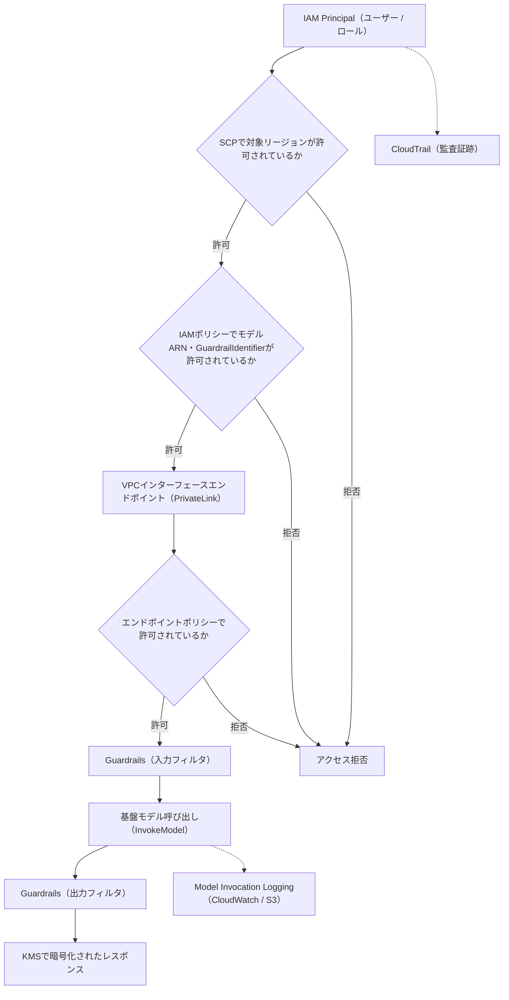
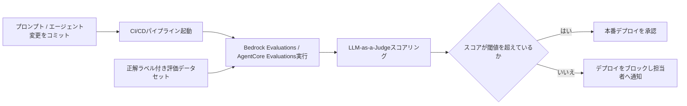

# Amazon Bedrock ベストプラクティス完全ガイド（中級〜上級者向け）

> 最終更新: 2026年7月17日時点の情報に基づく
> 対象読者: すでにBedrockでPoCやプロトタイプを構築した経験があり、本番運用・スケール・ガバナンスの段階に進みたいAIエンジニア / ソフトウェアアーキテクト / QAエンジニア

## この文書について

Amazon Bedrockは、Anthropic・Meta・Mistral・Google・NVIDIA・OpenAI・MiniMax・Moonshot・Qwen・Amazonなど複数プロバイダーの基盤モデル（FM）を単一APIで利用できるフルマネージド型の生成AIサービスです。2026年時点でモデルカタログは約100モデルまで拡大し、テキストだけでなく画像・音声・コードを含むマルチモーダルなワークロードをカバーしています。

本ガイドは「動くものを作る」段階から一歩進み、**本番環境で安全に・安く・速く・監査可能に**Bedrockを運用するためのベストプラクティスを、ステップバイステップで解説します。ASCII図は使用せず、フローチャートはすべてMermaid、比較情報はすべてMarkdownテーブルで表現しています。

---

## 全体アーキテクチャ像

最初に、これから解説するベストプラクティスがBedrockのどの部分に対応するのかを俯瞰します。



この図の各ブロックが、以降の「Step 1〜12」に対応します。

---

## Step 1: モデル選定戦略

### 1-1. 単一モデルに固定しない設計にする

Bedrockの最大の価値は、モデルプロバイダーを切り替える際にAPIパラメータ（モデルID）を変更するだけで済む点にあります。アプリケーションコードとモデル呼び出しの間に抽象化レイヤーを設け、モデルIDやパラメータを設定値として外出しすることで、新しいモデルのベンチマークやコスト最適化を継続的に行える構成にしておきます。

### 1-2. タスクの難易度でモデルを階層化する

すべてのリクエストに最も高性能（＝最も高価）なモデルを使うのはアンチパターンです。以下のような階層化が実務的です。

| 階層 | 用途 | モデル例の傾向 | 判断基準 |
|---|---|---|---|
| Tier 1（軽量・高速） | 定型応答、FAQ、簡単な分類 | Nova Lite / Claude Haiku系 | レイテンシ最優先、コスト最優先 |
| Tier 2（バランス型） | 一般的なチャット、要約 | Nova Pro / Claude Sonnet系 | 品質とコストのバランス |
| Tier 3（高精度・推論） | 複雑な多段推論、コード生成、金融・法務分析 | Claude Opus系 / 高度な推論モデル | 精度最優先、コストは二の次 |

この階層化を手動で行うのではなく、Step 6で解説する**Intelligent Prompt Routing**を使うと、リクエストごとに自動でモデルを振り分けられます。

### 1-3. モデル選定はBedrock Evaluationsで定量的に行う

「どのモデルが良さそうか」を主観で決めず、Bedrock Model Evaluationの自動メトリクス・LLM-as-a-Judge・人手レビューの3手法を組み合わせて、自社のタスク・データセットに対して定量的に比較します（詳細はStep 10）。

---

## Step 2: プロンプトエンジニアリングとPrompt Management

### 2-1. Prompt Managementでプロンプトをコードから分離する

プロンプトをアプリケーションコードにハードコーディングすると、変更のたびにデプロイが必要になり、A/Bテストも困難になります。Bedrockの Prompt Management機能を使い、プロンプトをバージョン管理された独立したリソースとして管理し、エイリアス（本番用・検証用など）で切り替えられるようにします。

### 2-2. Prompt Optimizationを活用する

Prompt ManagementのPrompt Optimization機能は、モデルに応じてプロンプトを自動的に書き換え、精度向上や応答の簡潔化を図ります。特にモデルを切り替えた直後（例: Claude系からNova系へ）は、プロンプトの「クセ」がモデルごとに異なるため、この機能で再最適化するのが効率的です。

### 2-3. 長い共通コンテキストは先頭に固定する（Prompt Cachingとの連携）

システムプロンプトやFew-shot例、長大なドキュメントなど「毎回同じ内容」は、プロンプトの先頭にまとめて配置します。これはStep 6で解説するPrompt Cachingの効果を最大化するための設計上の前提条件です。

### 2-4. 構造化出力とTool Useを前提に設計する

後続処理（他システムへの連携、UIへの描画など）が必要な場合、自由文ではなくJSON Schemaに準拠した構造化出力やTool Use（Function Calling）を前提にプロンプトを設計します。これによりパース失敗によるエラーハンドリングの複雑化を防げます。

---

## Step 3: RAG（Retrieval Augmented Generation）とKnowledge Bases設計

### 3-1. RAGパイプライン全体を俯瞰する



### 3-2. 小さく始めて反復的にチューニングする

RAGの品質はチャンキング戦略・埋め込みモデル・メタデータ設計に強く依存し、「唯一の正解」は存在しません。少量のドキュメントセットから開始し、検索精度をテストしながらチャンクサイズ・オーバーラップ・メタデータフィルタを調整し、段階的にデータ量を拡大していくアプローチが推奨されます。

### 3-3. ベクトルストアの選定

2026年時点では、Amazon S3 Vectorsがネイティブのベクトルインデックスをオブジェクトストレージ上に直接提供するようになり、専用のベクトルデータベースを別途運用する必要性が大幅に下がりました。小〜中規模RAGではS3 Vectorsが運用コストを最大90%程度削減できるケースがある一方、超低レイテンシや高度なハイブリッド検索（BM25＋ベクトル）が必要な場合はOpenSearch Serverlessが依然として有力な選択肢です。

| ベクトルストア | 強み | 注意点 |
|---|---|---|
| OpenSearch Serverless | ハイブリッド検索、豊富なフィルタリング機能 | 運用コストが比較的高め |
| Amazon S3 Vectors | 追加インフラ不要、コスト効率が高い | 高度なクエリ機能はまだ発展途上 |
| Amazon Aurora（pgvector） | 既存のリレーショナルデータと統合しやすい | スケール設計を自前で行う必要がある |

### 3-4. RAG専用の評価を別立てで行う

RAGはモデル単体の評価だけでは不十分です。Bedrock Knowledge Basesの評価機能では、Context Relevance（検索文脈の関連性）、Faithfulness（生成内容が検索結果に忠実か）、Correctness（正解との一致度）などRAG特有の指標を分離して評価できます。検索コンポーネントと生成コンポーネントのどちらに問題があるかを切り分けることが、改善の第一歩です。

---

## Step 4: エージェント構築とマルチエージェント・オーケストレーション（AgentCore）

### 4-1. 1エージェントに詰め込みすぎない

単一のエージェントにツールや指示を詰め込みすぎると、システムプロンプトが肥大化し、モデルのツール選択精度が急激に低下します。実務データでは、ツール数が5〜10個程度までは90%以上の精度を維持できても、20個に達すると正しいツールを選択できる確率が6割弱まで落ち込むという報告もあります。専門エージェントごとにツールを5〜6個程度に絞り込み、振り分けは統括（Supervisor）エージェント側に任せる設計が安全です。

### 4-2. マルチエージェント・オーケストレーションパターン



| パターン | 特徴 | 適した場面 |
|---|---|---|
| Supervisor + Routing | 統括エージェントは振り分けのみ行い、応答生成は専門エージェントに委任 | シンプルな委譲で十分な場合 |
| Supervisor + Orchestration（Collaboration） | 統括エージェントがタスクを分割し、複数エージェントの結果を統合 | 複数分野の知識を組み合わせた回答が必要な場合 |
| A2A Protocol | 標準化されたAgent Cardを介してエージェント間で通信 | 他チーム・他プラットフォームのエージェントと連携する場合 |
| ルールベース（Step Functions） | 決定論的なワークフローエンジンが実行パスを固定 | 監査要件が厳しい規制業界（保険金支払い判断など） |
| LangGraph | 宣言的なワークフローグラフ＋Memoryによる状態永続化 | 複雑な状態遷移を伴う長時間タスク |

規制業界など「同じ入力に対して常に同じ実行パスを説明できる必要がある」場合は、LLMによる動的判断よりもStep Functionsのようなルールベースのワークフローエンジンでエージェントを制御するほうが、監査要件に適合しやすいという実務上の知見も報告されています。

### 4-3. AgentCoreによる本番運用のための主要コンポーネント

- **AgentCore Runtime**: エージェントをセッションごとに隔離されたマイクロVM環境でホストし、ライフサイクル管理・ガードレール適用・ストリーミング応答を担う
- **AgentCore Gateway**: 既存のREST API（OpenAPI仕様）をコード変更なしにMCPツールとして公開する
- **AgentCore Identity**: OAuthクレデンシャルやAPIキーを安全に管理し、エージェントコード内へのクレデンシャル露出を防ぐ
- **AgentCore Memory**: セッションをまたいだ文脈の永続化と、ストリーミング通知による状態共有
- **AgentCore Observability**: OpenTelemetry準拠のトレースをCloudWatchに集約
- **AgentCore Evaluations**: 継続的な品質評価（Step 10で詳述）
- **Policy制御（CEDAR言語）**: エージェントがツール呼び出しを実行する前に、推論ループの外側で許可判定を行う。これにより「エージェントが暴走しないか」という懸念に対し、決定論的な制御層を提供する

### 4-4. PoCから本番への「谷」を越えるための実践知

re:Invent 2025のセッションで語られた知見として、PoCと本番運用の間には「PoC to production chasm」と呼ばれる大きなギャップが存在します。これを越えるための実践的な指針は次の通りです。

1. 小さく始める（Start small） — 1つのユースケースに絞ってエンドツーエンドで動かす
2. 可観測性を最初から組み込む（Observability from day one）
3. ツールを最小限に絞って公開する
4. 評価を継続的に実行する仕組みを用意する
5. 必要になった時点でマルチエージェント化する（最初から複雑にしない）
6. セキュアなスケーリングを設計する（IAM・Guardrails・VPC）
7. コードで表現できる処理はLLMに判断させない（決定論的に書けるロジックはコード側に置く）
8. 継続的なテスト（回帰テスト）をCI/CDに組み込む

---

## Step 5: Guardrailsによる安全性・コンプライアンス制御

### 5-1. Guardrailsのフィルタ種類を理解する

| フィルタ種別 | 主な役割 |
|---|---|
| コンテンツフィルタ | 暴力・ヘイト・性的表現などの有害コンテンツを検出しブロック |
| 拒否トピック（Denied Topics） | 業務上扱うべきでない話題（法律相談・投資助言など）を自然言語で定義し拒否 |
| 機密情報フィルタ（PII） | クレジットカード番号・氏名・住所などをマスキングまたはブロック |
| ワードフィルタ | 特定の禁止語句・競合他社名などを直接ブロック |
| プロンプトアタック対策 | プロンプトインジェクション・脱獄（jailbreak）試行を検出 |
| Automated Reasoning checks | 数学的検証（形式手法）によりハルシネーションや前提の誤りを検出 |
| 画像コンテンツフィルタ | マルチモーダル入出力に含まれる有害な画像を検出 |

### 5-2. Automated Reasoning checksは形式論理に基づく検証

Automated Reasoning checksは、他のGuardrailsの機能が確率的な分類モデルであるのに対し、SAT/SMTソルバーに基づく形式手法（Formal Verification）で形式論理に則ってモデル出力を検証するという点で本質的に異なります。HRポリシーや金融商品の約款など、自然言語で書かれたルール文書からポリシーを生成し、モデルの回答がそのルールと論理的に矛盾していないかを検証します。GA時点でAWSは正答検出において最大99%の精度を報告しており、規制業界（金融・保険・製薬）でのハルシネーション対策として採用が進んでいます。ただし、自然言語からポリシーへの変換誤りの可能性や、出力されるfindingsが設定されたconfidence threshold（確信度の閾値）に依存する点に留意する必要があります。絶対的な「証明」ではなく、ルール記述の不備や検証モデルの限界によるすり抜けもあり得るため、既存のコンテンツフィルタやRAGと併用するのが現実的です。

### 5-3. GuardrailsはIAMで「必須化」する

Guardrailsをアプリケーションコード側で「呼び出す・呼び出さない」を選べる状態にしておくと、実装漏れによって保護されないパスが生まれます。IAMポリシーの条件キー `bedrock:GuardrailIdentifier` を用いて、承認されたGuardrailを指定しないInvokeModel呼び出しそのものを拒否する設定にすることで、Guardrailsを「ベストエフォートの規約」ではなく「強制されたコントロール」に変えられます。

なお、`bedrock:GuardrailIdentifier` 条件キーを用いたIAMポリシーによる制限は、直接の `InvokeModel` 推論ロールにのみ適用され、`RetrieveAndGenerate` や `InvokeAgent` などのハイレベルAPIが内部的に使用するロールには適用されません。そのため、直接推論用ロールとハイレベルAPI用ロールを明確に分離し、ハイレベルAPI経由の内部モデル呼び出しが意図せず拒否されないように設計する必要があります。

```json
{
  "Version": "2012-10-17",
  "Statement": [
    {
      "Sid": "RequireApprovedGuardrail",
      "Effect": "Deny",
      "Action": "bedrock:InvokeModel",
      "Resource": "*",
      "Condition": {
        "StringNotEquals": {
          "bedrock:GuardrailIdentifier": "arn:aws:bedrock:ap-northeast-1:123456789012:guardrail/approved-guardrail-id"
        }
      }
    }
  ]
}
```

---

## Step 6: コスト最適化

### 6-1. 5つの主要コストレバー

| 施策 | 効果の目安 | 適用条件 |
|---|---|---|
| Prompt Caching | 入力トークンコスト最大90%減、レイテンシ最大85%減 | システムプロンプトや長文コンテキストを繰り返し利用する場合 |
| Intelligent Prompt Routing | コスト最大30%減（実測では50〜65%減の報告例も） | リクエストの複雑さにばらつきがあり、単純なものと難しいものが混在する場合 |
| Batch推論 | オンデマンド比約50%減 | リアルタイム応答が不要な非同期処理（大量要約・分類など） |
| Provisioned Throughput | 予測可能な高スループット時のレイテンシ安定化 | トラフィックが安定して大きい本番ワークロード |
| Model Distillation | 大型モデル相当の精度を小型・低コストモデルで再現 | 特定タスクに特化させたい場合 |

### 6-2. コスト最適化の意思決定フロー



### 6-3. Intelligent Prompt Routingの実装イメージ

Intelligent Prompt Routingは、同一モデルファミリー内（例: Claude Sonnet系とHaiku系、Nova ProとNova Lite）でリクエストの複雑さを予測し、自動的に最適なモデルへ振り分けます。アプリケーションコード側の変更はほぼ不要で、呼び出し先を通常のモデルIDの代わりにルーターのARNに変更するだけです。

```python
import boto3

client = boto3.client("bedrock-runtime", region_name="us-east-1")

response = client.converse(
    modelId="arn:aws:bedrock:us-east-1:123456789012:default-prompt-router/my-custom-router",
    messages=[{"role": "user", "content": [{"text": "この契約書の第3条を要約してください"}]}],
)
```

### 6-4. Prompt Cachingの前提条件

Prompt Cachingは「プロンプトの先頭部分が複数リクエスト間で完全に一致していること」を前提に効果を発揮します。ユーザー固有の質問文を先頭ではなく末尾に配置し、システムプロンプトやFew-shot例、ナレッジベースからの固定コンテキストを先頭にまとめる設計にすることで、キャッシュヒット率を最大化できます。キャッシュは一定時間（数分程度）で失効するため、リクエスト頻度が極端に低いユースケースでは効果が薄い点にも注意が必要です。

### 6-5. コストの継続的な可視化

Cost ExplorerやAWS Cost and Usage Reportに加え、モデル・チーム・ユースケース単位でのトークン消費を可視化するダッシュボードをCloudWatchで構築し、想定外の急増（漏洩したAPIキーによる悪用など）を早期検知できる体制を整えます。

---

## Step 7: 推論性能とスケーラビリティ

### 7-1. Cross-Region Inferenceの2種類

| 種類 | 特徴 | 適したユースケース |
|---|---|---|
| Geographic Cross-Region Inference | 米国・EU・APACなど特定の地理的範囲内でのみルーティング | データ所在地規制・コンプライアンス要件がある場合 |
| Global Cross-Region Inference | 世界中の商用リージョンへ自動ルーティング | データ所在地の制約がなく、最大限のスループットを求める場合 |

Cross-Region Inferenceは追加のルーティングコストなしで利用でき、単一リージョンのデフォルトクォータの最大2倍程度までスループットを引き上げられます。ただし、Service Control Policy（SCP）でリージョンを制限している組織では、宛先リージョンへのアクセスを明示的に許可する必要がある点に注意してください。

### 7-2. Provisioned Throughputとの使い分け

Provisioned Throughputは、予測可能かつ継続的に高いトラフィックがあるワークロードに対して、専有の推論キャパシティを確保する仕組みです。Cross-Region Inferenceは変動するバーストトラフィックに強い一方、Inference Profile自体はProvisioned Throughputをサポートしないため、両者は「バーストに強くしたいのか」「常時安定した高スループットを確保したいのか」で使い分けます。

### 7-3. Latency-optimized Inference

対話型アプリケーションなど、レスポンスの初動（First Token Latency）が体験価値を大きく左右するユースケースでは、Latency-optimized Inferenceオプションを検討します。通常のオンデマンド推論と比較して、追加コストと引き換えにレイテンシが最適化されます。

---

## Step 8: セキュリティとガバナンス

### 8-1. リクエストが通過する保護層を可視化する



### 8-2. IAM最小権限の徹底

`bedrock:InvokeModel` に対して `Resource: "*"` を許可すると、そのリージョンで利用可能な未レビューのモデルまで含めてすべて呼び出せてしまいます。承認済みのモデルARNのみを明示的に許可し、Permissions BoundaryやIAM Access Analyzerで定期的に検証します。

### 8-3. ネットワーク境界の設計

推論リクエストにはユーザーの入力内容や社内文書の断片など機微な情報が含まれるため、パブリックインターネットを経由させないことが基本方針です。VPCインターフェースエンドポイント（AWS PrivateLink）でBedrockのコントロールプレーン・データプレーン双方をVPC内に閉じ込め、エンドポイントポリシーでさらにアクセス可能なアクションとモデルを制限します。OAuthベースの認証を使う場合、エンドポイントポリシーのPrincipalは `*` にせざるを得ない点（OAuthユーザーはIAM Principalとして表現できないため）は設計上の落とし穴になりやすいので注意してください。

### 8-4. 暗号化と監査ログの二層構造

- **Model Invocation Logging**: プロンプトと応答の本文（コンテンツ）をCloudWatch LogsまたはS3に記録する。本番投入前に有効化し、ログ自体を機微情報として扱う（保存期間・アクセス制御・暗号化）
- **CloudTrail**: 「誰が」「いつ」「どのAPIを」呼び出したかというメタデータを記録する。プロンプト本文は含まれない

この2つは記録する情報の性質が根本的に異なるため、片方だけで監査要件を満たそうとしないことが重要です。カスタムモデル・Guardrails・エージェントセッションデータは、AWS管理キーではなくKMSカスタマー管理キー（CMK）で暗号化し、鍵の利用範囲をチームごとに分離します。

### 8-5. マルチアカウント環境でのガバナンス統一

複数のAWSアカウントにまたがってBedrockを展開する組織では、SCP・IAM・VPCエンドポイントポリシー・Guardrail強制設定をアカウントごとに手作業で設定すると、設定漏れが発生しやすくなります。CloudFormation StackSetsで統制をアカウント全体に配布し、CloudFormation Guardで各アカウントのデプロイ時にポリシー準拠を検証するパイプラインを組むことで、「どのチームも承認済みモデルしか呼び出せず、必ずGuardrailを経由し、必ずプライベートな経路を通り、すべての呼び出しが監査可能」という状態を一貫して維持できます。

### 8-6. エージェント特有のセキュリティ考慮事項

エージェントがツールを実行できるようになると、単なるモデル呼び出しよりもリスクの質が変わります。AgentCore Runtimeでは、`bedrock-agentcore:subnets` や `bedrock-agentcore:securityGroups` といったIAM条件キーで、承認されたVPC内でのみランタイムが起動することを強制できます。また、JWTによるユーザー識別が常に利用可能なワークロードでは、ユーザーIDの委譲経路が残らないよう、`bedrock-agentcore:GetWorkloadAccessTokenForUserId` と `bedrock-agentcore:InvokeAgentRuntimeForUser` の両方のアクションを明示的に拒否し、暗号学的に検証されたJWT経路のみを強制する設計が推奨されます。

---

## Step 9: 可観測性とロギング

### 9-1. モデル呼び出しレベルの可観測性

標準的なAPIメトリクス（レイテンシ・エラー率）だけでは、モデル推論固有の問題（スロットリング、トークン消費の異常、ガードレール発火率、ナレッジベースの取り込み失敗など）は捕捉できません。CloudWatchで以下のようなシグナルを個別に監視します。

- 初回トークンまでのレイテンシ（Time to First Token）
- スロットリング発生率
- トークン消費量（入力・出力・キャッシュ利用分）
- Guardrail発火件数とカテゴリ内訳
- ナレッジベースの取り込みエラー

### 9-2. エージェント特有の可観測性（OpenTelemetry）

マルチステップのエージェントは、単発のAPI呼び出しよりもデバッグが難しくなります。AgentCore Observabilityは、Strands AgentsやLangGraphなど主要なエージェントフレームワークと連携し、OpenTelemetry準拠のトレースとしてエージェントの推論ステップ・ツール呼び出し・応答時間をCloudWatchに集約します。エージェントが「なぜそのツールを選んだのか」「どのステップで詰まったのか」を後から追跡できる状態を、開発初期から構築しておくことが推奨されます。

### 9-3. アラート設計の例

- 特定IAMロールからの `InvokeModel` 呼び出し件数が日次平均の4倍を超えたらアラート（漏洩したCI/CDキーの悪用検知）
- `CreateModelCopyJob` や `CreateModelImportJob` など、通常運用でほぼ発生しないはずのAPI呼び出しにアラートを設定
- Guardrail発火率が急上昇した場合、モデル側の挙動変化やプロンプトインジェクションの兆候として調査

---

## Step 10: 評価とCI/CDへの組み込み

### 10-1. 評価手法の使い分け

| 手法 | 特徴 | 適した場面 |
|---|---|---|
| 自動メトリクス | ROUGEなど定量指標を用い高速・低コスト | 要約・分類など定型タスクの一次スクリーニング |
| 人手レビュー | 最も精度が高いが低速・高コスト | 本番ローンチ前の最終確認 |
| LLM-as-a-Judge | 人手評価に近い精度をより低コスト・短時間で実現 | 継続的な品質モニタリング、CI/CDへの組み込み |

LLM-as-a-Judgeでは、正確性・網羅性・文体・トーン・共感性・有害性など、評価したい観点を自然言語のカスタムメトリクスとして定義できます。組み込み指標だけで足りない観点（例:「顧客の不満に適切に共感できているか」）は、カスタム評価基準として追加します。

### 10-2. RAGとエージェントは専用の評価軸を持つ

- **RAG評価**: Context Relevance（検索文脈の関連性）、Faithfulness（生成内容の検索結果への忠実性）、Correctness（正解一致度）
- **エージェント評価（AgentCore Evaluations）**: Correctness（正確性）、Helpfulness（有用性）、Tool Selection Accuracy（ツール選択精度）、Safety（安全性）、Goal Success Rate（目標達成率）、Context Relevance

エージェント評価は、Lambda関数で実装するコードベース評価と、LLM-as-a-Judgeによる評価を組み合わせるのが実務的です。本番の全セッションを継続的にスコアリングする場合、推論コストが小さいコードベース評価を高頻度で実行し、LLM-as-a-Judgeはサンプリングまたは重要なセッションに限定して実行するとコストを抑えられます。

### 10-3. 評価をCI/CDのゲートにする



プロンプトやエージェントロジックの変更を「レビューされたコード変更」と同列に扱い、正解ラベル付きのデータセットに対する評価スコアが閾値を下回った場合はデプロイをブロックする、回帰テストの仕組みをCI/CDパイプラインに組み込みます。これにより、モデルのマイナーアップデートやプロンプトの小さな修正が本番品質に与える影響を、デプロイ前に定量的に把握できます。

---

## Step 11: AWS Well-Architected Frameworkとの整合

AWSは2025年後半から2026年にかけて、生成AI・エージェントAI向けのWell-Architectedレンズを拡充しています（Generative AI Lens、Agentic AI Lens、Responsible AI Lens、Machine Learning Lens）。本ガイドで解説してきた内容は、この6つの柱に沿って整理できます。

| 柱 | Bedrockでの適用ポイント |
|---|---|
| 運用上の優秀性 | Prompt Management、継続的評価、CI/CDへの組み込み |
| セキュリティ | IAM最小権限、Guardrails強制、VPCエンドポイント、KMS暗号化 |
| 信頼性 | Cross-Region Inference、モデルフォールバック戦略、Provisioned Throughput |
| パフォーマンス効率 | Latency-optimized Inference、タスク難易度に応じたモデル階層化 |
| コスト最適化 | Prompt Caching、Intelligent Prompt Routing、Batch推論 |
| 持続可能性 | サーバーレスアーキテクチャの活用、過剰スペックのモデル選定を避ける |

Agentic AI Lensでは、これに加えてエージェント特有の考慮事項（マルチエージェントオーケストレーションパターン、エージェントメモリのセキュリティ、ツール公開範囲の設計）が拡張されています。組織として生成AIの取り組みが複数プロジェクトにまたがる規模になったら、個々のベストプラクティスの寄せ集めではなく、このレンズをアセスメントの共通言語として使うことを検討してください。

---

## Step 12: 本番展開前チェックリスト

- [ ] モデルは単一プロバイダーに固定されず、切り替え可能な抽象化レイヤーの背後にあるか
- [ ] Prompt ManagementでプロンプトがGitやCI/CDと同様のライフサイクルで管理されているか
- [ ] RAGを使う場合、検索コンポーネントと生成コンポーネントを別々に評価できているか
- [ ] エージェントの場合、1エージェントあたりのツール数は絞り込まれているか（目安5〜10個）
- [ ] Guardrailsが `bedrock:GuardrailIdentifier` のIAM条件キーで強制されているか
- [ ] Model Invocation LoggingとCloudTrailの両方が有効化されているか
- [ ] VPCインターフェースエンドポイント経由でプライベートに呼び出しているか
- [ ] カスタムモデル・Guardrails・エージェントセッションはKMS CMKで暗号化されているか
- [ ] Prompt CachingとIntelligent Prompt Routingを適用余地の観点で検討済みか
- [ ] Cross-Region Inference / Provisioned Throughputの使い分けを決めているか
- [ ] LLM-as-a-Judgeによる継続評価がCI/CDの回帰テストとして組み込まれているか
- [ ] AgentCore ObservabilityまたはCloudWatchで異常検知アラートが設定されているか
- [ ] マルチアカウント運用の場合、SCP・IAM・VPCエンドポイントポリシーがStackSetsなどで統一配布されているか

---

## 補足: その他のベストプラクティスと参考情報源

以下は、本ガイド作成にあたって参照した情報源です。AWS公式ドキュメント・公式ブログに加え、著名なAWSコミュニティヒーローや実務エンジニアによる技術記事も含めています。記載内容と併せて、一次情報として参照してください。

### AWS公式ドキュメント・公式ブログ

| タイトル / 著者 | 内容 | URL |
|---|---|---|
| Amazon Bedrock 製品ページ | サービス概要 | https://aws.amazon.com/bedrock/ |
| Amazon Bedrock ユーザーガイド | 公式ドキュメントポータル | https://docs.aws.amazon.com/bedrock/ |
| Guardrails公式ガイド | フィルタ種別の詳細 | https://docs.aws.amazon.com/bedrock/latest/userguide/guardrails.html |
| Automated Reasoning checks concepts | 形式検証の仕組み | https://docs.aws.amazon.com/bedrock/latest/userguide/automated-reasoning-checks-concepts.html |
| LLM-as-a-judge評価ガイド | 評価ジョブの設定方法 | https://docs.aws.amazon.com/bedrock/latest/userguide/evaluation-judge.html |
| Cross-Region Inferenceガイド | スループット向上の仕組み | https://docs.aws.amazon.com/bedrock/latest/userguide/cross-region-inference.html |
| Global Cross-Region Inference | グローバルルーティングの詳細 | https://docs.aws.amazon.com/bedrock/latest/userguide/global-cross-region-inference.html |
| AgentCore Runtimeセキュリティベストプラクティス | IAM条件キー、VPC強制など | https://docs.aws.amazon.com/bedrock-agentcore/latest/devguide/runtime-security-best-practices.html |
| Knowledge Bases: RAGの仕組み | RAGパイプライン公式解説 | https://docs.aws.amazon.com/bedrock/latest/userguide/kb-how-it-works.html |
| AWS Well-Architected Generative AI Lens | 6つの柱によるアセスメント | https://docs.aws.amazon.com/wellarchitected/latest/generative-ai-lens/generative-ai-lens.html |
| AWS Well-Architected Agentic AI Lens | エージェント特有のアーキテクチャ指針（2026年6月公開） | https://docs.aws.amazon.com/wellarchitected/latest/agentic-ai-lens/agentic-ai-lens.html |
| コスト最適化公式ページ | Prompt Caching / Intelligent Prompt Routing | https://aws.amazon.com/bedrock/cost-optimization |
| RAGアプリケーションのスケーラブル設計（AWS ML Blog） | Well-Architected準拠のRAG設計 | https://aws.amazon.com/blogs/machine-learning/building-scalable-secure-and-reliable-rag-applications-using-knowledge-bases-for-amazon-bedrock |
| AgentCore Evaluationsで信頼できるエージェントを構築（AWS ML Blog） | エージェント評価の実装 | https://aws.amazon.com/blogs/machine-learning/build-reliable-ai-agents-with-amazon-bedrock-agentcore-evaluations/ |
| Cross-Region Inferenceのセキュリティ（AWS ML Blog） | Geographic / Global の設計考慮 | https://aws.amazon.com/blogs/machine-learning/securing-amazon-bedrock-cross-region-inference-geographic-and-global/ |
| Automated Reasoning checksによる金融業界向け説明可能性（AWS ML Blog） | 規制業界での適用事例 | https://aws.amazon.com/blogs/machine-learning/build-verifiable-explainability-into-financial-services-workflows-with-automated-reasoning-checks-for-amazon-bedrock-guardrails/ |
| Bedrock AgentCoreを使ったエージェント型営業支援（AWS ML Blog） | Gateway/Identity/Observabilityの実装例 | https://aws.amazon.com/blogs/machine-learning/powering-agentic-ai-sales-strategy-with-amazon-bedrock-agentcore/ |
| マルチエージェントSREアシスタント構築（AWS ML Blog） | Supervisorパターンの実例 | https://aws.amazon.com/blogs/machine-learning/build-multi-agent-site-reliability-engineering-assistants-with-amazon-bedrock-agentcore/ |
| Bedrock APIキーのセキュリティ（AWS Security Blog） | サービス固有クレデンシャルの管理 | https://aws.amazon.com/blogs/security/securing-amazon-bedrock-api-keys-best-practices-for-implementation-and-management/ |
| Well-Architectedレンズ拡充の発表（AWS Architecture Blog、re:Invent 2025） | 3レンズの位置づけ | https://aws.amazon.com/blogs/architecture/architecting-for-ai-excellence-aws-launches-three-well-architected-lenses-at-reinvent-2025 |
| Danilo Poccia（AWS Chief Evangelist EMEA）の投稿一覧 | Bedrock新機能の解説を継続的に発信する著名なAWSエバンジェリスト | https://aws.amazon.com/blogs/aws/author/danilop/ |

### コミュニティ・著名エンジニアによる実務知見

| タイトル / 著者 | 内容 | URL |
|---|---|---|
| Ran Isenberg（AWS Serverless Hero）re:Invent 2025振り返り | AgentCoreのPolicy/Interceptors/Evaluationsの解説 | https://ranthebuilder.cloud/blog/aws-re-invent-2025-my-serverless-agentic-ai-takeaways |
| Gerardo Arroyo氏によるAgentCore Evaluations解説 | LLM-as-a-Judgeの実装手順とダッシュボード | https://gerardo.dev/en/bedrock-evaluations.html |
| Gerardo Arroyo氏によるAutomated Reasoning解説 | 形式検証導入の実体験 | https://gerardo.dev/en/bedrock-automated-reasoning.html |
| Guruprasad Seeryada氏によるマルチエージェント構築記事 | ツール数と選択精度低下の実測データ | https://medium.com/@guruprasad.seeryada/building-a-multi-agent-architecture-with-amazon-bedrock-agentcore-mcp-and-aws-step-functions-71c149930e43 |
| hidekazu-konishi.com によるマルチアカウントガバナンス解説 | SCP・IAM・PrivateLink・Guardrail統制のLevel 400解説 | https://hidekazu-konishi.com/entry/amazon_bedrock_security_and_governance_guide.html |
| hidekazu-konishi.com によるAgentCoreマルチエージェント実装解説 | 5つのオーケストレーションパターン比較 | https://hidekazu-konishi.com/entry/amazon_bedrock_agentcore_implementation_guide_part4_multi_agent.html |
| hidekazu-konishi.com によるCross-Region Inference解説 | データレジデンシー設計の詳細 | https://hidekazu-konishi.com/entry/amazon_bedrock_cross_region_inference_and_data_residency.html |
| AWS re:Post記事（Roland Barcia, AWS Worldwide Director） | AgentCore Gatewayによる既存API公開パターン | https://repost.aws/articles/ARy9ar569iSO-DRe5cIihUyQ/re-invent-2025-modernize-containers-for-ai-agents-using-agentcore-gateway |
| AWS Cost Optimizationの実践記事（AWS in Plain English） | Prompt Caching / Model Distillation等4レバーの併用戦略 | https://aws.plainenglish.io/how-to-cut-your-bedrock-costs-by-75-using-model-distillation-and-prompt-caching-f90bdb043c3a |
| Intelligent Prompt Routingのコスト試算（Towards AWS） | 実測ベースの削減率シミュレーション | https://towardsaws.com/stop-paying-for-every-token-amazon-bedrock-intelligent-prompt-routing-f01d81a7e18f |
| ZenML LLMOps Database: PwC事例 | Automated Reasoning checksの規制業界導入事例 | https://www.zenml.io/llmops-database/automated-reasoning-checks-in-amazon-bedrock-guardrails-for-responsible-ai-deployment |
| セキュリティ実践ガイド（InterWorks） | ネットワーク境界設計の実例 | https://interworks.com/blog/2026/03/06/securing-amazon-bedrock-what-enterprises-need-to-get-right/ |
| Bedrockセキュリティ実装ガイド（ShieldSync Security） | IAM/KMS/VPCの具体的なJSON設定例 | https://shieldsyncsecurity.com/blog/securing-amazon-bedrock |
| Zero Trust Architectureリファレンス（zta-reference.com） | Bedrockのゼロトラスト設計における注意点 | https://zta-reference.com/bedrock |
| AWSソリューションライブラリ: マルチエージェントオーケストレーション実装例 | GitHub上のリファレンス実装 | https://github.com/aws-solutions-library-samples/guidance-for-multi-agent-orchestration-using-bedrock-agentcore-on-aws |

---

## まとめ

Amazon Bedrockのベストプラクティスは、単発の「Tips集」ではなく、**モデル選定 → プロンプト設計 → RAG/エージェント構築 → 安全性制御 → コスト最適化 → 性能・可用性 → セキュリティ・ガバナンス → 可観測性 → 継続的評価**という一連のライフサイクルとして捉えることが重要です。特に2025年後半以降は、AgentCoreによるエージェントの本番運用基盤、Automated Reasoning checksによる形式検証、Well-Architectedレンズによる体系的なアセスメントなど、「作れるかどうか」から「安全かつ効率的に運用し続けられるかどうか」へと業界全体の関心が移っています。本ガイドのStep 1からStep 12を、自組織の成熟度に応じたロードマップとして活用してください。
