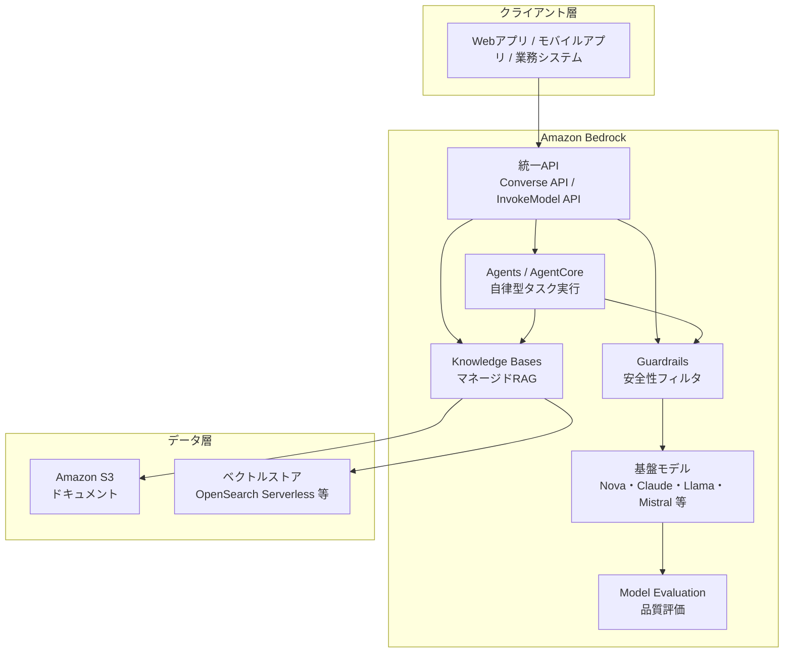
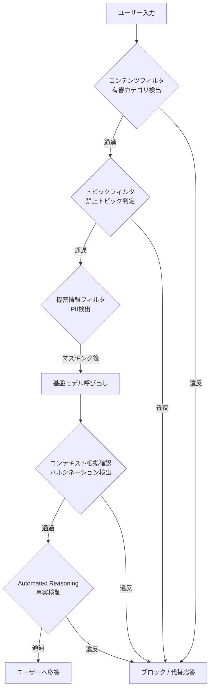
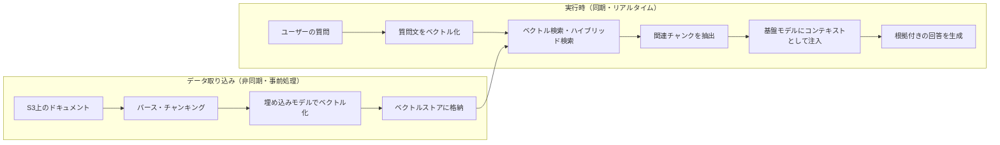
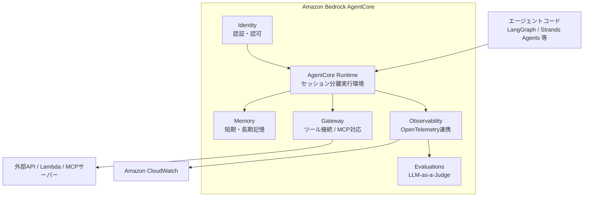
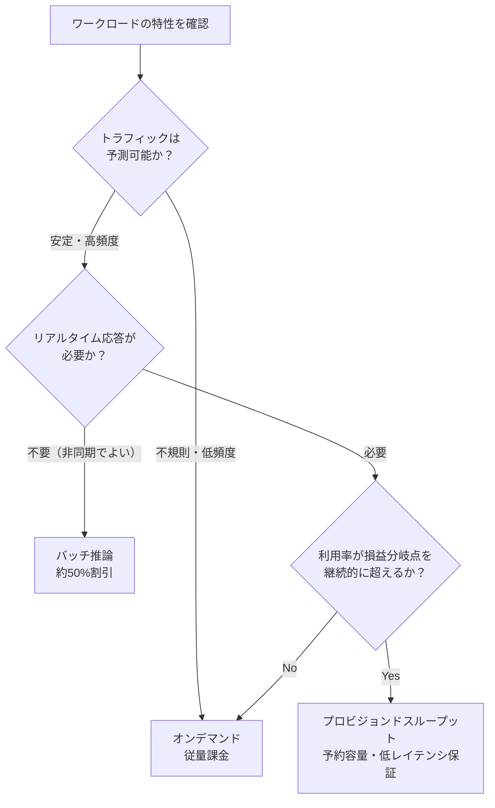

# Amazon Bedrock 活用ベストプラクティスガイド
### 初学者向けステップバイステップ解説（2026年7月17日時点の情報に基づく）

> 本ガイドは、世界トップクラスのAIエンジニア／AWSスペシャリストの視点から、Amazon Bedrockを使ったジェネレーティブAIアプリケーション構築の**ベストプラクティス**を、初学者でも迷わず実践できるようにステップバイステップで解説するものです。AWS公式ドキュメント・公式ブログに加え、AWS re:Invent 2025のセッションや、著名な実務者・コミュニティによる実践的な知見を横断的に調査し、根拠となる情報源（URL）とともに整理しています。

---

## 目次

1. [Amazon Bedrockとは何か](#1-amazon-bedrockとは何か)
2. [全体アーキテクチャを理解する](#2-全体アーキテクチャを理解する)
3. [導入ロードマップ（10ステップ概観）](#3-導入ロードマップ10ステップ概観)
4. [Step 1: IAM設計と最小権限の原則](#step-1-iam設計と最小権限の原則)
5. [Step 2: モデルアクセスの有効化](#step-2-モデルアクセスの有効化)
6. [Step 3: 初めてのAPI呼び出し（Converse API）](#step-3-初めてのapi呼び出しconverse-api)
7. [Step 4: プロンプトエンジニアリングの基礎](#step-4-プロンプトエンジニアリングの基礎)
8. [Step 5: Guardrailsによる安全性の確保](#step-5-guardrailsによる安全性の確保)
9. [Step 6: Knowledge Basesを使ったRAGの構築](#step-6-knowledge-basesを使ったragの構築)
10. [Step 7: Agents / AgentCoreによる自律型AI](#step-7-agents--agentcoreによる自律型ai)
11. [Step 8: モデル評価とオブザーバビリティ](#step-8-モデル評価とオブザーバビリティ)
12. [Step 9: コスト最適化](#step-9-コスト最適化)
13. [Step 10: 本番運用・信頼性・データレジデンシー](#step-10-本番運用信頼性データレジデンシー)
14. [ベストプラクティス総まとめ表](#4-ベストプラクティス総まとめ表)
15. [よくある落とし穴（アンチパターン）](#5-よくある落とし穴アンチパターン)
16. [参考情報源（根拠URL一覧）](#6-参考情報源根拠url一覧)

---

## 1. Amazon Bedrockとは何か

Amazon Bedrockは、AnthropicのClaude、Meta Llama、Mistral AI、Amazon Nova、OpenAIのオープンウェイトモデルなど、複数のAIプロバイダーが提供する100以上の基盤モデル（Foundation Models, FM）を**単一の統一API**経由で呼び出せる、フルマネージドのサーバーレスサービスです。インフラの構築・管理が不要で、モデルの切り替えは基本的にモデルIDを変更するだけで済みます。

> Amazon Bedrockは、リーディングAI企業から高性能な基盤モデルへの安全でエンタープライズグレードのアクセスを提供するフルマネージドサービスで、生成AIアプリケーションの構築とスケーリングを可能にし、100以上の基盤モデルをAmazon、Anthropic、DeepSeek、Moonshot AI、MiniMax、OpenAIを含む複数のプロバイダーから利用できます。

Bedrockが単なる「モデルAPI」ではなく**プラットフォーム**である理由は、以下の高レベルなビルディングブロックを標準で備えている点にあります。

| コンポーネント | 役割 |
|---|---|
| **Converse API / InvokeModel API** | モデル横断で共通化された推論呼び出しインターフェース |
| **Guardrails** | 有害コンテンツ・PII・ハルシネーション等を防ぐ安全性レイヤー |
| **Knowledge Bases** | マネージドRAG（検索拡張生成）パイプライン |
| **Agents / AgentCore** | 複数ステップのタスクを自律的に実行するエージェント基盤 |
| **Model Evaluation** | 自動評価・人手評価・LLM-as-a-Judgeによる品質検証 |
| **Prompt Management / Flows** | プロンプトのバージョン管理とワークフローのオーケストレーション |

出典：AWS公式ユーザーガイド「What is Amazon Bedrock?」（[docs.aws.amazon.com/bedrock/latest/userguide/what-is-bedrock.html](https://docs.aws.amazon.com/bedrock/latest/userguide/what-is-bedrock.html)）、[aws.amazon.com/bedrock/](https://aws.amazon.com/bedrock/)

---

## 2. 全体アーキテクチャを理解する

以下は、Amazon Bedrockを中核としたジェネレーティブAIアプリケーションの典型的なアーキテクチャです。



初学者がまず押さえるべきポイントは次の3つです。

1. **モデルはあくまで「差し替え可能な部品」**であり、アプリケーションのロジックはモデルIDを変えるだけで別モデルに切り替えられるよう設計する
2. **Guardrailsは基盤モデルの前後に必ず挟む**安全性レイヤーであり、後付けではなく設計初期から組み込む
3. **RAG（Knowledge Bases）とAgents（AgentCore）は別レイヤー**であり、「知識を与えるRAG」と「行動させるAgent」を混同しない

---

## 3. 導入ロードマップ（10ステップ概観）

```mermaid
flowchart LR
    S1["Step1<br/>IAM設計・最小権限"] --> S2["Step2<br/>モデルアクセス有効化"]
    S2 --> S3["Step3<br/>初回API呼び出し"]
    S3 --> S4["Step4<br/>プロンプト設計"]
    S4 --> S5["Step5<br/>Guardrails設定"]
    S5 --> S6["Step6<br/>Knowledge Bases構築"]
    S6 --> S7["Step7<br/>Agents / AgentCore構築"]
    S7 --> S8["Step8<br/>評価とオブザーバビリティ"]
    S8 --> S9["Step9<br/>コスト最適化"]
    S9 --> S10["Step10<br/>本番運用・ガバナンス"]
```



以降、各ステップを詳しく解説します。

---

## Step 1: IAM設計と最小権限の原則

Bedrockのベストプラクティスの中で**最初かつ最重要**なのがIAM設計です。AWS Well-Architected Generative AI Lensでも、基盤モデルエンドポイントへのアクセスは最小権限で許可することが明示的なベストプラクティス（GENSEC01-BP01）として定義されています。

> 最小権限アクセスは、生成AIワークロードにIDベースのセキュリティレイヤーを確立するために重要であり、基盤モデルエンドポイントへのアクセスが認可されたIDのみに許可されることを検証するのに役立ちます。

**初学者向けの実践手順：**

1. Bedrock専用のIAMロールをタスクごとに分離する（プロンプトエンジニア用ロール、エージェント実行用ロール、監視用ロールなど）
2. `bedrock:InvokeModel` を許可する際は、`Resource` を `*` にせず、利用するモデルARN・Guardrail ID・Knowledge Base IDまで絞り込む
3. Amazon Bedrock API keys（サービス固有認証情報）よりも、可能な限り**AWS STSによる一時的なセキュリティ認証情報**を優先する。

> 可能な限り優先的な認証方法としてAWS Security Token Service（AWS STS）が提供する一時的なセキュリティ認証情報を使用することが推奨されます。
4. エージェントのワークフローでは、実行ロールとプロンプトエンジニア用ロールを分離し、権限境界（Permissions Boundary）を設定する。

> エージェントを作成するプロンプトエンジニアと、エージェントワークフローのIAMサービスロールを作成するセキュリティエンジニアのために、それぞれ別のIAMロールを作成することを検討し、リソースに対する過剰な権限を防ぐための職務分離を論理的に構築することが推奨されます。

```python
# IAMポリシー例（最小権限の考え方）
{
  "Version": "2012-10-17",
  "Statement": [
    {
      "Effect": "Allow",
      "Action": "bedrock:InvokeModel",
      "Resource": [
        "arn:aws:bedrock:us-east-1::foundation-model/anthropic.claude-*"
      ],
      "Condition": {
        "StringEquals": {
          "bedrock:GuardrailIdentifier": "my-production-guardrail"
        }
      }
    }
  ]
}
```

> 根拠：AWS Security Blog「Implementing least privilege access for Amazon Bedrock」（[aws.amazon.com/blogs/security/implementing-least-privilege-access-for-amazon-bedrock/](https://aws.amazon.com/blogs/security/implementing-least-privilege-access-for-amazon-bedrock/)）、AWS Well-Architected Generative AI Lens GENSEC01-BP01（[docs.aws.amazon.com/wellarchitected/latest/generative-ai-lens/gensec01-bp01.html](https://docs.aws.amazon.com/wellarchitected/latest/generative-ai-lens/gensec01-bp01.html)）、GENSEC05-BP01（[docs.aws.amazon.com/wellarchitected/latest/generative-ai-lens/gensec05-bp01.html](https://docs.aws.amazon.com/wellarchitected/latest/generative-ai-lens/gensec05-bp01.html)）

---

## Step 2: モデルアクセスの有効化

AWSマネジメントコンソールの「Model access」画面から、利用したいモデルへのアクセスをリクエスト・有効化します。多くのモデルは即時利用可能ですが、一部は利用規約への同意やユースケース申請が必要です。

**ベストプラクティス：**

- 本番運用前に、複数モデル（コスト重視の軽量モデルと高精度モデル）へのアクセスを事前に有効化し、後述の**モデルルーティング**に備える
- モデルカタログは月次で更新されるため、定期的にモデルカタログを見直すプロセスを運用に組み込む。

> Bedrockは2023年に少数の基盤モデルを1つのAWS APIで呼び出す手段として始まり、2026年には18以上のプロバイダーから100以上のモデルへの唯一の入り口となっており、そのリストはほぼ毎月変化しています。
- 組織全体でモデルアクセスを一元管理する場合は、AWS Organizationsのサービスコントロールポリシー（SCP）と組み合わせて、利用可能なモデルを組織単位で制御する

---

## Step 3: 初めてのAPI呼び出し（Converse API）

Bedrockでは、モデルプロバイダーごとに異なっていたリクエスト形式を統一する**Converse API**の使用が推奨されます。これにより、モデルを切り替えてもアプリケーションコードの変更を最小限にできます。

```python
import boto3

client = boto3.client("bedrock-runtime", region_name="us-east-1")

response = client.converse(
    modelId="anthropic.claude-opus-4-7",
    messages=[
        {
            "role": "user",
            "content": [{"text": "Amazon Bedrockの特徴を教えてください"}]
        }
    ],
    inferenceConfig={
        "maxTokens": 1024,
        "temperature": 0.3
    }
)

print(response["output"]["message"]["content"][0]["text"])
```

**初学者がつまずきやすいポイント：**

- モデルによって最大トークン数・対応言語・レイテンシ特性が異なるため、必ず対象モデルのドキュメントを確認する
- 同期呼び出し（`invoke_model` / `converse`）とストリーミング呼び出し（`invoke_model_with_response_stream` / `converse_stream`）を用途に応じて使い分ける（チャットUIではストリーミングが体感速度を大きく改善する）

> 根拠：AWS公式ドキュメント「Amazon Bedrock Documentation」（[docs.aws.amazon.com/bedrock/](https://docs.aws.amazon.com/bedrock/)）

---

## Step 4: プロンプトエンジニアリングの基礎

AWSの公式ガイダンスでは、プロンプトの品質がモデル出力の品質・ハルシネーション頻度に直結するとされています。

> ハルシネーションを減らすには、プロンプト最適化の手法を用いてプロンプトを改善するか、RAG（検索拡張生成）のような手法を使ってモデルにより関連性の高いデータへのアクセスを与えるか、あるいは改善された結果を生む可能性のある別のモデルを使用することができます。

**初学者向けベストプラクティス：**

1. **タスクを明確に分解する**：曖昧に「S3について教えて」ではなく、対象・観点・出力形式を具体的に指定する。

> 例えば「Amazon S3について」漠然と尋ねるのではなく、「ソリューションアーキテクトアソシエイト試験のためのAmazon S3とAmazon EBSの3つの主な違い」のように依頼することで、適切にスコープされた回答が得られます。
2. **モデルごとのプロンプト作法に従う**：例えばAnthropic Claudeモデルでは、少数ショット例の最後の回答を意図的に省略し `Assistant:` で終えることでモデルに続きを生成させる手法が有効とされている。

> 最後の少数ショット例では、Anthropic Claudeに回答を生成させるために、最終的な「A:」の代わりに「Assistant:」を残すことに注意してください。
3. **Prompt Optimizationを活用する**：Bedrockのプロンプト最適化機能は、Claude・Llama・Mistral・Titanなど複数モデル向けにプロンプトを自動的に書き直し、応答品質を改善できる。

> プロンプト最適化は、より高品質な応答を得るために基盤モデル向けのプロンプトを書き直す機能であり、Claude Sonnet 3.5、Claude Sonnet、Claude Opus、Claude Haiku、Llama 3 70B、Llama 3.1 70B、Mistral Large 2、Titan Text Premierのパフォーマンス改善に利用できます。
4. **Prompt Cachingで反復コンテキストを再利用する**：システムプロンプトや長いドキュメントを繰り返し送る場合、プロンプトキャッシュによって入力トークンコストとレイテンシを大幅に削減できる（Claude Codeとの組み合わせ事例が公式ブログで紹介されている）
5. **Tool Use（Function Calling）で構造化出力を安定させる**：自由記述よりも、JSON Schemaに基づくTool Useを使う方が構造化データの抽出精度が安定する

> 根拠：AWS ML Blog「Prompt engineering techniques and best practices」（[aws.amazon.com/blogs/machine-learning/prompt-engineering-techniques-and-best-practices-learn-by-doing-with-anthropics-claude-3-on-amazon-bedrock](https://aws.amazon.com/blogs/machine-learning/prompt-engineering-techniques-and-best-practices-learn-by-doing-with-anthropics-claude-3-on-amazon-bedrock)）、AWS公式「Prompt engineering guidelines」（[docs.aws.amazon.com/bedrock/latest/userguide/prompt-engineering-guidelines.html](https://docs.aws.amazon.com/bedrock/latest/userguide/prompt-engineering-guidelines.html)）、AWS ML Blog「Supercharge your development with Claude Code and Amazon Bedrock prompt caching」（[aws.amazon.com/blogs/machine-learning/supercharge-your-development-with-claude-code-and-amazon-bedrock-prompt-caching/](https://aws.amazon.com/blogs/machine-learning/supercharge-your-development-with-claude-code-and-amazon-bedrock-prompt-caching/)）

---

## Step 5: Guardrailsによる安全性の確保

Amazon Bedrock Guardrailsは、**6つの安全対策（Safeguard）**を組み合わせて設定できる、モデル非依存の防御レイヤーです。

> Amazon Bedrock Guardrailsは、ユースケースと責任あるAIポリシーに基づいて設定できる6つの安全対策ポリシーを提供し、これらの安全対策にはコンテンツモデレーション（コンテンツフィルタと単語フィルタ）、プロンプト攻撃検出、トピック分類（禁止トピック）、個人識別情報（PII）の編集（機密情報フィルタ）、ハルシネーション検出（コンテキスト根拠確認とAutomated Reasoningチェック）が含まれます。

| 安全対策 | 機能概要 |
|---|---|
| **コンテンツフィルタ** | ヘイト・侮辱・性的表現・暴力・違法行為・プロンプト攻撃を検知（感度をLow〜Highで調整可） |
| **禁止トピック（Denied Topics）** | 特定の話題（例：法律相談、競合他社の話題）への言及を拒否 |
| **単語フィルタ** | 特定の単語・フレーズを入出力からブロック |
| **機密情報フィルタ（PII）** | 氏名・住所・電話番号・クレジットカード番号などを検出しマスキング／ブロック |
| **コンテキスト根拠確認** | 応答が根拠データに基づいているか、質問と関連しているかを評価しハルシネーションを検出 |
| **Automated Reasoning checks** | 数理論理検証によりファクトの正確性を検証・説明 |



**導入のベストプラクティス（段階的ロールアウト）：**

1. まずは非本番環境で「コンテンツフィルタ」と「禁止トピック」のみを持つ単一のGuardrailから始め、CloudWatchメトリクスでブロック率・誤検知率を1週間程度観測してから、PIIフィルタとコンテキスト根拠確認を段階的に追加する。

> コンテンツフィルタと禁止トピックのみを持つ単一のGuardrailを非本番ワークロードで開始し、1週間CloudWatchメトリクスを監視してブロック率と誤検知率を把握したうえで、PIIフィルタとコンテキスト根拠確認を段階的に追加することが推奨されます。
2. 複数のGuardrail（組織全体・部門別・アプリケーション別）を**レイヤーとして重ねて**適用できる。

> 組織レベル、部門レベル、アプリケーションレベルの複数のポリシーを重ね合わせて同時に適用することができます。
3. モデル呼び出しを行わずにテキストのみを検査したい場合は `ApplyGuardrail` API を使う（例：ユーザー投稿の事前スクリーニング）
4. コンテキスト根拠確認のしきい値を低く設定しすぎると、関連性の薄い情報を応答に混入させるリスクが増す点に注意する。

> 根拠検証メカニズムの閾値が低すぎると生成された応答の整合性を損なう可能性があり、モデルがソース文書とわずかにしか相関しない情報を取り込むことを許してしまう恐れがあります。
5. Amazon Bedrock以外でホストされたモデルにも `ApplyGuardrail` APIで同じ安全基準を適用でき、マルチモデル環境でも一貫した保護が可能

```python
response = bedrock_runtime.apply_guardrail(
    guardrailIdentifier="my-guardrail-id",
    guardrailVersion="1",
    source="INPUT",
    content=[{"text": {"text": "私のSSNは123-45-6789です。口座について教えて"}}]
)
print(response["action"])  # GUARDRAIL_INTERVENED または NONE
```

> 根拠：AWS製品ページ「Amazon Bedrock Guardrails」（[aws.amazon.com/bedrock/guardrails/](https://aws.amazon.com/bedrock/guardrails/)）、AWS Blog「Amazon Bedrock Guardrails enhances generative AI application safety with new capabilities」（[aws.amazon.com/blogs/aws/amazon-bedrock-guardrails-enhances-generative-ai-application-safety-with-new-capabilities/](https://aws.amazon.com/blogs/aws/amazon-bedrock-guardrails-enhances-generative-ai-application-safety-with-new-capabilities/)）、AWS公式「Remove PII from conversations」（[docs.aws.amazon.com/bedrock/latest/userguide/guardrails-sensitive-filters.html](https://docs.aws.amazon.com/bedrock/latest/userguide/guardrails-sensitive-filters.html)）

---

## Step 6: Knowledge Basesを使ったRAGの構築

Knowledge Bases for Amazon Bedrockは、S3上のドキュメントを自動的にチャンク分割・ベクトル化し、ベクトルストアへ格納・同期する、マネージドRAGパイプラインです。

> Knowledge Basesは、S3バケットからのデータ同期、より小さなチャンクへの分割、ベクトル埋め込みの生成、ベクトルインデックスへの埋め込みの格納を管理し、このプロセスにはインテリジェントな差分検出、スループット管理、障害管理が組み込まれています。



### チャンキング戦略の選び方

RAGの品質は**チャンキング設定**に大きく左右されます。以下は主要な戦略の比較です。

| 戦略 | 特徴 | 推奨用途 |
|---|---|---|
| **固定サイズ（Fixed-size）** | トークン数とオーバーラップ率を指定して機械的に分割。最もシンプルで高速 | 開発初期の高速なイテレーション |
| **階層的（Hierarchical）** | 親子関係を持つチャンクを生成し、粗い検索と詳細な文脈の両方を確保 | 本番環境のデフォルトとして堅牢性が高い |
| **セマンティック（Semantic）** | 意味的なまとまりで分割し文脈の一貫性を保持 | 均質で密度の高い文章（論文・記事等） |
| **構文木ベース（Syntax-aware）** | Markdown見出しやコード構造など文書構造を保持して分割 | 技術文書・API仕様書など構造化文書 |
| **チャンクなし（No chunking）** | 文書全体を1チャンクとして扱う | 小規模・事前分割済みの文書のみ（本番非推奨） |

実務者による検証では、**階層的チャンキング＋ハイブリッド検索＋リランキング**の組み合わせが本番環境で最も堅牢なデフォルトとされています。

> 本番環境ではHIERARCHICAL＋ハイブリッド検索＋リランキングから始めるのが最も堅牢なデフォルトであり、文書が一様に密な散文である場合のみSEMANTICへの切り替えを検討し、開発時に素早くイテレーションしたい場合はFIXED_SIZEを使うべきです。
> 
> また、複数戦略を実際のコーパスでベンチマークした検証では、5種類のチャンキング戦略のうち実際に本番の技術文書コーパスを処理できたのは3種類のみだったと報告されており、5つの戦略のうち実際の技術文書コーパスを処理できたのは3つだけで、残り2つは取り込み段階で失敗しました。そのため、**「机上の比較」ではなく自組織のデータで実測すること**が強く推奨されます。

**その他のRAGベストプラクティス：**

- オーバーラップ率は10〜15%を目安に、文脈の連続性と検索精度のバランスを取る。

> セマンティックチャンキングを適用する際は、文脈の連続性と検索精度のバランスを取るために、典型的には10〜15%の妥当なオーバーラップを設定することが推奨されます。
- パース設定（表・グラフなど複雑なレイアウトの扱い）はデフォルト設定のままにせず、実データで調整する。

> パースとチャンキングのパラメータを慎重に調整することで、検索精度と文脈的に関連性の高い応答の生成を劇的に改善できます。
- 小規模なドキュメントセットから始め、検索品質をテストしながら段階的に拡張する。

> 小規模なドキュメントセットから始めて検索品質をテストし、そこから拡張していくべきであり、最良の結果を得るためには異なるチャンキング戦略を試し、関連性向上のためにメタデータフィルタの追加を検討するとよいでしょう。
- RAG評価機能を使い、チャンキング戦略やベクトル長、生成モデルの違いによる性能差を定量的に比較する。

> 評価ジョブ間で比較することで、チャンキング戦略やベクトル長などの異なる設定、または異なるコンテンツ生成モデルを用いたKnowledge Basesを比較できます。

```python
response = bedrock_agent_runtime.retrieve_and_generate(
    input={"text": "返品ポリシーについて教えてください"},
    retrieveAndGenerateConfiguration={
        "type": "KNOWLEDGE_BASE",
        "knowledgeBaseConfiguration": {
            "knowledgeBaseId": "XXXXXXXXXX",
            "modelArn": "anthropic.claude-opus-4-7",
            "generationConfiguration": {
                "guardrailConfiguration": {
                    "guardrailId": "my-guardrail-id",
                    "guardrailVersion": "1"
                }
            }
        }
    }
)
```

> 根拠：AWS ML Blog「Use RAG for drug discovery with Amazon Bedrock Knowledge Bases」（[aws.amazon.com/blogs/machine-learning/use-rag-for-drug-discovery-with-knowledge-bases-for-amazon-bedrock](https://aws.amazon.com/blogs/machine-learning/use-rag-for-drug-discovery-with-knowledge-bases-for-amazon-bedrock)）、AWS Builder Center「Amazon Bedrock's Knowledge Base: Parsing and Chunking」（[builder.aws.com/content/2uwHZolSdL63oU5JQxiz7HxVxVb/amazon-bedrocks-knowledge-base-parsing-and-chunking](https://builder.aws.com/content/2uwHZolSdL63oU5JQxiz7HxVxVb/amazon-bedrocks-knowledge-base-parsing-and-chunking)）、Suhas Mallesh「Bedrock Knowledge Base Advanced RAG with Terraform」（Medium, [medium.com/@suhasmallesh/bedrock-knowledge-base-advanced-rag-with-terraform-chunking-hybrid-search-and-reranking-02b15c5bc763](https://medium.com/@suhasmallesh/bedrock-knowledge-base-advanced-rag-with-terraform-chunking-hybrid-search-and-reranking-02b15c5bc763)）、Gerardo Arroyo's Blog「Real Benchmark: 5 Chunking Strategies」（[gerardo.dev/en/chunking-benchmark.html](https://gerardo.dev/en/chunking-benchmark.html)）、tutorialsdojo.com「How Content Chunking Works in Amazon Bedrock Knowledge Bases」（[tutorialsdojo.com/how-content-chunking-works-in-amazon-bedrock-knowledge-bases-how-ai-really-reads-your-documents/](https://tutorialsdojo.com/how-content-chunking-works-in-amazon-bedrock-knowledge-bases-how-ai-really-reads-your-documents/)）

---

## Step 7: Agents / AgentCoreによる自律型AI

「RAGは知識を与える」のに対し、「Agentsは行動させる」レイヤーです。Amazon Bedrockには2種類のエージェント構築手段があります。

| 種類 | 特徴 | 向いているチーム |
|---|---|---|
| **Bedrock Agents（クラシック）** | アクショングループとKnowledge Basesを宣言的に設定。ノーコード／ローコード | 素早く始めたいチーム |
| **Bedrock AgentCore** | LangGraphやStrands Agentsなど任意のフレームワーク・独自コードで構築するサーバーレスコンテナランタイム | 本番グレードで細かい制御が必要なチーム |

AgentCoreは2025年10月13日にGA（一般提供開始）となりました。

> AWSは2025年10月13日にGAを発表し、AgentCoreを、あらゆるフレームワーク、モデル、プロトコルを用いて安全かつスケーラブルにエージェントを構築・デプロイ・運用するためのプラットフォームと説明しました。
> 
> AWS re:Invent 2025ではAWS CEOのMatt Garman氏とAI担当VPのSwami Sivasubramanian氏がAgentCoreの本番化における中心的役割について時間を割いて説明しました。
> 
> Amazon Bedrock AgentCoreはAWS re:Invent 2025における主要な注力領域であり、Matt GarmanとDr Swami SivasubramanianはいずれもエージェンティックAIとAgentCoreがエージェンティックAIの本番化において果たす中心的な役割について時間を割いて説明しました。



**本番投入前のベストプラクティス：**

1. **セッション分離を確認する**：AgentCore Runtimeでは各セッションが独立したmicroVMで実行されます。

> ファイルシステムとシェルアクセスを持つ各セッションは、ファイルシステムとシェルアクセスを備えた独自のマイクロVMを取得します。
2. **自然言語でツール境界を定義する**：AgentCoreは「営業時間内のみ顧客データにアクセスできる」といったルールを、カスタム認可ロジックを書かずに自然言語ポリシーから自動的にオープンソースの認可ポリシー言語Cedarへ変換できます。

> エージェントが使用できるツールと実行を許可されるアクションを平易な言語で制御するために、エージェントの境界を設定でき、AgentCoreは自然言語ポリシーを自動的にAWSが開発したオープンソースの認可ポリシー言語Cedarに変換します。
3. **デプロイ前に必ず評価を実行する**：ビルトイン評価フレームワークにより、精度・安全性のリグレッションを自動検出できます。

> 本番デプロイのたびに必ずagentcore evalを実行することが推奨され、ビルトインの評価フレームワークはエージェントの精度と安全性のリグレッションを自動的に検出する、いわばAIエージェント向けのユニットテストです。
4. **Gatewayでツールアクセスを一元化する**：Lambda関数・REST API・MCPサーバーをGateway経由で標準化することで、個別のツール統合コードを削減しつつ、認証・リトライ・監査ログを一元管理できる
5. **本番運用にはVPCとPrivateLinkを組み込む**：GAと同時にVPCサポート・AWS PrivateLink・CloudFormation・リソースタグ付けが追加され、エンタープライズのネットワーク境界にエージェントを統合しやすくなりました。

> GAではVPCサポート, AWS PrivateLink, CloudFormation, リソースタグ付けも追加され、AIエージェント専用の並行したセキュリティモデルを作る代わりに、エンタープライズの管理体制にエージェントを組み込みやすくなった。

> 根拠：AWS re:Invent 2025セッション AIM3310「Agents in the enterprise: Best practices with Amazon Bedrock AgentCore」（登壇：AWS Principal Product Manager Kosti Vasilakakis氏、Tech Lead Maira Ladeira Tanke氏、DEV Community要約：[dev.to/kazuya_dev/aws-reinvent-2025-agents-in-the-enterprise-best-practices-with-amazon-bedrock-agentcoreaim3310-2m8a](https://dev.to/kazuya_dev/aws-reinvent-2025-agents-in-the-enterprise-best-practices-with-amazon-bedrock-agentcoreaim3310-2m8a)）、AWS What's New「AgentCore adds new features to help developers build agents faster」（[aws.amazon.com/about-aws/whats-new/2026/04/agentcore-new-features-to-build-agents-faster/](https://aws.amazon.com/about-aws/whats-new/2026/04/agentcore-new-features-to-build-agents-faster/)）、goml.io「The 2026 Guide to Amazon Bedrock AgentCore」（[www.goml.io/blog/amazon-bedrock-agentcore](https://www.goml.io/blog/amazon-bedrock-agentcore)）、Chaos and Order「Amazon Bedrock AgentCore Practical Guide」（[www.youngju.dev/blog/ai-platform/2026-04-12-amazon-bedrock-agentcore-practical-guide.en](https://www.youngju.dev/blog/ai-platform/2026-04-12-amazon-bedrock-agentcore-practical-guide.en)）

---

## Step 8: モデル評価とオブザーバビリティ

「動くAIアプリ」と「信頼できるAIアプリ」の違いは、継続的な評価とオブザーバビリティの有無です。

### 評価アプローチの比較

| 評価方式 | 特徴 | 向いている場面 |
|---|---|---|
| **自動評価（Automatic）** | 完全一致・ROUGE等の伝統的NLP指標で高速に評価 | 分類・要約タスクの一次スクリーニング |
| **人手評価（Human review）** | 人間のレビュアーがスコアリング。最も高精度だが低速・高コスト | 最終品質保証、判断が難しいケース |
| **LLM-as-a-Judge** | 別のLLMが応答を採点し、根拠となる説明も出力 | 主観的な品質（トーン・共感等）を人手評価に近いコストで評価 |

Bedrock Model Evaluationでは、正確性・完全性・文体・トーンといった品質指標に加え、有害性や回答拒否率などの責任あるAI指標もLLM-as-a-Judgeで評価できます。

> 正確性、完全性、専門的な文体とトーンなどの厳選された品質指標に加え、有害性や回答拒否率といった責任あるAI指標も選択でき、複数の評価ジョブにわたる結果を比較して迅速な意思決定が可能になる。

**評価運用のベストプラクティス：**

1. RAGアプリケーションでは、モデル単体でなく**パイプライン全体**（検索品質・コンテキスト関連性・回答の根拠性・引用網羅性）を評価対象に含める
2. AgentCore Evaluationsのビルトイン評価者（13種類）を使い、目標達成率・有用性・安全性・ツール選択精度をCloudWatch上で継続的にモニタリングします。

> 開発者は、正確性、有用性、安全性、ツール選択の精度についてエージェントの挙動を継続的に評価する13種類のビルトイン評価者を活用でき、システムはCloudWatch連携によるリアルタイムの品質スコアリングを提供し、カスタム評価者のサポートとエピソード記憶によって推論パターンを追跡しエージェントの改善を支援する。
3. 評価をCI/CDパイプラインに組み込み、しきい値ベースのPass/Failゲートとしてリグレッションを検出する運用が、AgentCore Evaluationsの実践ガイドで詳しく解説されています。

> 評価階層はテレメトリ階層を反映しており、根拠情報とともにLLMジャッジまたはプログラム的なマッチャーによってスコアリングされるセッション・トレース・ツール呼び出しの評価モデルであり、パイプラインにおけるしきい値ベースのPass/Failゲーティングが可能である。
4. OpenTelemetry（OTel）ベースの計装を統一し、CloudWatch Transaction Searchを有効化しておく（これを怠るとスパンクエリが機能しません）。

> CloudWatchでTransaction Searchを有効化しておく必要があり、これはチームが最も見落としがちな前提条件であり、有効化されていないとスパンクエリが何も返さない。
5. 本番投入後もモデルや利用者行動の変化により品質は静かに劣化していくため、定期的な再評価とA/Bテストを運用サイクルに組み込みます。

> モデルが進化しユーザーの行動が変化するにつれて、エージェントの品質は時間とともに静かに劣化していくため、開発者は評価が明らかにした課題に基づいて行動するためのツールとして、推奨機能・バッチ評価・A/Bテストを活用できる。

> 根拠：AWS ML Blog「LLM-as-a-judge on Amazon Bedrock Model Evaluation」（[aws.amazon.com/blogs/machine-learning/llm-as-a-judge-on-amazon-bedrock-model-evaluation](https://aws.amazon.com/blogs/machine-learning/llm-as-a-judge-on-amazon-bedrock-model-evaluation)）、AWS ML Blog「Build reliable AI agents with Amazon Bedrock AgentCore Evaluations」（[aws.amazon.com/blogs/machine-learning/build-reliable-ai-agents-with-amazon-bedrock-agentcore-evaluations/](https://aws.amazon.com/blogs/machine-learning/build-reliable-ai-agents-with-amazon-bedrock-agentcore-evaluations/)）、hidekazu-konishi.com「Amazon Bedrock AgentCore Evaluations Practical Guide」（[hidekazu-konishi.com/entry/amazon_bedrock_agentcore_evaluations_practical_guide.html](https://hidekazu-konishi.com/entry/amazon_bedrock_agentcore_evaluations_practical_guide.html)）、Shawn Jiang「Evaluating LLMs with Amazon Bedrock」（Medium, [medium.com/@shawn-jiang/evaluating-llms-with-amazon-bedrock-part-1-getting-started-with-aws-bedrock-model-evaluation-535a5feebdd3](https://medium.com/@shawn-jiang/evaluating-llms-with-amazon-bedrock-part-1-getting-started-with-aws-bedrock-model-evaluation-535a5feebdd3)）

---

## Step 9: コスト最適化

Bedrockのコストは主に**推論の課金モード選択**で決まります。実務者のコスト最適化事例では、月額4万ドルから1万8千ドルへの削減が報告されています。

> バッチ推論を非同期ワークロードに使うことで50%の割引をゼロの品質影響で得られ、繰り返されるコンテキストへのプロンプトキャッシングはキャッシュされた入力トークンで90%安くなり、モデルルーティング（簡単なタスクには安価なモデルを使う）は40〜70%のコスト削減になり、これらの手法を組み合わせたプレイブックによってある顧客を月額4万ドルから1万8千ドルまで削減した。

### 課金モードの比較

| モード | 課金方式 | 向いている用途 |
|---|---|---|
| **オンデマンド（On-Demand）** | 入出力トークン数に応じた従量課金 | 不規則・低頻度・PoC段階のワークロード |
| **バッチ推論（Batch）** | オンデマンドの約50%割引で非同期実行 | リアルタイム性が不要な大量処理（要約・分類・抽出） |
| **プロビジョンドスループット（Provisioned Throughput）** | モデルユニットを時間単位で予約し定額課金 | 安定的かつ高頻度で、低レイテンシ保証が必要な本番ワークロード |



**コスト最適化のベストプラクティス：**

1. **プロビジョンドスループットは「利用率」を必ず監視する**：ある事例では負荷テスト時に設定したプロビジョンドスループットをオンデマンドへ戻し忘れ、利用率15%のまま3か月間コストが垂れ流された事例が報告されています。

> ある大手メディア企業は負荷テスト中に設定したプロビジョンドスループットが利用率15%で稼働しており、3か月間誰も気づかないまま無駄なコストが発生し続けた。
2. **モデルルーティングを設計する**：単純なタスク（分類・簡単な抽出）には軽量・低コストモデルを、複雑なタスク（多段推論・複雑な文書分析）には高性能モデルを割り当てます。

> 高速でコスト最適化されたモデルは顧客対応チャットボットに適し、より高性能な推論モデルはバックエンドでの複雑な文書分析を扱うのに適している。
3. **LLM-as-a-Judgeでモデルダウングレードの妥当性を検証する**：安価なモデルへの切り替えが品質を損なわないかをベンチマークで確認してから本番反映する
4. **オブザーバビリティでコストドリフトを検知する**：OpenTelemetryベースの計測とダッシュボードにより、想定外のコスト増加を早期に検知する
5. **ストレージ・データ転送コストも見落とさない**：Knowledge Basesの埋め込み保存やログ出力先（S3/CloudWatch Logs）のコストも積算します。

> Guardrails、Knowledge Bases、Agents、Flowsといったツールを活用することでAIアプリケーションを強化できる一方、追加のコスト要因も発生し、CloudWatchのようなサービスを通じた使用状況の監視や、時間的制約のないタスクへのバッチ処理の利用、データ前処理の見直しなどによってさらに費用を抑制できる。

> 根拠：DoiT International APACエンジニアリングリードによる実践ガイド「The Engineering Guide to Amazon Bedrock Cost Optimization」（[www.doit.com/blog/the-engineering-guide-to-amazon-bedrock-cost-optimization](https://www.doit.com/blog/the-engineering-guide-to-amazon-bedrock-cost-optimization)）、nOps「Amazon Bedrock Pricing Explained 2026」（[www.nops.io/blog/amazon-bedrock-pricing/](https://www.nops.io/blog/amazon-bedrock-pricing/)）、Caylent「Amazon Bedrock Pricing Explained」（[caylent.com/blog/amazon-bedrock-pricing-explained](https://caylent.com/blog/amazon-bedrock-pricing-explained)）

---

## Step 10: 本番運用・信頼性・データレジデンシー

本番運用フェーズでは、可用性・スループット・データレジデンシー（データの地理的所在）の設計が重要になります。

**クロスリージョン推論（Cross-Region Inference, CRIS）の活用：**

Bedrockのクロスリージョン推論は、単一リージョンの容量では吸収しきれないバーストトラフィックを、複数リージョンの容量へ自動的に分散させる仕組みです。

> クロスリージョン推論は、ソースリージョンから最適な宛先リージョンへ、可用性・レイテンシ・現在の需要といったリアルタイムの要因に基づいてリクエストを自動的にルーティングし、ピーク利用時の予期しないトラフィックバーストに対応し、AWSリージョンのサービスクォータがインファレンスに影響する可能性を低減する。
地理的制約が必要な場合はGeographic CRIS、最大スループットを優先する場合はGlobal CRISを選択します。

> データレジデンシー要件があり、データ処理が特定の地理的境界内に留まる必要がある場合はGeographic クロスリージョン推論を選び、地理的制約なしで最大のスループットとコスト削減を求める場合はGlobalクロスリージョン推論を選ぶべきである。

**データレジデンシー設計のベストプラクティス：**

- ルーティングされる処理内容は推論計算そのもの（一時的なフォワードパス）であり、AWSのグローバルネットワーク上で暗号化されて転送されます。

> ルーティングされる作業は推論計算そのもの、つまりモデルを通じた一時的なフォワードパスであり、これはBedrockが管理するAWSグローバルネットワーク上を転送中に暗号化された状態で流れ、暗号化された応答がソースリージョンのアプリケーションに戻る。
- 顧客データとログはソースリージョンに保存されたまま、推論リクエストのみが宛先リージョンへルーティングされます。

> 顧客データとログはソースリージョンに保存されたままであり、推論リクエストのみが宛先リージョンへルーティングされるため、組織はCRISを有効化する前にデータレジデンシーとコンプライアンスへの影響を評価すべきである。
- RAGシステムでは実際のドキュメントを保存するため、Knowledge Basesとベクトルストアのリージョン設計も含めてレジデンシー要件を満たす必要があります。

> 検索拡張生成は、実際のドキュメントを保存するシステムであるため、レジデンシーの検討が具体的な意味を持つ領域である。

**その他の信頼性パターン：**

- LLMゲートウェイによるマルチモデル・オーケストレーションを組み合わせ、クォータ枯渇時のフェイルオーバーやマルチテナント環境でのノイジーネイバー問題に備える
- レイテンシがクリティカルな用途では、Latency-optimized inferenceの対応モデル・リージョンを確認し、通常モードへのフォールバック条件（トークン数上限等）も把握しておく必要があります。

> Llama 3.1 405Bのレイテンシ最適化推論は、現在、入力と出力の合計トークン数が11K以下のリクエストをサポートしており、それを超えるリクエストは標準モードにフォールバックする。
- 本番投入前にAWS Well-Architected Generative AI Lensでレビューを実施し、セキュリティ・信頼性・パフォーマンス・コスト最適化・運用上の優秀性・持続可能性の6つの観点で評価します。

> AWS Well-Architected Generative AI Lensは、セキュリティ、信頼性、パフォーマンス、コスト最適化、運用上の優秀性、持続可能性を含む複数の領域にわたる豊富なベストプラクティスと戦略を提供する。

> 根拠：AWS ML Blog「Implementing resilience patterns with Amazon Bedrock and LLM gateway」（[aws.amazon.com/blogs/machine-learning/implementing-resilience-patterns-with-amazon-bedrock-and-llm-gateway/](https://aws.amazon.com/blogs/machine-learning/implementing-resilience-patterns-with-amazon-bedrock-and-llm-gateway/)）、AWS公式「Increase throughput with cross-Region inference」（[docs.aws.amazon.com/bedrock/latest/userguide/cross-region-inference.html](https://docs.aws.amazon.com/bedrock/latest/userguide/cross-region-inference.html)）、hidekazu-konishi.com「Amazon Bedrock Cross-Region Inference and Data Residency Design」（[hidekazu-konishi.com/entry/amazon_bedrock_cross_region_inference_and_data_residency.html](https://hidekazu-konishi.com/entry/amazon_bedrock_cross_region_inference_and_data_residency.html)）、AWS Well-Architected Generative AI Lens「Conclusion」（[docs.aws.amazon.com/wellarchitected/latest/generative-ai-lens/conclusion.html](https://docs.aws.amazon.com/wellarchitected/latest/generative-ai-lens/conclusion.html)）

---

## 4. ベストプラクティス総まとめ表

| カテゴリ | ベストプラクティス | 主な根拠 |
|---|---|---|
| **セキュリティ・IAM** | タスク別に最小権限ロールを分離し、STSの一時認証情報を優先 | AWS Security Blog |
| **セキュリティ・IAM** | エージェントの実行ロールとプロンプトエンジニア用ロールを分離 | Well-Architected Gen AI Lens |
| **安全性** | Guardrailsは段階的にロールアウトし、CloudWatchで誤検知率を監視 | techjacksolutions.com |
| **安全性** | 複数Guardrailを組織／部門／アプリ単位でレイヤー化 | AWS製品ページ |
| **RAG設計** | 本番は階層的チャンキング＋ハイブリッド検索＋リランキングから開始 | Suhas Mallesh (Medium) |
| **RAG設計** | チャンキング戦略は自組織データで実測してから採用 | Gerardo Arroyo's Blog |
| **エージェント** | 本番デプロイ前に必ず評価（agentcore eval等）を実行 | Pingax, AWS re:Invent 2025 |
| **エージェント** | VPC・PrivateLinkでエンタープライズのネットワーク境界に統合 | Chaos and Order |
| **評価** | RAGはパイプライン全体（検索＋生成）を評価対象にする | Shawn Jiang (Medium) |
| **評価** | 評価をCI/CDに組み込みしきい値ベースでゲートする | hidekazu-konishi.com |
| **コスト** | プロビジョンドスループットの利用率を継続監視 | DoiT International |
| **コスト** | 単純タスクは軽量モデルへルーティングしコストを最適化 | DoiT International |
| **信頼性** | クロスリージョン推論でバーストトラフィックと可用性を確保 | AWS ML Blog |
| **信頼性** | データレジデンシー要件に応じGeographic／Global CRISを選択 | AWS公式ドキュメント |
| **ガバナンス** | AWS Well-Architected Generative AI Lensで定期レビュー | AWS Well-Architected |

---

## 5. よくある落とし穴（アンチパターン）

| アンチパターン | 何が起きるか | 対策 |
|---|---|---|
| Guardrailsを本番直前に後付けする | チューニング不足で誤検知が多発し、ユーザー体験を損なう | 開発初期からGuardrailsを組み込み、非本番環境で継続チューニングする |
| デフォルトのチャンキング設定をそのまま使う | 検索精度が低く、モデルが的外れな回答を生成する | 実データでチャンキング戦略をベンチマークする |
| プロビジョンドスループットを設定したまま放置する | 利用率が低いままコストだけが積み上がる | CloudWatchで利用率を継続監視し、不要になったら即座にオンデマンドへ戻す |
| すべてのタスクに最上位モデルを使う | コストが不必要に膨張する | モデルルーティングとLLM-as-a-Judgeによる検証で軽量モデルの適用範囲を広げる |
| IAMポリシーの `Resource` を `*` にする | 想定外のモデル・リソースへのアクセスが発生しうる | モデルARN・Guardrail ID・Knowledge Base IDまで絞り込む |
| エージェントに評価なしでツールアクセスを全開放する | 意図しない操作やデータ漏洩のリスクが高まる | Gatewayとポリシーでツールアクセスを最小化し、評価をデプロイゲートにする |
| クロスリージョン推論のデータレジデンシー影響を確認しない | 規制業種でコンプライアンス違反のリスクが生じる | Geographic CRISの範囲とログ保存リージョンを事前に確認する |

---

## 6. 参考情報源（根拠URL一覧）

### AWS公式ドキュメント・製品ページ

- Amazon Bedrock 製品ページ：[https://aws.amazon.com/bedrock/](https://aws.amazon.com/bedrock/)
- Amazon Bedrock ドキュメントトップ：[https://docs.aws.amazon.com/bedrock/](https://docs.aws.amazon.com/bedrock/)
- What is Amazon Bedrock?（ユーザーガイド）：[https://docs.aws.amazon.com/bedrock/latest/userguide/what-is-bedrock.html](https://docs.aws.amazon.com/bedrock/latest/userguide/what-is-bedrock.html)
- Prompt engineering guidelines：[https://docs.aws.amazon.com/bedrock/latest/userguide/prompt-engineering-guidelines.html](https://docs.aws.amazon.com/bedrock/latest/userguide/prompt-engineering-guidelines.html)
- Evaluate model performance using another LLM as a judge：[https://docs.aws.amazon.com/bedrock/latest/userguide/evaluation-judge.html](https://docs.aws.amazon.com/bedrock/latest/userguide/evaluation-judge.html)
- Remove PII from conversations（sensitive information filters）：[https://docs.aws.amazon.com/bedrock/latest/userguide/guardrails-sensitive-filters.html](https://docs.aws.amazon.com/bedrock/latest/userguide/guardrails-sensitive-filters.html)
- Increase throughput with cross-Region inference：[https://docs.aws.amazon.com/bedrock/latest/userguide/cross-region-inference.html](https://docs.aws.amazon.com/bedrock/latest/userguide/cross-region-inference.html)
- Optimize model inference for latency：[https://docs.aws.amazon.com/bedrock/latest/userguide/latency-optimized-inference.html](https://docs.aws.amazon.com/bedrock/latest/userguide/latency-optimized-inference.html)
- Amazon Bedrock Guardrails 製品ページ：[https://aws.amazon.com/bedrock/guardrails/](https://aws.amazon.com/bedrock/guardrails/)
- AWS Well-Architected Generative AI Lens（結論）：[https://docs.aws.amazon.com/wellarchitected/latest/generative-ai-lens/conclusion.html](https://docs.aws.amazon.com/wellarchitected/latest/generative-ai-lens/conclusion.html)
- GENSEC01-BP01（基盤モデルエンドポイントへの最小権限アクセス）：[https://docs.aws.amazon.com/wellarchitected/latest/generative-ai-lens/gensec01-bp01.html](https://docs.aws.amazon.com/wellarchitected/latest/generative-ai-lens/gensec01-bp01.html)
- GENSEC05-BP01（エージェントワークフローの最小権限）：[https://docs.aws.amazon.com/wellarchitected/latest/generative-ai-lens/gensec05-bp01.html](https://docs.aws.amazon.com/wellarchitected/latest/generative-ai-lens/gensec05-bp01.html)
- AWS Generative AI Best Practices Framework v2（Audit Manager）：[https://docs.aws.amazon.com/audit-manager/latest/userguide/aws-generative-ai-best-practices.html](https://docs.aws.amazon.com/audit-manager/latest/userguide/aws-generative-ai-best-practices.html)

### AWS公式ブログ（Security / Machine Learning / News / Architecture）

- Securing Amazon Bedrock API keys: Best practices for implementation and management：[https://aws.amazon.com/blogs/security/securing-amazon-bedrock-api-keys-best-practices-for-implementation-and-management/](https://aws.amazon.com/blogs/security/securing-amazon-bedrock-api-keys-best-practices-for-implementation-and-management/)
- Implementing least privilege access for Amazon Bedrock：[https://aws.amazon.com/blogs/security/implementing-least-privilege-access-for-amazon-bedrock/](https://aws.amazon.com/blogs/security/implementing-least-privilege-access-for-amazon-bedrock/)
- Prompt engineering techniques and best practices（Claude 3 × Bedrock）：[https://aws.amazon.com/blogs/machine-learning/prompt-engineering-techniques-and-best-practices-learn-by-doing-with-anthropics-claude-3-on-amazon-bedrock](https://aws.amazon.com/blogs/machine-learning/prompt-engineering-techniques-and-best-practices-learn-by-doing-with-anthropics-claude-3-on-amazon-bedrock)
- Supercharge your development with Claude Code and Amazon Bedrock prompt caching：[https://aws.amazon.com/blogs/machine-learning/supercharge-your-development-with-claude-code-and-amazon-bedrock-prompt-caching/](https://aws.amazon.com/blogs/machine-learning/supercharge-your-development-with-claude-code-and-amazon-bedrock-prompt-caching/)
- Structured data response with Amazon Bedrock: Prompt Engineering and Tool Use：[https://aws.amazon.com/blogs/machine-learning/structured-data-response-with-amazon-bedrock-prompt-engineering-and-tool-use/](https://aws.amazon.com/blogs/machine-learning/structured-data-response-with-amazon-bedrock-prompt-engineering-and-tool-use/)
- Use RAG for drug discovery with Amazon Bedrock Knowledge Bases：[https://aws.amazon.com/blogs/machine-learning/use-rag-for-drug-discovery-with-knowledge-bases-for-amazon-bedrock](https://aws.amazon.com/blogs/machine-learning/use-rag-for-drug-discovery-with-knowledge-bases-for-amazon-bedrock)
- Achieve operational excellence with well-architected generative AI solutions using Amazon Bedrock：[https://aws.amazon.com/blogs/machine-learning/achieve-operational-excellence-with-well-architected-generative-ai-solutions-using-amazon-bedrock](https://aws.amazon.com/blogs/machine-learning/achieve-operational-excellence-with-well-architected-generative-ai-solutions-using-amazon-bedrock)
- Build reliable AI agents with Amazon Bedrock AgentCore Evaluations：[https://aws.amazon.com/blogs/machine-learning/build-reliable-ai-agents-with-amazon-bedrock-agentcore-evaluations/](https://aws.amazon.com/blogs/machine-learning/build-reliable-ai-agents-with-amazon-bedrock-agentcore-evaluations/)
- LLM-as-a-judge on Amazon Bedrock Model Evaluation：[https://aws.amazon.com/blogs/machine-learning/llm-as-a-judge-on-amazon-bedrock-model-evaluation](https://aws.amazon.com/blogs/machine-learning/llm-as-a-judge-on-amazon-bedrock-model-evaluation)
- Amazon Bedrock Guardrails image content filters（マルチモーダル安全性）：[https://aws.amazon.com/blogs/machine-learning/amazon-bedrock-guardrails-image-content-filters-provide-industry-leading-safeguards-helping-customer-block-up-to-88-of-harmful-multimodal-content-generally-available-today/](https://aws.amazon.com/blogs/machine-learning/amazon-bedrock-guardrails-image-content-filters-provide-industry-leading-safeguards-helping-customer-block-up-to-88-of-harmful-multimodal-content-generally-available-today/)
- Amazon Bedrock Guardrails enhances generative AI application safety with new capabilities：[https://aws.amazon.com/blogs/aws/amazon-bedrock-guardrails-enhances-generative-ai-application-safety-with-new-capabilities/](https://aws.amazon.com/blogs/aws/amazon-bedrock-guardrails-enhances-generative-ai-application-safety-with-new-capabilities/)
- Implementing resilience patterns with Amazon Bedrock and LLM gateway：[https://aws.amazon.com/blogs/machine-learning/implementing-resilience-patterns-with-amazon-bedrock-and-llm-gateway/](https://aws.amazon.com/blogs/machine-learning/implementing-resilience-patterns-with-amazon-bedrock-and-llm-gateway/)
- Announcing the updated AWS Well-Architected Generative AI Lens：[https://aws.amazon.com/blogs/architecture/announcing-the-updated-aws-well-architected-generative-ai-lens](https://aws.amazon.com/blogs/architecture/announcing-the-updated-aws-well-architected-generative-ai-lens)
- AWS What's New：AgentCore adds new features to help developers build agents faster（2026年4月）：[https://aws.amazon.com/about-aws/whats-new/2026/04/agentcore-new-features-to-build-agents-faster/](https://aws.amazon.com/about-aws/whats-new/2026/04/agentcore-new-features-to-build-agents-faster/)
- AWS What's New：Amazon Bedrock Guardrails announces tiers for content filters and denied topics：[https://aws.amazon.com/about-aws/whats-new/2025/06/amazon-bedrock-guardrails-tiers-content-filters-denied-topics](https://aws.amazon.com/about-aws/whats-new/2025/06/amazon-bedrock-guardrails-tiers-content-filters-denied-topics)

### AWS re:Invent 2025 セッション／AWS幹部の発言

- AIM3310「Agents in the enterprise: Best practices with Amazon Bedrock AgentCore」（登壇：AWS Principal Product Manager Kosti Vasilakakis氏、Tech Lead Maira Ladeira Tanke氏）要約記事：[https://dev.to/kazuya_dev/aws-reinvent-2025-agents-in-the-enterprise-best-practices-with-amazon-bedrock-agentcoreaim3310-2m8a](https://dev.to/kazuya_dev/aws-reinvent-2025-agents-in-the-enterprise-best-practices-with-amazon-bedrock-agentcoreaim3310-2m8a)
- re:Invent 2025でのMatt Garman氏（AWS CEO）・Dr. Swami Sivasubramanian氏（AI担当VP）によるAgentCore言及のまとめ：[https://www.goml.io/blog/amazon-bedrock-agentcore](https://www.goml.io/blog/amazon-bedrock-agentcore)

### 著名な実務者・国際的に知られるエンジニアによる解説

- **Julien Simon**（元AWS Global AI/MLエバンジェリスト、元Hugging Face Chief Evangelist、現Fortino Capital AI Operating Partner）個人サイト：[https://www.julien.org/](https://www.julien.org/)、Medium：[https://julsimon.medium.com/](https://julsimon.medium.com/)
- **hidekazu-konishi.com** によるAgentCore実装シリーズ（Runtime／Memory／セキュリティ／評価／本番運用の詳細解説）：
  - 本番運用ガイド（オブザーバビリティ・コスト・DR）：[https://hidekazu-konishi.com/entry/amazon_bedrock_agentcore_production_guide.html](https://hidekazu-konishi.com/entry/amazon_bedrock_agentcore_production_guide.html)
  - 評価実践ガイド（Built-in EvaluatorsとCI/CD）：[https://hidekazu-konishi.com/entry/amazon_bedrock_agentcore_evaluations_practical_guide.html](https://hidekazu-konishi.com/entry/amazon_bedrock_agentcore_evaluations_practical_guide.html)
  - クロスリージョン推論とデータレジデンシー設計：[https://hidekazu-konishi.com/entry/amazon_bedrock_cross_region_inference_and_data_residency.html](https://hidekazu-konishi.com/entry/amazon_bedrock_cross_region_inference_and_data_residency.html)
- **Gerardo Arroyo's Blog**（実測ベンチマークによるGuardrails・チャンキング・評価の検証記事）：
  - チャンキング戦略の実測ベンチマーク：[https://gerardo.dev/en/chunking-benchmark.html](https://gerardo.dev/en/chunking-benchmark.html)
  - Guardrails実践解説：[https://gerardo.dev/en/bedrock-guardrails.html](https://gerardo.dev/en/bedrock-guardrails.html)
  - AgentCore Evaluations実践解説：[https://gerardo.dev/en/bedrock-evaluations.html](https://gerardo.dev/en/bedrock-evaluations.html)
- **DoiT International** APACエンジニアリングリードによるコスト最適化実践ガイド：[https://www.doit.com/blog/the-engineering-guide-to-amazon-bedrock-cost-optimization](https://www.doit.com/blog/the-engineering-guide-to-amazon-bedrock-cost-optimization)
- **Shawn Jiang**（Medium）LLM評価シリーズ：[https://medium.com/@shawn-jiang/evaluating-llms-with-amazon-bedrock-part-1-getting-started-with-aws-bedrock-model-evaluation-535a5feebdd3](https://medium.com/@shawn-jiang/evaluating-llms-with-amazon-bedrock-part-1-getting-started-with-aws-bedrock-model-evaluation-535a5feebdd3)
- **Suhas Mallesh**（Medium）Terraformによる高度なRAG構築：[https://medium.com/@suhasmallesh/bedrock-knowledge-base-advanced-rag-with-terraform-chunking-hybrid-search-and-reranking-02b15c5bc763](https://medium.com/@suhasmallesh/bedrock-knowledge-base-advanced-rag-with-terraform-chunking-hybrid-search-and-reranking-02b15c5bc763)
- **Brajendra Singh**（Medium）チャンキング手法の選び方：[https://brajens.medium.com/choosing-the-right-chunking-method-for-effective-rag-in-amazon-bedrock-eb4e92108cbe](https://brajens.medium.com/choosing-the-right-chunking-method-for-effective-rag-in-amazon-bedrock-eb4e92108cbe)

### 実務系ブログ（料金・構築ガイド等）

- nOps「Amazon Bedrock Pricing Explained 2026」：[https://www.nops.io/blog/amazon-bedrock-pricing/](https://www.nops.io/blog/amazon-bedrock-pricing/)
- Caylent「Amazon Bedrock Pricing Explained」：[https://caylent.com/blog/amazon-bedrock-pricing-explained](https://caylent.com/blog/amazon-bedrock-pricing-explained)
- Pingax「AWS Bedrock AgentCore Setup: The 2026 Ultimate Guide」：[https://pingax.com/aws-bedrock-agentcore-setup-the-2025-ultimate-guide/](https://pingax.com/aws-bedrock-agentcore-setup-the-2025-ultimate-guide/)
- tutorialsdojo.com「How Content Chunking Works in Amazon Bedrock Knowledge Bases」：[https://tutorialsdojo.com/how-content-chunking-works-in-amazon-bedrock-knowledge-bases-how-ai-really-reads-your-documents/](https://tutorialsdojo.com/how-content-chunking-works-in-amazon-bedrock-knowledge-bases-how-ai-really-reads-your-documents/)
- oneuptime.com「How to Use Amazon Bedrock Knowledge Bases for RAG」：[https://oneuptime.com/blog/post/2026-02-12-amazon-bedrock-knowledge-bases-rag/view](https://oneuptime.com/blog/post/2026-02-12-amazon-bedrock-knowledge-bases-rag/view)
- oneuptime.com「How to Use Amazon Bedrock Guardrails for Safe AI」：[https://oneuptime.com/blog/post/2026-02-12-amazon-bedrock-guardrails-safe-ai/view](https://oneuptime.com/blog/post/2026-02-12-amazon-bedrock-guardrails-safe-ai/view)
- AWS Builder Center「Amazon Bedrock's Knowledge Base: Parsing and Chunking」：[https://builder.aws.com/content/2uwHZolSdL63oU5JQxiz7HxVxVb/amazon-bedrocks-knowledge-base-parsing-and-chunking](https://builder.aws.com/content/2uwHZolSdL63oU5JQxiz7HxVxVb/amazon-bedrocks-knowledge-base-parsing-and-chunking)
- techjacksolutions.com「Amazon Bedrock Guardrails: Essential Setup Guide 2026」：[https://techjacksolutions.com/ai-tools/aws/how-to-use-bedrock-guardrails/](https://techjacksolutions.com/ai-tools/aws/how-to-use-bedrock-guardrails/)

---

## まとめ

Amazon Bedrockのベストプラクティスは、突き詰めると次の5原則に集約されます。

1. **最小権限を起点に設計する**（IAM・Guardrails・エージェント境界のすべてに一貫して適用）
2. **安全性は後付けでなく最初から組み込む**（Guardrailsの段階的ロールアウト）
3. **RAGとAgentsは別レイヤーとして設計し、それぞれを実データで検証する**（チャンキング・評価の実測）
4. **評価とオブザーバビリティを本番運用の一部として継続する**（CI/CDゲート・LLM-as-a-Judge・OpenTelemetry）
5. **コストと信頼性はトレードオフとして可視化し、継続的に最適化する**（課金モード選択・クロスリージョン推論）

本ガイドはAWS公式情報源に加え、AWS re:Invent 2025のセッション内容やAWS幹部の発言、国際的に知られるAWS/AI実務者による実践記事を横断的に参照して構成しています。Amazon Bedrockは月次で機能・モデルカタログが更新される非常に変化の速いサービスであるため、本番導入時には必ず[AWS公式ドキュメント](https://docs.aws.amazon.com/bedrock/)および[AWS Well-Architected Generative AI Lens](https://docs.aws.amazon.com/wellarchitected/latest/generative-ai-lens/conclusion.html)の最新版を再確認することを強く推奨します。
