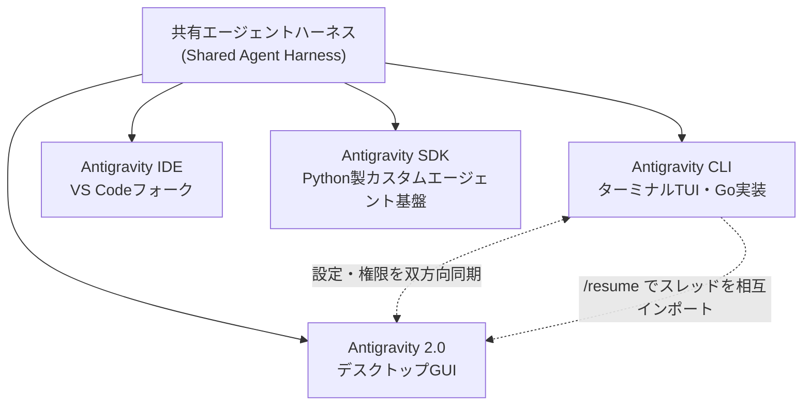
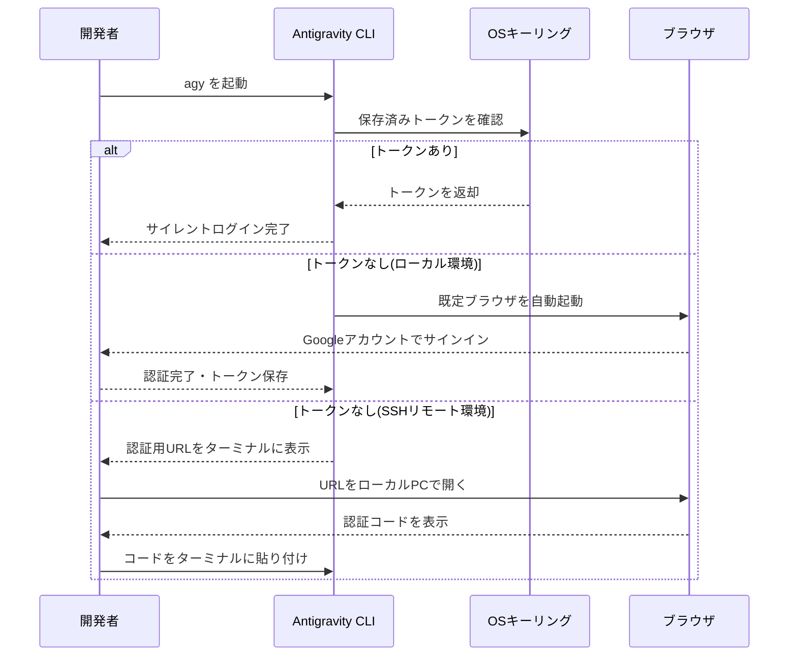
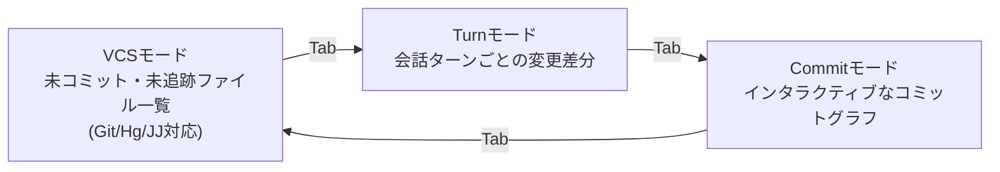
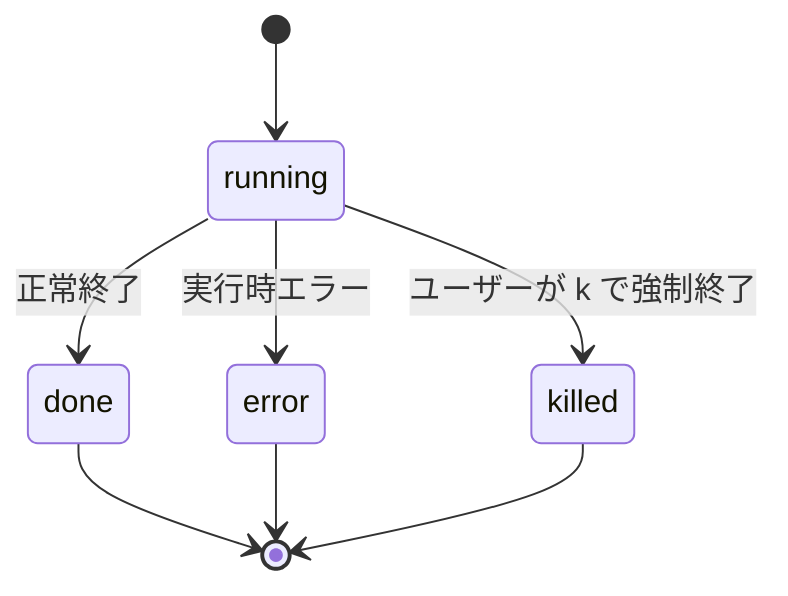
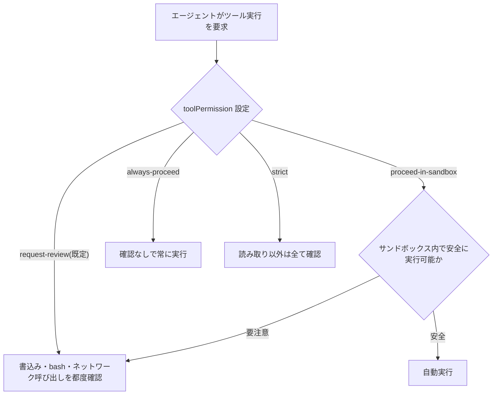
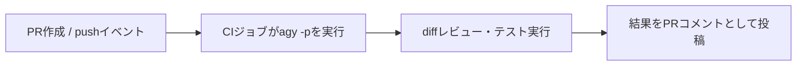
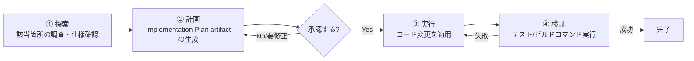

# Google Antigravity CLI 完全ガイド

### 全コマンド・設定・ベストプラクティス徹底解説(中級〜上級者向け)

> 最終更新調査日: 2026年7月29日 (Antigravity CLI v1.1.5 以降対応)。Antigravity CLI は現在も高頻度でアップデートされているツールです。本ガイドは公式ドキュメント (`antigravity.google/docs/cli/*`)、GitHub リポジトリ、および著名な開発者による一次情報をもとに作成していますが、コマンド仕様は今後変更される可能性があります。実行前に必ず `agy --help` または CLI 内の `/help` で最新仕様を確認してください。

---

## 0. このガイドの読み方

Antigravity CLI (`agy`) は、Google が2026年5月に発表した Terminal UI(TUI)型のエージェント型コーディングツールです。旧 Gemini CLI の後継にあたる製品で、Go言語で実装されており、Antigravity 2.0(デスクトップGUI版)・Antigravity IDE(VS Code フォーク)・Antigravity SDK(Python)と「共有エージェントハーネス」を利用する点が最大の特徴です。



同じハーネスを使っているため、**推論エンジンの改善はCLIとGUI双方に自動反映**され、パーミッション設定なども共有されます(会話履歴自体は既定では共有されません)。本ガイドでは、インストールから日常運用、自動化、トラブルシューティングまでを、実務で使う順に沿って解説します。

---

## 1. インストールと認証

### 1-1. インストールコマンド

| OS | コマンド |
|---|---|
| macOS / Linux | `curl -fsSL https://antigravity.google/cli/install.sh \| bash` |
| Windows (PowerShell) | `irm https://antigravity.google/cli/install.ps1 \| iex` |
| Windows (CMD) | `curl -fsSL https://antigravity.google/cli/install.cmd -o install.cmd && install.cmd && del install.cmd` |

デフォルトのインストール先は以下の通りです。

- macOS / Linux: `~/.local/bin/agy`
- Windows: `C:\Users\<Username>\AppData\Local\agy\bin`

**インストールスクリプトのフラグ**

| フラグ | 効果 |
|---|---|
| `--skip-aliases` | 旧 `agy`/`antigravity` シェルエイリアスの整理をスキップ |
| `--skip-path` | シェルプロファイルへの `PATH` 追記をスキップ |

> ⚠️ **ベストプラクティス**: `agy: command not found` になる場合は `~/.bashrc` または `~/.zshrc` に `export PATH="~/.local/bin:$PATH"` を追記し `source` し直してください。

### 1-2. 認証フロー



CLI は macOS の Keychain、Linux の Secret Service(D-Bus)、Windows Credential Manager などOS標準のセキュアストレージにトークンを保存します。エンタープライズ利用時はオンボーディング時にGCPプロジェクトを接続してください。

ログアウトする場合は CLI 内で以下を実行します。

```
/logout
```

---

## 2. 初回起動とプロジェクトの基本操作

プロジェクトディレクトリに移動して起動するだけです。

```bash
cd ~/my-project
agy
```

初回起動時にカラースキーム・レンダリングモード(Alt-Screen / Inline)・ワークスペースの信頼設定などをウィザード形式で聞かれます。

**実務Tips(Google Cloud Developer Advocate による共有 Tips より)**: プロジェクトを1つの親フォルダにまとめておくと、そのフォルダ配下であれば毎回パーミッション確認なしにエージェントがアクセスできるようになり、複数プロジェクトを横断する指示("Aのこの機能をBにも適用して"等)がスムーズになります。

```
~/Desktop/antigravity-projects/
├── project-a/
├── project-b/
```

---

## 3. 実行モード(Execution Modes)

Antigravity CLI には3つの実行モードがあり、**エージェントの自律性と開発者のレビュー負荷のトレードオフ**を調整します。

| モード | 挙動 | 向いている場面 |
|---|---|---|
| `default` | ファイル作成・変更の都度、差分プレビューで確認を求める | 標準的な開発、機微なコードの慎重なレビュー |
| `accept-edits` | ファイルの作成・編集・置換を自動承認 | 高速なプロトタイピング、信頼済みコードの反復 |
| `plan` | プロンプトに `/plan` を自動付与し、コード変更前に調査・計画を提示 | 未知のアーキテクチャの調査、複雑な複数ファイル変更の設計 |

```mermaid
stateDiagram-v2
    [*] --> default
    state "accept-edits" as accept_edits
    state "plan" as plan_mode
    default --> accept_edits: Shift+Tab
    accept_edits --> plan_mode: Shift+Tab
    plan_mode --> default: Shift+Tab
```

> **重要**: `command(git)` のようなシェルコマンド実行の可否は、実行モードに関係なく常に `/permissions` の設定(または `--dangerously-skip-permissions`)が優先されます。実行モードはあくまで「ファイル書き込み」の自動承認に関わる設定です。

### モードの起動・切り替え方法

```bash
# 既定モードで起動(差分レビューあり)
agy

# 編集を自動承認するモードで起動
agy --mode=accept-edits

# 計画優先モードで起動
agy --mode=plan
```

セッション中に切り替える場合は `Shift+Tab` を押すだけで `default → accept-edits → plan → default` と循環します。恒久的な既定値は `/config`(`/settings`)から変更するか、`settings.json` に以下を書きます。

```json
{
  "agentMode": "accept-edits"
}
```

### ⚠️ 既知の仕様変更(重要な注意)

公式の「Choose an execution mode」ドキュメントによれば、**旧来の `/planning` と `/fast` スラッシュコマンドは v1.1.0 で廃止(vestigial)**となり、現在は `Shift+Tab` によるモード循環、または `/plan` をプロンプトの先頭に付ける方式に統一されています。一方で同時期に取得した CLI リファレンス表にはまだ `/fast` や `/planning` の記載が残っており、ドキュメント間で若干の不整合が見られました。実運用では **`/help` または `agy --help` で自分の手元のバージョンの正式な挙動を必ず確認**してください。

### `default` モードでの差分レビュー操作

| キー | 動作 |
|---|---|
| `y` | 変更を承認してディスクに保存 |
| `n` | 変更を拒否して既存ファイルを維持 |
| `f` | フルスクリーンのスクロール可能な差分ビュー(前後3行のコンテキスト付き)を開く |
| `Ctrl+G` | `$EDITOR` でファイルを開き手動編集 |
| プロンプト入力後 `Enter` | 変更を拒否しつつ、修正指示をそのままエージェントへ送信 |

---

## 4. スラッシュコマンド 全リファレンス

`/` を入力するとタイプアヘッド候補メニューが開きます。以下は公式リファレンスに掲載されている中核コマンド一覧です。

| コマンド | カテゴリ | エイリアス | 用途 |
|---|---|---|---|
| `/add-dir <path>` | ユーティリティ | — | アクティブなワークスペースにディレクトリを追加 |
| `/agents` | ツール・タスク | — | エージェントマネージャーパネル(カスタムエージェント切替・サブエージェント監視) |
| `/artifact` | ツール・タスク | — | Artifact Reviewパネル(実装計画・ウォークスルー)を開く |
| `/btw <query>` | ユーティリティ | — | メイン会話を中断せずバックグラウンドで別質問 |
| `/clear` | ユーティリティ | `/new` | ターミナルをクリアし会話コンテキストをリセット |
| `/config` | 設定 | `/settings` | インタラクティブな設定エディタを開く |
| `/context` | ユーティリティ | — | コンテキスト使用量の可視化パネル |
| `/copy` | ユーティリティ | — | 直近のエージェント応答をクリップボードにコピー |
| `/credits` | アカウント | — | AI Premiumクレジット残高と購入リンクを表示 |
| `/diff` | ユーティリティ | — | インタラクティブ差分ビューア(VCS/Turn/Commit) |
| `/exit` | コア | `/quit` | TUIセッションを終了 |
| `/effort [level]` | 設定 | — | 推論モデルの思考努力レベル(low, medium, high等)を設定(コマンドライン引数 `--effort` と相互同期) |
| `/fast`※ | 設定 | — | 推論プランをバイパスする高速モード(※廃止予定、下記注記参照) |
| `/feedback` | ユーティリティ | — | フィードバック送信パネル |
| `/fork` | 会話 | `/branch` | 現在の会話を新しい並行セッションに複製 |
| `/help` | ユーティリティ | — | コマンド・ショートカット一覧のヘルプパネル |
| `/hooks` | ツール・タスク | — | 実行中のpre/post-formatフックを閲覧 |
| `/keybindings` | 設定 | — | キーボードショートカットエディタ |
| `/logout` | アカウント | — | 認証情報を破棄しサインアウト |
| `/mcp` | ツール・タスク | — | MCPサーバーマネージャー |
| `/model` | 設定 | — | 使用する推論モデルを選択(セッション間で永続化) |
| `/open <path>` | ユーティリティ | — | 指定パスを既定エディタで開く |
| `/permissions` | 設定 | — | ツール許可ルールのインタラクティブ管理パネル |
| `/planning`※ | 設定 | — | 複数ターンの計画生成モード(※廃止予定、下記注記参照) |
| `/rename <name>` | 会話 | — | 現在のセッションに名前を付ける |
| `/resume` | 会話 | `/switch`, `/conversation` | 過去の会話を一覧・検索・再開 |
| `/rewind` | 会話 | `/undo` | 会話履歴を過去の状態に巻き戻す |
| `/skills` | ツール・タスク | — | ロード済みのローカル/グローバルAgent Skillsを閲覧 |
| `/statusline` | 設定 | — | ステータスバーのカスタマイズ |
| `/tasks` | ツール・タスク | — | バックグラウンドシェル実行ログのタスクマネージャー |
| `/title [on/off]` | 設定 | — | ターミナルウィンドウタイトル更新のオン・オフ |
| `/usage` | ユーティリティ | `/quota` | モデルクォータ使用量の表示 |

### 4-1. 追加で確認されたコマンド(公式Codelab・チュートリアル由来)

Google Codelabs(`codelabs.developers.google.com`)のハンズオン教材では、上表には無い以下のプロンプト接頭辞・コマンドが紹介されています。挙動が確認できるまでは `/help` での併用確認を推奨します。

| コマンド | 用途 |
|---|---|
| `/goal <指示>` | 指定したゴールが完全に達成されるまでエージェントが自律的に反復実行し続ける(テスト全通過まで自己修復するようなタスクに有効) |
| `/plan <指示>` | UIやアーキテクチャのリファクタリングなど複雑な変更の前に、まず実装計画(Implementation Plan)を提示させる |
| `/grill-me <指示>` | 実装前にインタビュー形式で要件・デザインの選択肢を1問ずつ確認してくれる、詳細な壁打ちプランニング |
| `! <shellコマンド>` | Bashモード。`!` を先頭に付けると、エージェントを介さず直接シェルコマンドを実行(例: `! git status`) |
| `Ctrl+B` | 実行中の長時間タスクをバックグラウンドに送る |

### 4-2. 主要コマンドの詳細ステップ

以降は特に利用頻度の高いコマンドについて、公式ドキュメントに基づく詳細な操作手順を解説します。

#### `/permissions` — パーミッション管理

```
/permissions
```

**操作フロー**

1. **スコープピッカー**: `Project`(現在のプロジェクトのみ)/ `Shared`(全Antigravity製品共通)/ `Global`(全セッション共通)から選択(`↑/↓`、`Enter`)。
2. **ルールビューア**: `←/→`(または`Tab`)で `allowlist` / `denylist` / `asklist` タブを切替。`a`で追加、`e`(または`Ctrl+G`)で編集、`d`(または`Backspace`)で削除。
3. **ルール追加/編集**: `action(target)` 形式で入力(例: `command(git)`、`read_file(/path/to/dir)`、`write_file(/path/to/file)`)。`Enter`で保存。

**実務例**: `git` コマンド全般を自動承認したいが、`git push` は毎回確認したい場合は `command(git)` を追加後、細かい制御が必要なら denylist/asklist 側で個別に絞り込みます。

> 💡 **著名開発者のTips**: ワークスペース外のファイル(例: 別ディレクトリのプロジェクトや `~/.gemini/config/mcp_config.json` のような設定ファイル)にエージェントがアクセスするたびに確認を求められるのが煩わしい場合、`settings.json` に直接 `permissions.allow` を追記しておくと快適です。パスマッチングは再帰的なので、ディレクトリを1つ許可すれば配下すべてに適用されます。また `write_file` は `read_file` を包含するため、書き込みだけ許可すれば十分です。

```json
{
  "permissions": {
    "allow": [
      "read_file(/Users/you/Desktop/projects/my-app)",
      "write_file(/Users/you/.gemini/config/mcp_config.json)"
    ]
  }
}
```

#### `/diff` — インタラクティブ差分ビューア

```
/diff
```

3つのモードを `Tab`(または `←/→`)で循環します。



| ビュー | 主なキー操作 |
|---|---|
| ファイル一覧(VCS/Turn) | `↑/↓` 移動、`Enter` 詳細表示、`Esc` 終了 |
| 詳細ビュー | `↑/↓` スクロール、`j/k` または `←/→` でファイル切替、`n/N` でハンク間ジャンプ、`c` でコメント追加、`d` でコメント削除 |
| コミットツリー | `↑/↓` コミット移動、`←/→` ブランチ移動、`Enter` で差分表示 |
| 終了確認画面 | `Shift+Y` コメントを送信して終了、`Shift+N` 破棄して終了 |

**ステップバイステップ: 行コメントでエージェントを誘導する**

1. 詳細ビューでコメントしたい行にカーソルを合わせる。
2. `c` を押してコメント入力欄を開く。
3. フィードバックを入力し `Enter` で保存(`💬`アイコンがガター表示)。
4. `Esc` でファイル一覧に戻り、さらに `Esc` で終了。
5. 未送信コメントがあれば確認画面が出るので `Shift+Y` で承認・送信すると、コメントが `<file>:<line>: <comment>` の形式で整形されエージェントへの次の指示として送られます。

#### `/resume` — 会話の再開

```
/resume
```

| 操作 | キー |
|---|---|
| 検索 | 文字入力で即時フィルタ |
| 移動 | `↑/↓` |
| ページ送り | `←/→` |
| リネーム | `F2` |
| 削除 | `Ctrl+Delete` → `Enter`/`y` で確定 |
| Antigravity 2.0からインポート | `Tab` でCLIタブ→Antigravityタブへ切替 → `Enter` → `y` |

**コマンドラインからの直接再開**

```bash
# 現在のワークスペースで直近の会話を再開
agy -c
# または
agy --continue

# 特定の会話IDを直接指定
agy --conversation <conversation-id>
```

再開キャッシュは `~/.gemini/antigravity-cli/cache/last_conversations.json` に、ワークスペースの絶対パスと会話IDのマップとして保存されています。

#### `/codesearch`(エイリアス: `/cs`, `/search`)— コード検索

```
/codesearch UserSession
```

- 既定は**正規表現**・スマートケース(大文字を含めば大小区別)。
- リテラル一致: `-F` または `--literal`
- ファイルパスで絞り込み: `f:`(`file:`/`path:`のエイリアス可)、`-` で除外

```
/codesearch -F map[string]*UserSession
/codesearch f:store.go Session
/codesearch -f:*_test.go NewUserSession
```

結果を `Enter` で開いてファイルビューアでコードを閲覧し、`c` で行コメント、`Esc` で終了時に送信確認(`y`/`n`)が出る点は `/diff` と同様の設計です。

#### `/agents` — カスタムエージェント & サブエージェント管理

```
/agents
```

**カスタムエージェントの作成**(グローバル)

```bash
mkdir -p ~/.gemini/config/agents/code-reviewer
cat << 'EOF' > ~/.gemini/config/agents/code-reviewer/agent.md
---
name: code-reviewer
description: エッジケースとセキュリティに重点を置くコードレビュー専門エージェント
---
あなたは熟練のコードレビュアーです。差分を注意深く分析し、エッジケースを検証してください。
EOF
```

プロジェクト単位で限定したい場合は `{workspace}/.agents/agents/{agent_name}/agent.md` に配置します。

**サブエージェントのライフサイクル**



| キー | 動作 |
|---|---|
| `↑/↓` | ヘッダー・サブエージェント・利用可能エージェント間を移動 |
| `Enter` | グループの展開/折りたたみ、詳細ビューを開く、エージェントを選択 |
| `k` | 実行中のサブエージェントを強制終了(完了済みには無効) |
| `a` / `d` | パネル内から承認/拒否の即時応答 |
| `Esc` | パネルを閉じ、選択したエージェント切替を適用 |

> ⚠️ **落とし穴**: アクティブな会話中にエージェントを切り替えると、履歴の整合性を保つために**自動的に会話がフォーク**されます。新規セッションからの切替は直接反映されます。

#### `/statusline` — ステータスバーのカスタマイズ

```
/statusline              # トグル(オン/オフ切替)
/statusline on            # 明示的に有効化
/statusline off           # 明示的に無効化
/statusline ~/.gemini/antigravity-cli/statusline.sh   # カスタムスクリプトを設定
/statusline delete         # 既定表示に戻す(reset も可)
/statusline help           # クイックリファレンス表示
```

**実務例(著名なGoogle Cloud Developer Advocateの公開スクリプトより)**: モデル名・カレントディレクトリ・gitブランチ・未コミット数・同期状況・トークン使用率をカラー表示するステータスラインの例。

```bash
mkdir -p ~/.gemini/antigravity-cli
curl -sSL -o ~/.gemini/antigravity-cli/statusline.sh \
  https://raw.githubusercontent.com/ykdojo/antigravity-cli-tips/4a13498f354f36bc82375a1ab9a920ae364c90c8/scripts/context-bar.sh &&
echo "5c5593e50a09262a80ccfae53b0167467bc7e563556a8a92543c32f796ab5e9c  ~/.gemini/antigravity-cli/statusline.sh" | sha256sum -c - &&
chmod +x ~/.gemini/antigravity-cli/statusline.sh
```

```json
{
  "statusLine": {
    "type": "command",
    "command": "~/.gemini/antigravity-cli/statusline.sh"
  }
}
```

表示イメージ: `モデル名 | 📁プロジェクト名 | 🔀ブランチ(未コミット数, 同期状況) | トークン使用率バー`

#### `/title` — ウィンドウタイトル

```
/title       # トグル
/title on    # 有効化
/title off   # 無効化
```

有効化すると、ターミナルのタイトルバーにアクティブなモデル・ワークスペース・エージェント状態が動的に反映されます。

#### `/usage`(エイリアス `/quota`)・`/credits` — 使用量管理

```
/usage    # モデルごとのクォータ(残リクエスト/トークン数)を表示・自動リフレッシュ
/credits  # AI Premiumクレジットの残高・消費履歴・購入リンクを表示
```

| キー(`/usage`パネル) | 動作 |
|---|---|
| `↑/↓`(`j/k`) | 1行スクロール |
| `PgUp/PgDn` | 1ページスクロール |
| `g`/`G` | 先頭/末尾へジャンプ |
| `Esc`(`q`) | 閉じる |

---

## 5. キーボードショートカット 完全リファレンス

### グローバル(常時有効)

| キー | 動作 |
|---|---|
| `Esc` | アクティブなパネルを閉じる/ストリームを停止/空プロンプトをクリア |
| `Ctrl+C` | セッション終了(エージェント実行中は確認あり) |
| `Ctrl+D` | セッション終了(プロンプトが空の場合のみ) |
| `Ctrl+L` | ターミナルバッファを再描画 |

### プロンプト入力中

| キー | 動作 |
|---|---|
| `Enter` | プロンプト送信/メニュー選択確定 |
| `Shift+Enter` / `Ctrl+J` | 改行(送信しない) |
| `Ctrl+V` | クリップボードの画像・メディアを添付 |
| `Ctrl+O` | ツール推論の詳細トラジェクトリを展開/折りたたみ |
| `Ctrl+R` | Artifact Reviewパネルを開く |
| `Ctrl+G` | `$EDITOR` を起動してプロンプトを作成 |
| `Alt+J` | 承認待ちの次のサブエージェントへフォーカス移動 |
| `Ctrl+K` | ステータスに表示中の保留アクションを即時承認 |
| `Ctrl+A` / `Ctrl+E` | カーソルを行頭/行末へ移動 |
| `Ctrl+Z` / `Ctrl+Shift+Z` | 元に戻す/やり直す |

### ナビゲーション・スクロール(パネル/メニュー内)

| キー | 動作 |
|---|---|
| `↑/↓` | 選択項目を上下に移動 |
| `PgUp`/`Shift+↑` | 1ページ分上スクロール |
| `PgDn`/`Shift+↓` | 1ページ分下スクロール |
| `←/→` | ページ切替(セッションピッカー等) |
| `Tab` | オートコンプリート候補を確定 |

### ツール確認プロンプト中

| キー | 動作 |
|---|---|
| `y` | 提案されたツール・コマンド・変更を承認 |
| `n` | 拒否 |
| `A`(Reviewパネル内) | 生成された全アーティファクトを一括承認 |

---

## 6. 設定ファイル `settings.json` 完全リファレンス

保存場所: `~/.gemini/antigravity-cli/settings.json`(TUI内では `/config` または `/settings` で編集可能)

```json
{
  "colorScheme": "tokyo night",
  "altScreenMode": "always",
  "toolPermission": "request-review",
  "notifications": true,
  "enableTerminalSandbox": true
}
```

| キー | 型 | 既定値 | 説明 |
|---|---|---|---|
| `colorScheme` | string | `"terminal"` | `light` / `solarized light` / `colorblind-friendly light` / `dark` / `solarized dark` / `colorblind-friendly dark` / `tokyo night` / `terminal`(シェルの配色を継承) |
| `altScreenMode` | string | `"default"` | `default`(適応的)/ `always`(常にオルタネートスクリーン)/ `never`(常にインライン出力) |
| `toolPermission` | string | `"request-review"` | `request-review` / `proceed-in-sandbox` / `always-proceed` / `strict` |
| `artifactReviewPolicy` | string | `"asks-for-review"` | `asks-for-review` / `agent-decides` / `always-proceed` |
| `notifications` | boolean | `false` | タスク完了時のデスクトップ通知・ベル音 |
| `showTips` | boolean | `true` | プロンプト上部にエージェンティックなヒントを表示 |
| `showFeedbackSurvey` | boolean | `true` | 定期的な品質フィードバック調査を表示 |
| `editor` | string | `"auto"` | `auto`(`$EDITOR`参照)/ `vim` / `emacs` / カスタム文字列 |
| `allowNonWorkspaceAccess` | boolean | `false` | Git/ワークスペースルート外への読み書きを許可 |
| `enableTerminalSandbox` | boolean | `false` | ローカル実行コマンドをOSコンテインメントリング内に制限 |
| `useG1Credits` | boolean | `false` | (外部ビルドのみ)プランのクォータ超過後に個人AIクレジットを使用 |
| `enableTelemetry` | boolean | `true` | メトリクス収集・クラッシュログ送信の許可 |
| `verbosity` | string | `"high"` | `high`(思考過程・ツール出力を全表示)/ `low`(最小限のインジケータのみ) |
| `runningLightSpeed` | string | `"medium"` | 進捗アニメーション速度: `fast`/`medium`/`slow`/`off` |
| `agentMode` | string | `"default"` | 起動時の既定実行モード: `default`/`accept-edits`/`plan` |

その他の関連ファイル:

| ファイル | 用途 |
|---|---|
| `~/.gemini/antigravity-cli/keybindings.json` | カスタムキーバインド(`/keybindings` からも編集可) |
| `~/.gemini/antigravity-cli/cache/last_conversations.json` | `agy -c` 用のワークスペース別・直近会話キャッシュ |
| `~/.gemini/antigravity-cli/updater/update.lock` | セルフアップデーターのアドバイザリロック |
| `~/.gemini/config/agents/<name>/agent.md` | グローバルなカスタムエージェント定義 |
| `{workspace}/.agents/agents/<name>/agent.md` | プロジェクト限定のカスタムエージェント定義 |

### コマンドラインフラグによる上書き

`--effort`、`--sandbox`、`--dangerously-skip-permissions` のように、起動時フラグはセッション設定や `settings.json` の値を一時的に上書きできます。`--effort` は `/effort [level]` と相互同期します。設定パネルには上書き元(例: `Sandbox Mode on overridden by --sandbox`)が表示され、永続設定自体は変更されません(再起動でフラグの効果は消えます)。

```bash
# 推論モデルの思考努力レベルを high に設定
agy --effort=high

# 隔離環境(コンテナ/VM/専用テストマシン)で全承認を自動化する場合
agy --dangerously-skip-permissions
```

> ⚠️ **セキュリティ注意**: `--dangerously-skip-permissions` は全てのツール承認要求を無条件で自動承認します。信頼できない入力やネットワークアクセス可能な本番環境に近い場所では使用しないでください(詳細は本ガイド末尾の「セキュリティ上の注意」を参照)。

---

## 7. パーミッション & サンドボックスモデル

Antigravity CLI は「どこまでエージェントに自律性を与えるか」を、**Tool Permission(何を許可するか)** と **Sandbox(どこで実行するか)** の2軸で制御します。



| 設定 | 説明 |
|---|---|
| `request-review`(既定) | 書込み・bashコマンド・リモートネットワーク呼び出しの前に必ず確認 |
| `proceed-in-sandbox` | 実行をサンドボックスに封じ込め、安全なコマンドは自動実行・危険なコマンドのみ確認 |
| `always-proceed` | 確認なし(信頼できる自動化専用) |
| `strict` | 読み取り以外の操作を逐一確認し、完全な透明性を確保 |

サンドボックスが有効な場合、確認プロンプトには「サンドボックスなしで今回だけ実行」というオプションが、無効な場合は「今回だけサンドボックス内で実行」というオプションがそれぞれ追加表示されます(単発の例外対応)。

**推奨設定例(中〜高リスクなプロジェクト向け)**

```json
{
  "toolPermission": "proceed-in-sandbox",
  "enableTerminalSandbox": true
}
```

### パーミッションルールの書式

`/permissions` パネルで管理するルールは `action(target)` 形式です。

```
command(git)              # git コマンド全体を許可
command(git diff)         # git diff のみ許可(より限定的)
read_file(/path/to/dir)   # 指定ディレクトリ配下の読み取りを許可(再帰的)
write_file(/path/to/file) # 指定ファイル/ディレクトリへの書込みを許可(read_fileを包含)
```

スコープは3段階です。

| スコープ | 適用範囲 |
|---|---|
| Project | 現在開いているプロジェクトのみ |
| Shared | Antigravity CLI / 2.0 / IDE など全製品共通 |
| Global | 全セッション共通 |

---

## 8. MCP(Model Context Protocol)サーバー連携

Antigravity CLI は MCP を通じて Jira・Confluence・GitHub・Playwright・Snyk などの外部ツールと連携できます。

```
/mcp   # 設定済みMCPサーバーの一覧・状態を確認
```

**設定ファイルの場所**(Google Codelabsのハンズオン教材による記載):

- グローバル設定: `~/.gemini/config/mcp_config.json`
- ワークスペースローカル設定: `.agents/mcp_config.json`(プロジェクト直下)

> 📝 **設定スコープの注記**: 共有(Shared)スコープの MCP 設定は `~/.gemini/config/` 配下、CLI固有の設定は `~/.gemini/antigravity-cli/` 配下に保存されます。手元の環境では `/mcp` コマンドの表示、または `agy --help` でも実際のパスを確認してください。

**設定例: Context7(単一サーバー、リモートURL指定)**

```json
{
  "mcpServers": {
    "context7": {
      "serverUrl": "https://mcp.context7.com/mcp"
    }
  }
}
```

**設定例: 複数サーバー(Snyk / Atlassian / Playwright / GitHub)**

```json
{
  "mcpServers": {
    "Snyk Security Scanner": {
      "command": "npx",
      "args": ["-y", "snyk@1.1306.2", "mcp", "-t", "stdio", "--experimental"],
      "env": {}
    },
    "atlassian": {
      "command": "npx",
      "args": ["-y", "mcp-remote@0.1.38", "https://mcp.atlassian.com/v1/sse"]
    },
    "playwright": {
      "command": "npx",
      "args": ["-y", "@playwright/mcp@0.0.78"]
    },
    "github": {
      "command": "npx",
      "args": ["-y", "@modelcontextprotocol/server-github@2025.4.8"],
      "env": { "GITHUB_PERSONAL_ACCESS_TOKEN": "******" }
    }
  }
}
```

- **Snyk**: ワークスペースを離れずに依存関係の脆弱性スキャンをエージェントに実行させる
- **Atlassian**: Jira/Confluenceのチケット作成・検索・更新を自然言語で指示
- **Playwright**: ブラウザ自動操作(`browser_navigate`、`browser_click`、`browser_take_screenshot` 等)によるE2Eテストや画面確認
- **GitHub**: PR作成・Issueトリアージ・リポジトリ解析を直接連携

---

## 9. カスタムエージェント・Skills・Plugins・Hooks

### カスタムエージェント(前述の`/agents`参照)

`agent.md` にYAML frontmatter + システムプロンプトを記述し、グローバル(`~/.gemini/config/agents/<name>/agent.md`)またはプロジェクト限定(`{workspace}/.agents/agents/<name>/agent.md`)に配置します。

### Agent Skills

Skillsは、特定タスクの手順・スクリプト・参照リソースを記述した宣言的なMarkdownファイルです。登録されると自動的にスラッシュコマンド化されます(例: `/refactor-ui`)。

```
/skills   # ロード済みのローカル/グローバルSkillsを一覧表示
```

### Plugins

Plugins は Skills・バックグラウンドサブエージェント・Lintルール・MCP定義・イベントフックを1つのパッケージにまとめた名前空間付きバンドルです。カスタムエージェントもPlugin経由で配布できます。

### Hooks

ツール実行の直前/直後に処理を挟み込む仕組みで、pre-flightチェックやpost-formatフォーマッタ(例: ファイル書込み後の `prettier` 自動実行)に使われます。Plugin内の `hooks.json`、または `settings.json` 本体に定義します。

```
/hooks   # 現在アクティブなフックを一覧表示
```

### プロジェクトルールファイル(`AGENTS.md` / `GEMINI.md`)

プロジェクトルートに `AGENTS.md`(または `GEMINI.md`)を配置すると、コーディング規約・スタイル指針・テストコマンド・非推奨事項などをエージェントが起動時に自動的に読み込み、変更提案の前に参照します。

**実務Tips**: Claude Codeなど他ツールも併用している場合、シンボリックリンクで指示ファイルを共有すると二重管理を避けられます。

```bash
ln -s CLAUDE.md AGENTS.md
```

`AGENTS.md` にはTODOリストを書いておくのもおすすめです。

```markdown
## To-Do
### Done
- [x] プロジェクト初期スキャフォールド
- [x] 基本UI実装
### Up Next
- [ ] エラーハンドリングの追加
```

こうしておくと「TODOリストの状況を教えて」と聞くだけで、エージェントが正確に現在地を把握して回答してくれます。全体を通しての注記として、グローバル版のルールファイルは `~/.gemini/AGENTS.md` に置くことで全プロジェクト共通の指示にできます。

---

## 10. 自動化・スクリプティング・CI/CD連携

### 非対話モード(`-p` フラグ)

```bash
agy -p "このgit diffをレビューしてConventional Commits形式のコミットメッセージを提案して" --cwd $(pwd)
```

Gitフックやスクリプトへの組み込み、単発クエリの自動化に有効です。

### Bashモード(`!` プレフィックス)

対話中に単純なコマンドをすぐ実行したい場合、`!` を先頭に付けるとチャットを介さず直接シェルへ渡せます。

```
! git status
```

### バックグラウンドタスク

長時間かかるタスクは `Ctrl+B` でバックグラウンドに送れます。進行状況は `/tasks`(シェル実行系)または `/agents`(サブエージェント系)で監視できます。

### CI/CDパイプラインでの利用イメージ



`AGY_CLI_DISABLE_AUTO_UPDATE=true` を環境変数に設定しておくと、CI環境でセルフアップデーターが介入するのを防げます(詳細は次章のトラブルシューティング参照)。

---

## 11. ベストプラクティス(公式ガイド + 実務Tips統合版)

### 11-1. 検証ループを必ず組み込む

自律型エージェントから信頼できる変更を得る最も効果的な方法は、**ローカルに検証手段(ユニットテスト・ビルドコマンド・フォーマッタ)を用意しておく**ことです。



**手順**

1. ワークスペースにテストスイートを用意する(無ければ先にテストを書かせる)。
2. コード変更を依頼する際、検証コマンドまで指定する。

```
Implement feature X in main.py. Run npm test afterward to verify the build.
```

3. エージェントがテストを実行し、失敗があれば自動的に反復修正する様子を確認する。

### 11-2. 「探索 → 計画 → 実行」の3段階に分ける

複雑な変更ほど、いきなり実装させず段階を踏むことで精度が上がります。

```
Explore how our router resolves `/docs/:page`. Write down an implementation plan to add `/docs/best-practices`.
```

- **探索**: 対象コードの解決方法・インターフェース定義をまず説明させる
- **計画**: Implementation Plan artifact(対象ファイル・依存関係・ロジック変更点を列挙)を要求
- **実行**: 承認後にのみ編集を適用させる

複雑なUI・アーキテクチャ変更では `/plan` コマンドや、要件を1問ずつ確認してくれる `/grill-me` の活用も有効です。

### 11-3. コンテキストを高精度に与える

| 手法 | 操作 |
|---|---|
| ファイルパス補完 | プロンプト内で `@` を入力すると Interactive Path Suggestion が開き、絶対パスを挿入できる |
| 画面のスクリーンショット添付 | UI崩れ等のビジュアルバグはスクリーンショット/動画をコピーし `Ctrl+V` で貼り付け |
| Webページ・ターミナル出力の貼り付け | `Cmd+A`/`Ctrl+A` で全選択しコピーしてそのまま貼り付け(Gmailは「印刷プレビュー」、YouTubeは文字起こし表示を使うと綺麗に取得できる) |
| 絶対パスの取得 | `realpath some/relative/path` で絶対パスを取得しプロンプトに貼る |

### 11-4. ワークスペース環境を整備する

- `AGENTS.md`/`GEMINI.md` にディレクトリ規約・スタイル・テストコマンド・非推奨事項を明記する。
- リスクレベルに応じて `toolPermission` を調整する(§7参照)。

### 11-5. セッションを能動的に管理する

| 状況 | 対処 |
|---|---|
| 誤った検索パターン・意図とズレたコードを実行中 | `Esc` で即座に中断しクリーンなプロンプトに戻る |
| 複数回の変更でビルドエラーが蓄積した | `/rewind`(`/undo`)で会話を安定していた時点まで巻き戻す |
| 実装方針に確信が持てない | `/fork` で並行セッションを作り、試行錯誤用のブランチとして使う。失敗したら `/resume` で本線に戻る |

### 11-6. 並列サブエージェントで作業をファンアウトする

大規模な一括置換や複数ファイルにまたがるリファクタリングでは、メインエージェントにバックグラウンドのサブエージェントを生成させ、`/agents` パネルで監視しながら自分は別作業を継続できます。

### 11-7. ソフトウェア開発ライフサイクル全体でエージェントを使う

コード生成だけに偏重せず、Issue理解・設計検討・PRレビュー・テスト作成など、SDLC全体でエージェントを活用することが推奨されています(著名なGoogle Cloud Developer Advocateによる実務記事より)。

### 11-8. 音声入力の活用(上級者向け実務Tips)

タイピングより音声の方が指示速度が速いというTipsも共有されています。ローカルの音声認識モデル(例: superwhisper、MacWhisper 等)を使えば、多少の誤認識があってもLLMが文脈から意図を汲み取ってくれるため実用上問題ないケースが多いとされています。

---

## 12. トラブルシューティング

| 症状 | 原因 | 対処 |
|---|---|---|
| `agy: command not found` | インストール先が `$PATH` に含まれていない | `~/.bashrc`/`~/.zshrc` に `export PATH="~/.local/bin:$PATH"` を追記し `source` する。Windowsは `SetEnvironmentVariable` でPATHを追記 |
| `keyring: secure lock out` | OSキーリングサービスの権限不足・ロック | macOS: Keychain Access で `agy` のアクセス許可を確認、SSH経由なら `security unlock-keychain` 実行。Linux: `export $(dbus-launch)` でD-Busセッションを起動 |
| SSH経由でのクリップボード貼付失敗 | SSH標準ストリームはグラフィカルクリップボードを転送しない | iTerm2/Ghosttyを使用し、iTerm2なら「Applications in terminal may access clipboard」を有効化(OSC 52)。tmux利用時は `set -s set-clipboard on` |
| アップデートが失敗・ハングする | セルフアップデーターのアドバイザリロックが残留 | `rm -f ~/.gemini/antigravity-cli/updater/update.lock` でロック解除。自動更新自体を止めたい場合は `export AGY_CLI_DISABLE_AUTO_UPDATE=true` |

---

## 13. セキュリティ上の注意

Antigravity CLI の公式GitHubリポジトリでは、AIコーディングエージェント全般に共通するリスクとして以下が明記されています。

- 自律的なコード実行(autonomous code execution)
- データ持ち出し(data exfiltration)
- プロンプトインジェクション(prompt injection)
- サプライチェーンリスク(supply chain risks)

エージェントが取る全てのアクションを監視・検証することが推奨されています。実務上は以下のような多層防御が現実的です。

1. **既定(`request-review`/`strict`)で運用**し、信頼度に応じて `proceed-in-sandbox` → `always-proceed` へ緩めていく。
2. **サンドボックス(`enableTerminalSandbox: true`)を有効化**し、ローカル実行コマンドをOSコンテインメントリングに封じ込める。
3. **`--dangerously-skip-permissions` はコンテナ・使い捨てVMなど隔離環境限定**で使用する。
4. **外部ネットワーク接続を伴うMCPサーバー(GitHubトークン等)は最小権限のトークン**を発行し、`env` に直接埋め込む場合は取り扱いに注意する。
5. Antigravity(旧Gemini CLIを含む)は米商務省の輸出規制対応等、サービス提供状況が急遽変更されることがあった実績があるため(著名なAI評論家 Simon Willison 氏のブログ・X投稿でも複数回報告)、本番CI/CDに組み込む場合は可用性リスクも考慮してください。

---

## 14. 参考文献・情報源(2026年7月29日時点で確認)

本ガイドは以下の一次情報源(公式ドキュメント・公式リポジトリ・Google公認Developer Advocateによる技術記事・国際的に著名なAI/開発者評論家の投稿)を根拠にしています。

**公式ドキュメント(antigravity.google)**

- CLI概要: https://antigravity.google/docs/cli/overview
- インストール・認証: https://antigravity.google/docs/cli/install
- 実行モード: https://antigravity.google/docs/cli/modes
- CLIリファレンス(全コマンド・キーバインド・設定キー): https://antigravity.google/docs/cli/reference
- ベストプラクティス: https://antigravity.google/docs/cli/best-practices
- トラブルシューティング: https://antigravity.google/docs/cli/troubleshooting
- 機能概要(サンドボックス・サブエージェントパネル): https://antigravity.google/docs/cli/features
- `/agents` コマンド詳細: https://antigravity.google/docs/cli/commands/agents
- `/codesearch` コマンド詳細: https://antigravity.google/docs/cli/commands/codesearch
- `/credits` コマンド詳細: https://antigravity.google/docs/cli/commands/credits
- `/diff` コマンド詳細: https://antigravity.google/docs/cli/commands/diff
- `/permissions` コマンド詳細: https://antigravity.google/docs/cli/commands/permissions
- `/resume` コマンド詳細: https://antigravity.google/docs/cli/commands/resume
- `/statusline` コマンド詳細: https://antigravity.google/docs/cli/commands/statusline
- `/title` コマンド詳細: https://antigravity.google/docs/cli/commands/title
- `/usage` コマンド詳細: https://antigravity.google/docs/cli/commands/usage
- Antigravity CLI 発表ブログ: https://antigravity.google/blog/introducing-google-antigravity-cli

**公式リポジトリ**

- GitHub: https://github.com/google-antigravity/antigravity-cli

**Google公式ブログ・Developer Advocate記事**

- Gemini CLIからの移行アナウンス: https://developers.googleblog.com/an-important-update-transitioning-gemini-cli-to-antigravity-cli/
- サーフェス選択ガイド(CLI/IDE/SDK/2.0比較): https://cloud.google.com/blog/topics/developers-practitioners/choosing-your-surface-antigravity-20-antigravity-cli-antigravity-ide-or-antigravity-sdk
- Antigravity vs Gemini CLI 比較: https://cloud.google.com/blog/topics/developers-practitioners/choosing-antigravity-or-gemini-cli
- Antigravity CLI チュートリアルシリーズ(Medium, Google Cloud Community): https://medium.com/google-cloud/antigravity-cli-tutorial-series-12b46cfe3bf2
- Getting Started with Antigravity CLI(Medium, Google Cloud Community): https://medium.com/google-cloud/getting-started-with-antigravity-cli-26c5da90951f
- Antigravity CLIハンズオン公式Codelab: https://codelabs.developers.google.com/genai-for-dev-antigravity-cli
- Antigravity CLIハンズオン公式Codelab(別編): https://codelabs.developers.google.com/antigravity-cli-hands-on

**著名な開発者による実務Tips・評論**

- 「15 Antigravity CLI tips」— YK氏(Claude Code tips リポジトリ作者・9,000+スター、CS Dojo YouTubeチャンネル創設者・登録者190万人超、Eventual社 Developer Experience Manager)、Google Cloud Community寄稿: https://medium.com/google-cloud/15-antigravity-cli-tips-ddbc21c10a20
- Simon Willison氏(国際的に著名なAI/LLM評論家)によるGoogle I/O・Antigravity関連の考察: https://simonwillison.net/2026/May/20/google-io/

---

> 📌 本ガイドの内容は2026年7月29日時点の Antigravity CLI v1.1.5 以降の公開情報に基づきます。Antigravity CLI は数週間単位でバージョンアップされており、コマンド名・設定キー・ファイルパスは変更される可能性があります。重要な自動化やCI/CD組み込みの前には、必ず `agy --help` および公式ドキュメントの最新版を確認してください。
