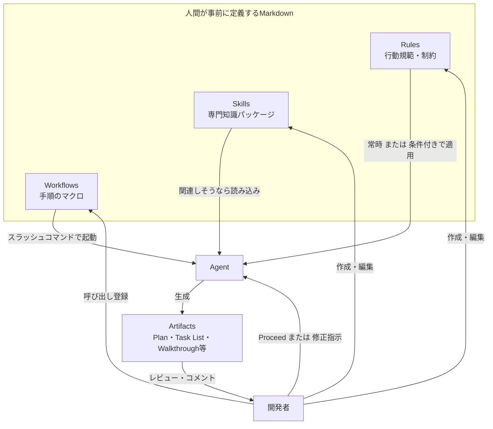
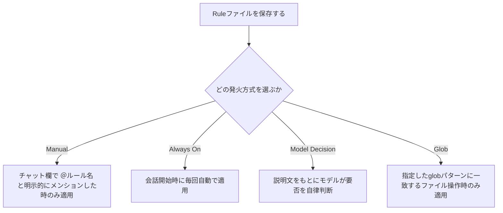
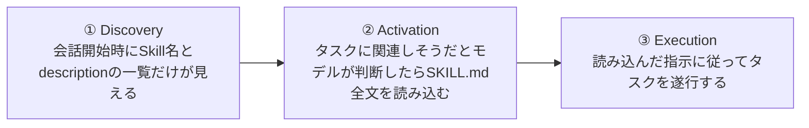
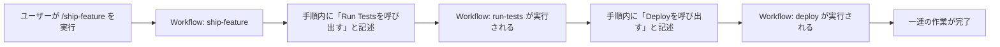
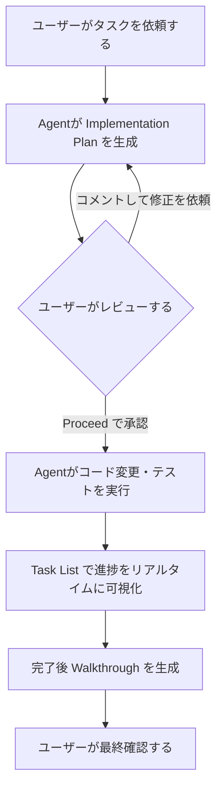
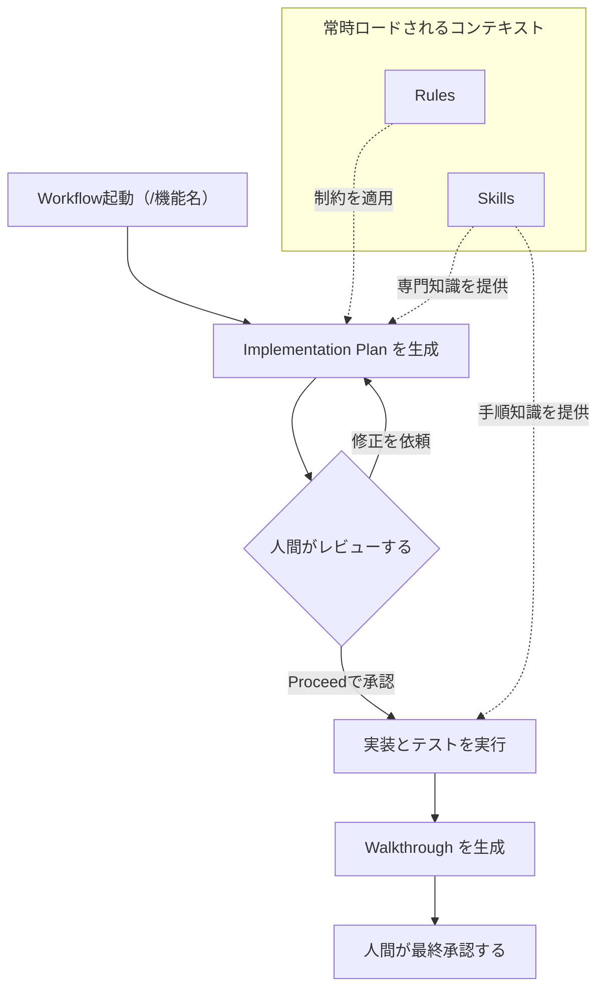

# AI仕様駆動開発とMarkdown ― Google Antigravityの Rules / Skills / Workflows / Artifacts 徹底ガイド

<a id="top"></a>

> 対象読者：AIエージェントIDE「Google Antigravity」を初めて触る人、あるいは「AI仕様駆動開発（Spec-Driven Development, SDD）」という考え方を実務に落とし込みたい人。
> ゴール：Antigravityが扱う4種類のMarkdownファイル（Rules / Skills / Workflows / Artifacts）それぞれの役割・置き場所・書き方・ベストプラクティスを、手順を追って理解できるようにする。

---

## 目次

1. [なぜ「Markdownが仕様になる」のか](#section-1)
2. [全体像：4つのMarkdownファイルの役割分担](#section-2)
3. [Step 1：Rules ― エージェントの行動規範を定義する](#section-3)
4. [Step 2：Skills ― 再利用可能な専門知識パッケージを作る](#section-4)
5. [Step 3：Workflows ― 手順を「マクロ」として自動化する](#section-5)
6. [Step 4：Artifacts ― エージェントの思考を可視化し人間がレビューする](#section-6)
7. [4つを組み合わせる：仕様駆動開発の実践フロー](#section-7)
8. [ベストプラクティス・チェックリスト](#section-8)
9. [よくある落とし穴（アンチパターン）](#section-9)
10. [参考文献・情報源](#section-10)

---

<a id="section-1"></a>
## 1. なぜ「Markdownが仕様になる」のか

Spec-Driven Development（仕様駆動開発）とは、「なんとなく指示してAIに書かせる（vibe coding）」のではなく、**仕様（spec）そのものを一次情報源（source of truth）とし、コードはその仕様から導かれる成果物として扱う**という考え方です。GitHubのSpec Kit、AWSのKiro、Claude Codeのskills機能、CursorのPlan Modeなど、2026年時点で主要なAIコーディングツールはそれぞれ独自の形でこの思想を実装しています。

Google Antigravityの場合、この「仕様」や「行動規範」「専門知識」「実行手順」を記述する媒体として、一貫して**プレーンなMarkdownファイル**が使われています。これは意図的な設計判断です。Antigravityの公式ドキュメントでも、Skillsの仕組みについて「あえてMarkdownとYAMLという広く理解されているフォーマットに乗せることで、IDEの機能拡張への参入障壁を下げている」と説明されています。

Antigravity自体は、VS Codeをベースにしたデスクトップ型のエージェント型開発プラットフォームで、2025年11月にGemini 3と同時に発表されました。著名な開発者であるSimon Willisonは公開直後のレビューで、Antigravityの見た目は「よくあるVS Codeフォーク」だが、内部にはいくつか興味深い新しいアイデアがあると評しています。その「新しいアイデア」の中核が、これから解説する4種類のMarkdownファイルです。

覚えておきたいポイントは次の1つだけです。

> **Rules・Skills・Workflowsは「人間があらかじめ書いて渡す仕様」、Artifactsは「エージェントがタスク遂行中に生成する仕様・記録」。** この非対称性が全体の理解の鍵になります。

[目次に戻る](#top)

---

<a id="section-2"></a>
## 2. 全体像：4つのMarkdownファイルの役割分担

まず全体像を1枚の図で押さえます。



次に、それぞれの特徴を表で比較します。この4分類はAntigravityの公式ドキュメント構成（Customizations配下のSkills・Rules・Workflowsと、Artifacts配下のPlan・Walkthrough等）にそのまま対応しています。

| 項目 | Rules | Skills | Workflows | Artifacts |
|---|---|---|---|---|
| 目的 | エージェントの振る舞いを常時／条件付きで制約する「憲法」 | 特定タスクのための専門知識・手順をパッケージ化する | 定型作業を手順化し、スラッシュコマンドで再実行する | エージェントが思考・計画・実行結果を人間に伝える成果物 |
| 誰が作る | 人間（開発者） | 人間（開発者・チーム） | 人間（または会話履歴からエージェントが自動生成） | エージェント自身 |
| 発火のされ方 | Manual／Always On／Model Decision／Globの4種類 | 会話の文脈に応じてモデルが自律的に判断（progressive disclosure） | `/workflow-name` のスラッシュコマンドで明示的に実行 | Planningモード中にエージェントが自動生成 |
| 主な形式 | Markdown単体（frontmatterなし） | フォルダ＋`SKILL.md`（YAML frontmatter必須） | Markdown（タイトル・説明・手順のリスト） | Markdown（コードdiffや画像・録画を含む場合あり） |
| 文字数制限 | 12,000文字 | 明記なし（SKILL.mdは簡潔に、詳細はscripts/やresources/へ分離） | 12,000文字 | 明記なし |
| 具体例 | 「マイグレーションファイルは確認なしに変更しない」 | 「PRレビューの手順」「安全なDBマイグレーション手順」 | 「/ship-feature（テスト実行→デプロイを一括実行）」 | Implementation Plan、Task List、Walkthrough |

[目次に戻る](#top)

---

<a id="section-3"></a>
## 3. Step 1：Rules ― エージェントの行動規範を定義する

### 3.1 Rulesとは何か

Rulesは、エージェントに常駐する「システムプロンプトの追加分」のようなものです。コーディング規約やアーキテクチャ上の制約、プロジェクト固有のルールを、毎回のチャットで繰り返し伝える代わりに、Markdownファイル1枚として保存しておく仕組みです。

### 3.2 保存場所

Rulesにはワークスペース単位とグローバル単位の2種類があり、保存先が異なります。

| 種類 | 保存場所 | 適用範囲 |
|---|---|---|
| Global Rules | `~/.gemini/GEMINI.md` | すべてのワークスペースに適用 |
| Workspace Rules | ワークスペース（またはgitルート）の `.agents/rules/` 配下 | そのワークスペースのみ |

公式ドキュメントによれば、Antigravityは現在 `.agents/rules` をデフォルトの保存場所としていますが、旧来の `.agent/rules`（`agent`が単数形）も後方互換として引き続きサポートされています。他のツールが生成した `.agent/` 構成のプロジェクトを開いても問題なく動作する、という互換性への配慮です。

### 3.3 発火方式（Activation）は4種類

Rule単位で「いつ適用するか」を設定できます。

| 発火方式 | 説明 |
|---|---|
| Manual | チャット入力欄で `@ルール名` のように明示的にメンションした時だけ適用される |
| Always On | 会話が始まるたびに常に適用される |
| Model Decision | Ruleに書かれた自然言語の説明を手がかりに、適用すべきかどうかをモデル自身が判断する |
| Glob | `*.js` や `src/**/*.ts` のようなglobパターンに一致するファイルを操作する時だけ適用される |

図にすると次のような分岐になります。



### 3.4 `@` メンションで他ファイルを参照できる

Rulesファイルの中では `@ファイル名` という記法で他のファイルを参照できます。相対パスならRuleファイルからの相対位置として、絶対パスならそのまま絶対パスとして解決されます。例えば `@/path/to/file.md` はまず `/path/to/file.md` として解決を試み、存在しなければワークスペース内の `workspace/path/to/file.md` として解決されます。これにより、共通のコーディング規約ドキュメントをRuleの中から引用するといった構成が可能になります。

### 3.5 Rulesの実例

```markdown
# データベース関連の制約

- マイグレーションファイル（`migrations/` 配下）は、明示的な確認なしに変更・削除しない
- Prismaスキーマを唯一の正とし、生成されたマイグレーションを手で直接編集しない
- 本番環境に影響するコマンドを実行する前には、必ず実行内容を要約して確認を求める
```

このような「やってはいけないこと（deny rule）」を明文化しておくと、後戻りできない事故（本番DBの破壊など）を未然に防げる、という指摘は複数の実務者ブログでも共通して強調されています。

[目次に戻る](#top)

---

<a id="section-4"></a>
## 4. Step 2：Skills ― 再利用可能な専門知識パッケージを作る

### 4.1 Skillsとは何か

Skillsは、特定の作業に関する「専門知識」と「手順」、そして必要に応じて「補助スクリプト」をひとまとめにしたフォルダです。Antigravityの公式ドキュメントは、SkillsをAgent Skillsという**オープンな標準規格**の実装として位置づけており、`SKILL.md` というファイル形式自体はAntigravity専用ではなく、Claude Code・Cursor・Gemini CLIなど複数のエージェントツール間で共通して使えるモデル非依存のフォーマットだと説明されています。

### 4.2 フォルダ構成

Skillは「フォルダ＋`SKILL.md`」という最小構成から始められます。

| パス | 必須／任意 | 役割 |
|---|---|---|
| `SKILL.md` | 必須 | YAML frontmatter付きの本体。専門知識・手順の説明を書く |
| `scripts/` | 任意 | エージェントが実行できる補助スクリプト（Python・Bash・Node等） |
| `examples/` | 任意 | 参考実装・サンプルコード |
| `resources/` | 任意 | テンプレートやその他の静的アセット |

### 4.3 保存場所

Skillsにもワークスペース単位とグローバル単位があります。

| 種類 | 保存場所 | 用途 |
|---|---|---|
| Workspace Skills | `<ワークスペースルート>/.agents/skills/<skill-folder>/` | チームのデプロイ手順やテスト規約など、プロジェクト固有の作業 |
| Global Skills | `~/.gemini/config/skills/<skill-folder>/` | 個人的によく使うユーティリティなど、全プロジェクト共通の作業 |

Rulesと同様に、Antigravityは現在 `.agents/skills` をデフォルトとしつつ、旧 `.agent/skills` も後方互換としてサポートしています。

### 4.4 `SKILL.md` のfrontmatterフィールド

| フィールド | 必須 | 説明 |
|---|---|---|
| `name` | 任意 | Skillの一意な識別子（小文字・ハイフン区切り）。省略時はフォルダ名がそのまま使われる |
| `description` | 必須 | Skillが何をするか、いつ使うべきかを説明する文。エージェントが「このSkillを使うべきか」を判断する材料になる |

公式ドキュメントは、descriptionを**三人称で**、かつエージェントがタスクとの関連性を認識しやすいキーワードを含めて書くことを推奨しています。例えば「Pythonコードに対してpytest規約に沿った単体テストを生成する」のように、具体的な動詞と対象を明示する書き方です。

### 4.5 Skillはどう発火するか：progressive disclosure

Skillsは「会話が始まった瞬間に全文が読み込まれる」わけではありません。次の3段階を踏む**progressive disclosure（段階的開示）**というパターンで動作します。



この段階的開示により、使っていないSkillの詳細情報でコンテキストウィンドウを圧迫せずに済みます。ユーザー側からSkill名を明示的に指定して使わせることも可能です。

### 4.6 Skills作成のベストプラクティス

公式ドキュメントが挙げているポイントは次の4つです。

- **1つのSkillには1つの役割だけを持たせる**：「何でも屋」のSkillではなく、独立したタスクごとに別々のSkillへ分割する
- **descriptionを明確に書く**：エージェントがSkillを使うかどうかを判断する唯一の手がかりなので、具体性が重要
- **スクリプトは「ブラックボックス」として扱わせる**：スクリプトを含む場合、エージェントにはソースコード全体を読ませるのではなく、まず `--help` を実行させて使い方を把握させる方が、コンテキストを節約できる
- **複雑なSkillには判断ツリーを含める**：状況に応じてどちらのアプローチを取るべきか、Skillの中に条件分岐の説明を書いておく

### 4.7 Skillsの実例

```markdown
---
name: code-review
description: コードの変更をバグ・スタイル・ベストプラクティスの観点でレビューする。PRレビューやコード品質チェックの際に使用する。
---

# コードレビューSkill

コードをレビューする際は、次の手順に従うこと。

## レビューチェックリスト

1. **正しさ**：コードは意図通りに動作するか
2. **エッジケース**：エラー条件は適切に処理されているか
3. **スタイル**：プロジェクトの規約に沿っているか
4. **パフォーマンス**：明らかな非効率はないか

## フィードバックの与え方

- 何を変更すべきか具体的に示す
- 「何を」だけでなく「なぜ」を説明する
- 可能であれば代替案を提示する
```

[目次に戻る](#top)

---

<a id="section-5"></a>
## 5. Step 3：Workflows ― 手順を「マクロ」として自動化する

### 5.1 WorkflowsとRulesの違い

RulesとWorkflowsは、どちらもエージェントの動作をカスタマイズする仕組みですが、性質がまったく異なります。

| 観点 | Rules | Workflows |
|---|---|---|
| 性質 | 受動的な制約（常にバックグラウンドで効いているコンテキスト） | 能動的な手順（ユーザーが明示的に呼び出して実行するタスク） |
| 発生するレベル | プロンプトレベルの継続的なガイダンス | 一連のタスクをつなぐ「トラジェクトリ」レベルの構造化された手順 |
| 典型的な用途 | 「常にTypeScriptの厳格モードを使う」等の恒常的な方針 | 「サービスをデプロイする」「PRコメントに対応する」等の繰り返し作業 |

### 5.2 保存場所と呼び出し方

Workflowsもワークスペース単位・グローバル単位で保存でき、いずれもMarkdownファイルとして保存されます。作成は「Customizations」パネルの「Workflows」タブから、`+ Workspace` または `+ Global` ボタンで行います。保存後は、チャット欄で `/workflow-name` と入力するだけでいつでも呼び出せます。

コミュニティの実践報告によれば、ワークスペースWorkflowsは `.agent/workflows/`（Rules・Skillsと同様に新バージョンでは `.agents/workflows/` に移行している可能性があります）、グローバルWorkflowsは `~/.gemini/antigravity/global_workflows/` に保存されるとされています。公式ドキュメントはUI操作の説明に留まり絶対パスまでは明記していないため、実際の保存先はインストールしているAntigravityのバージョンで確認することをおすすめします。

Workflowファイルにもタイトル・説明・手順のリストを持たせる必要があり、Rulesと同じく1ファイルあたり12,000文字までという上限があります。

### 5.3 Workflowは連鎖できる

Workflowの中から別のWorkflowを呼び出すことができます。例えば「Ship Feature」というWorkflowの手順の中に「Run Testsを呼び出す」という指示を含めておけば、`/ship-feature` の実行が自動的に `/run-tests` の実行につながります。



### 5.4 エージェントにWorkflowを自動生成させる

Antigravityでは、Workflowを手書きするだけでなく、エージェントに「今の手順をWorkflowとして保存して」と頼むこともできます。特に、エージェントと一緒に一連の作業を手動でこなした直後にお願いすると、その会話履歴を参考にした精度の高いWorkflowを自動生成してくれます。

[目次に戻る](#top)

---

<a id="section-6"></a>
## 6. Step 4：Artifacts ― エージェントの思考を可視化し人間がレビューする

### 6.1 Artifactsとは何か

Artifactは、エージェントがタスクを遂行し、その進捗や意図を人間に伝えるために生成する構造化された成果物です。リッチなMarkdown形式の計画書、コードdiff、アーキテクチャ図、画像、ブラウザ操作の録画などが含まれます。

公式ドキュメントは、Artifactsの存在意義を「非同期的な協働（asynchronous collaboration）」の実現だと説明しています。エージェントがより自律的に長時間の複雑なタスクを実行するようになるほど、人間が一つひとつのツール呼び出しを同期的に監視する必要はなくなり、代わりに主要な節目で高レベルの成果物だけをレビューすればよくなる、という発想です。

### 6.2 主なArtifactの種類

| Artifact | 生成タイミング | 役割 |
|---|---|---|
| Implementation Plan（実装計画） | コード変更を始める前 | どのファイルをどう変更するかという技術的な設計をレビューできるようにする |
| Task List（タスクリスト） | 作業中随時更新 | 調査・実装・検証といったエージェントの現在の取り組み方を、生きたMarkdownのスナップショットとして可視化する |
| Walkthrough（完了報告） | タスク完了後 | 会話の中で何が行われたかを簡潔にまとめ、途中を追っていなくても状況を把握できるようにする |
| Screenshots / Browser Recordings | ブラウザを使った検証時 | ブラウザ用のサブエージェントが取得した、フロントエンドの見た目や動作の視覚的な証拠 |
| Knowledge（永続的な学習内容） | プロジェクトを跨いだ知見の蓄積時 | プロジェクト固有のパターンや知見を記憶し、`product-guidelines.md` のようなファイルを手動更新しなくても、エージェントが自分のスタイルを「学習」できるようにする |

### 6.3 人間はArtifactsとどう関わるか（レビューのループ）

Implementation Planは、既定の設定（「常に進める」以外の設定）では、コード変更に着手する前に必ずユーザーのレビューを要求します。ユーザーはプラン全体に対して「Proceed」ボタンで承認することも、個別の行にインラインコメントを残して「もっと影響範囲を小さくしてほしい」「別の技術スタックを使ってほしい」といった修正指示を出すこともできます。コメント後も「Proceed」で先に進めるか、「Review」トグルでコメント一覧をまとめて確認してからフィードバックを送るかを選べます。



### 6.4 最重要のベストプラクティス：Planを安易に承認しない

複数の実務者ブログが共通して指摘している落とし穴は、「コーディングに早く進みたいがために、Planの段階を機械的に承認してしまう」ことです。Artifactの本質は「コードdiffを読む」から「Artifactを読む」への習慣の転換であり、Implementation Planの段階でこそ厳しく内容を吟味すべきだとされています。ここで手を抜くと、後工程での手戻りコストの方がはるかに大きくなります。

### 6.5 AntigravityのArtifactsが仕様駆動開発にもたらす違い

Google Cloudのカスタマーエンジニアによる解説記事では、従来のSpec-Driven Developmentが「機能仕様・技術仕様・実装計画」といった固定のアーティファクト一式を毎回律儀に作成させる方式だったのに対し、Antigravityでは**モデル自身が「このタスクにはどのArtifactが必要か」を判断する**という違いが強調されています。例えば「タイポを直して」という単純なタスクにはImplementation Planを生成せずそのまま修正し、「認証システムをリファクタリングして」という複雑なタスクには詳細なPlanを自律的に生成する、という具合です。これにより、「シンプルな作業には仰々しすぎる」「複雑な作業には心もとない」という、固定テンプレート型の仕様駆動開発が抱えていたジレンマを緩和できるとされています。

[目次に戻る](#top)

---

<a id="section-7"></a>
## 7. 4つを組み合わせる：仕様駆動開発の実践フロー

ここまでのRules・Skills・Workflows・Artifactsを1つの図に統合すると、次のような循環になります。



実際の運用イメージとしては、次のような役割分担になります。

1. **Rules**で「触ってはいけないもの（DBマイグレーション等）」や「常に守るべき方針（言語・フレームワークの選択等）」を定義しておく
2. **Skills**で「PRレビューの手順」「安全なマイグレーション手順」「仕様駆動開発そのものの進め方」など、繰り返し使う専門知識をパッケージ化しておく
3. 定型作業は**Workflows**として`/deploy`や`/ship-feature`のようなコマンドに落とし込み、いつでも同じ手順で再実行できるようにする
4. 実際の開発は、エージェントが自律的に生成する**Artifacts**（Plan → 実行 → Walkthrough）を人間が都度レビューしながら進める

Google Cloud発の解説記事が指摘するように、Antigravityは「厳格な指示で完全にAIを制御する」という従来のSDD観から一歩進み、「モデルに一定の裁量を持たせつつ、要所要所でArtifactsを介して人間がチェックする」という設計思想を採っています。GitHub Spec KitをAntigravity向けに移植したオープンソースプロジェクトも存在し、Workflows（`/`コマンド）とSkills（`@`メンション）を組み合わせて、要件定義から実装までのソフトウェア開発ライフサイクル全体を仕様駆動で進める、という応用例も報告されています。

[目次に戻る](#top)

---

<a id="section-8"></a>
## 8. ベストプラクティス・チェックリスト

| # | チェック項目 |
|---|---|
| 1 | Global Ruleは「すべてのプロジェクトで常に守りたい方針」だけに絞り、プロジェクト固有の事情はWorkspace Ruleに書く |
| 2 | 破壊的操作（DBマイグレーション、本番デプロイ等）は明示的な「deny rule」としてRuleに書き出す |
| 3 | Ruleの発火方式（Manual/Always On/Model Decision/Glob）は、内容の重要度と適用範囲に応じて使い分ける |
| 4 | Skillは1つにつき1つの役割だけを持たせ、「何でも屋」化させない |
| 5 | SKILL.mdのdescriptionは三人称・具体的なキーワード付きで書き、エージェントが自律的に発見できるようにする |
| 6 | Skillに補助スクリプトを含める場合は、まず`--help`で使い方を確認させる運用にし、ソース全文を読ませない |
| 7 | 繰り返し行う定型作業（デプロイ・PR対応等）は早めにWorkflow化し、`/コマンド`として再利用する |
| 8 | 一連の作業をエージェントと手動でこなした直後は、「今の手順をWorkflowにして」と依頼して自動生成させる |
| 9 | Implementation Planは自動承認（Always Proceed）に頼りきらず、特に複雑なタスクでは内容を吟味してからProceedする |
| 10 | Walkthroughは、離席していた間の変更内容を追いつくための一次情報として活用する |
| 11 | Rules・Skills・Workflowsはgit管理下に置き、チーム全体で同じ行動規範・専門知識・手順を共有する |
| 12 | `.agent/`系と`.agents/`系のどちらが有効になっているか、使用中のAntigravityのバージョンで確認する |

[目次に戻る](#top)

---

<a id="section-9"></a>
## 9. よくある落とし穴（アンチパターン）

| 落とし穴 | 内容 | 対策 |
|---|---|---|
| Planの機械的承認 | コーディングに早く進みたいがためにImplementation Planを吟味せず「Proceed」してしまう | 複雑なタスクほど、Plan段階でのレビューに時間をかける運用を徹底する |
| Skillの肥大化 | 1つのSKILL.mdに何でも詰め込み、「何でも屋Skill」になってしまう | タスクの種類ごとにSkillを分割し、descriptionを具体的に保つ |
| 保存場所の思い込み | `.agent/` と `.agents/` の新旧混在、Global/Workspaceの取り違えにより、意図したRule・Skillが読み込まれない | 公式ドキュメントとインストール済みバージョンの両方で保存先を確認する |
| 機密情報の書き込み | RuleやSkill、あるいはコード中のコメントにAPIキー等の機密情報を書いてしまう | 機密情報は環境変数や秘密管理サービスに置き、Markdownファイルには含めない |
| 外部コンテンツ経由の指示注入 | 第三者が用意したドキュメントやコードコメントに隠された指示を、エージェントがそのまま実行してしまうリスク | 外部から取り込むファイルやリンクの内容は鵜呑みにせず、機密操作の前には人間の確認を挟む |
| Workflowの1本道信仰 | すべての作業をWorkflowで固定化しすぎ、モデルの自律的な判断の余地を奪ってしまう | 定型作業はWorkflow化する一方、探索的なタスクはAgentの裁量とArtifactsレビューに委ねる |

[目次に戻る](#top)

---

<a id="section-10"></a>
## 10. 参考文献・情報源

本ガイドは、2026年7月26日時点で参照可能な以下の一次情報・著名な開発者による解説記事をもとに作成しました。

**Google公式ドキュメント**

- Google Antigravity Docs, "Rules" / "Workflows" — https://antigravity.google/docs/rules-workflows
- Google Antigravity Docs, "Agent Skills" — https://antigravity.google/docs/skills
- Google Antigravity Docs, "Artifacts Overview" — https://antigravity.google/docs/artifacts
- Google Antigravity Docs, "Implementation Plan" — https://antigravity.google/docs/ide/implementation-plan
- Google Antigravity Docs, "Walkthrough" — https://antigravity.google/docs/ide/walkthrough

**Google公式Codelabs**

- "Authoring Google Antigravity Skills" — https://codelabs.developers.google.com/getting-started-with-antigravity-skills
- "Build Autonomous Developer Pipelines using agents.md and skills.md in Antigravity" — https://codelabs.developers.google.com/autonomous-ai-developer-pipelines-antigravity
- "Spec-Driven ADK Agent Development with Antigravity and Spec-kit" — https://codelabs.developers.google.com/sdd-adk-antigravity

**著名な開発者・実務者による解説記事**

- Simon Willison, "Google Antigravity"（Antigravity発表直後の一次レビュー）— https://simonwillison.net/2025/Nov/18/google-antigravity/
- Giovanni Galloro（Google Cloudカスタマーエンジニア）, "How Google Antigravity is changing spec-driven development" — https://medium.com/google-cloud/benefits-and-challenges-of-spec-driven-development-and-how-antigravity-is-changing-the-game-3343a6942330
- Amulya Bhatia, "Advanced Tips for Mastering Google Antigravity" — https://iamulya.one/posts/advanced-tips-for-mastering-google-antigravity/
- Alex Merced, "Context Management Strategies for Google Antigravity: A Complete Guide to the Agent-First IDE" — https://iceberglakehouse.com/posts/2026-03-context-google-antigravity/

> 注記：Workflowsの保存先の絶対パス（特にグローバルWorkflowsの格納場所）については、公式ドキュメントではUI操作のみが説明されており、ファイルシステム上のパスは明記されていません。本ガイドで示したパスはコミュニティによる実地検証の報告に基づくものであり、Antigravityのバージョンによって変わる可能性があります。実際の運用では、お使いのバージョンのCustomizationsパネルで挙動を確認してください。

[目次に戻る](#top)
