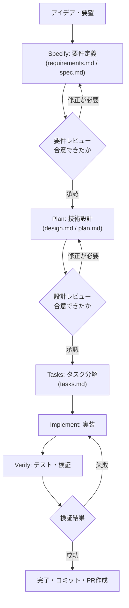
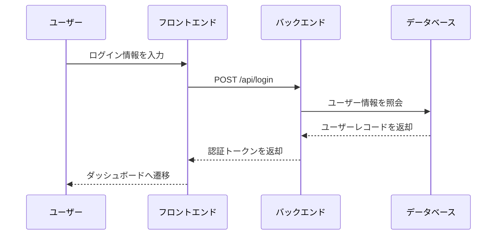
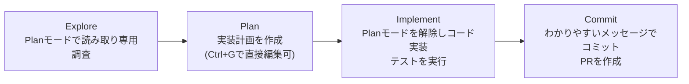
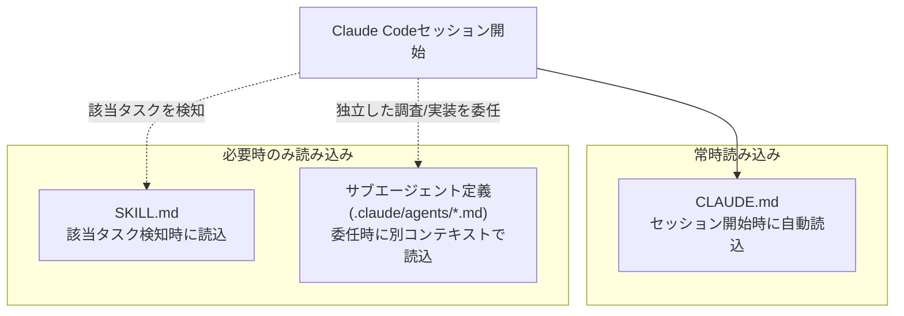
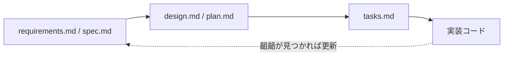

# Claude Codeで始めるAI仕様駆動開発 ― Markdownファイル完全ガイド

> 対象読者: Claude Code（またはAIコーディングエージェント全般）を使い始めた初学者〜中級エンジニア
> 本ガイドは2026年8月1日時点のWeb検索結果（Anthropic公式ドキュメント、GitHub公式ブログ、AWS公式ドキュメント、著名な国際的開発者のブログ記事等）をもとに作成しています。各章末および巻末に出典URLを記載しています。

---

## 目次

0. [はじめに ― なぜ「仕様駆動開発 × Markdown」なのか](#0-はじめに--なぜ仕様駆動開発--markdownなのか)
1. [全体像をつかむ：仕様駆動開発のワークフロー](#1-全体像をつかむ仕様駆動開発のワークフロー)
2. [ステップ0：土台を作る ― CLAUDE.md / AGENTS.md](#2-ステップ0土台を作る--claudemd--agentsmd)
3. [ステップ1：要件を書く ― requirements.md / spec.md](#3-ステップ1要件を書く--requirementsmd--specmd)
4. [ステップ2：設計する ― design.md / plan.md](#4-ステップ2設計する--designmd--planmd)
5. [ステップ3：タスクに分解する ― tasks.md](#5-ステップ3タスクに分解する--tasksmd)
6. [ステップ4：実装・検証する](#6-ステップ4実装検証する)
7. [補助的なMarkdownファイル群（早見表）](#7-補助的なmarkdownファイル群早見表)
8. [ファイルはどう読み込まれる？ ― コンテキストウィンドウの話](#8-ファイルはどう読み込まれ--コンテキストウィンドウの話)
9. [代表的な仕様駆動開発ツールの比較](#9-代表的な仕様駆動開発ツールの比較)
10. [よくある失敗パターンと対策](#10-よくある失敗パターンと対策)
11. [三段階の境界線ルール](#11-三段階の境界線ルール)
12. [初学者向け実践チェックリスト](#12-初学者向け実践チェックリスト)
13. [まとめ](#13-まとめ)
14. [参考文献・出典](#14-参考文献出典)

---

## 0. はじめに ― なぜ「仕様駆動開発 × Markdown」なのか

Claude CodeのようなAIコーディングエージェントは、ターミナルからファイルを読み書きし、コマンドを実行し、自律的にタスクを進められる強力なツールです。しかし裏を返せば、指示があいまいなまま作業を任せると「なんとなく動くコード」が生成されてしまい、後から見ると意図と違う実装になっている、という事態が起こりがちです。

Andrej Karpathy氏が2025年に提唱した「vibe coding（バイブコーディング）」という言葉は、コードの中身をほとんど確認せずAIに生成させ続けるスタイルを指します。プロトタイピングには向いていますが、本番運用のソフトウェアにそのまま持ち込むと、後から破綻する「砂上の楼閣」のようなコードになりがちだと多くの実務者が指摘しています。

これに対して登場したのが「仕様駆動開発（Spec-Driven Development, SDD）」です。コードを書かせる前に、何を・なぜ作るのかを明文化した「仕様（スペック）」をAIと人間の共通の拠り所として用意し、それを土台に設計・タスク分解・実装を進めていく考え方です。

ではなぜMarkdownなのでしょうか。理由は大きく2つあります。

1. **AIエージェントにはセッションをまたぐ記憶がない**ため、プロジェクトの文脈・決定事項・ルールをテキストファイルとして永続化しておく必要があります。Markdownはプレーンテキストでありながら見出し・箇条書き・表・コードブロックで構造化でき、人間にもAIにも読みやすいフォーマットです。
2. Claude Code、GitHub Copilot、OpenAI Codex、Cursor、Gemini CLIなど主要なAIコーディングツールが軒並み「CLAUDE.md」「AGENTS.md」といったMarkdownファイルを自動的に読み込む仕組みを標準搭載しており、事実上の業界標準になっているためです。

本ガイドでは、Claude Codeを主軸にしながら、GitHub公式の「Spec Kit」やAWSの「Kiro」など他の代表的なフレームワークとも比較しつつ、仕様駆動開発で登場する各Markdownファイルの役割・構造・書き方をステップバイステップで解説します。

---

## 1. 全体像をつかむ：仕様駆動開発のワークフロー

仕様駆動開発は、ツールによって呼び方は異なりますが、おおむね次のような流れをたどります。



この「要件 → 設計 → タスク → 実装 → 検証」という流れは、GitHub公式の開発ツールキット「Spec Kit」の `/specify → /plan → /tasks` というスラッシュコマンド群や、AWSのAI IDE「Kiro」が生成する `requirements.md → design.md → tasks.md` という3点セットにも共通する考え方です。Claude Code自体には固定のスラッシュコマンドとしてのSDDフローは同梱されていませんが、Anthropicは後述する「インタビュー形式でSPEC.mdを作る」というワークフローを推奨しており、考え方の骨格は同じです。

### vibe codingとの違い

| 観点 | vibe coding（バイブコーディング） | 仕様駆動開発（SDD） |
| --- | --- | --- |
| 開始点 | 思いついたことをそのままプロンプトに書く | 目的・ユーザー・成功条件を明文化してから着手 |
| コードレビュー | 省略されがち | 各フェーズでレビュー・承認ゲートを設ける |
| 向いている場面 | プロトタイプ、使い捨てのスクリプト、探索的な検証 | 複数ファイルにまたがる機能開発、チーム開発、本番運用コード |
| 変更履歴の追跡 | 難しい（会話ログに埋もれる） | 仕様ファイルをGit管理するため`git diff`で変更理由を追跡できる |
| リスク | 「なんとなく動くが説明できないコード」になりやすい | 仕様と実装の乖離を早期に発見しやすい |

Simon Willison氏（Djangoの共同開発者、Datasetteの開発者）は、AIが書いたコードであっても人間がレビュー・理解していれば「タイピングを代行してもらっているだけ」であり問題ないが、レビューをせずに動くコードを積み上げる行為こそが本来の意味での「vibe coding」だと整理しています。つまりvibe codingと仕様駆動開発は対立概念というより、タスクの重要度に応じて使い分けるべきグラデーションだと捉えるのが実務的です。

---

## 2. ステップ0：土台を作る ― CLAUDE.md / AGENTS.md

コードを1行も書く前に、まずプロジェクト全体に効くルールを1つのMarkdownファイルにまとめておきます。これが仕様駆動開発の「地盤」になります。

### 2.1 CLAUDE.mdとは

`CLAUDE.md` はClaude Codeがセッション開始時に自動的に読み込む特別なファイルです。ビルドコマンド、コーディング規約、ワークフロー上のルールなど、コードを読むだけでは推測できない情報を書いておく場所として設計されています。

- `/init` コマンドを実行すると、既存のプロジェクト構成を解析してたたき台となるCLAUDE.mdを自動生成してくれます。
- 決まったフォーマットはありませんが、短く・人間にも読みやすく保つことが推奨されています。
- `/context` コマンドでCLAUDE.mdが実際に読み込まれているか確認できます。

CLAUDE.mdは**毎回のセッションで必ず読み込まれる**ため、書きすぎるとコンテキストを圧迫し、逆に指示が埋もれて無視されやすくなります。Anthropicは「この1行を消したらClaudeがミスをするか？」を基準に、答えがNoなら削るようにと助言しています。

### 2.2 CLAUDE.mdの配置場所

| 配置場所 | 適用範囲 | Gitでの扱い |
| --- | --- | --- |
| `~/.claude/CLAUDE.md` | すべてのプロジェクトに共通する個人設定 | リポジトリには含めない |
| `./CLAUDE.md`（プロジェクトルート） | プロジェクト全体、チームで共有するルール | コミットしてチームで共有する |
| `./CLAUDE.local.md` | 個人的なメモ・一時的な指示 | `.gitignore`に入れて共有しない |
| モノレポの親ディレクトリの`CLAUDE.md` | モノレポ全体に共通するルール | コミットする（自動的に読み込まれる） |
| 子ディレクトリの`CLAUDE.md` | そのサブディレクトリ配下の作業時のみ | コミットする（該当ディレクトリのファイルを読む際にオンデマンドで読み込まれる） |

### 2.3 書くべきこと・書かないこと

| ✅ 書くべきこと | ❌ 書かないほうがよいこと |
| --- | --- |
| Claudeが推測できないビルド・テストコマンド | コードを読めば分かること |
| プロジェクト固有のコーディング規約（デフォルトと異なる部分） | 一般的な言語の作法（Claudeが既に知っていること） |
| テストの実行方法・優先するテストランナー | 詳細なAPI仕様（ドキュメントへのリンクで十分） |
| ブランチ命名やPRのルールなどのリポジトリ運用 | 頻繁に変わる情報 |
| プロジェクト固有のアーキテクチャ上の決定事項 | 長い解説やチュートリアル |
| 開発環境特有の癖（必須の環境変数など） | ファイル単位の説明の羅列 |
| よくあるハマりどころ・非自明な挙動 | 「きれいなコードを書く」のような自明な心構え |

Claudeが何度も同じ間違いを繰り返すなら、CLAUDE.mdが長すぎてルールが埋もれている可能性が高い、というのがAnthropicの経験則です。逆にClaudeがCLAUDE.mdに書いてあることをわざわざ質問してくる場合は、表現があいまいな可能性があります。「IMPORTANT」「YOU MUST」のような強調語を使うと、指示への追従度を上げられるとされています。

### 2.4 `@import`構文でファイルを分割する

CLAUDE.mdが肥大化してきたら、`@path/to/file` という記法で他のMarkdownファイルを読み込ませ、関心ごとに分割できます。例えば「READMEの概要は`@README.md`を参照」「Gitワークフローは`@docs/git-instructions.md`を参照」といった形で、CLAUDE.md本体をスリムに保ちながら詳細情報を別ファイルに逃がすことができます。

### 2.5 AGENTS.md ― ツール横断のオープン標準

`CLAUDE.md`がClaude Code専用であるのに対し、`AGENTS.md`はOpenAI Codex、Cursor、Gemini CLI、Google Jules、Amp、Factoryなど複数のAIコーディングツールが共通で読み込める、いわば「エージェント向けREADME」を目指すオープン標準です。現在はLinux Foundation傘下のAgentic AI Foundationが管理を引き継いでいます。

特徴は以下の通りです。

- 中身は素のMarkdownで、必須のフィールドや見出し構成は存在しない。
- モノレポでは各ディレクトリにネストして配置でき、編集対象のファイルから見て**最も近い階層のAGENTS.mdが優先**される（OpenAIの自社リポジトリでは88個ものAGENTS.mdファイルが使われている）。
- README.mdが人間向けの入口であるのに対し、AGENTS.mdはビルド手順・テスト方法・規約などAIエージェントが必要とする詳細情報を切り出す場所と位置づけられている。
- Claude Codeを含む30以上のツールがこの形式を読み込めるため、複数のAIツールを併用するチームでは「まずAGENTS.mdを整備し、Claude Code固有の機能が必要な場合だけCLAUDE.mdを追加する」という運用がすすめられています。

| ファイル | 主な対象ツール | 必須フォーマット |
| --- | --- | --- |
| `CLAUDE.md` | Claude Code | 自由形式（`@import`対応） |
| `AGENTS.md` | Codex, Cursor, Gemini CLI, Jules, Claude Code(インポート経由)ほか30以上 | 自由形式のMarkdown |
| `.github/copilot-instructions.md` | GitHub Copilot | 自由形式のMarkdown |

GitHubが2,500以上の公開リポジトリの`agents.md`系ファイルを分析したところ、うまく機能しているファイルには共通点があることが分かりました。詳しくは3章・11章で扱います。

**出典:** [Anthropic公式 - Claude Code Best Practices](https://www.anthropic.com/engineering/claude-code-best-practices) / [AGENTS.md公式サイト](https://agents.md/) / [GitHub Blog - How to write a great agents.md](https://github.blog/ai-and-ml/github-copilot/how-to-write-a-great-agents-md-lessons-from-over-2500-repositories/)

---

## 3. ステップ1：要件を書く ― requirements.md / spec.md

土台ができたら、次に取り組むのが「何を、誰のために、なぜ作るのか」を定義する要件定義ファイルです。

### 3.1 「何を」より先に「なぜ」を書く

Googleで14年以上エンジニアリング・エバンジェリズムを率いた経験を持つAddy Osmani氏は、AIエージェント向けの仕様は技術スタックの詳細から入るのではなく、まず高レベルのビジョン（誰が使うのか、どんな課題を解決するのか、成功とは何か）から始め、そこからAI自身に詳細な仕様案を作らせるという進め方を推奨しています。GitHub公式の考え方も同様で、`/specify`フェーズではユーザー体験や成功条件にフォーカスし、技術的な実装方法にはまだ踏み込まないとされています。

Claude Codeでは、この「たたき台を対話で作る」プロセスを次のように行うのが効果的だとAnthropicは案内しています。

1. Claudeに「〇〇を作りたい。`AskUserQuestion`ツールを使って技術的な実装、UI/UX、エッジケース、トレードオフについて詳しくインタビューしてほしい」と依頼する。
2. 一通り質問と回答が終わったら、その内容を`SPEC.md`としてまとめてもらう。
3. 実装は新しいセッションで始める。こうすることで、インタビューの会話履歴に邪魔されない、まっさらなコンテキストで実装に集中できる。

### 3.2 EARS記法で受け入れ基準を書く

要件をあいまいなまま箇条書きするのではなく、「EARS（Easy Approach to Requirements Syntax）」と呼ばれる定型文で書くと、人間にもAIにも解釈のブレが生じにくくなります。AWSの開発ツール「Kiro」はこの記法を`requirements.md`の標準フォーマットとして採用しています。基本パターンは次の通りです。

> `WHEN [イベント/条件] THE SYSTEM SHALL [期待される振る舞い]`

### 3.3 requirements.md / spec.mdのテンプレート例

```markdown
# 要件定義書: ユーザー認証機能

## 背景・目的
既存のゲスト利用のみのアプリに会員登録機能を追加し、
ユーザーごとにデータを保存できるようにしたい。

## ユーザーストーリー
- 会員として、メールアドレスとパスワードでログインしたい。
  なぜなら、自分のデータを次回訪問時にも参照したいから。

## 受け入れ基準（EARS記法）
- WHEN ユーザーが正しいメールアドレスとパスワードを入力したとき
  THE SYSTEM SHALL ログインを許可しダッシュボードへ遷移する
- WHEN ユーザーが5回連続でログインに失敗したとき
  THE SYSTEM SHALL 該当アカウントを15分間ロックする
- WHEN パスワードが8文字未満のとき
  THE SYSTEM SHALL 登録エラーを表示し登録を拒否する

## スコープ外（今回は対応しない）
- ソーシャルログイン（Google/GitHub連携）
- 二要素認証

## 成功指標
- 新規登録完了率
- ログイン失敗によるサポート問い合わせ件数の減少
```

### 3.4 抜け漏れを防ぐ「6つの必須領域」

GitHubが2,500以上のリポジトリの`agents.md`系ファイルを分析した結果、うまく機能している仕様ファイルは次の6領域を押さえていることが分かりました。これは主にCLAUDE.md/AGENTS.md向けの知見ですが、要件定義ファイルを書く際のセルフチェックリストとしても有効です。

| # | 領域 | 内容の例 |
| --- | --- | --- |
| 1 | コマンド | `npm test` のようにフラグまで含めた実行可能なコマンド |
| 2 | テスト | 使用するテストフレームワーク、テストファイルの置き場所 |
| 3 | プロジェクト構成 | ソース・テスト・ドキュメントの配置ルール |
| 4 | コードスタイル | 説明文より実際のコード例を1つ示すほうが伝わる |
| 5 | Gitワークフロー | ブランチ命名規則、コミットメッセージ形式、PR要件 |
| 6 | 境界線 | 触ってはいけない領域（後述の11章参照） |

**出典:** [Addy Osmani - How to write a good spec for AI agents](https://addyosmani.com/blog/good-spec/) / [Anthropic公式 - Claude Code Best Practices](https://www.anthropic.com/engineering/claude-code-best-practices) / [AWS Kiro Docs - Feature Specs](https://kiro.dev/docs/specs/feature-specs/) / [GitHub Blog - How to write a great agents.md](https://github.blog/ai-and-ml/github-copilot/how-to-write-a-great-agents-md-lessons-from-over-2500-repositories/)

---

## 4. ステップ2：設計する ― design.md / plan.md

要件が固まったら、それを技術的にどう実現するかを`design.md`（Kiro流の呼び方）または`plan.md`（GitHub Spec Kit流の呼び方）にまとめます。ここでようやく技術スタックやアーキテクチャの話に踏み込みます。

### 4.1 design.md / plan.mdに書くべき項目

| 項目 | 説明 |
| --- | --- |
| アーキテクチャ概要 | どのコンポーネントがどう連携するか |
| データモデル | テーブル構造、エンティティ間の関係 |
| API/インターフェース仕様 | エンドポイント、リクエスト/レスポンスの形 |
| 技術スタックと採用理由 | バージョンまで明記する（例:「React 18」であって「Reactプロジェクト」ではない） |
| 非機能要件への対応 | パフォーマンス、セキュリティ、可用性など |
| 代替案の検討記録 | なぜその設計を選び、他の案を採らなかったか |

### 4.2 design.mdの中にMermaid図を埋め込む

design.md自体もMarkdownファイルなので、Mermaidのシーケンス図やER図をそのまま埋め込めます。文章だけで説明するより、処理の流れが一目で分かるようになります。



GitHub Spec Kitの`/plan`コマンドは、要件仕様(`spec.md`)を読み込み、リサーチ結果(`research.md`)・データモデル(`data-model.md`)・APIコントラクト(`contracts/`)などをまとめて`plan.md`として出力する、という複数ファイル構成を採用しています。プロジェクトの規模に応じて、design.mdを1ファイルにまとめるか、Spec Kitのように関心ごとに分割するかを選ぶとよいでしょう。

**出典:** [Addy Osmani - How to write a good spec for AI agents](https://addyosmani.com/blog/good-spec/) / [GitHub spec-kit - plan-template.md](https://github.com/github/spec-kit/blob/main/templates/plan-template.md) / [AWS Kiro Docs - Specs](https://kiro.dev/docs/specs/)

---

## 5. ステップ3：タスクに分解する ― tasks.md

設計ができたら、実装を一気に進めるのではなく、小さく検証可能な単位に分解します。この分解結果を書き留めるのが`tasks.md`です。

### 5.1 なぜ分解が必要なのか

Addy Osmani氏は、1つのプロンプトに要件・設計・実装指示すべてを詰め込むと、モデルが指示の一部を無視し始める「curse of instructions（指示の呪い）」と呼ばれる現象が起きやすいと指摘しています。タスクを1つずつ小さく渡し、都度検証していくほうが、結果的に品質も速度も安定するとされています。

### 5.2 tasks.mdのテンプレート例

各タスクには、対応する要件番号を紐付けておくと、実装があとから「なぜこの処理があるのか」を追跡しやすくなります（トレーサビリティ）。これはKiroやGitHub Spec Kitでも重視されている考え方です。

```markdown
# 実装タスク: ユーザー認証機能

- [ ] 1. usersテーブルをマイグレーションで作成する（要件: REQ-001）
      - 依存: なし
- [ ] 2. パスワードハッシュ化ユーティリティを実装する（要件: REQ-001）
      - 依存: タスク1
- [ ] 3. ログインAPIエンドポイントを実装する（要件: REQ-001, REQ-002）
      - 依存: タスク1, タスク2
- [ ] 4. ログイン失敗5回でのアカウントロック処理を実装する（要件: REQ-003）
      - 依存: タスク3
- [ ] 5. E2Eテスト（ログイン成功・失敗・ロック）を実装する（要件: REQ-001, REQ-003）
      - 依存: タスク3, タスク4
```

### 5.3 依存関係のない作業は並列化できる

AWSのKiroは、`tasks.md`内のタスク間の依存関係を自動的にグラフ化し、依存関係のないタスク同士を「ウェーブ（波）」としてまとめて並列実行する機能を備えています。Claude Codeでも同様の考え方で、独立したタスクごとに複数セッションやサブエージェントへ作業を振り分けることで、全体の所要時間を短縮できます（8章・9章で詳述）。

**出典:** [Addy Osmani - How to write a good spec for AI agents](https://addyosmani.com/blog/good-spec/) / [AWS Kiro Docs - Specs](https://kiro.dev/docs/specs/) / [GitHub - spec-based-claude-code](https://github.com/papaoloba/spec-based-claude-code)

---

## 6. ステップ4：実装・検証する

仕様とタスクが揃ったら、いよいよ実装フェーズです。Anthropicは公式ガイドで次の4段階のワークフローを推奨しています。



- **Explore（調査）**: Plan Mode（読み取り専用モード）に入り、関連コードを読ませて質問に答えさせる。この段階ではファイルは一切変更されない。
- **Plan（計画）**: 「〇〇を実装したい。どのファイルを変更する必要があるか、詳細な計画を作って」と依頼する。`Ctrl+G`でエディタを開き、生成された計画を人間が直接編集できる。
- **Implement（実装）**: Plan Modeを解除し、計画に沿ってコードを書かせ、テストも実行・修正させる。
- **Commit（コミット）**: わかりやすいコミットメッセージでコミットし、PRを作成させる。

タスクの範囲が明確で変更が小さい場合（誤字修正、ログ追加、変数名の変更など）は、計画フェーズを省略してそのまま実装させても構わないともAnthropicは補足しています。「差分を1文で説明できるならPlanは飛ばしてよい」という目安が示されています。

### 6.1 検証基準を渡す

Claudeは「完了したように見える」ことを完了の判断材料にしてしまいがちです。テスト・ビルド・スクリーンショット比較など、合否を機械的に判定できる「チェック」を与えることで、Claude自身がコード→テスト→修正のループを自走できるようになります。

| 悪い例 | 良い例 |
| --- | --- |
| 「メールアドレスを検証する関数を実装して」 | 「validateEmail関数を実装して。`user@example.com`はtrue、`invalid`はfalse、`user@.com`はfalseになるようにし、実装後にテストを実行して」 |
| 「ダッシュボードをもっと良い見た目にして」 | 「（スクリーンショットを添付）このデザイン通りに実装して。実装後にスクリーンショットを撮り、元のデザインと比較して差分をリストアップし修正して」 |
| 「ビルドが失敗している」 | 「ビルドがこのエラーで失敗している：（エラーを貼り付け）。原因を直してビルドが通ることを確認して。エラーを握りつぶすのではなく根本原因を直して」 |

### 6.2 第三者視点でのレビュー

実装したのと同じ会話の中でレビューさせると、Claudeは自分が書いたコードに引っ張られがちです。会話履歴を持たない新しいサブエージェントに、実装の差分と検証基準だけを渡してレビューさせることで、より客観的な指摘が得られます。「差分を計画書と突き合わせ、要件がすべて実装されているか、指定したエッジケースにテストがあるか、範囲外の変更が紛れ込んでいないかを確認して」といった形で依頼すると効果的です。

**出典:** [Anthropic公式 - Claude Code Best Practices](https://www.anthropic.com/engineering/claude-code-best-practices)

---

## 7. 補助的なMarkdownファイル群（早見表）

ここまで登場したファイルに加え、Claude Codeのエコシステムには目的別のMarkdownファイルがいくつも存在します。全体像を1つの表にまとめます。

| ファイル | 主な役割 | 読み込まれるタイミング |
| --- | --- | --- |
| `CLAUDE.md` | プロジェクト共通ルール、コマンド、規約 | 毎セッション開始時に自動読み込み |
| `CLAUDE.local.md` | 個人用の一時的な指示 | 毎セッション開始時（Git管理外） |
| `AGENTS.md` | ツール横断の共通ルール | 対応する各種AIツールが自動読み込み |
| `.claude/skills/<name>/SKILL.md` | 特定ドメイン・特定タスクの知識やワークフロー | 関連するタスクを検知した時にオンデマンドで読み込み |
| `.claude/agents/<name>.md` | サブエージェント（専門特化アシスタント）の定義 | サブエージェントへの委任時に、独立したコンテキストで読み込み |
| `requirements.md` / `spec.md` | 何を・なぜ作るか（要件） | 各フェーズの冒頭でAIと人間が参照 |
| `design.md` / `plan.md` | どう作るか（技術設計） | 実装前に参照 |
| `tasks.md` | 実装単位への分解、進捗管理 | 実装フェーズ全体を通して参照・更新 |
| `constitution.md` | プロジェクトの不変原則（GitHub Spec Kit流） | 各フェーズの整合性チェック時に参照 |
| `SPEC.md` | インタビュー形式で作る一枚仕様書（Claude Code流の簡易版） | 実装セッション開始時に参照 |
| `README.md` | 人間（開発者）向けのプロジェクト概要 | 人間が読む。AGENTS.mdと役割を分担 |

**出典:** [Anthropic公式 - Claude Code Best Practices](https://www.anthropic.com/engineering/claude-code-best-practices) / [GitHub - spec-kit](https://github.com/github/spec-kit/blob/main/spec-driven.md) / [AGENTS.md公式サイト](https://agents.md/)

---

## 8. ファイルはどう読み込まれる？ ― コンテキストウィンドウの話

なぜファイルを分ける必要があるのか、その理由はClaude Codeの「コンテキストウィンドウ」の仕組みにあります。

Claudeとの会話・読み込んだファイル・コマンドの実行結果はすべて同じコンテキストウィンドウに蓄積されます。これは有限であり、埋まってくるほどClaudeの応答品質は劣化していきます。長時間のデバッグセッションだけで数万トークンを消費することも珍しくありません。

そのため、Claude Codeのファイル群は「常に読み込むもの」と「必要な時だけ読み込むもの」に意図的に分けて設計されています。



- **CLAUDE.md**は毎セッション必ずコンテキストに乗るため、「広く一般的に当てはまること」だけを書く。
- **SKILL.md**（`.claude/skills/`配下）は、特定ドメインの知識やワークフローを必要な時だけ読み込む「オンデマンド読み込み」の仕組みで、CLAUDE.mdを圧迫しません。
- **サブエージェント**（`.claude/agents/`配下）は、それぞれが独自のコンテキストウィンドウを持つため、大量のファイルを読む調査作業やレビュー作業をメインの会話から切り離せます。

このほか、`/clear`で無関係なタスクの間に文脈をリセットする、`/compact`で会話を要約して圧縮する、2回同じ指摘をしても直らない場合は`/clear`してより具体的なプロンプトで仕切り直す、といった運用がAnthropicから推奨されています。

**出典:** [Anthropic公式 - Claude Code Best Practices](https://www.anthropic.com/engineering/claude-code-best-practices) / [Anthropic公式 - How Claude Code works in large codebases](https://claude.com/blog/how-claude-code-works-in-large-codebases-best-practices-and-where-to-start)

---

## 9. 代表的な仕様駆動開発ツールの比較

仕様駆動開発という考え方自体は複数のツール・ベンダーが実装しており、それぞれ生成するMarkdownファイルの名前や流儀が微妙に異なります。代表的な3つを比較します。

| | Claude Code（インタビュー形式） | GitHub Spec Kit | AWS Kiro |
| --- | --- | --- | --- |
| 提供元 | Anthropic | GitHub | AWS |
| 主要ファイル | `SPEC.md` | `constitution.md`, `spec.md`, `plan.md`, `tasks.md` | `requirements.md`, `design.md`, `tasks.md` |
| 要件の記法 | 自由記述（AIとの対話で作成） | ユーザー体験・成功条件中心の自由記述 | EARS記法（`WHEN ... THE SYSTEM SHALL ...`） |
| フェーズ間のゲート | 人間が都度レビュー | 各コマンド実行前に前段の承認状況をチェック | フェーズごとに承認、または`Quick Spec`で一括自動実行も可 |
| 整合性チェック | サブエージェントによるレビュー依頼 | `/speckit.analyze`で仕様・計画・タスクと憲章の整合性を検証 | タスクの依存関係を自動解析し実行順序を決定 |
| 特徴的な概念 | Plan Mode、`AskUserQuestion`ツール | `constitution.md`＝プロジェクトの不変原則（9つの条項） | 独立タスクの並列実行「ウェーブ」 |



GitHub Spec Kitの`constitution.md`は、テスト方針やCLIファーストといった「プロジェクトが絶対に譲れない原則」を、コーディング開始前に定義しておくファイルです。ソフトウェア開発の専門家であるGojko Adzic氏は、Spec Kit登場時のブログ投稿で、こうした仕様駆動開発の潮流はビヘイビア駆動開発（BDD）の延長線上にある合理的な進化だと評価しつつも、フェーズを厳密に区切りすぎるとアジャイル以前のウォーターフォール型開発が持っていた硬直性を再導入しかねない、という懸念も示しています。実務では、小さな変更にまで律儀にフェーズをすべて踏襲するのではなく、タスクの複雑さに応じて仕様の厚みを調整するバランス感覚が重要です。

**出典:** [GitHub - spec-kit (spec-driven.md)](https://github.com/github/spec-kit/blob/main/spec-driven.md) / [AWS Kiro Docs - Specs](https://kiro.dev/docs/specs/) / [Tessl - A look at Spec Kit](https://tessl.io/blog/a-look-at-spec-kit-githubs-spec-driven-software-development-toolkit/) / [Microsoft Learn - Spec-Driven Development and GitHub Spec Kit](https://learn.microsoft.com/en-us/training/modules/spec-driven-development-github-spec-kit-greenfield-intro/)

---

## 10. よくある失敗パターンと対策

Anthropic公式ガイドおよびAddy Osmani氏の記事から、初学者が陥りやすい失敗パターンと対策をまとめます。

| 失敗パターン | 症状 | 対策 |
| --- | --- | --- |
| 何でも詰め込みセッション | 1つのタスクの途中で無関係な話題を挟み、コンテキストが雑多な情報で埋まる | 無関係なタスクの間は`/clear`する |
| 同じ指摘の繰り返し | 間違いを指摘しても直らず、何度も訂正するうちに失敗した試みが文脈に蓄積する | 2回訂正しても直らなければ`/clear`し、学んだことを盛り込んだ具体的なプロンプトで仕切り直す |
| 肥大化したCLAUDE.md | ルールが長すぎて重要な指示が埋もれ、Claudeが無視するようになる | 「削っても問題ないか」を基準に容赦なく整理する。既に守れている指示は削除するかフックに置き換える |
| 「信じて→あとで検証」のギャップ | 一見もっともらしい実装がエッジケースを処理できていない | テスト・スクリプト・スクリーンショットなど検証手段を必ず用意する。検証できないものはリリースしない |
| 無限探索 | 「〇〇を調査して」とだけ依頼し、範囲を絞らないままClaudeが大量のファイルを読み込みコンテキストを消費する | 調査範囲を狭く指定するか、サブエージェントに任せてメインの文脈を汚さないようにする |
| あいまいなプロンプト | 「いい感じに作って」のような指示は拠り所がなく誤った成果物になりやすい | 入力・出力・制約を具体的に書く。役割（ペルソナ）まで指定すると精度が上がる |
| 要約なしの長すぎる文脈 | 数十ページのドキュメントをそのまま貼り付け、モデルが要点を拾えなくなる | 階層的な要約（目次＋各セクションの要点）を作り、必要な部分だけを都度渡す |
| 人間によるレビューの省略 | テストが通っているというだけで安全だと思い込んでしまう | 重要なコードパスは必ず人間が目を通す。「他人に説明できないコードはコミットしない」という原則を持つ |

**出典:** [Anthropic公式 - Claude Code Best Practices](https://www.anthropic.com/engineering/claude-code-best-practices) / [Addy Osmani - How to write a good spec for AI agents](https://addyosmani.com/blog/good-spec/)

---

## 11. 三段階の境界線ルール

「絶対にやってはいけないこと」を単純な禁止リストとして並べるだけでは不十分だと、GitHubの分析（2,500以上のリポジトリの`agents.md`）は指摘しています。うまく機能しているファイルは、行動を3段階に分けて明示しているのが特徴です。

| レベル | 意味 | 記述例 |
| --- | --- | --- |
| ✅ 常にやってよい | 確認なしで進めてよい行動 | 「コミット前に必ずテストを実行する」「命名規則に従う」 |
| ⚠️ 確認してから | 人間の承認が必要な行動 | 「データベーススキーマの変更は事前に確認する」「新しい依存関係の追加は事前に確認する」 |
| 🚫 絶対にダメ | ハードストップ、例外なし | 「シークレットやAPIキーをコミットしない」「`node_modules/`や`vendor/`を編集しない」 |

GitHubの分析では、「シークレットをコミットしない」が最も頻出する制約だったと報告されています。この三段階方式を使うと、Claudeは「常にやってよいこと」には迷わず進み、「確認してから」は立ち止まって人間に相談し、「絶対にダメ」は問答無用で回避する、というメリハリのある振る舞いを取りやすくなります。CLAUDE.md、AGENTS.md、requirements.mdのいずれに書いてもかまいませんが、少なくともプロジェクトに1箇所は必ず明文化しておくことが推奨されます。

**出典:** [GitHub Blog - How to write a great agents.md](https://github.blog/ai-and-ml/github-copilot/how-to-write-a-great-agents-md-lessons-from-over-2500-repositories/) / [Addy Osmani - How to write a good spec for AI agents](https://addyosmani.com/blog/good-spec/)

---

## 12. 初学者向け実践チェックリスト

はじめて仕様駆動開発をClaude Codeで試す場合、次の順番で進めるとつまずきにくいです。

- [ ] プロジェクトルートで`/init`を実行し、たたき台となるCLAUDE.mdを生成する
- [ ] CLAUDE.mdを見直し、「消しても問題ない行」を削って短く保つ
- [ ] 三段階の境界線（✅常に/⚠️確認/🚫絶対にダメ）を最低限書く
- [ ] 複数のAIツールを併用するなら、`AGENTS.md`も検討する
- [ ] 新機能を作る前に、Plan Modeまたはインタビュー形式でAIに質問させ、`SPEC.md`（または`requirements.md`）を作る
- [ ] 要件をレビューし、あいまいな箇所を修正する（可能ならEARS記法で受け入れ基準を書く）
- [ ] 技術設計を`design.md`（または`plan.md`）にまとめ、必要ならMermaid図を添える
- [ ] 設計を小さなタスクに分解し、`tasks.md`にチェックボックス形式で書き出す
- [ ] Plan Modeを解除して実装を進め、テストやスクリーンショットなど検証可能な基準を都度与える
- [ ] 実装が終わったら、新しいセッション（サブエージェント）にレビューを依頼する
- [ ] コミットメッセージとPRの説明にも、仕様との対応関係が分かるよう書く
- [ ] うまくいかなかった箇所は、次回の仕様の書き方に反映させる（仕様は一度書いたら終わりではなく、生きたドキュメントとして更新し続ける）

---

## 13. まとめ

仕様駆動開発は「AIに丸投げする」対極にある考え方です。要件・設計・タスクという3つのMarkdownファイルを軸に、人間がどのフェーズでも立ち止まってレビューできる「ゲート」を用意し、CLAUDE.md/AGENTS.mdでプロジェクト全体のルールを、SKILL.mdやサブエージェント定義で専門知識を、それぞれ適切な粒度でAIに渡していく――これが2026年8月時点での実務的なベストプラクティスの共通項です。

最初から完璧な仕様書を書く必要はありません。Addy Osmani氏が述べるように、まずは高レベルな目的をAIに渡し、AI自身に詳細化させ、それを人間がレビューして磨き込んでいくという反復こそが、仕様駆動開発を継続可能にする鍵です。

---

## 14. 参考文献・出典

本ガイドの作成にあたり、2026年8月1日時点で以下の情報源をWeb検索・閲覧しました。

**Anthropic公式**
- Claude Code Best Practices（Anthropicエンジニアリングブログ）: https://www.anthropic.com/engineering/claude-code-best-practices
- 上記の最新版ドキュメント: https://code.claude.com/docs/en/best-practices
- How Claude Code works in large codebases: https://claude.com/blog/how-claude-code-works-in-large-codebases-best-practices-and-where-to-start

**GitHub公式**
- spec-kit（GitHub公式リポジトリ, spec-driven.md）: https://github.com/github/spec-kit/blob/main/spec-driven.md
- spec-kit plan-template.md: https://github.com/github/spec-kit/blob/main/templates/plan-template.md
- GitHub Blog - How to write a great agents.md: Lessons from over 2,500 repositories: https://github.blog/ai-and-ml/github-copilot/how-to-write-a-great-agents-md-lessons-from-over-2500-repositories/

**AWS公式（Kiro）**
- Kiro Docs - Specs: https://kiro.dev/docs/specs/
- Kiro Docs - Feature Specs: https://kiro.dev/docs/specs/feature-specs/
- Harness Engineering with Kiro（AWS Builder Center）: https://builder.aws.com/content/3DlOO7A9RFAazBbwbNl2iV8WHr9/harness-engineering-with-kiro-spec-driven-development-for-the-multi-agent-era

**著名な国際的開発者による記事**
- Addy Osmani（元Google Director、『Beyond Vibe Coding』著者）- How to write a good spec for AI agents: https://addyosmani.com/blog/good-spec/
- Simon Willison（Django共同開発者、Datasette開発者）- Agentic Engineering Patterns: https://simonw.substack.com/p/agentic-engineering-patterns

**オープン標準・その他**
- AGENTS.md公式サイト: https://agents.md/
- Microsoft Learn - Get Started with Spec-Driven Development and GitHub Spec Kit: https://learn.microsoft.com/en-us/training/modules/spec-driven-development-github-spec-kit-greenfield-intro/
- Tessl - A look at Spec Kit, GitHub's spec-driven software development toolkit（Gojko Adzic氏の見解を含む）: https://tessl.io/blog/a-look-at-spec-kit-githubs-spec-driven-software-development-toolkit/

> 本ガイドはこれら一次情報・信頼できる情報源をもとに要約・翻訳・再構成したものであり、原文からの長文引用は行っていません。より正確な最新情報を確認したい場合は、各URLの原文を直接ご参照ください。
