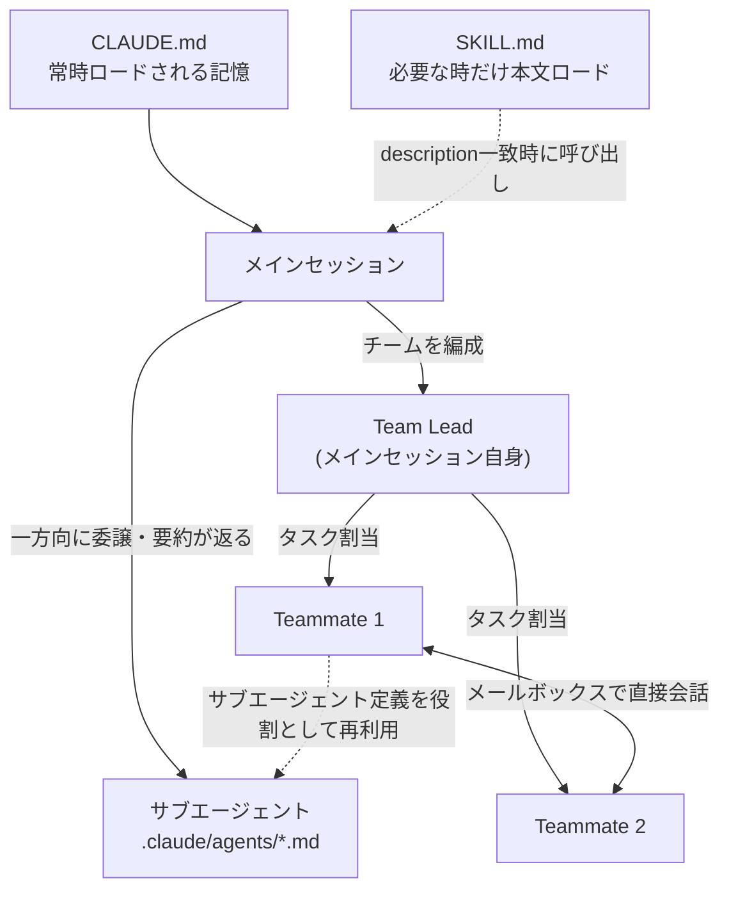
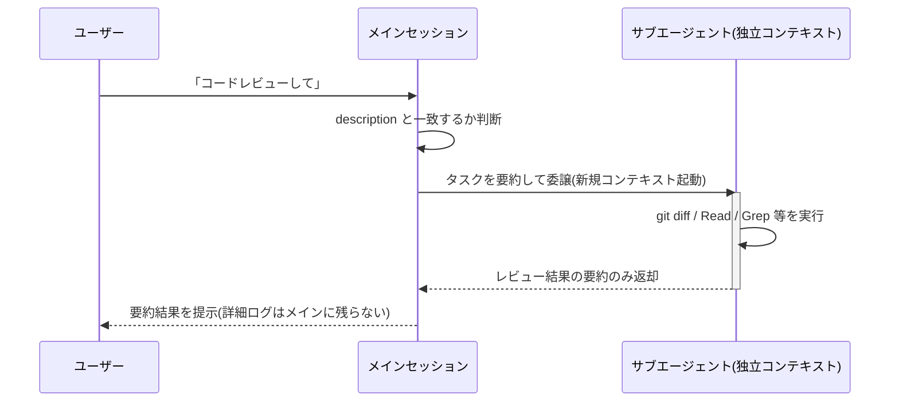
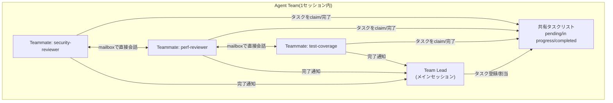
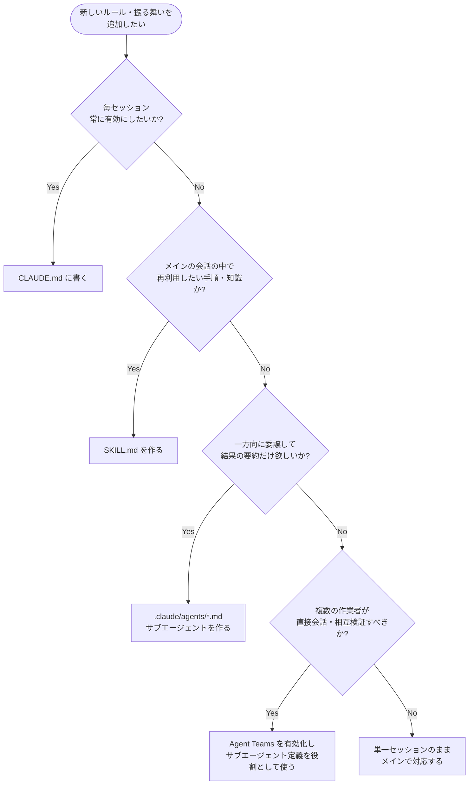

# サブエージェント & Agent Teams 開発における Markdown ファイル ベストプラクティス

> 対象読者:Claude Code は使ったことがあるが、`.claude/agents/*.md` や `CLAUDE.md`、Agent Teams をこれから本格的に使い始める初学者エンジニア
> 前提バージョン:本ガイドは 2026年7月25日 時点の Claude Code 公式ドキュメント(v2.1系)および著名な開発者・企業ブログの情報をもとに作成しています。Agent Teams は依然として実験的機能(experimental / research preview)であり、仕様は今後変更される可能性があります。

---

## 1. はじめに

Claude Code を「1人のエンジニア」から「チーム」へと拡張する際、鍵になるのは **Markdownファイル** です。

- `CLAUDE.md` … プロジェクトの長期記憶(常時ロード)
- `.claude/agents/*.md` … サブエージェントの定義(YAML frontmatter + プロンプト本文)
- `SKILL.md` … 再利用可能な手順・知識(必要な時だけロード)
- Agent Teams … 上記の資産(特にサブエージェント定義)を土台に、複数の独立したセッションを協調させる仕組み

これらはすべて「YAML frontmatter + Markdown本文」という共通のフォーマットを持っています。本ガイドでは、この設計思想を理解した上で、初学者でも迷わず良いMarkdownファイルを書けるようにステップバイステップで解説します。

---

## 2. 全体像:4つの拡張レイヤーとMarkdownの役割

Claude Code の拡張は、大きく4つのレイヤーに整理できます。どのレイヤーも「Markdownで振る舞いを定義する」という共通点がありますが、**ロードされるタイミングと目的**が異なります。

| レイヤー | ファイル | 主な置き場所 | ロードのタイミング | 主な用途 |
|---|---|---|---|---|
| プロジェクト記憶 | `CLAUDE.md` | プロジェクトルート、`~/.claude/`、任意の親/子ディレクトリ | セッション開始時に常時ロード | 常に守ってほしいルール・規約・コマンド集 |
| 再利用可能な手順 | `SKILL.md` | `.claude/skills/<name>/SKILL.md` | frontmatterの`description`に一致した時のみ本文をロード(段階的開示) | ドメイン知識・繰り返す作業手順 |
| サブエージェント | `.claude/agents/*.md` | プロジェクト/ユーザー/プラグイン/管理設定 | 委譲(delegate)された瞬間に、独立したコンテキストで起動 | 一方向委譲・調査やレビューの隔離 |
| Agent Teams | サブエージェント定義を`teammate`として再利用 | 上記と同じ(専用ファイルは無し) | `CLAUDE_CODE_EXPERIMENTAL_AGENT_TEAMS=1`有効時 | 複数セッションが対話しながら協調作業 |



> ポイント:`SKILL.md`は「同じ会話の中で読み込む知識」、`.claude/agents/*.md`は「別の独立したコンテキストに投げる仕事」です。この違いを理解しておくと、以降のステップが飲み込みやすくなります。

---

## 3. ステップ1:`CLAUDE.md` を書く ― プロジェクトの"長期記憶"

### 3.1 置き場所と階層

`CLAUDE.md` は複数の場所に置くことができ、Claude Code はそれらをマージして読み込みます。

| 置き場所 | スコープ | 用途の例 |
|---|---|---|
| `~/.claude/CLAUDE.md` | 全プロジェクト共通(個人設定) | 自分だけのコーディング流儀 |
| `<repo>/CLAUDE.md` | プロジェクト全体 | チーム共通の規約・コマンド集 |
| `<repo>/<subdir>/CLAUDE.md` | サブディレクトリ配下のみ | モノレポの各パッケージ固有ルール |
| `CLAUDE.local.md` | 個人用(通常 `.gitignore` 対象) | 自分のローカル環境固有のメモ |

モノレポでは「実行ディレクトリより上の親」だけでなく「下の子ディレクトリ」の`CLAUDE.md`も必要に応じて取り込まれるため、パッケージ単位でルールを分割するのに向いています。

### 3.2 書くべき内容

- よく使う bash コマンド(テスト実行・ビルド・lint など)
- 中核となるファイル・ユーティリティ関数の場所
- コードスタイル・命名規則
- テストの実行方法と合格基準
- リポジトリの作法(ブランチ命名、rebase か merge か等)
- 開発環境のセットアップ手順(使用するpyenv/バージョン等)

### 3.3 ベストプラクティス

| 実践 | 理由 |
|---|---|
| 短く・簡潔に、箇条書き中心で書く | 毎セッション必ずロードされるため、肥大化はコンテキストとレイテンシを圧迫する |
| 「必ず」守ってほしいルールは `IMPORTANT` や `YOU MUST` のように強調する | 通常の説明文より強く遵守されやすくなる |
| 巨大になってきたら `@path/to/file.md` のインポート構文で分割する | 1ファイルへの詰め込みを避け、モジュール化できる |
| 恒久的なルールは `.claude/rules/*.md` に分離することも検討する | 条件付き読み込みにでき、CLAUDE.md本体を軽量に保てる |
| 実際に効果を試しながら prompt improver 的に改善を繰り返す(「絶対に」を強調してもClaudeが従わない場合は文言を調整する) | CLAUDE.mdは厳格な設定ファイルというより、モデルへの強い"重み付け"に近い |
| CLAUDE.mdの変更はコードの変更と一緒にコミットする | チーム全体の一貫性を保てる |
| `#` を使ってその場でメモを追記し、後でCLAUDE.mdに反映する運用も有効 | 気づきをすぐに記録できる |

### 3.4 サンプル

```markdown
# CLAUDE.md

## プロジェクト概要
Node.js + TypeScript のモノレポ。パッケージマネージャは pnpm。

## よく使うコマンド
- `pnpm test` — 全パッケージのユニットテスト実行
- `pnpm lint --fix` — ESLint 自動修正
- `pnpm build` — 全パッケージのビルド

## コーディング規約
- IMPORTANT: 新規コードに `any` 型を使用しない
- 関数は原則 30 行以内に収める
- コミットメッセージは Conventional Commits に従う

## リポジトリの作法
- feature ブランチは `feature/<issue番号>-説明` の形式
- main への merge は squash merge のみ

## 追加ルール
@docs/git-instructions.md
@docs/api-conventions.md
```

---

## 4. ステップ2:サブエージェント定義ファイル(`.claude/agents/*.md`)

### 4.1 基本構造

サブエージェントは「YAML frontmatter + Markdown本文(システムプロンプト)」という1ファイルで完結します。本文はそのサブエージェント専用のシステムプロンプトになり、メインセッションの巨大なシステムプロンプトそのものは引き継がれません。

```markdown
---
name: code-reviewer
description: コード品質・セキュリティのレビューに使用する。コード変更後は積極的に使うこと。
tools: Read, Grep, Glob, Bash
model: sonnet
---

あなたはシニアコードレビュアーです。呼び出されたら:
1. `git diff` で直近の変更を確認する
2. 変更されたファイルに焦点を当てる
3. ただちにレビューを開始する

以下の観点でレビューし、優先度別(Critical / Warning / Suggestion)に
フィードバックを整理してください。
```

### 4.2 frontmatter フィールド一覧

必須なのは `name` と `description` のみです。それ以外は目的に応じて選択します。

| フィールド | 必須 | 役割 |
|---|---|---|
| `name` | ✅ | 一意な識別子(小文字とハイフン) |
| `description` | ✅ | Claudeが「いつ委譲するか」を判断する最重要情報 |
| `tools` | – | 許可するツールの一覧(省略時は継承) |
| `disallowedTools` | – | 継承したツールから明示的に除外するツール |
| `model` | – | `sonnet` / `opus` / `haiku` / `fable` / `inherit` など |
| `permissionMode` | – | `default` / `acceptEdits` / `plan` / `bypassPermissions` など |
| `maxTurns` | – | 停止するまでの最大ターン数 |
| `skills` | – | 起動時にプリロードするスキル名 |
| `mcpServers` | – | このサブエージェント専用のMCPサーバー定義 |
| `hooks` | – | このサブエージェントだけに適用されるライフサイクルフック |
| `memory` | – | `user` / `project` / `local` の永続メモリスコープ |
| `background` | – | 常にバックグラウンド実行にするか |
| `isolation` | – | `worktree` を指定すると独立したgit worktreeで実行 |
| `color` | – | タスク一覧・トランスクリプト上の表示色 |

### 4.3 スコープと優先順位

同名のサブエージェントが複数の場所に存在する場合、以下の優先順位で解決されます(数字が小さいほど優先)。

| 優先度 | 置き場所 | スコープ | 用途 |
|---|---|---|---|
| 1(最高) | 管理設定(managed settings) | 組織全体 | 組織のガバナンス強制 |
| 2 | `--agents` CLIフラグ | そのセッションのみ | 一時的なテスト・自動化スクリプト |
| 3 | `.claude/agents/`(プロジェクト) | プロジェクト全体 | チームで共有・バージョン管理する定義 |
| 4 | `~/.claude/agents/`(ユーザー) | 全プロジェクト共通 | 個人の持ち歩き用ヘルパー |
| 5(最低) | プラグインの`agents/` | プラグイン有効化先 | 配布・共有用 |

初学者への推奨:まずは **プロジェクトスコープ**(`.claude/agents/`)から始め、Gitにコミットしてチームで育てていくのが安全です。

### 4.4 `description` の書き方が最も重要

Claudeは会話中のタスクと各サブエージェントの`description`を照合して、自動委譲するかどうかを判断します。曖昧な説明は誤発火・不発火の原因になります。

| 悪い例 | 良い例 |
|---|---|
| `description: コードを見る` | `description: コード変更後にセキュリティ・品質・保守性の観点でレビューする専門家。書き終えた直後に積極的に(proactively)使うこと。` |
| `description: ヘルパー` | `description: 読み取り専用でデータベースのSELECTクエリのみを実行し、レポートを作成する。データ分析やレポート依頼で使用する。` |

「積極的に(proactively)使うこと」のようなフレーズを含めると、自発的な委譲を促す効果があります。

### 4.5 ツール制限は最小権限の原則で

- 読み取り専用のレビュー系サブエージェントには `tools: Read, Grep, Glob` のように**書き込み系ツールを含めない**
- 「特定のツールだけ除外したい」場合は `disallowedTools` を使う(例:`disallowedTools: Write, Edit`)
- 危険な操作(例:SQLの書き込み)を許可したくない場合は、`tools`だけでなく `hooks` の `PreToolUse` でコマンド内容を検証するとより堅牢

### 4.6 委譲のフロー



このように、探索や大量ログの生成といった「メインの会話を汚染する作業」をサブエージェント側に隔離できるのが最大のメリットです。

---

## 5. ステップ3:Agent Teams ― 複数セッションの協調開発

### 5.1 サブエージェントとの違い

Agent Teams は「サブエージェントの延長」ではなく「別のコーディネーションモデル」です。両者の違いを理解することが最初の関門です。

| 観点 | サブエージェント | Agent Teams |
|---|---|---|
| コンテキスト | 独自のコンテキストだが結果は呼び出し元に返るのみ | 各メンバーが完全に独立したコンテキスト |
| コミュニケーション | メインエージェントにのみ結果を報告 | メンバー同士が直接メッセージし合う |
| 調整方法 | メインエージェントがすべてを管理 | 共有タスクリストによる自己調整 |
| 向いている作業 | 結果だけが重要な焦点化されたタスク | 議論・協調・相互チェックが必要な複雑な作業 |
| トークンコスト | 低い(要約のみ返る) | 高い(メンバー全員が独立したClaudeインスタンス) |

判断の目安:**「作業者同士が会話・議論・相互検証する必要があるか?」** がYesならAgent Teams、Noなら通常のサブエージェントで十分です。

### 5.2 有効化方法

Agent Teams は実験的機能のため、デフォルトでは無効です。`settings.json` または環境変数で有効化します。

```json
{
  "env": {
    "CLAUDE_CODE_EXPERIMENTAL_AGENT_TEAMS": "1"
  }
}
```

有効化後は特別なファイルを作る必要はなく、自然言語で依頼するだけでチームが編成されます。

```text
CLIツールを設計しています。3人のチームメイトを立ち上げて、
それぞれUX・技術アーキテクチャ・あえて反対意見を出す役 の
異なる視点から検討してください。
```

### 5.3 アーキテクチャ

| コンポーネント | 役割 |
|---|---|
| Team Lead | メインセッション自身。チームメイトを立ち上げ、作業を調整し、結果を統合する |
| Teammates | それぞれ独立したClaude Codeインスタンス。担当タスクを持つ |
| Task List | 共有されるタスク一覧。pending / in progress / completed の3状態と依存関係を持つ |
| Mailbox | チームメイト間の直接メッセージングの仕組み |



### 5.4 サブエージェント定義をteammateとして再利用する

`.claude/agents/` に定義済みのサブエージェント(project / user / plugin / CLI いずれのスコープでも可)は、そのままチームメイトの役割として再利用できます。

```text
security-reviewer というサブエージェント定義を使って、
認証モジュールを監査するチームメイトを立ち上げてください。
```

この場合、定義ファイルの `tools` と `model` がそのまま使われ、Markdown本文はチームメイトのシステムプロンプトに追加指示として連結されます。ただし `skills` と `mcpServers` フィールドはこの経路では適用されないため注意してください(チームメイトはプロジェクト/ユーザー設定から通常どおりスキルとMCPをロードします)。

### 5.5 チームサイズとタスク粒度のベストプラクティス

- まずは **3〜5人** のチームメイトから始める(それ以上は調整コストが利益を上回りやすい)
- 1人あたり **5〜6個** のタスクを持たせると、手待ちが減り生産性が保たれる
- タスクの粒度は「関数1つ・テストファイル1つ・レビュー1件」のように **明確な成果物単位** に揃える
- 大きすぎるタスクは「長時間ノーチェックインで走り、失敗に気づくのが遅れる」リスクがある
- 小さすぎるタスクは調整オーバーヘッドが利益を上回る

### 5.6 権限の継承ルール

- チームメイトは **Team Lead の権限設定をそのまま継承**する(例:Leadが`--dangerously-skip-permissions`ならメンバーも同様)
- 個別のメンバーの権限モードは**起動後にのみ**変更でき、起動時には指定できない
- あるメンバーが拒否された操作を、別のメンバー経由で回避することはできない設計になっている

### 5.7 よくある落とし穴

| 症状 | 主な原因 | 対処 |
|---|---|---|
| チームメイトが表示されない | タスクが単純すぎてチーム編成が発動しない | 明示的に「Agent Teamを使って」と依頼する |
| 権限プロンプトが多すぎる | メンバー全員の許可要求がLeadに集約される | 事前に permission 設定でよく使う操作を許可しておく |
| タスクが完了マークされず後続がブロックされる | メンバーがタスク更新を忘れる | 定期的に進捗を確認し、必要なら手動でタスク状態を更新する |
| 同じファイルを複数人が編集して競合する | 担当ファイルの分割が曖昧 | メンバーごとに担当ファイル/ディレクトリを明確に分ける |
| Leadが作業完了前に終了しようとする | 完了判定が早すぎる | 「メンバーの完了を待ってから進めて」と明示的に伝える |

---

## 6. Markdownファイル自体の書き方 ― 横断的なベストプラクティス

ここまでの内容を踏まえ、`CLAUDE.md` / `.claude/agents/*.md` / `SKILL.md` に共通する「良いMarkdown設定ファイル」の原則をまとめます。

| 原則 | 具体例 |
|---|---|
| **単一責任**:1ファイル1目的 | レビュー専用・デバッグ専用のようにサブエージェントを細分化し、「何でも屋」を避ける |
| **descriptionは動詞+条件で書く** | 「〜する専門家。〜の時に使用/積極的に使用すること」の形式を徹底する |
| **本文は役割→手順→出力形式の順で書く** | 「あなたは〇〇です」→「呼び出されたら1.2.3…」→「出力は優先度別に整理」 |
| **権限は最小限から始める** | 最初は読み取り専用にし、正しく動くことを確認してから書き込み権限を足す |
| **バージョン管理する** | プロジェクトスコープのファイルはGitにコミットし、レビューを通す |
| **肥大化したら分割する** | `CLAUDE.md`なら`@import`や`.claude/rules/`、Skillなら`references/`ディレクトリへ切り出す |
| **命名は一意にする** | サブエージェントの`name`は木構造全体で一意に保つ(重複は読み込み順で片方だけ有効になり事故の元) |
| **強調構文を使い分ける** | 「必ず」守ってほしい規則には`IMPORTANT`/`MUST`を使い、通常の説明と差をつける |

---

## 7. 意思決定フローチャート:どのMarkdownファイルを使うべきか



---

## 8. コミット前チェックリスト

| チェック項目 | 確認内容 |
|---|---|
| ☐ `name`は一意か | 同じディレクトリツリー内で重複していないか |
| ☐ `description`は具体的か | 「いつ使うか」が第三者にも明確か |
| ☐ ツール権限は最小か | 書き込み不要ならRead/Grep/Globのみか |
| ☐ CLAUDE.mdは肥大化していないか | 数百行を超えたら分割を検討したか |
| ☐ 危険な操作にhooksを設定したか | 破壊的コマンドをPreToolUseで検証しているか |
| ☐ Agent Teamsのタスク粒度は適切か | 1人5〜6タスク程度に収まっているか |
| ☐ ファイル担当の重複はないか | チームメイト間でファイル競合が起きない設計か |
| ☐ Gitにコミットしたか | チームで共有すべき定義がバージョン管理されているか |

---

## 9. まとめ

- **CLAUDE.md** はプロジェクトの長期記憶。短く・強調構文を使い・分割しながら育てる。
- **サブエージェント(`.claude/agents/*.md`)** は「YAML frontmatter + システムプロンプト」で、`description`の質が委譲精度を決める。最小権限のツール設計が安全性の鍵。
- **Agent Teams** はサブエージェントの延長ではなく、共有タスクリストとメールボックスによる**協調モデル**。まだ実験的機能であり、3〜5人・5〜6タスク/人からスモールスタートするのが安全。
- どのレイヤーも「1ファイル1目的・最小権限・バージョン管理・肥大化したら分割」という共通原則で運用するとメンテナンスしやすくなります。

---

## 10. 参考ソース(Sources)

本ガイドの作成にあたり、以下の一次情報・著名な開発者/企業ブログを参照しました(2026年7月時点)。

- Anthropic公式ドキュメント「Create custom subagents」: https://code.claude.com/docs/en/sub-agents
- Anthropic公式ドキュメント「Orchestrate teams of Claude Code sessions(Agent Teams)」: https://code.claude.com/docs/en/agent-teams
- Anthropic公式ドキュメント「Extend Claude with skills(SKILL.md)」: https://code.claude.com/docs/en/skills
- Anthropic公式ドキュメント「How Claude remembers your project(Memory / CLAUDE.md)」: https://code.claude.com/docs/en/memory
- Anthropic Engineering公式ブログ「Claude Code: Best practices for agentic coding」(Boris Cherny 他): https://www.anthropic.com/engineering/claude-code-best-practices
- Anthropic公式ニュース「Claude Opus 4.6」(Agent Teams research preview発表): https://www.anthropic.com/news/claude-opus-4-6
- Anthropic Engineering公式ブログ「Building a C compiler with a team of parallel Claudes」: https://www.anthropic.com/engineering/building-c-compiler
- Anthropic公式ブログ「Lessons from Anthropic on building effective human-agent teams」: https://claude.com/blog/building-effective-human-agent-teams
- Simon Willison氏のブログ経由で言及される知見(Skills/Subagentsの位置づけ): https://alexop.dev/posts/understanding-claude-code-full-stack/
- Boris Cherny氏(Claude Code開発者)の設計思想に関する解説記事: https://mcp.directory/blog/claude-code-best-practices
- GitHub `anthropics/claude-code` 公式リポジトリ内 Skill開発ガイド: https://github.com/anthropics/claude-code/blob/main/plugins/plugin-dev/skills/skill-development/SKILL.md
- GitHub `anthropics/skills` 公式Skillsリポジトリ: https://github.com/anthropics/skills

> 注:Agent Teams は「experimental / research preview」機能として提供されており、コマンド名・環境変数・挙動は今後変更される可能性があります。実装前に必ず上記の公式ドキュメントで最新仕様を確認してください。
