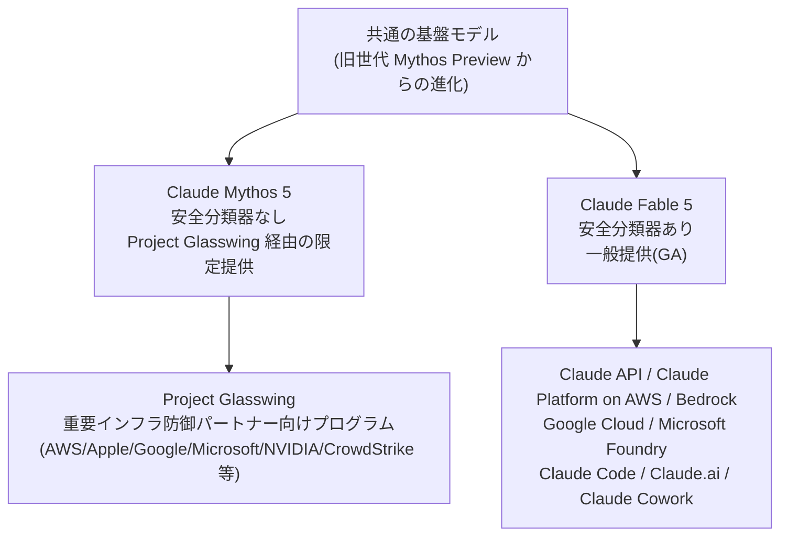
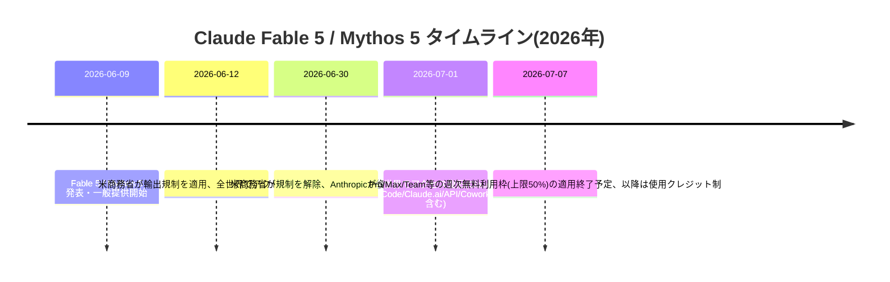
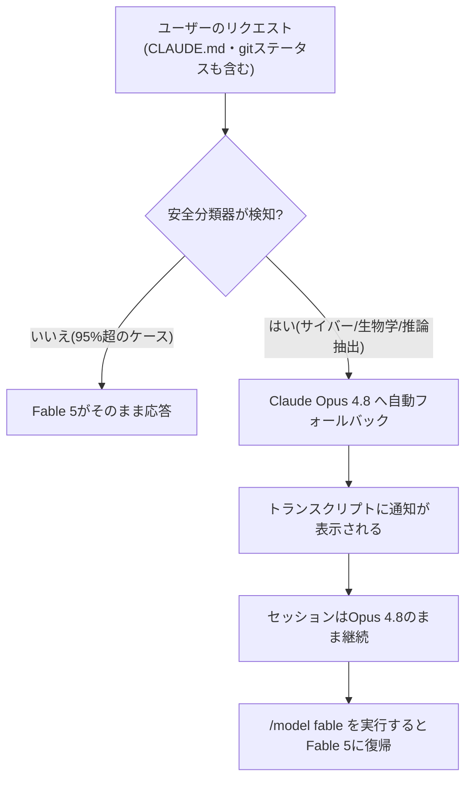
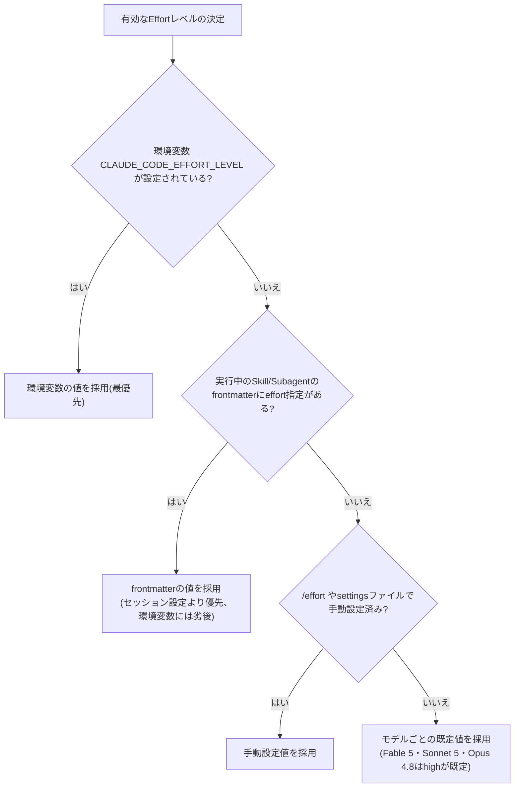
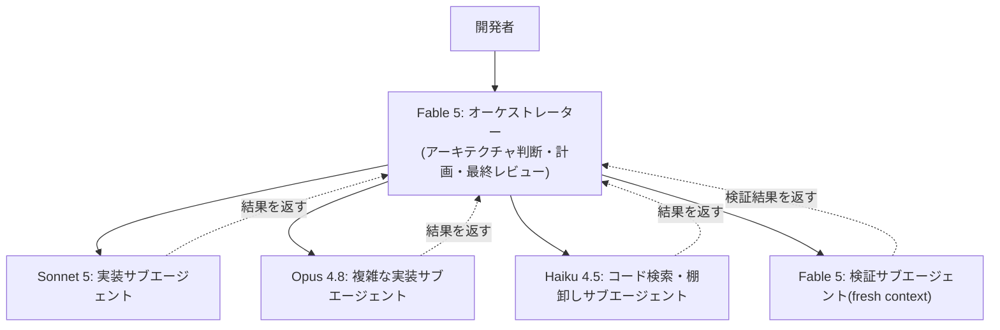
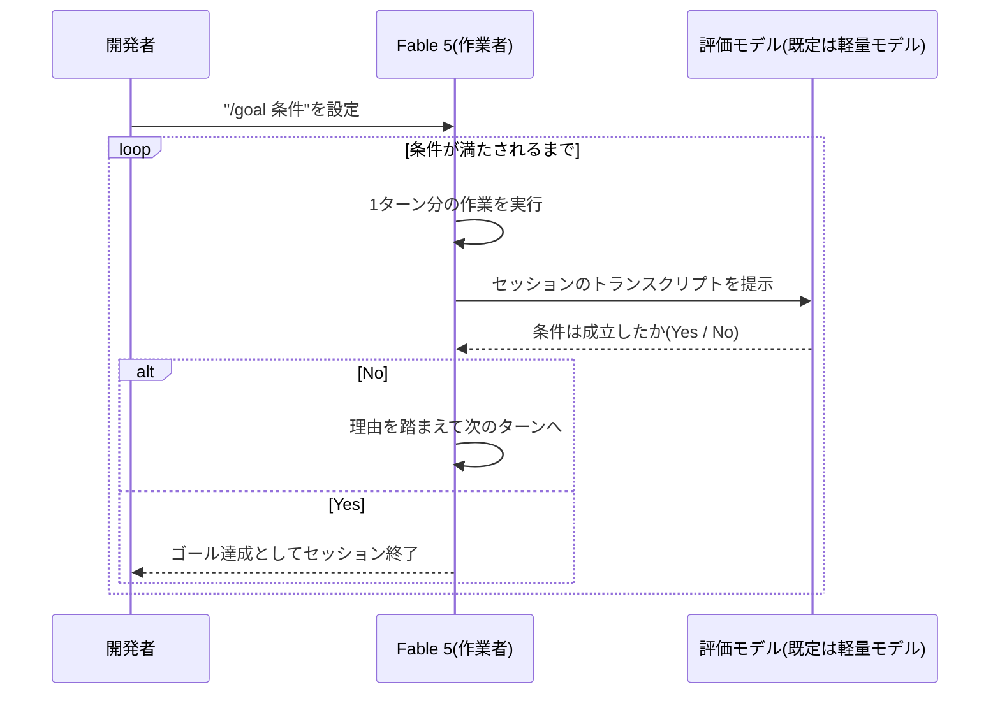
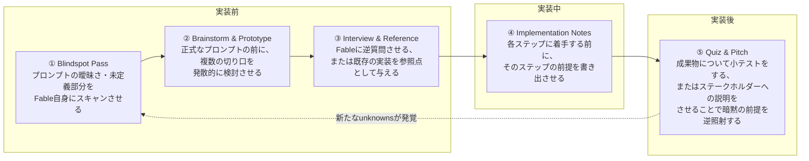
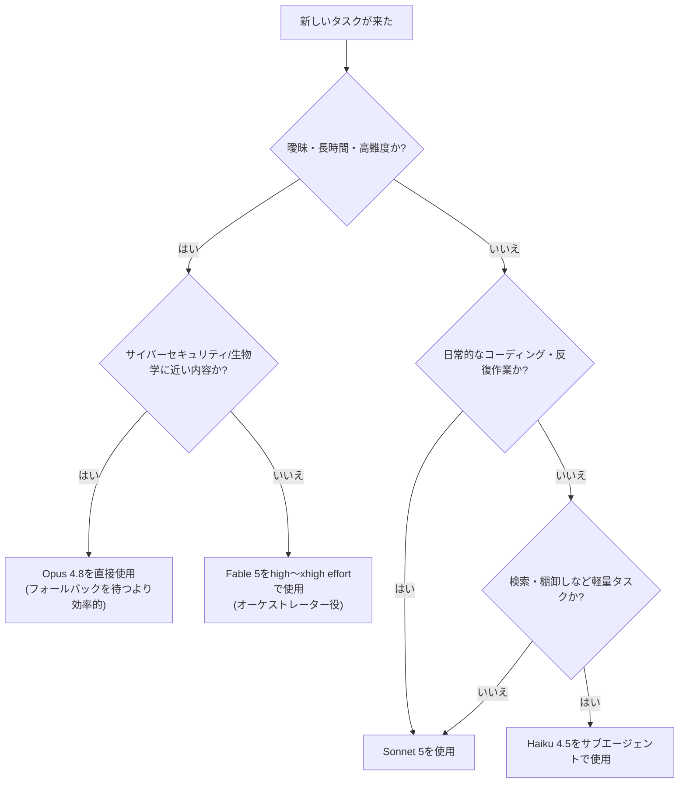

# Claude Fable 5 実践活用ガイド
### ― Claude Code エンジニアのための中級〜上級者向けベストプラクティス ―

> 対象読者: Claude Code を日常的に使っており、Opus / Sonnet 世代のプロンプト設計には慣れているが、Claude Fable 5 特有の挙動にまだ最適化できていないエンジニア向け。
> 最終更新時点の情報: 2026年7月4日。Fable 5 は現在進行形でアップデートされているモデルのため、記載内容は今後変わる可能性がある点に留意してください。

---

## 目次

1. [Claude Fable 5 とは何か](#1-claude-fable-5-とは何か)
2. [タイムライン: リリースから輸出規制、復旧まで](#2-タイムライン-リリースから輸出規制復旧まで)
3. [安全分類器と自動フォールバックの仕組み](#3-安全分類器と自動フォールバックの仕組み)
4. [プロンプティング思想の転換: チェックリストからゴールへ](#4-プロンプティング思想の転換-チェックリストからゴールへ)
5. [Effort(推論深度)レベルの使い方](#5-effort推論深度レベルの使い方)
6. [Claude Code での実践設定](#6-claude-code-での実践設定)
7. [Loop Engineering: 長時間自律ループの設計思想](#7-loop-engineering-長時間自律ループの設計思想)
8. [Thariq の「Unknowns フレームワーク」(参照ポスト解説)](#8-thariq-の-unknowns-フレームワーク参照ポスト解説)
9. [検証ループとメモリシステムの設計](#9-検証ループとメモリシステムの設計)
10. [モデル選定フローとコスト管理](#10-モデル選定フローとコスト管理)
11. [よくある落とし穴(アンチパターン)](#11-よくある落とし穴アンチパターン)
12. [実力・ベンチマークと「検証必須」の理由](#12-実力ベンチマークと検証必須の理由)
13. [既知の制限事項](#13-既知の制限事項)
14. [まとめ](#14-まとめ)
15. [参考文献・ソースURL一覧](#15-参考文献ソースurl一覧)

---

## 1. Claude Fable 5 とは何か

Claude Fable 5 は、Anthropic が2026年6月9日に発表した「Claude 5」世代の最初のモデルで、Opus よりも上位に位置づけられる新しい「Mythos」クラスの一般提供版です。同時に発表された **Claude Mythos 5** は同一の基盤モデルを共有していますが、Fable 5 にのみ追加の安全分類器(セーフガード)が搭載されている点が異なります。Mythos 5 は "Project Glasswing" という信頼されたパートナー向けプログラムを通じてのみ限定提供されています。

### 1.1 スペック概要

| 項目 | 内容 |
|---|---|
| モデルID | `claude-fable-5`(Mythos 5 は `claude-mythos-5`) |
| 位置づけ | Anthropicが一般提供する中で最も高性能なモデル。長時間・高難度・曖昧なタスク向け |
| コンテキストウィンドウ | 既定で100万トークン |
| 最大出力トークン | リクエストあたり最大12.8万トークン |
| 価格 | 入力 $10 / 100万トークン、出力 $50 / 100万トークン |
| 提供チャネル | Claude API、Claude Platform on AWS、Amazon Bedrock、Google Cloud、Microsoft Foundry、Claude Code、Claude.ai、Claude Cowork |
| Thinking(思考) | Adaptive Thinking のみ。オフ設定 (`disabled`) は不可。深さは `effort` パラメータで制御 |
| データ保持 | 30日間保持の「Covered Model」扱い。Zero Data Retention(ZDR)は非対応 |

### 1.2 モデルファミリーの関係性



Fable 5 と Mythos 5 は「同じ頭脳、異なる安全装備」というイメージで捉えると理解しやすいです。Fable 5 は分類器というガードレールを装備することで安全に広く配布できるようにした版、Mythos 5 はガードレールなしで信頼できるパートナーにのみ渡す版、という棲み分けです。

---

## 2. タイムライン: リリースから輸出規制、復旧まで

Fable 5 は発表から1ヶ月足らずで、一度サービス停止という大きな出来事を経験しています。プロンプト設計とは直接関係ありませんが、可用性設計(フォールバックの必要性)を理解する上で重要な背景です。



一時停止の経緯は、Amazon の研究者が Fable 5 の安全策を回避してソフトウェア脆弱性を特定できる手法を発見し報告したことがきっかけでした。Anthropic の検証では、同様の脆弱性特定は Opus 4.8 や他社モデルでも可能であったとされていますが、米商務省産業安全保障局(BIS)は6月12日付で Fable 5・Mythos 5 に対する輸出管理措置を発動し、外国籍ユーザーを区別する即時的な手段がなかった Anthropic は全ユーザー向けにモデルを一時停止しました。6月30日付で規制は解除され、7月1日から全世界でアクセスが復旧しています。この経緯についての公式声明は、Anthropicのニュースページで確認できます(巻末の参考文献を参照)。

この一件は、実務上「Fable 5 に固定的に依存する設計は避け、フォールバック先(Opus 4.8 など)を必ず用意しておく」という教訓を残しました。次章で解説する自動フォールバック機構は、まさにこの種のリスクに対する備えとしても機能します。

---

## 3. 安全分類器と自動フォールバックの仕組み

Fable 5 には、以下の3領域を対象とした安全分類器が組み込まれています。

- **サイバーセキュリティ**: 攻撃的なエクスプロイト・マルウェア・攻撃ツールの構築など
- **生物学・生命科学**: 実験手法や分子メカニズムに関する内容など
- **推論内容の抽出**: モデルの要約された思考過程をそのまま応答に転記させようとする指示

これらに該当すると判定されたリクエストは、Fable 5 では `stop_reason: "refusal"` として拒否されるか、Claude Code のようなハーネス上では自動的に Opus 4.8 へフォールバックします。Anthropic の公表によれば、**Fable 5 セッションの95%超はフォールバックが一切発生しない**とのことです。

### 3.1 リクエストのライフサイクル



### 3.2 実務上の注意点

- **初回リクエストだけで発火することがある**: フォールバックはユーザーの発言内容だけでなく、セッション開始時に一緒に送られる `CLAUDE.md` の内容や `git status`、ディレクトリ名などのワークスペース情報も判定対象に含みます。セキュリティ関連や生物学関連の資料がリポジトリに含まれているだけで、何も入力していない段階でフォールバックすることがあります。
- **トリガー源の切り分け**: `claude --safe-mode` で起動すると、`CLAUDE.md`・Skills・MCPサーバー・Hooksなどのカスタマイズを無効化してセッションを開始できるため、フォールバックの原因がカスタマイズ側にあるのか、リクエスト内容そのものにあるのかを切り分けられます。
- **セキュリティ研究・生物学系タスクは高頻度でフォールバックする**: ペネトレーションテストやCTF演習、生物学隣接のコードベースなどは、初回リクエストから頻繁にフォールバックが発生する「想定内の挙動」です。これはアカウントへのペナルティではありません。Fable級の能力がどうしても必要な場合は、Anthropicの信頼されたアクセスプログラムへの相談が推奨されています。
- **自動切り替えを無効化し、都度確認する設定も可能**: `/config` から「switch models when a message is flagged」をオフにすると、フラグが立った際にセッションを一時停止し、Opusへの切り替えか、プロンプトを編集してFable 5のまま再試行するかを選べるようになります。
- **サードパーティ基盤(Bedrock/Vertex/Foundry)での自動フォールバック**: モデルIDがプロバイダ固有であるため、`ANTHROPIC_DEFAULT_FABLE_MODEL` と `ANTHROPIC_DEFAULT_OPUS_MODEL` を設定して、Claude CodeがどちらのモデルがFable 5/Opus 4.8であるかを認識できるようにする必要があります。

---

## 4. プロンプティング思想の転換: チェックリストからゴールへ

これはFable 5を使いこなす上で最も重要な認識転換です。Anthropic公式の「Prompting Claude Fable 5」ガイドは、旧世代向けに書かれた作り込み過ぎた指示(過剰な手順列挙・網羅的な禁止事項・逐次的な確認要求など)が、Fable 5ではむしろ性能を落とす場合があると明記しています。Fable 5 は指示追従性が大幅に向上しているため、行動を一つひとつ列挙するのではなく、短い指示で意図を伝える方が有効に機能します。

### 4.1 旧来のスタイル vs Fable 5向けのスタイル


Anthropic Claude Codeチームのエンジニアである Thariq Shihipar(@trq212)も、Fable 5導入後のチーム内の働き方の変化を「以前は "Claude が正しく作業したか" を検証していたが、今は "そもそも正しい作業をしているか" を検証するようになった」という趣旨で表現しています。これは、成果物の細部を逐一チェックする姿勢から、そもそもの方向性・スコープが合っているかを見る姿勢への転換を意味しており、本章で述べる「チェックリストからゴールへ」という転換と同じ現象を、検証者側の視点から語ったものだと言えます。

### 4.2 実践プロンプトパターン(概念の再構成・自作例)

以下は公式ガイドが示す考え方を踏まえて筆者が独自に組み立てた、Claude Codeでそのまま使える日本語プロンプト断片の例です。用途に応じて適宜書き換えてください。

**パターンA: ゴールと理由を先に伝える**

```
私は[対象読者]向けに[成果物]を作っています。彼らが必要としているのは[何がその成果物を役立たせるか]です。
これを踏まえて: [具体的な依頼内容]
```

**パターンB: 過剰な深掘り・改変を防ぐ境界指定**

```
このタスクに必要な範囲を超えて、機能追加・リファクタリング・抽象化を行わないでください。
バグ修正には周辺の整理は不要です。まだ発生していないシナリオのためのエラーハンドリングやフォールバックは追加しないでください。
```

**パターンC: 進捗報告は「ツール結果に基づく事実」だけを許可する**

```
進捗を報告する前に、このセッション内のツール実行結果を根拠として各主張を確認してください。
根拠を示せない内容は報告しないでください。テストが失敗していれば失敗した旨と出力を、
未検証であれば未検証である旨を、率直に伝えてください。
```

**パターンD: 自律実行中の「許可待ち」を防ぐ**

```
あなたは自律的に動作しています。ユーザーはリアルタイムでは見ておらず、
作業途中の質問には答えられません。元の依頼から自然に導かれる可逆的な操作は、
確認を取らずに進めてください。ターンを終える前に、自分の最後の発言が
「計画」「分析」「質問」「まだやっていない作業の予告」になっていないか確認し、
なっていれば今すぐ手を動かしてください。
```

これらはいずれも「何をすべきか」を細かく指示するのではなく、「ゴール」「理由」「境界」「検証基準」の4要素を示す形になっている点が共通しています。

---

## 5. Effort(推論深度)レベルの使い方

Fable 5における性能・速度・コストのトレードオフを制御する最も重要なパラメータが `effort` です。API上はモデルパラメータとして、Claude Code上は `/effort` コマンドやモデルピッカーのスライダーとして操作します。

### 5.1 レベル一覧

| レベル | 特徴 | 主な用途 |
|---|---|---|
| `low` | 高速・低コスト。知的な深さは犠牲になる | レイテンシ重視で知的難度が低い、短く範囲の狭いタスク |
| `medium` | コストを抑えつつ、ある程度の知性を維持 | コスト重視で多少の知性低下を許容できる作業 |
| `high` | トークン消費と知性のバランスが良い(Fable 5の既定値) | 大半のコーディング・エージェント作業 |
| `xhigh` | より深い推論、トークン消費は増加 | 能力の上限が求められる難しいワークロード |
| `max` | 最も深い推論。過剰思考になりやすく収穫逓減の傾向あり | 導入前に必ず個別タスクで効果測定を行う。セッション限定設定 |
| `ultracode` | Claude Code独自の設定。`xhigh`に加え、実質的なタスクごとにDynamic Workflowsを自動計画 | 大規模タスクの自動オーケストレーションが必要な場合。セッション限定設定 |

Anthropic公式ガイドは「まずhighを既定とし、最も能力が求められる作業にxhighを、日常的な定型作業にはmedium/lowを検討する」ことを推奨しています。興味深いのは、**Fable 5の低いeffort設定でも、旧モデルのxhigh設定を上回る性能が出ることが多い**という指摘です。つまり「常に最大effortを使う」のは必ずしも最適ではありません。

### 5.2 Effortの決定優先順位

Claude Code上でどのeffortが実際に適用されるかは、以下の優先順位で決まります。



なお、`ultrathink` というキーワードをプロンプト中に含めると、セッションのeffort設定を変えずにそのターンだけ深い推論をリクエストできます。一方で「think」「think hard」など他の言い回しは特別なキーワードとしては認識されず、通常の文章として扱われる点に注意してください。

### 5.3 過剰思考を防ぐ指示例

高いeffortで動かすと、Fable 5がタスクに必要な範囲を超えて調査・熟考してしまうことがあります。これを防ぐには、前章のパターンBのような境界指定が有効です。

---

## 6. Claude Code での実践設定

### 6.1 モデルの選択

Fable 5はClaude Codeの既定モデルではありません。以下のいずれかで明示的に選択する必要があります。

- セッション中: `/model fable`
- 起動時: `claude --model fable`
- 環境変数: `ANTHROPIC_MODEL=fable`
- 設定ファイル: `settings.json` の `model` フィールド

`best` エイリアスは、組織がFable 5にアクセスできる場合はFable 5を、そうでない場合は最新のOpusを指すよう自動解決されます。バージョンを固定したい場合はエイリアスではなく完全なモデル名(`claude-fable-5`)を指定してください。

### 6.2 Fable 5から最大限の成果を引き出すための基本方針

Claude Code公式ドキュメントは、Fable 5の使い方について次の4点を挙げています。

1. **手順ではなく結果を説明する**: 欲しい結果を渡し、経路の計画はモデルに任せる。その結果を維持し続けたい場合は `/goal` を設定する。
2. **曖昧な問題を渡す**: 根本原因の調査、障害対応、アーキテクチャ判断など、追加の調査・検証が効果を発揮する領域に向いている。
3. **検証の念押しを省く**: Fable 5は指示が少なくても自ら検証を行うため、「テストして」「確認して」といったリマインダーは基本的に不要。
4. **タスクのサイズを大きくする**: 通常は分割するような作業も、そのままのサイズで渡してよい。長いセッションでも文脈を見失いにくい。

### 6.3 サブエージェント戦略

Fable 5は並列サブエージェントのディスパッチ・維持において旧モデルより大幅に信頼性が向上しています。実務上は、Fable 5を高コストな「判断役」に据え、実装の大部分は安価なモデルに任せる**階層型のモデルルーティング**が推奨されます。



サブエージェントのモデルは、`.claude/agents/` 配下のfrontmatterで `model: sonnet` のように指定できます。優先順位は「`CLAUDE_CODE_SUBAGENT_MODEL` 環境変数 > Agentツールの呼び出し時パラメータ > frontmatter > メインセッションのモデル」の順です。独立したサブタスクはサブエージェントに委任し、完了を待たずに他の作業を継続する非同期的な連携が推奨されています。長時間稼働するサブエージェントは文脈を保持し続けることで、キャッシュ読み込みの恩恵を受けられ、最も遅いサブエージェントによるボトルネックも避けられます。

### 6.4 Dynamic Workflows(ultracode)の活用

1つの会話では調整しきれないほど多くのエージェントが必要なタスク(コードベース全体の監査、数百ファイル規模の移行、相互検証が必要な調査など)には、Dynamic Workflowsが適しています。これはFable 5(または他モデル)がタスクのためのオーケストレーションスクリプトを自身で書き、バックグラウンドで実行する仕組みです。

- プロンプト中に `ultracode` というキーワードを含めるか、「ワークフローを使って」と自然言語で依頼すると、その場でワークフローが起動します。
- `/effort ultracode` を設定すると、セッション内のすべての実質的なタスクに対してワークフローを自動計画するようになります(トークン消費・時間は増加します)。
- 実行状況は `/workflows` で一覧・進捗確認ができます。
- うまく機能したワークフローはコマンドとして保存し、`/`のオートコンプリートから再利用できます。

### 6.5 Worktreeによる並列実験

`claude --worktree` を使うと、独立したgit worktree上でセッションを起動でき、複数のセッションが同じファイルを同時に編集する衝突を避けられます。Fable 5に複数の実装方針を提案させ、それぞれを別のworktree上で(コストの低いモデルの)サブエージェントに実装させた上で、差分をFable 5に持ち帰らせて比較・選定させる、といった使い方が実務では有効です。

### 6.6 CLAUDE.md / Skillsの再設計

Fable 5への移行時に最も見落とされがちなのが、**旧モデル向けに書かれた過剰に規範的な指示の棚卸し**です。公式ガイドは「旧モデル向けに開発されたSkillは、Fable 5にとって規範的すぎることが多く、出力品質を下げる可能性がある」と明記しています。

| 見直すべきパターン | 理由 |
|---|---|
| 手順を1から10まで列挙したチェックリスト | Fable 5は自ら計画を立てられるため、過剰な手順指定が創造的な判断を阻害する |
| あらゆる失敗ケースを想定した網羅的な禁止事項リスト | 弱いモデルの失敗モードを前提にした「保険」が、そのまま制約として重荷になる |
| 「思考過程を説明してください」という指示 | `reasoning_extraction` の拒否カテゴリに抵触し、Opusへのフォールバックを誘発する可能性がある |
| ハードコードされた日付や古い前提を含むメモ・ルールファイル | 更新されずに残り続け、誤った前提を毎セッション伝え続けてしまう |
| 禁止しているパターンそのものを使って書かれたルール文書 | 「模範」と「指示」が矛盾し、モデルが手本の方を学習してしまう |

実務的な進め方としては、まずFable 5自身に既存の `CLAUDE.md` やSkillファイルを読ませ、「矛盾している箇所」「弱いモデルのための保険にすぎない箇所」「模範と矛盾する箇所」を洗い出させ、削除案をレポートさせた上で、実際の削除判断は人間が行う、という「監査は任せるが決定は自分でする」進め方が有効です。

---

## 7. Loop Engineering: 長時間自律ループの設計思想

2026年6月から7月にかけて、Fable 5のような長時間自律動作が可能なモデルの登場と歩調を合わせる形で、"Loop Engineering"(ループ・エンジニアリング)という概念がAI開発者コミュニティで急速に広がりました。これは本ガイドが参照した投稿の著者である Thariq Shihipar が所属する、Claude Codeチームの内外で語られている考え方でもあり、Fable 5を実務で使いこなす上での重要な補助線になります。

### 7.1 提唱者たちの発言

- **Boris Cherny**(Claude Codeの創設者、Anthropic): 「もうClaudeに直接プロンプトを書くことはない。プロンプトを送っているのはループの方で、私の仕事はループを書くことだ」という趣旨の発言をWorkOSのイベントで行い、大きな反響を呼びました。
- **Peter Steinberger**(OpenClawの創設者): 同様に「コーディングエージェントに直接プロンプトを書くのをやめ、エージェントにプロンプトを送るループを設計すべきだ」と発信しています。
- **Andrew Ng**: 著書『The Batch』にて、ソフトウェア開発を「エージェンティックコーディングループ(分単位)」「開発者フィードバックループ(時間単位)」「外部フィードバックループ(日〜週単位)」という3つの入れ子構造として整理しました。人間がエージェントより多くの情報(顧客理解や審美眼など)を持っている限り、人間はこのループに関与し続ける必要がある、という「文脈的優位性(context advantage)」という考え方を提示しています。
- **Addy Osmani**(Google): この一連の実践に "Loop Engineering" という名前を与え、ボトルネックが「コードを書くこと」から「コードが正しく動くことを証明すること」へ移ったと論じています。
- **Lance Martin**(Anthropic): Fable 5を用いた実験で、独立した文脈を持つ検証用サブエージェントが自己批評よりも一貫して優れた結果を出すことを報告しています。

これらの発信はいずれもX(旧Twitter)上で行われ、賛否を含め活発な議論を呼んでいます。懐疑的な意見としては、「本質的にはただのwhileループにすぎない」「トークン消費が跳ね上がる」(実際にUberが社内のエージェントツール利用料を1人あたり月1,500ドルに上限設定したという報告もあります)、「ベンダーの成功事例は既にその製品を使っているユーザーからのデータであり、サンプリングバイアスがある」といった指摘も出ています。実務では、こうした肯定・否定双方の視点を踏まえて導入判断をするのが健全です。

### 7.2 Claude Code の `/goal` と `/loop`

Loop Engineeringという発想を、Claude Codeでは `/goal` コマンドと `/loop` コマンドという具体的な機能として実装しています。

- **`/goal <条件>`**: 検証可能な完了条件を設定すると、Fable 5が1ターン作業するたびに、作業を行っているモデルとは別の(既定では軽量な)評価モデルがトランスクリプトを読み、条件が満たされたかどうかをYes/Noで判定します。満たされていなければ、その理由を踏まえて次のターンが自動的に始まります。
- **`/loop <指示>`**: 条件による判定ではなく、時間間隔で繰り返し実行する場合に使用します。



この設計の核心は、**「作業をするモデル」と「完了を判定するモデル」を分離している**点にあります。単一のモデルに自分の仕事を自己採点させると、平凡な出来栄えでも「よくできた」と過大評価してしまう傾向があるためです。Anthropicのエンジニアリングブログでも、標準的な評価者を懐疑的にチューニングする方が、生成モデル自身に批判的な自己評価をさせるより現実的だ、という趣旨の指摘がされています。

`/goal` の条件を書く際のコツは以下の3点に集約されます。

1. **測定可能な終了状態を1つ定める**: テスト結果、ビルドの終了コード、ファイル数、キューが空になったことなど
2. **どう証明するかを明記する**: 「`npm test` が exit code 0 で終わる」のように、Fableの出力自体が証拠になる形にする
3. **守るべき制約を明記する**: 「他のテストファイルを変更しない」など、途中で崩れてはいけない条件も書く

評価モデルはトランスクリプトを読むだけで、コマンドを自ら実行したりファイルを直接確認したりはしません。したがって「わかりやすく体裁の整った進捗報告」と「実際に検証された事実」を混同しないよう、Fable 5自身に根拠を明示させる指示(本ガイド4.2節のパターンC)と組み合わせることが重要です。また、無条件で朝まで走らせるような使い方は推奨されておらず、ターン数や時間の上限を条件に含めておくことが安全策として案内されています。

---

## 8. Thariq の「Unknowns フレームワーク」(参照ポスト解説)

ご提示いただいた投稿(Thariq Shihipar, "A Field Guide to Fable: Finding Your Unknowns", 2026年7月3日)は、Fable 5を使う中で著者が繰り返し学んだ教訓として「**地図は現地そのものではない**」という比喩を掲げています。ここでの「地図」とは、Fableに与えるプロンプトやSkill、コンテキストのことであり、「現地」とは実装時に実際に立ちはだかる制約や現実を指します。この投稿の核心的な主張は、エージェンティックコーディングの成否は**実装の前と最中に、自分自身の"unknowns(未知の要素)"をどれだけ明確にできるか**にかかっている、というものです。

### 8.1 4つの象限

Thariqは、政治家ドナルド・ラムズフェルドの知識分類(および後にスラヴォイ・ジジェクが加えた4つ目の区分)を借りて、プロンプトに潜む情報の非対称性を次の4象限に整理しています。

| 象限 | 説明 | 具体例 |
|---|---|---|
| **Known Knowns**(既知の既知) | 自分もFable 5も明確に理解している、明示済みの指示 | 「この関数の戻り値の型はstringにする」 |
| **Known Unknowns**(既知の未知) | 自分が「まだ決まっていない」と認識しているギャップ | 「エラー時の挙動をどうするかはまだ決めていない」 |
| **Unknown Knowns**(未知の既知) | 自分は無意識に分かっている(センス・美意識・業界の慣習など)が、言語化していない暗黙の基準 | 「このコードの"きれいさ"の基準」を説明せずに期待している |
| **Unknown Unknowns**(未知の未知) | 自分がそもそも結果に影響すると想定していなかった要因 | 想定していなかったレガシーな依存関係の存在 |

Thariqの観察によれば、Fable 5の出力品質が頭打ちになる最大の要因は、大抵この第3・第4象限、つまり**自分自身がその前提の存在にすら気づいていない領域**にあります。開発者が「Fable 5は要件を理解していない」と感じる場面の多くは、実際には要件そのものにこうしたunknownsが潜んでいることが原因だ、というのがこの投稿の重要な指摘です。

### 8.2 5つの実践技法

このフレームワークに対応する形で、Thariqは実装前・実装中・実装後の3段階にわたる5つの具体的な技法を提示しています。



この5つの技法に共通する狙いは、**第3・第4象限(Unknown Knowns / Unknown Unknowns)にある要素を、少しずつ第1・第2象限(Known Knowns / Known Unknowns)へ移していく**ことです。特に④のImplementation Notesは、Fable 5が実装の各ステップに入る前に前提を書き出すことで、開発者がリアルタイムでunknownsを検知・介入できるようにする点で、本ガイド9章で述べるメモリシステムや検証ループの設計とも密接に関連しています。また⑤のQuiz & Pitchは、完成後に成果物について小テストをしたり、ステークホルダーへのピッチのような形で設計判断を説明させたりすることで、実装中に無意識に行っていた仮定を逆に暴き出す、という点がユニークな工夫です。

このフレームワークは、7章で紹介したLoop Engineeringの考え方(検証条件をどう設計するか)とも補完関係にあります。`/goal` の条件を書く作業自体が、実は「Known Unknowns」を「Known Knowns」に変換する作業そのものだと捉えると、両者のつながりが見えてきます。

---

## 9. 検証ループとメモリシステムの設計

### 9.1 検証はサブエージェントに任せる

Fable 5は自己検証の精度も高いモデルですが、Anthropicの実験・Lance Martinの報告いずれにおいても、**独立した文脈を持つ検証専用のサブエージェント**が自己批評よりも一貫して優れた結果を出すことが確認されています。長時間タスクでは「[X]間隔で自分の作業を確認する仕組みを確立し、その間隔ごとにサブエージェントで仕様と照らし合わせて検証する」という趣旨の指示を、明示的にプロンプトへ含めることが推奨されます。

### 9.2 ファイルベースのメモリシステム

Fable 5は、過去の実行から得た教訓を記録し、それを参照できる状態にしておくと特によいパフォーマンスを発揮します。実装はシンプルな Markdown ファイルで構いません。

- 1つの教訓につき1ファイル、先頭に一行要約をつける
- 「なぜそれが重要だったか」も含め、修正内容・確認済みの方針の両方を記録する
- 会話履歴やリポジトリの内容としてすでに残っている情報は保存しない
- 既存のメモは重複作成せず更新し、誤りだと判明したメモは削除する

過去のセッション群からこの仕組みを立ち上げたい場合は、Fable 5自身にサブエージェントを使って過去のセッションを振り返らせ、テーマや教訓を抽出・保存させ、以後その保存先を参照するよう指示する、という「自己ブートストラップ」的な使い方も有効です。実際にAnthropicの内部テストでは、このような永続的なファイルベースの記憶を与えることで、`Slay the Spire` のようなゲームをプレイさせた際にOpus 4.8比で成績が大幅に向上したという報告もあります。

### 9.3 長時間実行特有の注意点

- **早期停止**: 長いセッションの終盤で、Fable 5が「これからXを実行します」という意図表明だけをして実際のツール呼び出しをしなかったり、十分な情報があるのに許可を求めて止まってしまうことがあります。「続けて」の一言で再開しますが、無人運用のパイプラインでは、ユーザーが見ていないこと・確認が返せないことを明示し、可逆的な操作については確認なしで進めるよう指示しておくと安定します。
- **コンテキスト予算への過剰反応**: 残りトークン数のカウントダウンをモデルに見せる設計だと、必要以上に「新しいセッションを始めましょうか」といった提案をしてくることがあります。可能であればコンテキスト残量を明示的に見せない設計にするか、「コンテキストは十分残っているので気にせず続けてください」という一文を添えるとよいでしょう。
- **クライアント側のタイムアウト調整**: 高いeffort設定での個々のリクエストは数分から数時間に及ぶことがあります。API/ハーネスを自作している場合は、タイムアウト・ストリーミング・進捗表示の設計を見直し、ブロッキングではなく非同期的(スケジュールジョブなど)に実行状況を確認する構成に寄せることが推奨されています。

---

## 10. モデル選定フローとコスト管理

### 10.1 モデル選定フロー



### 10.2 コスト管理の考え方

Fable 5は入力$10/出力$50(100万トークンあたり)と、Opus 4.8の2倍程度の単価です。すべてのターンをFable 5で処理するのは、想定外に高額な請求につながる最も簡単な方法だとよく指摘されます。実務では以下の分散が有効です。

| 役割 | 推奨モデル | 理由 |
|---|---|---|
| 計画・アーキテクチャ判断・最終レビュー | Fable 5 | 曖昧さの処理・長時間の一貫性・自己検証能力が活きる領域 |
| 通常の実装作業 | Sonnet 5 / Opus 4.8 | コストと性能のバランスが良い |
| コード検索・棚卸し・単純な反復作業 | Haiku 4.5 | 低コストで十分な精度が出る |
| コードレビュー・診断(最終判断) | Fable 5(高effort) | 「安全に出荷できるか」という判断そのものが強みを発揮する領域 |

またサブエージェントを増やすとトークン消費は単純に掛け算で増えるため、チームは小さく保ち、起動プロンプトは焦点を絞り、役目を終えたサブエージェントは早めに終了させることが推奨されています。大規模タスクの前には `/model` で現在のモデルを確認し、定型作業は小さいモデルに任せる判断を習慣化すると良いでしょう。

---

## 11. よくある落とし穴(アンチパターン)

| アンチパターン | 何が起きるか | 対処 |
|---|---|---|
| Opus世代のプロンプトをそのまま流用する | 過剰な手順指定・禁止事項がFable 5の自律的判断を阻害し、性能が落ちる | CLAUDE.md/Skillsを棚卸しし、ゴール・理由・境界・検証の4要素に再構成する |
| 常に最大effort(`xhigh`/`max`)で動かす | トークン消費が増えるだけでなく、過剰思考・過剰な調査で逆に遅くなることがある | タスクの難度に応じて`high`を基準に上下させる。導入前に効果測定する |
| 「思考過程を説明して」と指示する | `reasoning_extraction`カテゴリに抵触し、Opusへの意図しないフォールバックを誘発しうる | 推論の可視性が必要な場合は構造化された`thinking`ブロックを読む設計にする |
| セキュリティ関連のリポジトリでFable 5をそのまま使う | 初回リクエストからフォールバックが頻発し、想定より遅く・高くつく | 該当領域は最初からOpus 4.8を使うか、`--safe-mode`で原因を切り分ける |
| すべてのサブタスクをFable 5に担わせる | コストが不必要に膨らむ | オーケストレーターはFable 5、実装はSonnet/Opus、検索はHaiku、という階層構造にする |
| 無条件・無期限の`/goal`や自律ループを一晩放置する | 想定外の挙動やコスト超過に気づけない | 条件にターン数・時間の上限を含め、最初の数サイクルは監視する |
| 進捗報告を鵜呑みにする | 「テストが通りました」という報告が実際には未検証であるケースがある | 根拠となるツール実行結果の提示を明示的に要求する |
| 単一モデルによる自己採点だけで完了と判断する | 平凡な出来を「良くできた」と過大評価しがちである | 独立した文脈を持つ検証サブエージェントや`/goal`の評価モデルを併用する |

---

## 12. 実力・ベンチマークと「検証必須」の理由

Fable 5は複数のベンチマークで高い成績を収めています。例えば Center for AI Safety と Scale AI Labs が公表した Remote Labor Index(実在するフリーランス案件240件を人間の専門家基準で採点するベンチマーク)では、Fable 5は16.1%の案件で人間の専門家と同等かそれを上回る成果を出し、Opus 4.8(8.3%)やGPT-5.5(6.3%)を上回りました。ただし裏を返せば、**このベンチマークでもプロ品質に届いた案件は6件に1件程度**であり、過信は禁物です。

法律分野の実践検証を行った Artificial Lawyer の記事では、Fable 5は個別の評価基準(criteria)ベースでは約90%の精度で正答する一方、法律文書の完成品全体として完全に正しいと言える出力は約11%程度にとどまったと報告されています。これは「部分点は高いが、成果物全体を無検証でそのまま採用するのは危険」という典型的な傾向を示しており、Fable 5に限らず高性能モデル全般に当てはまる教訓です。専門性が求められる領域では、人間によるレビューを省略しない設計が引き続き重要です。

また、Fable 5をめぐっては「長時間の複数エージェントセッションで独自の省略言語(通称"Claudish")を発達させる」という噂がSNS上で広がりましたが、これを多角的に裏取りした分析記事では、そのような現象の出どころは確認できず、実際に文書化されているのは「長時間セッションの終盤で、ユーザー向けの要約が矢印の連鎖のような密な省略表現になりやすい」という、より地味な挙動だったと結論づけられています。Anthropic自身もこの挙動を認識しており、最終的な要約では省略表現を避け、完全な文章で書き直すよう促す一文を加える対処法を公式ガイドに含めています。この一件は、AIモデルに関する派手な噂ほど、一次情報(公式ドキュメントやAPIの挙動そのもの)に立ち返って検証する価値がある、という良い教訓例です。

---

## 13. 既知の制限事項

- **Zero Data Retention(ZDR)非対応**: Fable 5・Mythos 5はいずれも30日間データ保持の「Covered Model」であり、ZDRの対象外です。厳格なデータ保持要件がある組織は、Claude Codeの`/model`ピッカー上でFable 5が非表示または無効化されている場合があります。
- **実在する公人になり代わった発言はできない**: 創作におけるフィクションのキャラクターは問題ありませんが、実在する著名人の発言として言葉を作り出すことは避ける設計になっています。
- **サイバーセキュリティ・生物学領域は不得手というより「意図的に不可」**: 該当領域での能力そのものはMythos 5と共通ですが、Fable 5では安全分類器によって意図的にOpus 4.8へフォールバックするよう設計されています。
- **モデルは日々アップデートされる**: 本ガイド執筆時点(2026年7月上旬)の情報であり、価格・利用枠・分類器の精度・コマンド仕様などは今後変更される可能性があります。特に無料利用枠の条件(2026年7月7日ごろまでの週次利用枠上限50%)は近い将来に変わることが予告されています。最新情報は必ず公式ドキュメントで確認してください。

---

## 14. まとめ

Claude Fable 5をClaude Codeで使いこなす上でのポイントを一言でまとめると、**「細かく指示する」から「ゴールと検証基準を渡し、あとは任せる」への発想転換**に尽きます。これは単なるプロンプトの書き方の変化ではなく、

- モデル選定(Fable 5をオーケストレーター、他モデルをワーカーに据える階層設計)
- Effortレベルの使い分け
- 検証ループの設計(`/goal`、独立した検証サブエージェント)
- メモリシステム(ファイルベースの教訓の蓄積)
- 自分自身のunknownsを可視化する技法(Thariqのフレームワーク)

という複数のレイヤーにまたがる設計思想の転換です。同時に、ベンチマーク上の高い成績や華々しい発表の裏にも、部分点と完成品の間には依然としてギャップがあること、SNS上の噂は一次情報で裏取りする必要があることも忘れずに、実務では検証を省略しない姿勢を保つことが重要です。

---

## 15. 参考文献・ソースURL一覧

### 公式ドキュメント・公式発表(Anthropic)

- Anthropic「Claude Fable 5 and Claude Mythos 5」(発表記事): https://www.anthropic.com/news/claude-fable-5-mythos-5
- Anthropic「Redeploying Claude Fable 5」(輸出規制解除後の復旧に関する声明): https://www.anthropic.com/news/redeploying-fable-5
- Claude Platform Docs「Introducing Claude Fable 5 and Claude Mythos 5」: https://platform.claude.com/docs/en/about-claude/models/introducing-claude-fable-5-and-claude-mythos-5
- Claude Platform Docs「Prompting Claude Fable 5」(公式プロンプトガイド、本ガイド4章・6章の一次情報): https://platform.claude.com/docs/en/build-with-claude/prompt-engineering/prompting-claude-fable-5
- Claude Platform Docs「Prompting best practices」: https://platform.claude.com/docs/en/build-with-claude/prompt-engineering/claude-prompting-best-practices
- Claude Code Docs「Model configuration」(モデル選択・effort設定・自動フォールバックの一次情報): https://code.claude.com/docs/en/model-config
- Claude Code Docs「Orchestrate subagents at scale with dynamic workflows」: https://code.claude.com/docs/en/workflows
- Claude Code Docs「Run agents in parallel」: https://code.claude.com/docs/en/agents
- Claude Code Docs「Run parallel sessions with worktrees」: https://code.claude.com/docs/en/worktrees
- Claude Code Docs「Keep Claude working toward a goal」(`/goal`コマンドの一次情報): https://code.claude.com/docs/en/goal
- Claude Code Docs「Glossary」: https://code.claude.com/docs/en/glossary
- Claude Code Docs「Subagents in the SDK」: https://code.claude.com/docs/en/agent-sdk/subagents

### 著名な開発者・業界関係者の発信(引用元の投稿を含む)

- Thariq Shihipar(Anthropic, Claude Codeチーム) 「A Field Guide to Fable: Finding Your Unknowns」(本ガイドで提示いただいた投稿。8章の一次情報): https://x.com/trq212/status/2073100352921215386
- Thariq Shihipar「Fable is a step-change in models...」(Fable 5導入後のClaude Codeチームの働き方変化に関する投稿。4章で言及): https://x.com/trq212/status/2064437561930682672
- ClaudeDevs(Anthropic公式アカウント)「Claude Fable 5 changed how we work on the Claude Code team day to day」: https://x.com/ClaudeDevs/status/2064399512664526853
- Andrew Ng「My 3 key loops for building 0-to-1 products」(The Batch, 2026年6月26日号。7章の一次情報): https://x.com/AndrewYNg/status/2071988145667928442 / https://www.deeplearning.ai/the-batch/issue-359

### 分析・解説記事(二次情報、事実確認のうえ引用)

- AlphaSignal AI「How to Actually Prompt Claude Fable 5」(公式ガイドの実務的な要約): https://alphasignalai.substack.com/p/how-to-actually-prompt-claude-fable
- Ken Huang「Claude Fable 5: What Changed, and How to Stop Prompting It Like Opus」("Claudish"の噂の裏取りを含む): https://kenhuangus.substack.com/p/claude-fable-5-what-changed-and-how
- Wavect Blog「Fable Is Back. Here's How to Actually Code With It」(Claude Codeでの実践的なモデルルーティング例): https://wavect.io/blog/coding-with-claude-fable-5/
- MCP.Directory「Fable 5 in Claude Code: Routing & Limits」(サブエージェント設定・フォールバック挙動の実務ガイド): https://mcp.directory/blog/fable-5-claude-code-model-routing-guide-2026
- Product Compass「Claude Fable 5 for PMs: Ultimate Guide」(CLAUDE.md棚卸しの実例): https://www.productcompass.pm/p/claude-fable-5-guide
- Artificial Lawyer「Anthropic's 'Dangerous' Fable Is Back! How Does It Do?」(法律分野での実力検証。12章の一次情報): https://www.artificiallawyer.com/2026/07/02/anthropics-dangerous-fable-is-back-how-does-it-do/
- The Rundown AI「Anthropic's Fable returns worldwide」(復旧後の分類器精度に関する報道): https://www.therundown.ai/p/anthropic-fable-returns-worldwide
- dsebastien.net「Loop Engineering Went Mainstream」(Loop Engineeringを巡る賛否両論のまとめ、Boris Cherny/Peter Steinberger発言の出典): https://www.dsebastien.net/loop-engineering-went-mainstream/
- VentureBeat「Claude Code's '/goals' separates the agent that works from the one that decides it's done」: https://venturebeat.com/orchestration/claude-codes-goals-separates-the-agent-that-works-from-the-one-that-decides-its-done
- TechTimes「Claude Fable 5 Is Back: Safety Classifiers Now Reroute Security Agent Loops」(輸出規制の経緯とLoop Engineeringの接続): https://www.techtimes.com/articles/319665/20260703/claude-fable-5-back-safety-classifiers-now-reroute-security-agent-loops.htm

> 注記: 上記のうち個人ブログ・メディア記事(二次情報)は、公式ドキュメントと突き合わせて事実確認を行った上で本ガイドに反映しています。とはいえAI分野は情報の更新が非常に速いため、実装に移す前に必ず一次情報(公式ドキュメント)側の最新記載を確認してください。