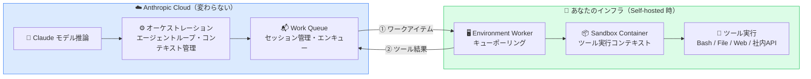
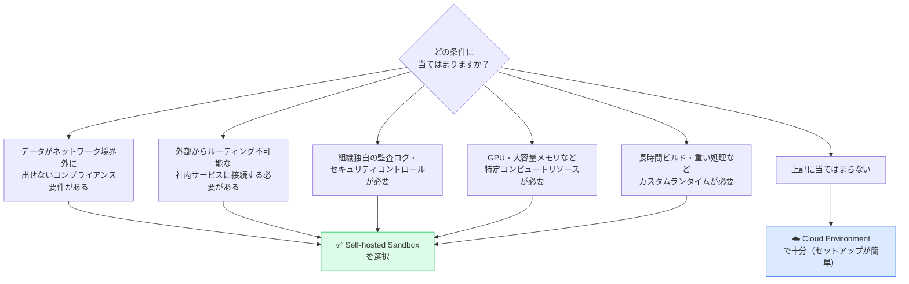
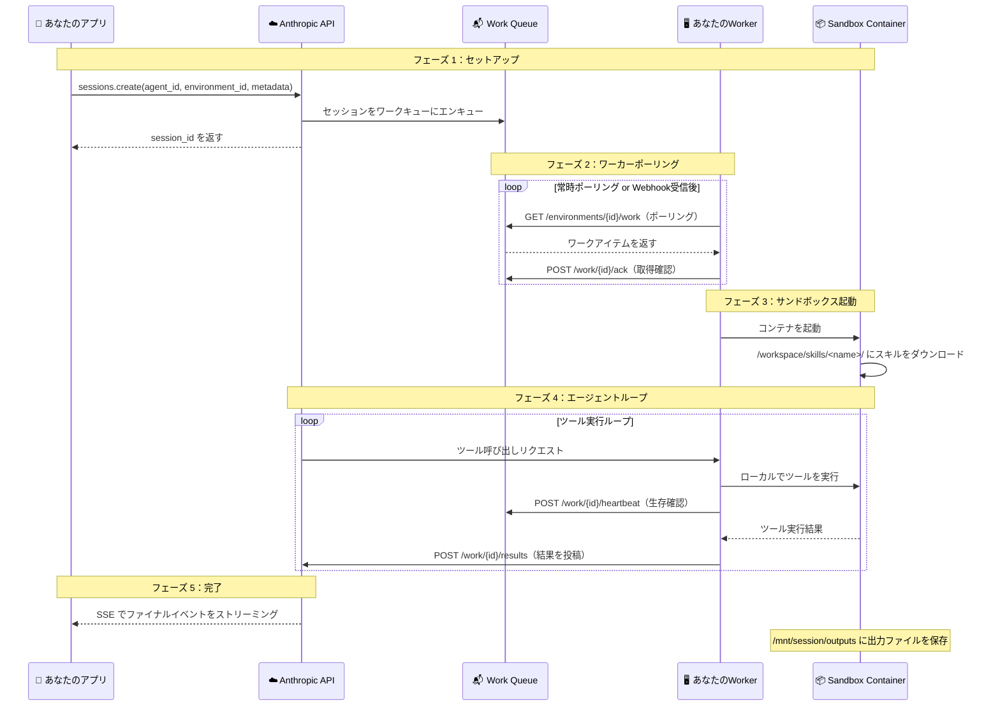
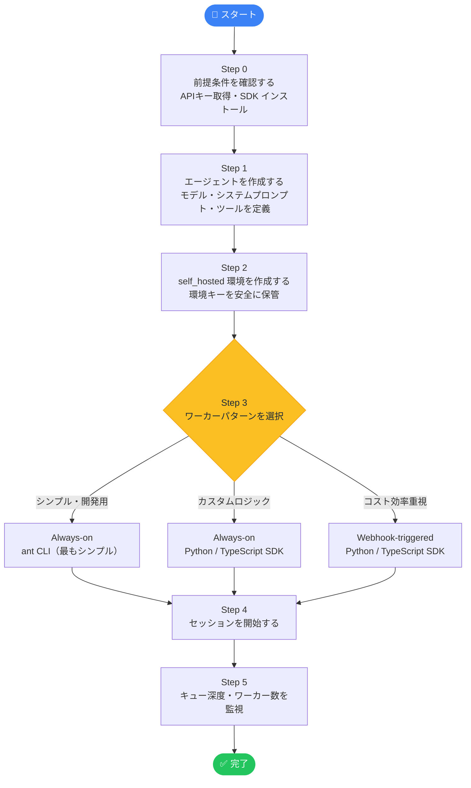
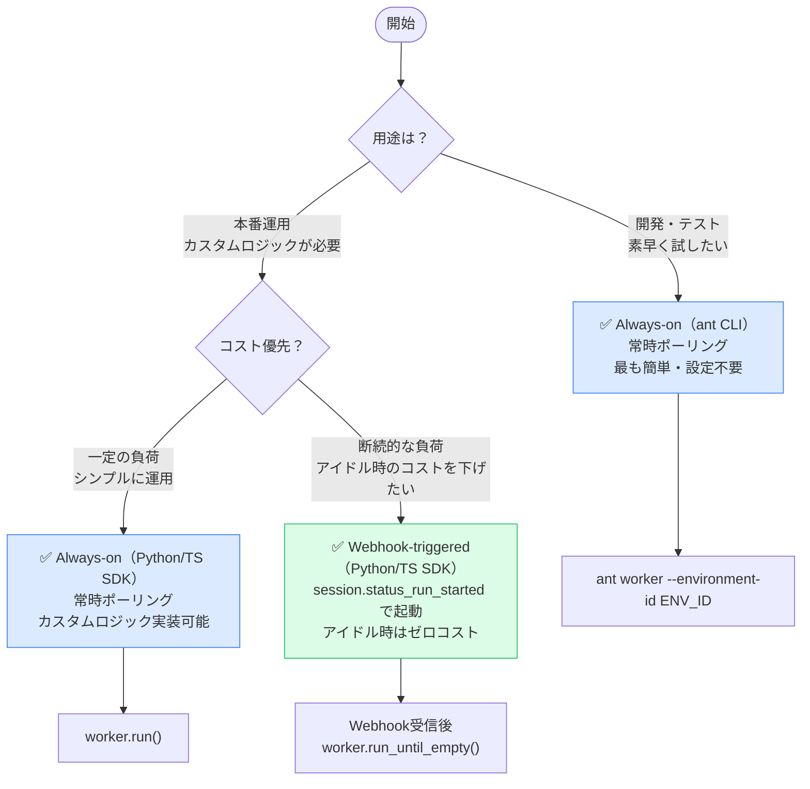
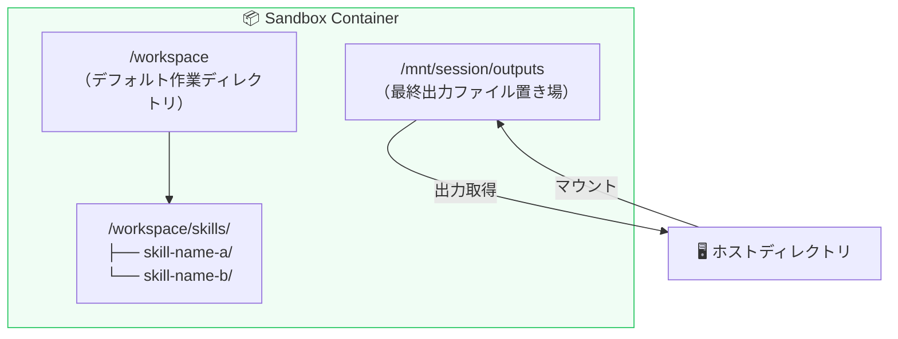
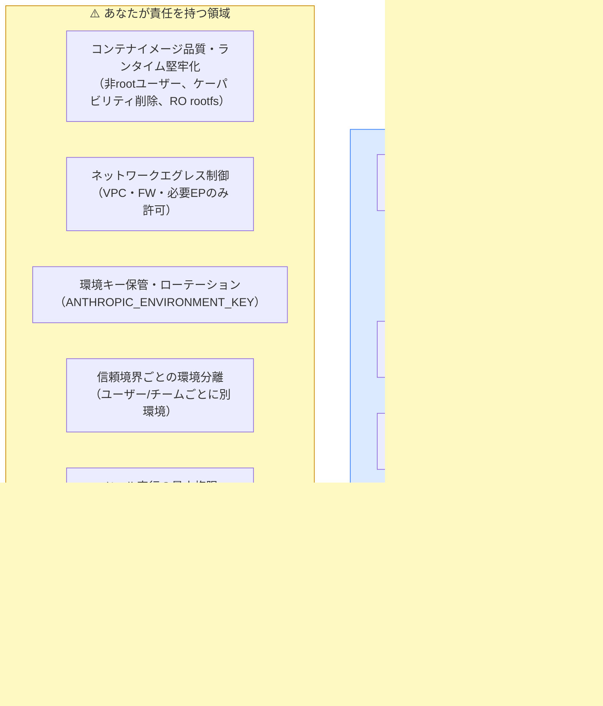
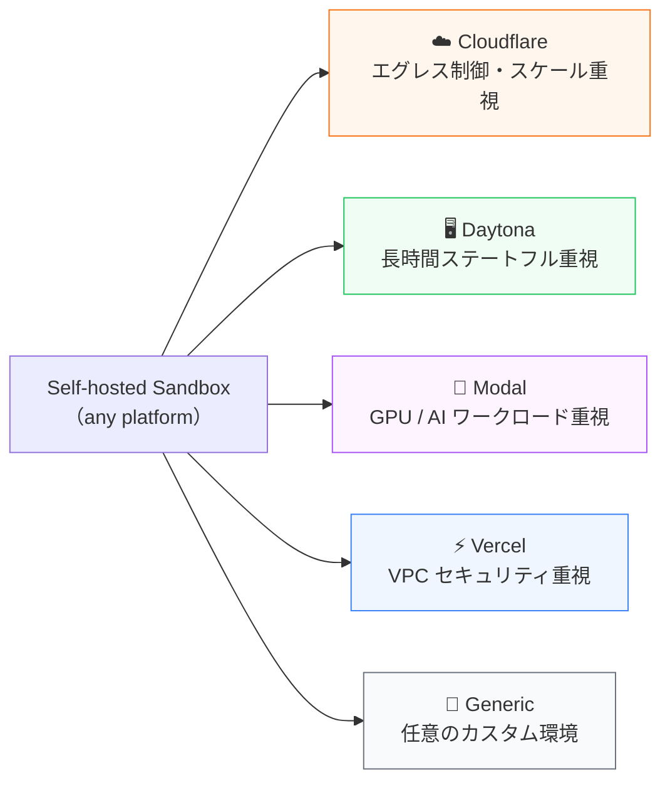
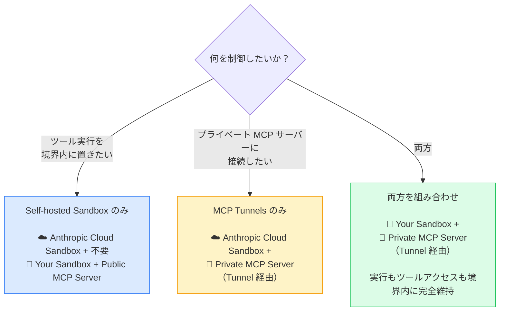

# 🚀 Claude Self-hosted Sandboxes 完全ガイド

> **ステータス:** Public Beta（2026年5月19日リリース）  
> **対象モデル:** Claude Opus 4.8 を含む Managed Agents 対応全モデル  
> **推奨対象:** Claude API 初学者 〜 中級エンジニア

---

## 📋 目次

1. [Self-hosted Sandboxes とは？](#1-self-hosted-sandboxes-とは)
2. [Cloud 環境との違い](#2-cloud-環境との違い)
3. [システムアーキテクチャ](#3-システムアーキテクチャ)
4. [ユースケース](#4-ユースケース)
5. [Step-by-Step セットアップ](#5-step-by-step-セットアップ)
   - [Step 0 — 前提条件の確認](#step-0--前提条件の確認)
   - [Step 1 — エージェントを作成する](#step-1--エージェントを作成する)
   - [Step 2 — Self-hosted 環境を作成する](#step-2--self-hosted-環境を作成する)
   - [Step 3 — ワーカーを起動する](#step-3--ワーカーを起動する)
   - [Step 4 — セッションを開始する](#step-4--セッションを開始する)
   - [Step 5 — モニタリングを設定する](#step-5--モニタリングを設定する)
6. [ワーカーパターンの選び方](#6-ワーカーパターンの選び方)
7. [サンドボックスのファイルシステム](#7-サンドボックスのファイルシステム)
8. [セキュリティ責任分担モデル](#8-セキュリティ責任分担モデル)
9. [サポートされているサンドボックスプロバイダー](#9-サポートされているサンドボックスプロバイダー)
10. [MCP トンネルとの組み合わせ](#10-mcp-トンネルとの組み合わせ)
11. [ベストプラクティス チェックリスト](#11-ベストプラクティス-チェックリスト)
12. [モニタリングと運用](#12-モニタリングと運用)
13. [参考リソース（URL）](#13-参考リソースurl)

---

## 1. Self-hosted Sandboxes とは？

**Self-hosted Sandboxes** は Claude Managed Agents の新機能で、AIエージェントの**ツール実行環境**をあなた自身のインフラに移動できる仕組みです。

### Managed Agents の4つのコアコンセプト

| コンセプト | 説明 |
|-----------|------|
| **Agent（エージェント）** | モデル・システムプロンプト・ツール・MCP・スキルの定義 |
| **Environment（環境）** | セッションが動作する場所（クラウド or あなたのインフラ） |
| **Session（セッション）** | 環境内で特定のタスクを実行するエージェントの稼働インスタンス |
| **Events（イベント）** | アプリとエージェント間でやり取りされるメッセージ |

### 鍵となるアーキテクチャ上の分離



> **ポイント:** オーケストレーション（推論・エラー回復・プロンプトキャッシュ）は常に Anthropic のクラウドで動きます。  
> Self-hosted では**ツールの実際の実行だけ**があなたのインフラに移動します。

---

## 2. Cloud 環境との違い

| 比較項目 | ☁️ Cloud Environment | 🏢 Self-hosted Sandbox |
|---------|---------------------|----------------------|
| ツールの実行場所 | Anthropic 管理のサンドボックス | **あなたのインフラ** |
| ネットワーク制御 | Anthropic のエグレスポリシー | **あなたのネットワークポリシー** |
| ファイル・GitHub リポジトリのマウント | Anthropic が管理 | **あなたが管理** |
| コンテナのライフサイクル | Anthropic が管理 | **あなたが管理** |
| カスタムコンテナイメージ | ❌ 不可 | ✅ 可能 |
| 社内サービスへのアクセス | 制限あり | ✅ プライベートネットワーク経由で自由 |
| データのネットワーク外出力 | あり（Anthropic インフラ上） | ❌ なし（境界内で完結） |
| ZDR / HIPAA BAA 対象 | ❌（Managed Agents は非対象） | ❌（同左） |
| セットアップの複雑さ | 低い（すぐ使える） | 中程度（ワーカー実装が必要） |

> **⚠️ 注意:** Managed Agents はステートフルな設計のため、現時点では Zero Data Retention (ZDR) および HIPAA BAA の対象外です。  
> 詳細: [API and data retention](https://platform.claude.com/docs/en/manage-claude/api-and-data-retention#feature-eligibility)

### Self-hosted が適しているケース



---

## 3. システムアーキテクチャ

### 全体のデータフロー



---

## 4. ユースケース

| ユースケース | 詳細 | 対象業界 |
|------------|------|---------|
| 機密データ処理 | 患者情報・金融データをネットワーク境界内で AI 分析 | 医療・金融 |
| 社内システム連携 | イントラネット API・プライベート DB へのアクセス | 製造・エンタープライズ |
| コンプライアンス対応 | 組織独自の監査ログ・セキュリティコントロールの適用 | 政府・金融・ヘルスケア |
| 重計算処理 | 長時間ビルド・画像生成・データパイプライン（GPU 活用） | AI/ML・メディア |
| ステートフル開発環境 | 長時間稼働・状態保持・SSH アクセスが必要なエージェント | エンジニアリング・R&D |
| カスタムランタイム | 特定の OS イメージ・パッケージ・設定が必要な環境 | DevOps・システム開発 |

### 実採用事例（公式ブログより、2026年5月）

| 企業 | 使用内容 | プロバイダー |
|-----|---------|------------|
| **Clay** | GTM エンジニアリングエージェント「Sculptor」でワークフローを自律構築・テスト | Daytona |
| **Rogo** | 機関投資家向け金融 AI プラットフォームで独自データを安全処理 | Vercel |
| **Amplitude** | ブランド準拠の UI デザインを生成する Design Agent | Cloudflare |
| **Mason** | 複雑な製品面での社内ツールのセキュアなオーケストレーション | Modal |

---

## 5. Step-by-Step セットアップ

### セットアップ全体フロー



---

### Step 0 — 前提条件の確認

#### 必要なもの

| 要件 | 詳細 | 取得先 |
|------|------|--------|
| Claude API キー | `sk-ant-...` 形式 | [platform.claude.com/settings/keys](https://platform.claude.com/settings/keys) |
| Beta ヘッダー | `managed-agents-2026-04-01`（SDK は自動付与） | 自動（SDK 利用時） |
| Python SDK | `pip install anthropic` | PyPI |
| TypeScript SDK | `npm install @anthropic-ai/sdk` | npm |
| ant CLI | `pip install anthropic` に同梱 | PyPI |
| `/bin/bash` | SDK ヘルパーが固定パスで参照（PATH 解決不可） | OS 標準 |
| TypeScript のみ追加要件 | `unzip`, `tar`, Node.js 22 以上 | OS パッケージマネージャー |

```bash
# Python SDK と ant CLI をインストール
pip install anthropic

# TypeScript SDK をインストール
npm install @anthropic-ai/sdk

# TypeScript の追加依存（Ubuntu 例）
apt-get install -y unzip tar
# Node.js 22 以上が必要（nvm 推奨）
nvm install 22 && nvm use 22

# API キーを環境変数に設定
export ANTHROPIC_API_KEY="sk-ant-xxxxxxxxxxxxxxxx"
```

> **⚠️ 重要:** SDK ヘルパーは `/bin/bash` を**固定パス**で参照します。  
> `PATH` 変数での解決は行われないため、`/bin/bash` が実際に存在することを確認してください。

---

### Step 1 — エージェントを作成する

エージェントは「モデル・システムプロンプト・ツール・スキルの定義」です。一度作成すれば ID で再利用できます。

```python
import anthropic

client = anthropic.Anthropic()

# エージェントを作成（モデルはエージェント側で設定、環境ではない）
agent = client.beta.agents.create(
    name="Self-hosted Demo Agent",
    model="claude-opus-4-8",           # Managed Agents 対応の全モデルが使用可能
    system_prompt="""You are a helpful coding assistant.
Your working directory is /workspace.
Agent skills are available at /workspace/skills/.
Output files should be written to /mnt/session/outputs.
""",
)

print(f"✅ Agent created: {agent.id}")
# 例: agent_01XxxxxxxxxxxxxXxxx
```

> **📌 ポイント:** モデルの指定は**エージェント側**で行います（環境側ではありません）。

---

### Step 2 — Self-hosted 環境を作成する

`type="self_hosted"` を指定して環境を作成します。  
ここで発行される**環境キー（`ANTHROPIC_ENVIRONMENT_KEY`）** の取り扱いが最も重要です。

```python
import anthropic

client = anthropic.Anthropic()

# self_hosted タイプの環境を作成
environment = client.beta.environments.create(
    name="Production Self-hosted Environment",
    type="self_hosted",
)

print(f"✅ Environment ID : {environment.id}")
print(f"🔑 Environment Key: {environment.key}")   # ← 必ずシークレットマネージャーへ
```

#### 環境キーの安全な保管（重要）

| ❌ やってはいけないこと | ✅ 推奨される方法 |
|----------------------|-----------------|
| `.env` ファイルに平文で書く | AWS Secrets Manager に保管 |
| コンテナイメージに焼き込む | GCP Secret Manager に保管 |
| Git リポジトリにコミットする | HashiCorp Vault に保管 |
| ワーカーホストの環境変数に設定（`ANTHROPIC_API_KEY` と混在） | CI/CD パイプラインでランタイム注入 |

> **🔑 セキュリティ原則:** `ANTHROPIC_ENVIRONMENT_KEY` はデータベースのパスワードと同等に扱ってください。  
> 漏洩が疑われる場合は**即座にローテーション**してください。Anthropic は即時無効化できません。

#### AWS での認証（Claude Platform on AWS を使用する場合）

AWS 上の Claude Platform では、環境キーの代わりに **AWS IAM（SigV4）** で認証します。

```bash
# IAM プリンシパルに以下のマネージドポリシーをアタッチ
# ARN: arn:aws:iam::aws:policy/AnthropicSelfHostedEnvironmentAccess
```

> **⚠️ 注意:** Claude Console で生成した環境キーは Claude Platform on AWS エンドポイントでは機能しません。  
> また、AWS では `GET /v1/environments/{id}/work` (リストエンドポイント) は現在利用不可です。

---

### Step 3 — ワーカーを起動する

ワーカーはワークキューをポーリングしてツール呼び出しをローカルで実行するプロセスです。  
3つの実装パターンがあります。

#### パターン A: Always-on（ant CLI）— 最もシンプル

```bash
# 環境変数を設定
export ANTHROPIC_ENVIRONMENT_KEY="env-key-xxxxxxxxxx"
export ANTHROPIC_ENVIRONMENT_ID="env-xxxxxxxxxxxxxxxxxx"

# ワーカーを常時稼働モードで起動
ant worker --environment-id "$ANTHROPIC_ENVIRONMENT_ID"

# 作業ディレクトリを変更する場合（システムプロンプトも合わせて更新すること）
ant worker --environment-id "$ANTHROPIC_ENVIRONMENT_ID" --workdir /custom/workspace
```

#### パターン B: Always-on（Python SDK）— カスタムロジック対応

```python
import os
import anthropic

# SDK の EnvironmentWorker が自動的にポーリングループを管理する
worker = anthropic.beta.EnvironmentWorker(
    environment_id=os.environ["ANTHROPIC_ENVIRONMENT_ID"],
    environment_key=os.environ["ANTHROPIC_ENVIRONMENT_KEY"],
)

# ブロッキング実行（Ctrl+C でグレースフルシャットダウン）
worker.run()
```

#### パターン C: Webhook-triggered（Python SDK）— コスト効率重視

```python
import os
import anthropic
from flask import Flask, request, jsonify

app = Flask(__name__)

@app.route("/webhook/anthropic", methods=["POST"])
def handle_webhook():
    """
    Anthropic から session.status_run_started イベントを受信したときに
    ワーカーを起動してキューをポーリングする。
    アイテムがなくなったら自動的にシャットダウンする。
    """
    payload = request.get_json()

    if payload.get("type") == "session.status_run_started":
        # セッション開始時だけワーカーを起動
        worker = anthropic.beta.EnvironmentWorker(
            environment_id=os.environ["ANTHROPIC_ENVIRONMENT_ID"],
            environment_key=os.environ["ANTHROPIC_ENVIRONMENT_KEY"],
        )
        # キューが空になったら自動終了（コスト効率が良い）
        worker.run_until_empty()

    return jsonify({"status": "ok"})

if __name__ == "__main__":
    app.run(port=8080)
```

> **💡 TypeScript SDK も同様のパターンで実装できます。**  
> TypeScript では追加で `unzip`, `tar`, Node.js 22+ が必要です。

---

### Step 4 — セッションを開始する

ワーカーが起動している状態でセッションを作成します。  
`environment_id` を指定することで Self-hosted が有効になります。

```python
import os
import anthropic

client = anthropic.Anthropic()

# セッションを作成
# metadata でセッション固有の情報をワーカーに渡す（ファイルマウント等に活用）
session = client.beta.sessions.create(
    agent=agent.id,
    environment_id=environment.id,
    metadata={
        "input_file": "s3://my-bucket/sensitive-data-2026.csv",  # ワーカーが読み取る
        "user_id":    "user_12345",
        "task":       "analyze_q1_report",
    },
)

print(f"✅ Session ID: {session.id}")
print(f"   Status   : {session.status}")

# SSE でイベントをストリーミング受信
for event in client.beta.sessions.stream_events(session.id):
    if event.type == "content_block_delta":
        print(event.delta.text, end="", flush=True)
    elif event.type == "session.status_completed":
        print("\n\n🎉 セッション完了")
        break
```

> **📌 ファイルとリポジトリについて:**  
> Cloud 環境と異なり、ファイル・GitHub リポジトリのマウントは Anthropic が管理しません。  
> `metadata` でパスを渡してワーカー側で処理するか、コンテナイメージに組み込んでください。

> **🚫 制限:** Self-hosted サンドボックスでは現在 Memory（永続メモリ）はサポートされていません。

---

### Step 5 — モニタリングを設定する

```python
import os
import anthropic

# ⚠️ 重要: モニタリングは「組織 API キー」で行う（環境キーではない）
# ワーカーホストから呼び出さない（ANTHROPIC_API_KEY の漏洩リスクがある）
client = anthropic.Anthropic()

stats = client.beta.environments.work.stats(
    os.environ["ANTHROPIC_ENVIRONMENT_ID"]
)

print(f"📊 キュー状態:")
print(f"   depth           = {stats.depth}")            # 待機中のアイテム数
print(f"   pending         = {stats.pending}")          # 処理中のアイテム数
print(f"   oldest_queued   = {stats.oldest_queued_at}") # 最古アイテムのタイムスタンプ（空ならNull）
print(f"   workers_polling = {stats.workers_polling}")  # 過去30秒でポーリングしたワーカー数
```

---

## 6. ワーカーパターンの選び方



### パターン比較表

| 比較項目 | Always-on（ant CLI） | Always-on（SDK） | Webhook-triggered（SDK） |
|---------|---------------------|-----------------|------------------------|
| 実装の複雑さ | 最低（コマンド1行） | 低い | 中程度（Webhookサーバーが必要） |
| カスタムロジック | ❌ | ✅ | ✅ |
| レイテンシ | 最低 | 低い | やや高い（起動オーバーヘッド） |
| アイドルコスト | 常時発生 | 常時発生 | ほぼゼロ |
| スケーリング | 手動 | 手動 or 自動実装 | イベント駆動で自動 |
| 向いているケース | 開発・テスト | 一定負荷の本番 | 断続的な本番負荷 |
| ant CLI 対応 | ✅ | ❌ | ❌ |
| SDK 対応 | ❌（CLI のみ） | ✅ Python・TS | ✅ Python・TS |

---

## 7. サンドボックスのファイルシステム



| パス | 説明 | 注意点 |
|-----|------|--------|
| `/workspace` | デフォルト作業ディレクトリ。ツール実行の基点 | `--workdir` で変更した場合はシステムプロンプトも必ず更新 |
| `/workspace/skills/<name>/` | エージェントスキルの自動ダウンロード先 | スキルを使う際はこのパスを参照するようプロンプトに記載 |
| `/mnt/session/outputs` | セッションの最終出力ファイル置き場 | ホストディレクトリをここにマウントしないと出力が取得できない |

> **⚠️ `--workdir` 変更時の注意:**  
> デフォルトの `/workspace` から変更した場合、Claude がスキルを見つけられるよう  
> エージェントのシステムプロンプトを合わせて更新してください。

---

## 8. セキュリティ責任分担モデル

<br>



### Anthropic にできないこと（重要）

| 制限 | 詳細 |
|-----|------|
| 漏洩キーの即時無効化 | 異常使用の検出は可能だが、瞬時の無効化はできない。`ANTHROPIC_ENVIRONMENT_KEY` は DB パスワードと同様に扱い、漏洩時は即座にローテーションすること |
| ワーカービルドの検証 | コンテナイメージを検査する仕組みがない。サプライチェーン攻撃はコントロールプレーンから検出不可 |
| コンテナ内ツール間の分離 | Anthropic のセキュリティ境界はコンテナの外側で終わる。コンテナ内のツール分離はすべてあなたの責任 |
| あなたの環境のデータ保持 | セッションコンテンツがワーカーに届いた後は Anthropic のデータライフサイクル管理外 |

---

## 9. サポートされているサンドボックスプロバイダー

Self-hosted Sandboxes は任意のプラットフォームで構築できますが、公式の統合ガイドが提供されているプロバイダーがあります。

| プロバイダー | 主な特徴 | 採用事例 | ガイド URL |
|------------|---------|---------|-----------|
| **Cloudflare** | microVM + 軽量アイソレート、ゼロトラスト秘密注入、カスタマイズ可能なエグレスプロキシ | Amplitude（Design Agent） | [developers.cloudflare.com](https://developers.cloudflare.com/sandbox/claude-managed-agents/) |
| **Daytona** | 長時間ステートフル、SSH / 認証済みプレビュー URL、状態の一時停止・復元 | Clay（Sculptor） | [daytona.io](https://www.daytona.io/docs/en/guides/claude/claude-managed-agents) |
| **Modal** | AI ワークロード専用クラウド、サブ秒起動、GPU / CPU オンデマンド | Mason、DoorDash | [GitHub](https://github.com/modal-labs/claude-managed-agents-modal-sandbox) |
| **Vercel** | VM セキュリティ + VPC ピアリング、ミリ秒起動、ネットワーク境界での認証情報注入 | Rogo | [vercel.com](https://vercel.com/kb/guide/run-claude-managed-agent-tools-with-vercel-sandbox) |
| **Generic** | 任意の Docker コンテナ実行可能なプラットフォーム | カスタム要件 | [公式ドキュメント](https://platform.claude.com/docs/en/managed-agents/self-hosted-sandboxes) |



---

## 10. MCP トンネルとの組み合わせ

**Self-hosted Sandboxes** と **MCP Tunnels** は独立した機能ですが、組み合わせることで最大効果を発揮します。

| 機能 | 制御対象 | 独立性 |
|-----|---------|--------|
| **Self-hosted Sandboxes** | エージェントのコードが**実行される場所** | 単独で使用可能 |
| **MCP Tunnels** | Anthropic がプライベートネットワーク内の MCP サーバーに**到達する方法** | 単独で使用可能 |



> **📌 MCP Tunnels のステータス:** 現在リサーチプレビュー中です。  
> アクセスには申請が必要です: [https://claude.com/form/claude-managed-agents](https://claude.com/form/claude-managed-agents)

---

## 11. ベストプラクティス チェックリスト

### 🔐 セキュリティ

```
[ ] ANTHROPIC_ENVIRONMENT_KEY を AWS Secrets Manager / GCP Secret Manager / Vault に保管した
[ ] 環境変数ファイル (.env) やコンテナイメージに環境キーを埋め込んでいない
[ ] ワーカーホストに ANTHROPIC_API_KEY を設定していない（ツール呼び出しからの漏洩リスク）
[ ] コンテナを非 root ユーザー（例: UID 1000）で実行している
[ ] 不要な Linux ケーパビリティを削除している（--cap-drop=ALL）
[ ] 読み取り専用ルートファイルシステムを検討した（--read-only）
[ ] ネットワークエグレスをツールが必要とするエンドポイントのみに制限した
[ ] 信頼境界ごとに別々の環境（Environment）を作成した
[ ] 環境キーの漏洩が疑われた場合の即時ローテーション手順を整備した
[ ] コンテナイメージの定期的な脆弱性スキャンを設定した
```

### ⚡ パフォーマンス

```
[ ] work.stats で depth を監視し、バックログに応じてワーカーをスケールする仕組みを用意した
[ ] workers_polling == 0 になったらアラートを発火する死活監視を設定した
[ ] 断続的な負荷には Webhook-triggered パターンでコストを最適化した
[ ] oldest_queued_at が古くなりすぎた場合のアラートを設定した
```

### 🛠️ 運用

```
[ ] /mnt/session/outputs にホストディレクトリをマウントして出力を取得できるようにした
[ ] work.stop によるグレースフルシャットダウン手順を整備した
[ ] --workdir を変更した場合、エージェントのシステムプロンプトも更新した
[ ] モニタリング呼び出しはワーカーホストではなく別の運用ツールから行っている
[ ] Memory は Self-hosted では現在未サポートであることを把握している
```

### Docker 設定例（セキュリティ強化版）

```dockerfile
# Dockerfile ベストプラクティス例
FROM ubuntu:24.04

# 非 root ユーザーを作成
RUN useradd -u 1000 -m -s /bin/bash agentuser

# 必要なパッケージのみインストール
RUN apt-get update && apt-get install -y \
    bash curl unzip tar \
    && rm -rf /var/lib/apt/lists/*

# Node.js 22 をインストール（TypeScript SDK を使う場合）
RUN curl -fsSL https://deb.nodesource.com/setup_22.x | bash - \
    && apt-get install -y nodejs

WORKDIR /workspace
RUN chown agentuser:agentuser /workspace

# 非 root ユーザーで実行
USER agentuser
```

```bash
# コンテナ起動オプション（セキュリティ強化版）
docker run \
  --user 1000:1000 \
  --cap-drop ALL \
  --read-only \
  --tmpfs /tmp \
  --network restricted_network \
  -v /host/outputs:/mnt/session/outputs \
  -e ANTHROPIC_ENVIRONMENT_KEY="$(get_secret env_key)" \
  my-worker-image:latest
```

---

## 12. モニタリングと運用

### キュー状態の確認とオートスケーリング例

```python
import os
import anthropic

# ⚠️ 組織 API キー（ANTHROPIC_API_KEY）で認証
# ワーカーホストからは呼び出さない
client = anthropic.Anthropic()

def check_queue_and_scale():
    stats = client.beta.environments.work.stats(
        os.environ["ANTHROPIC_ENVIRONMENT_ID"]
    )

    print(f"depth={stats.depth} pending={stats.pending} "
          f"workers={stats.workers_polling}")

    # depth > 10 ならワーカーをスケールアウト
    if stats.depth > 10:
        needed = stats.depth // 5
        print(f"⬆️  Scaling up: launching {needed} additional workers")
        # launch_workers(count=needed)

    # workers_polling == 0 は死活アラート
    if stats.workers_polling == 0:
        print("🚨 ALERT: No workers are polling!")
        # send_alert("No workers polling!")

    # バックログアラート: 最古アイテムが古すぎる場合
    if stats.oldest_queued_at:
        from datetime import datetime, timezone
        age_minutes = (
            datetime.now(timezone.utc) - stats.oldest_queued_at
        ).total_seconds() / 60
        if age_minutes > 10:
            print(f"⚠️  Queue backlog: oldest item is {age_minutes:.1f} min old")
```

### キューメトリクスの意味

| メトリクス | 説明 | 活用方法 |
|-----------|------|---------|
| `depth` | キューで待機中のアイテム数 | ワーカースケールアウトのトリガー |
| `pending` | ワーカーが取得・処理中のアイテム数 | 現在の処理負荷の把握 |
| `oldest_queued_at` | 最古の待機アイテムのタイムスタンプ（空なら `null`） | バックログアラートの基準 |
| `workers_polling` | 過去30秒でポーリングしたワーカー数 | 死活監視（0になったら要アラート） |

### グレースフルシャットダウン

```python
import os
import anthropic

# ワーカーホスト外の運用ツールから実行
client = anthropic.Anthropic()

# グレースフルシャットダウン（現在のツール呼び出し完了後に停止）
work = client.beta.environments.work.stop(
    os.environ["ANTHROPIC_WORK_ID"],             # 対象ワークアイテムの ID
    environment_id=os.environ["ANTHROPIC_ENVIRONMENT_ID"],
)
print(f"State: {work.state}")

# 即時強制終了する場合（現在のツール呼び出しを中断）
# work = client.beta.environments.work.stop(
#     os.environ["ANTHROPIC_WORK_ID"],
#     environment_id=os.environ["ANTHROPIC_ENVIRONMENT_ID"],
#     force=True,
# )
```

> **📌 `ANTHROPIC_WORK_ID` について:**  
> この変数はワーカーホストで自動設定されません。  
> 対象ワークアイテムの ID を確認して、運用ツールから明示的に渡してください。

---

## 13. 参考リソース（URL）

### 公式ドキュメント

| リソース | URL |
|---------|-----|
| Self-hosted Sandboxes 統合ガイド | <https://platform.claude.com/docs/en/managed-agents/self-hosted-sandboxes> |
| セキュリティモデル（責任分担） | <https://platform.claude.com/docs/en/managed-agents/self-hosted-sandboxes-security> |
| Managed Agents 概要 | <https://platform.claude.com/docs/en/managed-agents/overview> |
| クイックスタート | <https://platform.claude.com/docs/en/managed-agents/quickstart> |
| セッションの開始 | <https://platform.claude.com/docs/en/managed-agents/sessions> |
| Environments Work API リファレンス | <https://platform.claude.com/docs/en/api/beta/environments/work> |
| Cloud 環境セットアップ | <https://platform.claude.com/docs/en/managed-agents/environments> |
| API データ保持ポリシー | <https://platform.claude.com/docs/en/manage-claude/api-and-data-retention> |
| Claude Platform on AWS | <https://platform.claude.com/docs/en/build-with-claude/claude-platform-on-aws> |
| MCP Tunnels 概要 | <https://platform.claude.com/docs/en/agents-and-tools/mcp-tunnels/overview> |

### 公式ブログ・リリースノート

| リソース | URL |
|---------|-----|
| Self-hosted Sandboxes & MCP Tunnels 発表（2026年5月19日） | <https://claude.com/blog/claude-managed-agents-updates> |
| Claude Console | <https://platform.claude.com/> |

### サンドボックスプロバイダー統合ガイド

| プロバイダー | URL |
|------------|-----|
| Cloudflare 統合ガイド | <https://developers.cloudflare.com/sandbox/claude-managed-agents/> |
| Daytona 統合ガイド | <https://www.daytona.io/docs/en/guides/claude/claude-managed-agents> |
| Modal 統合ガイド（GitHub） | <https://github.com/modal-labs/claude-managed-agents-modal-sandbox> |
| Vercel 統合ガイド | <https://vercel.com/kb/guide/run-claude-managed-agent-tools-with-vercel-sandbox> |

### サンプルコード・クックブック

| リソース | URL |
|---------|-----|
| Claude Cookbooks（Self-hosted Sandboxes） | <https://github.com/anthropics/claude-cookbooks/tree/main/managed_agents/self_hosted_sandboxes> |
| MCP Tunnels アクセス申請 | <https://claude.com/form/claude-managed-agents> |

---

> **📌 免責事項**  
> 本ガイドは上記の公式ドキュメント（取得日: 2026年6月10日）を基に作成しています。  
> Claude Managed Agents は現在 **Public Beta** です。API 仕様・動作は予告なく変更される可能性があります。  
> 最新の正確な情報は必ず[公式ドキュメント](https://platform.claude.com/docs/en/managed-agents/self-hosted-sandboxes)をご確認ください。

---

*ドキュメント作成日: 2026年6月10日 | ベース: Anthropic 公式ドキュメント & ブログ*
