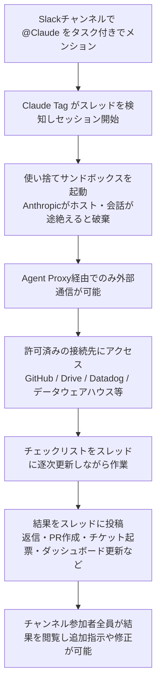
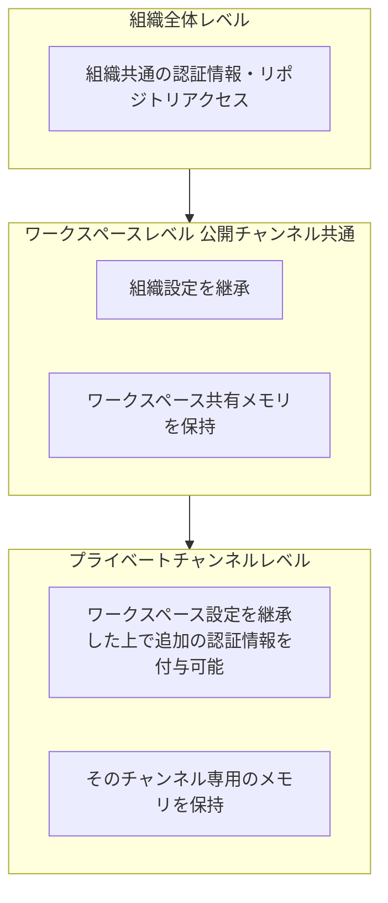
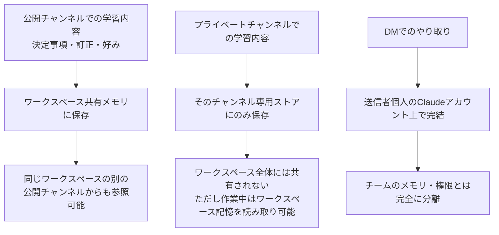
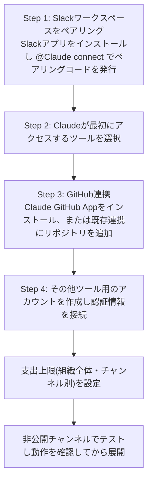
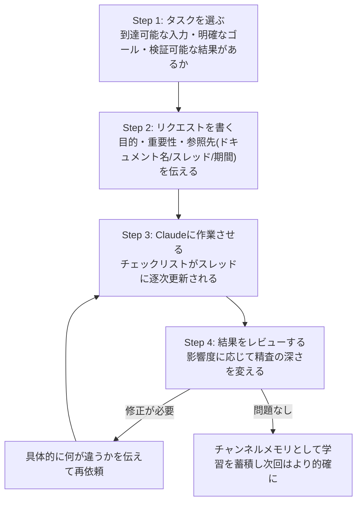
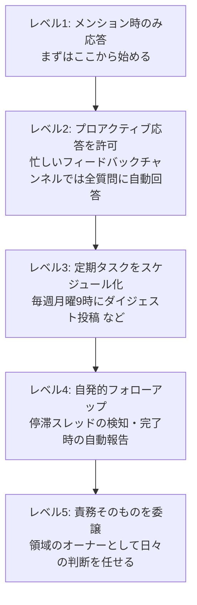

# Claude Tag 活用ガイド ― 中級者〜上級者向けベストプラクティス

> **本ガイドについて**
> 本ドキュメントは Claude Tag(Slack上でチームがClaude をタグ付けして委任できる新機能)について、公式ドキュメント・公式チュートリアル、および著名な開発者やコミュニティの発信をもとに、2026年7月17日時点の情報でまとめたものです。Claude Tag は現在パブリックベータであり、UIや仕様は今後変更される可能性があります。最新情報は必ず公式ドキュメント([claude.com/docs/claude-tag](https://claude.com/docs/claude-tag/overview))を確認してください。
> 参照元は各セクションおよび末尾の「参考文献・出典」に記載しています。

---

## 目次

1. [Claude Tagとは何か](#1-claude-tagとは何か)
2. [Claude Code / Cowork との違い](#2-claude-code--cowork-との違い)
3. [全体アーキテクチャを理解する](#3-全体アーキテクチャを理解する)
4. [Identity(身元)とAccess(権限)モデル](#4-identity身元とaccess権限モデル)
5. [メモリモデル ― チャンネル・ワークスペース・DM](#5-メモリモデル--チャンネルワークスペースdm)
6. [管理者向け:セットアップ手順ステップバイステップ](#6-管理者向けセットアップ手順ステップバイステップ)
7. [エンドユーザー向け:使い始めのステップ](#7-エンドユーザー向け使い始めのステップ)
8. [ベストプラクティス:タスク委任の4ステップ](#8-ベストプラクティスタスク委任の4ステップ)
9. [プロアクティブ性と自律性を段階的に引き上げる](#9-プロアクティブ性と自律性を段階的に引き上げる)
10. [上級者向けTips ― コミュニティ発の運用ノウハウ](#10-上級者向けtips--コミュニティ発の運用ノウハウ)
11. [セキュリティとガバナンス](#11-セキュリティとガバナンス)
12. [既知の課題・注意点](#12-既知の課題注意点)
13. [他製品との比較](#13-他製品との比較)
14. [導入前チェックリスト](#14-導入前チェックリスト)
15. [参考文献・出典](#15-参考文献出典)

---

## 1. Claude Tagとは何か

Claude Tag は、2026年6月23日にAnthropicが発表した、Slack上でClaudeをチームメンバーとして参加させる新しい機能です。管理者が特定のチャンネルにClaudeへのアクセス権を付与すると、そのチャンネルにいる誰もが `@Claude` とタグ付けするだけでタスクを委任できるようになります。

Anthropicはこれを「Claude Codeの延長線上にある進化」と位置づけており、社内では製品チームのコードの65%がClaude Tagの内部版によって生成されているとされています。AI研究者として著名なAndrej Karpathy氏(Tesla・OpenAIでの経験で知られる)は、Slackへの統合を「LLMのUI/UXにおける3度目の大きな再設計」と評しており、チャットボックス型から「作業がすでに行われている場所にAIが常駐する」形への転換点として注目されています。

**現時点(2026年7月17日)での位置づけ:**

| 項目 | 内容 |
|---|---|
| 提供状況 | パブリックベータ |
| 対応プラン | Claude Team / Claude Enterprise のみ(Free・Pro・Maxの個人プランは対象外) |
| 稼働モデル | Claude Opus 4.8 |
| 提供チャネル | まずSlack。今後他のワークプレイスツールへの拡張を予告 |
| 旧製品との関係 | 旧「Claude in Slack」アプリを置き換え。既存ユーザーは30日以内に移行選択可能で、**2026年8月3日に自動移行**が予定されている |
| 課金モデル | 座席課金なし。組織の「利用残高(usage balance)」からの従量課金 |

---

## 2. Claude Code / Cowork との違い

Claude Tag・Claude Cowork・Claude Codeはいずれも「Claudeにタスクを委任する」という点で似ていますが、想定シーンが異なります。公式ドキュメントは「チームで共有チャンネルの仕事をするならClaude Tag、個人のファイルで作業するならCoworkかClaude Code」と整理しています。

| 観点 | Claude Tag | Claude Cowork | Claude Code |
|---|---|---|---|
| 主な利用場所 | Slackチャンネル・スレッド・DM | デスクトップアプリ(個人のワークスペース) | ターミナル・IDE・デスクトップアプリ |
| 誰と共有するか | チャンネル参加者全員が同じClaudeとやり取り(マルチプレイヤー) | 基本的に個人利用 | 基本的に個人利用 |
| コンテキストの蓄積 | チャンネル履歴・ワークスペース横断の記憶を自動蓄積 | セッション・プロジェクト単位 | リポジトリ単位(CLAUDE.md等) |
| 実行環境 | Anthropicホストの使い捨てサンドボックス | ローカル/クラウドの作業環境 | ローカル環境、または`--sandbox`によるOSレベルの分離 |
| 自発的な行動 | アンビエント(能動)モードで停滞スレッドの検知・定期実行が可能 | スケジュールタスクの委任が可能 | 基本は同期的なセッション実行 |
| 課金主体 | 組織(チャンネル作業)/個人(DM) | 個人・組織 | 個人・組織 |

---

## 3. 全体アーキテクチャを理解する

`@Claude` がタグ付けされてから結果がスレッドに返ってくるまでの流れは、次のようになっています。Claudeはユーザーのローカルマシンやネットワーク内では動作せず、Anthropicがホストする使い捨てサンドボックス上でセッションごとに起動します。

ポイントは次の3つです。

- **セッションはスレッド単位**:新しいトップレベルメッセージは新しいタスクとして扱われるため、続きの作業をしたい場合は同じスレッド内で返信する必要があります。
- **既存メッセージの編集は無効**:送信済みメッセージを編集してもClaudeには反映されません。新しい返信を送る必要があります。
- **サンドボックスは使い捨て**:インストールした依存関係や未コミットのファイルはセッション終了時に失われるため、保持すべき変更は必ずコミット・プッシュする必要があります。

---

## 4. Identity(身元)とAccess(権限)モデル

Claude Tagの安全性を支えているのが「Agent Identity(エージェント身元)」というモデルです。Claudeはタグ付けしたユーザー個人の権限を借りるのではなく、**Claude自身の専用アカウント**でSlackに投稿し、GitHub App としてPRを開き、データウェアハウスには管理者が発行したサービスアカウントで接続します。これにより、共有チャンネルが誰かの個人ドキュメントへの抜け道になることはありません。

アクセス権は次の3階層で管理され、上位階層の設定を下位が継承します。

- **組織全体**:どこにインストールされていても適用される共通の認証情報・リポジトリ。
- **ワークスペース**:あるSlackワークスペース内のすべての公開チャンネルに適用され、組織設定を継承する。
- **プライベートチャンネル**:ワークスペース設定に加えて、そのチャンネルだけの追加権限(例:法務チャンネルだけにCRMアクセスを許可)を持たせられる。プライベートチャンネルごとに個別のIdentityが作成され、公開チャンネルはワークスペース単位のIdentityを共有する。

Enterprise プランでは、ロールベースアクセス制御(RBAC)により「誰がClaudeを呼び出せるか」自体も制御できます。つまり1つのチャンネルが「Claudeが何にアクセスできるか」と「誰がそれを依頼できるか」の両方を規定する単位になります。

---

## 5. メモリモデル ― チャンネル・ワークスペース・DM

Claude Tagは「必要な作業のためにコンテキストを構築する」ことを前提に設計されており、タスク終了ごとに記憶を破棄するのではなく、チャンネル・ワークスペース単位でメモリを保持し続けます。管理者はこの記憶を閲覧・編集・削除できます。

重要な運用ポイント:

- `#launch-week` のような公開チャンネルで記録された決定事項は、後から `#gtm-west` のような別チャンネルで尋ねたときにも参照される。Claudeがあるチャンネルの情報を引用した場合、それは「ワークスペース記憶を読んでいる」だけであり、個人についての記録ではない。
- チャンネル内で「`@Claude このチャンネルについて何を覚えている?`」と尋ねると、蓄積された記憶を確認できる。誤った記憶は誰でも訂正・削除を依頼できる。
- Slack上でのやり取りは、通常のclaude.aiでの会話履歴とは別管理であり、互いに表示されない。

---

## 6. 管理者向け:セットアップ手順ステップバイステップ

Claude Tagのセットアップは `claude.ai/admin-settings/claude-tag` から行い、組織のPrimary OwnerまたはOwner権限が必要です(Admin権限では実行不可)。設定は一度行えば、対象チャンネルの全員がすぐに利用を開始できます。

**注意点:**

- Slackワークスペースのペアリングコマンドは、スレッド内の返信としてではなく、新規のトップレベルメッセージとして送信する必要があります(スレッド内では通常のリクエストとして処理されてしまいます)。
- ペアリングコードの有効期限は15分。
- ペアリング自体はSlackワークスペースの管理者権限があれば誰でも実行可能ですが、それ以降のIdentity・接続先・チャンネルごとのアクセス権設定はClaude組織のOwner権限が必要です。
- 「Access bundle(アクセスバンドル)」という単位で、認証情報とリポジトリのセットをまとめて管理し、それをどのワークスペース・チャンネルに適用するか指定します。

---

## 7. エンドユーザー向け:使い始めのステップ

チャンネルにClaude Tagが既に導入されている場合、エンドユーザー側で追加のセットアップは不要です。

1. **アクセス範囲を確認する**:作業を依頼する前に「`@Claude このチャンネルから何にアクセスできる?`」と尋ねる、またはClaudeの返信フッターにある「Configure」をクリックして接続状況を確認する。
2. **公開チャンネルで作業する**:DMよりも公開チャンネルでの作業を優先することで、Claudeがチャンネルの履歴全体を文脈として活用でき、チームメイトも成果を再利用できる。
3. **DMは個人の領域**:DMでは自分のclaude.aiアカウントに紐づく個人の接続(カレンダー・メール等)が使え、チームの権限やメモリとは分離される。管理者はDM自体を組織全体で無効化することもできる。

---

## 8. ベストプラクティス:タスク委任の4ステップ

公式チュートリアル「Best practices for using @Claude」は、良いタスクの条件を「Claudeが到達可能な入力」「明確に述べられたゴール」「誰かが検証できる結果」の3つとしています。この考え方をもとにした委任のライフサイクルが次の図です。

**各ステップの実践ポイント:**

- **Step 1(タスクを選ぶ)**:初めての依頼には、すでにチャンネル内にある情報だけで完結するタスク(例:月曜日以降の要約、未対応スレッドの棚卸し)を選ぶと、結果をすぐ自分で検証できる。
- **Step 2(リクエストを書く)**:優秀な新人に説明するように、ゴール・背景・参照先を伝える。手順そのものはClaudeに任せてよい。出典を明示するよう依頼すると検証しやすくなる。
- **Step 3(作業させる)**:Claudeは着手した旨を短く報告し、チェックリストを更新し続ける。チャンネル内の誰でも途中で文脈を追加したり方向修正したりできる。
- **Step 4(レビューする)**:リスクに比例した精査を行う。顧客向けやシステム変更を伴う成果物は入念に確認し、分析系のタスクには「自分の一次回答の誤りを探すセカンドパスをして」と依頼するのも有効。同じ間違いが繰り返される場合は、セッションの実行内容を開いて確認し、訂正内容を伝える。訂正はチャンネルの記憶として蓄積される。

---

## 9. プロアクティブ性と自律性を段階的に引き上げる

Claude Tagは既定では「タグ付けされた時だけ応答する」設定になっています。信頼できると分かった範囲から、段階的に自律性を引き上げていくのが推奨される進め方です。

- **レベル2の切り替え方**:「このチャンネルではタグ付けされた時だけ返信して」「ここでは答えられる質問には全部答えて」など、平易な言葉で指示するだけで挙動が変わる。誤答よりも無回答の方が困る忙しいチャンネルではプロアクティブ設定が有効。プロアクティブ応答自体を有効化できるかは管理者側の設定に依存する。
- **レベル3のスケジューリング**:毎週同じ内容を依頼していることに気づいたら、「これを定期実行にして」と伝えるだけでスケジュールタスク化できる。
- **レベル4の自発的フォロー**:「3日後に修正が定着しているか確認して」「このスレッドが停滞したら教えて」といった依頼も可能。
- **レベル5の権限委譲**:「月曜にダイジェストを投稿して」ではなく「このチャンネルの未解決の質問に責任を持って。毎日確認し、答えられるものは答え、適切な人にタグ付けして」という形で、判断そのものを委ねる。加えて、1日の終わりにチャンネルの振り返りをさせて改善点を書き出させる、複数チャンネルを横断して「繰り返し提起されているのに誰も答えていない話題」を洗い出させる、といった使い方も紹介されています。

---

## 10. 上級者向けTips ― コミュニティ発の運用ノウハウ

ここからは公式ドキュメントに加えて、Anthropic社員や著名な開発者がSNS上で共有した運用ノウハウをまとめます(出典は各項目末尾および第15章を参照)。

### 10.1 Thariq Shihipar氏(Anthropic Claude Codeチーム)による実践Tips

Anthropic のClaude Codeチームに所属するThariq Shihipar氏(X: `@trq212`)が公開直後に投稿したベストプラクティス・スレッドは、Slackの公式アカウントから「ステートフルなエージェントワークフローの構築法についての実例」と評されました。要点は次の通りです。

- **チャンネルごとにClaudeの個性が異なる前提で「自己紹介」する**:新しいチャンネルに導入したら、ピン留めメッセージでペルソナ・応答方針・記憶してほしい前提を伝える。これはリポジトリの `CLAUDE.md` に相当する役割を果たす。
- **個人用チャンネルを作る**:`#自分の名前-claude` のような専用チャンネルを作り、自分向けのタスクや好みの指示をそこに集約する。バグ報告などを転送しておけば、自分の好みに沿った形で処理させられる。
- **ピン留めのステータスメッセージを維持させる**:「常に最新化されたステータスをピン留めメッセージに反映して」と指示しておくと、スレッドの海に埋もれずに全体像を把握できる。
- **絵文字リアクションで状態を可視化する**:トップレベルのスレッドに ⏳(進行中)✅(完了)❓(要確認)🛑(停止)のような絵文字でリアクションさせることで、一目で状態が分かるようにする。
- **用途特化チャンネルで独創的に使う**:例えば「予定調整」専用チャンネルを作り、参加者がClaudeにタグ付けするだけでカレンダーの空き時間を探させる、といった使い方も紹介されている。

### 10.2 Cat Wu氏(Anthropic プロダクトマネージャー)によるIdentity/権限の解説

Anthropicのプロダクトマネージャーであるcatwu氏(X: `@_catwu`)は、Agent Identityと権限設定の考え方について解説するスレッドを公開しています。要旨は本ガイドの第4章の内容と一致しており、「アクセス権は多めに与えてから組織のポリシーに応じて絞り込む方が、実運用では機能しやすい」という知見が共有されています。

### 10.3 Jason Zhou氏・Matt Pocock氏による「ループエンジニアリング」の視点

AI活用のコンテンツで知られるJason Zhou氏(`@jasonzhou1993`)は、Claude Tagの登場を「委任すべき定型業務をエージェントの常設ループに任せ、共有ナレッジ層・ログ・検証を組み合わせる」という、いわゆる**ループエンジニアリング(loop engineering)**の潮流の一部として位置づけたテンプレートを公開しました。TypeScript教育者として著名なMatt Pocock氏(`@mattpocockuk`)も同時期に、「委任できそうな業務を見つけ出す」ための `/loop-me` スキルを公開しており、Claude Tagのような常設エージェントをどう業務に組み込むかという設計思想の広がりを示しています。

### 10.4 社内活用パターン(Anthropic自身の事例)

Anthropic自身がClaude Tagを社内でどう使っているかも参考になります。

| ユースケース | 動き方 |
|---|---|
| インシデント対応 | インシデントスレッドでタグ付けすると、グラフ取得・デプロイ差分の確認まで行い、原因と担当者候補を提示。承認後は修正の実装・反映・メトリクス回復の確認・クローズまで一気通貫で対応 |
| バグトリアージ | フィードバックチャンネルに常駐し、報告を自動的に拾って該当コードを特定・再現・`git blame`・修正実装・担当者へのタグ付けまで実施。残る作業はコードレビューのみ |
| 依存タスクの待機 | 「バックエンドが完成したらフロントエンドを配線して」のように、前提条件待ちのタスクを渡しておくと、完了を検知してから数日後にPRを提示 |
| バックグラウンド監視 | ダッシュボードの代わりに閾値を渡す(例:「CIが赤のまま長く続いたら教えて」)。閾値を超えたときだけ、原因コミットとともに報告 |
| リリース・指標監視 | A/Bテストの指標とガードレールを渡しておくと、ガードレール逸脱時に警告、有意差が出たタイミングでロールアウト用PRとともに報告 |

---

## 11. セキュリティとガバナンス

Claude Tagにチームの実務を任せられる根拠となっているのが、以下のセキュリティ設計です。

- **サンドボックス分離**:すべてのリクエスト(人が入力したものもスケジュール起動のものも)は、Anthropicがホストする隔離済みサンドボックスの中で実行される。既定では外向き通信がすべてブロックされている。
- **Agent Proxy経由の通信のみ許可**:サンドボックスは「Agent Proxy」を経由してのみ外部と通信でき、許可リストにないホストへのデータ送出はブロックされる。どのホストを許可するかは接続ごと・アクセスバンドルごとに管理者が設定する。
- **サービスアカウントによる分離**:チャンネル内でのClaudeの行動は、タグ付けした個人のアカウントではなく、管理者が発行した専用のサービスアカウント(Slackアプリ・GitHub App・各種サービスアカウント)で行われる。これにより、個人の認証情報が意図せずチャンネルに流出することを防いでいる。
- **監査ログ**:管理画面の「Organization settings > Claude Tag > Audit」から、スケジュール・単発タスクを問わずすべてのタスクと、Agent Identityによるすべてのネットワーク呼び出しを確認できる。GitHubのコミット・PRにはClaude GitHub Appが作者として記録され、起点となったSlackスレッドへのリンクも付与される。
- **支出上限**:組織全体の上限とチャンネル単位の上限の両方を設定でき、利用状況は管理画面の使用量ページでチャンネル別に確認できる。DMでの利用は組織の上限を消費せず、依頼した本人のアカウントの利用枠が使われる。

---

## 12. 既知の課題・注意点

コミュニティやHacker Newsでの議論、第三者メディアの分析からは、導入前に把握しておくべき論点がいくつか指摘されています。

| 論点 | 内容 | 想定される対処 |
|---|---|---|
| セッションの競合 | 同じチャンネルの複数人が同時に別方向の指示を出すと、進行中のタスクが混乱する可能性がある | 用途別にチャンネルを分ける、専用のスレッドで作業を継続する |
| 共有コンテキストのプライバシー | チャンネル共有のエージェントに情報を渡すことへの懸念 | チャンネルごとのアクセス権設定・プライベートチャンネル単位のメモリ分離を活用する |
| 機械アイデンティティの帰属 | GitHub連携などが単一のアプリIdentityで動くため、監査ログ上でどのチャンネルのClaudeが操作したかの区別が難しい場合がある | 監査ログとSlackスレッドへのリンクを併用して追跡する |
| 「ただのSlack Bot」という懐疑論 | Anthropicの矢継ぎ早な製品発表を踏まえ、「タグ付けにブランド名を付けただけ」という懐疑的な見方も存在する | 実際のマルチプレイヤー性・記憶の持続性・自律実行を試した上で評価するのが妥当 |
| 規制業界でのデータ取り扱い | 医療・金融・法務など機微データを扱う業界では、データ処理契約の確認や、機微チャンネルを対象外にする判断が必要 | 低感度なチャンネル(社内広報・マーケティング等)から段階的に展開し、評価してから拡大する |

なお、旧「Claude in Slack」アプリは2026年8月3日に自動的にClaude Tagへ移行される予定であるため、既存導入企業はそれまでに設定内容(権限・チャンネル・利用ポリシー)を確認しておくことが推奨されます。

---

## 13. 他製品との比較

Claude Tagは「Slackネイティブのチーム協働エージェント」という立ち位置で語られることが多く、Microsoft 365 Copilot(Copilotの強みは配布力・Identity・コンプライアンスの統合)やChatGPT Workspace Agents(OpenAIのクラウド上で動くチーム中心の自動化)との比較がしばしば話題になります。

| 観点 | Claude Tag | ChatGPT Workspace Agents | Microsoft 365 Copilot |
|---|---|---|---|
| 主戦場 | Slack | 主にOpenAIのクラウド上のワークスペース | Microsoft 365全体(Teams・Office・SharePoint等) |
| 権限設定の粒度 | チャンネル単位でIdentity・接続先を細かく設定 | ワークスペース中心の設定 | Microsoft 365のID基盤・コンプライアンス機能と統合 |
| 強み | 共有チャンネルでのマルチプレイヤー協働、コード関連タスクとの親和性 | チーム中心の自動化ワークフロー | 配布力・Microsoftエコシステムとの深い統合 |
| 監査・ガバナンス | Slack内監査ログ+接続先ごとの許可リスト | Compliance APIによるワークスペース単位の監査 | Microsoft 365のコンプライアンス基盤 |

複数のAIエージェント基盤を横断して統一的なガバナンス(ロールベースアクセス制御・ポリシー適用・監査ログの一元化)が必要になる場合は、MCP対応の第三者ガバナンスレイヤーを組み合わせて運用するアプローチも紹介されています。

---

## 14. 導入前チェックリスト

- [ ] 対象プランがClaude TeamまたはEnterpriseであることを確認した
- [ ] Primary OwnerまたはOwner権限を持つ担当者がセットアップを行う体制になっている
- [ ] 最初に接続するチャンネルとツールの範囲を「低感度な範囲」から決めた
- [ ] 組織全体および主要チャンネルの支出上限を設定した
- [ ] 監査ログの確認担当者・確認頻度を決めた
- [ ] 各チャンネルの応答ポリシー(メンション時のみ/プロアクティブ)を用途に応じて設定した
- [ ] 重要なチャンネルには「自己紹介」ピン留めメッセージでペルソナ・応答方針を伝えた
- [ ] レビュー体制(誰が・どの重要度の成果物を・どこまで精査するか)を決めた
- [ ] 旧「Claude in Slack」利用企業は、2026年8月3日の自動移行前に設定を棚卸しした
- [ ] 機微データを扱うチャンネルについて、データ処理契約・保持設定を確認した

---

## 15. 参考文献・出典

### 公式ドキュメント・公式発信(Anthropic / Claude)

| ソース | URL |
|---|---|
| 公式アナウンス「Introducing Claude Tag」 | https://www.anthropic.com/news/introducing-claude-tag |
| 公式ドキュメント トップ | https://claude.com/docs/claude-tag/overview |
| How Claude Tag works(アーキテクチャ・メモリ・Identity解説) | https://claude.com/docs/claude-tag/concepts/how-it-works |
| Security and data handling(セキュリティ・サンドボックス解説) | https://claude.com/docs/claude-tag/concepts/security-and-data |
| Set up Claude Tag(管理者向けセットアップ手順) | https://claude.com/docs/claude-tag/admins/setup-overview |
| Agent identity: a new access model(Identity/権限モデル解説ブログ) | https://claude.com/blog/agent-identity-access-model |
| Best practices for using @Claude(公式チュートリアル) | https://claude.com/resources/tutorials/best-practices-using-claude-tag |
| Tasks to try with @Claude(ユースケース集) | https://claude.com/resources/tutorials/tasks-to-try-with-claude-tag-in-your-workspace |
| What is Claude Tag?(ヘルプセンター、プラン・課金・移行日程) | https://support.claude.com/en/articles/15594475-what-is-claude-tag |

### 著名な開発者・Anthropic社員によるコミュニティ発信

| 発信者 | 内容 | ソース |
|---|---|---|
| Andrej Karpathy氏(著名AI研究者、Tesla・OpenAI在籍歴) | Claude Tagを「LLMのUI/UXにおける3度目の大きな再設計」と評価 | https://www.therundown.ai/p/meet-your-new-slack-coworker-claude |
| Thariq Shihipar氏(Anthropic Claude Codeチーム) | チャンネル導入・個人チャンネル・ピン留めステータス等の実践Tips | https://x.com/trq212/status/2069474335656694003 |
| Cat Wu氏(Anthropic プロダクトマネージャー) | Agent Identity・権限設計の考え方 | https://x.com/_catwu/status/2069484330938998993 |
| ClaudeDevs(Anthropic公式開発者アカウント) | 社内利用事例スレッド | https://x.com/ClaudeDevs/status/2069468900216234010 |
| Jason Zhou氏 | 「ループエンジニアリング」テンプレート | https://x.com/jasonzhou1993/status/2069002271216787464 |
| Matt Pocock氏(著名TypeScript/AI教育者) | 委任機会発見用の `/loop-me` スキル | https://x.com/mattpocockuk/status/2069729160600203595 |

### 議論・分析(コミュニティ・第三者メディア)

| ソース | URL |
|---|---|
| Hacker News上の議論(マルチプレイヤー性への評価・懸念点) | https://news.ycombinator.com/item?id=48648039 |
| Sébastien Dubois氏によるまとめノート(コミュニティ発信・懸念点の整理) | https://www.dsebastien.net/claude-tag/ |
| TechCrunch記事 | https://techcrunch.com/2026/06/23/anthropics-claude-tag-is-learning-your-company-one-slack-message-at-a-time/ |
| DataCamp分析記事(移行スケジュール・監査ログ詳細) | https://www.datacamp.com/blog/claude-tag |
| TechTimesディープダイブ記事(プロアクティブ性・非同期実行の分析) | https://www.techtimes.com/articles/319668/20260703/claude-tag-deep-dive-proactive-triggers-async-execution-are-what-make-it-agent-not-chatbot.htm |

---

*本ガイドはパブリックベータ時点の情報に基づいています。仕様は今後変更される可能性があるため、実装前には必ず公式ドキュメントの最新版をご確認ください。*
