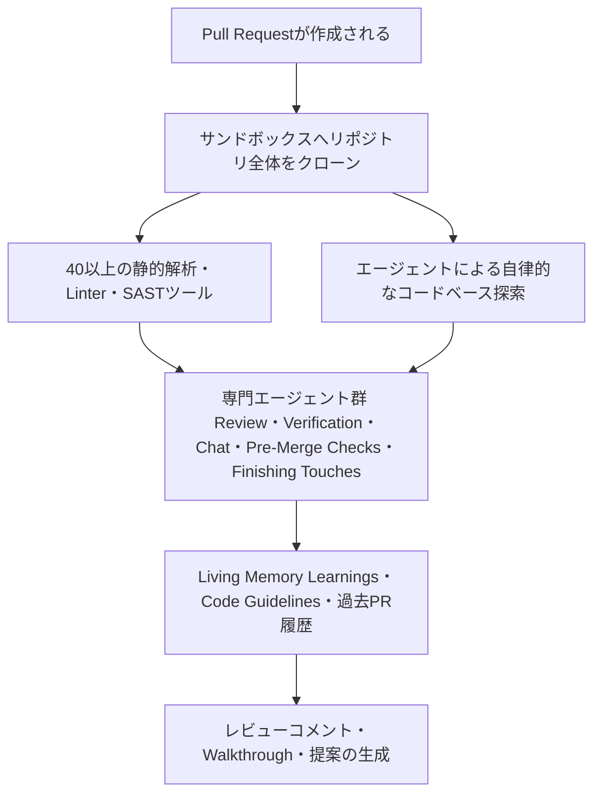
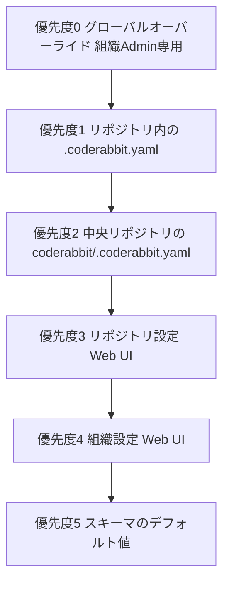
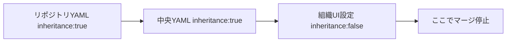
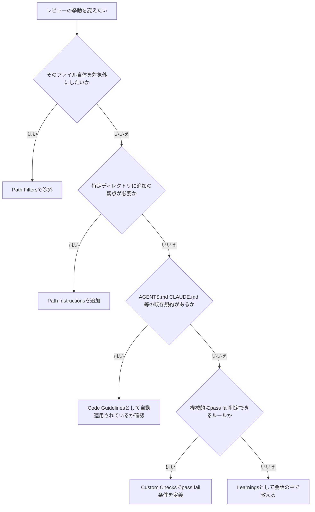
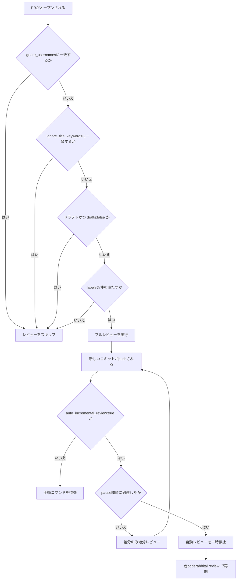
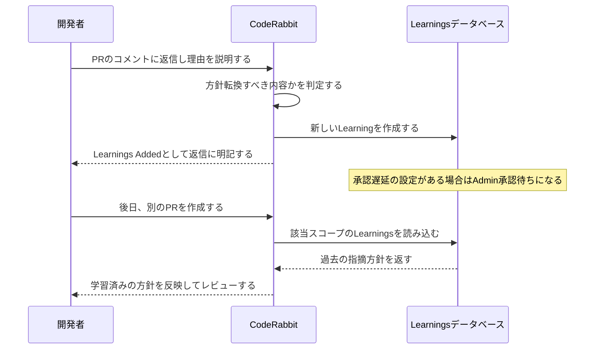
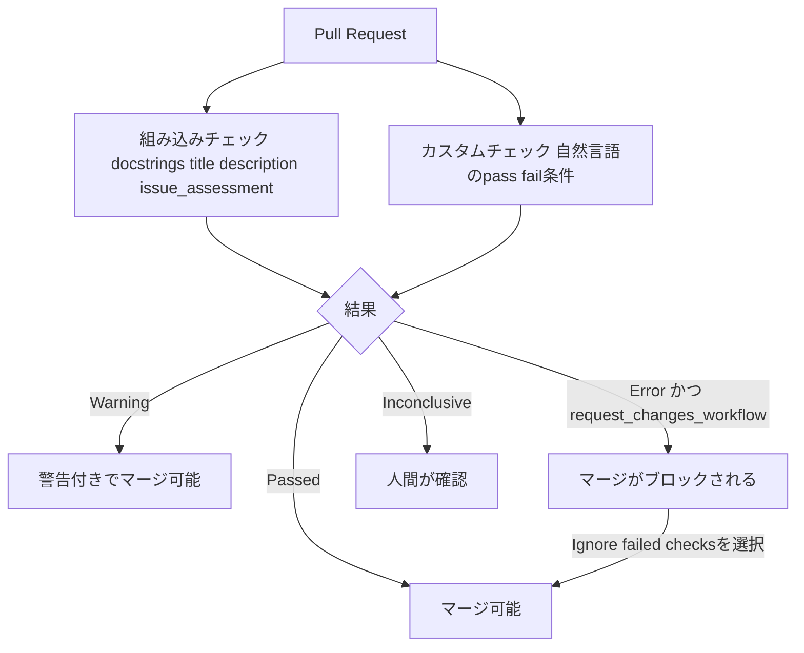
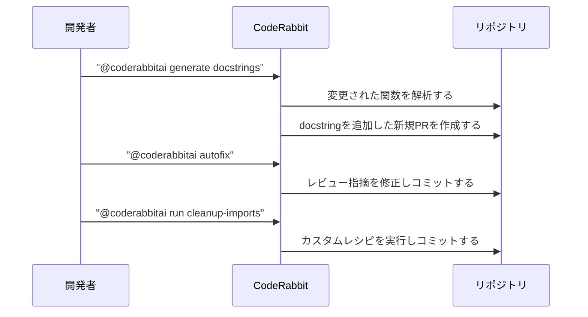
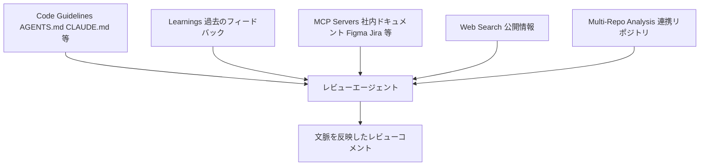
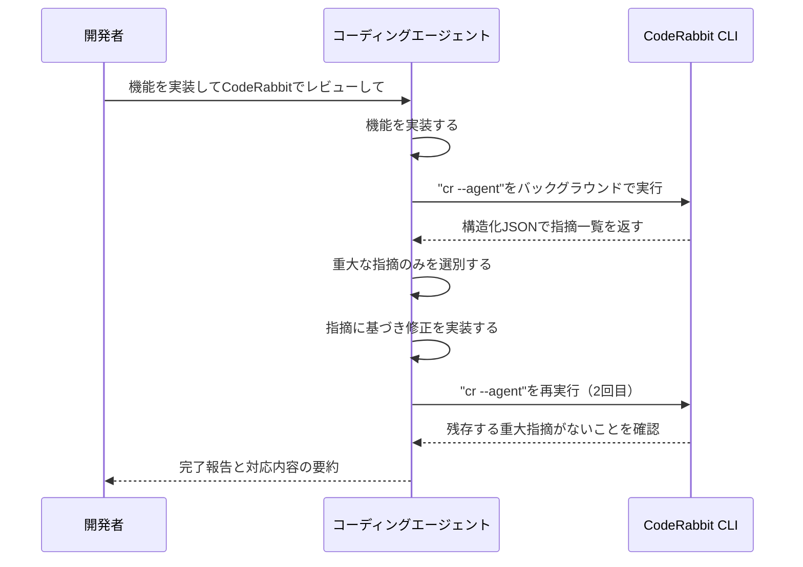

# CodeRabbit実践ガイド：中級者から上級者のためのベストプラクティス

対象読者は、CodeRabbitを既に導入済み、またはこれから本格導入しようとしている中級〜上級のソフトウェアエンジニア・QAエンジニアです。単なる機能紹介にとどまらず、実運用でつまずきやすいポイントとその回避策、そして「なぜその設定が推奨されるのか」という背景まで踏み込んで解説します。

情報源は、CodeRabbit公式ドキュメント（docs.coderabbit.ai、2026年8月2日時点の内容）に加え、著名な開発者・組織による実務レポートを参照しています。特に、Google Chrome/Web Vitalsチームでの活動やエンジニアリング関連の著作で知られるAddy Osmaniが2026年に公開した「Agentic Code Review」（O'Reilly Radar / addyosmani.com）は、CodeRabbitを含む複数のAIレビューツールを実PRで並行比較した第一級の一次情報として繰り返し引用します。ベンチマーク数値やコミュニティの声はソースによって前提が異なるため、複数の視点を併記し、断定は避けています。

## 目次

1. [CodeRabbitとは何か：アーキテクチャを理解する](#1-coderabbitとは何かアーキテクチャを理解する)
2. [導入のロールアウト戦略（ステップバイステップ）](#2-導入のロールアウト戦略ステップバイステップ)
3. [設定の基本：.coderabbit.yamlとレビュープロファイル](#3-設定の基本coderabbityamlとレビュープロファイル)
4. [設定の優先順位を制御する：グローバルオーバーライド・中央設定・継承](#4-設定の優先順位を制御するグローバルオーバーライド中央設定継承)
5. [パスベースのレビュー制御を使い分ける](#5-パスベースのレビュー制御を使い分ける)
6. [ast-grepによる構造的レビュールール（上級者向け）](#6-ast-grepによる構造的レビュールール上級者向け)
7. [自動レビューの挙動を制御する（auto_review）](#7-自動レビューの挙動を制御するauto_review)
8. [Learningsでチームの好みを学習させる](#8-learningsでチームの好みを学習させる)
9. [Pre-Merge ChecksとCustom Checksで品質ゲートを敷く](#9-pre-merge-checksとcustom-checksで品質ゲートを敷く)
10. [Finishing Touches：ワンクリックのエージェント的アクション](#10-finishing-touchesワンクリックのエージェント的アクション)
11. [WalkthroughとCodeRabbit Review（Change Stack）を使いこなす](#11-walkthroughとcoderabbit-reviewchange-stackを使いこなす)
12. [Knowledge Baseで文脈を拡張する](#12-knowledge-baseで文脈を拡張する)
13. [IDE拡張機能とCLIツールでシフトレフトする](#13-ide拡張機能とcliツールでシフトレフトする)
14. [複数のAIレビューツールを組み合わせる考え方（多層防御）](#14-複数のaiレビューツールを組み合わせる考え方多層防御)
15. [実運用で直面する課題と対処法（アンチパターン集）](#15-実運用で直面する課題と対処法アンチパターン集)
16. [まとめ：ベストプラクティス一覧表](#16-まとめベストプラクティス一覧表)
17. [参考文献](#17-参考文献)

---

## 1. CodeRabbitとは何か：アーキテクチャを理解する

CodeRabbitは「差分だけを見てLLMに投げる」単純なツールではありません。公式ドキュメントは、1件のレビューのたびに以下を組み合わせた本格的なAIインフラを動かしていると説明しています。

- **サンドボックス化されたクラウド実行**：レビュー対象のリポジトリ全体を隔離環境にクローンして解析する
- **多次元コード解析**：40種類以上の静的解析ツール・Linter・SASTツールを横断的に実行する
- **エージェント的探索**：コードベースを自律的に調べて文脈を集める
- **専門エージェント群の並列稼働**：Review・Verification・Chat・Pre-Merge Checks・Finishing Touchesという役割ごとに専用のエージェントが動く
- **Living Memory（生きた記憶）**：フィードバック・過去のPR・Issue・コーディング規約から学習し続ける
- **エンタープライズ統合**：Jira、Linear、Slack、MCPサーバーなど既存の開発ワークフローと接続する

この全体像を図にすると次のようになります。



**実務上の含意**：CodeRabbitは単発のLLM呼び出しではなく、複数のツールとエージェントの合議で結論を出しています。そのため「なぜこの指摘が出たのか」を理解するには、後述するKnowledge Base（学習内容）や設定の優先順位を理解しておく必要があります。

---

## 2. 導入のロールアウト戦略（ステップバイステップ）

いきなり全社的に「assertive」プロファイルで全リポジトリに展開するのは推奨されません。複数の実務ガイドが共通して勧めるのは、小さく始めて段階的に広げるアプローチです。

| ステップ | 内容 | 目的 |
|---|---|---|
| 1 | Quickstartで1つのリポジトリにGitHub/GitLab Appを接続する | 数分でPRレビューが動く状態を作る |
| 2 | デフォルト設定のまま1〜2週間運用し、何が役に立ち、何がノイズかを観察する | 過剰なpath_instructionsを先回りで書かない |
| 3 | 最小限の`.coderabbit.yaml`（プロファイルと明らかなノイズファイルの除外）を作成する | 「毎回同じ理由で無視しているコメント」を減らす |
| 4 | パイロットチームからのフィードバックを収集し、誤検知（false positive）のパターンを特定する | path_instructionsやCustom Checksの土台を作る |
| 5 | フロントエンド・バックエンドを含む3〜5リポジトリに拡大する | 技術スタックごとの挙動差を確認する |
| 6 | GitHub Appを「All repositories」モードに切り替え、全社展開する | 一元管理に移行する |
| 7 | 月次でダッシュボードとLearningsを棚卸しし、設定を見直す | 形骸化・陳腐化を防ぐ |

この進め方はdev.to上の実践ガイド群でも共通して推奨されており、「2週間ほど誤検知を能動的に修正したチームは、静かに無視し続けたチームよりも最終的な精度が大きく上がる」という指摘があります。ステップ7のブランチ保護についても、CodeRabbitのチェックを「必須」にするのではなく、会話の解決（コメントへの返信）を必須にすることで、開発者が指摘を読む習慣を作りつつ、AIの判断だけでマージを止めない運用が現実的だとされています。

---

## 3. 設定の基本：`.coderabbit.yaml`とレビュープロファイル

設定ファイルはリポジトリのルートに`.coderabbit.yaml`として置きます。レビュー対象のブランチにあるファイルが自動的に検出・適用されます。

```yaml
# yaml-language-server: $schema=https://coderabbit.ai/integrations/schema.v2.json
language: "ja-JP"
reviews:
  profile: "chill"
  request_changes_workflow: false
  high_level_summary: true
  poem: false
  path_filters:
    - "!dist/**"
    - "!**/*.min.js"
chat:
  auto_reply: true
```

既存のWeb UI設定をYAMLに移行したい場合は、PR上で `@coderabbitai configuration` とコメントすると、現在有効になっている設定が「どの設定源から来たか」を示すコメント付きでYAML形式で返されます。これをそのまま`.coderabbit.yaml`にコピーするのが最も確実な出発点です。

### レビュープロファイル：`chill` と `assertive`

- **`chill`（デフォルト）**：軽めのフィードバック。指摘件数を絞りたいチーム向け
- **`assertive`**：より網羅的なフィードバック。ただし「ネチネチしている」と感じられるほど指摘が増える可能性がある

実際にMonterailの検証記事では、初期状態のCodeRabbitは「かなり多くのコメントを生成した」ため、`.coderabbit.yaml`のチューニングに時間を投資する必要があったと報告されています。プロファイルを`assertive`に上げる前に、まず`chill`＋path_instructionsの組み合わせでノイズを減らす方向を試すのが安全です。

### よく使う一般設定

| 設定キー | 型 | デフォルト | 用途 |
|---|---|---|---|
| `language` | enum | `en-US` | レビュー・チャットで使う言語（ISOコード） |
| `tone_instructions` | string | `""` | レビューやチャットの語り口（250文字まで） |
| `reviews.profile` | enum | `chill` | `chill` / `assertive` |
| `reviews.request_changes_workflow` | boolean | `false` | 有効化すると「Request changes」を発行して指摘の解消・Pre-Merge Check通過までマージをブロックし、全件解決後に自動Approveする |
| `reviews.high_level_summary` | boolean | `true` | PR概要欄への要約生成 |
| `reviews.sequence_diagrams` | boolean | `true` | Walkthrough内のMermaidシーケンス図生成 |
| `reviews.collapse_walkthrough` | boolean | `true` | Walkthroughを折りたたみ表示にする |
| `reviews.poem` | boolean | `true` | 変更内容にちなんだ詩の生成（オフにして実務的にする例も多い） |

---

## 4. 設定の優先順位を制御する：グローバルオーバーライド・中央設定・継承

複数の設定手段（YAMLファイル、中央リポジトリ、Web UIの組織/リポジトリ設定）を併用すると、「どれが実際に効いているのか」が分からなくなりがちです。CodeRabbitは既定では設定源をマージせず、最も優先度の高い1つだけを採用します。



継承（inheritance）を使わない場合、たとえば組織設定と中央設定の両方でタイムアウト値を指定していても、リポジトリの`.coderabbit.yaml`がタイムアウトに一切触れていなければ、CodeRabbitは（組織設定でも中央設定でもなく）スキーマのデフォルト値を使います。「上位の設定を継承しつつ一部だけ上書きする」という直感的な挙動ではない点に注意してください。

### グローバルオーバーライド

組織Adminのみが編集できる最上位の設定層で、コンプライアンス上どうしても外せないポリシー（例：全リポジトリで`assertive`プロファイルを強制する、特定のpath_instructionsを必須にする）に使います。オブジェクトは再帰的にマージされ、配列は`path`などのキーで重複排除されながら結合され、スカラー値は単純に上書きされます。

### 継承（Configuration Inheritance）の有効化

デフォルトでは継承は無効です。`.coderabbit.yaml`のルートに`inheritance: true`を追加すると、親レベル（中央設定や組織UI設定）とマージされるようになります。チェーンは、`inheritance: true`が設定されている限り上位へと辿り、`inheritance: false`（または未設定）のレベルで停止します。



マージの挙動は型によって異なります。

| 型 | マージ挙動 |
|---|---|
| オブジェクト | 深いマージ。子の値が各階層で親の値を上書きする |
| 配列 | 子側の項目を先頭にし、`path` / `label` / `name` / `id` / `key`で重複排除しながら親側のユニークな項目を追加する |
| スカラー | 子の値が定義されていれば、それが優先される |

**実務上のコツ**：継承を有効にした後は、必ずPR上で`@coderabbitai configuration`を実行し、各設定値がどの階層から来たかを示す注釈付きの解決済みYAMLを確認してください。「意図せず組織設定が効いていない」といった事故は、この確認を怠ったチームで頻発します。

---

## 5. パスベースのレビュー制御を使い分ける

CodeRabbitには、似ているようで役割が異なる4つの仕組みがあります。混同するとコメント過多や設定の重複を招くため、まず違いを整理します。

| 仕組み | 何をするか | 設定場所 | 向いているケース |
|---|---|---|---|
| **Path Filters** | 特定のパスをレビュー対象から完全に除外する | `reviews.path_filters` | ロックファイル・生成コード・バイナリなど |
| **Path Instructions** | 特定のパスに追加の観点を与える（除外はしない） | `reviews.path_instructions` | 「APIコントローラでは認可漏れを重点確認して」など |
| **Code Guidelines** | 既存の`AGENTS.md`や`CLAUDE.md`などを自動検出して規約として適用する | 追加設定不要（自動検出） | 既にAIコーディングエージェント向けの規約がある場合 |
| **Custom Checks** | 合否をはっきり判定できる基準をマージ前ゲートとして定義する | `reviews.pre_merge_checks.custom_checks` | 「新規の`.java`ファイルを禁止する」など機械的に判定できるルール |

この4つをどう使い分けるかを整理すると、次のような判断フローになります。



### Path Instructionsの実例

```yaml
reviews:
  path_instructions:
    - path: "src/controllers/**"
      instructions: |
        - 認証・認可・入力バリデーションを重点的に確認する
        - ORMを迂回した直接のDBクエリがあれば指摘する
    - path: "docs/**.md"
      instructions: |
        明瞭さ・正確さ・網羅性を確認し、非推奨APIへの言及があれば指摘する
```

**よくある間違い**：`AGENTS.md`のようなガイドラインファイル名を`path_instructions`に登録してしまうケースです。これは「そのファイル自体をコードとしてレビューする」設定になってしまい、「そのファイルの内容を規約として使う」設定にはなりません。規約として使いたい場合はCode Guidelinesの`filePatterns`を使います。

### Code Guidelinesの自動検出対象

| ファイルパターン | 対応ツール |
|---|---|
| `**/AGENTS.md`, `**/AGENT.md` | 汎用AIエージェント指示 |
| `**/CLAUDE.md` | Claude Code |
| `**/GEMINI.md` | Gemini CLI |
| `**/.cursorrules`, `**/.cursor/rules/*` | Cursor |
| `.github/copilot-instructions.md` | GitHub Copilot |
| `**/.windsurfrules` | Windsurf |
| `**/.clinerules/*` | Cline |

これらはディレクトリ単位でスコープされます。たとえば`src/frontend/CLAUDE.md`はそのディレクトリ配下にしか適用されません。モノレポで領域ごとに規約を分けたい場合に有効です。

### 蓄積したPath Instructionsをコマンドで反映する

`@coderabbitai emit path instructions` とコメントすると、過去7日間にCodeRabbitが提案したpath instructionを収集し、既存の`.coderabbit.yaml`を上書きせずにマージしたPRを自動で開いてくれます。手作業でYAMLを編集する前に、まずこのコマンドを試す価値があります。

---

## 6. ast-grepによる構造的レビュールール（上級者向け）

`ast-grep`は、tree-sitterパーサーを使ってAST（抽象構文木）パターンでコードを検索するRust製ツールです（作者：Herrington Darkholme）。YAMLの学習コストはありますが、「文字列一致では表現できない構造的な禁止パターン」を定義できます。

```yaml
reviews:
  tools:
    ast-grep:
      essential_rules: true
      rule_dirs:
        - "custom-rules"
      packages:
        - "myorg/awesome-review-rules"
```

ルールは3つのカテゴリの組み合わせで構成されます。

| カテゴリ | 内容 |
|---|---|
| Atomic rule | `pattern` / `kind` / `regex` によるASTノードの基本一致判定 |
| Relational rule | `inside` / `has` / `follows` / `precedes` によるノード間の関係判定 |
| Composite rule | `all` / `any` / `not` による論理結合 |

**実例：catchブロック以外での`console.log`系呼び出しを禁止する**

```yaml
id: no-console-except-error
language: typescript
message: "catchブロック以外でのconsole出力は禁止です"
rule:
  any:
    - pattern: console.error($$$)
      not:
        inside:
          kind: catch_clause
          stopBy: end
    - pattern: console.$METHOD($$$)
constraints:
  METHOD:
    regex: "log|debug|warn"
```

CodeRabbitは`ast-grep-essentials`というセキュリティ寄りの既定ルールパックを提供しており、`essential_rules: true`だけで有効化できます。カスタムルールを作る前に、まずこの既定パックが自分たちのニーズをどこまでカバーするかを確認するのが効率的です。

**注意**：ast-grepベースのコンテキストは自動レビュー時にのみ有効で、チャットでは使えません。設計を試すときは公式のast-grep Playgroundでルールを検証してから組み込むと手戻りが減ります。

---

## 7. 自動レビューの挙動を制御する（`auto_review`）

デフォルトでは、CodeRabbitはデフォルトブランチ向けの非ドラフトPRをすべて自動レビューします。`auto_review`の設定群で、この挙動を細かく制御できます。

| 目的 | 推奨設定 |
|---|---|
| 小さなコミットが大量に積まれるアクティブブランチでレビュー回数を節約したい | `auto_pause_after_reviewed_commits` を `1`〜`2` に設定 |
| 準備が整ったPRだけレビューしたい | `enabled: false` にし、`labels` にレビュー準備完了ラベル（例：`review-ready`）を設定 |
| WIP・生成コード・自動化PRをスキップしたい | `ignore_title_keywords` に `WIP` などを追加 |
| 自動レビューを完全に止め、手動運用に切り替えたい | `enabled: false` にし、`@coderabbitai review` を使う |

```yaml
reviews:
  auto_review:
    enabled: true
    auto_incremental_review: true
    auto_pause_after_reviewed_commits: 5
    drafts: false
    base_branches:
      - "develop"
      - "release/.*"
    ignore_title_keywords:
      - "WIP"
      - "[skip review]"
    labels:
      - "!do-not-review"
    ignore_usernames:
      - "dependabot[bot]"
      - "renovate[bot]"
```

判定の流れを図にすると以下の通りです。



**注意点**：`auto_pause_after_reviewed_commits`を`0`にして「常に全部レビューする」設定にすると、アクティブなブランチではレビュー回数の上限（プランごとの1時間あたりの割り当て）をすぐに消費してしまいます。プラン上限に頻繁に当たる場合は、まずこの値を絞ることを検討してください。

---

## 8. Learningsでチームの好みを学習させる

Learningsは、PRやIssueのコメントでのやり取りからCodeRabbitが学習する「チームの好み」の内部データベースです。フォーマルな設定変更をするほどではないが、今後も繰り返し適用してほしい方針に向いています。

### 効果的なLearningsの作り方

1. **パターンか一度きりかを見極める**：移行中の一時的な例外にはLearningsを作らず、コメントを解決するだけにとどめる。チーム全体に適用すべき方針だけをLearning化する。
2. **「何を」ではなく「なぜ」を伝える**：理由を説明すると、似ているが完全に同一ではない状況にも正しく適用されやすくなる。

   > 効果が薄い例：「catchブロックのネストは提案しないで」
   > 効果的な例：「認証ミドルウェアではネストしたtry-catchではなく、早期returnとエラーコードを使う方針にしている。理由は本番でのデバッグ容易性とモニタリングツールとの相性のため」

3. **特定の行コメントへの返信で伝える**：PR全体への一般的なコメントよりも、該当行への返信のほうが文脈が伝わり、精度の高いLearningになる。

### スコープの選び方

| スコープ | 挙動 | 向いているケース |
|---|---|---|
| `auto`（既定） | 公開リポジトリでは当該リポジトリのみ、非公開では組織全体のLearningsを適用 | 公開/非公開リポジトリが混在する組織 |
| `local` | 常に当該リポジトリのLearningsのみ適用 | PythonバックエンドとReactフロントエンドなど、技術スタックが大きく異なるリポジトリが混在する組織（相互汚染の防止） |
| `global` | 常に組織全体のLearningsを適用 | セキュリティ方針や命名規則など、組織横断で統一したい標準がある場合 |

学習フローを図示すると次のようになります。



### 運用と保守

- 新しく作られたチャット由来のLearningsを即時反映せず、管理者の承認を挟みたい場合は`knowledge_base.learnings.approval_delay`を1〜30日の範囲で設定する（既定は`0`で即時反映）
- Learningsは陳腐化する。四半期に一度、廃止したパターンやチーム決定を参照しているLearningsを棚卸しし、矛盾するものは追加せず更新・削除する
- CodeRabbitがLearningsを無視しているように見える場合は、Path Instructionsとの競合（Path Instructionsのほうが優先される）を疑い、必要であれば「回答前に必ずLearningsを確認すること」という補強ルールを追加する

---

## 9. Pre-Merge ChecksとCustom Checksで品質ゲートを敷く

Pre-Merge Checksは、マージ前の品質ゲートをAIエージェントで自動判定する機能です。組み込みチェックとカスタムチェックの2種類があります。

### 組み込みチェック

| チェック | 内容 | 既定閾値 |
|---|---|---|
| Docstring Coverage | PR内のdocstringカバレッジを検証 | 80% |
| Pull Request Title | タイトルが変更内容を正確に反映しているか検証 | チーム指定の要件 |
| Pull Request Description | 説明がテンプレートに沿っているか検証 | - |
| Issue Assessment | 紐づいたIssueに対応できているか検証 | - |

各チェックは`off` / `warning` / `error`の3段階で設定できます。`error`は`request_changes_workflow`と組み合わせるとマージをブロックします。

```yaml
reviews:
  pre_merge_checks:
    docstrings:
      mode: "error"
      threshold: 85
    title:
      mode: "warning"
      requirements: "命令形の動詞で始め、50文字以内に収める"
    custom_checks:
      - name: "破壊的変更の文書化"
        mode: "warning"
        instructions: "公開API・CLIフラグ・環境変数・DBスキーマへの破壊的変更は、PR説明のBreaking ChangeセクションとCHANGELOG.mdの両方に記載されていること。内部限定の変更は除く。"
```

**ベストプラクティス**：新しいチェックはまず`warning`モードで導入し、チームの認識が揃ってから`error`に引き上げます。

### Custom Checksの制約と書き方

Custom Checksは読み取り専用のサンドボックスで動作します。できること・できないことを理解しておかないと、無意味な指示になります。

| できること | できないこと |
|---|---|
| 変更ファイル・コードスニペット・関連するGit履歴の参照 | テストスイートの実行（依存関係が未インストール） |
| PRタイトル・説明・紐づくIssue・レビュー内の議論の参照 | `node_modules`・`dist`・ビルド成果物へのアクセス |
| ast-grepやripgrepによるパターン検索 | 任意のリポジトリコードの実行 |
| サンドボックス化されたシェルコマンドでの調査 | 特定行へのインラインコメント投稿（結果はサマリー表のみ） |
| 公開ドキュメントへのWebアクセス、接続済みMCPツール | PR承認状況やレビュアーの割り当て状況の確認 |

| アンチパターン | 例 | 問題点 |
|---|---|---|
| 曖昧な指示 | 「ベストプラクティスを確認して」 | 具体的な合否基準がない |
| 取得不能な情報を要求 | 「@security-teamの承認済みであることを確認して」 | エージェントは承認状況を確認できない |
| 主観的な推測 | 「明らかなパフォーマンス改善余地があるか評価して」 | 明確な判定基準がなく主観的 |

判定フローは次の通りです。



`@coderabbitai evaluate custom pre-merge check --name <名前> --instructions <本文>` とコメントすると、設定に保存する前にロジックをテストできます。本番投入前に必ず試すことを推奨します。

---

## 10. Finishing Touches：ワンクリックのエージェント的アクション

Finishing Touchesは、レビュー後にワンクリックで実行できるエージェント的アクション群です。PRコメントかWalkthrough内のチェックボックスから起動します。

| 機能 | コマンド | 出力 | 対応プラットフォーム |
|---|---|---|---|
| Docstring生成 | `@coderabbitai generate docstrings` | 新規PR | 全プラットフォーム |
| ユニットテスト生成 | `@coderabbitai generate unit tests` | PRまたはコミット | GitHub |
| コードの簡潔化 | `@coderabbitai simplify` | 新規PRまたはコミット | GitHub |
| Autofix | `@coderabbitai autofix` / `@coderabbitai autofix stacked pr` | ブランチへのコミットまたはスタックPR | GitHub, GitLab, Azure DevOps, Bitbucket |
| カスタムレシピ | `@coderabbitai run <レシピ名>` | ブランチへのコミットまたはスタックPR | GitHub |
| マージコンフリクト解消 | `@coderabbitai resolve merge conflict` | マージコミット | GitHub, GitLab |



カスタムレシピは1組織あたり最大5件まで定義でき、「未使用importの整理」「型の厳格化」「CHANGELOGエントリの追加」のような繰り返し作業を名前付きのコマンドとして再利用できます。

**注意**：Autofixはマージコンフリクトがある状態では実行前に停止し、先に`@coderabbitai resolve merge conflict`を促す返信をします。マージコンフリクト解消機能自体は既定で有効ですが、無効化されている環境では先にこの設定を確認してください。

---

## 11. WalkthroughとCodeRabbit Review（Change Stack）を使いこなす

### Walkthroughコメントの構成要素

CodeRabbitがPRを分析するたびに投稿する構造化コメントが「Walkthrough」です。各セクションは個別にオン/オフできます。

- 変更ファイルの要約（関連ファイルはグループ化される）
- Mermaidによるシーケンス図（コンポーネント間のやり取りが変わるPRのみ生成）
- レビュー工数の見積もり（1＝些細、5＝非常に複雑）
- 紐づくIssue・関連PR・推奨レビュアー・推奨ラベル
- 変更内容にちなんだ詩（無効化も可能）

### 指摘の分類軸

各コメントには「内容カテゴリ」と「深刻度」の2軸のラベルが付きます。

| カテゴリ | 意味 |
|---|---|
| セキュリティ・プライバシー | 脆弱性、認証・認可の欠陥、シークレットの取り扱い |
| 安定性・可用性 | クラッシュ、未処理エラー、リソースリーク |
| データ整合性・連携 | データの正確性、永続化、スキーマ、連携境界 |
| 機能的正確性 | ロジックエラー、未処理のエッジケース |
| パフォーマンス・スケーラビリティ | 非効率な処理、ボトルネック |
| 保守性・コード品質 | 可読性、構造、命名 |

| 深刻度 | 意味 |
|---|---|
| Critical | システム障害・セキュリティ侵害・データ損失につながりうる |
| Major | 機能やパフォーマンスに大きく影響する |
| Minor | 対応すべきだが致命的ではない |
| Trivial | コード品質面での軽微な提案 |
| Info | 対応不要な情報提供 |

この2軸を使うと、`assertive`プロファイルで指摘件数が増えても、「CriticalとMajorだけまず見る」という運用でノイズを実質的に抑えられます。

### CodeRabbit Review（Change Stack）

AIエージェントが一度に大量のファイルを変更するPRが増える中、GitHubの既定の差分表示（アルファベット順のフラットなファイル一覧）は論理的な依存関係を表現できません。CodeRabbit Reviewは、PRを「コホート（関連する変更のまとまり）」と「レイヤー（読む順序）」に再構成し、データ構造や契約の変更を、それに依存する呼び出し側やテストより先に読めるようにします。

- 左パネル：コホート／レイヤーのナビゲーションと全ファイル一覧
- 中央パネル：現在のレイヤーに絞った差分（変数名クリックで定義・参照元にジャンプするCode Peek機能付き）
- 右パネル：範囲ごとのAI要約とコメントタブ

キーボード操作にも対応しており、`J`で次のレイヤー、`K`で前のレイヤー、`Z`でフォーカスモードの切り替えができます。この機能はWalkthroughコメントの「Review Change Stack →」ボタンから開き、レビュアーごとの任意選択（オプトイン）のため、従来のGitHubレビュー体験を好むメンバーには影響しません。

---

## 12. Knowledge Baseで文脈を拡張する

Knowledge Baseは、コード自体を超えた文脈をレビューに供給する仕組みの総称です。



### MCPサーバー連携

CodeRabbitはMCPの**クライアント**として動作し、接続済みのMCPサーバー（社内Wiki、Figma、Issueトラッカーなど）からレビュー中に情報を取得します。使用状況はWalkthroughの「Additional context used」に明示されるため、何を参照したかが監査可能です。接続数の上限はプランによって異なり（Pro:5、Pro+:15、Enterprise:20）、`knowledge_base.mcp.usage`で`auto` / `enabled` / `disabled`を切り替えられます。

### Multi-Repo Analysis

バックエンドAPIとフロントエンド、あるいはマイクロサービス群のように、複数リポジトリにまたがる契約変更を検出したい場合に使います。

```yaml
knowledge_base:
  linked_repositories:
    - repository: "myorg/backend-api"
      instructions: "REST APIエンドポイントとデータベースモデルを含む"
```

**制約**：連携先リポジトリは、レビュー対象PRと同じGitプラットフォーム上になければなりません（アクセストークンがプラットフォームごとにスコープされるため）。また、変更が自己完結していて他リポジトリへの影響がない場合、クロスリポジトリの指摘が出ないのは正常な挙動であり、設定ミスではありません。

---

## 13. IDE拡張機能とCLIツールでシフトレフトする

PRを開く前にレビューを受けられる2つの経路があります。

### IDE拡張機能（VS Code / Cursor / Windsurf）

| 設定 | 選択肢 | 既定値 |
|---|---|---|
| Agent Type | Native / Claude Code / Codex CLI / Cline / Roo / Kilo Code / Augment Code / OpenCode / Clipboard 等 | Native |
| Auto Review Mode | Disabled / Prompt / Auto | Prompt |
| Region | us / eu | us |

「Fix with AI」機能を使う際、どのコーディングエージェントに修正案を渡すかをAgent Typeで選べます。コミットのたびに毎回確認したくない場合はAuto Review Modeを`Auto`に、逆に慎重に運用したい場合は`Prompt`のままにしておくのが妥当です。

### CLIツール

```bash
# インストール
curl -fsSL https://cli.coderabbit.ai/install.sh | sh

# 認証
cr auth login

# レビュー実行（現在のGitリポジトリの差分を解析）
cr

# セットアップ診断
cr doctor
```

CLIには3つの出力モードがあります。

| モード | 用途 |
|---|---|
| `--plain`（既定） | 詳細な修正提案付きのテキスト出力。人間が読む用途 |
| `--agent` | エージェント連携向けの構造化JSON出力 |
| `--interactive` | ターミナルUIでの対話的レビュー |

### コーディングエージェントとの連携ループ

Claude Codeにはネイティブプラグインがあり、`/coderabbit:review`でCLIレビューを起動できます。公式ドキュメントは、エージェントに渡すプロンプトの組み立て方として次のパターンを提示しています。

1. `cr --agent`をバックグラウンドで実行させる（レビューは7〜30分以上かかることがあるため、待機中に他の作業を進める）
2. 完了したら「重大な指摘のみ修正し、些末な指摘（nits）は無視する」よう指示する
3. 修正後にもう一度`cr --agent`を実行し、新しい問題を作り込んでいないか確認する
4. 「2回までのループに制限し、2回目でCritical指摘がなければ完了とする」といった終了条件を明示し、無限ループを防ぐ



この「バックグラウンド実行→評価→修正→再実行→終了条件」という一連の型は、CodeRabbitに限らずAIコーディングエージェント全般との協働で応用できる汎用パターンです。

---

## 14. 複数のAIレビューツールを組み合わせる考え方（多層防御）

AIコードレビューツールを1つだけ導入すれば十分、という前提は疑ってかかるべきです。Addy Osmaniが2026年に公開した分析では、あるエンジニアがCodeRabbit・Sentry Seer・Greptile・Cursor BugBotの4つのAIレビューツールを、3週間半にわたり146件の実PRに並行適用した結果が紹介されています。

- 検出されたfindingsの総数は679件、重複を除いた指摘箇所は617箇所
- そのうち**93.4%は4ツール中ちょうど1つだけ**が検出したもの
- 2ツールが同じ箇所を指摘したのはわずか6%
- 3ツール以上が同じ箇所を指摘したケースはほぼ皆無

Osmaniはこの結果を「単一ツールを信頼していた時代は構造的に終わった。各ツールは異なる視点で異なる問題を見ている」と評しています。

### ベンチマーク数値の解釈には注意が必要

CodeRabbitの精度に関する数値は、出典によって大きく異なります。これは対象PRの母集団や評価基準が異なるためで、「どれか一つが間違っている」という単純な話ではありません。

| 出典 | 数値 | 備考 |
|---|---|---|
| CodeRabbit自社ベンチマーク | F1 51.5%（Copilotは44.5%）、再現率52.5%（Copilotは36.7%） | 自社の評価基準・ハーネスに基づく |
| independent Martianベンチマーク（2026年1〜2月） | CodeRabbitがF1トップ、精度約49% | Addy Osmaniが引用する独立評価 |
| 独立した309PRのベンチマーク | CodeRabbit 44%、GitHub Copilot 54%、Greptile 82% | 評価基準・PR母集団がCodeRabbit自社ベンチマークと異なる |

**実務的な結論**：単一のベンチマーク数値だけを根拠に導入判断をせず、①自組織のPRで実際にパイロット運用してみる、②CodeRabbitのようなAIレビューを静的解析（Semgrep、CodeQLなど）・人間によるレビュー・テストと並ぶ「1つの層」として位置づける、という2点を徹底することが、公開されている複数の実務レポートに共通する助言です。

---

## 15. 実運用で直面する課題と対処法（アンチパターン集）

### 指摘のノイズ化

Hacker Newsのスレッドでは「PRがノイズで読めなくなった」「シグナル対ノイズ比が低すぎて、何もせずにAIコメントをresolveするようになった」という報告が繰り返し見られます。GitHub上のOrchardCMSプロジェクトの実運用ディスカッションでも、「ドキュメント変更には有用だが、コード変更に対しては時々しか役立たず、大半はノイズ」「PR一覧上で"要対応コメントあり"に見えてしまい、人間のレビュー待ちと区別しづらくなる」という声が上がっています。

対処の方向性：

- `chill`プロファイルを起点にし、`assertive`は本当に必要な場合のみ検討する
- 曖昧な不満（「コメントが多い」）で終わらせず、具体的に繰り返される誤検知パターンをPath InstructionsやCustom Checksに落とし込む
- 常時自動レビューが合わないチームは、`auto_review.enabled: false`にして`@coderabbitai review`によるオンデマンド運用に切り替える

### 料金モデルとスケール時のコスト

2026年8月時点の公式プランは次の通りです（価格は変更される可能性があるため、最終確認は公式の料金ページで行ってください）。

| プラン | 料金（年間契約/月額） | 主な内容 |
|---|---|---|
| Free | 無料 | PR要約のみ。コードレビューはIDE拡張・CLI経由 |
| Pro | $24 / $30（1開発者あたり月額） | PRレビュー、高いレート制限、Knowledge Base、Autofix |
| Pro+ | $48 / $60（1開発者あたり月額） | Pro全機能＋Coding Plan、ユニットテスト生成、マージコンフリクト解消 |
| Enterprise | 個別見積もり | セルフホスト、マルチ組織、SLA、監査ログ |
| Open Source | 無料（Pro+相当の機能） | 公開リポジトリ限定 |

1開発者あたりの月額課金モデルは、開発者数が多いチームではコストが積み上がりやすく、複数の比較記事が「代替ツールを検討する主因」として言及しています。座席課金がボトルネックになる場合は、Usage-based Add-on（従量課金）やCLIレビューのみの軽量運用への切り替えも選択肢に入れておくと交渉の幅が広がります。

### 静的解析ツールの重複

CodeRabbit Proには40以上のLinter・SASTツール連携が含まれますが、CIで既に同じLinterを実行しているチームも多いはずです。既存記事では、CIとの重複自体は「PR上に直接インラインコメントとして出るため、CIログをスクロールして探すより速い」というメリットがあるとされる一方、ESLintのように既にCIで厳格に運用しているツールは`reviews.tools.eslint.enabled: false`のように個別に無効化し、重複した指摘を減らす調整が有効です。

### PRサイズとレビュー精度

PRが大きいほど、AIレビューの見落としと的外れな指摘の両方が増える傾向が指摘されています。小さいPRは人間にとってのレビュー容易性を高めるだけでなく、CodeRabbitの解析精度そのものにも直結します。「PRが小説のように長い場合は、まず分割する」という原則は、AIレビュー導入後も変わらない基本です。

---

## 16. まとめ：ベストプラクティス一覧表

| 領域 | ベストプラクティス |
|---|---|
| 導入 | 1リポジトリで観察→最小設定→パイロット→段階拡大→月次棚卸し、の順で進める |
| プロファイル | まず`chill`起点。`assertive`は具体的な不満が解消しない場合のみ検討する |
| 設定の可視化 | 変更のたびに`@coderabbitai configuration`で解決済み設定を確認する |
| パス制御 | 除外はPath Filters、観点追加はPath Instructions、既存規約はCode Guidelines、機械判定はCustom Checksと役割を分ける |
| Learnings | 「何を」ではなく「なぜ」を伝え、特定行への返信で伝える。四半期ごとに棚卸しする |
| Pre-Merge Checks | 新規チェックは`warning`から始め、チームの合意後に`error`へ引き上げる |
| Finishing Touches | Autofix・Docstring生成・ユニットテスト生成を個別コマンドでオンデマンド活用する |
| IDE/CLI | PRを開く前に`cr`やIDE拡張でシフトレフトし、エージェントループには明確な終了条件を設ける |
| 複数ツール運用 | 単一ツールの数値を過信せず、静的解析・人間レビュー・テストと並ぶ1層として位置づける |
| コスト管理 | 座席課金の積み上がりを見越し、必要に応じて従量課金やCLI中心運用も検討する |

---

## 17. 参考文献

### 公式ドキュメント（docs.coderabbit.ai）

- CodeRabbitアーキテクチャ概要: https://docs.coderabbit.ai/overview/architecture
- コードレビュー概要: https://docs.coderabbit.ai/guides/code-review-overview
- YAML設定ガイド: https://docs.coderabbit.ai/getting-started/yaml-configuration
- 設定の全体像と優先順位: https://docs.coderabbit.ai/guides/configuration-overview
- 設定の継承: https://docs.coderabbit.ai/configuration/configuration-inheritance
- パスベースのレビュー指示: https://docs.coderabbit.ai/configuration/path-instructions
- ast-grepによる構造的指示: https://docs.coderabbit.ai/configuration/ast-grep-instructions
- Code Guidelines: https://docs.coderabbit.ai/knowledge-base/code-guidelines
- Learnings: https://docs.coderabbit.ai/knowledge-base/learnings
- MCPサーバー連携: https://docs.coderabbit.ai/knowledge-base/mcp-context
- Multi-Repo Analysis: https://docs.coderabbit.ai/knowledge-base/multi-repo-analysis
- 自動レビュー制御: https://docs.coderabbit.ai/configuration/auto-review
- Custom Checks: https://docs.coderabbit.ai/pr-reviews/custom-checks
- Pre-Merge Checks: https://docs.coderabbit.ai/pr-reviews/pre-merge-checks
- PR Walkthroughs: https://docs.coderabbit.ai/pr-reviews/walkthroughs
- CodeRabbit Review（Change Stack）: https://docs.coderabbit.ai/pr-reviews/coderabbit-review
- Slop Detection: https://docs.coderabbit.ai/pr-reviews/slop-detection
- Finishing Touches概要: https://docs.coderabbit.ai/finishing-touches/index
- レビューコマンド一覧: https://docs.coderabbit.ai/reference/review-commands
- 設定リファレンス: https://docs.coderabbit.ai/reference/configuration
- IDE/CLIレビュー概要: https://docs.coderabbit.ai/overview/ide-cli-review
- CLIツール: https://docs.coderabbit.ai/cli/index
- Claude Code連携: https://docs.coderabbit.ai/cli/claude-code-integration
- VS Code拡張機能の設定: https://docs.coderabbit.ai/ide/vscode-config
- CodeRabbit Plan概要: https://docs.coderabbit.ai/plan/index
- プランと料金: https://docs.coderabbit.ai/management/plans

### 開発者コミュニティ・第三者による分析

- Addy Osmani, "Agentic Code Review"（O'Reilly Radarへの転載）: https://www.oreilly.com/radar/agentic-code-review/
- Addy Osmani, "Agentic Code Review"（著者本人のブログ）: https://addyosmani.com/blog/agentic-code-review/
- Daniel Moka, "Code Review with AI: Best Practices": https://craftbettersoftware.com/p/code-review-with-ai-best-practices
- OrchardCMSにおけるCodeRabbit運用の実コミュニティ議論: https://github.com/orgs/OrchardCMS/discussions/15935
- DeepSource, "7 Best AI Code Review Tools for 2026": https://deepsource.com/resources/ai-code-review-tools
- Monterail Blog, AIコードレビューツールの実機比較: https://www.monterail.com/blog/ai-code-review-tools-compared-how-to-choose-best
- CodeRabbit公式ブログ, "State of AI vs Human Code Generation Report": https://www.coderabbit.ai/blog/state-of-ai-vs-human-code-generation-report
- Surmado Blog, CodeRabbit代替ツールの比較（料金面の課題整理）: https://www.surmado.com/blog/best-coderabbit-alternatives-2026

> 注：料金・プラン内容・ベンチマーク数値は変更が早い領域です。導入判断の最終確認は必ず公式サイト（coderabbit.ai）および上記の一次情報源で行ってください。
