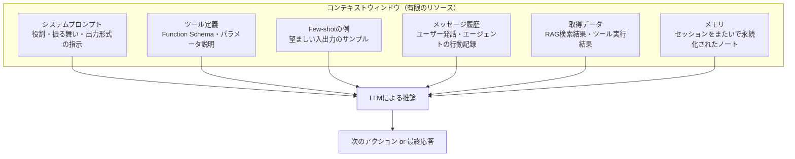
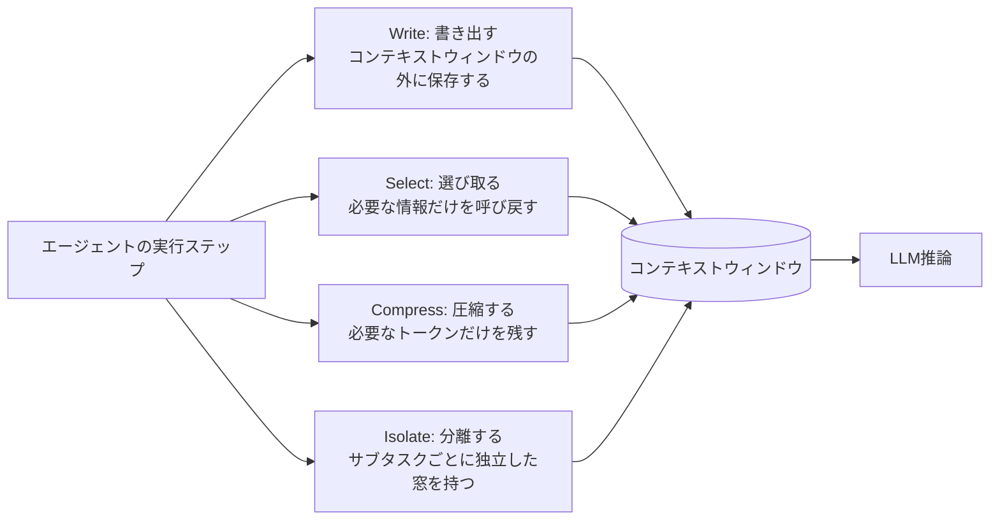
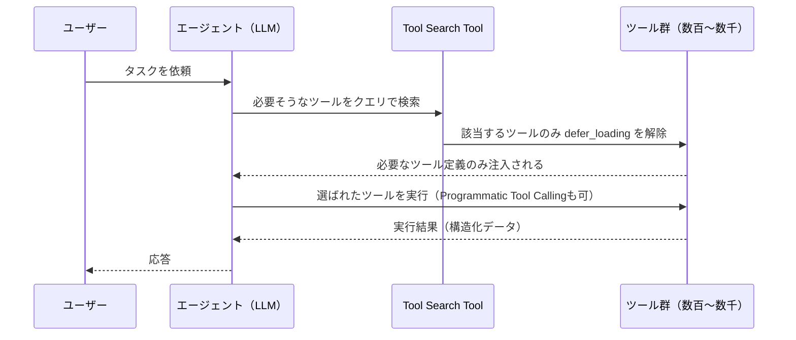
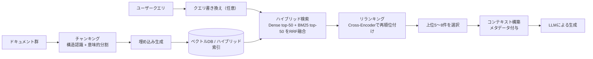
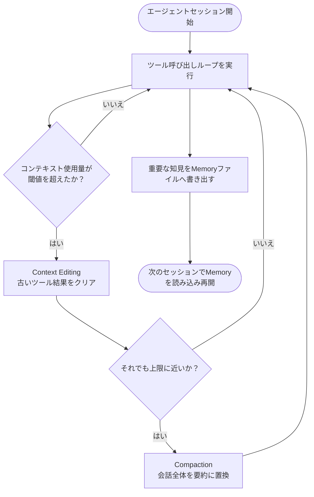
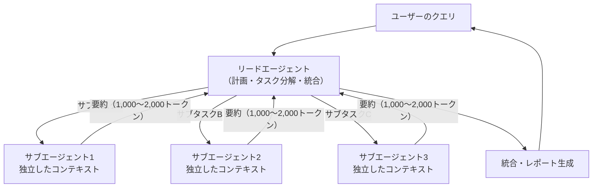
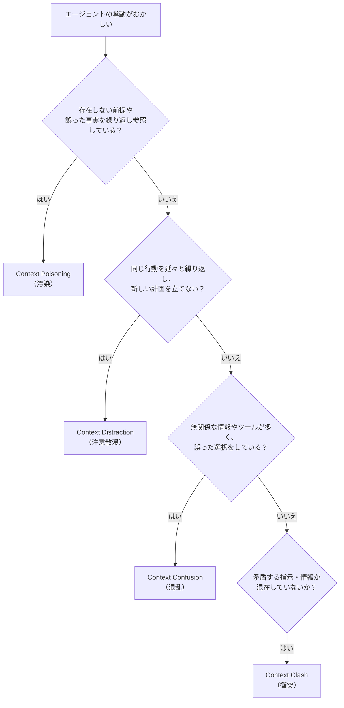
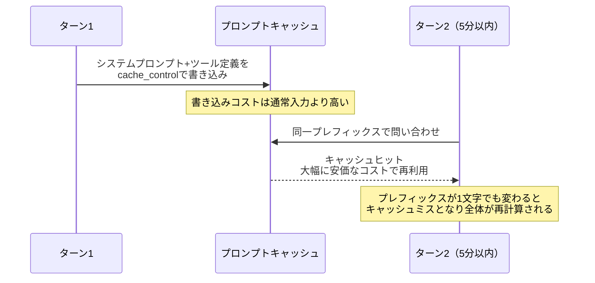
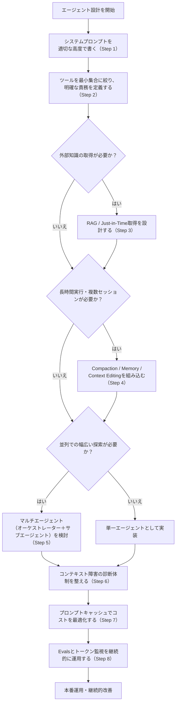

# コンテキストエンジニアリング実践ガイド

> 中級者から上級者のためのステップバイステップ・ベストプラクティス

## 本ガイドについて

このガイドは、2025年後半から2026年半ばにかけてAnthropic、LangChain、Chroma、Sourcegraphなど第一線の実務者・研究者が公開した知見をもとに、**コンテキストエンジニアリング**（Context Engineering）を体系的にまとめたものです。各セクションの末尾に参照元URLを明記しています。ASCII図解は使用せず、フローチャートはすべてMermaid、比較表はすべてMarkdown記法で統一しています。

---

## 目次

1. [コンテキストエンジニアリングとは何か](#1-コンテキストエンジニアリングとは何か)
2. [なぜ今これが重要なのか：コンテキストロットという現象](#2-なぜ今これが重要なのかコンテキストロットという現象)
3. [コンテキストウィンドウを構成する要素](#3-コンテキストウィンドウを構成する要素)
4. [基本戦略：Write / Select / Compress / Isolate](#4-基本戦略write--select--compress--isolate)
5. [ステップバイステップ実践ガイド](#5-ステップバイステップ実践ガイド)
   - [Step 1: システムプロンプトを「適切な高度」で書く](#step-1-システムプロンプトを適切な高度で書く)
   - [Step 2: ツールを設計する](#step-2-ツールを設計する)
   - [Step 3: Just-in-Time retrievalとRAGパイプライン設計](#step-3-just-in-time-retrievalとragパイプライン設計)
   - [Step 4: 長時間実行エージェントのコンテキスト管理](#step-4-長時間実行エージェントのコンテキスト管理)
   - [Step 5: マルチエージェントによるコンテキスト分離](#step-5-マルチエージェントによるコンテキスト分離)
   - [Step 6: コンテキスト障害の診断と対処](#step-6-コンテキスト障害の診断と対処)
   - [Step 7: プロンプトキャッシュによるコスト最適化](#step-7-プロンプトキャッシュによるコスト最適化)
   - [Step 8: 観測性と評価（Evals）](#step-8-観測性と評価evals)
6. [アンチパターン集](#6-アンチパターン集)
7. [実践チェックリスト](#7-実践チェックリスト)
8. [全体設計フロー（意思決定図）](#8-全体設計フロー意思決定図)
9. [参考文献一覧](#9-参考文献一覧)

---

## 1. コンテキストエンジニアリングとは何か

プロンプトエンジニアリングは「1回の指示・1回の生成に対して、どのような文言・構造の指示を与えれば望む出力が得られるか」を扱う技術です。一方でエージェントが複数ステップにわたりツールを呼び出し、外部情報を取得し、長時間セッションを維持するようになると、単一のプロンプトだけでは制御しきれない領域が広がります。Anthropicのアプライドエンジニアリングチームは、この広がった領域を指して「推論時にモデルへ入力される最適なトークン集合を選定・維持するための一連の戦略」と定義しています。これはシステムプロンプトだけでなく、ツール定義、会話履歴、外部から取得したデータ、Few-shot例など、モデルが参照するあらゆる情報を対象とします。

| 観点 | プロンプトエンジニアリング | コンテキストエンジニアリング |
|---|---|---|
| 対象 | 1回の指示文・システムプロンプトの文言 | 推論時にモデルが参照する情報全体（指示・ツール・履歴・外部データ・メモリ） |
| 時間軸 | 単発〜数ターンの対話 | マルチターン・長時間・複数セッションにまたがるエージェント実行 |
| 典型的な問い | 「どう書けば意図通りの出力になるか」 | 「今この瞬間、モデルに何を見せるべきか」 |
| 主なリスク | 曖昧な指示、Few-shotの不足 | コンテキストロット、ツール過多、情報の汚染・矛盾 |
| 位置づけ | コンテキストエンジニアリングの一部分（システム指示の設計） | プロンプトエンジニアリングとRAGを内包する上位概念 |

AIエンジニアの間では、LLMを新種のOSに、コンテキストウィンドウをそのRAMに例える見方が広く共有されています。RAMと同様に容量は有限であり、OSが何をRAMに載せるかを慎重に管理するように、エンジニアはコンテキストウィンドウに何を載せるかを設計する必要があります。

**参考:**
- Anthropic, "Effective context engineering for AI agents" — https://www.anthropic.com/engineering/effective-context-engineering-for-ai-agents
- LangChain Blog, "Context Engineering for Agents" — https://www.langchain.com/blog/context-engineering-for-agents
- Cronus, "Anthropic's Approach to Effective Context Engineering for AI Agents" — https://cr0nu3.github.io/posts/Effective_context_engineering_for_AI_Agents/

---

## 2. なぜ今これが重要なのか：コンテキストロットという現象

数百万トークン級のコンテキストウィンドウが普及するにつれ、「大きな窓があるなら全部詰め込めばよい」という発想が広まりました。しかし実態はそう単純ではありません。ベクトルデータベース企業Chromaが2025年7月に公開した技術レポートは、GPT-4.1・Claude 4・Gemini 2.5・Qwen3を含む18の主要モデルを対象に、入力トークン数を増やしたときの性能変化を検証しました。その結果、単純な「干し草の中の針（Needle in a Haystack）」タスクでさえ、入力長が1万トークンから10万トークン超に増えるにつれて精度が20〜50%低下すること、さらにクエリと正解箇所の意味的な類似度が低いほど劣化が早まることが確認されています。この現象は「コンテキストロット（Context Rot）」と呼ばれています。

同レポートの興味深い知見として、正解に似ているが誤っている情報（ディストラクター）が1つ混入するだけで性能が大きく落ち込むこと、そして直感に反して、支離滅裂な文の羅列よりも一貫した文章構造を持つ長文の方が、モデルが物語の流れに引きずられてしまい特定の情報を探し出しにくくなる場合があることが挙げられます。また、行き詰まったときの挙動もモデルにより異なり、幻覚を生成して答えようとする系統と、回答を拒否する系統に分かれる傾向が報告されています。

同様の現象は2024年のスタンフォード大学ほかによる研究「Lost in the Middle」でも指摘されており、関連情報がコンテキストの中央付近に位置する場合、モデルの参照性能が両端に位置する場合より低下することが示されています。

さらに開発者のDrew Breunigは、この劣化がどのような形で現れるかを4つのパターンに整理しました（詳細はStep 6で扱います）。コンテキストウィンドウが大きくなったからといって、常に良い応答が生成されるわけではないという認識が、2025〜2026年にかけて業界の共通理解になりつつあります。

**参考:**
- Chroma Research, "Context Rot: How Increasing Input Tokens Impacts LLM Performance" — https://research.trychroma.com/context-rot
- Chroma, GitHub再現用リポジトリ — https://github.com/chroma-core/context-rot
- Liu et al., "Lost in the Middle: How Language Models Use Long Contexts", TACL 2024 — https://aclanthology.org/2024.tacl-1.9/
- Drew Breunig, "How Long Contexts Fail" — https://www.dbreunig.com/2025/06/22/how-contexts-fail-and-how-to-fix-them.html
- PromptLayer, "Why LLMs Get Distracted and How to Write Shorter Prompts" — https://blog.promptlayer.com/why-llms-get-distracted-and-how-to-write-shorter-prompts/

---

## 3. コンテキストウィンドウを構成する要素

エージェントに渡されるコンテキストは、単一の「プロンプト」ではなく複数のレイヤーから構成される動的なシステムとして捉える必要があります。

それぞれの要素は独立して肥大化しうるため、どれか一つを最適化しても他が膨張すればコンテキストロットは避けられません。次章以降で紹介する4つの戦略は、この6要素すべてに横断的に適用される考え方です。

**参考:**
- Anthropic, "Effective context engineering for AI agents" — https://www.anthropic.com/engineering/effective-context-engineering-for-ai-agents
- Yashwant Deshmukh, "Context Engineering: The Critical AI Skill" — https://medium.com/@yashwant.deshmukh23/a-complete-guide-to-context-engineering-for-ai-agents-56b84ff6bc26

---

## 4. 基本戦略：Write / Select / Compress / Isolate

LangChainのエンジニアリングチームは、業界で実践されているコンテキスト管理手法を横断的に調査し、4つのカテゴリーに整理しました。これは現在、コンテキストエンジニアリングの標準的なメンタルモデルとして広く参照されています。

| 戦略 | 何をするか | 代表的な実装例 |
|---|---|---|
| Write（書き出す） | ウィンドウの外部（ファイル・DB・状態オブジェクト）に情報を保存し、必要なときに参照する | スクラッチパッド、Claude Codeの`CLAUDE.md`、Anthropicのメモリツールによるファイルベースの永続化 |
| Select（選び取る） | 今のステップに必要な情報だけをウィンドウに引き込む | Embeddingベースの検索、Just-in-Timeでのファイルパス/クエリの遅延解決、ツール定義自体へのRAG適用 |
| Compress（圧縮する） | 冗長なトークンを削り、必要な情報密度を保ったまま縮める | 会話全体の要約（Compaction）、ツール結果の一括クリア、サブエージェントによる要約の折り返し |
| Isolate（分離する） | サブタスクごとにクリーンな状態を用意し、干渉を防ぐ | サブエージェントアーキテクチャ、サンドボックス実行、LangGraphの状態スキーマによる部分公開 |

これら4つは互いに排他的ではなく、実務では組み合わせて使うのが一般的です。たとえばAnthropicのマルチエージェント・リサーチシステムでは、リードエージェントが計画をメモリに書き出し（Write）、サブエージェントが独立したコンテキストで探索し（Isolate）、その結果を1,000〜2,000トークン程度に要約して返し（Compress）、リードエージェントは統合に必要な情報だけを選び取る（Select）という形で4戦略すべてが同時に機能しています。

**参考:**
- LangChain Blog, "Context Engineering for Agents" — https://www.langchain.com/blog/context-engineering-for-agents
- LangChain, GitHub `context_engineering`リポジトリ — https://github.com/langchain-ai/context_engineering
- DeepWiki, "Isolate Context Strategy" — https://deepwiki.com/langchain-ai/context_engineering/2.4-isolate-context-strategy
- Anthropic, "How we built our multi-agent research system" — https://www.anthropic.com/engineering/multi-agent-research-system

---

## 5. ステップバイステップ実践ガイド

ここからは実際のエージェント開発フローに沿って、8つのステップで具体的な設計判断を解説します。

### Step 1: システムプロンプトを「適切な高度」で書く

システムプロンプトの設計における最大の落とし穴は両極端です。すべてのエッジケースをif-else的にハードコードした脆いプロンプトは保守性を失い、逆に抽象的すぎる指示はモデルに具体的な指針を与えられません。Anthropicはこれを「適切な高度（right altitude）」という比喩で説明しています。目安として、以下のセクション構成が推奨されます。

| セクション | 役割 | 記述のポイント |
|---|---|---|
| 背景・役割定義 | エージェントが何者で、何を達成すべきかを明示する | 曖昧な形容詞を避け、期待される振る舞いを具体的に記述する |
| 指示の階層 | 優先度の高い制約から順に並べる | 矛盾する指示がないか確認する（Context Clashの予防） |
| ツールガイダンス | いつ・どのツールを・どう使うべきかの方針 | ツール自体のdescriptionに書くべき内容とプロンプトに書くべき内容を分離する |
| 出力フォーマット | 期待する出力の構造 | 構造化出力（JSON Schema等）を使う場合は明示的に定義する |

ポイントは「モデルが自分で正しい判断を下せるだけの余地を残しつつ、期待される行動の輪郭を明確にする」ことです。過度に細かいルールの羅列は、後述するContext Confusion（無関係情報による混乱）の温床にもなります。

**参考:**
- Anthropic, "Effective context engineering for AI agents" — https://www.anthropic.com/engineering/effective-context-engineering-for-ai-agents
- Anthropic, "Building effective agents" — https://www.anthropic.com/engineering/building-effective-agents

---

### Step 2: ツールを設計する

ツールはエージェントが外部の情報や実行環境にアクセスするための契約です。Anthropicはツール設計における原則として、次のような点を重視しています。

- **明確で非重複な機能**：ツール同士の役割が重ならないようにし、モデルが直感的に選択できるようにする
- **堅牢でスコープの明確な目的**：良いコードと同様に自己完結的で、エラーに強く、意図が明確であること
- **入力パラメータの曖昧さ排除**：モデルの得意な形式（自然言語の説明が明快なJSON構造など）に寄せる

ツールセットが肥大化すると、機能が重複し、モデルがどのツールを選ぶべきか混乱する「Context Confusion」の典型例になります。実務上の目安として、**よく使う3〜5個のツールは常時読み込み、10個を超える場合は動的な発見の仕組みを導入する**ことが推奨されています。

2025年末にAnthropicが発表した高度なツール利用機能では、この問題に対する具体的な解決策が示されました。

| 手法 | 課題への対処 | 効果（Anthropic社内評価） |
|---|---|---|
| Tool Search Tool | 全ツール定義を事前ロードせず、必要なものだけをオンデマンドで発見する | 従来比85%のトークン削減、大規模ツールライブラリでの精度がOpus 4で49%→74%に改善 |
| Programmatic Tool Calling | コード実行環境内でツールを呼び出し、中間結果をコンテキストに溜め込まない | 推論パスごとの全量推論を避け、ループ・条件分岐をコード側に委譲できる |
| Tool Use Examples | JSONスキーマだけでは伝わらない「使い方の慣習」を例示で補う | オプションパラメータの使い分けなど、スキーマだけでは表現できない知識を提供 |

またLangChainの調査では、ツール自体の説明文にもRAGを適用し、関連しそうなツールだけを検索的に絞り込むことでツール選択精度が約3倍向上したという報告があります。

**参考:**
- Anthropic, "Effective context engineering for AI agents" — https://www.anthropic.com/engineering/effective-context-engineering-for-ai-agents
- Anthropic, "Introducing advanced tool use on the Claude Developer Platform" — https://www.anthropic.com/engineering/advanced-tool-use
- Vorstel, "Effective Context Engineering for AI Agents: A Comprehensive Guide" — https://vorstel.com/feeds/blog/effective-context-engineering-ai-agents

---

### Step 3: Just-in-Time retrievalとRAGパイプライン設計

コンテキストへの情報投入には大きく2つの流派があります。

1. **事前処理型（Pre-fetching）**：Embeddingベースの検索を推論前に実行し、関連しそうな情報をあらかじめプロンプトに詰め込む
2. **Just-in-Time型**：ファイルパス・保存済みクエリ・URLなど「軽量な識別子」だけを保持し、エージェントが必要になった瞬間にツール経由で実データを取得する

Anthropicは、エージェントがより自律的になるにつれて後者の重要性が増していると指摘しています。全データを前もって処理するのではなく、人間が実際のフォルダ構造やファイルを都度開くのと同様に、モデル自身が探索的に情報へアクセスする設計です。実務では両者を併用するハイブリッド構成が一般的です。

RAGを採用する場合、パイプライン全体の設計が品質を大きく左右します。

2026年時点の実務知見としては、「まずチャンキングを直す」がもっとも投資対効果の高い改善だと繰り返し指摘されています。業界分析では、RAGの品質問題の大半が生成部分ではなく検索部分（チャンキング・埋め込み・ランキング）に起因するとされています。

| チャンキング戦略 | 概要 | 向いているケース |
|---|---|---|
| 固定長分割 | 一定文字数ごとに機械的に分割 | 素早いプロトタイピング、構造の薄いテキスト |
| 構造認識分割 | 見出し・関数境界など文書の構造単位で分割 | Markdown文書、コードベース、仕様書 |
| 意味的分割（Semantic Chunking） | 隣接文の埋め込み類似度が閾値を下回った位置で区切る | 構造の乏しい長文プローズ、法務・医療文書 |

またリランキングは、広く再現率高く候補を集めた後に高精度なモデルで絞り込む工程であり、Cross-Encoder型のリランカーはハイブリッド検索単体と比べて10〜25%の追加精度向上をもたらすとされています。

なお、「フルコンテキスト（ファイル全体をそのまま渡す）」を推す立場もあります。SWE-bench Verifiedにおいて、ファイル全体をそのまま渡すアプローチが約95%の精度を達成したのに対し、断片化された検索では約80%程度に留まったという分析が紹介されています。これは断片化によって文脈の一貫性が失われることが原因とされますが、コストとレイテンシの増加というトレードオフを伴うため、タスクの性質に応じて使い分ける判断が必要です。

**参考:**
- Anthropic, "Effective context engineering for AI agents" — https://www.anthropic.com/engineering/effective-context-engineering-for-ai-agents
- Sourcegraph Blog, "Context Engineering: A Practical Guide for AI Agents" — https://sourcegraph.com/blog/context-engineering
- StackAI, "RAG Best Practices for Enterprise AI" — https://www.stackai.com/insights/retrieval-augmented-generation-(rag)-best-practices-for-enterprise-ai-chunking-embeddings-reranking-and-hybrid-search-optimization
- Lushbinary, "RAG Production Guide 2026" — https://lushbinary.com/blog/rag-retrieval-augmented-generation-production-guide/
- Starmorph Blog, "RAG Techniques Compared" — https://blog.starmorph.com/blog/rag-techniques-compared-best-practices-guide
- Zilliz Blog, "Context Engineering Strategies for AI Agents" — https://zilliz.com/blog/context-engineering-for-ai-agents

---

### Step 4: 長時間実行エージェントのコンテキスト管理

数十〜数百のツール呼び出しにまたがる長時間セッションでは、コンテキストウィンドウがいずれ上限に達します。Anthropicは2025年9月のClaude Sonnet 4.5リリースに合わせて、この問題に対応する3つの機構をClaude Developer Platformに実装しました。それぞれ役割が異なるため、使い分けの理解が重要です。

| 機構 | 何をするか | 適したケース |
|---|---|---|
| Compaction（自動コンテキスト圧縮） | 会話全体をサーバー側で高忠実度の要約に置き換える | 長い会話の流れを維持したまま、押し寄せる文脈を圧縮したいタスク全般 |
| Context Editing（コンテキスト編集／ツール結果クリア） | 古いツール呼び出し結果をクライアント側で明示的に削除する | 深い履歴の中のツール実行結果をもう一度見る必要がない場合の軽量な圧縮 |
| Memory Tool（メモリツール） | ファイルベースでセッションをまたいだ知識を永続化する | プロジェクト単位で複数セッションにわたり知見を積み上げたい場合 |

これら3つは併用も可能で、Anthropicの内部評価では、メモリとコンテキスト編集を組み合わせたエージェント検索タスクで39%の性能改善、100ターンのWeb検索評価では84%のトークン削減が報告されています。

Claudeがポケモンをプレイするエージェントの事例は、メモリがどのように長時間タスクを変えるかを示す好例です。特に指示せずとも、エージェントは探索済み領域の地図を自発的に構築し、達成済みの目標を記録し、コンテキストがリセットされた後も自分のノートを読み返して数時間規模の訓練やダンジョン探索を継続することが観察されています。

**参考:**
- Claude by Anthropic, "Managing context on the Claude Developer Platform" — https://claude.com/blog/context-management
- Anthropic, "Effective context engineering for AI agents" — https://www.anthropic.com/engineering/effective-context-engineering-for-ai-agents
- Claude Platform Docs, "Memory tool" — https://platform.claude.com/docs/en/agents-and-tools/tool-use/memory-tool
- Claude Cookbook, "Context engineering: memory, compaction, and tool clearing" — https://platform.claude.com/cookbook/tool-use-context-engineering-context-engineering-tools
- Claude Cookbook, "Automatic context compaction" — https://platform.claude.com/cookbook/tool-use-automatic-context-compaction
- Claude Cookbook, "Memory & context management" — https://platform.claude.com/cookbook/tool-use-memory-cookbook

---

### Step 5: マルチエージェントによるコンテキスト分離

単一エージェントのコンテキストウィンドウには物理的な上限があります。並列で幅広い探索が必要なタスク（広範なリサーチ、複数領域にまたがる調査など）では、複数の専門化されたサブエージェントに作業を分散させ、それぞれが独立したコンテキストウィンドウを持つアーキテクチャが有効です。

各サブエージェントは数万トークン規模で自由に探索しつつ、リードエージェントには凝縮された要約だけを返します。これによりリードエージェントの視野は「詳細な探索過程」ではなく「統合と分析」に集中でき、関心の分離（separation of concerns）が実現します。Anthropicの内部評価では、Opus 4をリードエージェント・Sonnet 4をサブエージェントとする構成が、単一のOpus 4エージェントを社内リサーチ評価で90.2%上回ったと報告されています。

ただし、マルチエージェント構成は万能ではありません。Anthropicは「いつマルチエージェントを使うべきか、使わざるべきか」について次のような指針を示しています。

| 判断基準 | マルチエージェントが有効なケース | 単一エージェントで十分なケース |
|---|---|---|
| コンテキスト分離の必要性 | サブタスクが1,000トークン超の文脈を生むが、その大半が本筋と無関係 | サブタスク間で共有すべき情報が多く、分離するとかえって非効率 |
| 探索の性質 | 独立した複数の方向性を並行して深掘りする必要がある（幅優先型） | 単一の連続した推論の流れが必要（深さ優先型） |
| コスト許容度 | タスクの価値がトークンコスト増加に見合う | コストが厳しく制約されている |

マルチエージェントシステムは単純なチャットの約15倍のトークンを消費するとされており、Anthropic自身も「単一エージェントのプロンプト改善で同等の結果が得られたのに、数ヶ月かけて複雑なマルチエージェント構成を作ってしまった」という事例を報告しています。導入前に、本当にコンテキスト分離が必要なタスクかどうかを見極めることが重要です。

**参考:**
- Anthropic, "How we built our multi-agent research system" — https://www.anthropic.com/engineering/multi-agent-research-system
- Claude by Anthropic, "When to use multi-agent systems (and when not to)" — https://claude.com/blog/building-multi-agent-systems-when-and-how-to-use-them
- Anthropic, "Effective context engineering for AI agents" — https://www.anthropic.com/engineering/effective-context-engineering-for-ai-agents

---

### Step 6: コンテキスト障害の診断と対処

コンテキストロットは単一の現象ではなく、複数の異なる失敗モードの総称です。Drew Breunigはこれを4つのパターンに整理しており、現在では業界で広く参照される分類になっています。

| 失敗モード | 定義 | 典型例 | 主な対策 |
|---|---|---|---|
| Context Poisoning（汚染） | 誤った情報や幻覚が一度コンテキストに入り込み、その後も繰り返し参照され続ける | 目標設定のセクションが汚染され、達成不可能な目標に固執する | 早期に誤情報を検出・修正する仕組み、重要な事実の検証ステップを設ける |
| Context Distraction（注意散漫） | コンテキストが長大化しすぎて、学習済みの知識よりも蓄積された履歴に過度に依存する | ポケモンをプレイするGeminiエージェントが10万トークンを超えたあたりから新しい戦略を立てず過去の行動を繰り返す傾向を示した | Compaction・サブエージェント分離などで実効的な文脈長を抑える |
| Context Confusion（混乱） | 無関係な情報がコンテキストに存在し、それを使ってしまうことで応答品質が下がる | ツールが多すぎて誤ったツールを選ぶ、関係ない情報にモデルが引きずられる | ツールの絞り込み（3〜5個を常時ロード）、選択的検索によるフィルタリング |
| Context Clash（衝突） | 異なる出所から取り込まれた新しい情報・ツールが、既存の情報と矛盾する | 複数のMCPツールの説明文がプロンプトの他の指示と食い違う | 情報源間の整合性チェック、指示の優先順位を明示する |

いずれのケースでも共通する対処の方向性は「まず何が起きているかを名指しできるようにすること」です。原因不明のまま「なんとなく調子が悪い」で片付けず、上記4分類のどれに該当するかを特定できれば、Step 4・5・2で紹介した具体的な手段（Compaction、サブエージェント分離、ツール絞り込みなど）を的確に適用できます。

**参考:**
- Drew Breunig, "How Long Contexts Fail" — https://www.dbreunig.com/2025/06/22/how-contexts-fail-and-how-to-fix-them.html
- Simon Willison, "How to Fix Your Context" — https://simonwillison.net/2025/Jun/29/how-to-fix-your-context/
- O'Reilly Radar, "Working with Contexts" — https://www.oreilly.com/radar/working-with-contexts/
- LambdaTest Blog, "Context Engineering Part 1: Why AI Agents Forget" — https://www.lambdatest.com/blog/why-ai-agents-forget/

---

### Step 7: プロンプトキャッシュによるコスト最適化

コンテキストエンジニアリングは品質だけでなくコストの問題でもあります。Claude APIのプロンプトキャッシュは、プロンプトの先頭部分（プレフィックス）を再利用することで、繰り返し送信される固定的なコンテキスト（システムプロンプトやツール定義など）の処理コストを大幅に削減する仕組みです。キャッシュ書き込みは通常の入力トークン価格より高くなりますが、キャッシュ読み込みは大幅に安く、公式ドキュメントでは標準入力価格の一部程度まで下がるとされています。

キャッシュを有効に機能させる設計のポイントは以下の通りです。

- **安定した内容を先頭に配置する**：システムプロンプトやツール定義など変化しない部分を前方に、動的なユーザー入力を末尾に置く
- **プレフィックスの完全一致が必須**：途中のタイムスタンプや動的な値が1つでも変わると、それより後ろのキャッシュはすべて無効になる
- **ツール呼び出しのキー順序を安定させる**：言語によってはJSONのキー順がランダム化され、意図せずキャッシュが壊れることがある
- **キャッシュの有効期限（TTL）を意識する**：標準5分、延長オプションで1時間。セッションの実行間隔に応じて選択する

なお、キャッシュはあくまで「送信する固定コンテキストを安く再利用する」仕組みであり、そもそも送信する必要のないトークンを削るコンテキストエンジニアリングとは補完関係にあります。キャッシュを効かせる前に、まず本当に必要な情報だけを渡せているかを見直すことが優先されるべきです。

**参考:**
- Claude Platform Docs, "Prompt caching" — https://platform.claude.com/docs/en/build-with-claude/prompt-caching
- Anthropic, "Prompt caching with Claude" — https://www.anthropic.com/news/prompt-caching
- hidekazu-konishi.com, "Anthropic Claude API Prompt Caching and Token Efficiency Guide" — https://hidekazu-konishi.com/entry/anthropic_claude_api_prompt_caching_and_token_efficiency.html
- ProjectDiscovery Blog, "How We Cut LLM Costs by 59% With Prompt Caching" — https://projectdiscovery.io/blog/how-we-cut-llm-cost-with-prompt-caching

---

### Step 8: 観測性と評価（Evals）

コンテキストエンジニアリングの各施策（圧縮、分離、ツール絞り込みなど）は、必ずしも直感通りの効果をもたらすとは限りません。Anthropicのマルチエージェントリサーチシステムの開発チームは、評価の重要性について次のような教訓を共有しています。

- **小規模でもすぐに評価を始める**：数百件規模の網羅的な評価セットが揃うまで待つのではなく、少数の具体例からでも評価を開始すべき
- **自動評価と人間評価の併用**：LLM-as-a-judgeによる採点は事実の正確性・引用の正確性・網羅性・情報源の質・ツール使用効率などを軸に構築できるが、稀なエッジケース（幻覚、情報源の質の偏りなど）は人間のレビューでしか発見できないことが多い
- **観測性の確保**：エージェントのトークン使用量をトレースし、どこにコンテキストエンジニアリングの効果を投じるべきかを可視化する

LangChainも同様に、施策を導入する前に「そもそも今どこでトークンが消費されているかを追跡する仕組み」と「その施策が実際に性能を改善したか悪化させたかを検証できる簡易な仕組み」の2つを用意することを推奨しています。

**参考:**
- Anthropic, "How we built our multi-agent research system" — https://www.anthropic.com/engineering/multi-agent-research-system
- LangChain Blog, "Context Engineering for Agents" — https://www.langchain.com/blog/context-engineering-for-agents

---

## 6. アンチパターン集

| アンチパターン | 症状 | 根本原因 | 改善策（対応するStep） |
|---|---|---|---|
| 全部乗せプロンプト | システムプロンプトが数千行に肥大化し、保守不能になる | エッジケースを都度ハードコードし続けた結果 | Step 1: 適切な高度で再設計、Step 4: 動的なコンテキスト構築へ移行 |
| ツールの氾濫 | 数十〜数百のツールを常時ロードし、モデルが誤ったツールを選ぶ | ツール追加のたびに定義を素朴に積み上げた | Step 2: Tool Loadoutの絞り込み、Tool Search Toolによる動的発見 |
| 会話履歴の無制限蓄積 | セッションが長くなるほど応答が劣化し、コストも増大する | Compaction・Context Editingを導入していない | Step 4: 圧縮・メモリ機構の導入 |
| RAGの雑なチャンキング | 検索結果が的外れで、生成が自信満々に間違える | 固定長分割で文や表の途中で切れている | Step 3: 構造認識・意味的チャンキングへの切り替え |
| 無条件のマルチエージェント化 | トークンコストが単一エージェントの15倍に膨らみ、成果が見合わない | タスクの性質を吟味せずに複雑な構成へ飛びついた | Step 5: 判断基準表に照らして本当に必要か再検討 |
| 症状ベースのその場しのぎ対応 | 「なんか調子が悪い」を経験則だけで対処し続ける | 4つの失敗モードを区別せずに対処している | Step 6: 診断フローで失敗モードを特定してから対処 |
| キャッシュを効かせない構成 | 毎ターン同じ内容をフルコストで再処理している | 動的な値を先頭付近に置いてしまいプレフィックスが安定しない | Step 7: 安定部分を前方に、動的部分を末尾に再配置 |
| 評価なしでの施策導入 | 良かれと思った圧縮・分離が実は性能を悪化させている | Before/Afterを比較する評価の仕組みがない | Step 8: 小規模でもEvalsとトレーシングを先に用意する |

---

## 7. 実践チェックリスト

- [ ] システムプロンプトは「具体的すぎず抽象的すぎない」適切な高度で書かれているか
- [ ] ツールは3〜5個程度の中核セットに絞られ、10個を超える場合は動的発見の仕組みがあるか
- [ ] ツール同士の役割が重複せず、パラメータの意味が曖昧でないか
- [ ] 外部知識の取得は「事前処理」と「Just-in-Time取得」を適切に使い分けているか
- [ ] RAGを使う場合、チャンキング戦略は文書の構造に合っているか
- [ ] リランキングを導入し、上位数件に絞り込んでからコンテキストへ渡しているか
- [ ] 長時間セッションに対してCompaction・Context Editing・Memoryのいずれか（または組み合わせ）を導入しているか
- [ ] マルチエージェント構成を採用する前に、単一エージェント＋プロンプト改善で十分でないか検証したか
- [ ] エージェントの不調が発生した際、4つの失敗モード（汚染・注意散漫・混乱・衝突）のどれに該当するか診断できる体制があるか
- [ ] プロンプトキャッシュのプレフィックス設計（安定部分を前方に）ができているか
- [ ] トークン使用量のトレースと、施策のBefore/Afterを比較できる評価の仕組みがあるか

---

## 8. 全体設計フロー（意思決定図）

これまでのステップを踏まえた、エージェント設計時の全体的な意思決定フローです。

---

## 9. 参考文献一覧

### Anthropic公式（一次情報）

1. "Effective context engineering for AI agents" — https://www.anthropic.com/engineering/effective-context-engineering-for-ai-agents
2. "Building effective agents" — https://www.anthropic.com/engineering/building-effective-agents
3. "How we built our multi-agent research system" — https://www.anthropic.com/engineering/multi-agent-research-system
4. "Introducing advanced tool use on the Claude Developer Platform" — https://www.anthropic.com/engineering/advanced-tool-use
5. "Managing context on the Claude Developer Platform"（Claude Blog） — https://claude.com/blog/context-management
6. "When to use multi-agent systems (and when not to)"（Claude Blog） — https://claude.com/blog/building-multi-agent-systems-when-and-how-to-use-them
7. "Prompt caching with Claude" — https://www.anthropic.com/news/prompt-caching
8. Claude Platform Docs, "Memory tool" — https://platform.claude.com/docs/en/agents-and-tools/tool-use/memory-tool
9. Claude Platform Docs, "Prompt caching" — https://platform.claude.com/docs/en/build-with-claude/prompt-caching
10. Claude Cookbook, "Context engineering: memory, compaction, and tool clearing" — https://platform.claude.com/cookbook/tool-use-context-engineering-context-engineering-tools
11. Claude Cookbook, "Automatic context compaction" — https://platform.claude.com/cookbook/tool-use-automatic-context-compaction
12. Claude Cookbook, "Memory & context management" — https://platform.claude.com/cookbook/tool-use-memory-cookbook

### 研究機関・技術レポート

13. Chroma Research, "Context Rot: How Increasing Input Tokens Impacts LLM Performance" — https://research.trychroma.com/context-rot
14. Chroma, GitHub再現用リポジトリ "context-rot" — https://github.com/chroma-core/context-rot
15. Liu et al., "Lost in the Middle: How Language Models Use Long Contexts", TACL 2024 — https://aclanthology.org/2024.tacl-1.9/

### フレームワーク・実務ブログ（LangChain / Sourcegraph 他）

16. LangChain Blog, "Context Engineering for Agents" — https://www.langchain.com/blog/context-engineering-for-agents
17. LangChain, GitHub `context_engineering`リポジトリ — https://github.com/langchain-ai/context_engineering
18. DeepWiki, "Isolate Context Strategy" — https://deepwiki.com/langchain-ai/context_engineering/2.4-isolate-context-strategy
19. Sourcegraph Blog, "Context Engineering: A Practical Guide for AI Agents" — https://sourcegraph.com/blog/context-engineering
20. Zilliz Blog, "Context Engineering Strategies for AI Agents" — https://zilliz.com/blog/context-engineering-for-ai-agents

### コンテキスト失敗モード・実務家の考察（Drew Breunig 他）

21. Drew Breunig, "How Long Contexts Fail" — https://www.dbreunig.com/2025/06/22/how-contexts-fail-and-how-to-fix-them.html
22. Simon Willison, "How to Fix Your Context" — https://simonwillison.net/2025/Jun/29/how-to-fix-your-context/
23. O'Reilly Radar, "Working with Contexts" — https://www.oreilly.com/radar/working-with-contexts/
24. LambdaTest Blog, "Context Engineering Part 1: Why AI Agents Forget" — https://www.lambdatest.com/blog/why-ai-agents-forget/
25. PromptLayer Blog, "Why LLMs Get Distracted and How to Write Shorter Prompts" — https://blog.promptlayer.com/why-llms-get-distracted-and-how-to-write-shorter-prompts/

### RAG設計の実務ガイド

26. StackAI, "RAG Best Practices for Enterprise AI" — https://www.stackai.com/insights/retrieval-augmented-generation-(rag)-best-practices-for-enterprise-ai-chunking-embeddings-reranking-and-hybrid-search-optimization
27. Lushbinary, "RAG Production Guide 2026" — https://lushbinary.com/blog/rag-retrieval-augmented-generation-production-guide/
28. Starmorph Blog, "RAG Techniques Compared: A Practical Guide to RAG in 2026" — https://blog.starmorph.com/blog/rag-techniques-compared-best-practices-guide

### コスト最適化（プロンプトキャッシュ）

29. hidekazu-konishi.com, "Anthropic Claude API Prompt Caching and Token Efficiency Guide" — https://hidekazu-konishi.com/entry/anthropic_claude_api_prompt_caching_and_token_efficiency.html
30. ProjectDiscovery Blog, "How We Cut LLM Costs by 59% With Prompt Caching" — https://projectdiscovery.io/blog/how-we-cut-llm-cost-with-prompt-caching

### 総論・入門解説

31. Cronus, "Anthropic's Approach to Effective Context Engineering for AI Agents" — https://cr0nu3.github.io/posts/Effective_context_engineering_for_AI_Agents/
32. Yashwant Deshmukh, "Context Engineering: The Critical AI Skill that makes or breaks your LLM Applications" — https://medium.com/@yashwant.deshmukh23/a-complete-guide-to-context-engineering-for-ai-agents-56b84ff6bc26

---

*本ドキュメントは2026年7月時点で参照可能な情報をもとに作成されています。コンテキストエンジニアリングは急速に発展している分野であり、Anthropic・LangChain等の公式ドキュメントは随時更新されるため、実装時は各リンク先の最新版を確認してください。*
