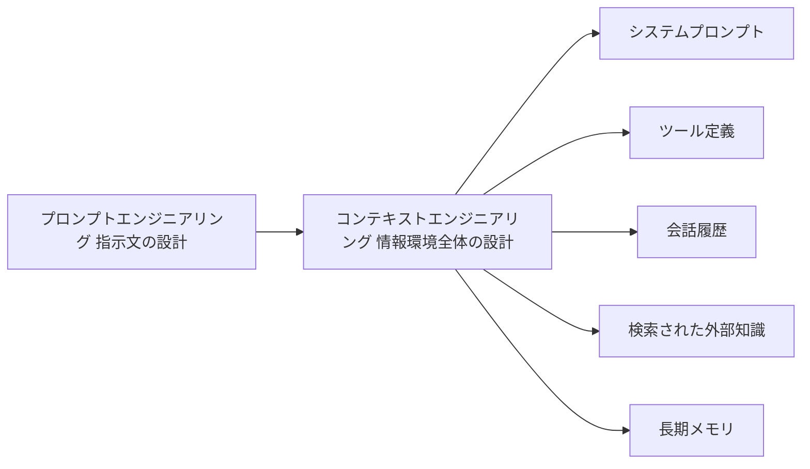
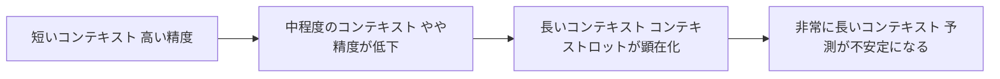
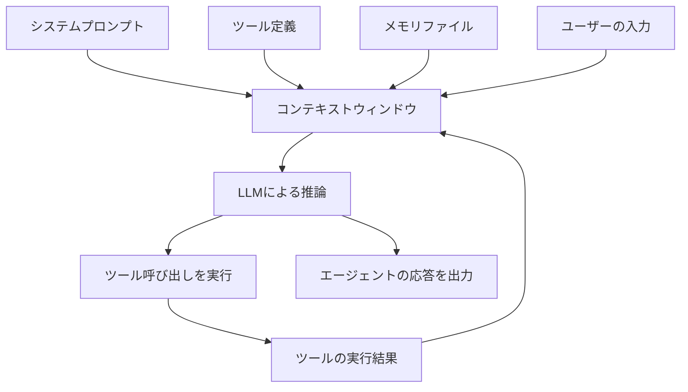
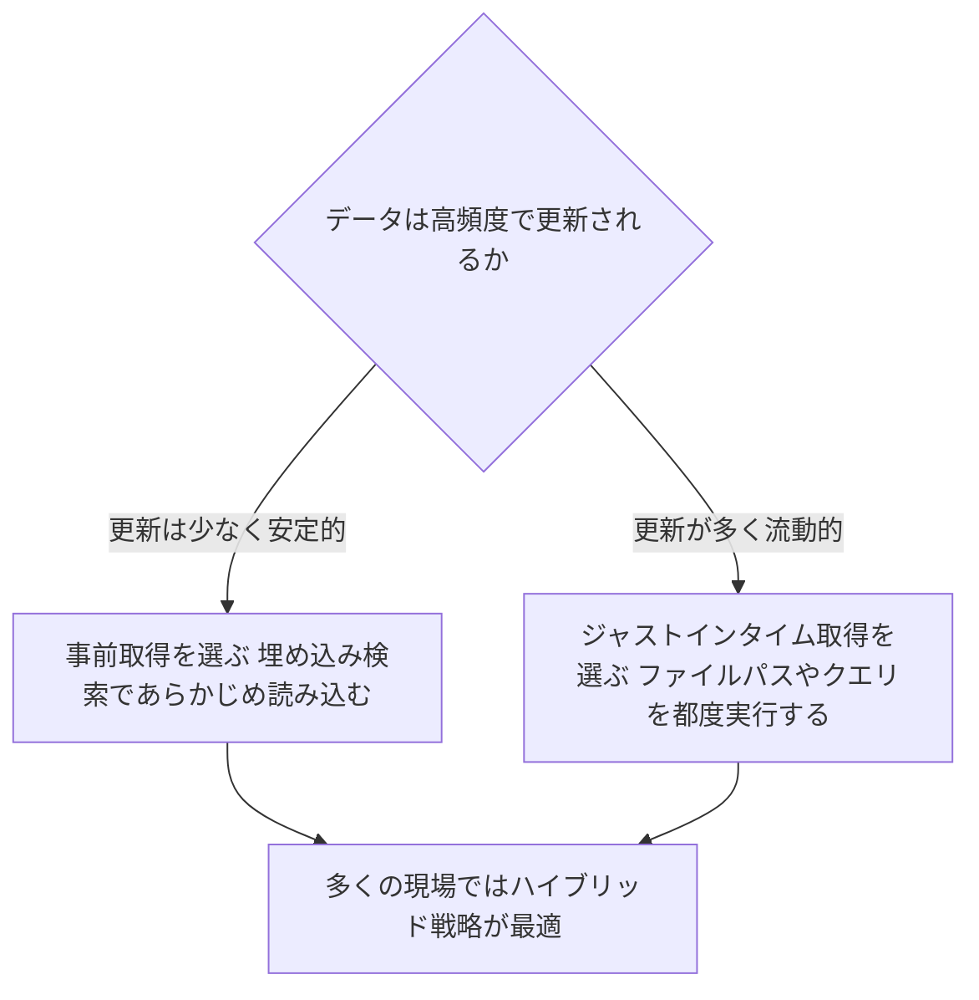
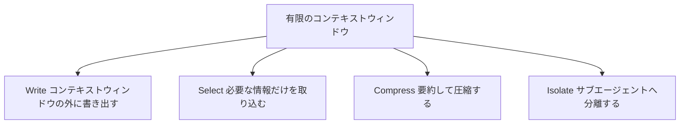
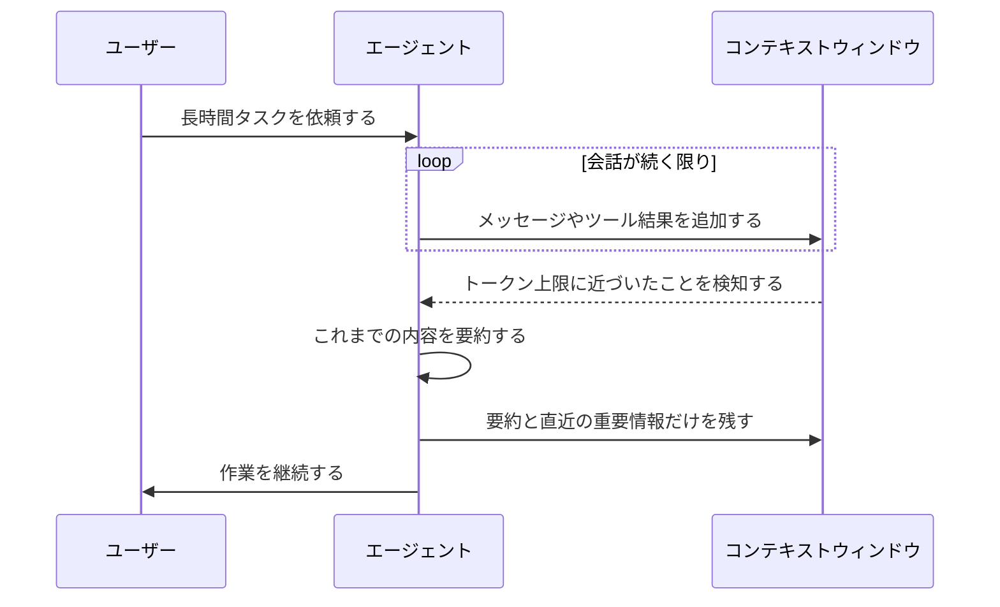
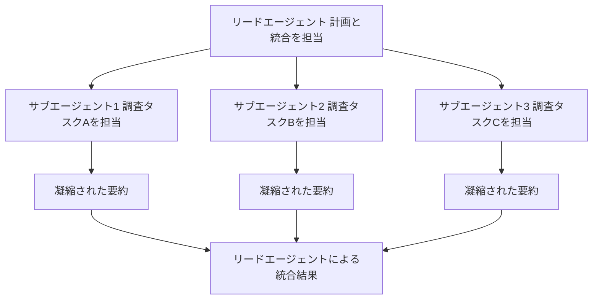
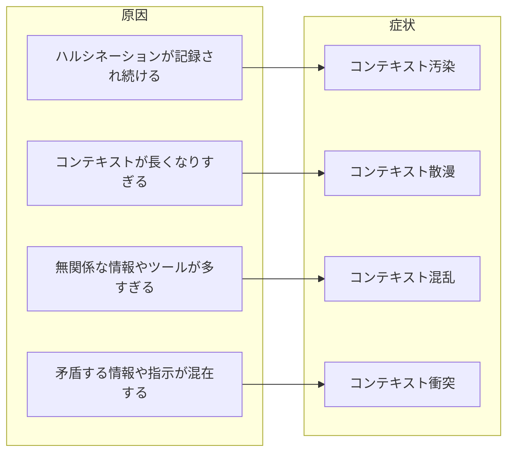

# コンテキストエンジニアリング入門: AIエージェントのためのステップバイステップ実践ガイド

## この記事について

2023年から2024年にかけて、AI活用の中心にあったのは「プロンプトエンジニアリング」でした。しかし2025年後半以降、AIエージェントが複数ターンにわたって自律的にツールを使いこなすようになると、業界の関心は「コンテキストエンジニアリング」という、より広い概念へと移っています。

本記事は、この分野に初めて触れるエンジニアやプロダクト担当者を対象に、コンテキストエンジニアリングの基礎から実践的なベストプラクティスまでをステップバイステップで解説するものです。各章の末尾には、その章の内容の根拠となった一次情報源のURLを明記しています。フローチャートはすべてMermaidで記述し、図表はMarkdown記法を用いています。

対象読者: LLMを使ったアプリケーションやAIエージェントを開発しているエンジニア、QAエンジニア、プロダクトマネージャー。プロンプトエンジニアリングの基礎知識があるとより理解しやすいですが、必須ではありません。

---

## 目次

1. コンテキストエンジニアリングとは何か
2. なぜ重要なのか: コンテキストロットという現象
3. コンテキストの解剖学: 何が入っているのか
4. ステップバイステップ ベストプラクティス
5. よくある落とし穴: 4つの失敗モード
6. 実践チェックリスト
7. ツールとフレームワーク早見表
8. まとめ
9. 参考文献 全リンク一覧

---

## 第1章 コンテキストエンジニアリングとは何か

### 1.1 定義

Anthropicのエンジニアリングチームは、コンテキストエンジニアリングを次のように定義しています。「コンテキスト」とはLLMが推論を行う際に読み込まれるトークンの集合を指し、「エンジニアリング」とは、望ましい挙動を一貫して引き出すために、そのトークン集合の有用性を最大化する作業を意味します。つまりコンテキストエンジニアリングとは、システムプロンプトだけでなく、ツール定義、会話履歴、検索された外部データなど、LLMに渡されるあらゆる情報を、絶えず変化する状況の中で取捨選択し続ける技術です。

言い換えると、コンテキストエンジニアリングは単発のタスクである「プロンプトを書く」こととは異なり、エージェントが1ステップ推論するたびに繰り返される、反復的なキュレーション作業です。

### 1.2 プロンプトエンジニアリングとの違い

| 観点 | プロンプトエンジニアリング | コンテキストエンジニアリング |
|---|---|---|
| 対象 | システムプロンプトや指示文の言い回し | システムプロンプト、ツール、会話履歴、検索データ、メモリなど全体の情報環境 |
| タイミング | 主に事前に一度設計する | エージェントの各推論ステップごとに継続的に行う |
| 想定用途 | 一問一答の分類や文章生成タスク | 複数ターン、長時間にわたり自律的に動くエージェント |
| 主な失敗要因 | 曖昧な指示、言葉選びのミス | 情報過多、古い情報の残留、無関係な情報の混入 |
| 代表的な提唱者 | 各種プロンプトガイド | Anthropic、LangChain、Cognition AI、Drew Breunig氏など |

以下は、両者の関係性を示す簡単な図です。

Anthropicは、コンテキストエンジニアリングを「プロンプトエンジニアリングの自然な延長」と位置づけています。LLMを使ったエンジニアリングの初期には、日常的なチャット以外の用途の多くが一発勝負の分類やテキスト生成であったため、プロンプトの書き方がすべてでした。しかし、より高度で長時間動作するエージェントを構築する段階に入ると、システム指示、ツール、Model Context Protocol、外部データ、会話履歴など、コンテキスト全体の状態を管理する戦略が必要になります。

著名な研究者Andrej Karpathy氏は、LLMを新しい種類のオペレーティングシステムに例え、LLM自体をCPU、コンテキストウィンドウをRAMになぞらえました。RAMと同様、コンテキストウィンドウにも限られた容量しかなく、OSがRAMに何を載せるかを管理するように、私たちはエージェントのコンテキストウィンドウに何を載せるかを管理する必要がある、という考え方です。

### 1.3 なぜ「ウィンドウ」が重要なのか

エージェントはループの中で動作し続けるため、次のターンで役立つかもしれない情報がどんどん蓄積されていきます。この絶えず膨張する情報の宇宙の中から、限られたコンテキストウィンドウに何を入れるかを選び取る作業こそが、コンテキストエンジニアリングの本質です。

> 出典:
> - Anthropic「Effective context engineering for AI agents」 https://www.anthropic.com/engineering/effective-context-engineering-for-ai-agents
> - LangChain「Context Engineering for Agents」 https://www.langchain.com/blog/context-engineering-for-agents
> - Drew Breunig「How Long Contexts Fail」 https://www.dbreunig.com/2025/06/22/how-contexts-fail-and-how-to-fix-them.html

---

## 第2章 なぜ重要なのか: コンテキストロットという現象

### 2.1 コンテキストロットとは

コンテキストウィンドウが大きければ大きいほど良い、と考えるのは自然なことですが、実際の研究結果はこれを否定しています。AIベクトルデータベース企業Chromaが2025年に発表した研究「Context Rot」は、GPT-4.1、Claude 4系、Gemini 2.5、Qwen3を含む18の最先端モデルを対象に検証を行い、入力トークン数が増えるほど、すべてのモデルで性能が劣化するという結果を示しました。しかもこの劣化は、コンテキストウィンドウの上限にかなり余裕がある段階から始まります。

この現象は「コンテキストロット」と呼ばれ、Needle in a Haystackのような単純な検索型ベンチマークでは見えてこなかった、より現実的なタスクにおける性能劣化を明らかにしました。

### 2.2 Chromaの研究結果の要点

| 検証項目 | 結果の概要 |
|---|---|
| 対象モデル数 | GPT-4.1、Claude 4系、Gemini 2.5系、Qwen3など18モデル |
| 基本的な傾向 | 入力トークン数が増えるほど、全モデルで一様ではなく不規則に性能が低下する |
| 100万トークン級モデル | 広告されている上限よりずっと手前、実務的にはおおむね20万トークン前後から性能劣化が目立ち始める |
| Lost in the middleの効果 | 関連する情報が20件の文書の中央付近、5番目から15番目あたりに置かれると正解率が大きく低下する |
| 誤解されがちな点 | Needle in a Haystackで高得点でも、要約や複雑な推論を伴う実タスクでは性能が保証されない |

以下は、コンテキストが増えるにつれて性能が低下していく、という概念を簡略化して示した図です。実際の劣化曲線はモデルやタスクによって形が異なりますが、「増えれば増えるほど良い」わけではないという傾向は共通しています。

### 2.3 なぜ起こるのか: Transformerの構造的な制約

この劣化の背景には、LLMの基盤であるTransformerアーキテクチャの構造的な制約があります。Transformerでは、すべてのトークンが他のすべてのトークンに注意を向けることができる仕組みになっているため、トークン数がnであれば、n対nの組み合わせの関係が発生します。コンテキスト長が伸びるほど、この関係を捉えるモデルの能力は薄く引き伸ばされ、コンテキストサイズと注意の集中度との間に自然な緊張関係が生まれます。

さらにモデルは、比較的短い文章が多い訓練データの分布から注意パターンを学習するため、非常に長いコンテキストにまたがる依存関係については、経験や専用パラメータが相対的に少なくなります。位置エンコーディングの補間といった技術によって長いシーケンスを扱えるようにはなっていますが、トークンの位置に関する理解には多少の劣化が伴います。これらの要因が積み重なり、崖のような急激な性能低下ではなく、なだらかな性能勾配が生まれます。

こうした事実から、思慮深いコンテキストエンジニアリングは、能力の高いエージェントを構築するうえで不可欠であるとAnthropicは結論づけています。

> 出典:
> - Chroma Research「Context Rot: How Increasing Input Tokens Impacts LLM Performance」 https://research.trychroma.com/context-rot
> - Anthropic「Effective context engineering for AI agents」 https://www.anthropic.com/engineering/effective-context-engineering-for-ai-agents

---

## 第3章 コンテキストの解剖学: 何が入っているのか

エージェントのコンテキストウィンドウには、主に次のような要素が含まれます。

| 構成要素 | 説明 | 代表例 |
|---|---|---|
| システムプロンプト | エージェントの役割や振る舞いを定義する指示文 | 背景情報、指示、ツールの使い方、出力形式の説明 |
| ツール定義 | エージェントが呼び出せる関数のスキーマと説明文 | 検索ツール、ファイル操作ツール、外部APIとの連携 |
| Few-shotの例 | 期待する挙動を示す具体例 | 入力と出力のペア |
| 会話履歴 | これまでのやり取りの記録 | ユーザー発言、エージェントの応答、ツールの実行結果 |
| 検索された知識 | 実行時に取り込まれる外部データ | RAGによる文書検索結果、ファイルの内容、Web検索結果 |
| メモリ | セッションをまたいで保持される情報 | ノートファイル、進捗ログ、学習した知見 |

これらの要素は、エージェントが1回の推論を行うたびにコンテキストウィンドウの中で組み合わされます。以下は、エージェントループの中でこれらの要素がどのように流れていくかを示した図です。

Anthropicによれば、良いコンテキストエンジニアリングとは、望ましい結果が得られる可能性を最大化する、可能な限り小さく高シグナルなトークン集合を見つけることです。ここで言う「最小限」とは「短い」という意味ではありません。エージェントに期待通りの振る舞いをさせるには、十分な情報を最初から与える必要がある、という点には注意が必要です。

システムプロンプトについては、複雑で壊れやすいif-elseロジックを詰め込みすぎる失敗と、逆に曖昧で高レベルすぎる指示になり具体的な信号を与えられない失敗の、両極端の間にある「適切な高度」を狙うべきだとされています。

> 出典:
> - Anthropic「Effective context engineering for AI agents」 https://www.anthropic.com/engineering/effective-context-engineering-for-ai-agents
> - Model Context Protocol公式ドキュメント https://modelcontextprotocol.io/docs/getting-started/intro

---

## 第4章 ステップバイステップ ベストプラクティス

ここからは、実際にコンテキストエンジニアリングを行う際の具体的な手順を、ステップごとに解説します。

### Step 1 システムプロンプトを適切な高度で書く

システムプロンプトは、明確でシンプルかつ直接的な言葉を用い、エージェントにとって「適切な高度」で提示するべきです。

- 複雑で壊れやすいif-elseロジックをハードコーディングしない
- 逆に、曖昧で高レベルすぎる、共有された文脈を勝手に前提とするような指示も避ける
- `<background_information>`、`<instructions>`、`Tool guidance`、`Output description`のように、プロンプトをセクションごとに整理し、XMLタグやMarkdown見出しで区切る
- まずは最良のモデルを使い、最小限のプロンプトでテストし、失敗パターンを見ながら指示や例を追加していく

### Step 2 ツールを設計する

ツールはエージェントが環境とやり取りし、新しい情報をコンテキストに取り込むための手段です。ツールはエージェントと情報空間との間の契約にあたるため、トークン効率の良い情報を返し、効率的な振る舞いを促すことが極めて重要です。

| 原則 | 悪い例 | 良い例 |
|---|---|---|
| 機能を絞る | list_users、list_events、create_eventの3つを個別に用意する | 空き時間を探して予定を登録するschedule_eventを1つ用意する |
| 検索指向にする | すべての連絡先を返すlist_contacts | 検索条件で絞り込むsearch_contacts |
| 名前空間を分ける | chat、get_conversationのような曖昧な名前 | asana_search、jira_searchのようにサービス名で前置する |
| レスポンス形式を選べるようにする | 常に詳細な情報を返す | concise、detailedのようなresponse_formatを用意する |
| エラーメッセージを親切にする | 内部のトレースバックをそのまま返す | 何をどう修正すればよいか明確に伝える |

ツールが多すぎたり機能が重複していたりすると、エージェントはどのツールを使うべきか判断できなくなります。人間のエンジニアが「どちらのツールを使うべきか」を即答できない状況では、AIエージェントにそれ以上の判断を期待するべきではない、というのがAnthropicの指摘です。

### Step 3 Few-shotの例は厳選する

Few-shotプロンプティングは有効なベストプラクティスですが、あらゆるエッジケースを網羅しようとして例を詰め込みすぎるのは避けるべきです。代わりに、期待される挙動を的確に示す、多様で代表的な例を厳選して用意することが推奨されています。LLMにとって、こうした例は「百聞は一見に如かず」の一枚の絵に相当します。

### Step 4 検索戦略を選ぶ: 事前取得、ジャストインタイム、ハイブリッド

多くのAIネイティブなアプリケーションは、埋め込みベースの検索を推論前に行い、重要なコンテキストをあらかじめ用意します。一方でエージェント指向のアプローチが広がるにつれ、こうした事前検索を「ジャストインタイム」戦略で補うチームが増えています。

ジャストインタイム戦略では、すべてのデータを事前処理するのではなく、ファイルパスや保存済みクエリ、Webリンクといった軽量な識別子だけを保持し、実行時にツールを使ってその識別子から動的にデータを読み込みます。Claude Codeはこの手法を用いて、巨大なデータベースに対する複雑な分析を行う際に、データ全体をコンテキストに載せることなくBashのheadやtailなどのコマンドで必要な部分だけを読み込みます。この考え方は人間の認知にも似ています。私たちは情報のすべてを記憶するのではなく、ファイルシステムや受信箱、ブックマークのような外部の整理・索引システムを使って、必要なときに情報を引き出しています。

ただし、実行時の探索は事前計算済みデータの取得より遅くなるというトレードオフがあります。適切なツールとヒューリスティックがなければ、エージェントはツールの誤用や行き止まりの探索によってコンテキストを浪費してしまいます。

法務や財務のように動的な内容が少ない領域ではハイブリッド戦略が適していることが多く、Claude Codeも実際にこのハイブリッドモデルを採用しています。CLAUDE.mdのようなファイルは最初からそのままコンテキストに読み込まれる一方、globやgrepのような仕組みで環境を探索し、必要なファイルをジャストインタイムで取得します。モデルの性能が上がるにつれ、設計は次第に「賢いモデルに賢く動いてもらう」方向へ、つまり人間によるキュレーションを減らす方向へ進むと予想されています。

### Step 5 長時間タスクのためのコンテキスト管理: 4つの戦略

数十分から数時間に及ぶような長時間タスク、たとえば大規模なコードベースの移行や本格的な調査プロジェクトでは、トークン数がコンテキストウィンドウの上限を超えてしまいます。コンテキストウィンドウが将来さらに大きくなったとしても、最強のエージェント性能を求める限り、コンテキスト汚染や情報関連性の問題は残り続けると考えられています。

LangChainはこうした課題への対処法を、Write、Select、Compress、Isolateという4つの戦略に整理しています。

| 戦略 | 内容 | 代表的な実装例 |
|---|---|---|
| Write | コンテキストウィンドウの外部に情報を保存する | スクラッチパッド、NOTES.mdのようなメモファイル |
| Select | 必要な情報だけをコンテキストに取り込む | 類似度検索、埋め込みベースの検索、ツールのフィルタリング |
| Compress | 必要なトークンだけを残す | 会話の要約、ツール結果の圧縮、コンパクション |
| Isolate | 複数のエージェントやサンドボックスに分割する | サブエージェントアーキテクチャ、サンドボックス環境 |

Anthropicは特に、長時間タスクのために有効な3つの技法として、コンパクション、構造化されたノートテイキング、サブエージェントアーキテクチャを挙げています。

#### 5-1 コンパクション

コンパクションとは、コンテキストウィンドウの上限に近づいた会話の内容を要約し、その要約をもとに新しいコンテキストウィンドウを再構築する手法です。Claude Codeでは、メッセージ履歴をモデルに渡して要約と圧縮を行わせ、アーキテクチャ上の意思決定や未解決のバグ、実装の詳細は保持しつつ、冗長なツール出力やメッセージは破棄します。その後、圧縮されたコンテキストと直近でアクセスした5つのファイルとともに作業を継続します。

コンパクションの難しさは、何を残し何を捨てるかの見極めにあります。過度に積極的な圧縮は、後になって重要性が判明するような微妙な文脈を失わせるリスクがあります。実装にあたっては、複雑なエージェントのトレースを使ってプロンプトを丁寧にチューニングし、まずは再現率を最大化してあらゆる関連情報を確実に捉え、そのうえで不要な内容を削って精度を高めていくアプローチが推奨されています。もっとも軽量な圧縮手法の一つが「ツール結果のクリア」で、深い履歴の中で一度呼び出されたツールの生の結果を、後から再び見る必要がない場合に消去する、というものです。

#### 5-2 構造化されたノートテイキング

構造化されたノートテイキング、いわゆるエージェント的メモリは、エージェントがコンテキストウィンドウの外部にあるメモリに定期的にメモを書き込み、それを後で再びコンテキストに取り込むという技法です。Claude Codeが作成するTo-Doリストや、独自エージェントが保持するNOTES.mdファイルのように、このシンプルなパターンによって、何十回ものツール呼び出しの中で失われてしまいがちな重要な文脈や依存関係を、複雑なタスク全体を通じて追跡できます。

Anthropicは2025年9月、Claude Sonnet 4.5とともに、コンテキストウィンドウの外にファイルベースでストレージできるメモリツールをパブリックベータとして公開しました。これによりエージェントは、時間をかけて知識ベースを構築し、セッションをまたいでプロジェクトの状態を保持し、すべてをコンテキストに保持しなくても過去の作業を参照できるようになります。この機能はコンテキストの編集機能と組み合わせて使うこともでき、Anthropicの社内評価では、両者を組み合わせることでベースラインに対して39%の性能向上が見られたと報告されています。

#### 5-3 サブエージェントアーキテクチャ

サブエージェントアーキテクチャは、コンテキストの制約を回避するもう一つの方法です。1つのエージェントがプロジェクト全体の状態を保持し続けるのではなく、専門化されたサブエージェントがそれぞれクリーンなコンテキストウィンドウで焦点を絞ったタスクを担当します。メインのエージェントは高レベルの計画で調整役を担い、サブエージェントは深い技術的作業やツールを使った情報収集を行います。各サブエージェントは数万トークン規模の探索を行うこともありますが、返すのは1000から2000トークン程度に凝縮された要約だけです。

この構成では、詳細な探索の文脈はサブエージェントの中に隔離されたまま保たれ、リードエージェントは結果の統合と分析に専念できます。Anthropicの多エージェント研究システムでは、この設計が単一エージェントシステムに対して大幅な性能改善をもたらしたことが報告されています。

3つの技法の使い分けの目安は次のとおりです。

| 状況 | 適した技法 |
|---|---|
| 継続的なやり取りが必要な会話的タスク | コンパクション |
| 明確なマイルストーンがある反復的な開発作業 | 構造化されたノートテイキング |
| 並列探索が価値を生む複雑な調査や分析 | マルチエージェントアーキテクチャ |

### Step 6 マルチエージェントを設計すべきか判断する

マルチエージェントアーキテクチャについては、業界内で活発な議論があります。Cognition AIは「Don't Build Multi-Agents」と題した記事で、サブエージェント間でコンテキストが共有されないこと、各エージェントの行動が暗黙の意思決定を伴い、それらが衝突するとまずい結果を招くことを理由に、マルチエージェント構成は壊れやすいと主張しました。一方Anthropicは、複雑な調査タスクにおいてリードエージェントと隔離されたサブエージェントを組み合わせる設計が、トークン使用量の増大を通じて性能をスケールさせる有効な手段になると報告しています。

| 論点 | Cognition AIの立場 | Anthropicの立場 |
|---|---|---|
| 主張 | 並列サブエージェントはコンテキストが分断され、壊れやすい | 隔離されたコンテキストによって並列探索が可能になり、性能が向上する |
| 象徴的な例 | Flappy Birdのクローン作成でサブエージェント同士のビジュアルスタイルが食い違う例 | 調査タスクでBrowseCompの性能が大幅に向上した例 |
| 推奨する設計 | 単一スレッドで線形に動くエージェントを基本にする | リードエージェントが計画し、サブエージェントに全体のトレースを渡して委任する |
| 読み取り作業との相性 | やや慎重 | 読み取り中心のタスクは並列化しやすいとされる |
| 書き込み作業との相性 | 特に危険と指摘 | 書き込みが競合する場合は慎重な設計が必要という点で一致 |

両者の議論に共通する教訓は、読み取り操作は書き込み操作よりも並列化しやすいということです。複数のエージェントが同時にコードや文章を書き込むと、互いに矛盾する決定が両立できない出力を生み出しやすくなります。したがって、マルチエージェント構成を採用するかどうかは、タスクが読み取り中心か書き込み中心か、そして真に並列探索の恩恵を受けられるタスクかどうかを見極めたうえで判断するべきです。

### Step 7 評価してイテレーションする

ツールやプロンプトの改善効果を正しく測るには、評価の仕組みが欠かせません。Anthropicが提案する手順は次のとおりです。

1. 実際の利用シーンに基づいたプロトタイプを素早く構築し、自分自身でテストする
2. 実際のデータソースやサービスに基づいた、複数ツール呼び出しを要するような現実的な評価タスクを多数用意する
3. 評価タスクごとに、検証可能な正解や期待される結果を対応づける
4. シンプルなエージェントループでプログラム的に評価を実行し、精度だけでなく、ツール呼び出し回数やトークン消費量、エラー発生状況も計測する
5. エージェント自身にトランスクリプトを分析させ、ツールの説明文やスキーマの改善案を出してもらう

こうした評価駆動のプロセスを通じて、ツールの説明文をわずかに調整するだけでも劇的な性能向上が得られることがあるとAnthropicは報告しています。

> 出典:
> - Anthropic「Effective context engineering for AI agents」 https://www.anthropic.com/engineering/effective-context-engineering-for-ai-agents
> - Anthropic「Writing effective tools for AI agents—using AI agents」 https://www.anthropic.com/engineering/writing-tools-for-agents
> - Anthropic「How we built our multi-agent research system」 https://www.anthropic.com/engineering/multi-agent-research-system
> - Anthropic「Managing context on the Claude Developer Platform」 https://www.anthropic.com/news/context-management
> - Anthropic Platform Docs「Memory tool」 https://platform.claude.com/docs/en/agents-and-tools/tool-use/memory-tool
> - Cognition AI「Don't Build Multi-Agents」 https://cognition.com/blog/dont-build-multi-agents
> - LangChain「How and when to build multi-agent systems」 https://www.langchain.com/blog/how-and-when-to-build-multi-agent-systems
> - LangChain「Context Engineering for Agents」 https://www.langchain.com/blog/context-engineering-for-agents
> - HumanLayer「12-Factor Agents」 https://github.com/humanlayer/12-factor-agents

---

## 第5章 よくある落とし穴: 4つの失敗モード

リサーチャーのDrew Breunig氏は、長いコンテキストがどのように失敗するかを4つのパターンに整理しました。この分類は業界で広く引用されており、LangChainも独自のリポジトリでこれらの失敗モードへの対処法を実装として公開しています。

| 失敗モード | 説明 | 典型的な兆候 |
|---|---|---|
| コンテキスト汚染 | ハルシネーションやエラーがコンテキストに入り込み、以降くり返し参照されてしまう | 目標が誤って記録されると、達成不可能な目標のために不合理な戦略を繰り返す |
| コンテキスト散漫 | コンテキストが長くなりすぎて、モデルが訓練で学んだことよりも積み込まれた文脈に過度に依存してしまう | Pokemonをプレイするエージェントで、10万トークンを超えたあたりから新しい計画を立てず過去の行動を繰り返す傾向が観測された |
| コンテキスト混乱 | コンテキスト中の余計な情報が、低品質な応答の生成に使われてしまう | ツールを30個以上並べると説明文同士が重なり合い、選択精度が大きく落ちる |
| コンテキスト衝突 | 新たに蓄積された情報やツールが、プロンプト中の他の情報と矛盾してしまう | 自分で作っていないMCPツールを組み込んだ際に、説明文がプロンプトの他の指示と食い違う |

これらの問題への対処法として、Breunig氏らは次のような技法を提案しています。

| 対処法 | 内容 |
|---|---|
| RAG | 関連する情報だけを選んでコンテキストに追加し、より良い応答を助ける |
| Tool Loadout | タスクのフェーズごとに、関連するツール定義だけを絞り込んで有効化する |
| Context Quarantine | サブタスクごとに専用のスレッドやコンテキストへ隔離し、早期のエラーがプロジェクト全体を汚染するのを防ぐ |
| Context Pruning | 検索結果の中から無関係な内容を取り除いてからモデルに渡す |
| Context Offloading | スクラッチパッドのような領域にメモを書き出し、コンテキストを圧迫せずに後で参照できるようにする |
| Context Summarization | 蓄積された会話やツール結果を要約し、必要な情報だけを残す |

なお、ツール数と精度の関係については、あるモデルでは30個を超えたあたりからツールの説明が重なり合い始め、100個を超えるとほぼ確実に失敗するという報告があります。より小さいモデルではその閾値はさらに下がり、19個までは成功していたのに46個のツールを与えると失敗する、という事例も報告されています。ツールは多ければ良いというものではなく、タスクに応じて動的に絞り込む設計が重要です。

> 出典:
> - Drew Breunig「How Long Contexts Fail」 https://www.dbreunig.com/2025/06/22/how-contexts-fail-and-how-to-fix-them.html
> - Drew Breunig「How to Fix Your Context」 https://www.dbreunig.com/2025/06/26/how-to-fix-your-context.html
> - LangChain「how_to_fix_your_context」リポジトリ https://github.com/langchain-ai/how_to_fix_your_context

---

## 第6章 実践チェックリスト

コンテキストエンジニアリングに取り組む際の、簡易チェックリストです。

| チェック項目 | 確認内容 |
|---|---|
| システムプロンプトの高度 | 壊れやすいほど具体的すぎず、曖昧すぎて信号を与えられないほど抽象的でもないか |
| ツールの数と機能範囲 | 人間のエンジニアが「どのツールを使うべきか」を即答できる程度に整理されているか |
| ツールの命名 | サービス名やリソース名で名前空間が分けられているか |
| ツールのレスポンス | 低レベルなID等ではなく、意味のある自然言語の情報を優先して返しているか |
| トークン効率 | ページネーションやフィルタリング、切り詰めが適切に実装されているか |
| Few-shotの例 | エッジケースを網羅しようとして例を詰め込みすぎていないか |
| 検索戦略 | データの更新頻度に応じて、事前取得、ジャストインタイム、ハイブリッドを使い分けているか |
| 長時間タスクへの備え | コンパクション、構造化ノートテイキング、サブエージェントのいずれかを用意しているか |
| マルチエージェント設計 | 書き込みが競合するタスクを不用意に並列化していないか |
| コンテキスト汚染対策 | ハルシネーションが繰り返し参照されない仕組みがあるか |
| 評価の仕組み | 現実的なタスクに基づく評価セットを用意し、継続的に改善しているか |

---

## 第7章 ツールとフレームワーク早見表

| ツールやフレームワーク | 主な役割 | 対応する戦略 |
|---|---|---|
| Claudeのメモリツール | ファイルベースでコンテキストウィンドウ外にメモリを保持する | Write、長時間タスクの継続 |
| Claudeのコンテキスト編集機能 | 古くなったツール呼び出しや結果を自動でコンテキストから取り除く | Compress |
| Model Context Protocol | エージェントに外部ツールやデータソースを接続するための標準規格 | Select |
| LangGraph | 状態グラフによってエージェントのメモリや分岐を管理するフレームワーク | Write、Select、Compress、Isolateの全体 |
| LangGraph Supervisor | サブエージェントに処理を委任し、隔離されたコンテキストで並列実行する | Isolate |
| LangGraph Bigtool | 大量のツールの中から意味的に関連するものだけを選択する | Select |
| Claude Code | CLAUDE.mdの事前読み込みとglob、grepによるジャストインタイム探索を組み合わせるハイブリッド設計 | Select、Write |

> 出典:
> - Anthropic Platform Docs「Memory tool」 https://platform.claude.com/docs/en/agents-and-tools/tool-use/memory-tool
> - Anthropic「Managing context on the Claude Developer Platform」 https://www.anthropic.com/news/context-management
> - Model Context Protocol公式ドキュメント https://modelcontextprotocol.io/docs/getting-started/intro
> - LangChain「context_engineering」リポジトリ https://github.com/langchain-ai/context_engineering

---

## 第8章 まとめ

コンテキストエンジニアリングとは、LLMの限られた「注意の予算」の中に、望ましい挙動を引き出すために必要な、最小限かつ高シグナルな情報だけを継続的にキュレーションし続ける技術です。プロンプトエンジニアリングが一度きりの指示文設計であるのに対し、コンテキストエンジニアリングはエージェントが動き続ける限り繰り返される作業であるという点が、最大の違いです。

コンテキストウィンドウが大きくなればなるほど良いという単純な話ではなく、Chromaの研究が示すように、すべての最先端モデルは入力トークン数が増えるにつれて性能が劣化します。この現実を踏まえ、システムプロンプトの高度を調整すること、ツールを絞り込み設計すること、検索戦略を状況に応じて選ぶこと、そして長時間タスクにはコンパクション、構造化ノートテイキング、サブエージェントアーキテクチャを組み合わせることが、実践的なベストプラクティスとして確立されつつあります。

モデルの性能は今後も向上し続けると見られますが、コンテキストを希少で有限な資源として扱うという考え方そのものは、信頼性が高く効果的なエージェントを構築するうえで、引き続き中心的な役割を果たすとAnthropicは結論づけています。

---

## 第9章 参考文献 全リンク一覧

| No. | 発行元 | タイトル | 公開時期 | URL |
|---|---|---|---|---|
| 1 | Anthropic | Effective context engineering for AI agents | 2025年9月29日 | https://www.anthropic.com/engineering/effective-context-engineering-for-ai-agents |
| 2 | Anthropic | Writing effective tools for AI agents—using AI agents | 2025年9月11日 | https://www.anthropic.com/engineering/writing-tools-for-agents |
| 3 | Anthropic | How we built our multi-agent research system | 2025年6月13日 | https://www.anthropic.com/engineering/multi-agent-research-system |
| 4 | Anthropic | Managing context on the Claude Developer Platform | 2025年9月29日 | https://www.anthropic.com/news/context-management |
| 5 | Anthropic Platform Docs | Memory tool | 随時更新 | https://platform.claude.com/docs/en/agents-and-tools/tool-use/memory-tool |
| 6 | Anthropic Docs | Prompt engineering overview | 随時更新 | https://docs.claude.com/en/docs/build-with-claude/prompt-engineering/overview |
| 7 | Chroma Research | Context Rot: How Increasing Input Tokens Impacts LLM Performance | 2025年 | https://research.trychroma.com/context-rot |
| 8 | LangChain | Context Engineering for Agents | 2025年 | https://www.langchain.com/blog/context-engineering-for-agents |
| 9 | LangChain | context_engineeringリポジトリ | 2025年 | https://github.com/langchain-ai/context_engineering |
| 10 | LangChain | How and when to build multi-agent systems | 2025年6月16日 | https://www.langchain.com/blog/how-and-when-to-build-multi-agent-systems |
| 11 | LangChain | how_to_fix_your_contextリポジトリ | 2025年 | https://github.com/langchain-ai/how_to_fix_your_context |
| 12 | Cognition AI | Don't Build Multi-Agents | 2025年6月12日 | https://cognition.com/blog/dont-build-multi-agents |
| 13 | Drew Breunig | How Long Contexts Fail | 2025年6月22日 | https://www.dbreunig.com/2025/06/22/how-contexts-fail-and-how-to-fix-them.html |
| 14 | Drew Breunig | How to Fix Your Context | 2025年6月26日 | https://www.dbreunig.com/2025/06/26/how-to-fix-your-context.html |
| 15 | HumanLayer | 12-Factor Agents, Factor 3: Own your context window | 2025年 | https://github.com/humanlayer/12-factor-agents |
| 16 | Model Context Protocol | 公式ドキュメント Introduction | 随時更新 | https://modelcontextprotocol.io/docs/getting-started/intro |

すべての情報は2026年7月時点での各サイトの公開内容に基づいています。コンテキストエンジニアリングは非常に速いスピードで進化している分野のため、最新の情報については各URLを直接ご確認ください。
