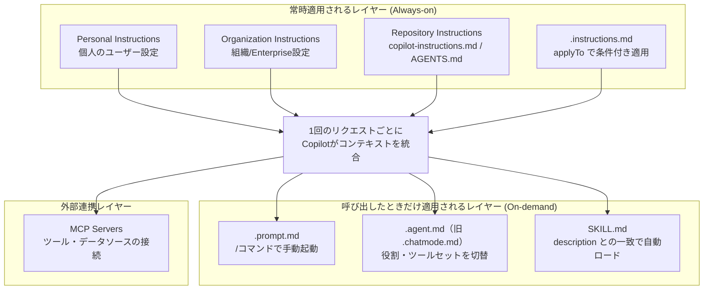
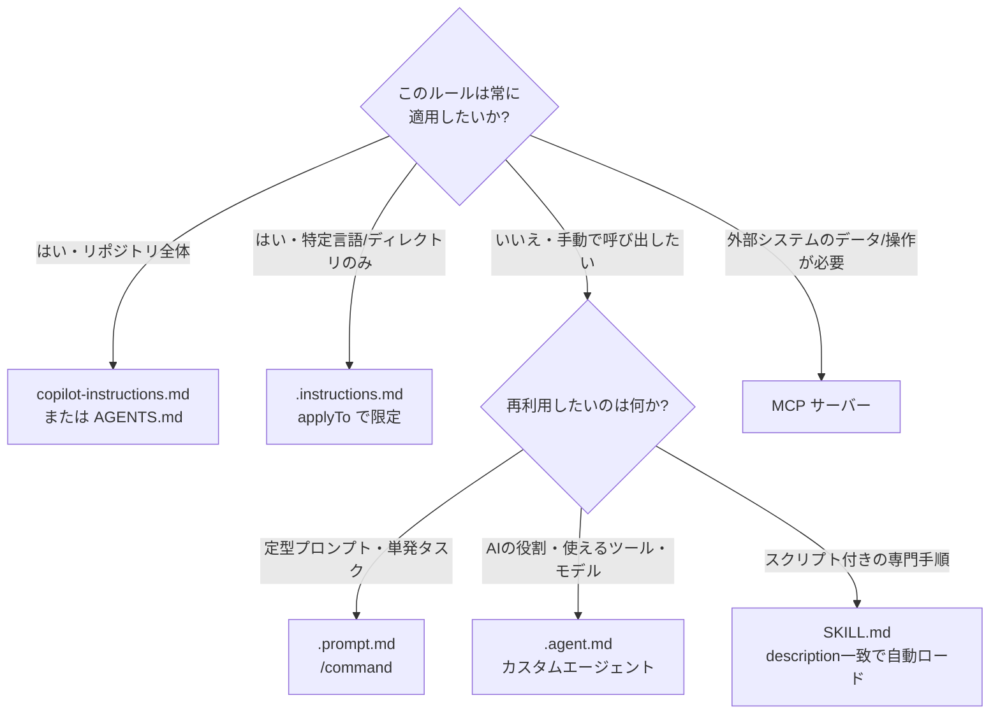
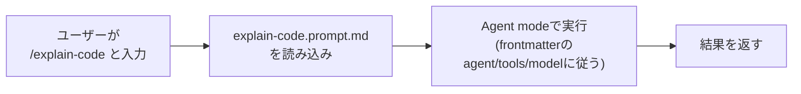
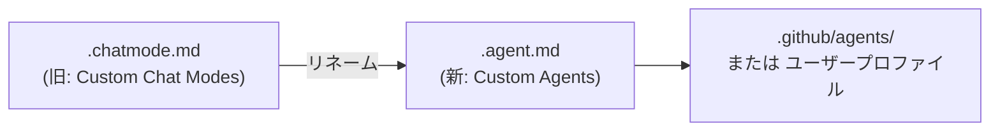
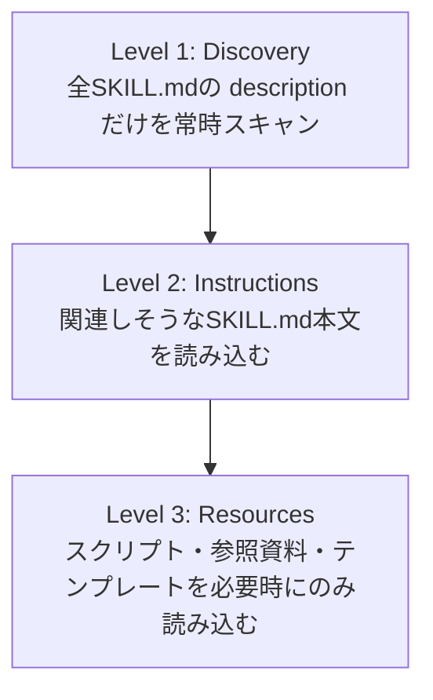
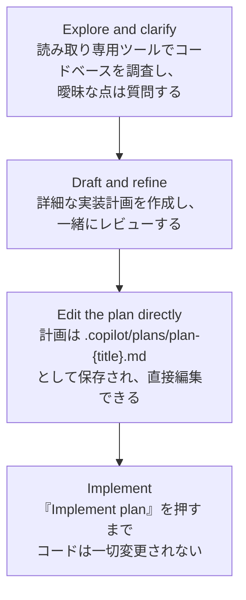
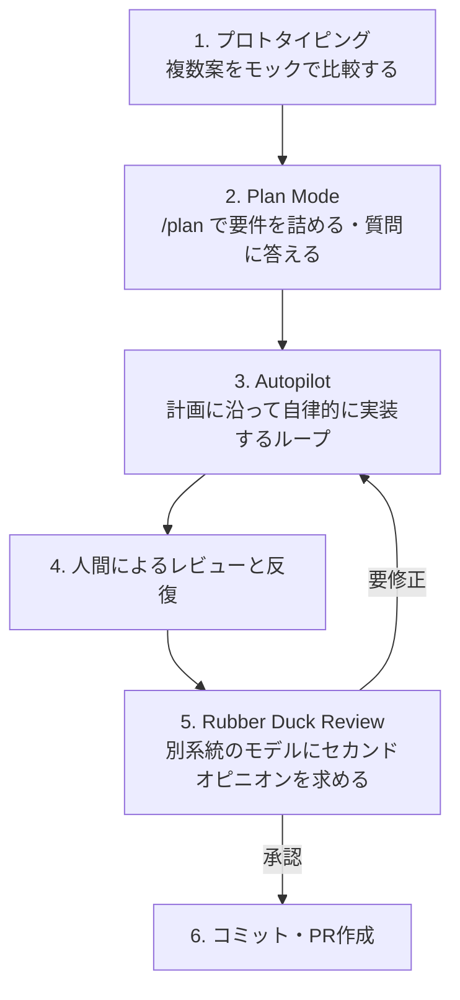
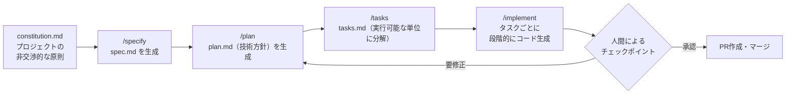

# GitHub Copilot AI仕様駆動開発 ベストプラクティスガイド

**copilot-instructions.md / .instructions.md / .prompt.md / .chatmode.md / .agent.md / SKILL.md / MCP / Plan Mode 徹底解説**

対象読者: GitHub Copilotを日常的に使っている中級〜上級のソフトウェアエンジニア・AIエンジニア
情報基準日: 2026年7月31日（本ガイドは公式ドキュメントおよび著名な開発者の発信をもとに作成しています）

> **注意**: 本ガイドで扱う機能の多くはプレビュー(public preview)段階であり、UI・ファイル配置・コマンド名は今後変更される可能性があります。特に「カスタムチャットモード」から「カスタムエージェント」への名称変更のように、記事執筆時点でも仕様が流動的な部分があるため、実装前に必ず公式ドキュメント（本文末の参考文献）で最新仕様を確認してください。

---

## 目次

1. [全体像:Copilotのコンテキストはどう組み立てられるか](#1)
2. [Step 1: copilot-instructions.md — リポジトリ全体のルール](#2)
3. [Step 2: .instructions.md — パス限定ルールと AGENTS.md](#3)
4. [Step 3: .prompt.md — 再利用可能なスラッシュコマンド](#4)
5. [Step 4: .chatmode.md → .agent.md — カスタムエージェント](#5)
6. [Step 5: SKILL.md — Agent Skills（手続き的知識）](#6)
7. [Step 6: MCP — 外部ツール・データソースとの接続](#7)
8. [Step 7: Plan Mode — 実装前に合意形成する](#8)
9. [仕様駆動開発（SDD）への統合: GitHub Spec Kit](#9)
10. [セキュリティとガバナンスの勘所](#10)
11. [成熟度モデルとチェックリスト](#11)
12. [参考文献](#12)

---

<a id="1"></a>
## 1. 全体像:Copilotのコンテキストはどう組み立てられるか

GitHub Copilotは1回のリクエストごとに、複数のレイヤーから集めた情報を統合してモデルに渡しています。これらのレイヤーを正しく使い分けることが、AI仕様駆動開発（Spec-Driven Development, SDD）の土台になります。



VS Codeの公式ドキュメントによれば、複数の指示が衝突した場合は「Personal instructions（個人設定）が最も優先され、その後 Repository instructions（`.github/copilot-instructions.md` または `AGENTS.md`）、Organization instructions（組織設定）の順に適用される」とされています（GitHub.com上のCopilot Chatではこの優先順位が異なる場合があるため、利用面ごとに公式ドキュメントを確認してください）。

以下は、どのファイル/機能をいつ使うべきかの判断フローです。



まずは全体像を俯瞰する一覧表です。

| 機能 | ファイル / 場所 | スコープ | 発動方法 | 主な用途 |
|---|---|---|---|---|
| Repository instructions | `.github/copilot-instructions.md` | リポジトリ全体 | 自動（常時） | 技術スタック、ビルド/テスト手順、コーディング規約 |
| Path-specific instructions | `.github/instructions/*.instructions.md` | `applyTo` で指定したパス/言語のみ | 自動（条件付き） | 言語別・ディレクトリ別の詳細ルール |
| AGENTS.md | リポジトリルートの `AGENTS.md` | リポジトリ全体（複数のAIツール共通） | 自動（常時） | Copilot以外のエージェント（Claude Code、Codexなど）とも共有する規約 |
| Prompt files | `.github/prompts/*.prompt.md` | 単発タスク | 手動（`/command`） | 定型作業をスラッシュコマンド化 |
| Custom agents（旧Custom chat modes） | `.github/agents/*.agent.md` | セッション/タスク単位 | 手動（エージェント選択） | 役割・ツールセット・モデルの切り替え |
| Agent Skills | `.github/skills/<name>/SKILL.md` | タスク単位 | 自動（description一致で動的ロード） | 手続き的知識、スクリプト、テンプレートの束 |
| MCP | `.vscode/mcp.json` など | ツール/データ接続 | 自動（Agent modeが解決） | 外部システム（Issue管理、DB、ブラウザ操作など）との連携 |
| Plan Mode | 機能（専用ファイル形式なし） | セッション単位 | 手動（モード切替） | 実装前の要件確認・合意形成 |

---

<a id="2"></a>
## 2. Step 1: copilot-instructions.md — リポジトリ全体のルール

### 概要

`.github/copilot-instructions.md` は、リポジトリのルートに置く単一のMarkdownファイルです。VS Codeが自動検出し、そのワークスペース内のすべてのチャットリクエストに適用されます。Copilot Chat・Copilot coding agent・Copilot code reviewの全てが参照します。

### ベストプラクティス

1. **簡潔・具体的に書く**: GitHub公式ブログの「5 tips」でも、完璧を目指しすぎず「不完全な instructions ファイルでも、何も無いよりずっと良い」と述べられています。まず小さく始めて、ドキュメントのように継続的に更新するのが推奨されています。
2. **必ずコミットする**: ローカルにしか無いファイルはチーム全体に効果がありません。リポジトリにコミットして初めて全員の環境で機能します。
3. **矛盾を避ける**: 実際のコードベースと矛盾する指示（例:「コールバックを使わない」と書いてあるのに実装の4割がコールバックを使っている）は、Copilotの出力を不安定にします。既存コードを整理するか、例外を明記しましょう。
4. **曖昧な指示を避ける**: 「良いコードを書いて」のような抽象的な指示ではなく、「観測可能でチェック可能なルール」を書くことが効果的だとされています。
5. **長すぎないようにする**: 指示ファイルが長大になりすぎる（目安として1000行超）と、Copilot code reviewなどの一部機能で挙動が不安定になることが報告されています。短く、見出しと箇条書きで構造化しましょう。
6. **自動生成を活用する**: GitHub上のCopilot coding agentには、リポジトリを解析して `copilot-instructions.md` の叩き台を生成する機能があります。まずAIに生成させ、人間がレビュー・調整する流れが効率的です。
7. **動作確認する**: VS CodeのCopilot Chatで `@github このプロジェクトの copilot-instructions.md にあるコーディング規約を要約して` のように尋ね、正確な要約が返ってくるかで読み込まれているか検証できます。

### サンプル

```markdown
# Project Guidelines

This is a Go-based backend with a Ruby client for specific API endpoints.

## Stack
- Language: Go 1.23 (backend), Ruby 3.3 (client SDK)
- Test: `go test ./...` / `bundle exec rspec`
- Lint: `golangci-lint run`

## Conventions
- Prefer table-driven tests in Go.
- All exported functions require doc comments.
- Do not introduce new third-party HTTP clients; use the internal `httpx` wrapper.

## Ask before assuming
If requirements are ambiguous, ask a clarifying question instead of guessing.
```

---

<a id="3"></a>
## 3. Step 2: .instructions.md — パス限定ルールと AGENTS.md

### .instructions.md

リポジトリ全体ではなく「Pythonファイルのときだけ」「`src/api/` 配下だけ」といった条件付きルールを与えたい場合は、`.github/instructions/` 配下に `*.instructions.md` ファイルを作成します。YAMLフロントマターの `applyTo` フィールドでglobパターンを指定します。

```markdown
---
applyTo: "**/*.py"
---
# Python Code Standards
- Use Python 3.11+ features
- Follow PEP 8
- Use type hints for all function parameters and returns
- Prefer pathlib over os.path
```

```markdown
---
applyTo: "src/api/**/*"
---
# API Development Standards
- Use RESTful conventions
- Return proper HTTP status codes
- Validate all input data
- Use async/await for database operations
```

**使い分けの目安**: まず単一の `copilot-instructions.md` でプロジェクト全体の規約から始め、フロントエンドとバックエンドで求めるスタイルが違う、認証やインフラなど特に慎重に扱いたい領域があるといった「差分」が出てきたタイミングで `.instructions.md` を追加していくのが実務上のおすすめです。

### AGENTS.md との違い

似た名前の `AGENTS.md` は、GitHub Copilot専用ではなく、Codexやその他多くのAIコーディングツールが共通で読み込むオープンなフォーマットです。VS Codeも `AGENTS.md` をサポートしており、「複数のAIエージェントを併用するプロジェクトでは `AGENTS.md`、Copilot専用なら `copilot-instructions.md`」という使い分けが公式ドキュメントで案内されています。

| 比較項目 | copilot-instructions.md | AGENTS.md |
|---|---|---|
| 対象ツール | GitHub Copilotファミリー | Copilot・Codexなど複数の対応ツール |
| 位置づけ | Copilot向けの「常時適用ルール」 | 複数エージェント共通の「リポジトリのREADME」的存在 |
| 使い分けの目安 | Copilotのみを使うチーム | 複数のAIコーディングツールを併用するチーム |

さらにややこしいのが、後述する `.agent.md`（カスタムエージェント）との混同です。開発者Hidde de Smetのブログ記事が端的にまとめている通り、**`AGENTS.md` は「リポジトリの中でどう振る舞うべきか」を伝えるプロジェクトガイダンスであるのに対し、`.agent.md` は「プランナー」「セキュリティレビュアー」のような特定の役割（ペルソナ）を定義するカスタムエージェントのプロファイルです**。名前は似ていますが役割は別物なので注意してください。

---

<a id="4"></a>
## 4. Step 3: .prompt.md — 再利用可能なスラッシュコマンド

### 概要

Custom instructionsが「常に効くルール」であるのに対し、Prompt filesは「必要なときだけ手動で呼び出すタスクテンプレート」です。`.github/prompts/` 配下に `*.prompt.md` として保存すると、VS Code・Visual Studio・JetBrainsのCopilot Chatで `/ファイル名` と入力するだけで呼び出せます。



### フロントマター

| フィールド | 説明 |
|---|---|
| `description` | チャット入力欄にプレースホルダーとして表示される説明文 |
| `agent`（旧 `mode`） | 実行時のエージェント種別（例: `agent`） |
| `model` | 使用するモデル（未指定時はモデルピッカーの選択値） |
| `tools` | 利用可能なツール/ツールセット名のリスト（組み込みツール・MCPツール・拡張機能のツールを含む） |

### サンプル

```markdown
---
description: "Generate a new React form component"
agent: agent
tools: ["search/codebase"]
---
Your goal is to generate a new React form component based on the templates
in this repo's `src/components/forms` directory. Ask for the form name and
fields if not provided.
```

計画レビューを強制したい場合の例（実装前に必ず計画を作らせるパターン）:

```markdown
---
description: "Draft a step-by-step implementation plan before editing any files"
agent: agent
---
Before making any changes, draft a numbered implementation plan: the files
you intend to touch, the reasoning for each change, and any risks. Ask
clarifying questions if the request is ambiguous. Wait for explicit approval
before editing.
```

VS Codeには `/create-prompt` というコマンドもあり、「やりたいことを説明するだけで、適切なfrontmatter付きの `.prompt.md` を自動生成してくれる」機能も用意されています。ゼロから書くよりも、まずAIに叩き台を作らせて調整する方が効率的です。

**「Prompt files / Custom agents / Skills、どれを使うべきか」の判断基準**として、VS Code公式ドキュメントは「軽量で単発のタスクにはPrompt filesを、複雑なワークフローの自動化にはSkillsやCustom agentsを」という指針を示しています。

---

<a id="5"></a>
## 5. Step 4: .chatmode.md → .agent.md — カスタムエージェント

### 重要な仕様変更

かつて「Custom Chat Modes」と呼ばれ `.chatmode.md` ファイルで定義されていた機能は、VS Code公式ドキュメントの記載によれば **「Custom Agents」に名称変更され、ファイル拡張子も `.agent.md` に変わりました**。機能自体は同じですが、用語とファイル形式が更新されています。既存の `.chatmode.md` ファイルは、`.agent.md` にリネームして所定の場所（`chat.agentFilesLocations` で設定するディレクトリ、リポジトリでは典型的に `.github/agents/`）に置き直すことで引き続き利用できます。



### 何のためのファイルか

Custom agentsは「読み取り専用ツールしか使えないPlanning用エージェント」「ファイル編集もできるImplementation用エージェント」のように、**タスクごとに使えるツール・モデル・振る舞いを切り替える**ための仕組みです。ローカルのAgent modeだけでなく、バックグラウンド実行のクラウドエージェントでも同じ設定を再利用できます。

### フロントマター

| フィールド | 説明 |
|---|---|
| `description` | エージェント選択時に表示される説明 |
| `tools` | 利用可能なツール（YAML配列） |
| `model` | 使用モデル（未指定時はモデルピッカーの選択値） |
| `handoffs` | 応答完了後に提案される「次の一手」（別のエージェント/プロンプトへの引き継ぎボタン） |

VS Codeは `.github/agents/*.agent.md` に加え、`.claude/agents/` 配下のClaude Code形式（サブエージェント）の `.md` ファイルも自動認識します。Claude形式のカンマ区切りツール指定は、VS Code用のツール名に自動マッピングされるため、**同じエージェント定義をVS CodeとClaude Codeで共有できる**という互換性が確保されています。

### サンプル: プランニング専用エージェント

```markdown
---
description: "Explore the codebase and draft a plan. Never edit files directly."
tools: ["search/codebase", "readFile"]
model: Claude Sonnet
---
You are a planning specialist. Investigate the codebase using read-only
tools, identify open questions, and produce a numbered implementation plan.
Do not edit or create files. Hand off to the implementation agent once the
plan is approved.
```

---

<a id="6"></a>
## 6. Step 5: SKILL.md — Agent Skills（手続き的知識）

### 概要

SKILL.mdは、Anthropicが提唱し `agentskills.io` としてオープン仕様化された形式で、GitHub Copilotだけでなく Claude Code・Cursor・Codex CLIなど複数のエージェントで共通して読み込める「再利用可能な手続き的知識のパッケージ」です。GitHub公式ドキュメントも「Agent Skills is an open standard, used by a range of different agents」と明記しています。

### Instructions（常時適用）との違い

- `copilot-instructions.md` / `.instructions.md` は**常時適用される「あるべき論」**（コーディング規約など）
- SKILL.mdは**特定のタスクが来たときだけオンデマンドでロードされる「専門的な手順」**（スクリプトやテンプレート付きの実行手順）

この違いにより、多数のスキルをインストールしてもコンテキストウィンドウを圧迫しない設計になっています。これを実現する仕組みが**Progressive Disclosure（段階的開示）**です。



### ディレクトリ構成

```text
your-repo/
└── .github/
    └── skills/
        └── webapp-testing/
            ├── SKILL.md        # 必須: メタデータ + 手順
            ├── scripts/        # 任意: 実行可能なスクリプト
            ├── references/     # 任意: 参照ドキュメント
            └── assets/         # 任意: テンプレート・リソース
```

プロジェクト固有のスキルは `.github/skills`（または `.claude/skills`、`.agents/skills`）に、個人用の横断的なスキルは `~/.copilot/skills`（または `~/.agents/skills`）に置きます。

### SKILL.mdのサンプル

```markdown
---
name: webapp-testing
description: >-
  Assists with web application test strategies and automated test creation.
  Use when the user asks about testing, test coverage, or writing E2E tests.
---
## Procedure
1. Analyze the target code and determine the appropriate testing strategy.
2. Create test files following the Arrange-Act-Assert (AAA) pattern.
3. Run the tests and report the results.
```

### description の書き方が命

Copilotは、ユーザーの発言と各SKILL.mdの `description` フィールドを照合して、どのスキルをロードするか判断します。「レビューして」「バグを見つけて」など**複数の言い回しを想定した具体的な description**を書くことが、意図通りにスキルを発火させるコツです。GitHub公式のAgent Skillsガイドでも、Anthropic発の `skill-creator` スキルを使ってスキル自体をAIに生成させる方法が紹介されています（`anthropics/skills` リポジトリで公開）。

---

<a id="7"></a>
## 7. Step 6: MCP — 外部ツール・データソースとの接続

### 概要

Model Context Protocol（MCP）は、LLMアプリケーションが外部のツールやデータソースとやり取りするためのオープンな標準規格です。VS Codeでは `.vscode/mcp.json` をリポジトリにコミットすることで、チーム全員がそのMCPサーバーを共有できます。

### 設定ファイルの注意点

```json
{
  "servers": {
    "github": {
      "type": "http",
      "url": "https://api.githubcopilot.com/mcp/"
    },
    "playwright": {
      "command": "npx",
      "args": ["-y", "@playwright/mcp@latest"]
    }
  }
}
```

ルートキーは **`servers`** です。Cursor や Claude Desktop の設定ファイルでは `mcpServers` が使われているため、他ツールの設定をそのままコピー&ペーストすると動かないというのが「よくある設定ミス」として複数の解説記事で指摘されています。

### トランスポートの種類

| トランスポート | 説明 |
|---|---|
| `stdio` | ローカルのサブプロセスとして起動する標準的なMCP方式。多くのサーバーが採用 |
| `http`（Streamable HTTP） | リモートエンドポイントに接続する現行の推奨方式 |
| `sse` | レガシーなServer-Sent Events方式。MCP仕様上は非推奨だが後方互換のため対応 |

Agent modeでのみMCPツールは有効になり、AskモードやEditモードでは利用できない点にも注意してください。

### 利用範囲

MCPはVS Codeだけでなく、Copilot CLI・Copilot cloud agent・Copilot code review・GitHub Copilotアプリなど、Copilotファミリー全体で利用可能です。ただし、CLIの設定ファイル形式はVS Codeの `.vscode/mcp.json` とは別物なので、CLIでMCPを使う場合は専用の設定手順を公式ドキュメントで確認してください。組織/Enterpriseプランでは「MCP servers in Copilot」ポリシーが既定で無効になっているため、管理者による有効化が必要です。

---

<a id="8"></a>
## 8. Step 7: Plan Mode — 実装前に合意形成する

### なぜPlan Modeが必要か

エージェントに大きめのタスクを依頼すると「気づいたら大量のファイルが書き換わっていて、それは望んでいた実装ではなかった」という失敗が起きやすいものです。Plan Modeは、**コードを一切変更せずに、読み取り専用ツールで調査・質問・計画立案だけを行うモード**です。

Visual Studioには2026年5月に専用の「Plan agent」が導入されました。公式ブログによれば、その流れは次の通りです。



計画は自動的にMarkdownファイルとして保存されるため、そのままチームにレビュー共有したり、Gitで履歴管理したりできます。

### 実践例: Burke Hollandの「ハーネス」ワークフロー

GitHub公式ブログ（2026年7月27日、著者Burke Holland）で紹介されている実践的なワークフローは、Plan Modeを中心に据えた8ステップです。派手なツールや秘伝のプロンプトではなく、「ハーネス（Copilotそのもの）を理解して使いこなすこと」こそが生産性向上の鍵だと述べられています。



ポイントは次の通りです。

- **プロトタイピングを軽視しない**: 「日付ピッカーを20パターンモックアップして」のように、実装前にビジュアルで比較することで、テキストだけでは気づけない要求の細部（年→月→日とズームする体験など）が見えてきます。
- **Plan Modeでは提案を鵜呑みにしない**: 計画立案の価値は「AIの提案を全部受け入れること」ではなく、「人間が深く関与し、モデルを導くこと」にあります。Matt Pocockが公開している `grill-me` という追加スキルを組み合わせる（`/plan /grill-me ...`）と、より突っ込んだ質問をエージェントにさせることもできます。
- **Autopilotは「計画を守らせるループ」**: 計画の各項目を実際にやり遂げたかを確認しながら実行を続ける仕組みで、単純な自動実行とは異なります。
- **Rubber Duck Reviewは別モデル系統によるレビュー**: 例えばGPT系で実装した場合はClaude系にレビューを依頼するなど、学習データや癖の異なるモデル同士でクロスチェックすることで見落としを減らせます。

同記事は「今日の魔法のようなテクニックも、明日にはアンチパターンになりうる。ハーネスを理解していればそれで十分」と結んでおり、機能を追いかけすぎず基本のワークフローを固めることの重要性を強調しています。

---

<a id="9"></a>
## 9. 仕様駆動開発（SDD）への統合: GitHub Spec Kit

Plan Modeが「その場限りの計画」であるのに対し、**GitHub Spec Kit**は「仕様(spec)・計画(plan)・タスク(tasks)をリポジトリに永続化されたMarkdown成果物として残す」ためのオープンソースツールキットです。Microsoft for Developersのブログによれば、Spec Kitは `.specify` フォルダにSDD用テンプレート（spec/plan/tasksの雛形）を、`.github` などエージェント固有のフォルダにプロンプト定義を配置します。



### 4つの成果物

| 成果物 | 役割 |
|---|---|
| `constitution.md` | プロジェクト全体で守るべき非交渉的な原則（品質基準、禁止事項など） |
| `spec.md` | 「何を作るか」。ユーザーゴール・シナリオ・受け入れ基準（実装詳細は含めない） |
| `plan.md` | 「どう作るか」。使用する技術スタックや既存パターンとの整合性 |
| `tasks.md` | 実行可能な最小単位に分解したタスクリスト |

### 実務上のコツ

- **一気に生成させない**: `/implement` を一度に全部走らせるのではなく、フェーズやタスク単位で段階的に生成し、都度レビューすることが強調されています。小さく検証しながら進めることで、間違った方向に進んだ場合の手戻りを最小化できます。
- **整合性チェックを使う**: spec/plan/tasksの間で矛盾（ディレクトリの想定違い、要件の抜け漏れなど）を検出するコマンドも用意されており、実装に入る前の最終確認に活用します。
- **Copilot専用ではない**: `specify init --ai copilot` のようにAIツールを指定して初期化でき、Claude CodeやCursor、Geminiなど他ツールでも同じSDDプロセスを使い回せます。

### Plan Mode との使い分け

| 観点 | Plan Mode（IDE組み込み） | GitHub Spec Kit（SDD） |
|---|---|---|
| 成果物 | セッション内の計画（Visual Studioでは `.copilot/plans/` に保存） | `spec.md` / `plan.md` / `tasks.md` としてリポジトリにコミット |
| 適した規模 | 単機能・単一PR程度の作業 | 複数人・複数PRにまたがる大きめの機能開発 |
| 目的 | 「実装前に一呼吸おく」その場の合意形成 | 仕様そのものをチームの生きたドキュメントとして残す |

どちらか一方を選ぶというより、**小さな作業にはPlan Mode、機能単位の大きな作業にはSpec Kitによるフル装備のSDD**、という併用が現実的な落としどころです。仕様駆動開発の専門解説記事でも、「フルスペックのSDDは計画コストやレビューのボトルネックという税金を伴うため、その税金に見合う規模かどうかを見極めるべき」という指摘がされています。

---

<a id="10"></a>
## 10. セキュリティとガバナンスの勘所

AIエージェントが「読む」コンテキストが増えるほど、悪意のある指示が紛れ込む余地（プロンプトインジェクション）も増えます。GitHub自身のセキュリティブログでも、VS Codeにおける対策として次のような機能追加が説明されています。

| リスク | 具体例 | 主な対策 |
|---|---|---|
| 間接プロンプトインジェクション | Issueやコードコメント、ファイルの中に隠された指示にAgent modeが従ってしまう | 使用可能なツールの一覧表示、ツールの手動選択、ワークスペース外のファイル読み書き時の確認ダイアログ |
| 信頼できないMCPサーバー | 未検証のMCPサーバーが機密情報を持ち出す、あるいは不正な操作を行う | MCPサーバー起動前の信頼確認ダイアログ、組織による許可リスト、サンドボックス化 |
| シークレットの漏洩 | プロンプトや生成コードに認証情報が紛れ込む | Secret scanning + push protection、Content exclusions設定 |
| 生成コードの脆弱性 | 一見正しく見えるが入力検証が甘いコードが生成される | 人間によるレビューを必須化、Copilot Autofix等の静的解析との併用 |

実務上のポイントは次の通りです。

- **MCPサーバーは信頼できる提供元に限定する**: 組織として許可するMCPサーバーの一覧を定義し、未検証の外部提供元をブロックすることが推奨されています。
- **YOLOモード（Allow All）は隔離環境で使う**: Burke Hollandの記事でも「エージェントに全自動での実行権限を与える場合は、GitHub Codespacesやdev containerのようなサンドボックス上で行うべきで、特に業務データを扱う場合はローカルマシンで実行すべきではない」と明確に注意喚起されています。
- **常に人間のレビューを最終防波堤にする**: instructions・skills・MCPをどれだけ整えても、生成されたコード・実行されたコマンドの最終承認は人間が担うという原則は変わりません。

---

<a id="11"></a>
## 11. 成熟度モデルとチェックリスト

チームでの導入は、次のように段階を踏むのが現実的です。

| 段階 | やること |
|---|---|
| **Crawl（開始期）** | `.github/copilot-instructions.md` を1本作成しコミットする。まずは技術スタック・ビルド/テストコマンドなど最低限の情報から |
| **Walk（定着期）** | 差分の大きい領域（認証・課金・インフラなど）に `.instructions.md` を追加。よく使う定型作業を `.prompt.md` 化する |
| **Run（高度化期）** | 役割別のCustom agent（`.agent.md`）、チーム共有のAgent Skills（SKILL.md）、MCPによる外部連携を整備。大きな機能開発ではGitHub Spec KitでSDDを回す |
| **継続運用** | 月次でCopilotの利用状況・アウトカム・コスト・インシデントをレビューし、エビデンスに基づいて適用範囲を広げる |

最終チェックリスト:

- [ ] `.github/copilot-instructions.md` はリポジトリにコミットされているか
- [ ] 指示ファイルは矛盾なく、具体的で観測可能な表現になっているか（1000行を超えていないか)
- [ ] パス限定のルールが必要な領域に `.instructions.md` を用意しているか
- [ ] 繰り返し行うタスクを `.prompt.md` 化してチームで共有しているか
- [ ] Planning用とImplementation用でツール権限を分けたCustom agent（`.agent.md`）を用意しているか
- [ ] チーム固有の手順をSKILL.mdとして言語化し、`description` を具体的に書いているか
- [ ] MCPサーバーは信頼できる提供元に限定し、YOLOモードは隔離環境でのみ使っているか
- [ ] 大きな機能開発の前に、Plan Mode（または Spec Kitの spec/plan/tasks）で合意形成しているか
- [ ] 生成物は必ず人間がレビューしてからマージしているか

---

<a id="12"></a>
## 12. 参考文献

### 公式ドキュメント・一次情報

- GitHub Docs — Best practices for using GitHub Copilot to work on tasks: https://docs.github.com/copilot/how-tos/agents/copilot-coding-agent/best-practices-for-using-copilot-to-work-on-tasks
- GitHub Docs — Best practices for GitHub Copilot CLI: https://docs.github.com/en/copilot/how-tos/copilot-cli/cli-best-practices
- GitHub Docs — Your first custom instructions: https://docs.github.com/en/copilot/tutorials/customization-library/custom-instructions/your-first-custom-instructions
- GitHub Docs — About customizing GitHub Copilot responses: https://docs.github.com/copilot/concepts/about-customizing-github-copilot-chat-responses
- GitHub Docs — Your first prompt file: https://docs.github.com/en/copilot/tutorials/customization-library/prompt-files/your-first-prompt-file
- VS Code Docs — Use prompt files in VS Code: https://code.visualstudio.com/docs/agent-customization/prompt-files
- VS Code Docs — Use custom instructions in VS Code: https://code.visualstudio.com/docs/agent-customization/custom-instructions
- VS Code Docs — Custom agents in VS Code: https://code.visualstudio.com/docs/agent-customization/custom-agents
- microsoft/vscode-docs — Custom chat modes（旧仕様の一次資料）: https://github.com/microsoft/vscode-docs/blob/main/docs/copilot/customization/custom-chat-modes.md
- Visual Studio Blog — Custom Agents in Visual Studio: Built in and Build-Your-Own agents: https://devblogs.microsoft.com/visualstudio/custom-agents-in-visual-studio-built-in-and-build-your-own-agents/
- Visual Studio Blog — Plan Before You Build: Introducing the Plan agent in Visual Studio: https://devblogs.microsoft.com/visualstudio/plan-before-you-build-introducing-the-plan-agent-in-visual-studio/
- GitHub Docs — About agent skills: https://docs.github.com/en/copilot/concepts/agents/about-agent-skills
- GitHub Docs — Adding agent skills for GitHub Copilot CLI: https://docs.github.com/en/copilot/how-tos/copilot-cli/customize-copilot/add-skills
- Microsoft Learn — Use Agent Skills with GitHub Copilot (Visual Studio): https://learn.microsoft.com/en-us/visualstudio/ide/copilot-agent-skills?view=visualstudio
- GitHub Changelog — GitHub Copilot now supports Agent Skills: https://github.blog/changelog/2025-12-18-github-copilot-now-supports-agent-skills/
- GitHub Changelog — Copilot code review: Agent skills and MCP now generally available: https://github.blog/changelog/2026-07-29-copilot-code-review-agent-skills-and-mcp-now-generally-available/
- GitHub Docs — Extending GitHub Copilot Chat with MCP servers: https://docs.github.com/en/copilot/how-tos/provide-context/use-mcp-in-your-ide/extend-copilot-chat-with-mcp
- GitHub Docs — About Model Context Protocol (MCP): https://docs.github.com/en/copilot/concepts/context/mcp
- VS Code Docs — MCP configuration reference: https://code.visualstudio.com/docs/agents/reference/mcp-configuration
- GitHub Blog（Security） — Safeguarding VS Code against prompt injections: https://github.blog/security/vulnerability-research/safeguarding-vs-code-against-prompt-injections/
- Microsoft for Developers — Diving Into Spec-Driven Development With GitHub Spec Kit: https://developer.microsoft.com/blog/spec-driven-development-spec-kit/
- GitHub Blog — Spec-driven development with AI: Get started with a new open source toolkit: https://github.blog/ai-and-ml/generative-ai/spec-driven-development-with-ai-get-started-with-a-new-open-source-toolkit/
- GitHub Spec Kit 公式サイト: https://github.github.com/spec-kit/

### 著名な開発者・実務者による解説

- Burke Holland（GitHub, Staff DevRel）— The harness is all you need (mostly): https://github.blog/ai-and-ml/github-copilot/the-harness-is-all-you-need-mostly/
- Burke Holland — Essential custom instructions for GitHub Copilot: https://burkeholland.github.io/posts/essential-custom-instructions/
- GitHub Blog（Burke Holland 寄稿含む）— 5 tips for writing better custom instructions for Copilot: https://github.blog/ai-and-ml/github-copilot/5-tips-for-writing-better-custom-instructions-for-copilot/
- GitHub Blog — Unlocking the full power of Copilot code review: Master your instructions files: https://github.blog/ai-and-ml/github-copilot/unlocking-the-full-power-of-copilot-code-review-master-your-instructions-files/
- VS Code Blog（Rob Conery, Burke Holland）— Context is all you need: Better AI results with custom instructions: https://code.visualstudio.com/blogs/2025/03/26/custom-instructions
- Hidde de Smet — AGENTS.md vs .agent.md: repo rules and custom agent roles explained: https://hiddedesmet.com/agent-md-explained
- Matt Pocock — grill-me skill: https://www.skills.sh/mattpocock/skills/grill-me

---

*本ガイドはあくまで2026年7月31日時点の情報に基づく解説です。GitHub Copilotの機能は頻繁に更新されるため、導入前には必ず最新の公式ドキュメントをご確認ください。*
