# Cursor 実践ガイド：中〜上級者のためのベストプラクティス集

> **対象読者**：Cursor の基本操作（インストール・チャットでの質問・コード補完の利用）はすでに終えており、日常的に Agent を使ってコードを書いている方。
> **本ガイドの狙い**：各機能の「使い方」だけでなく「なぜその設定が推奨されるのか」「実務でどう組み合わせるとチーム開発の事故を減らせるか」を軸に、Cursor 公式ドキュメント（`cursor.com/docs`, `cursor.com/help`）を一次情報源として解説する。
> **図解ポリシー**：本ガイドの図はすべて Mermaid で記述している（ASCII アートは使用しない）。表形式で表現できる内容は Markdown テーブルを用いる。
> **最終確認日**：2026年7月1日（Cursor は頻繁にアップデートされるため、UI の細部は執筆時点と前後する可能性がある）

---

## 目次

1. [Cursor のアーキテクチャ全体像](#1-cursor-のアーキテクチャ全体像)
2. [Tab 補完（インライン予測）](#2-tab-補完インライン予測)
3. [インライン編集（Cmd+K）](#3-インライン編集cmdk)
4. [Agent モード](#4-agent-モード)
5. [Plan Mode（実装前設計）](#5-plan-mode実装前設計)
6. [Debug Mode（根本原因分析）](#6-debug-mode根本原因分析)
7. [コンテキスト管理（@メンション・インデックス・.cursorignore）](#7-コンテキスト管理メンションインデックスcursorignore)
8. [Rules（ルールによる恒久指示）](#8-rulesルールによる恒久指示)
9. [MCP（Model Context Protocol）](#9-mcpmodel-context-protocol)
10. [Agent Skills](#10-agent-skills)
11. [Subagents（サブエージェント）](#11-subagentsサブエージェント)
12. [Hooks（フック）](#12-hooksフック)
13. [Terminal & Sandbox](#13-terminal--sandbox)
14. [Browser ツール](#14-browser-ツール)
15. [Worktrees（並列実行）](#15-worktrees並列実行)
16. [Cloud Agents](#16-cloud-agents)
17. [Cursor CLI](#17-cursor-cli)
18. [Bugbot / Agent Review](#18-bugbot--agent-review)
19. [モデル選定とコスト最適化](#19-モデル選定とコスト最適化)
20. [エンドツーエンドのワークフロー統合](#20-エンドツーエンドのワークフロー統合)
21. [参考文献一覧](#21-参考文献一覧)

---

## 1. Cursor のアーキテクチャ全体像

💡 この章では、これから解説する各機能（Tab・Agent・Rules・MCP・Hooks など）が Cursor 全体の中でどう位置づけられるかを俯瞰します。個々の章を読み進める前に、この全体図を頭に入れておくと、後続の説明が繋がりやすくなります。

Cursor は VS Code をベースにしたエディタに、複数の AI 機能レイヤーを重ねた構成になっている。ローカルの「エディタ」機能（Tab・Cmd+K・Agent Chat）と、クラウド上で独立した VM が動く「Cloud Agents」、そしてターミナルから叩ける「CLI」の3系統が存在し、いずれも同じ Agent ループ（探索→編集→検証）を共有している。

この図は、ユーザーの入力がどの経路を通って最終的なコード変更に至るかを表しています。上から下へ読み進めてください。

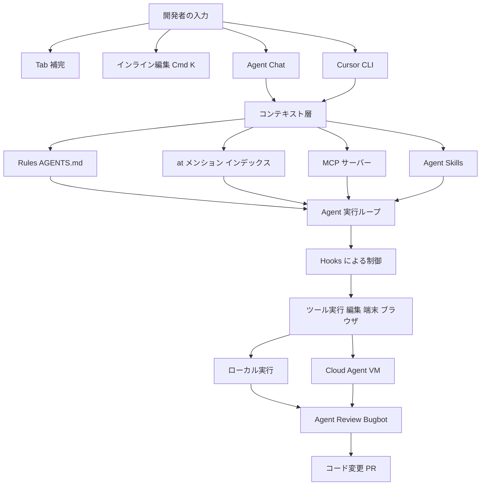

各ノードの意味：

| ノード | 説明 |
| :--- | :--- |
| **Tab 補完 / インライン編集 / Agent Chat / CLI** | ユーザーが AI 機能へアクセスする4つの入口。用途に応じて使い分ける（第2〜4章、第17章） |
| **コンテキスト層** | Agent が参照する情報源の集合。Rules・@メンション・インデックス・MCP・Skills から構成される（第7〜10章） |
| **Agent 実行ループ** | 「探索 → 計画 → 編集 → 検証」を自律的に繰り返す中核処理 |
| **Hooks による制御** | ループの各段階に割り込み、承認・拒否・追加コンテキスト注入を行う仕組み（第12章） |
| **ローカル実行 / Cloud Agent VM** | 実際にツール（端末コマンド・ファイル編集・ブラウザ操作）が実行される場所（第13〜16章） |
| **Agent Review / Bugbot** | 変更が完了した後の品質ゲート（第18章） |

### この章の要点

- Cursor の各機能は独立しているわけではなく、**同じコンテキスト層とAgentループを共有する複数の入口**として設計されている。
- ローカルとクラウド（Cloud Agents）は実行環境が異なるだけで、Rules・Hooks・MCP の大部分は両方で機能する。
- 次章以降は、この図の左（入口）から右（品質ゲート）へ向かって順番に解説していく。

### 参照URL

- https://cursor.com/docs
- https://cursor.com/docs/agent/overview


## 2. Tab 補完（インライン予測）

💡 この章では、最も利用頻度が高い機能である Tab 補完の内部動作と、中〜上級者が見落としがちな設定（ジャンプ機能・クロスファイル編集・無効化の粒度）を扱います。

Tab は Cursor 独自のAIオートコンプリートで、直前の編集履歴・周辺コード・リンターのエラー情報を根拠に次の入力を予測する。単なる補完ではなく「次に編集すべき場所」までナビゲートする点が VS Code 標準の補完と異なる。

### ステップ1：基本操作を体に覚えさせる

| 操作 | Mac | Windows/Linux |
| :--- | :--- | :--- |
| 提案を全体承認 | `Tab` | `Tab` |
| 提案を拒否 | `Esc`（または入力を続ける） | `Esc` |
| 単語単位で承認 | `Cmd + →` | `Ctrl + →` |

### ステップ2：ジャンプ機能（jump-in-file）を使いこなす

Tab 提案を承認した直後にもう一度 `Tab` を押すと、Cursor は「次に編集すべき場所」を予測してカーソルをジャンプさせる。スクロールや手動でのカーソル移動が不要になるため、複数箇所にまたがる小さな修正（変数名のリネーム後の呼び出し側修正など）では、承認 → Tab → 承認 → Tab という連打だけで一連の修正が完結することが多い。

### ステップ3：クロスファイル編集を見逃さない

ある1ファイルの変更が別ファイルの更新を要求する場合、Tab はファイル間の連携編集も予測する。ジャンプ可能な別ファイルがある場合はエディタ下部に「ポータルウィンドウ」が表示されるので、これを見落とさないようにする。

### ステップ4：Tab の有効/無効を粒度別に制御する

エディタ右下の Tab ステータスインジケーターから、以下の3段階で制御できる。

| 粒度 | 用途 |
| :--- | :--- |
| **Snooze（一時停止）** | 一定時間だけ Tab を止めたいとき（ペアプロ中の説明など） |
| **全体で無効化** | Tab の挙動が邪魔になるプロジェクトで恒久的に切る |
| **拡張子ごとに無効化** | Markdown・JSON など、予測がノイズになりやすいファイル種別だけ切る |

`Cursor Settings > Tab` からも同様の設定が可能。ショートカットを変更したい場合は Keyboard Shortcuts 設定で `Accept Cursor Tab Suggestions` を検索してリマップする。

### ベストプラクティス

- **リンターを併用する**：Tab はリンターのエラー情報も根拠にするため、ESLint / Ruff などを有効にしておくと予測精度が上がる。
- **Markdown/JSON では拡張子単位の無効化を検討する**：説明文やロックファイルでは誤補完がノイズになりやすい。
- **ジャンプ機能を意図的に使う**：リネームなど「連鎖する小修正」ではジャンプ機能を前提にした操作フローを組むと高速。

📖 用語ノート
- **Tab補完**：カーソル位置の次の入力を予測しグレーアウト表示するAI機能
- **jump-in-file**：Tab 承認後に次の編集箇所へ自動でカーソルを移動させる予測機能
- **ポータルウィンドウ**：クロスファイル編集がある場合にエディタ下部へ表示される遷移UI

### 参照URL

- https://cursor.com/help/ai-features/tab

---

## 3. インライン編集（Cmd+K）

💡 この章では、チャットパネルを開かずに選択範囲だけを直接書き換える Inline Edit の使い方と、Agent への昇格判断を扱います。

Inline Edit は、選択したコード範囲に対してその場で指示を出し、差分を直接適用する軽量な編集手段である。Agent Chat のようにマルチファイル探索は行わないため、範囲が明確な小さな変更に向いている。

### ステップバイステップ

1. 変更したいコードを選択する
2. `Cmd + K`（Mac）/ `Ctrl + K`（Windows/Linux）を押す
3. 指示を入力する（例：「この関数を async 化して」）
4. `Enter` で適用。差分がその場に反映される
5. 追加の指示を続けて入力し、再度 `Enter` で微調整できる

### 質問モード（コードを変更せず聞くだけ）

選択範囲について「変更せずに質問だけしたい」場合は、`Cmd+K` の直後に以下でモードを切り替える。

| OS | キー |
| :--- | :--- |
| Mac | `Option + Enter` |
| Windows/Linux | `Alt + Enter` |

回答を見て気に入れば「do it」と入力して `Enter` を押すと、そのまま適用に切り替わる。

### Agent への昇格

範囲を選択した状態で `Cmd + L`（Mac）/ `Ctrl + L`（Windows/Linux）を押すと、選択コードをコンテキストとして持った状態で Agent Chat が開く。複数ファイルにまたがる変更が必要だと気づいた時点で、Inline Edit から Agent へシームレスに移行できる。

この図は、変更範囲の大きさに応じてどちらの機能を選ぶべきかの判断フローを表しています。

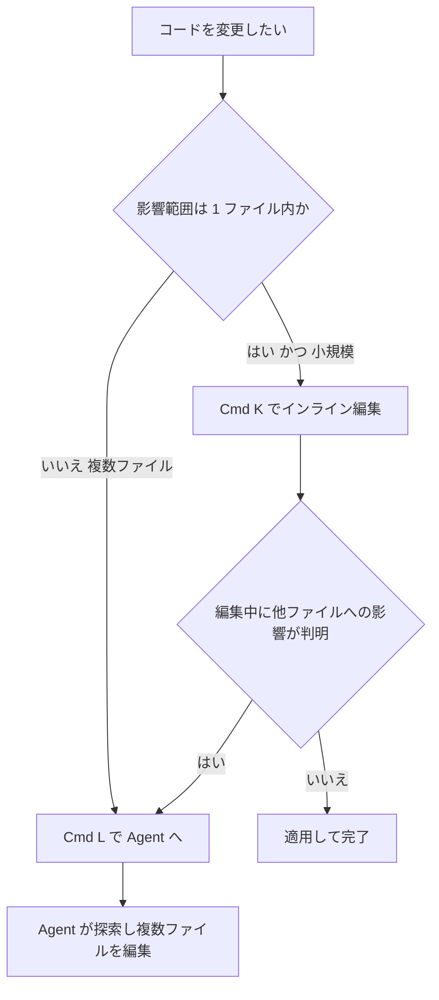

各ノードの意味：
- 「影響範囲は1ファイル内か」：まず変更が閉じた範囲かどうかを判定する分岐
- 「編集中に他ファイルへの影響が判明」：Inline Edit 中に想定外の依存が見つかった場合の再判定

### ベストプラクティス

- **迷ったら Inline Edit から始める**：Agent Chat よりコンテキスト消費が少なく、応答も速い。
- **質問モードを疑問解消に使う**：コードの意図を尋ねたいだけの場面でうっかり変更を適用してしまう事故を防げる。
- **昇格をためらわない**：Inline Edit で対応しきれないと分かった時点ですぐ `Cmd+L` で Agent へ渡す方が、手戻りが少ない。

### 参照URL

- https://cursor.com/help/ai-features/inline-edit

---

## 4. Agent モード

💡 この章では、Cursor の中核機能である Agent（およびその兄弟モードである Ask / Plan / Debug）の使い分けと、実務で効果が実証されているプロンプト設計・並列実行のプラクティスを扱います。

Agent はコードベースを探索し、複数ファイルを編集し、端末コマンドを実行し、エラーを自律的に修正するアシスタントである。ゼロからの機能構築、既存コードのリファクタリング、バグ修正、テスト作成、シェルコマンド実行までを一貫して任せられる。

### ステップ1：4つのモードを正しく使い分ける

Cursor のチャット入力は「Agent」「Ask」「Plan」「Debug」の4モードを持ち、`Shift+Tab` またはモードピッカーで切り替える。**モードを切り替えると新しいコンテキストウィンドウで開始される**ため、タスクが変わったら新しいチャットを始めるのが安全である。

| モード | 用途 | 向いているタスク |
| :--- | :--- | :--- |
| **Agent** | ほとんどのタスクのデフォルト | 機能実装・リファクタリング・バグ修正・テスト作成 |
| **Ask** | 変更を加えずに回答だけ得る | コードの理解・設計に関する質問 |
| **Plan** | 実装前にレビュー可能な計画を作る | 複数ファイルにまたがる機能・要件が曖昧なタスク |
| **Debug** | 再現しにくい／原因不明のバグを扱う | 競合状態・パフォーマンス劣化・原因不明の回帰 |

Project Rules・User Rules・Team Rules はすべてのモードで適用される。

### ステップ2：タスクを投げて差分をレビューする

1. 平易な言葉でタスクを記述する（例：「ホームページにメール・パスワード欄付きのログインフォームを追加して」）
2. `Enter` を押す。Agent がコードベースを探索し、どのファイルを読み変更するかを自律的に判断する
3. 編集はリアルタイムで差分ビューに反映される。実行中でも確認できる
4. 意図と違う方向に進み始めたら **Stop ボタン**で即座に止め、指示を修正して再開できる
5. 差分をレビューし、不要な変更は個別に却下できる

### ステップ3：@メンションで文脈を絞り込む（詳細は第7章）

どのファイルが関係するか分かっている場合は `@ファイル名` で明示的に渡すと探索コストを削減できる。不明な場合は指定せず Agent 自身の検索に任せる方が良い結果になることが多い。

### ステップ4（上級）：Agent のベストプラクティスを実務に落とし込む

Cursor 公式ブログ「Best practices for coding with agents」で紹介されている実践知は、中〜上級者が特に押さえておくべき内容である。

- **すべてのタスクに詳細な計画が必要なわけではない**：見慣れた小さな変更は Plan を経由せず直接 Agent に投げてよい。計画が有効なのは、複数の妥当なアプローチが存在する複雑な機能や、着手前に承認を得たい設計判断がある場合。
- **意図と違う実装になった場合、追加のプロンプトで直そうとしない**：Plan に戻り、変更を revert して計画をより具体的に書き直し、再実行する方が最終的に速く、結果もクリーンになりやすい。
- **アーキテクチャ図の生成をレビューの一部に組み込む**：「OAuth プロバイダ・セッション管理・トークン更新を含む認証システムのデータフローを示す Mermaid 図を作成して」のようなプロンプトで、実装前後にドキュメント用の図を生成させると、実装の妥当性をレビューしやすくなる。
- **複数モデルによる並列試行（best-of-n）で難しい問題の精度を上げる**：同じ問題を複数モデルに解かせ、最良の結果を選ぶアプローチは、特に難易度の高いタスクで有効性が確認されている（第15章の `/best-of-n` も参照）。
- **画像をそのまま文脈として使う**：デザインモックアップのスクリーンショットを貼り付け、「このレイアウト・色・余白を再現して」と指示できる。Figma MCP サーバーとの併用も可能（第9章）。

この図は、モード選択からタスク完了までの意思決定フローを表しています。

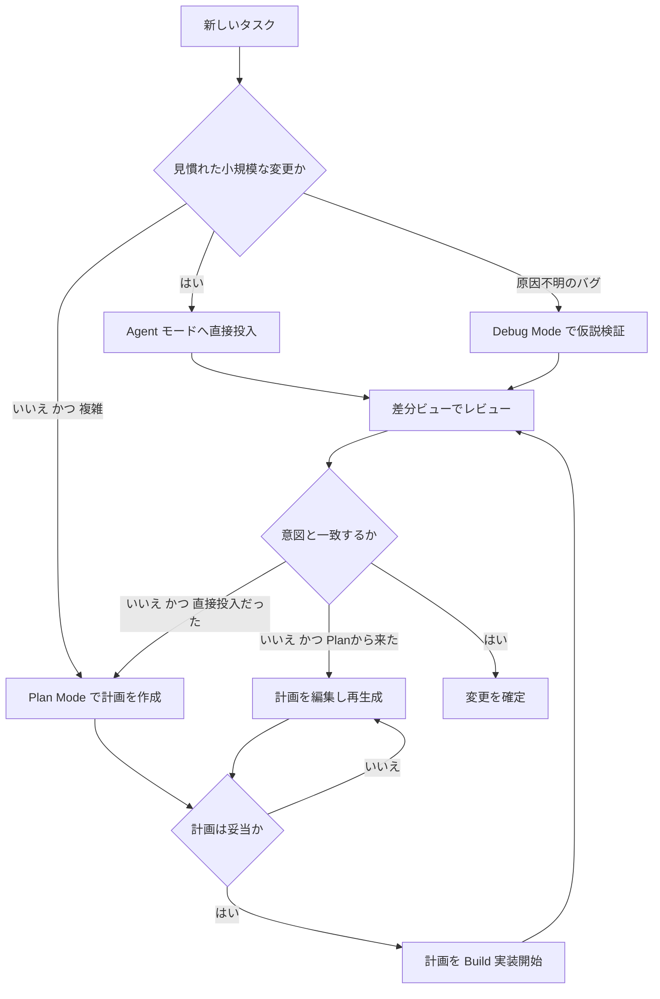

各ノードの意味：
- 「見慣れた小規模な変更か」：まずタスクの複雑さで最初の入口を分岐する判断点
- 「意図と一致するか」：差分レビュー後の合否判定。不一致の場合、直接投入だったタスクは Plan Mode に戻すのが公式推奨のリカバリー経路

### ベストプラクティス早見表

| 状況 | 推奨アクション |
| :--- | :--- |
| 何を実装すべきか自体が曖昧 | Plan Mode で要件を先に固める |
| 再現できるが原因が分からないバグ | Debug Mode でログ計装から始める |
| コードの意味を知りたいだけ | Ask モードで変更を防ぐ |
| Agent の実装が意図とずれた | 追加プロンプトで粘らず Plan に戻って再実行 |
| 大規模で影響範囲の予測が難しい変更 | 事前にアーキテクチャ図を生成しレビュー材料にする |

📖 用語ノート
- **差分ビュー（diff view）**：Agent が加えた変更を追加・削除行として可視化する画面
- **best-of-n**：同一タスクを複数モデルに並列実行させ、最良の結果を採用する手法

### 参照URL

- https://cursor.com/help/ai-features/agent
- https://cursor.com/docs/agent/overview
- https://cursor.com/docs/agent/prompting
- https://cursor.com/blog/agent-best-practices


## 5. Plan Mode（実装前設計）

💡 この章では、複雑な機能実装の前段階として計画を作らせる Plan Mode の内部フローと、チームでの再利用方法を扱います。

Plan Mode はコードを書く前に、Agent がコードベースを調査し、確認質問を投げかけ、レビュー可能な実装計画を生成するモードである。`Shift+Tab` で切り替えるほか、複雑なタスクを示すキーワードを入力すると Cursor 側が自動的に提案することもある。

### 動作フロー

この図は、Plan Mode が起動してから実装（Build）に至るまでの内部フローを表しています。

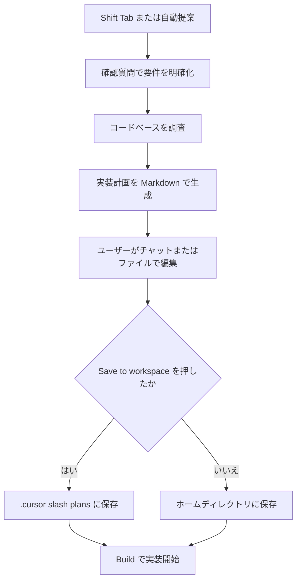

各ノードの意味：
- 「確認質問で要件を明確化」：Agent が実装前に曖昧な仕様を質問形式で確認するステップ
- 「Save to workspace」：チームでの再利用・ドキュメント化のためにプロジェクト内へ計画を保存するボタン

### ステップバイステップ

1. `Shift+Tab` で Plan Mode に切り替える（または複雑なタスクを入力すると自動提案される）
2. Agent からの確認質問に答える
3. Agent がコードベースを調査し、包括的な実装計画を作成する
4. 計画は Markdown ファイルとして開かれるため、チャット上またはファイルを直接編集して不要なステップの削除・アプローチの調整・見落とされた文脈の追加を行う
5. **「Save to workspace」を押すと `.cursor/plans/` に保存される**。これによりチームのドキュメントとして残り、中断した作業の再開や、後続の Agent への文脈提供に使える
6. 準備ができたら Build をクリックして実装を開始する

### Plan Mode を使うべき場面

| 使うべき場面 | 使わなくてよい場面 |
| :--- | :--- |
| 妥当なアプローチが複数存在する複雑な機能 | 何度も経験した小さな変更 |
| 多数のファイル・システムにまたがるタスク | 変更範囲が最初から明確なタスク |
| 要件が不明確でスコープを事前に把握したい | クイックな修正・タイポ修正 |
| アーキテクチャ上の意思決定を事前レビューしたい | — |

### 計画からやり直す（Starting over from a plan）

Agent が意図と異なるものを作ってしまった場合、追加の指示で修正を試みるのではなく、計画に立ち返るのが公式に推奨されるリカバリー手順である。

1. 変更を revert する
2. 計画をより具体的に、必要な内容を明記して修正する
3. 再度実行する

この手順は、実行中の Agent を場当たり的に修正するより高速で、結果もクリーンになりやすい。大規模な変更ほど、精密でスコープの明確な計画作りに時間をかける価値がある。「どんな変更をすべきか」を決める部分こそが難所であり、適切な指示さえあれば実装自体は Agent に委任できる。

📖 用語ノート
- **Plan Mode**：実装前に Agent が計画を作成し、レビュー・編集を経てから Build に進むモード
- **Save to workspace**：生成された計画をプロジェクトの `.cursor/plans/` に永続化する操作

### 参照URL

- https://cursor.com/docs/agent/plan-mode

---

## 6. Debug Mode（根本原因分析）

💡 この章では、通常の Agent 対話では解決しにくい「再現できるが原因が分からないバグ」に特化した Debug Mode を扱います。

Debug Mode は、いきなりコードを書くのではなく、仮説を立て、ログ計装を挿入し、実行時の情報を基に問題箇所を特定してから的を絞った修正を行うモードである。競合状態やタイミング依存の問題、パフォーマンス劣化・メモリリーク、過去に動いていたものが壊れた回帰バグに強い。

### 動作フロー

この図は、Debug Mode が根本原因を特定するまでの6ステップを表しています。

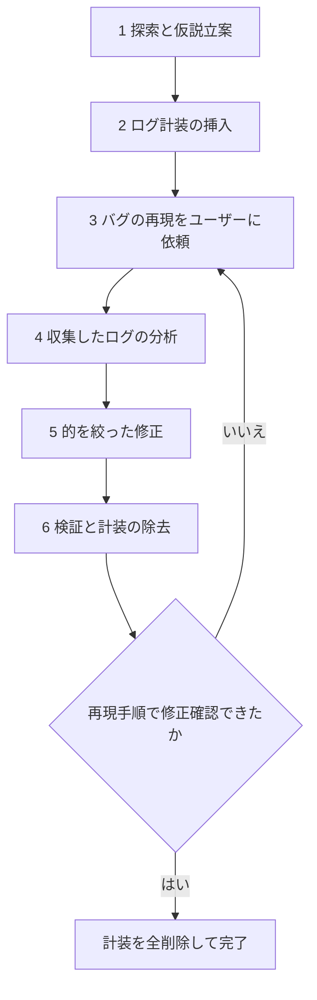

各ノードの意味：
- 「1 探索と仮説立案」：関連ファイルを調べ、根本原因についての複数の仮説を立てるステップ
- 「2 ログ計装の挿入」：Cursor 拡張機能内で動くローカルのデバッグサーバーへデータを送るログ文を追加するステップ
- 「3 バグの再現をユーザーに依頼」：Agent が具体的な再現手順を提示し、実際の実行時挙動を捕捉するためユーザーの操作を求めるステップ
- 「6 検証と計装の除去」：修正確認後、挿入したログ計装をすべて取り除くステップ

### Debug Mode を使うべき場面

- 再現はできるが、コードを読むだけでは原因が分からないバグ
- 実行順序や非同期処理に依存するタイミング系の不具合
- 実行時のプロファイリングが必要なパフォーマンス問題・メモリリーク
- 「以前は動いていた」機能の回帰調査（何が変わったかを追跡する必要がある場合）

### 効果を最大化するコツ

| コツ | 理由 |
| :--- | :--- |
| バグの詳細な文脈を渡す | エラーメッセージ・スタックトレース・再現手順が具体的なほど、計装の精度が上がる |
| 提示された再現手順を正確に実行する | Agent が実際のランタイム挙動を確実に捕捉できるようにするため |
| 必要なら複数回再現する | 競合状態のような間欠的な問題の特定に役立つ |
| 期待する挙動と実際の挙動を明確に区別して伝える | Agent が「何が正しい状態か」を正確に理解できるようにするため |

📖 用語ノート
- **仮説立案**：原因候補を複数洗い出し、ログで検証していく調査手法
- **計装（instrumentation）**：問題箇所を特定するために一時的に挿入するログ出力コード

### 参照URL

- https://cursor.com/docs/agent/debug-mode

---

## 7. コンテキスト管理（@メンション・インデックス・.cursorignore）

💡 この章では、Agent が「何を見て」回答を組み立てているかをコントロールする方法を扱います。中〜上級者ほど、この章の内容を理解しているかどうかで Agent の精度に差が出ます。

### ステップ1：@メンションで明示的に文脈を渡す

`@` を入力すると、Cursor は候補を表示する。どのファイルが関連するか分かっている場合に使い、不明な場合は省略して Agent 自身の検索に任せる方が良い結果になることが多い。

| メンション | 対象 |
| :--- | :--- |
| `@ファイル名`（例：`@auth.ts`） | 特定のファイルを含める |
| `@フォルダ名`（例：`@src/components/`） | フォルダ全体を含める |
| `@関数名・クラス名`（例：`@getUserById`） | 特定のコードシンボルを参照する |
| `@Docs` | インデックス済みのドキュメントを検索させる（自分のドキュメントも `@Docs > Add new doc` で追加可能） |
| `@web` | Web 検索をさせる |
| `@codebase` | プロジェクト全体をセマンティック検索する |
| `@Past Chats` | 過去の会話を文脈として参照する |
| `@Terminals` | ターミナル出力を文脈に含める |
| `@Commit`（作業中の差分）/ `@Branch`（メインとの差分） | Git 差分を文脈に含める |
| `@Browser` | 組み込みブラウザの状態を文脈に含める |

`@` は複数回使って複数ファイルを同時に添付できる。

### ステップ2：コンテキストウィンドウの消費を可視化する

チャット入力欄の横にある「コンテキストリング」をクリックすると、トークン使用量の内訳がカテゴリ別に表示される。

| カテゴリ | 内容 |
| :--- | :--- |
| System prompt | Cursor 組み込みのモデル指示 |
| Tools | Agent が使えるツールの定義 |
| Rules | 適用中のプロジェクト・ユーザールール |
| Skills | 注入されたスキルの説明 |
| MCP | 接続中の MCP サーバーの指示・カタログ |
| Subagents | Agent が起動できるサブエージェントのドキュメント |
| Summarized conversation | 圧縮された過去の会話要約 |
| Conversation | 実際のやり取り本文 |

コンテキストウィンドウが埋まってくると、Cursor は古い会話部分を自動で要約に圧縮し、新しい会話のための余地を確保する。**Rules・Skills・MCP を無秩序に増やしすぎると、この内訳が肥大化し、肝心のタスク遂行に使える余地が減る**という点は、中〜上級者ほど意識すべきポイントである。

### ステップ3：コードベースインデックスの状態を把握する

Cursor はプロジェクトを開くと自動でスキャンし、セマンティック検索用のインデックスを構築する。インデックスはおよそ5分ごとに同期され、変更を反映する。

- **状態確認**：エディタ下部のステータスバーでスキャンの進捗を確認できる
- **再インデックス**：コマンドパレット（`Cmd/Ctrl+Shift+P`）で「Reindex」を検索して実行
- **大規模リポジトリの高速化**：`node_modules`・`dist` などのビルド成果物は `.gitignore` に含まれていればデフォルトで無視される。それ以外の巨大な生成ファイルは `.cursorignore` に追記する

### ステップ4：`.cursorignore` で機密情報とノイズを遮断する

```text
node_modules/
dist/
*.min.js
.env*
```

`.env` ファイル・`.git/`・ロックファイルはデフォルトで無視される。`.gitignore` のパターンも自動的に尊重されるため、`.cursorignore` は「Git 管理外だが AI には見せたくない」追加分の除外に使う。

| 除外すべき理由 | 対象例 |
| :--- | :--- |
| インデックス速度の低下を防ぐ | 大きな生成ファイル |
| 機密情報の漏洩を防ぐ | シークレット・認証情報 |
| ノイズを減らす | バイナリファイル・アセット |
| 無駄な文脈消費を防ぐ | `node_modules` などのサードパーティコード |

なお、**ターミナルコマンドや MCP ツールは Cursor のファイルアクセス制御の外で動作するため、無視設定をしていても読み取れてしまう可能性がある**点には注意が必要である。真に機密性の高い情報はそもそもリポジトリに置かない設計が前提になる。

この図は、Agent が1つのプロンプトに応答するまでにどの文脈ソースを合成しているかを表しています。

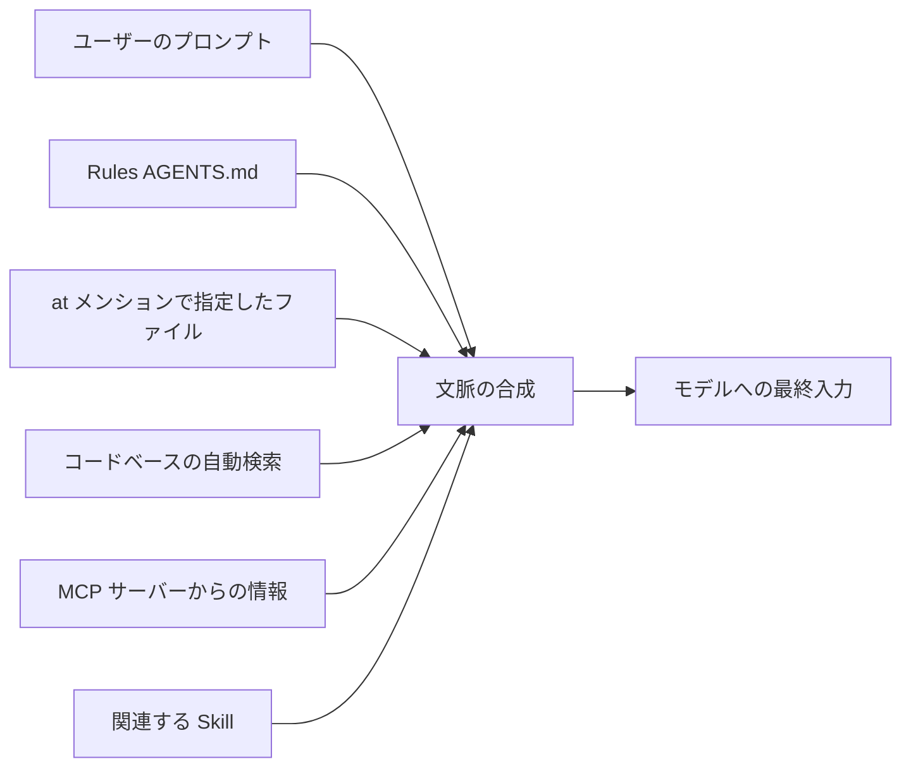

各ノードの意味：
- 「文脈の合成」：明示的な指定（Rules・@メンション）と暗黙的な検索（インデックス・MCP・Skills）が1つの入力にまとめられる箇所

📖 用語ノート
- **セマンティック検索**：キーワード一致ではなく意味の近さでコードを検索する仕組み
- **コンテキストリング**：現在のトークン使用量を視覚的に示すUI要素

### 参照URL

- https://cursor.com/docs/agent/prompting
- https://cursor.com/help/customization/context
- https://cursor.com/help/customization/indexing
- https://cursor.com/help/customization/ignore-files


## 8. Rules（ルールによる恒久指示）

💡 この章では、LLM がリクエスト間で記憶を持たないという前提を踏まえ、Cursor がどのように「恒久的な指示」をコンテキストへ埋め込んでいるかを扱います。Rules の設計品質が、チーム全体の Agent の再現性を左右します。

大規模言語モデルは呼び出し（completion）間で記憶を保持しない。Rules はプロンプトレベルで永続的かつ再利用可能な文脈を提供する仕組みであり、適用されるとルールの内容がモデルコンテキストの先頭に含まれ、コード生成・編集の解釈・ワークフロー支援に一貫したガイダンスを与える。

Cursor は4種類のルールをサポートする。

| 種類 | 保存場所 | スコープ |
| :--- | :--- | :--- |
| **Project Rules** | `.cursor/rules`（バージョン管理対象） | プロジェクト単位 |
| **User Rules** | Cursor 設定内（グローバル） | ユーザー環境全体（Agent Chat のみ） |
| **Team Rules** | ダッシュボード管理 | チーム全体（Team / Enterprise プラン） |
| **AGENTS.md** | プロジェクトルート／サブディレクトリ | `.cursor/rules` のシンプルな代替 |

### ステップ1：Project Rules の構造を理解する

ルールは `.cursor/rules` 以下に配置する Markdown ファイル（`.md` または `.mdc`）で、任意のファイル名を付けられる。フロントマターで `description` と `globs` を細かく制御したい場合は `.mdc` を使う。

```text
.cursor/rules/
  react-patterns.mdc       # フロントマター付き（description, globs）
  api-guidelines.md        # シンプルな Markdown ルール
  frontend/                # フォルダで整理も可能
    components.md
```

適用タイプは4種類あり、フロントマターの `description` / `globs` / `alwaysApply` の組み合わせで決まる。

| 適用タイプ | 説明 |
| :--- | :--- |
| **Always Apply** | すべてのチャットセッションに適用 |
| **Apply Intelligently** | Agent が `description` を見て関連性があると判断した場合に適用 |
| **Apply to Specific Files** | ファイルパスが指定パターンに一致した場合に適用 |
| **Apply Manually** | チャットで `@ルール名` と明示的にメンションした場合のみ適用 |

```markdown
---
globs:
alwaysApply: false
---

- サービス定義には社内 RPC パターンを使うこと
- サービス名は必ず snake_case にすること

@service-template.ts
```

グロブパターンの例：

| パターン | マッチ対象 |
| :--- | :--- |
| `*` | 任意の単一ファイル名セグメント |
| `**` | 任意階層のディレクトリ（再帰） |
| `*.ts` | ルート直下の全 `.ts` ファイル |
| `**/*.ts` | 任意のディレクトリ配下の全 `.ts` ファイル |
| `src/**` | `src/` 配下すべて |
| `src/**/*.tsx` | `src/` 配下の任意階層の `.tsx` |
| `docs/**/*.md, docs/**/*.mdx` | `docs/` 配下の `.md` と `.mdx`（カンマ区切り） |
| `tailwind.config.*` | 拡張子を問わない `tailwind.config` |

### ステップ2：ルールを作成する

- **チャットから**：`/create-rule` と入力し内容を説明すると、Agent が適切なフロントマター付きのルールファイルを生成し `.cursor/rules` に保存する
- **設定画面から**：`Cursor Settings > Rules, Commands` で `+ Add Rule` をクリックする。すべてのルールとその状態を一覧できる

### ステップ3（最重要）：ベストプラクティスを守る

良いルールは**焦点が絞られ、実行可能で、スコープが明確**である。

- ルールは 500 行未満に収める
- 大きなルールは複数の合成可能なルールに分割する
- 具体例か参照ファイルを添える
- 曖昧な指示を避け、社内ドキュメントのように明確に書く
- 同じプロンプトをチャットで繰り返し打っているならルール化する
- ファイルの内容をそのままコピーせず `@ファイル名` で参照する（内容が古くならず、ルールも短く保てる）

**避けるべきこと**：

| アンチパターン | 理由・代替策 |
| :--- | :--- |
| スタイルガイドを丸ごとコピーする | リンターに任せる。Agent は一般的な規約をすでに理解している |
| すべてのコマンドを網羅的に記載する | npm・git・pytest のような一般的なツールは Agent が既に知っている |
| 稀にしか起きないエッジケースの指示を大量に書く | 頻繁に使うパターンだけに絞る |
| コードベースの内容をルールに重複させる | 正規の実装例をコピーせず参照する |

まずはシンプルに始め、**Agent が同じミスを繰り返した時にだけルールを追加する**。過剰最適化する前にまず自分たちのパターンを理解することが優先される。ルールは Git にコミットしてチーム全体で恩恵を受けられるようにし、ミスに気づいたらルールを更新する。GitHub の Issue や PR で `@cursor` にタグ付けしてルール更新自体を Agent に任せることもできる。

### ステップ4：AGENTS.md というシンプルな代替

`AGENTS.md` はフロントマターや複雑な設定を持たないプレーンな Markdown で、シンプルな用途に向く。プロジェクトルートおよびサブディレクトリの両方に配置できる。

```markdown
# Project Instructions

## Code Style
- 新規ファイルはすべて TypeScript を使う
- React は関数コンポーネントを優先する
- DB カラム名は snake_case にする

## Architecture
- リポジトリパターンに従う
- ビジネスロジックはサービス層に置く
```

ネストした `AGENTS.md` もサポートされており、より具体的な階層の指示が優先されつつ親ディレクトリの指示とマージされる。

```text
project/
  AGENTS.md              # 全体指示
  frontend/
    AGENTS.md            # フロントエンド向け指示
    components/
      AGENTS.md          # コンポーネント向け指示
  backend/
    AGENTS.md            # バックエンド向け指示
```

### ステップ5：Team Rules と適用優先順位を理解する

Team / Enterprise プランでは、管理者がダッシュボードから組織全体にルールを強制できる。

- **Enable this rule immediately**：チェックすると作成直後から有効化。未チェックの場合はドラフトとして保存され、後で有効化するまで適用されない
- **Enforce this rule**：有効にするとチームメンバー全員に必須となり、個人設定で無効化できなくなる。無効の場合、非強制の Team Rule はメンバーが `Cursor Settings → Rules` の Team Rules セクションでオフにできる

**適用順序**：`Team Rules → Project Rules → User Rules` の順に適用され、すべて合成される。指示が競合した場合は**先に適用されたソースが優先**される。強制ルールをコンプライアンス運用の一部として使うことは可能だが、AI によるガイダンスだけをセキュリティ上の唯一の統制にすべきではない。

この図は、4種類のルールがどう合成され、優先順位が決まるかを表しています。

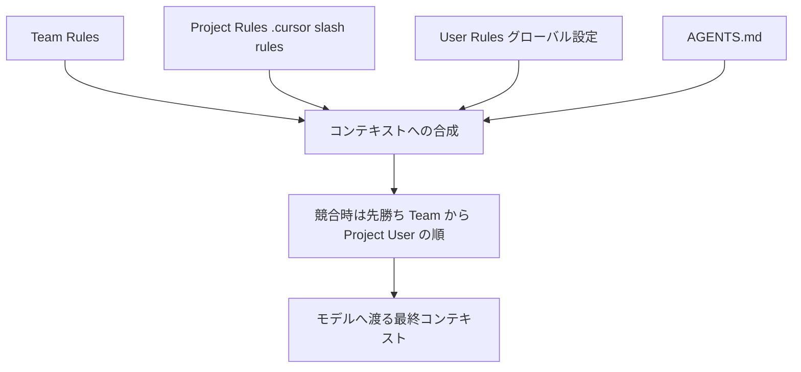

各ノードの意味：
- 「コンテキストへの合成」：適用条件を満たすすべてのルールが1つのコンテキストにまとめられる箇所
- 「先勝ち」：Team Rules → Project Rules → User Rules の順で優先度が決まる原則

### ステップ6：外部リポジトリからルールをインポートする

1. `Cursor Settings → Rules, Commands` を開く
2. `Project Rules` の `+ Add Rule` から `Remote Rule (Github)` を選択
3. ルールを含む GitHub リポジトリの URL を貼り付ける（Cursor が `.mdc` ファイルをすべてスキャンする）
4. `.cursor/rules/imported/<repoName>` にルールが同期される（相対パスも保持される）

### FAQ（つまずきやすいポイント）

| 疑問 | 回答 |
| :--- | :--- |
| ルールが適用されない | `Apply Intelligently` は `description` が必須。`Apply to Specific Files` は参照ファイルがグロブに一致しているか確認 |
| ルールは他ファイルを参照できるか | `@filename.ts` で可能。ルールもチャットから `@ルール名` で手動適用できる |
| ルールは Tab に影響するか | 影響しない。Tab や他の AI 機能には適用されない |
| User Rules は Inline Edit（Cmd+K）に効くか | 効かない。User Rules は Agent（Chat）専用 |

📖 用語ノート
- **フロントマター（frontmatter）**：Markdown ファイル冒頭に YAML 形式で書くメタデータ
- **グロブパターン**：ファイルパスの一致条件を記述するワイルドカード構文

### 参照URL

- https://cursor.com/docs/rules


## 9. MCP（Model Context Protocol）

💡 この章では、Cursor を外部ツール・データソースに接続するオープンプロトコルである MCP の仕組みと、設定・認証・セキュリティのベストプラクティスを扱います。

MCP（Model Context Protocol）は Cursor を外部のツールやデータソースに接続するための仕組みである。プロジェクト構造を毎回説明する代わりに、ツールと直接統合できる。MCP サーバーは `stdout` に出力するか HTTP エンドポイントを提供できる言語であれば何でも実装可能（Python・JavaScript・Go など）。公式プラグインは Cursor Marketplace で、コミュニティ製は `cursor.directory` で探せる。

### ステップ1：3つのトランスポート方式を理解する

| トランスポート | 実行環境 | デプロイ | 利用者 | 入力形式 | 認証 |
| :--- | :--- | :--- | :--- | :--- | :--- |
| **stdio** | ローカル | Cursor が管理 | 単一ユーザー | シェルコマンド | 手動 |
| **SSE** | ローカル／リモート | サーバーとしてデプロイ | 複数ユーザー | SSE エンドポイント URL | OAuth |
| **Streamable HTTP** | ローカル／リモート | サーバーとしてデプロイ | 複数ユーザー | HTTP エンドポイント URL | OAuth |

Cursor がサポートするプロトコル機能：**Tools（AI モデルが実行する関数）・Prompts（テンプレート化されたワークフロー）・Resources（構造化データ）・Roots（サーバー起点の URI／ファイルシステム境界の照会）・Elicitation（サーバーからユーザーへの追加情報要求）・Apps（拡張、ツールが返すインタラクティブ UI）**。MCP Apps はプログレッシブエンハンスメント設計であり、ホスト側が UI 表示に非対応でも通常のツール応答として機能する。

### ステップ2：MCP サーバーをインストールする

1. **ワンクリックインストール**：Cursor Marketplace から公式プラグインを「Add to Cursor」でインストールし OAuth 認証する
2. **`mcp.json` による手動設定**：

```json title="ローカルサーバー（Node.js）"
{
  "mcpServers": {
    "server-name": {
      "command": "npx",
      "args": ["-y", "mcp-server"],
      "env": { "API_KEY": "value" }
    }
  }
}
```

```json title="リモートサーバー"
{
  "mcpServers": {
    "server-name": {
      "url": "http://localhost:3000/mcp",
      "headers": { "API_KEY": "value" }
    }
  }
}
```

**設定ファイルの配置場所**：プロジェクト固有は `.cursor/mcp.json`、全プロジェクト共通は `~/.cursor/mcp.json`。

### ステップ3：STDIO サーバーの設定フィールドを押さえる

| フィールド | 必須 | 説明 | 例 |
| :--- | :--- | :--- | :--- |
| `type` | ✅ | 接続種別 | `"stdio"` |
| `command` | ✅ | サーバー実行コマンド（PATH 上、または絶対パス） | `"npx"`, `"node"`, `"python"`, `"docker"` |
| `args` | – | コマンドへの引数配列 | `["server.py", "--port", "3000"]` |
| `env` | – | サーバーの環境変数 | `{"API_KEY": "${env:api-key}"}` |
| `envFile` | – | 追加で読み込む環境変数ファイルパス（**stdio のみ対応**） | `".env"` |

### ステップ4：設定の変数展開（interpolation）を使う

`command`・`args`・`env`・`url`・`headers` の値で以下の変数が解決される。

| 構文 | 意味 |
| :--- | :--- |
| `${env:NAME}` | 環境変数 |
| `${userHome}` | ホームディレクトリのパス |
| `${workspaceFolder}` | `.cursor/mcp.json` を含むプロジェクトルート |
| `${workspaceFolderBasename}` | プロジェクトルートのフォルダ名 |
| `${pathSeparator}` / `${/}` | OS のパス区切り文字 |

```json
{
  "mcpServers": {
    "remote-server": {
      "url": "https://api.example.com/mcp",
      "headers": { "Authorization": "Bearer ${env:MY_SERVICE_TOKEN}" }
    }
  }
}
```

APIキーやトークンはハードコードせず、環境変数経由で渡すのが原則である。

### ステップ5：OAuth 認証が必要なリモートサーバーの静的認証情報

Dynamic Client Registration に非対応で、固定の Client ID とリダイレクト URL のホワイトリスト登録が必要なプロバイダ（Figma・Linear など）向けに、`auth` オブジェクトを指定できる。

```json title="静的 OAuth"
{
  "mcpServers": {
    "oauth-server": {
      "url": "https://api.example.com/mcp",
      "auth": {
        "CLIENT_ID": "your-oauth-client-id",
        "CLIENT_SECRET": "your-client-secret",
        "scopes": ["read", "write"]
      }
    }
  }
}
```

Cursor は全 MCP サーバーに共通の固定リダイレクト URL `cursor://anysphere.cursor-mcp/oauth/callback` を使用する。サーバー識別は OAuth の `state` パラメータで行われるため、1つのリダイレクト URL で全サーバーに対応できる。

### ステップ6：ツール承認と Run Mode

Cursor はデフォルトで MCP ツール使用前に承認を求める。ツール名の横の矢印をクリックすると引数を確認できる。

- **Run Mode（Auto-review、Cursor 3.6 以降のデフォルト）**：許可リスト登録済みの MCP ツールは即座に実行され、それ以外は安全性分類器を経由する
- **事前承認の設定**：`permissions.json` に承認済みツールを追加、または `autoRun` 指示でサーバー・ツール単位に分類器の挙動を調整できる

### ステップ7：画像を文脈として受け取る

MCP サーバーはスクリーンショットや図などの画像を base64 エンコード文字列として返せる。

```js
server.tool("generate_image", async (params) => {
  return {
    content: [
      { type: "image", data: RED_CIRCLE_BASE64, mimeType: "image/jpeg" }
    ]
  };
});
```

モデルが画像入力に対応していれば、返された画像はチャットに添付され解析対象になる。

### ステップ8（重要）：セキュリティを常に意識する

MCP サーバーは外部サービスへアクセスし、ユーザーに代わってコードを実行できる。以下を必ず守る。

- **出所を検証する**：信頼できる開発者・リポジトリのサーバーのみをインストールする
- **権限を確認する**：サーバーがどのデータ・API にアクセスするかを把握する
- **APIキーを制限する**：必要最小限の権限に絞った制限付きキーを使う
- **重要な統合ではコードを監査する**：クリティカルな連携ではソースコードをレビューする

この図は、MCP のホスト・クライアント・サーバーの関係とツール呼び出しの流れを表しています。

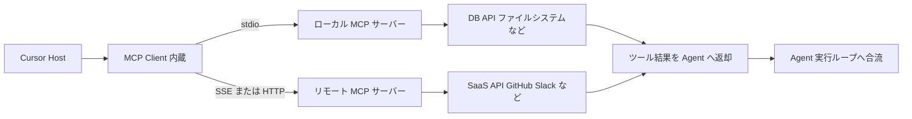

各ノードの意味：
- 「MCP Client 内蔵」：Cursor 内部でツール呼び出しを仲介するコンポーネント
- 「Agent 実行ループへ合流」：ツール結果が Agent のコンテキストに戻り、次の判断材料になる箇所

### トラブルシューティング早見表

| 症状 | 確認手順 |
| :--- | :--- |
| サーバーの挙動がおかしい | `Output` パネル（`Cmd/Ctrl+Shift+U`）→ `MCP Logs` で接続エラー・認証エラー・クラッシュを確認 |
| 一時的に切りたい | `Settings > Features > Model Context Protocol` でトグルをオフ（設定は保持される） |
| サーバーがクラッシュ／タイムアウトした | チャットにエラー表示、該当ツール呼び出しは失敗扱い。他のサーバーには影響しない設計 |
| npm 製サーバーを更新したい | 設定から一度削除 → `npm cache clean --force` → 再追加で最新版取得 |

📖 用語ノート
- **MCP（Model Context Protocol）**：AI アプリケーションと外部ツール・データソースを繋ぐオープンな標準規格
- **Elicitation**：MCP サーバーがユーザーへ追加情報を能動的に要求する機能
- **Dynamic Client Registration**：OAuth クライアントを動的に自動登録する仕組み

### 参照URL

- https://cursor.com/docs/mcp

---

## 10. Agent Skills

💡 この章では、Agent に特定タスク遂行のための専門知識をパッケージ化して渡す「Skills」の設計方法を扱います。Rules との違いを理解することが、コンテキストを無駄なく保つ鍵になります。

Skill は、エージェントにドメイン固有のタスク遂行方法を教える、ポータブルでバージョン管理可能なパッケージである。スクリプト・テンプレート・参照資料を同梱でき、必要になったときだけ段階的にロードされる（プログレッシブ）ため、コンテキスト消費を抑えられる。

| 特性 | 説明 |
| :--- | :--- |
| **ポータブル** | Agent Skills 標準に対応するどのエージェントでも動作する（Cursor / Claude / Codex 間で互換性あり） |
| **バージョン管理可能** | ファイルとして保存されリポジトリで追跡、または GitHub リンクからインストール可能 |
| **アクション可能** | エージェントがツールを使って実行できるスクリプト・テンプレート・参照資料を含められる |
| **プログレッシブ** | リソースをオンデマンドで読み込み、コンテキスト使用を効率化する |

### ステップ1：Skill が発見される仕組みを理解する

Cursor 起動時に以下のディレクトリからスキルを自動検出し、Agent が利用可能な状態にする。関連性の判断は Agent 自身が行うほか、チャットで `/` を入力してスキル名を検索し手動起動もできる。

| 配置場所 | スコープ |
| :--- | :--- |
| `.agents/skills/` | プロジェクト単位 |
| `.cursor/skills/` | プロジェクト単位 |
| `~/.agents/skills/` | ユーザー単位（グローバル） |
| `~/.cursor/skills/` | ユーザー単位（グローバル） |

互換性のため `.claude/skills/`・`.codex/skills/`（およびそれぞれの `~/` 版）も読み込まれる。

### ステップ2：SKILL.md を書く

各スキルは `SKILL.md` を含むフォルダで構成する。

```text
.agents/
└── skills/
    └── deploy-app/
        ├── SKILL.md
        ├── scripts/
        │   ├── deploy.sh
        │   └── validate.py
        ├── references/
        │   └── REFERENCE.md
        └── assets/
            └── config-template.json
```

```markdown
---
name: my-skill
description: このスキルが何をするか、いつ使うべきかの説明
---

# My Skill

エージェント向けの詳細な指示。

## When to Use
- こういうときに使う
- こういう場面で役立つ

## Instructions
- 手順を段階的に記述する
- ドメイン固有の規約を記述する
```

フロントマターの各フィールド：

| フィールド | 必須 | 説明 |
| :--- | :--- | :--- |
| `name` | ✅ | スキル識別子。小文字・数字・ハイフンのみ。親フォルダ名と一致させる必要がある |
| `description` | ✅ | 何をするか・いつ使うかの説明。Agent がこれを見て関連性を判断する |
| `paths` | – | スキルを特定ファイルに絞るグロブパターン（カンマ区切り文字列 or 配列） |
| `disable-model-invocation` | – | `true` にすると `/skill-name` での明示呼び出し専用になる（自動判断されない） |
| `metadata` | – | 任意のキーバリューメタデータ |

### ステップ3：`paths` でスキルをファイル種別に絞る

```markdown
---
name: react-component-patterns
description: このコードベースにおける React コンポーネントの規約
paths:
  - "**/*.tsx"
  - "packages/ui/**/*.ts"
---
```

`paths` を設定すると、Agent が一致するファイルを読み書きしている時だけスキルが提示される。無関係な作業でファイル固有のガイダンスがコンテキストに混ざるのを防げる。

### ステップ4：ネストしたスキルディレクトリでモノレポを整理する

Cursor はスキルルートを再帰的に走査するため、カテゴリ別・チーム別にサブディレクトリでスキルを整理できる。

```text
.cursor/
└── skills/
    ├── shipping/
    │   ├── land-it/SKILL.md
    │   └── careful-merge-conflicts/SKILL.md
    ├── debugging/
    │   └── using-datadog-mcp/SKILL.md
    └── workflow/
        └── tdd/SKILL.md
```

さらに、モノレポ内のネストしたプロジェクトサブディレクトリに置かれた `.cursor/skills/`（または `.agents/skills/`）も自動検出される。この場合、そのスキルは配置先ディレクトリ配下のファイルにのみ自動的にスコープされる（`paths` を明示的に設定しなくてよい）。

```text
my-monorepo/
├── .cursor/skills/         # リポジトリ全体で使えるスキル
│   └── land-it/SKILL.md
└── apps/
    └── web/
        └── .cursor/skills/  # web アプリ専用スキル
            └── deploy-web/SKILL.md
```

### ステップ5：Rules・スラッシュコマンドから Skills へ移行する

Cursor 2.4 以降には組み込みの `/migrate-to-skills` スキルがあり、既存の動的ルール（`alwaysApply: false` かつ `globs` 未指定＝「Apply Intelligently」設定のルール）とスラッシュコマンドをスキルへ変換できる。`alwaysApply: true` や特定の `globs` を持つルールは、明示的な発火条件を持つため移行対象にならない。

1. チャットで `/migrate-to-skills` と入力する
2. Agent が移行対象のルール・コマンドを特定し変換する
3. `.cursor/skills/` に生成されたスキルをレビューする

この図は、Rules・Skills・Subagents・Hooks の使い分けを判断する視点を表しています（詳細な使い分け基準は第11章の表も参照）。

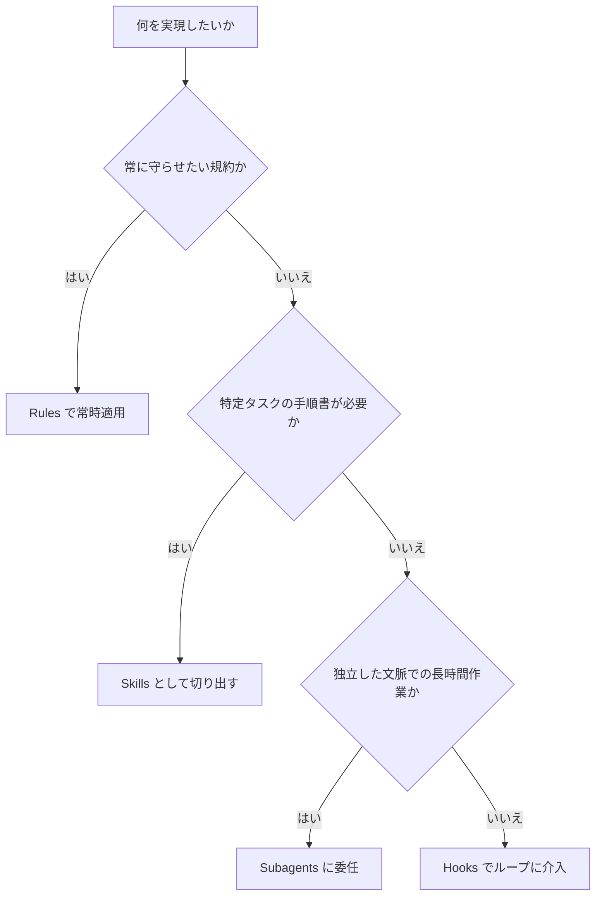

各ノードの意味：
- 「常に守らせたい規約か」：Rules を選ぶかどうかの一次判断
- 「独立した文脈での長時間作業か」：コンテキスト分離が必要ならSubagents、そうでなく実行時の許可・拒否制御ならHooksを選ぶ分岐

📖 用語ノート
- **プログレッシブ（progressive）ロード**：必要になった時点でのみリソースを読み込む設計
- **SKILL.md**：スキルの振る舞いを定義するフロントマター付き Markdown ファイル

### 参照URL

- https://cursor.com/docs/skills


## 11. Subagents（サブエージェント）

💡 この章では、複雑なタスクを分割し、独立したコンテキストウィンドウで並列に処理させる Subagents の設計と、乱用を避けるためのアンチパターンを扱います。

Subagent は Agent がタスクを委任できる専門アシスタントである。それぞれが独自のコンテキストウィンドウで動作し、特定の作業を処理し、結果を親エージェントに返す。複雑なタスクの分解・並列作業・メイン会話のコンテキスト温存に使う。エディタ・CLI・Cloud Agents のいずれでも利用できる。

| 利点 | 説明 |
| :--- | :--- |
| **コンテキスト分離** | 長時間の調査・探索タスクがメイン会話の容量を消費しない |
| **並列実行** | 複数の Subagent を同時起動し、コードベースの別部分を待ち時間なく処理できる |
| **専門特化** | カスタムプロンプト・ツールアクセス・モデルをドメイン別に設定できる |
| **再利用性** | カスタム Subagent を定義してプロジェクト横断で使い回せる |

### ステップ1：フォアグラウンドとバックグラウンドを使い分ける

| モード | 挙動 | 向いている場面 |
| :--- | :--- | :--- |
| **Foreground** | Subagent の完了までブロックし、結果を即座に返す | 結果が必要な逐次タスク |
| **Background** | 即座に制御を返し、Subagent は独立して作業を続ける | 長時間タスク・並列ワークストリーム |

### ステップ2：組み込み Subagent の役割を理解する

Cursor には、コンテキストウィンドウ限界に達しやすい会話パターンの分析に基づいて設計された3つの組み込み Subagent がある。設定不要で、必要に応じて Agent が自動的に使う。

| Subagent | 役割 | Subagent 化されている理由 |
| :--- | :--- | :--- |
| **Explore** | コードベースの検索・分析 | 探索は大量の中間出力を生むためメインの文脈を圧迫する。より高速なモデルで多数の並列検索を実行する |
| **Bash** | 一連のシェルコマンド実行 | コマンド出力は冗長になりがちで、隔離することで親エージェントはログではなく判断に集中できる |
| **Browser** | MCP ツール経由のブラウザ操作 | ブラウザ操作はノイズの多い DOM スナップショットやスクリーンショットを生成するため、結果を絞り込む必要がある |

これら3種が共通して持つ特性は「ノイズの多い中間出力を生む」「専門プロンプト・ツールアクセスの恩恵を受ける」「大量のコンテキストを消費しうる」の3点であり、Subagent 化によりコンテキスト分離・モデル柔軟性（探索用途では高速なモデルをデフォルト使用）・コスト効率が得られる。

### ステップ3：カスタム Subagent を作成する

Agent に直接作成を依頼するのが最も簡単な方法である。

```text
.cursor/agents/verifier.md にYAMLフロントマター（name, description）付きの
サブエージェントファイルを作成してください。verifier サブエージェントは、
完了した作業を検証し、実装が実際に機能しているかを確認し、テストを実行し、
何が合格して何が未完了かを報告するものにしてください。
```

より細かく制御したい場合は、プロジェクトまたはユーザーディレクトリに手動でファイルを作成する。

| 種類 | 配置場所 | スコープ |
| :--- | :--- | :--- |
| **プロジェクト Subagent** | `.cursor/agents/`（`.claude/agents/`・`.codex/agents/` も互換） | 現在のプロジェクトのみ |
| **ユーザー Subagent** | `~/.cursor/agents/`（`~/.claude/agents/`・`~/.codex/agents/` も互換） | 現在のユーザーの全プロジェクト |

名前が衝突する場合はプロジェクト Subagent が優先され、複数の互換ディレクトリが存在する場合は `.cursor/` が `.claude/` や `.codex/` より優先される。

```markdown
---
name: security-auditor
description: セキュリティ専門家。認証・決済・機密データの実装時に使用する。
model: inherit
readonly: true
---

あなたは脆弱性を監査するセキュリティ専門家です。

呼び出されたら：
1. セキュリティに関わるコードパスを特定する
2. 一般的な脆弱性（インジェクション、XSS、認証バイパス）を確認する
3. シークレットがハードコードされていないか検証する
4. 入力値検証・サニタイズをレビューする

深刻度別に報告する：
- Critical（デプロイ前に必ず修正）
- High（早急に修正）
- Medium（可能なら対応）
```

フロントマターの各フィールド：

| フィールド | 型 | 必須 | デフォルト | 説明 |
| :--- | :--- | :--- | :--- | :--- |
| `name` | string | – | ファイル名から自動導出 | 表示名・識別子。小文字とハイフンのみ |
| `description` | string | – | – | Task ツールのヒントに表示される短い説明。Agent はこれを読んで委任判断する |
| `model` | string | – | `inherit` | 使用モデル。`inherit` または具体的なモデルID |
| `readonly` | boolean | – | `false` | `true` の場合、書き込み権限が制限される（ファイル編集・状態変更コマンド不可） |
| `is_background` | boolean | – | `false` | `true` の場合、親をブロックせずバックグラウンドで動作する |

`model` に具体的なモデルIDを指定していても、以下の場合はフォールバックが発生する：**チーム管理者による当該モデルのブロック**、**Max Mode が必要だが有効化されていない**、**現在のプランでそのモデルが利用不可**。

### ステップ4：Subagent を呼び出す

```text
> /verifier auth フローが完成しているか確認して
> Use the verifier subagent to confirm the auth flow is complete
> API の変更をレビューしつつ、並行してドキュメントも更新して
```

明示的な `/名前` 構文、自然言語での言及、複数タスクの並列実行のいずれもサポートされる。並列実行時は、Agent が1つのメッセージ内で複数の Task ツール呼び出しを送信し、Subagent が同時に走る。

### ステップ5：長時間タスクを再開する

各 Subagent 実行は Agent ID を返す。このIDを渡すことで、文脈を保持したまま再開できる（`Resume agent abc123 and analyze the remaining test failures` のように指示する）。バックグラウンド Subagent は実行中の状態をディスクに書き出すため、完了後も会話を継続できる。

### ステップ6：頻出パターンを押さえる

- **検証エージェント（Verification agent）**：完了したと申告された作業が実際に機能するかを、懐疑的な視点で独立検証させるパターン。テストが実際にパスしているか（テストファイルが存在するだけでないか）の確認や、部分的にしか実装されていない機能の検出に有効
- **オーケストレーターパターン**：Planner（要件分析・技術計画）→ Implementer（計画に基づく実装）→ Verifier（要件との一致確認）の3段階を親エージェントが調整する。各引き継ぎで構造化された出力を渡すことで、次のエージェントが明確な文脈を持てるようにする

### ベストプラクティスとアンチパターン

| ベストプラクティス | 理由 |
| :--- | :--- |
| 焦点を絞った Subagent を書く | 「なんでも屋」の汎用ヘルパーは効果が薄い |
| `description` に投資する | Agent が委任するかどうかの判断材料になるため、テストしながら磨き込む |
| プロンプトは簡潔に保つ | 冗長なプロンプトは焦点をぼかす |
| `.cursor/agents/` をバージョン管理する | チーム全体が恩恵を受けられる |
| Agent 生成→カスタマイズの順で始める | ゼロから書くより初期構成が速い |
| 構造化出力が必要なら Hooks を使う | Subagent の結果を一貫した形式で処理・保存できる |

| アンチパターン | 何が問題か |
| :--- | :--- |
| 「コーディングを助ける」のような曖昧な汎用 Subagent を50個作る | Agent がいつ使うべきか判断できず、維持コストだけがかかる |
| 曖昧な `description`（例：「一般的なタスクに使う」） | 委任のシグナルにならない。「OAuth プロバイダによる認証フロー実装時に使う」のように具体化する |
| 2,000語の長大なプロンプト | 賢くはならず、遅く保守しづらくなるだけ |
| コンテキスト分離が不要な単発タスクを Subagent化する | スラッシュコマンドの重複。第10章の Skills を使うべき |
| 明確に異なるユースケースがないまま Subagent を増やす | 2〜3個の焦点を絞った Subagent から始め、必要になった時だけ追加する |

この図は、探索タスクをメインエージェントが直接処理する場合と、Explore Subagent に委任する場合の文脈消費の違いを表しています。

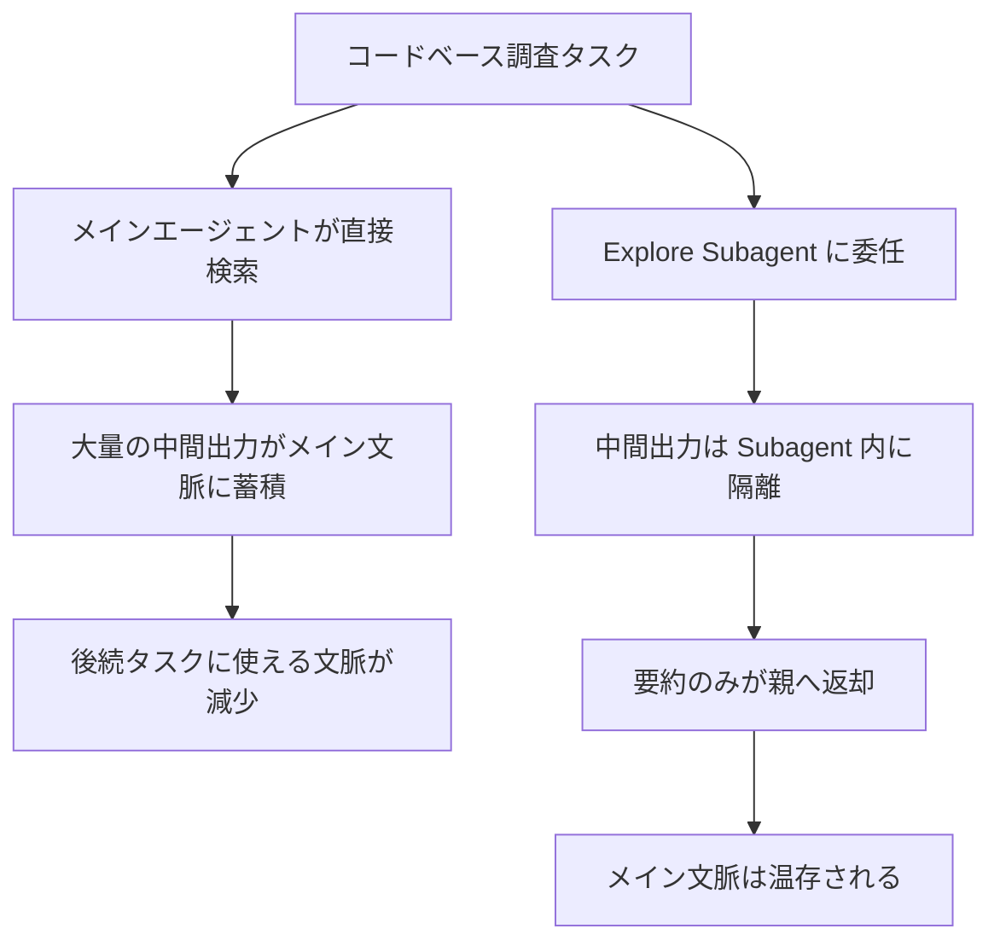

各ノードの意味：
- 「大量の中間出力がメイン文脈に蓄積」：直接検索した場合に発生するコンテキスト圧迫の問題点
- 「要約のみが親へ返却」：Subagent 化によって得られるコンテキスト分離のメリット

### コストとパフォーマンスのトレードオフ

Subagent は各自が独立したコンテキストウィンドウとトークン使用量を持つ。5つの Subagent を並列実行すると、単一エージェントのおよそ5倍のトークンを消費する。単純作業ではメインエージェントの方が速いことも多く、Subagent の利点は速度ではなくコンテキスト分離にある。複雑・長時間・並列的な作業でこそ真価を発揮する。

📖 用語ノート
- **Task ツール**：親エージェントが Subagent を起動するために内部的に呼び出すツール
- **オーケストレーターパターン**：複数の専門 Subagent を段階的に連携させる設計パターン

### 参照URL

- https://cursor.com/docs/subagents

---

## 12. Hooks（フック）

💡 この章では、Agent 実行ループの各段階に介入し、承認・拒否・追加情報の注入を行う Hooks の設計方法を扱います。セキュリティ・監査・フォーマット自動化など、チーム運用で最も差が出る機能です。

Hooks は、カスタムスクリプトを使って Agent ループを観測・制御・拡張する仕組みである。Hooks は標準入出力（stdio）経由で双方向に JSON をやり取りするプロセスとして起動され、Agent ループの定義済みステージの前後で実行され、挙動を観測・ブロック・変更できる。

**主な用途**：編集後のフォーマッタ実行／イベントの分析データ収集／PII・シークレットのスキャン／SQL書き込みなどリスクの高い操作のゲーティング／Subagent（Task ツール）実行の制御／セッション開始時のコンテキスト注入。

### ステップ1：3つのフックカテゴリを理解する

| カテゴリ | 発火タイミング | 主なフック |
| :--- | :--- | :--- |
| **Agent hooks** | Cmd+K / Agent Chat のセッション中 | `sessionStart`/`sessionEnd`、`preToolUse`/`postToolUse`/`postToolUseFailure`、`subagentStart`/`subagentStop`、`beforeShellExecution`/`afterShellExecution`、`beforeMCPExecution`/`afterMCPExecution`、`beforeReadFile`/`afterFileEdit`、`beforeSubmitPrompt`、`preCompact`、`stop`、`afterAgentResponse`/`afterAgentThought` |
| **Tab hooks** | 自律的な Tab（インライン補完）操作時 | `beforeTabFileRead`、`afterTabFileEdit` |
| **App lifecycle hooks** | エージェントセッション外 | `workspaceOpen` |

この分離により、自律的な Tab 操作・ユーザー主導の Agent 操作・ワークスペース起動時に、それぞれ異なるポリシーを適用できる。

### ステップ2：クイックスタート（フォーマッタ自動実行の例）

`hooks.json` はプロジェクトルート（`<project>/.cursor/hooks.json`）またはホームディレクトリ（`~/.cursor/hooks.json`）に置く。プロジェクトレベルは該当プロジェクトのみ、ホームディレクトリレベルは全プロジェクト共通で適用される。

```json title="~/.cursor/hooks.json"
{
  "version": 1,
  "hooks": {
    "afterFileEdit": [{ "command": "./hooks/format.sh" }]
  }
}
```

```bash
#!/bin/bash
# 標準入力を受け取り、何かを行い、exit 0 する
cat > /dev/null
exit 0
```

```bash
chmod +x ~/.cursor/hooks/format.sh
```

プロジェクト用に配置する場合は、プロジェクトルートから実行される点に注意し、パスを `.cursor/hooks/format.sh` のように書く（`./hooks/format.sh` ではプロジェクト直下の `hooks/` を探してしまう）。

### ステップ3：コマンド型フックとプロンプト型フックを使い分ける

| 種類 | 説明 |
| :--- | :--- |
| **コマンド型（デフォルト）** | シェルスクリプトが標準入力で JSON を受け取り、標準出力で JSON を返す |
| **プロンプト型** | 自然言語の条件を LLM で評価する。カスタムスクリプトを書かずにポリシー適用ができる |

```json title="コマンド型"
{
  "hooks": {
    "beforeShellExecution": [
      { "command": "./scripts/approve-network.sh", "timeout": 30, "matcher": "curl|wget|nc" }
    ]
  }
}
```

```json title="プロンプト型"
{
  "hooks": {
    "beforeShellExecution": [
      {
        "type": "prompt",
        "prompt": "このコマンドは安全に見えますか？読み取り専用の操作のみ許可してください。",
        "timeout": 10
      }
    ]
  }
}
```

**終了コードの意味**：`0`＝成功（JSON出力を使用）、`2`＝アクションをブロック（`permission: deny` と同義）、それ以外＝フック失敗（デフォルトはフェイルオープンでアクション続行）。

### ステップ4：フックの設定ソースと優先順位

| ソース | 配置場所 | 特徴 |
| :--- | :--- | :--- |
| **Enterprise**（MDM管理・全社） | macOS: `/Library/Application Support/Cursor/hooks.json` など | 組織全体で強制 |
| **Team**（クラウド配布・Enterprise限定） | ダッシュボードで設定 | 全チームメンバーへ自動同期 |
| **Project**（プロジェクト固有） | `<project-root>/.cursor/hooks.json` | 信頼されたワークスペースで実行、バージョン管理対象 |
| **User**（ユーザー固有） | `~/.cursor/hooks.json` | 個人の全プロジェクトに適用 |

**優先順位（高い順）**：`Enterprise → Team → Project → User`。一致するすべてのソースのフックが実行され、応答が競合する場合は優先度の高いソースがマージ時に勝つ。

### ステップ5：Cloud Agents でのフック対応状況

Cloud Agent はリポジトリの `.cursor/hooks.json` にあるコマンド型フックを実行する。Enterprise プランでは、チームフック・エンタープライズ管理フックも実行される。

| フック | Cloud Agent 対応 |
| :--- | :--- |
| `beforeShellExecution` / `afterShellExecution` | ✅ |
| `beforeReadFile` / `afterFileEdit` | ✅ |
| `preToolUse` / `postToolUse` / `postToolUseFailure` | ✅ |
| `subagentStart` / `subagentStop` | ✅ |
| `preCompact` | ✅ |
| `sessionStart` / `sessionEnd` | ❌（VMはタスク送信後に起動するため対応する発火点がない） |
| `beforeSubmitPrompt` | ❌（VM作成前にプロンプトが送信されるため） |
| `beforeTabFileRead` / `afterTabFileEdit` | ❌（TabはIDE専用機能） |
| `workspaceOpen` | ❌（IDEのライフサイクルフックのため） |
| `beforeMCPExecution` / `afterMCPExecution` | ❌（未配線） |
| `afterAgentResponse` / `afterAgentThought` | ❌（未配線） |
| `stop` | ❌（未配線） |

**ユーザーレベルフック（`~/.cursor/hooks.json`）は Cloud Agent では利用不可**（VMはローカルのホームディレクトリ設定にアクセスできないため）。

### ステップ6：マッチャーでフックの発火条件を絞る

```json
{
  "hooks": {
    "preToolUse": [
      { "command": "./validate-shell.sh", "matcher": "Shell" }
    ],
    "beforeShellExecution": [
      { "command": "./approve-network.sh", "matcher": "curl|wget|nc " }
    ]
  }
}
```

| フック | マッチャーの対象 |
| :--- | :--- |
| `preToolUse` / `postToolUse` / `postToolUseFailure` | ツール種別（`Shell`, `Read`, `Write`, `Grep`, `Delete`, `Task`, MCP は `MCP:<tool_name>`） |
| `subagentStart` / `subagentStop` | Subagent 種別（`generalPurpose`, `explore`, `shell` など） |
| `beforeShellExecution` / `afterShellExecution` | コマンド文字列全体への正規表現的マッチ |

### 実践例：git コマンドをブロックし gh CLI へ誘導する

```bash
#!/bin/bash
input=$(cat)
command=$(echo "$input" | jq -r '.command // empty')

if [[ "$command" =~ git[[:space:]] ]] || [[ "$command" == "git" ]]; then
    cat << EOF
{
  "continue": true,
  "permission": "deny",
  "user_message": "git コマンドはブロックされました。GitHub CLI (gh) を使ってください。",
  "agent_message": "'$command' はフックによりブロックされました。git clone の代わりに gh repo clone を、git push の代わりに gh の同等コマンドを使用してください。"
}
EOF
else
    echo '{"continue": true, "permission": "allow"}'
fi
```

このように `beforeShellExecution` フックは `permission: allow / deny / ask` を返すことで、危険な操作をブロックしたり、より安全なコマンドへの誘導メッセージを Agent に返したりできる。

この図は、1回のツール実行に対してどの Hook がどの順序で発火するかを表しています（シェルコマンド実行のケース）。

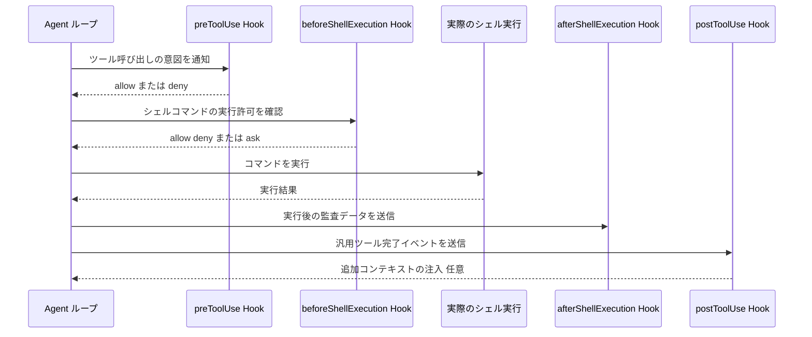

各ノードの意味：
- 「preToolUse」：あらゆるツール種別に共通する実行前フック。マッチャーで対象を絞り込める
- 「beforeShellExecution」：シェルコマンドに特化した実行前フック。危険なコマンドのブロックに使われることが多い
- 「afterShellExecution / postToolUse」：実行後の監査・追加コンテキスト注入に使う2種類のフック

### パートナー統合（実務で参照する価値がある領域）

| 分野 | 提供パートナー |
| :--- | :--- |
| MCP ガバナンス・可視化 | MintMCP, Oasis Security, Runlayer |
| コードセキュリティ | Corridor, Semgrep |
| 依存関係セキュリティ | Endor Labs |
| エージェントセキュリティ | Snyk |
| シークレット管理 | 1Password |

📖 用語ノート
- **フェイルオープン（fail-open）**：フック自体が失敗した場合にアクションを通過させるデフォルト挙動（`failClosed: true` で逆にできる）
- **マッチャー（matcher）**：フックがどの条件で発火するかを絞り込む正規表現的フィルタ

### 参照URL

- https://cursor.com/docs/hooks


## 13. Terminal & Sandbox

💡 この章では、Agent がローカル環境でシェルコマンドを実行する際の安全機構（サンドボックス）と、その設定方法を扱います。自動実行の範囲をどこまで広げるかは、チームのセキュリティポリシーと直結します。

Agent はターミナル上で直接シェルコマンドを実行する。macOS・Linux・Windows のいずれでも、デフォルトでは**サンドボックス**という制限環境の中でコマンドが実行され、不正なファイルアクセスやネットワーク活動をブロックしつつ、ワークスペース内に閉じた操作は自動実行される。

### ステップ1：プラットフォーム要件を確認する

| OS | 要件 |
| :--- | :--- |
| **macOS** | Cursor v2.0 以降であれば追加設定なしで動作する |
| **Windows** | WSL2 のインストールと設定が必須。サンドボックスは WSL2 内で動作し、Linux と同じ制限が適用される |
| **Linux** | カーネル 6.2 以降＋ Landlock v3 対応（`CONFIG_SECURITY_LANDLOCK=y`）、非特権ユーザー名前空間の有効化（多くのディストリビューションではデフォルト有効） |

カーネル要件を満たさない場合、Agent はコマンド実行前に承認を求めるフォールバック動作になる。一部ディストリビューションでは AppArmor がユーザー名前空間を制限しているため、リモート環境や CLI 単体利用では追加の AppArmor プロファイルパッケージのインストールが必要になる場合がある。

### ステップ2：サンドボックスが許可・制限する範囲を理解する

| アクセス種別 | 内容 |
| :--- | :--- |
| **ファイルアクセス** | ファイルシステム全体は読み取り可能、ワークスペースディレクトリは読み書き可能 |
| **ネットワークアクセス** | デフォルトでブロック（`sandbox.json` または設定で構成可能） |
| **一時ファイル** | `/tmp/` など OS の一時ディレクトリには完全アクセス可能 |

`.cursor` 設定ディレクトリは許可リストの設定にかかわらず常に保護される。フルシステムアクセスが必要な一部のコマンドはサンドボックスをバイパスし、その場合 Agent はサンドボックス外で実行する旨を示した上で承認を求める。

### ステップ3：許可リスト（allowlist）を運用する

サンドボックス化されたコマンドが制限により失敗した場合、以下の3択が提示される。

| 選択肢 | 挙動 |
| :--- | :--- |
| **Skip** | コマンドをキャンセルし、Agent に別の方法を試させる |
| **Run** | サンドボックス制限なしでそのコマンドを一度だけ実行する |
| **Add to allowlist** | 制限なしで実行し、以降は自動承認する |

ネットワークアクセスを許可する場合、デフォルトの許可ドメインリストには npm・PyPI・GitHub・Docker・主要言語のツールチェーンなど、一般的な開発ワークフローに必要なドメインが幅広く含まれている（`npmjs.com`・`pypi.org`・`github.com`・`docker.io`・`crates.io` など多数）。

### ステップ4：`sandbox.json` でネットワーク・ファイルシステムを細かく制御する

配置場所は `~/.cursor/sandbox.json`（ユーザー単位）または `<workspace>/.cursor/sandbox.json`（リポジトリ単位）。ネットワークパターンの構文・マージ挙動・保護パスの詳細はリファレンスドキュメントを参照する。

### ステップ5：Linux でのUID再マッピングに注意する（Docker連携時）

Linux 環境では、サンドボックスはユーザー名前空間を作成し、プロセスを名前空間内で UID 0（root）として扱う。そのため `id -u` や `$UID` はサンドボックス内では実際のホストユーザーIDではなく `0` を返す。ファイル所有権の設定や Docker への `--user` 引数渡しなど、実ホストユーザーが必要な場面では以下の環境変数を使う。

| 変数 | 説明 |
| :--- | :--- |
| `CURSOR_SANDBOX` | サンドボックス内では `"seatbelt"`（macOS）または `"native"`（Linux/Windows） |
| `CURSOR_ORIG_UID` / `CURSOR_ORIG_GID` | サンドボックスによる識別変更前の、Cursor を起動した実ユーザーの UID/GID |
| `CURSOR_SANDBOX_LANDLOCK_STATUS` | 有効なサンドボックスバックエンド（`fully_enforced` または `bubblewrap`） |

```bash
docker run --rm \
  --user "${CURSOR_ORIG_UID:-$(id -u)}:${CURSOR_ORIG_GID:-$(id -g)}" \
  -v "$PWD:/work" -w /work \
  my-image build
```

`${CURSOR_ORIG_UID:-$(id -u)}` というフォールバック構文により、サンドボックス外で実行した場合にも同じコマンドが動作する。

### ステップ6：Auto-Run のモードを理解し、チームで統一する

`Settings > Cursor Settings > Agents > Auto-Run` で以下を設定する。

| Auto-Run モード | 挙動 |
| :--- | :--- |
| **Run in Sandbox** | 可能な限りサンドボックス内でツール・コマンドを自動実行（macOS/Linux/Windows対応、WSL2経由） |
| **Ask Every Time** | すべてのツール・コマンド実行前にユーザー承認が必須 |
| **Run Everything** | 承認なしですべてのツール・コマンドを自動実行 |

| ネットワークアクセスモード | 挙動 |
| :--- | :--- |
| **sandbox.json Only** | `sandbox.json` の許可リストのみに限定。Cursor のデフォルトは追加しない |
| **sandbox.json + Defaults**（デフォルト） | 自分の許可リスト＋Cursor組み込みのデフォルト（主要パッケージマネージャなど） |
| **Allow All** | `sandbox.json` の内容にかかわらずサンドボックス内の全ネットワークアクセスを許可 |

さらに以下の保護設定を個別にオン/オフできる：**Command Allowlist**（サンドボックス外で自動実行できるコマンド）、**MCP Allowlist**、**Browser Protection**（ブラウザツールの自動実行防止）、**File-Deletion Protection**（ファイル削除の自動実行防止）、**Dotfile Protection**（`.gitignore` などドットファイルの自動変更防止）、**External-File Protection**（ワークスペース外のファイル作成・変更防止）。

Enterprise プランでは管理者がこれらのエディタ設定をダッシュボードから上書きできる。

📖 用語ノート
- **サンドボックス（sandbox）**：ファイル・ネットワークアクセスを制限した状態でコマンドを実行する隔離環境
- **Landlock**：Linuxカーネルのアクセス制御機構で、サンドボックスの実装基盤の一つ
- **ユーザー名前空間**：プロセスのUID/GIDをホストと分離して扱うLinuxカーネルの機能

### 参照URL

- https://cursor.com/docs/agent/tools/terminal

---

## 14. Browser ツール

💡 この章では、Agent がブラウザを直接操作してアプリをテストし、視覚的にレイアウトを編集し、アクセシビリティを監査する Browser ツールを扱います。

Agent はブラウザを操作して、アプリケーションのテスト・レイアウト/スタイルの視覚的編集・アクセシビリティ監査・デザインからコードへの変換などを行える。コンソールログとネットワークトラフィックへの完全なアクセスにより、問題のデバッグや包括的なテストワークフローの自動化も可能である。追加ツールのインストールや設定なしで利用できる。

### ステップ1：ネイティブ統合の効率化ポイントを理解する

- **効率的なログ処理**：ブラウザログはファイルに書き出され、Agent は必要な行だけを `grep` して選択的に読む。毎回の操作後に冗長な出力を要約するのではなく、完全な文脈を保ちながらトークン消費を最小化する
- **画像による視覚フィードバック**：スクリーンショットはファイル読み取りツールと直接統合されており、Agent はテキストの説明に頼らず画像として実際のブラウザ状態を「見る」
- **開発サーバーの検知**：実行中の開発サーバーを検知し、重複起動やポート番号の推測を避け、正しいポートを使う

### ステップ2：ブラウザの基本操作を把握する

| 機能 | 説明 |
| :--- | :--- |
| **Navigate** | URL への移動、リンクのクリック、履歴の前後移動、リロード |
| **Click** | ボタン・リンク・フォーム要素のクリック／ダブルクリック／右クリック／ホバー |
| **Type** | フォームへの入力・データ送信・検索ボックスへの入力 |
| **Scroll** | 長いページのスクロール・要素の探索 |
| **Screenshot** | ページレイアウトの視覚的確認 |
| **Console Output** | JavaScript エラー・デバッグ出力・ネットワーク警告の監視 |
| **Network Traffic** | API 呼び出し・レスポンスステータス・ネットワーク問題の診断（現時点では Agent パネル限定機能） |

### ステップ3：デザインサイドバーで視覚編集とコードを同期させる

ブラウザにはサイト直接編集用のデザインサイドバーが付属し、リアルタイムの視覚調整とコード編集を同時に行える。

- **位置・レイアウト**：要素の移動・再配置、flex 方向・配置・グリッドレイアウトの変更
- **寸法**：幅・高さ・パディング・マージンをピクセル単位で調整
- **色**：デザインシステムのカラートークンから選択、または新しいグラデーションを追加
- **外観**：シャドウ・不透明度・ボーダー半径のビジュアルスライダー調整
- **テーマテスト**：ライト/ダークテーマを即座に切り替えて確認

視覚調整が意図通りになったら適用ボタンを押すと、その変更をコードベースへ反映する Agent が起動する。複数要素をまたいで選択しテキストで変更内容を記述することもでき、複数の Agent が並列で起動し、ホットリロード後にページ上へ変更がライブ反映される。

### ステップ4：セッションの永続化を理解する

Cookie・`localStorage`・IndexedDB のデータは、ワークスペース単位でセッション間を跨いで保持される。ブラウザコンテキストはワークスペースごとに隔離されるため、異なるプロジェクトが Cookie やストレージ状態を共有することはない。

### ステップ5：セキュリティ設定を把握する

ブラウザは MCP サーバーとして拡張機能内で動作するセキュアな Web View として実行される。

- **トークン認証**：ブラウザセッションごとにランダムな認証トークンを生成
- **タブ分離**：各タブに固有のランダムIDを割り当て、タブ間の干渉を防止
- **セッションベースセキュリティ**：新規セッションごとにトークンを再生成

ブラウザツールはデフォルトで承認が必要。

| 承認モード | 挙動 |
| :--- | :--- |
| **Manual approval**（推奨） | すべてのアクションを個別にレビュー・承認 |
| **Allow-listed actions** | 許可リストに一致するアクションは自動実行、それ以外は承認が必要 |
| **Auto-run** | すべてのアクションが承認なしで即座に実行（注意して使用） |

**信頼できないコードや見慣れないサイトでは Auto-run モードを絶対に使わないこと。** Agent が悪意あるスクリプトを実行したり、意図せず機密データを送信したりする可能性がある。

Enterprise 向けには、`Admin Dashboard > MCP Configuration` で **Browser Origin Allowlist** を設定でき、自動ナビゲーションと MCP ツール実行を許可されたオリジンのみに制限できる。ただし、許可済みオリジンからのリンククリックやリダイレクトによる非許可オリジンへの遷移は成功してしまう点に注意が必要（ベストエフォートの保護であり、完全なナビゲーション経路の遮断ではない）。

### 推奨モデル

Sonnet 4.5・GPT-5・Auto での利用が推奨されている。

📖 用語ノート
- **デザインサイドバー**：ブラウザ内で視覚編集を行うUIパネル
- **セッション永続化**：Cookie・localStorage・IndexedDB がワークスペース単位で保持される仕組み

### 参照URL

- https://cursor.com/docs/agent/tools/browser

---

## 15. Worktrees（並列実行）

💡 この章では、Git のワークツリー機能を使って複数の Agent を衝突なく並列実行する方法を扱います。同一リポジトリで複数の実験を同時に走らせたい上級者向けの内容です。

Worktree は Agent が独立した Git チェックアウトの中で作業できるようにする仕組みである。各タスクは専用のファイル・依存関係・変更セットを持ち、メインのチェックアウトには触れない。同じリポジトリ上で複数の Agent を衝突なく走らせたい場合に使う。

### ステップ1：Agents Window で Worktree を作成する

Agents Window から Agent を起動、または既存の Agent を Worktree へ移動すると、そのタスク専用の独立したチェックアウトが作成される。作業完了後は Agents Window で結果をレビューし、Worktree 内で作業を続ける・コミットや PR を作る・メインワークスペースへ結果を取り込む、のいずれかを選べる。

### ステップ2：`.cursor/worktrees.json` でセットアップを自動化する

Worktree 作成時、Cursor は以下の順で `worktrees.json` を探す：①Worktree パス内、②プロジェクトのルートパス内。

| キー | 用途 |
| :--- | :--- |
| `setup-worktree-unix` | macOS/Linux 用コマンド（Unix系ではこちらが優先） |
| `setup-worktree-windows` | Windows 用コマンド（Windowsではこちらが優先） |
| `setup-worktree` | 全OS共通のフォールバック |

各キーには**コマンド配列**（順次実行）または**スクリプトファイルへの相対パス**を指定できる。

```json title="Node.js プロジェクト"
{
  "setup-worktree": [
    "npm ci",
    "cp $ROOT_WORKTREE_PATH/.env .env"
  ]
}
```

```json title="Python プロジェクト（仮想環境）"
{
  "setup-worktree": [
    "python -m venv venv",
    "source venv/bin/activate && pip install -r requirements.txt",
    "cp $ROOT_WORKTREE_PATH/.env .env"
  ]
}
```

**依存関係をシンボリックリンクで共有するのは推奨されない**。メインの Worktree に問題を引き起こす可能性があるため、`bun`・`pnpm`・`uv` のような高速パッケージマネージャで各 Worktree に独立インストールする方が安全である。

### ステップ3：不要な Worktree を自動クリーンアップする

```json
{
  "cursor.worktreeCleanupIntervalHours": 6,
  "cursor.worktreeMaxCount": 20
}
```

`worktreeCleanupIntervalHours` はクリーンアップの実行間隔、`worktreeMaxCount` は保持する最大数（超過分は古いものから削除）を制御する。

### ステップ4：Editor Window でのスラッシュコマンドを使う

Agents Window とは別に、通常の Editor Window でも Worktree を使ったコマンドが利用できる。

- **`/worktree`**：以降のチャットを別チェックアウトで実行させたい場合に使う。実験的な編集をメインチェックアウトから隔離し、インストール・ビルド・テストを現在のブランチを乱さずに実行できる

```text
/worktree 失敗しているauthテストを修正し、ログイン画面の文言も更新して
```

多くの場合、Worktree から直接コミット・プッシュできる（`これらの変更をコミットしてプッシュし、PRを作成して` のように指示する）。メインチェックアウトへ変更を取り込みたい場合は `/apply-worktree`、隔離チェックアウトが不要になったら `/delete-worktree` を使う。

- **`/best-of-n`**：同一タスクを複数モデルで同時実行し、比較するためのコマンド。各実行はそれぞれ独立した Worktree を持つため、候補同士やメインチェックアウトから隔離される

```text
/best-of-n sonnet,gpt,composer ログアウトの不安定なテストを修正して
```

`/best-of-n` は比較のみを行い、変更をメインチェックアウトへ自動マージすることはない。勝者を選んだ後、その Worktree から直接コミット・プッシュするか、`/apply-worktree` でメインチェックアウトへ取り込む。

この図は、複数モデルによる `/best-of-n` の並列比較フローを表しています。

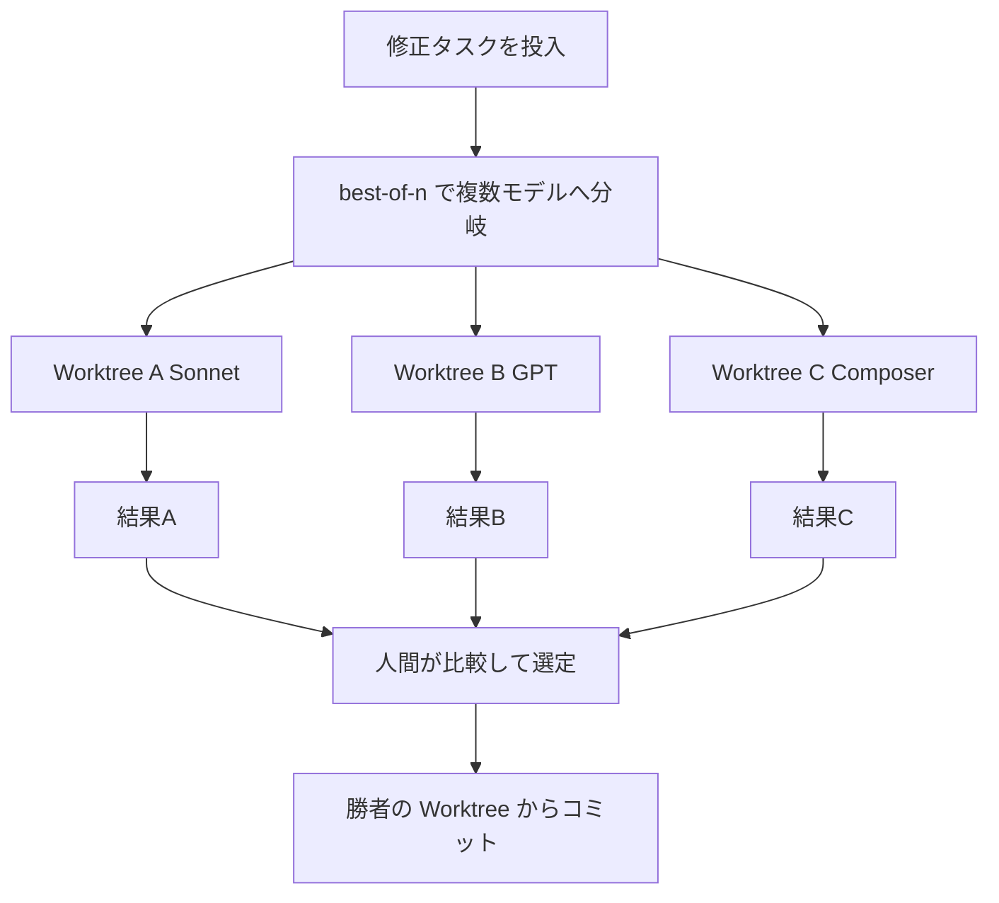

各ノードの意味：
- 「Worktree A/B/C」：各モデルが独立したファイル・依存関係で並列作業する隔離環境
- 「人間が比較して選定」：`/best-of-n` は自動マージしないため、最終判断は人間が行う

📖 用語ノート
- **Worktree（ワークツリー）**：同一リポジトリに対して複数の独立した作業ディレクトリを持てるGitの機能
- **`/apply-worktree`**：隔離されたWorktreeの変更をメインチェックアウトへ取り込むコマンド

### 参照URL

- https://cursor.com/docs/configuration/worktrees


## 16. Cloud Agents

💡 この章では、ローカルマシンを離れてクラウドの独立VM上でAgentを走らせる Cloud Agents（旧称 Background Agents）を扱います。並列実行・長時間タスク・チーム共有の運用を大きく変える機能です。

Cloud Agents は、ローカルマシンの代わりにクラウド上の隔離された VM でフルの開発環境を伴って実行される。クローンされたリポジトリ・インストール済みの依存関係・シークレット・起動コマンド・ネットワークアクセスなど、ラップトップ上のセットアップと同様の環境が用意される。

**Cloud Agents を使う理由**：ローカルマシンをインターネットに接続したままにしておく必要なく、いくつでも並列で Agent を走らせられる。専用の仮想マシンを持つため、変更したソフトウェアをビルド・テスト・実際に操作でき、デスクトップやブラウザを操作する computer use も使える。MCP サーバーにも対応し、データベース・API・サードパーティサービスなど外部ツールへのアクセスも可能。マルチリポジトリ環境にも対応しており、フロントエンド・バックエンド・インフラ・共有ライブラリが別リポジトリに分かれているタスクでも、全体を俯瞰して協調的な変更を加え、変更したリポジトリごとにPRを開ける。

### ステップ1：アクセス経路を選ぶ

| 経路 | 方法 |
| :--- | :--- |
| **Cursor Web** | [cursor.com/agents](https://cursor.com/agents) からどのデバイスでも開始・管理 |
| **Cursor Desktop** | Agent 入力欄下のドロップダウンで `Cloud` を選択 |
| **Slack** | `@cursor` コマンドで起動 |
| **GitHub** | PR や Issue に `@cursor` とコメントして起動 |
| **Linear** | `@cursor` コマンドで起動 |
| **API** | API 経由で起動 |

モバイルではネイティブアプリのような体験のため、PWA としてのインストールが推奨される（iOS: Safari でシェア→ホーム画面に追加、Android: Chrome のメニュー→アプリをインストール）。

### ステップ2：GitHub/GitLab 連携の仕組みを理解する

Cloud Agent はリポジトリをクローンし、別ブランチで作業した後、変更をリポジトリへプッシュして引き継ぎを行う。リポジトリおよび依存リポジトリ・サブモジュールへの読み書き権限が必要。GitHub・GitLab のほか、Bitbucket などの対応は今後拡大予定。

### ステップ3：環境をきちんと設定する（最も重要なステップ）

Agent は与えられた環境の中でしか有能になれない。コードは書けてもテストを実行できず、サービスに問い合わせられず、APIに到達できない Agent は、作業を完結させることができない。**Cloud Agent 用の開発環境を用意しないことは、エンジニアにパソコンを与えないのと同じ**であり、環境設定は Cloud Agent の有効性を高める最も重要なステップである。

環境は以下のいずれかで設定できる。

- **Agent 主導セットアップ**（Agent に環境構築自体を任せる）
- **保存済みスナップショット**（インストール済みパッケージ・システム依存関係を保存）
- **`.cursor/environment.json` に記述する Dockerfile**

各 Cloud Agent はリポジトリまたはマルチリポジトリグループに選択された環境から起動する。Cloud Agents ダッシュボードでは、どの環境がどの Agent 実行に使われたかを確認できる。

### ステップ4：モデルは常に Max Mode で動作する

Cloud Agents は厳選されたモデルセットを使用し、**常に Max Mode で動作する**（オフに切り替えるトグルは存在しない）。

### ステップ5：MCP とフックの対応範囲を確認する

- **MCP**：チーム向けに設定された MCP サーバーを利用できる。HTTP・stdio 両トランスポート対応、OAuth も利用可能。`cursor.com/agents` の MCP ドロップダウンから管理する
- **Hooks**：リポジトリの `.cursor/hooks.json` にあるコマンド型フックを実行する。Enterprise プランではチームフック・エンタープライズ管理フックも実行される。ただし IDE専用のフック（Tab hooks・`sessionStart`/`sessionEnd`・`beforeSubmitPrompt`・`workspaceOpen`）と、ユーザーレベルフック（`~/.cursor/hooks.json`）は利用できない（第12章参照）

### ステップ6：成果物とリモートデスクトップ制御を活用する

- **Artifacts**：Agent はスクリーンショット・動画・ログを生成し、何が変更されどう検証されたかを確認できる
- **リモートデスクトップ制御**：ブランチをローカルにチェックアウトせずに、Agent のデスクトップを直接操作してソフトウェアをテストできる。制御を Agent に戻せば作業を継続させられる

### コスト

Cloud Agents は選択したモデルの API 価格で課金される。初回利用時に支出上限（spend limit）の設定が求められる。

この図は、ローカルでの Agent 作業からクラウドへ引き継ぐ典型的な運用フローを表しています。

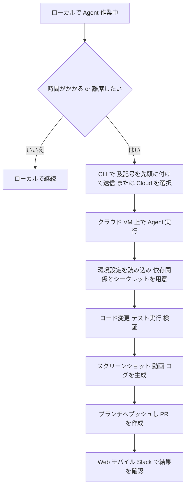

各ノードの意味：
- 「CLI で及記号を先頭に付けて送信」：Cursor CLI では `&` をメッセージ先頭に付けることで、そのままクラウドに作業を引き継げる（第17章参照）
- 「環境設定を読み込み」：`.cursor/environment.json` またはスナップショット・Agent主導セットアップに基づき環境を構築するステップ

📖 用語ノート
- **Cloud Agents**：クラウド上の隔離VMでフル開発環境とともに動くAgent（旧称 Background Agents）
- **computer use**：Agentがデスクトップやブラウザを直接操作する機能
- **spend limit**：Cloud Agent利用時に設定する支出上限

### 参照URL

- https://cursor.com/docs/cloud-agent

---

## 17. Cursor CLI

💡 この章では、GUIを離れてターミナルから Agent を操作する Cursor CLI を扱います。スクリプト・CI パイプラインへの組み込みや、SSH先のサーバー上での作業に有効です。

Cursor CLI を使うと、ターミナルから直接 AI Agent と対話してコードを書き・レビューし・修正できる。対話的なターミナルインターフェースと、スクリプト・CIパイプライン向けの非対話（print）自動化の両方をサポートする。

### ステップ1：インストールと起動

```bash
# インストール（macOS, Linux, WSL）
curl https://cursor.com/install -fsS | bash

# インストール（Windows PowerShell）
irm 'https://cursor.com/install?win32=true' | iex

# 対話セッションの起動
agent

# 初期プロンプト付きで起動
agent "auth モジュールを JWT トークン方式にリファクタリングして"
```

### ステップ2：モードを切り替える

エディタと同じ3モードをサポートする。

| モード | 説明 | 切り替え方法 |
| :--- | :--- | :--- |
| **Agent** | 複雑なコーディングタスク向けの全ツールアクセス | デフォルト（`--mode` 指定不要） |
| **Plan** | 実装前に確認質問を交えて設計する | `Shift+Tab`, `/plan`, `--plan`, `--mode=plan` |
| **Ask** | 変更を加えない読み取り専用の探索 | `/ask`, `--mode=ask` |

### ステップ3：非対話モードでスクリプト・CIに組み込む

```bash
# 特定のプロンプトとモデルで実行
agent -p "パフォーマンス問題を見つけて修正して" --model "gpt-5.2"

# git の変更を含めてレビューさせる
agent -p "これらの変更をセキュリティの観点でレビューして" --output-format text
```

`--output-format json` を指定すると構造化出力が得られ、スクリプトでパースしやすくなる。

### ステップ4：Cloud Agent へタスクを引き継ぐ

対話の途中でメッセージの先頭に `&` を付けると、そのままクラウドに送信され、離席中も処理を継続できる。

```bash
# 対話の途中で Cloud Agent へタスクを送信
& auth モジュールをリファクタリングし、包括的なテストを追加して
```

`cursor.com/agents` の Web またはモバイルで続きを確認できる。

### ステップ5：セッションを管理する

```bash
agent ls              # 過去の会話一覧
agent resume           # 直近の会話を再開
agent --continue       # 直前のセッションを継続
agent --resume="chat-id-here"   # 特定の会話を再開
```

### ステップ6：サンドボックスと Max Mode を制御する

```bash
/sandbox                       # インタラクティブメニューでサンドボックス設定
agent --sandbox enabled        # または disabled
/max-mode on                   # Max Mode の切り替え
/max-mode off
```

### ステップ7：Worktree での並列実行

```bash
agent -w my-feature "新機能を実装して"
```

`-w`/`--worktree [name]` を渡すと、現在のチェックアウトを直接編集せず、新しい Git Worktree でエージェントを走らせる。チェックアウトは `~/.cursor/worktrees/<reponame>/<name>` 以下に作られ、エディタで作成された Worktree と同じ保持ルールでクリーンアップされる。名前を省略すると自動生成される。`--workspace <path>` を組み合わせると、明示的なリポジトリルートを指定できる（省略時はカレントディレクトリを使用）。

### ステップ8：ルールと MCP は自動で引き継がれる

CLI エージェントはエディタと同じルールシステムをサポートし、`.cursor/rules` のルールが自動的に読み込まれ適用される。加えて、**プロジェクトルートの `AGENTS.md` と `CLAUDE.md` も `.cursor/rules` と並んでルールとして適用される**点はエディタにはない CLI 固有の挙動である。`mcp.json` も自動検出され、エディタで設定したのと同じ MCP サーバー・ツールが利用できる。

### 便利なキー操作

| キー | 動作 |
| :--- | :--- |
| `↑`（矢印キー上） | 過去のメッセージを遡る |
| `Shift+Tab` | モードを順番に切り替え（Agent/Plan/Ask） |
| `Shift+Enter` | 改行を挿入（iTerm2/Ghostty/Kitty/Warp/Zed 対応、tmux利用時は `Ctrl+J` を使用） |
| `Ctrl+D` | CLI を終了（シェルの慣例に従い2回押しが必要） |
| `Ctrl+J` または `+Enter` | 全ターミナル共通の改行挿入代替キー |
| `Ctrl+R` | 変更内容をレビュー（続けて `i` で追加指示、矢印キーでスクロール・ファイル切り替え） |

### sudo パスワードの安全な入力

昇格権限が必要なコマンドは、CLI を離れることなく実行できる。`sudo` が必要な場面では、マスクされた安全なパスワードプロンプトが表示され、パスワードはセキュアな IPC チャネル経由で `sudo` に直接渡される（AIモデル自体はパスワードを一切見ない）。

📖 用語ノート
- **PWA（Progressive Web App）**：Webサイトをネイティブアプリのようにホーム画面へ追加できる仕組み
- **ACP（Agent Client Protocol）**：カスタムクライアント統合向けにJSON-RPCでやり取りするプロトコル

### 参照URL

- https://cursor.com/docs/cli/overview
- https://cursor.com/docs/cli/using

---

## 18. Bugbot / Agent Review

💡 この章では、Agent が書いたコードを含むあらゆる変更を、マージ前に自動レビューする2つの仕組み（ローカル完結の Agent Review と、GitHub/GitLab 統合の Bugbot）を扱います。

### 18.1 Agent Review（ローカルのコミット前レビュー）

Agent Review は、Cursor の中でローカルの変更に対して専用のコードレビューを実行する機能である。

**設定**：`Cursor Settings > Agents > Agent Review` から、Agent タスクの完了ごとに自動実行するか、手動トリガーのままにするかを選べる。

**レビューの起動方法**：

| 方法 | 説明 |
| :--- | :--- |
| **自動** | 設定で有効化すると、コミットのたびに実行される |
| **スラッシュコマンド** | Agent ウィンドウで `/agent-review` と入力しオンデマンド実行 |
| **Source Control タブ** | ローカルの全変更をメインブランチと比較してレビューする。直近の編集だけでなく変更セット全体の問題を洗い出せる |

**レビューの深さ**：

| 深さ | 速度 | コスト | 向いている場面 |
| :--- | :--- | :--- | :--- |
| **Quick** | 速い | 低い | 小さな差分・フォーマット変更・簡易な健全性チェック |
| **Deep** | 遅い | 高い | 複雑なロジック・セキュリティ関連コード・大規模リファクタリング |

### 18.2 Bugbot（PR統合レビュー）

Bugbot は Pull Request をレビューし、バグ・セキュリティ問題・コード品質の問題を特定する。Teams・個人プランでは、ユーザーごとに一定数の無料 PR レビューが含まれ、上限に達したら 14 日間の Bugbot Pro トライアルを開始できる。

**動作**：PR の差分を分析し、説明と修正提案付きのコメントを残す。PR 更新ごとに自動実行されるほか、PR に `cursor review` または `bugbot run` とコメントして手動トリガーもできる。既存の PR コメント（トップレベル・インライン両方）を文脈として読み込み、重複した提案を避けつつ過去のフィードバックを踏まえたレビューを行う。「Fix in Cursor」「Fix in Web」リンクから即座に修正に着手できる。

**セットアップ**：ダッシュボードからリポジトリを接続（GitHub Enterprise Server 含む、GitLab Self-Hosted 含む）し、Bugbot ダッシュボードでリポジトリごとに有効化する。

### ステップ1：`BUGBOT.md` でプロジェクト固有のレビュー基準を定義する

`.cursor/BUGBOT.md` を作成する。ルートの `.cursor/BUGBOT.md` は常に含まれ、変更されたファイルから上へ辿る過程で見つかった追加のファイルも含まれる。

```text
project/
  .cursor/BUGBOT.md          # 常に含まれる（プロジェクト全体のルール）
  backend/
    .cursor/BUGBOT.md        # backend 配下をレビューする際に含まれる
    api/
      .cursor/BUGBOT.md      # API 配下のファイルをレビューする際に含まれる
  frontend/
    .cursor/BUGBOT.md        # frontend 配下をレビューする際に含まれる
```

ルール適用の優先順位は **Team Rules → repository rules（学習済み＋手動）→ プロジェクトの `BUGBOT.md`（ネスト含む）→ User Rules** の順にマージされる。

### ステップ2：学習ルール（Learned rules）を育てる

Bugbot ダッシュボードで学習を有効化すると、GitHubでのチーム活動から自動的にルールが生成される（過去履歴からの一括生成も可能）。PRに `@cursor remember [fact]` とコメントすることで、その場でルールをその場で教えることもでき、Bugbot はそれを学習ルールとして保存し以後のレビューに適用する。チームの活動データが蓄積されるにつれ、ルールは自動で有効化・無効化されていく。

### ステップ3：手動ルールの例（実務でそのまま使える型）

```text
変更されたファイルに /\beval\s*\(|\bexec\s*\(/i にマッチする文字列パターンが含まれる場合：
- タイトル「危険な動的実行」でブロッキングBugを追加し、本文に
  「eval/execの使用が検出されました。安全な代替手段に置き換えるか、
  詳細なコメントとテストで正当化してください。」と記載
- PR作成者にBugを割り当てる
- ラベル「security」を付与する
```

```text
PRが server/**, api/**, backend/** 配下のファイルを変更しており、
かつ **/*.test.*, **/__tests__/**, tests/** への変更がない場合：
- タイトル「バックエンド変更にテストがありません」でブロッキングBugを追加
- 本文「このPRはバックエンドコードを変更していますが、対応するテストが
  含まれていません。テストの追加・更新をお願いします。」
- ラベル「quality」を付与する
```

### ステップ4：ルールの効果を分析する

Bugbot ダッシュボードのルール分析では、以下の指標を確認できる。

| 指標 | 意味 |
| :--- | :--- |
| **Issues found** | このルールに関連してBugbotが報告した検出数 |
| **PRs reviewed** | それらの検出が現れたPRの数 |
| **Accepted issues** | チームが受け入れた検出の数 |
| **Acceptance rate** | 検出のうち受け入れられた割合 |

### ステップ5：Autofix で検出から修正PRまで自動化する

Bugbot がレビューでバグを検出すると、自動的に Cloud Agent を起動して分析・修正し、既存ブランチまたは新規ブランチへプッシュし、元のPRに結果コメントを投稿できる。利用には Usage-based pricing とストレージの有効化（Legacy Privacy Mode でないこと）が必要。

| 個人設定 | 挙動 |
| :--- | :--- |
| Use Installation Default | 組織設定に従う |
| Off | Autofix無効。「Fix in Cursor」「Fix in Web」の手動リンクを使う |
| Create New Branch（推奨） | 新規ブランチへプッシュ |
| Commit to Existing Branch | 自分のブランチへ直接プッシュ（ループ防止のためPRあたり最大3回まで） |

この図は、PR作成からBugbotレビュー・Autofixに至るまでの流れを表しています。

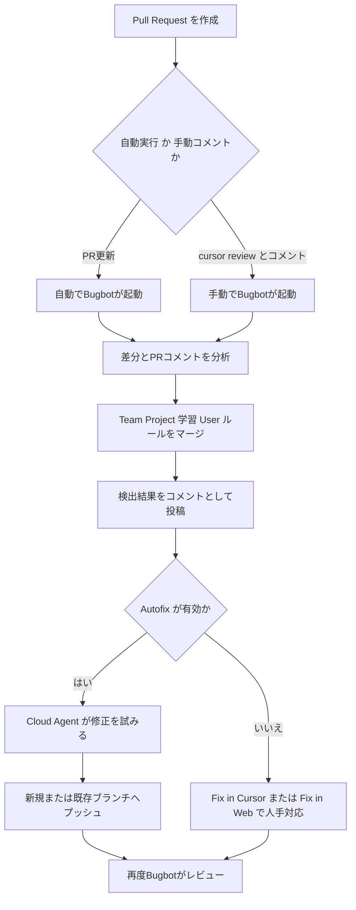

各ノードの意味：
- 「Team Project 学習 User ルールをマージ」：第8章のRules優先順位と類似する、Bugbot固有のルール合成ステップ
- 「Autofix が有効か」：検出されたバグを自動修正させるかどうかの分岐点

📖 用語ノート
- **Agent Review**：ローカルの変更に対してCursor内で完結する専用レビュー機能
- **Bugbot**：PR/MR単位でGitHub・GitLabと統合されるAIコードレビュー
- **Autofix**：Bugbotが検出したバグをCloud Agentで自動修正する機能

### 参照URL

- https://cursor.com/docs/agent/agent-review
- https://cursor.com/docs/bugbot


## 19. モデル選定とコスト最適化

💡 この章では、Cursor の課金体系（2つの利用プール）を理解した上で、タスクの性質に応じてどのモデルを選ぶべきかを扱います。コストを意識した運用は中〜上級者ほど差が出る領域です。

### ステップ1：2つの利用プールを区別する

個人プランには毎月の請求サイクルでリセットされる、独立した2つの利用プールがある。

| プール | 説明 |
| :--- | :--- |
| **Auto + Composer** | Auto または Composer 2.5 を選択した場合に適用される、低コストで日常的なエージェンティックコーディング向けのプール |
| **API** | 特定モデルを選択（または Premium ルーティング）した場合、そのモデルのAPI価格で消費されるプール。個人プランには毎月最低 $20 分のAPI利用枠が含まれる（上位ティアはより多い） |

両プールの利用状況は、エディタ設定と利用状況ダッシュボードの両方で確認できる。

### ステップ2：Auto と Premium ルーティングの違いを理解する

- **Auto**：知性・コスト効率・信頼性のバランスを取ってモデルを自動選択する。日常タスクに有効
- **Composer 2.5**：Cursor 自身が学習した、エージェンティックコーディング向けの高性能モデル。Auto と Composer 2.5 は同じプールから消費される
- **Premium ルーティング**：最も複雑なタスク向けに、内部ベンチマーク・評価・ユーザーフィードバックに基づいて Cursor が最も高性能なモデルを選択する。課金は選択されたモデルのAPI料金に基づく

### ステップ3：プランごとの利用量の目安を把握する

| プラン | 月額 | 含まれるAPI利用枠 | Auto + Composer |
| :--- | :--- | :--- | :--- |
| **Pro** | $20/mo | $20 | 潤沢な含有利用量 |
| **Pro Plus** | $60/mo | $70 | 潤沢な含有利用量 |
| **Ultra** | $200/mo | $400 | 潤沢な含有利用量 |

利用パターンごとの目安：

| 利用パターン | 目安コスト |
| :--- | :--- |
| Tab を毎日使うだけ | 常に $20 以内に収まる |
| Agent利用が限定的 | 多くの場合 $20 以内に収まる |
| Agent を毎日使う | 概ね $60〜$100/mo |
| 複数Agent・自動化を多用するパワーユーザー | しばしば $200+/mo |

上限に達した場合は、同じAPI料金でオンデマンド利用を追加するか、上位プランへアップグレードする。リクエストの品質・速度が落とされることはない。

### ステップ4：Team プランの選択肢を理解する

Team プランには **Standard（$40/user/mo）** と **Premium（$120/user/mo、Agentの利用上限がStandardの5倍）** の2シート種別がある。集中請求・管理、社内ルール/スキル/プラグイン用のチームマーケットプレイス、Bugbotによるエージェンティックコードレビュー、チーム共有文脈付きのCloud Agents・Automations、利用状況分析、チーム全体のプライバシーモード強制、SAML/OIDC SSO などが含まれる。

**Cursor Token Rate**：Team プランでは、Auto 以外のエージェントリクエストに対して、モデルのAPI料金に加えて $0.25/1M トークンの Cursor Token Rate が上乗せされる（含有利用枠・オンデマンド利用枠・BYOK利用枠のいずれにも適用）。Auto はこの料金の対象外。

### ステップ5：Max Mode を使うタイミングを見極める

Max Mode はモデルが対応する最大までコンテキストウィンドウを拡張する機能で、大規模ファイルや複雑なプロジェクトにまたがる編集で、より深いコードベース理解と精度向上をもたらす。モデルセレクターでトグルをオンにすると、以降の会話全体に適用されるグローバル設定として維持される（一部モデルは Max Mode専用で選択時に自動有効化される）。

- Max Mode は既定の約20万トークンより大きなコンテキストウィンドウを持つモデルで最も効果を発揮する
- Max Mode はトークンベースの課金となるため、通常のリクエストより大幅に多くの利用枠を消費しうる
- 個人プランではモデルのAPI料金で課金、Teamプランの非Autoリクエストは Cursor Token Rate が加算、レガシーなリクエストベースプランでは20%のサーチャージが加算される
- 利用量を注意深く管理している場合は、大きなコンテキストウィンドウの恩恵を受けるタスクに限定してMax Modeを使う
- ほとんどのコーディングタスクではデフォルトのコンテキストウィンドウで十分機能する

この図は、タスクの性質に応じたモデル・モード選定の判断フローを表しています。

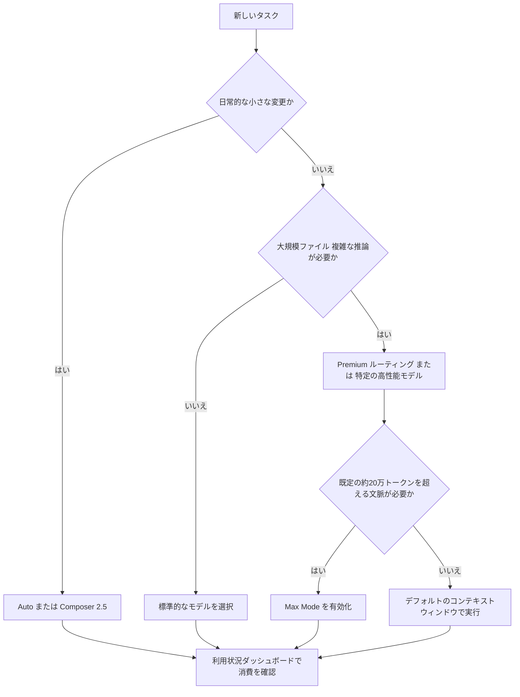

各ノードの意味：
- 「日常的な小さな変更か」：まずコストの低いAuto/Composerで足りるかを判断する一次分岐
- 「既定の約20万トークンを超える文脈が必要か」：Max Modeを有効化するかどうかの判断基準

📖 用語ノート
- **Auto + Composerプール**：日常タスク向けの低コスト利用枠
- **Premiumルーティング**：Cursorが最も高性能なモデルを自動選択する課金方式
- **Cursor Token Rate**：Teamプランの非Autoリクエストに上乗せされる追加料金

### 参照URL

- https://cursor.com/docs/models-and-pricing
- https://cursor.com/help/ai-features/max-mode

---

## 20. エンドツーエンドのワークフロー統合

💡 この最終章では、これまで解説してきた個々の機能を、実務の1サイクル（要件確認からPRマージまで）に沿って統合し、中〜上級者が明日から使える「型」として提示します。

これまでの章で扱った機能は独立して使うこともできるが、実務では組み合わせてこそ真価を発揮する。以下に、機能横断の典型的な開発サイクルを示す。

この図は、Cursor の各機能を実際の開発フローに沿って統合した全体像を表しています。上から下へ、要件確認からマージまでの流れとして読み進めてください。

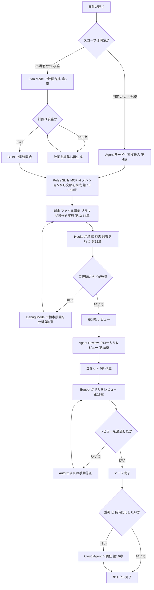

各ノードの意味：
- 「Rules Skills MCP at メンションから文脈を構成」：第7〜10章で扱ったコンテキスト管理層が実際にどこで効いてくるかを示す統合ポイント
- 「Hooks が承認 拒否 監査を行う」：ツール実行の前後にセキュリティ・品質ゲートとして介在する箇所
- 「Cloud Agent へ委任」：ローカルで完結させず、並列実行や長時間タスクをクラウドに逃がす選択肢

### 実務での組み合わせパターン集

| シナリオ | 推奨される機能の組み合わせ |
| :--- | :--- |
| 新機能をゼロから実装する | Plan Mode → Rules（規約遵守）→ Agent → Agent Review → Bugbot |
| 既存の複雑なバグを追う | Debug Mode → Hooks（ログ監査）→ Agent Review |
| 社内API・DBと連携するタスク | MCP（Slack/DB/GitHub連携）→ Agent → Cloud Agent（長時間処理） |
| 複数モデルで難問を解かせたい | `/best-of-n` による Worktree 並列比較 → Agent Review |
| チーム全体の品質基準を統一したい | Team Rules → BUGBOT.md → Bugbot 学習ルール |
| デザインをそのままコードに落としたい | Browser ツール（デザインサイドバー）または画像添付 → Agent |
| 反復的な定型作業を自動化したい | Agent Skills（`disable-model-invocation: true` でスラッシュコマンド化） |
| リスクの高い操作を安全に許可したい | Hooks（`beforeShellExecution` / `beforeMCPExecution`）+ Sandbox 許可リスト |

### 最終チェックリスト（中〜上級者向け）

- [ ] `.cursor/rules` は 500 行を超えていないか、焦点の絞られた複数ファイルに分割されているか
- [ ] `.cursorignore` に機密ファイル・巨大な生成物が登録されているか
- [ ] チームの繰り返しの指摘は Rules または BUGBOT.md に昇格されているか
- [ ] 反復タスクは Skills 化され、コンテキスト消費が最小限に抑えられているか
- [ ] リスクの高い操作（DB書き込み・本番デプロイなど）に Hooks のゲートが設定されているか
- [ ] Auto-Run のネットワーク許可設定はチームのセキュリティポリシーと一致しているか
- [ ] Max Mode は本当に必要な場面だけで使われているか（コスト最適化）
- [ ] Cloud Agent の環境設定（`.cursor/environment.json`）は最新のセットアップ手順を反映しているか

📖 用語ノート
- **エンドツーエンドワークフロー**：要件確認から実装・レビュー・マージまでを一気通貫で捉えた開発サイクル

---

## 21. 参考文献一覧

本ガイドの各章で参照した Cursor 公式ドキュメントの URL を、章ごとに再掲する。

| 章 | URL |
| :--- | :--- |
| 1. アーキテクチャ全体像 | https://cursor.com/docs |
| 1. アーキテクチャ全体像 | https://cursor.com/docs/agent/overview |
| 2. Tab 補完 | https://cursor.com/help/ai-features/tab |
| 3. インライン編集 | https://cursor.com/help/ai-features/inline-edit |
| 4. Agent モード | https://cursor.com/help/ai-features/agent |
| 4. Agent モード | https://cursor.com/docs/agent/prompting |
| 4. Agent モード | https://cursor.com/blog/agent-best-practices |
| 5. Plan Mode | https://cursor.com/docs/agent/plan-mode |
| 6. Debug Mode | https://cursor.com/docs/agent/debug-mode |
| 7. コンテキスト管理 | https://cursor.com/help/customization/context |
| 7. コンテキスト管理 | https://cursor.com/help/customization/indexing |
| 7. コンテキスト管理 | https://cursor.com/help/customization/ignore-files |
| 8. Rules | https://cursor.com/docs/rules |
| 9. MCP | https://cursor.com/docs/mcp |
| 10. Agent Skills | https://cursor.com/docs/skills |
| 11. Subagents | https://cursor.com/docs/subagents |
| 12. Hooks | https://cursor.com/docs/hooks |
| 13. Terminal & Sandbox | https://cursor.com/docs/agent/tools/terminal |
| 14. Browser ツール | https://cursor.com/docs/agent/tools/browser |
| 15. Worktrees | https://cursor.com/docs/configuration/worktrees |
| 16. Cloud Agents | https://cursor.com/docs/cloud-agent |
| 17. Cursor CLI | https://cursor.com/docs/cli/overview |
| 17. Cursor CLI | https://cursor.com/docs/cli/using |
| 18. Agent Review / Bugbot | https://cursor.com/docs/agent/agent-review |
| 18. Agent Review / Bugbot | https://cursor.com/docs/bugbot |
| 19. モデル選定とコスト最適化 | https://cursor.com/docs/models-and-pricing |
| 19. モデル選定とコスト最適化 | https://cursor.com/help/ai-features/max-mode |

**ドキュメント全体の索引**：https://cursor.com/llms.txt （Cursor公式が提供するドキュメント全体のサイトマップ。日本語版は各URLの先頭に `/ja/` を付与することでアクセス可能）

---

*本ガイドは執筆時点（2026年7月1日）の Cursor 公式ドキュメントに基づいています。Cursor は頻繁にアップデートされる製品のため、UIのラベルや細部の挙動が変わっている可能性があります。重要な意思決定の前には、上表のURLから最新の公式ドキュメントを直接確認することを推奨します。*