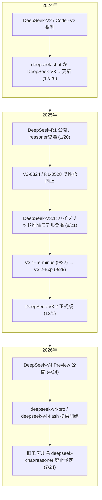
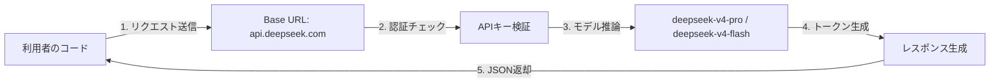
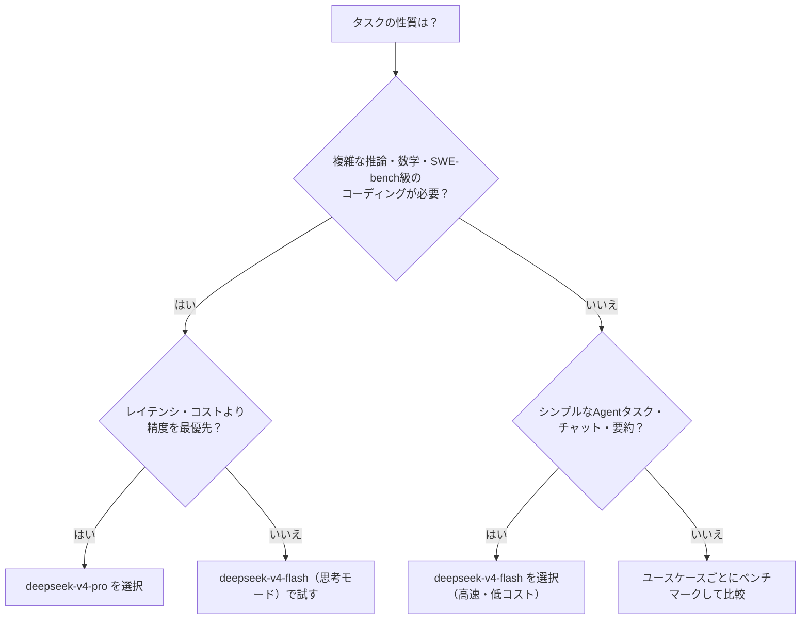
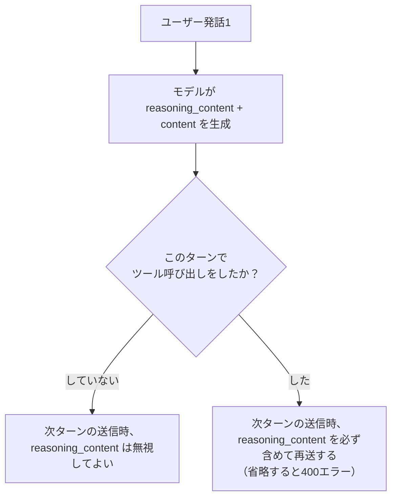
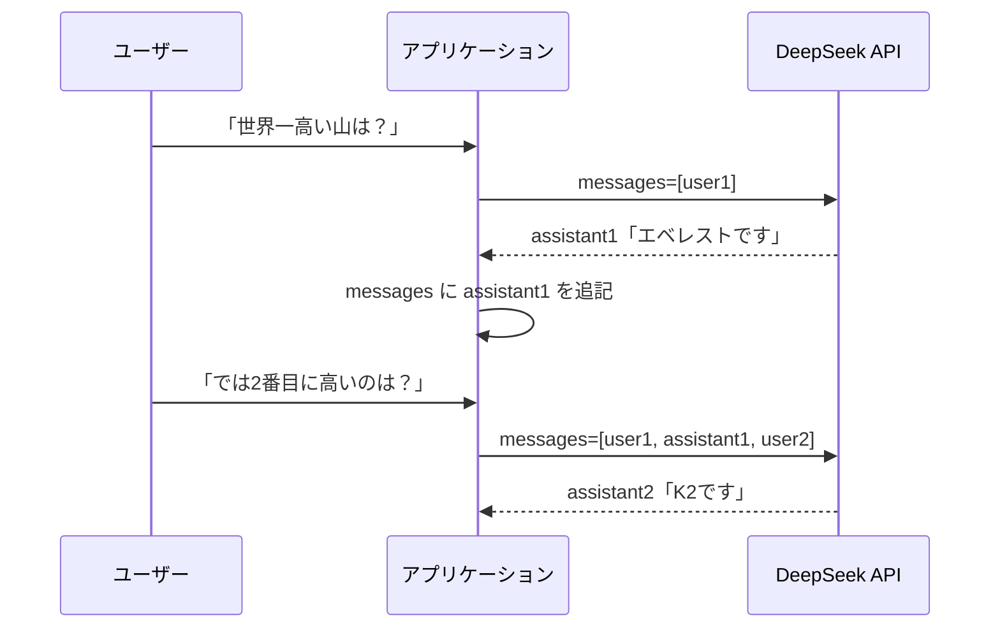
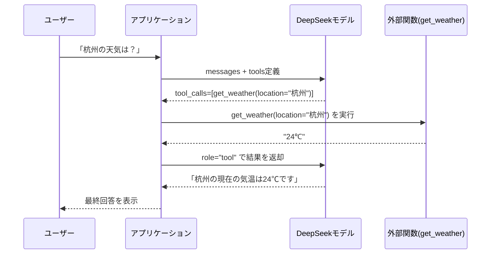
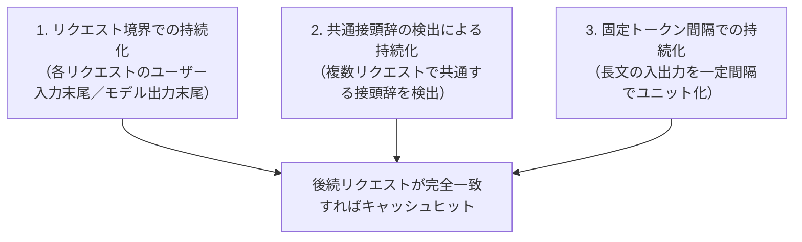
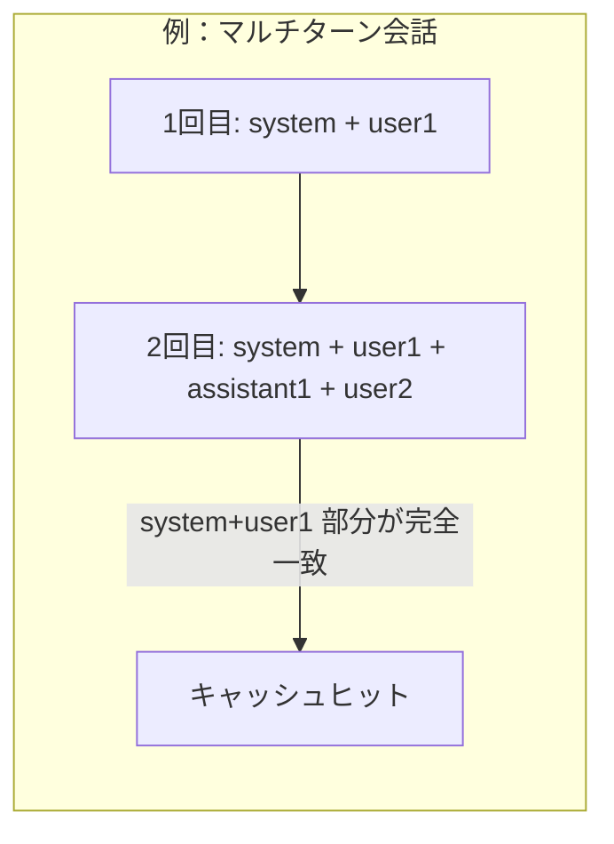
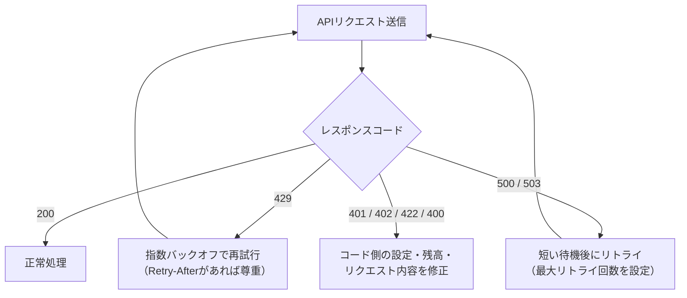

# DeepSeek LLM ベストプラクティスガイド 〜初学者向けステップバイステップ解説〜

> 最終更新確認日: 2026年7月16日
> 本ガイドは [DeepSeek公式サイト](https://www.deepseek.com/en/) および [DeepSeek API公式ドキュメント](https://api-docs.deepseek.com/) を実際に参照し、2026年7月時点の最新情報に基づいて作成しています。DeepSeekは更新頻度が高いサービスのため、実装前に必ず一次情報源（本文中のURL）を確認してください。

---

## ⚠️ まず最初に押さえるべき重要事項

2026年7月24日 15:59 (UTC) をもって、旧モデル名 `deepseek-chat` と `deepseek-reasoner` は**完全に廃止**されます。現在この2つの名前は自動的に新モデル `deepseek-v4-flash` の非思考モード／思考モードにマッピングされていますが、廃止後はAPIが応答を返さなくなります。本ガイド執筆時点で残り1週間程度しかないため、既存プロジェクトを運用している方は「Step 15: 移行チェックリスト」を最優先で確認してください。
参照: [Change Log](https://api-docs.deepseek.com/updates) / [DeepSeek-V4 Preview Release](https://api-docs.deepseek.com/news/news260424)

---

## 目次

1. [DeepSeekとは何か](#1-deepseekとは何か)
2. [2026年7月時点のモデルラインナップ全体像](#2-2026年7月時点のモデルラインナップ全体像)
3. [Step 1: アカウント作成とAPIキー取得](#step-1-アカウント作成とapiキー取得)
4. [Step 2: はじめてのAPI呼び出し](#step-2-はじめてのapi呼び出し)
5. [Step 3: モデル選定のベストプラクティス](#step-3-モデル選定のベストプラクティス)
6. [Step 4: Thinking Mode（思考モード）の使い方](#step-4-thinking-mode思考モードの使い方)
7. [Step 5: マルチターン会話の実装](#step-5-マルチターン会話の実装)
8. [Step 6: Function Calling（Tool Calls）の活用](#step-6-function-callingtool-callsの活用)
9. [Step 7: 構造化出力（JSON Mode / strictモード）](#step-7-構造化出力json-mode--strictモード)
10. [Step 8: Context Caching でコストを最大95%削減する](#step-8-context-caching-でコストを最大95削減する)
11. [Step 9: レート制限・同時実行数・エラーハンドリング](#step-9-レート制限同時実行数エラーハンドリング)
12. [Step 10: Anthropic API互換とコーディングエージェント連携](#step-10-anthropic-api互換とコーディングエージェント連携)
13. [料金とトークン管理のベストプラクティス](#料金とトークン管理のベストプラクティス)
14. [ベストプラクティス総まとめ表](#ベストプラクティス総まとめ表)
15. [移行チェックリスト（旧モデル廃止対応）](#移行チェックリスト旧モデル廃止対応)
16. [トラブルシューティングFAQ](#トラブルシューティングfaq)
17. [参考文献一覧（全URL）](#参考文献一覧全url)

---

## 1. DeepSeekとは何か

DeepSeek（深度求索）は、AGI（汎用人工知能）の本質解明を掲げる中国のAI研究組織で、大規模言語モデル（LLM）を独自に開発し、モデルの重みや技術レポートをオープンに公開していることで知られています。公式サイトでは「Into the unknown」というコンセプトのもと、チャットサービス（DeepSeek Chat / chat.deepseek.com）、開発者向けAPIプラットフォーム（DeepSeek Platform / platform.deepseek.com）、およびモバイル・デスクトップアプリを提供しています。

- 研究成果（DeepSeek-V2 / V3 / R1 / Coder / Math / VL 等）はGitHubで公開: https://github.com/deepseek-ai
- サービスステータス確認: https://status.deepseek.com
- API料金ページ: https://api-docs.deepseek.com/quick_start/pricing

**参照URL**
- https://www.deepseek.com/en/
- https://api-docs.deepseek.com/

---

## 2. 2026年7月時点のモデルラインナップ全体像

2026年4月24日、DeepSeekは最新世代モデル **DeepSeek-V4** をプレビュー公開しました。V4は「1Mコンテキストのコスト効率時代」を掲げ、新しいSparse Attention構造（DSA: DeepSeek Sparse Attention）とトークン単位の圧縮技術により、超長文コンテキストを低コストで扱えるようにしたことが最大の特徴です。

### モデル進化の歴史（タイムライン図）



### 現行モデル比較表（2026年7月16日時点）

| 項目 | `deepseek-v4-flash` | `deepseek-v4-pro` |
|---|---|---|
| モデル実体 | DeepSeek-V4-Flash（284B総パラメータ／13B活性化） | DeepSeek-V4-Pro（1.6T総パラメータ／49B活性化） |
| 位置づけ | 高速・低コストな汎用モデル | 最高性能・トップクラスの推論力 |
| コンテキスト長 | 1M トークン | 1M トークン |
| 最大出力 | 384K トークン | 384K トークン |
| 思考モード | 対応（デフォルトON、切替可） | 対応（デフォルトON、切替可） |
| 同時実行数上限 | 2500 | 500 |
| 入力（キャッシュヒット）/ 1Mトークン | $0.0028 | $0.003625 |
| 入力（キャッシュミス）/ 1Mトークン | $0.14 | $0.435 |
| 出力 / 1Mトークン | $0.28 | $0.87 |
| 旧名との対応 | `deepseek-chat`(非思考)/`deepseek-reasoner`(思考)の後継 | 新規 |

> 価格は変更される可能性があるため、実装前に必ず最新の [Models & Pricing](https://api-docs.deepseek.com/quick_start/pricing) を確認してください。

**参照URL**
- https://api-docs.deepseek.com/news/news260424（V4 Preview発表）
- https://api-docs.deepseek.com/quick_start/pricing
- https://api-docs.deepseek.com/updates（更新履歴全体）

---

## Step 1: アカウント作成とAPIキー取得

1. [DeepSeek Platform](https://platform.deepseek.com) にアクセスし、メールアドレス（Gmail / Outlook / Hotmail / Yahoo等の主要プロバイダ推奨）でサインアップします。国内メールドメインは登録不可の場合があるため、うまく登録できない場合は主要プロバイダのメールを使いましょう。
2. ログイン後、[API Keysページ](https://platform.deepseek.com/api_keys) で新しいAPIキーを発行します。
3. [Top upページ](https://platform.deepseek.com/top_up) から残高をチャージします（PayPal・銀行カード・Alipay・WeChat Payに対応）。トップアップ残高に有効期限はありませんが、付与（無料）残高には期限がある場合があるので[Billingページ](https://platform.deepseek.com/transactions)で確認してください。
4. APIキーは環境変数に格納し、コードに直書きしないことがベストプラクティスです。

```bash
export DEEPSEEK_API_KEY="sk-xxxxxxxxxxxxxxxxxxxxxxxx"
```

**参照URL**
- https://api-docs.deepseek.com/faq（アカウント登録・課金に関するFAQ）
- https://platform.deepseek.com/api_keys

---

## Step 2: はじめてのAPI呼び出し

DeepSeek APIは **OpenAI互換フォーマット** と **Anthropic互換フォーマット** の両方をサポートしており、既存のOpenAI SDK／Anthropic SDKや、それらの形式に対応したソフトウェアをそのまま流用できます。

| 項目 | 値 |
|---|---|
| Base URL（OpenAI形式） | `https://api.deepseek.com` |
| Base URL（Anthropic形式） | `https://api.deepseek.com/anthropic` |
| 認証方式 | `Authorization: Bearer <APIキー>`（OpenAI形式）／ `x-api-key`（Anthropic形式） |

### 呼び出しの全体フロー



### 実装例（Python / OpenAI SDK形式）

```python
from openai import OpenAI

client = OpenAI(
    api_key="<あなたのDeepSeek APIキー>",
    base_url="https://api.deepseek.com",
)

response = client.chat.completions.create(
    model="deepseek-v4-pro",
    messages=[
        {"role": "system", "content": "あなたは親切なアシスタントです。"},
        {"role": "user", "content": "こんにちは！"},
    ],
    stream=False,
)

print(response.choices[0].message.content)
```

### 実装例（curl）

```bash
curl https://api.deepseek.com/chat/completions \
  -H "Content-Type: application/json" \
  -H "Authorization: Bearer ${DEEPSEEK_API_KEY}" \
  -d '{
        "model": "deepseek-v4-pro",
        "messages": [
          {"role": "system", "content": "あなたは親切なアシスタントです。"},
          {"role": "user", "content": "こんにちは！"}
        ],
        "stream": false
      }'
```

> ベストプラクティス: WebのチャットUIはストリーミング表示ですが、APIはデフォルトで非ストリーミング（`stream=false`）です。ユーザー体験を高めたい対話型アプリでは `stream=true` を明示的に指定しましょう。

**参照URL**
- https://api-docs.deepseek.com/（Your First API Call）
- https://api-docs.deepseek.com/faq（APIの速度に関するFAQ）

---

## Step 3: モデル選定のベストプラクティス

### 選定ディシジョンツリー



### 選定の基準まとめ

| ユースケース | 推奨モデル | 理由 |
|---|---|---|
| コーディングエージェント、複雑な多段階Agentタスク | `deepseek-v4-pro` | オープンモデルでSOTA級のAgentic Coding性能、Gemini-3.1-Proに次ぐ世界知識量 |
| シンプルなAgentタスク・チャットボット・要約 | `deepseek-v4-flash` | Pro同等の性能をシンプルタスクで発揮しつつ、応答速度とコストで優位 |
| 大量並列処理（高スループットが必要なバッチ処理） | `deepseek-v4-flash` | 同時実行数上限が2500（Proは500）と5倍 |
| 数学・STEM・高度なコーディング精度が最優先 | `deepseek-v4-pro` | V4-ProはMath/STEM/Codingでトップクラスの closed-source モデルに匹敵 |

> ベストプラクティス: まずコストの低い `deepseek-v4-flash` で試作・評価を行い、精度が不足する場合のみ `deepseek-v4-pro` に切り替える、という段階的な検証が推奨されます。

**参照URL**
- https://api-docs.deepseek.com/news/news260424
- https://api-docs.deepseek.com/quick_start/pricing

---

## Step 4: Thinking Mode（思考モード）の使い方

DeepSeekモデルは、最終回答を出す前に思考の連鎖（Chain of Thought）を出力する「Thinking Mode」をサポートしています。思考内容は `reasoning_content` フィールドに、最終回答は `content` フィールドに、それぞれ別々に返却されます。

### 制御パラメータ

| 項目 | OpenAI形式 | Anthropic形式 |
|---|---|---|
| 思考モードのON/OFF | `{"thinking": {"type": "enabled/disabled"}}` | — |
| 思考の強度（Effort） | `{"reasoning_effort": "high/max"}` | `{"output_config": {"effort": "high/max"}}` |

- 思考モードのデフォルトは **有効(enabled)**
- 通常リクエストのデフォルトEffortは `high`。Claude CodeやOpenCodeのような複雑なAgentリクエストでは自動的に `max` になります
- 互換性のため `low`/`medium` は `high` に、`xhigh` は `max` に自動マッピングされます
- 思考モードでは `temperature` / `top_p` / `presence_penalty` / `frequency_penalty` は無効（エラーにはならないが効果なし）

### マルチターンにおける reasoning_content の扱い（重要）



### Python実装例

```python
messages = [{"role": "user", "content": "9.11 と 9.8 はどちらが大きい？"}]

response = client.chat.completions.create(
    model="deepseek-v4-pro",
    messages=messages,
    reasoning_effort="high",
    extra_body={"thinking": {"type": "enabled"}},
)

reasoning = response.choices[0].message.reasoning_content
answer = response.choices[0].message.content

# 次のターンへ引き継ぐ（ツール呼び出しがなければ reasoning_content は無視される）
messages.append(response.choices[0].message)
messages.append({"role": "user", "content": "では『strawberry』にRはいくつある？"})
```

> ベストプラクティス: Tool Calls（Function Calling）を伴う思考モードの会話では、`reasoning_content` を省略すると400エラーになります。`response.choices[0].message` をそのまま `messages` に追記する実装にしておくと、フィールドの欠落を防げます。

**参照URL**
- https://api-docs.deepseek.com/guides/thinking_mode

---

## Step 5: マルチターン会話の実装

DeepSeekの `/chat/completions` API は **ステートレス**（サーバー側で会話履歴を保持しない）です。そのため、過去の会話履歴をすべて `messages` 配列に含めて毎回送信する必要があります。



```python
messages = [{"role": "user", "content": "世界一高い山は？"}]
response = client.chat.completions.create(model="deepseek-v4-pro", messages=messages)
messages.append(response.choices[0].message)

messages.append({"role": "user", "content": "では2番目に高いのは？"})
response = client.chat.completions.create(model="deepseek-v4-pro", messages=messages)
messages.append(response.choices[0].message)
```

> ベストプラクティス: 会話履歴が長くなるほどトークン消費が増えるため、Step 8のContext Cachingと組み合わせて、履歴の「共通接頭辞」を維持する設計（システムプロンプトを変えない、履歴を編集しない）にするとキャッシュヒット率が向上します。

**参照URL**
- https://api-docs.deepseek.com/guides/multi_round_chat

---

## Step 6: Function Calling（Tool Calls）の活用

Tool Callsは、モデルが外部関数（天気取得API、DB検索など）を呼び出して能力を拡張する仕組みです。**モデル自身は関数を実行しません**。関数を呼ぶ「意図」と「引数」を返すだけで、実際の実行と結果の返却はアプリケーション側の責務です。

### 非思考モードでの基本フロー



### 実装例

```python
tools = [{
    "type": "function",
    "function": {
        "name": "get_weather",
        "description": "指定した場所の天気を取得する",
        "parameters": {
            "type": "object",
            "properties": {
                "location": {"type": "string", "description": "都市名"}
            },
            "required": ["location"],
        },
    },
}]

messages = [{"role": "user", "content": "杭州の天気は？"}]
response = client.chat.completions.create(model="deepseek-v4-pro", messages=messages, tools=tools)

tool_call = response.choices[0].message.tool_calls[0]
messages.append(response.choices[0].message)
messages.append({"role": "tool", "tool_call_id": tool_call.id, "content": "24℃"})

final = client.chat.completions.create(model="deepseek-v4-pro", messages=messages, tools=tools)
print(final.choices[0].message.content)
```

### 思考モードでのTool Calls

DeepSeek-V3.2以降、思考モードでもTool Callsが利用できます。思考→ツール呼び出し→思考→最終回答、という複数ラウンドの推論が可能になります。この場合、前述のとおり **各サブターンの `reasoning_content` を必ずAPIへ送り返す** 必要があります。

### `strict` モード（Beta）でスキーマ準拠を保証する

`strict: true` を関数定義に設定すると、モデルの出力がJSON Schemaに厳密に従うことが保証されます。利用するには `base_url="https://api.deepseek.com/beta"` を指定する必要があります。

| 対応するJSON Schema型 | 備考 |
|---|---|
| `object` | 全プロパティを`required`にし、`additionalProperties: false`を設定する必要がある |
| `string` | `pattern`・`format`（email/hostname/ipv4/ipv6/uuid）対応。`minLength`/`maxLength`は非対応 |
| `number` / `integer` | `minimum`/`maximum`/`multipleOf`等は対応 |
| `array` | `items`対応。`minItems`/`maxItems`は非対応 |
| `enum` | 対応 |
| `anyOf` | 対応（複数形式の許容に利用） |
| `$ref` / `$def` | 再利用可能なサブスキーマ定義・再帰構造に利用可能 |

> ベストプラクティス: 構造化データを外部システムに連携する用途（受注ステータス管理、フォーム入力の抽出等）では、通常モードよりも`strict`モードを使う方がパースエラーによる後続処理の失敗を防げます。

**参照URL**
- https://api-docs.deepseek.com/guides/tool_calls
- https://api-docs.deepseek.com/guides/thinking_mode#tool-calls

---

## Step 7: 構造化出力（JSON Mode / strictモード）

厳密なJSON文字列で応答させたい場合は `response_format={"type": "json_object"}` を指定するJSON Outputモードを使います。

### 利用時の注意点（公式ドキュメントより）

1. `response_format` を `{'type': 'json_object'}` に設定する
2. システムプロンプトまたはユーザープロンプトに「json」という単語を含め、期待するJSON形式の例を提示してモデルを誘導する
3. `max_tokens` を適切に設定し、JSON文字列が途中で切れないようにする
4. まれに空のコンテンツが返る場合がある（公式も認識・改善中の既知の挙動）。プロンプトの調整で緩和できる場合がある

```python
system_prompt = """
ユーザーは試験問題のテキストを提供します。「question」と「answer」を抽出し、JSON形式で出力してください。

出力例:
{"question": "世界一高い山はどこですか？", "answer": "エベレスト"}
"""

response = client.chat.completions.create(
    model="deepseek-v4-pro",
    messages=[
        {"role": "system", "content": system_prompt},
        {"role": "user", "content": "世界一長い川はどこですか？ナイル川です。"},
    ],
    response_format={"type": "json_object"},
)
```

> ベストプラクティス: 外部との連携で厳密なスキーマ順守が必要な場合は、JSON ModeよりもStep 6で紹介した「Tool Calls + `strict`モード」の方が構造の保証度が高く、より確実です。JSON Modeは「JSON形式であること」は保証しますが、フィールド構造そのものは保証しません。

**参照URL**
- https://api-docs.deepseek.com/guides/json_mode

---

## Step 8: Context Caching でコストを最大95%削減する

DeepSeek APIには「ディスクベースのコンテキストキャッシュ」がデフォルトで有効になっており、コード変更なしに恩恵を受けられます。同一のプレフィックス（接頭辞）を持つリクエストを繰り返し送ると、重複部分がキャッシュヒットとして扱われ、大幅に安価に処理されます（表の通り、キャッシュヒット時の入力コストはキャッシュミス時の約1/50〜1/120）。

### キャッシュが持続化される3つのタイミング



### キャッシュヒットの具体例



キャッシュヒット状況は、レスポンスの `usage` フィールドにある以下2つの値で確認できます。

| フィールド | 内容 |
|---|---|
| `prompt_cache_hit_tokens` | 入力のうちキャッシュヒットしたトークン数 |
| `prompt_cache_miss_tokens` | 入力のうちキャッシュミスしたトークン数 |

> ベストプラクティス:
> - システムプロンプトや長文コンテキスト（財務資料、ドキュメント全文など）を**常に会話の先頭に固定して配置**し、後半にだけ質問を変えて送ると、共通接頭辞がキャッシュされてコストが大幅に下がります。
> - キャッシュは「ベストエフォート」であり100%のヒットを保証しません。また未使用のキャッシュは数時間〜数日で自動的にクリアされます。
> - キャッシュはあくまで**入力プレフィックスの一致**にのみ作用し、出力の再現性（ランダム性）には影響しません。`temperature`等のパラメータによる出力のばらつきは従来通り発生します。

**参照URL**
- https://api-docs.deepseek.com/guides/kv_cache

---

## Step 9: レート制限・同時実行数・エラーハンドリング

### 同時実行数（Concurrency Limit）

| モデル | 同時実行数上限 |
|---|---|
| `deepseek-v4-pro` | 500 |
| `deepseek-v4-flash` | 2500 |

- 上限はAPIキー単位ではなく**アカウント単位**で計算されます
- 上限を超えると HTTP 429 が返却されます
- より高い同時実行数が必要な場合は、公式フォームから容量拡張をリクエストできます（追加費用なし）

### `user_id` によるアイソレーション

`user_id` パラメータを渡すことで、自社サービス内のエンドユーザー単位で「コンテンツ安全性」「KVCacheの分離（プライバシー保護）」「スケジューリング」を分離管理できます。`user_id` はハイフン・アンダースコア・英数字のみ、最大512文字で、個人情報を含めてはいけません。

```python
response = client.chat.completions.create(
    model="deepseek-v4-pro",
    messages=[{"role": "user", "content": "Hello!"}],
    extra_body={"user_id": "your_user_id"},
)
```

### エラーコード一覧

| コード | 原因 | 対処法 |
|---|---|---|
| 400 Invalid Format | リクエストボディの形式が不正 | エラーメッセージのヒントに従い修正 |
| 401 Authentication Fails | APIキーが誤っている | APIキーを確認、未発行なら新規作成 |
| 402 Insufficient Balance | 残高不足 | Top upページでチャージ |
| 422 Invalid Parameters | パラメータが不正 | エラーメッセージに従い修正 |
| 429 Rate Limit Reached | リクエスト過多 | リクエスト頻度を調整、必要なら他社APIへの一時切替も検討 |
| 500 Server Error | サーバー側の問題 | 少し待って再試行、継続する場合は問い合わせ |
| 503 Server Overloaded | 高負荷によるサーバー過負荷 | 少し待って再試行 |

### エラーハンドリングのベストプラクティスフロー



### Keep-Alive（接続維持）に関する注意

リクエスト送信後、推論のスケジューリング待ちの間、非ストリーミングでは空行、ストリーミングでは `: keep-alive` というSSEコメントが継続的に返却されます。自前でHTTPレスポンスをパースする場合は、これらを無視できるよう実装してください。なお、10分間推論が開始されない場合はサーバー側から接続が切断されます。

**参照URL**
- https://api-docs.deepseek.com/quick_start/rate_limit
- https://api-docs.deepseek.com/quick_start/error_codes

---

## Step 10: Anthropic API互換とコーディングエージェント連携

DeepSeekはAnthropic APIエコシステム向けに互換フォーマットを提供しており、`base_url` を `https://api.deepseek.com/anthropic` に変更するだけで、Anthropic SDKや、Claude Codeのような対応済みツールをそのまま利用できます。

### モデルマッピングの仕組み

Claude Code等でAnthropicのモデル名を渡すと、DeepSeek側で自動的に以下のようにマッピングされます。

| 渡したモデル名の接頭辞 | マッピング先 |
|---|---|
| `claude-opus-*` | `deepseek-v4-pro` |
| `claude-sonnet-*` / `claude-haiku-*` | `deepseek-v4-flash` |

### Claude Code連携の設定例（Linux/Mac）

```bash
export ANTHROPIC_BASE_URL=https://api.deepseek.com/anthropic
export ANTHROPIC_AUTH_TOKEN=<あなたのDeepSeek APIキー>
export ANTHROPIC_MODEL=deepseek-v4-pro[1m]
export ANTHROPIC_DEFAULT_OPUS_MODEL=deepseek-v4-pro[1m]
export ANTHROPIC_DEFAULT_SONNET_MODEL=deepseek-v4-pro[1m]
export ANTHROPIC_DEFAULT_HAIKU_MODEL=deepseek-v4-flash
export CLAUDE_CODE_SUBAGENT_MODEL=deepseek-v4-flash
export CLAUDE_CODE_EFFORT_LEVEL=max
```

設定後、プロジェクトディレクトリで `claude` コマンドを実行するだけで、Claude CodeのバックエンドとしてDeepSeekモデルが動作します。Claude Code内のWeb検索機能もDeepSeek側でネイティブにサポートされていますが、検索結果の要約のために追加のAPIリクエスト（追加コスト）が発生する点に注意してください。

DeepSeekはClaude Code以外にも、GitHub Copilot／GitHub Copilot CLI／Kilo Code／OpenCode／OpenClaw／AstrBot等、多数のエージェントツールとの連携ガイドを公開しています。

### Anthropic API互換における主な非対応・制限事項

| 分野 | 状況 |
|---|---|
| `anthropic-beta` / `anthropic-version` ヘッダー | 無視される |
| `thinking.budget_tokens` | 無視される（`effort`のみ有効） |
| 画像・ドキュメント・検索結果のcontentタイプ | 非対応 |
| `cache_control`（Anthropic側のプロンプトキャッシュ指定） | 無視される（DeepSeek側は独自のContext Cachingが常時作動） |
| `tool_choice`（none/auto/any/tool） | 対応（ただし`disable_parallel_tool_use`は無視） |

> ベストプラクティス: 既にAnthropic SDKやClaude Code運用のワークフローを持っているチームは、コードをほぼ変更せずに `base_url` と `api_key` の切替のみでDeepSeekモデルを試せます。ただし画像入力等、非対応の機能に依存した既存実装がある場合は移行前に対応表を確認してください。

**参照URL**
- https://api-docs.deepseek.com/guides/anthropic_api
- https://api-docs.deepseek.com/quick_start/agent_integrations/claude_code

---

## 料金とトークン管理のベストプラクティス

### トークンの基本

- 英語1文字 ≈ 0.3トークン
- 中国語1文字 ≈ 0.6トークン
- 日本語を含め、実際のトークン数はモデルのトークナイザに依存するため、正確な値はAPIレスポンスの `usage` を確認するのが確実です
- オフラインでのトークン数計算用に、公式が[トークナイザーZIP](https://cdn.deepseek.com/api-docs/deepseek_v3_tokenizer.zip)を配布しています

### コスト最適化の実践ポイント

| 施策 | 効果 |
|---|---|
| システムプロンプト・長文コンテキストを固定し会話の先頭に配置 | Context Cachingのヒット率向上 → 入力コストを最大1/100程度まで削減 |
| タスクの難易度に応じて `deepseek-v4-flash` と `deepseek-v4-pro` を使い分け | 単純タスクの過剰コストを回避 |
| `max_tokens` を適切に設定 | 出力の暴走・不要な生成コストを防止 |
| 思考モードのEffortを用途に応じて調整（`high`/`max`） | 過剰な思考トークン消費を抑制 |
| バッチ処理は同時実行数上限（Flash: 2500 / Pro: 500）を踏まえて設計 | 429エラーの防止とスループット最大化 |

**参照URL**
- https://api-docs.deepseek.com/quick_start/token_usage
- https://api-docs.deepseek.com/quick_start/pricing

---

## ベストプラクティス総まとめ表

| カテゴリ | ベストプラクティス |
|---|---|
| モデル選定 | まず`deepseek-v4-flash`で検証し、精度不足時のみ`deepseek-v4-pro`へ |
| APIキー管理 | 環境変数で管理し、コードに直書きしない |
| 会話設計 | ステートレスAPIのため全履歴を`messages`に含めて送信する |
| 思考モード | ツール呼び出しを伴う場合は`reasoning_content`を必ず再送する |
| Function Calling | 外部連携が必要な構造化出力は`strict`モードを優先検討 |
| コスト管理 | システムプロンプト・長文コンテキストを固定してキャッシュヒット率を上げる |
| エラー処理 | 429/500/503は指数バックオフで再試行、400/401/402/422はリクエスト内容を修正 |
| 同時実行制御 | Flash:2500 / Pro:500の上限を踏まえてキューイング設計 |
| エコシステム連携 | 既存のOpenAI/Anthropic SDK資産をbase_url変更のみで再利用 |
| 情報の鮮度管理 | 更新頻度が高いため、実装前に必ず公式Change Logを確認 |

---

## 移行チェックリスト（旧モデル廃止対応）

`deepseek-chat` / `deepseek-reasoner` を利用中のプロジェクトは、2026年7月24日15:59(UTC)までに以下を完了してください。

- [ ] コード内のモデル名指定を `deepseek-chat` → `deepseek-v4-flash`（非思考モード）に置き換える
- [ ] コード内のモデル名指定を `deepseek-reasoner` → `deepseek-v4-flash`（思考モード、`thinking.type=enabled`）に置き換える
- [ ] より高い精度が必要な処理は `deepseek-v4-pro` への切替も検討する
- [ ] 思考モードでTool Callsを使っている場合、`reasoning_content` の再送処理が正しく実装されているか確認する
- [ ] `strict`モードを使う場合は `base_url` を `https://api.deepseek.com/beta` に切り替えているか確認する
- [ ] 同時実行数の見積もりをFlash(2500)/Pro(500)の新しい上限で再計算する
- [ ] ステージング環境で新モデル名での動作確認を行ってから本番反映する

**参照URL**
- https://api-docs.deepseek.com/updates
- https://api-docs.deepseek.com/news/news260424

---

## トラブルシューティングFAQ

| 症状 | 原因・対処 |
|---|---|
| ログインできない（アカウント停止表示） | 利用ガイドライン違反の疑いで停止された可能性。異議申立フォームから申請（審査は通常3営業日以内） |
| メール登録ができない | 対応外のメールドメインの可能性。Gmail/Outlook/Hotmail/Yahoo等を推奨 |
| APIがWeb版より遅く感じる | APIはデフォルトで非ストリーミング。`stream=true`でインタラクティブ性を改善できる |
| 空行が延々と返ってくる | タイムアウト防止のKeep-Alive機構によるもの。パース時に無視してよい |
| LangChainで使えるか | 対応済み。公式が[サンプルコード](https://cdn.deepseek.com/api-docs/deepseek_langchain.py)を配布 |
| JSON Modeで空のコンテンツが返る | 既知の挙動として公式も改善中。プロンプトに具体例を追加すると緩和されることがある |
| Tool Calls利用時に400エラー | 思考モードで`reasoning_content`を正しく再送できていない可能性が高い |

**参照URL**
- https://api-docs.deepseek.com/faq

---

## 参考文献一覧（全URL）

本ガイド作成にあたり参照した一次情報源は以下の通りです（すべて2026年7月16日時点でアクセス確認済み）。

- DeepSeek公式サイト: https://www.deepseek.com/en/
- DeepSeek API公式ドキュメント トップ: https://api-docs.deepseek.com/
- Models & Pricing: https://api-docs.deepseek.com/quick_start/pricing
- Token & Token Usage: https://api-docs.deepseek.com/quick_start/token_usage
- Rate Limit & Isolation: https://api-docs.deepseek.com/quick_start/rate_limit
- Error Codes: https://api-docs.deepseek.com/quick_start/error_codes
- Agent Integrations - Claude Code: https://api-docs.deepseek.com/quick_start/agent_integrations/claude_code
- Thinking Mode: https://api-docs.deepseek.com/guides/thinking_mode
- Multi-round Conversation: https://api-docs.deepseek.com/guides/multi_round_chat
- Chat Prefix Completion (Beta): https://api-docs.deepseek.com/guides/chat_prefix_completion
- JSON Output: https://api-docs.deepseek.com/guides/json_mode
- Tool Calls: https://api-docs.deepseek.com/guides/tool_calls
- Context Caching: https://api-docs.deepseek.com/guides/kv_cache
- Anthropic API: https://api-docs.deepseek.com/guides/anthropic_api
- FAQ: https://api-docs.deepseek.com/faq
- Change Log: https://api-docs.deepseek.com/updates
- News - DeepSeek-V4 Preview Release (2026/04/24): https://api-docs.deepseek.com/news/news260424
- DeepSeek Platform（コンソール）: https://platform.deepseek.com
- Service Status: https://status.deepseek.com
- GitHub（研究成果一覧）: https://github.com/deepseek-ai

> 免責事項: 本ガイドはガイド作成時点（2026年7月16日）の公式情報に基づく解説であり、DeepSeekの仕様・料金・モデルラインナップは今後変更される可能性があります。本番導入前には必ず上記の一次情報源で最新情報を確認してください。
