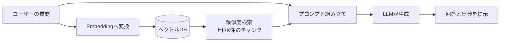
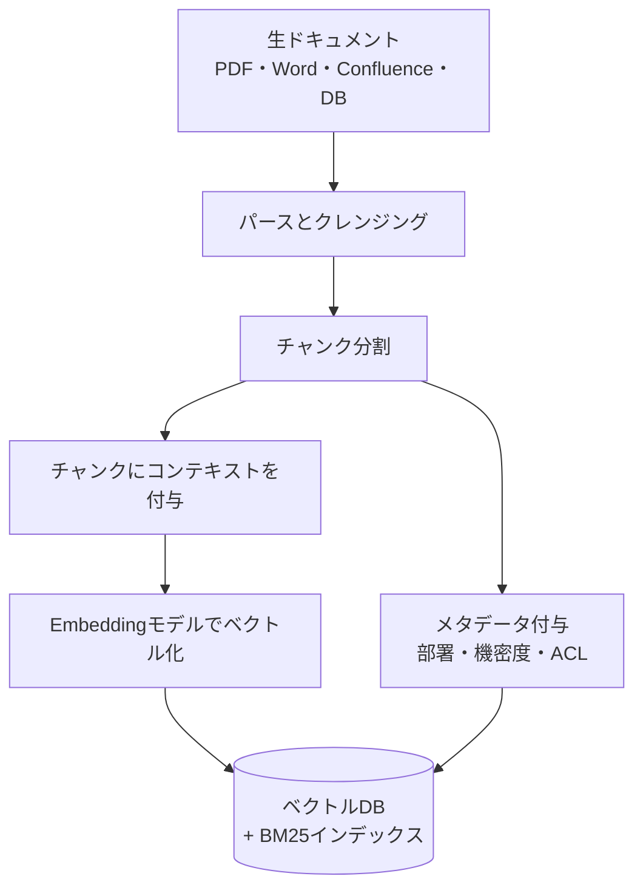
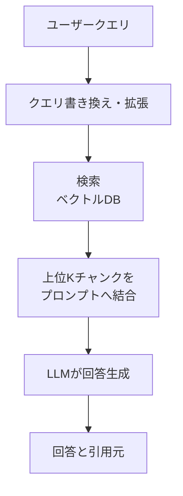
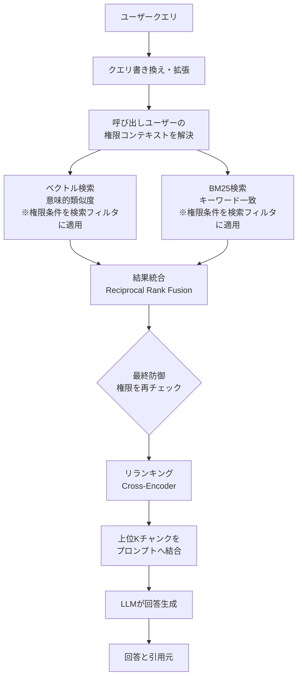
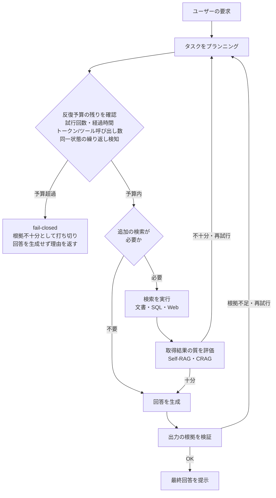
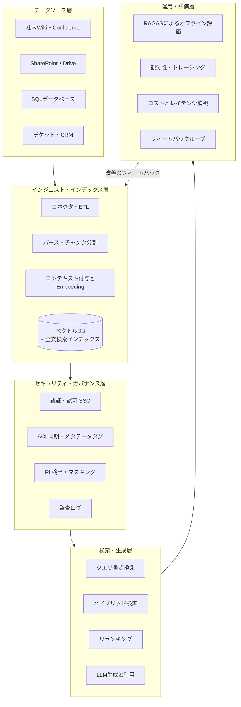

# エンタープライズRAG完全ガイド：初学者のためのステップバイステップ解説

> **対象読者**：RAG（Retrieval-Augmented Generation）という言葉は聞いたことがあるが、企業システムとして本番稼働させる際に何が必要になるのか体系的に理解したいエンジニア・アーキテクト志望者
> **前提知識**：LLM（大規模言語モデル）の基本的な仕組みを知っていること（詳しいプログラミング経験は不要）
> **情報基準日**：2026年9月10日時点の公開情報をもとに構成しています。RAGは変化の速い分野のため、実装前に一次情報（公式ドキュメント）を必ず確認してください。

---

## 目次

1. [Part 1: RAGの基礎を理解する](#part-1-ragの基礎を理解する)
   - [Step 1. なぜ企業にRAGが必要なのか](#step-1-なぜ企業にragが必要なのか)
   - [Step 2. RAGを支える2つのパイプライン](#step-2-ragを支える2つのパイプライン)
2. [Part 2: エンタープライズRAGを支える主要技術](#part-2-エンタープライズragを支える主要技術)
   - [Step 3. ドキュメントの前処理とチャンキング戦略](#step-3-ドキュメントの前処理とチャンキング戦略)
   - [Step 4. Embeddingとベクトルデータベースの選定](#step-4-embeddingとベクトルデータベースの選定)
   - [Step 5. 検索精度を高める：ハイブリッド検索とコンテキスト検索](#step-5-検索精度を高めるハイブリッド検索とコンテキスト検索)
   - [Step 6. リランキングでノイズを除去する](#step-6-リランキングでノイズを除去する)
   - [Step 7. GraphRAG：構造化された関係性を活用する](#step-7-graphrag構造化された関係性を活用する)
   - [Step 8. エージェント型RAG（Agentic RAG）](#step-8-エージェント型ragagentic-rag)
3. [Part 3: エンタープライズ特有の要件](#part-3-エンタープライズ特有の要件)
   - [Step 9. セキュリティとアクセス制御](#step-9-セキュリティとアクセス制御)
   - [Step 10. 評価とモニタリング](#step-10-評価とモニタリング)
   - [Step 11. 本番運用：スケーリングと継続的改善](#step-11-本番運用スケーリングと継続的改善)
4. [Part 4: まとめ](#part-4-まとめ)
   - [エンタープライズRAG 全体アーキテクチャ](#エンタープライズrag-全体アーキテクチャ)
   - [よくある落とし穴とベストプラクティス](#よくある落とし穴とベストプラクティス)
   - [さらに学ぶために](#さらに学ぶために)
   - [参考ソース一覧](#参考ソース一覧)

---

## Part 1: RAGの基礎を理解する

### Step 1. なぜ企業にRAGが必要なのか

LLMは膨大なテキストで事前学習されていますが、次の3つの弱点を抱えています。

- **知識が古い**：学習データのカットオフ以降の出来事や、社内の最新情報を知らない
- **社外秘の情報を知らない**：社内Wiki、契約書、顧客データベースなどは学習データに含まれていない
- **幻覚（ハルシネーション）を起こす**：知らないことでも、もっともらしい嘘の回答を生成してしまう

これらの弱点を解消するために、企業がLLMに独自データを持たせる方法は大きく3つあります。

| アプローチ | 概要 | 向いているケース | 弱点 |
|---|---|---|---|
| **プロンプトに全部詰め込む（Long Context）** | 関連文書をまるごとプロンプトに入れる | 知識ベースが小さい（目安：利用するモデルのコンテキスト上限に収まること。例えばAnthropicは20万トークン未満を目安として挙げている） | 知識ベースが大きくなるとコスト・レイテンシが跳ね上がる |
| **ファインチューニング** | モデルの重みを独自データで再学習する | 話し方・フォーマットなど「振る舞い」を変えたい場合 | 知識の更新に再学習が必要でコストが高く、出典を明示できない |
| **RAG（検索拡張生成）** | 質問ごとに外部知識ベースを検索し、関連情報をプロンプトに動的に追加する | 知識ベースが大きく頻繁に更新される、出典の提示が必要 | 検索パイプライン全体の設計・運用コストがかかる |

Anthropicの公式ガイダンスでも、知識ベースが20万トークン未満に収まる場合は無理にRAGを組まず、[プロンプトキャッシュ](https://docs.anthropic.com/en/docs/build-with-claude/prompt-caching)を使って全文をコンテキストに入れる方がシンプルで効果的だとされています。この閾値はプロバイダと対象モデルのコンテキスト上限に依存するため、実際に採用するモデルの上限を超えないことを必ず確認してください。知識ベースがスケールしてきた段階で、初めてRAGが本当に必要になります。

#### RAGの基本的な流れ（Naive RAG）

まずは最もシンプルなRAGの全体像を掴みましょう。



これが「Naive RAG」と呼ばれる最小構成です。企業向けRAG（エンタープライズRAG）は、この基本形に **セキュリティ・精度・信頼性・運用性** を積み上げていくものだと理解してください。Manning社から出版されている書籍『[Enterprise RAG](https://www.manning.com/books/enterprise-rag)』（著者 Tyler Suard、Fortune 500企業でのRAG開発経験をもとに執筆）でも、単純なデモとして動くRAGと、実運用に耐えるRAGの間には大きなギャップがあると強調されています。

---

### Step 2. RAGを支える2つのパイプライン

本番のRAGシステムは、実は2つの独立したパイプラインで構成されています。

1. **インデックスパイプライン（オフライン・バッチ処理）**：ドキュメントの取り込み〜ベクトル化までを、データ更新のたびに実行
2. **クエリパイプライン（オンライン・リアルタイム処理）**：ユーザーの質問が来るたびに、厳しいレイテンシ制約の中で検索〜生成までを実行

#### インデックスパイプライン



ここで手を抜くと、後工程でどれだけ良いLLMを使っても精度は上がりません。実際、業界のコンサルティングブログでは、パイロット導入がうまくいかない原因の多くはチャンキング・Embedding・評価基盤の欠如に集約されると指摘されています。「Garbage In, Garbage Out」―ソースデータの品質がRAG全体の品質の上限を決めるという原則は、エンタープライズRAGにおいて特に重要です。

#### クエリパイプライン（基本形）



この2つのパイプラインを意識して設計することが、エンタープライズRAGの第一歩です。以降のStepでは、それぞれの矢印の中身を具体的に深掘りしていきます。

---

## Part 2: エンタープライズRAGを支える主要技術

### Step 3. ドキュメントの前処理とチャンキング戦略

ドキュメントをそのままEmbeddingモデルに渡すことはできません。Embeddingモデルには入力できるトークン数の上限（コンテキストウィンドウ）があり、また検索の粒度を細かくするためにも、ドキュメントを「チャンク」と呼ばれる小さな単位に分割する必要があります。

チャンクが大きすぎると無関係な情報が混ざって検索精度が落ち、小さすぎると文脈が失われます。ベクトルDBを提供するPineconeの公式ラーニングセンターでは、この2つの制約のバランスを取ることがチャンキング設計の核心だと説明されています。

| 手法 | 概要 | 長所 | 短所 |
|---|---|---|---|
| **固定長分割（Fixed-size）** | 文字数・トークン数で機械的に分割 | 実装が簡単、高速 | 文の途中で切れて文脈が壊れやすい |
| **再帰的分割（Recursive Character）** | 段落→文→単語の順に区切り文字を優先して分割 | 自然な境界を保ちやすい、LangChain等の標準実装 | チャンクサイズにばらつきが出る |
| **セマンティックチャンキング** | 文同士のEmbedding類似度が下がる箇所で分割 | 意味的なまとまりを保持できる | 計算コストが高い |
| **階層的チャンキング（親子・要約付与）** | 小さいチャンクに、親文書の要約やタイトルをメタデータとして注入 | 局所的な精度と全体文脈を両立 | インデックス構造がやや複雑になる |
| **レイトチャンキング（Late Chunking）** | 文書全体を長文対応Embeddingモデルに通してから、チャンク単位でベクトルを切り出す | 文書全体の文脈を保持したままチャンク化できる | 長文対応の埋め込みモデルが必要 |

複数の実務系ブログの計測では、チャンキング戦略の違いだけで検索再現率（Recall）に最大9ポイント程度の差が出ることが報告されており、多くのケースで「512〜1024トークン、オーバーラップ10〜20%程度」が実用的な出発点とされています。ただし最適値はドメインとクエリの性質に依存するため、自社データで実測することが欠かせません。

チャンキングの考え方をコードで示すと、次のようなイメージです（擬似コード）。

```python
from langchain_text_splitters import RecursiveCharacterTextSplitter

splitter = RecursiveCharacterTextSplitter(
    chunk_size=800,       # トークンではなく文字数換算の目安
    chunk_overlap=150,    # チャンク間の重なり（文脈の欠落を防ぐ）
    separators=["\n## ", "\n\n", "\n", "。", " ", ""],  # 末尾の "" は文字単位のフォールバック
)

chunks = splitter.split_text(document_text)
```

LlamaIndexの共同創業者・CEOであるJerry Liu氏も、RAGを本番運用する際の重要な観点として、ユースケースごとにチャンクサイズを変える必要があること（要約タスクは全チャンクが必要、Q&Aタスクは特定チャンクだけで良い）、そしてドキュメントの要約をメタデータとして小さいチャンクに注入する「階層的チャンキング」が有効であることを繰り返し発信しています。

---

### Step 4. Embeddingとベクトルデータベースの選定

チャンクをベクトル化する「Embeddingモデル」と、そのベクトルを保存・検索する「ベクトルデータベース」の組み合わせが検索性能の土台になります。

#### Embeddingモデルの選び方

- **汎用用途**：OpenAIの`text-embedding-3-large`のような汎用モデルが安全な選択肢としてよく使われます
- **ドメイン特化**：法務・金融など専門用語が多い領域では、Voyage AIのようなドメイン特化型Embeddingが汎用モデルを上回るという報告があります
- **Anthropicの検証**：Anthropicが独自に行ったRAG精度検証では、テストしたモデルの中でVoyageとGoogle Geminiの埋め込みが特に高い性能を示したと報告されています

#### ベクトルデータベースの選定基準

「唯一絶対の正解」はなく、既存インフラ・運用体制・スケールによって最適解が変わります。

| データベース | 特徴 | 向いているケース |
|---|---|---|
| **Pinecone** | フルマネージド、運用負荷が低い | 運用チームを増やさずに素早く始めたい場合 |
| **Weaviate** | フルマネージド/セルフホスト両対応、ハイブリッド検索が標準搭載 | ベクトル検索とキーワード検索を同一基盤で扱いたい場合 |
| **Qdrant** | セルフホストに強く、低レイテンシ | インフラを自社管理しつつ高速な検索が必要な場合 |
| **Milvus** | 大規模分散処理に強いOSS | 数十億ベクトル規模の大規模運用 |
| **pgvector（PostgreSQL拡張）** | 既存のPostgreSQL資産を流用可能 | 中規模データで新しいミドルウェアを増やしたくない場合 |
| **Elasticsearch / Vespa** | 全文検索とベクトル検索を同一インデックスで統合 | キーワード検索基盤が既にElastic系の場合 |

中規模のエンタープライズRAGであれば、pgvectorやQdrantで要件の大部分をカバーできるという実務者の見解もあります。重要なのは「流行っているから」ではなく、既存のデータ基盤・チームのスキルセット・コンプライアンス要件（自社ホストが必須か等）から逆算して選ぶことです。

---

### Step 5. 検索精度を高める：ハイブリッド検索とコンテキスト検索

#### ハイブリッド検索（Embedding + BM25）

Embeddingによる意味検索は「言い換え」に強い一方、`エラーコード TS-999`のような固有の識別子・型番の完全一致検索は苦手です。そこで、古典的なキーワード検索アルゴリズムである**BM25**（TF-IDFを改良したランキング関数）を組み合わせるのが2026年時点のデファクトスタンダードです。

1. 文書をチャンクに分割する
2. 各チャンクについて、TF-IDFベースのスコアとEmbeddingベクトルの両方を作成する
3. BM25で完全一致に強い候補を、Embeddingで意味的に近い候補をそれぞれ取得する
4. 両者の結果をReciprocal Rank Fusion（RRF）などの手法で統合・重複排除する
5. 上位K件をLLMのプロンプトに追加する

#### Anthropicの「コンテキスト検索（Contextual Retrieval）」

Anthropicは2024年9月に、チャンク分割によって文脈が失われる問題を解決する手法として「Contextual Retrieval」を公式発表しました。これはエンタープライズRAGの検索精度改善策として最も引用されている事例の一つです。

考え方はシンプルです。通常のチャンクには元の文書のどの部分かという情報がありません。例えば以下のチャンクだけでは、どの企業のどの四半期の話か分かりません。

```python
original_chunk = "同社の売上高は前四半期比3%増加した。"

# コンテキスト検索では、埋め込み・BM25インデックス作成の前に
# チャンク特有の説明文を付加する
contextualized_chunk = (
    "このチャンクは、ACME社の2023年第2四半期の業績に関するSEC提出資料からの抜粋であり、"
    "前四半期の売上高は3億1,400万ドルであった。"
    "同社の売上高は前四半期比3%増加した。"
)
```

この「文脈の要約」を、文書全体を渡した状態でLLM（Anthropicの実験ではClaude 3 Haiku）に生成させ、Embeddingおよび BM25インデックスの作成前にチャンクへ付加します。Anthropicの公開実験結果では次のような改善が確認されています。

| 手法 | 検索失敗率（Top-20） | ベースラインからの改善率 |
|---|---|---|
| ベースライン（Embedding + BM25のみ） | 5.7% | ― |
| コンテキスト付きEmbedding | 3.7% | 約35%削減 |
| コンテキスト付きEmbedding + コンテキスト付きBM25 | 2.9% | 約49%削減 |
| 上記 + リランキング | 1.9% | 約67%削減 |

また、Claudeのプロンプトキャッシュ機能を使うことで、文書全体を毎回チャンクごとに渡す必要がなくなり、コンテキスト検索の前処理コストは100万トークンあたり約1.02ドル程度まで抑えられると報告されています。プロンプトキャッシュ自体もレイテンシを2倍以上、コストを最大90%削減する効果があるとされ、エンタープライズ規模でRAGの前処理コストを現実的な水準に抑える鍵になっています。

---

### Step 6. リランキングでノイズを除去する

初期検索（ベクトル検索＋BM25）は、数十〜数百件の候補チャンクを高速だが粗い精度で取得します。ここに**リランキングモデル（Cross-Encoderやクラウド型Rerank API）**を挟むことで、クエリとチャンクの関連性をより精密にスコアリングし、本当に必要な上位数件だけをLLMに渡すことができます。

Anthropicの実験では、上位150件を初期検索で取得し、Cohereのリランカーで上位20件に絞り込むことで、先述の通り検索失敗率が67%削減されるという結果が出ています。リランキングは精度を上げる一方でレイテンシと追加コストを伴うため、「どれだけの候補をリランクするか」はユースケースごとにトレードオフを検証すべきポイントです。

ここまでの技術を組み込んだ、より現実的なクエリパイプラインは次のようになります。



権限条件は**各検索処理（ベクトル検索・BM25検索）のフィルタとして適用**し、未認可の候補がRRFの統合対象に入らないようにします。統合後の「最終防御」はあくまで多層防御の最後の砦であり、ここだけに頼る設計にはしません。詳細はStep 9で解説します。

---

### Step 7. GraphRAG：構造化された関係性を活用する

ベクトル検索は「意味の近さ」に基づく検索に強い一方、「AとBはどう関連しているか」「複数の文書をまたいだ多段階の推論」が必要なクエリには弱いという弱点があります。これを補うのが、Microsoft Researchが2024年に提案した**GraphRAG**です。

GraphRAGでは、ドキュメント群からLLMを使ってエンティティ（人物・組織・製品など）と関係性を抽出し、ナレッジグラフを構築します。検索時はベクトル類似度ではなく、クエリに関連するエンティティを起点にグラフをたどり（グラフトラバーサル）、関連するサブグラフをコンテキストとして組み立てます。

| 方式 | 得意なクエリ | 弱点 |
|---|---|---|
| **ベクトルRAG** | 単発の事実質問（例：「〇〇の定義は？」） | 複数文書にまたがる関係性の推論 |
| **GraphRAG** | 関係性をたどる複雑な質問（例：「A社とB社が関わったプロジェクトの影響範囲は？」）、複数文書の要約 | グラフ構築のコストと、元データの品質への依存度が高い |
| **ハイブリッド（Vector + Graph）** | 上記両方をカバー | アーキテクチャの複雑さが増す |

Microsoft Researchは、GraphRAGが複雑な複数文書の要約タスクにおいてベースラインのRAGよりも包括性の高い回答を生成できたと報告しています。また、グラフ拡張型の検索は複数ホップにまたがる質問応答において、ベクトルのみの手法と比べて事実誤りを大きく減らせるという学術研究（Stanford大学によるナレッジ集約型NLPの研究）も存在します。ただし、GraphRAGはグラフ構築・保守のコストが高く、メタデータのガバナンスが不十分な組織では効果が出にくいことにも注意が必要です。「何でもGraphRAGにする」のではなく、関係性推論が本当に必要なユースケースに絞って導入するのが現実的です。

---

### Step 8. エージェント型RAG（Agentic RAG）

これまでの検索は「1回検索して1回生成する」という固定的な流れでした。しかし複雑な業務質問では、1回の検索だけでは不十分なことがよくあります。そこで2025年以降、検索そのものをLLMエージェントに動的に判断させる**エージェント型RAG（Agentic RAG）**が主流になりつつあります。

代表的な手法は次の2つです。

- **Self-RAG**：モデル自身が「この検索結果は関連しているか（IsREL）」「生成内容は根拠に支えられているか（IsSUP）」「その回答は有用か（IsUSE）」といった内部トークンで自己評価しながら、必要に応じて再検索や再生成を行う手法
- **Corrective RAG（CRAG）**：軽量な評価モデルが取得した文書の品質を判定し、品質が低い場合は追加のWeb検索を行うなど、状況に応じた修正アクションを取る手法

LangChainの共同創業者兼CEOであるHarrison Chase氏も、エンタープライズにおけるLLM導入の最大の障壁は「信頼」であり、RAGは回答を自社の検証済み文書に紐付けることでその信頼のギャップを埋めると位置づけています。エージェント型のアーキテクチャは、この「信頼できる回答」を単発の検索ではなく、検索と自己検証のループによって担保しようとする発展形だと言えます。



再試行の経路（評価が不十分な場合・根拠検証に失敗した場合）は、いずれも必ずプランニング直後の**反復予算チェック**を通ります。反復回数・経過時間・トークンやツール呼び出しの上限、あるいは同一クエリ・同一検索結果の繰り返し検知のいずれかに達したら、無限に再検索を続けるのではなく**fail-closed**（「十分な根拠が得られなかった」という結果を返して終了）します。根拠が揃った場合の通常経路だけが最終回答に到達します。

先述のManning『Enterprise RAG』も、エージェントベースの検索・クエリの書き換え・「トリアージロジック」（質問の種類に応じて検索先を振り分ける仕組み）を実務的なテーマとして扱っており、エンタープライズRAGの実装が単純なベクトル検索だけでは完結しないことを裏付けています。特筆すべきは、この書籍がSQLデータベースに対するRAG（構造化データへの自然言語質問応答）も扱っている点です。企業のデータの多くは非構造化文書だけでなく、RDBに保管されているため、自然言語をSQLクエリに変換する「Text-to-SQL」的なアプローチも、エンタープライズRAGの重要な一部門として押さえておくとよいでしょう。

ただしText-to-SQLは、LLMが生成した文字列をそのままデータベースに流す構造であるため、**実行境界を明示的に設計しない限り本番投入してはいけません**。最低限、次を要件として固定します。

- **読み取り専用接続**で実行し、DDL（CREATE/DROP/ALTER）とDML（INSERT/UPDATE/DELETE）は接続レベルで拒否する
- 参照可能な**スキーマ・テーブル・カラムを許可リスト**で限定し、リスト外への参照はクエリを実行せず却下する
- 値は**パラメータ化**して埋め込み、文字列連結でクエリを組み立てない
- **テナント単位・ユーザー単位の行レベル認可**（RLS等）をデータベース側で強制し、アプリ側の条件付与だけに依存しない
- **返却行数の上限**と**クエリタイムアウト**を設定し、コストと情報漏洩の影響範囲を限定する

さらに重要なのは、**ユーザー入力や取得した文書に紛れ込んだ指示によって、許可されていないデータの参照や更新が実行されないこと**です。生成されたSQLは「LLMの出力＝未信頼データ」として扱い、実行前に上記の境界に照らして検証してから実行します。

---

## Part 3: エンタープライズ特有の要件

### Step 9. セキュリティとアクセス制御

個人向けのRAGプロトタイプと企業向けRAGの最大の違いがここにあります。OWASP（Open Web Application Security Project）は2025年以降、RAG専用のセキュリティチートシートを公開しており、その中で最も多い設定ミスとして「ドキュメントレベルの権限が、取り込み時にはチェックされるが、検索時にはチェックされない」ケースを挙げています。この場合、ある部署にしかアクセス権のない文書のチャンクを、別部署のユーザーが検索結果として受け取ってしまう可能性があります。

エンタープライズRAGで最低限考慮すべきセキュリティレイヤーは次の通りです。

- **検索時アクセス制御（Retrieval-time RBAC/ABAC）**：類似度検索を実行する際、必ずクエリを発行したユーザーの権限でフィルタリングする。元システム（SharePoint、Confluence等）のACLをベクトルDBのメタデータへ同期し続ける仕組みが必要
- **マルチテナント分離**：SaaS型で複数テナントを扱う場合、テナントIDをメタデータとインデックスのネームスペース両方に埋め込み、テナントをまたいだ漏洩を防ぐ
- **プロンプトインジェクション対策**：取得した文書は常に**未信頼データ**として扱い、システムプロンプト・ユーザー入力とは明確に区切ったうえでプロンプトへ渡す。そのうえで、①入力と検索コンテキストを検査して既知の攻撃パターンを検出する、②LLMの出力とツール呼び出しの引数を検証する、③呼び出してよいツールの許可リストと実行ユーザーの権限を**モデルの判断とは独立に**アプリケーション側で確認する、④送信・更新・決済などの高リスク操作には人間の明示的な承認を要求する、⑤いずれかの検査に失敗した場合は続行せず**fail-closed**で停止する、という多層の防御を組む。なお、**プロンプト上でロールを分離するだけでは取得文書内に埋め込まれた指示を防げません**（モデルは区切りを無視しうる）。分離は前提であって対策の完成形ではない点に注意する
- **出力フィルタリングとDLP（データ漏洩防止）**：LLMの出力をそのまま信頼せず、個人情報や機密情報が意図せず含まれていないかを配信前にチェックする
- **監査ログ**：誰が・いつ・どの文書に基づいて・どんな回答を得たかを追跡できるようにし、コンプライアンス要件（金融・医療・法務など）に対応する

これらは「後から足す」ものではなく、インデックスパイプラインの設計段階から組み込む必要があります。Step 2の図で示した「メタデータ付与（部署・機密度・ACL）」のステップが、このセキュリティレイヤーの土台になります。

---

### Step 10. 評価とモニタリング

「なんとなく良さそう」を「定量的に良い」に変えるのが評価（Evaluation）です。RAGは検索と生成という2つの異なる性質のコンポーネントで構成されるため、評価も両方の軸で行う必要があります。

#### RAGAS：代表的な評価フレームワーク

オープンソースの評価フレームワーク**RAGAS**（Retrieval Augmented Generation Assessment）は、次の4つの指標を中心にRAGパイプラインの品質を測定します。

| 指標 | 何を測るか | 対応する工程 |
|---|---|---|
| **Faithfulness（忠実性）** | 生成された回答の主張が、取得したコンテキストからどれだけ裏付けられるか | 生成 |
| **Answer Relevancy（回答関連性）** | 生成された回答が、質問の意図にどれだけ合致しているか | 生成 |
| **Context Precision（コンテキスト精度）** | 取得したコンテキストのうち、実際に回答生成に関連していた割合 | 検索 |
| **Context Recall（コンテキスト再現率）** | 回答に必要な情報のうち、どれだけ検索で取得できていたか | 検索 |

FaithfulnessとAnswer Relevancyが低い場合は生成（プロンプト設計やLLM選定）に、Context PrecisionとContext Recallが低い場合は検索（チャンキングやEmbedding、検索アルゴリズム）に問題があると切り分けられるのが、この4指標セットの実務上の価値です。

#### 7つの代表的な失敗パターン

RAGの失敗事例を体系的に整理した学術研究として、Barnett氏ら（Deakin University、2024年）による "Seven Failure Points When Engineering a Retrieval Augmented Generation System" があります。研究・教育・生物医学の3分野での実運用事例を分析し、次の7つの失敗パターンを提示しています。

| # | 失敗パターン | 内容 |
|---|---|---|
| 1 | **Missing Content（内容の欠如）** | そもそも知識ベースに答えとなる情報が存在しない |
| 2 | **Missed the Top Ranked Documents（上位に来ない）** | 答えを含む文書は存在するが、検索の上位K件に入らない |
| 3 | **Not in Context（コンテキストからの脱落）** | 候補が多すぎて、重要なチャンクがプロンプト構築時に切り捨てられる |
| 4 | **Not Extracted（抽出失敗）** | コンテキストに答えはあるが、ノイズや矛盾する情報のせいでLLMが正しく抽出できない |
| 5 | **Wrong Format（フォーマット誤り）** | 内容は合っているが、指定された形式（JSON等）で出力されない |
| 6 | **Incorrect Specificity（粒度の誤り）** | 回答が曖昧すぎる、または逆に具体的すぎて質問の意図とズレている |
| 7 | **Incomplete（回答の不完全さ）** | 部分的には合っているが、必要な情報の一部が抜け落ちている |

この論文の重要な結論の一つは、「RAGシステムの堅牢性は最初から設計しきれるものではなく、実運用を通じて進化させていくものである」という点です。つまり評価とモニタリングは一度作って終わりではなく、継続的なプロセスとして組み込む必要があります。

#### 観測性（Observability）とコスト管理

本番運用フェーズでは、LangSmith・Arize AIのようなLLMOps系のツールを使い、各クエリがどのチャンクを取得し、どのプロンプトでLLMを呼び出し、どんな回答を返したかをトレースできるようにするのが一般的です。LangChainのLangSmithはオフライン評価（人手レビュー、LLM-as-judge、CI/CDへの組み込み）とオンライン評価（複数ターンにわたる会話全体のタスク達成度評価）の両方をサポートしていると案内されています。

ただし、これらのトレースには**プロンプト・取得チャンク・生成された回答という機密性の高いデータがそのまま蓄積される**点に注意が必要です。Step 9で述べた「回答配信前のDLP」とは別に、**トレース保存時の保護要件**として次を定めておきます。

- **保存前のマスキング**：個人情報（PII）やAPIキー等の秘密情報は、トレースストアへ送信する前にマスキング・匿名化する
- **テナント単位のアクセス制御**：トレースの閲覧権限をテナント／プロジェクト単位で分離し、運用者が他テナントのトレースを閲覧できないようにする
- **保持期間（リテンション）**：トレースを無期限に保持せず、用途に応じた保持期間と自動削除を設定する
- **暗号化**：転送時（TLS）と保存時（at-rest）の暗号化、および鍵管理の方針を明示する

コスト面では、リランキングやコンテキスト検索のようにLLM呼び出しを追加する手法ほど精度は上がりやすい一方でコスト・レイテンシも増えるため、「どこまでの精度向上に、どこまでのコストをかけるか」をKPIとして事前に合意しておくことが重要です。

---

### Step 11. 本番運用：スケーリングと継続的改善

エンタープライズRAGを安全に本番展開するための典型的な進め方は、次のような段階を踏みます。

1. **ユースケースを絞り込む**：全社的な「何でも答えるAI」から始めず、特定の部署・業務に対象を絞る
2. **インデックスパイプラインを構築する**：Step 2〜4の内容に基づき、データソースごとのコネクタとチャンキング戦略を確定する
3. **検索品質を計測する**：RAGASなどのオフライン評価セットを作成し、ベースラインのスコアを取得する
4. **ガードレールを追加する**：Step 9のセキュリティ要件とStep 10の評価基盤を組み込む
5. **限定ユーザーでパイロット運用する**：フィードバックを収集し、失敗パターン（Step 10の7分類）を分析する
6. **キャッシュを認可コンテキストごとに分離する**：レスポンスキャッシュと検索キャッシュのキーには、テナントIDに加えて**有効な認可コンテキスト（ユーザーIDまたは権限バージョン）**を必ず含め、権限の異なる利用者の間でキャッシュが再利用されないようにする。あわせて、**ソースの更新・削除時**と**権限変更時**には該当するキャッシュを無効化する
7. **段階的にロールアウトする**：モデルルーティング、レート制限などを整備し、上記のキャッシュ分離と無効化が機能していることを確認したうえで、SLO（サービス品質目標）を定めて全社展開する

また、データソースは一度取り込んだら終わりではなく、継続的に更新されます。ロバストなデータパイプラインは、データを一度だけロードする場合よりも、ソースデータが常に変化し続ける本番環境でこそ重要になるとLlamaIndexのコミュニティでも指摘されています。増分更新（差分だけを再インデックスする仕組み）は、地味ですが本番運用で最も事故が起きやすいポイントの一つです。

とりわけ注意が必要なのは、**文書の削除・権限変更・有効期限切れを、ベクトルDBだけに反映して終わりにしないこと**です。RAGパイプラインは元文書から多くの派生データを作るため、更新・削除フローは次のすべてに伝播させ、古い内容や古い権限が残らないようにします。

| 派生データ | 削除・権限変更・失効時に必要な処理 |
|---|---|
| ベクトルDB | 該当チャンクのベクトルとメタデータ（ACL含む）を削除または更新 |
| BM25／全文検索インデックス | 該当文書のポスティングを削除または再インデックス |
| Embedding（再計算用の中間成果物・キャッシュ） | 該当チャンクの埋め込みを破棄し、再利用されないようにする |
| GraphRAGのナレッジグラフ | 該当文書由来のエンティティ・関係（エッジ）とコミュニティ要約を無効化・再構築 |
| レスポンスキャッシュ／検索キャッシュ | 該当文書を根拠に含むエントリを失効させる（Step 11-6の認可コンテキスト単位の分離と併用） |

いずれか一つでも取り残すと、「ベクトルDBからは消えているのにBM25検索で出てくる」「権限を剥奪したユーザーにキャッシュ経由で回答が返る」といった、検知が難しい漏洩が発生します。

---

## Part 4: まとめ

### エンタープライズRAG 全体アーキテクチャ

最後に、ここまで解説してきた要素を統合した、エンタープライズRAGの全体アーキテクチャ図を示します。



この図の各層が、本ガイドのStep 1〜11で解説してきた内容にそれぞれ対応しています。データソース層とインジェスト層がStep 2〜4、セキュリティ・ガバナンス層がStep 9、検索・生成層がStep 5〜8、運用・評価層がStep 10〜11に相当します。

### よくある落とし穴とベストプラクティス

| 落とし穴 | ベストプラクティス |
|---|---|
| デモでは動くが本番では精度が出ない | 最初から評価セット（RAGAS等）を用意し、変更のたびに定量比較する |
| チャンクサイズを一度決めたら固定してしまう | ユースケース（要約 vs Q&A）ごとにチャンク戦略を変える、自社データで実測する |
| ベクトル検索だけに頼る | BM25とのハイブリッド検索、必要に応じてリランキングを併用する |
| セキュリティを後回しにする | インデックス設計の初期段階からACLメタデータと検索時フィルタリングを組み込む |
| 一度きりのデータ取り込みで満足する | 増分更新・削除反映を含む継続的なデータパイプラインを構築する |
| 精度改善のためにコストを無制限に積み増す | リランキングやコンテキスト検索など各手法のコスト対効果をKPIとして管理する |
| すべてをGraphRAG・エージェント型にしてしまう | 関係性推論や多段階検索が本当に必要なユースケースに絞って高度化する |

### さらに学ぶために

体系的にハンズオンで学びたい場合は、本ガイドの構成の参考にもした書籍『[Enterprise RAG](https://www.manning.com/books/enterprise-rag)』（Tyler Suard著、Manning Publications、Fortune 500企業でのRAG開発経験をもとに執筆）が、スケーラブルなRAGシステムの構築、SQLデータベースに対するRAG、ハルシネーション防止、監視・スケーリング・保守、コスト効率の良いクラウド活用まで、エンタープライズRAGを実務目線で扱っています。本稿執筆時点ではMEAP（Manning Early Access Program）として執筆中の書籍で、全10章中6章が公開されています。

### 参考ソース一覧

本ガイドの作成にあたり参照した主要なソースです。実装の際は、必ず最新の一次情報をご確認ください。

- Manning Publications「Enterprise RAG」（Tyler Suard著）: https://www.manning.com/books/enterprise-rag
- Anthropic Engineering Blog「Introducing Contextual Retrieval」: https://www.anthropic.com/engineering/contextual-retrieval
- Anthropic「Prompt caching」ドキュメント: https://docs.anthropic.com/en/docs/build-with-claude/prompt-caching
- Microsoft Research「GraphRAG: Unlocking LLM discovery on narrative private data」: https://www.microsoft.com/en-us/research/blog/graphrag-unlocking-llm-discovery-on-narrative-private-data/
- Pinecone Learning Center「Retrieval-Augmented Generation (RAG)」: https://www.pinecone.io/learn/retrieval-augmented-generation/
- Pinecone Learning Center「Chunking Strategies for LLM Applications」: https://www.pinecone.io/learn/chunking-strategies/
- OWASP Cheat Sheet Series「RAG Security Cheat Sheet」: https://cheatsheetseries.owasp.org/cheatsheets/RAG_Security_Cheat_Sheet.html
- Barnett et al.「Seven Failure Points When Engineering a Retrieval Augmented Generation System」(arXiv, 2024): https://arxiv.org/abs/2401.05856
- RAGAS公式ドキュメント「List of available metrics」: https://docs.ragas.io/en/stable/concepts/metrics/available_metrics/
- LangChain Blog「LangChain Announces Enterprise Agentic AI Platform Built with NVIDIA」（Harrison Chase CEOコメント）: https://www.langchain.com/blog/nvidia-enterprise
- Jerry Liu（LlamaIndex CEO）LinkedIn投稿「Make RAG Production-Ready」: https://www.linkedin.com/posts/jerry-liu-64390071_llamaindex-webinar-make-rag-production-ready-activity-7098827023791398912-v9x8
- AWS Machine Learning Blog（Jerry Liu共著）「Build powerful RAG pipelines with LlamaIndex and Amazon Bedrock」: https://aws.amazon.com/blogs/machine-learning/build-powerful-rag-pipelines-with-llamaindex-and-amazon-bedrock/
- CSO Online「Securing RAG pipelines in enterprise SaaS」: https://www.csoonline.com/article/4163888/securing-rag-pipelines-in-enterprise-saas.html
- Lasting Dynamics「Enterprise RAG Architecture: A Perfect 2026 Guide」: https://www.lastingdynamics.com/blog/enterprise-rag-architecture-guide/
- Atlan「What Is GraphRAG? Architecture, Enterprise Use Cases」: https://atlan.com/know/what-is-graphrag/

---

*本ドキュメントは2026年9月10日時点のウェブ公開情報をもとに作成した学習用資料です。数値・ベンチマークは各ソース元の実験条件に依存するため、自社の環境・データで再検証することを推奨します。*
