# Claude Fable 5 実践活用ガイド(2026年7月16日改訂版)

### ― Claude Code エンジニアのための中級〜上級者向けベストプラクティス ―

> 対象読者: Claude Code を日常的に使っており、Opus / Sonnet 世代のプロンプト設計には慣れているが、Claude Fable 5 特有の挙動にまだ最適化できていないエンジニア向け。
> 本稿は2026年7月4日版ガイドを土台に、Anthropic公式ドキュメント(`platform.claude.com`・`code.claude.com`)と、Thariq Shihipar・Boris Cherny・Peter Steinberger・Addy Osmani・Andrew Ng・Simon Willisonら著名な開発者の発信を追加調査し、2026年7月16日時点の情報にブラッシュアップしたものです。Fable 5は現在進行形でアップデートされているモデルであり、価格・利用枠・分類器の挙動は今後も変わる可能性がある点に留意してください。

---

## 目次

1. [Claude Fable 5 とは何か](#1-claude-fable-5-とは何か)
2. [タイムライン: リリースから輸出規制、価格変更まで](#2-タイムライン-リリースから輸出規制価格変更まで)
3. [安全分類器と自動フォールバックの仕組み](#3-安全分類器と自動フォールバックの仕組み)
4. [プロンプティング思想の転換: チェックリストからゴールへ](#4-プロンプティング思想の転換-チェックリストからゴールへ)
5. [Effort(推論深度)レベルの使い方](#5-effort推論深度レベルの使い方)
6. [Claude Code での実践設定](#6-claude-code-での実践設定)
7. [Loop Engineering: 長時間自律ループの設計思想](#7-loop-engineering-長時間自律ループの設計思想)
8. [Thariq の「Unknowns フレームワーク」徹底解説](#8-thariq-のunknowns-フレームワーク徹底解説)
9. [検証ループとメモリシステムの設計](#9-検証ループとメモリシステムの設計)
10. [コスト管理とモデル選定フロー](#10-コスト管理とモデル選定フロー)
11. [よくある落とし穴(アンチパターン)](#11-よくある落とし穴アンチパターン)
12. [実力・ベンチマークと「検証必須」の理由](#12-実力ベンチマークと検証必須の理由)
13. [既知の制限事項](#13-既知の制限事項)
14. [まとめ](#14-まとめ)
15. [参考文献・ソースURL一覧](#15-参考文献ソースurl一覧)

---

## 1. Claude Fable 5 とは何か

Claude Fable 5 は、Anthropic が2026年6月9日に発表した「Claude 5」世代の最初のモデルで、Opus よりも上位に位置づけられる新しい「Mythos」クラスの一般提供版です。同時に発表された **Claude Mythos 5** は同一の基盤モデルを共有していますが、Fable 5 にのみ追加の安全分類器(セーフガード)が搭載されている点が異なります。Mythos 5 は "Project Glasswing" という信頼されたパートナー向けプログラムを通じてのみ限定提供されています。

Simon Willisonは発表当日、約5.5時間の検証を経て「a beast(野獣のようなモデル)」「big model smell(いかにも巨大モデルらしい振る舞い)」と評しており、自身のOSSプロジェクト一覧を尋ねる恒例のプロンプトでOpus 4.8よりも詳細な回答を引き出せたと報告しています。Andrej Karpathyは「メジャーバージョンが上がったと呼ぶにふさわしい、特に長時間の難しいタスクにおける質的な変化」と評した一方、同氏は安全分類器について「発売にしてはやや過敏(trigger happy)」とも指摘しています。

### 1.1 スペック概要

| 項目 | 内容 |
|---|---|
| モデルID | `claude-fable-5`(Mythos 5 は `claude-mythos-5`) |
| 位置づけ | Anthropicが一般提供する中で最も高性能なモデル。長時間・高難度・曖昧なタスク向け |
| コンテキストウィンドウ | 既定で100万トークン(Anthropic APIでは常時1M) |
| 最大出力トークン | リクエストあたり最大12.8万トークン |
| 価格(API) | 入力 $10 / 100万トークン、出力 $50 / 100万トークン(Opus 4.8のちょうど2倍) |
| 提供チャネル | Claude API、Claude Platform on AWS、Amazon Bedrock、Google Cloud、Microsoft Foundry、Claude Code、Claude.ai、Claude Cowork |
| Thinking(思考) | Adaptive Thinking のみ。オフ設定は不可。深さは `effort` パラメータで制御 |
| データ保持 | 30日間保持の「Covered Model」扱い。Zero Data Retention(ZDR)は非対応 |
| 知識カットオフ | 2026年1月頃(レビュー記事複数で言及) |

### 1.2 モデルファミリーの関係性

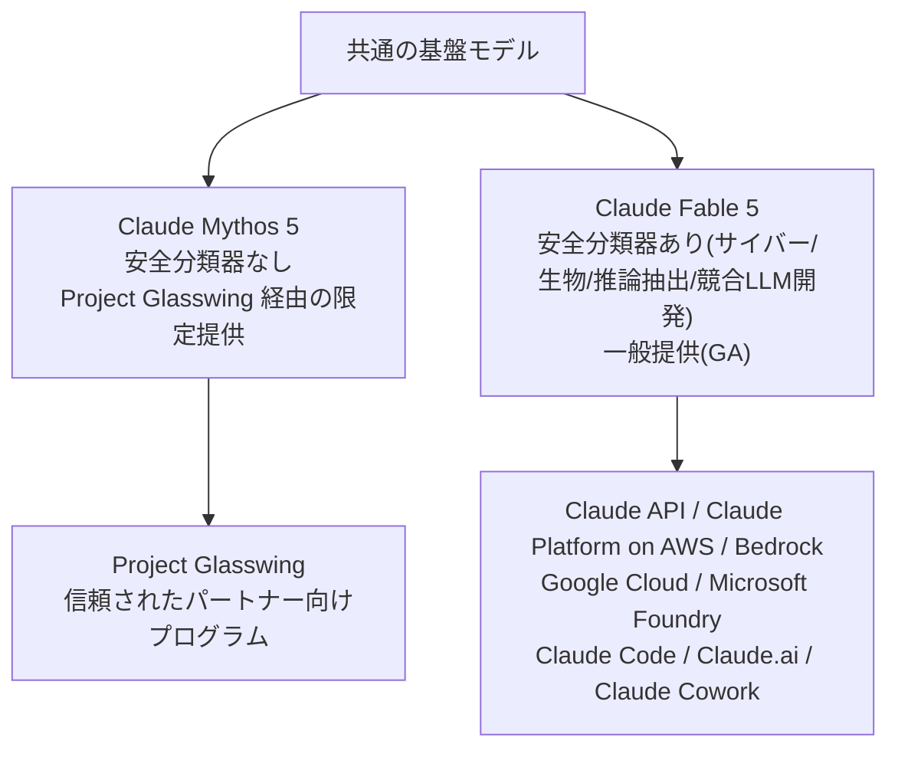

Fable 5 と Mythos 5 は「同じ頭脳、異なる安全装備」というイメージで捉えると理解しやすいです。

---

## 2. タイムライン: リリースから輸出規制、価格変更まで

Fable 5 は発表から1ヶ月あまりの間に、サービス停止・価格体系の変更という2つの大きな出来事を経験しています。プロンプト設計とは直接関係ありませんが、可用性設計(フォールバックの必要性)とコスト管理の両面で重要な背景です。

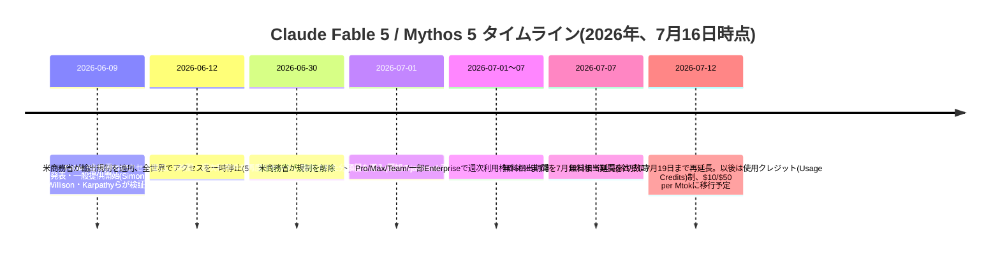

一時停止の経緯は、Amazon の研究者が Fable 5 の安全策を回避してソフトウェア脆弱性を特定できる手法を発見し報告したことがきっかけでした。Anthropic の検証では同様の脆弱性特定は Opus 4.8 や他社モデルでも可能であったとされていますが、米商務省産業安全保障局(BIS)は6月12日付で Fable 5・Mythos 5 に対する輸出管理措置を発動し、外国籍ユーザーを区別する即時的な手段がなかった Anthropic は全ユーザー向けにモデルを一時停止しました。この経緯についての公式声明は Anthropic のニュースページで確認できます(巻末の参考文献を参照)。

**2026年7月16日時点の実務上の要点**として、無料相当の利用枠は当初の7月7日締切から二度延長され、現在は7月19日までとなっています(この期限は今後さらに動く可能性があるため、`support.claude.com` の "Claude Fable 5 Promotional Access" 記事で最新状況を確認することを推奨します)。期限到来後は、Pro/Max/Team/一部Enterpriseプランでも Fable 5 の利用には別途「使用クレジット」を有効化する必要があり、有効化していない場合は週次枠を使い切った時点でFable 5へのアクセスが自動フォールバックなしに単純に停止する点に注意してください。

この一件は、実務上「Fable 5 に固定的に依存する設計は避け、フォールバック先(Opus 4.8 など)を必ず用意しておく」という教訓を残しました。3章で解説する自動フォールバック機構と、10章で解説するコスト管理は、まさにこの種のリスクに対する備えとしても機能します。

---

## 3. 安全分類器と自動フォールバックの仕組み

Fable 5 には、以下の4領域を対象とした安全分類器が組み込まれています(Anthropic公式ドキュメント「Refusals and fallback」で明記されている正式なカテゴリ名です)。

| `category` 値 | 内容 |
|---|---|
| `cyber` | 攻撃的なエクスプロイト・マルウェア開発などサイバー被害につながりうる要求。**善意のセキュリティ作業もこのカテゴリで検知されうる** |
| `bio` | 危険な実験手法など生物学的被害につながりうる要求。**有益なライフサイエンス研究もこのカテゴリで検知されうる** |
| `frontier_llm` | 競合AIモデルの開発を助ける要求。Anthropicの商用利用規約で制限されている領域。**良性の機械学習研究もこのカテゴリで検知されうる** |
| `reasoning_extraction` | モデルの内部推論をそのまま応答テキストとして再現・書き起こしさせようとする要求 |

該当すると判定されたリクエストは、API上では成功レスポンス(HTTP 200)として `stop_reason: "refusal"` が返ります。これはエラーではなく、`content` は空、出力前の拒否であれば課金もされません。

```json
{
  "id": "msg_01XFUDYJgAACzvnptvVoYEL",
  "type": "message",
  "stop_reason": "refusal",
  "stop_details": {
    "type": "refusal",
    "category": "cyber",
    "explanation": "This request was declined because it could enable cyber harm."
  },
  "usage": { "input_tokens": 412, "output_tokens": 0 }
}
```

Claude Code のようなハーネス上では、この拒否は自動的に Opus 4.8 へのフォールバックとして処理されます。Anthropic の公表によれば、**Fable 5 セッションの95%超はフォールバックが一切発生しない**とのことです。

### 3.1 リクエストのライフサイクル(Claude Code上での挙動)

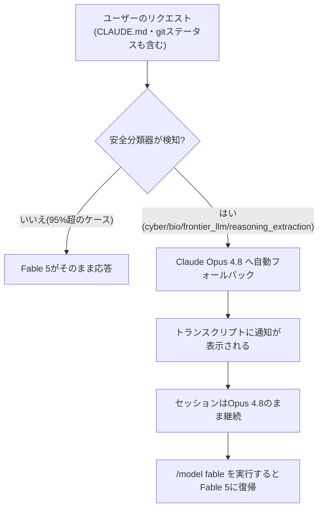

### 3.2 APIレベルでのフォールバック設計(自作ハーネス向け)

API上で自前のアプリケーションを構築している場合、フォールバックには3つの方式があります。

| 状況 | 使う方式 | 特徴 |
|---|---|---|
| Claude APIまたはClaude Platform on AWS、最もシンプルな構成 | **サーバーサイドフォールバック**(`fallbacks`パラメータ、beta header `server-side-fallback-2026-06-01`) | 1リクエスト・1レスポンスで完結。最大3モデルまで連鎖指定可 |
| 任意のプラットフォーム、TypeScript/Python/Go/Java/C# SDK利用 | **SDKミドルウェア**(`BetaRefusalFallbackMiddleware`) | クライアント側で一度設定すれば自動的にリトライ |
| Ruby/PHP/独自リトライロジック | 手動リトライ + `fallback-credit-2026-06-01` ヘッダー | キャッシュの二重課金を避けつつ完全な制御が可能 |

実務上の落とし穴として、Anthropic公式ドキュメントは以下を明記しています。

- **同一モデルへの再送は意味がない**: 拒否されたリクエストは必ずフォールバック先モデルに送る
- **リトライ予算はターン単位ではなくリクエスト単位で設計する**: サブエージェントを含む1ターンで複数回の拒否が起こりうる
- **サブエージェント呼び出しには個別にフォールバックを設定する**: `fallbacks`パラメータはツール実行内部のモデル呼び出しには伝播しない
- **拒否は成功レスポンス(HTTP 200)なので、5xxベースの監視では検知できない**: `stop_reason: "refusal"` を直接監視イベントとして計装すること

### 3.3 実務上の注意点(Claude Code)

- **初回リクエストだけで発火することがある**: フォールバックはユーザーの発言内容だけでなく、セッション開始時に一緒に送られる `CLAUDE.md` の内容や `git status`、ディレクトリ名などのワークスペース情報も判定対象に含みます。
- **トリガー源の切り分け**: `claude --safe-mode` で起動すると、`CLAUDE.md`・Skills・MCPサーバー・Hooksなどのカスタマイズを無効化してセッションを開始できます(gitステータスとディレクトリ名は無効化されません)。これにより、フォールバックの原因がカスタマイズ側にあるのか、リクエスト内容そのものにあるのかを切り分けられます。
- **セキュリティ研究・生物学系タスクは高頻度でフォールバックする**: ペネトレーションテストやCTF演習、生物学隣接のコードベースなどは、初回リクエストから頻繁にフォールバックが発生する「想定内の挙動」です。実質的な生物学研究では、ほぼ全リクエストが再ルーティングされると想定してください。Fable級の能力がどうしても必要な場合は、Anthropicの信頼されたアクセスプログラムへの相談が推奨されています。
- **自動切り替えを無効化し、都度確認する設定も可能**: `/config` から「switch models when a message is flagged」をオフにすると、フラグが立った際にセッションを一時停止し、Opusへの切り替えか、プロンプトを編集してFable 5のまま再試行するかを選べるようになります。モバイル版のClaude Code on the webでは編集・再試行はサポートされていません。
- **サードパーティ基盤(Bedrock/Vertex/Foundry)での自動フォールバック**: モデルIDがプロバイダ固有であるため、`ANTHROPIC_DEFAULT_FABLE_MODEL` と `ANTHROPIC_DEFAULT_OPUS_MODEL` を設定して、Claude CodeがどちらのモデルがFable 5/Opus 4.8であるかを認識できるようにする必要があります。いずれかが識別できない場合、自動フォールバックは行われず拒否メッセージがそのまま返ります。

---

## 4. プロンプティング思想の転換: チェックリストからゴールへ

これはFable 5を使いこなす上で最も重要な認識転換です。Anthropic公式の「Prompting Claude Fable 5」ガイドは、旧世代向けに書かれた作り込み過ぎた指示(過剰な手順列挙・網羅的な禁止事項・逐次的な確認要求など)が、Fable 5ではむしろ性能を落とす場合があると明記しています。

### 4.1 旧来のスタイル vs Fable 5向けのスタイル


Claude Codeチームの Thariq Shihipar(@trq212)も、Fable 5導入後のチーム内の働き方の変化を「以前は "Claude が正しく作業したか" を検証していたが、今は "そもそも正しい作業をしているか" を検証するようになった」という趣旨で表現しています。

### 4.2 公式ガイドが挙げる具体的なプロンプトパターン

Anthropic公式の "Prompting Claude Fable 5" は、以下のような具体的な追加指示パターンを提示しています。いずれも「何をすべきか」を列挙するのではなく、短い一文で意図を伝える設計になっている点が共通しています。

**① 長いターンへの対応(overplanning防止)**

Fable 5は高いeffort設定下では、数分〜数時間に及ぶ単一リクエストや、時間単位の自律実行が標準的です。クライアント側のタイムアウト・ストリーミング・進捗表示の設計を事前に見直す必要があります。曖昧なタスクで過剰な計画を防ぐには:

```
When you have enough information to act, act. Do not re-derive facts already
established in the conversation, re-litigate a decision the user has already
made, or narrate options you will not pursue in user-facing messages. If you
are weighing a choice, give a recommendation, not an exhaustive survey. This
does not apply to thinking blocks.
```

**② 過剰なリファクタリング防止(高effort時)**

```
Don't add features, refactor, or introduce abstractions beyond what the task
requires. A bug fix doesn't need surrounding cleanup and a one-shot operation
usually doesn't need a helper. Don't design for hypothetical future
requirements: do the simplest thing that works well.
```

**③ 簡潔さの指示(冗長な要約の防止)**

```
Lead with the outcome. Your first sentence after finishing should answer
"what happened" or "what did you find". Supporting detail and reasoning come
after. Being readable and being concise are different things, and readability
matters more.
```

**④ 進捗報告の裏取りを義務化(長時間実行での虚偽報告防止)**

Anthropicのテストでは、この指示によって捏造された進捗報告がほぼ消滅したと報告されています。

```
Before reporting progress, audit each claim against a tool result from this
session. Only report work you can point to evidence for; if something is not
yet verified, say so explicitly. Report outcomes faithfully: if tests fail,
say so with the output.
```

**⑤ 意図しない行動の境界設定**

```
When the user is describing a problem, asking a question, or thinking out
loud rather than requesting a change, the deliverable is your assessment.
Report your findings and stop. Don't apply a fix until they ask for one.
```

**⑥ ユーザーへの伝え方(長時間セッション後の要約品質)**

長時間の自律実行後、Fable 5は矢印の連鎖や省略表現の多い「作業中の独り言」のような文体で最終報告をしてしまうことがあります。これに対する公式の処方箋:

```
Terse shorthand is fine between tool calls. Your final summary is different:
it's for a reader who didn't see any of that. Write it as a re-grounding, not
a continuation of your working thread. When you mention files, commits,
flags, or other identifiers, give each one its own plain-language clause.
```

**⑦ send-to-userツールの実装(非同期エージェント向け)**

長時間の非同期エージェントでは、ターンを終了させずにユーザーへ確実にメッセージを届けるためのクライアント側ツールを実装することが推奨されています。ツール入力は要約されずそのまま届くため、進捗報告や部分的な成果物の提示に有効です。定義するだけでは呼び出されにくいため、システムプロンプト側に明示的な呼び出し指示を添える必要があります。

```json
{
  "name": "send_to_user",
  "description": "Display a message directly to the user. Use this for progress updates, partial results, or content the user must see exactly as written before the task finishes.",
  "input_schema": {
    "type": "object",
    "properties": { "message": { "type": "string" } },
    "required": ["message"]
  }
}
```

**⑧ 早期停止対策(自律パイプライン向け)**

深夜バッチのような無人運用では、Fable 5が「これからXを実行します」という意図表明だけで止まってしまうことがあります。

```
You are operating autonomously. The user is not watching in real time and
cannot answer questions mid-task. For reversible actions that follow from
the original request, proceed without asking. Before ending your turn, check
your last paragraph: if it's a plan, an analysis, or a promise about work you
have not done, do that work now.
```

**⑨ 依頼の理由を添える**

```
I'm working on [the larger task] for [who it's for]. They need [what the
output enables]. With that in mind: [request].
```

これらはすべて Anthropic公式ドキュメント "Prompting Claude Fable 5" に掲載されているパターンです(巻末URL参照)。

---

## 5. Effort(推論深度)レベルの使い方

Fable 5における性能・速度・コストのトレードオフを制御する最も重要なパラメータが `effort` です。

### 5.1 レベル一覧(Claude Code公式ドキュメント準拠)

| レベル | 特徴 | 主な用途 |
|---|---|---|
| `low` | 高速・低コスト。知的な深さは犠牲になる | レイテンシ重視で知的難度が低い、短く範囲の狭いタスク |
| `medium` | コストを抑えつつ、ある程度の知性を維持 | コスト重視で多少の知性低下を許容できる作業 |
| `high` | トークン消費と知性のバランスが良い(**Fable 5の既定値**) | 大半のコーディング・エージェント作業 |
| `xhigh` | より深い推論、トークン消費は増加 | 能力の上限が求められる難しいワークロード |
| `max` | 最も深い推論。過剰思考になりやすく収穫逓減の傾向あり | 導入前に必ず個別タスクで効果測定を行う。セッション限定設定 |
| `ultracode` | `xhigh`の推論に加え、実質的なタスクごとにDynamic Workflowsを自動計画する**Claude Code独自の設定**(モデルのeffortレベルではない) | 大規模タスクの自動オーケストレーションが必要な場合。セッション限定設定 |

Anthropic公式ガイドは「まずhighを既定とし、最も能力が求められる作業にxhighを、日常的な定型作業にはmedium/lowを検討する」ことを推奨しています。**Fable 5の低いeffort設定でも、旧モデルのxhigh設定を上回る性能が出ることが多い**という指摘もあります。Simon Willisonもeffort階層ごとのトークンコストを比較検証し、「最上位のeffortは強力だが、日常的な作業には割高」と評しています。

### 5.2 Effortの決定優先順位(2026年7月時点の公式仕様)

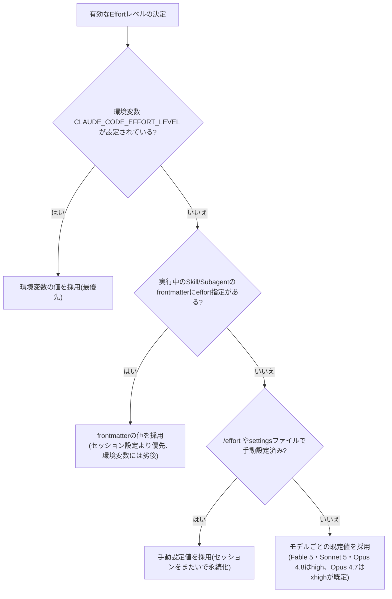

補足として、Organization管理者はEnterpriseプランでロールごとに「上限effortレベル」を設定できます。上限を超えるレベルを指定した場合は自動的にクランプされます。

`max`と`ultracode`はセッション限定(settingsファイルには保存不可)である点、また`ultracode`は環境変数`CLAUDE_CODE_EFFORT_LEVEL`には設定できない点に注意してください。

### 5.3 `ultrathink`キーワードとその他の言い回し

`ultrathink` というキーワードをプロンプト中に含めると、セッションのeffort設定を変えずにそのターンだけ深い推論をリクエストできます。一方で「think」「think hard」「think more」といった他の言い回しは特別なキーワードとしては認識されず、通常の文章として扱われる点に注意してください。

### 5.4 過剰思考を防ぐ指示例

高いeffortで動かすと、Fable 5がタスクに必要な範囲を超えて調査・熟考してしまうことがあります。これを防ぐには、4.2節②のような境界指定が有効です。

---

## 6. Claude Code での実践設定

### 6.1 モデルの選択とエイリアス

Fable 5はClaude Codeの既定モデルではありません。以下のいずれかで明示的に選択する必要があります。

| モデルエイリアス | 挙動 |
|---|---|
| `default` | アカウント種別の既定モデルに戻す(Pro/Team Standardは Sonnet 5、Max/Team Premium/Enterprise pay-as-you-go は Opus 4.8) |
| `best` | 組織がFable 5にアクセスできる場合はFable 5、そうでない場合は最新のOpus |
| `fable` | Claude Fable 5 を使用(最も難しく長時間のタスク向け) |
| `sonnet` | 日常的なコーディング作業向けの最新Sonnet |
| `opus` | 複雑な推論作業向けの最新Opus |
| `haiku` | 高速・軽量なタスク向け |
| `opusplan` | プランモード中はOpus、実行フェーズではSonnetに自動切替するハイブリッドモード |

設定方法の優先順位は「セッション中の`/model`コマンド > 起動時の`--model`フラグ > 環境変数`ANTHROPIC_MODEL` > settingsファイルの`model`フィールド」の順です。`/model`で選択すると、v2.1.153以降はその選択がユーザー設定のデフォルトとして保存されます(`Enter`で保存、`s`でセッション限定)。

Fable 5はZero Data Retention(ZDR)環境では利用できず、`/model`ピッカーから非表示または無効化されます。

### 6.2 Fable 5から最大限の成果を引き出すための基本方針(公式)

Claude Code公式ドキュメント「Work with Fable 5」は次の4点を挙げています。

1. **手順ではなく結果を説明する**: 欲しい結果を渡し、経路の計画はモデルに任せる。その結果を維持し続けたい場合は `/goal` を設定する。
2. **曖昧な問題を渡す**: 根本原因の調査、障害対応、アーキテクチャ判断など、追加の調査・検証が効果を発揮する領域に向いている。
3. **検証の念押しを省く**: Fable 5は指示が少なくても自ら検証を行うため、「テストして」「確認して」といったリマインダーは基本的に不要。
4. **タスクのサイズを大きくする**: 通常は分割するような作業も、そのままのサイズで渡してよい。長いセッションでも文脈を見失いにくい。

### 6.3 `/goal` コマンドの仕組みを正確に理解する

`/goal` は完了条件を設定すると、その条件が満たされるまでClaude Codeがユーザーの入力なしにターンを重ね続ける機能です。Anthropic公式ドキュメントによれば、その内部実装は「セッション限定のプロンプトベースStop hook」のラッパーです。

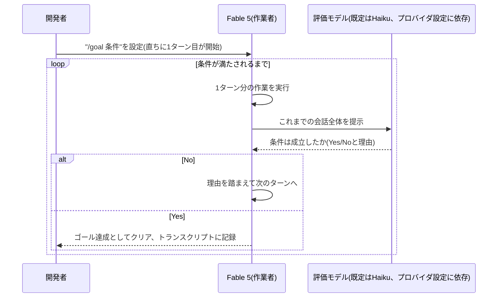

**重要な制約**: 評価モデルはトランスクリプトを読むだけで、コマンドを自ら実行したりファイルを直接確認したりはしません。したがって条件は「Claudeの出力自体が証拠になる」形で書く必要があります。例えば「`npm test`が終了コード0で終わる」は、Claudeがテストを実行しその結果がトランスクリプトに残るため機能しますが、Claude自身が確認していない外部事実を条件にはできません。

`/goal`・`/loop`・Stop hookの使い分けは以下の通りです。

| アプローチ | 次のターンが始まるタイミング | 停止するタイミング |
|---|---|---|
| `/goal` | 前のターンが終わった直後 | モデルが条件成立を確認したとき |
| `/loop` | 一定の時間間隔が経過したとき | ユーザーが止めるか、Claudeが完了と判断したとき |
| Stop hook | 前のターンが終わった直後 | 自作のスクリプトやプロンプトが判断したとき |

条件文の書き方のコツ(公式ドキュメント準拠):

1. **測定可能な終了状態を1つ定める**: テスト結果、ビルドの終了コード、ファイル数、キューが空になったことなど
2. **どう証明するかを明記する**: 「`npm test` が exit code 0 で終わる」のように
3. **守るべき制約を明記する**: 「他のテストファイルを変更しない」など
4. **ターン数・時間の上限を含める**: 「または20ターンで停止」のような句を条件に含めることで、無条件・無期限の暴走を防げる

条件文は最大4,000文字まで。`/goal`(引数なし)で現在の状態(条件・経過時間・ターン数・トークン消費・評価理由)を確認でき、`/goal clear`(エイリアス: `stop`/`off`/`reset`/`none`/`cancel`)で解除できます。`--resume`/`--continue`でセッションを再開した場合、アクティブだったゴールの条件は引き継がれますが、ターン数・タイマー・トークン消費の基準値はリセットされます。

### 6.4 Dynamic Workflows(`ultracode`)の活用

Dynamic Workflowsは、Fable 5(または他モデル)がタスクのためのオーケストレーションスクリプト(JavaScript)を自身で書き、バックグラウンドで実行する仕組みです。1つの会話では調整しきれないほど多くのエージェントが必要なタスク(コードベース全体の監査、数百ファイル規模の移行、相互検証が必要な調査など)に適しています。

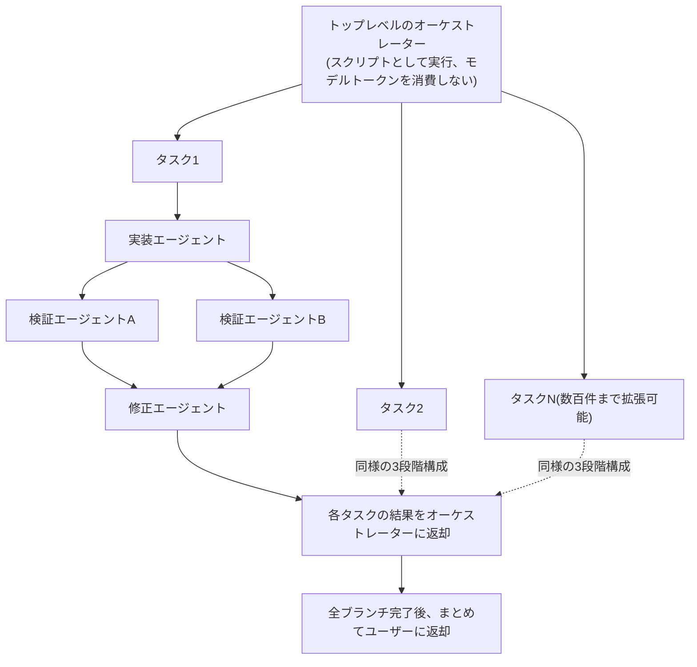

起動方法は3つあります。

- プロンプト中に「workflow」というキーワードを含める、または「ワークフローを使って」と自然言語で依頼する
- `/effort ultracode` を設定すると、セッション内のすべての実質的なタスクに対してワークフローを自動計画するようになります(トークン消費・時間は増加)
- 既存の保存済みワークフロー(`.claude/workflows/`のプロジェクト単位、または`~/.claude/workflows/`の個人単位)をスラッシュコマンドとして呼び出す

実行状況は `/workflows` で一覧・進捗確認ができます。実例として、Bun のメンテナーである Jarred Sumner は Dynamic Workflows を用いて Bun を Zig から Rust へ移植し、約75万行のRustコードを11日間で、既存テストスイートの99.8%を通過させる形で完了させたと報告されています。

**コスト面の警告**: Dynamic Workflowsは通常のセッションよりはるかに多くのトークンを消費します。あるMaxプラン($200/月)ユーザーはDynamic Workflows有効化初日に週次利用枠の20%を消費したと報告しており、Proプランのユーザーが10分程度で上限に達した例も報告されています。1ファイルの単純な修正や曖昧な指示(「アプリを改善して」)には不向きで、読み取り専用の分析から始め、対象ディレクトリを明示し、根拠の提示を義務付け、分析・実装・検証を別々のワークフローに分けることが推奨されています。

### 6.5 サブエージェント戦略とアドバイザーツール

Fable 5は並列サブエージェントのディスパッチ・維持において旧モデルより大幅に信頼性が向上しています。実務上は、Fable 5を高コストな「判断役」に据え、実装の大部分は安価なモデルに任せる**階層型のモデルルーティング**が推奨されます。

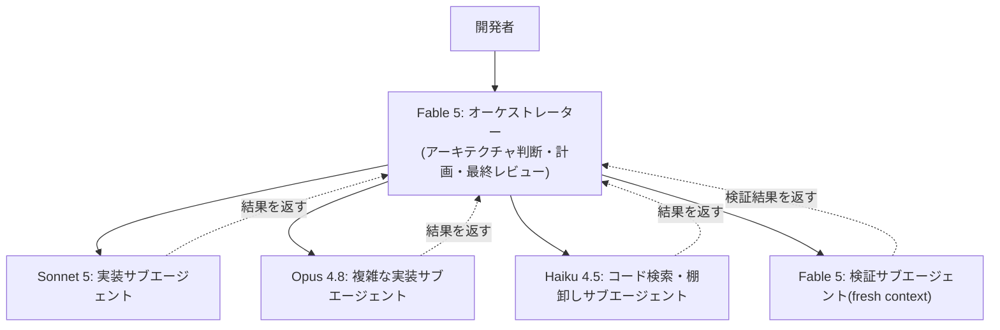

サブエージェントのモデルは `.claude/agents/` 配下のfrontmatterで指定でき、優先順位は「`CLAUDE_CODE_SUBAGENT_MODEL` 環境変数 > Agentツールの呼び出し時パラメータ > frontmatter > メインセッションのモデル」の順です。Claude Code v2.1.172以降では**サブエージェントがさらにサブエージェントを生成できる**ようになっており、代表例として「レビュー担当のサブエージェントが、発見した指摘事項ごとに検証用サブエージェントを1つずつ立ち上げ、その往復のやり取りを2階層下に隠したまま、メイン会話には整理済みの最終判定だけを返す」というパターンがあります。ネストの深さには上限が設けられています。

**新しいコスト最適化パターン: アドバイザーツール**。安価な「実行役(executor)」モデル(Haiku/Sonnet)が、判断が難しい局面でのみサーバーサイドで高性能な「助言役(advisor)」モデル(Opus、Fable 5も対応)にワンショットで相談できる仕組みです。1回の`/v1/messages`リクエスト内で完結し、追加のラウンドトリップは発生しません。Claude Codeでは`/advisor`コマンドで有効化でき、実行役が「本格的な作業に着手する前」「行き詰まったとき」「完了を宣言する前」の3つのタイミングで自律的に呼び出すのが典型パターンです。Anthropicの社内ベンチマークでは、Sonnet+Opusアドバイザーの組み合わせがSonnet単体を上回りつつ、Opus単体運用より約12%安価だったと報告されています。Fable 5も実行役としてClaude Code v2.1.170以降で対応しています。

### 6.6 Worktreeによる並列実験

`claude --worktree` を使うと、独立したgit worktree上でセッションを起動でき、複数のセッションが同じファイルを同時に編集する衝突を避けられます。Boris Cherny自身も3〜5個のClaude Codeセッションをworktreeで並列に走らせることを最大の生産性向上要因として挙げています。Fable 5に複数の実装方針を提案させ、それぞれを別のworktree上で(コストの低いモデルの)サブエージェントに実装させた上で、差分をFable 5に持ち帰らせて比較・選定させる、といった使い方が実務では有効です。

### 6.7 CLAUDE.md / Skillsの再設計

Fable 5への移行時に最も見落とされがちなのが、**旧モデル向けに書かれた過剰に規範的な指示の棚卸し**です。公式ガイドは「旧モデル向けに開発されたSkillは、Fable 5にとって規範的すぎることが多く、出力品質を下げる可能性がある」と明記しています。

| 見直すべきパターン | 理由 |
|---|---|
| 手順を1から10まで列挙したチェックリスト | Fable 5は自ら計画を立てられるため、過剰な手順指定が創造的な判断を阻害する |
| あらゆる失敗ケースを想定した網羅的な禁止事項リスト | 弱いモデルの失敗モードを前提にした「保険」が、そのまま制約として重荷になる |
| 「思考過程を説明してください」という指示 | `reasoning_extraction` の拒否カテゴリに抵触し、Opusへのフォールバックを誘発する可能性がある |
| ハードコードされた日付や古い前提を含むメモ・ルールファイル | 更新されずに残り続け、誤った前提を毎セッション伝え続けてしまう |

実務的な進め方としては、まずFable 5自身に既存の `CLAUDE.md` やSkillファイルを読ませ、「矛盾している箇所」「弱いモデルのための保険にすぎない箇所」を洗い出させ、削除案をレポートさせた上で、実際の削除判断は人間が行う、という「監査は任せるが決定は自分でする」進め方が有効です。

---

## 7. Loop Engineering: 長時間自律ループの設計思想

2026年6月から7月にかけて、Fable 5のような長時間自律動作が可能なモデルの登場と歩調を合わせる形で、"Loop Engineering"(ループ・エンジニアリング)という概念がAI開発者コミュニティで急速に広がりました。

### 7.1 「ループ」の起源: Boris Chernyの三段階進化

Claude Codeの生みの親であるBoris Cherny(Anthropic)は、2026年6月2日のWorkOS × Acquired Unpluggedイベントで自身のワークフローの変化を語りました。

> "I don't prompt Claude anymore. I have loops that are running. They're the ones that are prompting Claude and figuring out what to do. My job is to write loops."
> (もうClaudeに直接プロンプトを書くことはない。プロンプトを送っているのはループの方で、私の仕事はループを書くことだ)

Chernyの進化は3段階で説明されています。①手作業のコーディング+オートコンプリート → ②5〜10個のClaude Codeセッションを並列に手動でプロンプトする → ③ループ(Claudeにプロンプトを送り、成果物を読み、完了か否かを判断し、未完了なら文脈を更新して再プロンプトする小さなプログラム)を書く、という順序です。この「ループ」という語自体は目新しくありませんが(cronは1975年から存在する)、ループの各判断が固定的な分岐ではなく**モデル自身の判断**である点が質的に異なります。

### 7.2 命名の瞬間: Peter SteinbergerとAddy Osmani

2026年6月7日、OpenClaw創業者のPeter Steinbergerが以下の投稿でこの流れを一段と広めました。

> "You shouldn't be prompting coding agents anymore. You should be designing loops that prompt your agents."

その翌日(6月8日)、Google Cloud AI DirectorのAddy Osmaniが「Loop Engineering」と題したエッセイを公開し、この実践に名前と体系(anatomy)を与えました。Osmaniが挙げる構成要素は、自動化(automations)・worktree・Skills・コネクタ・サブエージェント・外部状態の6つです。同氏は7月9日に "Own the Outer Loop" という続編エッセイを公開し、**内側のループ(inner loop: 実際の作業を行う場所)と外側のループ(outer loop: 何を出荷するか・誰が責任を持つかを決める場所)を区別し、内側のループは積極的に委任してよいが、外側のループは絶対に人間が手放してはならない**という原則を提示しました。同エッセイは委任のコストとして「認知的負債(cognitive debt: 理解が及ばないまま採用したコードが積み上がること)」「オーケストレーション税(orchestration tax: レビューが新たなボトルネックになること)」という2つの概念語を提示しています。

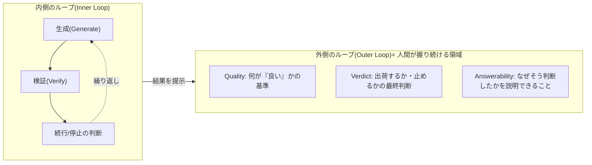

批判的な視点も存在します。「本質的にはただのwhileループにすぎない」「トークン消費が跳ね上がる」(Uberが社内のエージェントツール利用料を1人あたり月1,500ドルに上限設定したという報告)、「ベンダーの成功事例は既にその製品を使っているユーザーからのデータであり、サンプリングバイアスがある」といった指摘です。開発者Johnson Leeは「ループは試行回数を増やせるが、正答の密度を増やせるわけではない」とし、検証ゲート(fast gate)だけでなくゴールデンデータセットや本番リプレイによる低速な評価(slow-loop evals)も併用しなければ、システム全体が誤った指標に向かって加速してしまうと警告しています。

### 7.3 Andrew Ngの「3つのループ」フレームワーク

DeepLearning.AIの『The Batch』(2026年6月30日号)にて、Andrew Ngはソフトウェア開発を入れ子構造の3つのループとして整理しました。

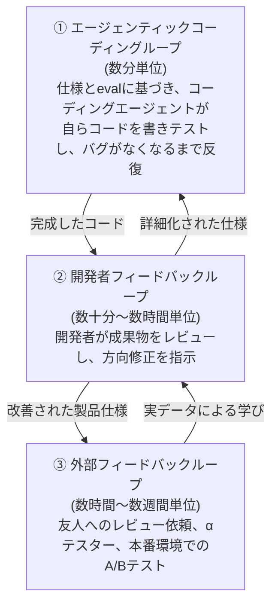

Ngが強調するのは、②開発者フィードバックループにおける人間の貢献を「センス(taste)」ではなく**「文脈的優位性(context advantage)」**と呼ぶべきだという点です。「人間がAIの知らないことを知っている限り、human-in-the-loopは必要であり続ける」という説明は、このループが自動化されない理由を明確にします。同氏はまた、コーディングエージェントの高速化によって、エンジニアが部分的にプロダクトマネージャーの役割を担うようになりつつあるとも指摘しています。

---

## 8. Thariq の「Unknowns フレームワーク」徹底解説

Thariq Shihipar(Anthropic, Claude Codeチーム)が2026年7月3日に公開した投稿・記事 "A Field Guide to Fable: Finding Your Unknowns" は、300万回以上閲覧された反響の大きい投稿で、7月6日にはAI Engineer World's Fairでの基調講演としても公開されています。この投稿の核心は「**地図は現地そのものではない(the map is not the territory)**」という比喩です。

> "The map, a representation of the work to be done, is my prompts and skills and context, it's what I give Claude. The territory is where the work needs to happen, the codebase, the real world, its actual constraints. The difference between the map and the territory is what I call unknowns."
> (地図——なすべき仕事の表象——とは、私のプロンプトやSkill、コンテキストのことであり、Claudeに与えるものだ。現地とは、仕事が実際に行われる場所——コードベース、現実世界、その本当の制約——を指す。地図と現地の差異こそが、私が"unknowns"と呼ぶものだ)

Thariqの中心的な主張は「**Fableは、仕事の質が『自分自身のunknownsをどれだけ明確化できるか』によってボトルネックされる、初めてのモデルだ**」というものです。モデルが強くなるほど、ボトルネックは「モデルの能力」から「開発者自身が明確化していない前提」へと移っていきます。

### 8.1 4つの象限(Thariq自身の定義)

| 象限 | Thariq自身の定義 | 具体例 |
|---|---|---|
| **Known Knowns**(既知の既知) | 基本的にプロンプトに書いてあること。エージェントに何を求めているかを自分が伝えている部分 | 「この関数の戻り値の型はstringにする」 |
| **Known Unknowns**(既知の未知) | まだ決めていないが、決めていないと自覚しているギャップ | 「エラー時の挙動をどうするかはまだ決めていない」 |
| **Unknown Knowns**(未知の既知) | 自分にとってはあまりに当然すぎて書き出さないが、見れば「これだ」と認識できるもの | コードの「きれいさ」の暗黙の基準 |
| **Unknown Unknowns**(未知の未知) | まったく考慮していなかったこと。自分が持っていることにすら気づいていない知識、「どこまで良くできるか」を知らないこと | 想定していなかったレガシーな依存関係の存在 |

Thariqの観察によれば、Fable 5の出力品質が頭打ちになる最大の要因は、大抵この第3・第4象限、つまり**自分自身がその前提の存在にすら気づいていない領域**にあります。

### 8.2 実践技法(記事本文+コミュニティによる実装からの集約)

記事は実装の前・最中・後にわたる技法を提示しており、開発者Ole Lehmann(@itsolelehmann)による9項目への整理が広く引用されています。以下はその要約です。

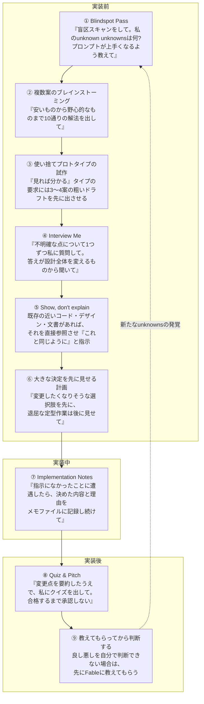

Thariqはまた、過去に「Claudeと使うHTML」について書いた投稿を引用しつつ、こうしたunknownsを可視化する際には**HTMLアーティファクトが最良の表現手段になることが多い**とも述べています。この5〜9の技法群は、コミュニティによってすでに複数のインストール可能なSkillパッケージ(Claude Code plugin / Cursor SKILL.md)に蒸留されており、GitHub上で公開されています(巻末URL参照)。

このフレームワークは、7章で紹介したLoop Engineeringの考え方(検証条件をどう設計するか)とも補完関係にあります。`/goal` の条件を書く作業自体が、実は「Known Unknowns」を「Known Knowns」に変換する作業そのものだと捉えると、両者のつながりが見えてきます。

---

## 9. 検証ループとメモリシステムの設計

### 9.1 検証はサブエージェントに任せる

Fable 5は自己検証の精度も高いモデルですが、Anthropicの実験・Lance Martin(Anthropic)の報告いずれにおいても、**独立した文脈を持つ検証専用のサブエージェント**が自己批評よりも一貫して優れた結果を出すことが確認されています。長時間タスクでは以下のような指示を明示的にプロンプトへ含めることが推奨されます。

```
Establish a method for checking your own work at an interval of [X] as you
build. Run this every [X interval], verifying your work with subagents
against the specification.
```

Claude Code公式ドキュメント「Best practices」も同様に、「セカンドオピニオン」パターン(検証用サブエージェントや、自らの発見に反証を試みるDynamic Workflow)を推奨し、「Claudeに証拠(テスト出力・実行したコマンドとその結果・スクリーンショットなど)を提示させる方が、自分で再検証するより速く、監視していなかったセッションでも機能する」と述べています。

### 9.2 コンテキストエンジニアリングとの接続

Anthropicのエンジニアリングブログ「Effective context engineering for AI agents」は、サブエージェントアーキテクチャの利点を「各サブエージェントは数万トークンを探索に使ってよいが、返すのは凝縮された1,000〜2,000トークン程度の要約だけでよい」という設計原則として説明しています。またClaude Code自身が実装している「コンパクション(compaction)」——コンテキストウィンドウの95%を超えた時点で会話全体を要約し、直近にアクセスした5ファイルとともに再開する仕組み——も、長時間実行時のメモリ管理の一部です。

### 9.3 ファイルベースのメモリシステム

Fable 5は、過去の実行から得た教訓を記録し、それを参照できる状態にしておくと特によいパフォーマンスを発揮します。実装はシンプルな Markdown ファイルで構いません。公式ガイドが示すテンプレート:

```
Store one lesson per file with a one-line summary at the top. Record
corrections and confirmed approaches alike, including why they mattered.
Don't save what the repo or chat history already records; update an
existing note rather than creating a duplicate; delete notes that turn out
to be wrong.
```

過去のセッション群からこの仕組みを立ち上げたい場合は、Fable 5自身にサブエージェントを使って過去のセッションを振り返らせ、テーマや教訓を抽出・保存させ、以後その保存先を参照するよう指示する、という「自己ブートストラップ」的な使い方も有効です。

### 9.4 長時間実行特有の注意点

- **早期停止**: 長いセッションの終盤で、Fable 5が「これからXを実行します」という意図表明だけをして実際のツール呼び出しをしなかったり、十分な情報があるのに許可を求めて止まってしまうことがあります(4.2節⑧参照)。
- **コンテキスト予算への過剰反応**: 残りトークン数のカウントダウンをモデルに見せる設計だと、必要以上に「新しいセッションを始めましょうか」といった提案をしてくることがあります。可能であればコンテキスト残量を明示的に見せない設計にするか、「コンテキストは十分残っているので気にせず続けてください」という一文を添えるとよいでしょう。
- **クライアント側のタイムアウト調整**: 高いeffort設定での個々のリクエストは数分から数時間に及ぶことがあります。API/ハーネスを自作している場合は、タイムアウト・ストリーミング・進捗表示の設計を見直し、スケジュールジョブなど非同期的に実行状況を確認する構成に寄せることが推奨されています。

---

## 10. コスト管理とモデル選定フロー

### 10.1 2026年7月16日時点の価格・利用枠状況

Fable 5は入力$10/出力$50(100万トークンあたり)と、Opus 4.8のちょうど2倍の単価です。2026年6月9日の発売直後には、$100/月のプランで1日に$110超を消費した例(Simon Willison)、7分間で1.3Mトークン(約$160相当)を消費した例、$200/月のMaxプランで1日に$1,000超を消費した例など、想定外の高額請求が多数報告されました。

7月1日の復旧後は、Pro/Max/Team/一部Enterpriseプランで「週次利用枠の50%まで」無料相当で利用できる期間が設けられていますが、この期間は7月7日→7月12日→7月19日と二度延長されています(7月16日時点でも延長が続く可能性があります)。期間終了後は「使用クレジット(Usage Credits)」という従量課金レイヤーを別途有効化しない限り、Fable 5へのアクセスは自動フォールバックなしに単純に停止します。ヘビーユーザーは、この無料相当枠を「大規模な移行作業・アーキテクチャレビュー・セキュリティ監査など、耐久性のある成果物」の生成に優先的に充て、実行フェーズは安価なモデルに引き継ぐという「先食い戦略」が有効だと報告されています。

### 10.2 モデル選定フロー

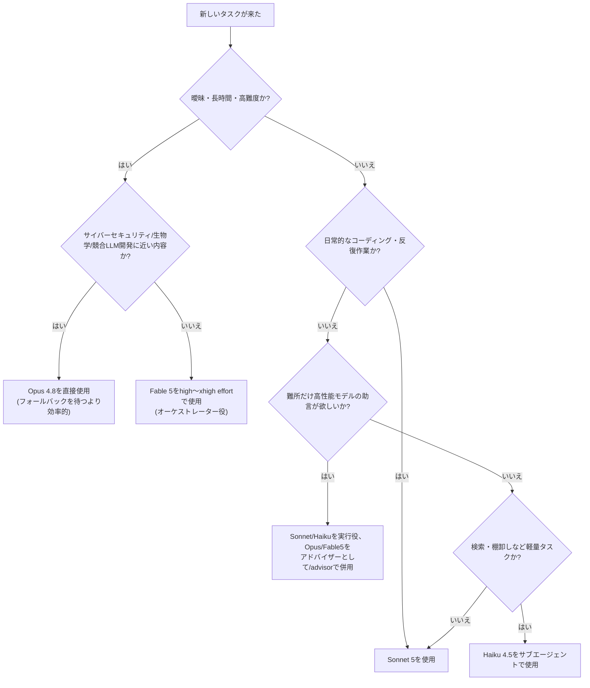

### 10.3 コスト管理の実務ポイント

| 役割 | 推奨モデル/パターン | 理由 |
|---|---|---|
| 計画・アーキテクチャ判断・最終レビュー | Fable 5 | 曖昧さの処理・長時間の一貫性・自己検証能力が活きる領域 |
| 通常の実装作業 | Sonnet 5 / Opus 4.8 | コストと性能のバランスが良い |
| コード検索・棚卸し・単純な反復作業 | Haiku 4.5 | 低コストで十分な精度が出る |
| 難所だけの助言 | アドバイザーツール(実行役+助言役) | 高性能モデルを常時稼働させず、判断が必要な局面だけ課金 |
| コードレビュー・診断(最終判断) | Fable 5(高effort) | 「安全に出荷できるか」という判断そのものが強みを発揮する領域 |

その他、実務でよく参照される数値情報:

- マルチエージェントのワークフローは、単一エージェントセッションと比べておよそ**4〜7倍**のトークンを消費し、Agent Teams機能(実験的な複数セッション同時実行)は標準利用のおよそ**15倍**に達するとAnthropicが文書化しています。
- Dynamic Workflowsも同様に、通常セッションよりはるかに大きなトークン消費を伴います(6.4節参照)。
- GitHubのMario Rodriguez氏(CPO)は、プロンプトキャッシュのヒット率を「高頻度取引と同じくらい重要な指標」と位置づけ、社内目標を94%以上に設定していると述べています(70%まで落ちるとプロンプト組み立てにバグがある兆候だとしています)。
- サブエージェントを増やすとトークン消費は単純に掛け算で増えるため、チームは小さく保ち、起動プロンプトは焦点を絞り、役目を終えたサブエージェントは早めに終了させることが推奨されています。

---

## 11. よくある落とし穴(アンチパターン)

| アンチパターン | 何が起きるか | 対処 |
|---|---|---|
| Opus世代のプロンプトをそのまま流用する | 過剰な手順指定・禁止事項がFable 5の自律的判断を阻害し、性能が落ちる | CLAUDE.md/Skillsを棚卸しし、ゴール・理由・境界・検証の4要素に再構成する(6.7節) |
| 常に最大effort(`xhigh`/`max`/`ultracode`)で動かす | トークン消費が増えるだけでなく、過剰思考・過剰な調査で逆に遅くなることがある | タスクの難度に応じて`high`を基準に上下させる。導入前に効果測定する |
| 「思考過程を説明して」と指示する | `reasoning_extraction`カテゴリに抵触し、Opusへの意図しないフォールバックを誘発しうる | 推論の可視性が必要な場合は構造化された`thinking`ブロックを読む設計にする |
| セキュリティ関連のリポジトリでFable 5をそのまま使う | 初回リクエストからフォールバックが頻発し、想定より遅く・高くつく | 該当領域は最初からOpus 4.8を使うか、`--safe-mode`で原因を切り分ける |
| すべてのサブタスクをFable 5に担わせる | コストが不必要に膨らむ | オーケストレーターはFable 5、実装はSonnet/Opus、検索はHaiku、難所はアドバイザーという階層構造にする |
| 無条件・無期限の`/goal`や`ultracode`を一晩放置する | 想定外の挙動やコスト超過に気づけない。「ループが綺麗に終了した」ことと「タスクが正しく完了した」ことは別問題 | 条件にターン数・時間の上限を含め、最初の数サイクルは監視する。停止条件と成功条件を分けて設計する |
| 進捗報告を鵜呑みにする | 「テストが通りました」という報告が実際には未検証であるケースがある | 根拠となるツール実行結果の提示を明示的に要求する(4.2節④) |
| 単一モデルによる自己採点だけで完了と判断する | 平凡な出来を「良くできた」と過大評価しがちである | 独立した文脈を持つ検証サブエージェントや`/goal`の評価モデルを併用する |
| 検証ゲート(fast gate)だけに頼る | テストが通ってもロジックが正しいとは限らない。エージェントが「テストを全部通す」ことを最適化してテスト側を弱めることがある | ゴールデンデータセット・本番リプレイ・人間の判断による低速な評価(slow-loop evals)も併用する |
| フォールバック設定をリクエスト経路の一部にしか入れない | エラー処理分岐やバックグラウンドワーカーなど、実は最もフォールバックが必要な経路が無防備になる | フォールバックを「アンビエントな状態」ではなく「リクエストごとのプロパティ」として明示的に設定する |

---

## 12. 実力・ベンチマークと「検証必須」の理由

Fable 5は複数のベンチマークで高い成績を収めています。SWE-bench Proで80.3%、Terminal-Benchで88.0%、SWE-bench Verifiedで93.9%といったスコアが報告されており、Center for AI Safety と Scale AI Labs が公表した Remote Labor Index(実在するフリーランス案件240件を人間の専門家基準で採点するベンチマーク)では、Fable 5は16.1%の案件で人間の専門家と同等かそれを上回る成果を出し、Opus 4.8(8.3%)やGPT-5.5(6.3%)を上回りました。ただし裏を返せば、**このベンチマークでもプロ品質に届いた案件は6件に1件程度**であり、過信は禁物です。

法律分野の実践検証を行った Artificial Lawyer の記事では、Fable 5は個別の評価基準(criteria)ベースでは約90%の精度で正答する一方、法律文書の完成品全体として完全に正しいと言える出力は約11%程度にとどまったと報告されています。これは「部分点は高いが、成果物全体を無検証でそのまま採用するのは危険」という典型的な傾向を示しており、Fable 5に限らず高性能モデル全般に当てはまる教訓です。

開発者の反応も割れています。Simon Willisonは「a beast」「relentlessly proactive(容赦なく積極的)」と評しつつ、スクリーンショット1枚からCORSサーバーを自前で立ち上げてしまうような過剰な能動性に驚きを示しています。Boris Chernyは「これまで使った中で群を抜いて最高のコーディングモデル」と評した一方、Reddit上の一部ユーザーは「常に最悪のケースを想定しすぎる」「以前は問題なかったセキュリティ関連の話題でも拒否が出る」と不満を述べています。Karpathy自身も安全策について「発売にしてはやや過敏」とコメントしています。

また、Fable 5をめぐっては「長時間の複数エージェントセッションで独自の省略言語(通称"Claudish")を発達させる」という噂がSNS上で広がりましたが、これを多角的に裏取りした分析記事では、そのような現象の出どころは確認できず、実際に文書化されているのは「長時間セッションの終盤で、ユーザー向けの要約が矢印の連鎖のような密な省略表現になりやすい」という、より地味な挙動だったと結論づけられています(4.2節⑥で紹介した公式の処方箋はまさにこの挙動への対策です)。この一件は、AIモデルに関する派手な噂ほど、一次情報(公式ドキュメントやAPIの挙動そのもの)に立ち返って検証する価値がある、という良い教訓例です。

---

## 13. 既知の制限事項

- **Zero Data Retention(ZDR)非対応**: Fable 5・Mythos 5はいずれも30日間データ保持の「Covered Model」であり、ZDRの対象外です。厳格なデータ保持要件がある組織は、Claude Codeの`/model`ピッカー上でFable 5が非表示または無効化されている場合があります。
- **実在する公人になり代わった発言はできない**: 創作におけるフィクションのキャラクターは問題ありませんが、実在する著名人の発言として言葉を作り出すことは避ける設計になっています。
- **サイバーセキュリティ・生物学・競合LLM開発領域は不得手というより「意図的に不可」**: 該当領域での能力そのものはMythos 5と共通ですが、Fable 5では安全分類器によって意図的にOpus 4.8へフォールバックするよう設計されています。
- **価格体系が流動的**: 2026年7月16日時点で、Fable 5の無料相当利用枠の期限は複数回延長されています。実装に移す前に必ず`support.claude.com`の最新の告知を確認してください。
- **モデルは日々アップデートされる**: 分類器の精度・コマンド仕様・価格体系などは今後変更される可能性があります。最新情報は必ず公式ドキュメントで確認してください。

---

## 14. まとめ

Claude Fable 5をClaude Codeで使いこなす上でのポイントを一言でまとめると、**「細かく指示する」から「ゴールと検証基準を渡し、あとは任せる」への発想転換**に尽きます。これは単なるプロンプトの書き方の変化ではなく、

- モデル選定(Fable 5をオーケストレーター、他モデルをワーカー、必要な局面だけアドバイザーに据える階層設計)
- Effortレベルとultracode/Dynamic Workflowsの使い分け
- 検証ループの設計(`/goal`、独立した検証サブエージェント、fast gateとslow-loop evalsの併用)
- メモリシステム(ファイルベースの教訓の蓄積とコンテキストエンジニアリング)
- 自分自身のunknownsを可視化する技法(Thariqのフレームワーク)
- 内側のループを委任しつつ、外側のループ(品質基準・最終判断・説明責任)は人間が握り続けるという規律(Addy Osmaniの"Own the Outer Loop")

という複数のレイヤーにまたがる設計思想の転換です。同時に、ベンチマーク上の高い成績や華々しい発表の裏にも、部分点と完成品の間には依然としてギャップがあること、SNS上の噂は一次情報で裏取りする必要があること、そして価格・利用枠が短期間で複数回変更されるほど流動的な状況にあることも忘れずに、実務では検証を省略しない姿勢を保つことが重要です。

---

## 15. 参考文献・ソースURL一覧

### 公式ドキュメント・公式発表(Anthropic)

- Anthropic「Claude Fable 5 and Claude Mythos 5」(発表記事): https://www.anthropic.com/news/claude-fable-5-mythos-5
- Anthropic「Redeploying Claude Fable 5」(輸出規制解除後の復旧に関する声明): https://www.anthropic.com/news/redeploying-fable-5
- Claude Platform Docs「Prompting Claude Fable 5」(4章の一次情報): https://platform.claude.com/docs/en/build-with-claude/prompt-engineering/prompting-claude-fable-5
- Claude Platform Docs「Refusals and fallback」(3章の一次情報): https://platform.claude.com/docs/en/build-with-claude/refusals-and-fallback
- Claude Platform Docs「Advisor tool」(6.5章・10章の一次情報): https://platform.claude.com/docs/en/agents-and-tools/tool-use/advisor-tool
- Anthropic Engineering「Effective context engineering for AI agents」(9章の一次情報): https://www.anthropic.com/engineering/effective-context-engineering-for-ai-agents
- Anthropic Blog「Introducing dynamic workflows」(6.4章の一次情報): https://claude.com/blog/introducing-dynamic-workflows-in-claude-code
- Claude Code Docs「Model configuration」(5章・6.1章・6.5章の一次情報、effort/フォールバック/エイリアスの正確な仕様): https://code.claude.com/docs/en/model-config
- Claude Code Docs「Keep Claude working toward a goal」(`/goal`コマンドの一次情報、6.3章): https://code.claude.com/docs/en/goal
- Claude Code Docs「Orchestrate subagents at scale with dynamic workflows」(6.4章の一次情報): https://code.claude.com/docs/en/workflows
- Claude Code Docs「Escalate hard decisions with the advisor tool」: https://code.claude.com/docs/en/advisor
- Claude Code Docs「Best practices for Claude Code」(9.1章の一次情報): https://code.claude.com/docs/en/best-practices

### 著名な開発者・業界関係者の発信(引用元の投稿を含む)

- Thariq Shihipar(Anthropic, Claude Codeチーム)「A Field Guide to Fable: Finding Your Unknowns」(8章の一次情報): https://x.com/trq212/status/2073100352921215386
- Thariq Shihipar「my keynote at AI Engineer World's Fair: A Field Guide to Fable」(YouTube講演の告知投稿): https://x.com/trq212/status/2074163788853760175
- Ole Lehmann(@itsolelehmann)によるThariqのフレームワークの9項目実践ガイド(8.2章の一次情報): https://x.com/itsolelehmann/status/2073740677175996453
- Boris Cherny インタビュー(WorkOS × Acquired Unplugged, 7章の一次情報): https://workos.com/blog/boris-cherny-claude-code-acquired-interview-takeaways
- Addy Osmani「Loop Engineering」(命名元のエッセイ、7.2章の一次情報): https://addyosmani.com/blog/loop-engineering/
- Addy Osmani「Own the Outer Loop」(内側/外側ループの続編エッセイ、7.2章の一次情報): https://addyo.substack.com/p/own-the-outer-loop
- Andrew Ng, The Batch Issue 359「My 3 key loops for building 0-to-1 products」(7.3章の一次情報): https://www.deeplearning.ai/the-batch/issue-359 / https://x.com/AndrewYNg/status/2071988145667928442
- Lance Martin(Anthropic)「Context Engineering for Agents」(9.2章の一次情報): https://rlancemartin.github.io/2025/06/23/context_engineering/
- Simon Willison「Initial impressions of Claude Fable 5」(1章・12章の一次情報): https://simonwillison.net/2026/Jun/9/claude-fable-5/
- Simon Willison「Claude Fable is relentlessly proactive」(12章の一次情報): https://simonwillison.net/2026/Jun/11/fable-is-relentlessly-proactive/

### 分析・解説記事・コミュニティによる実装(二次情報、事実確認のうえ引用)

- explainx.ai「Map Is Not Territory: Claude Fable 5 Field Guide (Thariq)」(8章の解説記事): https://explainx.ai/blog/map-is-not-territory-fable-5-thariq-unknowns-2026
- GitHub「fable-field-guide-skills」(Thariqのフレームワークを8つのSkillとして実装): https://github.com/GreatMark/fable-field-guide-skills
- GitHub「finding-unknowns-skills」(同フレームワークのClaude Code向けCLAUDE.md実装): https://github.com/bozhouDev/finding-unknowns-skills
- Champaign Magazine「Aikipedia: Loop Engineering」(Loop Engineeringの命名経緯の整理、7.2章): https://champaignmagazine.com/2026/06/17/aikipedia-loop-engineering/
- Johnson Lee「Don't Let Loop Engineering Fool You」(Loop Engineeringへの批判的視点、11章): https://johnsonlee.io/2026/06/26/fooled-by-loop-engineering.en/
- Medium(cocodedk / GitHub)「loop-engineering: A fact-checked knowledge base on Boris Cherny's 'loop' methodology」: https://github.com/cocodedk/loop-engineering
- Tosea.ai「Claude Fable 5 Review: What Developers Really Think 24 Hours After Launch」(12章の反響まとめ): https://tosea.ai/blog/claude-fable-5-review-developer-reactions
- CodingFleet「Claude Fable 5 Review」(ベンチマーク数値の集約、12章): https://codingfleet.com/blog/claude-fable-5-complete-review/
- Artificial Lawyer「Anthropic's 'Dangerous' Fable Is Back! How Does It Do?」(法律分野での実力検証、12章の一次情報): https://www.artificiallawyer.com/2026/07/02/anthropics-dangerous-fable-is-back-how-does-it-do/
- Ken Huang「Claude Fable 5: What Changed, and How to Stop Prompting It Like Opus」("Claudish"の噂の裏取りを含む、12章): https://kenhuangus.substack.com/p/claude-fable-5-what-changed-and-how
- xda-developers「I set up Claude Code the way Anthropic now recommends」(サブエージェントのネスト・worktree運用、6.5〜6.6章): https://www.xda-developers.com/set-up-claude-way-anthropic-now-recommends-sub-agents/
- InfoQ「Anthropic's Code with Claude Announces Managed Agents, Proactive Workflows, Capability Curve」(GitHubのキャッシュヒット率・Advisorパターンの実例、10.3章): https://www.infoq.com/news/2026/05/code-with-claude/
- digitalapplied.com「Claude Fable 5 Pricing: The July 7 Usage-Credits Switch」ほか価格変更の追跡記事群(2章・10章の価格情報): https://www.digitalapplied.com/blog/anthropic-fable-5-access-extended-july-12-2026
- Anthropic Support Center「Claude Fable 5 Promotional Access」(価格・利用枠の一次情報、随時更新): support.claude.com 内の該当記事を参照

> 注記: 上記のうち個人ブログ・メディア記事(二次情報)は、公式ドキュメントと突き合わせて事実確認を行った上で本ガイドに反映しています。AI分野、特にFable 5のような発売直後で価格体系が流動的なモデルについては情報の更新が非常に速いため、実装に移す前に必ず一次情報(`platform.claude.com`・`code.claude.com`・`support.claude.com`)側の最新記載を確認してください。
