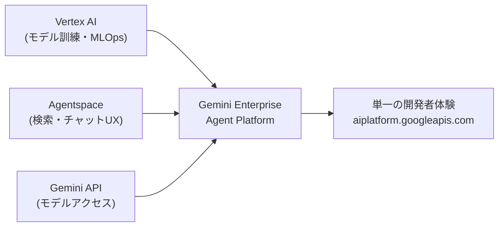
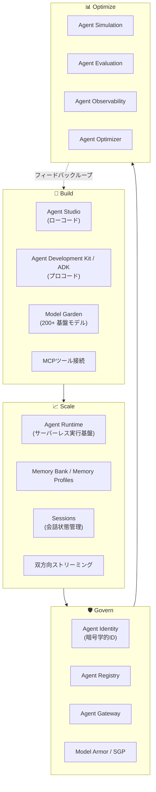
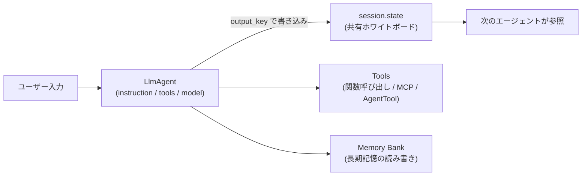
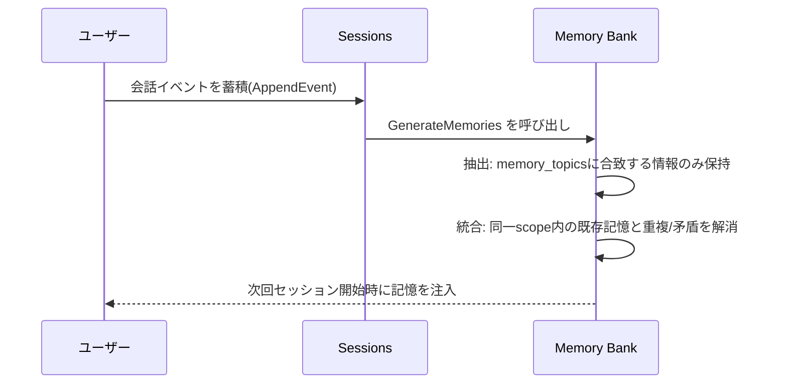
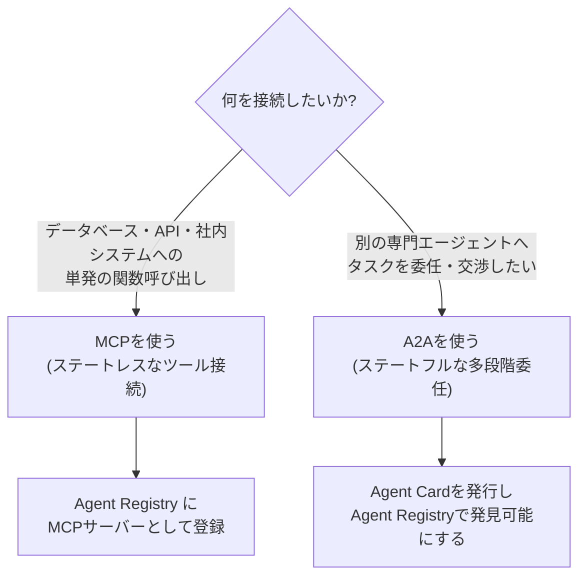
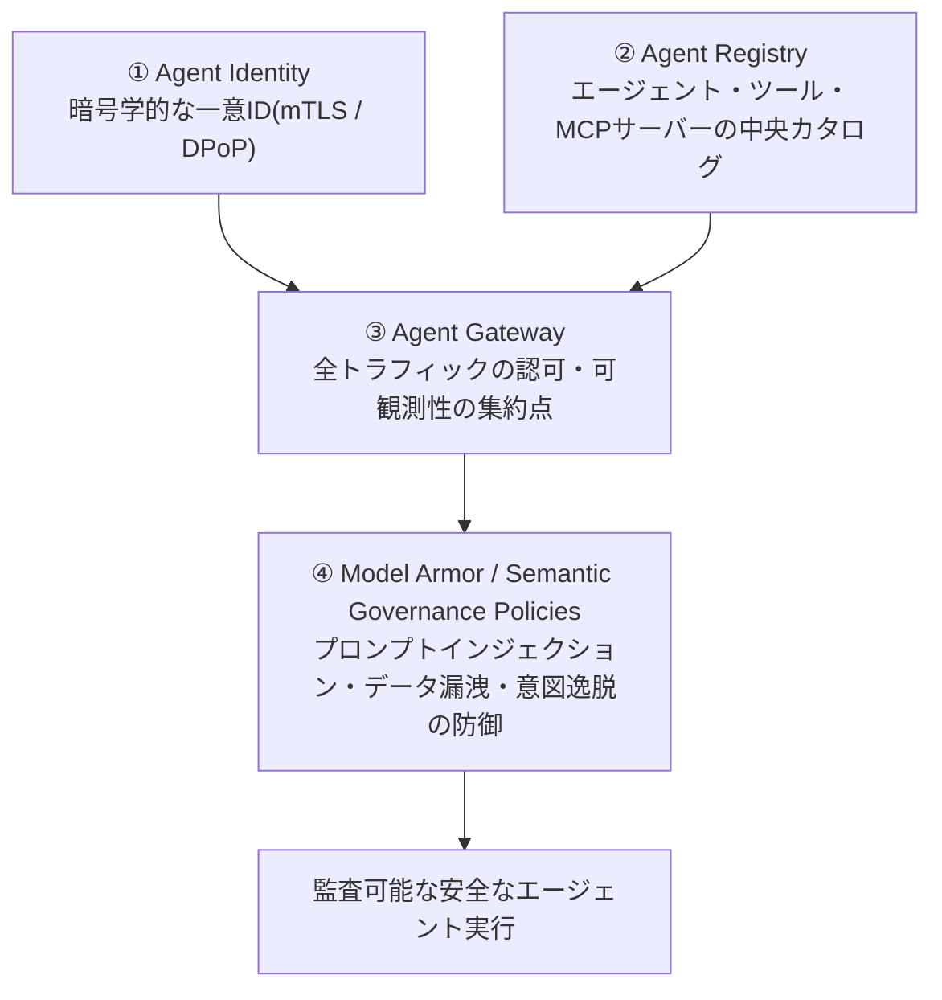
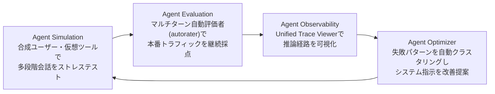

# Gemini Enterprise Agent Platform 実践ベストプラクティスガイド
### 中級〜上級エンジニア向け ステップバイステップ解説(2026年7月17日時点の最新情報に基づく)

> **対象読者**: Vertex AI や生成AIエージェント開発の基礎知識がある方。ADK・Agent Runtime・Memory Bank・A2A/MCP・ガバナンス機能を実務レベルで使いこなすための設計指針とベストプラクティスをまとめています。

---

## 0. このガイドの前提 ― 「Vertex AI」から「Gemini Enterprise Agent Platform」へ

まず最初に押さえておくべき最重要事実があります。**2026年4月22日、Google Cloud Next 2026において、Google は Vertex AI を「Gemini Enterprise Agent Platform(以下 GEAP)」として刷新・拡張することを発表しました。** これは単なる名称変更ではなく、以下の3つの製品を1つに統合する再編です。

- **Vertex AI**(モデル訓練・チューニング・デプロイのMLOps基盤)
- **Agentspace**(エンタープライズ向けエージェント検索・チャット体験)
- **Gemini API**(モデルアクセスそのもの)

2026年5月21日以降、Google Cloud コンソール上から「Vertex AI」という名称は姿を消し、検索しても Agent Platform にリダイレクトされるようになりました。一方で **API エンドポイントは `aiplatform.googleapis.com` のまま変更されていません**。既存のコードやSDK呼び出しは無停止で動作を継続するため、緊急移行の必要はありませんが、IAMロール名やコンソールUI、課金明細の項目名(2026年5〜6月にかけて「Vertex AI」から「Gemini Enterprise」表記に置き換わる)は確認しておく必要があります。



以降、このガイドでは新名称「Agent Platform」または「GEAP」で統一して解説します。

---

## 1. 全体アーキテクチャ ― 4つの柱(Build / Scale / Govern / Optimize)

GEAPは、エージェントのライフサイクル全体を「構築(Build)→拡張(Scale)→統治(Govern)→最適化(Optimize)」という4つの柱で捉える設計になっています。まずこの全体像を掴むことが、個別機能を迷わず選択するための最短ルートです。



各柱の役割を一言でまとめると次のようになります。

| 柱 | 目的 | 主要コンポーネント |
|---|---|---|
| Build | エージェントロジックとツール接続を作る | Agent Studio、ADK、Model Garden、MCP |
| Scale | 本番トラフィックに耐える実行基盤を提供する | Agent Runtime、Memory Bank、Sessions、双方向ストリーミング |
| Govern | 誰が・何に・どうアクセスできるかを統制する | Agent Identity、Agent Registry、Agent Gateway、Model Armor、Semantic Governance Policies |
| Optimize | 品質を継続的に計測・改善する | Agent Simulation、Agent Evaluation、Agent Observability、Agent Optimizer |

**ベストプラクティス①**: 新規プロジェクトでは「まずBuildだけ作り込んで、後からGovernとOptimizeを足す」という順序は避けてください。後述するように、ガバナンス設定を後回しにすることは、エンタープライズがエージェント展開で犯す最も高くつく失敗としてしばしば指摘されています。小規模なプロトタイプの段階から Agent Identity と Agent Registry への登録だけは最初に組み込んでおくことを推奨します。

---

## 2. Agent Development Kit(ADK)の基本設計

ADK は OSS のコードファースト・エージェントフレームワークで、Python に加えて TypeScript 版も提供されています。単一の万能エージェントではなく、役割を分割した複数の専門エージェントを協調させる「マイクロサービス的発想」が設計の核にあります。

### 2.1 なぜ単一巨大エージェントを避けるべきか

1つのエージェントに指示を詰め込みすぎると、指示追従性が低下し、エラー率が複合的に増加し、結果としてハルシネーションが増えるという経験則が広く共有されています。責務を「パーサー」「クリティック」「ディスパッチャー」のように分割することで、モジュール性・テスト容易性・信頼性が向上します。

### 2.2 コア概念の関係



- **session.state** は複数エージェント間の「共有ホワイトボード」です。`output_key` を使って明示的にキーへ書き込み、後続エージェントの `instruction` 内で `{key名}` として参照します。
- **AgentTool** を使うと、サブエージェント全体を「1つの関数呼び出し」として親エージェントから呼び出せます。これにより、複雑なワークフロー全体をカプセル化できます。

**ベストプラクティス②**: `output_key` には必ず意味のある名前を付けてください(`raw_text`、`structured_data` のように)。これはダウンストリームのエージェントにとっての「API仕様書」そのものであり、曖昧な命名はルーティング精度を直接下げます。同様に、ルーティングに使う `description` フィールドはLLMへ向けた説明文であるため、精密に書く必要があります。

### 2.3 マルチエージェント設計パターン8選

Google Developers Blog が2025年12月に公開した設計ガイドでは、8つの基本パターンが整理されています。実務ではこれらを組み合わせて使うのが一般的です。

| # | パターン名 | 別名 | 適したユースケース | ADKのプリミティブ |
|---|---|---|---|---|
| 1 | Sequential Pipeline | 組立ライン | 文書処理パイプライン(解析→抽出→要約) | `SequentialAgent` |
| 2 | Coordinator/Dispatcher | コンシェルジュ | 問い合わせを専門エージェントへ振り分けるカスタマーサポート | `LlmAgent` + `sub_agents`(LLM駆動ルーティング) |
| 3 | Parallel Fan-Out/Gather | タコ足 | コードレビューの並列チェック(セキュリティ/スタイル/性能) | `ParallelAgent` + 集約エージェント |
| 4 | Hierarchical Decomposition | マトリョーシカ | 大きな目標をサブタスクに分解するリサーチ&レポート生成 | `AgentTool` でサブエージェントをラップ |
| 5 | Generator & Critic | 編集者の机 | SQL生成の構文検証、コンプライアンスレビュー | `LoopAgent`(合否判定でループ) |
| 6 | Iterative Refinement | 彫刻家 | 文章やコードの品質を段階的に磨き上げる | `LoopAgent` + `max_iterations` |
| 7 | Human-in-the-loop | 人間の安全網 | 金融取引や本番デプロイなど不可逆な高リスク操作 | カスタムツール(承認待ち) |
| 8 | Composite | ミックス&マッチ | 実運用の複合ワークフロー全般 | 上記の組み合わせ |

以下、実務で頻出する3パターンを ADK 風の疑似コードで示します(クラス名は実際のADK APIに準拠しています)。

**パターン1: Sequential Pipeline**

```python
parser = LlmAgent(
    name="ParserAgent",
    instruction="受け取ったPDFのテキストを抽出する。",
    tools=[pdf_parser_tool],
    output_key="raw_text",
)
extractor = LlmAgent(
    name="ExtractorAgent",
    instruction="{raw_text} から構造化データを抽出する。",
    output_key="structured_data",
)
summarizer = LlmAgent(
    name="SummarizerAgent",
    instruction="{structured_data} を基に要約を生成する。",
)

pipeline = SequentialAgent(
    name="DocumentPipeline",
    sub_agents=[parser, extractor, summarizer],
)
```

**パターン3: Parallel Fan-Out/Gather**

`ParallelAgent` 配下のサブエージェントは同一の `session.state` を共有しつつ別スレッドで並行実行されるため、**各エージェントが必ず異なる `output_key` に書き込むよう設計し、競合状態(race condition)を防ぐ**ことが重要です。

```python
security_auditor = LlmAgent(name="SecurityAuditor", output_key="security_report", ...)
style_enforcer  = LlmAgent(name="StyleEnforcer",  output_key="style_report", ...)
perf_analyst    = LlmAgent(name="PerformanceAnalyst", output_key="performance_report", ...)

review_swarm = ParallelAgent(
    name="CodeReviewSwarm",
    sub_agents=[security_auditor, style_enforcer, perf_analyst],
)
synthesizer = LlmAgent(
    name="PRSummarizer",
    instruction="{security_report}, {style_report}, {performance_report} を統合したレビューを作成する。",
)
workflow = SequentialAgent(sub_agents=[review_swarm, synthesizer])
```

**パターン5: Generator & Critic(品質ゲート付きループ)**

```python
generator = LlmAgent(
    name="Generator",
    instruction="SQLクエリを生成する。{feedback} があれば修正して再生成する。",
    output_key="draft",
)
critic = LlmAgent(
    name="Critic",
    instruction="{draft} の妥当性を検証し、問題なければ 'PASS' を、そうでなければ具体的な指摘を出力する。",
    output_key="feedback",
)
validation_loop = LoopAgent(
    name="ValidationLoop",
    sub_agents=[generator, critic],
    condition_key="feedback",
    exit_condition="PASS",
)
```

`LoopAgent` の終了条件には `max_iterations` によるハードリミットに加え、`EventActions` 内で `escalate=True` を発火させることで、閾値到達前でも早期終了させる仕組みが用意されています。

**ベストプラクティス③(段階的導入)**: 初日からネストしたループ構造を組むのは避け、まず単純な `SequentialAgent` チェーンでデバッグしてから複雑さを積み増してください。

---

## 3. モデル選定戦略 ― コストと性能のトレードオフ

2026年7月時点の Model Garden には、Gemini 3系・2.5系に加え、サードパーティ(Claude、Grok、Mistral)やオープンウェイト(Llama、DeepSeek、Qwen)まで200以上のモデルが並びます。エージェント設計において**モデル選定はコスト最適化における最もレバレッジの効く意思決定**です。

| モデル | 特性 | 推奨ユースケース |
|---|---|---|
| Gemini 3.1 Flash-Lite | 最安・低レイテンシ、thinkingレベル(minimal/low/medium/high)を選択可 | 高頻度・低複雑度なルーティングや分類タスク |
| Gemini 3 Flash | 3 Proの推論力をFlashのコスト感で提供 | 複雑なエージェントワークフローの主力モデル |
| Gemini 3.5 Flash | Proに迫る知性をFlash価格帯で提供、コーディングと並列エージェント実行に強み | マルチエージェントのオーケストレーション層 |
| Gemini 2.5 Pro / 3.1 Pro | 高度な推論・100万トークン級コンテキスト | 複雑な推論・コーディングタスク、最終品質チェック |

**ベストプラクティス④(コスト最適化)**: 一部の分析では、Flash-Lite の入力単価が Pro系モデルの約20分の1という報告もあります(価格は変動するため必ず [公式料金ページ](https://cloud.google.com/gemini-enterprise-agent-platform/generative-ai/pricing) を確認してください)。また、Pro系モデルは**入力コンテキストが約20万トークンを超えると単価が段階的に上昇する「コストの崖」**が存在するとされています。RAGパイプラインで長文コンテキストをそのまま流し込むと、意図せずこの閾値を超えて課金が跳ね上がることがあるため注意が必要です。すべてのタスクにPro系を使うのではなく、タスクの複雑度に応じてモデルを動的に振り分ける「Model Optimizer」的な設計(自前のルーターエージェントでも可)を検討してください。

---

## 4. Agent Runtime ― デプロイとスケーリングの実践

Agent Runtime はADKエージェントをホストするフルマネージドのサーバーレス実行基盤です。パフォーマンスチューニングの鍵は「コールドスタート」の理解にあります。

### 4.1 コールドスタートの実測データ

公式ドキュメントで示されている代表的なベンチマークは以下の通りです。

| 条件 | 平均レイテンシ |
|---|---|
| `min_instances=1`(デフォルト)、300同時リクエスト、コールドスタート時 | 約4.7秒 |
| 同条件、ウォームスタート時(直後の再実行) | 約0.4秒 |
| `min_instances=10` に変更した場合のコールドスタート | 約1.4秒 |
| `min_instances=10`・デフォルト同時実行数(9)で1,500クエリ/分(25 QPS)を60秒間持続 | 約1.6秒で安定 |

つまり、4秒以上のオーバーヘッドのほとんどは新規インスタンスの起動待ちに起因します。

### 4.2 デプロイパラメータの設計指針

```python
remote_agent = client.agent_engines.create(
    agent=local_agent,
    config={
        "min_instances": 10,       # 範囲: [0, 10](VPC-SC/PSC-I有効時は[1, 100])
        "max_instances": 10,
        "resource_limits": {"cpu": "4", "memory": "8Gi"},
        "container_concurrency": 9,  # デフォルト値
    },
)
```

**ベストプラクティス⑤**: バーストしやすい、あるいは常時アクセスされる本番ワークロードでは `min_instances` をベースライントラフィックを捌ける水準まで引き上げてください。逆に、断続的にしかアクセスされない社内ツールなどでは `min_instances=0〜1` のままにしてコストを抑える判断も合理的です。安定した継続トラフィックを流すことでインスタンスを「温めておく」ことも、スパイクへの耐性を上げる手段になります。

依存パッケージについては、`requirements.txt` でバージョンを固定(pin)し、再現可能なビルドを保証することが公式に推奨されています。

---

## 5. Memory Bank ― 長期記憶の設計と落とし穴

Memory Bank は、ユーザーとエージェントの会話履歴から長期記憶を自動生成・自己組織化するマネージドサービスです。設計を誤ると、プライバシー漏洩やレイテンシ問題に直結するため、以下のポイントを必ず押さえてください。

### 5.1 スコープと抽出・統合の流れ



- 記憶は必ず `scope`(通常は `user_id`)に紐づけて隔離されます。これにより、あるユーザーの記憶が別のユーザーに漏れることはありません。
- 抽出対象は `memory_topics` で制御し、マネージド済みトピックを使うか、few-shot例を与えて挙動をカスタマイズできます。
- 生成は既定では同期的(呼び出し元がポーリングして完了を待つ)ですが、**本番環境ではバックグラウンドの非同期処理として実行することが推奨**されています。

### 5.2 よくある誤用パターン(アンチパターン)

1. **メモリポイズニング**: 誤った情報がMemory Bankに書き込まれ、エージェントがそれを事実として利用し続けるリスク。IAM Conditionsでスコープ単位の読み書き権限を制限し、書き込み元を信頼できる経路に限定してください。
2. **ホットパスでの誤用**: Memory Bank は検索精度を重視した設計であり、サブ10ミリ秒の応答を前提としたキャッシュ用途には向きません。セッション開始時にコンテキストを「事前ロード」する用途に限定し、単一レスポンス生成中のホットパスのルックアップには使わないでください。
3. **スコープ設計の甘さ**: `scope_keys` を適切に設計しないと、意図しない粒度で記憶が混在します。

なお、2026年7月時点でMemory Bankのデフォルトの生成モデルは Gemini 2.5 Flash から **Gemini 3.5 Flash** に更新されています。

---

## 6. RAG Engine と Vector Search

RAG Engineは、プライベートデータをLLMに安全に接続し、ハルシネーションを低減するためのマネージド基盤です。Vector Searchはストレージと検索を一体化したAIネイティブな検索エンジンとして提供されています。

**ベストプラクティス⑥**: Vector Searchのインデックス設計では、フィルタリング条件(restricts)の数がシャード数、ひいてはメモリ使用量に直結します。フィルタ条件を絞り込みすぎると、インデックスコストが跳ね上がる点に注意してください。また、RAGで取得したチャンクをそのままPro系モデルへ渡す設計は、前述の「コンテキスト長のコストの崖」を誘発しやすいため、リランキングや要約による事前圧縮を検討してください。

---

## 7. エージェント間通信 ― A2AプロトコルとMCPの使い分け

ここは実務で最も混同されやすいポイントです。**A2A(Agent2Agent)はエージェント間の委任・協調を扱い、MCP(Model Context Protocol)はエージェントとツール/データの接続を扱います。** この2つは競合するものではなく、実システムでは両方を併用するのが一般的です。



- **A2A** は2026年3月に v1.2 がリリースされ、Linux Foundation 傘下の Agentic AI Foundation によって管理される、ベンダー非依存のオープン標準です。150以上の組織が本番運用しているとされ、Microsoft・AWS・Salesforce・SAP・ServiceNow など主要ベンダーも対応を進めています。
- **Agent Card** は、エージェントの能力(skills)・認証方式・エンドポイントを記述するJSON文書で、他のエージェントがこれを取得して発見・連携します。
- ADKでは `RemoteA2aAgent` を使ってリモートのA2Aエージェントを、あたかもローカルのサブエージェントであるかのように呼び出せます。
- **Agent Gateway** はMCP/A2A双方のトラフィックを仲介し、MCPリクエストについては属性を解析して「特定ツールへのアクセスのみ許可する」といったきめ細かい認可ポリシーを設定できます。

**ベストプラクティス⑦**: 本番投入前に、構築したエージェントを必ず **Agent Registry に登録** してください。開発段階では登録は任意ですが、登録されていないエージェントは他のエージェントメッシュから発見されず、組織横断での再利用や監査ができない「孤立したエージェント」のままになってしまいます。

---

## 8. セキュリティとガバナンス

エージェントが自律的に行動する以上、「誰が」「何に」アクセスできるかを事前に設計することが不可欠です。GEAPのGovern機能はこの目的のために4層で構成されています。



- **Agent Identity**: すべてのエージェントに一意の暗号学的ID(SPIFFE的な発想)を付与し、mTLSとDPoPで保護されたコンテキストアウェアアクセスを既定で強制します。すべての行動がこのIDと権限に紐づいて記録され、監査を可能にします。
- **Agent Registry**: 組織内のすべてのエージェント・ツール・MCPサーバーの中央カタログとして機能し、誰が何を利用できるかを制御し、ガバナンスなきエージェントの乱立を防ぎます。
- **Agent Gateway**: Client-to-Agent(クライアント→エージェント)とAgent-to-Anywhere(エージェント→ツール/API、任意の場所)の2モードで動作し、mTLSハンドシェイクを自動処理しつつ、IAM・Semantic Governance Policies・Model Armorへの委任認可を行います。ネットワーク層でのオブザーバビリティテレメトリもここから出力されます。
- **Model Armor**: プロンプトインジェクション、ツールポイズニング、機密データ漏洩を防ぐガードレールで、MCP特有の攻撃(ツールポイズニングなど)にも対応します。
- **Semantic Governance Policies(SGP)**: 2026年7月時点でプレビュー提供中の新機能で、エージェントが提案するツール呼び出しを、ユーザーの意図や組織のビジネスルールに照らして実行時に評価します。**Natural Language Constraints(NLC)** を使えば、コードを書かずに平易な英語(自然言語)でビジネスルールやセキュリティガードレールを宣言でき、エージェントアプリを再デプロイせずにルール変更が可能です。

**ベストプラクティス⑧(最重要)**: 複数の実務者が共通して指摘しているのは、「**組織展開の前にガバナンスを整備しないこと**」がエンタープライズのエージェント導入における最も高くつく失敗だという点です。Agent Identity・Agent Gateway・Model Armorの設定は、スケールしてから追加するものではなく、最初の1エージェントを作る段階から組み込むべき土台です。

---

## 9. 品質保証 ― Evaluation・Simulation・Observability

### 9.1 3段階の品質保証サイクル



- **Agent Simulation**: 人間らしい合成ユーザーと仮想化されたツールを使い、タスク成功率と安全性をスコアリングします。
- **Agent Evaluation**: マルチターンの自動評価者(autorater)が会話全体の論理を評価し、意図抽出・動的ルーブリック生成・妥当性検証を行います。また「環境シミュレーション」機能により、特定のツール呼び出しにHTTP 503エラーやレイテンシスパイクを注入し、本番バックエンドに影響を与えずに耐障害性を検証できます。
- **Agent Observability**: OpenTelemetry準拠でトレース・ログ・メトリクス(レイテンシp50/p95/p99、トークン使用量、エラー率など)を収集し、Unified Trace Viewerでエージェントの推論経路とトポロジーを可視化します。
- **Agent Optimizer**: ログを手作業で追う代わりに、実運用での失敗を自動でクラスタリングし、精度向上のためのシステム指示の改訂案を提示します。

**ベストプラクティス⑨**: 手動テストは初期プロトタイピングには有効ですが、スケールしません。数千人規模の従業員に展開する前に、ADK Evaluation Framework を使った決定論的な EvalSet(期待される軌跡)を用意し、意味的等価性の判定・ハルシネーション検知・CIパイプラインからのテストスイート実行を組み込んでください。

---

## 10. 移行時のチェックリスト(Vertex AIからの移行)

| 確認項目 | 内容 |
|---|---|
| APIエンドポイント | `aiplatform.googleapis.com` は変更なし。既存コードは無停止で動作継続 |
| コンソール表示 | 「Vertex AI」表記は廃止済み。ブックマークやドキュメントのリンク先を更新推奨 |
| IAMロール名 | 一部のロール名称が変更されている場合があるため、サービスアカウントの権限を再確認 |
| 課金明細 | 2026年5〜6月の請求書で「Vertex AI」から「Gemini Enterprise」への項目移行を確認 |
| Agentspace資産 | 既存のAgentspaceエージェントは自動移行されるが、統合UX上で挙動を必ず確認 |
| 名称変更表 | 個別機能名の新旧対応は公式の [name changes ページ](https://docs.cloud.google.com/gemini-enterprise-agent-platform/vertex-ai-name-changes) を参照 |

---

## 11. アンチパターン早見表

| アンチパターン | なぜ問題か | 対策 |
|---|---|---|
| A2AとMCPを混同する | ツール接続と委任の設計が破綻する | 「データ/ツールへの接続=MCP」「エージェント間の委任=A2A」と役割で判断する |
| Memory Bankをホットパスキャッシュとして使う | 検索精度優先の設計でありレイテンシが安定しない | セッション開始時のコンテキスト事前ロード用途に限定する |
| Agent Registryに登録しない | 組織内で発見・再利用・監査ができない孤立エージェントになる | 開発段階から登録を習慣化する |
| ガバナンス設定を後回しにする | 展開後の是正コストが跳ね上がる | Identity/Gateway/Model Armorを最初の1体から組み込む |
| すべてのタスクにPro系モデルを使う | コストが不必要に膨張する | タスク複雑度に応じてFlash-Lite/Flash/Proを動的に使い分ける |
| `min_instances=1`のまま高トラフィックを受ける | コールドスタートで数秒級の遅延が発生する | ベースライントラフィックに応じて`min_instances`を調整する |
| RAGで長文コンテキストをそのまま投入する | コンテキスト長の閾値超過でコストが急増する | リランキング・要約による事前圧縮を行う |
| ネストしたループ構造をいきなり実装する | デバッグが困難になる | Sequentialパターンから始め、段階的に複雑化する |

---

## 12. まとめ ― 実装前の最終チェックリスト

- [ ] 単一の万能エージェントではなく、役割分担された複数エージェント構成を検討したか
- [ ] `output_key` と `description` を明確に命名したか
- [ ] タスクの複雑度に応じたモデル選定(Flash-Lite / Flash / Pro)を行ったか
- [ ] `min_instances` / `container_concurrency` をトラフィックパターンに合わせて設定したか
- [ ] Memory Bankの`scope`設計とIAM Conditionsによるアクセス制御を行ったか
- [ ] MCP(ツール接続)とA2A(エージェント間委任)を正しく使い分けたか
- [ ] Agent Identity・Agent Gateway・Model Armorを最初から組み込んだか
- [ ] Agent Registryへの登録を行ったか
- [ ] Agent Evaluation / Simulationによる継続的な品質評価パイプラインを構築したか
- [ ] Vertex AIからの移行チェックリスト(IAM・課金・コンソールリンク)を確認したか

---

## 13. 参考文献・一次情報源

本ガイドの内容は、以下の公式ドキュメント・Google公式ブログ・Google Developer Experts等の技術記事を根拠としています(2026年7月17日時点で確認)。

**Google公式ドキュメント・ブログ**
- Gemini Enterprise Agent Platform 公式トップページ: https://cloud.google.com/products/gemini-enterprise-agent-platform
- Agent Platform 概要ドキュメント: https://docs.cloud.google.com/gemini-enterprise-agent-platform/overview
- Vertex AIからの名称変更一覧: https://docs.cloud.google.com/gemini-enterprise-agent-platform/vertex-ai-name-changes
- Agent Development Kit(ADK)公式解説: https://docs.cloud.google.com/gemini-enterprise-agent-platform/build/adk
- ADKエージェント開発ガイド: https://docs.cloud.google.com/gemini-enterprise-agent-platform/build/runtime/create-an-adk-agent
- Agent Runtimeのスケーリング最適化: https://docs.cloud.google.com/gemini-enterprise-agent-platform/scale/runtime/optimize-and-scale
- エージェントのデプロイ手順: https://docs.cloud.google.com/gemini-enterprise-agent-platform/scale/runtime/deploy-an-agent
- Agent Platform Memory Bank: https://docs.cloud.google.com/gemini-enterprise-agent-platform/scale/memory-bank
- Memory Bankのセットアップ(旧Vertex AI版・内容は継続有効): https://cloud.google.com/vertex-ai/generative-ai/docs/agent-engine/memory-bank/set-up
- Memory Bankの記憶生成: https://cloud.google.com/vertex-ai/generative-ai/docs/agent-engine/memory-bank/generate-memories
- Vertex AI Memory Bank プレビュー発表記事: https://cloud.google.com/blog/products/ai-machine-learning/vertex-ai-memory-bank-in-public-preview
- Agent Gateway概要: https://docs.cloud.google.com/gemini-enterprise-agent-platform/govern/gateways/agent-gateway-overview
- Agent Gatewayによるガバナンス実践(Codelab): https://codelabs.developers.google.com/cloudnet-agent-gateway
- A2Aエージェントのインポートとガバナンス: https://docs.cloud.google.com/gemini/enterprise/docs/import-govern-agent-registry
- A2A・Agent Runtime連携Codelab: https://codelabs.developers.google.com/adk-a2a-agent-runtime
- Agent Platformの最適化(評価・観測性)概要: https://docs.cloud.google.com/gemini-enterprise-agent-platform/optimize
- Agent Observability概要: https://docs.cloud.google.com/gemini-enterprise-agent-platform/optimize/observability/overview
- Agent Evaluation詳細: https://docs.cloud.google.com/gemini-enterprise-agent-platform/optimize/evaluation/agent-evaluation
- リリースノート(Semantic Governance Policies等の最新情報): https://docs.cloud.google.com/gemini-enterprise-agent-platform/release-notes
- 「Gemini Enterprise Agent Platform」発表ブログ(2026年4月22日): https://cloud.google.com/blog/products/ai-machine-learning/introducing-gemini-enterprise-agent-platform
- 「新Gemini Enterprise」プラットフォーム解説ブログ: https://cloud.google.com/blog/products/ai-machine-learning/the-new-gemini-enterprise-one-platform-for-agent-development
- パートナー向けエージェント公開ガイド(A2A準拠要件): https://cloud.google.com/blog/topics/developers-practitioners/publish-agents-in-gemini-enterprise-and-google-cloud-marketplace
- 本番エージェント構築のための5つのガイド: https://cloud.google.com/blog/topics/developers-practitioners/five-guides-to-building-and-scaling-production-ready-ai-agents
- Cloud Runのコールドスタート対策ガイド(汎用知見): https://cloud.google.com/blog/topics/developers-practitioners/a-guide-to-ai-cold-starts-on-cloud-run
- RAG Engine 課金モデル: https://docs.cloud.google.com/gemini-enterprise-agent-platform/build/rag-engine/rag-engine-billing
- Vector Search概要: https://docs.cloud.google.com/gemini-enterprise-agent-platform/build/vector-search/overview
- Gemini 3.1 Flash-Liteモデルページ: https://docs.cloud.google.com/gemini-enterprise-agent-platform/models/gemini/3-1-flash-lite
- Gemini 3 Flashモデルページ: https://docs.cloud.google.com/gemini-enterprise-agent-platform/models/gemini/3-flash

**著名な開発者・Google Developer Experts等による技術記事**
- Shubham Saboo (Google, Senior AI Product Manager), "Developer's guide to multi-agent patterns in ADK", Google Developers Blog(2025年12月16日): https://developers.googleblog.com/developers-guide-to-multi-agent-patterns-in-adk/
- "Agent Development Kit: Making it easy to build multi-agent applications", Google Developers Blog: https://developers.googleblog.com/en/agent-development-kit-easy-to-build-multi-agent-applications/
- "Introducing Agent Development Kit for TypeScript", Google Developers Blog: https://developers.googleblog.com/introducing-agent-development-kit-for-typescript-build-ai-agents-with-the-power-of-a-code-first-approach/
- Gabriel Preda (Google Developer Expert), "From Vertex AI to Gemini Enterprise Agent Platform", Medium(2026年5月): https://medium.com/google-developer-experts/from-vertex-ai-to-gemini-enterprise-agent-platform-57244e686b7a
- Romin Irani, "Tutorial Series: Gemini Enterprise Agent Platform" (Part 3・Part 5), Google Cloud Community / Medium: https://medium.com/google-cloud/tutorial-series-gemini-enterprise-agent-platform-part-3-scaling-with-agent-runtime-memory-1fe9fe48d829 / https://medium.com/google-cloud/tutorial-series-gemini-enterprise-agent-platform-part-5-observability-and-evaluation-79c110c38028
- Vishal Bulbule, "Using Long term Memory in Agent (ADK): Vertex AI Memory bank", Google Cloud Community: https://medium.com/google-cloud/using-long-term-memory-in-agent-adk-vertex-ai-memory-bank-2d1e979b6197
- "Google Gemini Enterprise Agent Platform: Build and Deploy A2A Agents", DEV Community: https://dev.to/jangwook_kim_e31e7291ad98/google-gemini-enterprise-agent-platform-build-and-deploy-a2a-agents-11ck
- David Regalado, "What is Gemini Enterprise Agent Platform?", Google Cloud Community: https://medium.com/google-cloud/what-is-gemini-enterprise-agent-platform-ff621edcbe3d
- AIPractitioner, "Google ADK Explained: Building Multi-Agent Systems With Google's Agent Development Kit", Substack: https://aipractitioner.substack.com/p/google-adk-explained-building-multi
- CloudZero, "Google Vertex AI Pricing: Complete Enterprise Guide (2026)": https://www.cloudzero.com/blog/google-vertex-ai-pricing/
- Wikipedia, "Gemini Enterprise Agent Platform"(背景・沿革の一次確認用途): https://en.wikipedia.org/wiki/Gemini_Enterprise_Agent_Platform

> **注記**: Gemini Enterprise Agent Platformは発表から日が浅く(2026年4月22日発表)、Semantic Governance PoliciesをはじめプレビューM段階の機能や価格体系は今後変更される可能性があります。実装前に必ず上記の公式ドキュメントで最新のステータスを確認してください。
