# Gemini Enterprise Agent Platform 完全ガイド
## 初学者のためのステップバイステップ・ベストプラクティス

> 最終更新: 2026年7月18日時点の公開情報に基づく

---

## この記事について

本ガイドは、Google Cloud の **Gemini Enterprise Agent Platform**（旧 Vertex AI）を初めて触るエンジニア向けに、概念の理解から最初のエージェント構築、マルチエージェント設計、セキュリティ・ガバナンス、そして本番運用までを、ステップバイステップで解説するものです。

すべての図解は Mermaid で記述しており、GitHub・VS Code・Obsidian など主要な Markdown ビューアでそのままレンダリングできます。ASCIIアートによる図解は使用していません。

---

## 目次

1. [Gemini Enterprise Agent Platform とは何か](#1-gemini-enterprise-agent-platform-とは何か)
2. [全体アーキテクチャ：4つの柱](#2-全体アーキテクチャ4つの柱)
3. [主要コンポーネント一覧](#3-主要コンポーネント一覧)
4. [Step 0: 事前準備](#step-0-事前準備)
5. [Step 1: 開発パスを選ぶ（ノーコード vs プロコード）](#step-1-開発パスを選ぶノーコード-vs-プロコード)
6. [Step 2: Agent Studio でノーコード開発](#step-2-agent-studio-でノーコード開発)
7. [Step 3: Agent Development Kit (ADK) でプロコード開発](#step-3-agent-development-kit-adk-でプロコード開発)
8. [Step 4: ツールを追加する](#step-4-ツールを追加する)
9. [Step 5: ローカルテストとデバッグ](#step-5-ローカルテストとデバッグ)
10. [Step 6: マルチエージェント・オーケストレーション設計パターン](#step-6-マルチエージェントオーケストレーション設計パターン)
11. [Step 7: Agent2Agent (A2A) プロトコルによるエージェント間連携](#step-7-agent2agent-a2a-プロトコルによるエージェント間連携)
12. [Step 8: 評価（Evaluation）とデータフライホイール](#step-8-評価evaluationとデータフライホイール)
13. [Step 9: デプロイ（Agent Runtime / Cloud Run / GKE）](#step-9-デプロイagent-runtime--cloud-run--gke)
14. [Step 10: セキュリティとガバナンス](#step-10-セキュリティとガバナンス)
15. [Step 11: 可観測性（Observability）とモニタリング](#step-11-可観測性observabilityとモニタリング)
16. [Step 12: コスト最適化](#step-12-コスト最適化)
17. [ベストプラクティス総まとめチェックリスト](#17-ベストプラクティス総まとめチェックリスト)
18. [よくある落とし穴（アンチパターン）](#18-よくある落とし穴アンチパターン)
19. [2026年7月時点の最新動向](#19-2026年7月時点の最新動向)
20. [参考文献・出典一覧](#20-参考文献出典一覧)

---

## 1. Gemini Enterprise Agent Platform とは何か

**Gemini Enterprise Agent Platform** は、Google Cloud が提供するエージェント開発のための統合プラットフォームです。企業がエンタープライズ級の AI エージェントを「構築（Build）」「拡張（Scale）」「統制（Govern）」「最適化（Optimize）」するための、フルスタックな基盤を提供します。

このプラットフォームは Vertex AI の正当な後継であり、名称と提供範囲は次のように進化してきました。

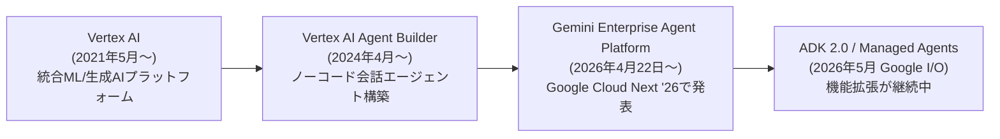

「Gemini Enterprise」という名称は2つの製品を指す点に注意してください。

- **Gemini Enterprise Agent Platform**：開発者・技術チーム向けの構築基盤（本ガイドの主題）
- **Gemini Enterprise app**：Agent Platform の上に構築された、社内の従業員がエージェントを発見・利用・共有するためのフロントエンドアプリケーション

初学者はまず「エージェントを作る場所が Agent Platform、作ったエージェントを社内の人が使う入口が Gemini Enterprise app」という区別を押さえておくと理解がスムーズです。

---

## 2. 全体アーキテクチャ：4つの柱

Gemini Enterprise Agent Platform は、公式ドキュメントにおいて **Build・Scale・Govern・Optimize** という4つの柱を軸に構成されています。

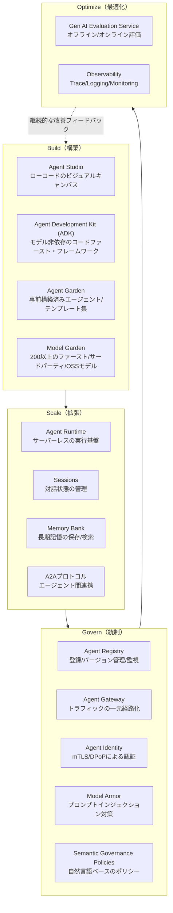

初学者にとって重要なのは、この4つが**一直線のパイプラインではなく循環するループ**であるという点です。評価（Optimize）で得た知見が、再びエージェントの設計（Build）にフィードバックされることで、エージェントの品質が継続的に改善されていきます。

---

## 3. 主要コンポーネント一覧

はじめに全体像をつかむため、主要コンポーネントを一覧化します。

| 分類 | コンポーネント | 役割 |
|---|---|---|
| Build | Agent Studio | コードを書かずに、ビジュアルキャンバス上でエージェントのフローとサブエージェントを設計できるローコードツール |
| Build | Agent Development Kit (ADK) | Python / Java / Go / TypeScript に対応した、モデル非依存のオープンソース・エージェント開発フレームワーク |
| Build | Agent Garden | 業種・用途別の事前構築済みエージェントやテンプレートのライブラリ |
| Build | Model Garden | Gemini モデル、Claude モデルファミリー、Gemma などの OSS モデルを含む 200 以上のモデルへのアクセス窓口 |
| Scale | Agent Runtime | エージェントをサーバーレスで実行するための管理された実行環境（旧 Vertex AI Agent Engine） |
| Scale | Sessions | ユーザーとエージェントの対話を保存し、会話コンテキストを維持する仕組み |
| Scale | Memory Bank | セッションをまたいだ長期記憶を保存・検索し、パーソナライズされた応答を可能にする |
| Scale | Example Store | Few-shot の実例を蓄積し、動的に取得してエージェントの応答品質を高める |
| Govern | Agent Registry | 組織内で承認されたエージェントとツール（MCPサーバーを含む）を一元管理する台帳 |
| Govern | Agent Gateway | すべてのエージェント間・エージェント-ツール間通信を経路化するコントロールプレーン |
| Govern | Agent Identity | エージェントごとに割り当てられる一意なID。mTLS と DPoP による暗号学的認証を提供 |
| Govern | Model Armor | プロンプトインジェクション、ジェイルブレイク、機密情報漏洩をリアルタイムで検知・遮断するガードレール |
| Govern | Semantic Governance Policies | 自然言語でツールの危険な組み合わせなどを制御するポリシーエンジン |
| Optimize | Gen AI Evaluation Service | ルーブリックベースの自動評価や、本番トラフィックに対するオンライン評価を提供 |
| Optimize | Observability | Cloud Trace / Logging / Monitoring と統合したトークン消費量・レイテンシ・エラー率・ツール呼び出しの可視化 |

---

## Step 0: 事前準備

初学者がまず最初に行う準備です。

1. **Google Cloud プロジェクトの作成**：課金アカウントを有効化したプロジェクトを1つ用意します。新規ユーザーは無料クレジット（申込時点で最大 $300）を利用できる場合があります。
2. **必要な API の有効化**：以下のように `gcloud` コマンドで有効化します。

```bash
gcloud services enable \
  aiplatform.googleapis.com \
  discoveryengine.googleapis.com \
  cloudbuild.googleapis.com \
  run.googleapis.com
```

3. **開発ツールの選択**：ローカルで Python 3.10 以上（ADK を使う場合）、または単にブラウザだけで始めるか（Agent Studio を使う場合）を決めます。
4. **認証情報の準備**：Gemini API キー（AI Studio 経由）または Google Cloud の Application Default Credentials（ADC）のいずれかを用意します。

> **ベストプラクティス**：ユーザー資格情報・サービスアカウントキー・API キーなどの機微情報は、決してコードベースに直接コミットしないでください。環境変数やシークレットマネージャーを利用します。

---

## Step 1: 開発パスを選ぶ（ノーコード vs プロコード）

Gemini Enterprise Agent Platform は、スキルレベルに応じて複数の入り口を用意しています。初学者はまずどちらのパスから始めるかを決めましょう。

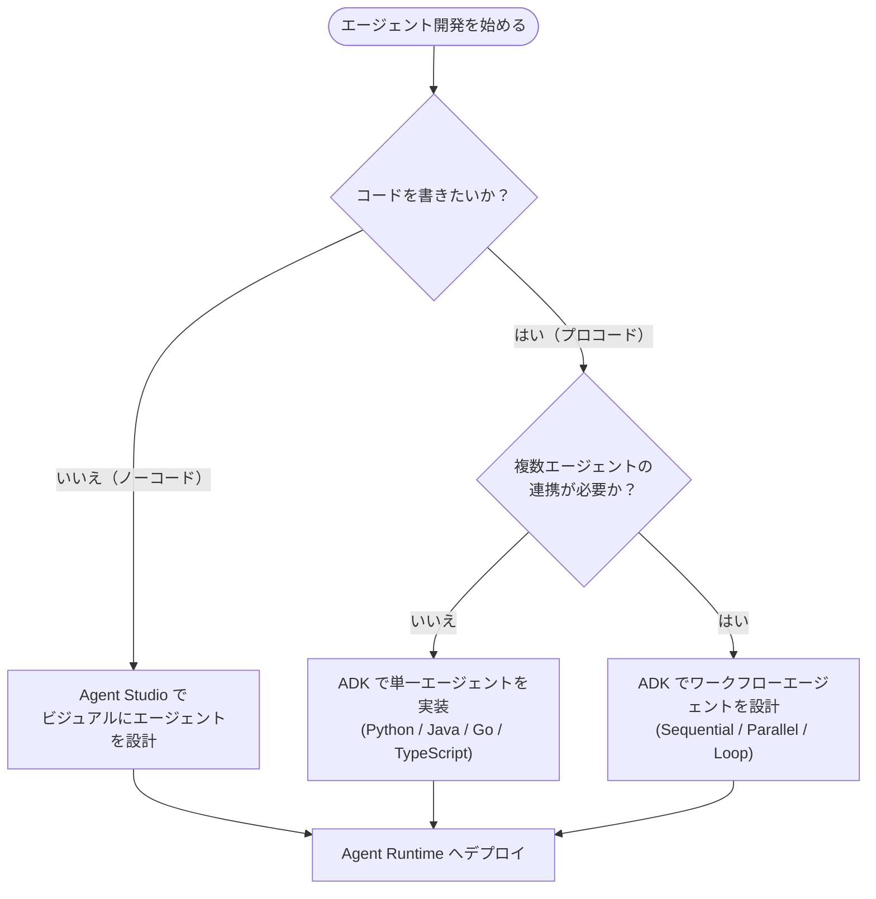

| 観点 | Agent Studio（ノーコード） | ADK（プロコード） |
|---|---|---|
| 対象者 | 業務担当者、プロトタイピングを急ぐエンジニア | ソフトウェアエンジニア、複雑な要件を持つチーム |
| 開発方法 | ブラウザ上のビジュアルキャンバスでフロー設計 | Python/Java/Go/TypeScript でコードを記述 |
| 得意な用途 | プロンプト設計、マルチモーダル検証、簡易な業務アシスタント | 複雑な推論、独自ツール統合、CI/CD、テスト駆動開発 |
| 移行性 | 「Export to ADK」でコードにエクスポート可能 | Agent Studio からのインポートも可能 |

初学者への推奨は、まず **Agent Studio で最小限のプロトタイプを作り、要件が複雑化したら ADK にエクスポートして本格開発に移行する**という順路です。

---

## Step 2: Agent Studio でノーコード開発

Agent Studio は、Google Cloud コンソールに組み込まれたビジュアル設計ツールです。

### 手順

1. Google Cloud コンソールの **Agents** ページを開く
2. **Create agent** をクリックし、Agent Studio のキャンバスを開く
3. **Flow タブ**で、メインエージェントとサブエージェントを視覚的に配置する
4. 各エージェントをクリックし、**Details パネル**で以下を設定する
   - **Name**：識別しやすい名前
   - **Description**：エージェントの目的の要約
   - **Instructions**：エージェントの振る舞いを導く指示（システムプロンプトに相当）
   - **Model**：Gemini など、動かすモデルを選択
   - **Tools**：エージェントがタスクを遂行するために使うツールを追加
5. 画面上のシミュレーターでリアルタイムに応答をテストする
6. 問題なければ **Deploy** から Cloud Run へのデプロイ、または ADK コードへのエクスポートを行う

### ベストプラクティス

- 最初のイテレーションでは、ツールを最小限に絞り、コア機能が正しく動くことを確認してから拡張する
- Instructions は曖昧な指示を避け、「何をすべきか」だけでなく「何をすべきでないか」も明記する
- シミュレーターで境界値（想定外の入力、悪意のある入力）を必ず試す

---

## Step 3: Agent Development Kit (ADK) でプロコード開発

ADK は、エージェントの構築・デバッグ・デプロイをソフトウェア開発の標準的なワークフローに近づけることを目的とした、オープンソースのフレームワークです。Python・Java・Go・TypeScript に対応しています。

### ADK のコアコンセプト

| 概念 | 説明 |
|---|---|
| Agent | 特定のシステム指示とツールを持つ、LLM 駆動の構成可能なオブジェクト |
| Runner | 実行フローを管理し、Events に基づいてエージェントの相互作用をオーケストレーションするエンジン |
| Session | ユーザーとの対話状態を標準化して管理する仕組み |
| Tools | Google 検索や BigQuery などの組み込みツール、または独自の関数ツール、MCP 経由のツール |
| Events | エージェントの実行過程で発生する出来事（メッセージ、ツール呼び出し、状態変化など） |

### プロジェクト構成の例

ADK プロジェクトでは、エージェントごとにディレクトリを分離する構成が推奨されています。

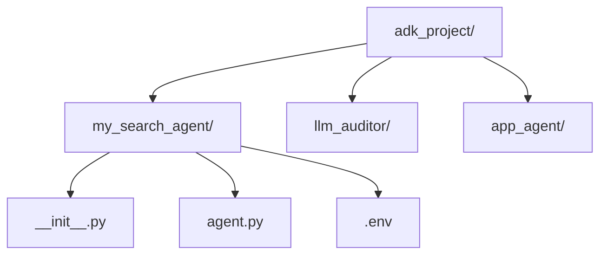

### 最小構成のエージェントコード例（Python）

```python
# my_search_agent/agent.py
from google.adk.agents import Agent
from google.adk.tools import google_search

root_agent = Agent(
    name="my_search_agent",
    model="gemini-2.5-flash",
    description="ウェブ検索を使ってユーザーの質問に答えるエージェント",
    instruction=(
        "ユーザーの質問に対して、必要であれば google_search ツールを使い、"
        "根拠を明示した簡潔な日本語で回答してください。"
        "分からない場合は推測せず、その旨を伝えてください。"
    ),
    tools=[google_search],
)
```

```text
# requirements.txt
google-adk
```

### ベストプラクティス

- 1つのエージェントに責務を詰め込みすぎない。複雑なタスクは Step 6 で扱うマルチエージェント構成に分割する
- `instruction` には、成功例だけでなく失敗を避けるための否定的な指示（〜しないでください）も含める
- モデル選定は「タスクの複雑さ」に応じて行う。単純な分類や抽出には軽量モデル、複雑な推論には高性能モデルを使う

---

## Step 4: ツールを追加する

エージェントの価値は「ツールをどう使わせるか」で大きく変わります。ADK は次の3種類のツール統合をサポートします。

1. **組み込みツール**：Google 検索、BigQuery など、あらかじめ用意された標準ツール
2. **カスタム関数ツール**：Python 関数などとして自作するツール。入出力を明確な型で定義する
3. **MCP (Model Context Protocol) 経由のツール**：外部システム（データベース、SaaS、社内API）に接続するための標準プロトコル

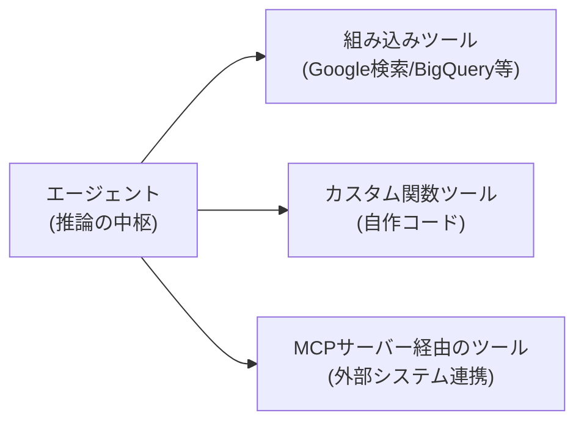

### ベストプラクティス

- ツールの説明（description）は、LLM がいつそのツールを選ぶべきかを判断できるよう、具体的かつ簡潔に書く
- ツールが多数になる場合は「Toolset」として整理し、関連ツールをグループ化する
- MCP サーバーに接続する際は、専用のサービスアカウントを用意し、必要最小限の IAM ロール（例：`viewer` であって `admin` ではない）のみを付与する
- 危険な操作（削除、送金など）を行うツールには、必ず確認ステップや承認フローを挟む

---

## Step 5: ローカルテストとデバッグ

ADK には、ローカル環境でエージェントを素早く試すための Web UI が付属しています。

```bash
# プロジェクトのルートディレクトリで実行
adk web
```

このコマンドを実行すると、ブラウザ上でエージェントとチャット形式で対話しながら、内部の推論過程・ツール呼び出し・レスポンスをステップごとに確認できます。

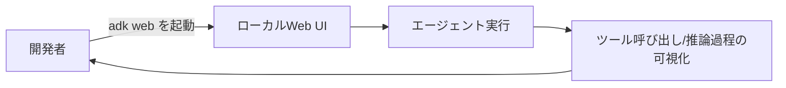

### ベストプラクティス

- 本番相当のツール（実データベースなど）に接続する前に、モックデータでロジックを検証する
- 想定される「悪意のある入力」（プロンプトインジェクションの試み）を必ずローカルでテストする
- OpenTelemetry ベースのログ・トレースが標準搭載されているため、早い段階からトレースの読み方に慣れておく

---

## Step 6: マルチエージェント・オーケストレーション設計パターン

1つのエージェントにすべての責務を負わせると、コンテキストウィンドウの制約や指示の複雑化により、性能が急激に劣化することが知られています。ADK は、これを解決するための **Workflow Agent** を提供しています。

### パターン比較表

| パターン | 実行方式 | 適した用途 |
|---|---|---|
| Sequential Agent | 前段の出力を次段の入力として渡す直列パイプライン | データ変換、多段階のコンテンツ生成 |
| Parallel Agent | 複数エージェントを同時実行し、結果を統合 | 独立した複数の情報源からの並行調査 |
| Loop Agent | 条件を満たすまで同じエージェントを反復実行 | 品質基準を満たすまでの反復的な生成・改善 |
| 動的ルーティング（LLM駆動） | ルートエージェントが状況に応じて委譲先を判断 | 問い合わせ内容に応じた専門エージェントへの振り分け |

### Sequential（逐次実行）

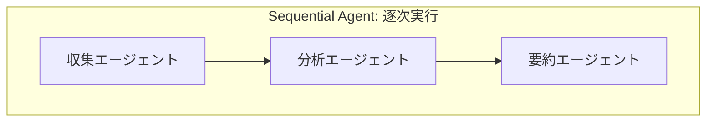

### Parallel（並列実行）

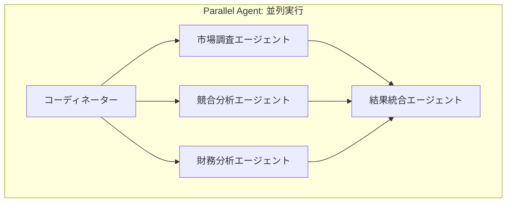

### Loop（反復実行）

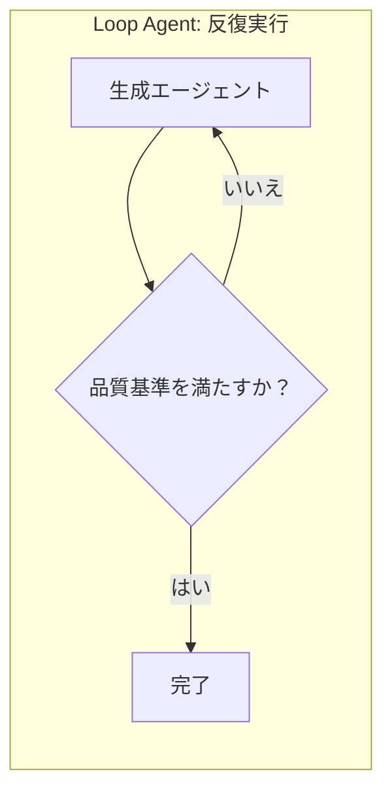

### 動的ルーティング（階層型）

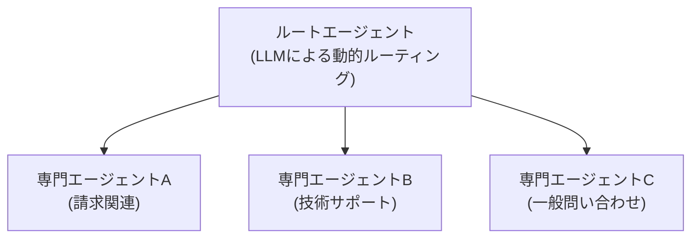

### ベストプラクティス

- Workflow Agent（Sequential/Parallel/Loop）は**決定的**な制御が必要な場面で使い、LLM 駆動の動的委譲は**柔軟な判断**が必要な場面で使い分ける
- すべてのサブエージェントは同じ `InvocationContext` を共有できるため、`session.state` を介したデータの受け渡しを設計段階で明確にする
- 専門化の原則（Specialization）に従い、各エージェントの担当領域を狭く保つことで、個々のプロンプトをシンプルに保つ

---

## Step 7: Agent2Agent (A2A) プロトコルによるエージェント間連携

**A2A (Agent2Agent) プロトコル**は、Google が提唱し Linux Foundation に寄贈されたオープン標準で、異なるフレームワーク（ADK、LangGraph、CrewAI など）で構築されたエージェント同士が、共通の「Agent Card」スキーマと JSON-RPC 2.0 形式のメッセージで連携できるようにするものです。

**MCP（Model Context Protocol）**が「エージェント対ツール」の垂直統合を担うのに対し、**A2A** は「エージェント対エージェント」の水平的な連携を担います。両者は競合するものではなく、併用するのがベストプラクティスとされています。

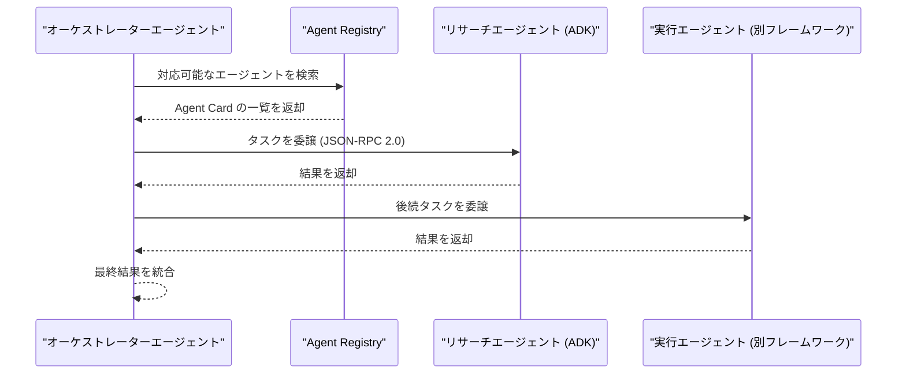

Gemini Enterprise Agent Platform の **Agent Runtime** への ADK デプロイと、A2A 経由でのエージェント公開は独立したプロセスです。
ADK によるデプロイで自動的に登録・管理されるのは **Agent Registry** のみです。
他のエージェントから A2A の Agent Card として発見可能にするには、単に ADK でデプロイするだけでなく、A2A プロトコルの仕様を満たすように実装した上で、`AgentCard` および `AgentExecutor` を明示的に提供する必要があります（デプロイするだけで自動的に skills や inference URL が取得されるわけではありません）。

### ベストプラクティス

- エージェント間のハンドオフは、API 契約と同様に**明示的・構造化・バージョン管理**された形で設計する
- 組織をまたぐ連携では、A2A のセキュリティカード署名機能を活用し、なりすましを防止する
- 単一フレームワークで完結する場合は A2A を無理に導入せず、まずは ADK 標準のワークフローエージェントで十分か検討する

---

## Step 8: 評価（Evaluation）とデータフライホイール

エージェントは非決定的に動作するため、通常のソフトウェアテストだけでは品質を担保できません。Gen AI Evaluation Service を使い、継続的な評価ループを構築します。

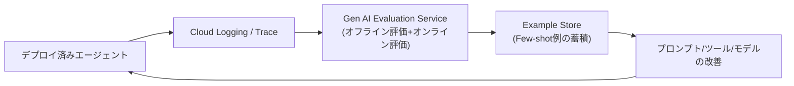

| 評価手法 | 説明 | 使いどころ |
|---|---|---|
| ルーブリックベース評価 | 明確な評価基準（ルーブリック）に基づき自動採点 | 開発中の回帰テスト |
| マルチターン自動採点（auto-rater） | 複数ターンの会話品質をLLM自身に評価させる | 対話エージェントの品質検証 |
| オンライン評価 | 本番の実トラフィックに対してリアルタイムで評価 | 本番投入後の継続監視 |
| Unified Trace Viewer | エージェントの推論経路をステップごとに可視化 | 非決定的な失敗のデバッグ |

### ベストプラクティス

- デプロイ前に必ずオフライン評価データセットで回帰テストを行う（Agent Starter Pack の評価統合機能が活用できる）
- 本番投入後もオンライン評価を止めず、モデルやプロンプトの微修正がユーザー体験に与える影響を継続的に監視する
- Example Store に蓄積した優良事例を Few-shot として活用し、プロンプトエンジニアリングだけに頼らない品質改善サイクルを作る

---

## Step 9: デプロイ（Agent Runtime / Cloud Run / GKE）

ADK エージェントを本番環境に移行する際は、要件に応じて3つの選択肢があります。

| デプロイ先 | 特徴 | 向いているケース |
|---|---|---|
| Agent Runtime | サーバーレスで完全マネージド。A2A・Sessions・Memory Bank・Observability が標準統合 | 迅速に本番運用したい、インフラ管理を最小化したい場合 |
| Cloud Run | 柔軟性が高く、カスタムUI・特殊なネットワーク要件・スケールtoゼロに対応 | コストを抑えたい、独自のWeb UIを持たせたい場合 |
| GKE / カスタムインフラ | 最大限の制御が可能 | 既存のKubernetes基盤に統合したい、特殊な要件がある場合 |

### Agent Starter Pack を使ったデプロイフロー

**Agent Starter Pack** は、Google Cloud が提供する本番運用向けテンプレート集で、CI/CD・Terraform によるインフラ定義・評価統合・セキュリティ設定をあらかじめ備えています。

```bash
# ReAct/RAG/マルチエージェントなどのテンプレートから選択して新規プロジェクトを作成
uvx agent-starter-pack create my-agent-project -a adk@rag
```

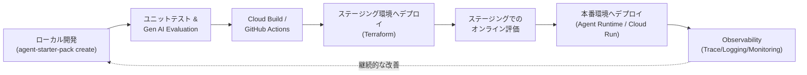

### ベストプラクティス

- プロトタイピング段階から Agent Starter Pack を使うことで、後から CI/CD やセキュリティ設定を後付けする手戻りを防げる
- ステージング環境でオンライン評価を実施してから本番昇格させる、段階的リリースを徹底する
- Cloud Run を選ぶ場合、スポラディックなトラフィックにはスケールtoゼロ設定でコストを最適化する

---

## Step 10: セキュリティとガバナンス

エージェントは非決定的に動作し、人間の監督なしに行動する可能性があるため、多層防御（Defense in Depth）の設計が不可欠です。

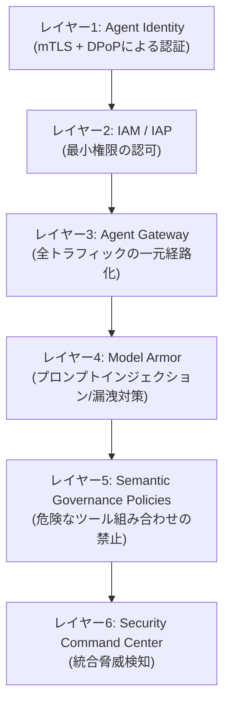

### リクエストのライフサイクル

エージェント宛のリクエストが Agent Gateway を通過する流れは次の通りです。

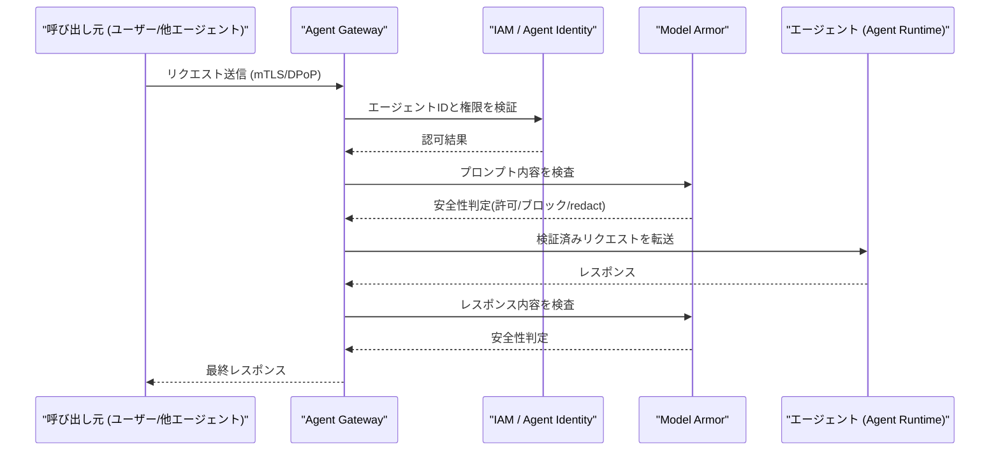

### セキュリティ・ガバナンスのベストプラクティス一覧

| 項目 | 推奨事項 |
|---|---|
| エージェントIDの分離 | エージェント／アプリケーションごとに専用のサービスアカウントを用意し、既存の広範な権限を持つアカウントを使い回さない |
| 最小権限の原則 | 例えば `viewer` ロールで十分な場合に `admin` ロールを付与しない |
| Model Armor の有効化 | プロンプトインジェクション、ジェイルブレイク、機密情報漏洩を検知するテンプレートを設定する |
| Agent Gateway 経由の一元化 | Agent-to-Agent 通信を含む、すべてのエージェント通信を Agent Gateway 経由にルーティングする |
| ドライラン運用の徹底 | Semantic Governance Policies や IAP は、まずドライランモードで検証してから強制適用に切り替える |
| MCPサーバーの隔離 | VPC Service Controls で MCP サーバーとデータをリングフェンスし、データ持ち出しを防止する |
| ツールのフィルタ設計 | ユーザーが指定した条件をエージェントが直接クエリに埋め込める設計を避け、専用の安全な関数（例：`lookup_active_order`）を用意する |
| 統合監視 | Security Command Center で脅威検知とAIポスチャ管理を一元化する |
| トレースIDによる相関 | Agent Gateway〜Model Armor〜下流エージェントまでのログとトレースをトレースIDで関連付ける |

---

## Step 11: 可観測性（Observability）とモニタリング

エージェントは自律的に振る舞うため、内部状態を可視化する仕組みが信頼性確保の土台になります。

| シグナル | 用途 |
|---|---|
| トークン消費量 | コストとレイテンシの主要因を把握する |
| レイテンシ | ユーザー体験への影響、ボトルネックの特定 |
| エラー率 | 障害検知とアラートのトリガー |
| ツール呼び出しのトレース | エージェントがどのツールをどの順序で呼んだかを追跡し、非決定的な失敗の原因を特定する |

Cloud Trace（OpenTelemetry 対応）、Cloud Monitoring、Cloud Logging と統合されたダッシュボードにより、これらを一元的に確認できます。

### ベストプラクティス

- ローカル開発時に使う `adk web` の体験をそのまま本番監視に持ち込めるよう、開発初期からトレースの読み方に慣れておく
- マルチエージェント構成では、エージェント単位のトレースに加えて、オーケストレーター全体のトレース相関を確認できるダッシュボードを用意する
- 複雑な非決定的ワークフロー（マルチエージェント、ツールチェーン）では、標準機能に加えてカスタムダッシュボードや追加の監視フックを検討する

---

## Step 12: コスト最適化

Gemini Enterprise Agent Platform は従量課金制です。主な課金要素は次の通りです。

| 課金要素 | 課金基準 |
|---|---|
| 生成AI（テキスト/チャット/コード生成） | 入出力の文字数(1,000文字あたり) |
| Agent Runtime | vCPU使用時間ベース |
| Agent Platform Pipelines | 実行あたりの料金 |
| Agent Platform Vector Search | データ量・クエリ数(QPS)・ノード数 |
| ノートブック/ストレージ | Compute Engine / Cloud Storage と同水準 |

### ベストプラクティス

- タスクの複雑さに見合ったモデルサイズを選ぶ（単純作業に高性能・高コストなモデルを使わない）
- スポラディックなトラフィックには Cloud Run のスケールtoゼロを活用し、アイドル時のコストを抑える
- 新規プロジェクトでは無料クレジットや無料枠を活用し、小規模な検証で設計を固めてから本番規模にスケールする
- 料金は変更されることがあるため、実装前に必ず最新の公式価格ページで確認する

---

## 17. ベストプラクティス総まとめチェックリスト

- [ ] エージェントの責務は単一・明確にし、複雑なタスクはマルチエージェントに分割したか
- [ ] Instructions に「やるべきこと」だけでなく「やってはいけないこと」を明記したか
- [ ] ツールの説明文は、LLM が適切に選択できるほど具体的か
- [ ] ローカル環境でプロンプトインジェクションなどの悪意ある入力をテストしたか
- [ ] デプロイ前にオフライン評価で回帰テストを行ったか
- [ ] 本番投入後もオンライン評価とトレースによる継続監視を行っているか
- [ ] エージェントごとに専用のサービスアカウントと最小権限を設定したか
- [ ] すべてのエージェント通信を Agent Gateway 経由に統一したか
- [ ] Model Armor でプロンプトインジェクション対策を有効化したか
- [ ] Semantic Governance Policies や IAP をドライランで検証してから本適用したか
- [ ] MCPサーバーを VPC Service Controls でリングフェンスしたか
- [ ] コストと性能のバランスを踏まえてモデルサイズを選定したか

---

## 18. よくある落とし穴（アンチパターン）

| アンチパターン | 問題点 | 対策 |
|---|---|---|
| 単一の万能エージェント | コンテキスト過多で性能が非線形に劣化する | Sequential/Parallel/Loop などへの分割 |
| 広範な権限を持つ共有サービスアカウントの使い回し | 侵害時の影響範囲が広がる | エージェントごとの専用ID・最小権限 |
| Model Armor/ガバナンスポリシーをいきなり強制適用 | 想定外のブロックで業務が止まる | まずドライランで検証 |
| ローカル動作確認だけで本番投入 | 非決定的な失敗が本番で初めて顕在化する | オフライン評価+オンライン評価の徹底 |
| ツール説明が曖昧 | LLM が誤ったツールを選択する | 具体的かつ簡潔なツール説明を書く |
| ユーザー入力を直接クエリに埋め込む設計 | インジェクション経由でのデータ漏洩リスク | 安全な専用関数でパラメータを外部化する |

---

## 19. 2026年7月時点の最新動向

本ガイド執筆時点（2026年7月18日）で押さえておくべき最新の動きを補足します。

- **Google Cloud Next '26（2026年4月22日）**：Gemini Enterprise Agent Platform が Vertex AI の進化系として正式発表され、Agent Gateway・Agent Identity・Semantic Governance Policies などのガバナンス機能が拡充されました。
- **Google I/O '26（2026年5月）**：ADK 2.0 とともに、Google Antigravity（Gemini 3.5 Flash を基盤とする Managed Agents）が発表されました。エージェントは `AGENTS.md` や `SKILL.md` といったバージョン管理可能な Markdown ファイルで定義できるようになり、各 Managed Agent には専用のエフェメラルなサンドボックスが提供されます。A2A や Agent Platform のガバナンス機能との本格統合は今後の展開が予定されています。
- **CX Agent Studio**：ADK を基盤とした低コード・AIオーグメンテッドな会話エージェント構築ツールとして、カスタマーエクスペリエンス領域向けに提供されています。
- **セキュリティ機能の拡充**：Identity-Aware Proxy (IAP) のエージェント向け対応、Certificate Manager による Agent Identity 証明書管理などがプレビュー展開されています。

これらは変化の速い領域のため、実装前には必ず公式ドキュメントで最新状況を確認してください。

---

## 20. 参考文献・出典一覧

### 公式ドキュメント・公式ブログ

- Gemini Enterprise Agent Platform 製品ページ: https://cloud.google.com/products/gemini-enterprise-agent-platform
- プラットフォーム概要ドキュメント: https://docs.cloud.google.com/gemini-enterprise-agent-platform/overview
- 発表ブログ「The new Gemini Enterprise」: https://cloud.google.com/blog/products/ai-machine-learning/the-new-gemini-enterprise-one-platform-for-agent-development
- 発表ブログ「Introducing Gemini Enterprise Agent Platform」: https://cloud.google.com/blog/products/ai-machine-learning/introducing-gemini-enterprise-agent-platform
- Agents 概要ドキュメント: https://docs.cloud.google.com/gemini-enterprise-agent-platform/agents
- Build ドキュメント: https://docs.cloud.google.com/gemini-enterprise-agent-platform/build
- ADK ドキュメント: https://docs.cloud.google.com/gemini-enterprise-agent-platform/build/adk
- ADK Google Cloud連携ガイド: https://adk.dev/get-started/google-cloud/
- ADKビルド用コードラボ: https://codelabs.developers.google.com/build-ai-agent-google-adk
- Agent Gateway 概要: https://docs.cloud.google.com/gemini-enterprise-agent-platform/govern/gateways/agent-gateway-overview
- Agent Gateway セットアップガイド: https://docs.cloud.google.com/gemini-enterprise-agent-platform/govern/gateways/set-up-agent-gateway
- Model Armor と Agent Gateway の統合: https://docs.cloud.google.com/model-armor/model-armor-agent-gateway-integration
- Agent Identity 概要: https://docs.cloud.google.com/iam/docs/agent-identity-overview
- MCP連携のセキュリティベストプラクティス（Spanner向け）: https://docs.cloud.google.com/spanner/docs/secure-agent-interactions-mcp
- IAMの新機能まとめブログ: https://cloud.google.com/blog/products/identity-security/whats-new-in-iam-security-governance-and-runtime-defense
- Agent Gatewayガバナンスのコードラボ: https://codelabs.developers.google.com/cloudnet-agent-gateway
- A2Aプロトコル発表ブログ: https://developers.googleblog.com/en/a2a-a-new-era-of-agent-interoperability/
- A2A + Agent Runtimeのコードラボ: https://codelabs.developers.google.com/adk-a2a-agent-runtime
- Vertex AI Agent Engine（Agent Runtime）概要: https://cloud.google.com/agent-builder/agent-engine/overview
- Agent Builder拡張ブログ: https://cloud.google.com/blog/products/ai-machine-learning/more-ways-to-build-and-scale-ai-agents-with-vertex-ai-agent-builder
- エージェント設計パターンの選び方（Architecture Center）: https://docs.cloud.google.com/architecture/choose-design-pattern-agentic-ai-system
- エージェントアーキテクチャ構成要素の選び方: https://docs.cloud.google.com/architecture/choose-agentic-ai-architecture-components
- マルチエージェントAIシステムのリファレンスアーキテクチャ: https://docs.cloud.google.com/architecture/multiagent-ai-system
- Well-Architected Framework: AI/ML の視点: https://docs.cloud.google.com/architecture/framework/perspectives/ai-ml
- Agent Starter Pack 公式サイト: https://googlecloudplatform.github.io/agent-starter-pack/
- Agent Starter Pack GitHubリポジトリ: https://github.com/googlecloudplatform/agent-starter-pack

### 海外の開発者・実務者による記事

- Vishal Bulbule「Build Powerful AI Agents with Google ADK Tools and Best Practices」(Google Cloud Community, Medium): https://medium.com/google-cloud/build-powerful-ai-agents-with-google-adk-tools-and-best-practices-adk-blo-bb9af140662f
- Vishal Bulbule「Agent Development Kit (ADK) Deployment Guide」(Medium, 2026年7月): https://medium.com/google-cloud/agent-development-kit-adk-deployment-guide-0a927ccc6e69
- Yusuf Baykaloğlu「Multi-Agent Systems: Orchestrating AI Agents with A2A Protocol」(Medium): https://medium.com/@yusufbaykaloglu/multi-agent-systems-orchestrating-ai-agents-with-a2a-protocol-19a27077aed8
- 「AI Agent Observability with ADK on Google Cloud」(Google Cloud Community, Medium): https://medium.com/google-cloud/ai-agent-observability-based-on-agent-development-kit-adk-approach-565c82cb8c80
- Yash Kavaiya「Getting Started with CX Agent Studio」(Google Cloud Community, Medium, 2026年5月): https://medium.com/google-cloud/getting-started-with-cx-agent-studio-setting-up-and-building-your-first-agent-step-by-step-849d2a0aa5c5
- sk_firdous_ali「Gemini Enterprise Agent Platform: A Developer's First Look (And Honest Critique)」(DEV Community): https://dev.to/sk_firdous_ali/gemini-enterprise-agent-platform-a-developers-first-look-and-honest-critique-5f8m
- njericodecraft「Building Smart in 2026: A Hands-On First Look at Google's Agent Development Kit (ADK)」(DEV Community): https://dev.to/njericodecraft/building-smart-in-2026-a-hands-on-first-look-at-googles-agent-development-kit-adk-3n0
- 「Google I/O '26 Fills Out Enterprise Agent Stack with Managed Agents, ADK 2.0」(Virtualization Review): https://virtualizationreview.com/articles/2026/05/19/google-io-26-fills-out-enterprise-agent-stack-with-managed-agents-adk-2,-d-,0.aspx
- 「Google boosts Vertex AI Agent Builder with new observability and deployment tools」(InfoWorld): https://www.infoworld.com/article/4085736/google-boosts-vertex-ai-agent-builder-with-new-observability-and-deployment-tools.html
- 「Vertex AI Agent Builder: 2026 guide」(UI Bakery Blog、料金体系の第三者解説): https://uibakery.io/blog/vertex-ai-agent-builder

> **注記**：本ガイドは 2026年7月18日時点で確認できた公開情報に基づいています。Gemini Enterprise Agent Platform は変化が速い領域のため、実装の際は必ず上記の公式ドキュメントで最新情報を確認してください。
