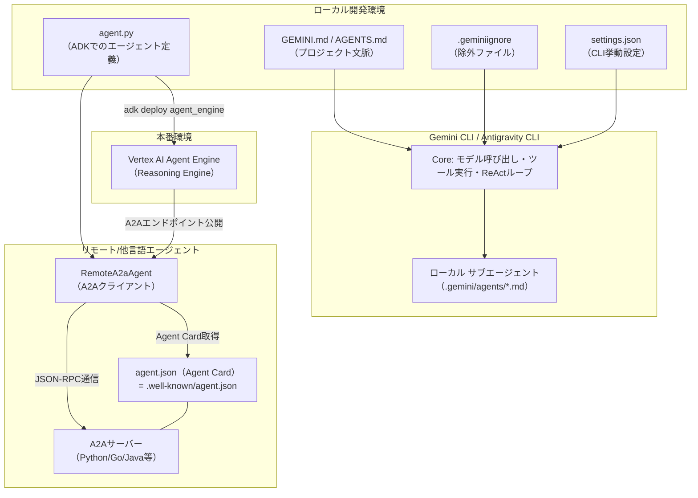
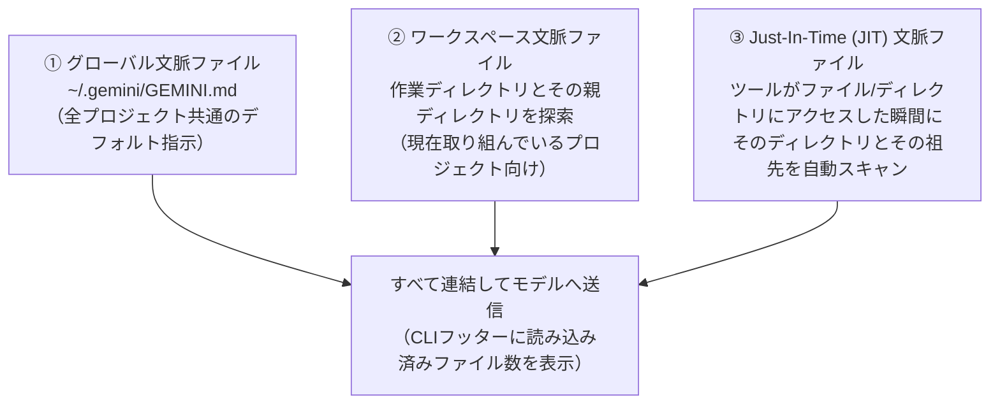
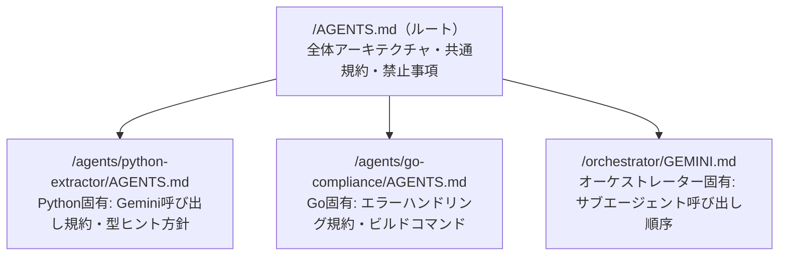
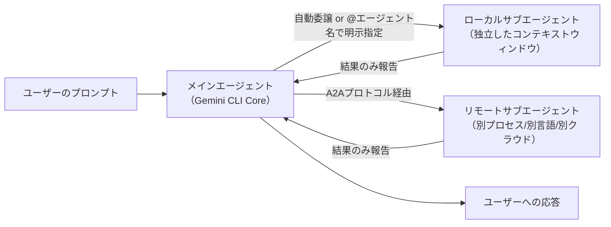
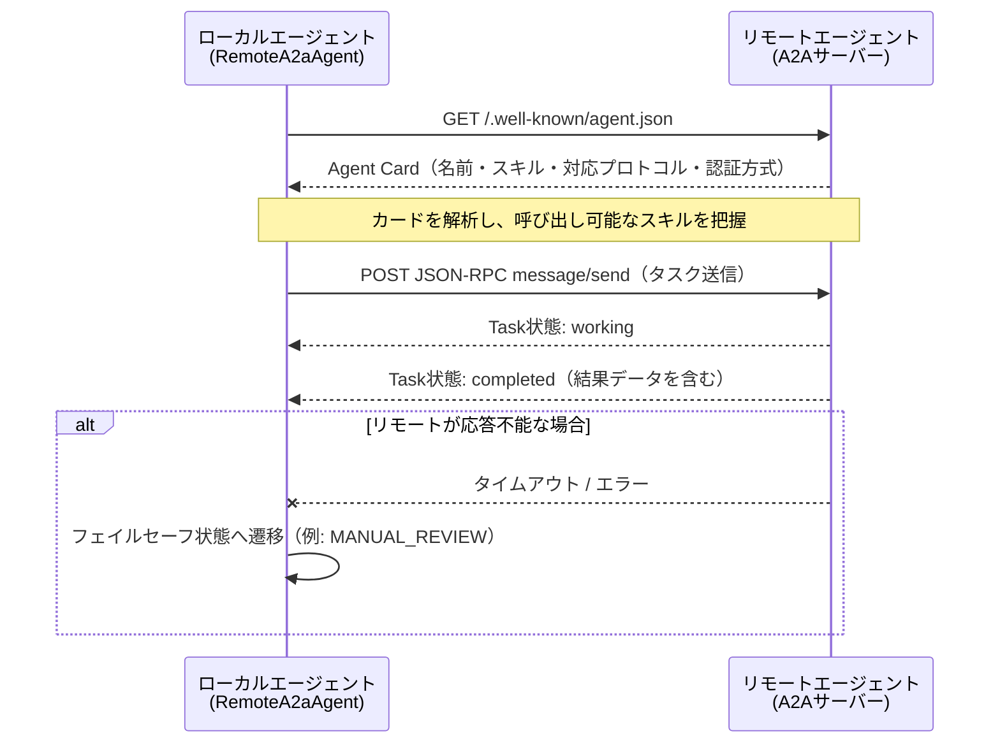
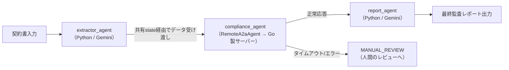
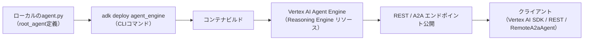
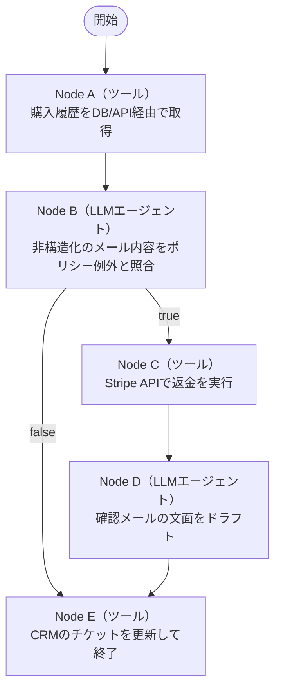

# Gemini マルチエージェント開発 ベストプラクティス完全ガイド

### GEMINI.md・AGENTS.md・agent.py・.geminiignore・settings.json・A2A・Agent Engine まで

> 対象読者: Gemini CLI / Google Agent Development Kit (ADK) を使ってマルチエージェントシステムを構築したい初学者〜中級エンジニア
> 前提知識: Python の基礎文法、ターミナル操作、JSON/YAML の読み書き
> 情報基準日: 2026年7月26日時点でのウェブ検索結果に基づく（出典は末尾の「参考文献」を参照）

---

## 0. はじめに — このガイドを読む前に知っておくべきこと

このガイドは、Gemini エコシステムでマルチエージェント（複数の AI エージェントが協調して動くシステム）を開発するときに触れることになる、5つの設定ファイル・コードファイルと、それらをつなぐ2つのプロトコル/サービスを、初学者でも迷わないようにステップバイステップで解説します。

| # | ファイル/概念 | 役割を一言でいうと |
|---|---|---|
| 1 | `GEMINI.md` | エージェントに「このプロジェクトのルール」を教える指示書 |
| 2 | `AGENTS.md` | 複数のAIツール共通の「エージェント向けREADME」オープン標準 |
| 3 | `.geminiignore` | エージェントに「見せたくないファイル」を隠す除外リスト |
| 4 | `settings.json` | Gemini CLI 自体の挙動（承認モード、サブエージェント、セキュリティ等）を設定する本体設定ファイル |
| 5 | `agent.py` | ADK でエージェントのロジック・ツール・サブエージェント構成をPythonコードとして定義するファイル |
| 6 | A2A プロトコル / `agent.json`（Agent Card） | 異なるエージェント同士が「何ができるか」を名刺交換のように開示し合い、通信するための共通規格 |
| 7 | Vertex AI Agent Engine | 作ったエージェントを本番環境（クラウド）にデプロイして自動スケールさせるマネージドサービス |

### 2026年7月時点の重要な前提（必ず先に読んでください）

Gemini CLI を取り巻く状況は2026年に入って大きく動いています。ガイドの内容を実践する前に、以下の2点を押さえておくと迷いません。

1. **Gemini CLI は個人向け無償/Google One 利用枠では Antigravity CLI に統合されつつあります。** Google は2026年5月19日、Gemini CLI と Antigravity CLI を「マルチエージェント時代に向けた単一プラットフォーム」に統合する方針を発表し、2026年6月18日をもって Google AI Pro/Ultra および無償の Gemini Code Assist 個人利用枠向けの Gemini CLI へのリクエスト提供を終了しました。一方で、**Gemini Code Assist Standard/Enterprise ライセンス、または有償の Gemini / Gemini Enterprise Agent Platform API キーを利用する企業ユーザーには、これまで通り Gemini CLI へのアクセスが提供され続けます**。このガイドで解説する `GEMINI.md` / `.geminiignore` / `settings.json` / サブエージェントの仕組みは、企業向けに存続する Gemini CLI、および後継の Antigravity CLI の両方で（Agent Skills・Hooks・Subagents・拡張機能というかたちで）概ね引き継がれています。
2. **ADK（Agent Development Kit）は 2.0 世代に入り、「決定論的ワークフロー」という新しい柱が加わりました。** 2026年7月1日に公開された Google の技術ブログによれば、ADK 2.0 では自律的なLLMエージェントに加えて、ビジネスロジックをコードで厳密に制御する `Workflow`（有向グラフ実行エンジン）が導入されています。マルチエージェント設計をする際は「LLMに任せるべき部分」と「コードで固定すべき部分」を切り分ける、という新しい設計判断が必要になります（詳細は第9章）。

これらの背景を踏まえたうえで、以下、各ファイル・概念を順番に見ていきます。

---

## 1. エコシステム全体像を1枚の図でつかむ

個別のファイルに入る前に、これらがどう連携しているかを俯瞰します。



読み方: `GEMINI.md` / `.geminiignore` / `settings.json` はいずれも **Gemini CLI 自体を賢く・安全にするための設定**です。一方 `agent.py` と `agent.json`（Agent Card）は **ADK で作る個々のエージェント（コード側の実体）** を定義するもので、A2Aプロトコルを介してエージェント同士、あるいは Gemini CLI のサブエージェントとして接続されます。最終的に `agent.py` は Vertex AI Agent Engine にデプロイして本番運用します。

---

## 2. GEMINI.md — プロジェクトの「文脈」を教える指示書

### 2.1 何をするファイルか

`GEMINI.md` は、毎回のプロンプトで同じ指示を繰り返す代わりに、プロジェクト固有のルール（コーディング規約、対象読者、テストの実行方法など）を一度だけ書いておくファイルです。Gemini CLI はこれを自動的に読み込み、モデルへのすべてのリクエストに文脈として付加します。

### 2.2 3段階の階層システム（超重要）

`GEMINI.md` は1ファイルだけではなく、以下の3段階で読み込まれ、**すべて連結されて**モデルに渡されます。



- **①グローバル**: `~/.gemini/GEMINI.md`（ホームディレクトリ）。すべてのプロジェクトに適用したいデフォルトの指示（例:「常に日本語で回答する」等）を置きます。
- **②ワークスペース**: 作業ディレクトリとその親ディレクトリを探索して見つかった `GEMINI.md`。現在のプロジェクト向けのルールです。
- **③JIT（Just-In-Time）**: モデルがツールで特定のディレクトリのファイルに触れた瞬間に、そのディレクトリとその祖先ディレクトリの `GEMINI.md` を都度スキャンして読み込みます。これにより、モノレポの特定コンポーネントだけに関係する詳細ルールを、必要になったときだけ読み込ませることができます（＝第4章のマルチエージェント設計で重要）。

### 2.3 書き方のベストプラクティス（ステップバイステップ）

1. **`/init` コマンドで雛形を作る。** プロジェクトルートで Gemini CLI を起動し `/init` を実行すると、リポジトリを解析して `GEMINI.md` の初期版を自動生成してくれます。
2. **簡潔に、目的ベースで書く。** 公式のベストプラクティスは「モデルがコードから推測できない情報だけ書け」「最初は50行以内に抑え、実際にギャップが出たときだけ育てる」という考え方です。冗長なドキュメントの全文コピーは避けます。
3. **見出し構造で整理する。** `# プロジェクト概要` → `## 全般的な指示` → `## コーディングスタイル` のように、見出しでセクションを区切ります。
4. **500行を超えたら分割する。** 巨大化してきたら `@ファイルパス` のインポート構文でモジュール化します。

```markdown
# Project: My TypeScript Library

## General Instructions
- 新しいTypeScriptコードを生成する際は、既存のコーディングスタイルに従うこと。
- 新しい関数・クラスには必ずJSDocコメントを付けること。
- 可能な限り関数型プログラミングのパラダイムを優先すること。

## Coding Style
- インデントはスペース2つ。
- インターフェース名には `I` プレフィックスを付ける（例: `IUserService`）。
- 常に厳密等価演算子（`===` と `!==`）を使うこと。
```

5. **`@file.md` 構文でインポートして分割する。**

```markdown
# Main GEMINI.md file
これはメインの内容です。

@./components/instructions.md

さらに内容が続きます。

@../shared/style-guide.md
```

6. **`/memory` コマンドで検証する。**
   - `/memory show` — 現在読み込まれている連結後の文脈全文を表示（実際にモデルに渡っている内容を確認できる）
   - `/memory reload` — すべての `GEMINI.md` を再スキャンして再読み込み

### 2.4 実践チェックリスト

- [ ] `/init` で下地を作ったか
- [ ] 「コードから読み取れないこと」だけを書いているか（重複情報を削ったか）
- [ ] セクション見出しで整理されているか
- [ ] 500行以内、または `@import` で分割されているか
- [ ] `/memory show` で意図通りの内容が読み込まれているか確認したか

---

## 3. GEMINI.md と AGENTS.md — どちらを使うべきか

### 3.1 AGENTS.md とは何か

`AGENTS.md` は特定ベンダーに縛られない、**業界横断のオープンフォーマット**です。OpenAI Codex・Amp・Google Jules・Cursor・Factory など複数の企業が協力して策定し、現在では Codex・Cursor・GitHub Copilot・Gemini CLI・Aider・Windsurf・Zed など20を超えるツールがネイティブに読み込みます。「エージェント向けのREADME」と考えると分かりやすく、必須フィールドも決まったスキーマもない、プレーンな Markdown です。

### 3.2 なぜ2つ存在するのか、どう使い分けるか

`GEMINI.md` は Gemini CLI 専用の名称・階層読み込みロジック（グローバル/ワークスペース/JIT、`@import`構文）を持つ **Gemini CLI 固有の仕組み**です。一方 `AGENTS.md` は **どのツールでも読める共通ファイル**という位置づけです。

| 観点 | GEMINI.md | AGENTS.md |
|---|---|---|
| 標準化団体 | Google（Gemini CLI固有） | 複数ベンダー共同策定のオープン標準 |
| 対応ツール | Gemini CLI / Antigravity CLI | Codex, Cursor, Copilot, Gemini CLI, Aider, Windsurf, Zed 等20以上 |
| 階層読み込み | グローバル→ワークスペース→JIT の3段階 | 最も近いディレクトリのファイルが優先（モノレポの各パッケージに配置可） |
| インポート構文 | `@file.md` をサポート | 仕様上の特別な構文なし（プレーンMarkdown） |
| チーム内での使い方 | Gemini CLI 中心のチームに最適 | 複数のAIツールを併用するチーム・OSSリポジトリに最適 |

### 3.3 実は共存できる — settings.json での統合設定

Gemini CLI は `settings.json` の `context.fileName` プロパティで、読み込むファイル名を変更・追加できます。これを使うと、`AGENTS.md` を正としつつ Gemini CLI にも読ませる、という一石二鳥の運用が可能です。

```json
{
  "context": {
    "fileName": ["AGENTS.md", "CONTEXT.md", "GEMINI.md"]
  }
}
```

この配列に指定した名前のファイルが、指定した優先順で（複数存在すれば全て連結して）読み込まれます。**複数のAIコーディングツールを併用するチームでは、`AGENTS.md` を単一の情報源にして `GEMINI.md` は作らない、という運用が2026年時点でのベストプラクティスとして定着しつつあります。**

### 3.4 ステップバイステップ: 移行手順

1. リポジトリ直下に `AGENTS.md` を作成し、ビルドコマンド・テストコマンド・コーディング規約・触れてはいけないファイルなどを記述する。
2. `.gemini/settings.json`（ワークスペース設定）に `context.fileName` を追加し、`AGENTS.md` を最優先で読み込ませる。
3. モノレポの場合、各パッケージのルートにもその場限りの `AGENTS.md` を追加する（最も近いファイルが優先されるため、サブプロジェクトごとの独自ルールを上書き指定できる）。
4. 既存の `GEMINI.md` の内容を `AGENTS.md` に統合し、重複を避ける。

---

## 4. マルチエージェント向け GEMINI.md / AGENTS.md 設計

単一エージェントのプロジェクトと違い、複数のエージェントが協調するプロジェクトでは、文脈ファイルの設計そのものが「誰にどの情報を、いつ見せるか」という設計問題になります。

### 4.1 モノレポ型階層設計



第2章で解説した JIT（Just-In-Time）読み込みの仕組みにより、モデルが `agents/go-compliance/` 配下のファイルを開いた瞬間だけ、その場所の `AGENTS.md` が自動的に追加読み込みされます。これにより、ルートの `AGENTS.md` を薄く保ちながら、各サブエージェントの専門知識を必要な時にだけ注入できます。

### 4.2 マルチエージェント特有の記述内容

単一エージェントの `GEMINI.md`／`AGENTS.md` には書かない、マルチエージェント特有の情報を追加します。

- **エージェント間の責務分担の一覧**（例: 「抽出は `extractor_agent`、コンプライアンス検証は Go 製のリモートエージェント `compliance_agent`、レポート生成は `report_agent` が担当」）
- **共有状態（shared state）のキー名とスキーマ**（後述する `ToolContext.state` 経由で受け渡すデータの形）
- **フェイルセーフの挙動**（あるサブエージェントが応答不能な場合、どのステートに遷移すべきか。例:「Goのコンプライアンスエージェントが3回リトライしても応答しない場合は `MANUAL_REVIEW` 状態へ遷移し、人間のレビューに回す」）
- **サブエージェントの呼び出し粒度に関する指示**（「どのタスクをメインエージェントが直接処理し、どこからサブエージェントに委譲すべきか」の判断基準）

### 4.3 サブエージェント定義ファイルとの役割分担

ローカルサブエージェントは `.gemini/agents/*.md` という **別ファイル**（YAMLフロントマター付きMarkdown）で定義します（詳細は第6章）。`GEMINI.md`／`AGENTS.md` は「プロジェクト全体のルール」、サブエージェント定義ファイルは「個々のサブエージェントの人格・権限」という住み分けです。この2つを混同せず、`GEMINI.md` にサブエージェントの詳細なシステムプロンプトを書き込まないようにするのがコツです。

---

## 5. .geminiignore — 見せたくないファイルを隠す

### 5.1 仕組み

`.geminiignore` は Git の `.gitignore` や Gemini Code Assist の `.aiexclude` と同じ考え方の除外リストです。ここに書いたパスは、`@` コマンドでファイルを共有するときなど、この機能に対応したツールから除外されます（ただし Git など他のサービスには引き続き見える点に注意）。

### 5.2 構文ルール

| ルール | 説明 |
|---|---|
| 空行・`#`で始まる行 | 無視される（コメント扱い） |
| 標準的なglobパターン | `*`, `?`, `[]` が使用可能 |
| 末尾の `/` | ディレクトリのみにマッチ |
| 先頭の `/` | `.geminiignore` があるディレクトリからの相対パスとして固定 |
| `!` | パターンを否定（除外対象から除外＝再度含める） |

### 5.3 実践例

```gitignore
# /packages/ ディレクトリとそのサブディレクトリすべてを除外
/packages/

# apikeys.txt ファイルを除外
apikeys.txt

# すべての .md ファイルを除外（ワイルドカード）
*.md

# ただし README.md だけは除外対象から除外して見せる
*.md
!README.md
```

**変更を反映するには Gemini CLI セッションの再起動が必要**です。マルチエージェント開発では、各サブエージェント/リモートエージェントのシークレット（`.env`、認証キー、`agent_card_json` に埋め込みがちな認証情報）を確実に除外リストへ入れることが、次章のセキュリティ設定と合わせて重要になります。

---

## 6. settings.json — CLI 挙動の中枢設定

### 6.1 設定ファイルの場所と優先順位

| スコープ | パス | 優先順位 |
|---|---|---|
| ユーザー設定 | `~/.gemini/settings.json` | 低い（ワークスペース設定に上書きされる） |
| ワークスペース設定 | `your-project/.gemini/settings.json` | 高い（ユーザー設定を上書き） |

`/settings` コマンドでダイアログからGUI的に編集することも、ファイルを直接編集することも可能です。

### 6.2 マルチエージェント開発で特に重要なカテゴリ

全設定は10カテゴリ以上ありますが、マルチエージェント開発の文脈で押さえるべきものを抜粋します。

| カテゴリ | 主な設定キー | 用途 |
|---|---|---|
| Context | `context.fileName` | 読み込む文脈ファイル名（`AGENTS.md`併用など） |
| Context | `context.fileFiltering.respectGeminiIgnore` | `.geminiignore`を尊重するか（既定 `true`） |
| Agents | `agents.overrides.<name>` | 特定サブエージェントの有効/無効・モデル・実行上限の上書き |
| General | `general.defaultApprovalMode` | ツール実行の承認モード（`default`/`auto_edit`/`plan`） |
| Security | `security.folderTrust.enabled` | 信頼済みフォルダのみで危険な操作を許可 |
| Security | `security.enableConseca` | LLMによる動的なセキュリティポリシー生成（コンテキスト対応セキュリティ） |
| Tools | `tools.sandboxAllowedPaths` / `tools.sandboxNetworkAccess` | サンドボックスの許可範囲 |
| Model | `model.compressionThreshold` | コンテキスト圧縮を発動する使用率のしきい値 |
| HooksConfig | `hooksConfig.enabled` | フックシステム全体のON/OFF |

### 6.3 サブエージェント向け設定例

特定のサブエージェント（例: `codebase_investigator`）に、モデルや最大ターン数を個別指定する例です。

```json
{
  "agents": {
    "overrides": {
      "codebase_investigator": {
        "modelConfig": { "model": "gemini-3-flash-preview" },
        "runConfig": { "maxTurns": 50 }
      }
    }
  }
}
```

### 6.4 MCPサーバー連携の設定例

マルチエージェント開発では、外部ツール（GitHub等）をMCP経由で各エージェントに与えることがよくあります。

```json
{
  "mcpServers": {
    "github": {
      "command": "npx",
      "args": ["-y", "@modelcontextprotocol/server-github"],
      "env": {
        "GITHUB_PERSONAL_ACCESS_TOKEN": "${GITHUB_TOKEN}"
      }
    }
  }
}
```

`${GITHUB_TOKEN}` のような記法で、実際の値をシェル環境変数から実行時に解決させ、設定ファイル自体にシークレットを平文で書かないのがベストプラクティスです。

### 6.5 サブエージェントを無効化したい場合

```json
{
  "experimental": { "enableAgents": false }
}
```

---

## 7. サブエージェント（Subagents）の設計

### 7.1 サブエージェントとは

サブエージェントは、メインの Gemini CLI セッションの中で動く「専門家」です。深いコードベース解析やドメイン固有の推論など、特定タスクをメインエージェントの文脈を汚さずに処理します。メインエージェントからは、サブエージェントは同名の**1つのツール**として見えます。呼び出されると処理を委譲し、完了すると結果だけを報告して戻ります。



### 7.2 組み込みサブエージェント

| 名前 | 役割 | 既定 |
|---|---|---|
| `codebase_investigator` | コードベース解析・依存関係の可視化 | 有効 |
| `cli_help` | Gemini CLI自体の使い方に関する専門知識 | 有効 |
| `generalist` | メインと同じツールを継承する汎用サブエージェント。マルチファイル改修や大量出力タスクをメインの文脈から隔離するのに使う | 有効 |
| `browser_agent` | ブラウザ操作の自動化（Chrome 144以降必須） | 無効（要有効化） |

### 7.3 カスタムサブエージェントの作り方（ステップバイステップ）

1. `.gemini/agents/` （プロジェクト共有）または `~/.gemini/agents/`（個人用）にMarkdownファイルを作成する。
2. ファイル先頭にYAMLフロントマターを書く（このフォーマットは**必須**）。
3. フロントマター以降の本文が、そのままサブエージェントの**システムプロンプト**になる。

```markdown
---
name: security-auditor
description: コード内のセキュリティ脆弱性を発見することに特化。
kind: local
tools:
  - read_file
  - grep_search
model: gemini-3-flash-preview
temperature: 0.2
max_turns: 10
---
あなたは容赦のないセキュリティ監査官です。コードを分析し、潜在的な脆弱性を洗い出してください。

重点項目:
1. SQLインジェクション
2. XSS（クロスサイトスクリプティング）
3. ハードコードされた認証情報
4. 安全でないファイル操作

脆弱性を発見したら明確に説明し、修正案を提示すること。ただし自分で修正はしないこと。
```

### 7.4 フロントマター スキーマ一覧

| フィールド | 型 | 必須 | 説明 |
|---|---|---|---|
| `name` | string | ○ | 一意な識別子（小文字・数字・ハイフン・アンダースコアのみ） |
| `description` | string | ○ | どんな時に呼ぶべきかをメインエージェントが判断するための説明 |
| `kind` | string | - | `local`（既定）または `remote` |
| `tools` | array | - | 使用可能なツール一覧。ワイルドカード対応。省略時は親セッションの全ツールを継承 |
| `mcpServers` | object | - | このサブエージェント専用のインラインMCPサーバー定義 |
| `model` | string | - | 使用モデル。既定は親セッションを継承 |
| `temperature` | number | - | 0.0〜2.0、既定 `1` |
| `max_turns` | number | - | 最大ターン数、既定 `30` |
| `timeout_mins` | number | - | 最大実行時間（分）、既定 `10` |

### 7.5 ツール分離と再帰防止

各サブエージェントは独立したコンテキストループで動作し、明示的に許可したツールにしかアクセスできません。**重要な安全設計として、サブエージェントは他のサブエージェントを呼び出せません**（`*` ワイルドカードを与えても他エージェントは見えない）。これにより無限再帰やトークンの爆発的消費を防いでいます。

### 7.6 サブエージェント単位のポリシー制御

ポリシーエンジンのTOML設定で、特定サブエージェントにだけ適用されるルールを書けます。

```toml
[[rules]]
name = "Allow pr-creator to push code"
subagent = "pr-creator"
description = "pr-creatorによる自動ブランチプッシュを許可する。"
action = "allow"
toolName = "run_shell_command"
commandPrefix = "git push"
```

### 7.7 説明文（description）の最適化がすべてを左右する

メインエージェントはサブエージェントの `description` を見て「これは自分の専門家か」を判断します。呼び出し精度を上げる鉄則は、①専門分野、②いつ使うべきか、③具体的な利用シーン例、の3点を書くことです。

> Git操作全般（ローカル・リモート双方）に使うべきGitエキスパートエージェント。例:
> - コミットの作成
> - `bisect`によるリグレッション調査
> - GitHubなどのソース管理・課題管理システムとのやり取り

---

## 8. リモートサブエージェントと A2A プロトコル入門

### 8.1 A2A（Agent-to-Agent）プロトコルとは何か

A2A は、実装言語やフレームワークを問わずエージェント同士が相互運用できるようにするオープン標準です。「エージェント界のHTTP」と表現され、REST APIにおけるOpenAPI仕様のような役割を果たす **Agent Card** を軸に、次の3つの課題を解決します。

1. **発見（Discovery）**: エージェントは `/.well-known/agent.json` というJSONメタデータ（Agent Card）を通じて自身の能力を宣言する。呼び出す側は先にこのカードを取得して「相手が何をできるか」を理解する。
2. **通信（Communication）**: すべてのデータ交換は単一エンドポイント経由の JSON-RPC 2.0 で行われる。中心となるメソッドは `message/send`（同期的な送受信）で、他に `tasks/send`・`tasks/get` などがある。データは `TextPart`（自然言語）や `DataPart`（構造化JSON）といった型付きの「Message Part」で運ばれる。
3. **タスクのライフサイクル**: すべてのやり取りは `Task` に包まれ、`submitted → working → completed / failed` という明確な状態遷移をたどる。この仕組みにより、同期的なワークフロー（今すぐこの契約書を確認）と非同期のワークフロー（48時間かけて文書を検証）を同じプロトコルで扱える。



### 8.2 Agent Card（`agent.json`）の主要フィールド

```json
{
  "protocolVersion": "0.3.0",
  "name": "Example Agent Name",
  "description": "ドキュメント目的のサンプルエージェントの説明。",
  "version": "1.0.0",
  "url": "https://example.com/a2a",
  "preferredTransport": "HTTP+JSON",
  "capabilities": {
    "streaming": true,
    "extendedAgentCard": false
  },
  "defaultInputModes": ["text/plain"],
  "defaultOutputModes": ["application/json"],
  "skills": [
    {
      "id": "ExampleSkill",
      "name": "Example Skill Assistant",
      "description": "このスキルが行うことの説明。",
      "tags": ["example-tag"],
      "examples": ["ここに例を示してください。"]
    }
  ]
}
```

| フィールド | 意味 |
|---|---|
| `protocolVersion` | 準拠するA2A仕様のバージョン |
| `name` / `description` / `version` | エージェントの識別情報 |
| `url` | このエージェントのA2Aエンドポイント |
| `capabilities.streaming` | SSEによるストリーミング応答に対応しているか |
| `defaultInputModes` / `defaultOutputModes` | 受け付ける/返す既定のMIMEタイプ |
| `skills` | 提供する能力のリスト。各スキルにID・説明・タグ・利用例を持つ |

### 8.3 Gemini CLI からリモートサブエージェントを定義する

Gemini CLI 自体も、`.gemini/agents/*.md` で `kind: remote` を指定することで、A2A準拠の外部エージェントをサブエージェントとして直接呼び出せます。

```markdown
---
kind: remote
name: my-remote-agent
agent_card_url: https://example.com/agent-card
---
```

1つのMarkdownファイルに複数のリモートサブエージェントをリスト形式で定義することも可能です（ローカルとリモートの混在や複数ローカルの混在は不可、リモートの複数指定のみサポート）。

```markdown
---
- kind: remote
  name: remote-1
  agent_card_url: https://example.com/1
- kind: remote
  name: remote-2
  agent_card_url: https://example.com/2
---
```

Agent Card を配信するエンドポイントを持たない場合は、`agent_card_json` にJSON文字列を直接埋め込むこともできます（YAMLのブロックスカラー `|` を使うと引用符のエスケープが不要になり可読性が上がります）。

### 8.4 認証方式の比較

| 認証タイプ | 概要 | 主な用途 |
|---|---|---|
| `apiKey` | 静的なAPIキーをHTTPヘッダーで送信 | サードパーティAPI |
| `http`（Bearer/Basic/Raw） | Bearerトークン、Basic認証、その他IANA登録スキーム | 汎用HTTP認証 |
| `google-credentials` | Google Application Default Credentials（ADC）を利用。ホスト名から自動でアクセストークン/IDトークンを選択 | `*.googleapis.com`（Agent Engine, Vertex AI等）、`*.run.app`（Cloud Run） |
| `oauth` | PKCE付きOAuth 2.0 認可コードフロー。初回はブラウザでサインイン | サードパーティのOAuth対応エージェント |

**セキュリティ上のポイント**: シークレットはエージェント定義ファイルに直書きせず、`$MY_API_KEY`（環境変数参照）や `!gcloud auth print-token`（シェルコマンド実行結果）のような動的値解決を使うことが推奨されます。特にプロジェクト共有の `.gemini/agents/*.md` はバージョン管理にコミットされる可能性が高いため注意してください。

---

## 9. agent.py — ADK でのエージェント実装パターン

### 9.1 基本のエージェント定義

ADK（Agent Development Kit）は、Python・Java・Go・TypeScript・Kotlin に対応するオープンソースのマルチエージェント構築フレームワークです。もっとも基本的な `agent.py` は、ツールと指示文を持つ `Agent` オブジェクトを1つ定義するだけです。

```python
from google.adk.agents import Agent
from my_tools import fetch_purchase_history, get_policy, send_email, issue_refund, close_ticket

root_agent = Agent(
    name="Refund_Processor",
    tools=[fetch_purchase_history, get_policy, send_email, issue_refund, close_ticket],
    instruction="""
    あなたは返金処理を担当するカスタマーサービスエージェントです。
    以下の5ステップを厳密に守ってください。
    1. fetch_purchase_historyツールで購入履歴を確認する。
    2. get_policyツールで返金ポリシーを確認する。
    3. 対象であればissue_refundツールで返金処理を行う。
    4. send_emailツールで顧客にメールを送る。
    5. close_ticketツールで返金対応を完了とする。
    """
)
```

このパターンの弱点は、ツールが10〜15個を超えると「モデルがどのツールを呼ぶべきか混乱し始める」「文脈が肥大化して指示を見落とす」といった **コンテキスト劣化（context degradation）** が起きやすくなることです。この課題を解決する2つの方向性が、次節の「マルチエージェント分割」と「ADK 2.0 Workflows」です。

### 9.2 マルチエージェント分割のパターン（SequentialAgent）

1つの巨大なプロンプトに全責務を詰め込む代わりに、責務ごとにエージェントを分割し、`SequentialAgent` で順に実行させます。以下は、Python製の抽出エージェント → Go製のリモート検証エージェント（A2A経由） → レポート生成エージェント、という3段構成の実例です。

```python
# python-extraction-agent/app/agent.py
from google.adk.agents import Agent, SequentialAgent
from google.adk.agents.remote_a2a_agent import RemoteA2aAgent
from google.adk.models import Gemini

# サブエージェント1: LLM推論でデータを抽出
extractor_agent = Agent(
    name="extractor_agent",
    model=Gemini(model="gemini-3.5-flash"),
    instruction="あなたは法務データ抽出エージェントです。契約書から金額・契約者・日付・保険条項を抽出してください。",
    tools=[read_contract_text, save_extracted_fields, classify_risk_level]
)

# サブエージェント2: Go製のA2Aコンプライアンスサービスをローカルエージェントとしてラップ
compliance_agent = RemoteA2aAgent(
    name="compliance_agent",
    agent_card=GO_AGENT_CARD_URL,
    description="抽出された契約フィールドを企業のコンプライアンスポリシーに照らして検証する。"
)

# サブエージェント3: 最終監査レポートを生成
report_agent = Agent(
    name="report_agent",
    model=Gemini(model="gemini-3.5-flash"),
    instruction="最終的なコンプライアンスレポートとMarkdown要約を生成すること。",
    tools=[generate_summary_report]
)

# コーディネーター: 上記3つを順番に連結する
root_agent = SequentialAgent(
    name="contract_compliance_coordinator",
    description="契約解析・A2Aコンプライアンス検証・最終レポート作成を順に実行する。",
    sub_agents=[extractor_agent, compliance_agent, report_agent],
)
```

このパターンの利点は、**Pythonのオーケストレーターから見ると、Go製の別言語・別プロセスのサービスが、あたかもローカルのPythonクラスであるかのように呼び出せる**ことです。ADKのSDKが Agent Card の取得、パラメータのシリアライズ、JSON-RPCの通信をすべて裏側で処理してくれます。

### 9.3 サブエージェント間のデータ受け渡し（共有状態）

エージェント間で関数の引数や戻り値としてデータを渡す代わりに、ADKの `ToolContext.state` が提供する共有辞書（セッションステート）を介してやり取りするのが定石です。パイプラインの各ステップを列挙型（Enum）でチェックポイント化しておくと、状態遷移が追跡しやすくなります。

```python
from enum import Enum

class ComplianceStep(str, Enum):
    INGESTED = "INGESTED"                      # 契約書アップロード、抽出待ち
    EXTRACTED = "EXTRACTED"                     # Geminiによるフィールド抽出完了
    COMPLIANCE_PENDING = "COMPLIANCE_PENDING"   # Goエージェントへ送信、結果待ち
    COMPLIANCE_COMPLETE = "COMPLIANCE_COMPLETE" # Goエージェントの判定を受領
    MANUAL_REVIEW = "MANUAL_REVIEW"             # タイムアウト/エラー、人間のレビューへ
    REVIEW_READY = "REVIEW_READY"               # 違反ありのレポート生成済み
    APPROVED = "APPROVED"                       # 全チェック合格
```

`MANUAL_REVIEW` の設計が特に重要です。リモートのコンプライアンスエージェントがクラッシュ・ネットワークタイムアウト・未起動などの理由で応答不能になっても、パイプラインは単純に失敗するのではなく、人間のレビュー担当者にケースを引き渡す状態へフェイルセーフに遷移します。**リモート依存先が断続的に利用不能になり得る本番システムでは、このフェイルセーフ設計が必須**です。

### 9.4 マルチエージェントパイプラインの全体像



---

## 10. RemoteA2aAgent 実装パターンの詳細

### 10.1 3つの指定方法

`RemoteA2aAgent` はリモートのA2A準拠エージェントを指し示す方法を3通りサポートします。

```python
from google.adk.agents.remote_a2a_agent import RemoteA2aAgent

# 方法1: Agent CardのURLを直接指定
remote_agent = RemoteA2aAgent(
    name="image_scoring",
    description="画像について興味深い事実を教えてくれるエージェント。",
    agent_card="http://localhost:8001/a2a/image_scoring/.well-known/agent.json",
    timeout=300.0,       # HTTPタイムアウト（秒）
    httpx_client=None,   # カスタムHTTPクライアント（省略可）
)

# 方法2: ローカルファイルパスとしてAgent Cardを指定
remote_agent_from_file = RemoteA2aAgent(
    name="illustration_agent",
    description="イラストを生成するエージェント。",
    agent_card="illustration-agent-card.json",
)

# 方法3: AgentCardオブジェクトを直接構築して渡す（プログラムから動的に生成する場合）
```

### 10.2 サブエージェントとして組み込む

`RemoteA2aAgent` は他の `Agent` と同じインターフェースを持つため、`sub_agents` リストにそのまま加えるだけでメインのオーケストレーターから利用できます。

```python
from google.adk.agents.remote_a2a_agent import RemoteA2aAgent
from google.adk import Agent

data_analyst = RemoteA2aAgent(
    name="DataAnalyst",
    description="データセットを分析する。",
    agent_card="https://agent-b.run.app/.well-known/agent.json"
)

orchestrator = Agent(
    name="Orchestrator",
    model="gemini-2.0-flash",
    instruction="データ分析タスクはDataAnalystに委譲すること。",
    sub_agents=[data_analyst]
)
```

これだけで、カスタムのHTTP呼び出しコード、独自レスポンス形式のパース、手動の認証処理、非同期結果のポーリングといった定型作業をすべてADKが肩代わりします。ADKがAgent Cardを読み取り、DataAnalystができることを理解した上で、A2Aプロトコルによる通信をすべて処理してくれます。

### 10.3 逆方向: 自分のエージェントをA2A対応で公開する（`to_a2a()`）

これまでは「他人のリモートエージェントを呼ぶ側」でしたが、逆に**自分のADKエージェントを他のエージェントから呼ばれるように公開する**には `to_a2a()` ユーティリティを使うのが最も簡単な方法です。

```python
# あなたの既存のエージェント定義
root_agent = Agent(
    model='gemini-flash-latest',
    name='hello_world_agent',
    # ...ツールや指示...
)
```

```python
from google.adk.a2a.utils.agent_to_a2a import to_a2a

# エージェントをA2A対応にする
a2a_app = to_a2a(root_agent, port=8001)
```

```bash
# uvicornでA2Aサーバーとして起動
uvicorn agent:a2a_app --host localhost --port 8001
```

`to_a2a()` はAgent Card（`agent.json`）を、あなたのADKエージェントのコードから**自動生成**してくれます（`agent_card` 引数に自分で用意した `AgentCard` オブジェクトやJSONファイルパスを渡して上書きすることも可能）。生成されたカードは `http://localhost:8001/.well-known/agent-card.json` で確認できます。

内部的に `to_a2a()` は以下を自動セットアップします。

- **`A2aAgentExecutor`**: A2Aプロトコルとあなたの ADK エージェントを橋渡しする実行エンジン
- **`InMemoryTaskStore`** / **`InMemoryPushNotificationConfigStore`**: タスク状態とプッシュ通知の管理
- **`DefaultRequestHandler`**: 受信したA2A HTTPリクエストを適切にルーティング
- **Starletteアプリ**: 起動時にAgent Cardを自動構築し、必要なA2A APIルートをすべてマウント

### 10.4 もう一つの公開方法: `adk api_server --a2a`

自前で `agent.json` を作成し、`adk api_server --a2a` でホストする方法もあります。この方式のメリットは、`adk web` と組み合わせてデバッグしやすいこと、また1つのサーバーで複数の独立したエージェントを親フォルダ配下にまとめて配信できることです。

```bash
# following command runs the ADK agent as a2a agent
adk api_server --a2a --port 8001 remote_a2a
```

### 10.5 開発時のディレクトリ構成例

```text
a2a_root/
├── remote_a2a/
│   └── hello_world/
│       ├── __init__.py
│       └── agent.py        # 公開する側（to_a2a()でa2a_appを定義）
├── README.md
└── agent.py                # 呼び出す側（RemoteA2aAgentでroot_agentを定義）
```

```bash
# 1. リモート（公開）側を起動
uvicorn contributing.samples.a2a_root.remote_a2a.hello_world.agent:a2a_app --host localhost --port 8001

# 2. 別ターミナルで、呼び出す側（コンシューマー）のadk webを起動
adk web contributing/samples/
```

`adk web` の既定ポートは `8000` なので、公開側は必ず別ポート（例では `8001`）で立てる必要があります。

---

## 11. Vertex AI Agent Engine へのデプロイ

### 11.1 Agent Engine とは

Vertex AI Agent Engine は、ADK・LangChain 等のフレームワークで作られたエージェントを、インフラ管理・オートスケーリング・APIサービングまで含めてマネージドで実行してくれる Google Cloud のサービスです。**2026年7月時点で、Python版ADKエージェントのみが Agent Engine の対応言語**とされています（Go/Java版ADKはCloud Run等の別ターゲットを利用）。



### 11.2 デプロイ手順（ステップバイステップ）

1. **前提となるIAM権限を確認する。** Agent Engineを使うには、プロジェクトに必要なIAMロールを管理者から付与してもらう必要があります。
2. **SDKをインストールする。**

```bash
pip install --upgrade --quiet "google-cloud-aiplatform[agent_engines,adk]>=1.112"
```

3. **ローカルで認証する。**

```bash
gcloud auth application-default login
```

4. **`adk deploy agent_engine` コマンドでデプロイする。** このコマンドはコードのパッケージング、コンテナビルド、Agent Engineへのデプロイまでを一括で行います（数分かかります）。

```bash
PROJECT_ID=my-project-id
LOCATION_ID=us-central1

adk deploy agent_engine \
  --project=$PROJECT_ID \
  --region=$LOCATION_ID \
  --display_name="My First Agent" \
  multi_tool_agent
```

5. **デプロイ完了後に得られる `RESOURCE_ID` を控える。** このIDと `PROJECT_ID`・`LOCATION_ID` を組み合わせて、以降のクエリ用URLを構築します。

```text
https://{LOCATION_ID}-aiplatform.googleapis.com/v1/projects/{PROJECT_ID}/locations/{LOCATION_ID}/reasoningEngines/{RESOURCE_ID}:query
```

### 11.3 コードから直接デプロイする方法（in-memory object deployment）

CLIコマンド以外に、Python から直接 `agent_engines` モジュールを使ってデプロイすることもできます。ローカルで動いているエージェントオブジェクトを `cloudpickle` でシリアライズし、Cloud Storage にアップロードしてからクラウド上で復元する流れです。

```python
import vertexai
from vertexai.preview import reasoning_engines

vertexai.init(
    project="your-gcp-project-id",
    location="us-central1",
    staging_bucket="gs://my-agent-staging-bucket",  # ステージング用バケットが必須
)

# ローカルのadk_appオブジェクトをそのままデプロイ
remote_app = vertexai.agent_engines.create(
    reasoning_engines.AdkApp(agent=root_agent, enable_tracing=True),
)
```

Agent Engine にデプロイすると、ADKの `InMemorySessionService`（ローカル開発用、本番運用には不向き）に代わって、Agent Engine 側のマネージドセッション管理が使われるようになります。

### 11.4 デプロイしたエージェントをA2A経由で呼び出す

Agent Engine にデプロイしたエージェントは、A2Aエンドポイントとしても公開されるため、第10章の `RemoteA2aAgent` からそのまま呼び出せます。認証には `google-credentials`（Application Default Credentials）を使うのが定石です。

```python
import os
from google.adk.agents.remote_a2a_agent import RemoteA2aAgent

PROJECT_ID = os.getenv("GOOGLE_CLOUD_PROJECT")
LOCATION = os.getenv("GOOGLE_CLOUD_LOCATION")
REASONING_ENGINE_ID = os.getenv("REASONING_ENGINE_ID")
AGENT_ENGINE_RESOURCE = f"projects/{PROJECT_ID}/locations/{LOCATION}/reasoningEngines/{REASONING_ENGINE_ID}"
a2a_url = f"https://{LOCATION}-aiplatform.googleapis.com/v1beta1/{AGENT_ENGINE_RESOURCE}/a2a"

time_agent = RemoteA2aAgent(
    name="time_agent",
    description="Agent Engine上で動くA2Aエージェント。",
    agent_card=f"{a2a_url}/v1/card",
)
```

> **実務上の注意点**: Google Cloud の認証トークンは有効期限があるため、長時間動作するプロセスでは `httpx.Auth` を実装してトークンを自動リフレッシュする仕組みを組み込む必要があります。単純に `credentials.refresh()` を一度呼ぶだけでは、長時間セッションの途中でトークン期限切れによるエラーが発生します。

### 11.5 デプロイ先の比較

| デプロイ先 | 向いているケース | 言語対応 |
|---|---|---|
| Vertex AI Agent Engine | マネージドなセッション管理・オートスケール・ADKとの統合を重視する場合 | Python ADKのみ |
| Cloud Run | ステートレス、または外部バックエンド（Cloud SQL/GCS）を使うステートフルなWeb向けエージェント | 全言語（コンテナ化できれば何でも） |
| GKE（Google Kubernetes Engine） | 既存のKubernetes運用基盤に統合したい、より高い制御が必要な場合 | 全言語 |

---

## 12. ADK 2.0: Agent と Workflow の使い分け

### 12.1 なぜ「決定論的ワークフロー」が必要になったのか

自律的なLLMエージェントに、手順が固定されたビジネスプロセス（「ステップAの後は必ずステップB」）を丸ごと任せると、コンテキストが混雑してきたときに手順を飛ばしたり、失敗を無視して先に進んでしまったりすることがあります。100回実行して95回は狙い通りでも、残り5回で逸脱するようでは本番システムとして不十分です。ADK 2.0 の `Workflow` は、実行ルーティングを言語モデルの推論から切り離し、コードによる有向グラフとして厳密に制御します。

### 12.2 使い分けの判断基準

| 状況 | 選ぶべきもの |
|---|---|
| ビジネスロジックや実行順序があらかじめ決まっている | Workflow |
| 決定論的な実行経路・厳格なコンプライアンス・明確な失敗状態が必要 | Workflow |
| オーケストレーションのトークン消費・レイテンシを最小化したい | Workflow |
| 自然言語・複雑なメール・画像など非構造化/曖昧な入力を処理する | Agent |
| 要約・分類・文章生成など主観的判断が要求される | Agent |
| 次のアクションが動的な推論に依存し、単純な条件分岐で表現できない | Agent |

### 12.3 効果の実例（公開されているベンチマーク）

Googleが公開したブログ記事によれば、返金処理という定型業務を例にした場合、LLMループにすべて任せる方式から ADK 2.0 の Workflow 方式に切り替えることで、次のような効率化が確認されています（Gemini 3.5 Flash・モックAPIによる参考値）。

| 指標 | 従来のLLMエージェント | ADK 2.0 Workflow | 削減率 |
|---|---|---|---|
| トークン使用量（1回あたり） | 5,152 | 2,265 | 約50% |
| レイテンシ（1回あたり） | 7.2秒 | 5.7秒 | 約20% |

### 12.4 Workflow の考え方（概念図）



決定論的なノード（A・C・E）はコードとして高速に遷移し、曖昧な判断が必要なノード（B・D）だけをLLMエージェントに任せます。これにより、①コンテキストの肥大化（大量のAPIレスポンスをそのまま会話履歴に積み上げない）、②プロンプトインジェクションへの耐性（ワークフローのグラフ自体が「実行できる経路」を制限する境界になるため、LLMノードが操作されても未承認のアクションへの経路が存在しない）という2つの効果が得られます。

マルチエージェント設計においては、「サブエージェント間の受け渡しの多くをWorkflowの決定論的ノードにできないか」を検討する価値があります。

---

## 13. セキュリティ・ガバナンスのベストプラクティス

### 13.1 チェックリスト

- [ ] シークレット（APIキー・トークン）は `settings.json` や `.gemini/agents/*.md` に直書きせず、環境変数参照（`$ENV_VAR`）またはシェルコマンド参照（`!command`）を使っているか
- [ ] `.geminiignore` に `.env`、認証情報ファイル、シークレットを含むディレクトリを登録しているか
- [ ] リモートエージェントの認証には、可能な限り `google-credentials`（ADC）を使い、生の長期トークンをファイルに埋め込んでいないか
- [ ] サブエージェントごとにポリシーエンジン（`policy.toml`）で権限を絞っているか（特に `run_shell_command` や `write_file` を持つサブエージェント）
- [ ] リモート依存先が落ちた場合のフェイルセーフ状態（`MANUAL_REVIEW` 等）を設計しているか
- [ ] 決定論的に処理できる箇所をADK 2.0 Workflowに切り出し、LLMがアクセスできる実行経路を最小化しているか
- [ ] `security.folderTrust.enabled` を有効にし、信頼していないディレクトリでの自動承認を防いでいるか

### 13.2 認証情報の取り扱いに関する注意

第8章・第11章で見た通り、A2Aプロトコルは `apiKey`・`http`(Bearer/Basic)・`google-credentials`・`oauth` という複数の認証方式をサポートしています。プロジェクト共有される設定ファイル（`.gemini/agents/*.md` や `settings.json` のワークスペーススコープ）はバージョン管理にコミットされがちなので、**シークレットの値そのものではなく、参照方法だけを記述する**ことを徹底してください。

---

## 14. 総合ステップバイステップ: ゼロからのマルチエージェント構築フロー

最後に、ここまでの内容を1つの流れとして統合します。

1. **リポジトリ設計**: ルートに `AGENTS.md`（または `GEMINI.md`）を作成し、全体アーキテクチャと各サブエージェントの責務分担を書く。各サブエージェントのディレクトリにその場限りの `AGENTS.md` を追加する。
2. **除外設定**: `.geminiignore` でシークレット・大容量データ・生成物ディレクトリを除外する。
3. **CLI設定**: `.gemini/settings.json` で `context.fileName`、`agents.overrides`、必要なMCPサーバーを設定する。
4. **ローカルサブエージェント定義**: `.gemini/agents/*.md` にYAMLフロントマター付きでツール・モデル・実行上限を定義する。
5. **ADKでのエージェント実装**: `agent.py` に `Agent` / `SequentialAgent` / `Workflow` を組み合わせて実装する。決定論的な部分はWorkflowノードに、曖昧な判断はLLMエージェントに割り振る。
6. **他言語・他チームのサービスをA2A化**: 相手チームのサービスには `to_a2a()`（または `adk api_server --a2a`）でAgent Cardを自動生成させ、公開する。
7. **リモートエージェントの取り込み**: 自分側では `RemoteA2aAgent` でAgent Cardを指定し、`sub_agents` に加えるだけでローカルクラスのように扱う。
8. **ローカルでの動作確認**: `uvicorn` で公開側を起動し、`adk web` で呼び出し側を起動して、別ポートで対話的にテストする。
9. **本番デプロイ**: `adk deploy agent_engine` で Vertex AI Agent Engine にデプロイし、`google-credentials` 認証でA2Aエンドポイントを保護する。
10. **継続的な運用**: `settings.json` のポリシーエンジンとサブエージェント別のオーバーライドで、権限とコストを継続的にチューニングする。

---

## 15. 参考文献・出典

本ガイドは以下の一次情報源（公式ドキュメント・Google公式ブログ・実装者による技術記事）に基づいて2026年7月時点の内容をまとめています。

**Gemini CLI 公式ドキュメント**
- GEMINI.mdによる文脈提供: https://geminicli.com/docs/cli/gemini-md/
- .geminiignore（除外ファイル）: https://geminicli.com/docs/cli/gemini-ignore/
- settings.json 設定リファレンス: https://geminicli.com/docs/cli/settings/
- サブエージェント: https://geminicli.com/docs/core/subagents/
- リモートサブエージェント（A2A）: https://geminicli.com/docs/core/remote-agents/

**Google 公式ブログ・アナウンス**
- Gemini CLIからAntigravity CLIへの移行について（2026年5月19日）: https://developers.googleblog.com/an-important-update-transitioning-gemini-cli-to-antigravity-cli
- ADK 2.0を構築した理由（2026年7月1日）: https://developers.googleblog.com/why-we-built-adk-20/
- Google ADKとA2Aによるクロス言語マルチエージェントチーム構築（2026年6月22日、Shubham Saboo・Eric Dong）: https://developers.googleblog.com/build-cross-language-multi-agent-team-with-google-agent-development-kit-and-a2a/

**ADK 公式ドキュメント / GitHub**
- A2Aクイックスタート（エージェントの公開・`to_a2a()`）: https://adk.dev/a2a/quickstart-exposing/
- RemoteA2aAgent 実装（ソースコード）: https://github.com/google/adk-python/blob/main/src/google/adk/agents/remote_a2a_agent.py
- ADKを使ったマルチエージェント構築・Agent Runtimeデプロイ・A2Aプロトコル入門codelab: https://codelabs.developers.google.com/codelabs/create-multi-agents-adk-a2a
- Vertex AI Agent EngineでのADK利用（Google Cloud公式ドキュメント）: https://cloud.google.com/vertex-ai/generative-ai/docs/agent-engine/use/adk
- Google Skills: A2A SDKでリモートエージェントに接続する: https://www.skills.google/focuses/132170?parent=catalog

**AGENTS.md オープン標準**
- AGENTS.md 公式サイト: https://agents.md/
- AGENTS.md GitHubリポジトリ: https://github.com/agentsmd/agents.md

**実装者・Google Developer Expertによる技術記事**
- xbill（Google Developer Expert）によるADK・A2A・Gemini CLIを用いたマルチエージェント実装シリーズ（Cloud Run編）: https://medium.com/google-cloud/multi-agent-a2a-with-the-agent-development-kitadk-cloud-run-and-gemini-cli-52f8be838ad6
- Michaël Scherding によるADK + Agent Engineデプロイ解説: https://michael-scherding.medium.com/deploying-ai-agents-with-google-adk-and-vertex-ai-agent-engine-62a5c19396ff
- Michaël Scherding によるA2A + ADK解説: https://michael-scherding.medium.com/a2a-explained-with-google-adk-140b35ad04ad

> 免責事項: Gemini CLI / ADK / Agent Engine はいずれも活発に開発が続いているプロダクトであり、上記の内容は情報基準日（2026年7月26日）時点のものです。特にGemini CLIとAntigravity CLIの統合方針は今後変更される可能性があるため、実装前に必ず各公式ドキュメントの最新版を確認してください。
