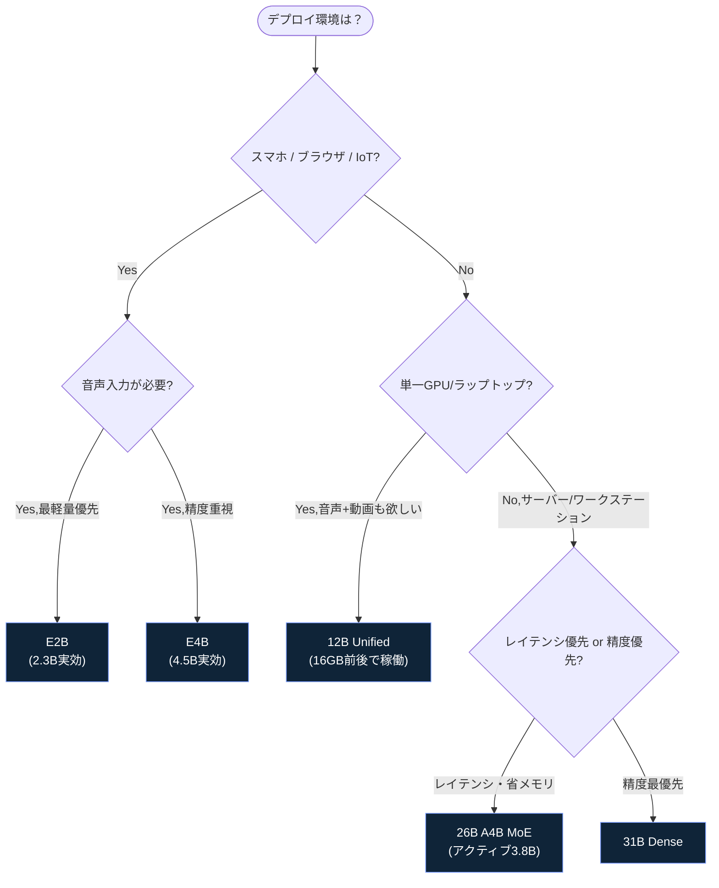
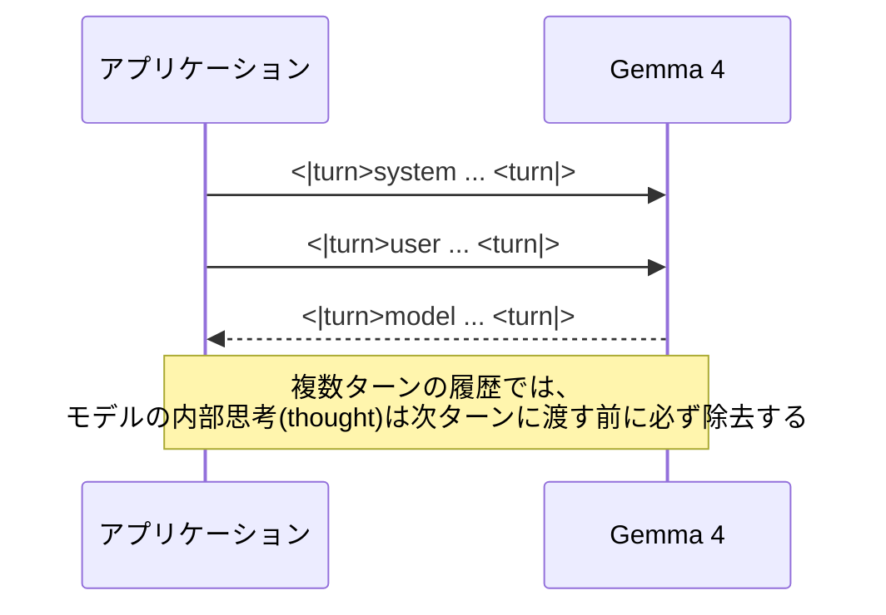
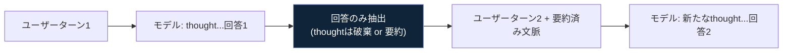
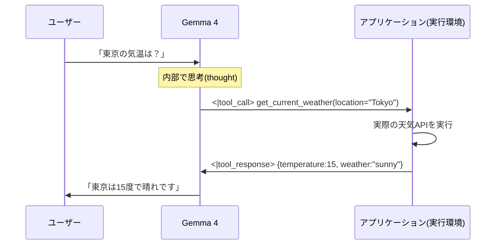
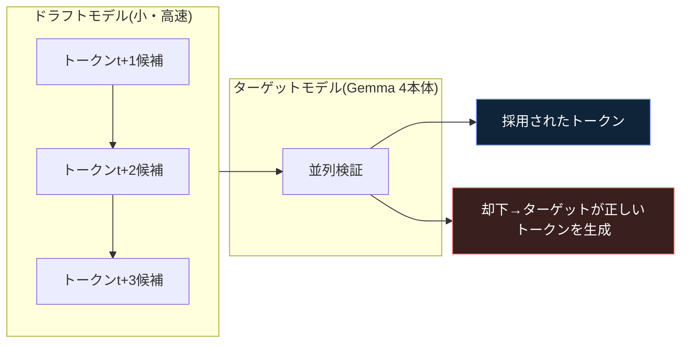
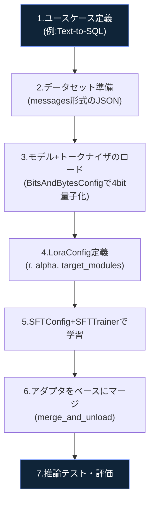
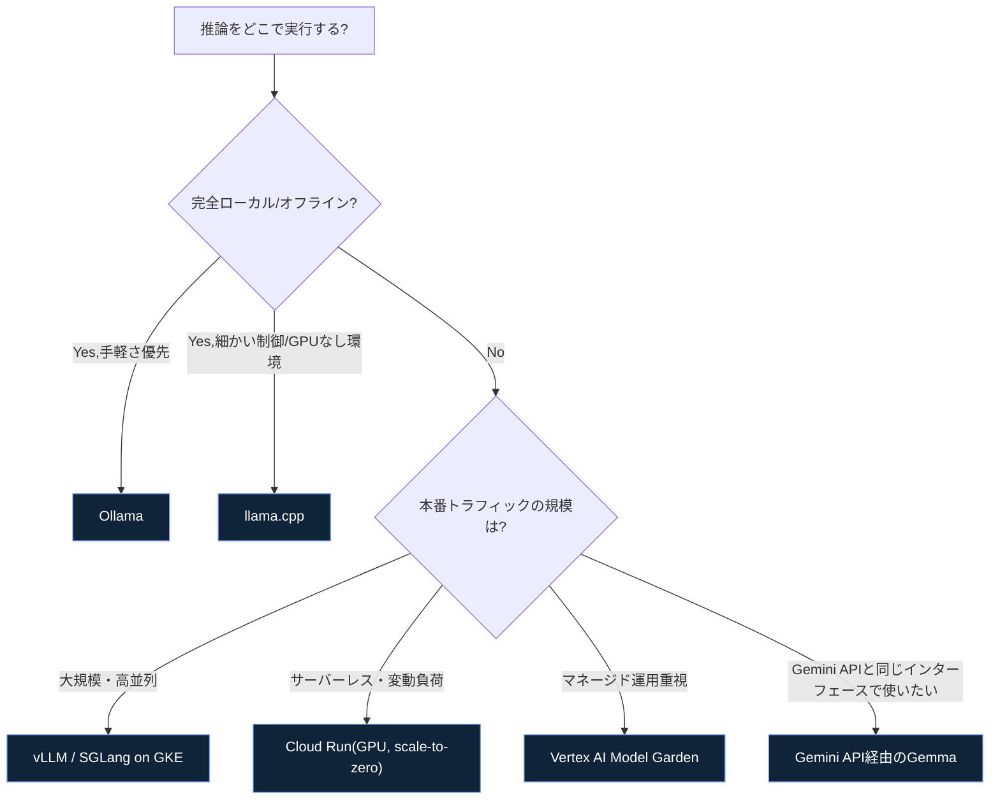
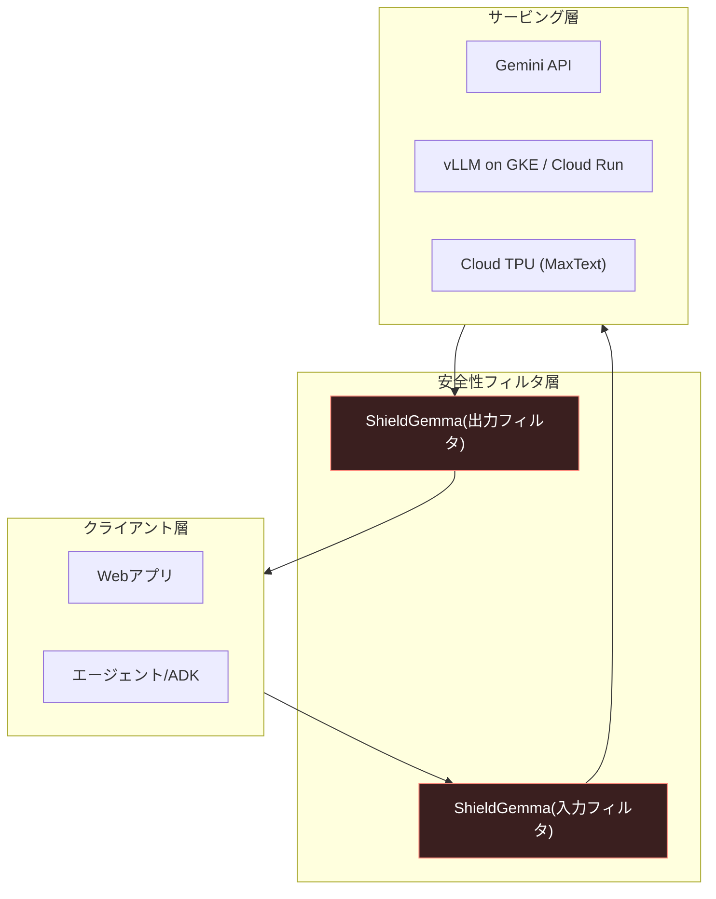
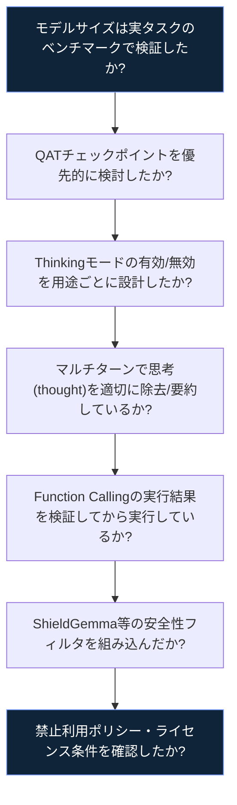

# Google Gemma 実践ガイド 2026 — 中級〜上級エンジニア向けベストプラクティス

> 対象読者：LLMの基礎（Transformer、量子化、LoRAなど）を理解しており、Gemmaを実プロダクトに組み込みたいソフトウェア/MLエンジニア
> 最終更新の前提知識：2026年7月時点の公式ドキュメント・モデルカードに基づく（Gemma 4 世代）

---

## 0. このガイドの読み方

2026年4月2日、Google DeepMindは新世代モデル **Gemma 4** を発表しました。Gemma 3系列と比べてアーキテクチャそのものが刷新されており、プロンプトの制御トークン体系、推論（Thinking）モード、Function Calling、量子化戦略のすべてが変更されています。本ガイドは、旧世代（Gemma 1〜3）の情報と混同しやすいポイントを明示しながら、Gemma 4を中心にステップバイステップで解説します。


---

## 1. Gemmaファミリー全体像とモデル選定

### 1.1 Gemmaのポジショニング

GemmaはGemini系列と同じ研究基盤から派生した**オープンウェイト**モデル群です。Gemma 4はGemini 3の研究を土台にしており、Apache 2.0ライセンス（Gemma利用規約に準拠）のもとで商用利用が可能です。コアのテキスト/マルチモーダルモデル以外にも、用途特化の派生モデル（Gemmaverse）が多数存在します。

| モデル系列 | 主な用途 |
|---|---|
| **Gemma 4（コア）** | 汎用テキスト・画像・音声理解、推論、エージェント |
| **Gemma 3n** | 超軽量エッジ・オンデバイス向け |
| **DiffusionGemma** | 拡散方式によるテキスト生成（高スループット） |
| **FunctionGemma** | 関数呼び出し特化の軽量モデル |
| **EmbeddingGemma** | オンデバイス埋め込み生成（検索・分類・クラスタリング） |
| **PaliGemma** | 画像＋言語のVLM研究向け |
| **ShieldGemma 2** | 生成AIの入出力安全性評価（コンテンツモデレーション） |
| **MedGemma** | 医療テキスト・医用画像の理解 |
| **T5Gemma** | エンコーダ・デコーダ型 |

出典：[Gemma — Google DeepMind](https://deepmind.google/models/gemma/)、[Gemma models overview | Google AI for Developers](https://ai.google.dev/gemma/docs)

### 1.2 Gemma 4 のサイズ展開

Gemma 4は5つのサイズで提供され、それぞれ異なるハードウェアターゲットを想定しています。

| プロパティ | E2B | E4B | 12B Unified | 26B A4B (MoE) | 31B Dense |
|---|---|---|---|---|---|
| 総パラメータ数 | 2.3B（実効）/ 5.1B（埋め込み込み） | 4.5B（実効）/ 8B（埋め込み込み） | 11.95B | 25.2B（アクティブ3.8B） | 30.7B |
| レイヤー数 | 35 | 42 | 48 | 30 | 60 |
| コンテキスト長 | 128K | 128K | 256K | 256K | 256K |
| 対応モダリティ | テキスト・画像・音声 | テキスト・画像・音声 | テキスト・画像・音声（エンコーダフリー） | テキスト・画像 | テキスト・画像 |
| アーキテクチャ | Dense（PLE） | Dense（PLE） | Unified（エンコーダフリー） | Mixture-of-Experts | Dense |
| 想定用途 | スマホ・ブラウザ・IoT | モバイル・ノートPC | 単一ラップトップ／単一GPU | コンシューマGPU（高速推論） | ワークステーション／サーバー |

**用語の補足**
- **E2B / E4B の「E」＝ Effective（実効）**：Per-Layer Embeddings（PLE）という仕組みにより、各デコーダ層が独自の軽量埋め込みテーブルを持ちます。これは巨大ですがルックアップのみに使われるため、実際にロードする総メモリは実効パラメータ数より多くなります。
- **26B A4Bの「A」＝ Active（アクティブ）**：全128エキスパート＋共有1個のうち、トークンごとに8エキスパートのみが活性化。推論速度は4Bモデル並みですが、ルーティングを維持するため**全26Bぶんのパラメータをメモリに常駐**させる必要があります。
- **12B「Unified」**：画像・音声用の専用エンコーダを持たず、生の画像パッチ／音声波形を線形射影で直接LLMの埋め込み空間に投影する、初のエンコーダフリー中規模モデルです。これにより1回のファインチューニングで全モダリティを同時に更新できます。

出典：[Gemma 4 model card](https://ai.google.dev/gemma/docs/core/model_card_4)、[Gemma 4 model overview](https://ai.google.dev/gemma/docs/core)

### 1.3 選定フローチャート



### 1.4 ベンチマーク早見表（Instruction-tunedモデル）

Gemma 3世代との比較を含む主要ベンチマーク（数値が高いほど良い。OmniDocBenchのみ低いほど良い）。

| ベンチマーク | 31B | 26B A4B | 12B Unified | E4B | E2B | Gemma 3 27B(参考) |
|---|---|---|---|---|---|---|
| MMLU Pro | 85.2% | 82.6% | 77.2% | 69.4% | 60.0% | 67.6% |
| AIME 2026(no tools) | 89.2% | 88.3% | 77.5% | 42.5% | 37.5% | 20.8% |
| LiveCodeBench v6 | 80.0% | 77.1% | 72.0% | 52.0% | 44.0% | 29.1% |
| GPQA Diamond | 84.3% | 82.3% | 78.8% | 58.6% | 43.4% | 42.4% |
| MMMU Pro(視覚) | 76.9% | 73.8% | 69.1% | 52.6% | 44.2% | 49.7% |
| MRCR v2(長文脈128k) | 66.4% | 44.1% | 43.4% | 25.4% | 19.1% | 13.5% |

数学・コーディング・エージェント系タスクでGemma 3からの伸び幅が特に大きい点が特徴です。長文脈（MRCR）と高難度推論（AIME/GPQA）では、モデルサイズによる差が非常に大きく出るため、「小型モデルで十分」と判断する前に該当タスクでの実測評価を推奨します。

出典：[Gemma 4 model card — Benchmark Results](https://ai.google.dev/gemma/docs/core/model_card_4)

---

## 2. メモリ計画と量子化戦略

### 2.1 推論に必要な概算メモリ

| パラメータサイズ | BF16(16bit) | SFP8(8bit) | Q4_0(4bit) | モバイル | モバイル(テキストのみ) |
|---|---|---|---|---|---|
| E2B | 11.4 GB | 5.7 GB | 2.9 GB | 1.1 GB | 0.84 GB |
| E4B | 17.9 GB | 8.9 GB | 4.5 GB | 2.5 GB | 2.2 GB |
| 12B | 26.7 GB | 13.4 GB | 6.7 GB | – | – |
| 26B A4B | 57.7 GB | 28.8 GB | 14.4 GB | – | – |
| 31B | 69.9 GB | 34.9 GB | 17.5 GB | – | – |

**注意点（実務で見落としやすい）**
1. 上表は**静的な重みのロードのみ**の数値で、KVキャッシュ（コンテキスト長に比例して増大）や推論エンジンのオーバーヘッドは含まれません。ロングコンテキスト運用時は追加でVRAMを確保してください。
2. 26B A4B（MoE）は「アクティブパラメータ4B」でも、ルーティングのため**全26Bを常駐**させる必要があり、メモリ効率は見た目ほど良くありません。
3. ファインチューニング時のメモリ要件は推論より大幅に高くなります。フルファインチューニングかLoRA/QLoRAかで必要メモリが桁違いに変わります（詳細は第6章）。

出典：[Gemma 4 model overview — Inference Memory Requirements](https://ai.google.dev/gemma/docs/core)

### 2.2 Quantization-Aware Training（QAT）を優先する

Gemma 4では公式のQATチェックポイントが提供されています。通常のPost-Training Quantization（PTQ）は学習済みモデルを事後圧縮するため精度劣化が起きやすいのに対し、QATは**量子化を学習プロセスに組み込む**ことで、低ビット化しても高精度を維持します。ローカル実行では「同じ4bitでも」PTQよりQATを優先することが推奨されます。

```mermaid
flowchart TD
    A["デプロイ先を決める"] --> B{"ローカル/エッジ実行?"}
    B -->|Yes: llama.cpp / LM Studio| C["*-qat-q4_0-gguf を選択"]
    B -->|Yes: vLLM / SGLang サーバ| D["*-qat-w4a16-ct（サーバ向け）"]
    B -->|Yes: モバイル| E["*-qat-mobile-transformers / -mobile-ct"]
    B -->|No: 投機的デコーディングを使う| F["*-qat-q4_0-unquantized +\n対応するassistantドラフトモデル"]
    B -->|No: 他形式へ変換したい(MLX等)| G["*-qat-q4_0-unquantized"]

    style C fill:#0f2438,stroke:#7c9eff,color:#fff
    style D fill:#0f2438,stroke:#7c9eff,color:#fff
    style E fill:#0f2438,stroke:#7c9eff,color:#fff
    style F fill:#0f2438,stroke:#7c9eff,color:#fff
    style G fill:#0f2438,stroke:#7c9eff,color:#fff
```

出典：[Gemma 4 model overview — Quantization-Aware Training (QAT)](https://ai.google.dev/gemma/docs/core)、[Gemma 4 with quantization-aware training | Google Developers Blog](https://blog.google/innovation-and-ai/technology/developers-tools/quantization-aware-training-gemma-4/)

### 2.3 QATダウンロード先クイックルーティング

| デプロイエンジン | サフィックス例 | 用途 |
|---|---|---|
| llama.cpp / LM Studio（ローカル） | `{model-name}-qat-q4_0-gguf` | CPU・Apple Silicon・コンシューマGPUでのゼロコンフィグ実行 |
| vLLM / SGLang（サーバ） | `{model-name}-qat-w4a16-ct` | 4bit重み＋16bitアクティベーションの高スループット推論 |
| 投機的デコーディング | `{model-name}-qat-q4_0-unquantized` + `-assistant` | MTPドラフトモデルと組み合わせた高速化 |
| モバイル(Transformers) | `{model-name}-qat-mobile-transformers` | エッジ最適化済み参照実装 |

公式QATコレクションは Hugging Face の `google/gemma-4-qat-q4-0` および `google/gemma-4-qat-mobile` コレクション、または [Kaggle](https://www.kaggle.com/models/google/gemma-4/transformers) から取得できます。

出典：[Gemma 4 model overview](https://ai.google.dev/gemma/docs/core)

---

## 3. プロンプトフォーマットと制御トークン（Gemma 4新仕様）

**重要：** Gemma 4はGemma 1〜3の `<start_of_turn>` / `<end_of_turn>` 形式から刷新され、新しい制御トークン体系を採用しています。旧形式のコードやプロンプトテンプレートをそのまま流用すると正しく動作しません。

### 3.1 基本の会話制御トークン

| トークン | 役割 |
|---|---|
| `system` | システム指示のロールを示す |
| `user` | ユーザーターンを示す |
| `model` | モデルターンを示す |
| `<\|turn>` | 対話ターンの開始 |
| `<turn\|>` | 対話ターンの終了 |

基本形は以下の通りです（実際の文字列は公式トークナイザで予約済み）。

```
<|turn>system
You are a helpful assistant.<turn|>
<|turn>user
Hello.<turn|>
```

多くのライブラリ（Transformers、llama.cppなど）は `apply_chat_template()` 等のchat templateがこの複雑さを吸収してくれるため、手書きする機会は少ないものの、**デバッグ時にトークンの意味を理解しておくことが重要**です。

出典：[Gemma 4 Prompt Formatting | Google AI for Developers](https://ai.google.dev/gemma/docs/core/prompt-formatting-gemma4)

### 3.2 マルチモーダルトークン

| トークン | 用途 |
|---|---|
| `<\|image>` ... `<image\|>` | 画像埋め込みを示す |
| `<\|audio>` ... `<audio\|>` | 音声埋め込みを示す |
| `<\|image\|>` / `<\|audio\|>` | プレースホルダー（トークナイズ後、実際のsoft embeddingに置換される） |

**ベストプラクティス（モダリティの並び順）**
- 画像コンテンツは**テキストより前**に配置する
- 音声コンテンツは**テキストより後**に配置する

### 3.3 画像の可変解像度（トークン予算）

Gemma 4は画像ごとに「視覚トークン予算」を選べます。予算が大きいほど細部が保持されますが計算コストも増えます。

| トークン予算 | 推奨用途 |
|---|---|
| 70 / 140 | 分類・キャプション生成・動画理解（多フレーム処理を優先） |
| 280 / 560 | 一般的な画像理解 |
| 1120 | OCR・文書解析・小さな文字の読み取りなど高精度が必要な場合 |

出典：[Gemma 4 model card — Best Practices](https://ai.google.dev/gemma/docs/core/model_card_4)

### 3.4 会話ターンのシーケンス図



### 3.5 推奨サンプリングパラメータ

公式ベストプラクティスとして、全ユースケースで以下の標準サンプリング設定が推奨されています。

| パラメータ | 推奨値 |
|---|---|
| `temperature` | 1.0 |
| `top_p` | 0.95 |
| `top_k` | 64 |

これらは既存のGemma 3向け設定と異なる場合があるため、移行時は必ず確認してください。

出典：[Gemma 4 model card — Sampling Parameters](https://ai.google.dev/gemma/docs/core/model_card_4)

---

## 4. Thinking Mode（推論モード）を使いこなす

### 4.1 有効化と構造

Thinking（内部推論）はシステムプロンプトの先頭に `<|think|>` トークンを含めることで有効化します。無効化する場合はこのトークンを取り除くだけです。

| トークン | 役割 |
|---|---|
| `<\|think\|>` | Thinkingモードを有効化 |
| `<\|channel>` ... `<channel\|>` | モデルの内部思考プロセスを示す（常に`thought`という語を伴う） |

有効化時の出力構造：

```
<|channel>thought
...(内部推論)...
<channel|>...(最終回答)...
```

**注意：** E2B/E4B以外のモデルでThinkingを無効化しても、空のチャンネルタグ（`<|channel>thought\n<channel|>`）自体は出力される仕様です。

出典：[Gemma 4 Prompt Formatting — Thinking Mode](https://ai.google.dev/gemma/docs/core/prompt-formatting-gemma4)

### 4.2 マルチターンでの思考履歴管理（重要な落とし穴）

- **通常の複数ターン会話**：前ターンの内部思考（thought）は次のユーザーターンに渡す前に**必ず履歴から除去**します。これを怠ると文脈が肥大化し、モデルが循環的な推論ループに陥るリスクがあります。
- **Function Calling時の例外**：1回のモデルターン内でツール呼び出しが発生した場合、その思考は除去してはいけません。

長時間稼働するエージェントでは、生の思考を毎ターン破棄しつつも、**要約した思考をテキストとして文脈に再注入する**ことで、推論の一貫性を保つテクニックが推奨されています。この要約に厳密なフォーマットは定められていないため、アーキテクチャに合わせて自由に設計できます。



### 4.3 Adaptive Thought Efficiency（思考量の調整）

Gemma 4のThinkingはON/OFFの二値仕様ですが、指示追従性の高さを利用して、システム指示で「浅く・効率的に考えて」と明示的に誘導する（"LOW"思考指示）ことで、思考トークン数を約20%削減できることが確認されています。これは公式にトレーニングされた機能ではなく、指示追従能力の副産物であるため、プロンプトの文言はチームごとにチューニングすることが推奨されます。

出典：[Gemma 4 Prompt Formatting — Tip: Adaptive Thought Efficiency](https://ai.google.dev/gemma/docs/core/prompt-formatting-gemma4)

### 4.4 大規模モデルのファインチューニング時の注意

`gemma-4-26B-A4B-it` や `gemma-4-31B-it` を「thinkingを含まないデータセット」でファインチューニングする場合、訓練プロンプトに空のチャンネルを追加すると結果が改善します。

```
<|turn>model
<|channel>thought
<channel|>
```

---

## 5. Function Calling（エージェント機能）

### 5.1 ツール呼び出し専用トークン

Gemma 4は「ツール利用ライフサイクル」を管理するため、6種類の特殊トークンで学習されています。

| トークンペア | 役割 |
|---|---|
| `<\|tool>` ... `<tool\|>` | ツール定義 |
| `<\|tool_call>` ... `<tool_call\|>` | モデルによるツール利用要求 |
| `<\|tool_response>` ... `<tool_response\|>` | ツール実行結果をモデルに返却 |
| `<\|"\|>` | 構造化データ内の文字列値の区切り文字（`{`, `}`, `,`などの特殊文字を無害化） |

`<|tool_response>` は推論エンジンにとって追加の停止シーケンスとしても機能します。

出典：[Gemma 4 Prompt Formatting — Function Calling](https://ai.google.dev/gemma/docs/core/prompt-formatting-gemma4)

### 5.2 ライフサイクル（4段階）



1. **ツール定義**：関数名・引数・説明を含むツールをモデルに提示する
2. **モデルのターン**：ユーザープロンプトとツール一覧を受け取り、テキストではなく構造化された関数呼び出しオブジェクトを返す
3. **開発者のターン**：レスポンスをパースし、関数名と引数を抽出、実際のコードを実行し、その結果を`tool`ロールとして履歴に追加する
4. **最終応答**：モデルがツールの実行結果を読み取り、自然文で最終回答を生成する

**重要な注意（公式ドキュメントより）：** Gemmaモデルは自分自身ではコードを実行できません。生成された関数呼び出しは必ずアプリケーション側で検証してから実行してください。無条件の実行はセキュリティリスクになります。

出典：[Function calling with Gemma 4 | Google AI for Developers](https://ai.google.dev/gemma/docs/capabilities/text/function-calling-gemma4)

### 5.3 実装方法の選択肢

| 方法 | 概要 |
|---|---|
| Hugging Face Transformers | `apply_chat_template()`の`tools`引数にJSON schemaまたは生のPython関数を渡す。型ヒント・docstringから自動でスキーマ生成 |
| Gemini API経由 | `google-genai` SDKの`types.Tool(function_declarations=[...])`で定義し、`GenerateContentConfig(tools=[tools])`として渡す |
| vLLM（本番運用） | `--enable-auto-tool-choice --tool-call-parser gemma4 --reasoning-parser gemma4` オプションでOpenAI互換API経由の関数呼び出しに対応 |

Gemini API経由の例（要点のみ抜粋・整形）：

```python
from google import genai
from google.genai import types

get_weather = {
    "name": "get_weather",
    "description": "Get current weather for a given location.",
    "parameters": {
        "type": "object",
        "properties": {"location": {"type": "string"}},
        "required": ["location"],
    },
}

client = genai.Client()
tools = types.Tool(function_declarations=[get_weather])
config = types.GenerateContentConfig(tools=[tools])
response = client.models.generate_content(
    model="gemma-4-26b-a4b-it",
    contents="Should I bring an umbrella to Kyoto today?",
    config=config,
)
```

出典：[How to use Gemma 4 with the Gemini API and Google AI Studio](https://www.philschmid.de/gemma-4-gemini-api)、[vllm-project/recipes: Google/Gemma4.md](https://github.com/vllm-project/recipes/blob/main/Google/Gemma4.md)

---

## 6. 推論高速化：Multi-Token Prediction（MTP）

### 6.1 仕組み

MTPはGemma 4における投機的デコーディング（Speculative Decoding）専用のアーキテクチャです。小さく高速な「ドラフトモデル」が数トークン先を予測し、本体（ターゲット）モデルがそれを並列に検証します。ドラフトが却下された場合でも、その位置の正しいトークンはターゲットモデルが即座に生成するため、無駄になりません。

ドラフトモデルはターゲットモデルと**入力埋め込みテーブルを共有**し、ターゲットの最終層のアクティベーションを直接利用するため、独立した別モデルではありません。これにより、**通常の自己回帰生成と完全に同一の出力品質を保証しながら**、デコーディングを高速化できます。



### 6.2 Dense vs MoEでの挙動の違い

- **Denseモデル**：全トークンで同じ重みを使うため、複数ドラフトトークンの検証オーバーヘッドは最小限
- **26B A4B（MoE）**：トークンごとに異なるエキスパートが活性化するため、複数ドラフトの検証で追加のエキスパート重みロードが必要になる場合がある。バッチサイズが大きいほどエキスパートの重複利用が進み高速化しやすいが、**バッチサイズ1では並列性の低いハードウェアで速度向上が出にくい**点に注意

出典：[Speed-up Gemma 4 with Multi-Token Prediction](https://ai.google.dev/gemma/docs/mtp/overview)

---

## 7. ファインチューニング ベストプラクティス

### 7.1 手法の選び方

| 手法 | 特徴 |
|---|---|
| **QLoRA**（推奨の出発点） | ベースモデルを4bit量子化して重みを凍結し、LoRAアダプタのみ学習。計算資源を大幅削減しつつ高性能を維持 |
| フルファインチューニング | 全パラメータを更新。最高性能だが計算資源要件は非常に高い |
| Unsloth | QLoRA/LoRAをさらに高速化・省メモリ化するサードパーティ最適化ライブラリ |

### 7.2 QLoRAワークフロー



### 7.3 実装例（Hugging Face TRL + PEFT）

環境構築：

```bash
pip install torch tensorboard
pip install "transformers>=5.10.1"
pip install datasets accelerate evaluate bitsandbytes trl peft protobuf sentencepiece
```

データセットは会話形式（`messages`）のJSONで用意します。TRLの`SFTTrainer`が自動的にchat templateを適用します。

```json
{"messages": [{"role": "system", "content": "..."}, {"role": "user", "content": "..."}, {"role": "assistant", "content": "..."}]}
```

モデルと量子化設定のロード：

```python
import torch
from transformers import AutoTokenizer, AutoModelForImageTextToText, BitsAndBytesConfig

model_id = "google/gemma-4-E2B"

torch_dtype = torch.bfloat16 if torch.cuda.get_device_capability()[0] >= 8 else torch.float16

model_kwargs = dict(dtype=torch_dtype, device_map="auto")
model_kwargs["quantization_config"] = BitsAndBytesConfig(
    load_in_4bit=True,
    bnb_4bit_use_double_quant=True,
    bnb_4bit_quant_type="nf4",
    bnb_4bit_compute_dtype=model_kwargs["dtype"],
    bnb_4bit_quant_storage=model_kwargs["dtype"],
)

model = AutoModelForImageTextToText.from_pretrained(model_id, **model_kwargs)
tokenizer = AutoTokenizer.from_pretrained("google/gemma-4-E2B-it")
```

LoRA設定（**特殊トークンを学習するため`lm_head`と`embed_tokens`の保存を忘れない**点が重要）：

```python
from peft import LoraConfig

peft_config = LoraConfig(
    lora_alpha=16,
    lora_dropout=0.05,
    r=16,
    bias="none",
    target_modules="all-linear",
    task_type="CAUSAL_LM",
    modules_to_save=["lm_head", "embed_tokens"],
    ensure_weight_tying=True,
)
```

学習設定と実行：

```python
from trl import SFTConfig, SFTTrainer

args = SFTConfig(
    output_dir="gemma-text-to-sql",
    max_length=512,
    num_train_epochs=3,
    per_device_train_batch_size=1,
    optim="adamw_torch_fused",
    learning_rate=5e-5,
    max_grad_norm=0.3,          # QLoRA論文に基づく推奨値
    lr_scheduler_type="constant",
    dataset_kwargs={"add_special_tokens": False, "append_concat_token": True},
)

trainer = SFTTrainer(
    model=model, args=args,
    train_dataset=dataset["train"], eval_dataset=dataset["test"],
    peft_config=peft_config, processing_class=tokenizer,
)
trainer.train()
```

学習後、サービング（vLLM等）で使いやすいようアダプタをマージする場合：

```python
from peft import PeftModel

model = AutoModelForImageTextToText.from_pretrained(model_id, low_cpu_mem_usage=True)
peft_model = PeftModel.from_pretrained(model, args.output_dir)
merged_model = peft_model.merge_and_unload()
merged_model.save_pretrained("merged_model", safe_serialization=True, max_shard_size="2GB")
```

**実務上の注意点**
- Ampere以降のGPU（NVIDIA L4/A100など）では Flash Attention を併用すると学習が最大3倍高速化
- アダプタのマージには30GB以上のCPUメモリが必要な場合がある
- 生成AIモデルの評価は「1入力に対し複数の正解がありうる」ため、まずは手動評価（vibe check）から始め、段階的に自動評価パイプラインを整備する

出典：[Fine-Tune Gemma using Hugging Face Transformers and QLoRA](https://ai.google.dev/gemma/docs/core/huggingface_text_finetune_qlora)

---

## 8. ローカル推論環境の構築

### 8.1 主要ツールの比較

| ツール | 特徴 | 適したシーン |
|---|---|---|
| **Ollama** | `ollama pull` / `ollama run` だけで即実行。GGUF形式を自動管理し、OpenAI互換API(`localhost:11434`)を提供 | 個人開発・プロトタイピング・ノーコード運用 |
| **llama.cpp** | GGUF量子化モデルをCPU/Metal/CUDAで実行。`llama-server`でOpenAI互換API(`/v1`)を提供 | GPUなし環境、Apple Silicon、細かい制御が必要な場合 |
| **LM Studio** | GUIベースのチャットUI＋ローカルサーバ | 非エンジニアも含めたチーム内共有 |
| **vLLM / SGLang** | 高スループットなサーバ型推論エンジン。Tensor Parallelやツール呼び出しパーサーに対応 | 本番トラフィックの高並列処理 |
| **MLX** | Apple Silicon特化の推論バックエンド | Mac上での高効率推論 |

出典：[Run Gemma with Ollama](https://ai.google.dev/gemma/docs/integrations/ollama)、[Run Gemma with Llama.cpp](https://ai.google.dev/gemma/docs/integrations/llamacpp)

### 8.2 Ollamaでのクイックスタート

```bash
# インストール確認
ollama --version

# Gemma 4 のデフォルト(E4B相当)をpull
ollama pull gemma4

# サイズを指定する場合
ollama pull gemma4:e2b     # 最軽量
ollama pull gemma4:e4b
ollama pull gemma4:12b     # Unified(2026年6月追加)
ollama pull gemma4:26b     # MoE
ollama pull gemma4:31b     # Dense最上位

# 対話実行
ollama run gemma4 "roses are red"

# 画像入力
ollama run gemma4 "caption this image /path/to/image.png"
```

Web API経由：

```bash
curl http://localhost:11434/api/generate -d '{
  "model": "gemma4",
  "prompt": "roses are red"
}'
```

### 8.3 llama.cppでのクイックスタート

```bash
# Hugging Faceから直接ダウンロードして実行
llama-cli -hf ggml-org/gemma-4-E2B-it-GGUF --prompt "Write a poem about the Kraken."

# システムプロンプト付き
llama-cli -hf ggml-org/gemma-4-E2B-it-GGUF -sys "You are a helpful assistant." -p "Who are you?"

# サーバ起動(OpenAI互換API: http://localhost:8080/v1)
llama-server -hf ggml-org/gemma-4-E2B-it-GGUF
```

マルチモーダル（画像・音声）を使う場合は、対応する`mmproj`（マルチモーダル射影）ファイルを別途指定する必要があります。

```bash
llama-server \
  -m gemma-4-12b-it-Q4_K_M.gguf \
  --mmproj mmproj-gemma-4-12b.gguf \
  --ctx-size 8192
```

出典：[Run Gemma with Llama.cpp | Google AI for Developers](https://ai.google.dev/gemma/docs/integrations/llamacpp)、[Gemma 4 - How to Run Locally | Unsloth Documentation](https://unsloth.ai/docs/models/gemma-4)

### 8.4 デプロイ先決定フロー



---

## 9. 本番/クラウドデプロイ

### 9.1 選択肢の一覧

| プラットフォーム | 概要 |
|---|---|
| **Gemini API / Google AI Studio** | Gemma 4をGemini APIと同じSDK/インターフェースで利用可能。関数呼び出し・構造化出力・システム指示をモデルレベルでサポート |
| **Google Cloud（Model Garden）** | Vertex AI Model Garden上でGemma 4をテスト・デプロイ。Gemini Enterprise Agent PlatformのTraining Clustersでファインチューニングも可能 |
| **Cloud Run** | GPU対応のサーバーレス実行。スケールtoゼロで従量課金。大規模モデルはRTX 6000 ProやModel Streamingで対応 |
| **GKE（Google Kubernetes Engine）** | コンテナオーケストレーション上でvLLM等を用いた高スループットサービング |
| **Cloud TPU** | MaxText（JAX実装）経由でTPU上に最先端のサービング性能を提供。Sovereign Cloudソリューションにも対応 |
| **vLLM** | OpenAI互換APIでGemma 4のThinking/Function Calling/可変画像解像度をフルサポート |

出典：[Deploy Gemma with Google Cloud | Google AI for Developers](https://ai.google.dev/gemma/docs/integrations/google-cloud)、[recipes/Google/Gemma4.md · vllm-project/recipes](https://github.com/vllm-project/recipes/blob/main/Google/Gemma4.md)

### 9.2 vLLMでのサービング例

```bash
vllm serve google/gemma-4-31B-it \
  --tensor-parallel-size 2 \
  --max-model-len 16384 \
  --gpu-memory-utilization 0.90 \
  --enable-auto-tool-choice \
  --reasoning-parser gemma4 \
  --tool-call-parser gemma4 \
  --chat-template examples/tool_chat_template_gemma4.jinja \
  --limit-mm-per-prompt '{"image": 4, "audio": 1}' \
  --host 0.0.0.0 --port 8000
```

`--reasoning-parser gemma4` と `--tool-call-parser gemma4` を指定することで、ThinkingモードとFunction CallingをOpenAI互換API経由で透過的に扱えます。TPU向けにはvLLM TPUを用いた専用イメージも提供されています。

出典：[vllm-project/recipes: Google/Gemma4.md](https://github.com/vllm-project/recipes/blob/main/Google/Gemma4.md)

### 9.3 アーキテクチャ全体図



---

## 10. 安全性・ガバナンスのベストプラクティス

### 10.1 ShieldGemmaによる入出力フィルタリング

ShieldGemmaは、生成AIの入出力を事前定義された安全ポリシーに照らして評価する、Gemmaベースの安全性分類器です。

| バージョン | ベースモデル | パラメータサイズ | 対象 |
|---|---|---|---|
| ShieldGemma 1 | Gemma 2 | 2B / 9B / 27B | テキスト入出力のコンテンツモデレーション |
| ShieldGemma 2 | Gemma 3 | 4B | 画像（合成・自然画像）の安全性評価 |

- ShieldGemma 2は「VLMの入力フィルタ」または「画像生成システムの出力フィルタ」として使うことが推奨されています。
- ShieldGemma 1は2B（低レイテンシなオンライン分類向け）〜27B（レイテンシより性能を優先するオフライン用途向け）まで選べます。
- いずれもオープンウェイトで、独自の安全基準に合わせて追加ファインチューニングが可能です。

出典：[ShieldGemma | Responsible Generative AI Toolkit](https://ai.google.dev/responsible/docs/safeguards/shieldgemma)、[ShieldGemma 2 model card](https://ai.google.dev/gemma/docs/shieldgemma/model_card_2)

### 10.2 Gemma 4本体の安全性評価

Gemma 4は、以下のカテゴリについてGeminiと同水準の安全性評価プロセスを経ています。

- CSAM（児童性的虐待材料）関連コンテンツ
- 危険なコンテンツ（自殺の助長、現実世界に害を及ぼす活動の指南など）
- 性的に露骨なコンテンツ
- ヘイトスピーチ
- ハラスメント

公式の安全性評価では、Gemma 3/3n世代と比較して全カテゴリで「不当な拒否（over-refusal）を低く抑えながら」安全性が大幅に改善したと報告されています。ただし、これは**モデル単体の傾向**であり、実運用ではアプリケーション固有のコンテンツポリシーに応じてShieldGemma等の追加フィルタを組み合わせることが推奨されます。

出典：[Gemma 4 model card — Ethics and Safety](https://ai.google.dev/gemma/docs/core/model_card_4)

### 10.3 データフィルタリングとライセンス

- 事前学習データにはCSAMフィルタリングおよび個人情報などの機微データの自動フィルタリングが多段階で適用されています。
- Gemma 4はApache 2.0ライセンス（[Gemma利用規約](https://ai.google.dev/gemma/terms)に準拠）で提供され、商用利用・改変・再配布が可能です。ただし[禁止利用ポリシー](https://ai.google.dev/gemma/prohibited_use_policy)は遵守する必要があります。

出典：[Gemma 4 model card — Model Data](https://ai.google.dev/gemma/docs/core/model_card_4)

---

## 11. チェックリスト：本番投入前の最終確認



---

## 12. まとめ

Gemma 4は、Gemma 3世代からアーキテクチャ・制御トークン体系・エージェント機能が刷新された大型アップデートです。実務でGemmaを扱う際の勘所は以下の3点に集約されます。

1. **サイズ選定はハードウェアと用途から逆算する**：E2B/E4Bはエッジ、12B Unifiedは単一GPU/ラップトップでの音声・動画対応、26B A4Bは速度重視のサーバー、31Bは精度最優先のワークステーション/サーバー、という住み分けを踏まえる。
2. **プロンプトの制御トークンとThinking/Function Callingのライフサイクルを正確に実装する**：特にマルチターンでの思考除去やツール呼び出しの検証は品質・安全性・コストに直結する。
3. **量子化はQATを起点に検討し、安全性フィルタ(ShieldGemma)を組み合わせて本番投入する**。

---

## 参考文献（すべて2026年7月時点で確認済みの一次情報）

### モデル概要・アーキテクチャ
- [Gemma — Google DeepMind](https://deepmind.google/models/gemma/)
- [Gemma 4 model overview | Google AI for Developers](https://ai.google.dev/gemma/docs/core)
- [Gemma 4 model card | Google AI for Developers](https://ai.google.dev/gemma/docs/core/model_card_4)
- [Gemma models overview | Google AI for Developers](https://ai.google.dev/gemma/docs)
- [Gemma 4: Byte for byte, the most capable open models | Google Developers Blog](https://blog.google/innovation-and-ai/technology/developers-tools/gemma-4/)

### プロンプト設計・Thinking・Function Calling
- [Gemma 4 Prompt Formatting | Google AI for Developers](https://ai.google.dev/gemma/docs/core/prompt-formatting-gemma4)
- [Function calling with Gemma 4 | Google AI for Developers](https://ai.google.dev/gemma/docs/capabilities/text/function-calling-gemma4)
- [How to use Gemma 4 with the Gemini API and Google AI Studio](https://www.philschmid.de/gemma-4-gemini-api)

### 推論高速化（MTP）・量子化
- [Speed-up Gemma 4 with Multi-Token Prediction | Google AI for Developers](https://ai.google.dev/gemma/docs/mtp/overview)
- [Gemma 4 with quantization-aware training | Google Developers Blog](https://blog.google/innovation-and-ai/technology/developers-tools/quantization-aware-training-gemma-4/)

### ファインチューニング
- [Fine-Tune Gemma using Hugging Face Transformers and QLoRA | Google AI for Developers](https://ai.google.dev/gemma/docs/core/huggingface_text_finetune_qlora)
- [Gemma 4 - How to Run Locally | Unsloth Documentation](https://unsloth.ai/docs/models/gemma-4)

### ローカル推論・デプロイ
- [Run Gemma with Ollama | Google AI for Developers](https://ai.google.dev/gemma/docs/integrations/ollama)
- [Run Gemma with Llama.cpp | Google AI for Developers](https://ai.google.dev/gemma/docs/integrations/llamacpp)
- [Deploy Gemma with Google Cloud | Google AI for Developers](https://ai.google.dev/gemma/docs/integrations/google-cloud)
- [vllm-project/recipes: Google/Gemma4.md](https://github.com/vllm-project/recipes/blob/main/Google/Gemma4.md)

### 安全性・ガバナンス
- [ShieldGemma | Responsible Generative AI Toolkit | Google AI for Developers](https://ai.google.dev/responsible/docs/safeguards/shieldgemma)
- [ShieldGemma 2 model card | Google AI for Developers](https://ai.google.dev/gemma/docs/shieldgemma/model_card_2)
- [Gemma利用規約 | Google AI for Developers](https://ai.google.dev/gemma/terms)
- [禁止利用ポリシー | Google AI for Developers](https://ai.google.dev/gemma/prohibited_use_policy)

---

*本ガイドはGoogle公式ドキュメント・モデルカードおよび主要コミュニティリソース（Unsloth、vLLM公式レシピ等）を一次情報として作成しています。Gemmaは継続的にアップデートされるため、実装前に必ず上記リンク先の最新情報をご確認ください。*
