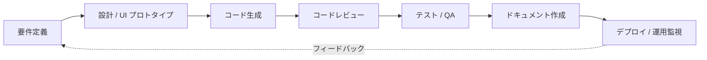
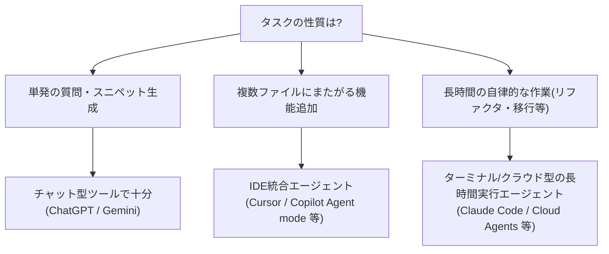
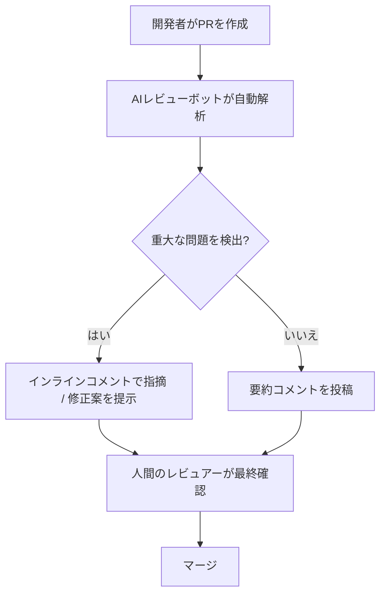
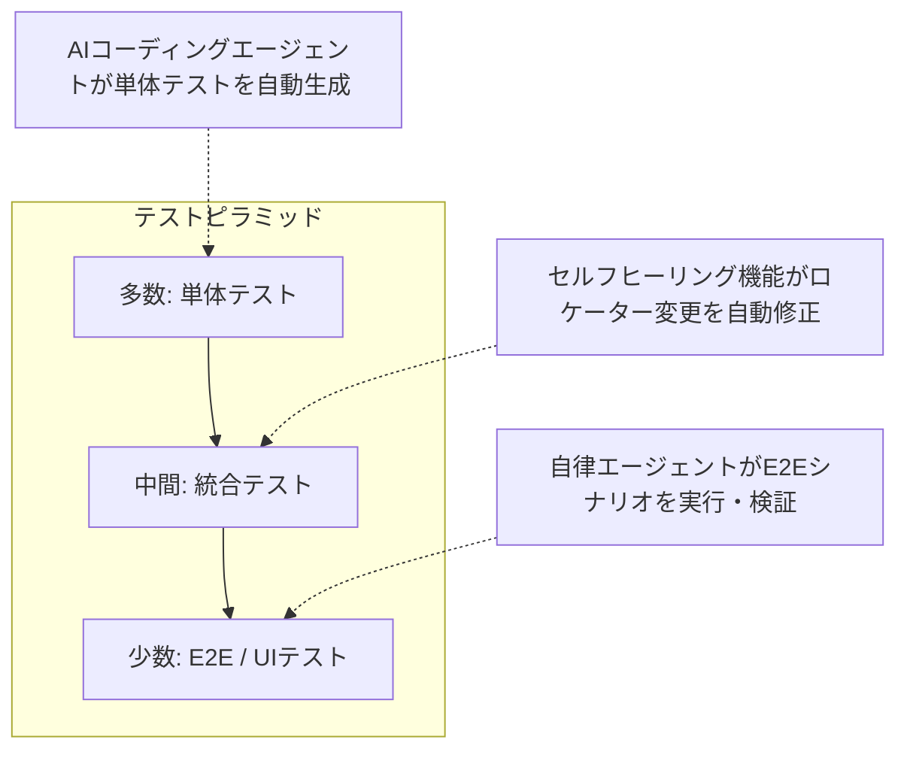
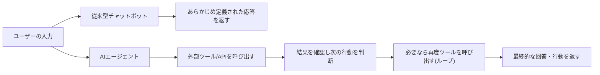
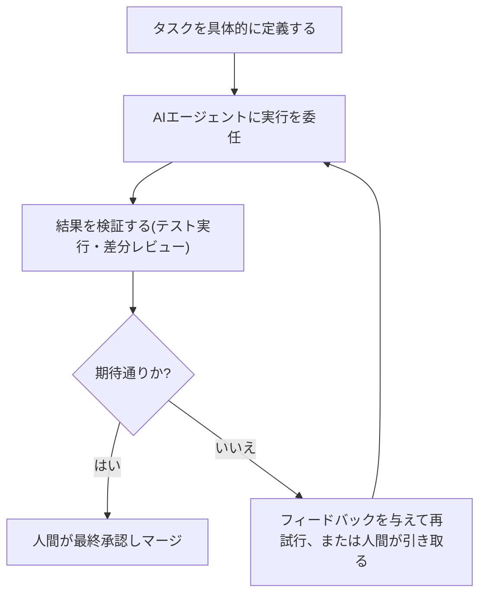
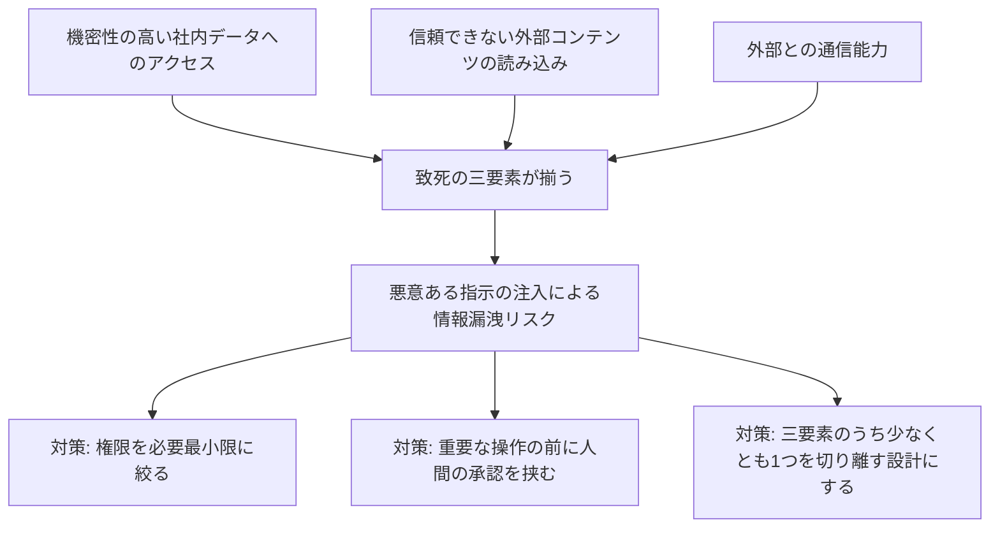

# Generative AI for Software Development ― 初学者のためのステップバイステップガイド

> 原書: *Generative AI for Software Development: Tools, Workflows, and Practical Applications*
> 本ガイドは、この書籍の構成をベースに、2026年9月14日時点の最新動向を加えて再構成した学習用資料です。

---

## この本について

| 項目 | 内容 |
|---|---|
| タイトル | Generative AI for Software Development |
| 著者 | Sergio Pereira |
| 出版社 | O'Reilly Media |
| 出版時期 | 2025年7月 |
| ページ数 | 170ページ |
| レベル | 中級〜上級(本ガイドは初学者向けに噛み砕いて解説) |
| 原書URL | https://www.oreilly.com/library/view/generative-ai-for/9781098162269/ |

著者のSergio Pereiraは、市場に出回るAI開発ツールを片っ端から試し、実務者が氾濫する選択肢の中で迷わないための「評価の型」を提供することを目的にこの本を書きました。各章は「ツールの種類」「ユースケース」「評価プロセス」「個別ツールの比較」という共通の型で構成されており、単なる製品レビューではなく、今後も変化し続けるツールと向き合うための思考の枠組みを提供しています。

本ガイドではこの構成を踏襲しつつ、AIツールの進化スピードが非常に速い分野であることを踏まえ、各章に **2026年9月時点の最新状況** を補足しています。ツール名・価格・機能は執筆時点のものであり、実際に使う際は必ず公式サイトで最新情報を確認してください。

---

## 目次

- [Step 0. なぜ今このテーマなのか](#step-0-なぜ今このテーマなのか)
- [Step 1. コード生成とオートコンプリート](#step-1-コード生成とオートコンプリート)
- [Step 2. UI/UXデザインとフロントエンド開発](#step-2-uiuxデザインとフロントエンド開発)
- [Step 3. バグ検出とコードレビュー](#step-3-バグ検出とコードレビュー)
- [Step 4. 自動テストと品質保証(QA)](#step-4-自動テストと品質保証qa)
- [Step 5. 予測分析とパフォーマンス最適化](#step-5-予測分析とパフォーマンス最適化)
- [Step 6. ドキュメントとテクニカルライティング](#step-6-ドキュメントとテクニカルライティング)
- [Step 7. チャットボットとバーチャルアシスタント](#step-7-チャットボットとバーチャルアシスタント)
- [Step 8. 実装成功事例から学ぶ](#step-8-実装成功事例から学ぶ)
- [Step 9. AI時代のソフトウェア開発ワークフロー実践編](#step-9-ai時代のソフトウェア開発ワークフロー実践編)
- [Step 10. リスクとガバナンス、責任あるAI活用](#step-10-リスクとガバナンス責任あるai活用)
- [Step 11. ツール選定のための評価フレームワーク](#step-11-ツール選定のための評価フレームワーク)
- [Step 12. ソフトウェア開発の未来](#step-12-ソフトウェア開発の未来)
- [用語集](#用語集)
- [学習チェックリスト](#学習チェックリスト)
- [参考文献・出典URL一覧](#参考文献出典url一覧)

---

## Step 0. なぜ今このテーマなのか

### 0-1. 数字で見る「AIが当たり前になった」開発現場

生成AIはこの数年でソフトウェア開発の「特別な機能」から「標準装備」へと変わりました。GitHubが2025年10月に発表したOctoverse 2025レポートでは、2024年9月〜2025年8月の1年間でGitHub上の開発者数が1億8000万人を突破し、新規開発者の約8割が登録から1週間以内にGitHub Copilotを使い始めていることが報告されています[1], [2]。同レポートは、AIが「使いやすい技術に開発者が集まり、その技術がさらにAIに最適化される」という好循環(convenience loop)を生み出しており、その象徴としてTypeScriptが2025年8月に月間コントリビューター数で初めてPythonとJavaScriptを抜き、GitHub上で最も使われる言語になったと分析しています[3], [4]。型のある言語はAIが生成したコードのミスをコンパイル時に検出しやすいためだと考えられています。

Google CloudのDORA(DevOps Research and Assessment)チームが2025年9月に公開した「State of AI-assisted Software Development」レポートでは、調査対象の技術者の約9割が業務でAIツールを日常的に使用していると回答しました[5][6]。ただしこのレポートが強調しているのは「AIはチームの実力を増幅する」という点です。もともと開発プロセスが整っているチームはAIでさらに成果を伸ばす一方、プロセスに課題を抱えるチームはAIによって問題が拡大しやすいことが指摘されています[6]。

### 0-2. 「バイブコーディング」という言葉の広がり

2025年初頭、AI研究者のAndrej Karpathy氏が提唱した「vibe coding(バイブコーディング)」という言葉は、自然言語での指示だけでアプリケーションを作り上げる開発スタイルを指す言葉として一気に広まりました。2026年時点では、世界で本番稼働しているコードのうち4割前後がAI支援によって生成されているという調査もあり、AIファーストのアプリビルダー市場は前年から大きく成長しています[7][8]。

一方で、独立系ソフトウェア開発者として知られるSimon Willison氏(Djangoフレームワークの共同開発者)は、AIコーディングエージェントの信頼性が上がるにつれて、経験豊富なエンジニアでさえ「1行ずつのコードレビューを省略してデプロイする」場面が増えていると自身の実践を振り返りながら指摘しています[9]。便利さと引き換えに、どこまでを自動化し、どこから人間が責任を持つのかという線引きが、2026年のソフトウェア開発における最大の論点の一つになっています。

### 0-3. 本ガイドの読み方

以下のStepは、原書の章構成(第1章〜第8章)に沿って、それぞれ「どんな種類のツールがあるか」「代表的な製品」「2026年時点の最新動向」「実務での使い方のコツ」を解説します。Step 9以降は原書の内容を踏まえた実践編・応用編として、AIを組み込んだ開発ワークフロー全体像、リスク管理、ツール選定の考え方、そして今後の展望をまとめています。

*上図: ソフトウェア開発ライフサイクル(SDLC)の各段階に、今や生成AIが何らかの形で関与している。Step 1〜7では、この図の各段階に対応するツールカテゴリを順番に見ていく。*

---

## Step 1. コード生成とオートコンプリート

原書第1章のテーマです。コード生成ツールは大きく「ブラウザ(チャット)ベース」と「IDE統合型」の2種類に分けられます。

### 1-1. ブラウザベースのツール

ChatGPTやGoogle Geminiのようなチャット型AIは、コードスニペットの生成、アルゴリズムの説明、エラーメッセージの解読など、エディタを離れて「相談する」使い方に向いています。コードベース全体を継続的に把握するわけではないため、独立した小さな問題を解く場面で特に力を発揮します。

### 1-2. IDE統合型ツール(2026年の主戦場)

2023年頃は「次の1行を提案するオートコンプリート」が主流でしたが、2026年時点では「コードベース全体を読み、計画を立て、複数ファイルを編集し、ターミナルコマンドを実行し、自分の出力を検証する」自律型のコーディングエージェントが標準になっています[10]。

| ツール | 位置づけ(2026年時点) | 特徴 |
|---|---|---|
| GitHub Copilot | VS Code / GitHub純正 | Copilot Free提供以降に新規登録者が急増。Agent modeでリポジトリ横断の変更にも対応[2] |
| Cursor | VS Codeフォークのエージェント特化IDE | 自社モデルComposer、並列エージェント実行、クラウド上で動くBackground/Cloud Agentsを搭載。有料ユーザーは100万人規模、Fortune 500の6割以上が利用と報告[11][12] |
| Windsurf(Cognition傘下) | VS Codeフォーク、Cascadeエージェント | 2025年7月にGoogleとOpenAIが争奪戦を演じた末、Cognition(Devin開発元)が買収。自社モデルSWE-1.5と、コード構造を可視化するCodemaps機能が特徴[13][14][15] |
| Claude Code | Anthropic純正のエージェント型CLI/デスクトップツール | ターミナル・デスクトップアプリ・IDE連携から利用可能。長時間の自律実行に強いとの評価[16] |
| Windsurf以外の主要プレイヤー | Cline、Aider、Devin、Zed等 | オープンソースのエージェント型拡張や、GPU高速化エディタなど選択肢が多様化[11] |

Cognitionは2025年7月にWindsurfのIP・製品・ブランドを買収すると発表しました。買収時点でWindsurfは年間経常収益(ARR)82百万ドル、エンタープライズ顧客350社以上を抱えていたと公表されています[14]。この買収劇は、GoogleがWindsurfの創業者ら研究チームを24億ドル規模でアクハイア(人材買収)した直後に成立した点でも話題になりました[15]。

### 1-3. 使い分けの考え方

初学者への実践的なアドバイスとしては、まず小さな独立したタスク(関数の実装、テストの追加)でAIの提案を検証する習慣をつけ、慣れてきたら複数ファイルにまたがる変更を任せる、という段階的な移行が推奨されます。原書でも指摘されている通り、ツールごとに得意なコーディング課題の傾向が異なるため、自分のスタック(使用言語・フレームワーク)で実際に試すことが評価の基本です。

---

## Step 2. UI/UXデザインとフロントエンド開発

原書第2章のテーマです。自然言語の指示だけでUIやフロントエンドアプリケーションを生成するツールは、2025年以降のAI開発ツール市場で最も成長が著しい分野の一つです。

### 2-1. 主要な「AIアプリビルダー」

| ツール | 提供元 | 強み |
|---|---|---|
| Bolt.new | StackBlitz | ブラウザ完結のフルIDE。バックエンドはSupabase連携が中心で、直接コード編集も可能[17][18] |
| Lovable(旧GPT Engineer) | Lovable | 非エンジニアでも会話形式でフルスタックMVPを構築できる設計。Supabase統合と使いやすさが特徴[18][19] |
| v0 | Vercel | Next.js/Vercelエコシステムに最適化されたReact UIコンポーネント生成に特化[17] |
| Uizard / QoQo.ai 等 | 各社 | ワイヤーフレームからUIモックアップを素早く作る用途、UXリサーチ支援など専門特化型 |

LovableとBolt.newはいずれも異例の速さで成長したことで知られています。複数の業界レポートによれば、Lovableはローンチから数ヶ月でARR(年間経常収益)が数千万〜数億ドル規模に達し、欧州発スタートアップとして最速級の成長曲線を描いたとされ、Bolt.newも数ヶ月でARR数千万ドル規模に到達したと報じられています[19][20]。これらの数字はベンダー発表や業界サイトの推計を含むため幅がありますが、「アイデアを言葉にするだけでアプリの骨格ができる」体験が市場に強いインパクトを与えたことは間違いありません。

### 2-2. 使う上での注意点(初学者向け)

- **バックエンドの制約を理解する**: Bolt.newはSupabase、Lovableも同様にSupabase中心の統合になっているなど、特定のバックエンドサービスに依存する設計のツールが多く、後から別のデータベースに移行する場合は追加の作業が発生します[17]。
- **生成されたコードの所有権**: 多くのツールはコードのダウンロードやGitHubへのプッシュに対応していますが、ロックインの度合いはツールごとに異なるため、長期運用を前提とする場合は事前に確認しましょう。
- **デザインとロジックの分業**: v0のようにUIコンポーネント生成に特化したツールと、Lovable/Bolt.newのようにフルスタックで動くツールを組み合わせて使うワークフローも一般的になっています。

---

## Step 3. バグ検出とコードレビュー

原書第3章のテーマです。AIがコードを書く量が増えるほど、レビューする量も増えるというのが2026年の大きな課題になっています。

### 3-1. なぜAIコードレビューが急速に普及したのか

DORAの2025年レポートでは、AI活用度が高いチームはマージするプルリクエスト数が従来比で大幅に増加した一方、平均的なPRのサイズも拡大し、レビューにかかる時間も伸びたと報告されています[21]。つまり「AIがコードを書く速度」に「人間がレビューする速度」が追いつかなくなりつつあるということです。この課題に対応する形で、AIによる自動コードレビューツールの利用が急速に広がりました。業界調査では、2026年時点で開発チームの4割超が何らかのAIコードレビューツールを導入しているという報告があります[22][23]。

### 3-2. 代表的なツール

| ツール | 特徴 |
|---|---|
| Codacy | 静的解析ベースの継続的なコード品質チェックプラットフォーム |
| Snyk Code(旧DeepCode) | セキュリティ脆弱性の検出に強みを持つ |
| CodeRabbit | GitHub/GitLab/Bitbucket等に対応するPRレビュー特化型。無料枠でOSSリポジトリをカバーし急速に普及[24][25] |
| GitHub Copilot Code Review | Copilot Business/Enterprise等の対応プランに統合。レビュー1回ごとにAIクレジットを消費し、プライベートリポジトリではGitHub Actionsの実行時間も消費するため、契約プランや利用量によっては追加費用が発生し得る |

CodeRabbitは2026年半ばまでに1300万件以上のプルリクエストをレビューしたと報告されており、GitHub上でのインストール数の多さでも業界レポートの上位に挙げられています[24][25]。ただし複数の第三者評価では、AIレビューツールは「SQLインジェクションやnullポインタのような機械的に検出しやすい問題」には強い一方、「ビジネスロジック固有の妥当性(割引計算が正しいかなど)」の判断はまだ苦手とされており、人間のレビューを完全に代替するものではないと繰り返し指摘されています[26]。

### 3-3. レビューワークフローの実際

初学者向けのアドバイスとしては、AIレビューを「厳しい先輩の一次チェック」くらいの位置づけで捉えるのが安全です。静的解析ツール(SonarQube等のルールベース製品)とAIレビューツールを併用し、セキュリティ関連は専用ツールで、ロジックの妥当性は人間で、という役割分担を明確にするのが2026年時点のベストプラクティスとして推奨されています[23]。

---

## Step 4. 自動テストと品質保証(QA)

原書第4章のテーマです。テストの世界でも「テストケースを人間が全部書く」時代から「AIが自律的にアプリを探索してテストを書く」時代への移行が進んでいます。

### 4-1. AIテストツールの3つの型

2026年のAIテストツール市場は、大きく次の3つのアプローチに分類できます[27][28]。

1. **自然言語ベースのテスト作成**: 平易な英語(や日本語)でテストシナリオを書くとツールが自動でテストコードに変換するタイプ。非エンジニアのQA担当者でも扱いやすい(例: testRigor)。
2. **セルフヒーリングなテスト自動化**: UIの変更があってもAIがロケーター(要素の指定方法)を自動的に修正し、テストのメンテナンスコストを下げるタイプ(例: Katalon、Testim)。
3. **エージェント型の自律実行**: 人間が作った大まかなテスト計画をもとに、AIエージェントが実際にブラウザを操作してEnd-to-Endテストを行うタイプ。2026年に最も勢いよく成長したカテゴリとされています[28]。

### 4-2. 代表的なツール

| ツール | 特徴 |
|---|---|
| Katalon Studio | Web・モバイル・API・デスクトップを横断できるオールインワン型。AIによるセルフヒーリングロケーターを搭載[29] |
| testRigor | 平易な自然言語でテストシナリオを記述でき、非エンジニアでも自動化に参加しやすい[27][29] |
| Applitools / Percy | ビジュアルリグレッション(見た目の差分)検出に特化 |
| QA Wolf / mabl 等 | マネージド型・低コードのEnd-to-Endテスト運用サービス |

### 4-3. テストピラミッドとAIの役割

2026年時点の実務では、「AIコーディングエージェント(Claude CodeやCursor等)にテストコードそのものを書かせる」動きと、「専門のテストプラットフォームで探索的テストや視覚回帰を任せる」動きが併存しており、両方を組み合わせるのが一般的なパターンとして紹介されています[30]。原書でも強調されている通り、AIがテストケースを大量生成できるようになったからこそ、「本当に必要なテストは何か」を判断する人間のテスト設計スキルの重要性はむしろ増しています。

---

## Step 5. 予測分析とパフォーマンス最適化

原書第5章のテーマです。この章は、開発中に生成されるログやメトリクスをAIで分析し、性能改善やユーザー行動の予測に役立てる領域を扱っています。

### 5-1. 主なユースケース

- **パフォーマンスボトルネックの検出**: APM(アプリケーションパフォーマンス監視)ツールが集めたメトリクスをAIが解析し、異常なレイテンシやエラー率の増加を自然言語で説明する。
- **ユーザー行動予測**: プロダクト利用データから離脱リスクの高いユーザーセグメントを予測する。
- **データ分析の民主化**: 非エンジニアでも自然言語で「先月と比べて何が変わったか」を尋ねられるツールが増えている。

### 5-2. 代表的なツールの位置づけ

| ツール | 特徴 |
|---|---|
| Julius | 自然言語でデータ分析・可視化を行うAIデータアナリストツール |
| Akkio | ノーコードで予測モデルを構築できるプラットフォーム |
| ChatGPT(Advanced Data Analysis等) | CSVやログファイルをアップロードして対話形式で分析できる汎用ツール |

この分野は他の章に比べるとツール自体の入れ替わりは緩やかですが、「専用のBIツール」と「汎用AIチャット」の境界が曖昧になりつつある点が2026年時点の特徴です。専用ツールは特定のデータソースとの連携やダッシュボード化に強く、汎用AIチャットは探索的な質問への柔軟な対応に強い、という使い分けが基本になります。

---

## Step 6. ドキュメントとテクニカルライティング

原書第6章のテーマです(以下「テクニカルライティング」と表記します)。

### 6-1. 「ドキュメントは書かれない」から「ドキュメントは陳腐化する」へ

これまでソフトウェア開発の課題は「十分なドキュメントが書かれないこと」でした。しかし2026年になると、AIがドキュメントを素早く生成できるようになった結果、課題は「AIが書いたコードとAIが書いたドキュメントの整合性をどう保つか」に移っています[31]。Forresterの2026年第1四半期のレポートでは、エンジニア10名以上のチームの78%が何らかの「ドキュメント負債」の問題を抱えていると報告されています[32]。また、JetBrainsの開発者エコシステム調査では、ドキュメント作成にAIツールを使う開発者の割合が2023年の11%から2025年には68%まで増加したとされています[31]。

### 6-2. 代表的なツール

| ツール | 特徴 |
|---|---|
| Swimm | コードとドキュメントを紐づけ、コードが変更されると関連ドキュメントに「古くなった可能性」のフラグを立てる「コード連動ドキュメント」を提唱[31][33] |
| Mintlify | API仕様書などの開発者向けドキュメントに強く、AIライティングアシスタントを統合 |
| ChatGPT / Cursor | コードからREADMEやdocstringを生成する汎用的な使い方 |
| Scribe | 操作手順をキャプチャしてステップバイステップのガイドを自動生成するツール |

### 6-3. 実践のコツ

- **リファレンス系ドキュメント(API仕様等)はAI生成との相性が良い**: 構造化されたコードから機械的に生成できるため、AIによる自動化が特に効果を発揮します。
- **概念的なドキュメント(チュートリアルや設計思想の説明)は人間の関与が重要**: AIは「読者が何につまずくか」という教育的な勘所を持たないため、複数のレビューでこの点が共通して指摘されています[32]。
- **コードとドキュメントを同じPRで変更する運用ルール**を設けることで、ドキュメントの陳腐化を構造的に防ぐチームが増えています。

---

## Step 7. チャットボットとバーチャルアシスタント

原書第7章のテーマです。この章は「AIチャットボット」自体の作り方を扱っています。

### 7-1. チャットボットからエージェントへ

従来の「あらかじめ決められた応答パターンを返すチャットボット」と、現在主流になりつつある「ツールを使って状態を変化させることができるAIエージェント」は明確に区別されるようになりました[34]。単に質問に答えるだけでなく、外部システムのデータを検索したり、予約を確定したりといった「行動」を取れるかどうかが分岐点です。

### 7-2. 代表的なツール・フレームワーク

| ツール | 特徴 |
|---|---|
| Chatbase | 自社データを取り込んでカスタマーサポート向けチャットボットを構築するノーコードサービス |
| Botpress | 会話フローを視覚的に設計できるオープンソース寄りのプラットフォーム |
| LangChain / LangGraph | AIエージェント構築の業界標準フレームワークの一つ。LangGraphはグラフ構造で状態遷移を明示的に管理でき、2025年10月にLangChainとともにv1.0へ到達し、2026年には企業導入向けのエンタープライズ機能(監査ログ、ロールバック、MCP連携など)が拡充されています[35][36] |

AI研究者のAndrew Ng氏は、AIが自らの作業結果を確認・修正・再試行するループを回せるようになったことが、単発の推論では実現できなかった能力を引き出す大きな転換点になっていると述べています[36]。LangGraphのようなフレームワークは、まさにこの「確認・修正・再試行」のループを構造化して実装するために設計されています。

### 7-3. 使い分けの目安

- 単純な一問一答のFAQボットであれば、Chatbase等のノーコードツールで十分なケースが多い。
- 複数のAPIを呼び出し、条件分岐や承認フローを含む複雑な業務プロセスを自動化したい場合は、LangGraphのようなエージェントフレームワークでの設計が推奨されます。
- 単純なタスクにフル機能のエージェントフレームワークを使うと、かえって開発・デバッグのコストが増えるという指摘もあり、タスクの複雑さに応じた技術選定が重要です[36]。

---

## Step 8. 実装成功事例から学ぶ

原書第8章のテーマです。原書ではPieter Levels氏(個人開発者)とShopify(大企業)という対照的な2つの事例が紹介されています。ここでは2026年時点でのアップデートを交えて解説します。

### 8-1. 個人開発者の事例: Pieter Levels

Pieter Levels氏は、Nomad List、Remote OK、Photo AIなど複数のプロダクトを一人で開発・運営してきたインディーハッカーの代表格です。2026年2月には、ブラウザ上で動くフライトシミュレーター「fly.pieter.com」を一人でAIツール(CursorとThree.jsを利用)を使って開発し、公開から17日でARR(年間経常収益)100万ドルに到達したと報告されています[37]。同氏のポートフォリオ全体では、複数プロダクト合算で月間20万ドル前後の収益(自己申告ベース)を継続的に生み出しているとされています[38]。

一方で同氏は2026年7月、自身が使っていたSaaSツールのサブスクリプションをすべて解約し、AIで自作し直したことを公表し、「実行コストがAIによって下がることで、真っ先に淘汰される開発者はインディーハッカー自身かもしれない」という趣旨の警鐘も発信しています[39]。AIによる開発コストの低下は、個人開発者に大きな追い風であると同時に、参入障壁の低下が既存プレイヤーの競争優位を脅かすという二面性を持つことを示す事例です。

### 8-2. 大企業の事例: Shopify

ECプラットフォームを運営するShopifyのCEO、Tobi Lütke氏は2025年4月、全社員に向けた社内メモを公開しました。このメモでは「効果的にAIを使うことは、もはや任意ではなく基本的な期待事項である」と明言され、追加の人員やリソースを要求する前に「なぜAIでその仕事ができないのか」を説明する責任が各チームに課されることになりました[40][41]。AIの活用状況は人事評価や採用の評価基準にも組み込まれるとされています[41][42]。

このメモは大きな話題を呼び、「AIの活用を組織文化として明文化した先駆的な事例」として2026年に入ってからも頻繁に参照されています。Shopifyのように数千人規模の開発組織を抱える企業が、トップダウンでAI活用を制度化した事例は、企業がAI導入を検討する際のベンチマークの一つになっています。

### 8-3. 2つの事例から見えるパターン

| 観点 | Pieter Levels(個人) | Shopify(大企業) |
|---|---|---|
| 意思決定の速さ | 即断即決、一人でツールを選び即日導入 | トップダウンの方針転換に数ヶ月〜数年 |
| AIの役割 | 開発工数そのものを代替し、少人数で製品を量産 | 既存の大規模組織の生産性を底上げ |
| リスク | 品質管理・セキュリティを自己責任で担う必要がある | ガバナンス・コンプライアンスの整備が前提になる |
| 共通点 | 「AIを使わない理由」を問われる文化 | 「AIを使わない理由」を問われる文化 |

規模は違えど、両者に共通するのは「AIを使うかどうか」を議論する段階はすでに終わり、「どう使いこなすか」が組織・個人の競争力を左右する段階に入っているという点です。

---

## Step 9. AI時代のソフトウェア開発ワークフロー実践編

ここからは原書の内容を踏まえた応用編です。Step 1〜8で見てきた各カテゴリのツールを、実際の開発ワークフローの中でどう組み合わせるかを整理します。

### 9-1. エージェント中心の開発ループ

Simon Willison氏は、AIコーディングエージェントを効果的に使うための実践パターンとして、明確なタスクの切り出し、エージェントの作業結果の検証手順の設計、そして失敗したときにどこまで手戻りを許容するかをあらかじめ決めておくことの重要性を繰り返し説いています[9][43]。

同氏はまた、AIエージェントによってコードを書くコスト自体が劇的に下がった結果、「コードの行数」という指標が再び意味を持ち始めていると指摘しています。かつては「実装に時間がかかる」という制約そのものが機能追加を思いとどまらせる自然なブレーキになっていましたが、AIがそのブレーキを外してしまうため、際限なく機能を追加し続けると、システム全体の一貫性を人間が把握しきれなくなるリスクがあるという警鐘です[44]。この現象は、40年かけて140の部屋が継ぎ足されたウィンチェスター・ミステリー・ハウス(米国の有名な邸宅)になぞらえて語られることもあります[44]。

### 9-2. 段階別に見るツールの組み合わせ例

| 開発フェーズ | 使われるツールカテゴリ | Stepでの解説箇所 |
|---|---|---|
| アイデア出し・UIプロトタイプ | Bolt.new / Lovable / v0 / Uizard | Step 2 |
| コア機能の実装 | Cursor / Claude Code / GitHub Copilot Agent mode | Step 1 |
| プルリクエストの検証 | CodeRabbit / Snyk Code / Copilot Code Review | Step 3 |
| テストの自動生成・実行 | Katalon / testRigor / コーディングエージェント自身 | Step 4 |
| ドキュメント整備 | Swimm / Mintlify / Scribe | Step 6 |
| 社内外向けチャット・サポート | Chatbase / Botpress / LangGraph | Step 7 |
| 運用データの分析 | Julius / Akkio / 汎用AIチャット | Step 5 |

初学者がまず取り組みやすいのは、Step 1(コード生成)とStep 3(コードレビュー)の組み合わせです。AIに書かせたコードを別のAI(またはツール)にレビューさせるという「二重チェック」の習慣をつけることで、AI活用のリスクを抑えながら生産性向上の恩恵を得やすくなります。

---

## Step 10. リスクとガバナンス、責任あるAI活用

### 10-1. 「レビューの質」対「開発の速さ」のトレードオフ

DORAの調査では、AI活用度の高いチームほどPRのマージ数や機能追加のスピードが上がる一方で、インシデント(障害)の発生率やレビュー時間も増加する傾向が報告されています[21][24]。これは「AIによって開発が速くなった分、品質管理のプロセスも同じだけ強化しないと、事故の増加という形でしっぺ返しを受ける」ことを意味します。

### 10-2. プロンプトインジェクションと「致死の三要素」

Simon Willison氏が提唱した概念に「lethal trifecta(致死の三要素)」があります。これは、AIエージェントが (1) 機密性の高いプライベートデータにアクセスでき、(2) 信頼できない外部コンテンツ(Webページやメール等)を読み込み、(3) 外部と通信する能力を同時に持つ場合、悪意のある指示がそのコンテンツに埋め込まれることで機密情報が外部に漏洩するリスクが生じる、というセキュリティ上の警告です[43]。エージェントに強力な権限を与えるほど、この3条件が揃う可能性が高まるため、権限を必要最小限に絞る、実行前に人間の承認を挟む、といった設計上の配慮が欠かせません。

### 10-3. 「AIが書いたコードは1.7倍の問題を含む」という調査

複数の業界分析では、AIが生成したコードは人間が書いたコードに比べて平均して1.7倍程度の指摘事項(バグ・脆弱性・スタイル逸脱等)を含む傾向があると報告されています[23]。これは「AI生成コードのレビューはむしろ強化すべき」という考え方の裏付けとしてよく引用される数字です。AIにコードを書かせることと、AIが書いたコードを別の仕組み(あるいは人間)でチェックすることは、常にセットで運用する必要があります。

### 10-4. 実務者への提言

- コーディングエージェントに大きな権限(本番環境へのデプロイ権限、外部APIの実行権限等)を与える場合は、段階的に権限を拡大し、最初は読み取り専用や承認制から始める。
- AIが生成したコードのレビューを「省略可能な工程」ではなく「AI活用によって重要性が増した工程」と位置づける。
- セキュリティが関わる変更(認証、決済、権限管理等)は、AIレビューだけでなく専門ツール・専門家によるチェックを必須とする。

---

## Step 11. ツール選定のための評価フレームワーク

原書は、各章で「評価プロセス」という共通のステップを設けており、個別ツールのレビューに入る前に「何を基準に評価するか」を明確にすることを重視しています。ここではその考え方を一般化した評価フレームワークを提示します。

| 評価軸 | 確認するポイント |
|---|---|
| 精度・信頼性 | 実際の開発課題(自社のコードベースに近いもの)で試したときの出力品質 |
| 統合のしやすさ | 既存のIDE・CI/CD・バージョン管理システムとの連携のしやすさ |
| コンテキスト理解 | コードベース全体やドキュメントをどこまで踏まえた提案ができるか |
| セキュリティ・コンプライアンス | データの取り扱いポリシー、SOC2等の認証取得状況、オンプレミス対応の有無 |
| コストモデル | 定額制か従量課金(トークン単位)か、チーム規模に応じた価格の伸び方 |
| エコシステムの将来性 | 開発元の資金状況・買収リスク・アップデート頻度(Windsurfの事例のように運営元が変わることもある) |
| 学習コストの適切さ | チームメンバーが習熟するまでの負担、既存ワークフローからの移行のしやすさ |

原書が提案する「実際のコーディング課題に基づいた一貫した評価方法」という考え方は、2026年のようにツールの入れ替わりが激しい市場でこそ重要性を増しています。特定のツール名を覚えるだけでなく、「自分たちのユースケースでどう評価するか」という軸を持つことが、長期的に陳腐化しない知識になります。

---

## Step 12. ソフトウェア開発の未来

原書の結論部分では、AIによる自動化が過去の技術革新とどう似ていて、どう違うのかを考えるための3つの類推が紹介されています。

- **ATMと銀行窓口係**: ATMの普及は銀行窓口係という職業を消滅させませんでしたが、1店舗あたりの窓口係の人数を減らし、彼らの役割を「単純な入出金作業」から「相談業務」へと変化させました。
- **エレベーター操作員**: かつて存在した「エレベーターを手動操作する専門職」は自動化によって完全に姿を消しました。
- **表計算ソフトと経理担当者**: Excelの登場は経理担当者を代替しませんでしたが、手計算という作業を奪う一方で、より高度な分析業務へと役割をシフトさせました。

これらの類推が示唆するのは、「AIによる自動化が仕事そのものを完全に消し去るケース」と「仕事の中身を変化させるケース」の両方があり、ソフトウェア開発がどちらに近いのかは職種やタスクの性質によって異なる、という視点です。

### 12-1. 2026年時点で見えてきた変化の兆し

- **開発者の役割の変化**: GitHubのOctoverse分析では、熟練したAI活用者は「コードを書く人」から「AIに委任し、検証し、方向づける戦略的なオーケストレーター」へと役割を変えつつあると分析されています[2]。
- **参入障壁の低下と再編**: Pieter Levels氏の事例が示すように、AIは個人開発者の生産性を劇的に押し上げる一方、同じ理由で既存の小規模SaaS事業者の競争優位を脅かす面もあります[39]。
- **組織のガバナンスの重要性の高まり**: DORAの分析が繰り返し強調するように、AI導入の成果はツールの性能そのものよりも、それを取り巻く開発プロセス・組織文化に大きく左右されます[6]。

### 12-2. まとめ

生成AIはソフトウェア開発のあらゆる工程(要件定義からコード生成、レビュー、テスト、ドキュメント、運用監視まで)に浸透しつつありますが、その恩恵を最大化するのは「AIに何を任せ、何を人間が担うか」という設計を丁寧に行うチーム・個人です。本ガイドで紹介した各ツールカテゴリの特性を理解し、Step 11の評価フレームワークを使って自分たちのユースケースに合ったツールを見極めることが、変化の速いこの分野で長く役立つスキルになります。

---

## 用語集

| 用語 | 説明 |
|---|---|
| バイブコーディング(Vibe Coding) | 自然言語による指示だけでAIにアプリケーションのコードを書かせる開発スタイル。Andrej Karpathy氏が2025年に提唱した言葉 |
| エージェント型コーディング(Agentic Coding) | AIが計画立案・複数ファイル編集・コマンド実行・結果検証までを自律的に繰り返す開発支援の形態 |
| LLM(大規模言語モデル) | ChatGPTやClaude、Geminiなどの基盤となる、大量のテキストで学習された言語モデル |
| SWE-bench | AIコーディングモデルの実務的な問題解決能力を測るベンチマークの一つ |
| RAG(検索拡張生成) | LLMが回答する際に外部の情報源を検索して参照する仕組み |
| MCP(Model Context Protocol) | AIモデルが外部ツール・データソースと接続するための標準プロトコル |
| セルフヒーリングテスト | UIの変更があってもAIが自動的にテストコードの参照先を修正し、メンテナンスの手間を減らす仕組み |
| プロンプトインジェクション | 外部コンテンツに埋め込まれた悪意ある指示によって、AIエージェントを意図しない挙動に誘導する攻撃手法 |
| 致死の三要素(Lethal Trifecta) | 機密データへのアクセス、信頼できない外部コンテンツの読み込み、外部通信能力の3つが揃うことで生じるAIエージェントのセキュリティリスク |
| コード連動ドキュメント | コードの変更を検知し、関連するドキュメントに更新の必要性を自動でフラグ付けする仕組み(Swimm等が採用) |

---

## 学習チェックリスト

- [ ] ブラウザ型(ChatGPT/Gemini)とIDE統合型(Cursor/Copilot/Claude Code等)のコード生成ツールの違いを説明できる
- [ ] AIアプリビルダー(Bolt.new/Lovable/v0)がそれぞれ得意とする用途の違いを理解している
- [ ] AIコードレビューツールが「機械的な問題」と「ビジネスロジックの妥当性」のどちらに強く、どちらに弱いかを説明できる
- [ ] AIテストツールの3つのアプローチ(自然言語ベース/セルフヒーリング/自律エージェント)を区別できる
- [ ] ドキュメントの「陳腐化問題」に対して、コード連動ドキュメントという解決アプローチがあることを理解している
- [ ] 従来型チャットボットとAIエージェントの違い(外部ツールを使って行動できるかどうか)を説明できる
- [ ] 「致死の三要素」を避けるためのセキュリティ設計の基本を理解している
- [ ] 自分たちのユースケースに合わせたツール評価フレームワークを作成できる
- [ ] AIによる自動化が「職業を消滅させるケース」と「役割を変化させるケース」の両方があることを説明できる

---

## 参考文献・出典URL一覧

*本ガイドの作成にあたり、2026年9月14日時点で参照した情報源です。番号は本文中の引用番号に対応します。*

1. GitHub Blog: Octoverse — A new developer joins GitHub every second as AI leads TypeScript to #1
   https://github.blog/news-insights/octoverse/octoverse-a-new-developer-joins-github-every-second-as-ai-leads-typescript-to-1/
2. GitHub Blog: How AI is reshaping developer choice (and Octoverse data proves it)
   https://github.blog/ai-and-ml/generative-ai/how-ai-is-reshaping-developer-choice-and-octoverse-data-proves-it/
3. InfoQ: GitHub Data Shows AI Tools Creating "Convenience Loops"
   https://www.infoq.com/news/2026/03/ai-reshapes-language-choice/
4. Visual Studio Magazine: TypeScript Tops GitHub Octoverse as AI Era Reshapes Language Choices
   https://visualstudiomagazine.com/articles/2025/10/31/typescript-tops-github-octoverse-as-ai-era-reshapes-language-choices.aspx
5. Google Cloud Blog: Announcing the 2025 DORA Report
   https://cloud.google.com/blog/products/ai-machine-learning/announcing-the-2025-dora-report
6. Google Blog: How are developers using AI? Inside Google's 2025 DORA report
   https://blog.google/innovation-and-ai/technology/developers-tools/dora-report-2025/
7. Particula: Lovable vs Bolt.new vs v0 — AI App Builders 2026
   https://particula.tech/blog/lovable-vs-bolt-vs-v0-ai-app-builders
8. WeavAI: 2026 AI App Builder Guide — v0 vs Bolt.new vs Lovable
   https://weavai.app/blog/en/2026/05/12/2026-ai-app-builder-guide-v0-vs-bolt-new-vs-lovable/
9. AI/TLDR: Simon Willison — Vibe Coding and Agentic Engineering
   https://ai-tldr.dev/releases/simon-willison-vibe-coding-agentic-engineering-may6/
10. DEV Community: How to Build a Full-Stack App with an AI Coding Agent
    https://dev.to/nickpe/how-to-build-a-full-stack-app-with-an-ai-coding-agent-9p9
11. DeployHQ: Cursor 2026 — Composer, Agent Mode, MCP & Background Agent
    https://www.deployhq.com/guides/cursor
12. CodersEra: Cursor 3.5 in 2026 — Latest Features, Pricing, Setup
    https://codersera.com/blog/cursor-ide-complete-guide-2026/
13. Cognition: Cognition's acquisition of Windsurf
    https://cognition.com/blog/windsurf
14. NxCode: Cognition's $250M Windsurf Acquisition — SWE-1.5, Codemaps
    https://www.nxcode.io/resources/news/cognition-windsurf-acquisition-swe-1-5-codemaps-2026
15. TechCrunch: Cognition, maker of the AI coding agent Devin, acquires Windsurf
    https://www.techcrunch.com/2025/07/14/cognition-maker-of-the-ai-coding-agent-devin-acquires-windsurf/
16. Petronella Cybersecurity News: Cursor AI IDE 2026 — Setup, Agents, Security Guide
    https://petronellatech.com/blog/cursor-ai-ide-setup-guide/
17. ToolJet Blog: Lovable vs Bolt vs V0 — Best AI App Builder Compared in 2026
    https://blog.tooljet.com/lovable-vs-bolt-vs-v0/
18. NxCode: Bolt.new vs Lovable in 2026
    https://www.nxcode.io/resources/news/bolt-new-vs-lovable-2026
19. NxCode: Lovable vs Bolt.new 2026 — Which AI App Builder Should You Choose
    https://www.nxcode.io/resources/news/lovable-vs-bolt-new-2026-ai-app-builder-comparison
20. Tech Insider (AU): Lovable vs Bolt.new vs v0 — $400M vs $40M ARR Gap
    https://tech-insider.org/au/lovable-vs-bolt-new-vs-v0-2026/
21. BuildMVPFast: Best AI Code Review Tools 2026 — Anthropic vs CodeRabbit vs Qodo
    https://www.buildmvpfast.com/blog/best-ai-code-review-tools-anthropic-2026
22. Reptile: AI Code Review Has Gone Mainstream
    https://reptile.haus/journal/ai-code-review-mainstream-adopt-without-losing-quality-2026/
23. IdeaPlan: AI Code Review Tools Market Share 2026
    https://www.ideaplan.io/blog/ai-code-review-tools-market-share-2026
24. UC Strategies: CodeRabbit Review 2026
    https://ucstrategies.com/news/coderabbit-review-2026-fast-ai-code-reviews-but-a-critical-gap-enterprises-cant-ignore/
25. AISO Tools: CodeRabbit Review 2026 — Pricing, Features, Pros & Cons
    https://aisotools.com/blog/coderabbit-review-2026
26. Verdent: Best AI for Code Review 2026
    https://www.verdent.ai/guides/best-ai-for-code-review-2026
27. Momentic: Best AI Tools for Automated Software Testing in 2026
    https://momentic.ai/blog/ai-test-automation-tools
28. TestCollab: Best AI Testing Tools Compared 2026
    https://testcollab.com/blog/ai-testing-tools
29. TTMS: 10 Best AI Tools for Testers in 2026
    https://ttms.com/10-best-ai-tools-for-testers/
30. QASkills: Top 15 AI Testing Tools for QA Teams in 2026
    https://qaskills.sh/blog/best-ai-testing-tools-2026
31. Dualite: Code Documentation Best Practices in 2026
    https://dualite.dev/blogs/code-documentation-best-practices
32. RockB: Best AI Documentation Generator Tools 2026
    https://baeseokjae.github.io/posts/ai-documentation-generator-tools-2026/
33. HappySupport: Auto Code Documentation — 10 Tools That Generate Docs (2026)
    https://happysupport.ai/blog/auto-code-documentation-tools
34. NeuraPulse: LangChain AI Agent Tutorial 2026
    https://neuraplus-ai.github.io/blog/langchain-ai-agent-tutorial-2026.html
35. ReleaseBot: LangChain Release Notes — September 2026
    https://releasebot.io/updates/langchain-ai
36. Yaitec Solutions: LangChain vs LangGraph in 2026
    https://www.yaitec.com/en/blog/langchain-vs-langgraph-frameworks-agentes-ai-2026
37. FindSkill.ai: Learn AI for Entrepreneurs — The Solo Founder's 2026 Playbook
    https://findskill.ai/learn-ai-for-entrepreneurs/
38. Level Up Coding: One of the Most Successful Indie Hackers Says AI Killed the Playbook
    https://levelup.gitconnected.com/one-of-the-most-successful-indie-hackers-says-ai-killed-the-playbook-716f27f995ec
39. Pieter Levels (levels.io): Indie hackers may be the first type of developer to go extinct as AI lowers the cost of execution
    https://levels.io/indie-hackers-first-to-go-extinct-with-ai
40. BetaKit: Shopify CEO Tobi Lütke tells employees to prove AI can't do the job before asking for resources
    https://betakit.com/shopify-ceo-tobi-lutke-tells-employees-to-prove-ai-cant-do-the-job-before-asking-for-resources/
41. CNBC: Shopify CEO says staffers need to prove jobs can't be done by AI before asking for more headcount
    https://www.cnbc.com/2025/04/07/shopify-ceo-prove-ai-cant-do-jobs-before-asking-for-more-headcount.html
42. Marketing AI Institute: Shopify's CEO Just Issued a Bold AI Ultimatum to His Entire Team
    https://www.marketingaiinstitute.com/blog/shopify-ceo-ai-memo
43. Simon Willison's Newsletter: Agentic Engineering Patterns
    https://simonw.substack.com/p/agentic-engineering-patterns
44. AI/TLDR: Simon Willison — lines of code count again, but…
    https://ai-tldr.dev/releases/simonw-conceptual-integrity-aug19/

原書情報:
- O'Reilly: Generative AI for Software Development (Sergio Pereira 著)
  https://www.oreilly.com/library/view/generative-ai-for/9781098162269/

---

*本ガイドは2026年9月14日時点の公開情報をもとに作成しています。AIツール業界は変化が非常に速いため、実際にツールを選定・導入する際は必ず各社公式サイトの最新情報をご確認ください。*
