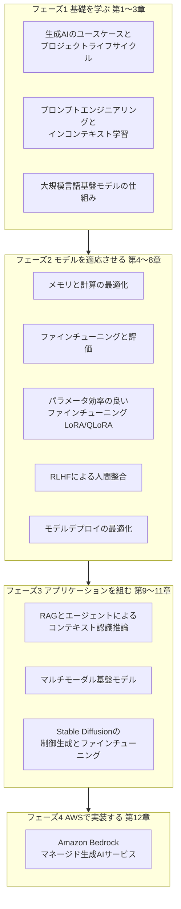
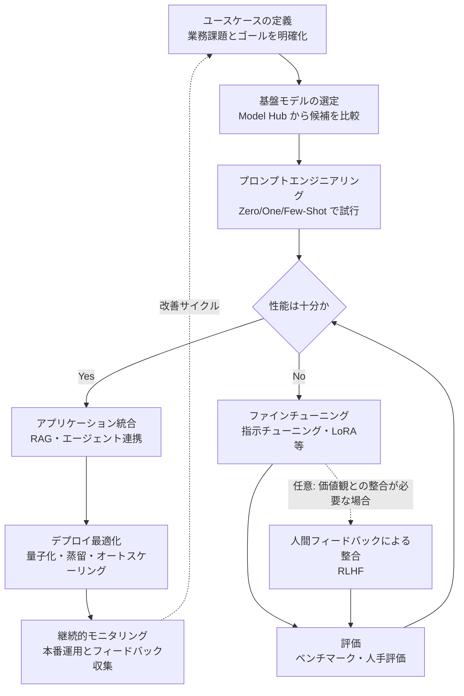
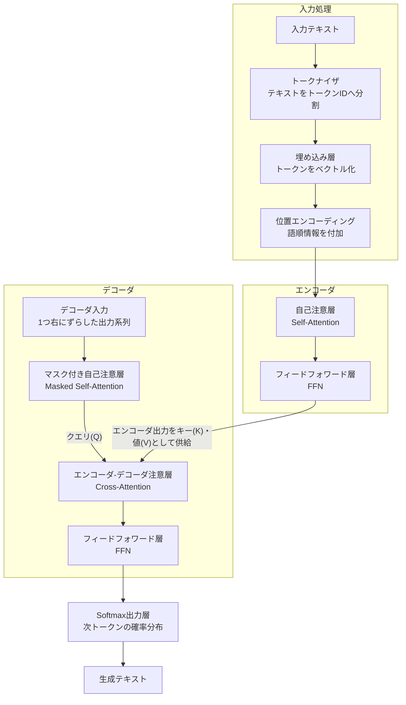
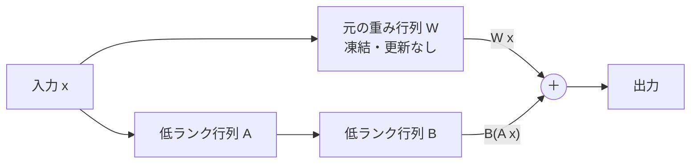
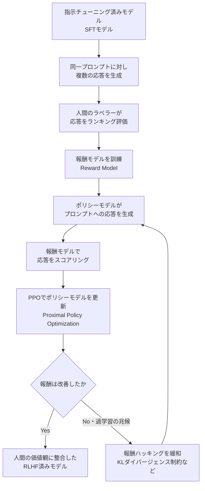
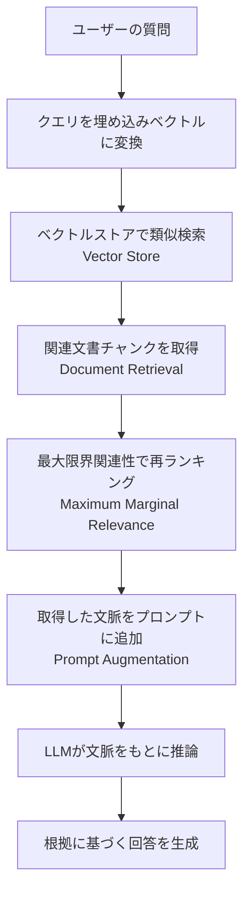
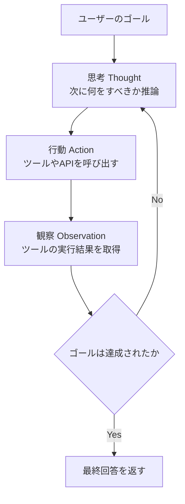
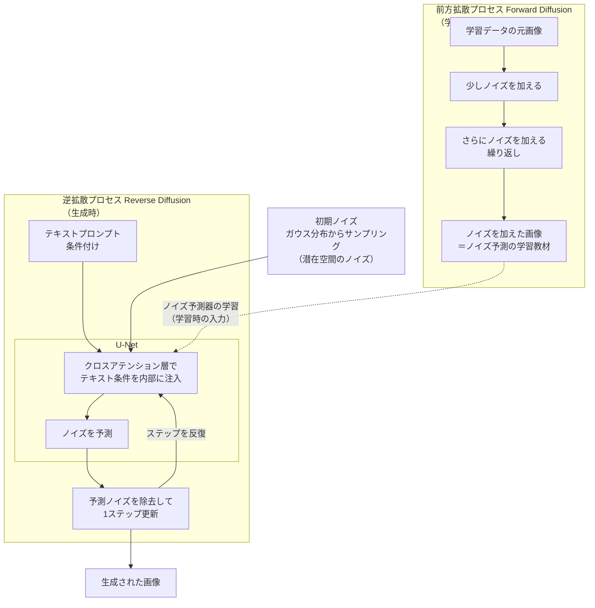
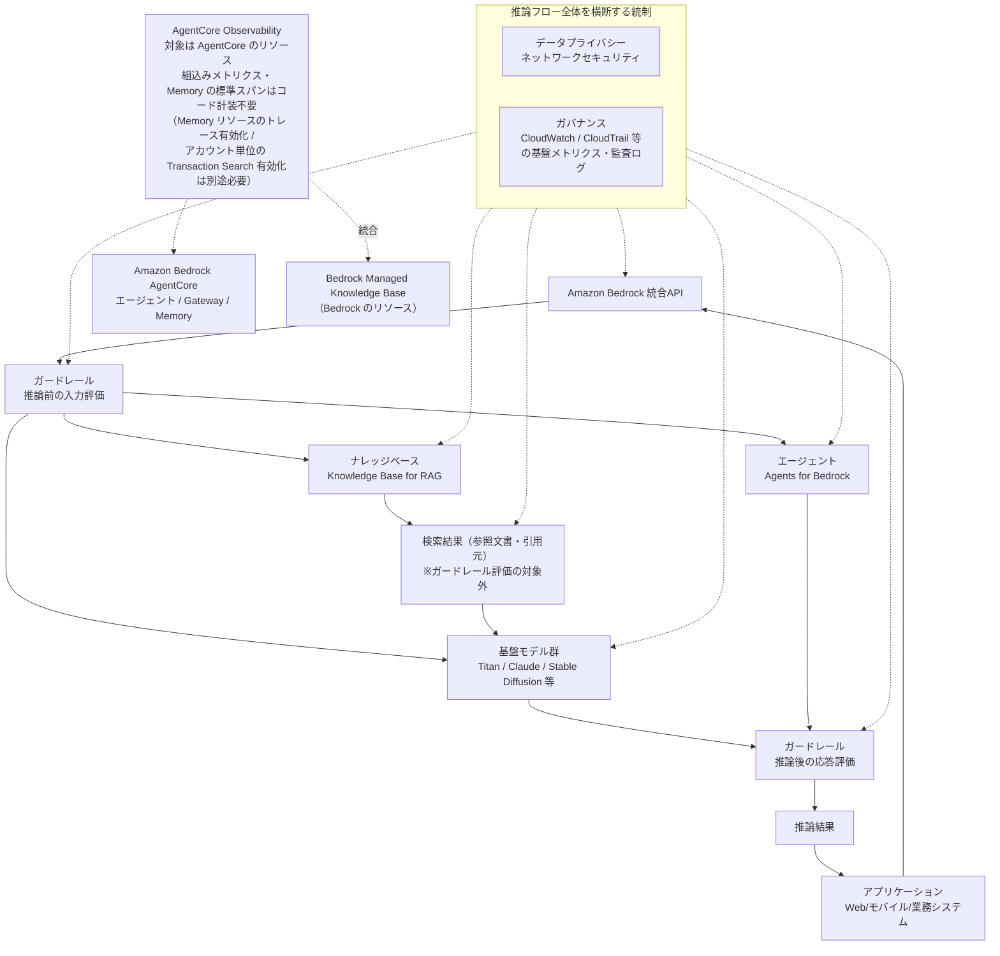

# 初学者向けガイド：Generative AI on AWS ― コンテキスト認識型マルチモーダル推論アプリケーションの構築

> 本ガイドは、O'Reilly刊『Generative AI on AWS: Building Context-Aware Multimodal Reasoning Applications』（Chris Fregly、Antje Barth、Shelbee Eigenbrode 著）の内容を、初めて生成AIを学ぶ人でも理解できるよう、ステップバイステップで解説したものです。2026年9月10日時点の最新情報も踏まえてアップデートしています。

## 目次

1. [はじめに](#はじめに)
2. [書籍の基本情報](#書籍の基本情報)
3. [著者について](#著者について)
4. [対象読者と本ガイドの読み方](#対象読者と本ガイドの読み方)
5. [学習ロードマップ全体像](#学習ロードマップ全体像)
6. [Step 1: 生成AIのユースケースと基礎、プロジェクトライフサイクル（第1章）](#step-1)
7. [Step 2: プロンプトエンジニアリングとインコンテキスト学習（第2章）](#step-2)
8. [Step 3: 大規模言語基盤モデルの仕組み（第3章）](#step-3)
9. [Step 4: メモリと計算の最適化（第4章）](#step-4)
10. [Step 5: ファインチューニングと評価（第5章）](#step-5)
11. [Step 6: パラメータ効率のよいファインチューニング（第6章）](#step-6)
12. [Step 7: RLHFによる人間フィードバックからの強化学習（第7章）](#step-7)
13. [Step 8: モデルデプロイの最適化（第8章）](#step-8)
14. [Step 9: RAGとエージェントによるコンテキスト認識推論アプリケーション（第9章）](#step-9)
15. [Step 10: マルチモーダル基盤モデル（第10章）](#step-10)
16. [Step 11: Stable Diffusionの制御生成とファインチューニング（第11章）](#step-11)
17. [Step 12: Amazon Bedrock ― マネージド生成AIサービス（第12章）](#step-12)
18. [2026年9月時点の最新動向とのギャップ](#最新動向)
19. [さらに学びを深めるためのおすすめリソース](#おすすめリソース)
20. [まとめ](#まとめ)
21. [参考文献・出典](#参考文献)

---

## はじめに

生成AI（Generative AI）は2023年前後から爆発的に注目を集め、今では多くの企業が自社の製品やサービスに組み込もうとしています。しかし「大規模言語モデルをAPIで呼び出せば終わり」という単純な話ではなく、ユースケースの定義からモデル選定、プロンプト設計、ファインチューニング、人間の価値観への整合（アライメント）、そして本番環境への安全なデプロイまで、一連のプロジェクトライフサイクルを理解する必要があります。

本書『Generative AI on AWS』は、AWSの機械学習分野の専門家3名が、この一連のライフサイクル全体を体系的に解説した一冊です。原題のサブタイトルが示す通り、単なるテキスト生成にとどまらず、検索拡張生成（RAG）やエージェントを使った「コンテキストを理解する」アプリケーション、そして画像を含む「マルチモーダルな推論」を行うアプリケーションの構築までをカバーしているのが大きな特徴です。

本ガイドでは、この書籍の12章構成を1つずつ「Step」として区切り、各章で扱われている概念を図解（Mermaid）とともに初学者向けに噛み砕いて説明します。あわせて、書籍刊行（2023年11月）以降にAmazon Bedrockまわりで起きた大きな変化についても、2026年9月時点の情報で補足します。

---

## 書籍の基本情報

| 項目 | 内容 |
|---|---|
| タイトル | Generative AI on AWS: Building Context-Aware Multimodal Reasoning Applications |
| 著者 | Chris Fregly、Antje Barth、Shelbee Eigenbrode |
| 出版社 | O'Reilly Media, Inc. |
| 刊行日 | 2023年11月 |
| ページ数 | 312ページ |
| オーディオブック | 約8時間15分（音声版あり） |
| 対象レベル | 中級〜上級（Intermediate to advanced） |
| 言語 | 英語 |
| 章構成 | 序文＋全12章＋索引＋著者紹介 |
| サンドボックス | O'Reillyプラットフォーム上でハンズオン実行環境（Sandbox）が付属 |

出典: O'Reilly公式書籍ページ（参考文献1）

本書は「Intermediate to advanced（中級〜上級）」向けと位置づけられており、Transformerや機械学習の基礎用語にある程度触れたことがある読者を想定しています。本ガイドはその内容を、初学者でも概念のつながりを見失わないように順序立てて解説する「地図」として使うことを意図しています。

---

## 著者について

- **Chris Fregly** ― AWSで生成AI関連の専門家として活動し、本書の姉妹書にあたる『Data Science on AWS』の共著者でもあります。
- **Antje Barth** ― AWSでAI/ML分野のPrincipal Developer Advocateを務め、「Generative AI on AWS Meetup」というグローバルなコミュニティの共同創設者です。AI・機械学習系カンファレンスでの登壇も多数。
- **Shelbee Eigenbrode** ― AWSで生成AI分野のPrincipal Solutions Architectを務め、「Women in Big Data」デンバー支部の共同創設者でもあります。

3人ともAWSの実務側から生成AIプロジェクトに深く関わってきた実践者であり、本書はアカデミックな理論書というより「実際にAWS上で生成AIアプリケーションを構築するための実務書」という色合いが強い構成になっています。

なお、MetaのApplied AIリーダーであるGeeta Chauhan氏は、実践的に生成AIを構築するための資料として本書を高く評価するコメントを寄せており、HRS GroupのデータサイエンスプラットフォームディレクターであるOlalekan Elesin氏も、AWS上で大規模に生成AIアプリケーションを構築する人にとって必読の一冊だと推薦しています（詳細は参考文献5を参照）。

---

## 対象読者と本ガイドの読み方

O'Reillyの紹介文によれば、本書はCTO、機械学習エンジニア、アプリケーション開発者、ビジネスアナリスト、データエンジニア、データサイエンティストなど、幅広い職種を対象としています。本ガイドでは、特に次のような方を想定しています。

- 生成AIという言葉は知っているが、プロジェクトの全体像がつかめていない方
- プロンプトエンジニアリングまでは触れたことがあるが、ファインチューニングやRAGの仕組みが曖昧な方
- AWS上で本格的に生成AIアプリケーションを作りたいが、どのサービスをどう組み合わせればよいか整理したい方

各Stepは独立して読めるように構成していますが、初めての方は上から順に読むことで、生成AIプロジェクトの一連の流れ（ライフサイクル）が自然につながって理解できるようになっています。

---

## 学習ロードマップ全体像

本書の12章は、大きく4つのフェーズに分けて捉えると理解しやすくなります。

- **フェーズ1（第1〜3章）**：生成AIとは何か、どんなユースケースがあるか、そしてその中核であるTransformerベースの基盤モデルがどう動くかという「土台」を学びます。
- **フェーズ2（第4〜8章）**：巨大なモデルを実際に動かす・調整するための技術的な工夫（メモリ最適化、ファインチューニング、RLHF、デプロイ最適化）を学びます。
- **フェーズ3（第9〜11章）**：本書のサブタイトルにある「コンテキスト認識」「マルチモーダル」なアプリケーションの作り方、すなわちRAG・エージェント・画像生成モデルを学びます。
- **フェーズ4（第12章）**：これまで学んだ内容を、AWSのマネージドサービスであるAmazon Bedrockを使って実装する方法を学びます。

それでは、各章を1つずつStepとして見ていきましょう。

---

## Step 1: 生成AIのユースケースと基礎、プロジェクトライフサイクル（第1章）

第1章は本書全体の地図にあたる章です。まず生成AIがどのようなタスク（テキスト生成、要約、翻訳、質問応答、コード生成など）に使えるかを整理し、次に「基盤モデル（Foundation Model）」と「モデルハブ（Model Hub）」という考え方を紹介します。基盤モデルとは、大量のデータで事前学習された汎用モデルのことで、Hugging Face HubやAmazon SageMaker JumpStartのようなモデルハブから選んで利用するのが一般的な進め方です。

第1章の後半では、生成AIプロジェクトが辿る典型的なライフサイクルが提示されます。これは本書全体の構成そのものにも対応しています。

**初学者向けのポイント**：多くの入門記事は「プロンプトを工夫すれば終わり」という印象を与えがちですが、実際のプロジェクトでは「プロンプトだけで十分な性能が出るか」を判断し、不十分ならファインチューニングやRLHFに進むという分岐が発生します。このライフサイクル図を頭に入れておくと、以降の章（第2章〜第8章）がこの図のどの部分を深掘りしているのかが分かりやすくなります。

最後に第1章では「なぜAWS上で生成AIを構築するのか」という問いに対し、Amazon SageMakerによる学習基盤、AWS Trainium/Inferentiaのような専用ハードウェア、そしてAmazon Bedrockのようなマネージドサービスの存在を理由として挙げています。

---

## Step 2: プロンプトエンジニアリングとインコンテキスト学習（第2章）

第2章では、モデルに与える入力（プロンプト）と、モデルが出力する応答（コンプリーション）の関係、そしてプロンプトを構成する要素（指示・文脈・入力データ・出力形式の指定など）を整理します。あわせて「トークン」という単位についても解説されており、これは課金やコンテキストウィンドウの上限を理解する上で欠かせない基礎知識です。

本章の中心的なテーマが「インコンテキスト学習（In-Context Learning）」です。これは、モデルの重みを一切更新せずに、プロンプトの中に例（デモンストレーション）を含めるだけでモデルの振る舞いを誘導する手法です。

| 手法 | 説明 | 例に必要なサンプル数 |
|---|---|---|
| Zero-Shot Inference | 例を1つも与えず、指示だけでタスクを実行させる | 0件 |
| One-Shot Inference | 1つの例をプロンプトに含めて実行させる | 1件 |
| Few-Shot Inference | 複数の例をプロンプトに含めて実行させる | 2件以上 |

一般に、モデルの規模が大きいほどZero-Shotでも高い性能を発揮しやすく、モデルが小さい場合はFew-Shotで例を増やすことで性能を補う、という関係があります。ただし、例を詰め込みすぎるとコンテキストウィンドウを圧迫したり、かえって性能が落ちる「インコンテキスト学習がうまくいかないケース」もあり、本章ではそのアンチパターンとベストプラクティスの両方が扱われています。

さらに、`temperature`（出力のランダム性）や`top-k`/`top-p`（サンプリング時に候補とするトークンの絞り込み方）といった推論設定パラメータも本章で扱われます。ただし、**どのパラメータをサポートするか、既定値がいくつか、指定できる値の範囲がどこまでかはモデルごとに異なります**。たとえば`top-k`は公開していないモデルもあり、`temperature`の上限値もモデルによって変わります。したがってこれらは「すべてのモデルで必ず調整する項目」ではなく、選択したモデルがそのパラメータをサポートしている場合に限り、対象モデルのドキュメント（Bedrockであれば各モデルの推論パラメータ仕様）で許容範囲を確認したうえで調整してください。

---

## Step 3: 大規模言語基盤モデルの仕組み（第3章）

第3章は、生成AIの中核技術であるTransformerアーキテクチャを解説する、本書の中でも技術的に濃い章の一つです。トークナイザ、埋め込みベクトル、そしてTransformer本体（エンコーダ・デコーダ）の各構成要素が順を追って説明されます。

次の図は、原論文 "Attention Is All You Need" が提示した**エンコーダ–デコーダ型（encoder–decoder）Transformer**の構成です。エンコーダスタック・デコーダスタック・両者をつなぐエンコーダ–デコーダ注意層を持つこの型は、Transformerの一形態であってすべてのTransformerを代表するものではありません（GPT系はデコーダのみ、BERT系はエンコーダのみで構成されます）。

**図: エンコーダ–デコーダ型Transformerの構成**

ポイントは「自己注意（Self-Attention）」の仕組みです。これは文中の各単語が、他のどの単語とどれくらい関連しているかを計算する仕組みで、これにより「it」のような代名詞が文中のどの名詞を指しているかをモデルが判断できるようになります。Transformerを視覚的に理解したい場合は、著名なブロガーであるJay Alammar氏による「The Illustrated Transformer」という解説記事が国際的に広く参照されており、本書と合わせて読むと理解が深まります（参考文献8）。

第3章の後半では、Transformerベースのモデルが「エンコーダのみ（BERT系）」「デコーダのみ（GPT系）」「エンコーダ-デコーダ両方（T5系）」の3種類に大別されることや、事前学習に使われるデータセットの規模、そして「スケーリング則（Scaling Laws）」と呼ばれる、モデルサイズ・データ量・計算量と性能の関係についても解説されています。

---

## Step 4: メモリと計算の最適化（第4章）

大規模言語モデルは数十億〜数千億パラメータに達するため、そのまま学習・推論しようとすると膨大なGPUメモリが必要になります。第4章では、このメモリ制約にどう対処するかが解説されます。

| 数値精度 | ビット数 | 特徴 |
|---|---|---|
| fp32 | 32bit | 標準的な精度。メモリ消費が最大 |
| fp16 | 16bit | メモリを半減できるが数値範囲が狭い |
| bfloat16 | 16bit | fp32と同じ指数部を持ち、学習時の安定性が高い |
| fp8 | 8bit | 最新の推論高速化で使われる超低精度 |
| int8 | 8bit | 量子化でよく使われる整数表現 |

この量子化（Quantization）に加えて、第4章では「FlashAttention」（自己注意の計算を高速化・省メモリ化する手法）や「Grouped-Query Attention」（複数のクエリヘッドでキー・バリューを共有してメモリを削減する手法）といった、注意機構そのものを最適化する技術も紹介されます。

さらに、1台のGPUに収まらない巨大モデルを複数GPU・複数ノードに分散させる手法として「分散データ並列（Distributed Data Parallel）」と「完全シャーディングデータ並列（Fully Sharded Data Parallel, FSDP）」が比較され、AWS上ではAmazon SageMakerのFSDPサポートや、AWS独自の学習用チップであるAWS Trainiumを使う方法が紹介されています。

---

## Step 5: ファインチューニングと評価（第5章）

第5章では、事前学習済みモデルを特定のタスクに適応させる「指示チューニング（Instruction Fine-Tuning）」を扱います。Llama 2-Chat、Falcon-Chat、FLAN-T5といった、実際に指示チューニングによって作られた代表的なモデル群を例に、どのようなデータセット（指示とその模範解答のペア）を用意すればよいかが説明されます。

学習の実行環境としては、Amazon SageMaker StudioやSageMaker JumpStart、Hugging Face向けのSageMaker Estimatorが紹介されており、AWS上でどのようにファインチューニングのジョブを立ち上げるかという実務的な内容が中心です。

章の後半では「評価（Evaluation）」がテーマになります。ファインチューニングをしても、それが本当に性能向上につながったかを測定しなければ意味がありません。ROUGEやBLEUのような定量的な評価指標や、既存のベンチマークデータセットを使った評価方法が紹介されます。

---

## Step 6: パラメータ効率のよいファインチューニング（第6章）

第6章の主役は「LoRA（Low-Rank Adaptation）」と、その量子化版である「QLoRA」です。フルファインチューニング（Full Fine-Tuning）ではモデルの全パラメータを更新するため、巨大なモデルほど膨大な計算資源が必要になります。LoRAはこの問題を解決するために考案された手法で、元のモデルの重みは凍結したまま、低ランクの小さな行列だけを新たに学習します。

推論時は、凍結した元の重みによる計算 `W x` と、低ランク行列によるアダプターの計算 `B(A x)` を**加算**し、その和が出力になります（`W x + B(A x)`）。元の重みは書き換えず、差分だけを足し込む構造です。

学習対象になるのは行列AとBだけなので、更新すべきパラメータ数が劇的に減り、消費GPUメモリも小さくなります。QLoRAはこれをさらに発展させ、元のモデル自体を4bitに量子化した状態でLoRAを適用することで、より少ないメモリで大規模モデルのファインチューニングを可能にします。

| 手法 | 更新対象 | メモリ効率 | 備考 |
|---|---|---|---|
| フルファインチューニング | 全パラメータ | 低い | 性能は高いが計算コストが最大 |
| LoRA | 低ランク行列のみ | 高い | 元モデルは凍結、アダプタを差し替え可能 |
| QLoRA | 量子化モデル＋低ランク行列 | 非常に高い | メモリはさらに節約できるが学習時間はやや増加する傾向 |
| プロンプトチューニング | ソフトプロンプトのみ | 非常に高い | モデル本体は一切変更しない |

LoRAとQLoRAの実践的なチューニングについては、機械学習分野で著名な研究者・教育者であるSebastian Raschka氏が、数百回規模のLoRA/QLoRA実験を行った知見を公開しており、「QLoRAはメモリを約33%削減できる一方で学習時間が約39%増加するというトレードオフがある」といった具体的な指摘は今でも広く引用されています（参考文献7・23）。なお同氏の詳細記事（参考文献23）には、この要約値39%と並んで、LoRA（bf16）1.85時間／QLoRA（4bit NF4）2.79時間という実測の学習時間も掲載されています。この2値からそのまま増加率を計算すると約50.8%となり、要約値の39%とは一致しません（記事上、この差がどこから生じるかは説明されていません）。引用する際は、要約値の39%と実測値から算出した約50.8%のどちらを根拠にしたのかを明示してください。いずれにせよこの数値は、同氏が特定の条件下で行った実験の実測値です。対象モデル、量子化の方式とビット数、LoRAのランクと適用先モジュール、シーケンス長、バッチサイズ、使用GPUといった設定によって削減率も増加率も変わるため、そのまま一般則として扱わず、必ず自分の設定で計測してください（実験条件の詳細は参考文献23の原典を参照）。本書の該当章と合わせて読むことで、理論だけでなく実務上の勘所もつかめます。

---

## Step 7: RLHFによる人間フィードバックからの強化学習（第7章）

第7章は「人間の価値観にモデルをどう整合させるか」という、生成AIの安全性に直結するテーマを扱います。キーワードは「HHH（Helpful, Honest, Harmless＝役に立ち、正直で、無害）」という3原則です。

流れを整理すると次のようになります。

1. **報酬モデルの学習**：Amazon SageMaker Ground Truthのような人手アノテーションの仕組みを使い、人間のラベラーが複数の応答にランキングを付け、そのデータから「どの応答が好ましいか」を予測する報酬モデルを訓練します。既存の毒性検出モデル（Meta製など）を報酬モデルとして流用するケースも紹介されています。
2. **強化学習によるファインチューニング**：報酬モデルが出すスコアを最大化するように、PPO（Proximal Policy Optimization）というアルゴリズムでポリシー（＝生成AIモデル本体）を更新します。
3. **報酬ハッキングの緩和**：報酬モデルを騙すような不自然な出力（報酬ハッキング）を防ぐため、元のモデルの出力分布から大きく逸脱しないようKLダイバージェンスによる制約をかけます。
4. **評価**：定性的評価（人間による読み比べ）と定量的評価（毒性スコアなどの指標）の両方でRLHF後のモデルを検証します。

第6章で学んだLoRAをRLHFのフェーズでも併用できる点（パラメータ効率のよいRLHF）が紹介されているのも実務上重要なポイントです。

---

## Step 8: モデルデプロイの最適化（第8章）

学習・ファインチューニングが終わったモデルを、実際にユーザーに使ってもらうにはどう配置すればよいかを扱うのが第8章です。

| 手法 | 概要 |
|---|---|
| プルーニング（Pruning） | 影響の小さいパラメータを削除してモデルを軽量化 |
| 量子化（Post-Training Quantization / GPTQ） | 学習後のモデルの重みを低精度に変換して軽量化 |
| 蒸留（Distillation） | 大きな教師モデルの出力を、小さな生徒モデルに学習させる |

これらの最適化に加え、AWS Inferentiaのような推論専用ハードウェアの活用や、モデル更新時のリスクを抑える「A/Bテスト」「シャドーデプロイ（本番トラフィックを使いつつ結果はユーザーに返さずに新モデルを検証する手法）」といったデプロイ戦略も紹介されています。本番運用ではメトリクスによるモニタリングと、負荷に応じてインスタンス数を自動調整する「オートスケーリングポリシー」の設計も欠かせない要素として扱われます。

---

## Step 9: RAGとエージェントによるコンテキスト認識推論アプリケーション（第9章）

本書のサブタイトルにある「コンテキスト認識（Context-Aware）」という言葉が正面から扱われるのが第9章です。まず、大規模言語モデルには2つの根本的な限界があることが説明されます。

- **ハルシネーション（Hallucination）**：事実に基づかない、もっともらしい嘘の情報を生成してしまう現象
- **知識のカットオフ（Knowledge Cutoff）**：学習データの収集時点以降の出来事や、学習データに含まれない社内情報などを知らない

この2つの限界に対処する代表的な手法が「検索拡張生成（Retrieval-Augmented Generation, RAG）」です。

RAGのワークフローは、社内文書のような外部知識源を「文書の読み込みとチャンク分割」→「埋め込みベクトル化してベクトルストアに格納」→「質問に類似した文書を検索・取得」→「取得した文脈をプロンプトに追加」→「LLMに推論させる」という流れで構成されます。

第9章のもう一つの柱が「エージェント（Agents）」です。エージェントは、LLM自身に「次に何をすべきか」を考えさせながら、外部ツール（検索、計算、API呼び出しなど）を呼び出させる仕組みです。本書ではその代表的な枠組みとして「ReActフレームワーク」と「Program-Aided Language（PAL）フレームワーク」が紹介されています。

ReActは「Reasoning（推論）」と「Acting（行動）」を交互に繰り返すことで、モデルが単発の応答ではなく、複数ステップにわたってタスクを解決できるようにする枠組みです。DeepLearning.AIの創設者として国際的に知られるAndrew Ng氏も、この種の「エージェント的なRAG（Agentic RAG）」―実行時にエージェント自身がどのデータを取得すべきかを自律的に判断する発展形―を、今後大きく伸びる領域として紹介しています（参考文献9）。また、著書『AI Engineering』で知られるChip Huyen氏も、RAGとエージェントを統一的に捉える視点を提示しており、本章のテーマと強く重なります（参考文献10）。

第9章の最後では、これらのRAG・エージェントを含むアプリケーションを本番運用するための「FMOps（Foundation Model Ops）」という考え方が紹介されます。実験段階・開発段階・本番デプロイ段階のそれぞれで気をつけるべき観点が整理されています。

---

## Step 10: マルチモーダル基盤モデル（第10章）

ここから本書のもう一つのテーマである「マルチモーダル（Multimodal）」の領域に入ります。第10章では、テキストだけでなく画像も扱えるモデルのユースケース（画像生成、画像編集・補正、画像キャプション生成、視覚的質問応答＝VQAなど）が紹介されます。

画像生成タスクの中核技術が「拡散モデル（Diffusion Model）」です。

拡散モデルは、元画像に少しずつノイズを加えていく「前方拡散プロセス」と、そのノイズを少しずつ取り除きながら画像を復元していく「逆拡散プロセス」という2つのプロセスから成り立ちます。ここで注意したいのは、前方拡散が**学習時の処理**だという点です。学習データの画像を段階的にノイズ化し、「どのノイズが加えられたか」をU-Netに当てさせることでノイズ予測器を訓練します。一方、テキストから画像を生成する**推論時には元画像は不要**で、ガウス分布からサンプリングした純粋なノイズ（Stable Diffusionでは潜在空間上のノイズ）を出発点として逆拡散を回します（上図でも、学習時の入力である「ノイズを加えた画像」は点線でU-Netの入口へ入り、推論時は前方拡散の出力ではなく独立した「初期ノイズ」ノードから逆拡散へ接続しています）。テキストから画像を生成する場合は、この逆拡散プロセスの各ステップで、テキストプロンプトの情報を「クロスアテンション」という仕組みを通じてU-Netに注入し、ノイズ除去の方向をテキストの意味に沿ったものへと導きます。

本章ではStable Diffusion 2とStable Diffusion XLという2つのアーキテクチャの違い（XLでは条件付けの仕組みが強化され、加えてRefinerモデルが用意されている点など）も具体的に解説されています。XLのBaseモデルはそれ単体で画像を生成でき、Refinerは生成された画像のディテールを仕上げるために**任意で**追加適用する別モデルです（必須の後段工程ではありません）。また、画像だけでなく「Inpainting（画像の一部を修復・置換）」「Outpainting（画像の外側を拡張）」「Depth-to-Image（深度情報から画像を生成）」といった応用的な画像編集タスクも扱われます。

---

## Step 11: Stable Diffusionの制御生成とファインチューニング（第11章）

第10章で拡散モデルの基本を学んだ上で、第11章ではその出力をより精密にコントロールする手法や、特定のスタイル・被写体に特化させるファインチューニング手法が紹介されます。

| 手法 | 目的 | 特徴 |
|---|---|---|
| ControlNet | 生成する構図やポーズを制御 | エッジ検出画像や姿勢情報などを追加の条件として入力 |
| DreamBooth | 特定の被写体をモデルに学習させる | 少数の参照画像から特定の人物・物体を再現できるようにする |
| DreamBooth + LoRA | DreamBoothを軽量に実施 | 第6章のLoRAの考え方を拡散モデルに応用し、学習コストを削減 |
| Textual Inversion | 新しい概念を単語として学習 | 新しい「単語（トークン）」を1つ学習させ、既存モデルの語彙に追加する |

本章の最後では、第7章で学んだRLHFの考え方を画像生成モデルにも応用する「人間の価値観に整合した画像生成」についても触れられており、テキスト生成とマルチモーダル生成の両方で「人間のフィードバックを取り込む」という発想が共通して現れることが分かります。

---

## Step 12: Amazon Bedrock ― マネージド生成AIサービス（第12章）

最終章では、これまで学んできた技術要素を、AWSのマネージドサービスであるAmazon Bedrockを使って実際にどう実装するかがまとめられています。

刊行当時（2023年）のBedrockには、AWS自社開発のAmazon Titanファミリーや、Stability AIのStable Diffusion系モデルが基盤モデルとして提供されていました。本章では、大規模言語モデル向けの推論API（SQLコード生成、テキスト要約、埋め込みベクトル生成など）、ファインチューニング機能、エージェント機能、そしてマルチモーダルモデル向けのAPI（テキストからの画像生成、画像からの画像生成）が一通り紹介され、最後にデータプライバシー・ネットワークセキュリティ、ガバナンス・モニタリングといった、企業利用に欠かせない観点でまとめられています。なお上図が示すとおり、ガードレールは推論結果と並ぶ独立の出力元ではなく、**ユーザー入力と、LLMが生成した応答の両方を評価するフィルタ**として機能します。評価対象はこの2つであり、ナレッジベースから取得した参照文書そのものではありません。そのため上図では、ナレッジベースの検索結果を生成された応答とは別のノードとして分け、ガードレールを経由しない経路で基盤モデルへ渡しています。**RetrieveAndGenerate API** はこの「検索 → 取得文書を文脈として与えて生成」までを一括で実行しますが、ガードレールの評価対象は**入力クエリと生成された応答の2つ**であり、検索で取得した参照文書そのものは評価されません。これに対し、エージェント型の検索を行う **AgenticRetrieveStream API** では、`agenticRetrieveConfiguration.policyConfiguration` でガードレールを設定し、**検索（リトリーブ）の過程に**適用します。つまり両者は「どこで設定するか」も「何を評価するか」も異なるため、「ガードレールを有効にした」という一言でまとめず、使用するAPIごとに適用範囲を確認してください（設定項目の詳細は参考文献20のAWS公式ドキュメント最新版を参照）。また、データプライバシー・セキュリティ・ガバナンス・モニタリングは推論後の後処理段ではなく、**推論フロー全体を横断する統制**として捉えるのが実態に近い点にも注意してください。ここで統制と可観測性は別のノードに分けています。**AgentCore Observabilityの対象は Amazon Bedrock AgentCore のリソースに限られます**。ここで「ナレッジベース」を一括りにせず、区別しておく必要があります。**Managed Knowledge Base は Bedrock のリソースですが、AgentCore Observability と統合されます**（上図でも AgentCore とは別ノードとして描き、統合関係を接続で示しています）。ただしこの統合も「つなげば見える」ものではありません。Managed Knowledge Base 側の可観測性は、**`AWS/Bedrock/KnowledgeBases` 名前空間のランタイムメトリクスを CloudWatch へ出力すること**と、**Retrieve 系オペレーションのトレース（TRACES）を AWS X-Ray へ配信すること**を有効化してはじめてデータが集まります（参考文献17・20。Bedrock 側の設定であり、AgentCore の設定ではありません）。有効化していない場合、統合されていてもダッシュボードは空のままです。一方、**従来の Bedrock Knowledge Base、Bedrockへの直接のモデル呼び出し、ガードレールは AgentCore のリソースではないため、AgentCore Observability の自動収集対象外です**。これら対象外の要素を含めた統制・監査は CloudWatch や CloudTrail といった基盤側の仕組みで行います。上図でも、OBS は AgentCore と（統合関係にある）Managed Knowledge Base のノードにのみ接続しており、図中の「エージェント（Agents for Bedrock）」＝従来型のエージェントには接続していません。なお、AgentCore Observability のすべての機能に計装が要るわけではありません。**組込みメトリクス（セッション数、レイテンシ、エラー率など）や AgentCore Memory の標準スパンは、エージェント側に追加のコード計装を書かなくても収集されます**。ただしこれは「何の設定も不要」という意味ではありません。コード計装が不要であることとは**別の要件**として、① AgentCore Memory リソース側でトレースを有効化すること、② アカウント（リージョン）単位で CloudWatch Transaction Search を有効化すること、の2点を満たす必要があります（参考文献22）。**この2点は AgentCore 固有の要件であり、上記の Managed Knowledge Base 側の設定とは別物です**。混同すると、片方だけを有効化して「統合したのにデータが出ない」という状態になります。**エージェント側の計装（OpenTelemetry互換の設定）が必要になるのは、エージェント内部の処理を細かく追う詳細トレース（独自のスパン、ツール呼び出し、セッション単位の追跡など）や、独自のテレメトリを送る場合に限られます**。

この章の内容は、Bedrockという製品自体が今も高速に進化し続けているサービスであるため、刊行後のアップデートを踏まえて読む価値が特に高い部分です。次のセクションで、2026年9月時点での主な変化を補足します。

---

## 2026年9月時点の最新動向とのギャップ

本書は2023年11月に刊行されており、第12章で解説されているAmazon Bedrockの機能は、当時のスナップショットです。生成AIの分野、特にAWSのマネージドサービスはその後も急速に進化しているため、学習の際は以下の変化を念頭に置いてください。

| 分野 | 2023年刊行当時 | 2026年9月時点の状況 |
|---|---|---|
| モデルラインナップ | Titan、Stable Diffusion系が中心 | Anthropic Claude、Meta Llama、Mistral、Google Gemma、OpenAI GPT系、Amazon Nova、xAI Grokなど、20近いプロバイダーの100以上のモデルが利用可能に拡大（参考文献18・11） |
| エージェント機能 | 「Agents」として第9章・第12章で紹介 | 「Bedrock Agents」（現「Bedrock Agents Classic」）は2026年7月30日以降、新規顧客への提供を停止。ただし直前12か月以内に利用実績があるアカウントでは、既存エージェントの利用と新規エージェントの作成を引き続き行える。後継の「Amazon Bedrock AgentCore」がエージェント構築の中心的な仕組みに（参考文献19・13） |
| RAG関連機能 | 自前でベクトルストアと検索チェーンを構築する解説が中心 | フルマネージドの「Bedrock Knowledge Base」やAgentCore経由の「Managed Knowledge Base」が登場し、データ接続・チャンク分割・再ランキングまで自動化される方向に進化（参考文献20・17） |
| ルーティング／コスト最適化 | 明示的なモデル選択が前提 | 同一モデルファミリ内であらかじめ指定したモデルを対象に、プロンプトごとの予測応答品質と設定したルーティング条件に基づいて送信先モデルを選択する「Intelligent Prompt Routing」などの最適化機能が追加（参考文献21） |

> 上表の各行は、末尾に示したAWS公式資料に基づいています。**利用可能なモデル・リージョン、アカウントごとの提供条件（Bedrock Agents Classic の許可リスト判定）、Intelligent Prompt Routing の対象モデルファミリとルーティング条件は、いずれもリージョンとアカウントによって異なります**。導入前に必ず参考文献18〜21の公式ドキュメントで自分のリージョン・アカウントの条件を確認してください。

とりわけ重要なのは、第9章・第12章で解説されている「Agents」の仕組みが、2026年時点では「Amazon Bedrock AgentCore」という新しいアーキテクチャに置き換わりつつある点です。AgentCoreはメモリ管理、ガバナンス（Policy機能による行動制御）、評価（Evaluations）、そして詳細な可観測性（Observability）を備えた、エージェントをより安全に本番運用するための基盤として位置づけられています（参考文献12〜16）。本書でReActフレームワークやエージェントの基本概念を理解した上で、実際にAWS上で構築する際は、最新のAgentCoreのドキュメントもあわせて確認することをおすすめします。

---

## さらに学びを深めるためのおすすめリソース

本書と組み合わせて読むことで理解が深まる、国際的に評価の高いリソースを分野別にまとめました。

- **書籍のコード実践**：著者らが公開しているGitHubリポジトリには、本書の各章に対応したノートブックやワークショップ資料が公開されています（参考文献2・3）。
- **Transformerの仕組みをより深く**：Jay Alammar氏の「The Illustrated Transformer」は、TransformerやAttentionの仕組みを視覚的に解説した記事として、スタンフォードやハーバードなど多くの大学の講義でも参照されており、国際的に最も広く読まれている解説記事の一つです（参考文献8）。
- **LoRA/QLoRAの実践的チューニング**：Sebastian Raschka氏によるLoRA・QLoRAの実験ブログは、ハイパーパラメータ選定の実務的な勘所を数値付きで示しており、第6章の理解を補完します（参考文献6・7）。
- **RAGとエージェントの最新動向**：Andrew Ng氏によるAgentic RAGの紹介や、Chip Huyen氏の著書『AI Engineering』でのRAGとエージェントの統合的な解説は、第9章のテーマをより広い文脈で捉える助けになります（参考文献9・10）。
- **Amazon Bedrockの最新状況**：AWS公式の一次情報源はAgentCoreのリリースノート、What's New、AWS Machine Learningブログです（参考文献13〜15）。参考文献12はAmazonのニュースルーム（About Amazon）による発表記事、参考文献16はEnterprise DNAによる第三者の解説記事であり、いずれもAWSの公式技術ドキュメントではありません。AWSの公式見解として扱う際は参考文献13〜15を根拠としてください。

---

## まとめ

『Generative AI on AWS』は、生成AIプロジェクトの全体像（ユースケース定義からデプロイまで）を、AWSという具体的なプラットフォーム上での実装と結び付けて解説した実務書です。本ガイドで見てきたように、12章の内容は次のように整理できます。

- 第1〜3章で、生成AIの基礎とTransformerの仕組みという「土台」を固める
- 第4〜8章で、巨大なモデルを効率よく学習・調整・デプロイするための技術（メモリ最適化、LoRA/QLoRA、RLHF、モデル圧縮）を身につける
- 第9〜11章で、RAGとエージェントによる「コンテキスト認識」、そして拡散モデルによる「マルチモーダル」なアプリケーションの作り方を学ぶ
- 第12章で、それらすべてをAmazon Bedrockという具体的なサービス上に落とし込む

生成AI、特にAWSのマネージドサービス周りは変化が非常に速い分野です。本書で体系的な「地図」を頭に入れつつ、Amazon Bedrock AgentCoreのような最新のサービスアップデートは都度、公式ドキュメントで確認しながら学習を進めることをおすすめします。

---

## 参考文献・出典

| # | 情報源 | URL |
|---|---|---|
| 1 | O'Reilly公式書籍ページ「Generative AI on AWS」 | https://www.oreilly.com/library/view/generative-ai-on/9781098159214/ |
| 2 | 著者公式GitHubリポジトリ generative-ai-on-aws | https://github.com/generative-ai-on-aws/generative-ai-on-aws |
| 3 | AWSサンプルのワークショップリポジトリ data-science-on-aws | https://github.com/aws-samples/data-science-on-aws |
| 4 | Bookshop.org 書籍情報・著者紹介ページ | https://bookshop.org/p/books/generative-ai-on-aws-building-context-aware-multimodal-reasoning-applications-anje-barth/e415aa7851c60313 |
| 5 | Amazon.com 書籍ページ（推薦コメント掲載） | https://www.amazon.com/Generative-AWS-Context-Aware-Multimodal-Applications/dp/1098159225 |
| 6 | Sebastian Raschka氏によるLoRA解説ブログ | https://sebastianraschka.com/blog/2023/llm-finetuning-lora.html |
| 7 | Sebastian Raschka氏によるLoRA/QLoRA実験知見の投稿 | https://x.com/rasbt/status/1712816975083155496 |
| 8 | Jay Alammar氏「The Illustrated Transformer」 | https://jalammar.github.io/illustrated-transformer/ |
| 9 | Andrew Ng氏によるRAG／Agentic RAGに関する投稿 | https://x.com/AndrewYNg/status/1945502636012445937 |
| 10 | Chip Huyen氏『AI Engineering』RAGとエージェントの章に関する解説 | https://alexstrick.com/posts/2025-01-24-notes-on-ai-engineering-chip-huyen-chapter-6.html |
| 11 | AWSブログ「Introducing Gemma 4 models on Amazon Bedrock」 | https://aws.amazon.com/blogs/machine-learning/introducing-gemma-4-models-on-amazon-bedrock/ |
| 12 | About Amazon（Amazonニュースルーム／AWS公式技術ドキュメントではない）「New Amazon Bedrock AgentCore capabilities」 | https://www.aboutamazon.com/news/aws/aws-amazon-bedrock-agent-core-ai-agents |
| 13 | Amazon Bedrock AgentCore 公式リリースノート | https://docs.aws.amazon.com/bedrock-agentcore/latest/devguide/release-notes.html |
| 14 | AWS「Amazon Bedrock AgentCore expands to two new regions」 | https://aws.amazon.com/about-aws/whats-new/2026/08/bedrock-agentcore-two-new-regions/ |
| 15 | AWSブログ「New in Amazon Bedrock AgentCore: broader knowledge and continuous learning」 | https://aws.amazon.com/blogs/machine-learning/new-in-amazon-bedrock-agentcore-build-agents-with-broader-knowledge-and-continuous-learning/ |
| 16 | Enterprise DNA（第三者資料）「AWS Retires Bedrock Agents: AgentCore Is the New Path」 | https://enterprisedna.co/resources/news/amazon-bedrock-agents-classic-agentcore-enterprise-july-2026/ |
| 17 | AWSブログ「Introducing Amazon Bedrock Managed Knowledge Base」 | https://aws.amazon.com/blogs/aws/introducing-amazon-bedrock-managed-knowledge-base-for-faster-more-accurate-enterprise-ai-applications/ |
| 18 | AWS公式ドキュメント「Supported foundation models in Amazon Bedrock」 | https://docs.aws.amazon.com/bedrock/latest/userguide/models-supported.html |
| 19 | AWS公式ドキュメント「Amazon Bedrock Agents Classic maintenance mode」（提供停止日と既存顧客の許可リスト条件） | https://docs.aws.amazon.com/bedrock/latest/userguide/agents-classic-maintenance-mode.html |
| 20 | AWS公式ドキュメント「Amazon Bedrock Knowledge Bases」 | https://docs.aws.amazon.com/bedrock/latest/userguide/knowledge-base.html |
| 21 | AWS公式ドキュメント「Understanding intelligent prompt routing in Amazon Bedrock」 | https://docs.aws.amazon.com/bedrock/latest/userguide/prompt-routing.html |
| 22 | AWS公式ドキュメント「Add observability to your Amazon Bedrock AgentCore resources」 | https://docs.aws.amazon.com/bedrock-agentcore/latest/devguide/observability-configure.html |
| 23 | Sebastian Raschka氏「Practical Tips for Finetuning LLMs Using LoRA (Low-Rank Adaptation)」（QLoRAのメモリ33%削減・学習時間39%増加および実測時間1.85h／2.79hの原典） | https://magazine.sebastianraschka.com/p/practical-tips-for-finetuning-llms |

> 本ガイドの記述内容は2026年9月10日時点で確認できた情報に基づいています。特にAmazon Bedrockまわりのサービス仕様は変更が頻繁なため、実装の際は必ずAWS公式ドキュメントの最新版をご確認ください。
