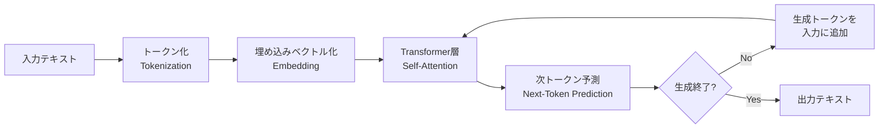
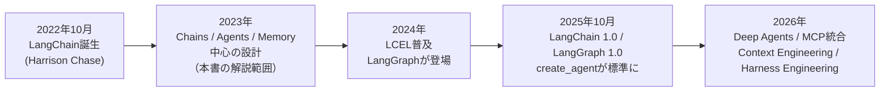
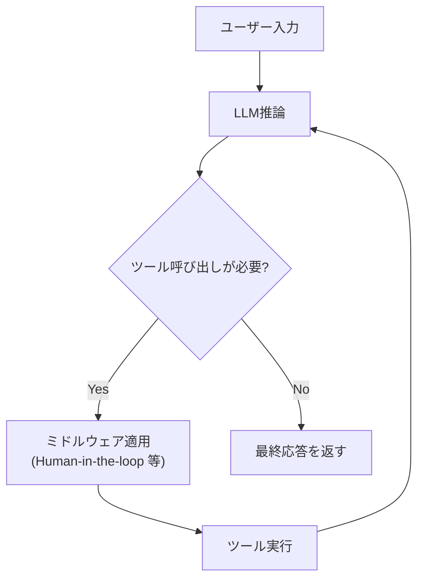
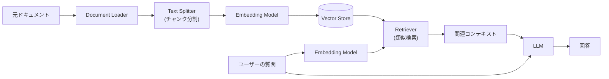
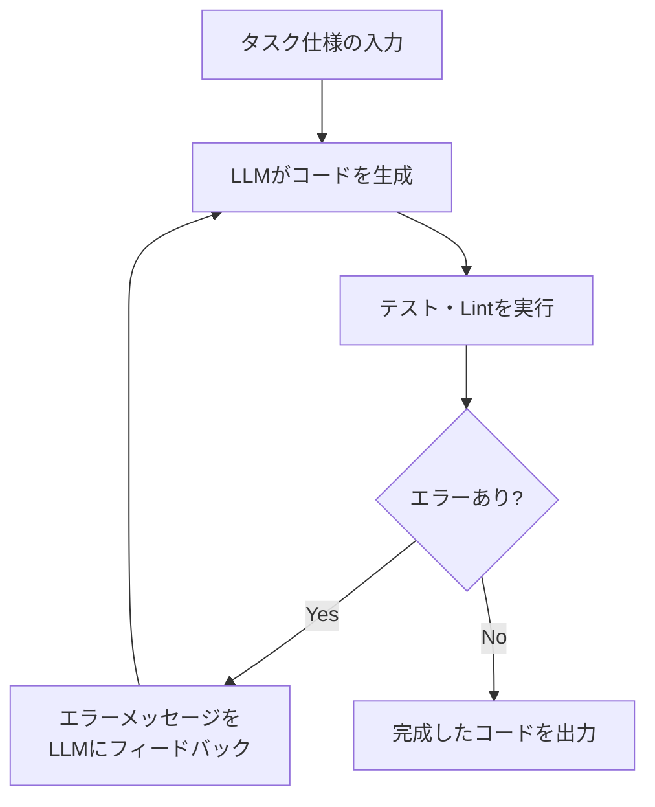
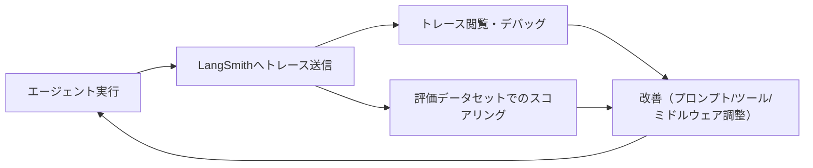
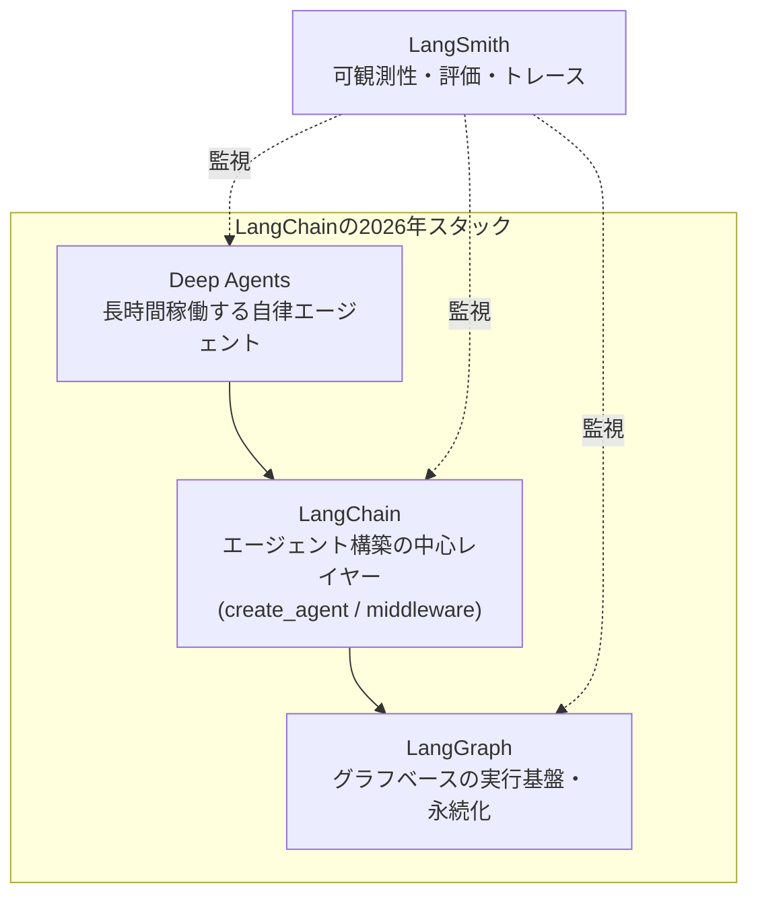
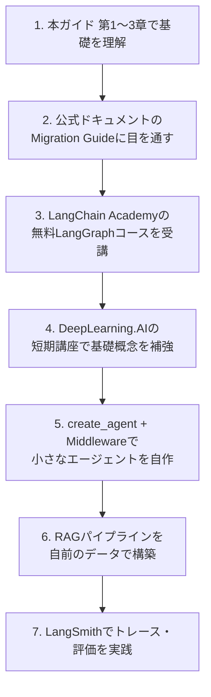

# 『Generative AI with LangChain』徹底解説ガイド

### 初学者のためのステップバイステップ学習ガイド（2026年9月版）

> 対象書籍: **Generative AI with LangChain**（著者: Ben Auffarth、出版: Packt Publishing、2023年12月刊、376ページ）
> O'Reilly掲載ページ: https://www.oreilly.com/library/view/generative-ai-with/9781835083468/

---

## 0. このガイドについて

### 0-1. なぜこのガイドが必要か

`Generative AI with LangChain` は2023年12月に出版された書籍で、LangChainの基本思想（Chains・Agents・Memory・Tools）とLLMアプリケーション開発の全体像を体系的に学べる良書です。しかし、LangChainは2023年以降きわめて速いペースで進化しており、特に **2025年10月のLangChain 1.0 / LangGraph 1.0リリース** を境に、コアとなる開発パターンが大きく刷新されました。書籍に出てくる `LLMChain`、`AgentExecutor`、`ConversationBufferMemory` といったクラスの多くは、2026年9月現在は `langchain-classic` という後方互換パッケージに移動し、実務では `create_agent` とミドルウェア（middleware）を中心とした新しい設計が標準になっています。

そこで本ガイドは、

1. 書籍の章立てに沿って **生成AI・LLM・LangChainの基礎概念** をステップバイステップで解説し、
2. 各章の内容が **2026年9月時点でどう変化したか** を明記し、
3. 最新の公式情報（LangChain公式ブログ・ドキュメント・DeepLearning.AI講座・業界インタビュー等）を根拠として提示する

という3層構造で構成しています。初学者の方は「書籍の基礎概念」→「現在の実装方法」の順に読むことで、古い情報に惑わされずに実践的なスキルを身につけられます。

### 0-2. 対象読者

- Python の基本文法は理解しているが、LLMアプリケーション開発は未経験の方
- ChatGPTやClaudeは使ったことがあるが、「自分でLLMを使ったアプリを作る」経験がない方
- 書籍 `Generative AI with LangChain` を購入予定、または購入済みで学習を始めたい方

### 0-3. 本ガイドの構成

| 章 | 内容 | 書籍との対応 |
|---|---|---|
| 第1章 | 生成AIとLLMの基礎 | 書籍 Chapter 1 |
| 第2章 | LangChainとは何か | 書籍 Chapter 2 |
| 第3章 | 開発環境と基本要素 | 書籍 Chapter 3 |
| 第4章 | AIエージェントの構築 | 書籍 Chapter 4 |
| 第5章 | チャットボットとRAG | 書籍 Chapter 5 |
| 第6章 | 生成AIによるソフトウェア開発 | 書籍 Chapter 6 |
| 第7章 | データサイエンスへの応用 | 書籍 Chapter 7 |
| 第8章 | LLMのカスタマイズ | 書籍 Chapter 8 |
| 第9章 | 本番運用（評価・デプロイ・監視） | 書籍 Chapter 9 |
| 第10章 | 生成AIの未来（2023年予測 vs 2026年現実） | 書籍 Chapter 10 |
| 第11章 | 学習ロードマップと最新リソース | 追加章 |
| 第12章 | 参考文献・出典URL一覧 | 追加章 |

---

## 1. 生成AIとLLMの基礎知識（書籍 Chapter 1 対応）

### 1-1. 生成AIとは何か

生成AI（Generative AI）とは、テキスト・画像・音声・コードなど、新しいコンテンツを生成できるAIモデルの総称です。その中核をなすのが **大規模言語モデル（LLM: Large Language Model）** で、大量のテキストデータから「次に来る単語（トークン）」を予測する学習を行うことで、文章の生成・要約・翻訳・質問応答など多様なタスクをこなせるようになります。

### 1-2. LLMの仕組み：ステップバイステップ

LLM、特にGPT系モデルがテキストを生成する流れは次の通りです。



1. **トークン化（Tokenization）**：入力文を「トークン」と呼ばれる単位（単語やサブワード）に分割する
2. **埋め込み（Embedding）**：各トークンを数百〜数千次元の数値ベクトルに変換する
3. **事前学習（Pre-training）**：Transformerアーキテクチャ（Self-Attention機構）を使い、大量のテキストから「文脈に応じた次トークン予測」を学習する
4. **条件付け（Conditioning）**：指示（プロンプト）やシステムメッセージによって出力の方向性を制御する
5. **生成（Generation）**：予測したトークンを1つずつ追加しながら文章を完成させる

### 1-3. モデルファミリーの現在地（書籍執筆時 vs 2026年9月）

書籍執筆時（2023年）はGPT-3.5/4、PaLM、Llama 2、Claude 1〜3が主な選択肢でした。2026年9月時点では各社のモデルが大きく世代交代しています。

| モデルファミリー | 開発元 | 書籍執筆時（2023年） | 2026年9月時点の位置づけ |
|---|---|---|---|
| GPTシリーズ | OpenAI | GPT-3.5 / GPT-4 | GPT-6世代へ進化。**GPT-6 Astra**（最上位）は一部組織へ段階展開中で、ChatGPT（Plus 以上）・API・Azure で提供予定。**GPT-6 Sol / Luna**（2026年9月22日発表の高速・低価格版）は API・**ChatGPT Work**・Codex で提供開始済み（通常の ChatGPT では利用不可）。Microsoft Foundry では一般提供済み（出典: [OpenAI: GPT-6 Astra](https://openai.com/index/gpt-6-astra/)、[OpenAI Developer Community: GPT-6 Sol / Luna](https://community.openai.com/t/announcing-gpt-6-sol-and-gpt-6-luna-in-the-api-codex-and-chatgpt/1399925)、[Microsoft Foundry: GPT-6 Sol / Luna](https://ai.azure.com/)） |
| Claudeシリーズ | Anthropic | Claude 1〜3 | Claude Opus 5.5 / Sonnet 5 / Haiku 4.5 の構成に加え、上位ティアの Claude Fable 5.1 が登場（出典: [Anthropic Models overview](https://docs.claude.com/en/docs/about-claude/models/overview)） |
| Gemini / PaLM | Google | PaLM, 初代Gemini | Gemini 3系へ進化 |
| Llamaシリーズ | Meta | Llama 2 | 後継モデル群へ世代交代、オープンウェイト戦略が継続 |

> **学習のポイント**：書籍のモデル固有の説明（PaLM、Llama 2など）は歴史的背景として読み、実際に手を動かす際は各プロバイダーの最新モデルIDをLangChainの `init_chat_model` 等で指定するようにしましょう。

---

## 2. LangChainとは何か（書籍 Chapter 2 対応）

### 2-1. LLM単体の限界とLangChainが解決しようとしたこと

書籍が指摘する通り、LLM単体（"stochastic parrot"＝統計的なオウム返し）には次のような限界があります。

- 学習データの時点までの知識しか持たない（最新情報を知らない）
- 外部システム（DB、API、ファイル）を直接操作できない
- 長い会話の文脈を無限に保持できない
- ハルシネーション（もっともらしい誤った情報の生成）を起こす

LangChainは、こうした限界を **外部ツール連携・検索拡張・記憶管理・推論制御の仕組み** を提供することで補うために、Harrison Chase氏によって2022年10月に開発が始まったオープンソースフレームワークです。

### 2-2. LangChainの歴史的な主要コンポーネント（書籍が解説する概念）

| コンポーネント | 役割 |
|---|---|
| Chains | 複数のLLM呼び出しや処理ステップを一連の流れとして連結する仕組み |
| Agents | LLMを「推論エンジン」として使い、状況に応じて動的にツールを選択・実行する仕組み |
| Memory | 会話の履歴や状態を保持し、複数ターンにまたがる対話を可能にする仕組み |
| Tools | 検索、計算、DB操作などLLMが呼び出せる外部機能 |

### 2-3. 2022年〜2026年：LangChainの進化タイムライン



2026年時点でLangChain社は、単なるライブラリ提供元から「エージェントエンジニアリングプラットフォーム」へと事業の重心を移しています。LangChain共同創業者兼CEOのHarrison Chase氏は、エージェントの成否を分けるのは主にモデル性能そのものよりも「適切な情報を適切な形式・タイミングでLLMに与えられているか」であると繰り返し説明しており、この考え方は「コンテキストエンジニアリング（Context Engineering）」、さらにその発展形として「ハーネスエンジニアリング（Harness Engineering）」と呼ばれています。ハーネスとは、エージェントがループしながらツールを呼び出し、長時間タスクを自律的にこなせるようにする実行基盤（土台）を指す言葉です。

---

## 3. 開発環境のセットアップと基本要素（書籍 Chapter 3 対応）

### 3-1. インストール（2026年9月時点の方法）

> **前提条件**: LangChain 1.x は **Python 3.10 以上** が必要です。`python --version` で確認してから以下の手順に進んでください。

まずプロジェクト専用の仮想環境を作成・有効化し、システムの Python 環境を汚さないようにします。

```bash
# 仮想環境を作成
python -m venv .venv

# 有効化（macOS / Linux）
source .venv/bin/activate

# 有効化（Windows PowerShell）
# .venv\Scripts\Activate.ps1
```

```bash
# 最新の安定版 LangChain をインストール
pip install -U langchain

# よく使う周辺パッケージ
pip install -U langchain-anthropic langchain-openai langchain-google-genai

# 後述の langchain_classic / langchain.mcp の例で使うパッケージ
pip install -U langchain-classic "langchain[mcp]"
```

### 3-2. 重要な変更点：`langchain-classic` の登場

LangChain 1.0（2025年10月リリース）以降、`langchain` パッケージの名前空間は「エージェント構築に必要な最小限の部品」に整理されました。書籍で解説されている `LLMChain`、旧来の `AgentExecutor`、`langchain.retrievers` 配下のクラス、Hub連携機能などは **`langchain-classic`** という別パッケージに移動しています。

| 用途 | 書籍時点（〜2024年）のインポート | 2026年9月時点のインポート |
|---|---|---|
| チェーン | `from langchain.chains import LLMChain` | `from langchain_classic.chains import LLMChain` |
| Retriever | `from langchain.retrievers import ...` | `from langchain_classic.retrievers import ...` |
| Indexing | `from langchain.indexes import ...` | `from langchain_classic.indexes import ...` |
| プロンプトHub | `from langchain import hub` | `from langchain_classic import hub` |
| エージェント作成 | `from langgraph.prebuilt import create_react_agent` | `from langchain.agents import create_agent` |

> 既存の学習コンテンツやブログ記事のコードが動かない場合、まずこの名前空間の変更が原因でないかを疑いましょう。

### 3-3. APIキーの設定

```python
import os

os.environ["ANTHROPIC_API_KEY"] = "sk-ant-..."
os.environ["OPENAI_API_KEY"] = "sk-..."
os.environ["GOOGLE_API_KEY"] = "..."
```

### 3-4. Chat Modelの基本呼び出し（最初のステップ）

```python
from langchain.chat_models import init_chat_model

# プロバイダーを問わず統一インターフェースでモデルを初期化できる
model = init_chat_model("claude-sonnet-4-6", model_provider="anthropic")

response = model.invoke("LangChainを一言で説明してください。")
print(response.content)
```

### 3-5. Prompt Templateの基本

```python
from langchain_core.prompts import ChatPromptTemplate

prompt = ChatPromptTemplate.from_messages([
    ("system", "あなたは親切な{role}です。"),
    ("human", "{question}"),
])

chain = prompt | model
result = chain.invoke({"role": "AIエンジニア", "question": "RAGとは何ですか？"})
```

このように `|`（パイプ）演算子でコンポーネントを連結する記法は **LCEL（LangChain Expression Language）** と呼ばれ、書籍が刊行された2023年当時から現在まで一貫して使われている基本パターンです。ただし、2026年時点では「複雑なエージェントを組み立てる主役」の座はLCELチェーンから次章で解説する `create_agent` に移っており、LCELは主に単純な入出力パイプラインの記述に使われる位置づけとなっています。

---

## 4. AIエージェントの構築（書籍 Chapter 4 対応・2026年最新版）

### 4-1. ツール使用（Tool Use）の基本概念

書籍が解説する通り、エージェントの核心は「LLMに外部ツールを持たせ、状況判断させながら実行させる」ことです。基本の関数をツール化する方法は現在も同様です。

```python
from langchain_core.tools import tool

@tool
def search_web(query: str) -> str:
    """指定したクエリでウェブ検索を行う。"""
    ...
    return "検索結果のテキスト"
```

### 4-2. 【2026年の標準】`create_agent` とミドルウェア

書籍のChapter 4で解説される `AgentExecutor` ベースの実装は、現在は `create_agent`（LangGraphランタイム上で動作）に置き換わっています。`create_agent` は「モデル呼び出し → ツール選択・実行 → 結果をモデルに戻す」というエージェントループをLangGraphの上に構築し、そこに **ミドルウェア（middleware）** という差し込み可能な処理ステップを追加できる設計になっています。

```python
from langchain.agents import create_agent

agent = create_agent(
    model="claude-sonnet-4-6",
    tools=[search_web],
    system_prompt="あなたは有能なリサーチアシスタントです。",
)

result = agent.invoke({
    "messages": [{"role": "user", "content": "AI安全性の最新トレンドを調べて"}]
})
```

### 4-3. エージェントループの図解



### 4-4. 代表的な組み込みミドルウェア

| ミドルウェア | 役割 |
|---|---|
| Human-in-the-loop | ツール実行前に人間の承認・編集・却下を挟む（送金やメール送信など重要な操作向け） |
| Summarization | 会話履歴がコンテキスト上限に近づいたら古いメッセージを要約し、トークン超過を防ぐ |
| PII Redaction | 個人識別情報（PII）を検出しマスキングする |

> **組み込みではない実験的ミドルウェア**: タスクの内容に応じて呼び出すモデルを動的に切り替える **Model Router / Auto Mode** は、LangChain 本体の組み込みミドルウェアではなく、外部パッケージ **langchain-typesafe** が提供する実験的ミドルウェアです。3-1 のセットアップだけでは利用できないため、別途インストールしてからそのパッケージを import します（API は変更される可能性があるため、公開名はパッケージのドキュメントで確認してください）。
>
> ```bash
> # ModelRouterMiddleware / AutoModeMiddleware には experimental extra が必要
> pip install -U "langchain-typesafe[experimental]"
> ```
>
> ```python
> # Model Router / Auto Mode は langchain 本体ではなく langchain_typesafe から import する
> import langchain_typesafe
> ```

### 4-5. 標準コンテンツブロック（Standard Content Blocks）

LangChain 1.0のもう一つの目玉が「標準コンテンツブロック」です。従来はプロバイダーごとにレスポンス形式が異なり、推論過程（reasoning）や引用（citation）、サーバー側ツール呼び出しの扱いがバラバラでした。これを `content_blocks` プロパティで統一的に扱えるようにしたことで、モデルを切り替えてもコードの大部分を書き換えずに済むようになっています。

### 4-6. MCP（Model Context Protocol）ツールとの統合

2026年に入り、`langchain.mcp` 名前空間が追加され、外部のMCPサーバーが提供するツールを `create_agent` にそのまま接続できるようになりました。サーバー側からの追加入力要求（elicitation）はLangGraphの `interrupt()` 機構にマッピングされ、人間の回答を待ってから処理を再開する、という高度なフローも `langchain.mcp` の機能として扱えます。`MCPAdapter` に elicitation 用の設定引数はなく、挙動はクライアントのハンドラーから決まります。独自の elicitation ハンドラーを持たないクライアントでは既定で interrupt に変換され、ハンドラーを持つ事前構築済みクライアントではそのハンドラーが応答します。なお interrupt 後に処理を再開するため（他の interrupt と同様に）**checkpointer の設定が必須**です。ただし LangChain 1.4.2 時点で `langchain.mcp` は**ベータ**であり、API は今後変更される可能性があります。本番利用ではバージョンを固定し、アップグレード時は Changelog を確認してください。

---

## 5. チャットボットとRAG（Retrieval-Augmented Generation）（書籍 Chapter 5 対応）

### 5-1. RAGとは何か

RAG（検索拡張生成）とは、LLMが回答を生成する前に、外部の知識ベースから関連情報を検索し、その情報をプロンプトに含めることで、最新かつ正確な回答を可能にする手法です。書籍のChapter 5で解説される「ベクトル埋め込み→ベクトルストア→Retriever→チャットボット」という流れは、2026年現在も RAG の基本設計として変わらず有効です。

### 5-2. RAGパイプラインの全体像



### 5-3. 主なRetrieverの種類

| Retriever種類 | 特徴 |
|---|---|
| kNN Retriever | ベクトル間の距離（近傍）に基づき類似文書を検索するシンプルな方式 |
| カスタムRetriever | 独自の検索ロジック（キーワード＋ベクトルのハイブリッド等）を実装 |
| ドメイン特化Retriever | 例：PubMed retrieverのように特定データソースに特化した検索器 |

### 5-4. 会話メモリのパターンと2026年の実装方針

書籍では `ConversationBufferMemory`、`ConversationSummaryMemory`、`ConversationKGMemory` など複数のメモリクラスが紹介されています。これらは `langchain-classic` に残る歴史的な実装ですが、2026年の実務では、エージェントの状態（会話履歴を含む）を **LangGraphのState機構とCheckpointer（永続化レイヤー）** で管理するのが標準的な設計になっています。ただし State と Checkpointer は履歴を保持・永続化するだけで、メッセージを要約する機能は持ちません。長時間動作するエージェントで履歴の肥大化を抑えたい場合は、`create_agent` に前述の `SummarizationMiddleware` を明示的に組み込み、要約を発動するトリガー（トークン数やメッセージ数のしきい値）を設定します。こうして初めて、古いメッセージが要約され直近のやり取りだけが保持されます。

### 5-5. ガードレールとモデレーション

不適切な入出力を防ぐガードレールの重要性は書籍執筆時から変わりません。PII Redactionミドルウェアのように、入出力のフィルタリングをエージェントループの一部として組み込む設計が2026年の主流です。

---

## 6. 生成AIによるソフトウェア開発（書籍 Chapter 6 対応）

書籍のChapter 6では、Vertex AI、StarCoder、StarChat、Llama 2などのコードLLMを用いた自動開発エージェント（フィードバックループを持つ「開発者エージェント」）の構築が解説されています。

### 6-1. コード生成エージェントの基本パターン



このフィードバックループの考え方（コード生成→実行→エラーを読ませて再修正）は、2026年の実務用コーディングエージェント（例：Claude Code のような専用ツール）でも中核をなしており、書籍の設計思想は現在も有効です。異なるのは、2026年時点ではこの種のエージェントが `create_agent` とファイル操作・シェル実行ツール、そして長時間タスクに耐える「Deep Agents」パターン（後述）の上に構築される点です。

---

## 7. データサイエンスへのLLM活用（書籍 Chapter 7 対応）

書籍のChapter 7では、LLMを使ったデータ収集・可視化（EDA）・前処理・特徴量抽出の自動化、およびAutoML的な活用法が解説されています。基本アイデアは「自然言語の指示をエージェントが解釈し、Pythonのデータ分析コードを生成・実行して結果を解釈する」というもので、これは `create_agent` にPythonコード実行ツール（サンドボックス環境）を持たせることで2026年時点でも同様に実現できます。Harrison Chase氏は2026年のインタビューで、こうしたコード実行を安全に行う「コードサンドボックス」がエージェント基盤における次の重要領域になると述べています。

---

## 8. LLMのカスタマイズ（書籍 Chapter 8 対応）

### 8-1. LLMを条件付けする4つの方法

| 手法 | 概要 |
|---|---|
| RLHF（人間フィードバックからの強化学習） | 人間の評価をもとに報酬モデルを学習し、モデルの応答傾向を調整する |
| LoRA（低ランク適応） | 少量の追加パラメータのみを学習し、効率的にファインチューニングする手法 |
| 推論時条件付け | プロンプトやFew-shot例など、学習を伴わずに出力を制御する方法 |
| ファインチューニング | オープンソースモデル・商用モデルの重みを追加データで再学習する |

### 8-2. プロンプトエンジニアリング技法

| 技法 | 概要 |
|---|---|
| Zero-shot prompting | 例を示さず、指示のみでタスクを実行させる |
| Few-shot learning | 少数の入出力例を提示してから本番の入力を渡す |
| CoT（Chain-of-Thought）prompting | 「段階的に考えてください」と指示し、推論過程を明示的に出力させる |
| Self-consistency | 同じ問いに対し複数回推論させ、多数決的に最も一貫した答えを採用する |
| ToT（Tree-of-Thought） | 複数の推論の枝を木構造的に探索し、有望な経路を選んで深掘りする |

### 8-3. 2026年の補足：モデルプロファイル

LangChain 1.1（1.0の後続マイナーリリース）では、対応するChat Modelで `.profile` 属性を通じて「構造化出力に対応しているか」「関数呼び出しをサポートするか」等の機能を宣言的に取得できるようになりました。このプロファイル情報はオープンソースプロジェクト **models.dev** から供給されています。ただし `.profile` はベータ機能であり、モデルによっては未設定（`None`）だったり、項目が欠けていたり、実際の挙動と一致しない場合があります。機能判定に使う際は未設定・欠落を前提にし、取得できない場合は安全側の既定値（例: 構造化出力非対応として扱う）へフォールバックするか、プロバイダーのドキュメントや実際の呼び出し結果で確認するようにしましょう。

---

## 9. 本番運用：評価・デプロイ・監視（書籍 Chapter 9 対応）

### 9-1. 評価の考え方

書籍が解説する「2つの出力を比較する」「基準に照らして評価する」「文字列比較／意味的比較」「データセットに対する評価を実行する」という評価の基本枠組みは2026年も変わりません。

### 9-2. デプロイ方法

書籍ではFastAPIを使ったWebサーバー化や、Rayを使った分散実行が紹介されています。これらは現在もLLMアプリのデプロイ手段として広く使われています。

### 9-3. 観測性（Observability）：LangSmith

LangSmithはLangChain社が提供するトレーシング・評価・監視プラットフォームで、書籍執筆時から現在まで一貫してLangChainエコシステムの観測性を担っています。2026年9月時点のアップデートとして、LangSmith SaaSにおける拡張トレース保持期間が最大180日に制限される変更が2026年9月14日から適用されるなど、エンタープライズ向けの運用ルールが継続的に更新されています（セルフホスト／BYOC環境は対象外）。



---

## 10. 生成AIの未来：2023年の予測 vs 2026年9月の現実（書籍 Chapter 10 対応）

### 10-1. 書籍が挙げていた論点

書籍のChapter 10では、モデル開発のトレンド、Big Tech対中小企業の構図、AGIへの展望、創造産業・教育・法律・製造業・医療・軍事への影響、誤情報・サイバーセキュリティ、規制上の課題など、幅広い論点が予測的に議論されています。

### 10-2. 2026年9月時点の実際の姿

書籍刊行から約3年が経過した2026年、生成AI・エージェント分野で実際に起きた主な変化は次の通りです。

| 書籍（2023年）での位置づけ | 2026年9月時点の実際 |
|---|---|
| チャット主体のLLMアプリ（対話ボックス中心） | 「対話ボックスに別れを告げ、長時間稼働するエージェント（Long-Horizon Agents）の時代へ」という業界観測が広がっている |
| Chains / AgentExecutorが中心設計 | `create_agent` ＋ Middleware ＋ LangGraphランタイムが標準設計に |
| LangChainは主にオープンソースライブラリ | LangChain社はVC出資を受けた「エージェントエンジニアリングプラットフォーム」企業に進化 |
| 単発タスクの自動化が主眼 | 「Deep Agents」と呼ばれる、計画・長期記憶・継続実行能力を持つエージェント層が登場 |
| ツール呼び出しは各フレームワークで独自実装 | MCP（Model Context Protocol）による外部ツール接続の標準化が進行 |

### 10-3. LangChainの2026年スタック構成

Harrison Chase氏はLangChainの技術スタックを「LangGraphを中核（コアの実行基盤）とし、その上にLangChainがエージェント構築レイヤーとして乗り、さらにその上にDeep Agentsが積み重なる」構造として説明しています。



「エージェントが失敗するときはコンテキストが不足しているときであり、成功するときは適切な情報が適切な形式・タイミングでLLMに渡されているときだ」という趣旨の発言に象徴されるように、2026年のLangChain開発思想はモデル性能そのものよりも **コンテキストエンジニアリング** と、それを支える実行基盤（ハーネス）の設計に重心が置かれています。

---

## 11. 学習ロードマップと最新リソース

### 11-1. おすすめの学習順序



### 11-2. 主要な学習リソース

| リソース | 提供元 | 特徴 |
|---|---|---|
| LangChain Academy（LangGraphコース） | LangChain公式 | 無料。State machineとしてのエージェント構築、Checkpointerによる永続化、Human-in-the-loop、ストリーミング、LangServe/LangSmithを使ったデプロイまで実践的にカバー。2025〜2026年にかけて継続的に最新パターンへ更新されている |
| LangChain for LLM Application Development | DeepLearning.AI（Andrew Ng・Harrison Chase講師） | 無料の短期講座（約3時間）。モデル・プロンプト・パーサー、メモリ、チェーン、ドキュメントQ&A、エージェント、評価という基礎概念を、開発者自身であるHarrison Chase氏から直接学べる。2023年収録のためAPIの一部は古いが、概念理解には現在も有用 |
| Functions, Tools and Agents with LangChain | DeepLearning.AI | ツール呼び出しとエージェント構築に特化した続編講座 |
| LangChain公式ドキュメント（docs.langchain.com） | LangChain公式 | `create_agent`、Middleware、Migration Guideなど最新仕様の一次情報源 |
| LangChain公式ブログ / Changelog | LangChain公式 | バージョンごとの新機能・破壊的変更の告知 |

### 11-3. 書籍の章と2026年公式ドキュメントの対応表

| 書籍の章 | キーワード | 2026年時点で参照すべき公式トピック |
|---|---|---|
| Chapter 2〜3 | Chains, LCEL, 基本セットアップ | "What's new in LangChain v1" / Migration Guide |
| Chapter 4 | Agents, Tools | Agents（`create_agent`）, Middleware |
| Chapter 5 | RAG, Memory, Retrievers | Retrieval, LangGraph State & Checkpointers |
| Chapter 8 | Fine-tuning, Prompting | Model Profiles（`.profile`）|
| Chapter 9 | 評価・デプロイ・観測性 | LangSmith Docs |
| （新規） | 外部ツール接続 | `langchain.mcp`（MCP統合） |

---

## 12. 参考文献・出典URL一覧

本ガイドの2026年時点の情報は、2026年9月23日時点でのウェブ検索により、可能な限りLangChain公式および著名な国際的情報源を優先して収集しました。

1. O'Reilly 書籍ページ（目次・著者情報）
   https://www.oreilly.com/library/view/generative-ai-with/9781835083468/
2. LangChain公式ブログ「LangChain and LangGraph Agent Frameworks Reach v1.0 Milestones」
   https://www.langchain.com/blog/langchain-langgraph-1dot0
3. LangChain公式Changelog「LangChain 1.0 now generally available」
   https://changelog.langchain.com/announcements/langchain-1-0-now-generally-available
4. LangChain公式Changelog「LangChain 1.1」（モデルプロファイル）
   https://changelog.langchain.com/announcements/langchain-1-1
5. LangChain公式ドキュメント「What's new in LangChain v1」
   https://docs.langchain.com/oss/python/releases/langchain-v1
6. LangChain公式ドキュメント「Migration Guide: langchain v1」
   https://docs.langchain.com/oss/python/migrate/langchain-v1
7. LangChain公式ドキュメント Changelog（v1.4, MCP統合・Model Profiles）
   https://docs.langchain.com/oss/python/releases/changelog
8. LangChainリリース情報まとめ（2026年9月, langchain-typesafe等）
   https://releasebot.io/updates/langchain-ai
9. LangChainリリース情報まとめ（LangSmithトレース保持期間の変更）
   https://releases.sh/langchain
10. CB Insights「LangChain Company Profile」（Harrison Chase氏のコンテキストエンジニアリング／ハーネスエンジニアリング発言）
    https://www.cbinsights.com/company/langchain
11. Sequoia Capital Training Data ポッドキャスト出演情報（Harrison Chase氏）
    https://rosetta.to/person/harrison-chase
12. Antoine Buteau「Lessons from Harrison Chase」（LangChainの設計思想まとめ）
    https://www.antoinebuteau.com/lessons-from-harrison-chase/
13. DEV Community「LangChain — Deep Dive」（2026年のLangChain社の事業動向）
    https://dev.to/gautammanak1/langchain-deep-dive-4ill
14. DeepLearning.AI「LangChain for LLM Application Development」講座ページ
    https://www.coursera.org/projects/langchain-for-llm-application-development-project
15. AI Agent Rank「Best LangChain courses 2026」（学習リソース比較）
    https://aiagentrank.io/blog/best-langchain-courses-2026
16. ClickIT Tech「LangChain 1.0 vs LangGraph 1.0: Which One to Use in 2026」
    https://www.clickittech.com/ai/langchain-1-0-vs-langgraph-1-0/
17. Wikipedia「LangChain」（基本沿革）
    https://en.wikipedia.org/wiki/LangChain

---

### 免責事項

本ガイドは書籍 `Generative AI with LangChain`（Ben Auffarth著）の目次・概要と、2026年9月23日時点の公開ウェブ情報をもとにAnthropic Claudeが作成した学習補助資料です。書籍本文の逐語的な引用は含まれておらず、内容はすべて独自にまとめ直したものです。LangChainのAPIは今後も更新される可能性があるため、実装の際は必ず公式ドキュメント（docs.langchain.com）の最新版を確認してください。
