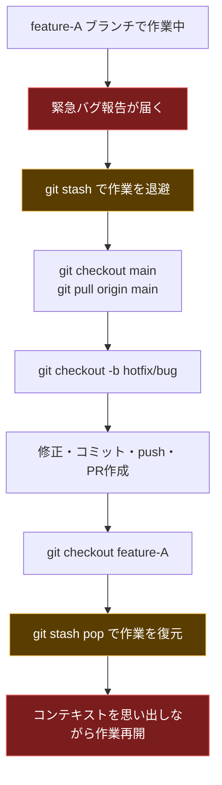
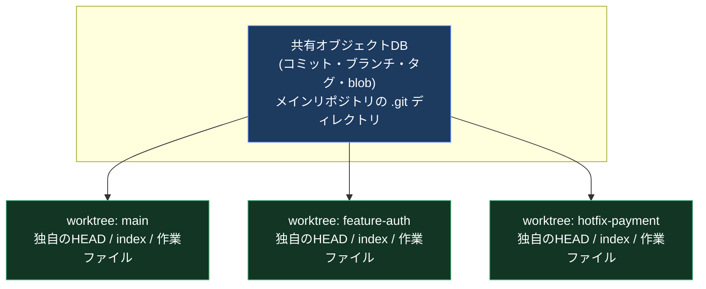
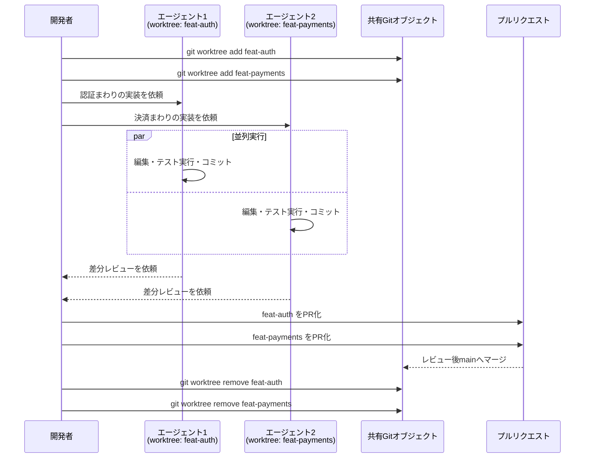
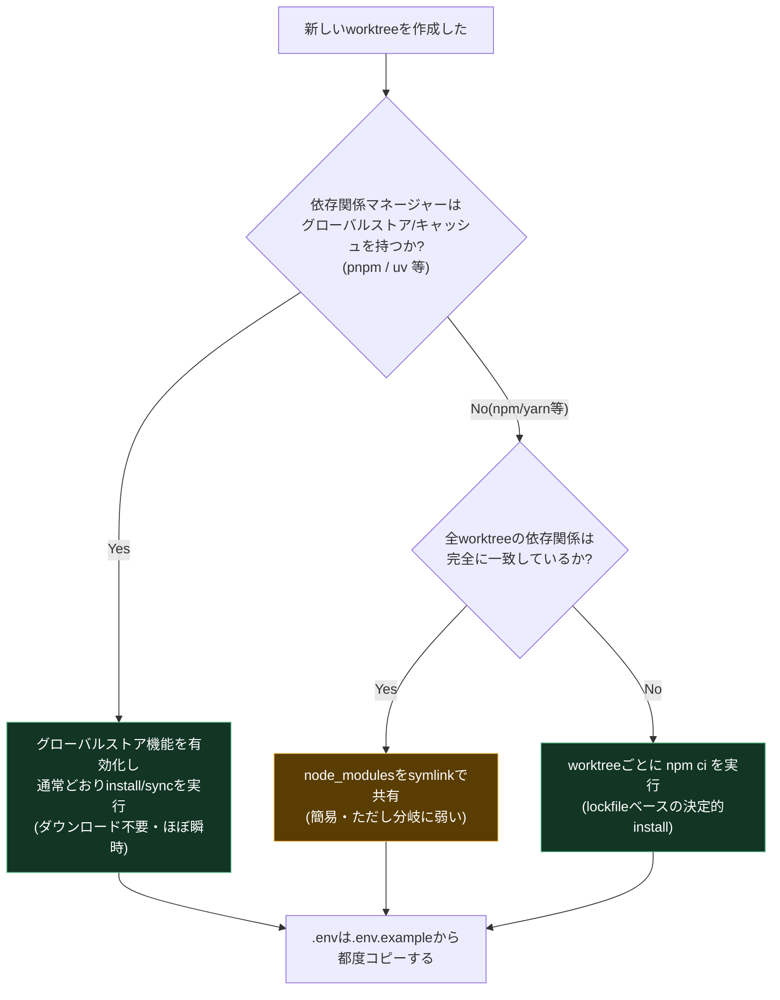
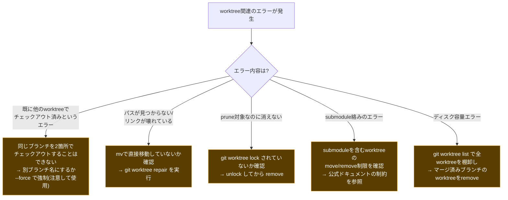

# git worktreeで実現する並列開発ベストプラクティスガイド

> 対象読者: Gitの基本操作(clone/branch/merge)に習熟した中級者〜上級者エンジニア
> 前提バージョン: Git 2.5以降(`git worktree`が導入されたバージョン)。コマンド例はGit 2.40以降での動作を想定
> 本ガイドの情報は2026年7月31日時点のWeb検索結果に基づいています。各セクション末尾および巻末の「参考文献」に出典URLを明記しています。

## 目次

1. [なぜ今 git worktree なのか](#1-なぜ今-git-worktree-なのか)
2. [git worktreeの仕組みを理解する](#2-git-worktreeの仕組みを理解する)
3. [基本コマンドリファレンス](#3-基本コマンドリファレンス)
4. [ディレクトリ設計と命名規則のベストプラクティス](#4-ディレクトリ設計と命名規則のベストプラクティス)
5. [AIコーディングエージェントとの統合](#5-aiコーディングエージェントとの統合)
6. [依存関係と環境分離の課題を解決する](#6-依存関係と環境分離の課題を解決する)
7. [ポート衝突と開発サーバーの分離](#7-ポート衝突と開発サーバーの分離)
8. [自動化スクリプトとGit Hooks](#8-自動化スクリプトとgit-hooks)
9. [IDE・エディタ統合の現状](#9-ideエディタ統合の現状)
10. [ブランチ戦略とCI/CD・レビューへの統合](#10-ブランチ戦略とcicdレビューへの統合)
11. [コンテナ・サンドボックスとの組み合わせ](#11-コンテナサンドボックスとの組み合わせ)
12. [よくある落とし穴とトラブルシューティング](#12-よくある落とし穴とトラブルシューティング)
13. [運用ベストプラクティスチェックリスト](#13-運用ベストプラクティスチェックリスト)
14. [まとめ](#14-まとめ)
15. [参考文献](#15-参考文献)

---

## 1. なぜ今 git worktree なのか

`git worktree`はGit 2.5(2015年7月リリース)で導入された機能で、10年以上前から存在します。にもかかわらず、2025年後半から2026年にかけて急速に注目を集めています。GitHub公式ブログも「worktreeは最近の"最新の流行"のように見えるが、実際には2015年からある」と紹介した上で、その再燃ぶりを解説しています。

背景にあるのは、Claude Code・OpenAI Codex・Cursorといった自律型AIコーディングエージェントの普及です。1つのエージェントに1つの作業ディレクトリを与えて並列に走らせるというワークフローが一般化し、その「ファイルシステムレベルの隔離」を実現する軽量な手段としてworktreeが再発見されました。Claude Codeの作成者であるBoris Cherny氏は、3〜5個のworktreeを同時に立ち上げ、それぞれで独立したClaudeセッションを並列実行することを、チーム内で最も生産性向上に寄与した習慣として自身のXアカウントで紹介しています。また著名な開発者向けニュースレターを書くSimon Willison氏も、複数のcheckoutやworktreeにまたがって同時に複数のコーディングエージェントを走らせる開発スタイルへと自身が移行していった経緯を2025年10月のニュースレターで綴っています。

### 1.1 従来のワークフローの限界



worktreeを使わない世界では、割り込みタスクが発生するたびに「stash → checkout → 作業 → checkout戻し → stash pop」という手順が必要です。stashのコンフリクトや、戻したときにコンテキストを再構築するコストは、AIエージェントを使った並列作業では致命的なボトルネックになります。エージェントは高速にコードを生成しますが、その分だけレビュー側の人間がボトルネックになりやすく、複数タスクを同時並行で仕掛けて「待ち時間」を圧縮したいというモチベーションが強くなっています。

### 1.2 worktreeが解決する問題

- **ブランチ切り替えなしの並列作業**: 別ディレクトリに別ブランチをチェックアウトできるため、stashが不要になる
- **AIエージェントのファイルシステム隔離**: 複数のエージェントが同じファイルを同時に編集して壊し合う「ファイル衝突」「コンテキスト汚染」を防げる
- **軽量なクローンの代替**: フルクローンを何度も作る必要がなく、`.git`オブジェクトデータベースを共有するため高速かつ省ディスク

一方で、worktreeは万能ではありません。各worktreeは独立した作業ディレクトリなので、`node_modules`や`.env`などGit管理外のファイルは共有されず、依存関係のインストールをworktreeごとに行う必要があります(詳細は[第6章](#6-依存関係と環境分離の課題を解決する))。

---

## 2. git worktreeの仕組みを理解する

### 2.1 内部構造

worktreeを使うと、リポジトリは「メインの作業ディレクトリ」と「リンクされた複数の作業ディレクトリ(linked worktree)」から構成されるようになります。すべてのworktreeは同じ`.git`オブジェクトデータベース(コミット・ブランチ・タグ・blobなど)を共有しますが、`HEAD`・インデックス(ステージング領域)・作業ファイルはworktreeごとに独立しています。これはGit公式ドキュメントが定義する挙動そのもので、コマンド仕様は`git-scm.com/docs/git-worktree`に整理されています。



> 注記: 上図は概念上の1段階の関係(共有オブジェクトDB → 各worktree)のみを表しています。実際には各リンクされたworktreeの`.git`は「ファイル」であり、メインリポジトリの`.git/worktrees/<name>/`配下にある管理領域を指すポインタです。

### 2.2 ディレクトリ構成のイメージ

実際にディレクトリを作ると、以下のような構成になります(ASCIIの罫線ではなく階層構造として整理します)。

- `my-project/` (メインの作業ディレクトリ、`main`ブランチ)
  - `src/`
  - `.git/` (実データを持つ本体のGitディレクトリ)
- `my-project-feat-auth/` (linked worktree、`feat/auth`ブランチ)
  - `src/`
  - `.git` (ファイル。本体の`.git`を指すポインタ)
- `my-project-hotfix-payment/` (linked worktree、`hotfix/payment`ブランチ)
  - `src/`
  - `.git` (ファイル。本体の`.git`を指すポインタ)

`ls -la`で`.git`を見ると、メインリポジトリでは通常のディレクトリですが、linked worktree側では中身が`gitdir: /path/to/my-project/.git/worktrees/my-project-feat-auth`のようなテキストファイルになっています。これによりブランチ・コミット履歴・タグはすべて即座に全worktreeへ反映されますが、作業ファイルとステージング状態は完全に独立します。

### 2.3 従来のcloneとの違い

| 観点 | `git clone`(複数クローン) | `git worktree` |
|---|---|---|
| ディスク使用量 | クローンごとにフルコピー(大きい) | オブジェクトDBを共有(軽量) |
| 新規作成の速度 | リモートからの再クローンが必要な場合がある | ローカルで一瞬(`git worktree add`) |
| ブランチ・タグの同期 | それぞれ個別にfetchが必要 | 即座に全worktreeで共有 |
| ローカルブランチの一意性 | 各クローンで同名ブランチをチェックアウト可能 | 同じブランチを2つのworktreeで同時にチェックアウトすることはできない(強制するには`--force`が必要) |
| submodule対応 | 問題なし | 制限あり(詳細は[12.1](#121-submoduleの制限)) |

---

## 3. 基本コマンドリファレンス

`git worktree`のサブコマンドを一通り押さえておくと、後続のワークフロー構築がスムーズになります。

| サブコマンド | 用途 | 代表的な使用例 |
|---|---|---|
| `add` | 新しいworktreeを作成 | `git worktree add ../feat-auth feat/auth` |
| `add -b` | 新規ブランチを同時作成してworktree化 | `git worktree add -b feat/auth ../feat-auth origin/main` |
| `list` | 全worktreeの一覧と状態を表示 | `git worktree list --porcelain` |
| `remove` | worktreeを削除(作業ディレクトリごと) | `git worktree remove ../feat-auth` |
| `prune` | 手動削除などで壊れたworktree管理情報を掃除 | `git worktree prune -v` |
| `lock` | 誤削除・自動pruneを防止(リムーバブルメディア等) | `git worktree lock ../feat-auth --reason "外付けSSD上"` |
| `unlock` | ロック解除 | `git worktree unlock ../feat-auth` |
| `move` | worktreeを別パスへ安全に移動 | `git worktree move ../feat-auth ../archive/feat-auth` |
| `repair` | パス変更などで壊れたリンクを修復 | `git worktree repair` |

### 3.1 ステップバイステップ: 最初のworktreeを作る

1. **現在のブランチ構成を確認する**

   ```bash
   git branch -a
   git worktree list
   ```

2. **新しいworktreeを作成する(既存ブランチの場合)**

   ```bash
   git worktree add ../my-project-feat-auth feat/auth
   ```

3. **新しいworktreeを作成する(新規ブランチを同時に切る場合)**

   ```bash
   git worktree add -b feat/payment-refactor ../my-project-payment-refactor origin/main
   ```

4. **作成されたworktreeに移動して作業する**

   ```bash
   cd ../my-project-feat-auth
   git status
   ```

5. **作業が終わったら安全に片付ける**

   ```bash
   cd ../my-project           # メインの作業ディレクトリへ戻る
   git worktree remove ../my-project-feat-auth
   git worktree prune -v      # 管理情報の掃除(念のため)
   ```

> 重要: worktreeのディレクトリを`mv`コマンドで直接移動してはいけません。メインリポジトリとの双方向リンクが壊れます。移動する場合は必ず`git worktree move`を使用してください。もし壊れてしまった場合は`git worktree repair`で修復を試みます。

---

## 4. ディレクトリ設計と命名規則のベストプラクティス

### 4.1 兄弟ディレクトリパターン vs bareリポジトリパターン

実務でよく使われる構成は大きく2つに分かれます。

#### パターンA: 兄弟ディレクトリパターン(シンプル)

- `my-project/` (通常のクローン、`main`を作業)
- `my-project-feat-123-auth/` (worktree)
- `my-project-feat-456-payments/` (worktree)
- `my-project-bugfix-789-login/` (worktree)

#### パターンB: bareリポジトリ + worktree群(推奨・スケールしやすい)

- `my-project.git/` (`git clone --bare`で作った実データのみのベアリポジトリ)
- `my-project/main/` (worktree)
- `my-project/feat-auth/` (worktree)
- `my-project/fix-api/` (worktree)

pnpm公式ドキュメントは、AIエージェントによるマルチエージェント並列開発向けの構成例として、まさにこのbareリポジトリ + 複数worktreeという構成をベストプラクティスとして紹介しています。「作業対象になりうるメインの作業ディレクトリ」という特別扱いが存在しないため、全worktreeが対等に扱え、命名の一貫性も保ちやすいという利点があります。

```bash
# パターンB: bareリポジトリから始める
git clone --bare https://github.com/your-org/your-project.git your-project.git
cd your-project.git
git worktree add ../your-project/main main
git worktree add ../your-project/feat-auth feat/auth
```

### 4.2 命名規則

ディレクトリ名は「一目で何をしているかわかる」ことが最重要です。プロジェクト名 + 種別 + チケット番号 + 短い説明、という組み合わせが実務でよく採用されるパターンとして紹介されています。

- `my-project-feat-123-auth/`
- `my-project-feat-456-payments/`
- `my-project-bugfix-789-login/`

ブランチ名とディレクトリ名を一致させておくと、`git worktree list`の出力とファイラー上の見た目が対応し、複数のターミナルタブやAIエージェントセッションを混同するリスクが下がります。

### 4.3 worktree数の実務的な上限

明確なハード上限はGit自体には存在しませんが、実務上の運用複雑度から、多くのチームは同時稼働worktreeを8〜10個程度に抑えることを推奨しています。それ以上になると、どのworktreeで何をしているかの管理コストが並列化のメリットを上回ってしまうためです。Claude Code開発チームの実践では3〜5個程度が「ちょうどよい」範囲として語られることが多く、これは人間のレビュー速度がボトルネックになりやすいためと考えられます。

---

## 5. AIコーディングエージェントとの統合

git worktreeが2025〜2026年にかけて再注目された最大の理由は、AIコーディングエージェントとの相性の良さです。GitButlerやZylos Researchなどの技術系メディアも、worktreeが複数のAIエージェントを同一コードベース上で並列稼働させるための「支配的な隔離プリミティブ」になったと指摘しています。ここではエージェント別の統合状況を整理します。

### 5.1 Claude Codeの統合

Claude Code公式ドキュメントによれば、Claude Codeはworktreeをネイティブにサポートしており、`claude --worktree`(短縮形`-w`)で新しいセッションを専用worktree内に起動できます。デスクトップアプリでは新規セッションごとに自動的にworktreeが割り当てられる挙動になっています。さらにサブエージェントの定義(frontmatter)に`isolation: worktree`を指定すると、そのサブエージェントは常に専用worktreeの中で並列編集を行うようになり、複数のサブエージェント同士のファイル衝突を防げます。非gitのバージョン管理システムを使っている場合は、`WorktreeCreate`フックを実装することでworktree作成ロジックを差し替えられます。

前述の通り、Boris Cherny氏(Claude Code作成者)は3〜5個のworktreeを並列で立ち上げてそれぞれに独立したClaudeセッションを走らせる運用を、チーム内で最も効果があった生産性向上策として紹介しています。

### 5.2 OpenAI Codexの統合

OpenAI Codex(ChatGPT内のCodexモード)にもWorktreeモードが用意されています。Developer Toolkitの解説記事によれば、worktreeモードを使うとCodexは1つのworktree内でテスト実行・依存関係インストール・ファイル編集を行いながら、ユーザーは別のworktreeで並行して作業を続けられます。作業内容を確認できたら、スレッドヘッダーから名前付きブランチとして確定させたり、統合ターミナルやIDE連携ボタンからそのworktreeを直接開いたりできます。逆に、開発サーバーが1つしか起動できないなど「メインの作業コピーに直接変更を反映したい」場合は、worktreeを使わない通常モードの方が適しているとも説明されています。

### 5.3 Cursorの統合

Cursorも2025年後半以降、Agentモードやバックグラウンドエージェントの並列実行にworktreeを活用する機能を追加しています。JetBrains系IDEやVS CodeでのGit連携強化(後述の[第9章](#9-ideエディタ統合の現状))とあわせて、エージェントを立ち上げるたびに専用worktreeを自動生成し、完了後にマージ候補としてdiffを提示する、という体験が業界標準になりつつあります。

### 5.4 並列エージェント運用フロー(シーケンス図)



### 5.5 タスク設計上の注意

MindStudioの実践ガイドが強調しているように、並列セッションを立ち上げる際は、エージェントに与える指示を「認証まわりを改善して」のような曖昧な指示ではなく、「認証ミドルウェアをJWTベースに置き換える」のように具体的でスコープの明確なタスクにすることが重要です。指示が曖昧なほどコンテキストの肥大化(コンテキストロット)を招きやすく、並列実行のメリットを打ち消してしまいます。また、複数worktreeで何が進行中かを見失わないよう、`git worktree list`やタスク管理ツールでの状況把握を習慣化することも推奨されています。

---

## 6. 依存関係と環境分離の課題を解決する

worktreeが共有するのはGitが追跡するファイルだけです。`node_modules`・Python仮想環境・`.env`のようなGit管理外(`.gitignore`対象)のファイルはworktreeごとに個別に用意する必要があります。ここが並列開発における最大の運用コストになりがちです。

### 6.1 node_modules問題

素朴に各worktreeで`npm install`を都度実行すると、依存関係のダウンロードとインストールに時間がかかるだけでなく、worktreeの数だけディスクを消費します(例: 2GBのプロジェクトを5個のworktreeで展開すると単純計算で10GB近く消費)。

対処法を比較すると次のようになります。

| 手法 | 概要 | メリット | リスク・注意点 |
|---|---|---|---|
| worktreeごとに`npm install` | 最も素朴な方法 | 依存関係の食い違いが起きない | 時間がかかる/ディスクを消費する |
| `npm ci` | lockfileから決定的インストール | 依存関係解決をスキップできるため`npm install`より高速 | それでもworktreeごとに実データが必要 |
| `node_modules`をsymlinkで共有 | 1つのworktreeの`node_modules`を他からシンボリックリンク | 一瞬でセットアップ完了 | 依存関係が分岐(`package.json`が変わる)すると壊れる。同一依存関係の場合のみ安全 |
| pnpmの共有ストア(推奨) | コンテンツアドレス方式のグローバルストアを全worktreeで共有 | ダウンロード・ディスク使用量がほぼ増えない。依存関係が分岐しても安全 | pnpm固有の`node_modules`構造への移行が必要 |

pnpm公式ドキュメントは、`enableGlobalVirtualStore: true`を設定したグローバル仮想ストアを使うことで、各worktreeの`node_modules`が実体を持たずシンボリックリンクのみで構成される運用を、マルチエージェント開発向けの推奨パターンとして公開しています。この設定では、新しいworktreeを追加してもパッケージは既にグローバルストアに存在するため、インストールがほぼ瞬時に終わります。ただし、この共有ストアは「同じ信頼境界内にいる」エージェント・利用者同士でのみ使うべきで、互いに信頼できないエージェント間で書き込み可能な共有ストアを使うことは避けるべきだと明記されています。

```bash
# pnpmのグローバル仮想ストアを有効化する例(.npmrc または pnpm-workspace.yaml)
echo "enable-global-virtual-store=true" >> .npmrc

# bareリポジトリ構成での運用例
git clone --bare https://github.com/your-org/your-monorepo.git your-monorepo
cd your-monorepo
git worktree add ./main main
git worktree add ./feature-auth feat/auth   # ← node_modulesは即座に利用可能
```

symlinkによる直接共有(`ln -s ../myapp/node_modules node_modules`)は、両方のworktreeの依存関係が完全に一致している場合のみ機能する簡易策として紹介されていますが、`package.json`が分岐すると壊れるため、恒常運用には向きません。

### 6.2 .env・設定ファイルの扱い

`.env`も同様にGit管理外であることが多いため、worktreeを作るたびに手動でコピーする必要があります。

```bash
# .env.example をリポジトリにコミットしておき、各worktreeで複製する運用
cp .env.example .env
```

### 6.3 Python(uv/venv)の場合

Python環境でも同様の課題があります。`uv`はグローバルキャッシュ(`~/.cache/uv`など)を持つため、worktreeごとに`uv sync`を実行しても、パッケージ本体の再ダウンロードは基本的に発生しません。ただし仮想環境(`.venv`)自体はworktreeごとに生成し直す必要があります。

### 6.4 意思決定フロー



---

## 7. ポート衝突と開発サーバーの分離

複数worktreeで同時にローカル開発サーバーを起動すると、デフォルトポート(例: 3000番)が衝突します。MindStudioの実践ガイドでは、worktreeごとにポート番号やデータベース名を分離する「ポート隔離」がClaude Codeを使った並列開発の必須プラクティスの1つとして挙げられています。

対処法としては次のようなアプローチがあります。

- worktree名からハッシュ値や連番を生成し、`.env`の`PORT`変数に自動設定するスクリプトを用意する
- Docker Composeを使う場合は、worktreeごとに`COMPOSE_PROJECT_NAME`を変えてコンテナ名・ネットワーク・ポートマッピングを分離する
- データベースも同様に、worktreeごとにスキーマやDBブランチ(マネージドDBのbranching機能)を分ける

```bash
# シンプルなポート自動割り当ての例(worktree名のハッシュ下位2桁を使う)
WORKTREE_NAME=$(basename "$PWD")
PORT_OFFSET=$(( 0x$(echo -n "$WORKTREE_NAME" | md5sum | cut -c1-2) % 50 ))
echo "PORT=$((3000 + PORT_OFFSET))" >> .env
```

---

## 8. 自動化スクリプトとGit Hooks

worktree作成のたびに「作成 → 依存関係インストール → `.env`コピー → ポート設定」を手動で行うのは非効率です。シェル関数として1コマンド化しておくと運用が大幅に楽になります。

```bash
# ~/.zshrc または ~/.bashrc に追加する例
gwt() {
  local branch="$1"
  local dir="../$(basename "$(pwd)")-$(echo "$branch" | tr '/' '-')"

  git worktree add -b "$branch" "$dir" origin/main
  cd "$dir" || return

  # 依存関係のセットアップ(プロジェクトに応じて調整)
  if [ -f pnpm-lock.yaml ]; then
    pnpm install
  elif [ -f package-lock.json ]; then
    npm ci
  fi

  # .envの用意
  [ -f ../"$(basename "$(dirname "$dir")")"/.env ] && cp ../"$(basename "$(dirname "$dir")")"/.env .env

  echo "worktree '$dir' の準備が完了しました"
}
```

Gitフックを使う場合は、`core.hooksPath`をリポジトリ共通の場所に向けておくと、全worktreeで同じフック(例: `post-checkout`でのlintキャッシュクリア)を共有できます。ただしフック自体はworktree固有の状態(どのブランチで実行されたか等)を意識して書く必要があります。

---

## 9. IDE・エディタ統合の現状

2025年後半から2026年前半にかけて、主要IDE・エディタが軒並みworktreeのネイティブサポートを追加しました。バージョンや対応時期はツールによってばらつきがあるため、チームで導入する際は各ツールの対応状況を確認してください。

| ツール | 対応状況 | 時期 |
|---|---|---|
| Visual Studio Code | Git連携機能にworktreeサポートを追加 | 2025年7月 |
| JetBrains系IDE(IntelliJ IDEA等) | 2026.1で正式サポート(EAP版ではレジストリキーが必要な期間あり) | 2026年3月 |
| GitHub Desktop | 3.6でworktreeサポートを追加。Copilotによるコミット作成・コンフリクト解消も同時搭載 | 2026年6月26日 |
| Claude Code | `--worktree`フラグ・サブエージェントの`isolation: worktree`・デスクトップアプリでの自動worktree割り当て | 継続的に機能拡張中 |
| OpenAI Codex(ChatGPT) | Worktreeモードによる隔離実行、統合ターミナル/IDE起動ボタン | 継続的に機能拡張中 |

Augment Codeの技術ガイドは、IDEのworktree表示が実体を正しく反映しないケース(特に古いバージョンや一部プラグイン)があるため、`git worktree list`や`git status`をCLIで直接確認することを「worktree状態の正とする」運用を推奨しています。IDEの表示はあくまで補助であり、最終的な信頼源はCLI出力である、という原則を持っておくと事故を防げます。

また同ガイドは、大規模モノレポでworktreeを多用する際、各worktreeがフルチェックアウトを持つことによるディスクI/O負荷が、ファイルウォッチャーやテストランナーの並列稼働と重なって顕在化しやすいと指摘し、`git worktree add`と`git sparse-checkout set <paths>`を組み合わせて、エージェントが実際に必要とするパスだけをチェックアウトする方法を提案しています。

---

## 10. ブランチ戦略とCI/CD・レビューへの統合

### 10.1 「Rebase Before PR」モデル

worktreeを使った並列開発でよく採用されるブランチ運用に、「Rebase Before PR」モデルがあります。これは、常に最新の`main`から機能ブランチを切り、作業中も`main`にrebaseし続け、PRを出す直前に最終rebaseを行うというシンプルな原則です。Zylos Researchの調査でも、この運用が複数worktreeを使った並列開発における最も広く推奨される規約だと紹介されています。手順の骨子は次のとおりです。

1. **Start**: 常に最新化された`main`から新しい機能ブランチ・worktreeを作る
2. **Work**: 各worktree内で隔離された状態で作業する
3. **Rebase**: 作業中も定期的に`main`の変更を取り込む(`git fetch && git rebase origin/main`)
4. **PR**: 完成したら最終rebaseを行い、履歴をクリーンな状態にしてからPRを作成する

### 10.2 CI/CDとの関係

GitHub側は、worktreeを使っていることを意識しません。GitWorktree.orgの整理によれば、worktreeからのpushは通常のブランチpushと完全に同一に扱われ、リモート(GitHubなど)にとってはローカルでworktreeを使っているかどうかは判別できません。つまりCI/CDパイプラインの設定自体を変更する必要はなく、既存のブランチベースのワークフロー(PR作成時にCIを起動する等)がそのまま機能します。重要なのは、各worktree内でCIと同じ条件でテストを実行できるようにしておくこと(依存関係・環境変数・DBスキーマの分離、[第6章](#6-依存関係と環境分離の課題を解決する)・[第7章](#7-ポート衝突と開発サーバーの分離)参照)です。

---

## 11. コンテナ・サンドボックスとの組み合わせ

worktreeはファイルシステムレベルの隔離を提供しますが、データベースやOS依存のサービスレベルの隔離までは行いません。Zylos Researchの整理によれば、worktreeが有利なのは「エージェント同士が履歴を共有し、同じコードベース上で作業し、同じリモートへ戻すコミットを生成する」場合であり、逆にエージェントごとに隔離されたデータベースやサービス、OS依存関係が必要な場合はコンテナの方が有利だとされています。

4エージェント以上を同時に動かす規模になると、「worktree(ファイル隔離) + 軽量コンテナ(DB・サービス隔離)」というハイブリッド構成が実務上の標準になりつつあると同レポートは指摘しています。代表例として、DaggerのContainer Useというツールは、git worktreeとエージェントごとのコンテナ化されたサンドボックスを組み合わせることで、ファイルシステム隔離とサービス隔離の両方を同時に得るアプローチを取っています。

なお、worktree自体の代替として「仮想ブランチ」という概念を提示するGitButlerのようなツールも存在します。GitButlerは複数のブランチの変更を1つの作業ディレクトリの中で同時に管理する設計を取っており、worktreeのように「別ディレクトリに切り出す」のではなく「1つの作業ディレクトリの中で複数ブランチを共存させる」という異なるアプローチを採用しています。どちらが適しているかはチームの運用スタイル次第ですが、worktreeが提供する「本当に別ディレクトリとして隔離されている」という性質は、AIエージェントに単独の作業領域を割り当てたい場面では特に相性が良いといえます。

---

## 12. よくある落とし穴とトラブルシューティング

### 12.1 submoduleの制限

Gitの公式ドキュメントは、複数worktreeでのsubmoduleサポートは限定的であると明記しています。具体的には、メインの作業ディレクトリやsubmoduleを含むlinked worktreeは`git worktree move`で単純移動できません(移動する場合は`git worktree repair`でリンクを再確立する必要があります)。submoduleを多用するリポジトリでworktreeを導入する際は、事前に小規模な検証を行うことを推奨します。

### 12.2 ディスク容量の肥大化

各worktreeは完全な作業ファイルのコピーを保持するため、放置すると簡単にディスクを圧迫します。目安として、2GBのリポジトリを10個のworktreeで展開すると単純計算で20GB消費するという試算が紹介されています。マージ済み・不要になったブランチのworktreeはこまめに`git worktree remove`することが基本です。

### 12.3 `mv`による移動でリンクが壊れる

前述の通り、worktreeディレクトリをOSの`mv`コマンドで直接移動すると、メインリポジトリとの双方向シンボリックリンクが壊れます。移動する際は必ず`git worktree move <old> <new>`を使用してください。既に壊れてしまった場合は`git worktree repair`で修復を試みます。

### 12.4 ロックされたworktreeの扱い

外付けディスクやネットワークドライブ上にworktreeを置いている場合、そのメディアが常時マウントされているとは限りません。そうした場合は`git worktree lock --reason "<理由>"`でロックしておくことで、`git worktree prune`による誤った自動削除を防げます。作業を終えたら`git worktree unlock`で解除します。

### 12.5 トラブルシューティング決定木



---

## 13. 運用ベストプラクティスチェックリスト

- [ ] worktreeのディレクトリ名にプロジェクト名・種別・チケット番号・短い説明を含めている
- [ ] 8〜10個を超える同時稼働worktreeを作らないよう運用している
- [ ] `node_modules`はpnpmの共有ストア(または同等の仕組み)で管理し、依存関係の分岐リスクを避けている
- [ ] `.env`は`.env.example`から都度コピーする運用が徹底されている
- [ ] worktreeごとにポート番号・DBスキーマを分離し、開発サーバー同士の衝突を防いでいる
- [ ] worktreeの移動は`mv`ではなく`git worktree move`を使っている
- [ ] リムーバブルメディア上のworktreeは`git worktree lock`で保護している
- [ ] マージ済み・不要になったworktreeを定期的に`git worktree remove` + `git worktree prune`で片付けている
- [ ] AIエージェントに渡すタスクは具体的でスコープが明確になっている(曖昧な指示を避ける)
- [ ] 「Rebase Before PR」など、チーム内でブランチ運用ルールを明文化している
- [ ] IDEのworktree表示に頼りきらず、`git worktree list`をCLIで確認する習慣がある

---

## 14. まとめ

`git worktree`はGit 2.5以来存在する枯れた機能ですが、AIコーディングエージェントによる並列開発という新しい文脈の中で、その価値が再発見されました。ポイントを整理すると以下のとおりです。

- worktreeは**ファイルシステムレベルの隔離**を軽量に実現し、stashに頼らないブランチ切り替えを可能にする
- Claude Code・OpenAI Codex・Cursorなど主要なAIコーディングツールがネイティブにworktreeを統合しており、複数エージェントの並列稼働のデファクトスタンダードになりつつある
- `node_modules`や`.env`などGit管理外のファイルの扱いが最大の運用課題であり、pnpmの共有ストアのような仕組みで解決するのが今のベストプラクティス
- 実務上の上限(8〜10個程度)を意識し、命名規則・ポート分離・クリーンアップを徹底することで、並列開発のメリットを事故なく享受できる

---

## 15. 参考文献

### Git公式ドキュメント

- Git - git-worktree Documentation: <https://git-scm.com/docs/git-worktree>
- Git - git-config Documentation(`--worktree`スコープ): <https://git-scm.com/docs/git-config>
- Git - gitglossary Documentation: <https://git-scm.com/docs/gitglossary>

### GitHub公式

- What are git worktrees, and why should I use them? (The GitHub Blog, 2026年6月16日/7月13日更新): <https://github.blog/ai-and-ml/github-copilot/what-are-git-worktrees-and-why-should-i-use-them/>
- GitHub Desktop 3.6: Worktrees and deeper Copilot integration (GitHub Changelog, 2026年6月26日): <https://github.blog/changelog/2026-06-26-github-desktop-3-6-worktrees-and-deeper-copilot-integration/>

### AIコーディングエージェント公式ドキュメント

- Run parallel sessions with worktrees - Claude Code Docs: <https://code.claude.com/docs/en/worktrees>
- Git Worktree Parallel Development | Developer Toolkit(OpenAI Codex Worktreeモード): <https://developertoolkit.ai/en/codex/advanced-techniques/worktrees/>

### パッケージマネージャ公式

- pnpm + Git Worktrees for Multi-Agent Development: <https://pnpm.io/git-worktrees>

### 著名な開発者による発信

- Boris Cherny(Claude Code作成者)によるworktree運用のポスト(X, 2026年1月31日): <https://x.com/bcherny/status/2017742743125299476>
- Simon Willison, Embracing the parallel coding agent lifestyle(2025年10月6日): <https://simonw.substack.com/p/embracing-the-parallel-coding-agent>
- Simon Willison, parallel-agentsタグ一覧: <https://simonwillison.net/tags/parallel-agents/>
- Nicholas C. Zakas(ESLint作成者), A gentle introduction to Git worktrees(Human Who Codes, 2026年7月14日/27日更新): <https://humanwhocodes.com/blog/2026/07/introduction-git-worktrees/>

### 技術系メディア・調査記事

- Git Worktree Isolation Patterns for Parallel AI Agent Development(Zylos Research, 2026年2月22日): <https://zylos.ai/research/2026-02-22-git-worktree-parallel-ai-development/>
- How to Use Git Worktrees for Parallel AI Agent Execution(Augment Code): <https://www.augmentcode.com/guides/git-worktrees-parallel-ai-agent-execution>
- How to Use Git Worktrees with Claude Code for Parallel Development(MindStudio, 2026年4月15日): <https://www.mindstudio.ai/blog/git-worktrees-claude-code-parallel-development>
- Parallel Agentic Development With Git Worktrees: A Practical Playbook(MindStudio, 2026年4月25日): <https://www.mindstudio.ai/blog/parallel-agentic-development-git-worktrees>

### 関連ツール

- GitButler(仮想ブランチによる代替アプローチ): <https://github.com/gitbutlerapp/gitbutler>

---

*本ガイドはWeb検索により2026年7月31日時点で確認できた情報に基づいて作成しています。各ツールの仕様は継続的に更新されるため、実際の導入前に上記の公式ドキュメントで最新の挙動を確認してください。*
