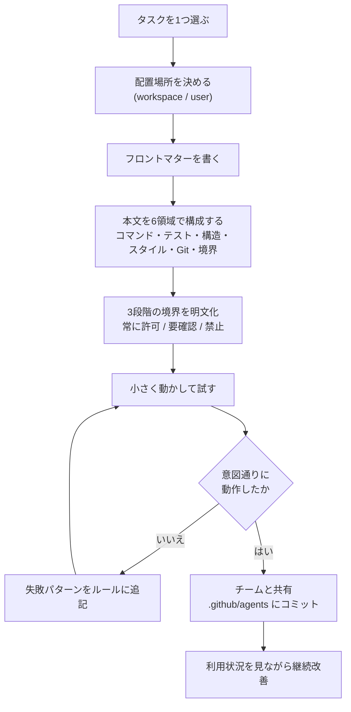
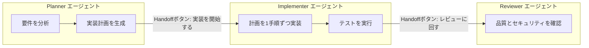
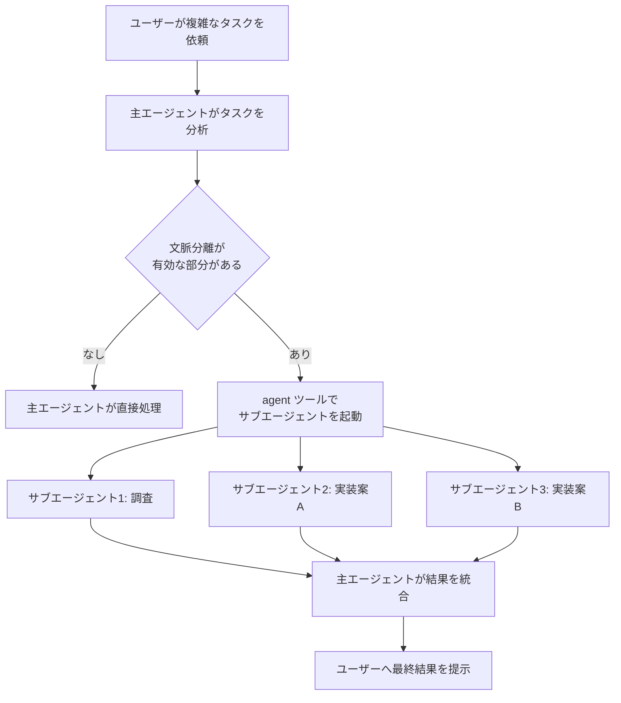
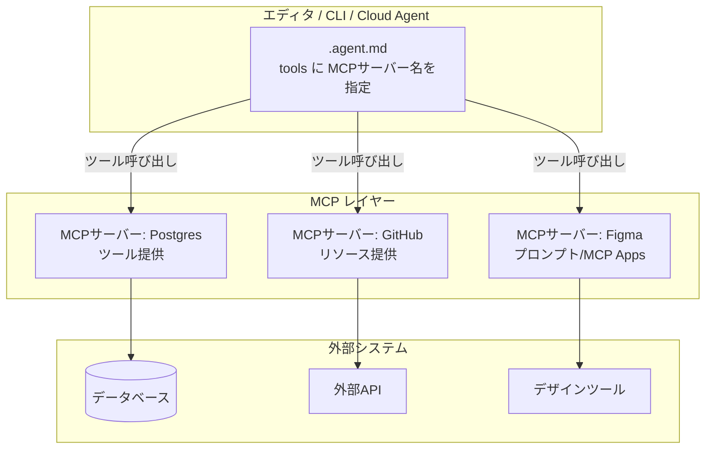
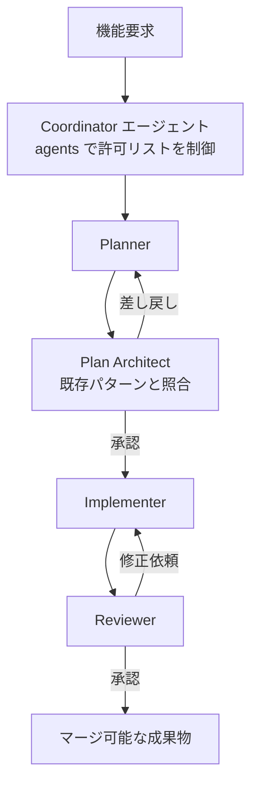
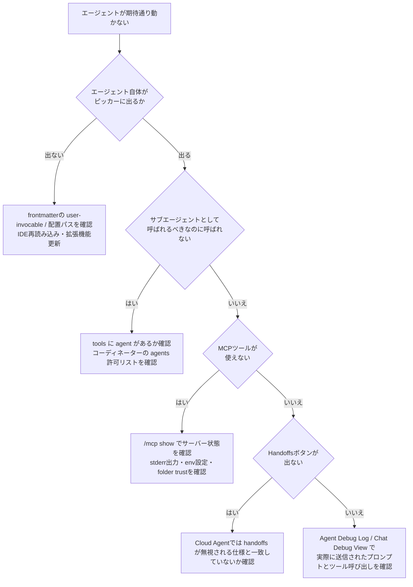

# GitHub Copilot `.agent.md` 実践ガイド ― Custom Agents / Handoffs / Subagents / MCP / マルチエージェント設計

> 対象読者: GitHub Copilot(VS Code / Copilot CLI / GitHub.com Cloud Agent)で `.agent.md` によるカスタムエージェントをすでに触ったことがあり、Handoffs・Subagents・MCP統合・マルチエージェント設計まで踏み込みたい中級〜上級者。
> 最終更新: 2026年7月31日時点の公開情報に基づく(出典は末尾の「参考文献」を参照)。

## 目次

1. [`.agent.md` とは何か](#1-agentmd-とは何か)
2. [フロントマター全仕様](#2-フロントマター全仕様)
3. [ステップバイステップ作成ガイド](#3-ステップバイステップ作成ガイド)
4. [Handoffs(エージェント連鎖)](#4-handoffsエージェント連鎖)
5. [Subagents(サブエージェント)](#5-subagentsサブエージェント)
6. [MCP統合](#6-mcp統合)
7. [マルチエージェント設計パターン](#7-マルチエージェント設計パターン)
8. [トラブルシューティング](#8-トラブルシューティング)
9. [ベストプラクティス総まとめ](#9-ベストプラクティス総まとめ)
10. [参考文献](#10-参考文献)

---

## 1. `.agent.md` とは何か

`.agent.md` は、GitHub Copilot に「特定の役割(ペルソナ)」「使えるツール」「振る舞いのルール」をまとめて持たせるための、YAMLフロントマター付きMarkdownファイルです。以前は「custom chat modes」と呼ばれていましたが、名称が「custom agents」に統一されました。既存の `.chatmode.md` ファイルを移行するには、拡張子を `.agent.md` に変更したうえで、VS Code の既定検索先である `.github/agents/` または `.claude/agents/` へ移動します。`chat.agentFilesLocations` を設定している場合は、その指定先へ移動することもできます。

`.agent.md` が解決する課題はシンプルです。汎用の「なんでも屋」エージェントに毎回同じ前提知識やツール制限を説明し直すのは非効率です。プランナー、実装者、セキュリティレビュアーといった役割ごとにファイルを分けておけば、ドロップダウンやスラッシュコマンドで切り替えるだけで、その役割に最適化されたツールセットと指示が適用されます。

`.agent.md` が置かれる代表的な場所は次の3プラットフォームです。挙動やフロントマターの一部フィールドがプラットフォームごとに微妙に異なるため、後述の全仕様表で必ず確認してください。

| プラットフォーム | 主な用途 | 参照ディレクトリ(既定) |
| --- | --- | --- |
| VS Code(Copilot Chat) | エディタ内での対話・編集・計画 | `.github/agents/`(ワークスペース)/ `~/.copilot/agents`(ユーザー) |
| GitHub Copilot CLI | ターミナル駆動のワークフロー自動化 | `.github/agents/` |
| GitHub Copilot Cloud Agent(GitHub.com) | Issue割り当てによる自律実行 | リポジトリ内のエージェントプロファイル |

なお VS Code は `.claude/agents` フォルダ内の `.md` ファイル(Claude Code のサブエージェント形式)も自動検出し、ツール名をVS Code側の名称にマッピングします。両フォーマットを使い分ければ、同じエージェント定義をVS CodeとClaude Codeの間で使い回すことも可能です。

---

## 2. フロントマター全仕様

`.agent.md` のフロントマターはYAMLで記述し、本体(Markdown)がシステムプロンプトとしてユーザーの入力の前に挿入されます。フィールドの意味はプラットフォームによって一部異なるため、まずVS Code版の全フィールドを網羅し、その後にGitHub Copilot Cloud Agent版との差分を整理します。

### 2.1 VS Code版フロントマター全フィールド

| フィールド | 型 | 必須 | 説明 |
| --- | --- | --- | --- |
| `description` | string | 推奨 | エージェントの概要。チャット入力欄のプレースホルダーやエージェント選択ピッカーに表示される。 |
| `name` | string | 任意 | 表示名。省略時はファイル名が使われる。 |
| `argument-hint` | string | 任意 | チャット入力欄に薄字で表示される入力ヒント。 |
| `tools` | string[] | 推奨 | 利用可能な組み込みツール・ツールセット・MCPツール・拡張機能提供ツールの一覧。`<サーバー名>/*` でMCPサーバーの全ツールを一括指定できる。 |
| `agents` | string[] | 任意 | このエージェントがサブエージェントとして呼び出せるエージェント名の許可リスト。`*` は全許可、空配列 `[]` はサブエージェント利用を禁止。指定する場合は `tools` に `agent` ツールを含める必要がある。 |
| `model` | string \| string[] | 任意 | 使用するモデル。配列で指定すると先頭から順に利用可能なモデルを試す(フォールバック)。省略時はモデルピッカーで選択中のモデルを使用。 |
| `user-invocable` | boolean | 任意(既定 `true`) | `false` にするとエージェント選択ドロップダウンから隠れ、サブエージェントとしてのみ呼び出し可能になる。 |
| `disable-model-invocation` | boolean | 任意(既定 `false`) | `true` にすると他のエージェントからサブエージェントとして呼ばれなくなる(ユーザーが明示的に選んだ時のみ動作)。 |
| `infer` | boolean | **非推奨** | 旧仕様。`user-invocable` と `disable-model-invocation` に置き換え済み。`infer: true`(既定)はピッカー表示とサブエージェント利用の両方を許可し、`infer: false` は両方を隠していた。 |
| `target` | `vscode`\|`github-copilot` | 任意 | エージェントの対象環境。 |
| `mcp-servers` | object | 任意 | `target: github-copilot` のカスタムエージェントで使うMCPサーバー設定(JSON)。 |
| `handoffs` | object[] | 任意 | チャット応答後に表示する「次のエージェントへの引き継ぎ」ボタンの定義。詳細は[第4章](#4-handoffsエージェント連鎖)。 |
| `handoffs[].label` | string | Handoffs使用時必須 | ボタンに表示するテキスト。 |
| `handoffs[].agent` | string | Handoffs使用時必須 | 切り替え先のエージェント識別子。 |
| `handoffs[].prompt` | string | 任意 | 切り替え先に送信するプロンプト文。 |
| `handoffs[].send` | boolean | 任意(既定 `false`) | `true` なら自動送信、`false` ならプロンプトを入力欄にプリフィルするだけ。 |
| `handoffs[].model` | string | 任意 | Handoff実行時に使うモデル。`GPT-5 (copilot)` のように `モデル名 (ベンダー)` 形式で指定。 |
| `hooks`(プレビュー) | object | 任意 | このエージェントが有効な間だけ動作するフック(例: 編集後に自動フォーマッタを実行)。`chat.useCustomAgentHooks` の有効化が必要。 |

> 補足: `tools` に指定したツールがその時点で利用不可な場合、そのツールは黙って無視されます(エラーにはなりません)。

### 2.2 Claude形式(`.claude/agents`)との違い

VS Codeは `.claude/agents` フォルダ内のプレーンな `.md` ファイル(Claude Code のサブエージェント形式)も検出します。フィールド名と型が異なる点に注意してください。

| フィールド | 型 | 説明 |
| --- | --- | --- |
| `name` | string(必須) | エージェント名 |
| `description` | string | エージェントの役割 |
| `tools` | カンマ区切り文字列 | 例: `"Read, Grep, Glob, Bash"`。VS Code側のツール名に自動マッピングされる。 |
| `disallowedTools` | カンマ区切り文字列 | ブロックするツール |

VS CodeネイティブのYAML配列形式(`tools: ['edit', 'search']`)と、Claude形式のカンマ区切り文字列形式の両方がサポートされているため、混同しないよう注意してください。

### 2.3 GitHub Copilot Cloud Agent(GitHub.com)版との差分

GitHub.com上のCopilot Cloud Agent(Issueへのアサインで動く自律エージェント)向けの設定リファレンスでは、フィールド自体はVS Code版とほぼ共通ですが、**`handoffs` と `argument-hint` は現時点でCloud Agentでは無視される**という重要な違いがあります。つまり、これらのフィールドを含むエージェントファイルをそのままCloud Agentで使っても、VS Codeのような引き継ぎボタンは表示されません。複数プラットフォームでエージェントファイルを共有する場合は、この非対応差分をチーム内ドキュメントに明記しておくべきです。

### 2.4 GitHub Copilot CLI版のポイント

CLIでは `.github/agents/<name>.agent.md` という命名規則でエージェントプロファイルを配置します。フロントマターの基本構造はVS Code版と共通ですが、CLI特有の運用として以下が挙げられます。

- エージェントは `/agent` スラッシュコマンドで選択する。
- Agent Coordination Protocol(ACP)対応クライアント(Zedやエディタプラグイン、CI連携ツールなど)は、`agent` セッション設定オプションでプログラム的にエージェントを切り替えられる。
- ACPクライアントは、エージェントが多段階タスクを進める様子を示す「ライブプラン」も受け取れるため、ターン完了を待たずに進捗表示ができる。

### 2.5 基本サンプル

```yaml
---
description: 'Web accessibility(WCAG 2.1/2.2)とインクルーシブUXの専門アシスタント'
name: 'Accessibility Expert'
model: GPT-5.2
tools: ['search/codebase', 'edit/editFiles', 'web/fetch', 'runTests', 'problems']
---

# Accessibility Expert

あなたはWCAG 2.1/2.2に精通したアクセシビリティの専門家です。デザイナー、開発者、QA向けに
実務的なガイダンスを提供してください。
```

---

## 3. ステップバイステップ作成ガイド

GitHubが2,500件超の公開 `agents.md` ファイルを分析した結果によれば、うまく機能しているファイルには共通のパターンがあります。「あなたは親切なコーディングアシスタントです」のような曖昧な指示は機能せず、「あなたはReactコンポーネントのテストを書くテストエンジニアであり、このサンプルに従い、ソースコードは絶対に変更しません」のように具体的である必要があります。以下のステップは、この分析結果と公式ドキュメントの作成フローを統合したものです。

### ステップ0: 1つのタスクに絞る

「汎用ヘルパー」を作らないことが最初の分岐点です。ドキュメント執筆、テスト作成、Lint修正、API実装、開発環境デプロイなど、**具体的なジョブを1つだけ**選びます。欲張って複数の役割を1つのエージェントに詰め込むと、後述する「巨大エージェント」アンチパターンに陥ります。

### ステップ1: 配置場所を決める

| スコープ | 既定の配置場所 |
| --- | --- |
| ワークスペース(チーム共有) | `.github/agents/` フォルダ |
| ワークスペース(Claude形式) | `.claude/agents/` フォルダ |
| ユーザープロファイル(個人・全ワークスペース共通) | `~/.copilot/agents` またはVS Codeユーザーデータ |

チームで共有する場合はワークスペーススコープ(`.github/agents/`)を選び、Gitでバージョン管理してレビュー対象にするのが基本です。モノレポでは `chat.useCustomizationsInParentRepositories` を有効にすると、親リポジトリルートのエージェントも検出できます。

### ステップ2: フロントマターを書く

最低限、`name` と `description` があれば動作します。慣れてきたら `tools` で権限を絞り込み、`model` で適切なモデルを固定します。VS Codeでは `/agents` とチャット欄に打つと「Configure Custom Agents」メニューが開き、GUIからも作成できます。AIに生成させる場合は Agent モードで `/create-agent` と打ち、「セキュリティレビューエージェント」のように役割を説明すると、AIが確認質問をしながら適切なフロントマターと指示を含む `.agent.md` を生成してくれます。既存の会話から「このタスク用のエージェントを作って」と頼んで抽出することもできます。

### ステップ3: 本文を「6つの核」で構成する

2,500件の分析から導かれた、成果を出しているエージェントファイルに共通する6領域です。

| 領域 | 書くべき内容 |
| --- | --- |
| コマンド | `npm test`、`pytest -v` のように、フラグ込みの実行可能コマンドを早い段階に書く |
| テスト | テストフレームワークと実行方法、成功基準 |
| プロジェクト構造 | ディレクトリごとの役割(読む場所・書く場所を明示) |
| コードスタイル | 実際のコード例を1つ見せる(説明文3段落より効果的) |
| Gitワークフロー | コミット前に何を実行すべきか、ブランチ運用 |
| 境界(バウンダリ) | 触ってはいけないもの(シークレット、`vendor/`、本番設定など) |

コマンドは早めに書くこと、説明より実例を優先すること、そして「絶対にシークレットをコミットしない」のような境界線を明示することが、分析上もっとも効果があった項目として挙げられています。

### ステップ4: バウンダリを3段階で明文化する

「常にやってよいこと」「先に確認すること」「絶対にやらないこと」の3層構造にすると、破壊的なミスを防ぎやすくなります。

```markdown
## 境界(Boundaries)
- ✅ 常に実行してよい: `docs/` への新規ファイル作成、スタイルガイドの遵守、`markdownlint` の実行
- ⚠️ 先に確認する: 既存ドキュメントの大幅な書き換え
- 🚫 絶対にしない: `src/` 配下のコード変更、設定ファイルの編集、シークレットのコミット
```

### ステップ5: テストして、失敗から育てる

最良のエージェントファイルは、事前の完璧な設計ではなく反復から生まれます。まずは最小構成(名前・説明・ペルソナ)で動かし、エージェントが間違えたポイントに合わせてルールを足していくアプローチが推奨されています。

### ステップ6: プロトタイプ→計画→実装→レビューのハーネスに乗せる

GitHub社内でAI活用を推進するBurke Hollandは、ツールや裏技を積み上げるより「ハーネス(Copilotという実行基盤そのもの)を深く理解する」ことが生産性向上の本質だと述べています。実務では、`.agent.md` 単体よりも次のようなワークフロー全体の中に位置づけるほうが効果的です。

1. **プロトタイプ**: 実装前にHTMLモックやMermaid図で複数案を並べ、要件の曖昧さを可視化する。
2. **計画(Plan mode)**: `/plan` で実装計画を立てさせ、想定していなかったエッジケースを洗い出す。
3. **実装(Autopilot)**: 計画の各項目を完了させるまで反復させる。この段階でCopilotは内部的に、読み取り中心の作業には軽量サブエージェント、複雑な作業にはより大きなモデルのサブエージェントを自動選択する。
4. **人間によるレビューと反復**: 出力を「まあ良い」で妥協せず、具体的な修正を会話的に伝える。
5. **ラバーダックレビュー**: 別系統のモデルに実装をレビューさせ、モデルごとの死角を補い合う。

この一連の流れの中で `.agent.md` は「毎回繰り返す前提説明を自動化する部品」として機能します。

### 3.1 作成ワークフロー図



---

## 4. Handoffs(エージェント連鎖)

### 4.1 概念

Handoffsは、チャット応答が完了したあとに「次のエージェントへ進む」ボタンを表示し、文脈と(必要なら)事前入力済みプロンプトを引き継ぎながらエージェントを切り替える機能です。開発者が各ステップをレビュー・承認してから次に進める、段階的なワークフローの統制に向いています。

代表的な連鎖パターンは次の3つです。

- **計画 → 実装**: 計画エージェントで計画を生成し、実装エージェントへ引き継いでコーディングを開始する。
- **実装 → レビュー**: 実装が終わったらコードレビューエージェントに切り替え、品質・セキュリティを確認する。
- **失敗するテストを書く → 成功させる**: 先に失敗するテストを生成し(実装より差分が小さくレビューしやすい)、そのテストを通す実装へ引き継ぐ。

### 4.2 フロントマター構文

```yaml
---
description: 新機能の実装計画を生成する
tools: ['search', 'web']
handoffs:
  - label: 実装を開始する
    agent: implementation
    prompt: 上記の計画に沿って実装してください。
    send: false
    model: GPT-5.2 (copilot)
---
```

ユーザーがHandoffボタンを押すと、対象エージェントに切り替わり、プロンプトが入力欄にプリフィルされます。`send: true` にすると、そのプロンプトは自動送信され、次の工程がすぐに始まります。

### 4.3 実例: Planner → Implementer

```yaml
---
description: 新機能や既存コードのリファクタリングの実装計画を生成する。
name: Planner
tools: ['web/fetch', 'search/codebase', 'search/usages']
model: ['Claude Opus 4.5', 'GPT-5.2']
handoffs:
  - label: 計画を実装する
    agent: agent
    prompt: 上記の計画を実装してください。
    send: false
---
# Planning instructions
あなたはプランニングモードで動作します。コードは変更せず、実装計画のみを生成してください。

計画は以下のセクションを含むMarkdown文書とします。
* Overview: 機能やリファクタリングの概要
* Requirements: 要件一覧
* Implementation Steps: 実装手順の詳細
* Testing: 検証すべきテストの一覧
```

### 4.4 プラットフォーム間の注意点

`handoffs` はVS Codeのカスタムエージェント機能として設計されており、**GitHub Copilot Cloud Agent(GitHub.com)では現時点でこのフィールドが無視されます**。同じエージェントファイル群を複数プラットフォームで共有する場合、「VS Codeでは引き継ぎボタンが出るが、Cloud Agentでは出ない」という差異をREADME等に明記しておくことをおすすめします。Copilot CLIでは、Handoffsに相当する連鎖体験は `/fleet` や `/research` のようなオーケストレーション系スラッシュコマンドで代替されます(詳細は第5章)。

### 4.5 Handoffsの流れ



---

## 5. Subagents(サブエージェント)

### 5.1 エージェントとサブエージェントの違い

エージェント(主エージェント)はユーザーが選ぶ、あるいはワークフロー用に構成される「セッションの顔」であり、会話全体の文脈と目標を保持し続けます。一方サブエージェントは、主エージェントが起動する一時的なワーカーであり、独立した(分離された)文脈の中で狭いタスクだけを実行し、結果を主エージェントに要約して返します。

| 観点 | エージェント | サブエージェント |
| --- | --- | --- |
| 起動方法 | ユーザーが選択、またはワークフロー用に設定 | 別のエージェント(オーケストレーター)が起動 |
| 生存期間 | 会話・セッションを通じて持続 | 委任されたタスクの間だけ存在 |
| 文脈 | 会話全体の目標を保持 | タスクに限定した独立した文脈 |
| 役割 | タスク全体を統括 | 1つの絞り込まれた作業を実行 |
| 出力 | ユーザーと直接対話 | 主エージェントに結果を返し、主エージェントが統合する |

### 5.2 サブエージェントが有効な場面

- 実装前の技術調査(ライブラリ比較・既存パターンの分析)を、主エージェントの文脈を汚さずに行いたいとき
- リファクタリングやレビューで、複数の観点(重複コード検出・デッドコード・エラーハンドリング・セキュリティ)を並列に洗い出したいとき
- 複数のアプローチ(例: Redisキャッシュ vs インメモリLRU vs ハイブリッド)を比較検討したいとき
- 異なるモデルに同じ問題を検証させ、意見が一致する点・しない点を洗い出したいとき(マルチモデル・コンセンサス)

### 5.3 呼び出し方(VS Code)

サブエージェントは基本的に**エージェント主導(agent-initiated)**であり、ユーザーが逐一「サブエージェントを実行して」と書く必要はありません。主エージェントが「この部分は文脈分離が有効だ」と判断した時点で自律的に起動します。これを機能させるには `tools` に `agent`(内部的には `runSubagent`)ツールを含めておく必要があります。

```yaml
---
name: document-feature
tools: ['agent', 'read', 'search', 'edit']
---
新機能の実装詳細を調査するサブエージェントを実行し、ユーザー向けドキュメントに関係する
情報だけを返してください。そのうえで docs/ フォルダを更新してください。
```

プロンプト側で「独立した調査として」「並列で分析して」のように書くことで、サブエージェントへの委任を促すこともできます。

### 5.4 サブエージェントとしてのカスタムエージェント

既定では、サブエージェントは主セッションのモデル・ツールをそのまま引き継ぎます。カスタムエージェントをサブエージェントとして走らせると、そのエージェント自身の `model`・`tools`・指示が優先されます。呼び出し制御は次の2つのフィールドで行います。

- `user-invocable: false` … エージェント選択ドロップダウンには表示されず、サブエージェントとしてのみ利用可能
- `disable-model-invocation: true` … 他のエージェントからサブエージェントとして呼ばれなくなる(ユーザーが明示的に選んだ場合のみ動作)

```yaml
---
name: internal-helper
user-invocable: false
---
このエージェントはサブエージェントとしてのみ呼び出せます。
```

### 5.5 呼び出せるサブエージェントを制限する(実験的機能)

既定では `disable-model-invocation: true` を持たないすべてのカスタムエージェントがサブエージェント候補になります。名前や説明が似ているエージェントが複数あると、意図しないエージェントが選ばれることがあるため、`agents` プロパティで許可リストを明示できます。

- 特定のエージェント名の配列(例: `['Red', 'Green', 'Refactor']`)を指定 → それだけを許可
- `*` → すべて許可(既定動作)
- `[]` → サブエージェントの利用自体を禁止

```yaml
---
name: TDD
tools: ['agent']
agents: ['Red', 'Green', 'Refactor']
---
テスト駆動開発でこの機能を実装してください。以下の手順でサブエージェントを使います。
1. Red エージェントで失敗するテストを書く
2. Green エージェントでテストを通すコードを実装する
3. Refactor エージェントでコード品質を改善する
```

`agents` 配列に明示的に列挙されたエージェントは、`disable-model-invocation: true` の設定より優先されます。つまり「一般的にはサブエージェントとして使われたくないが、特定のコーディネーターからは呼ばれてよい」というエージェントを作れます。

### 5.6 ネストしたサブエージェント(再帰)

既定ではサブエージェントはさらにサブエージェントを生成できません。これは、エージェントが誤って自分自身をループ呼び出しする無限再帰を防ぐためです。分割統治(divide-and-conquer)のような再帰的な委任が必要な場合は、`chat.subagents.allowInvocationsFromSubagents` 設定(既定 `false`)を有効にします。有効化すると、最大ネスト深度5までサブエージェントが自身のサブエージェントを生成できます。

```yaml
---
name: RecursiveProcessor
tools: ['agent', 'read', 'search']
agents: [RecursiveProcessor]
argument-hint: 処理対象の項目リスト
---
リストを分割統治で処理します。
- 項目が5個より多い場合、半分に分割してそれぞれをRecursiveProcessorサブエージェントに委任する
- 4個以下ならその場で直接処理する
- 各サブエージェントの結果を統合して最終結果とする
```

### 5.7 サブエージェントのモデル選択優先順位

サブエージェント実行時のモデルは、次の優先順位で決まります。

1. 主エージェントが `runSubagent` ツール呼び出し時に明示的に指定したモデル
2. サブエージェント自身の `.agent.md` フロントマターの `model`
3. 親の会話を実行しているメインモデル

なお、要求されたモデルは主モデルのコスト階層を超えられません。より高価なモデルを要求した場合は主モデルにフォールバックします。

### 5.8 GitHub Copilot CLIでのオーケストレーション

VS Codeの `agent` ツールに相当する体験として、Copilot CLIには `/fleet` というエンドユーザー向けのオーケストレーションコマンドがあります。大きな目標を分解し、複数のバックグラウンドサブエージェントを起動し、依存関係を尊重しながら結果を統合します。

```bash
/fleet 認証まわりのドキュメントを更新し、認証サービスをリファクタリングし、関連テストを追加して。

# 非対話実行の場合
copilot -p "/fleet 認証まわりのドキュメントを更新し、認証サービスをリファクタリングし、関連テストを追加して。" --no-ask-user
```

また `/research` は、1つのトピックを複数の調査スレッドに分解し、並列サブエージェントとして実行してから構造化レポートに統合する、組み込みのオーケストレーションコマンドです。自分でマルチエージェントパターンを組まなくても、単発の質問より深く信頼性の高い調査結果が得られます。

### 5.9 サブエージェントの並列度・深度制御

利用量ベース課金のユーザーは、`/settings` からサブエージェントの**同時実行数**と**深度の上限**を設定できます。同時実行数は並列に走るサブエージェントの数、深度上限は委任が何階層まで連鎖できるかを制御し、複雑なオーケストレーションタスクにおけるリソース消費を予測可能にします。

### 5.10 サブエージェントの実行フロー



---

## 6. MCP統合

### 6.1 MCPとは

Model Context Protocol(MCP)は、AIモデルを外部ツールやサービスに接続するためのオープンな標準規格です。GitHub CopilotにおいてMCPサーバーは、ファイル操作・データベース・外部APIなどのための「ツール」を提供します。MCPサーバーは、ツールに加えて「リソース(読み取り専用の文脈データ)」「プロンプト(定型プロンプトのテンプレート)」「MCP Apps(チャット内に直接描画されるフォームやビジュアライゼーションなどの対話型UI)」も提供できます。

### 6.2 エージェントからMCPツールを使う

`.agent.md` の `tools` 配列にMCPサーバー名(またはツール名)を追加するだけで、そのエージェントはMCPツールを利用できます。サーバーの全ツールを含めたい場合は `<サーバー名>/*` という記法を使います。

```yaml
---
name: 'Database Administrator'
description: 'PostgreSQLのパフォーマンスチューニング・クエリ最適化・スキーマ設計の専門DBA'
tools: ['codebase', 'terminal', 'postgres/*']
---
```

この設定があると、エージェントは実際のデータベースに対して `EXPLAIN ANALYZE` を実行してボトルネックを特定したり、実データの分布に基づいてインデックスを提案したりできます。MCPサーバーがなければ、エージェントはデータベース構造やパフォーマンス特性を推測するしかありません。

### 6.3 `mcp.json` によるサーバー設定(VS Code)

MCPサーバーはワークスペース単位(`.vscode/mcp.json`)、またはユーザープロファイル単位で設定します。

```json
{
  "servers": {
    "github": {
      "type": "http",
      "url": "https://api.githubcopilot.com/mcp"
    },
    "playwright": {
      "command": "npx",
      "args": ["-y", "@microsoft/mcp-server-playwright"]
    }
  }
}
```

APIキーなどの機密情報はJSONに直書きせず、`${input:variableName}` のような入力変数を使うことが強く推奨されています。VS Codeが実行時にプロンプトを出し、コミットされるファイルにシークレットが残らないようにできます。

### 6.4 Copilot CLIでのMCP設定ファイル優先順位

Copilot CLIは、次の順序でMCPサーバー定義を探索します。

| ファイル | スコープ | 備考 |
| --- | --- | --- |
| `.mcp.json` | リポジトリルート | チーム共有設定として推奨 |
| `.github/mcp.json` | `.github/` フォルダ | 自動読み込みされるワークスペース設定 |
| `.vscode/mcp.json` | VS Codeワークスペース | VS Code互換設定 |
| `devcontainer.json` | Dev Container | コンテナ内実行時に利用可能 |

**重要な安全対策として、ワークスペースのMCPサーバーは「フォルダ信頼(folder trust)」が確認された後にのみ起動します。** 明示的に信頼していないフォルダの設定ファイルに書かれたMCPサーバーは起動しないため、信頼していないリポジトリの悪意あるMCPサーバー設定から保護されます。

### 6.5 認証とサンドボックス

MCPサーバーの認証方式は多岐にわたります。

- **OAuth**: ブラウザリダイレクトとトークン保存をCLI/エディタが自動処理
- **`client_credentials` グラント**: ブラウザのないヘッドレス環境(CI/CDなど)向けのマシン間認証
- **デバイスコードフロー(RFC 8628)**: ヘッドレス/CI環境でブラウザリダイレクトが使えない場合の自動フォールバック
- **環境変数によるAPIキー**: `env` フィールド経由で渡し、設定ファイルには直書きしない

macOSとLinuxでは、ローカルで動くstdio型MCPサーバーに対してサンドボックス化を有効にできます。`sandboxEnabled: true` を設定すると、そのサーバーがアクセスできるファイルパスとネットワークドメインを明示的に許可したものだけに制限できます。サンドボックス化されたサーバーのツール呼び出しは、制御された環境内で実行されるため自動承認されます(Windowsでは現時点で非対応)。

```json
{
  "servers": {
    "myServer": {
      "type": "stdio",
      "command": "npx",
      "args": ["-y", "@example/mcp-server"],
      "sandboxEnabled": true
    }
  },
  "sandbox": {
    "filesystem": { "allowWrite": ["${workspaceFolder}"] },
    "network": { "allowedDomains": ["api.example.com"] }
  }
}
```

### 6.6 GitHub Copilot Cloud Agent向けの `mcp-servers` フィールド

`target: github-copilot` のカスタムエージェントでは、`mcp-servers` フロントマターフィールドにMCPサーバー設定(JSON)を直接記述できます。VS Code版が外部の `mcp.json` を参照するのに対し、Cloud Agent版はエージェントファイル自体にMCP設定を持たせられる点が異なります。

### 6.7 アーキテクチャ概観



### 6.8 トラブルシューティングの要点(概要)

MCP固有のトラブルシューティングは第8章にまとめていますが、まず押さえるべき基本動線は次の3つです。

1. サーバーが起動しない/接続が切れる場合、チャットビューにエラーインジケーターが表示されるので選択して出力ログを確認する
2. コマンドパレットの **MCP: List Servers** からサーバーごとの状態確認・再起動ができる
3. CLIでは `/mcp show`(全サーバー一覧)や `/mcp show <name>`(個別サーバー詳細)でstderr出力込みの失敗理由を素早く特定できる

---

## 7. マルチエージェント設計パターン

`.agent.md` の真価は、単体のペルソナ切り替えよりも、複数のエージェントを役割分担させる「オーケストレーション」で発揮されます。ここでは実務でよく使われる設計パターンを、実装例つきで紹介します。

### 7.1 パターン比較表

| パターン | 目的 | 主な構成要素 | 向いている場面 |
| --- | --- | --- | --- |
| Coordinator & Worker | 全体の流れを統括しつつ、専門特化したワーカーに委任する | コーディネーター1体 + ワーカー複数体(`agents` で許可リスト化) | 機能開発全体(計画→実装→レビュー)のように、明確な工程がある場合 |
| Multi-perspective Review | 同じ成果物を複数の視点から独立してレビューする | 並列サブエージェント(正確性・品質・セキュリティ・アーキテクチャ) | コードレビュー、設計レビューなど「見落とし」を減らしたい場合 |
| Research → Act | 調査と実行を分離し、主文脈を汚さない | 調査用サブエージェント → 実装エージェント | 未知のライブラリ選定、既存パターンの調査が必要な実装 |
| Recursive Divide & Conquer | 大きなタスクを再帰的に分割する | 自己参照する `agents` プロパティ、ネスト許可設定 | 大量データ処理、大規模リストの一括処理 |
| Red/Green/Refactor(TDD) | テスト駆動開発の3工程をエージェントごとに分離する | 許可リストで固定された専用サブエージェント3体 | テスト駆動開発を厳密に運用したいチーム |
| Handoffsチェーン | 人間のレビューを挟みながら段階的に進める | `handoffs` フロントマター | 各工程で承認を得たい、監査性を重視する場合 |

### 7.2 Coordinator & Worker(コーディネーター & ワーカー)

コーディネーターは全体のワークフローを管理し、専門特化したサブエージェントにサブタスクを委任します。各ワーカーは読み取り専用ツールだけを持つプランナーや、編集権限を持つ実装者など、必要な権限だけを個別に持てます。

```yaml
---
name: Feature Builder
tools: ['agent', 'edit', 'search', 'read']
agents: ['Planner', 'Plan Architect', 'Implementer', 'Reviewer']
---
あなたは機能開発のコーディネーターです。各機能要求について次の手順を踏みます。

1. Planner エージェントで機能をタスクに分解する
2. Plan Architect エージェントで計画をコードベースの既存パターンと照合する
3. アーキテクトが再利用可能なパターンやライブラリを指摘したら、Plannerへフィードバックし計画を更新する
4. Implementer エージェントで各タスクのコードを書く
5. Reviewer エージェントで実装を確認する
6. レビューアが問題を指摘したら、再度Implementerエージェントで修正する

各フェーズが収束するまで、計画とアーキテクチャの往復、レビューと実装の往復を繰り返してください。
```

ワーカー側はコストと速度を意識してモデルを選べます。たとえば実装用ワーカーには軽量モデルを優先させることもできます。

```yaml
---
name: Implementer
user-invocable: false
model: ['Claude Haiku 4.5 (copilot)', 'Gemini 3 Flash (Preview) (copilot)']
---
割り当てられたタスクを実装するコードを書いてください。
```

### 7.3 Multi-perspective Review(多視点レビュー)

コードレビューは1回のパスだけでは見落としが生じがちです。異なる視点を並列サブエージェントとして走らせ、あとから統合するとレビュー品質が上がります。

```yaml
---
name: Thorough Reviewer
tools: ['agent', 'read', 'search']
---
あなたは複数の視点を同時にレビューします。各視点を独立した並列サブエージェントとして実行し、
互いの結果に引きずられないようにしてください。

レビュー依頼を受けたら、以下を並列サブエージェントとして実行します。
- 正確性レビュアー: ロジックの誤り、エッジケース、型の問題
- コード品質レビュアー: 可読性、命名、重複
- セキュリティレビュアー: 入力検証、インジェクションリスク、データ漏えい
- アーキテクチャレビュアー: 既存パターンとの整合性、設計の一貫性

全サブエージェントの完了後、優先度付きサマリーに統合してください。致命的な問題とnice-to-have
を区別し、良かった点にも触れてください。
```

より細かく制御したい場合、各視点を専用のカスタムエージェントとして切り出し、セキュリティレビュアーにはセキュリティ特化MCPサーバー、コード品質レビュアーには社内Lint CLIツールを個別に持たせる、といった拡張も可能です。

### 7.4 Research → Act(調査してから実行)

未知の技術選定が絡む実装では、先に調査専用のサブエージェントで選択肢を洗い出し、主エージェントの文脈をきれいに保ったまま実装フェーズへ進むパターンが有効です。

```text
このAPIにキャッシュ機能を実装したいので、次の3案について独立調査を行ってください。
1. Redisベースのキャッシュ設計
2. LRU削除つきインメモリキャッシュ設計
3. 階層型(ハイブリッド)キャッシュ設計

結果を比較し、この用途に最適な案を推奨してください。
```

主エージェントは最終的な推奨結果だけを受け取るため、実装作業に入る際の文脈がノイズで汚れません。

### 7.5 Recursive Divide & Conquer(再帰的な分割統治)

大量の項目を処理する場合、自分自身をサブエージェントとして再帰的に呼び出すパターンが使えます(第5.6節参照)。既定では無効な「ネストしたサブエージェント」設定を有効化する必要がある点に注意してください。

### 7.6 Red/Green/Refactor(TDDパターン)

汎用的なコーディングエージェントに丸投げすると、テスト駆動開発の各工程が曖昧になりがちです。専用の3エージェントに許可リストで固定すると、意図しない汎用エージェントが選ばれる事故を防げます(第5.5節のサンプル参照)。

### 7.7 マルチエージェント設計のフロー



### 7.8 設計上の指針

- **1エージェント1ペルソナ**を守る。セキュリティ・テスト・ドキュメント・デプロイを1体に詰め込まず、専用エージェントに分割し、共通処理はスキルとして切り出す。
- コーディネーターには `agents` の許可リストを必ず設定する。似た名前・説明を持つエージェントが複数あると、意図しないエージェントが選ばれるリスクが高まる。
- ワーカーエージェントは既定で `user-invocable: false` にして、ピッカーを汚さずサブエージェント専用にしておく。
- コストの異なるモデルをワーカーごとに使い分ける。要求モデルは主モデルのコスト階層を超えられない点に注意。
- 「ハーネスの単純さ」を忘れない。すべてのタスクにオーケストレーションが必要なわけではなく、単一ファイルで完結する作業にサブエージェントは不要というのが実務者の共通見解です。

---

## 8. トラブルシューティング

### 8.1 まず使うべき診断ツール

| ツール | できること | 開き方 |
| --- | --- | --- |
| Agent Debug Log パネル(プレビュー) | ツール呼び出し順序、LLMリクエスト、トークン使用量、カスタマイズファイルの検出過程、エラーを時系列で確認 | チャットビューの「…」メニュー→「Show Agent Debug Logs」 |
| Chat Debug View | 各LLMリクエスト/レスポンスの生データ(システムプロンプト全文含む)を確認 | チャットビューの「…」メニュー→「Show Chat Debug View」 |
| `/troubleshoot` スラッシュコマンド | 直近セッションのデバッグログをAIに解析させる。`#session` で過去セッションも指定可能 | チャット入力欄に直接入力(`github.copilot.chat.agentDebugLog.enabled` の有効化が必要) |
| Diagnostics(チャットカスタマイズ診断) | 読み込まれているエージェント・プロンプトファイル・指示ファイル・スキルとそのエラーを一覧表示 | チャットビューを右クリック→「Diagnostics」 |
| ログレベル Trace | GitHub Copilot / GitHub Copilot Chat 拡張機能の詳細ログ | コマンドパレット「Developer: Set Log Level」→ Trace |

### 8.2 よくある問題と対処

| 症状 | 主な原因 | 対処 |
| --- | --- | --- |
| エージェントがドロップダウン・ピッカーに出てこない | `user-invocable: false` になっている、ファイルが検出対象パス外にある、拡張機能/プラグイン側の既知バグ | フロントマターを確認し、`.github/agents/` 配下にあるか確認。IDEによっては再読み込みが必要な既知バグが報告されているため拡張機能を最新化する |
| ファイルを開いている間だけエージェントが表示される | 一部IDE統合(例: Xcode向けCopilot)でファイルシステム監視が未実装という既知の不具合が報告されている | 該当拡張機能のIssueトラッカーで状況を確認し、当面は該当ファイルを開いた状態で作業する |
| サブエージェントとして一覧に出ない/呼ばれない | `tools` に `agent` が含まれていない、`disable-model-invocation: true` になっている、コーディネーター側の `agents` 許可リストに含まれていない | `tools: ['agent', ...]` を確認し、コーディネーター側の `agents` 配列に対象エージェント名を追加する |
| ユーザーレベルのエージェント(`~/.copilot/agents`)が読み込まれない | CLI/SDKのバージョンやクライアント実装によって、ユーザーレベルのエージェント読み込みが未対応・不具合を抱えている場合がある(既知のIssueが報告されている) | CLI/拡張機能を最新版に更新し、改善しない場合はリポジトリレベル(`.github/agents/`)に一時的にコピーして回避する |
| Handoffsボタンが出ない | Cloud Agent環境で使っている(現時点で`handoffs`は無視される)、`send`/`label`/`agent` のいずれかが未設定 | VS Codeで動作確認する。Cloud Agentでは引き継ぎUIが出ない仕様であることをチームに共有する |
| モデル指定でエラーになる/意図したモデルが使われない | `model` に配列を渡した際のクライアント側実装差異、指定したモデル名の表記揺れ | まずは単一の文字列で動作確認し、正しいモデル名(ベンダー表記込み)を公式ドキュメントで確認してから配列化する |
| MCPサーバーが起動しない | 実行コマンド(`npx`/`python`等)がPATH上にない、必須の環境変数(接続文字列やAPIキー)が未設定 | CLIでは失敗時にstderr出力がそのまま警告に表示されるため、そこに書かれた原因(例: 環境変数未設定)を確認する |
| MCPサーバーで認証エラー(401など) | トークン期限切れ、認証情報の設定漏れ | `/mcp auth` で再認証する。設定ファイルの `env` フィールドを見直す |
| MCPサーバーが組織ポリシーでブロックされる | 組織レベルでMCPサーバーの許可リストが設定されている | 管理者に許可リストを確認し、承認済みの代替サーバーに切り替える |
| MCPサーバーがワークスペースで一切起動しない | フォルダ信頼(folder trust)が未確認のまま | フォルダを信頼するダイアログで承認する。信頼していないリポジトリでは意図的に起動しない仕様であることを理解する |

### 8.3 MCP診断コマンド早見表

```bash
# サーバー一覧と状態を確認(Copilot CLI)
/mcp show

# 特定サーバーの詳細を確認
/mcp show postgres

# レジストリからサーバーを検索・追加
/mcp registry
/mcp install @modelcontextprotocol/server-postgres

# 再認証
/mcp auth
```

VS Codeでは、コマンドパレットから **MCP: List Servers** → 対象サーバーを選択 → **Show Output**(ログ表示)/ **Restart Server**(再起動)という流れが基本の診断フローです。

### 8.4 トラブルシューティングの判断フロー



### 8.5 セキュリティ関連の注意

`.agent.md` はツールアクセスを制限できる仕組みそのものが安全機構でもあります。セキュリティ上重要なワークフローでは、読み取り専用ツールだけを持つエージェントを作り、意図しない変更を防ぎます。リポジトリで共有するエージェントは、最小権限の原則に沿ってツール一覧と指示内容をレビューしてください。自律実行を強めるモード(いわゆる「YOLOモード」/ Allow All)を使う場合、ローカルマシンで直接実行せず、GitHub CodespacesやDev Containerのようなサンドボックス環境で動かすことが推奨されています。

---

## 9. ベストプラクティス総まとめ

1. **1エージェント1ジョブ**。「なんでも屋」を作らず、テスト・ドキュメント・Lint・API実装のように具体的な役割ごとに分割する。
2. **本文は説明よりコード例**。実際のコードスタイル例1つは、説明文3段落分の価値がある。
3. **境界を3層で明文化**する(常に許可/要確認/禁止)。特に「シークレットを絶対にコミットしない」は最も効果的な制約として繰り返し報告されている。
4. **ツールは最小権限**。プランナーやレビュアーには読み取り専用ツールだけを与え、実装者にのみ編集権限を与える。
5. **サブエージェントは許可リストで制御**する。似た名前のエージェントが複数あるコーディネーターほど `agents` の明示指定が重要になる。
6. **Handoffsとサブエージェントを使い分ける**。人間の承認を挟みたい段階的フローにはHandoffs、文脈分離や並列化が主目的ならサブエージェント。
7. **プラットフォーム差異を文書化する**。`handoffs`/`argument-hint` がCloud Agentで無視されるなど、VS Code・CLI・Cloud Agent間の非互換フィールドをチームで共有する。
8. **反復して育てる**。最小構成から始め、エージェントが間違えた箇所にルールを足していく。最初から完璧な設計を狙わない。
9. **診断ツールを先に使う**。「動かない」と感じたら、まずAgent Debug LogやChat Debug View、`/mcp show` のような一次情報を確認してから設定を推測で変更する。
10. **ハーネス全体を理解する**。`.agent.md` は魔法の呪文ではなく、プロトタイプ→計画→実装→レビューという既存ワークフローを支える部品の1つとして位置づける。

---

## 10. 参考文献

本ガイドは2026年7月31日時点で確認できた以下の一次情報・実務者による公開情報に基づいています。

- GitHub Docs, "Configuration reference for GitHub Copilot agents"
  https://docs.github.com/en/copilot/reference/custom-agents-configuration
- GitHub Docs, "Creating custom agents for Copilot cloud agent"
  https://docs.github.com/en/copilot/how-tos/copilot-on-github/customize-copilot/customize-cloud-agent/create-custom-agents
- Visual Studio Code Docs, "Custom agents in VS Code"
  https://code.visualstudio.com/docs/agent-customization/custom-agents
- Visual Studio Code Docs, "Subagents in Visual Studio Code"
  https://code.visualstudio.com/docs/agents/subagents
- Visual Studio Code Docs, "Add and manage MCP servers in VS Code"
  https://code.visualstudio.com/docs/agent-customization/mcp-servers
- Visual Studio Code Docs, "Troubleshoot AI in Visual Studio Code"
  https://code.visualstudio.com/docs/agents/agent-troubleshooting/troubleshooting
- Burke Holland(GitHub), "The harness is all you need (mostly)", The GitHub Blog, 2026年7月27日
  https://github.blog/ai-and-ml/github-copilot/the-harness-is-all-you-need-mostly/
- Matt Nigh(GitHub), "How to write a great agents.md: Lessons from over 2,500 repositories", The GitHub Blog, 2025年11月19日
  https://github.blog/ai-and-ml/github-copilot/how-to-write-a-great-agents-md-lessons-from-over-2500-repositories/
- Jacklyn Carroll(GitHub), "From one-off prompts to workflows: How to use custom agents in GitHub Copilot CLI", The GitHub Blog, 2026年6月9日
  https://github.blog/ai-and-ml/github-copilot/from-one-off-prompts-to-workflows-how-to-use-custom-agents-in-github-copilot-cli/
- Awesome GitHub Copilot, "Agents and Subagents"
  https://awesome-copilot.github.com/learning-hub/agents-and-subagents/
- Awesome GitHub Copilot, "Building Custom Agents"
  https://awesome-copilot.github.com/learning-hub/building-custom-agents/
- Awesome GitHub Copilot, "Understanding MCP Servers"
  https://awesome-copilot.github.com/learning-hub/understanding-mcp-servers/
- GitHub, awesome-copilot リポジトリ サンプルエージェント集(`agents/context7.agent.md` ほか)
  https://github.com/github/awesome-copilot/blob/main/docs/README.agents.md
- JetBrains YouTrack, "Custom Agent does not show in the dropdown of GitHub Copilot" (LLM-24292)
  https://youtrack.jetbrains.com/projects/LLM/issues/LLM-24292/Custom-Agent-does-not-show-in-the-dropdown-of-GitHub-Copilot
- GitHub Issue, "Custom agents not appearing in dropdown unless agent files are open in editor" (github/CopilotForXcode #728)
  https://github.com/github/CopilotForXcode/issues/728
- GitHub Issue, "User-level custom agents not loading from `~/.copilot/agents`" (github/copilot-cli #452)
  https://github.com/github/copilot-cli/issues/452

> 注記: GitHub Copilotのエージェント関連機能(Handoffs・Subagents・MCP連携・スラッシュコマンド等)は2026年に入ってからも継続的に更新されています。本ガイド内のバージョン番号や挙動は執筆時点のものであり、実装前に必ず上記の公式ドキュメントで最新仕様を確認してください。
