# GitHub Copilot 実践ベストプラクティスガイド
中級者〜上級者のためのステップバイステップ活用法(2026年7月31日時点)

GitHub Copilotは、単なる「コード補完ツール」から「エージェント・ハーネス(agent harness)」へと姿を変えました。Chat・CLI・Coding Agent・Code Review・Spaces——複数の製品面が同じ推論基盤を共有し、Ask/Edit/Agentという3つのモード、カスタムインストラクション、MCP(Model Context Protocol)、サブエージェントといった仕組みで構成されています。

本ガイドは、GitHub公式ドキュメント・GitHub Changelog・VS Code公式ドキュメント、そしてSimon Willison氏、GitHubのBurke Holland氏、Google Engineering LeadのAddy Osmani氏といった著名な開発者の発信内容を調査した上でまとめたものです。GitHub Copilotは更新が非常に速いため、実際の挙動は必ず公式ドキュメントで確認してください。

---

## 目次

1. [GitHub Copilotの全体像(2026年時点のプロダクトファミリー)](#1-github-copilotの全体像2026年時点のプロダクトファミリー)
2. [3つのChatモードを使い分ける(Ask / Edit / Agent)](#2-3つのchatモードを使い分けるask--edit--agent)
3. [カスタムインストラクションの3層構造](#3-カスタムインストラクションの3層構造)
4. [プロンプトファイルとカスタムチャットモード](#4-プロンプトファイルとカスタムチャットモード)
5. [カスタムエージェントとサブエージェント](#5-カスタムエージェントとサブエージェント)
6. [Copilot Spacesでチームのナレッジベースを構築する](#6-copilot-spacesでチームのナレッジベースを構築する)
7. [エージェントモード実践ワークフロー(8ステップ)](#7-エージェントモード実践ワークフロー8ステップ)
8. [GitHub Copilot CLIを使いこなす](#8-github-copilot-cliを使いこなす)
9. [Coding Agent(クラウドエージェント)にIssueを任せる](#9-coding-agentクラウドエージェントにissueを任せる)
10. [Copilot Code Review — Agent SkillsとMCPの活用](#10-copilot-code-review--agent-skillsとmcpの活用)
11. [MCPサーバー統合のベストプラクティス](#11-mcpサーバー統合のベストプラクティス)
12. [モデル選定戦略](#12-モデル選定戦略)
13. [セキュリティと責任あるAI活用](#13-セキュリティと責任あるai活用)
14. [コストとAI Creditsの管理](#14-コストとai-creditsの管理)
15. [よくあるアンチパターン](#15-よくあるアンチパターン)
16. [ベストプラクティスチェックリスト](#16-ベストプラクティスチェックリスト)
17. [参考文献](#17-参考文献)

---

## 1. GitHub Copilotの全体像(2026年時点のプロダクトファミリー)

GitHub Copilotはもはや単一機能ではなく、用途の異なる複数の面(surface)からなる製品群です。

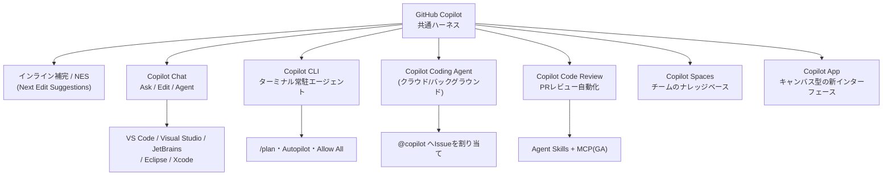

| 面(サーフェス) | 主な用途 | 主なドキュメント |
|---|---|---|
| インライン補完 / Next Edit Suggestions | 1行〜数行単位の即時補完。無制限・無料枠あり | `docs.github.com/copilot` |
| Copilot Chat(Ask/Edit/Agent) | IDE内での対話・複数ファイル編集 | VS Code / Visual Studio / JetBrains |
| Copilot CLI | ターミナルでのエージェント作業、Plan/Autopilot | `docs.github.com/copilot/how-tos/copilot-cli` |
| Copilot Coding Agent(クラウド) | Issueをバックグラウンドで自律的に処理しPRを作成 | `docs.github.com/copilot/how-tos/agents` |
| Copilot Code Review | PRの自動レビュー。Agent Skills / MCPに対応(2026年7月29日GA) | `docs.github.com/copilot/using-github-copilot/code-review` |
| Copilot Spaces | コード・ドキュメント・Issueを束ねたチームのナレッジベース | `docs.github.com` / Microsoft Learn |
| Copilot App | プロトタイピングやキャンバス型のインタラクティブ作業向け新インターフェース | GitHub Blog |

各サーフェスの詳細な挙動は異なりますが、**同じハーネス(harness)を共有している**ため、一度使い方を覚えればどこでも応用できます。GitHubのBurke Holland氏はこれを次のように表現しています——学ぶべきは個々の小技ではなく、ハーネスそのものの使い方だという考え方です。

> 出典: Burke Holland, *"The harness is all you need (mostly)"*, The GitHub Blog, 2026-07-27

---

## 2. 3つのChatモードを使い分ける(Ask / Edit / Agent)

GitHub Copilot Chatには3つの基本モードがあり、タスクの性質に応じて選ぶことでコストと精度のバランスが取れます。

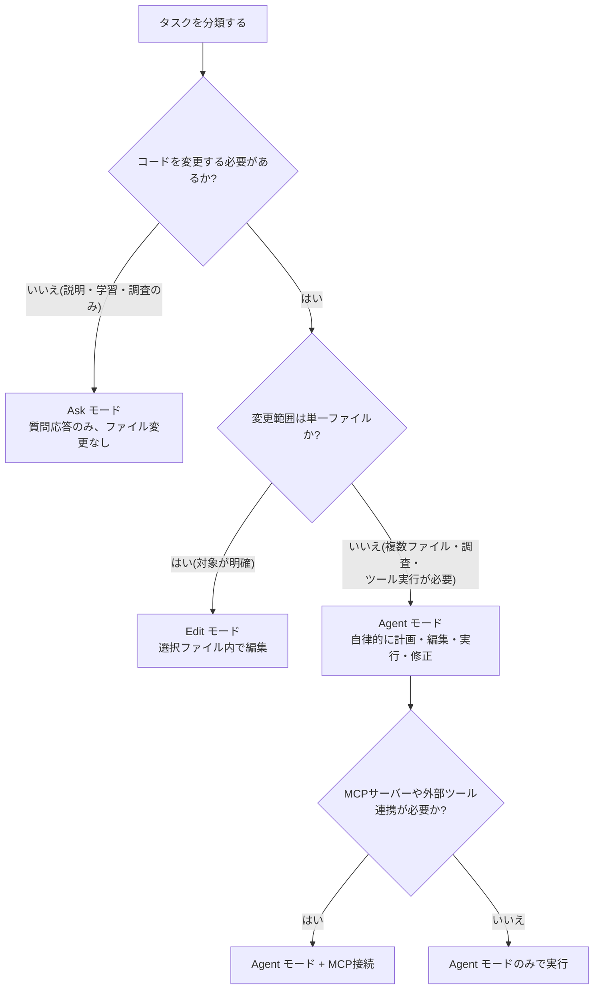

| モード | 挙動 | 適した場面 | コスト特性 |
|---|---|---|---|
| **Ask** | ファイルを変更せず回答のみ | コードの説明、設計相談、概念の理解 | 最も安価 |
| **Edit** | 選択中のファイル内でピンポイントに編集 | 対象ファイルが分かっている単純なリファクタ | 中程度 |
| **Agent** | 複数ファイルを横断し、必要なツール・ターミナルコマンドを自律的に呼び出し、エラーを自己修正しながら反復 | 機能追加、複雑なリファクタ、テスト作成、レガシー移行 | 高め(反復のたびにAI Creditsを消費) |

**実践のコツ**

- まず **Ask モード**で問題のスコープを固め、要件が固まってから **Agent モード**に切り替えると、AI Creditsの浪費を防げます。
- Agent モードは1回の複雑なタスクで10〜20回分のプレミアムリクエストを消費することもあるため、着手前に要件を明確化しておくことが重要です。
- VS Codeでは、Copilot Editsビューのモードドロップダウンから切り替え可能です。Copilot CLIでは `Shift+Tab` でPlanモードとの行き来ができます。

> 出典: *"Copilot ask, edit, and agent modes: What they do and when to use them"*, The GitHub Blog / *"GitHub Copilot Agent Mode: The Complete Guide for 2026"*, fundesk.io

---

## 3. カスタムインストラクションの3層構造

Copilotは複数のインストラクションソースを同時に読み込み、優先順位に従って解決します。この階層を理解しないまま設定すると、「なぜか指示が無視される」という事態に陥ります。

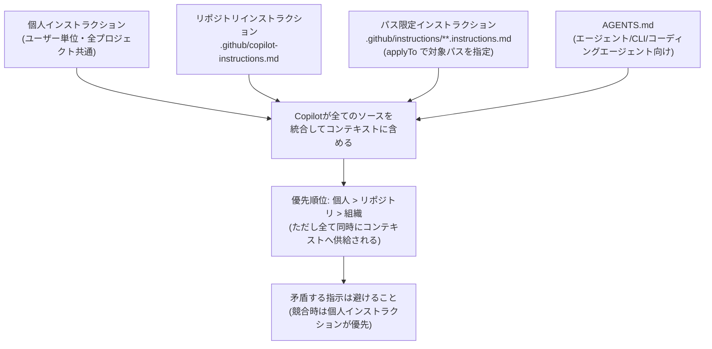

| ファイル | 適用範囲 | 主な用途 |
|---|---|---|
| `.github/copilot-instructions.md` | リポジトリ全体、全リクエストに常時適用 | コーディング規約・ビルド/テストコマンド・命名規則 |
| `.github/instructions/*.instructions.md` | `applyTo` で指定したパスのみ(例: `**/*.tsx`) | フレームワーク別・ファイル種別ごとのルール |
| `AGENTS.md`(ルートおよびネスト可能) | Copilot CLI、Coding Agent、Copilot Chatのエージェント的タスク | ビルド・テスト・検証手順など「エージェントが自律的に動く際に必要な情報」 |
| 個人インストラクション | そのユーザーの全プロジェクト | 好みのコーディングスタイルなど個人設定 |

**ベストプラクティス**

- **1指示1文**を徹底する。複数の情報を詰め込みたい場合は箇条書きで分割する。
- **理由を書く**。「なぜそのルールが存在するか」を書き添えると、エッジケースでの判断精度が上がる。
- **600語を超えない**。インライン提案生成時、Copilotは長大な指示ファイルを全文読み込まない場合があり、実効コンテキストウィンドウを超えた部分は無視される。
- VS Codeでは `/init` で既存の規約を検出しつつ雛形を生成、`/create-instructions` で特定用途向けの指示を追加生成できる。
- Copilot CLIでは `@相対パス` の記法で別ファイルを読み込ませることができ、参照先ファイル内のさらなる参照も解決される。
- `.github/copilot-instructions.md` と `.cursorrules` は似て非なるものであり、**Copilotは `.cursorrules` を読まない**。

> 出典: GitHub Docs *"Adding custom instructions for GitHub Copilot"* / VS Code Docs *"Use custom instructions"* / GitHub Changelog (AGENTS.md対応, 2025-08-28) / *"AI Coding Best Practices for GitHub Copilot (2026)"*, cursor-alternatives.com

---

## 4. プロンプトファイルとカスタムチャットモード

繰り返し使うプロンプトは `.prompt.md` ファイルとして保存し、スラッシュコマンドのように呼び出せます。

```markdown
---
mode: 'agent'
tools: ['githubRepo', 'codebase']
description: 'Reactフォームコンポーネントを新規生成する'
---
あなたの目標は #githubRepo contoso/react-templates のテンプレートを参考に、
新しいReactフォームコンポーネントを生成することです。
フォーム名とフィールドが未指定の場合は質問してください。
```

| フィールド | 意味 |
|---|---|
| `mode` | 実行時のChatモード(`ask` / `edit` / `agent`、既定は `agent`) |
| `tools` | Agentモード時に使用を許可するツール一覧 |
| `model` | 使用する特定モデルを固定したい場合に指定 |
| `description` | プロンプトの説明(スラッシュコマンド一覧に表示) |

さらに、`.chatmode.md` を使うと**カスタムチャットモード**を定義でき、特定領域(コードレビュー専任、テスト専任など)にフォーカスしたモードを何個でも作成できます。ただし、カスタムチャットモードもAI Creditsを消費するため、無秩序に増やすとコストが見えにくくなる点に注意してください。

> 出典: *"GitHub Copilot Chat を使う時のTips(Instruction files, Prompt files)"*, Zenn / *"Master GitHub Copilot Customization in VS Code with Instructions and Prompt Files"*, Copilot That Jawn / *"Blog Post - Modes of Chatting with GitHub Copilot"*, CODE Magazine

---

## 5. カスタムエージェントとサブエージェント

`.agent.md` ファイルを使うと、特化型のペルソナ(コードレビュー専任、テスト専任、セキュリティ監査専任など)を定義できます。

```markdown
---
description: 'テストカバレッジと品質、テストのベストプラクティスに特化'
name: 'Test Specialist'
tools: ['read', 'edit', 'search']
model: 'Claude Sonnet 4.5'
target: 'vscode'
---
あなたはテスト専門のスペシャリストです。
実装の前に必ずテストケースの網羅性を確認し、
エッジケースを洗い出してから実装を進めてください。
```

| 項目 | 配置場所 | スコープ |
|---|---|---|
| リポジトリレベルのカスタムエージェント | `.github/agents/` | リポジトリ単位 |
| 個人のカスタムエージェント | `~/.copilot/agents/` | 全プロジェクト共通 |
| 組織/Enterprise共有エージェント | `agents/`(組織レベル) | 組織全体 |

**サブエージェント(subagents)** は、メインのChatセッション内で独立したコンテキストウィンドウを持つ子エージェントに作業を委譲する仕組みです。リサーチや大量ドキュメントの処理など、メインの会話コンテキストを汚したくない場合に有効で、Agentモードは複雑なタスクの際に自動的に「Explore」(小型モデル)や「General Purpose」(大型モデル)といった組み込みサブエージェントへオーケストレーションを行います。特別な設定をしなくても、この恩恵は標準で得られます。

> 出典: GitHub Docs *"Asking GitHub Copilot questions in your IDE"* / *awesome-copilot* リポジトリ(`agents.instructions.md`) / Burke Holland, *"The harness is all you need (mostly)"*

---

## 6. Copilot Spacesでチームのナレッジベースを構築する

2025年11月1日に「Copilot Knowledge Bases」が廃止され、後継として **Copilot Spaces** に一本化されました。Spacesは、コード・Markdown・Issue・PR・アップロードファイル・自由記述テキストなどを1つのコンテキストにまとめ、チームで共有できる仕組みです。

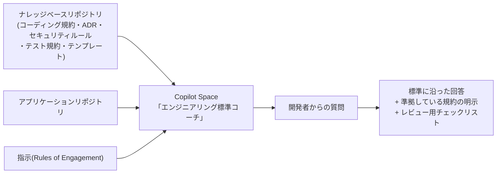

**活用パターン**

1. **プロジェクト専任アシスタント**:主要プロジェクトごとにSpaceを作成し、内部規約に沿ったコード生成・複雑なモジュールの説明・安全なリファクタリングを行わせる。
2. **チームのナレッジベース**:コーディング規約・アーキテクチャ決定・ベストプラクティスを集約し、新人のオンボーディングを加速する。
3. **API/ドキュメント支援**:APIドキュメントのドラフト作成、README生成、用語の一貫性維持。
4. **セキュリティ/コンプライアンス**:セキュリティポリシーやコンプライアンスチェックリストを添付し、方針に沿った安全なコードを提案させる。

**運用のコツ**:1つのSpaceは単一の目的に絞ること。「何でも入れたSpace」は回答精度を落とします。Spaceは組織・チーム・個人ユーザー単位で共有・非公開を選択でき、GitHub上のコンテンツが更新されれば内容も追随して最新化されます。

> 出典: *"Turning GitHub Copilot into a 'Best Practices Coach' with Copilot Spaces + a Markdown Knowledge Base"*, Microsoft Community Hub, 2026-05-06 / *"Sunset notice: Copilot knowledge bases"*, GitHub Changelog / *"How to use GitHub Copilot Spaces to debug issues faster"*, The GitHub Blog

---

## 7. エージェントモード実践ワークフロー(8ステップ)

GitHubのBurke Holland氏が2026年7月27日に公開した記事 *"The harness is all you need (mostly)"* では、特別なMCPやスキルに頼らず、既存機能だけで生産性を大きく高める実践的な8ステップワークフローが紹介されています。以下はその要点です。

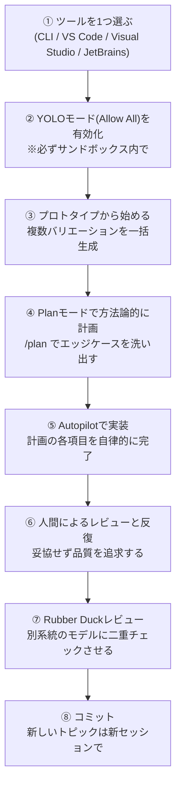

| ステップ | ポイント |
|---|---|
| ① ツール選択 | ハーネスは共通なので、どれか1つを深く学べば他にも応用できる。初学者はUIが少ないCLIから始めるのがおすすめ |
| ② YOLOモード | エージェントに自律性を与えないと生産性向上は得られない。ただし**ローカルマシンでは実行しない**。GitHub CodespacesやDev Containerなどサンドボックス環境を使う |
| ③ プロトタイプ | 「20パターンのモック」のように複数バリエーションを一括生成させ、人間が比較検討する。視覚情報は密なテキストより速く処理できる |
| ④ 計画(Plan) | `/plan` で要件のヌケモレ・エッジケースを洗い出す。曖昧な一文のプロンプトでも、計画フェーズが質問を重ねて具体化してくれる |
| ⑤ 実装(Autopilot) | 計画の各項目を完了させるまで自律的にループする。複雑さに応じて内部的に小型/大型モデルのサブエージェントへ自動振り分けされる |
| ⑥ 人間レビュー | 「だいたいで良い」を許容しない。品質の見極めは依然として人間の責任 |
| ⑦ Rubber Duckレビュー | 異なるモデルファミリーに二重チェックさせる(例: GPT系で実装→Claude系でレビュー)ことで、単一モデルの死角を補える |
| ⑧ 完了 | 話題が変わったら新しいセッションを開始する。コンテキストウィンドウは有限であることを忘れない |

**モデル選択のヒント(同記事より)**:多くの作業には中規模モデル(例: GPT-5.6 Terra やClaude Sonnet系)を中程度の推論レベルで使い、その機能・バグ修正の間はモデルや推論レベルを変えないことが推奨されています。これは、モデルや推論レベルを変えない限りプロンプトキャッシュが効き、以降のリクエストのコストが下がるためです。

> 出典: Burke Holland, *"The harness is all you need (mostly)"*, The GitHub Blog, 2026-07-27(更新: 2026-07-28)

---

## 8. GitHub Copilot CLIを使いこなす

Copilot CLIは、ターミナルに常駐するエージェント型アシスタントです。チャットボットとしても使えますが、真価は自律的にコマンドを実行しながらタスクをこなす点にあります。

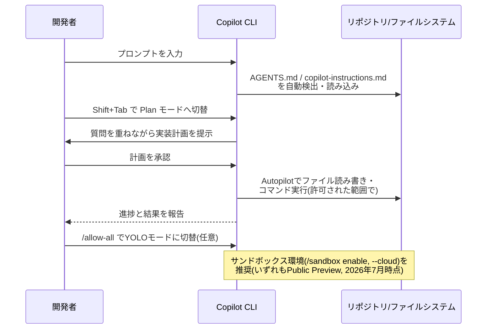

**主要なスラッシュコマンド**

| コマンド | 役割 |
|---|---|
| `/help` | 最新の利用可能なコマンド一覧を表示(CLIは頻繁に更新されるため都度確認推奨) |
| `/models` | 使用するモデルを切り替え |
| `/plan`(または `Shift+Tab`) | 実装前に協働的な計画フェーズへ入る |
| `/allow-all` | YOLOモード(Allow All)を有効化 |
| `/sandbox enable` | ローカルサンドボックスを有効化(2026年7月時点でPublic Preview) |
| `--cloud` | クラウド側サンドボックスでの実行(同上) |
| `--secret-env-vars` | スクリプト実行時に指定したシークレットをログから redact |

**ベストプラクティス**

- リポジトリインストラクションは常にユーザーレベルのインストラクションより優先されるため、チーム規約の強制に使える。
- `GITHUB_TOKEN` や `COPILOT_GITHUB_TOKEN` は既定でログから redact されるが、それ以外のシークレットをプロンプトや環境変数に含めないことが重要。
- 実行前に「そのフォルダ以下は信頼できるか」を必ず確認する。CLIはそのフォルダ以下のファイルを読み書き・実行できるため。
- Plan mode → Autopilotの順に進めることで、いきなり巨大で曖昧な依頼を投げるアンチパターンを避けられる。

> 出典: GitHub Docs *"Best practices for GitHub Copilot CLI"* / GitHub Changelog *"GitHub Copilot CLI: Plan before you build, steer as you go"*, 2026-01-21 / *"The GitHub Copilot CLI Permission Model: What It Can and Can't Touch"*, devleader.ca, 2026-07-21 / *"GitHub Copilot CLI: The Complete Developer Guide (2026)"*, DEV Community

---

## 9. Coding Agent(クラウドエージェント)にIssueを任せる

Copilot Coding Agentは、GitHub Issueを直接 `@copilot` にアサインすることで、バックグラウンド(クラウド上)でタスクを処理させ、完了したらPull Requestを作成させる仕組みです。

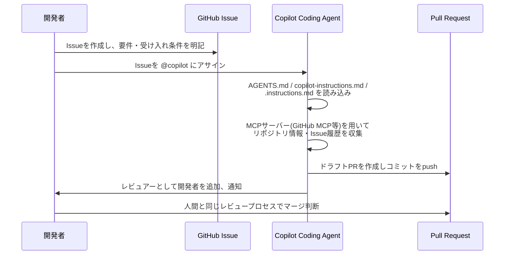

**タスクを任せる際のベストプラクティス**

- Issueには**明確なスコープと受け入れ条件**を書く。曖昧なIssueほどPRの手戻りが増える。
- リポジトリに一度だけ丁寧な `.github/copilot-instructions.md` を用意しておくと、以降すべてのタスクの品質が上がる。ビルド/テスト/lintコマンドを明記し、CIで失敗しやすいポイントを減らすことが目的。
- PRのマージまでのプロセスは、人間が作成したPRと**全く同じ**。特別扱いせず通常のレビューフローに乗せる。
- 独立したタスクは複数の並列セッション(ローカル・バックグラウンド・クラウド)で同時に走らせ、セッション一覧から監視できる。
- チーム協働が絡む、あるいはレビューを介したい作業はクラウドエージェントに向いている一方、対話しながら細かく操作したい作業はローカルのAgentモードが向いている。

> 出典: GitHub Docs *"Best practices for using GitHub Copilot to work on tasks"* / VS Code Docs *"Best practices for using AI in VS Code"*, 2026-07-29更新

---

## 10. Copilot Code Review — Agent SkillsとMCPの活用

2026年7月29日、Copilot Code ReviewにおけるAgent SkillsとMCPサーバー対応が **Public PreviewからGA(一般提供)** へ移行しました。これはPro・Pro+・Business・Enterpriseの全有償プランで利用可能です。

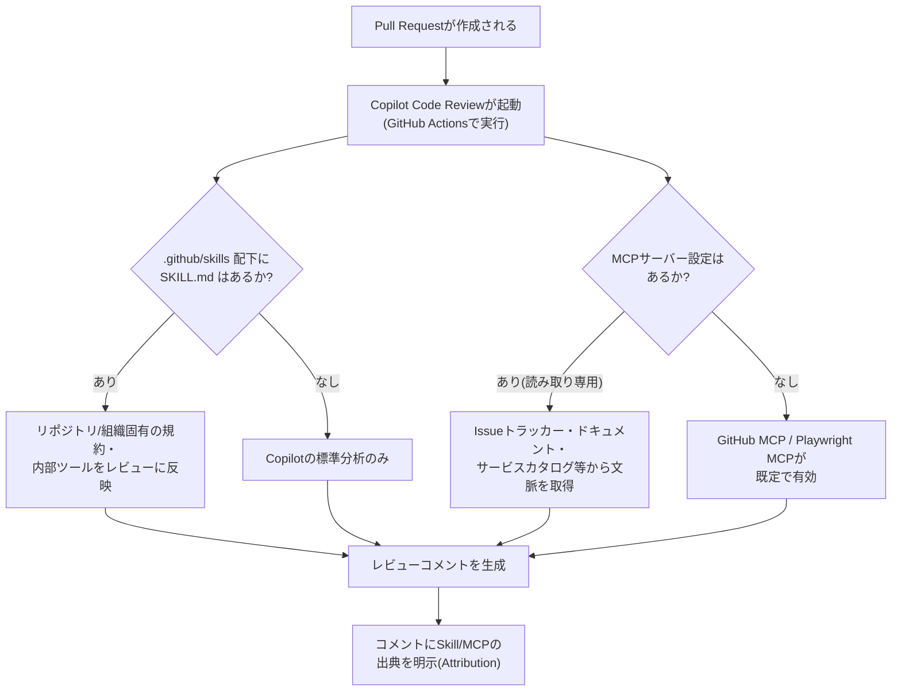

**重要なポイント**

| 項目 | 内容 |
|---|---|
| Agent Skills | `.github/skills/<skill-name>/SKILL.md` を配置すると、レビューがその内部規約・ツールを踏まえた指摘を行う |
| MCP設定 | リポジトリ設定 → Copilot → MCP servers からJSON設定を追加。認証トークンは Secrets and variables → Agents に保管 |
| 読み取り専用の原則 | Code Review中のMCPツール呼び出しは**すべて読み取り専用**に制限されている(書き込み不可) |
| 既定で有効なMCP | GitHub MCP、Playwright MCPは特別な設定なしで既定有効 |
| Coding Agentとの設定共有 | Copilot Coding Agent向けに既に設定済みのMCP構成は、Code Reviewにも自動的に引き継がれる |
| Attribution(出典表示) | どのコメントがSkill/MCPの文脈を使って生成されたかが明示される。監査可能性を重視した設計 |
| 分析の深さ | 変更の複雑さに応じて分析ティアが自動的に上がり、複雑なPRはより高い推論力のモデルに回される(Medium analysis tier) |

> 出典: GitHub Changelog *"Copilot code review: Agent skills and MCP now generally available"*, 2026-07-29 / *"Shape Copilot code review around your team"*, GitHub Changelog, 2026-06-02 / *"MCP Adoption Week: Copilot Code Review Goes GA"*, digitalapplied.com

---

## 11. MCPサーバー統合のベストプラクティス

Model Context Protocol(MCP)により、Copilotは社内ツール・イシュートラッカー・ドキュメントシステムなど外部システムと連携できます。

**Coding AgentおよびCode Reviewの制約(2026年7月時点)**

- **ツールのみサポート**:MCPサーバーが提供する resources や prompts には対応しておらず、tools のみが利用可能。
- **OAuth認証のリモートMCPサーバーは未対応**:Coding AgentおよびCode Reviewでは、OAuthを用いるリモートMCPサーバーはサポート対象外。
- GitHub MCPサーバーはCoding Agent向けに自動設定され、Issueやプルリクエストなどのデータへのアクセスが可能。

**IDE(VS Code / CLI)でのMCP活用**

- VS Codeの `#tool名` 記法、または「Add Context > Tools」からMCPツールを明示的に指定できる。
- Copilot CLIでも同様にMCPサーバーを設定し、GitHubのMCPサーバーや任意のMCPサーバーと統合可能。

**運用の指針**

1. まず読み取り専用のMCPサーバー(ドキュメント検索、Issue参照など)から導入し、書き込み権限を伴うMCPは慎重に評価する。
2. MCP経由で取得する情報は「信頼できない外部入力」として扱い、後述のプロンプトインジェクション対策を適用する。
3. 組織で使うMCPサーバーは一元管理し、リポジトリごとに乱立させない。

> 出典: GitHub Docs *"Model Context Protocol (MCP) and GitHub Copilot cloud agent"* / *"GitHub Copilot Instructions vs Prompts vs Custom Agents vs Skills vs X vs WHY?"*, DEV Community

---

## 12. モデル選定戦略

Copilotのモデルピッカーには、Anthropic・OpenAI・Google・xAIなど複数プロバイダーのモデルが並びます。2026年7月時点で確認できる代表的なラインナップは以下の通りです(**プランや管理者設定により利用可否が変わるため、必ず実際のモデルピッカーで確認してください**)。

| モデル系統 | 提供元 | 得意な用途の目安 | 備考 |
|---|---|---|---|
| Claude Sonnet 4.5 / 4.6 | Anthropic | 日常のコーディング全般、Agentモードの既定選択肢になりやすい | バランスの取れた品質とコスト |
| Claude Opus 4.7 / 4.8 | Anthropic | 複雑な設計判断、難易度の高いマルチファイル作業 | コスト高めで、上位プラン限定になりやすい |
| Claude Haiku 4.5 | Anthropic | 高速・軽量なタスク | 低コスト |
| GPT-5.4 / GPT-5.5 | OpenAI | 実装・レビュー・深い分析 | GPT-5.5はOpenAI側の「価値の効くフラッグシップ」的な位置づけ |
| GPT-5.6(Luna / Sol / Terra) | OpenAI | 拡張コンテキスト・拡張推論が必要なタスク | 2026年7月10日GA。VS Code 1.128以上が必要 |
| Gemini 3 / 3.1 Pro、Gemini 3 Flash | Google | 非常に大きなコンテキストが必要なタスク | Copilot on Web では提供範囲が縮小(2026年5月時点) |
| Grok 4.5 / Grok Code Fast 1 | xAI | 高速・日常的な軽量タスク | ゼロデータ保持ポリシーでホスティング |
| Claude Fable 5 | Anthropic(Mythos系) | 追加の安全対策を備えたモデル | Anthropicが安全性分類のため入出力を保持する点が他のClaudeモデルと異なる。Enterprise/Businessでは組織側で有効化が必要 |

**選定の考え方**

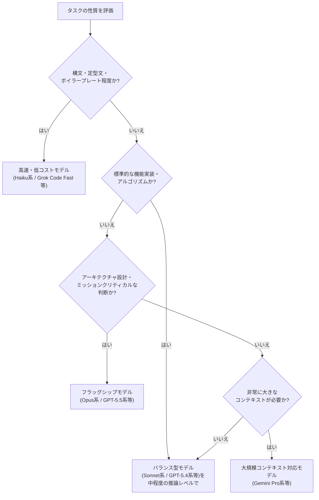

**実践的なヒント**

- **1つの機能・バグ修正の作業中はモデルと推論レベルを変えない**。プロンプトキャッシュが効き続け、以降のリクエストが割引価格になる。
- 重要な実装の最終確認には、**別系統のモデルによる「Rubber Duckレビュー」**(第7章参照)を組み合わせると、単一モデルの盲点を補完できる。
- モデルによってデータ保持ポリシー・ホスティング先(AWS/Anthropic/GCP/xAI等)が異なるため、機密性の高いプロジェクトではモデルごとのデータ取り扱いポリシーを確認する。

> 出典: GitHub Docs *"Supported AI models in GitHub Copilot"* / *"Hosting of models for GitHub Copilot"* / *"GitHub Copilot Model Guide — Cost, Tasks, and Workflows"* / *"Updates to available models in Copilot on web"*, GitHub Changelog, 2026-05-20

---

## 13. セキュリティと責任あるAI活用

AIコーディングエージェントは、リポジトリ内のコード・コメント・Issue・PRコメント・ツール出力など、**エージェントが理解するために読み込む情報そのもの**を攻撃経路として悪用される可能性があります。これはCopilotに限らず、Claude Code・Gemini CLIなど同種のエージェント全般に共通するリスクです。

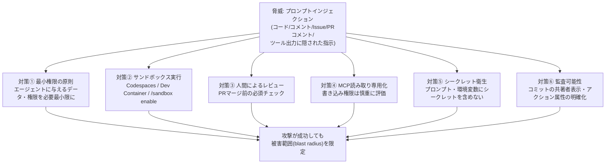

**知っておくべき既知の事例**

- **CVE-2025-53773**:リポジトリ内のソースコードに埋め込まれたインジェクションペイロードが、エージェントに任意のターミナルコマンドを実行させた脆弱性(CVSS 9.6)。特別な権限昇格を必要とせず、エージェントの通常の「コードを読む」挙動だけで発火した点が特徴。
- GitHub自身も、Coding Agentのリスクと緩和策について公式ドキュメントで言及しており、ユーザー入力を渡す前に隠し文字やHTMLコメント内容を除去する、エージェントのインターネットアクセスを制限してデータ持ち出しを防ぐ、Coding Agentのコミットは常に監査可能かつ人間との共著扱いにする、といった防御策を講じています。

**実務での対応**

1. **リポジトリ内のテキストはすべて「信頼できない入力」として扱う**。ソースファイル・コメント・Issue説明・PRディスカッション・ドキュメント・コミットメッセージ・テスト出力・ターミナルログのいずれも例外ではない。
2. **YOLOモード(Allow All)は必ずサンドボックスの中で使う**。ローカルマシン上、特に業務用途では実行しない。GitHub CodespacesやDev Containerなど使い捨て可能な環境を使う。
3. **エージェントの成果物は常に「ドラフト」として扱う**。読み、テストし、リファクタリングし、Pull Requestに載せる前に自分のものとして理解・検証する。
4. **権限境界を明確にする**。エージェントが読み書き・実行できる範囲を最小化し、シークレットや不要な環境変数をプロンプトに含めない。
5. **セキュリティ機能を併用する**。Copilot自体が提供するハードコードされた認証情報やSQLインジェクションのフィルタ、Copilot Autofixに加え、静的/動的解析ツールとの併用が推奨される。

> 出典: *"AI Agent Security Practices 2026: Prompt Injection, MCP Risks & Data Leaks"*, TechStoriess.com / *"GitHub Copilot Security: Risks, Controls, and Best Practices"*, CybeDefend / *"GitHub Copilot Security: Risks, Built-In Controls, and Best Practices"*, Checkmarx / *"The GitHub Copilot CLI Permission Model: What It Can and Can't Touch"*, devleader.ca

---

## 14. コストとAI Creditsの管理

2026年6月1日より、GitHub Copilotは使用量ベース(AI Credits)の課金体系に移行しました。基本のインライン補完・Next Edit Suggestionsは引き続き無制限・無料枠の対象ですが、Chat・Agentモード・CLI・Coding Agent・Code Reviewなどの高度な機能はAI Creditsを消費します。

| プラン | 月額 | 含まれるAI Credits(目安) |
|---|---|---|
| Free | 無料 | 限定的な範囲(試用向け) |
| Pro | $10/月 | 月$10相当 |
| Pro+ | $39/月 | 月$39相当(より多くのモデル・エージェント機能) |
| Business | $19/ユーザー/月 | 月$19相当/ユーザー |
| Enterprise | $39/ユーザー/月 | 月$39相当/ユーザー(追加のセキュリティ・カスタマイズ) |

**コストを抑えるための実践**

- **モードを使い分ける**:調査・学習にはAsk、範囲が明確な修正にはEdit、複雑なタスクにのみAgentを使う(第2章参照)。
- **モデルと推論レベルを不用意に切り替えない**:プロンプトキャッシュの割引を維持するため、1つの作業単位の中では固定する。
- **軽量タスクには軽量モデルを使う**:全てのタスクに最上位モデルを使う必要はない。
- **チーム全体の利用状況を可視化する**:Chat・CLI・Spaces・クラウドエージェント・サードパーティエージェント・Code Reviewの利用状況をモニタリングし、コストとROIをセットで追跡する。
- Copilot Code Reviewは実行にGitHub Actionsの分数も消費する点に留意する。

> 出典: *"GitHub Copilot Best Practices: Your Complete Beginner-Friendly Guide"*, Tales on Tech / *"GitHub Copilot Best Practices for Engineering Teams (2026)"*, metacto.com / *"Copilot vs. raw API access: What are you actually paying for?"*, The GitHub Blog

---

## 15. よくあるアンチパターン

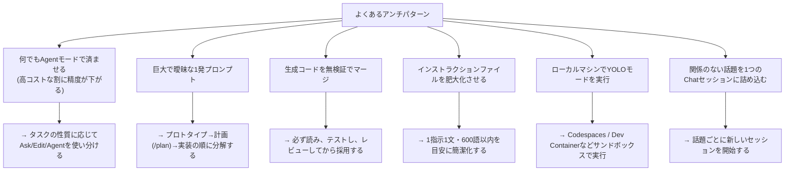

Google Engineering LeadのAddy Osmani氏も、AIが生成したコードは「ロジック・セキュリティ・エッジケースで人間より誤りが多くなりがちである」と指摘した上で、CI(自動テスト・Lint・型チェック)を整備し、失敗ログをAIにそのままフィードバックして反復修正させるワークフローの重要性を述べています。「自分の目でコードが正しく動くのを確認するまでは、動いているとは言えない」という原則は、AIの活用が進むほど重要性を増すとしています。

> 出典: Addy Osmani, *"My LLM coding workflow going into 2026"*, addyosmani.com / Addy Osmani, *"Code Review in the Age of AI"*, Elevate(Substack)

---

## 16. ベストプラクティスチェックリスト

- [ ] タスクの性質に応じてAsk / Edit / Agentモードを使い分けている
- [ ] `.github/copilot-instructions.md` を用意し、ビルド・テスト・コーディング規約を簡潔に明記している
- [ ] エージェント的タスク向けに `AGENTS.md` を用意している(必要な場合)
- [ ] 繰り返すプロンプトは `.prompt.md` 化している
- [ ] チームのナレッジベースをCopilot Spacesとして整理している
- [ ] 複雑な機能追加では「プロトタイプ→計画→Autopilot実装→人間レビュー→Rubber Duckレビュー」の流れを踏んでいる
- [ ] YOLOモード(Allow All)は必ずサンドボックス環境内でのみ使用している
- [ ] Coding AgentへのIssueアサインでは、スコープと受け入れ条件を明確に記述している
- [ ] Copilot Code ReviewのMCP/Agent Skills設定を、チームの内部標準に合わせて整えている
- [ ] MCPで取得した外部情報を「信頼できない入力」として扱っている
- [ ] タスクの難易度に応じてモデルを選び、作業単位内ではモデル・推論レベルを変えていない
- [ ] AIが生成したコードは必ず自分でテスト・レビューしてからマージしている
- [ ] チームのAI Credits使用状況を定期的に可視化・レビューしている

---

## 17. 参考文献

### 公式ドキュメント・GitHub Changelog

- GitHub Docs, *"Adding custom instructions for GitHub Copilot"* — https://docs.github.com/copilot/customizing-copilot/adding-custom-instructions-for-github-copilot
- GitHub Docs, *"Best practices for using GitHub Copilot to work on tasks"* — https://docs.github.com/copilot/how-tos/agents/copilot-coding-agent/best-practices-for-using-copilot-to-work-on-tasks
- GitHub Docs, *"Best practices for GitHub Copilot CLI"* — https://docs.github.com/en/copilot/how-tos/copilot-cli/cli-best-practices
- GitHub Docs, *"Adding custom instructions for GitHub Copilot CLI"* — https://docs.github.com/en/copilot/how-tos/copilot-cli/customize-copilot/add-custom-instructions
- GitHub Docs, *"Asking GitHub Copilot questions in your IDE"* — https://docs.github.com/copilot/using-github-copilot/asking-github-copilot-questions-in-your-ide
- GitHub Docs, *"Using GitHub Copilot code review"* — https://docs.github.com/copilot/using-github-copilot/code-review/using-copilot-code-review
- GitHub Docs, *"Model Context Protocol (MCP) and GitHub Copilot cloud agent"* — https://docs.github.com/en/copilot/concepts/agents/cloud-agent/mcp-and-cloud-agent
- GitHub Docs, *"Supported AI models in GitHub Copilot"* — https://docs.github.com/en/enterprise-cloud@latest/copilot/reference/ai-models/supported-models
- GitHub Docs, *"Hosting of models for GitHub Copilot"* — https://docs.github.com/en/copilot/reference/ai-models/model-hosting
- GitHub Docs, *"Using Claude in GitHub Copilot"* — https://docs.github.com/copilot/using-github-copilot/ai-models/using-claude-in-github-copilot
- GitHub Changelog, *"Copilot coding agent now supports AGENTS.md custom instructions"*(2025-08-28) — https://github.blog/changelog/2025-08-28-copilot-coding-agent-now-supports-agents-md-custom-instructions/
- GitHub Changelog, *"GitHub Copilot coding agent now supports .instructions.md custom instructions"*(2025-07-23) — https://github.blog/changelog/2025-07-23-github-copilot-coding-agent-now-supports-instructions-md-custom-instructions/
- GitHub Changelog, *"Shape Copilot code review around your team"*(2026-06-02) — https://github.blog/changelog/2026-06-02-shape-copilot-code-review-around-your-team/
- GitHub Changelog, *"Copilot code review: Agent skills and MCP now generally available"*(2026-07-29) — https://github.blog/changelog/2026-07-29-copilot-code-review-agent-skills-and-mcp-now-generally-available/
- GitHub Changelog, *"GitHub Copilot CLI: Plan before you build, steer as you go"*(2026-01-21) — https://github.blog/changelog/2026-01-21-github-copilot-cli-plan-before-you-build-steer-as-you-go/
- GitHub Changelog, *"Copilot knowledge bases can now be converted to Copilot Spaces"*(2025-10-17) — https://github.blog/changelog/2025-10-17-copilot-knowledge-bases-can-now-be-converted-to-copilot-spaces/
- GitHub Changelog, *"Sunset notice: Copilot knowledge bases"* — https://github.blog/changelog/2025-08-20-sunset-notice-copilot-knowledge-bases/
- GitHub Changelog, *"Updates to available models in Copilot on web"*(2026-05-20) — https://github.blog/changelog/2026-05-20-updates-to-available-models-in-copilot-on-web/
- VS Code Docs, *"Best practices for using AI in VS Code"* — https://code.visualstudio.com/docs/agents/best-practices
- VS Code Docs, *"Use custom instructions in VS Code"* — https://code.visualstudio.com/docs/agent-customization/custom-instructions
- VS Code Blog, *"Introducing GitHub Copilot agent mode (preview)"* — https://code.visualstudio.com/blogs/2025/02/24/introducing-copilot-agent-mode

### 著名な開発者・企業テクノロジストによる発信

- Burke Holland(GitHub, Technologist), *"The harness is all you need (mostly)"*, The GitHub Blog(2026-07-27) — https://github.blog/ai-and-ml/github-copilot/the-harness-is-all-you-need-mostly/
- Burke Holland, *"Copilot ask, edit, and agent modes: What they do and when to use them"*, The GitHub Blog — https://github.blog/ai-and-ml/github-copilot/copilot-ask-edit-and-agent-modes-what-they-do-and-when-to-use-them/
- Burke Holland, *"Opus 4.5 is going to change everything"*(個人ブログ, 2026-01-05) — https://burkeholland.github.io/posts/opus-4-5-change-everything/
- Simon Willison, *タグ「github-copilot」記事一覧* — https://simonwillison.net/tags/github-copilot/
- Simon Willison, *"The Five Levels: from Spicy Autocomplete to the Dark Factory"*(2026-01-28) — https://simonwillison.net/2026/Jan/28/the-five-levels/
- Addy Osmani(Google, Engineering Lead), *"My LLM coding workflow going into 2026"* — https://addyosmani.com/blog/ai-coding-workflow/
- Addy Osmani, *"Code Review in the Age of AI"*, Elevate(Substack, 2026-01-06) — https://addyo.substack.com/p/code-review-in-the-age-of-ai

### Copilot Spacesとカスタムインストラクション関連

- Microsoft Community Hub, *"Turning GitHub Copilot into a 'Best Practices Coach' with Copilot Spaces + a Markdown Knowledge Base"*(2026-05-06) — https://techcommunity.microsoft.com/blog/azuredevcommunityblog/turning-github-copilot-into-a-%E2%80%9Cbest-practices-coach%E2%80%9D-with-copilot-spaces--a-mark/4511567
- Microsoft Learn, *"Introduction to Copilot Spaces"* — https://learn.microsoft.com/en-us/training/modules/introduction-copilot-spaces/
- The GitHub Blog, *"How to use GitHub Copilot Spaces to debug issues faster"* — https://github.blog/ai-and-ml/github-copilot/how-to-use-github-copilot-spaces-to-debug-issues-faster/
- Zenn, *"GitHub Copilot Chat を使う時のTips(Instruction files, Prompt files)"* — https://zenn.dev/chot/articles/b8b830571ba088
- DEV Community, *"GitHub Copilot Instructions vs Prompts vs Custom Agents vs Skills vs X vs WHY?"* — https://dev.to/pwd9000/github-copilot-instructions-vs-prompts-vs-custom-agents-vs-skills-vs-x-vs-why-339l

### CLI・モデル選定・コスト関連の解説記事

- DEV Community, *"GitHub Copilot CLI: The Complete Developer Guide (2026)"* — https://dev.to/proflead/github-copilot-cli-the-complete-developer-guide-2026-3cjj
- devleader.ca, *"The GitHub Copilot CLI Permission Model: What It Can and Can't Touch"*(2026-07-21) — https://www.devleader.ca/2026/07/21/the-github-copilot-cli-permission-model-what-it-can-and-cant-touch
- fundesk.io, *"GitHub Copilot Agent Mode: The Complete Guide for 2026"* — https://www.fundesk.io/github-copilot-agent-mode-guide-2026
- movarnell.github.io, *"GitHub Copilot Model Guide — Cost, Tasks, and Workflows"* — https://movarnell.github.io/Copilot-Links/models.html
- Tales on Tech, *"GitHub Copilot Best Practices: Your Complete Beginner-Friendly Guide"* — https://www.talesontech.com/blog/github-copilot-best-practices-guide-2026/
- metacto.com, *"GitHub Copilot Best Practices for Engineering Teams (2026)"* — https://www.metacto.com/blogs/github-copilot-best-practices-from-high-performing-teams
- The GitHub Blog, *"Copilot vs. raw API access: What are you actually paying for?"* — https://github.blog/ai-and-ml/github-copilot/copilot-vs-raw-api-access-what-are-you-actually-paying-for/

### セキュリティ関連

- Checkmarx, *"GitHub Copilot Security: Risks, Built-In Controls, and Best Practices"*(2026-05-11) — https://checkmarx.com/learn/ai-security/top-5-github-copilot-security-risks-9-ways-to-mitigate-them/
- CybeDefend, *"GitHub Copilot Security: Risks, Controls, and Best Practices"*(2026-06-10) — https://www.cybedefend.com/en/blog/github-copilot-security-risks-best-practices
- TechStoriess.com, *"AI Agent Security Practices 2026: Prompt Injection, MCP Risks & Data Leaks"*(2026-06-30) — https://www.techstoriess.com/ai-agent-security-practices-2026-prompt-injection-mcp-risks-data-leaks/

---

*本ガイドは2026年7月31日時点で確認できた情報をもとに作成しています。GitHub Copilotは頻繁に機能更新が行われるため、実際の設定・挙動は必ず上記の公式ドキュメントやご利用中のバージョンのin-product helpで最終確認してください。*
