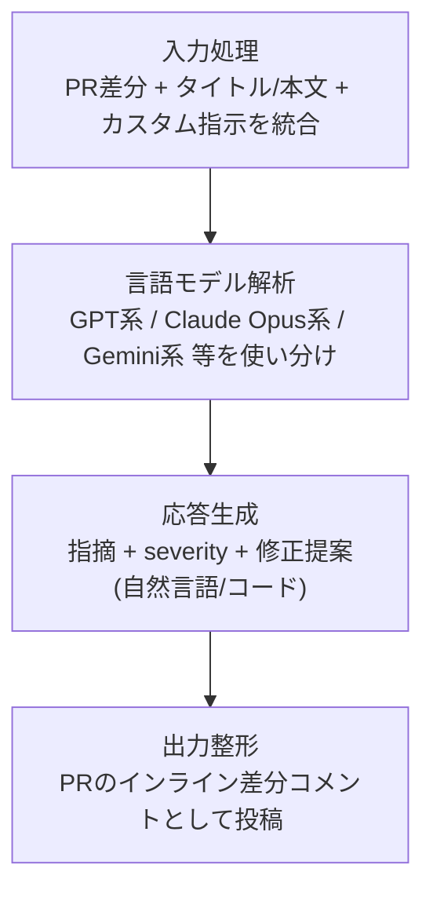
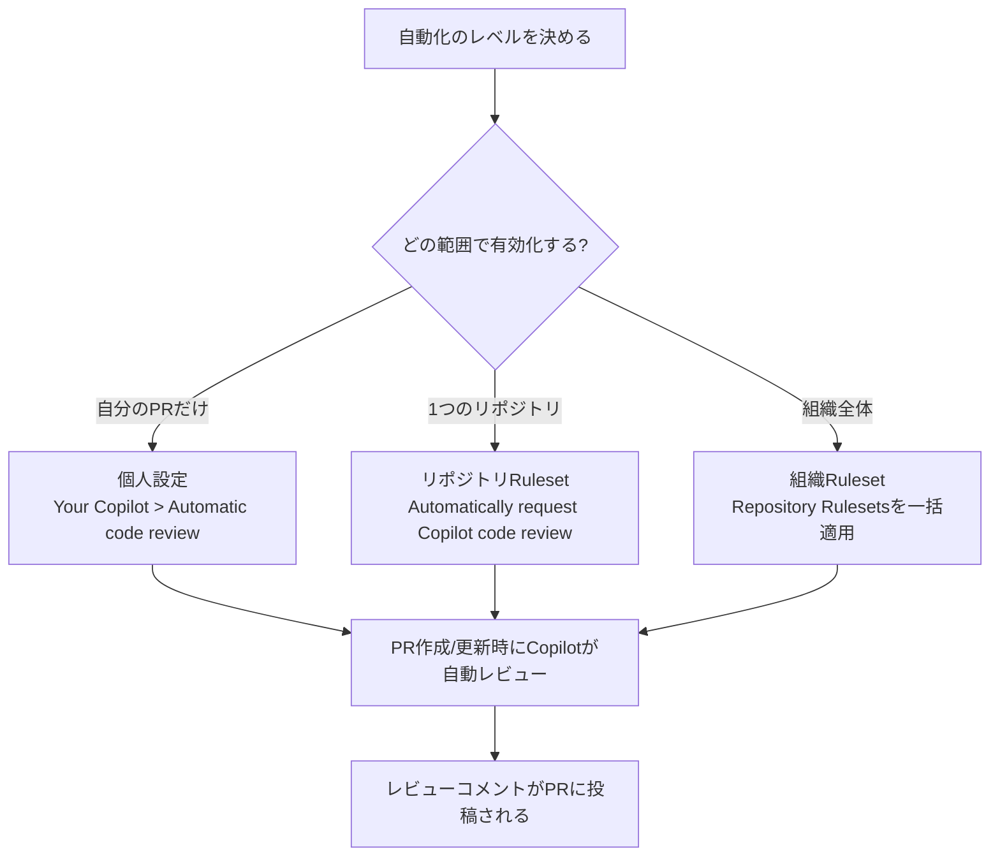
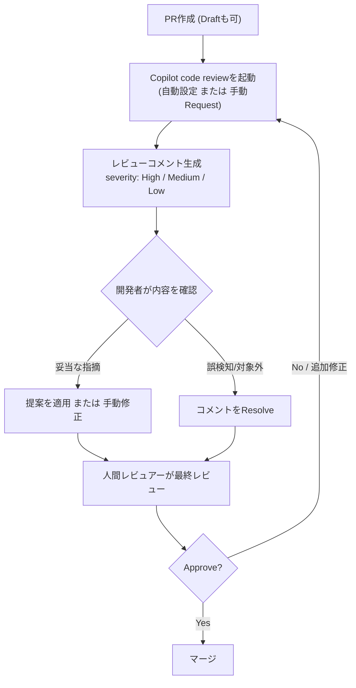
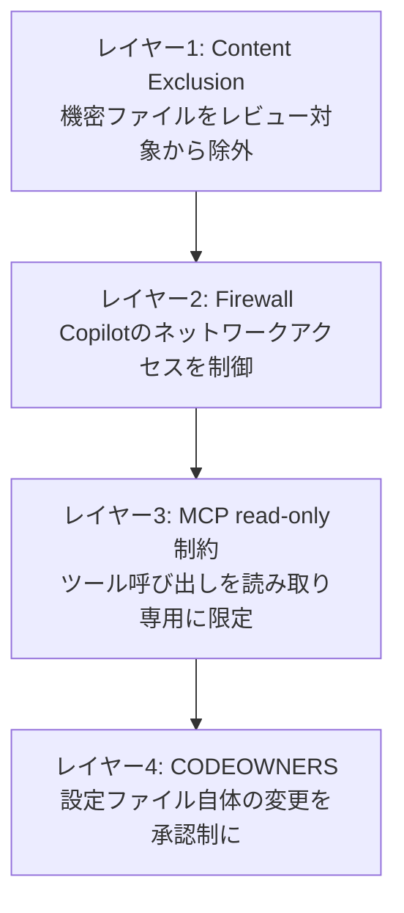
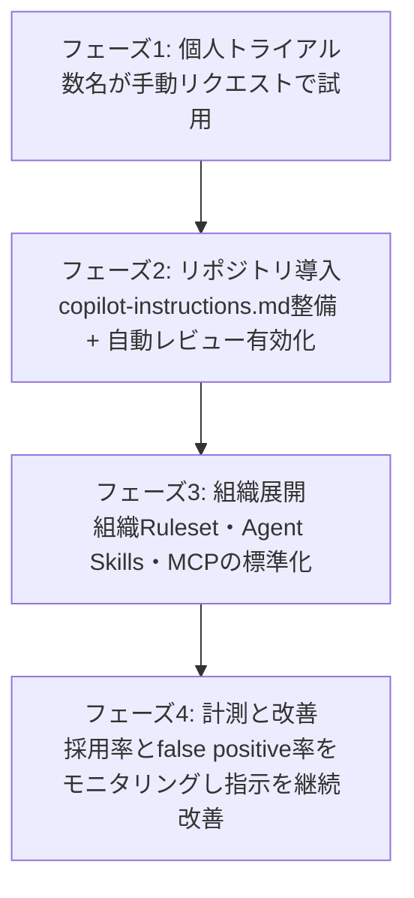

# GitHub Copilot Code Review 実践ガイド ― 中級〜上級エンジニアのためのベストプラクティス

> 本ガイドは2026年8月1日時点の公開情報(公式ドキュメント・GitHub Changelog・著名な開発者や実務者の記事)をもとに作成しています。GitHub Copilot Code Reviewは更新頻度が高い機能のため、実際に導入する際は必ず[GitHub Changelog](https://github.blog/changelog/label/copilot/)で最新の挙動を確認してください。

## 目次

1. [はじめに](#はじめに)
2. [GitHub Copilot Code Reviewとは何か](#github-copilot-code-reviewとは何か)
3. [ステップ1: レビューを起動する](#ステップ1-レビューを起動する)
4. [ステップ2: カスタムインストラクションを設計する](#ステップ2-カスタムインストラクションを設計する)
5. [ステップ3: Agent SkillsとMCPで文脈を拡張する](#ステップ3-agent-skillsとmcpで文脈を拡張する)
6. [ステップ4: レビューコメントを運用する](#ステップ4-レビューコメントを運用する)
7. [ステップ5: 限界を理解し、人間レビューと組み合わせる](#ステップ5-限界を理解し人間レビューと組み合わせる)
8. [ステップ6: セキュリティとガバナンスを固める](#ステップ6-セキュリティとガバナンスを固める)
9. [他のAIコードレビューツールとの位置づけ](#他のaiコードレビューツールとの位置づけ)
10. [チーム導入ロードマップ](#チーム導入ロードマップ)
11. [納品前・運用開始前チェックリスト](#納品前運用開始前チェックリスト)
12. [まとめ](#まとめ)
13. [参考文献・出典](#参考文献出典)

---

## はじめに

GitHub Copilot Code Review(以下Copilot Code Review)は、Pull Request(PR)の差分に対してAIが自動でインラインコメントを付ける機能です。2025年前半に一般提供が始まって以降、2026年に入ってからはエージェント的なアーキテクチャへの刷新、Agent SkillsやMCP(Model Context Protocol)サーバーとの連携、severity(重大度)表示、ネットワークアクセス制御(Firewall)など、短期間で多くの機能が追加されています。

本ガイドは、すでにGitHub Copilotの基本機能(補完・Chat)を使ったことがある中級〜上級者を対象に、Copilot Code Reviewを**チームの開発フローに安全かつ効果的に組み込む**ための考え方と手順をステップバイステップで解説します。個々のボタン操作の解説よりも、「何を」「なぜ」設定するのかという設計判断に重点を置いています。

---

## GitHub Copilot Code Reviewとは何か

### 何をしてくれるのか

Copilot Code ReviewはPRの差分・タイトル・本文・リポジトリのカスタム指示などをまとめてコンテキストとして与えられたLLMが解析し、行単位のインラインコメントとしてPRに投稿する機能です。解析は静的なものであり、実際にコードを実行したりテストを走らせたりはしません。バグや論理エラー、セキュリティ上の懸念、パフォーマンスの問題、言語・フレームワークのベストプラクティス違反などを検出範囲としています<sup>[1][7]</sup>。

レビューを担当するモデルは固定ではなく、GPT系・Claude Opus系・Gemini系など複数のモデルを組み合わせて使う設計になっており、レビューごとに使用されるモデルが変わり得る点も押さえておく必要があります<sup>[17]</sup>。

Copilotのレビューは常に「Comment」種別で投稿され、「Approve」や「Request changes」にはなりません。したがって、必須レビュー(Required reviewers)としてはカウントされず、マージ判定をブロックすることもありません。最終的な承認権限は常に人間のレビュアーに残ります<sup>[2]</sup>。

### 処理の流れ(アーキテクチャ)



2026年6月には、Copilot CLI/SDKに組み込まれているファイル探索ツールをレビュー処理そのものにも使うよう内部実装が刷新され、レビュー品質を維持したままコストが約20%削減されたと報告されています。この変更に合わせて「Medium analysis depth」という解析の深さを選べるパブリックプレビューも展開されています<sup>[11]</sup>。

### 利用できる環境

Copilot Code ReviewはGitHub.com上のPR画面のほか、Visual Studio(17.14以降)やVS Code、CLIなど複数の環境から呼び出せます。GitHub.com上では、PRの「Reviewers」からCopilotを選んで「Request」をクリックするだけで、通常30秒以内にレビューが投稿されます<sup>[2]</sup>。組織のCopilotライセンスを持たないメンバーでも、管理者が許可していればレビューを受け取れる場合があります<sup>[2]</sup>。

---

## ステップ1: レビューを起動する

Copilotにレビューを依頼する方法は「都度手動でリクエストする」か「自動化する」かの二択です。チームで運用するなら、早い段階で自動化の範囲を決めておくことをおすすめします。



- **個人設定**: プロフィールの「Your Copilot」から「Automatic code review」を有効化すると、自分が開いたすべてのPRが自動レビュー対象になります。この設定はCopilot Pro / Pro+ / Maxプランでのみ利用できます<sup>[5]</sup>。
- **リポジトリRuleset**: リポジトリのSettings > Rules > Rulesetsで「Automatically request Copilot code review」を有効化します。「Review new pushes」を有効にすると新しいコミットのたびに再レビューされ、「Review draft pull requests」を有効にするとドラフトPRの段階からフィードバックを得られます<sup>[5]</sup>。2025年9月からは、この自動レビュー設定が「Require a pull request before merging」の付随設定ではなく、独立したルールとして設定できるようになったため、マージ保護(ブランチ保護)を強制せずに自動レビューだけを導入することも可能です<sup>[14]</sup>。
- **組織/Enterpriseレベル**: Enterprise管理者は「AI controls」からCopilot Code Reviewを「Enabled everywhere」または「Let organizations decide」として一括制御でき、組織Rulesetsを使えば多数のリポジトリに同じ自動レビュー方針を適用できます<sup>[6]</sup>。ただし、Push毎・ドラフト時のレビューを有効にするほど開発者への通知は増えるため、ノイズとのバランスを意識する必要があります<sup>[6]</sup>。

> **実務Tips**: いきなり組織全体に自動レビューを強制するのではなく、まず1〜2個のリポジトリでPR作成時のみの自動レビューから始め、チームの反応(コメントの採用率・却下率)を見てからPush毎レビューやドラフトレビューを追加する、という段階導入が推奨されます<sup>[3][19]</sup>。

---

## ステップ2: カスタムインストラクションを設計する

Copilot Code Reviewは、そのままでも一般的なコーディング標準に基づいてレビューしますが、真価を発揮するのはリポジトリ固有の文脈(意図的な設計判断、重点的に見てほしい箇所、テストや実装に関するチームの基準など)を教えたときです<sup>[25]</sup>。

### 3種類の指示ファイル

| ファイル | 適用範囲 | 主な用途 |
|---|---|---|
| `.github/copilot-instructions.md` | リポジトリ全体 | コーディング規約・レビュー観点・組織横断の期待値など、常に考慮してほしい内容 |
| `.github/instructions/*.instructions.md`(`applyTo`フロントマター付き) | 指定したパス/言語のみ | 特定言語・特定ディレクトリだけに適用したいルール(例: フロントエンドのアクセシビリティ、Pythonの型ヒント等) |
| `AGENTS.md`(リポジトリルート) | リポジトリ全体 | プロジェクトの構造や「意図的にこうなっている」文脈など、レビュー品質を上げるための背景情報 |

さらに、2026年に入ってからは`REVIEW.md`・`GEMINI.md`・`CLAUDE.md`といった他のAIツール向けの指示ファイルも自動的に読み込まれるようになり、チームがどこにガイドラインを書いていても一貫して反映されるようになりました<sup>[10]</sup>。以前はCopilot Enterprise向けに「Coding guidelines」というUIベースの別機能がプライベートプレビューで提供されていましたが、この`*.instructions.md`ベースの仕組みに統合される形で段階的に廃止されています<sup>[15]</sup>。

`*.instructions.md`ファイルの例:

```markdown
---
applyTo:
  - "webapp/src/**"
  - "ui/components/**"
---
アクセシビリティ(ARIA属性、フォーカス管理)を重視してください。
デザイントークンの利用を優先してください。
`legacy/`配下の非推奨コンポーネントの利用を検出したら指摘してください。
```

特定のファイルをCopilot code reviewだけ、あるいはCopilot cloud agentだけに読ませたくない場合は、フロントマターに`excludeAgent: code-review`または`excludeAgent: cloud-agent`を指定することで、そのファイルを対象エージェントから除外できます<sup>[31]</sup>。

### 指示ファイルをどこに書くか判断する

| 目的 | 使うファイル | 備考 |
|---|---|---|
| リポジトリ全体で常に守ってほしい規約を書きたい | `copilot-instructions.md` | 最初に書くべき基本ファイル |
| 特定言語・特定ディレクトリだけにルールを絞りたい | `*.instructions.md` + `applyTo` | 言語ごとのルールを`copilot-instructions.md`から移すと精度が上がる |
| Copilot code reviewとcloud agentで挙動を変えたい | `excludeAgent`フロントマター | 片方のエージェントにだけ読ませたい指示に使う |
| チーム独自のツールや社内標準を反映したい | `.github/skills/`配下の`SKILL.md` | レビュー専用にするなら`code-review`のようなレビュー用途とわかる名前にする |
| 外部システム(課題管理・ドキュメント等)の情報を参照したい | リポジトリのMCPサーバー設定 | ツール呼び出しは読み取り専用に限定される |

### 効果的な書き方

GitHub自身が公開しているガイドによれば、Copilot Code Reviewの指示ファイルは非決定的(non-deterministic)であり、すべての指示に毎回100%従うわけではありません。そのため、以下のような書き方が推奨されています<sup>[3][16]</sup>。

- 最小限の指示から始め、実際のレビュー結果を見ながら段階的に追加する。
- 見出しと箇条書きで構造化し、長い説明文ではなく短い命令形の指示にする。
- 1つの指示ファイルはおよそ1,000行を超えないようにする。それ以上長くなると、指示の遵守精度が落ちる傾向がある<sup>[3]</sup>。
- 抽象的な指示より、具体例を添えた指示のほうが伝わりやすい(例:「良いコードを書いて」ではなく「この関数のように早期returnでネストを浅くして」)。
- どうしても100%守らせたいルール(セキュリティの必須要件など)は、Copilotへの指示だけに頼らず、Linterや静的解析ツールなど決定的な仕組みでも担保する<sup>[19]</sup>。

2026年6月には、`copilot-instructions.md`・`*.instructions.md`の合計文字数に課されていた4,000文字の上限が撤廃され、より柔軟にカスタマイズできるようになりました<sup>[13]</sup>。また、組織レベルの指示もCopilot Code Reviewが考慮するようになっています<sup>[15]</sup>。

---

## ステップ3: Agent SkillsとMCPで文脈を拡張する

2026年7月29日、Copilot Code ReviewにおけるAgent SkillsとMCPサーバー連携が、Copilot Pro・Pro+・Business・Enterpriseの全有償プランで一般提供(GA)になりました<sup>[9]</sup>。これはMCPの2026-07-28版仕様が正式リリースされた翌日というタイミングでもあり、MCP対応が「アーリーアダプター向けの機能」から「プラン選定時のチェック項目」へと位置づけを変えた出来事として注目されています<sup>[14]</sup>。

- **Agent Skills**: `.github/skills/`配下にスキル専用のディレクトリを作り、その中に`SKILL.md`を置くことで、社内ツールやコーディング標準に関する文脈をレビュー時に注入できます。レビュー用途であることが伝わるよう、ディレクトリ名は`code-review`のようにレビュー指向の名前にすることが推奨されています<sup>[12]</sup>。
- **MCPサーバー**: リポジトリのCopilot設定からMCPサーバーを追加すると、課題管理システムやドキュメント、サービスカタログなど外部プラットフォームの情報をレビューに取り込めます。GitHub MCPサーバーとPlaywright MCPサーバーはデフォルトで有効です<sup>[12]</sup>。Copilot Code Reviewが行うMCPツール呼び出しはすべて読み取り専用に制限されており、Copilot cloud agent用に設定済みのMCP設定は自動的にCode Reviewにも引き継がれます<sup>[9]</sup>。
- **利用状況の可視化**: Agent SkillsやMCPの文脈を使って生成されたコメントには、その旨を示すアトリビューションが付与されるため、どのスキル・MCPサーバーが実際に使われたかをレビューコメント下部やセッションログから確認できます<sup>[9][12]</sup>。
- PR本文に課題番号やインシデントIDなどMCP経由で参照できる識別子を明記すると、Copilotがその文脈をより積極的に利用する傾向があります<sup>[12]</sup>。

対応言語の壁を越えたい場合、Web検索ツールを備えたMCPサーバーやPlaywright経由で最新のセキュリティ勧告・イディオムを調べさせる`.agent.md`レビュアーを自作し、根拠となる情報源を引用させるという応用例も紹介されています<sup>[18]</sup>。

---

## ステップ4: レビューコメントを運用する

### コメントの構造

Copilotのレビューコメントは通常、問題点の説明・重大度・(可能な場合は)ワンクリックで適用できる修正提案という構成になっています<sup>[6]</sup>。2026年5月には、似た指摘をまとめてグループ化する機能と、severity(重大度)ラベルがコメントの右上に表示される機能が追加され、大規模PRでもどこから対応すべきか判断しやすくなりました<sup>[7]</sup>。

| Severity | 目安 | 推奨対応 |
|---|---|---|
| High | バグ・セキュリティ上の懸念など、放置するとインシデントにつながりうる指摘 | マージ前に必ず精査し、対応または明示的な却下理由を残す |
| Medium | 保守性・パフォーマンスなど、後々の負債になりうる指摘 | 可能な範囲で対応し、対応しない場合はコメントで理由を残す |
| Low | スタイルや軽微な改善提案 | チームの余力に応じて対応。無理に全件消化しようとしない |

### コメントへの対応フロー



Copilotの提案は1件ずつ、あるいは複数まとめて1つのコミットとして適用できます。自分で修正するのではなく、提案の実装ごとCopilot cloud agentに任せることも可能です<sup>[6]</sup>。Copilotのレビューコメントは人間のレビューコメントと同様に、リアクションを付けたり返信したり、Resolve/Hideしたりできますが、Copilotへの返信コメントはCopilot自身には見えず、Copilotから返信が来ることもない点は覚えておく必要があります<sup>[2]</sup>。

---

## ステップ5: 限界を理解し、人間レビューと組み合わせる

GitHub自身の「Responsible use」ドキュメントは、Copilot Code Reviewの既知の弱点として、見逃し(false negative)・誤検知(false positive)・不正確な修正提案・学習データに起因するバイアスを明記しており、セキュリティ上のすべての問題を検出できるわけではなく、脆弱性を含むコードを提案する可能性もあるため過信すべきではないとしています<sup>[7]</sup>。

| 限界 | 内容 |
|---|---|
| 誤検知(false positive) | 実務者の報告では、Copilotのレビューコメントのうちおおよそ15〜25%が誤りか、的外れか、曖昧すぎて役に立たないケースだとされています<sup>[17]</sup>。 |
| 見逃し(false negative) | 権限昇格や設計レベルのセキュリティ上の欠陥など、ファイルをまたぐ文脈が必要な問題を見逃す傾向が指摘されています<sup>[18]</sup>。 |
| 対応言語 | 公式にサポートされる出力言語は英語のみです<sup>[7]</sup>。日本語での応答は`copilot-instructions.md`などで明示的に指示できますが、公式サポート対象外である点に注意してください。 |
| 学習しない | 特定のレビューコメントを繰り返し却下しても、Copilotがその傾向を学習して次回から抑制することはありません。同種の指摘を出し続ける前提でチーム運用を設計する必要があります<sup>[17]</sup>。 |
| 静的解析のみ | コードを実際に実行したりテストを走らせたりはしないため、実行時にしか顕在化しない問題は検出対象外です<sup>[1]</sup>。 |
| マージをブロックしない | 「Comment」レビューのみのため、必須承認としてカウントされず、マージの可否は人間の判断に委ねられます<sup>[2]</sup>。 |

ある分析記事によれば、Copilot Code Reviewが実際にフィードバックを返すのはPRレビューの約71%で、フィードバックがある場合の平均コメント数はおよそ5.1件、残り約29%では「特に指摘なし」として静かに終わるとされています。指摘があれば何でも出す方針ではなく、価値がないと判断すればコメントしない設計は、開発者がコメントを読み続けてくれるための工夫だと分析されています<sup>[23]</sup>。

### チーム運用上の推奨事項

- **却下してよい文化をつくる**: 誤検知が一定割合発生する前提に立ち、「Copilotのコメントを却下するのは普通のこと」という規範をチームで共有します<sup>[17]</sup>。
- **PRは小さく保つ**: 2,000行規模のPRをレビューで救ってくれることは期待せず、人間にとってもAIにとっても妥当な粒度までPRを分割することが、そもそもの前提として推奨されています<sup>[22]</sup>。
- **必須要件はLinter/静的解析で担保する**: セキュリティ上絶対に守らせたいルールは、Copilotへの指示だけでなく決定的なツール(SAST、Linter、Secret Scanning等)でも二重に担保します<sup>[17][19]</sup>。
- **人間レビューを省略しない**: Copilotのレビューは「一次スクリーニング」であり、最終承認・アーキテクチャ判断・ドメイン知識が必要な判断は引き続き人間が担います<sup>[3][19]</sup>。

---

## ステップ6: セキュリティとガバナンスを固める

### Content Exclusion(コンテンツ除外)の適用範囲を正しく理解する

リポジトリ管理者はContent Exclusion機能を使って、機密ファイル(認証情報、課金データ、独自アルゴリズム等)をCopilotの補完・Chat・Code Reviewの対象から除外できます。除外されたファイルはCopilot Code Reviewでもレビュー対象になりません<sup>[8][58]</sup>。

ここで重要な注意点があります。GitHub公式ドキュメントおよびGitHub社員による解説記事の双方が指摘しているとおり、**Content ExclusionはCopilot CLI、Copilot cloud agent、およびIDEのAgentモードには適用されません**<sup>[8][20]</sup>。これらのエージェント的な機能はツール呼び出しでファイルを直接読み書きできるため、リポジトリレベルの除外設定をすり抜けて除外対象ファイルの内容にアクセスできてしまう可能性があります。Code Reviewだけを使っている分には保護されますが、同じリポジトリでCLIやcloud agentも使っているチームは、この境界を正しく認識しておく必要があります<sup>[20]</sup>。

### Copilot Code Review自体のセキュリティ制御



- **Firewall**: 2026年7月17日のアップデートで、Copilot Code Review用のネットワークアクセス制御(Firewall)がCopilot cloud agentとは独立して設定できるようになりました。デフォルトで全リポジトリに対して有効です。セルフホストランナーでは現時点でFirewallがサポートされていない点に注意してください<sup>[10]</sup>。
- **MCP read-only制約**: 前述のとおり、Code ReviewからのMCPツール呼び出しは読み取り専用に限定されています<sup>[9]</sup>。
- **CODEOWNERS**: `copilot-instructions.md`・`*.instructions.md`・`.github/skills/`・MCP設定など、レビューの挙動を左右する設定ファイル自体を誰が変更できるかも重要なガバナンス項目です。これらのパスにCODEOWNERSを設定し、変更に承認を必須にすることを推奨します(Sizikov氏のブログで紹介されているエージェント一般向けの多層防御の考え方を、Code Review用の設定ファイル保護にも応用したものです)<sup>[20]</sup>。
- **カスタム実行環境**: `.github/workflows/copilot-code-review.yml`を使うと、依存関係のインストールやツールのセットアップなど、Copilot Code Reviewの実行環境自体をリポジトリ単位で設定できます。ランナーの種類も組織のCopilot設定から独立して構成可能です<sup>[10][9]</sup>。

### エンタープライズでの一括ガバナンス

Enterprise管理者は「AI controls」からCopilot Code Reviewを機能単位で有効/無効化でき、自動レビューを組織横断で強制することも、各組織の裁量に委ねることもできます。標準を一貫させたい場合は自動レビューポリシーを有効にしますが、Push毎・ドラフト時のレビューを増やすほど開発者に届く通知も増える点はトレードオフとして意識してください<sup>[6]</sup>。

---

## 他のAIコードレビューツールとの位置づけ

Copilot Code Reviewは「GitHubエコシステムに完全統合されたゼロフリクションな選択肢」として評価される一方、専業のAIコードレビューツールと比較すると精度や機能面で見劣りするという評価も複数の比較記事で共通しています。

| 観点 | GitHub Copilot Code Review | 専業レビューツール(CodeRabbit等) |
|---|---|---|
| 導入のしやすさ | Copilotを契約していればレビュー機能も含まれており追加費用なしで開始可能<sup>[21]</sup> | 別途契約・別料金が必要 |
| 対応プラットフォーム | GitHubのみ<sup>[21]</sup> | GitHub・GitLab・Bitbucket・Azure DevOps等、複数プラットフォームに対応する製品もある<sup>[21]</sup> |
| 精度傾向 | ある独立ベンチマークでは適合率(precision)がやや高く、再現率(recall)は低めと報告されている(検出は少ないが誤りも少ない)<sup>[21]</sup> | 同ベンチマークでは再現率が高めで、より多くの問題を検出する一方、誤検知もやや増える傾向<sup>[21]</sup> |
| カスタマイズ性 | `copilot-instructions.md`等による指示のカスタマイズが可能 | 学習型のフィルタリングなど、より高度なノイズ抑制機構を持つ製品もある<sup>[24]</sup> |

2026年2月には、DeepMind・Anthropic・Metaの研究者が設立した研究機関Martianが、レビューツールを販売する立場にない独立機関として初めてAIコードレビューエージェントのベンチマークを公開し、ベンダー自身が「自社が勝つベンチマーク」を発表し合う状況に一石を投じたと報じられています<sup>[21]</sup>。

**実務上の指針**としては、すでにGitHubとCopilotのエコシステムにいるチームは、まずCopilot Code Reviewを標準の一次レビューとして導入し、自分たちのコードベースで十分な検出力があるかを評価したうえで、ギャップが許容できない場合に専業ツールを追加するという段階的なアプローチが多くの比較記事で共通して推奨されています<sup>[1][21]</sup>。

---

## チーム導入ロードマップ



各フェーズで押さえるべきポイント:

1. **個人トライアル**: 数名の開発者が手動でレビューをリクエストし、指摘の質・自分たちのコードベースとの相性を確認します。
2. **リポジトリ導入**: `copilot-instructions.md`を最小構成で用意し、PR作成時のみの自動レビューを有効化します。過剰な指示を書かず、実際のレビュー結果を見ながら反復的に育てます<sup>[3]</sup>。
3. **組織展開**: 複数リポジトリに展開する段階で、Agent SkillsやMCPサーバー、Firewall・Content Exclusion・CODEOWNERSといったガバナンス設定を標準化します。
4. **計測と改善**: コメントの採用率・却下率、レビューにかかる時間、誤検知の傾向などを定期的にモニタリングし、指示ファイルを継続的にチューニングします<sup>[3][19]</sup>。

---

## 納品前・運用開始前チェックリスト

- [ ] `copilot-instructions.md`はリポジトリ全体の規約に絞り、言語・パス固有のルールは`*.instructions.md`へ分離した
- [ ] 各指示ファイルはおよそ1,000行以内に収まっている
- [ ] レビュー専用のAgent Skillには`code-review`のようなレビュー用途とわかる名前を付けた
- [ ] MCPサーバー連携が必要な場合、「Allow Copilot to use MCP tools when reviewing pull requests」の設定を確認した
- [ ] 自動レビューの範囲(個人/リポジトリ/組織)と、Push毎・ドラフト時レビューの要否を決定した
- [ ] 機密ファイルにContent Exclusionを設定し、かつそれがCLI/cloud agent/Agentモードには適用されないことをチームに周知した
- [ ] Firewall(ネットワークアクセス制御)が意図した設定になっていることを確認した
- [ ] `copilot-instructions.md`・`.github/skills/`・MCP設定にCODEOWNERSを設定し、無断変更を防いだ
- [ ] 「Copilotのコメントを却下してよい」というチーム規範を共有した
- [ ] セキュリティ上の必須要件はLinter/SAST等の決定的なツールでも別途担保した
- [ ] Copilotのレビューは「Comment」のみでマージをブロックしないことをチームに周知した
- [ ] 導入後の効果測定(採用率・却下率・レビュー時間)の方法を決めた

---

## まとめ

GitHub Copilot Code Reviewは、GitHubのPRワークフローに深く統合された「一次レビュアー」として、明白なミスの早期発見や人間レビュアーの負荷軽減に貢献するツールです。ただし、誤検知や見逃しが一定割合存在すること、学習しないこと、静的解析にとどまることなど、既知の限界を理解したうえで、カスタムインストラクション・Agent Skills・MCP・セキュリティ設定を丁寧に設計し、人間レビューと役割分担することが、実務で成果を出すための鍵になります。

---

## 参考文献・出典

### 公式ドキュメント(GitHub Docs)

1. [Best practices for using GitHub Copilot](https://docs.github.com/en/copilot/get-started/best-practices)
2. [Using GitHub Copilot code review](https://docs.github.com/copilot/using-github-copilot/code-review/using-copilot-code-review)
3. [Using custom instructions to unlock the power of Copilot code review](https://docs.github.com/en/copilot/tutorials/customize-code-review)
4. [Adding repository custom instructions for GitHub Copilot](https://docs.github.com/copilot/customizing-copilot/adding-custom-instructions-for-github-copilot)
5. [Configuring automatic code review by GitHub Copilot](https://docs.github.com/en/copilot/how-tos/copilot-on-github/set-up-copilot/configure-automatic-review)
6. [Enabling GitHub Copilot code review in your enterprise](https://docs.github.com/en/copilot/how-tos/administer-copilot/manage-for-enterprise/manage-agents/enable-copilot-code-review)
7. [Responsible use of GitHub Copilot code review](https://docs.github.com/copilot/responsible-use-of-github-copilot-features/responsible-use-of-github-copilot-code-review)
8. [Excluding content from GitHub Copilot](https://docs.github.com/en/copilot/how-tos/configure-content-exclusion/exclude-content-from-copilot)
31. [Adding custom instructions for GitHub Copilot CLI(excludeAgent)](https://docs.github.com/en/copilot/how-tos/copilot-cli/customize-copilot/add-custom-instructions)
58. [Testing changes to content exclusions in your IDE](https://docs.github.com/zh/enterprise-cloud@latest/copilot/managing-copilot/managing-github-copilot-in-your-organization/managing-github-copilot-features-in-your-organization/testing-changes-to-content-exclusions-in-your-ide)

### 公式ブログ・Changelog(GitHub Blog)

9. [Copilot code review: Agent skills and MCP now generally available](https://github.blog/changelog/2026-07-29-copilot-code-review-agent-skills-and-mcp-now-generally-available/)(2026年7月29日)
10. [Copilot code review: Customization and configurability improvements](https://github.blog/changelog/2026-07-17-copilot-code-review-customization-and-configurability-improvements/)(2026年7月17日)
11. [Copilot code review: Analysis depth and efficiency updates](https://github.blog/changelog/2026-06-25-copilot-code-review-analysis-depth-and-efficiency-updates/)(2026年6月25日)
12. [Using GitHub Copilot code review(GitHub Docs, MCP/Agent Skills設定詳細)](https://docs.github.com/copilot/using-github-copilot/code-review/using-copilot-code-review)
13. [Copilot code review: New configurations and controls](https://github.blog/changelog/2026-06-12-copilot-code-review-new-configurations-and-controls/)(2026年6月12日)
14. [MCP Adoption Week: Copilot Code Review Goes GA](https://www.digitalapplied.com/blog/mcp-adoption-week-copilot-code-review-ga)(2026年7月、GA日の経緯を分析した記事)
15. [Copilot code review: Path-scoped custom instruction file support](https://github.blog/changelog/2025-09-03-copilot-code-review-path-scoped-custom-instruction-file-support/)(2025年9月3日)
16. [Unlocking the full power of Copilot code review: Master your instructions files](https://github.blog/ai-and-ml/github-copilot/unlocking-the-full-power-of-copilot-code-review-master-your-instructions-files/)(GitHub公式ブログ、2026年4月17日)

### コミュニティ・実務者による記事

17. Rahul Singh, [GitHub Copilot Code Review: Complete Guide (2026)](https://dev.to/rahulxsingh/github-copilot-code-review-complete-guide-2026-255h), DEV Community(2026年4月2日)
18. pwd9000, [Mastering Code Reviews with GitHub Copilot: The Definitive Guide](https://dev.to/pwd9000/mastering-code-reviews-with-github-copilot-the-definitive-guide-3nfp), DEV Community(2026年5月27日)
19. Mrinal Maheshwari, [GitHub Copilot Code Review: Guidelines, Best Practices, and How to Integrate It into Your PR Workflow](https://blog.mrinalmaheshwari.com/github-copilot-code-review-guidelines-best-practices-and-how-to-integrate-it-into-your-pr-b4518073b4c9)(2026年1月12日)
20. Anton Sizikov(GitHub社員), [Copilot Content Exclusions: Four Layers of Defense](https://blog.cloud-eng.nl/2026/03/13/copilot-content-exclusions-four-layers/)(2026年3月13日)
21. [10 Best AI Code Review Tools in 2026 (Ranked by Independent Benchmark)](https://codeant.ai/blogs/best-ai-code-review-tools), CodeAnt AI(Martianによる独立ベンチマークの紹介を含む)
22. [GitHub Copilot Code Review in 2026: What It Does and Misses](https://refacto.ai/blog/github-copilot-code-review-in-2026-what-it-does-well-and-where-it-falls-short/)(2026年4月10日)
23. 同上(GitHubのレビュー実施率・平均コメント数に関する分析部分)
24. [CodeRabbit vs GitHub Copilot Code Review (2026): Benchmarks, Pricing, Features](https://www.morphllm.com/comparisons/coderabbit-vs-copilot)(2026年3月14日)
25. Simon Willison, [Posts tagged "github-copilot"](https://simonwillison.net/tags/github-copilot/) — GitHub Copilotのエージェント化やモデル変更を継続的に追跡している著名な開発者のブログ。Copilot CLIやプラン変更などの一次情報源へのリンク集としても有用です。

> 注: 上記のうち14・17〜24は第三者(比較サイト・個人ブログ)による分析記事であり、数値や評価は執筆時点のものです。導入判断の際は必ず一次情報である公式ドキュメント(1〜13、16、31、58)と最新のGitHub Changelogを優先して確認してください。
