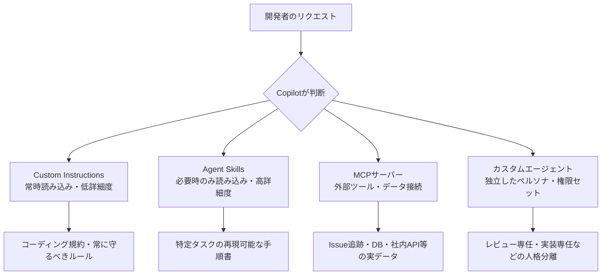
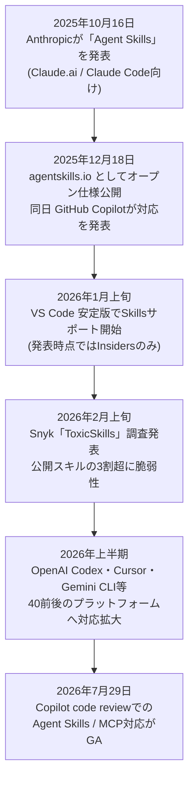
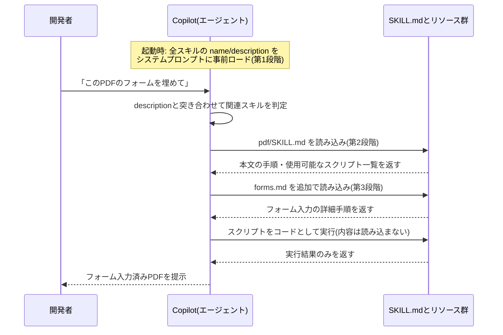
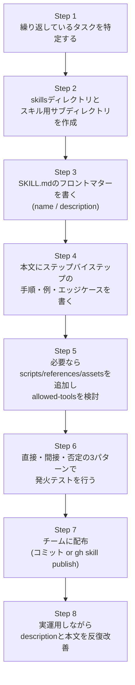
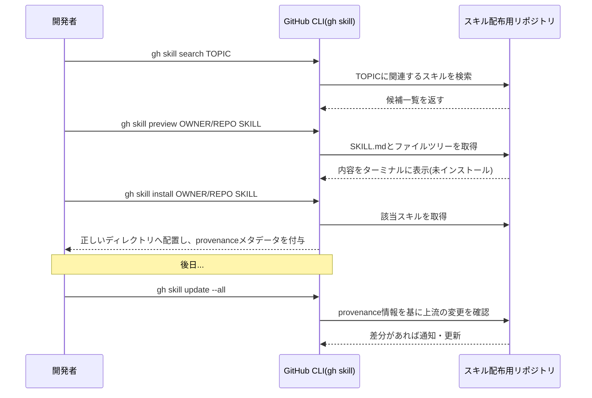
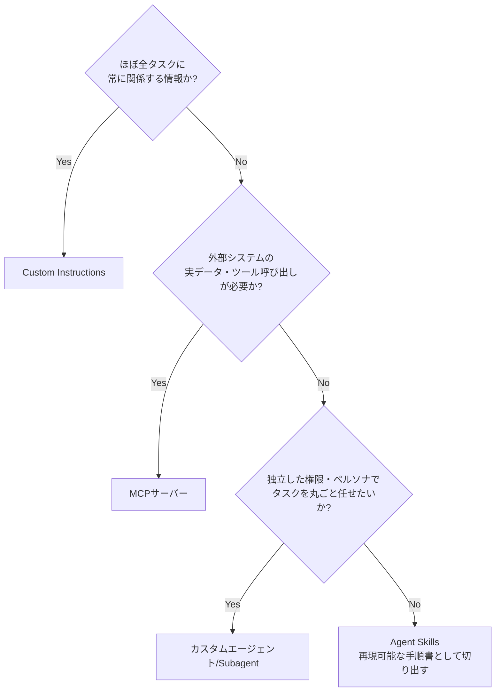
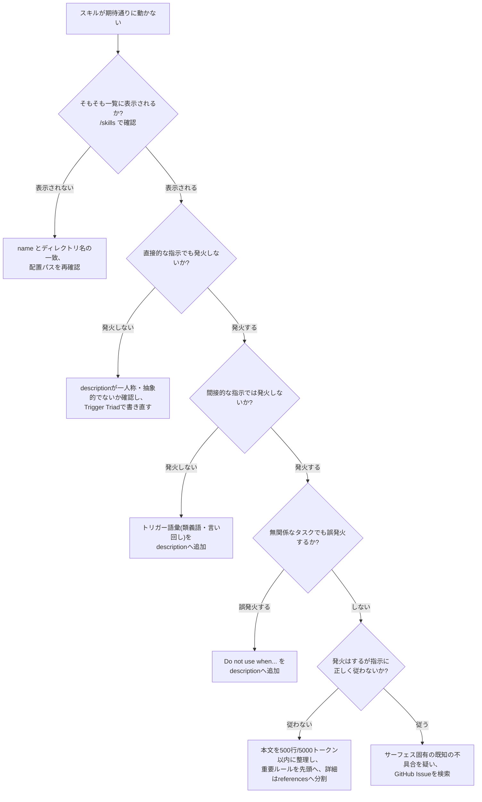

# GitHub Copilot Agent Skills 実践ガイド ― SKILL.md 完全仕様・3段階ローディング・テンプレート集・トラブルシューティング

> 対象読者: GitHub Copilot(VS Code / Visual Studio / JetBrains / Copilot CLI / Copilot cloud agent / Copilot code review)を業務で使い込んでいる中級〜上級エンジニア。Custom Instructions や MCP はひと通り使ったことがあり、次のステップとして「再利用可能な手順知識」を SKILL.md として整備したい人を想定している。

---

## このガイドについて

GitHub Copilot は 2025年12月18日、Agent Skills(SKILL.md)への対応を発表した。これはもともと Anthropic が Claude 向けに 2025年10月16日に発表した仕組みで、同年12月18日に `agentskills.io` でベンダー中立のオープン仕様として公開されたものである。現在は GitHub Copilot・OpenAI Codex・Cursor・Gemini CLI・Snowflake Cortex Code など 40 前後のプラットフォームが同一フォーマットをサポートしており、「一度書けば複数のコーディングエージェントで動く」共通言語になりつつある。

本ガイドは次の5点を柱に、ステップバイステップで解説する。

1. **フロントマター完全仕様** ― `name` / `description` / `license` / `compatibility` / `metadata` / `allowed-tools` の全フィールド
2. **3段階ローディング(Progressive Disclosure)** ― Discovery / Activation / Execution という3段階の設計思想とコンテキストコスト
3. **ステップバイステップ作成** ― 何もない状態から実運用可能なスキルを作るまでの手順
4. **実践テンプレート集** ― そのままコピーして使える5種類のテンプレート
5. **トラブルシューティング** ― 実際に GitHub / VS Code の Issue で報告された不具合を基にした症状別の対処表

ASCII アートによる図解は使用せず、フローチャートは Mermaid、構造の一覧は Markdown の表・箇条書きで統一する。

---

## 1. Agent Skills とは何か

### 1.1 定義

Agent Skills(エージェントスキル)は、指示・スクリプト・参考資料をまとめたフォルダであり、Copilot のようなコーディングエージェントがタスクに関連すると判断したときにだけ動的に読み込む仕組みである。GitHub の公式ドキュメントは次のように説明している。

> Agent skills are folders of instructions, scripts, and resources that Copilot can load when relevant to improve its performance in specialized tasks.

Anthropic のエンジニアリングブログでは、スキルを作ることを「新入社員向けのオンボーディングガイドを作ること」に例えている。ユースケースごとに専用のエージェントを個別に構築するのではなく、手順知識(procedural knowledge)を再利用可能な部品として切り出し、汎用エージェントに後から着せていくイメージである。

### 1.2 なぜ生まれたのか

Custom Instructions(`.github/copilot-instructions.md`)は「このリポジトリではこう書く」という常時読み込みのベースラインには向いているが、全タスクに常時注入されるためコンテキストを消費し続ける。一方 MCP はサーバー経由で外部ツールやデータにアクセスする仕組みであり、手順そのもの(「PDFのフォームはこう埋める」「障害調査はこの順で行う」)を教えるのには向いていない。Agent Skills はこの間を埋める第三の手段として設計された。

### 1.3 エコシステムにおける位置づけ

Copilot をカスタマイズする手段は大きく4種類あり、それぞれ役割が異なる。



GitHub 公式ドキュメントも「Custom Instructions はほぼ全タスクに関係する簡潔な情報に、Skills は関係するときだけ参照すべき詳細な情報に使う」ことを推奨している。

---

## 2. 標準化の経緯とタイムライン

Agent Skills が単一ベンダーの機能からオープン標準になるまでの流れを押さえておくと、なぜ「GitHub CopilotのSKILL.md」という言い方が成立するのかが理解しやすくなる。



ポイントは、Anthropic が仕様を Apache 2.0(コード)/ CC-BY-4.0(ドキュメント)で公開し、Agentic AI Foundation が仕様のスチュワードとなったことで、「Claude用の機能」から「業界横断のフォーマット」に性格が変わった点である。GitHub Copilot がそのまま `.claude/skills` ディレクトリのスキルを自動的に拾えるのも、この仕様の共通化が背景にある。

---

## 3. 3段階ローディング(Progressive Disclosure)完全解説

### 3.1 各社の呼称比較

3段階ローディングは提唱元や実装によって呼び方が微妙に異なる。混乱を避けるため対応表を示す。

| 段階 | agentskills.io / Anthropic | GitHub Copilot文脈 | Microsoft Agent Framework | 読み込まれるもの | 目安コスト |
|---|---|---|---|---|---|
| 第1段階 | Discovery(発見) | 起動時のメタデータ注入 | Advertise(広告) | `name` + `description` のみ、全スキル分 | 約100トークン/スキル |
| 第2段階 | Activation(活性化) | スキル読み込み | Load(読み込み) | `SKILL.md` 本文全体 | 5,000トークン未満を推奨 |
| 第3段階 | Execution(実行) | リソース参照 | Read resources(資源読み込み) | `scripts/` `references/` `assets/` 配下のファイル | 必要になった分だけ |

Microsoft Agent Framework のドキュメントでは `load_skill` ツールや `read_skill_resource` ツールという形で、この2段階目・3段階目の読み込みを明示的なツール呼び出しとして実装している例もある。呼称は違えど、**「まず名前と説明だけを全件読む」→「関連しそうなものだけ本文を読む」→「本当に必要になったファイルだけをさらに読む」**という3層構造は共通である。

### 3.2 コンテキストウィンドウでの動き

Anthropic のエンジニアリングブログが示す PDF スキルの例を基に、Copilot がスキルを起動してから実行に至るまでのシーケンスを図示する。



ここで重要なのは、Claude(あるいは Copilot の基盤モデル)がスクリプトを「コードとして実行」する場合、そのスクリプトのソースコード自体をコンテキストに読み込む必要がない点である。ソート処理を例に取れば、トークン生成でソートさせるより実際のソートアルゴリズムを実行させたほうが高速かつ決定的であり、これは Agent Skills がコード実行環境を持つエージェント向けに設計されている理由の一つでもある。

### 3.3 トークンコストの実測値

独立した計測(SwirlAI による Anthropic 公式17スキルの調査)では、第1段階のディスカバリーコストは平均約80トークン、範囲としては約55〜235トークンとされている。20個のスキルを導入した場合、全文を毎回読み込むと18,000トークンを超えるところ、メタデータのみなら約1,000トークン程度に抑えられるという試算もあり、これが「50個以上のスキルを導入してもパフォーマンスが劣化しにくい」設計上の根拠になっている。

---

## 4. フロントマター完全仕様

`SKILL.md` は YAML フロントマター + Markdown 本文という構成を取る。ここでは `agentskills.io` の仕様書と GitHub 公式ドキュメントの両方を突き合わせ、全フィールドを一覧化する。

### 4.1 フィールド一覧

| フィールド | 必須 | 型 | 制約 |
|---|---|---|---|
| `name` | 必須 | 文字列 | 最大64文字。小文字英数字とハイフンのみ。先頭・末尾にハイフン不可。連続ハイフン不可。親ディレクトリ名と一致させる必要がある |
| `description` | 必須 | 文字列 | 1〜1024文字。「何をするか」と「いつ使うか」の両方を記述する |
| `license` | 任意 | 文字列 | ライセンス名、またはバンドルされたライセンスファイルへの言及 |
| `compatibility` | 任意 | 文字列 | 最大500文字。対象製品・必要なシステムパッケージ・ネットワークアクセスの要否などを記述 |
| `metadata` | 任意 | キー値マップ | 仕様で定義されていない追加情報を格納する自由領域。キー名の衝突を避けるため独自性の高い名前を推奨 |
| `allowed-tools` | 任意(実験的) | スペース区切り文字列 | 確認なしで実行してよいツールの事前承認リスト |

`gh skill install` でスキルを導入した場合、上記に加えて **provenance(来歴)メタデータ**(取得元リポジトリ・ref・tree SHA)が `metadata` フィールド相当の情報としてフロントマターに書き込まれる。これは `gh skill update` が上流の変更を検知するために使われる。

### 4.2 最小構成の例

```yaml
---
name: skill-name
description: A description of what this skill does and when to use it.
---
```

### 4.3 name フィールドの命名規則

* 1〜64文字
* Unicode の小文字英数字(`a-z`, `0-9`)とハイフン(`-`)のみ使用可能
* ハイフンで始まる・終わることは不可
* 連続するハイフン(`--`)は不可
* 親ディレクトリ名と完全一致させる

| 例 | 判定 | 理由 |
|---|---|---|
| `pdf-processing` | 有効 | 小文字・ハイフン区切りのみ |
| `PDF-Processing` | 無効 | 大文字を含む |
| `-pdf` | 無効 | ハイフンで始まっている |
| `pdf--processing` | 無効 | 連続ハイフン |

### 4.4 description フィールドの書き方 ― Trigger Triad

`description` は Copilot が数十〜数百のスキルの中から「今どれを読み込むべきか」を判断する唯一の材料であり、事実上ここに全てのトリガー精度がかかっている。複数の実践ガイドが共通して挙げる要点は次の3つ(いわゆる Trigger Triad)である。

1. **能力(Capability)** ― 動詞と目的語で「何をするスキルか」を明示する
2. **文脈(Context)** ― 「いつ使うべきか」をユーザーが実際にタイプしそうな語彙で列挙する
3. **除外条件(Negative trigger)** ― 誤発火を防ぐため「こういうときは使わない」を明記する

必ず**三人称**で書くことも共通ルールである。`description` はシステムプロンプトにそのまま注入されるため、視点が一人称・二人称に揺れると発見精度が落ちるとされている。

| 良い例 | 悪い例 | 問題点 |
|---|---|---|
| `Processes Excel files and generates reports.` | `I can help you process Excel files.` | 一人称視点でシステムプロンプトと不整合を起こす |
| `Use when the user asks to write tests, add test coverage, or create test files. Do not use when the user asks to run existing tests or fix failing tests.` | `For test coverage` | 抽象的すぎてトリガー語彙が不足、除外条件もない |

### 4.5 説明文のテスト手法

`agentskills.io` の「Optimizing skill descriptions」ガイドは、次の3種類のプロンプトで手動テストすることを推奨している。

* **直接的リクエスト**: 「コードをレビューして」→ 発火すべき
* **間接的リクエスト**: 「認証モジュールを変更したんだけど、確認してもらえる?」→ これも発火すべき
* **否定ケース**: 「テストを実行して」→ コードレビュー用スキルは発火してはいけない

間接的リクエストで発火しない場合はトリガー語彙を追加し、否定ケースで誤発火する場合は `description` に「Do not use when...」を追加する、というのが基本的な改善ループになる。

### 4.6 allowed-tools フィールドとセキュリティ

`allowed-tools` は「確認なしで実行してよいツール」を事前承認するフィールドである。GitHub 公式ドキュメントは次の警告を明記している。

> Only pre-approve the `shell` or `bash` tools if you have reviewed this skill and any referenced scripts, and you fully trust their source. Pre-approving `shell` or `bash` removes the confirmation step for running terminal commands and can allow attacker-controlled skills or prompt injections to execute arbitrary commands in your environment.

```yaml
---
name: image-convert
description: Converts SVG images to PNG format. Use when asked to convert SVG files.
allowed-tools: shell
---
```

`agentskills.io` 仕様上の記法例では、ツールをワイルドカードで細かく絞り込むこともできる。

```yaml
allowed-tools: Bash(git:*) Bash(jq:*) Read
```

`shell` や `bash` を丸ごと許可するのではなく、`Bash(git:*)` のように許可するコマンドの範囲を絞ることで、事前承認の範囲を最小化できる。

---

## 5. ディレクトリ構造とスコープ

### 5.1 基本構造

スキルは最低限 `SKILL.md` 一つを含むディレクトリであり、以下のオプションディレクトリを併せ持てる。

* `skill-name/`
  * `SKILL.md` ― 必須。メタデータ+指示
  * `scripts/` ― 任意。実行可能なコード(Python・Bash・JavaScriptなど)
  * `references/` ― 任意。詳細なドキュメント(`REFERENCE.md`、`FORMS.md`、`finance.md` など)
  * `assets/` ― 任意。テンプレート・画像・データファイルなどの静的リソース

参照は SKILL.md からの相対パスで行い、参照の連鎖は1階層にとどめることが推奨されている(深いネストは追跡コストが増える)。

### 5.2 プロジェクトスキル vs パーソナルスキル

| 種別 | 用途 | 配置場所 | 共有範囲 |
|---|---|---|---|
| プロジェクトスキル | 単一リポジトリに固有 | `.github/skills/`、`.claude/skills/`、`.agents/skills/` | ソース管理経由でチーム全員に共有 |
| パーソナルスキル | 全プロジェクト横断 | `~/.copilot/skills/`、`~/.agents/skills/` | 自分のマシンのみ、リポジトリにはコミットされない |

VS Code は `chat.agentSkillsLocations` 設定を使うことで、上記以外の任意のパスを追加の探索対象に加えることもできる。複数リポジトリをまたいでスキルを共有したい場合に利用される。

### 5.3 各エージェントホストでの対応状況

| ホスト | 対応スコープ | 備考 |
|---|---|---|
| VS Code(agent mode) | プロジェクト・パーソナル両方 | 2026年1月上旬に安定版へ展開。`/skills` でConfigure Skillsパネルを開ける |
| Visual Studio 2026 Insiders | プロジェクト・パーソナル両方 | Copilot Chatの工具アイコンからSkillsパネルを開き、GUIでの新規作成・編集・診断表示に対応 |
| JetBrains IDEs | プロジェクト・パーソナル両方 | agent mode 経由でVS Codeと同等の探索ロジック |
| Copilot CLI | プロジェクト・パーソナル両方 | `/skills list` / `/skills reload` で確認・再読み込み |
| Copilot cloud agent | プロジェクトスキルのみ | リポジトリにコミットされた `.github/skills` などを参照 |
| Copilot code review | プロジェクトスキルのみ(2026年7月29日GA) | レビュー用スキルは `code-review` のようなレビュー特化のディレクトリ名にすると確実に使われやすい |

---

## 6. ステップバイステップ作成ガイド

ここからは実際に手を動かしながら、ゼロから実運用可能なスキルを作る手順を追う。題材は「GitHub Actionsの失敗を調査する」スキルとする。



### Step 1: 繰り返しているタスクを特定する

同じプロンプトを複数の会話で繰り返しタイプしている、あるいは特定のレビュー観点やデバッグ手順を毎回口頭で説明しているなら、それがスキル化の候補である。Anthropic のガイドラインは「代表的なタスクでエージェントを実際に動かし、つまずく箇所や追加コンテキストが必要になる箇所を観察する」ことを最初のステップとして推奨している。

### Step 2: ディレクトリを作成する

```bash
mkdir -p .github/skills/github-actions-failure-debugging
```

サブディレクトリ名は小文字・ハイフン区切りにする。これは後述の `name` フィールドと一致させる必要があるためである。

### Step 3: フロントマターを書く

```yaml
---
name: github-actions-failure-debugging
description: Guide for debugging failing GitHub Actions workflows. Use this when asked to debug failing GitHub Actions workflows.
---
```

### Step 4: 本文を書く

```markdown
To debug failing GitHub Actions workflows in a pull request, follow this process, using tools provided from the GitHub MCP Server:

1. Use the `list_workflow_runs` tool to look up recent workflow runs for the pull request and their status
2. Use the `summarize_job_log_failures` tool to get an AI summary of the logs for failed jobs, to understand what went wrong without filling your context window with thousands of lines of logs
3. If you still need more information, use the `get_job_logs` or `get_workflow_run_logs` tool to get the full, detailed failure logs
4. Try to reproduce the failure yourself in your own environment
5. Fix the failing build. If you were able to reproduce the failure yourself, make sure it is fixed before committing your changes
```

本文の分量は**500行未満**を目安にする。それを超える場合は `references/` にファイルを分割し、SKILL.md からリンクする形にする。Anthropic のガイドラインでは「SKILL.md本文は5,000トークン未満が理想」ともされており、行数だけでなくトークン量にも意識を向けるとよい。

### Step 5: スクリプトを追加する(任意)

```
.github/skills/image-convert/
  SKILL.md
  convert-svg-to-png.sh
```

スキルが起動されると、Copilot はそのスキルディレクトリ内の全ファイルを自動的に発見し、`SKILL.md` の指示と一緒に利用可能にする。本文中でスクリプトの呼び出し方を明記すること。

```markdown
When asked to convert an SVG to PNG, run the `convert-svg-to-png.sh`
script from this skill's base directory, passing the input SVG file
path as the first argument.
```

### Step 6: 発火テストを行う

前述の「直接的リクエスト」「間接的リクエスト」「否定ケース」の3パターンで実際にプロンプトを投げ、期待通りに発火するかを確認する。反応が悪い場合は `description` のトリガー語彙を見直す。本文の指示を直す前に、まず `description` を疑うのが定石である。

### Step 7: チームに配布する

`.github/skills/` 配下に置いてコミットすれば、リポジトリをクローンした全員が自動的にそのスキルを利用できるようになる。公開スキルリポジトリとして運用する場合は、後述の `gh skill publish` を使って検証・公開する。

### Step 8: 反復改善する

Anthropic のガイドラインが強調するのは「Claudeの視点で考える」ことである。実際の利用シーンでスキルがどう使われたかを観察し、想定外の挙動や特定の文脈への過度な依存がないかを確認する。うまくいかなかった場合はエージェント自身に「何が問題だったか」を振り返らせ、そのフィードバックを本文に反映する、というループを回す。

---

## 7. GitHub CLI(gh skill)によるスキル管理

GitHub CLI 2.90.0 以降では `gh skill` サブコマンド(パブリックプレビュー)を使い、スキルの検索・プレビュー・インストール・更新・公開を行える。



### 7.1 検索・プレビュー・インストール

```bash
# トピックでスキルを検索
gh skill search TOPIC

# インストール前に内容を確認(SKILL.mdとファイルツリーを表示するだけ)
gh skill preview OWNER/REPOSITORY SKILL

# インストール(対話形式。リポジトリ指定なしでも起動可能)
gh skill install OWNER/REPOSITORY

# 特定のスキルを直接指定してインストール
gh skill install github/awesome-copilot documentation-writer

# バージョンやSHAを指定
gh skill install github/awesome-copilot documentation-writer@v1.2.0

# 特定バージョンに固定し、以後のupdateから除外する
gh skill install github/awesome-copilot documentation-writer --pin v1.2.0

# 別のエージェントホスト・スコープを指定
gh skill install github/awesome-copilot documentation-writer --agent claude-code --scope user
```

`@VERSION` 記法と `--pin` は併用できない(どちらか一方を使う)。

> **警告**: スキルは GitHub による検証を受けていない。プロンプトインジェクションや隠れた指示、悪意あるスクリプトが含まれている可能性があるため、インストール前に必ず `gh skill preview` で内容を確認すること。

### 7.2 更新・公開

```bash
# 更新可能なスキルを対話的に確認
gh skill update

# 特定のスキルだけ更新
gh skill update SKILL

# 全スキルを確認なしで一括更新
gh skill update --all

# 仕様違反やリモート設定(タグ保護・secret scanning等)を検証するのみ
gh skill publish --dry-run

# メタデータの不備を自動修正するのみ(公開はしない)
gh skill publish --fix

# 検証のうえ公開
gh skill publish
```

ピン留めされたスキルは `update` の対象から除外される。ピン留めを更新したい場合は新しい `--pin` 値で再インストールする。

---

## 8. 実践テンプレート集

そのまま利用できる5種類のテンプレートを、用途別に示す。

### 8.1 最小構成テンプレート

必須フィールドのみで動く、最小のスキル。まずはここから始めるとよい。

```markdown
---
name: commit-message-writer
description: Writes Conventional Commits-style commit messages from a diff. Use when the user asks to write a commit message, summarize staged changes, or asks "what should I commit this as".
---

Given the currently staged diff, write a single Conventional Commits-style
commit message:

1. Determine the type (feat, fix, docs, refactor, test, chore, etc.)
2. Determine the scope from the most-changed directory or module
3. Write a subject line under 72 characters, imperative mood, no trailing period
4. If the diff touches more than one concern, add a body with bullet points
5. Do not fabricate a scope or type that isn't supported by the diff
```

### 8.2 スクリプト実行テンプレート

決定的な処理はコードに任せ、SKILL.md は「いつ・どう呼ぶか」だけを担う設計。

```markdown
---
name: image-convert
description: Converts SVG images to PNG format. Use when asked to convert SVG files or generate PNG assets from vector sources.
allowed-tools: Bash(convert-svg-to-png.sh:*)
---

When asked to convert an SVG to PNG, run the `convert-svg-to-png.sh` script
from this skill's base directory, passing:

1. The input SVG file path as the first argument
2. The desired output width in pixels as the second argument (default: 512)

If the script exits with a non-zero status, report the exact stderr output
to the user rather than retrying silently.
```

```
.github/skills/image-convert/
  SKILL.md
  convert-svg-to-png.sh
```

### 8.3 コードレビュー特化テンプレート

Copilot code review が自動的に利用しやすいよう、ディレクトリ名を `code-review` にする例。

```markdown
---
name: code-review
description: Applies this team's code review checklist. Use when reviewing a pull request, or when the user asks to review code, find bugs, or check for security issues.
---

When reviewing a pull request, check the following in order:

1. **Correctness**: Does the diff match the linked issue/PR description?
2. **Tests**: Are new code paths covered? Flag any untested branching logic.
3. **Security**: Look for hardcoded secrets, unsanitized input passed to
   shell/SQL/HTML contexts, and missing authorization checks.
4. **Style**: Defer to the repository's linter config; only flag style
   issues the linter doesn't already catch.
5. **Naming & readability**: Flag unclear names only when they would
   confuse a future maintainer, not for personal preference.

Do not comment on formatting that an autoformatter would already fix.
```

### 8.4 複数ファイル参照テンプレート(references/を使う例)

本文が肥大化しそうな場合に、詳細をファイル分割する構成。

```markdown
---
name: pdf-processing
description: Extracts text and tables from PDF files, fills PDF forms, and merges multiple PDFs. Use when working with PDF documents or when the user mentions PDFs, forms, or document extraction.
---

For general PDF text/table extraction, use `scripts/extract.py` directly.

For form-filling tasks, see [the form-filling guide](references/FORMS.md)
before making any changes — form field names are not always self-explanatory.

For merging or splitting PDFs, see [the reference guide](references/REFERENCE.md).
```

```
pdf-processing/
  SKILL.md
  references/
    FORMS.md
    REFERENCE.md
  scripts/
    extract.py
```

参照は SKILL.md からの相対パスで1階層にとどめ、`FORMS.md` からさらに別のファイルを参照するような深いネストは避ける。

### 8.5 チーム共有テンプレート(複数サーフェス横断)

VS Code・Copilot CLI・cloud agent・code review のすべてから同じ挙動を期待する、チーム標準化向けの構成。

```markdown
---
name: incident-triage
description: Triages production incidents and failed deployments using the team's runbook. Use when the user reports a production incident, a failed deployment, or asks "what's going on with prod".
compatibility: Requires access to the GitHub MCP Server and the team's status-page API
---

1. Check the status page and recent deploy history for correlated changes
2. Use `list_workflow_runs` to check for recently failed deployment workflows
3. Classify severity using the team's SEV1–SEV4 rubric (see references/severity.md)
4. Draft an incident summary using the template in assets/incident-template.md
5. Do not page anyone directly — only draft the summary for a human to send
```

```
.github/skills/incident-triage/
  SKILL.md
  references/
    severity.md
  assets/
    incident-template.md
```

`.github/skills/` にコミットしておけば、VS Code・JetBrains・Copilot CLI・cloud agent・code review のいずれからアクセスしても同じ手順書を参照する。

---

## 9. Copilotの各サーフェスでの挙動差分

同じ `SKILL.md` でも、動作するサーフェスによって細かな挙動差がある。特にトラブルシューティング時に「なぜこの環境だけ動かないのか」を切り分ける際の材料になる。

| サーフェス | スキル一覧・再読み込みの手段 | 既知の注意点 |
|---|---|---|
| VS Code(安定版・Insiders) | チャットで `/skills` と入力し Configure Skills パネルを開く | Insiders版で `.agents/skills` が一時的に認識されなくなる回帰が報告されたことがある。`.github/skills` へ退避すると解消するケースが確認されている |
| Visual Studio 2026 Insiders | Copilot Chatの工具アイコン→Skillsパネル。編集・ファイルの場所を開く・検索・診断表示が可能 | Skillsパネルからの新規作成にはVisual Studio 2026 Insiders 18.6以降が必要 |
| Copilot CLI | `/skills list` / `/skills reload` | VS Codeでは認識されるスキルがCopilot CLI側では認識されない不具合が報告されている。`/skills reload` を実行しても解消しない場合は、CLIとVS Codeのバージョン差やワーキングディレクトリの違いを疑う |
| WSL2上のパーソナルスキル | `~/.copilot/skills/` に配置 | WSL2環境でスキル自体は検出されるがSKILL.mdの自動読み込みが失敗する事例が報告されている。マルチルートワークスペースに含める形で回避できたという報告がある |
| Copilot code review | `.github/skills` 配下、`code-review` のような名前を推奨 | 2026年7月29日にAgent SkillsとMCPの組み合わせがGA。すべてのMCPツール呼び出しは読み取り専用に制限される |

これらは断続的に修正が入る領域であるため、再現する場合は GitHub の `microsoft/vscode` リポジトリや `github/copilot-cli` リポジトリの Issue で同様の報告がないかを確認するのが早い。

---

## 10. Skills vs Custom Instructions vs MCP vs Subagents

### 10.1 比較表

| 観点 | Custom Instructions | Agent Skills | MCP | カスタムエージェント/Subagents |
|---|---|---|---|---|
| 読み込みタイミング | 常時(全タスク) | 関連時のみ(3段階) | ツール呼び出し時 | セッション全体を専有 |
| 主な用途 | コーディング規約・常時ルール | 再現可能な手順・チェックリスト | 外部データ・ツールへの接続 | 独立した権限・ペルソナでのタスク実行 |
| ファイル形式 | 単一Markdownファイル | フォルダ(SKILL.md+付随資料) | サーバー設定(URL/コマンド) | 設定ファイル(エージェント定義) |
| コンテキストコスト | 高い(毎回全文) | 低い(メタデータのみ既定) | 呼び出し時のみ | 高い(専用コンテキスト) |
| 組み合わせ | 可能 | Skillsが複数同時にアクティブになりうる | Skills内からMCPツールを呼べる | Subagentの内部でSkillsを使える |

### 10.2 使い分けフローチャート



Skills は単一のツール呼び出しではなく、かといって完全に自律したエージェントハーネスでもない。「有能なエージェントが適切なタイミングで適用し、タスクが終われば脇に置く、再利用可能な手順」という中間的な位置づけであることを踏まえて使い分けるとよい。

---

## 11. セキュリティベストプラクティス

### 11.1 公開スキルエコシステムの実態調査

セキュリティベンダー Snyk は2026年2月5日、ClawHub と skills.sh から集めた3,984件のスキルを対象にした初の包括的な監査結果「ToxicSkills」を公表した。

| 指標 | 数値 |
|---|---|
| 調査対象スキル数 | 3,984件 |
| 何らかのセキュリティ上の問題を含むスキルの割合 | 36.82%(1,467件) |
| クリティカルな問題を含むスキルの割合 | 13.4%(534件) |
| 主な問題の種類 | プロンプトインジェクション、ハードコードされたAPIキー、安全でない認証情報の扱い、危険なサードパーティコンテンツ露出 |

別の独立調査(42,447件のスキルを対象)では、プロンプトインジェクションの発生率が26.1%、悪意ある意図が疑われるものが5.2%とされており、調査対象や手法が違っても「公開スキルの一定割合に何らかのリスクがある」という傾向は一致している。ClawHub(OpenClaw向けの公開レジストリ)では2026年1月、2,857件中341件が単一の攻撃キャンペーン「ClawHavoc」由来のマルウェア(Atomic Stealer)配布に関与していたことも報告されている。

### 11.2 Anthropicが推奨するセキュリティ手順

Agent Skills を最初に設計した Anthropic 自身のエンジニアリングブログは、次の手順を推奨している。

1. **信頼できる提供元からのみスキルをインストールする**
2. 信頼度の低い提供元のスキルを使う場合は、導入前に**徹底的に監査する**
3. まずスキルディレクトリ内の全ファイルの中身を読み、特にコードの依存関係や画像・スクリプトなどのバンドルリソースに注意を払う
4. スキル内の指示やコードが、信頼できない外部ネットワーク先への接続を Claude(あるいはCopilot)に指示していないか特に注意する

GitHub 公式ドキュメントも同様に、`gh skill install` の前に必ず `gh skill preview` で `SKILL.md` とファイルツリーを確認することを警告として明記している。

### 11.3 実務での防御策チェックリスト

* `allowed-tools` に `shell` / `bash` を丸ごと許可しない。許可する場合は `Bash(git:*)` のようにコマンド単位で絞り込む
* 未知のスキルは `gh skill preview` またはリポジトリを直接クローンして中身を読んでから導入する
* スキル内に URL への `curl | bash` のような外部ダウンロード指示がないか確認する
* 組織導入時は、Snyk の `agent-scan`(旧称 `mcp-scan` を統合した Evo プラットフォームのスキャナー)のような専用スキャンツールでの定期監査を検討する
* リポジトリにコミットするプロジェクトスキルは、通常のコードと同じ PR レビュープロセスを通す

---

## 12. トラブルシューティング完全ガイド

### 12.1 症状別の原因と対処

| 症状 | よくある原因 | 対処 |
|---|---|---|
| スキルが全く発火しない | `description` が抽象的すぎる、または一人称で書かれている | 三人称に書き直し、Trigger Triad(能力・文脈・除外条件)に沿って具体的なトリガー語彙を追加する |
| 直接的な指示では発火するが間接的な指示では発火しない | トリガー語彙の不足 | ユーザーが実際に使いそうな類義語・言い回しを `description` に追加する |
| 関係ないタスクでも誤発火する | `description` が広すぎる | 「Do not use when...」という除外条件を追加する |
| `name` は正しいのにスキル自体が認識されない | ディレクトリ名と `name` フィールドが一致していない | 仕様上 `name` は親ディレクトリ名と一致必須。両者を揃える |
| VS Code では見えるのに Copilot CLI では見えない | サーフェスごとの探索ロジックの差、キャッシュの不整合 | `/skills reload` を試す。改善しない場合はCLIとVS Code拡張のバージョン差分を確認し、既知のIssueを検索する |
| Insiders版で `.agents/skills` のスキルが急に見えなくなった | 特定バージョンでの回帰(regression) | 一時的な回避策として `.github/skills` に配置し直す。VS Codeを最新の安定版に更新する |
| WSL2環境でパーソナルスキルが検出はされるが読み込まれない | 環境固有の不具合(原因未特定) | スキルフォルダをマルチルートワークスペースに含める形で回避できた報告がある |
| `allowed-tools` を設定したのに毎回確認を求められる | フィールド名や記法の誤り、対応していないツール名を指定している | 実験的フィールドであるため、使用しているCopilotのバージョンでの対応状況を確認し、スペース区切りの記法(`Bash(git:*) Read` など)を再確認する |
| SKILL.md本文が長すぎて挙動が不安定 | 500行/5,000トークンの目安を超過し、指示の優先順位が埋もれている | 重要なルールを先頭に移動し、詳細情報は `references/` に分割する |
| 部分的にしか指示に従わない | SKILL.mdが長い・曖昧、番号付き手順になっていない | 重要なルールを先頭に、番号付きステップとして明確化する |
| スクリプトが実行されない | Agent modeではなくAsk modeになっている、スクリプトのパス・ランタイム(node/python等)が利用できない | Agent modeであることを確認し、スクリプトパスと実行環境を検証する |

### 12.2 デバッグ用の判断フロー



---

## 13. ベストプラクティスチェックリスト

* [ ] `name` はディレクトリ名と完全一致しているか
* [ ] `description` は三人称で、「何をするか」と「いつ使うか」の両方を含んでいるか
* [ ] `description` に除外条件(Do not use when...)が必要な場合は書かれているか
* [ ] 直接的・間接的・否定的の3パターンで発火テストを行ったか
* [ ] 本文は500行未満、目安として5,000トークン未満に収まっているか
* [ ] 詳細情報は `references/` に分割し、参照は1階層以内に抑えているか
* [ ] `allowed-tools` で `shell`/`bash` を丸ごと許可していないか。絞り込めるなら絞り込んだか
* [ ] チーム共有が目的なら `.github/skills/` にコミットし、通常のPRレビューを通しているか
* [ ] 未知の提供元のスキルは `gh skill preview` で内容を確認してからインストールしているか
* [ ] コードレビュー用途なら、ディレクトリ名を `code-review` のようなレビュー特化の名前にしているか

---

## 14. まとめ

GitHub Copilot における SKILL.md は、単なる「Copilot独自の新機能」ではなく、Anthropic発の設計思想が `agentskills.io` というオープン標準を経て業界横断のフォーマットになった結果、Copilotにも採用されたものである。3段階ローディングという設計思想を理解しておけば、「なぜdescriptionだけがこれほど重要視されるのか」「なぜ本文を500行未満に保つべきなのか」といった個々のベストプラクティスの理由が自然につながって見えてくる。

一方で、標準化のスピードの速さと裏腹に、公開スキルエコシステムの3割超に何らかのセキュリティ上の問題が見つかっているという調査結果もある。フォーマットの仕様を理解することと同じくらい、「信頼できる提供元か」「`allowed-tools` を安易に広げすぎていないか」を意識する運用姿勢が欠かせない。

---

## 参考文献・出典

### GitHub公式ドキュメント

- About agent skills — https://docs.github.com/en/copilot/concepts/agents/about-agent-skills
- Adding agent skills for GitHub Copilot — https://docs.github.com/en/copilot/how-tos/copilot-on-github/customize-copilot/customize-cloud-agent/add-skills
- Adding agent skills for GitHub Copilot CLI — https://docs.github.com/en/copilot/how-tos/copilot-cli/customize-copilot/add-skills
- GitHub Copilot now supports Agent Skills(Changelog, 2025年12月18日) — https://github.blog/changelog/2025-12-18-github-copilot-now-supports-agent-skills/
- Copilot code review: Agent skills and MCP now generally available(Changelog, 2026年7月29日) — https://github.blog/changelog/2026-07-29-copilot-code-review-agent-skills-and-mcp-now-generally-available/
- The harness is all you need (mostly) — Burke Holland, GitHub Blog(2026年7月27日) — https://github.blog/ai-and-ml/github-copilot/the-harness-is-all-you-need-mostly/

### オープン仕様(agentskills.io)

- Agent Skills — Specification — https://agentskills.io/specification
- agentskills/agentskills(GitHubリポジトリ) — https://github.com/agentskills/agentskills
- Optimizing skill descriptions — https://agentskills.io/skill-creation/optimizing-descriptions

### Anthropic公式

- Equipping agents for the real world with Agent Skills(2025年10月16日) — https://www.anthropic.com/engineering/equipping-agents-for-the-real-world-with-agent-skills
- Skill authoring best practices — https://platform.claude.com/docs/en/agents-and-tools/agent-skills/best-practices
- anthropics/skills(公式スキルリポジトリ) — https://github.com/anthropics/skills

### Microsoft公式

- Agent Skills | Microsoft Learn(Microsoft Agent Framework) — https://learn.microsoft.com/en-us/agent-framework/agents/skills
- Use Agent Skills with GitHub Copilot - Visual Studio(Windows) — https://learn.microsoft.com/en-us/visualstudio/ide/copilot-agent-skills?view=visualstudio
- Agent Skills in Visual Studio: Teach Copilot How Your Team Works(Visual Studio Blog) — https://devblogs.microsoft.com/visualstudio/agent-skills-in-visual-studio/

### 著名開発者による技術解説

- Simon Willison, "Claude Skills are awesome, maybe a bigger deal than MCP"(2025年10月16日) — https://simonwillison.net/2025/Oct/16/claude-skills/

### セキュリティ研究

- Snyk, "Snyk Finds Prompt Injection in 36%, 1467 Malicious Payloads in a ToxicSkills Study"(2026年2月5日) — https://snyk.io/blog/toxicskills-malicious-ai-agent-skills-clawhub/
- Snyk, "From SKILL.md to Shell Access in Three Lines of Markdown"(2026年2月3日) — https://snyk.io/articles/skill-md-shell-access/
- Snyk, "Securing the Agent Skill Ecosystem"(2026年2月17日) — https://snyk.io/blog/snyk-vercel-securing-agent-skill-ecosystem/

### コミュニティ・GitHub Issue

- `[Copilot/Insiders] .agents/skills folder no longer works` — microsoft/vscode Issue #295766 — https://github.com/microsoft/vscode/issues/295766
- `skill in .github/skills/<skill-name>/SKILL.md doesn't load automatically` — microsoft/vscode Issue #287235 — https://github.com/microsoft/vscode/issues/287235
- `VScode chat can see Skills, copilot-cli can't in same repo` — github/copilot-cli Issue #1101 — https://github.com/github/copilot-cli/issues/1101
- `Skills in repo not discovered by copilot cli` — github/copilot-cli Issue #1080 — https://github.com/github/copilot-cli/issues/1080
