# Google NotebookLM 完全ベストプラクティスガイド

## 中級者〜上級者向け | ステップバイステップ実践編

> **対象読者**: NotebookLMの基本操作は理解しており、業務・研究・教育の現場で本格的に使いこなしたい中〜上級者
> **収録範囲**: アーキテクチャの理解 → ソース設計 → Chat設定 → Studio全出力形式 → Gemini連携 → セキュリティ/Enterprise → アンチパターンとトラブルシューティング
> **最終更新**: 2026年7月5日時点の情報に基づく（直近の大型アップデートは2026年6月8日の "Gemini 3.5 + Antigravity" エージェント化アップデート）

---

## 表記凡例

本ガイドでは各章に習熟レベルを付与しています。

| 記号 | レベル | 意味 |
| ---- | ------ | ---- |
| `K1` | 基礎 | 初めて触る機能・概念の理解 |
| `K2` | 応用 | 実務で使いこなすための設計・設定 |
| `K3` | 発展 | 組織導入・自動化・エッジケース対応 |

また、比較には ✅（推奨）/ ❌（非推奨）の記法を用います。

---

## 目次

1. [NotebookLMとは何か — ソースグラウンディングという設計思想](#1-notebooklmとは何か--ソースグラウンディングという設計思想) `K1`
2. [2026年のアーキテクチャ変化 — エージェント化への転換](#2-2026年のアーキテクチャ変化--エージェント化への転換) `K1`
3. [プラン比較とシステム上限](#3-プラン比較とシステム上限) `K1`
4. [ステップ1: ノートブック設計 — スコープを絞る](#4-ステップ1-ノートブック設計--スコープを絞る) `K2`
5. [ステップ2: ソースの追加 — Discover SourcesとDeep Research](#5-ステップ2-ソースの追加--discover-sourcesとdeep-research) `K2`
6. [ステップ3: Chatの設定 — Configure Chatとカスタムインストラクション](#6-ステップ3-chatの設定--configure-chatとカスタムインストラクション) `K2`
7. [ステップ4: プロンプト設計のベストプラクティス](#7-ステップ4-プロンプト設計のベストプラクティス) `K2`
8. [ステップ5: Studioパネル完全攻略 — 9つの出力形式](#8-ステップ5-studioパネル完全攻略--9つの出力形式) `K2`
9. [ステップ6: Gemini アプリとの双方向連携](#9-ステップ6-gemini-アプリとの双方向連携) `K3`
10. [セキュリティとプライバシー — 3層のデータガバナンス](#10-セキュリティとプライバシー--3層のデータガバナンス) `K3`
11. [NotebookLM Enterprise（Google Cloud）導入ガイド](#11-notebooklm-enterprisegoogle-cloud導入ガイド) `K3`
12. [モバイルアプリの活用と制限事項](#12-モバイルアプリの活用と制限事項) `K2`
13. [アンチパターンとトラブルシューティング](#13-アンチパターンとトラブルシューティング) `K2`
14. [ユースケース別ワークフロー実例](#14-ユースケース別ワークフロー実例) `K3`
15. [ベストプラクティス20則チェックリスト](#15-ベストプラクティス20則チェックリスト) `K2`
16. [2023〜2026 アップデート年表](#16-20232026-アップデート年表) `K1`
17. [参考ソースURL一覧](#17-参考ソースurl一覧)

---

## 1. NotebookLMとは何か — ソースグラウンディングという設計思想

`K1`

### 1.1 定義

NotebookLMは、Googleが提供する**ソースグラウンデッド型（source-grounded）のAIリサーチアシスタント**です。Gemini系モデルを基盤に、RAG（Retrieval Augmented Generation：検索拡張生成）というアーキテクチャを採用しています。ユーザーがアップロードした資料（ソース）だけを根拠として回答を生成し、その根拠には引用（citation chip）が自動的に付与されます。

### 1.2 なぜこの設計が重要か

汎用チャットボット（ChatGPTやGemini本体など）は学習データと外部知識を自由に組み合わせて回答しますが、NotebookLMは意図的に**「アップロードされたソース以外は使わない」**という制約を設けています。この制約こそが最大の価値です。

- ハルシネーション（もっともらしい嘘）を大幅に抑制できる
- 回答の根拠を引用チップからワンクリックで元資料の該当箇所まで遡って検証できる
- ソースに書かれていないことを聞かれた場合は「回答できません」と正直に答える（推測で埋めない）

### 1.3 具体例

3社の医療保険会社からそれぞれ異なる形式（PDFのパンフレット、スプレッドシート、長文の規約書）で資料が送られてきた場合、人間が3つの資料を横断して比較するのは骨が折れます。NotebookLMに3つとも読み込ませれば、フォーマットの違いを超えて「保障内容の比較表を作って」と一発で指示できます。

### 1.4 全体アーキテクチャ図

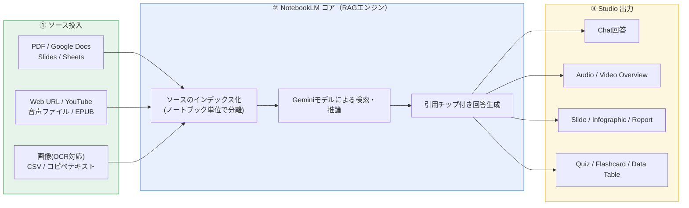

### 1.5 従来の検索・要約ツールとの違い

| 観点 | 汎用チャットAI（Gemini/ChatGPT本体） | NotebookLM |
| ---- | ------------------------------------ | ---------- |
| 知識の範囲 | 学習データ＋Web検索＋対話履歴 | アップロードしたソースのみ（Deep Research/Web検索使用時は例外） |
| 引用 | 一部機能でのみ対応 | 常に引用チップが付与される |
| 未知の質問への応答 | それらしい推測で回答してしまうことがある | 「ソースにない」と明示して回答を拒否する設計 |
| 得意分野 | 汎用対話・創作・コーディング | 大量ドキュメントの横断分析・要約・教材化 |
| コンテキストの永続性 | セッション/プロジェクト単位 | ノートブック単位（ノートブック間は独立） |

---

## 2. 2026年のアーキテクチャ変化 — エージェント化への転換

`K1`

### 2.1 2026年6月8日の大型アップデート（Gemini 3.5 + Antigravity）

Google公式ブログ「Do your best research with NotebookLM」（2026年6月8日付）によると、NotebookLMは以下の点で根本的に強化されました。

- 基盤モデルを **Gemini 3.5 + Antigravity** に刷新し、推論の正確性・透明性が向上
- 各ノートブックに**セキュアなクラウド実行環境（cloud computer）**が付与され、コードを書いて実行できるようになった（データ分析・集計処理などLLMが苦手な決定論的処理を代行）
- **100種類以上のキュレーション済みスキル**が組み込まれ、ソース理解の幅が拡大
- 出力フォーマットが大幅に拡張（下記2.2参照）
- 「まだソースを持っていない、漠然としたアイデアの段階」からでもプロジェクトを開始できるようになり、エージェントがGoogle検索を使って関連ソースを探索・提案する

Google社内の評価では、旧システムに対して**平均勝率65%超**（拮抗ラインより約15ポイント優位）、特に大規模文書分析で**69.9%**、Web調査・ソース発見で**78.2%**の勝率を記録したと報告されています。

### 2.2 新しい出力フォーマット（2026年6月〜）

| フォーマット種別 | 具体例 |
| ---------------- | ------ |
| データ可視化・チャート | PNG, SVG |
| ドキュメント | PDF, DOCX, Markdown, テキストファイル |
| 画像生成 | Nano Bananaモデルによる PNG, JPG, GIF |
| 構造化データ | CSV, JSON |
| Microsoft Excel | XLSX |
| Microsoft PowerPoint | PPTX |

これらは生成後に**編集も可能**になっており、以前の「生成後は修正不可」という制約が大きく緩和されました。

### 2.3 なぜこの変化が重要か

NotebookLMは当初「受け身の要約ツール（Passive Assistant）」でしたが、コード実行環境とWeb検索によるソース探索能力を得たことで「能動的なリサーチエージェント（Active Agent）」へと役割が変化しています。この変化を理解しておくと、後述のプロンプト設計（第7章）やユースケース設計（第14章）の判断がしやすくなります。

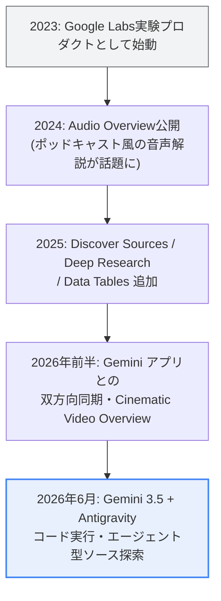

> ⚠️ **注意**: エージェント機能（コード実行・自律的なソース探索）は現時点で **Google AI Ultra** ユーザーおよび一部のWorkspaceビジネスアカウント（AI Ultra Access / AI Expanded Access 契約）から順次展開されています。無料版・Plus版では利用できない場合があります。最新の提供状況は必ず公式ヘルプページで確認してください。

---

## 3. プラン比較とシステム上限

`K1`

### 3.1 公式に確認できる基礎情報

Google公式ヘルプセンターによると、無料（Standard）プランの基本仕様は以下の通りです。

- ノートブック数: 最大100個
- ノートブックあたりのソース数: 最大50個
- ソース1件あたりの上限: 500,000語 または 200MB（ファイルアップロード時）のいずれか早い方。ページ数の上限はなし
- 1日あたりのチャットクエリ: 50件
- 1日あたりのAudio Overview生成: 3件

コピー保護されたPDFはアップロードできません。

### 3.2 有料プランの目安（2026年6月時点・複数の第三者集計に基づく）

> 📌 **重要な注意**: NotebookLM単体を購入することはできません。Google AIプラン（Plus/Pro/Ultra）または対応するGoogle Workspace/Google Cloudプランの一部として提供されます。以下の数値は本ガイド執筆時点の集計値であり、**Google側の仕様変更が頻繁にあるため、契約前に必ず公式アップグレードページで最新の数値を確認してください**。

| プラン | 目安の月額 | ノートブック数 | ソース/ノートブック | 1日のチャット | 備考 |
| ------ | ---------- | -------------- | -------------------- | -------------- | ---- |
| Free (Standard) | $0 | 100 | 50 | 50 | Audio Overview 1日3件 |
| Plus | 約 $7.99（Google AI Plus経由） | 200 | 100 | 200 | Freeのほぼ倍の容量 |
| Pro | 約 $19.99（Google AI Pro経由） | 500 | 300 | 500 | Deep Research 1日20件、個人の重研究用途に最適 |
| Ultra（20TBプラン） | 約 $99.99（Google AI Ultra経由） | 500 | 500 | 2,500 | Cinematic Video Overview対応 |
| Ultra（30TBプラン） | 約 $200（Google AI Ultra経由） | 500 | 600 | 5,000 | 最上位。透かし除去・最上位のDeep Research件数 |
| Workspace（Business等） | Workspaceプランに含まれる | 契約により変動 | Plus相当が目安 | 契約により変動 | 組織のコアサービスとして人間レビュー・学習利用の対象外 |
| Enterprise（Google Cloud） | 個別見積り | プロジェクト単位 | 契約により変動 | 契約により変動 | VPC-SC・CMEK・データレジデンシー対応 |

**全プラン共通の制約**: ソース1件あたり500,000語 / 200MBの上限は、Ultraであっても変わりません。上位プランが上げるのは「ソースの数」であり「1つのソースの大きさ」ではない点に注意してください。

### 3.3 上限に達したときの実務対応

- **大きすぎるファイル**: 500,000語を超えるPDFは分割してからアップロードする
- **ソース数が足りない**: 関連性の低いソースを整理・削除するか、プランをアップグレードする
- **コピー保護PDF**: 印刷可能なPDFに変換し直す、またはテキストをコピー＆ペーストしてソース化する
- **チャット回数が足りない**: 1つの質問に複数の意図を詰め込み、リクエスト回数自体を減らす

---

## 4. ステップ1: ノートブック設計 — スコープを絞る

`K2`

### 4.1 定義

ノートブックとは、特定のプロジェクト・トピックのためのソース集合体です。**ノートブック同士は完全に独立しており、NotebookLMは複数ノートブックを横断して同時に参照することはできません**（第9章で解説するGemini連携を使わない限り）。

### 4.2 なぜスコープ設計が重要か

無関係な資料（例:契約書Aと契約書B）を1つのノートブックに混在させると、Chatが横断的に統合しようとした結果、本来分離すべき情報が混ざった回答になりやすいという指摘が複数の実践者コミュニティで共有されています。ノートブックは「1トピック・1プロジェクト・1文書群」の単位で作るのが基本です。

### 4.3 ステップバイステップ

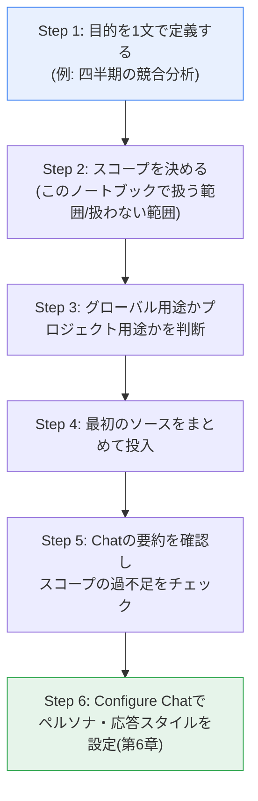

### 4.4 良い例・悪い例

| 観点 | ❌ 悪い例 | ✅ 良い例 |
| ---- | --------- | --------- |
| スコープ | 「仕事の資料全部」ノートブックに何でも放り込む | 「2026 Q3競合分析」のように単一プロジェクト単位で作成 |
| 混在 | 契約書Aと契約書Bを同一ノートブックに入れて比較させる | 契約書ごとにノートブックを分け、比較が必要ならGemini連携（第9章）でノートブックをまたいで質問する |
| 命名 | 「無題のノートブック」のまま放置 | 目的が一目で分かる名前と絵文字（自動付与）を活用 |

---

## 5. ステップ2: ソースの追加 — Discover SourcesとDeep Research

`K2`

### 5.1 対応ソース形式

公式ヘルプによると、以下の形式がソースとして利用できます。

| カテゴリ | 対応形式 |
| -------- | -------- |
| 文書 | Google Docs, Microsoft Word (docx), PDF, テキスト(txt), Markdown(md), EPUB |
| 表計算・データ | Google Sheets, CSV |
| プレゼン | Google Slides, PowerPoint (pptx) |
| Web | 公開Webページ URL, 公開YouTube動画URL |
| メディア | 音声ファイル（MP3, WAVなど）, 画像（OCR対応、精度に限界あり） |
| その他 | コピー＆ペーストしたテキスト, Geminiでのチャット履歴 |

**Tips（Google Drive由来のソース）**: Google Docs / Slides / Sheetsをソースとして追加した場合、これらは「生きた文書」として扱われ、元ファイルが更新されると通知が出て手動で再同期できます。一方でPDFなど直接アップロードしたファイルは、アップロード時点の静的なコピーとして扱われ、自動では更新されません。

### 5.2 手動追加だけでなく「発見」する — Discover Sources

自分でリンクを集める代わりに、**Discover Sources**機能を使うとテーマを記述するだけでWeb上から関連性の高いソース候補を最大10件、要約付きで提示してくれます。「気になるままに（I'm feeling curious）」ボタンでランダムなトピックの探索も可能です。

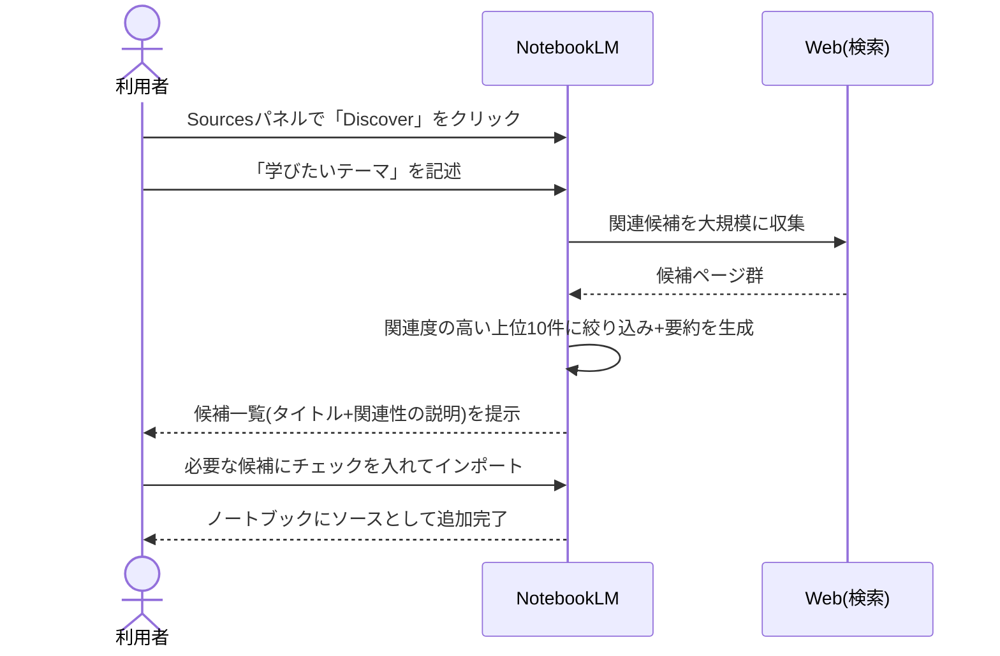

> ⚠️ **注意点**: Discover Sourcesが提示する候補は「Googleが内部評価した上での推薦」であり、専門家によるファクトチェックを保証するものではありません。特に教育現場や意思決定に関わる用途では、提示された各ソースの一次情報としての信頼性を人間が確認する工程を省略しないでください。

### 5.3 より本格的な調査 — Deep Research

Deep Researchは、ユーザーに代わって数百のWebサイトを自律的に巡回し、内容を吟味した上で複数ページに及ぶ調査レポートを生成するエージェント型機能です。生成されたレポートと、引用元・非引用元を含む関連ソース一覧をまとめてノートブックにインポートできます。

**手順**:
1. Sourcesパネルの検索ボックスに調査したい問い（例:「競合製品Aと自社製品の機能比較」）を入力する
2. 数分間の処理を待つ（他の作業と並行可能）
3. 生成されたレポートと関連ソースをレビューし、必要なものだけ選択してインポートする

### 5.4 Discover Sources / Deep Research 使い分け

| 観点 | Discover Sources | Deep Research |
| ---- | ----------------- | -------------- |
| 用途 | 新しいトピックの概要をすばやく把握したい | 込み入った調査課題に対して体系的なレポートが欲しい |
| 出力 | 候補ソースのリスト（最大10件） | 引用付きの多ページレポート＋ソース一覧 |
| 所要時間 | 数秒〜数十秒 | 数分程度 |
| 向いている場面 | ノートブック作成の初動、授業の導入 | 競合分析、文献レビュー、意思決定資料の下地作り |

---

## 6. ステップ3: Chatの設定 — Configure Chatとカスタムインストラクション

`K2`

### 6.1 定義

Chatパネル上部の設定アイコンから開く **Configure Chat** は、そのノートブック全体（Chatおよび派生するStudio出力すべて）に適用される「人格・応答スタイルの設定」です。

### 6.2 提供されている会話スタイル

| スタイル | 用途 |
| -------- | ---- |
| Default | 一般的なリサーチ・ブレインストーミング向けの標準応答 |
| Learning Guide | 教育コンテンツ向け。単に答えを返すのではなく、段階的に理解を促す「家庭教師モード」的な振る舞いになる |
| Custom | 自由記述でペルソナや役割を指定できる（例:「博士課程の学生のように振る舞って」「特定のロールプレイゲームの進行役を演じて」） |

Customモードには、複数の実践者コミュニティ情報によると2026年3月更新以降**最大10,000文字**のカスタムインストラクションを設定できるようになったと報告されています（正確な文字数上限は変更される可能性があるため、実際の入力欄で確認してください）。

応答の長さも Default / Longer（詳細） / Shorter（簡潔） の3段階で選べます。

### 6.3 なぜこれが最重要設定なのか

多くのユーザーが「毎回のプロンプトに前提条件を書き直す」という非効率な使い方をしています。Configure Chatでペルソナ・トーン・出力フォーマットの前提を**ノートブック単位で一度だけ設定**しておけば、以降のすべての質問・Studio出力にその前提が適用されます。

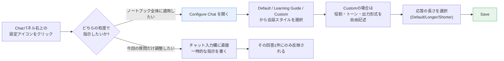

### 6.4 実践例

| シーン | Configure Chatでの設定例 |
| ------ | ------------------------ |
| 経営会議の準備 | Custom:「シニアアナリストとして振る舞い、結論を先に述べ、根拠は箇条書きで簡潔に」＋応答長Shorter |
| 資格試験の勉強 | Learning Guide＋応答長Default（AIが問いかけながら理解を促す） |
| 創作のブレスト | Custom:「経験豊富な編集者として、批判的だが建設的なフィードバックを返して」 |
| 社内FAQボット | Custom:「新入社員向けに専門用語を避け、優しい言葉で説明して」 |

### 6.5 チャット履歴の扱い

2026年1月・3月のアップデートにより、チャット履歴は自動的に保存されるようになり、セッションを閉じても後で再開できます。共有ノートブックであっても、チャット履歴は各利用者ごとに非公開です。履歴はいつでも削除できます。

> 💡 **Tips**: トピックを大きく切り替える前に履歴を削除すると、過去の文脈に引きずられない新しい回答が得られやすくなります。ただし削除前に残しておきたい内容がないか一度確認しましょう。

---

## 7. ステップ4: プロンプト設計のベストプラクティス

`K2`

### 7.1 NotebookLM向けプロンプトが汎用チャットAIと異なる理由

NotebookLMはソース以外の知識を使わないよう設計されています。そのため、プロンプトには「ソースだけを根拠にせよ」「引用元を明示せよ」「不明な場合はその旨を述べよ」という制約を明示的に書き込むことで、回答の信頼性がさらに高まります。

### 7.2 判断フロー — 目的別プロンプトパターン

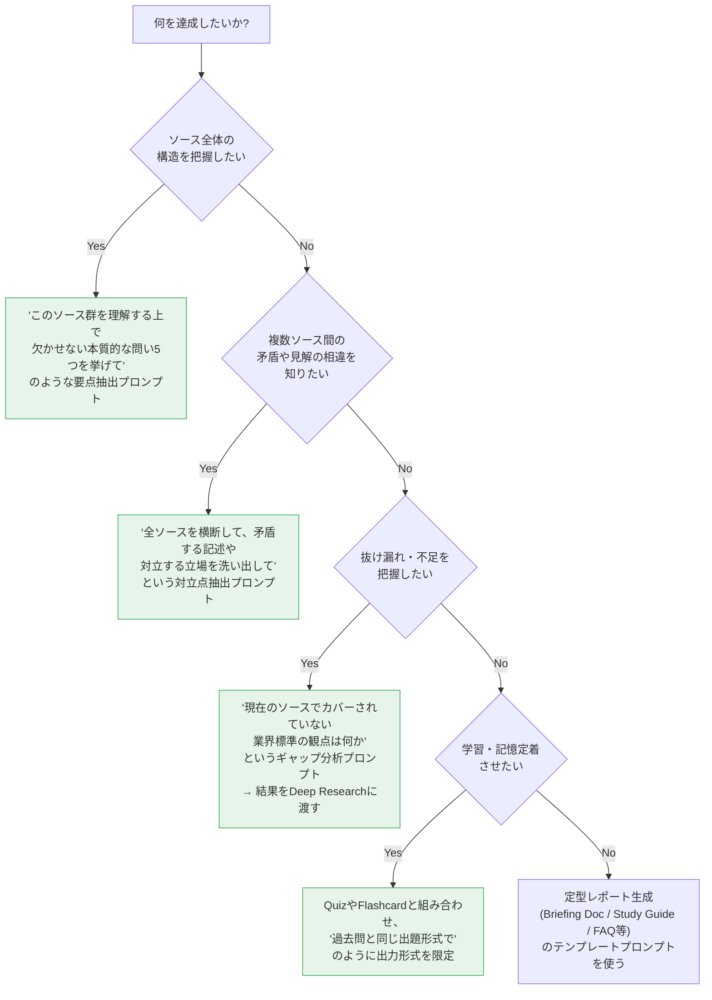

### 7.3 プロンプト設計チェックリスト

| チェック項目 | 悪い例 ❌ | 良い例 ✅ |
| ------------ | --------- | --------- |
| 根拠の制約 | 「〇〇について教えて」 | 「アップロードしたソースのみを根拠に、〇〇について説明して。ソースに記載がない場合はその旨を明記して」 |
| 出力の粒度 | 特に指定しない | 「200〜300語で」「6問構成で」など長さ・構成を明示 |
| 複数ソースの指名 | ソースが多いのに全体に問いかける | 関連するソース名を質問文中で明示し、検索範囲を絞る |
| 検証可能性 | 事実確認せずそのまま信用する | 「該当箇所を引用して」と指示し、引用チップから元資料を確認する |
| 反復作業 | 毎回ゼロから同じ前提を書く | Configure Chat（第6章）にペルソナ・制約を一度だけ設定する |

### 7.4 代表的なテンプレートプロンプト集

以下は複数のプロンプト集・実践記事で有効性が報告されているパターンを、著作権に配慮して要旨として再構成したものです。実際の利用時は角括弧を自分の状況に置き換えてください。

**① 要点抽出（新しいノートブック作成直後に）**
> すべてのソースを分析し、この内容を本質的に理解するために答えられるべき重要な問い5つを提示してください。各問いは核となる定義・重要概念・概念間の関係性・実務での応用のいずれかをカバーするようにしてください。

**② 矛盾・対立点の抽出（プレゼン前のリスク潰しに）**
> アップロードされたすべての文書を横断的に確認し、記載内容が一致していない箇所や、立場が対立している論点を洗い出してください。それぞれの主張について、どのソースがそう述べているかを明示してください。

**③ ギャップ分析（市場調査・企画立案に）**
> 現在のソース群で「既にカバーされている内容」ではなく「欠けている観点」に注目してください。[トピック]に関する業界標準や最新動向に照らして、抜け落ちている論点を指摘し、それを埋めるために調べるべき追加の問いを5つ提案してください。

**④ タイムライン生成（経緯の整理に）**
> ソースのみを根拠に、時系列順の出来事一覧を作成してください。各出来事には日付・簡潔な説明・出典を付け、日付不明のものは別枠にまとめてください。矛盾する日付や、出来事間の因果関係があれば併せて指摘してください。

**⑤ 出題スタイル模倣（試験対策に）**
> 過去問をソースとして読み込んだ上で、出題者の問題形式・頻出パターンを踏襲した模擬試験を作成してください。正解は最後にまとめ、各設問にはソースの該当箇所を引用してください。

---

## 8. ステップ5: Studioパネル完全攻略 — 9つの出力形式

`K2`

### 8.1 全体像

2026年前半時点で、Studioパネルは大きく分けて以下の9系統の出力に対応しています（6月のエージェント化アップデートにより、これに加えてチャットから直接チャート・XLSX・PPTX等を生成する経路も追加されました）。

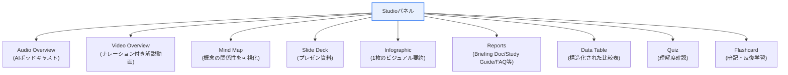

### 8.2 どの出力形式を選ぶべきか（判断フロー）

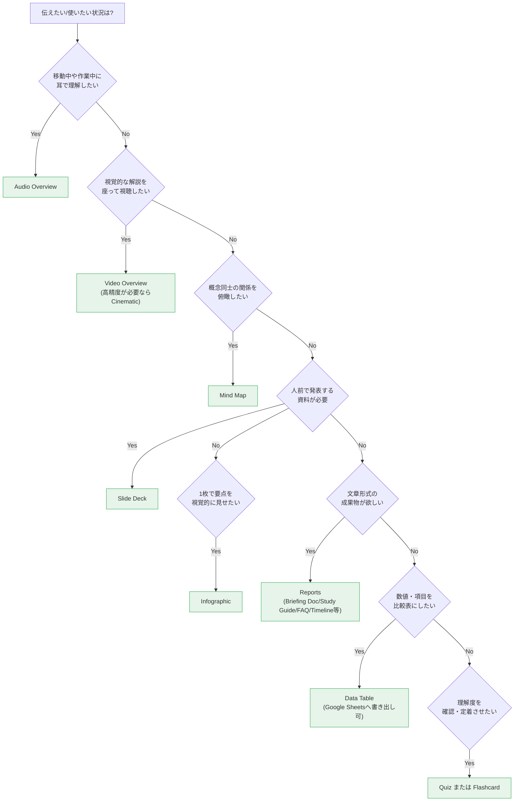

### 8.3 Audio Overview（AIポッドキャスト）

2人のAIホストが資料について対話形式で解説する、NotebookLMの代名詞的機能です。

| カスタマイズ項目 | 選択肢 |
| ---------------- | ------ |
| フォーマット | Deep Dive（深掘り対話）/ Brief（短時間要約）/ Critique（批評）/ Debate（討論）/ Lecture（講義形式） |
| 言語 | 80以上の言語に対応（音声出力の対応言語は順次拡大中） |
| フォーカス指定 | 「今回のエピソードでAIホストに何を重点的に扱ってほしいか」を自由記述で指定可能 |
| 対話モード | Interactive Mode — 再生中にAIホストへ割り込み、リアルタイムで質問・誘導できる（英語のみ、ベータ） |

> 💡 **Tips**: 生成には数分〜十数分かかることがあり、Studio内の出力の中でも最も時間がかかる部類です。他の作業と並行して待つのが実務的です。

### 8.4 Video Overview（ナレーション付き解説動画）

Audio Overviewに視覚要素（図表・引用・数値のハイライト等）を加えたものです。

| カスタマイズ項目 | 選択肢 |
| ---------------- | ------ |
| フォーマット | Explainer（説明重視）/ Brief（短時間） |
| ビジュアルスタイル | Whiteboard / Kawaii / Watercolor / Classic など |
| フォーカス指定 | 「AIホストに何を重視して解説してほしいか」を自由記述 |
| Cinematic Video Overview | 2026年3月導入。Gemini 3 + Veo 3を用いた、流麗なアニメーションとドキュメンタリー品質の映像。**Ultraプラン限定** |

### 8.5 Mind Map（マインドマップ）

ソースから高レベルの情報を抽出し、概念同士の関係性を視覚的な図として提示します。特定のプロンプトによる生成内容の誘導はできず、どのソースを含めるかの選択のみがコントロール可能です。ノード（節点）をクリックするとサブトピックを展開できます。

### 8.6 Slide Deck（プレゼン資料）

| 項目 | 内容 |
| ---- | ---- |
| フォーマット | Detailed（読み物として自己完結する詳細版）/ Presenter（発表の補助となる要点のみの簡潔版） |
| エクスポート | PDFに加え、編集可能なPPTX形式でのエクスポートに対応 |
| 部分修正 | 生成後、スライド単位でスタイルや事実関係のフィードバックを入力すると、その部分だけを再生成する「Slide revisions」機能に対応（デスクトップ・モバイル両対応） |

### 8.7 Infographic（インフォグラフィック）

| 項目 | 内容 |
| ---- | ---- |
| スタイル例 | Sketch Note, Kawaii, Professional, Scientific, Anime, Clay, Editorial, Instructional, Bento Grid, Bricks（計10種類） |
| 向き | Landscape / Portrait / Square |
| カスタムプロンプト | 「青系のコーポレートカラーを使い、3つの主要な数値を強調して」のように色・強調点を指定可能 |
| 制約 | 生成後の直接編集は原則不可（静止画として書き出されるため、修正が必要な場合は再生成が基本） |

### 8.8 Reports（各種レポート）

「Briefing Doc（要点整理の概要資料）」「Study Guide（学習ガイド）」「FAQ」「Timeline（年表）」「ブログ記事風の文章」など、目的別の定型文書を生成できます。第7章のテンプレートプロンプトと組み合わせることで、対象読者・粒度を細かく指定した成果物になります。

### 8.9 Data Table（データテーブル）

複数ソースを横断した比較表を構造化データとして生成し、Google Sheetsへそのままエクスポートして加工できます。価格比較・機能比較・仕様比較のような定量的な整理に向いています。ソースに厳密に根拠づけられるため、他の生成AIが作る表よりも数値の信頼度が高いという実践者の評価があります。

### 8.10 Quiz / Flashcard（学習支援ツール）

| 機能 | 内容 |
| ---- | ---- |
| Quiz | ソースに基づく多肢選択式の設問を自動生成。能動的想起（active recall）による定着を狙う |
| Flashcard | 進捗はセッションをまたいで保存される。「わかった／わからなかった」でマークし、わからなかったものだけ再出題・シャッフル可能 |

> ⚠️ **注意**: Quizはデフォルトでは独自のスタイルで出題されるため、特定の試験対策では「過去問の出題形式を踏襲して」という指示（第7章テンプレート⑤）を組み合わせることを推奨します。

### 8.11 2026年6月以降の新出力（エージェント型）

チャットから直接、Audio/Video Overview・レポート・チャート・スプレッドシート・PDFなどの成果物（アーティファクト）を生成できるようになりました。Studioパネルに移動しなくても「これをスライドにして」「この数値からグラフを作って」とチャット内で依頼するだけで完結します。

---

## 9. ステップ6: Gemini アプリとの双方向連携

`K3`

### 9.1 何が変わったか

2026年4月8日、Googleは Gemini アプリに **Notebooks** 機能を追加し、NotebookLMのノートブックと**双方向に自動同期**するようにしました。これにより「ノートブックはNotebookLM、対話はGemini」という使い分けが可能になり、従来の「1ノートブックは孤立している」という制約の一部が解消されます。

### 9.2 同期の仕組み

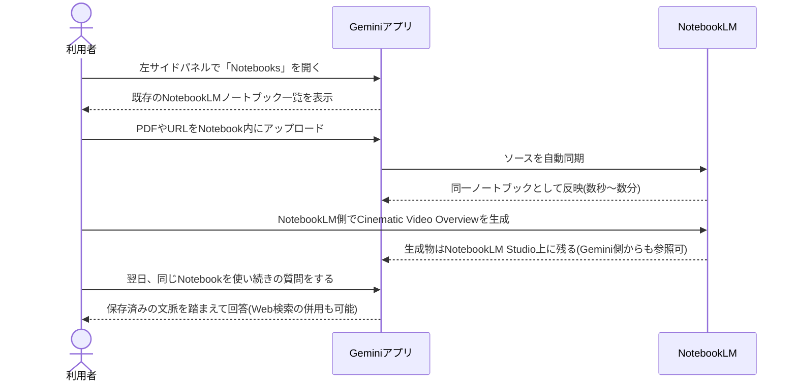

### 9.3 このワークフローで得られる利点

| 課題（従来のNotebookLM単体） | Gemini連携による解決 |
| ---------------------------- | --------------------- |
| ノートブックをまたいだ質問ができない | 複数のノートブックを1つのGemini会話に添付し、横断的に質問できる |
| リアルタイムのWeb情報が使えない | Geminiの通常のWeb検索機能と組み合わせて回答を補強できる |
| 会話がGemini側でのみ完結し、資料に定着しない | Geminiでの会話をノートブックのソースとして取り込める |

### 9.4 利用上の注意点

- 本機能は現在、**Google AI Ultra / Pro / Plus** のWeb版利用者から順次展開されています。モバイル・無料版・一部地域は展開待ちです。
- 深く集中して1つのソース群だけを扱う作業（試験勉強、特定レポートの精読など）には、依然として**NotebookLM単体での利用が適している**という評価が実践者の間で共有されています。Gemini連携は「複数ノートブックを横断する調査」に強みがあります。
- 連携がリアルタイムで自動反映されない場合があり（大きなPDFなどで同期に数分かかる例が報告されている）、即時性が必要な作業では注意してください。

---

## 10. セキュリティとプライバシー — 3層のデータガバナンス

`K3`

### 10.1 3つの利用形態

NotebookLMは、どのアカウントでログインするかによって適用される契約・データ保護レベルが異なります。

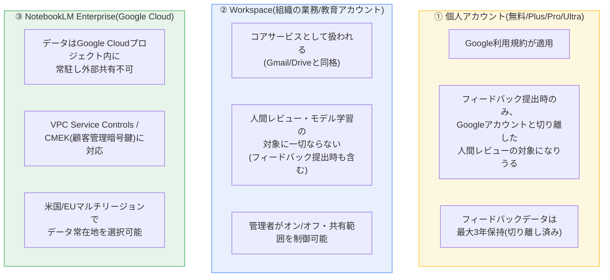

### 10.2 データ利用に関する公式方針の要点

- アップロードしたファイル・生成物・チャット履歴は「知識ベースの構築」と「回答生成」のために使われますが、**基盤モデルの直接的な学習には使われません**（ユーザーが自発的にフィードバックを送信した場合を除く）
- フィードバックを送信した場合、訓練を受けたレビュー担当チームが内容を確認することがあります。その際、Googleアカウントとの紐付けは解除された上でレビューされます
- レビュー済みフィードバックとそれに関連するデータは、Googleアカウントと切り離した状態で**最長3年間保持**されます
- ノートブックはデフォルトで非公開（鍵アイコン）。「Viewer」「Editor」権限を指定して個別共有するか、リンクを知っている全員に公開する設定も可能です

### 10.3 共有時のセキュリティ設計

| 権限 | できること |
| ---- | ---------- |
| Viewer（閲覧者） | ノートブックとの対話は可能だが、ソースの追加・削除・ノートの編集は不可 |
| Editor（編集者） | ソースの追加・削除、ノート編集に加え、さらに他者への共有も可能 |
| チャットのみ共有（Workspaceの一部プランで対応） | 相手にソース原本を見せずに、対話（質問応答）だけを許可する |

> ⚠️ **実務上の注意**: 著作権を保有していない資料をアップロードしないことが利用規約で明確に求められています。繰り返しの著作権侵害はアカウント停止の対象になります。

---

## 11. NotebookLM Enterprise（Google Cloud）導入ガイド

`K3`

### 11.1 個人版・Workspace版との違い

NotebookLM Enterpriseは、Google Cloudプロジェクト上で稼働する組織向け版です。個人向けNotebookLM/NotebookLM Plusとの間でノートブックを移行・共有することはできません（アカウント基盤が異なるため）。

| 項目 | 個人版 NotebookLM | NotebookLM Enterprise |
| ---- | ------------------ | ----------------------- |
| データの所在 | Googleアカウントに紐づく | Google Cloudプロジェクト内に固定（US/EUマルチリージョンを選択） |
| アクセス管理 | 個人のGoogleアカウント | Cloud IAMロールで管理（Admin/User/Owner/Editor/Viewerの5種） |
| 認証方式 | Google識別情報 | Google ID または サードパーティIdP（Workforce Identity Federation経由でOkta/Entra IDなど） |
| 暗号鍵 | Google標準暗号化 | Google標準暗号化 または CMEK（顧客管理暗号鍵） |
| ライセンス | 個人単位で契約 | 管理者がユーザーへ手動/自動でライセンスを割り当て |
| Gemini Enterprise連携 | 非対応 | データストアとして接続し、組織横断検索の対象にできる |

### 11.2 導入ステップ

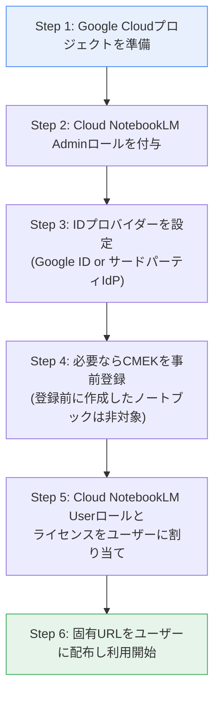

### 11.3 導入時に注意すべき制約（公式FAQより）

- Cloud NotebookLM組織間でノートブックを直接移行することはできません。エクスポート＋再インポートが必要です
- Excelワークブックは1シートあたり約150,000セル（アクティブセル）までを目安に処理されます
- サインインが必要なページや、ペイウォールの背後にあるWebサイトはインデックスされません
- ユーザー単位の詳細な利用状況メトリクス（トークン使用量など）は現時点で提供されていません。組織単位のログはCloud LoggingやObservability Analytics経由で取得します
- Gemini Enterprise検索結果からノートブックに追加したソースを含むノートブックは、他ユーザーへの共有ができません

### 11.4 NotebookLM Enterprise と Gemini Enterprise の使い分け

| 判断軸 | NotebookLM Enterprise | Gemini Enterprise |
| ------ | ---------------------- | ------------------- |
| 適した用途 | 厳選した信頼できる資料群を土台に、深い理解・コンテンツ生成を行う | 組織全体のデータを横断検索し、自律型エージェントで業務を遂行する |
| 検索範囲 | ユーザーが明示的に追加したソースのみ | Google/サードパーティSaaSを含む組織全体のデータ |
| 得意なこと | 特定トピックの単一の参照拠点構築、Podcast風音声化 | 広範な情報発見、自律ワークフロー、エージェントの構築・実行 |
| 補完関係 | Gemini Enterpriseの検索結果を新しいソースとして取り込める | NotebookLM Enterpriseのノートブックを検索対象データストアとして登録できる |

---

## 12. モバイルアプリの活用と制限事項

`K2`

### 12.1 基本情報

NotebookLMモバイルアプリはAndroid 10以降、iOS 17以降に対応しています。段階的に世界展開されているため、地域によっては未提供の場合があります。

### 12.2 モバイルでできること

- ソースについてその場で質問する
- Audio Overviewをオフライン再生用にダウンロードする
- Flashcard・Quizで復習する
- Infographic・Slide Deckを閲覧・プレゼンする
- 閲覧中のWebページ・PDF・YouTube動画を、共有シートから直接NotebookLMに送る
- Video Overviewの生成・全画面再生・再生速度変更
- 生成中のアーティファクトが完了した際のプッシュ通知
- 数式のLaTeXレンダリング表示（Ultraプランの英語環境から順次対応）

### 12.3 モバイル版の既知の制限（デスクトップ版との差分）

| 制限事項 | 内容 |
| -------- | ---- |
| Chatの高度な設定 | Configure Chat・チャット分析はモバイルでは提供されない場合がある |
| 一部の生成物閲覧 | ノート・Mind Map・Data Tableの生成/閲覧は段階的に追加されている機能であり、時期によっては未対応 |
| Featured Notebooksタブ | ホーム画面のタブとしては未提供だが、直接URLでアクセスすればホーム画面に表示される |
| Audio Overviewの扱い | オフライン再生用にダウンロードはできるが、端末へのファイルとしての保存はできない |
| Discover Sources / Deep Research | 検索クエリの入力欄からアクセス可能（ソース追加画面経由） |

> 💡 **Tips**: 公式ヘルプでも「フル機能を使うならデスクトップ版を推奨」と明記されています。モバイルは「移動中の消費・簡易な質問応答」に用途を絞るのが実務的です。

---

## 13. アンチパターンとトラブルシューティング

`K2`

### 13.1 よくある失敗の連鎖

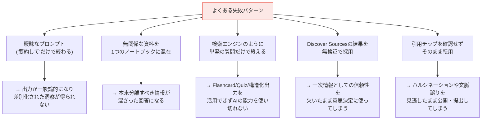

### 13.2 症状別トラブルシューティング表

| 症状 | 主な原因 | 対処法 |
| ---- | -------- | ------ |
| 「回答できません」と表示される | ①ソースにその情報が本当にない ②質問文が曖昧で関連ソースを検索エンジンが特定できていない | ①関連ソースを追加する ②質問をより具体的に言い換える ③特定のソース名を明示して検索範囲を絞る |
| 引用が一部の箇所にしか付かない | ソースの該当箇所の分量が短すぎて、文書全体を参照した扱いになっている | 短いソースは複数まとめて1つの文書にするか、該当箇所を含む一次資料を追加する |
| ソースの取り込みに失敗する | 500,000語 / 200MBの上限超過、またはコピー保護PDF | ファイルを分割する／コピー保護を解除した版を用意する／テキストをコピペでソース化する |
| Google Docsの更新が反映されない | NotebookLMは自動追従せず、手動同期が必要 | ソースパネルの「Click to sync with Google Drive」を選択する（編集権限が必要） |
| 生成された画像/インフォグラフィックの一部だけ直したい | 静止画として書き出されるため直接編集不可（2026年6月以前の仕様） | 該当箇所のみをカスタムプロンプトで再指定して再生成する。スライドはSlide revisions機能で部分修正が可能 |
| 特定の話題で「安全フラグ」がかかり回答が拒否される | 暴力・性的表現など、歴史的文脈であってもセンシティブな語彙がソースに含まれる | 質問の切り口を変える、該当箇所を除いた抜粋をソース化する |

### 13.3 過度な依存を避けるための工夫（教育・研究現場向け）

要約や設問生成をAIに完全に委ねてしまうと、資料を精読して統合するという学習・研究上の重要なプロセスをスキップしてしまうリスクが指摘されています。教育現場の実践例では、評価方法を「AIが生成しやすい要約の採点」から「口頭試問やディベートのように、AIを準備段階の壁打ち相手としてのみ使い、本番は自分の言葉で説明させる」形式へ移行する動きが報告されています。

---

## 14. ユースケース別ワークフロー実例

`K3`

### 14.1 研究者・アナリスト向け

1. Deep Researchで競合製品のWeb情報を収集し、レポートとソースをまとめてインポート
2. Configure ChatでCustomペルソナ「シニアアナリスト」を設定
3. 「矛盾・対立点抽出」プロンプト（第7章②）で情報の食い違いを洗い出す
4. Data Tableで機能・価格を横断比較する表を生成し、Google Sheetsへエクスポート
5. 2026年6月以降のエージェント機能でグラフ・PDFレポートを直接生成する

### 14.2 学生・受験者向け

1. 講義資料・教科書の章・過去問をまとめて1つのノートブックに投入
2. 「要点抽出」プロンプト（第7章①）で本質的な理解ポイントを洗い出す
3. Quiz機能を「過去問の出題形式を踏襲して」という指示付きで生成し、模擬試験として利用
4. 間違えた分野だけFlashcardで反復
5. 通学中にAudio Overview（Lectureフォーマット）で耳から復習

### 14.3 教員向け

1. 単元のシラバス・教科書該当章・過去の教材をソースとして投入
2. 「[学年]向けに、学習目標・重要概念・指導の流れ・具体例・振り返りを含む授業案を作成して」と依頼
3. 45〜60分の時間配分を明示すると現実的な計画になりやすい
4. 生成された宿題・小テストを、実際の使用前に必ず内容を確認する（生徒の学習到達度の判定に直結するため）

### 14.4 ビジネス・チーム利用向け

1. 製品仕様書・市場調査資料をWorkspaceアカウントでノートブック化
2. 営業チームに「Viewer」権限で共有し、想定問答をChatで即座に引けるようにする
3. 商談前にBriefing Docを生成して要点を素早くキャッチアップ
4. 議事録notebook（Meeting Notes Knowledge Base）を継続運用し、会議前に関連する過去の議論をChatで検索する

---

## 15. ベストプラクティス20則チェックリスト

`K2`

- [ ] ノートブックは「1トピック・1プロジェクト」の単位でスコープを絞っている
- [ ] 無関係な資料を同一ノートブックに混在させていない
- [ ] Configure Chatでノートブックごとにペルソナ・応答スタイルを一度設定している
- [ ] プロンプトには「ソースのみを根拠にする」「不明な場合は明示する」という制約を明示している
- [ ] 出力の長さ・構成（語数、設問数など）を具体的に指定している
- [ ] ソースが多い場合、質問文で対象ソース名を明示して検索範囲を絞っている
- [ ] Discover Sources / Deep Researchの結果は、一次情報としての信頼性を人間が検証してから採用している
- [ ] 生成された回答の引用チップを確認し、元資料と突き合わせている
- [ ] Google Drive由来のソース（Docs/Slides/Sheets）は必要に応じて手動で再同期している
- [ ] 各ソースが500,000語/200MBの上限を超えないよう事前に分割・整理している
- [ ] コピー保護されたPDFは事前にテキスト化またはコピペでソース化している
- [ ] 目的に応じてStudioの出力形式（Audio/Video/Mind Map/Slide/Infographic/Report/Data Table/Quiz/Flashcard）を使い分けている
- [ ] 試験対策など出題形式を模倣したい場合、過去問をソースとして与えている
- [ ] 議事録・継続プロジェクトはノートブックを使い回し、Chat履歴を資産として活用している
- [ ] トピックを大きく切り替える前にチャット履歴の要否を確認し、必要に応じて削除している
- [ ] 個人利用と業務利用でアカウントの種類（個人/Workspace/Enterprise）とデータ保護レベルの違いを理解している
- [ ] 共有ノートブックの権限（Viewer/Editor/チャットのみ）を用途に応じて適切に設定している
- [ ] 複数ノートブックを横断する調査が必要な場面ではGeminiアプリのNotebooks連携を活用している
- [ ] モバイル版の機能制限（Configure Chat非対応など）を理解した上で用途を切り分けている
- [ ] 契約プラン・上限（ソース数、チャット回数等）は公式ページで定期的に確認し、業務量に見合っているか点検している

---

## 16. 2023〜2026 アップデート年表

`K1`

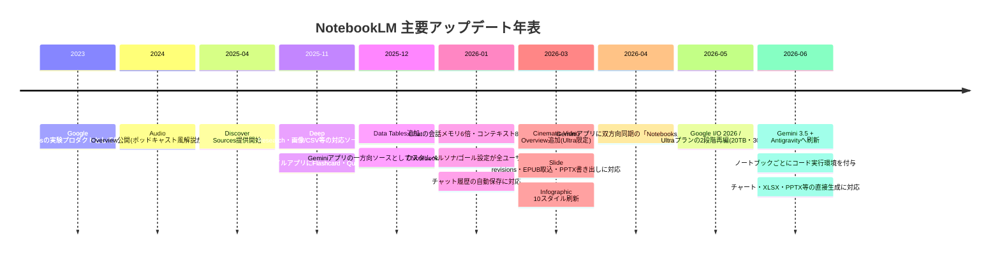

> 補足: 上記の年月は各機能について確認できた公式発表・アナウンスに基づく目安です。地域・プランによって提供開始時期が前後する場合があります。

---

## 17. 参考ソースURL一覧

### Google公式情報（第一次情報）

| カテゴリ | URL | 内容 |
| -------- | --- | ---- |
| 公式ヘルプセンター | <https://support.google.com/notebooklm/?hl=en> | NotebookLM全般のFAQ・チュートリアルの入口 |
| プライバシー・利用規約 | <https://support.google.com/notebooklm/answer/17004255?hl=en> | データの学習利用有無、フィードバック審査プロセス、保持期間の公式説明 |
| NotebookLMについて（基本） | <https://support.google.com/notebooklm/answer/16164461?hl=en&co=GENIE.Platform%3DDesktop> | 対応年齢、対応地域、安全フラグの仕組み |
| ソースの追加・発見 | <https://support.google.com/notebooklm/answer/16215270?hl=en&co=GENIE.Platform%3DDesktop> | Discover Sources・Deep Researchの操作手順、対応ソース形式の公式一覧 |
| ノートブックの作成・共有 | <https://support.google.com/notebooklm/answer/16206563?hl=en> | ノートブック作成手順、共有権限（Viewer/Editor）、Analytics機能 |
| Chatの使い方・Configure Chat | <https://support.google.com/notebooklm/answer/16179559?hl=en> | 会話スタイル（Default/Learning Guide/Custom）、応答長設定の公式説明 |
| よくある質問（上限・プライバシー） | <https://support.google.com/notebooklm/answer/16269187?hl=en> | 無料プランの公式な数値（ノートブック数・ソース数・チャット回数） |
| アップグレード案内 | <https://support.google.com/notebooklm/answer/16213268?hl=en> | Google AIプラン・Cloud・Workspace経由でのアップグレード方法 |
| モバイルアプリ（Android） | <https://support.google.com/notebooklm/answer/16296687?hl=en&co=GENIE.Platform%3DAndroid> | モバイル版の対応機能・制限の公式一覧 |
| モバイルアプリ（iOS） | <https://support.google.com/notebooklm/answer/16296687?hl=en&co=GENIE.Platform%3DiOS> | 同上（iOS版） |
| Google Workspace生成AIプライバシーハブ | <https://support.google.com/a/answer/15706919?hl=en> | Workspaceにおけるコアサービス化・データ保護の公式説明 |

### Google公式ブログ（The Keyword / Google Labs）

| カテゴリ | URL | 内容 |
| -------- | --- | ---- |
| 2026年6月の大型アップデート | <https://blog.google/innovation-and-ai/products/notebooklm/better-research-notebooklm/> | Gemini 3.5+Antigravity刷新、コード実行環境、新出力形式の公式発表 |
| Discover Sources公式発表 | <https://blog.google/innovation-and-ai/models-and-research/google-labs/notebooklm-discover-sources/> | Discover Sources機能の設計思想と使い方 |
| Deep Research・対応形式拡大 | <https://blog.google/innovation-and-ai/models-and-research/google-labs/notebooklm-deep-research-file-types/> | Deep Research機能の公式発表 |
| Data Tables公式発表 | <https://blog.google/innovation-and-ai/models-and-research/google-labs/notebooklm-data-tables/> | Data Table機能の公式発表 |
| モバイルアプリのFlashcard/Quiz | <https://blog.google/innovation-and-ai/models-and-research/google-labs/notebooklm-app-quizzes-flashcards/> | モバイル版のFlashcard・Quiz追加の公式発表 |
| Cinematic Video Overview | <https://blog.google/innovation-and-ai/products/notebooklm/generate-your-own-cinematic-video-overviews-in-notebooklm/> | Cinematic Video Overview機能の公式発表 |
| Chatのカスタムペルソナ強化 | <https://blog.google/innovation-and-ai/models-and-research/google-labs/notebooklm-custom-personas-engine-upgrade/> | コンテキスト拡大・会話メモリ延長・ペルソナ開放の公式発表 |
| Gemini アプリのNotebooks機能 | <https://blog.google/innovation-and-ai/products/gemini-app/notebooks-gemini-notebooklm/> | Gemini↔NotebookLM双方向同期の公式発表 |
| モバイルアプリ公式リリース | <https://blog.google/innovation-and-ai/products/notebooklm-app/> | NotebookLMモバイルアプリのリリース公式発表 |
| Google I/O 2026とNotebookLM | <https://blog.google/innovation-and-ai/products/notebooklm/notebooklm-google-io-2026/> | I/O 2026のまとめノートブック公式紹介 |

### Google Workspace / Google Cloud公式ドキュメント

| カテゴリ | URL | 内容 |
| -------- | --- | ---- |
| Workspace向けNotebookLM紹介 | <https://workspace.google.com/products/notebooklm/> | Workspaceにおけるセキュリティ・活用事例 |
| 2026年3月Workspaceアップデート | <https://workspaceupdates.googleblog.com/2026/03/new-ways-to-customize-and-interact-with-your-content-in-NotebookLM.html> | Slide revisions・Cinematic Video・EPUB・PPTX書き出し等の公式リリースノート |
| Education向けコアサービス化 | <https://workspaceupdates.googleblog.com/2025/04/notebookLM-and-gemini-app-core-services-for-education-customers.html> | 教育機関向けデータ保護強化の公式発表 |
| NotebookLM Enterprise概要 | <https://docs.cloud.google.com/gemini/enterprise/notebooklm-enterprise/docs/overview> | Enterprise版のアーキテクチャ・IAMロールの公式ドキュメント |
| NotebookLM Enterpriseセットアップ | <https://docs.cloud.google.com/gemini/enterprise/notebooklm-enterprise/docs/set-up-notebooklm> | ID連携・CMEK設定の公式手順 |
| ライセンス管理 | <https://docs.cloud.google.com/gemini/enterprise/notebooklm-enterprise/docs/set-up-licensing> | ライセンス割り当て方法の公式手順 |
| ノートブック共有（Enterprise） | <https://docs.cloud.google.com/gemini/enterprise/notebooklm-enterprise/docs/share-notebooks> | Enterprise版での共有権限の公式説明 |
| Enterprise FAQ | <https://docs.cloud.google.com/gemini/enterprise/notebooklm-enterprise/docs/faq> | 組織間移行不可等、公式FAQ |
| NotebookLM Enterprise vs Gemini Enterprise | <https://docs.cloud.google.com/gemini/enterprise/docs/choose-product> | 2製品の使い分け公式ガイド |
| Gemini Enterpriseとの検索連携 | <https://docs.cloud.google.com/gemini/enterprise/docs/connectors/connect-notebooklm> | NotebookLM Enterpriseを検索ソースとして接続する公式手順 |
| NotebookLM Enterprise API | <https://docs.cloud.google.com/gemini/enterprise/notebooklm-enterprise/docs/api-notebooks> | ノートブック管理APIの公式リファレンス |

### 第三者による実践的な集計・解説記事（プラン上限・活用術の参考）

| カテゴリ | URL | 内容 |
| -------- | --- | ---- |
| プラン・上限の集計 | <https://notebooklm-guide.com/notebooklm-system-limits-benchmarks> | Free〜Ultraの上限を一覧化した独立系の集計記事 |
| ソース上限の解説 | <https://elephas.app/blog/notebooklm-source-limits> | ソース数・ファイルサイズ上限の独立系解説 |
| 日次上限の解説 | <https://elephas.app/blog/notebooklm-daily-limit> | チャット回数・Audio Overview回数の独立系解説 |
| ファイルアップロード上限 | <https://elephas.app/blog/how-to-upload-more-files-notebooklm> | 上限到達時の回避策の独立系解説 |
| プラン料金の集計 | <https://felloai.com/notebooklm-pricing/> | Free/Plus/Pro/Ultraの料金を一覧化した独立系記事 |
| Ultraプラン刷新の解説 | <https://www.xda-developers.com/notebooklm-launches-new-ultra-tier-with-higher-limits/> | Ultraプラン新設時の独立系解説記事 |
| 2026年の変化まとめ | <https://www.jeffsu.org/notebooklm-changed-completely-heres-what-matters-in-2026/> | 2026年の機能変化を実務目線でまとめた解説記事 |
| 活用ワークフロー集 | <https://www.shareuhack.com/en/posts/notebooklm-advanced-guide-2026> | Custom Instructions・Deep Research等の実践的活用術 |
| Gemini連携の実践レビュー | <https://www.mejba.me/blog/notebooklm-gemini-app-integration> | Gemini↔NotebookLM連携の1週間実践レビュー |
| データセキュリティ解説 | <https://www.devoteam.com/expert-view/a-guide-to-notebooklm-data-security/> | 個人版/Workspace/Enterpriseのセキュリティ比較解説 |
| 機能全般の解説 | <https://www.digitalocean.com/resources/articles/what-is-notebooklm> | 既知の制約・Studio機能全般の解説記事 |
| Discover Sourcesの功罪 | <https://tomdaccordai.substack.com/p/exploring-notebooklms-new-discover> | Discover Sources導入時の教育現場での留意点に関する考察 |
| プロンプト実践集（学習用途） | <https://www.learnwithmeai.com/p/notebooklm-prompts-for-studying> | 学習者向けプロンプトパターンの実践解説 |
| プロンプト実践集（教員向け） | <https://www.analyticsvidhya.com/blog/2026/01/notebooklm-for-teachers/> | 教員向けプロンプトパターンの実践解説 |
| プロンプト実践集（研究者向け） | <https://pasqualepillitteri.it/en/news/1506/notebooklm-prompts-senior-researcher-workflow> | 上級リサーチャー向けプロンプトワークフローの解説 |
| Custom Instructions解説 | <https://cdil.bc.edu/resources/google-ai/adding-custom-instructions-in-notebooklm/> | Configure Chatの各設定項目の解説 |

---

## おわりに

NotebookLMは「ソースに忠実であること」を最大の武器とするツールですが、2026年6月のアップデートにより、コード実行やエージェント的なソース探索といった能動的な能力も獲得しつつあります。本ガイドの各ステップ（ノートブック設計 → ソース追加 → Chat設定 → プロンプト設計 → Studio活用 → Gemini連携 → セキュリティ理解）を順に踏むことで、単なる「要約ツール」から「組織・個人の知識基盤」へとNotebookLMを育てていくことができます。

機能は頻繁にアップデートされるため、本ガイドの数値・仕様は必ず [公式ヘルプセンター](https://support.google.com/notebooklm/?hl=en) で最新情報を確認する習慣とあわせてご活用ください。
