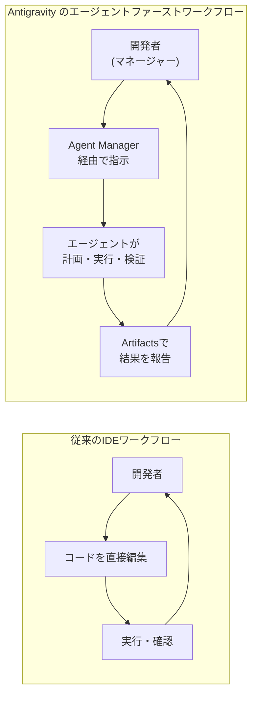
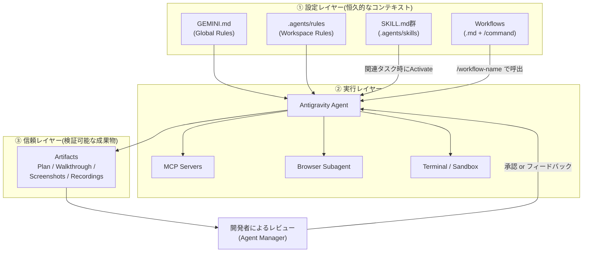
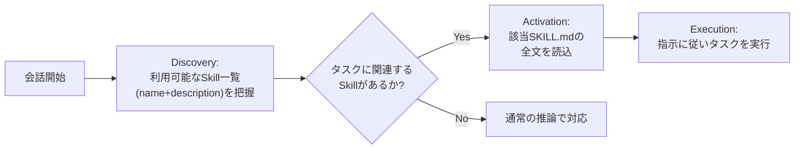
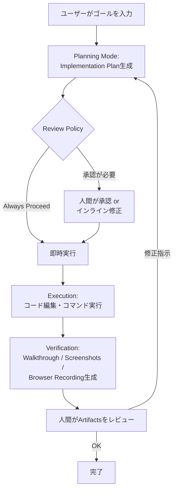
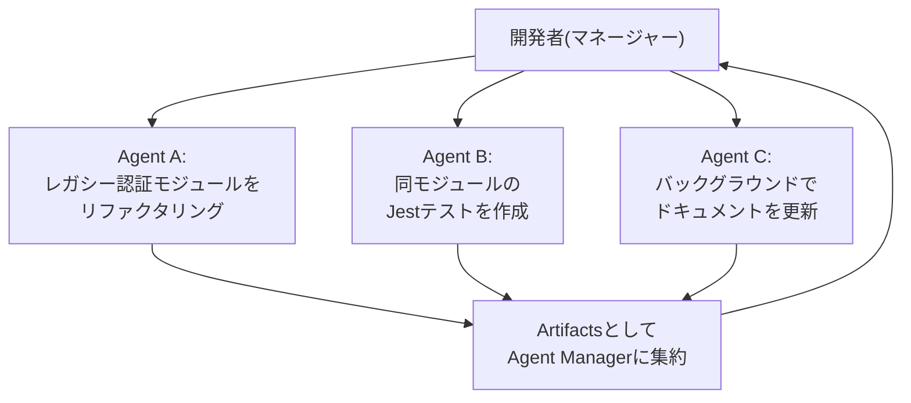
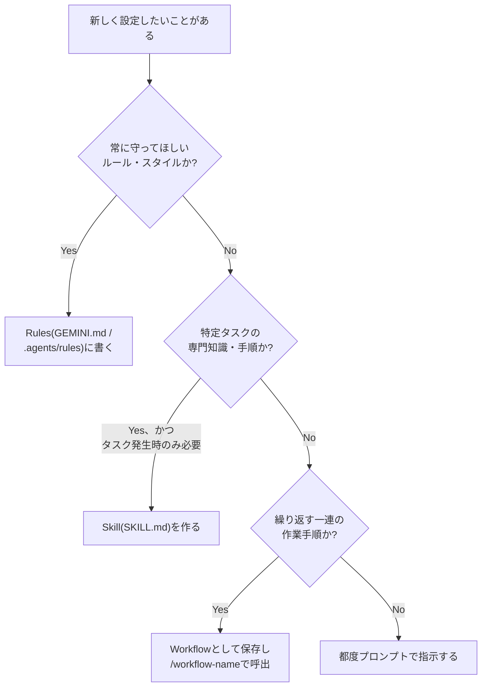

# Google Antigravity 完全ガイド:仕様駆動開発(Spec-Driven Development)を支えるエコシステムのベストプラクティス

> 対象読者:AI駆動開発ツールに初めて触れるエンジニアから、既存のAI IDE(Cursor、Claude Code、Windsurf等)経験者まで
> 最終更新:2026年7月27日時点の公式ドキュメント・国際的な開発者の一次情報をもとに作成

---

## この記事で扱う範囲

Google Antigravity は、Google が2025年11月18日(Gemini 3 Pro と同時)に発表した「エージェントファースト」の開発プラットフォームです。単なるコード補完ツールではなく、**GEMINI.md(Rules)・SKILL.md(Skills)・Workflows・Artifacts** という4つの「仕様駆動」コンポーネントを中心に、AIエージェントに継続的なコンテキストと再現可能な手順を与える設計になっています。

本ガイドは、この4コンポーネントを軸にしながら、周辺の Permissions(権限)・MCP・Agent Manager(サブエージェント運用)まで含めた**Antigravityエコシステム全体**を、ステップバイステップで解説します。

---

## 0. 用語集(はじめにここだけ読めばOK)

| 用語 | 意味 |
|---|---|
| **GEMINI.md** | エージェントの「脳」にあたるグローバル設定ファイル。`~/.gemini/GEMINI.md` に置き、全ワークスペース共通のRuleとして適用される |
| **Rules** | エージェントに恒久的な制約・スタイルを与える仕組み。GEMINI.md(グローバル)と `.agents/rules`(ワークスペース)の2階層がある |
| **SKILL.md** | 特定タスクの手順・ベストプラクティスを記述した「専門知識パッケージ」。フォルダ単位で管理され、Agent Skills というオープン標準に準拠する |
| **Workflows** | 「デプロイする」「PRコメントに対応する」といった繰り返し作業をMarkdownの手順書として定義し、`/workflow-name` で呼び出す仕組み |
| **Artifacts** | エージェントが作業中・完了後に生成する成果物(Implementation Plan、Walkthrough、Screenshots、Browser Recordings)。「信頼のレイヤー」として人間のレビューを支える |
| **Agent Manager** | 複数のエージェントを非同期・並列に生成・監視・レビューするための専用インターフェース(Manager Surface) |
| **MCP** | Model Context Protocol。外部ツール(DB、GitHub、Notion等)にエージェントが安全に接続するためのオープン標準 |
| **Permissions** | `action(target)` 形式でファイル読み書き・コマンド実行・URL閲覧などを Deny/Ask/Allow に振り分ける権限エンジン |

---

## 1. Google Antigravity とは何か

### 1.1 誕生の背景

2025年7月、Windsurf(旧Codeium)買収交渉が破談になった後、Google は Windsurf の CEO であった Varun Mohan や共同創業者 Douglas Chen を含む中核チームを迎え入れました。その4か月後の2025年11月18日、Gemini 3 Pro の発表に合わせて Antigravity が公開されています。アーキテクチャ的には VS Code(OSS版)をベースにした Electron アプリであり、内部には Windsurf のエージェントシステム「Cascade」に由来するコードが残っているとの分析も出ています。

著名なAI関連ブロガーである Simon Willison は公開直後、「一見するとまた別のVS CodeフォークのCursorクローンに見えるが、よく見るとかなり興味深い」と評しました。Antigravity 独自の概念として彼が特に注目したのが、後述する **Artifacts**(Claude の Artifacts 機能とは名前が同じだが全くの別物)です。

### 1.2 3つのサーフェス

Google公式ブログによれば、Antigravity は次の3つの操作面(サーフェス)を統合したプラットフォームです。

| サーフェス | 役割 |
|---|---|
| **Editor View** | Tab補完・インラインコマンドを備えた、従来型のAI支援IDE。手を動かしたいときに使う |
| **Manager Surface(Agent Manager)** | 複数のエージェントを異なるワークスペースで非同期に生成・orchestrate・観察する専用インターフェース |
| **Browser(Chrome拡張)** | エージェントが実際にブラウザを操作し、UIをテスト・検証するための面。Playwright MCP に近い役割を果たす |

### 1.3 製品ラインナップ

2026年7月時点で、Antigravity は用途別に複数の製品として提供されています。

| 製品 | 概要 |
|---|---|
| **Antigravity 2.0** | フル機能のデスクトップアプリ。Editor View + Manager Surface + Browser を統合 |
| **Antigravity CLI** | ターミナルネイティブの軽量インターフェース。キーボード駆動でArtifactsをレビュー |
| **Antigravity IDE** | エディタ機能に寄せたコンポーネント(Tab補完、Side Panel、Review Changes等) |
| **Antigravity SDK** | Python から Agent を直接組み込むためのプログラマブルSDK。MCP・Web検索ツールを統合可能 |

公開当初は Gemini 3 Pro に加えて Anthropic の Claude Sonnet 4.5、OpenAI の GPT-OSS もサポートされており、モデルを選択できる「model optionality」が特徴として掲げられています。

### 1.4 従来のIDEとの発想の違い



Google はこれを「manager mindset」と呼んでいます。開発者はコードを1行ずつ書く代わりに、タスクを割り当て(assign)、進捗を監視し(monitor)、成果物をレビューする(review)役割にシフトします。

---

## 2. エコシステム全体像

GEMINI.md・SKILL.md・Rules・Workflows・Artifacts は、それぞれ役割の異なる層として組み合わさっています。まず全体の関係を図で押さえましょう。



### 2.1 4コンポーネントの役割比較

| コンポーネント | 主な役割 | 形式 | 適用タイミング | 主な保存場所 |
|---|---|---|---|---|
| **Rules(GEMINI.md含む)** | プロンプトレベルの恒久的な制約・スタイルガイド | Markdown(1ファイルあたり最大12,000文字) | 常時 or 条件付きで自動適用 | `~/.gemini/GEMINI.md`(Global)/ `.agents/rules`(Workspace) |
| **Skills(SKILL.md)** | 特定タスクの専門知識・手順(オンデマンド展開) | フォルダ + `SKILL.md`(YAMLフロントマター) | 関連タスクを検知した時のみ全文読込 | `.agents/skills/<name>/`(Workspace)/ `~/.gemini/config/skills/<name>/`(Global) |
| **Workflows** | 反復作業の「手順書」。トラジェクトリレベルの一連の行動を規定 | Markdown(タイトル・説明・ステップ、最大12,000文字) | `/workflow-name` で明示的に呼出 | Customizationsパネルから Global / Workspace で作成 |
| **Artifacts** | エージェントの思考・作業を人間が検証可能な形にした成果物 | Markdown / 画像 / 動画(Plan, Walkthrough, Screenshots, Browser Recordings) | Planningモード中、および実行完了時に自動生成 | 会話内(Agent Manager / CLIレビューパネル) |

Rules は「常にモデルにどう振る舞ってほしいか」を定義するのに対し、Workflows は「特定の一連のタスクをどう進めるか」を定義する、という使い分けが公式ドキュメントで明記されています。

---

## 3. Step 1:セットアップ ― インストールとプロジェクト作成

### 3.1 動作環境

| OS | 要件 |
|---|---|
| macOS | Appleのセキュリティアップデート対象バージョン(概ね最新+過去2世代)。最低 macOS 12(Monterey)。x86は非対応 |
| Windows | Windows 10(64bit) |
| Linux | glibc >= 2.28, glibcxx >= 3.4.25(Ubuntu 20 / Debian 10 / Fedora 36 / RHEL 8相当) |

`antigravity.google/download` からダウンロードし、インストーラーの指示に従います。既存バージョンがある場合は「Replace」を選択します。

### 3.2 プロジェクト作成の手順

1. 左サイドバーの「フォルダ+」アイコンをクリック
2. 「New Project」を選択
3. 「Add Folder」でローカルフォルダまたはGitリポジトリを1つ以上関連付ける(複数フォルダを追加するとクロスリポジトリのコンテキストが得られる)
4. 「Create」をクリック
5. (任意)プロジェクトごとの設定・セキュリティポリシーを構成する

> **ポイント**:Agentは「Project」の境界内でしかファイルにアクセスできません。つまりProjectの設計そのものが最初のセキュリティ境界になります。

### 3.3 エージェント起動モード

| モード | 特徴 |
|---|---|
| **Local Mode** | アクティブなフォルダ内で直接作業する |
| **New Worktree Mode** | 隔離されたGit worktree内で作業する(mainブランチを汚さずに試行錯誤したい場合に有効) |

### 3.4 覚えておきたいスラッシュコマンド

| コマンド | 用途 |
|---|---|
| `/goal` | 中間確認なしで、指定タスクが完全に終わるまで実行し続ける |
| `/grill-me` | 実装前にエージェントから質問を受け、計画の細部をすり合わせる |
| `/schedule` | 一度きり、または定期実行のタイマータスクとして指示を予約する |
| `/browser` | ブラウザ操作を明示的に許可する(Chromeとデバッグセッションへの許可が必要) |

初学者はまず `/grill-me` を使い、いきなり大きなタスクを丸投げしないことをおすすめします。実装計画(Plan Artifact)の精度が大きく変わります。

---

## 4. Step 2:GEMINI.md でエージェントの「脳」を設計する

### 4.1 Rules の2階層

| 種別 | 保存場所 | 適用範囲 |
|---|---|---|
| **Global Rules(GEMINI.md)** | `~/.gemini/GEMINI.md` | すべてのワークスペースに適用 |
| **Workspace Rules** | `<workspace-root>/.agents/rules/`(旧 `.agent/rules` も後方互換あり) | そのワークスペース内のみ |

Rule自体は単なるMarkdownファイルで、スタック・スタイル・制約を自由に書けます。ただし**1ファイルあたり最大12,000文字**という制限があるため、詰め込みすぎず、後述の `@` メンションで分割管理するのがコツです。

### 4.2 Ruleのアクティベーションモード

Workspace Ruleは、以下の4種類のうちどれで有効化するかを選べます。

| モード | 説明 |
|---|---|
| **Manual** | Agentの入力欄で `@ルール名` と明示的にメンションした時だけ適用 |
| **Always On** | 常に適用 |
| **Model Decision** | Ruleに書かれた自然言語の説明を見て、モデル自身が「今適用すべきか」を判断 |
| **Glob** | 指定したglobパターン(例:`*.js`、`src/**/*.ts`)にマッチするファイルを扱う時のみ適用 |

初心者ほど「全部 Always On」にしがちですが、コンテキストを圧迫し、指示追従性(instruction following)が落ちる原因になります。コーディング規約は Glob、プロジェクト全体の方針は Always On、といった使い分けが定石です。

### 4.3 `@` メンションによるファイル参照

Ruleファイル内で `@filename` と書くと他ファイルを参照できます。

- 相対パス:Ruleファイルの場所からの相対パスとして解決
- 絶対パス:まず真の絶対パスとして解決を試み、存在しなければ `workspace/path/to/file.md` として再解決

これにより、GEMINI.mdを「目次」として薄く保ち、詳細は `@architecture.md` や `@testing.md` のような専門ファイルに逃がす設計が可能になります。

### 4.4 GEMINI.md サンプル

```markdown
# GEMINI.md — グローバルルール

## 私についてのコンテキスト
私はフルスタックのFinanceアプリを開発するエンジニアです。
フロントエンドはReact、バックエンドはPythonを使います。

## コーディング規約
- コミットメッセージは Conventional Commits に従う
- すべての新規APIエンドポイントにはユニットテストを追加する
- セキュリティ関連の変更は必ず実装計画(Plan)を提示してから着手する

## 参照
@security.md
@testing-strategy.md
```

### 4.5 GEMINI.md ベストプラクティス

- **役割(ペルソナ)とゴールを最初に明記する**:「あなたはReactフロントエンドとPythonバックエンドに強いフルスタックエンジニアです」といった一文が、以降のコード生成のトーンを決める
- **セキュリティプロトコルなど絶対に譲れない制約を明文化する**:「本番DBへの直接アクセス禁止」のような一文は、後述するPermissionsと二重に効かせると安心
- **新しいコンポーネントを導入するたびに更新する**:あるコミュニティ投稿では、機能実装完了時のコードレビューフローと連動してGEMINI.mdを半自動更新する運用が紹介されています
- **GEMINI.md / Skills / `\doc` のようなプロジェクト固有ドキュメントの役割分担を最初に決めておく**:「何をどこに書くか」が曖昧なまま育てると、後で肥大化したGEMINI.mdの棚卸しが必要になります

---

## 5. Step 3:SKILL.md でエージェントに専門知識を持たせる

### 5.1 Skills とは何か

Skills は [Agent Skills](https://agentskills.io/home) というオープン標準に基づく仕組みで、「特定タスクへの取り組み方」をパッケージ化したものです。1つのSkillフォルダには次のものを含められます。

- 特定タスクへの取り組み方の**指示**
- 従うべき**ベストプラクティス・コーディング規約**
- エージェントが利用できる**任意のスクリプトやリソース**

ライブラリ全体のドキュメントを毎回モデルに読み込ませる代わりに、Skillsは「必要な時にだけ展開されるオンデマンドの専門知識」として働きます。

### 5.2 保存場所

| 場所 | スコープ |
|---|---|
| `<workspace-root>/.agents/skills/<skill-folder>/` | ワークスペース固有 |
| `~/.gemini/config/skills/<skill-folder>/` | グローバル(全ワークスペース共通) |

Workspace Skillsはチーム固有のデプロイ手順やテスト規約に、Global Skillsは個人の汎用ユーティリティに向いています。なお `.agent/skills`(単数形)という旧パスも後方互換のため残っています。

### 5.3 SKILL.md の作り方

```
.agents/skills/
└─ my-skill/
    └─ SKILL.md
```

```markdown
---
name: my-skill
description: 特定タスクを支援する。XやYを行う必要がある時に使用する。
---

# My Skill

エージェントへの詳細な指示をここに書く。

## このSkillを使うタイミング

- こういう場合に使う
- こういう場面で役立つ

## 使い方

エージェントが従うべきステップバイステップのガイダンス、規約、パターン。
```

### 5.4 フロントマターの必須・任意フィールド

| フィールド | 必須 | 説明 |
|---|---|---|
| `name` | いいえ | Skillの一意な識別子(小文字・ハイフン区切り)。省略時はフォルダ名がそのまま使われる |
| `description` | はい | Skillが何をするか・いつ使うべきかの明確な説明。エージェントが適用可否を判断する材料になる |

公式ドキュメントは、`description` を**三人称で、かつエージェントが認識しやすいキーワードを含めて**書くことを推奨しています。例:「pytestの規約に従ってPythonコードのユニットテストを生成する」。

コミュニティの実践例では、これに加えて次のような拡張フィールドを独自に運用しているケースも見られます(これは公式仕様ではなく、あくまで一部開発者の運用パターンです)。

```yaml
---
name: meta-ads-management
description: Meta Ads Marketing API経由でキャンペーンを管理する
version: 2.0.0
triggers:
  - facebook ads
  - meta ads
  - campaign
access_level: restricted
requires_approval: true    # true の場合、実行前に必ず人間の承認を挟む
turbo_safe: false          # false の場合、自動実行(turbo)モードから除外
model_preference: gemini-3-pro
---
```

金融操作やデータ破壊的な操作を伴うSkillには、こうした「承認必須」フラグを立てておくと安全性が高まります。

### 5.5 Skillフォルダの構造

`SKILL.md` だけが必須ですが、以下のような補助リソースも同梱できます。

```
.agents/skills/my-skill/
├─ SKILL.md       # メイン指示(必須)
├─ scripts/       # 補助スクリプト(任意)
├─ examples/      # 参照実装(任意)
└─ resources/     # テンプレートなど(任意)
```

### 5.6 エージェントの利用フロー(Progressive Disclosure)



ユーザーが明示的に「このSkillを使って」と指定することも可能ですが、基本的にはエージェントが `description` を見て自律的に判断します。

### 5.7 Skills ベストプラクティス

- **1つのSkillは1つのことに専念させる**:「何でも屋」のSkillではなく、タスクごとに分割する
- **descriptionを明確に書く**:これがトリガー精度を左右する唯一の情報源
- **スクリプトは"ブラックボックス"として扱わせる**:スクリプトを含めるなら、まず `--help` で使い方を確認させ、ソース全文を読ませない。これによりコンテキストをタスクに集中させられる
- **複雑なSkillには判断木(decision tree)を入れる**:状況に応じてどのアプローチを取るべきかをエージェントが選べるようにする
- **権限とサンドボックスを意識する**:エージェントは基本的にログインユーザーの権限で動作するため、雑に書かれたSkillがファイル削除や環境変数の漏えいを引き起こしうるという指摘があります。Skillに強い権限を持たせる場合ほど、レビューを丁寧に行いましょう

---

## 6. Step 4:Workflows で再現可能な作業手順を自動化する

### 6.1 RulesとWorkflowsの違い

公式ドキュメントは両者の違いを次のように整理しています。

- **Rules**:プロンプトレベルで、恒久的かつ再利用可能なコンテキストを与える
- **Workflows**:トラジェクトリ(一連の行動の軌跡)レベルで、相互に関連したタスク・行動の構造化されたステップ列を与える

つまりRulesは「常にどう振る舞うか」、Workflowsは「この作業を頼まれたら、この順番で進めてほしい」という違いです。

### 6.2 作成手順

1. エディタのAgentパネル上部の「...」ドロップダウンから「Customizations」パネルを開く
2. 「Workflows」パネルに移動
3. 「+ Global」(全ワークスペース共通)または「+ Workspace」(そのワークスペース限定)をクリック

Workflowファイルも**1ファイルあたり最大12,000文字**まで。タイトル・説明・具体的な指示を含むステップ列で構成します。

### 6.3 呼び出し方とチェイン

Agentの入力欄で `/workflow-name` と打つだけで実行されます。Workflow同士を連鎖させることも可能です。

```markdown
# /ship-feature

## 説明
機能開発が完了した際の一連のリリース作業を自動化する。

## ステップ
1. `/run-tests` を呼び出してテストスイートを実行する
2. すべてのテストが通過したら、変更内容のCHANGELOGエントリを作成する
3. `/open-pr` を呼び出してPull Requestを作成する
4. PR説明文に、実施したテストの概要を含める
```

上記の `/run-tests` や `/open-pr` のように、Workflow内から別のWorkflowを「呼び出してください」と自然文で指示するだけで連携できます。

### 6.4 Agentにワークフローを生成させる

これは実務上かなり便利な機能です。エージェントと**手作業で**一連の作業を進めた後、「今やった手順をWorkflowとして保存して」と頼むと、会話履歴をもとにWorkflowファイルを自動生成してくれます。最初から完璧なWorkflowを書こうとせず、まず1回手動で実行してから "昇格" させる、という進め方が現実的です。

### 6.5 Workflows ベストプラクティス

- デプロイ作業やPRレビュー対応など、**チームで頻繁に繰り返す定型作業**から着手する
- ステップは「何をするか」だけでなく「なぜそうするか」を一言添えると、エージェントの逸脱を防げる
- 複雑な一連の作業は、1つの巨大なWorkflowにせず、`/run-tests` のような小さな単位に分割してチェインする
- Skillsが「知識」、Workflowsが「手順」という役割分担を意識し、同じ内容を両方に重複して書かない

---

## 7. Step 5:Artifacts ―「信頼のレイヤー」を使いこなす

### 7.1 Artifactsとは何か

**Artifact**は、エージェントがタスクを遂行し、その進捗・思考を人間に伝えるために生成する構造化された成果物です。リッチなMarkdown形式の計画(Implementation Plan)、コード差分、アーキテクチャ図、画像、ブラウザ録画などが含まれます。

Google Developers Blogは、これを「ログの代わりにArtifactsで検証する(Verify with Artifacts, not logs)」という言葉で説明しています。生の膨大なツール呼び出しログを1つずつ追う代わりに、要所要所でArtifactsという高レベルの成果物をレビューすればよい、という設計思想です。

> **注意**:Antigravityの「Artifacts」は、Claudeの「Artifacts」機能とは名前が同じだけで、コンセプトは異なります(Simon Willisonも明確に指摘している点です)。Antigravityの場合は主に「エージェントが自動生成する、実装計画・作業報告のMarkdown文書群」を指します。

### 7.2 Artifactsの4種類

| Artifact | 生成タイミング | 内容 |
|---|---|---|
| **Plan(Implementation Plan)** | Planningモード中、実行着手前 | 対象ファイル、必要な依存関係、ロジックの上書き方針などを列挙した計画書 |
| **Walkthrough** | 実行完了後 | 何を行ったかの作業報告 |
| **Screenshots** | UI変更・デバッグ時 | ブラウザ上でのビジュアルな検証結果 |
| **Browser Recordings** | ブラウザ操作を伴うタスク | エージェントがUIを操作する様子の録画 |

### 7.3 Plan → Execute → Verify のループ



### 7.4 Review Policy(レビューポリシー)

Artifactsには対応する Review Policy が設定でき、"Always Proceed"(常にエージェント任せ)から"Agent Decides to Request Review"(常に人間の確認を求める)まで、リスク許容度に応じて調整できます。

| ポリシー(概念) | 挙動 |
|---|---|
| Always Proceed寄り | エージェントが確認なしで進む。信頼度が高いタスク・チームに向く |
| Agent Decides to Request Review寄り | エージェントが重要な判断のたびに立ち止まり、確認を求める。新規プロジェクトや高リスク操作に向く |

計画(Plan)の段階に不備があれば、エージェントに大量のコードを書かせる前にその場で修正させるのが鉄則です。あるコミュニティの上級者向け解説では「Plan Artifactを"厳しく尋問"せよ。承認を急いでコーディング段階に進むのが初心者の典型的な失敗パターンだ」と強調されています。気に入らないライブラリが計画に含まれていれば、その場で拒否(veto)すべきという指摘も参考になります。

### 7.5 ブラウザSubagentとAllowlist

Antigravityはエージェント管理下の隔離ブラウザ(Chrome)を操作でき、通常のブラウジングとは分離されています。デフォルトのallowlistは`localhost`のみで、allowlist外のURLへ遷移しようとするとプロンプトが表示され、「常に許可」を選ぶとそのサイトがリストに追加される、という安全側デフォルトの設計です。

### 7.6 Artifacts ベストプラクティス

- **Planを読まずに承認しない**:コードが書かれる前に、対象ファイル・依存関係・設計判断を確認する
- **長い会話を1つのウィンドウに溜め込まない**:コンテキストが肥大化すると、高性能なモデルでも応答の質が落ちる傾向がある。適度に会話を区切り、Artifactsを積み重ねる運用にする
- **Review Policyはプロジェクトの成熟度に合わせて調整する**:立ち上げ初期は厳しめ(Ask寄り)、信頼が積み上がったタスクは緩め、という段階的な運用が推奨されます
- **Walkthrough・Screenshotsはコードの差分と同じ重みで読む**:「読むべきものはコード差分ではなくArtifacts」という発想の転換が必要

---

## 8. Step 6:Permissions & Sandbox ― 自律性と安全性のバランス設計

### 8.1 permission resourceの基本構造

Antigravityの権限エンジンは、すべての機微な操作を `action(target)` という形式の**permission resource**として表現します。

| リスト | 挙動 |
|---|---|
| **Deny** | 即座にブロックする |
| **Ask** | 明示的な承認をエージェントが求めて一時停止する |
| **Allow** | 確認なしで自動承認される |

> **優先順位ルール**:競合するルールは必ず **Deny > Ask > Allow** の順で評価されます。例えば `command(*)` をAskに、`command(git)` をAllowに設定した場合でも、Askが優先され、すべてのコマンドで確認が入ります。

### 8.2 サポートされているアクション

| アクション | ターゲット形式 | マッチング挙動 | デフォルト |
|---|---|---|---|
| `read_file` | `read_file(/path)` 等 | 絶対パスまたはワークスペース相対パスにマッチ。配下を再帰的に許可 | Ask(ワークスペース内は自動許可) |
| `write_file` | `write_file(/path)` 等 | 同上。同じパスへの`read_file`も暗黙的に付与 | Ask(ワークスペース内は自動許可) |
| `read_url` | `read_url(domain)` 等 | ホスト名・サブドメインにマッチ(パスは無視) | Ask |
| `execute_url` | `execute_url(domain)` 等 | ブラウザ上でのクリック・入力等のUI操作 | Ask |
| `command` | `command(prefix)` 等 | 空白区切りのトークンごとに正規表現として評価 | Ask |
| `unsandboxed` | `unsandboxed(prefix)` 等 | サンドボックス外でコマンドを実行する権限 | Ask |
| `mcp` | `mcp(server/tool)` 等 | 特定MCPツール、または特定サーバー全体にマッチ | Ask |

### 8.3 暗黙のルール

- **Write は Read を含意する**:あるパスへの `write_file` を許可すると、同じパスへの `read_file` も自動的に付与される
- **Read拒否 は Write拒否 を含意する**:あるパスの `read_file` を拒否すると、そのパスへの `write_file` も即座にブロックされる

### 8.4 設定例

**Allowリスト(確認なしで実行)**

```text
command(git)                       # 標準的なgitコマンド
command(npm run (build|lint|test)) # 安全なnpmスクリプトを正規表現で許可
unsandboxed(git push)              # サンドボックス外でのgit pushを許可
write_file(src/)                   # src/配下の編集を許可
read_url(google.com)               # Googleのサブドメインの取得を許可
mcp(linter/*)                      # linter MCPの全ツールを許可
```

**Denyリスト(恒久的にブロック)**

```text
command(rm -rf)                    # 破壊的な削除をブロック
command(sudo)                      # sudo権限をブロック
write_file(.git/)                  # Git履歴を保護
write_file(/home/user/.ssh)        # SSH鍵を保護
```

**Askリスト(都度確認)**

```text
command(*)                         # すべてのコマンドで確認を求める
execute_url(aws.amazon.com)        # AWSコンソール操作時に確認
mcp(sql/execute_mutation)          # SQLの変更系クエリ実行時に確認
```

### 8.5 Terminal Sandboxing(プレビュー機能)

サンドボックスを有効にすると、`read_file`/`write_file`/`read_url` の許可設定が、そのままサンドボックスの読み取り専用・読み書き可能なファイルシステムallowlist、およびアウトバウンドのネットワーク許可リストに反映されます。2026年7月時点ではmacOS/Linuxでプレビュー提供、Windows対応は予定段階です。

### 8.6 Permissions ベストプラクティス

- **破壊的コマンド(`rm -rf`、`sudo`)は最初からDenyに入れる**:これは「念のため」ではなく必須の初期設定と考える
- **`.git/` や `.ssh` のような機微なパスは明示的にwrite_fileをDenyする**:ワークスペース内は自動許可される、というデフォルトを過信しない
- **プロンプトカード上でスコープを直接編集できる機能を活用する**:単一ファイルへの許可を親ディレクトリまで広げる、といった調整がその場ででき、同種の操作で毎回聞かれるのを防げる(ターミナルコマンドのスコープ編集は非対応)
- **Skillやワークフローに強い権限(`requires_approval: false`相当)を与える前に、Deny/Askの設計を先に固める**

---

## 9. Step 7:MCP(Model Context Protocol)で外部ツールと連携する

### 9.1 MCPとは

MCPは、AIエージェントやエディタがローカルの開発ツール・データベース・外部APIに安全に接続するためのオープン標準です。Antigravityでは、次の2つの用途で使われます。

- **コンテキストの追加**:SQLクエリを書く際にNeon/Supabase/AlloyDBの実スキーマを参照させる、デプロイ失敗時にNetlify/Herokuのビルドログを直接取得させる、など
- **カスタムツールの追加**:「このTODOからLinearのIssueを作って」「NotionやGitHubで認証パターンを検索して」といった安全なアクションの実行

### 9.2 設定ファイルの構造

MCPサーバーは `mcpServers` オブジェクトの下にサーバーごとの設定を並べる、共通フォーマットで定義します。

```json
{
  "mcpServers": {
    "sqlite-explorer": {
      "command": "node",
      "args": ["/usr/local/bin/sqlite-mcp-server.js"],
      "env": {
        "SQLITE_DB_PATH": "/var/data/app.db"
      }
    },
    "my-remote-server": {
      "serverUrl": "https://api.example.com/mcp/",
      "headers": {
        "Authorization": "Bearer YOUR_API_TOKEN"
      }
    }
  }
}
```

グローバル設定は `~/.gemini/config/mcp_config.json`、ワークスペース固有の設定は `.agents/mcp_config.json` に置きます。リモート接続では `serverUrl` フィールドが必須で、旧来の `url` や `httpUrl` は非対応になっている点に注意してください。

### 9.3 認証方式

| 方式 | 概要 |
|---|---|
| **Google Credentials** | `authProviderType: "google_credentials"` を指定し、`gcloud auth application-default login` で設定したADCを利用 |
| **OAuth(自動)** | Dynamic Client Registration対応サーバーなら追加設定不要 |
| **OAuth(手動)** | `oauth.clientId` / `oauth.clientSecret` を指定し、リダイレクトURIとして `https://antigravity.google/oauth-callback` を登録 |
| **カスタムヘッダー** | `headers` にAPIキーやBearerトークンを設定 |

### 9.4 サポートされている主なMCPサーバー(抜粋)

BigQuery、Cloud SQL各種、Firebase、GitHub、GitLab、Linear、MongoDB、Neon、Netlify、Notion、Postman、Redis、Sequential Thinking、SonarQube、Spanner、Stripe、Supabase など、開発・データ・生産性系のサービスが幅広くMCP Storeから直接インストール可能です。

### 9.5 MCP ベストプラクティス

- 未設定のMCPツールは**デフォルトでAskモード**になる。頻繁に使う安全なツールだけを個別にAllowへ昇格させる
- `mcp(server/*)` のようにサーバー単位で許可する場合は、そのサーバーが持つ全ツールの影響範囲を事前に把握してから設定する
- SQLの変更系クエリなど、副作用のある操作は個別にAskへ残す(8章の設定例を参照)

---

## 10. Step 8:Agent Manager と並列サブエージェント運用

### 10.1 マネージャーマインドセットへの転換

Antigravityは非同期運用を前提に設計されています。複数のエージェントを人間が逐一監視せずに並列稼働させ、Agent Managerで進捗を管理する、というのが本来の使い方です。ある実践者の解説では、この非同期・並列という特性こそが CursorやClaude Codeの単一スレッド型のサブエージェントと異なる、Antigravity独自の強みとして位置づけられています。



### 10.2 実務での使い分けの例

- Agent Aが古い認証モジュールをリファクタリングしている間に、Agent Bは同モジュールの後方互換性を検証するテストスイートを並行して書く、といった役割分担が可能です
- 大規模なリファクタリングや複数ファイルにまたがる一括変更は、メインのエージェントにバックグラウンドのサブエージェントを生成させ、Managerが非同期に処理を任せる、という運用が推奨されています
- 結果は翌朝Artifactsとしてまとまって届く、という「一晩寝かせる」運用も紹介されており、CIジョブに近いが、エージェントレベルのコード理解を伴う点が違いとして語られています

### 10.3 Agent Manager ベストプラクティス

- **エージェントを"専門の外注先"として扱う**:1つのエージェントに何でもやらせず、リファクタリング担当・テスト担当のように役割を分ける
- **保守的なReview Policyとterminalポリシーから始める**:信頼が積み上がってから緩めていく
- **1つの会話ウィンドウを長く伸ばしすぎない**:高性能モデルでもコンテキストが大きくなるほど性能劣化が起きやすいという指摘がある。区切りの良いところで新しい会話・新しいエージェントに切り出す

---

## 11. ベストプラクティス総まとめ

### 11.1 Do / Don't 早見表

| 項目 | Do(推奨) | Don't(避けるべき) |
|---|---|---|
| GEMINI.md | 役割・絶対制約・参照ファイルを簡潔に整理する | すべてをGEMINI.md1ファイルに詰め込む |
| Rules活性化 | タスクの性質に応じてManual/Always On/Model Decision/Globを使い分ける | すべてをAlways Onにしてコンテキストを圧迫する |
| Skills | 1 Skill = 1タスクに専念させ、descriptionを明確に書く | 「何でも屋」のSkillを作り、判断基準を曖昧にする |
| Workflows | 頻出の定型作業を手動実行後に"昇格"させて作る | 最初から完璧な巨大Workflowを一気に書こうとする |
| Artifacts(Plan) | コード生成前にPlanを厳しくレビューし、必要なら拒否する | Planを流し読みしてすぐ承認し、コーディング段階を急ぐ |
| Permissions | 破壊的コマンドとシークレットパスを最初からDenyに入れる | ワークスペース内だから安全、とデフォルトを過信する |
| Agent Manager | 役割分担された複数エージェントを並列稼働させる | 1つのエージェントに何もかも任せ、長時間の単一会話を続ける |
| Review Policy | プロジェクトの信頼度に応じて段階的に緩める | 最初からAlways Proceedにして検証を省略する |

### 11.2 コンポーネント選択のミニフローチャート



---

## 12. まとめ

Google Antigravity のエコシステムは、「常に効かせたい制約(Rules/GEMINI.md)」「必要な時だけ展開する専門知識(Skills)」「繰り返す手順(Workflows)」「検証可能な成果物(Artifacts)」という4つの層を組み合わせることで、エージェントに高い自律性を与えながら、人間が信頼して検証できる状態を保つ設計になっています。Permissions(Deny > Ask > Allowの優先順位)とMCPによる外部連携がこれを下支えし、Agent Managerによる並列運用がスケールを可能にします。

初学者は、まず(1)GEMINI.mdで最低限の役割・制約を定義し、(2)Plan Artifactを丁寧にレビューする習慣をつけ、(3)慣れてきたら頻出タスクをSkillsやWorkflowsに昇格させる、という順番で慣れていくのが無理のない進め方です。

---

## 13. 参考文献・出典(Sources)

本ガイドの内容は、以下の公式ドキュメントおよび国際的な開発者・メディアの一次情報をもとに、2026年7月27日時点でのWeb検索により作成しています。

### Google公式ドキュメント・ブログ

| タイトル | URL |
|---|---|
| Google Antigravity Docs - Rules & Workflows | https://antigravity.google/docs/rules-workflows |
| Google Antigravity Docs - Skills | https://antigravity.google/docs/skills |
| Google Antigravity Docs - Artifacts (Overview) | https://antigravity.google/docs/artifacts |
| Google Antigravity Docs - Getting Started | https://antigravity.google/docs/getting-started |
| Google Antigravity Docs - Permissions | https://antigravity.google/docs/permissions |
| Google Antigravity Docs - MCP | https://antigravity.google/docs/mcp |
| Google Antigravity Docs - CLI Best Practices | https://antigravity.google/docs/cli/best-practices |
| Build with Google Antigravity, our new agentic development platform(Google Developers Blog, 2025/11/20) | https://developers.googleblog.com/build-with-google-antigravity-our-new-agentic-development-platform/ |

### 国際的な開発者・メディアによる解説記事

| タイトル | 著者/媒体 | URL |
|---|---|---|
| Google Antigravity(link post) | Simon Willison(2025/11/18) | https://simonwillison.net/2025/Nov/18/google-antigravity/ |
| Tutorial: Getting Started with Google Antigravity | Romin Irani, Google Cloud Community(Medium) | https://medium.com/google-cloud/tutorial-getting-started-with-google-antigravity-b5cc74c103c2 |
| Skills Made Easy with Google Antigravity and Gemini CLI | Karl Weinmeister, Google Cloud Community(Medium) | https://medium.com/google-cloud/skills-made-easy-with-google-antigravity-and-gemini-cli-5435139b0af8 |
| Authoring Google Antigravity Skills | Google Codelabs | https://codelabs.developers.google.com/getting-started-with-antigravity-skills |
| Build Autonomous Developer Pipelines using agents.md and skills.md in Antigravity | Google Codelabs | https://codelabs.developers.google.com/autonomous-ai-developer-pipelines-antigravity |
| My First Experience Creating Antigravity Skills | DEV Community(googleai) | https://dev.to/googleai/my-first-experience-creating-antigravity-skills-524b |
| Mastering the Antigravity Agent Manager: 2026 Guide (Part 1) | aifire.co | https://www.aifire.co/p/mastering-the-antigravity-agent-manager-2026-guide-part-1 |
| Advanced Tips for Mastering Google Antigravity | Amulya Bhatia | https://iamulya.one/posts/advanced-tips-for-mastering-google-antigravity/ |
| Google Antigravity Explained: 2026 Beginner-to-Expert Guide | Helply | https://helply.com/blog/google-antigravity-explained |
| Google Antigravity: Complete Guide to the Agent IDE | aibuilderclub.com | https://www.aibuilderclub.com/blog/google-antigravity-complete-guide |
| Google Antigravity Skills: Mastering AI-Assisted IDEs and Agentic Orchestration | William Spurlock | https://williamspurlock.com/blog/google-antigravity-skills-guide/ |
| What are Google Antigravity Skills? Build 24/7 AI Agents | VERTU | https://vertu.com/lifestyle/mastering-google-antigravity-skills-the-ultimate-guide-to-extending-agentic-ai-in-2026 |
| Google’s $2.4B Hedge — Antigravity and the Panic Play / I Was Wrong About AntiGravity | Robert Matsuoka, Hyperdev | https://hyperdev.matsuoka.com/p/googles-24b-hedge-antigravity-and , https://hyperdev.matsuoka.com/p/i-was-wrong-about-antigravity |

> 注記:Antigravityは2025年11月の公開から現在も活発にアップデートされているプロダクトです。UI・コマンド名・デフォルト値等は本ガイド作成時点(2026年7月27日)の情報であり、実際に導入する際は上記の公式ドキュメントで最新状況を確認することを推奨します。
