# Google Sandbox 技術完全リファレンス 2026 — 中上級者向け

> **対象読者**: Googleサンドボックス技術の設計・実装・運用を担う中級〜上級エンジニア
> **最終更新**: 2026-06-12（Google Cloud Next '26 以降の最新 GA 情報を反映）
> **前提知識**: Linux カーネル、Kubernetes CRD、C/C++メモリモデル、BPFの基礎知識

---

## 目次

1. [サンドボックス技術の分類と選定フレームワーク](#1-サンドボックス技術の分類と選定フレームワーク)
2. [GKE Agent Sandbox — CRD階層・Pod Snapshot・Agent Substrate](#2-gke-agent-sandbox)
3. [Gemini Code Execution — Tool API・マルチターン・グラウンディング統合](#3-gemini-code-execution)
4. [gVisor / GKE Sandbox — Platform・Sentry/Gofer・syscall面管理](#4-gvisor--gke-sandbox)
5. [Sandbox2 / SAPI — seccomp-bpf ポリシー設計と Namespace 隔離](#5-sandbox2--sapi)
6. [V8 Sandbox — ポインタ圧縮・間接テーブル・セキュリティ境界](#6-v8-sandbox)
7. [Privacy Sandbox — 廃止経緯と移行戦略](#7-privacy-sandbox--廃止経緯と移行戦略)
8. [クロスカッティング：ゼロトラスト多層防御設計](#8-クロスカッティングゼロトラスト多層防御設計)
9. [パフォーマンス・コスト比較マトリクス](#9-パフォーマンスコスト比較マトリクス)
10. [公式リファレンス一覧](#10-公式リファレンス一覧)

---

## 1. サンドボックス技術の分類と選定フレームワーク

### 1-1. 隔離レイヤーモデル

Googleのサンドボックス技術群は「どのレイヤーで攻撃面を削減するか」という観点で4つの隔離レイヤーに分類できる。

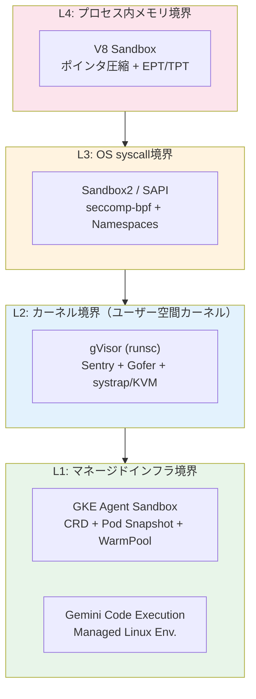

### 1-2. 技術選定マトリクス（上級者用）

| 選定軸 | GKE Agent Sandbox | Gemini Code Execution | gVisor/GKE | Sandbox2/SAPI | V8 Sandbox |
|---|:---:|:---:|:---:|:---:|:---:|
| **カーネル分離** | ◎（gVisor） | ◎（マネージド） | ◎（Sentry） | △（Seccomp） | △（プロセス内） |
| **ステートフル** | ◎（PVC + Snapshot） | ✗ | ○（PVC） | ✗ | N/A |
| **言語非依存** | ◎ | ✗（Python専用） | ◎ | ✗（C/C++専用） | ✗（JS/WASM） |
| **スループット** | 300 sand/sec | API quota依存 | ノード依存 | syscall latency依存 | N/A |
| **コールドスタート** | <1s（WarmPool） | ~数秒 | ~数秒 | μs（fork後） | N/A |
| **GPU/TPU対応** | ◎（gVisor v2）| ✗ | ○（注意点あり） | ✗ | N/A |
| **Kubernetesネイティブ** | ◎（CRD） | ✗ | ◎（RuntimeClass） | ✗ | N/A |
| **インフラ管理コスト** | 中（GKE管理） | 最小 | 中（GKE管理） | 高（自己実装） | 最小（自動） |

---

## 2. GKE Agent Sandbox

> **ステータス**: GA — 2026年5月20日 Google Cloud Next '26 にて発表（KubeCon NA 2025でプレビュー後）
> **APIグループ**: `extensions.agents.x-k8s.io/v1alpha1`

### 2-1. CRD階層の完全解剖

GKE Agent Sandboxは4つのCRDが連携してライフサイクルを管理する。PersistentVolumeClaimと同様のClaimモデルを採用し、リクエスト元（AIフレームワーク）と実装（Pod仕様）を分離する。

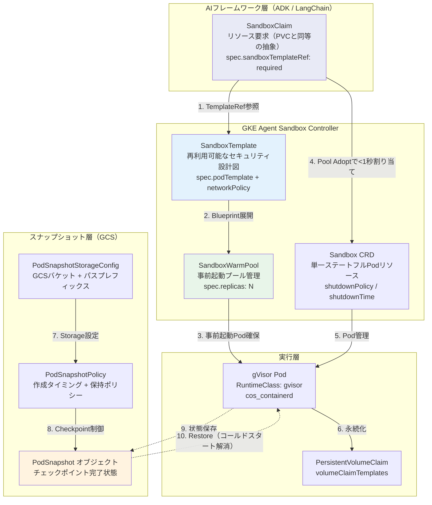

### 2-2. CRDスペック詳細

#### SandboxTemplate（設計図）

```yaml
apiVersion: extensions.agents.x-k8s.io/v1alpha1
kind: SandboxTemplate
metadata:
  name: python-agent-template
  namespace: agent-ns
spec:
  # NetworkPolicy: Kubernetes NetworkPolicy semantics準拠
  networkPolicy:
    egress:
      - ports:
          - port: 443    # HTTPS のみ許可
            protocol: TCP
      - ports:
          - port: 53     # DNS 許可
            protocol: UDP
    # ingressルールなし = デフォルト拒否
  podTemplate:
    spec:
      runtimeClassName: gvisor            # gVisor必須
      serviceAccountName: agent-sa        # Workload Identity
      automountServiceAccountToken: false # 明示的にfalse
      containers:
      - name: executor
        image: python:3.12-slim
        resources:
          limits:
            cpu: "2"
            memory: "4Gi"
          requests:
            cpu: "500m"
            memory: "1Gi"
        securityContext:
          runAsNonRoot: true
          runAsUser: 65534
          allowPrivilegeEscalation: false
          readOnlyRootFilesystem: true
          capabilities:
            drop: ["ALL"]
```

#### SandboxWarmPool（事前起動プール）

```yaml
apiVersion: extensions.agents.x-k8s.io/v1alpha1
kind: SandboxWarmPool
metadata:
  name: python-runtime-warmpool
  namespace: agent-ns
spec:
  replicas: 5                             # 常時5つのwarm Podを維持
  sandboxTemplateRef:
    name: python-agent-template
```

#### SandboxClaim（フレームワークからの要求）

```yaml
apiVersion: extensions.agents.x-k8s.io/v1alpha1
kind: SandboxClaim
metadata:
  name: task-execution-001
  namespace: agent-ns
spec:
  sandboxTemplateRef:
    name: python-agent-template
# → ControllerがWarmPoolから即時割り当て（<1秒）
```

#### Pod Snapshot — PodSnapshotStorageConfig

```yaml
apiVersion: podsnapshot.gke.io/v1
kind: PodSnapshotStorageConfig
metadata:
  name: cpu-pssc-gcs
  namespace: agent-ns
spec:
  gcsPath: gs://my-bucket/snapshots/agent/
---
apiVersion: podsnapshot.gke.io/v1
kind: PodSnapshotPolicy
metadata:
  name: cpu-psp
  namespace: agent-ns
spec:
  storageConfigRef:
    name: cpu-pssc-gcs
  snapshotOnPodReady: true    # Pod Ready時に自動スナップショット
  restoreOnPodCreate: true    # Pod作成時にスナップショットから復元
```

### 2-3. Pod Snapshotの仕組みとコールドスタート削減

gVisorのcheckpoint/restore（CRIU相当）機能を利用し、実行中のPod状態をGCSに永続化する。

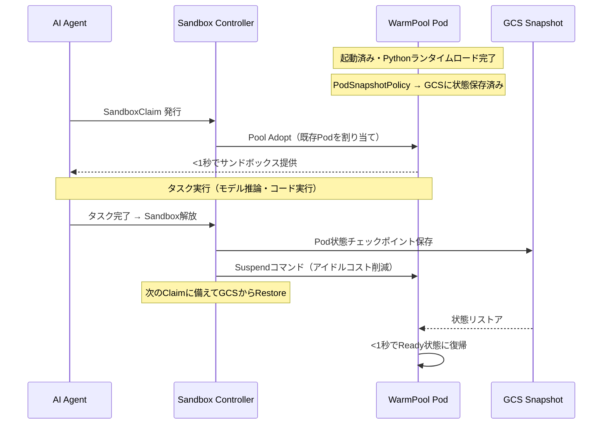

### 2-4. Agent Substrate（2026年5月 新発表）

Cloud Next '26 で発表されたエージェントインフラ密度を最大化する新OSS プロジェクト。GKE Agent Sandboxの上位コンポーネントとして位置づけられる。

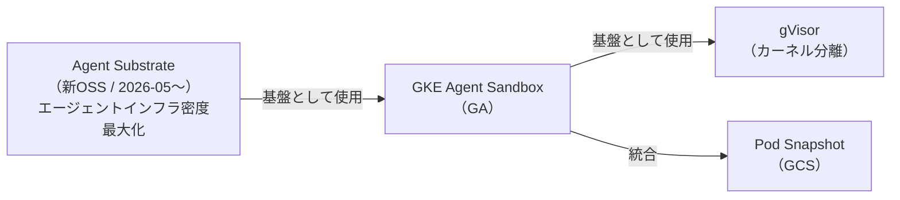

### 2-5. Python SDK による制御

```python
# pip install google-cloud-agent-sandbox
from google.cloud import agent_sandbox_v1

client = agent_sandbox_v1.AgentSandboxClient()

# SandboxClaim経由でサンドボックスを取得
claim = client.create_sandbox_claim(
    parent="projects/{project}/locations/{location}/clusters/{cluster}/namespaces/agent-ns",
    sandbox_claim={
        "sandbox_template_ref": {"name": "python-agent-template"}
    }
)

# サンドボックスが Ready になるまで待機
sandbox = client.wait_for_sandbox(claim.sandbox_ref)

# コード実行
result = sandbox.execute_code(
    code="import numpy as np; print(np.sqrt(2))",
    timeout=30
)
print(result.stdout)

# 解放
client.delete_sandbox_claim(name=claim.name)
```

### 2-6. セキュリティ・本番運用ベストプラクティス

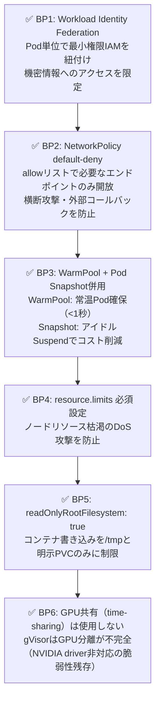

---

## 3. Gemini Code Execution

> **ステータス**: GA
> **APIリビジョン**: 2026-05-20（Interactions API 統合版）

### 3-1. Tool APIとしてのCode Executionの設計原則

Gemini Code Execution は「ツール」として提供される。モデルが自律的にコード生成→実行→結果確認のイテレーションを行うReActパターンを実装する。

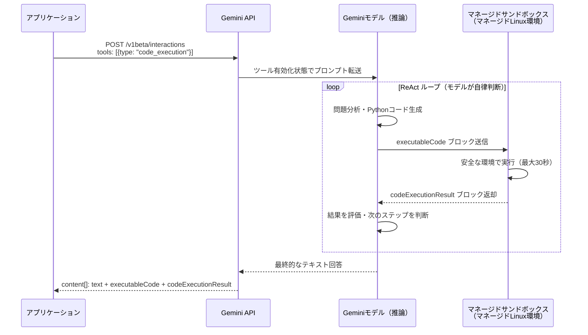

### 3-2. レスポンス構造の詳細解析

```python
from google import genai
from google.genai.types import Tool, ToolCodeExecution, GenerateContentConfig

client = genai.Client()

response = client.models.generate_content(
    model="gemini-2.5-flash",  # 推奨モデル（2026年6月時点）
    contents="データセット[1,4,9,16,25]の標準偏差と平均を求め、正規化せよ",
    config=GenerateContentConfig(
        tools=[Tool(code_execution=ToolCodeExecution())],
        temperature=0,      # 再現性確保
    )
)

# レスポンスの content[] は複数ブロックで構成される
for part in response.candidates[0].content.parts:
    if part.text:
        print(f"[TEXT] {part.text}")
    if part.executable_code:
        print(f"[CODE] language={part.executable_code.language}")
        print(part.executable_code.code)
    if part.code_execution_result:
        print(f"[RESULT] outcome={part.code_execution_result.outcome}")
        print(part.code_execution_result.output)
```

**レスポンス構造:**

| パートタイプ | フィールド | 説明 |
|---|---|---|
| `text` | `part.text` | モデルの説明テキスト |
| `executable_code` | `part.executable_code.code` | 生成されたPythonコード |
| `executable_code` | `part.executable_code.language` | 常に`PYTHON` |
| `code_execution_result` | `part.code_execution_result.outcome` | `OUTCOME_OK` / `OUTCOME_FAILED` / `OUTCOME_DEADLINE_EXCEEDED` |
| `code_execution_result` | `part.code_execution_result.output` | stdout + stderr |

### 3-3. 主要な制約事項と設計上の対策

| 制約 | 技術的背景 | 設計上の対策 |
|---|---|---|
| **タイムアウト 30秒** | マネージド環境のリソース保護 | 処理をチャンク分割し、複数ターンで連続実行 |
| **ファイルI/O 不可** | サンドボックス境界ポリシー | データはプロンプト内にインライン埋め込み、または Function Calling でファイル取得APIを実装 |
| **外部ネットワーク不可** | マネージド環境のネットワーク隔離 | Function Calling との組み合わせで外部API呼び出しを実装 |
| **Python専用** | マネージドランタイムの制約 | 他言語実行が必要な場合は GKE Agent Sandbox を採用 |
| **ステートレス** | マルチテナント隔離の要件 | マルチターン会話履歴でコンテキスト継続 |

### 3-4. Function Calling との組み合わせパターン

Code Execution（計算・分析）と Function Calling（外部I/O）を組み合わせることで、I/O制約を克服する。

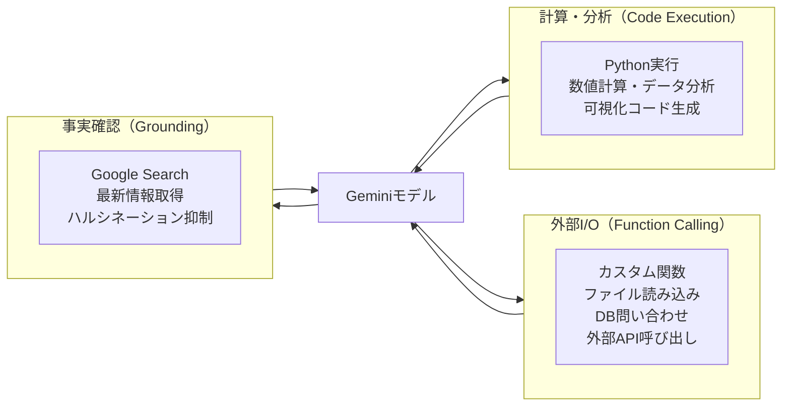

```python
# Function Calling + Code Execution の統合例
from google import genai
from google.genai import types

def load_csv_data(filepath: str) -> str:
    """CSVファイルを読み込んでJSON文字列で返す"""
    import pandas as pd
    return pd.read_csv(filepath).to_json()

tools = [
    types.Tool(code_execution=types.ToolCodeExecution()),
    types.Tool(function_declarations=[
        types.FunctionDeclaration(
            name="load_csv_data",
            description="ローカルCSVファイルを読み込む",
            parameters=types.Schema(
                type=types.Type.OBJECT,
                properties={"filepath": types.Schema(type=types.Type.STRING)},
                required=["filepath"]
            )
        )
    ])
]
```

### 3-5. Vertex AI 統合ベストプラクティス

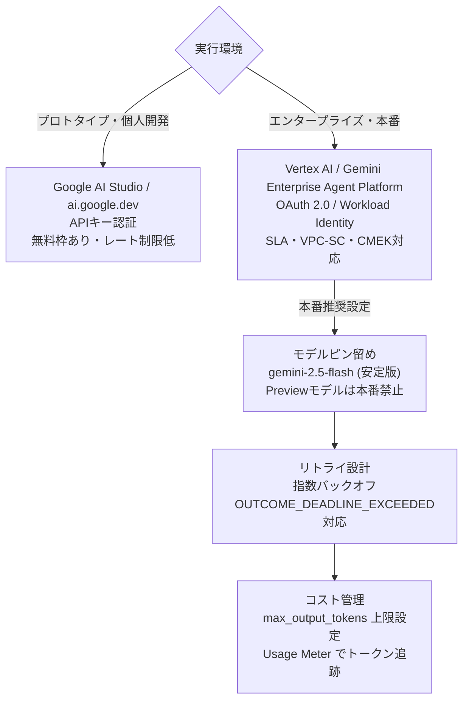

---

## 4. gVisor / GKE Sandbox

> **ステータス**: GA（GKE Agent Sandboxの基盤技術）
> **デフォルトPlatform**: systrap（2023年6月以降）

### 4-1. gVisor の3コンポーネントアーキテクチャ

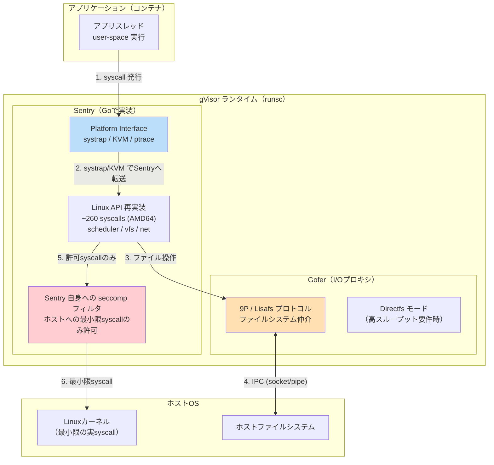

### 4-2. Platformバックエンドの選定

| Platform | 動作原理 | 本番推奨度 | 適合環境 | syscall オーバーヘッド |
|---|---|---|---|---|
| **systrap** | seccomp trap → SIGSYS シグナルでSentryへ | ✅ **デフォルト・推奨** | VM内・ベアメタル両対応 | 中（getpid: ~800ns） |
| **KVM** | KVM仮想化でSentryがGuest OS/VMMを兼任 | ✅ ベアメタルで最速 | ベアメタルのみ（ネストVM不可） | 低（getpid: ~200ns） |
| **ptrace** | PTRACE_SYSEMU でsyscall傍受 | ❌ 非推奨・廃止予定 | デバッグ用途のみ | 最大（getpid: ~7ms） |

**Platformの選択フロー:**

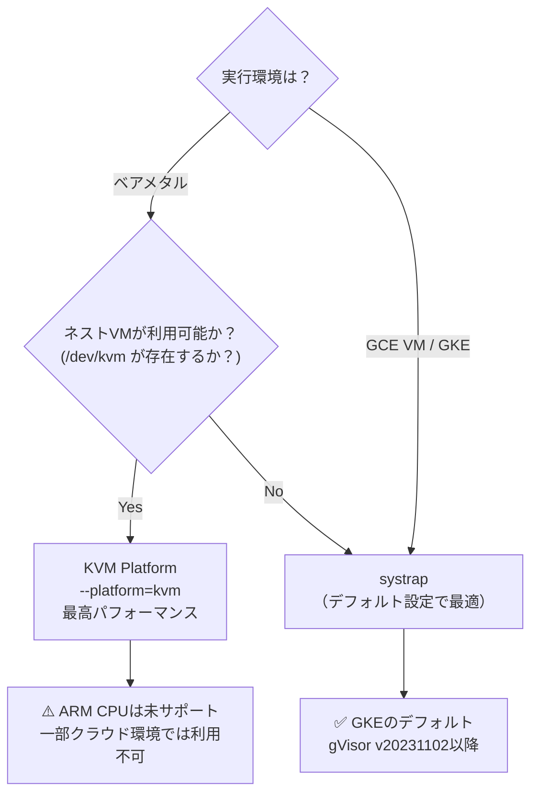

**runsc での Platform 指定（containerd config）:**

```toml
# /etc/containerd/config.toml
[plugins."io.containerd.runtime.v1.linux"]
  shim_debug = true

[plugins."io.containerd.grpc.v1.cri".containerd.runtimes.runsc]
  runtime_type = "io.containerd.runsc.v1"

[plugins."io.containerd.grpc.v1.cri".containerd.runtimes.runsc.options]
  TypeUrl = "io.containerd.runsc.v1.options"
  ConfigPath = "/etc/containerd/runsc.toml"
```

```toml
# /etc/containerd/runsc.toml
[runsc_config]
  platform = "systrap"        # または "kvm"
  file-access = "shared"      # Directfs有効化
  directfs = true             # ファイルシステムアクセスの高速化
  overlay = false
```

### 4-3. Sentry が実装する syscall の範囲

gVisor が実装する syscall はAMD64で約260個。以下に重要なカテゴリと実装状況を示す。

| カテゴリ | 主要 syscall | 実装状況 | 注意点 |
|---|---|---|---|
| **プロセス管理** | `fork`, `execve`, `exit`, `wait4` | ✅ 完全実装 | — |
| **ファイルI/O** | `read`, `write`, `open`, `close` | ✅ Gofer経由 | Directfs で高速化可 |
| **ネットワーク** | `socket`, `connect`, `send`, `recv` | ✅ 独自TCPスタック | パフォーマンス注意 |
| **メモリ管理** | `mmap`, `mprotect`, `brk` | ✅ 完全実装 | — |
| **シグナル** | `kill`, `sigaction`, `sigprocmask` | ✅ 完全実装 | — |
| **eBPF** | `bpf` | ❌ **未実装** | eBPF依存ツール使用不可 |
| **io_uring** | `io_uring_setup` | 部分実装 | 非推奨、要検証 |
| **Docker-in-Docker** | `clone(CLONE_NEWNS)` | ❌ **非対応** | ネストコンテナ実行不可 |
| **高度な ioctl** | 一部の`ioctl` | 部分実装 | デバイス固有 ioctl は要確認 |

### 4-4. セキュリティモデルの技術的詳細

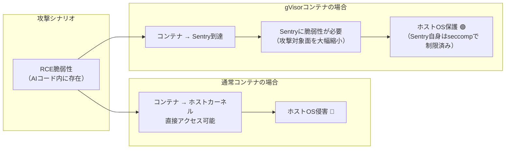

**重要な制約:**
- gVisor は **すべてのカーネル脆弱性を防ぐわけではない**（特にNVIDIA GPUドライバー脆弱性は対象外）
- Kata Containers（VMベース）より隔離強度は弱いが、軽量で起動が速い
- セキュリティ目標: Linuxカーネルへの直接接触面を最小化

---

## 5. Sandbox2 / SAPI

> **ステータス**: GA（OSS）
> **リポジトリ**: `github.com/google/sandboxed-api`

### 5-1. Sandbox2 のコンポーネントモデル

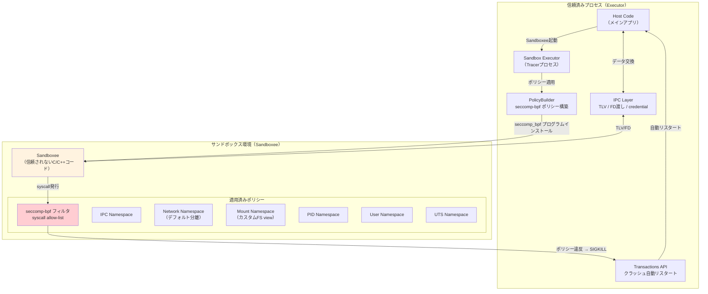

### 5-2. seccomp-bpf ポリシー設計の詳細

PolicyBuilderは3層のsyscallフィルタリングを提供する。

| PolicyBuilder メソッド | フィルタレベル | 用途 |
|---|---|---|
| `AllowSystemMalloc()` | 高レベル | メモリ確保系 syscall を一括許可 |
| `AllowRead()` / `AllowWrite()` | 中レベル | 読み書き系 syscall |
| `AllowSyscall(nr)` | 低レベル | 特定 syscall 番号を許可 |
| `AddPolicyOnSyscall(nr, bpf)` | 生 BPF | syscall + 引数レベルのフィルタ |
| `AddPolicyOnSyscalls(nrs, bpf)` | 生 BPF | 複数 syscall に同じルール適用 |
| `BlockSyscallsWithErrno(nrs, err)` | ブロック | 指定syscallをエラー返却で無害化 |

**PolicyBuilder による段階的ポリシー設計（C++）:**

```cpp
#include "sandboxed_api/sandbox2/policybuilder.h"

auto policy = sandbox2::PolicyBuilder()
    // === Level 1: 最小限の実行基盤 ===
    .AllowSystemMalloc()          // malloc/free (brk, mmap, munmap)
    .AllowRead()                  // read, pread, readv
    .AllowWrite()                 // write, pwrite, writev
    .AllowExit()                  // exit, exit_group
    .AllowStat()                  // stat, fstat, lstat

    // === Level 2: 対象ライブラリの要件 ===
    .AllowSyscall(__NR_futex)     // スレッド同期（マルチスレッドライブラリ）
    .AllowSyscall(__NR_clock_gettime) // タイムスタンプ取得

    // === Level 3: 引数レベルの精密制御 ===
    // read は fd=0（stdin）のみ許可
    .AddPolicyOnSyscall(__NR_read, {
        ARG_32(0),                // fd引数を検査
        JEQ32(0, ALLOW),         // fd==0 (stdin) なら許可
        KILL_PROCESS,             // それ以外は強制終了
    })

    // open は /tmp/safe_dir/ 以下のみ許可
    // （引数はポインタなのでpath-based allowlistは別途実装）

    // === Level 4: 危険な syscall を明示的ブロック ===
    .BlockSyscallsWithErrno({
        __NR_ptrace,              // デバッガ接続禁止
        __NR_process_vm_readv,   // 他プロセスメモリ読み取り禁止
        __NR_process_vm_writev,  // 他プロセスメモリ書き込み禁止
    }, EPERM)

    .BuildOrDie();
```

### 5-3. Namespace 構成と分離強度

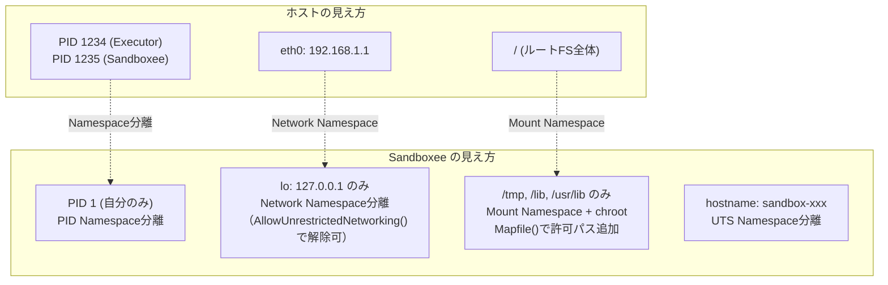

### 5-4. SAPI: 「一度書いたらどこでも」パターン

SAPI は Sandbox2 をラップし、C/C++ライブラリをRPC経由で呼び出す抽象化レイヤーを自動生成する。

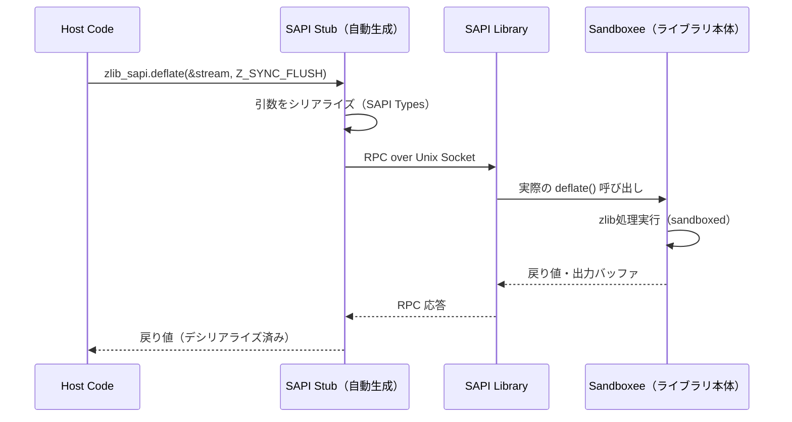

**Transactions API によるクラッシュ自動リスタート（C++）:**

```cpp
#include "sandboxed_api/transaction.h"

class ZlibTransaction : public sapi::Transaction {
 public:
  ZlibTransaction() : sapi::Transaction(std::make_unique<ZlibSandbox>()) {}

  absl::Status Run() override {
    SAPI_ASSIGN_OR_RETURN(int result, api_.deflate(&stream_, Z_SYNC_FLUSH));
    return absl::OkStatus();
  }
};

// クラッシュ時も自動リスタートされる
ZlibTransaction txn;
auto status = txn.Run();
// ポリシー違反 → Sandboxee が終了 → 次回Run()で自動リスタート
```

---

## 6. V8 Sandbox

> **ステータス**: 開発継続中（Chrome に段階的統合。Bug Bounty の対象セキュリティ境界）
> **設計ドキュメント**: `chromium.googlesource.com/v8/v8.git/+/refs/heads/main/src/sandbox/README.md`

### 6-1. V8 Sandbox が解決する問題の技術的背景

2021〜2023年のChromeゼロデイのうち60%がV8起因。V8の脆弱性の特徴は、UAF/OOBのような「古典的メモリ破壊」ではなく、JIT最適化の型混乱（Type Confusion）やロジックバグであり、メモリセーフ言語やMTE/CFIだけでは緩和が困難。

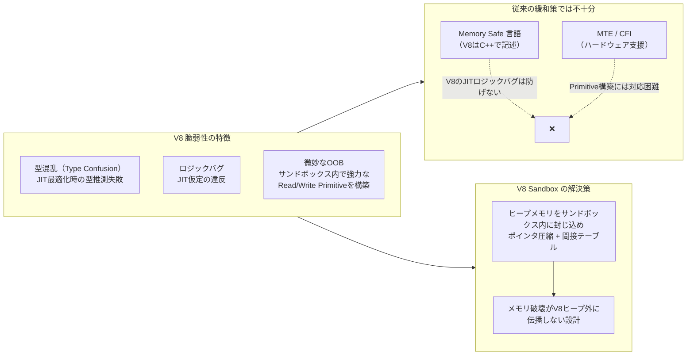

### 6-2. V8 Sandbox のメモリレイアウト

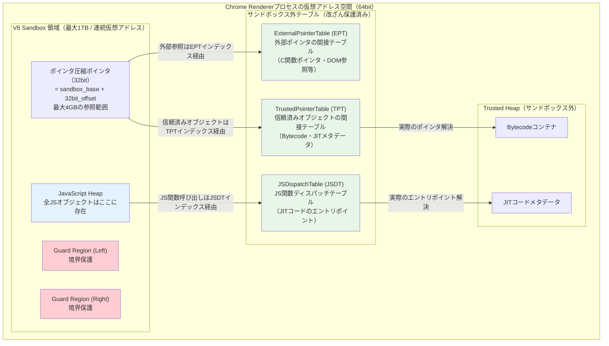

### 6-3. 3種類の間接テーブル（Pointer Table）の役割

| テーブル | 保護対象 | なぜ必要か | インデックスサイズ |
|---|---|---|---|
| **ExternalPointerTable (EPT)** | V8ヒープ外へのポインタ（C関数ポインタ、ArrayBuffer backing store等） | 攻撃者がヒープ内のポインタを改ざんしても、EPTを経由するため任意アドレスへのジャンプが不可能 | 32bit |
| **TrustedPointerTable (TPT)** | Bytecodeコンテナ・JITコードメタデータ（信頼済みヒープ上のオブジェクト） | JITコードの実行フロー改ざんを防止 | 32bit |
| **JSDispatchTable (JSDT)** | JS関数のディスパッチエントリポイント | 関数ポインタの改ざんによるRCEを防止 | 32bit |

**ポインタ圧縮の仕組み:**

```
// 攻撃前（通常の64bitポインタ）
uint64_t* evil_ptr = (uint64_t*)0xdeadbeef00000000; // 任意アドレスへ到達可能

// V8 Sandbox のポインタ圧縮後
// sandbox_base = 0x7f0000000000  (連続1TB仮想アドレスの先頭)
// compressed_ptr = 0x00001234    (32bitオフセット)
// 実際のアドレス = sandbox_base + compressed_ptr
//               = 0x7f0000001234  (サンドボックス内に限定)
// → 攻撃者がcompressed_ptrを最大値0xFFFFFFFFに改ざんしても
//   sandbox_base + 0xFFFFFFFF = 0x7f00ffffffff (まだサンドボックス内)
```

### 6-4. セキュリティ境界とスコープ

V8 Sandboxが守るもの・守らないものを明確に理解することが重要。

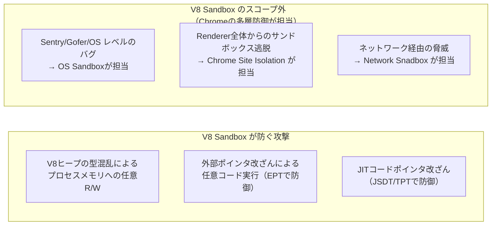

### 6-5. 開発者・セキュリティチーム向けアクションアイテム

| 役割 | 推奨アクション | 根拠 |
|---|---|---|
| **Chrome/Node.js 組み込みエンジニア** | V8ビルド時 `v8_enable_sandbox=true` を設定 | デフォルトは一部環境でfalse |
| **セキュリティ研究者** | V8 Sandboxのバイパスを発見した場合はChrome VRPへ報告（対象境界として認定済み） | Bug Bounty対象 |
| **エンタープライズセキュリティ** | Chrome Enterprise ポリシーで自動更新を強制（V8ゼロデイの迅速パッチ適用） | 2025年に8件のV8 CVEが野外悪用 |
| **Node.js でのサンドボックス実装** | `isolated-vm` パッケージ（V8 Isolate ベース）を使用し、各テナントに独立Isolateを割り当て | V8 Sandboxは同一プロセス内複数Isolate間の境界も提供 |

---

## 7. Privacy Sandbox — 廃止経緯と移行戦略

> ⛔ **ステータス**: **2025年10月17日 Google が全APIを正式廃止**

### 7-1. タイムライン

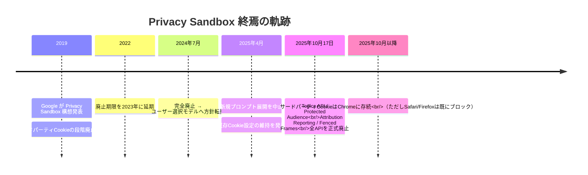

### 7-2. 廃止された主なAPI群と代替戦略

| 廃止されたAPI | 目的 | 2026年時点の代替アプローチ |
|---|---|---|
| **Topics API** | 関心カテゴリベースのターゲティング | ファーストパーティデータ + Customer Match |
| **Protected Audience** | リマーケティング（クロスサイト） | サーバーサイドオーディエンス + Consent Mode |
| **Attribution Reporting** | コンバージョン計測 | サーバーサイドタギング（GTM Server-Side） |
| **Fenced Frames** | 分離されたフレーム広告 | 標準 iframe（Cookie残存のため暫定的に不要） |

### 7-3. 移行アーキテクチャ：ファーストパーティデータ戦略

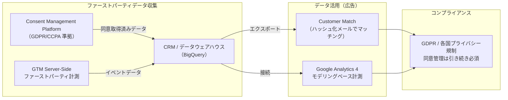

---

## 8. クロスカッティング：ゼロトラスト多層防御設計

Google が全サンドボックス技術を組み合わせる際の多層防御アーキテクチャ。

### 8-1. AIエージェント本番システムの参照アーキテクチャ

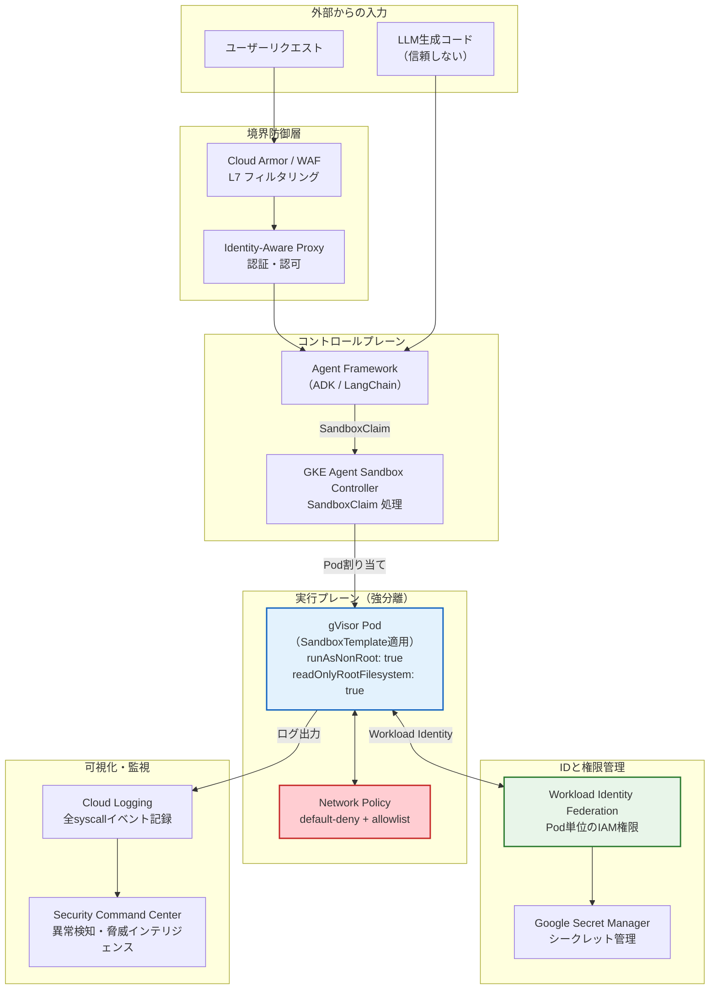

### 8-2. ISOLATE / RESTRICT / ACCELERATE の3原則

```mermaid
flowchart LR
    subgraph isolate["🔒 ISOLATE（封じ込め）"]
        I1["GKE Agent Sandbox (gVisor)<br/>信頼できないコードをカーネル分離"]
    end

    subgraph restrict["🚫 RESTRICT（最小権限）"]
        R1["Workload Identity Federation<br/>最小権限IAM"]
        R2["GKE Network Policy<br/>default-deny + allowlist"]
    end

    subgraph accelerate["⚡ ACCELERATE（性能維持）"]
        A1["SandboxWarmPool<br/>事前起動でコールドスタート解消"]
        A2["Pod Snapshot<br/>アイドルsuspendでコスト削減"]
    end

    isolate --> restrict --> accelerate
```

---

## 9. パフォーマンス・コスト比較マトリクス

### 9-1. コールドスタートレイテンシ比較

| 技術 | コールドスタート | WarmPool/最適化後 | 備考 |
|---|---|---|---|
| GKE Agent Sandbox (WarmPool) | ~数秒（新Pod） | **<1秒** | Pod Snapshot + WarmPool |
| GKE Agent Sandbox (Snapshot) | <1秒（GCSリストア） | <1秒 | GPU: Driver version一致が必要 |
| gVisor/GKE Sandbox（単体） | ~2〜5秒 | ~2〜5秒 | WarmPool未使用時 |
| Gemini Code Execution | ~1〜3秒（API往復） | ~1〜3秒 | マネージド、チューン不可 |
| Sandbox2/SAPI | μs（fork後） | μs | 起動は最速クラス |

### 9-2. syscall オーバーヘッド（gVisor Platform比較）

| Platform | getpid() レイテンシ | 実用的影響 | 推奨場面 |
|---|---|---|---|
| Native（参考値） | ~4ns | — | サンドボックスなし |
| **systrap（推奨）** | **~800ns** | CPU-bound: <3%、I/O-heavy: 10〜30% | GKE / VM環境デフォルト |
| KVM | ~200ns | CPU-bound: <1% | ベアメタルのみ |
| ptrace（廃止予定） | ~7ms | 実用不可（x350遅延） | デバッグのみ |

### 9-3. 技術別コスト構造

```mermaid
graph LR
    subgraph opex["運用コスト（OpEx）"]
        GAS_COST["GKE Agent Sandbox<br/>GKEノード + Sandbox管理 + GCS Snapshot"]
        GCE_COST["Gemini Code Execution<br/>API従量課金（トークン＋実行）"]
        GV_COST["gVisor単体<br/>GKEノード（+10〜30%のCPUオーバーヘッド）"]
        S2_COST["Sandbox2/SAPI<br/>OSS無料（自社サーバーコストのみ）"]
    end
    subgraph capex["開発コスト（CapEx）"]
        GAS_DEV["GKE Agent Sandbox<br/>低（CRD + Python SDK）"]
        GCE_DEV["Gemini Code Execution<br/>最低（API 1行）"]
        GV_DEV["gVisor単体<br/>中（RuntimeClass + securityContext）"]
        S2_DEV["Sandbox2/SAPI<br/>高（C++実装 + Policy設計）"]
    end
```

---

## 10. 公式リファレンス一覧

### GKE Agent Sandbox

| ドキュメント種別 | URL |
|---|---|
| **GA発表ブログ（2026/05/20）** | https://cloud.google.com/blog/products/containers-kubernetes/bringing-you-agent-sandbox-on-gke-and-agent-substrate |
| コンセプトドキュメント | https://cloud.google.com/kubernetes-engine/docs/concepts/machine-learning/agent-sandbox |
| セットアップガイド | https://cloud.google.com/kubernetes-engine/docs/how-to/how-install-agent-sandbox |
| Agent Sandbox Code Isolationガイド | https://cloud.google.com/kubernetes-engine/docs/how-to/agent-sandbox |
| **CRD リファレンス** | https://cloud.google.com/kubernetes-engine/docs/reference/crds/agentsandbox |
| Pod Snapshot ハウツー | https://cloud.google.com/kubernetes-engine/docs/how-to/agent-sandbox-pod-snapshots |
| Google Codelabs: AI Agents on GKE | https://codelabs.developers.google.com/codelabs/gke/ai-agents-on-gke |
| InfoQ: Cloud Next '26 レポート | https://www.infoq.com/news/2026/05/gke-agent-sandbox-hypercluster/ |

### Gemini Code Execution

| ドキュメント種別 | URL |
|---|---|
| **API リファレンス（generateContent）** | https://ai.google.dev/gemini-api/docs/code-execution |
| Interactions API リファレンス | https://ai.google.dev/gemini-api/docs/interactions/code-execution |
| Vertex AI / Enterprise Agent Platform | https://docs.cloud.google.com/gemini-enterprise-agent-platform/models/tools/code-execution |
| Function Calling ガイド | https://ai.google.dev/gemini-api/docs/interactions/function-calling |

### gVisor / GKE Sandbox

| ドキュメント種別 | URL |
|---|---|
| **GKE Sandbox 公式ドキュメント** | https://cloud.google.com/kubernetes-engine/docs/concepts/sandbox-pods |
| gVisor Platform ガイド | https://gvisor.dev/docs/architecture_guide/platforms/ |
| gVisor Performance ガイド | https://gvisor.dev/docs/architecture_guide/performance/ |
| **Systrap リリースブログ（2023）** | https://gvisor.dev/blog/2023/04/28/systrap-release/ |
| gVisor Production ガイド | https://gvisor.dev/docs/user_guide/production/ |

### Sandbox2 / SAPI

| ドキュメント種別 | URL |
|---|---|
| **Code Sandboxing 概要** | https://developers.google.com/code-sandboxing |
| **Sandbox2 設計解説** | https://developers.google.com/code-sandboxing/sandbox2/explained |
| SAPI 解説 | https://developers.google.com/code-sandboxing/sandboxed-api/explained |
| SAPI Getting Started | https://developers.google.com/code-sandboxing/sandboxed-api/getting-started |
| GitHub リポジトリ | https://github.com/google/sandboxed-api |

### V8 Sandbox

| ドキュメント種別 | URL |
|---|---|
| **V8 Sandbox 設計ブログ** | https://v8.dev/blog/sandbox |
| **ソースREADME（設計詳細）** | https://chromium.googlesource.com/v8/v8.git/+/refs/heads/main/src/sandbox/README.md |
| MoreVMs 2025 学術論文 | https://2025.programming-conference.org/details/MoreVMs-2025-papers/3/The-V8-Sandbox |

### Privacy Sandbox（廃止済み・歴史的記録）

| ドキュメント種別 | URL |
|---|---|
| 廃止発表の分析（2026年3月） | https://segwise.ai/blog/google-privacy-sandbox-shutdown-reason |
| 廃止経緯（2026年2月） | https://usercentrics.com/knowledge-hub/what-is-google-privacy-sandbox/ |
| Wikipedia（廃止タイムライン） | https://en.wikipedia.org/wiki/Privacy_Sandbox |

---

*本ドキュメントは 2026年6月12日時点の Google 公式情報・発表に基づいています。*
*各技術は急速に進化しており、最新情報は公式ドキュメントを参照してください。*
